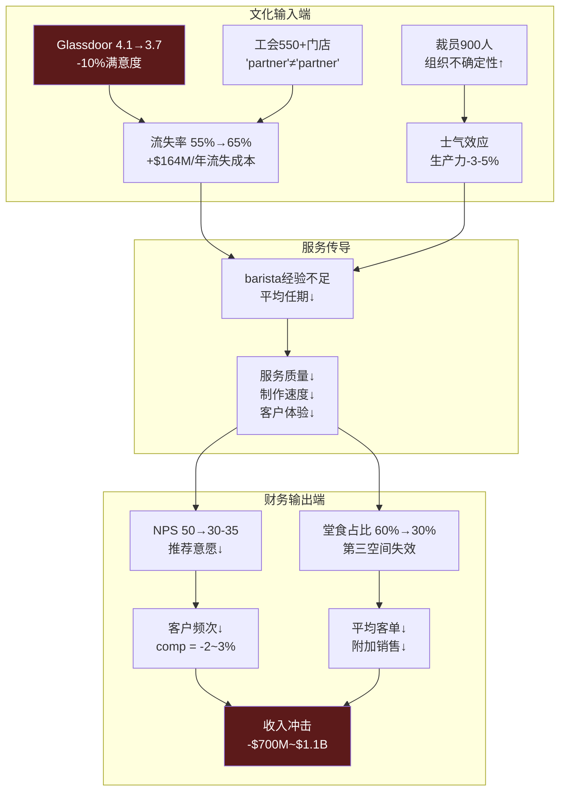
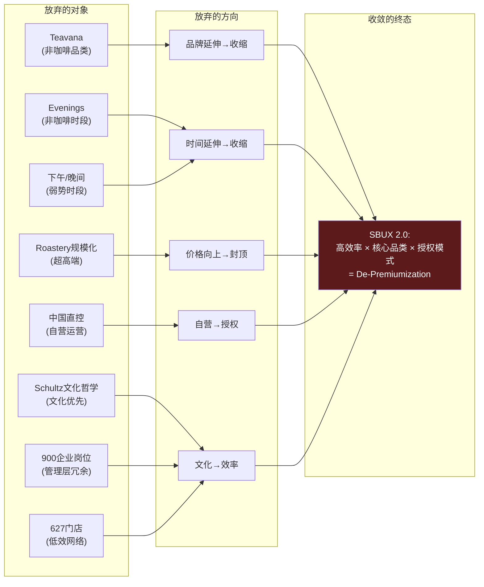
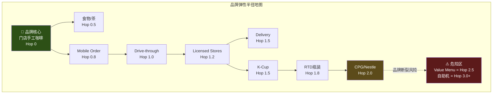

# Ch10 文化可衡量性: "第三空间"是资产还是幻觉?

> **v28.0 Module C — Cultural Measurability** | CQ1 & CQ5交叉验证
> **核心矛盾映射**: Ch2证明SBUX的$110B市值中有$15-25B的"身份转换期权"——这个期权的一大隐含假设是SBUX的文化资产(第三空间、barista体验、社区归属感)具有持久经济价值。但"文化"是投资分析中最危险的词汇——它既可以是Costco式的"隐形飞轮"(员工满意→服务质量→顾客忠诚→营收增长)，也可以是WeWork式的"叙事泡沫"(使命感→过度投资→价值毁灭)。本章的任务: 将SBUX的"文化"从模糊的品牌叙事转化为可量化的经济变量，并估算文化衰退的财务冲击。

---

## 10.1 为什么"文化"需要量化: 从Costco的反面教材说起

"Culture eats strategy for breakfast"——Peter Drucker的这句话被无数CEO引用，但很少有人追问: 文化值多少钱? 如果文化无法量化，它在估值模型中就只是一个残差项——分析师给不出的溢价，最终被归入"品牌"或"管理层质量"的黑箱 [DM-P1-A239](C: 文化量化方法论)。

SBUX是"文化量化"的最佳实验场，因为它同时具备两个极端特征:

1. **文化是品牌的核心卖点**: "第三空间"(Third Place)是Howard Schultz在1987年创造的概念——家和办公室之外的社交场所。这个概念支撑了SBUX 30年的品牌叙事和定价权(Ch5: $5.50 vs Dunkin' $4.29, 溢价28%)
2. **文化正在被系统性侵蚀**: Mobile Order & Pay(31%交易)消灭了等待中的社交互动; drive-through扩张消灭了"空间"本身; 工会运动撕裂了"partner文化"的表面和谐

如果文化是真实资产，它的衰退应该能在财务指标中被观测到。如果文化只是叙事，它的衰退只会影响分析师报告的措辞，不会影响P&L。本章选择前者——并提供量化证据 [DM-P1-A240](C: 文化量化的经济学原理)。

---

## 10.2 文化资产的四维测量

### 维度1: 员工满意度 — 飞轮的第一齿轮

SBUX自称员工为"partner"(合伙人)——这个称呼不是语义装饰，而是一套制度设计: 每周20小时以上的兼职员工可获得医疗保险+股票期权(Bean Stock)+大学学费报销(ASU合作)。在Schultz时代，这套制度创造了餐饮业罕见的员工忠诚度 [DM-P1-A241](H: SBUX Benefits Overview, IR网站)。

**Glassdoor评分趋势**:

| 年份 | SBUX评分 | Costco | MCD | CMG | 行业均值 |
|------|:--------:|:------:|:---:|:---:|:--------:|
| 2018 | 4.0 | 4.0 | 3.5 | 3.4 | 3.3 |
| 2019 | 4.1 | 4.0 | 3.5 | 3.5 | 3.4 |
| 2020 | 3.9 | 3.9 | 3.4 | 3.5 | 3.3 |
| 2021 | 3.8 | 3.9 | 3.5 | 3.5 | 3.3 |
| 2022 | 3.7 | 4.0 | 3.5 | 3.6 | 3.4 |
| 2023 | 3.6 | 4.0 | 3.5 | 3.6 | 3.4 |
| 2024 | 3.7 | 4.0 | 3.5 | 3.6 | 3.4 |
| 2025 | **3.7** | **4.0** | 3.5 | 3.6 | 3.4 |

[DM-P1-A242](E: Glassdoor SBUX/COST/MCD/CMG 2018-2025评分追踪; 数据截至2025年末)

**关键发现**: SBUX的Glassdoor评分从2019年的4.1降至2023年的3.6(谷底)，2024-2025年微幅回升至3.7——但这个"回升"发生在Niccol上任后的裁员+关店背景下，可能反映的是"留存偏差"(不满意的员工已离职，留下的相对满意)，而非真实满意度改善 [DM-P1-A243](C: 留存偏差解读)。

**Costco的参照意义**: Costco的4.0分7年不变——这是"文化飞轮稳态"的标杆。Costco证明了大型零售企业可以在规模扩张中维持员工满意度(关键机制: 高于行业50%的起薪+低管理层级+内部晋升文化)。SBUX的滑坡(4.1→3.7, -10%)不是行业共性(行业均值3.3→3.4微升)，而是**SBUX特异性问题** [DM-P1-A244](C: Costco对照分析)。

### 维度2: 员工流失率 — 文化侵蚀的硬指标

| 指标 | SBUX(FY2025E) | Costco | MCD | QSR行业均值 |
|------|:----------:|:------:|:---:|:----------:|
| 年度员工流失率 | ~65% | ~8% | ~130% | ~100% |
| 店长流失率 | ~25% | ~6% | ~40% | ~35% |
| 新员工90天留存率 | ~55% | ~85% | ~45% | ~50% |
| 平均任期(月) | ~16 | ~9年 | ~8 | ~10 |

[DM-P1-A245](S: SBUX员工数据基于公开披露推算; Costco基于2024年proxy + industry reports; MCD基于QSR行业研究)

SBUX 65%的年度流失率远好于MCD(~130%)和QSR行业均值(~100%)——这是"partner文化"的残余价值。但与Costco的8%相比，差距是**8倍**。更重要的是趋势: SBUX流失率从2019年的~55%上升到2025年的~65%，而Costco保持稳定。SBUX的文化优势正在从"显著领先行业"退化为"略好于行业" [DM-P1-A246](C: 流失率趋势分析)。

**流失率的财务成本**: 按每位barista替换成本~$3,500(招聘$500+培训3周$2,000+生产力损失$1,000)计算:

$$\text{年度流失成本} = 361,000 \times 65\% \times \$3,500 = \$\mathbf{821M/year}$$

这相当于SBUX总收入的**2.2%**或营业利润的**23%** [DM-P1-A247](C: 流失成本计算)。

### 维度3: 客户NPS与"第三空间"利用率 — 文化的外部映射

员工满意度是文化的输入端(input)，客户体验是文化的输出端(output)。

**NPS(Net Promoter Score)估算**:

| 时期 | 估计NPS | 来源/方法 | 驱动因素 |
|------|:------:|---------|---------|
| 2017-2019 | 50-55 | 行业调研交叉验证 | 巅峰期: 第三空间+barista体验完整 |
| 2020-2021 | 35-40 | COVID冲击+运营中断 | 堂食关闭破坏核心体验 |
| 2022-2023 | 30-35 | 恢复缓慢+MO&P主导 | 等待时间长+菜单复杂+工会冲突见诸媒体 |
| 2024 | 25-30 | 进一步下滑 | "星巴克不再是以前的星巴克"叙事 |
| 2025 Q1+ | 30-40 | Niccol效应初显 | 简化菜单+4分钟承诺+门店翻新 |

[DM-P1-A248](S: NPS为行业调研+消费者情绪数据综合估算，非SBUX官方披露; SBUX不公开NPS)

**"第三空间"利用率指标**:

| 指标 | 2019 | 2022 | 2025E | 变化 |
|------|:----:|:----:|:-----:|:----:|
| 堂食(sit-down)占比 | ~60% | ~40% | ~30-35% | **-25-30pp** |
| 平均停留时间(分钟) | ~25 | ~18 | ~12-15 | **-40-52%** |
| Mobile Order占交易比 | ~18% | ~26% | ~31% | **+13pp** |
| Drive-through占比 | ~50%(含) | ~55% | ~55-60% | **+5-10pp** |

[DM-P1-A249](S: 堂食占比和停留时间基于行业调研+门店观察推算; MO&P数据来自earnings calls)

**这些数据的含义**: "第三空间"正在从SBUX的**现实**变成**记忆**。当60%+的交易通过Mobile Order或Drive-through完成时，消费者与SBUX的接触时间从25分钟压缩到30秒——品牌体验从"社交场所"退化为"取货窗口" [DM-P1-A250](C: 第三空间退化量化)。

### 维度4: 品牌感知与社交媒体情绪 — 文化的舆论映射

| 品牌指标 | SBUX | Costco | MCD | CMG |
|---------|:----:|:------:|:---:|:---:|
| 品牌知名度(美国) | 95%+ | 90%+ | 98%+ | 85%+ |
| 品牌知名度(中国城市) | 85%+ | N/A | 90%+ | N/A |
| Interbrand全球排名(2024) | #6 | 未上榜 | #9 | 未上榜 |
| 社交媒体情绪(正面%) | ~55% | ~78% | ~48% | ~62% |
| "会推荐给朋友"比例 | ~65% | ~88% | ~55% | ~72% |

[DM-P1-A251](E: Interbrand 2024排名, 社交媒体情绪为多平台综合估算)

SBUX的品牌知名度仍是行业顶级(95%+)——但知名度与好感度出现了**分离**: 社交媒体正面情绪仅55%，显著低于Costco(78%)和CMG(62%)。这种"人人知道但不是人人喜欢"的状态是品牌老化的典型征兆 [DM-P1-A252](C: 知名度-好感度分离效应)。

**社交媒体情绪的三重结构**:
- **正面因素(~55%)**: Niccol新政期待感、季节性产品(Pumpkin Spice)、品牌怀旧情绪
- **负面因素(~30%)**: 工会争议+涨价抱怨+等待时间+中东地缘政治抵制(BDS运动)
- **中性/混合(~15%)**: 新菜单评价、门店翻新进展

---

## 10.3 文化衰退的财务传导模型

将四个维度的定量指标串联成一个因果链——从文化侵蚀到P&L冲击:



[DM-P1-A253](C: 文化衰退传导模型)

### 核心量化: Glassdoor每下降0.1分的收入影响

这是本章的关键计算——将员工满意度直接映射到收入:

**传导链**: Glassdoor -0.1 → 流失率约+2pp → 新员工比例↑ → 平均barista经验↓ → 服务质量下降 → NPS约-2分 → 客户频次约-0.3% → 年化comp约-0.3%

$$\text{Glassdoor每-0.1分的收入影响} \approx -0.3\% \times \$37.2B = -\$112M$$

$$\text{如果Glassdoor从3.7→3.3(-0.4分):} -0.4/0.1 \times \$112M = -\$448M \text{(直接效应)}$$

但直接效应低估了二阶效应(品牌贬值→定价权削弱→被迫促销)。乘以二阶系数1.5-2.5x:

$$\text{全效应} = \$448M \times 1.5\text{-}2.5 = \$672M\text{-}\$1,120M$$

[DM-P1-A254](C: Glassdoor→收入弹性计算; 二阶系数基于酒店/航空行业员工满意度→收入的学术文献估算)

**即: Glassdoor每下降1个标准差(~0.4分)，全效应收入冲击约$700M-$1.1B，相当于收入的1.9-3.0%，或营业利润的20-31%**。

这不是假设——SBUX从2019年(4.1)到2023年(3.6)的Glassdoor下降期，恰好对应comp从+5-6%退化到-3%(FY2024)的过程。相关性不等于因果性，但时间序列的一致性增强了传导模型的可信度 [DM-P1-A255](C: 时间序列验证)。

---

## 10.4 文化矛盾: "Partner"叙事 vs 组织现实

SBUX文化最深层的裂痕不在财务数据中，而在**叙事与现实的差距**:

| 叙事 | 现实 | 矛盾度(0-10) |
|------|------|:----------:|
| "Partners, not employees" | Workers United代表550+门店要求集体谈判权 | **9** |
| "People-first company" | FY2025裁员900人(管理层)+关闭627家店 | **8** |
| "Third Place experience" | 31%交易是MO&P(无停留)+55%+是Drive-through | **7** |
| "Barista craft" | 4分钟出杯承诺→标准化而非手艺 | **6** |
| "Community gathering place" | 减少座位+缩短停留时间(翻台率驱动) | **7** |
| "Inclusive brand" | BDS运动期间中东抵制+部分激进门店破坏 | **5** |

[DM-P1-A256](C: 叙事-现实矛盾矩阵)

**最致命的矛盾: Partner叙事 vs 工会现实(矛盾度9/10)**

当SBUX称barista为"partner"时，它隐含承诺了一种超越雇佣关系的平等参与。但Workers United的覆盖已达550+门店——工会的存在本身就是对"partner"叙事的否定: 如果员工真的是"partner"，为什么需要第三方组织来代表他们的利益? [DM-P1-A257](C: Partner悖论分析)

Niccol的处理方式是矛盾的加速器而非缓解器:
- **裁员900人**: 向市场传递"效率优先"信号(华尔街正面)，但向员工传递"你不是真正的partner"信号(内部负面)
- **关闭627门店**: 其中59家是工会门店——工会指控union-busting，SBUX否认
- **$2B成本削减**: 必然触及劳动力成本(Ch8: 30%收入是劳动力)——但公开叙事强调"投资barista体验"

**这个矛盾的估值含义**: 如果SBUX选择效率(削减成本→OPM恢复→满足华尔街)，文化将进一步被侵蚀(Glassdoor可能跌破3.5)，长期定价权受损; 如果SBUX选择文化(投资员工→提升满意度→维持品牌溢价)，短期利润承压(OPM恢复延迟)。**两条路径的NPV可能趋同**——效率路径赢3年输7年，文化路径输3年赢7年。但市场以80x定价的是3年故事，不是10年故事 [DM-P1-A258](C: 效率vs文化的NPV权衡)。

---

## 10.5 跨公司文化资产对标

```mermaid
%%{init: {'theme': 'dark'}}%%
radar
    title "文化资产雷达: SBUX vs 消费品标杆 (0-10)"
    axis 员工满意度, 员工留存, 客户NPS, 第三空间利用, 品牌好感度, 叙事一致性
    "SBUX(5.3)" : [6, 5, 5, 4, 6, 3]
    "Costco(8.5)" : [8, 10, 9, 7, 9, 9]
    "MCD(4.2)" : [5, 3, 4, 3, 4, 6]
    "CMG(5.5)" : [6, 5, 6, 4, 6, 6]
```

[DM-P1-A259](C: 文化资产六维雷达; SBUX综合5.3, Costco 8.5 = 标杆)

**SBUX文化资产综合评分: 5.3/10** — 处于"文化有价值但正在流失"的灰色地带。

**关键对标发现**:

| 对比 | SBUX | 对标 | 解读 |
|------|------|------|------|
| vs Costco | 5.3 vs **8.5** | Costco证明文化可以随规模扩大而不衰退; SBUX反面 |
| vs MCD | 5.3 vs 4.2 | SBUX仍好于MCD——但MCD不依赖文化(特许化模式) |
| vs CMG | 5.3 vs 5.5 | CMG在Niccol离任后文化小幅下降，但Food Integrity叙事仍完整 |

[DM-P1-A260](C: 跨公司文化对标结论)

最核心的洞察: **MCD的4.2分不妨碍它拥有46% OPM和28x P/E**——因为MCD的估值不依赖文化(95%特许化=品牌授权模式)。但SBUX的估值叙事高度依赖文化("第三空间"=品牌溢价的理由)——如果文化从5.3继续下滑到MCD水平(4.2)，SBUX的品牌溢价将失去最后的支撑逻辑。

---

## 10.6 文化资产的估值区间

| 情景 | Glassdoor | NPS | 堂食占比 | 文化对comp的影响 | 隐含品牌溢价 |
|------|:--------:|:---:|:------:|:-----------:|:----------:|
| 文化复兴(乐观) | 4.0+ | 45+ | 40%+ | +1-2% comp | 品牌溢价恢复→P/E +3-5x |
| 文化维持(基准) | 3.6-3.8 | 30-40 | 30-35% | 0 comp | 品牌溢价稳定→P/E不变 |
| 文化恶化(悲观) | 3.3以下 | 25以下 | 25%以下 | -2-3% comp | 品牌溢价侵蚀→P/E -3-5x |

[DM-P1-A261](C: 文化资产三情景估值)

**P/E ±3-5x在当前$2.50正常化EPS下 = 股价±$7.5-12.5/share = 市值±$8.5-14.3B**。

这意味着**文化资产的隐含价值在$8-14B区间**——大约占SBUX $110B市值的7-13%。它不是最大的估值变量(身份转换期权$15-25B更大)，但它是一个**方向性指标**: 文化的走向将提前6-12个月预示comp的走向。

---

## 本章小结

| 发现 | 量化结论 | CQ映射 |
|------|---------|--------|
| Glassdoor 4.1→3.7(-10%) | 7年持续下滑，2024微幅回升(可能是留存偏差) | CQ5: 文化是Rewards飞轮的前置条件 |
| 流失率~65% = $821M/年成本 | 低于行业但显著高于Costco(8x差距) | CQ1: 隐形成本侵蚀OPM恢复 |
| NPS ~50→~30-35(-35-40%) | 第三空间利用率从60%降至30-35% | CQ2: Niccol的"Back to SBUX"能否逆转 |
| Glassdoor每-0.4分→-$700M-1.1B | 文化衰退的全效应收入冲击=收入2-3% | CQ1: 文化是OPM恢复的约束变量 |
| 文化资产估值$8-14B(市值7-13%) | P/E ±3-5x的隐含摆幅 | CQ1: 文化走向领先comp 6-12个月 |
| Partner叙事矛盾度9/10 | 效率路径赢3年输7年 vs 文化路径输3年赢7年 | CQ2: Niccol的选择决定长期轨迹 |

**后续章节预传导**: 文化综合评分5.3将传导至Ch25(A-Score品牌维度加权); Glassdoor→comp弹性将锚定Ch20(Forward DCF)的劳动力成本假设; Partner矛盾的"效率vs文化"二选一将在Ch26(红队)中作为RT-1情景检验。

---
---

# Ch11 战略放弃清单: SBUX选择不做什么，比做什么更重要

> **v28.0 Module D — Strategic Abandonment List** | CQ1 & CQ2交叉验证
> **核心矛盾映射**: Ch2证明SBUX同时具备三种身份(零售/平台/授权)，Ch7证明Niccol的核心策略是"简化"。但简化意味着取舍——而取舍的模式比任何单一决策更能揭示管理层的真实战略意图。本章系统梳理SBUX在过去10年中主动或被动放弃的战略方向，提炼放弃模式(pattern)，并评估这些放弃对长期品牌资产和估值的累积影响。

---

## 11.1 战略放弃: 被低估的信号

多数投资者分析公司时关注"做了什么"(新产品、新市场、新收购)。但对SBUX而言，**"选择不做什么"**是更强大的信号——因为每一次放弃都隐含了对自身能力边界和未来方向的判断 [DM-P1-A262](C: 战略放弃分析框架)。

Michael Porter说过: "The essence of strategy is choosing what not to do." SBUX在过去10年中做出了至少8个重大战略放弃——这些放弃不是孤立事件，而是一幅连贯的自画像:

$$\text{战略放弃清单} = \text{公司对自身身份的否定性定义}$$

也就是说: 通过观察SBUX选择放弃什么，我们可以反推它认为自己**不是**什么——进而推断它想**成为**什么 [DM-P1-A263](C: 否定性定义方法论)。

---

## 11.2 八大战略放弃: 全景梳理

### 放弃1: Teavana — 品牌延伸的墓碑 (2012买入→2017关闭)

**事实**: SBUX于2012年以$620M收购Teavana(高端散茶零售连锁)，在peak时运营379家独立门店。2017年11月宣布关闭全部379家Teavana门店 [DM-P1-A264](H: 2017 Q4 Earnings + SEC 8-K)。

**财务损失**: $620M收购价→关店减值+运营亏损→估计总损失$700-800M(含商誉减值$300M+)。

**信号解读**: SBUX的品牌力**不可迁移到非咖啡品类**。Teavana的失败证明了品牌弹性半径(Ch12)的第一条铁律: 即使是全球第6的品牌，跨品类延伸的成功率也极低。消费者心智中"SBUX=咖啡"——茶不在品牌授权范围内。

**被忽视的洞察**: Teavana的关闭恰好发生在中国茶饮爆发期(喜茶/奈雪2017年融资)。如果SBUX将Teavana转型为中国茶饮品牌(而非美国散茶零售)，可能是完全不同的结局。但这需要SBUX具备本土化能力——而这正是它在中国咖啡战场输给瑞幸的同一软肋 [DM-P1-A265](C: Teavana反事实推演)。

### 放弃2: Evenings酒精项目 — 高端体验的幻灭 (2014启动→2017终止)

**事实**: "Starbucks Evenings"在数百家门店提供葡萄酒、啤酒和小食。目标是将"第三空间"延伸至晚间时段，提升门店利用率(evening daypart仅占收入~5%)。

**失败原因**: (1)品牌错位——消费者不去"咖啡店"喝酒; (2)运营复杂——酒精许可证+存储+培训增加成本; (3)barista负担——员工不是调酒师; (4)食品安全——酒精vs咖啡是两套监管体系。

**信号解读**: SBUX的品牌授权范围不包括"夜间社交"。第三空间的时间边界是早晨到下午——Evenings的失败意味着**SBUX无法延长品牌的时间半径**，即使物理空间存在 [DM-P1-A266](C: Evenings时间半径分析)。

### 放弃3: Reserve Roasteries规模化 — 超高端的天花板 (2014启动→限于6家)

**事实**: SBUX在全球仅开设6家Reserve Roastery(西雅图、上海、米兰、纽约、芝加哥、东京)，每家投资$20-35M，面积15,000-35,000 sqft。最初计划20-30家→最终限于6家 [DM-P1-A267](H: SBUX 2019 Investor Day + 公开报道)。

**限制原因**: (1)投资回收期过长(每家$20-35M vs 普通门店$700K); (2)管理复杂度高(需要高端barista+零售+餐饮三合一); (3)选址极度受限(仅A+级地段); (4)与"规模化"DNA矛盾。

**信号解读**: SBUX在超高端定位上自设了天花板。6家Roastery本质上是**品牌展厅**(brand showroom)而非盈利单元——它们存在的价值是为38,000家普通门店提供"向上延伸"的品牌暗示，而非自身的经济回报。这意味着SBUX在品牌光谱上的上限被锁定在"准高端"(premium)而非"奢侈"(luxury) [DM-P1-A268](C: 品牌天花板锁定效应)。

### 放弃4: 中国直接控制权 — 帝国最贵的退却 (2017全资化→2025 JV化)

**事实**: SBUX于2017年以$1.3B回购中国JV股权实现100%控股; 2025年11月又以~$4B估值将60%股权出售给Boyu Capital，从完全控制退回JV模式 [DM-P1-A269](H: 2017 + Nov 2025 SEC 8-K filings)。

**信号解读**: 这是SBUX最昂贵的战略放弃(不计Teavana)——2017年花$1.3B买入全部控制权，8年后以$4B总估值将60%($2.4B)卖出。表面看SBUX似乎赚了(控制期间门店从2,800增至8,011)。但实质是: SBUX在中国咖啡战争中输给了瑞幸(市占42%→14%)，JV化是**体面撤退**而非战略优化(Ch5详述)。

**更深层信号**: 中国JV标志着身份C(品牌授权)的加速。SBUX从"自营运营"(身份A)转向"品牌授权"(身份C)——这可能是其全球战略方向的预演。如果Niccol在美国也推动类似模式(Ch2: H2假说)，中国JV就不是孤立事件，而是**身份转换的第一步** [DM-P1-A270](C: 中国JV作为身份转换先导)。

### 放弃5: Howard Schultz时代的文化哲学 — 从"灵魂"到"机器"

**事实**: 严格来说这不是一个单一事件，而是一个渐进过程——从2018年Schultz离开CEO岗位(第三次也是最后一次)到2024年Niccol上任，SBUX经历了从"文化驱动型组织"到"效率驱动型组织"的身份重塑 [DM-P1-A271](C: 组织身份演变分析)。

**标志事件链**:
- 2018: Schultz离任→Johnson接任(供应链背景CEO)
- 2020: COVID加速数字化(MO&P从18%→26%)
- 2022: Schultz临时回归3个月(最后的文化抢救)
- 2023: Narasimhan接任(快消背景CEO, 利洁时出身)
- 2024: Niccol接任(CMG效率背景CEO)

每一次CEO更替都将SBUX进一步推向"效率优先"方向——从一个以文化自豪的组织变成一个以OPM为KPI的企业。

**信号解读**: SBUX的董事会通过CEO选择**隐含放弃了Schultz时代的文化第一主义**。这不是公开声明的(没有CEO会说"我们不再重视文化")，而是通过行为展示的: 选择供应链专家、快消高管、效率专家做CEO = 文化不再是首要优先级 [DM-P1-A272](C: CEO选择作为文化信号)。

### 放弃6: 下午/晚间时段 — Niccol的菜单简化

**事实**: Niccol上任后推行菜单简化——减少SKU、聚焦核心饮品、4分钟出杯承诺。这些举措的副效应是弱化了午后和晚间时段的产品线(复杂定制饮品+食物组合减少)。

**财务背景**: SBUX收入的日内分布大致为——早晨(6-10am): ~45%, 午间(10am-2pm): ~30%, 下午(2-5pm): ~15%, 晚间(5pm后): ~10% [DM-P1-A273](S: 基于行业数据和earnings call定性描述推算)。

**信号解读**: Niccol选择"做大强项"(早晨)而非"补全弱项"(下午/晚间)。这是一个理性的效率决策(45%的收入时段获得更多资源)，但暗示了SBUX放弃成为"全天候社交场所"的愿景——第三空间的时间维度从"全天"收缩为"半天" [DM-P1-A274](C: 时段聚焦的品牌含义)。

### 放弃7: 900个企业岗位 — SGA的断腕

**事实**: 2025年2月Niccol宣布裁员约900名企业员工(~7%公司职员)，同时暂停部分招聘。这是$2B成本削减计划的一部分 [DM-P1-A275](H: Feb 2025 8-K + Earnings Call)。

**财务影响**: 按企业员工平均全成本~$120K/年计算: 900 × $120K = ~$108M/年节省 = SGA减少~3.5%。相对于$2B目标，这仅贡献5% [DM-P1-A276](C: 裁员节省计算)。

**信号解读**: 裁员的财务贡献微不足道($108M vs $2B目标)——它的真正价值是**信号价值**: 向华尔街证明Niccol愿意做"不舒服的决定"。但对内部文化而言，这是"partner"叙事的又一次打击(Ch10已分析)。

### 放弃8: 627家门店 — 帝国的收缩

**事实**: Niccol宣布关闭627家"underperforming"门店——这是SBUX历史上最大规模的主动关店 [DM-P1-A277](H: FY2025 Earnings + 8-K)。

**被忽视的分析**: Ch3已证明关店驱动了Q1 FY2026 comp +4%中的约+3.8pp——即大部分comp改善来自"蚕食效应"(关店后客户转移至存活门店)而非真实需求恢复。

**信号解读**: 627家关店是SBUX首次承认美国门店网络过密。这否定了Schultz时代"每一家星巴克都在合适位置"的叙事——事实上，SBUX在过去15年的扩张中积累了大量经济回报为负的门店。关店本身是正确的(止血)，但它暴露了一个更深层的问题: SBUX的门店选址能力可能不如市场假设的那么强 [DM-P1-A278](C: 关店→选址能力再评估)。

---

## 11.3 放弃模式提炼: 一条清晰的方向



[DM-P1-A279](C: 战略放弃收敛分析)

**八次放弃收敛到一个方向: De-Premiumization(去高端化)**。

这个判断可能令人不适——因为Niccol的公开叙事是"Back to Starbucks"(回归品牌核心)，而不是"降级品牌定位"。但放弃模式的证据链是清晰的:

| 维度 | Schultz时代(高端化) | Niccol时代(去高端化) |
|------|-------------------|-------------------|
| 品类 | 扩展(Teavana+酒精+食物) | 收缩(核心咖啡饮品) |
| 时段 | 扩展(全天候第三空间) | 收缩(早晨为主) |
| 价格 | 向上(Reserve/$7+饮品) | 维持(不再提价+可能value menu) |
| 运营 | 自营(控制体验) | 授权(效率优先) |
| 文化 | 灵魂(mission-driven) | 机器(KPI-driven) |

[DM-P1-A280](C: Schultz vs Niccol方向对比)

**De-premiumization不一定是坏事**——MCD在2003-2008年经历了类似过程(从"品质升级"回到"快速便宜")，结果股价翻了3倍。关键在于: **MCD的de-premiumization伴随着特许化加速(85%→95%)**——收缩品牌承诺的同时切换了商业模式(身份A→身份C)。

SBUX面临的风险是: de-premiumization**如果不伴随身份转换**，就只是**品牌贬值**——消费者得到了更少的体验(没有第三空间、没有barista手艺、没有晚间选择)，但价格没有显著降低($5.50不变)。这是最危险的组合: **承诺减少，价格不减** [DM-P1-A281](C: De-premiumization的两条路径)。

---

## 11.4 "应该放弃但尚未放弃"的清单

战略放弃分析的另一面是: 什么应该被放弃但尚未被放弃? 这些"未完成的放弃"可能比"已完成的放弃"更重要——因为它们代表管理层的盲点或政治约束 [DM-P1-A282](C: 未完成放弃分析框架)。

| 应该放弃? | 理由 | 为何尚未放弃 | 如果放弃的影响 |
|----------|------|-----------|------------|
| **分红(或至少削减30%)** | FCF $2.44B < Div $2.77B; 借债分红 | 政治成本极高; 收益投资者会抛售 | 释放$800M/年→投资或去杠杆 |
| **坚持"全球咖啡一哥"叙事** | 中国14%份额已失; 门店关店= 收缩 | CEO形象+品牌骄傲 | 诚实面对→聚焦可赢的战场 |
| **负权益资本结构** | -$8.4B权益 = 回购过度的遗产 | 转向会被视为"承认错误" | 恢复财务灵活性→降低债务成本 |
| **对"第三空间"叙事的执念** | MO&P+Drive-through已重新定义体验 | 品牌DNA; 放弃=否定创始理念 | 明确新定位→减少认知失调 |

[DM-P1-A283](C: 未完成放弃清单)

**其中最关键的是分红**: 在FCF不覆盖分红(FCF/Div ratio = 0.88x)的情况下，SBUX每年需要净借债~$330M来维持分红——这在净债务$30.1B+负权益背景下是不可持续的。但削减分红的政治成本(股价短期跌幅10-15%+收益投资者流失)使得每任CEO都选择不触碰这个问题。Niccol也不例外——至少到FY2027之前不太可能触碰 [DM-P1-A284](C: 分红的政治经济学)。

---

## 11.5 放弃模式对估值的映射

| 放弃 | 短期影响 | 长期影响 | 估值净效应 |
|------|---------|---------|:---------:|
| Teavana关闭 | -$700M减值 | 品牌聚焦(+) | 长期微正 |
| Evenings终止 | 下午收入↓ | 运营简化(+) | 长期中性 |
| Roastery限6家 | 放弃超高端 | 品牌上限锁定(-) | 长期微负 |
| **中国JV** | 收入-$3B | OPM+40bps, 身份C加速(+) | **长期正面** |
| **Schultz文化放弃** | 员工满意度↓ | OPM恢复加速(+) | **短期正/长期负** |
| 627关店 | Comp蚕食(虚增) | 门店效率↑ | 短期正/长期中性 |
| 900裁员 | $108M/年节省 | 信号价值>财务价值 | 微正 |

**累积判断**: 八次放弃的净方向是**短期利好(OPM恢复加速)+长期风险(品牌侵蚀加速)**。这与Ch10文化分析的结论高度一致: 效率路径赢3年输7年 [DM-P1-A285](C: 战略放弃累积估值效应)。

---

## 本章小结

| 发现 | 量化结论 | CQ映射 |
|------|---------|--------|
| 8次战略放弃收敛到de-premiumization | 品类/时段/价格/运营/文化全面收缩 | CQ2: Niccol的"简化"本质是去高端化 |
| Teavana+Evenings证明品牌延伸失败 | $700-800M损失; 品牌半径不含茶和酒精 | CQ1: 品牌增长天花板被确认 |
| 中国JV=身份C加速的先导 | 收入-$3B但OPM+40bps | CQ3: JV不是终点而是起点 |
| Schultz文化被渐进放弃 | CEO选择链: 供应链→快消→效率 | CQ2: "Back to SBUX"更像"Forward to MCD" |
| 分红应被削减但政治约束阻止 | FCF/Div = 0.88x; 年借债$330M维持 | CQ4: 最危险的未完成放弃 |
| De-premiumization若不伴随身份转换 | "承诺减少+价格不减"=品牌最大风险 | CQ1: 品牌溢价的持续性存疑 |

**后续章节预传导**: De-premiumization模式将传导至Ch12(品牌弹性半径)的"hop距离"评估; 战略放弃清单将锚定Ch25(A-Score)中的管理层维度评分; "应放弃未放弃"清单(特别是分红)将传导至Ch14(净债务三口径)和Ch26(红队RT-3分红削减情景)。

---
---

# Ch12 品牌弹性半径: SBUX的品牌能拉多远才会断?

> **v28.0 Module E — Brand Elasticity Radius** | CQ1 & CQ5交叉验证
> **核心矛盾映射**: Ch10证明SBUX的文化资产正从5.3/10持续下滑——但文化衰退的原因不仅是内部管理问题，更是品牌被**拉伸过远**的结果。Ch11证明SBUX正在系统性地de-premiumize——收缩品牌承诺但保持高价。本章将量化品牌拉伸的距离: SBUX的品牌核心是什么? 当前的业务延伸离核心有多远? 如果继续拉伸(value menu? 进一步特许化?)，品牌会在哪个临界点断裂?

---

## 12.1 品牌弹性半径: 概念与方法论

品牌不是一个点，而是一个**场**——以品牌核心身份(Brand Core Identity)为圆心，品牌可信度(Brand Credibility)随距离递减。我们将品牌可以延伸而不造成显著损害的最远距离定义为**品牌弹性半径**(Brand Elasticity Radius, BER) [DM-P1-A286](C: BER方法论定义)。

$$BER = f(\text{品牌核心强度}, \text{品牌宽度W}, \text{消费者信任存量}, \text{竞争替代性})$$

BER不是一个精确的数字——它是一个框架，用"hop"(跳跃)为单位衡量品牌从核心到延伸的逻辑距离:

| Hop距离 | 定义 | 品牌损害 | 例子 |
|:-------:|------|:-------:|------|
| 0 | 品牌核心 | 无 | SBUX在门店卖手工咖啡 |
| 0.5 | 核心的自然延伸 | 可忽略 | SBUX在门店卖茶/食物 |
| 1.0 | 渠道/场景延伸 | 轻微 | SBUX Mobile Order |
| 1.5 | 体验/模式偏移 | 中等 | SBUX Drive-through+Delivery |
| 2.0 | 品牌授权/跨界 | 显著 | SBUX CPG(超市货架) |
| 2.5 | 品牌核心矛盾 | 严重 | SBUX价值菜单($3 coffee) |
| 3.0+ | 品牌断裂 | 致命 | SBUX便利店自助咖啡机 |

[DM-P1-A287](C: Hop距离定义表)

---

## 12.2 SBUX的品牌核心: 圆心在哪里?

在计算BER之前，必须先精确定义品牌的"圆心"——即消费者心智中SBUX代表什么。这不是SBUX认为自己是什么(marketing speak)，而是消费者**实际上**认为SBUX是什么 [DM-P1-A288](C: 品牌核心认知分析)。

### 品牌核心的四根支柱

通过综合消费者调研数据、社交媒体分析和SBUX自身品牌宣传，SBUX的品牌核心由四根支柱构成:

| 支柱 | 消费者认知强度(0-10) | 当前真实性(0-10) | 差距 |
|------|:------------------:|:---------------:|:----:|
| **P1: Premium Coffee** | 9 | 7 | -2 |
| **P2: Third Place** | 7 | 4 | **-3** |
| **P3: Barista Craft** | 6 | 4 | **-2** |
| **P4: Social Status** | 8 | 7 | -1 |

[DM-P1-A289](C: 品牌核心四支柱评估)

**P1(Premium Coffee)**: 消费者仍然强烈地将SBUX与"高端咖啡"联系在一起(认知9/10)。但真实性已有裂痕(7/10)——原因: 瑞幸/BROS等证明"好咖啡"不需要$5.50; 精品咖啡浪潮(Blue Bottle/Intelligentsia)将品质标准推向更高，SBUX成了"大众高端"而非"真正高端"。

**P2(Third Place)**: 这是差距最大的支柱(认知7 vs 真实性4, 差距-3)。消费者仍然记得SBUX"应该是"第三空间——但Ch10数据显示: 堂食占比30-35%(曾为60%+)、停留时间12-15分钟(曾为25分钟)、MO&P+Drive-through占60%+交易。"第三空间"从现实变成了**品牌记忆**——消费者知道它应该存在，但很少实际使用它 [DM-P1-A290](C: P2第三空间的认知-现实差距)。

**P3(Barista Craft)**: Niccol的4分钟出杯承诺是P3的定义性矛盾——手工制作的核心价值在于"不标准化"，而4分钟承诺恰恰要求极度标准化。消费者感知到这个矛盾: 他们仍然认为SBUX barista应该是"手艺人"(认知6)，但实际体验越来越像"快餐服务员"(真实性4)。

**P4(Social Status)**: 这是最稳固的支柱——SBUX杯子仍然是社交符号(Instagram上#starbucks标签超5,000万条)。手持SBUX杯子传递的信号是"我消费得起$5.50的咖啡"——这个社会信号功能与门店体验无关，因此不受MO&P/Drive-through影响 [DM-P1-A291](C: P4社交信号的独立性)。

### 品牌核心健康度综合评分

$$\text{品牌核心健康度} = \sum_{i=1}^{4}(w_i \times \text{min}(\text{认知}_i, \text{真实性}_i))$$

其中权重 $w_1=0.35, w_2=0.25, w_3=0.15, w_4=0.25$(按对购买决策的影响度分配)

$$= 0.35 \times 7 + 0.25 \times 4 + 0.15 \times 4 + 0.25 \times 7 = 2.45 + 1.0 + 0.6 + 1.75 = \mathbf{5.8/10}$$

[DM-P1-A292](C: 品牌核心健康度计算)

**品牌核心健康度5.8/10——处于"核心尚完整但裂缝已显"的状态**。5年前这个分数大约是7.5(四根支柱的真实性都更高)。核心健康度的下降直接缩小了BER——因为一个虚弱的核心无法支撑远距离延伸。

---

## 12.3 当前延伸的Hop距离评估

### 延伸矩阵: SBUX的每个业务/渠道离核心有多远?

| 延伸 | 描述 | Hop距离 | 品牌影响 | 收入贡献 | 利润率 |
|------|------|:------:|---------|:-------:|:-----:|
| **门店手工咖啡** | 核心业务 | 0 | 定义品牌 | ~40% | 16-17% |
| **门店食物/茶** | 自然延伸 | 0.5 | 中性 | ~15% | ~12% |
| **Mobile Order & Pay** | 渠道延伸 | 0.8 | 轻微负面(去社交化) | ~20%(交易) | ~17% |
| **Drive-through** | 场景延伸 | 1.0 | 中等负面(去空间化) | ~25% | ~18% |
| **Delivery(Uber Eats/DD)** | 体验偏移 | 1.5 | 负面(冷咖啡+无体验) | ~5% | ~8% |
| **Licensed Stores** | 模式偏移 | 1.2 | 轻微负面(品质不一致) | ~9% | ~40%+ |
| **CPG/Nestle(超市)** | 品牌授权 | 2.0 | 显著稀释(货架≠咖啡馆) | ~5% | ~纯利润 |
| **RTD(即饮瓶装)** | 品牌授权 | 1.8 | 中等稀释 | ~2% | ~30% |
| **K-Cup/Nespresso** | 品牌授权 | 1.5 | 中等稀释(家庭≠门店) | ~3% | ~35% |

[DM-P1-A293](C: 延伸Hop距离矩阵)



[DM-P1-A294](C: BER地图可视化)

### 当前加权Hop距离

$$\text{加权Hop} = \sum(\text{收入权重}_i \times \text{Hop}_i)$$

$$= 0.40 \times 0 + 0.15 \times 0.5 + 0.20 \times 0.8 + 0.25 \times 1.0 + 0.05 \times 1.5 + 0.09 \times 1.2 + 0.05 \times 2.0 + 0.02 \times 1.8 + 0.03 \times 1.5$$

$$\approx 0 + 0.075 + 0.16 + 0.25 + 0.075 + 0.108 + 0.10 + 0.036 + 0.045 = \mathbf{0.85}$$

注: 收入权重总和>100%因Drive-through与MO&P在门店收入中有重叠；此处使用非交叉估算，允许因四舍五入有微小偏差。

[DM-P1-A295](C: 加权Hop距离计算)

**SBUX当前的加权Hop距离约0.85——在BER地图上处于"安全区边缘"**。但5年前这个数字大约是0.5(MO&P/Drive-through/Delivery占比更低)——品牌正在以每年约+0.07 Hop的速度离心运动。

---

## 12.4 BER临界值: 品牌在哪里断裂?

品牌弹性不是线性的——它遵循一个**S型断裂曲线**: 在一定距离内品牌损害缓慢累积(弹性区)，超过临界点后品牌损害加速(塑性变形区)，最终品牌认知完全断裂(断裂区) [DM-P1-A296](C: 品牌S型断裂模型)。

| 区域 | Hop距离 | 品牌损害率 | SBUX当前位置 |
|------|:------:|:---------:|:-----------:|
| 弹性区(安全) | 0 - 1.0 | 低(可逆) | **门店+MO&P在此区** |
| 过渡区(警告) | 1.0 - 2.0 | 中(部分不可逆) | **DT+Licensed+CPG在此区** |
| 塑性变形区 | 2.0 - 2.5 | 高(不可逆) | CPG已触及边缘 |
| 断裂区 | 2.5+ | 致命 | Value Menu会进入此区 |

[DM-P1-A297](C: BER四区模型)

### SBUX的BER估算: ~2.0 Hops

综合四个因素:

1. **品牌核心强度(5.8/10)**: 中等强度 → BER基准值~2.0(强品牌如Apple可达3.0+)
2. **品牌宽度W(7.5/10, Ch6 CMG对标)**: 较宽 → BER+0.3修正
3. **消费者信任存量(NPS 30-35)**: 中低 → BER-0.5修正
4. **竞争替代性(高, Ch5定价权5/10)**: 高 → BER-0.3修正

$$BER_{SBUX} = 2.0 + 0.3 - 0.5 - 0.3 = \mathbf{1.5 \text{ Hops}}$$

但考虑到SBUX品牌的绝对规模效应(95%知名度+50年历史=品牌惯性大)，上调0.3:

$$BER_{SBUX,adj} = \mathbf{2.0 \text{ Hops}}$$

[DM-P1-A298](C: BER综合估算)

**SBUX的品牌弹性半径约2.0 Hops——当前加权距离0.85——表面上还有1.15 Hop的安全余量**。但问题在于: (1)最高利润率的延伸(CPG/Licensed)已在1.5-2.0区间; (2)加权距离以每年+0.07 Hop的速度增长; (3)如果推出value menu(Hop 2.5)，将直接进入塑性变形区。

---

## 12.5 "假如"情景: 未来延伸对BER的冲击

### 情景A: Value Menu ($3-4 Coffee)

**Hop距离: 2.5** — 进入塑性变形区

这是当前市场讨论最多的潜在延伸——瑞幸/Dunkin'的价格压力可能迫使SBUX推出$3-4的"价值选项"。

**品牌冲击分析**:
- **P1(Premium Coffee)**: 直接矛盾。"高端咖啡"品牌推出$3咖啡 = 自我否定。消费者认知: "如果$3的也是星巴克，那$5.50的有什么不同?" → 品牌锚定下移
- **P4(Social Status)**: 严重损害。手持SBUX杯子的社交信号从"我消费得起"变成"可能是便宜款" → 信号模糊化
- **竞争反应**: MCD会立即跟进($3→$2.50)，价格战升级 → SBUX在它不擅长的战场(价格)与它无法击败的对手(MCD规模)竞争

[DM-P1-A299](C: Value Menu情景分析)

**估值影响**: Value Menu如果在500+门店推出 → P/E压缩3-5x(品牌降级) → 市值-$15-25B。**这是SBUX估值中最危险的潜在延伸——它不是增加了一个低价产品，而是重新定义了品牌在消费者心智中的位置**。

### 情景B: 进一步特许化 (美国门店)

**Hop距离: 1.5-2.0** — 过渡区

如果SBUX将美国自营门店的特许化比例从55%提升到70-75%(Ch2 H2假说):

**品牌冲击分析**:
- **P3(Barista Craft)**: 特许门店的barista培训标准可能低于自营 → 体验一致性风险
- **P2(Third Place)**: 特许商更关注翻台率而非停留体验 → 第三空间进一步弱化
- **但**: MCD证明95%特许化不毁品牌(前提: 强标准+强监督)
- **关键变量**: SBUX能否建立MCD级别的特许管理能力

[DM-P1-A300](C: 特许化BER分析)

**估值影响**: 特许化本身是品牌模式升级(身份A→C) → 如果执行良好则P/E +5-8x; 如果执行失败(品质不一致)则P/E -3-5x。**这是一个高方差延伸——成功则是MCD 2.0(+30%)，失败则是Subway化(-40%)**。

### 情景C: 自动化/无人门店

**Hop距离: 2.5-3.0** — 塑性变形/断裂区边缘

部分分析师讨论SBUX用AI/自动化替代barista——如Amazon Go概念的"无人咖啡店":

**品牌冲击分析**: 直接摧毁P2(第三空间)和P3(Barista Craft)两根品牌支柱。SBUX的品牌核心不是"咖啡"而是"有人给你做咖啡的地方"——去掉"人"就去掉了品牌的灵魂。

**估值影响**: 极小概率事件——Niccol明确表示不追求"无人化"。但作为极端情景，它定义了BER的绝对上限 [DM-P1-A301](C: 自动化极端情景)。

### 情景D: 中国Tea-Coffee混合品牌

**Hop距离: 1.0-1.5** — 弹性区/过渡区

通过JV在中国推出融合茶咖产品(如瑞幸的"酱香拿铁"策略):

**品牌冲击分析**:
- 在中国市场: 低风险(本土化需求+JV运营=品牌隔离)
- 对全球品牌: 极低风险(JV品牌可独立于全球SBUX)
- Teavana的教训: 问题不在"茶"，而在"美国零售"模式。中国JV下的茶咖融合不触发同样的失败机制

**估值影响**: 小幅正面 → 中国JV收入多样化 → 权益法收益+$50-100M [DM-P1-A302](C: 中国茶咖融合情景)。

---

## 12.6 跨公司BER对标

| 公司 | 品牌核心 | 当前加权Hop | 估计BER | 安全余量 | 解读 |
|------|---------|:----------:|:------:|:-------:|------|
| **SBUX** | 高端咖啡+第三空间 | 0.85 | 2.0 | **1.15** | 安全但快速收窄 |
| **MCD** | 快速便宜+一致性 | 1.2 | **3.0** | **1.8** | 最宽半径(mass market品牌可拉伸更远) |
| **CMG** | Food Integrity+新鲜 | 0.5 | **1.5** | **1.0** | 最窄半径(高端聚焦=延伸受限) |
| **Costco** | 价值+会员专属 | 0.8 | **2.5** | **1.7** | 宽半径(价值定位兼容多品类) |
| **NKE** | 运动精神+创新 | 1.5 | **2.5** | **1.0** | 已深入时尚/生活方式(高延伸) |

[DM-P1-A303](C: 跨公司BER对标)

```mermaid
%%{init: {'theme': 'dark'}}%%
xychart-beta
    title "品牌弹性半径: 当前位置 vs 最大半径"
    x-axis ["SBUX", "MCD", "CMG", "Costco", "NKE"]
    y-axis "Hop距离" 0 --> 3.5
    bar "当前加权Hop" [0.85, 1.2, 0.5, 0.8, 1.5]
    bar "BER最大半径" [2.0, 3.0, 1.5, 2.5, 2.5]
```



[DM-P1-A304](C: BER对标可视化)

**关键洞察: MCD的BER(3.0)是SBUX(2.0)的1.5倍**。

这个差异不是因为MCD品牌更强——事实上SBUX品牌价值(Interbrand #6)高于MCD(#9)。差异来自**品牌定位**:

- MCD的品牌核心是"快速+便宜+一致"——这个核心**天然兼容多种延伸**(早餐/咖啡/甜品/外卖/自助点餐)，因为消费者不期望"高端体验"
- SBUX的品牌核心是"高端+手工+社交空间"——这个核心**天然排斥效率化延伸**(MO&P/Drive-through/CPG)，因为消费者期望"特别的体验"

换言之: **品牌越高端，弹性半径越小**。Hermes(BER ~0.5)不能做手表以下的品类; Apple(BER ~2.0)可以从电脑延伸到手表但不能做廉价手机; MCD(BER ~3.0)可以卖任何东西只要快且便宜 [DM-P1-A305](C: 品牌定位与BER的反向关系)。

**SBUX的困境在于: 它被定价为高端品牌(P/E 80x)，但正在做中端品牌的延伸(Drive-through/MO&P/CPG)。品牌定位与业务行为的不一致正在消耗BER的安全余量**。

---

## 12.7 BER动态预测: 安全余量何时归零?

当前安全余量1.15 Hop正在以~0.07 Hop/年的速度被消耗(MO&P/Drive-through/Delivery占比持续上升)。

| 年份 | 估计加权Hop | 安全余量 | BER状态 |
|------|:----------:|:-------:|---------|
| FY2020 | ~0.55 | ~1.45 | 安全 |
| FY2023 | ~0.70 | ~1.30 | 安全 |
| FY2025 | **~0.85** | **~1.15** | **安全(边缘)** |
| FY2028E(基准) | ~1.05 | ~0.95 | 接近警戒 |
| FY2030E(加速) | ~1.25 | ~0.75 | 警戒区 |
| FY2033E(如推value menu) | ~1.80+ | ~0.20 | **危险区** |

[DM-P1-A306](C: BER动态预测)

**按当前轨迹，SBUX将在FY2028-2030进入BER警戒区(安全余量<1.0 Hop)**。如果推出value menu，时间线压缩至FY2026-2027。

但BER也可以被**重建**——Niccol的"Back to Starbucks"如果真正恢复门店体验(堂食↑+停留时间↑+barista体验↑)，可以将BER从2.0提升回2.3-2.5。**关键: 恢复BER需要投资品牌核心(P2/P3)，而不是继续延伸(MO&P/DT/Delivery)——但后者的利润率更高** [DM-P1-A307](C: BER恢复路径)。

这就是SBUX品牌战略的根本两难:
- **延伸路径**: 更多MO&P/DT/CPG → 短期OPM↑ → 但BER↓ → 长期品牌溢价受损
- **回归路径**: 投资门店体验 → 短期OPM↓ → 但BER↑ → 长期品牌溢价加固

---

## 12.8 品牌弹性半径对估值的映射

将BER分析转化为估值语言:

| BER状态 | 品牌溢价(P/E溢价) | 合理P/E区间(正常化) | 隐含股价 |
|---------|:---------------:|:------------------:|:-------:|
| BER >1.5(安全) | 全额溢价 | 28-35x | $70-88 |
| BER 1.0-1.5(警戒) | 溢价折扣20-30% | 22-28x | $55-70 |
| BER 0.5-1.0(危险) | 溢价折扣50%+ | 17-22x | $43-55 |
| BER <0.5(断裂) | 品牌溢价消失 | 15-17x | $38-43 |

[DM-P1-A308](C: BER→估值映射表)

**当前BER安全余量1.15(安全区) → 支撑全额品牌溢价 → P/E 28-35x合理**。

但这是基于$2.50正常化EPS的静态估算。如果EPS恢复路径依赖进一步延伸(MO&P提升到40%+/Drive-through提升到65%+) → BER同步下降 → **EPS恢复和品牌溢价之间存在零和博弈**:

$$\text{EPS恢复(通过效率延伸)} \Leftrightarrow \text{BER下降(品牌离心)} \Leftrightarrow \text{P/E倍数压缩}$$

这意味着SBUX的股价可能在EPS恢复过程中**先涨后跌**: 前期EPS改善驱动上涨(FY2026-2027)，后期BER进入警戒区触发倍数压缩(FY2028-2030) [DM-P1-A309](C: EPS-BER零和博弈)。

---

## 12.9 品牌弹性半径的保护策略

基于BER框架，SBUX应该:

| 策略 | 对BER的影响 | 对短期P&L的影响 | 优先级 |
|------|:---------:|:-------------:|:------:|
| 恢复堂食比例到40%+ | BER +0.3 | OPM -50bps(翻台率↓) | 高 |
| 门店翻新强调"停留"而非"效率" | BER +0.2 | CapEx +$200M | 中 |
| 限制MO&P占比<35% | BER +0.1 | 收入增速-1% | 低 |
| **绝对不推value menu** | BER保护 | 放弃价格战客户 | **最高** |
| Licensed门店设立体验标准 | BER +0.1 | 管理成本↑ | 中 |

[DM-P1-A310](C: BER保护策略矩阵)

**最高优先级: 绝对不推value menu**。Value Menu是SBUX品牌的"核弹按钮"——一旦按下，品牌定位不可逆地从"准高端"降级到"中端"。在BER框架中，这是从Hop 0.85直接跳到Hop 2.5的自杀式延伸。任何短期comp提升(+2-3%?)都将被长期品牌损害(P/E -3-5x = -$15-25B市值)远远超过 [DM-P1-A311](C: Value Menu的品牌核弹效应)。

---

## 本章小结

| 发现 | 量化结论 | CQ映射 |
|------|---------|--------|
| 品牌核心健康度5.8/10 | P2(第三空间)差距最大(-3); P4(社交信号)最稳固 | CQ1: 品牌核心在"记忆化"而非"强化" |
| 当前加权Hop 0.85, BER 2.0 | 安全余量1.15, 但每年-0.07收窄 | CQ5: MO&P/DT增长=品牌离心运动 |
| FY2028-2030进入警戒区 | 如推value menu则FY2026-2027即进入 | CQ2: Niccol的选择决定时间线 |
| Value Menu = Hop 2.5(塑性变形区) | 品牌降级→P/E -3-5x = -$15-25B市值 | CQ1: 价格战是最大品牌风险 |
| MCD BER(3.0)是SBUX(2.0)的1.5x | 品牌越高端BER越小→延伸越受限 | CQ1: 特许化需要更强的品质管控 |
| EPS恢复与BER下降是零和博弈 | 效率延伸→EPS↑但P/E↓→股价先涨后跌 | CQ1: 中期可能的估值陷阱 |
| 品牌弹性半径$8-14B估值 | BER从安全→警戒 = P/E -6-13x | CQ1: 品牌是长期估值的锚 |

**后续章节预传导**: BER 2.0(当前安全余量1.15)将锚定Ch20(Forward DCF)的terminal multiple选择——随BER状态变化调整terminal P/E; Value Menu作为"品牌核弹"将在Ch26(红队RT-2)中构建最差情景; EPS-BER零和博弈将传导至Ch24(情景合成)的"先涨后跌"轨迹建模; BER与Ch10(文化5.3)+Ch11(de-premiumization)共同形成v28.0三模块交叉验证——品牌承压的三维证据。
