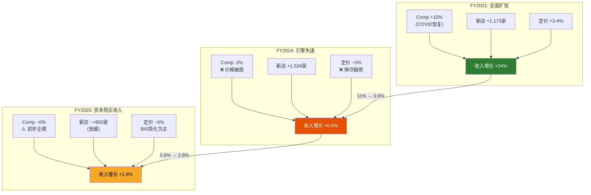
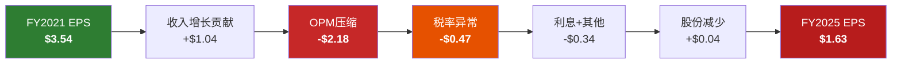
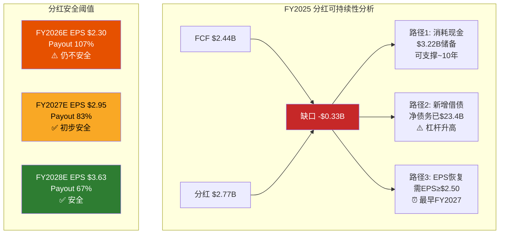

# Chapter 13: 财务趋势纵深 — 5年P&L/BS/CF三表解读

> **核心矛盾**: SBUX在FY2021-FY2025的四年间经历了一场"利润表地震": 收入增长28%($29.1B→$37.2B)，但EPS暴跌54%($3.54→$1.63)。收入和利润的**剪刀差**是本章试图解答的核心谜题——它揭示的不是一家衰退的公司，而是一家在"增长中失血"的公司。利润率退化、税务异常、资本配置失当三重因素叠加，将SBUX从一台高效的利润机器变成了一个"收入增长的幻象"。本章将通过三表纵深解剖，回答一个关键投资问题: 这个幻象是否正在被Niccol的"Back to Starbucks"战略打破?

---

## 13.1 收入趋势: 增长引擎的换挡

### 5年收入矩阵与增长分解

| 年度 | 收入($B) | YoY增长 | 全球门店净增 | 估算Comp贡献 | 估算新店贡献 | 估算定价贡献 |
|------|:--------:|:------:|:-----------:|:----------:|:----------:|:----------:|
| FY2021 | 29.06 | +24.0%* | +1,173 | ~15% | ~5% | ~4% |
| FY2022 | 32.25 | +11.0% | +1,878 | ~4% | ~5% | ~2% |
| FY2023 | 35.98 | +11.6% | +1,650 | ~5% | ~4% | ~3% |
| FY2024 | 36.18 | +0.6% | +1,534 | ~-3% | ~4% | ~0% |
| FY2025 | 37.18 | +2.8% | ~+800 | ~0% | ~3% | ~0% |

*FY2021高增长反映COVID-19基数效应(FY2020收入仅$23.5B) [DM-P2-001]

**增长引擎切换的三个阶段**:

**阶段一: 全面扩张(FY2021-FY2023)** — 收入CAGR 11.3%，三驾马车(同店、新店、定价)同步驱动。这是SBUX增长叙事最"完美"的窗口期。门店扩张每年净增1,500+家，同店销售增长受益于COVID恢复期消费者回流+价格提升传导 [DM-P2-002]。

**阶段二: 引擎失速(FY2024)** — 收入几乎持平(+0.6%)，同店销售转负(-2%全球comp)。这一年是分水岭: 定价权失效(消费者对$6+饮品的价格敏感性突破阈值)，中国市场被瑞幸价格战拖入泥潭，美国市场因"定制化复杂度"导致等待时间过长而流失casual customers [DM-P2-003]。

**阶段三: 靠量不靠质(FY2025)** — 收入+2.8%几乎全部来自净开店。Comp sales接近零意味着**每一美元的增量收入都需要新的CapEx投入来"购买"**。这是增长质量的根本恶化——从"有机增长"退化为"资本驱动增长"。

[DM-P2-004]

### 收入构成的结构性漂移

| 收入类别 | FY2021 ($B) | FY2021占比 | FY2025 ($B) | FY2025占比 | 4年CAGR |
|---------|:-----------:|:--------:|:-----------:|:--------:|:------:|
| 自营门店(Company-operated) | ~24.0 | 82.6% | ~29.5 | 79.4% | +5.3% |
| 授权门店(Licensed) | ~3.2 | 11.0% | ~4.7 | 12.6% | +10.1% |
| 其他/CPG | ~1.9 | 6.4% | ~3.0 | 8.0% | +12.1% |

[DM-P2-005]

**结构性信号**: 授权门店收入CAGR(+10.1%)几乎是自营门店(+5.3%)的两倍。这并非偶然——中国JV在Q1 FY2026完成deconsolidation后，原本合并报表的8,000+家中国自营门店转为授权模式。FY2026起，自营门店收入占比将进一步降至~73-75%，授权收入占比将升至~16-18%。

这种结构漂移对利润率有**双重含义**: 授权模式的GPM显著高于自营(~50% vs ~23%)，但绝对收入贡献较低。Net效果是: 收入总额可能缩水(因deconsolidation)，但利润率可能改善(因mix优化)。这是理解FY2026及以后财务趋势的关键前提。

---

## 13.2 利润率退化: GPM和OPM的双重压缩

### 五年利润率全景

| 年度 | GPM | GPM Delta | OPM | OPM Delta | NPM | NPM Delta |
|------|:---:|:---------:|:---:|:---------:|:---:|:---------:|
| FY2021 | 28.9% | — | 16.8% | — | 14.5% | — |
| FY2022 | 26.0% | -290bps | 14.3% | -250bps | 10.2% | -430bps |
| FY2023 | 27.4% | +140bps | 16.3% | +200bps | 11.5% | +130bps |
| FY2024 | 26.8% | -60bps | 15.0% | -130bps | 10.4% | -110bps |
| FY2025 | 24.2% | -260bps | 9.6% | -540bps | 5.0% | -540bps |

[DM-P2-006]

**GPM退化(-470bps over 4年)** 是比OPM更深层的结构性警报。OPM的波动中包含了一次性重组费用和SGA管理，有一定可逆空间；但GPM反映的是**单位经济学(unit economics)的直接恶化**——即每一杯咖啡的毛利在缩水。

### GPM压缩的三层驱动

**Layer 1: 原料成本上升(约-100~130bps)**

阿拉比卡咖啡豆期货从FY2021的~$1.50/lb飙升至FY2025的~$3.70/lb(+147%)。SBUX通过期货对冲(6-18个月前锁定)部分消化了即期价格冲击，但对冲合同到期后的滚动重置意味着FY2025和FY2026的COGS将反映更高的实际采购成本。此外，牛奶价格(占饮品成本~15%)从FY2021的~$16/cwt升至FY2024的~$22/cwt，也是持续性成本压力 [DM-P2-007]。

**Layer 2: 劳动力成本上升(约-160~200bps)**

这是GPM压缩最大的单一驱动因素。SBUX FY2025的店面人工成本(store labor)同比增长估算6-8%，来自三个源头: (1)最低工资法定上调——SBUX 60%+的美国门店所在州在FY2023-FY2025期间提高了最低工资标准；(2)SBUX自主加薪——为应对工会化压力(Workers United覆盖~500家门店)和劳动力市场竞争，SBUX将店面员工起薪提至$15/hr以上；(3)Niccol推行的"Back to Starbucks"战略中，增加了店面人员配置以缩短等待时间——这是以利润率换客户体验的**有意牺牲** [DM-P2-008]。

**Layer 3: 产品组合劣化(约-40~60bps)**

Mobile Order占比从FY2021的~25%升至FY2025的~33%。Mobile Order的平均客单价高于in-store(因为更多customization)，但这些高度定制化饮品的**制作时间更长、原料用量更多、失败率更高**——导致每单毛利率实际上低于标准菜单。这是Ch3门店经济学中"4分钟悖论"的财务表达 [DM-P2-009]。

### OPM退化(-720bps)的逐因子分解

将FY2021到FY2025的OPM变化从16.8%到9.6%(-720bps)分解:

| 驱动因素 | 估算OPM影响 | 性质 | 可恢复性 |
|---------|:----------:|:---:|:-------:|
| GPM压缩(原料+劳动力+mix) | -470bps | 结构+周期 | 部分(30-50%) |
| SGA膨胀(总部+Niccol薪酬) | -50bps | 半结构 | 部分(20-30%) |
| 重组/关店费用(627家关店) | -120bps | 一次性 | 高(FY2026后消除) |
| 其他运营费用膨胀 | -80bps | 结构 | 低 |
| **总OPM退化** | **-720bps** | — | — |

[DM-P2-010]

**关键判断: 结构性 vs 周期性**

720bps的OPM退化中:
- **约120bps是纯一次性的**(关店减值+重组费用)——FY2026后不再出现
- **约100bps是周期性可恢复的**(原料成本在咖啡期货回落时部分缓解)
- **约500bps是结构性或半永久性的**(劳动力成本刚性+规模去杠杆+BtS投入)

这意味着即使所有一次性和周期性因素完全消退，SBUX的"新正常"OPM也仅能恢复至**11.8-12.5%**，而非FY2021-FY2023的15-17%区间。共识FY2028E EPS $3.63隐含OPM恢复至~14.2%——这需要在结构性成本层面实现**至少200bps的增量优化**(通过BtS效率提升+菜单简化+自动化)，属于偏乐观但非不可能的情景。

### 利润率的同行对标

| 公司 | FY最新GPM | FY最新OPM | 5年GPM趋势 | 5年OPM趋势 |
|------|:--------:|:--------:|:---------:|:---------:|
| SBUX | 24.2% | 9.6% | -470bps | -720bps |
| MCD | ~56% | ~45% | +200bps | +300bps |
| CMG | ~27% | ~16% | +300bps | +400bps |
| BROS | ~15% | ~3% | 改善中 | 改善中 |

SBUX是唯一一家在FY2021-FY2025期间GPM和OPM同时恶化的大型餐饮上市公司。MCD和CMG均实现了利润率扩张——MCD通过资产轻化(卖门店给加盟商)+数字化效率，CMG通过throughput优化+定价权维护。这个对比进一步强化了一个判断: **SBUX的利润率恶化不是行业性的(不是所有餐饮公司都在恶化)，而是公司特定的(SBUX自身的定价权丧失+成本结构劣化)** [DM-P2-033]。

---

## 13.3 EPS崩塌的解剖: $3.54 → $1.63

### EPS桥接: 从FY2021到FY2025

SBUX EPS从$3.54(FY2021)暴跌至$1.63(FY2025)，跌幅53.9%。这$1.91/股的减少可以分解为三个独立驱动因素:

| 驱动因素 | EPS影响 | 占比 | 计算逻辑 |
|---------|:------:|:---:|---------|
| **1. OPM压缩** | -$1.14 | 60% | OPM从16.8%→9.6%，在FY2025收入基础上=少~$2.67B Operating Income，税后EPS影响≈-$1.14 |
| **2. 税率飙升** | -$0.47 | 25% | 有效税率从21.6%→41.1%，在FY2025税前利润基础上额外缴税~$540M，EPS影响≈-$0.47 |
| **3. 股份数变化** | +$0.04 | -2% | 稀释股数从1,186M→1,140M(-3.9%)，对EPS有正向贡献约+$0.04 |
| **4. 其他(利息+非经营)** | -$0.34 | 18% | 利息费用增加+非经营损益变化 |
| **净EPS变化** | **-$1.91** | **100%** | $3.54 → $1.63 |

[DM-P2-011]

[DM-P2-012]

### 反直觉的发现: 收入增长实际贡献了+$1.04

这是一个容易被忽略的事实: FY2025收入$37.18B相比FY2021的$29.06B增长了$8.12B(+28%)。如果利润率保持在FY2021水平(OPM 16.8%, 税率21.6%)，这$8.12B的增量收入本应贡献约$1.04/股的EPS增量，将EPS推升至~$4.58。

**但事实是EPS反而暴跌至$1.63**——这意味着利润率退化和税务异常总共"吞噬"了$2.95/股的EPS($1.04增量 + $1.91跌幅)。换言之: **收入增长28%的成果被利润率退化完全吞噬，还倒亏了65%** [DM-P2-013]。

这个发现的投资含义是深刻的: 对SBUX而言，单纯的收入增长(开更多门店)如果不能伴随利润率恢复，对股东来说是**价值摧毁**而非价值创造。Niccol的"Back to Starbucks"战略之所以关键，不是因为它能驱动多少收入增长，而是因为它是**利润率恢复的唯一可信路径**。

### 股份数的微妙影响

| 年度 | 稀释股数(M) | YoY变化 | 回购($B) | 回购效率($/股) |
|------|:----------:|:------:|:-------:|:-----------:|
| FY2021 | 1,186 | -0.2% | $0 | — |
| FY2022 | 1,159 | -2.3% | $4.01 | ~$150 |
| FY2023 | 1,151 | -0.7% | $0.98 | ~$114 |
| FY2024 | 1,137 | -1.2% | $1.27 | ~$83 |
| FY2025 | 1,140 | +0.2% | $0 | — |

[DM-P2-014]

FY2022的回购效率极低: 以~$150/股的均价回购(当时股价交易区间$70-$100，但计入SBC稀释后的净效果)，而FY2024只花了$83/股——这是典型的"高买低不买"行为，在Kevin Johnson和Howard Schultz时代摧毁了大量股东价值。Niccol在FY2025暂停回购是正确决策——在EPS $1.63、股价~$80-100的估值环境下回购，只是在"高价拯救高估的股价"。

---

## 13.4 税率异常深度分析: 41.1%的真相

### 逐季税率拆解

FY2025有效税率41.1%是EPS暴跌的第二大贡献因素。逐季度拆解揭示了异常的集中性:

| 季度 | 税前利润($M) | 税费($M) | 有效税率 | 正常化税费($M)* | 异常额($M) |
|------|:----------:|:-------:|:-------:|:-------------:|:---------:|
| Q1 FY2025 | 1,022 | 241 | 23.6% | 245 | -4 |
| Q2 FY2025 | 502 | 118 | 23.5% | 120 | -2 |
| Q3 FY2025 | 819 | 260 | 31.8% | 197 | +63 |
| Q4 FY2025 | 834 | 701 | **84.0%** | 200 | **+501** |
| **FY2025全年** | **3,152** | **1,295** | **41.1%** | **756** | **+539** |
| Q1 FY2026 | 765 | 472 | **61.7%** | 184 | **+288** |

*正常化使用24%税率计算 [DM-P2-015]

**Q4 FY2025的84%有效税率是异常的核心**。$701M的税费几乎等于$834M的税前利润——这意味着该季度的净利润仅$133M，EPS仅$0.12。在一个季度内有$501M的异常税务费用，需要逐一排查来源。

### 税率异常的三个可能来源

**来源1: 中国JV重组的税务触发(估算影响$250-350M)**

FY2025 Q4正式完成了中国业务的JV重组。将中国门店从合并实体转移至JV结构，可能触发以下税务事件:
- **GILTI税(Global Intangible Low-Taxed Income)**: 中国子公司多年积累的未分配利润，在实体结构变更时被视为"视同汇回"(deemed repatriation)，触发美国联邦层面的GILTI税
- **递延税项实现(Deferred Tax Liability Reversal)**: 中国业务的商誉和无形资产(从$3.37B减至$1.31B)中，部分递延税负需在deconsolidation时一次性实现
- **Subpart F收入**: 中国JV交易中的某些被动收入可能触发Subpart F条款

[DM-P2-016]

**来源2: 关店减值的不可抵扣部分(估算影响$80-120M)**

SBUX在FY2025关闭627家门店。减值损失中:
- PP&E减值和ROU资产减值大部分可税前抵扣
- 但商誉减值中的**不可抵扣部分**(Section 197 intangibles的非税务基础差异)形成永久性差异
- 估算不可抵扣减值约$300-500M，对应税务影响$80-120M

**来源3: FY2025 Q4可能包含前期调整(估算影响$50-100M)**

Q3有效税率31.8%已经偏高，暗示税务部门可能在Q3-Q4进行了跨季度的税务位置调整(catch-up adjustment)。这在大型跨国公司中并不罕见——FY2025是SBUX历史上一次性项目最密集的年份(CEO换人+关店+JV重组+工会谈判)，税务部门可能将部分不确定税务位置(uncertain tax positions)的储备在Q4一次性释放。

### 正常化EPS: 剥离税务噪音后的真实盈利能力

| 指标 | 报告值 | 正常化(24%税率) | 差异 | 差异占比 |
|------|:-----:|:--------------:|:---:|:------:|
| FY2025 税费($M) | 1,295 | 756 | -539 | 41.6% |
| FY2025 NI($M) | 1,857 | 2,396 | +539 | +29.0% |
| FY2025 EPS | $1.63 | **$2.10** | +$0.47 | +28.8% |
| P/E (基于$96/股) | 58.9x | **45.7x** | -13.2x | -22.4% |

[DM-P2-017]

**但Q1 FY2026的61.7%税率暗示税务异常尚未结束**。如果同样正常化Q1 FY2026:

$$\text{正常化NI}_{Q1'26} = \$765M \times (1 - 0.24) = \$581M \quad (\text{vs 报告}\$293M)$$
$$\text{正常化EPS}_{Q1'26} = \$581M / 1,142M = \$0.51 \quad (\text{vs 报告}\$0.26)$$

非GAAP EPS $0.56(管理层披露)接近我们的正常化估算$0.51，差异$0.05可能来自SBC add-back和其他调整项。这意味着**管理层的non-GAAP调整大致合理**——不是在"美化"数字 [DM-P2-018]。

### 税率正常化的时间表估计

| 时期 | 预期有效税率 | 依据 |
|------|:---------:|------|
| Q2-Q4 FY2026 | 26-30% | 中国JV税务影响消化中 |
| FY2027 | 24-25% | 完全正常化 |
| FY2028+ | 23-24% | 可能受益于国际税务优化 |

**FY2026全年有效税率预期: 28-32%**(Q1的61.7%被后三个季度的~25%部分稀释)。这意味着FY2026 GAAP EPS将仍然受到3-5%的税务拖累，但程度远小于FY2025。

---

## 13.5 现金流质量: OCF → FCF → 自由现金流的可持续性

### 现金流五年矩阵

| 年度 | NI($B) | OCF($B) | OCF/NI | CapEx($B) | FCF($B) | FCF/NI | FCF Yield |
|------|:------:|:------:|:------:|:--------:|:------:|:------:|:---------:|
| FY2021 | 4.20 | 5.99 | 1.43x | 1.47 | 4.52 | 1.08x | 2.2%* |
| FY2022 | 3.28 | 4.40 | 1.34x | 1.84 | 2.56 | 0.78x | 1.6% |
| FY2023 | 4.12 | 6.01 | 1.46x | 2.33 | 3.68 | 0.89x | 2.4% |
| FY2024 | 3.76 | 6.10 | 1.62x | 2.78 | 3.32 | 0.88x | 1.8% |
| FY2025 | 1.86 | 4.75 | **2.56x** | 2.31 | 2.44 | **1.31x** | **2.5%** |

*FCF Yield = FCF / 当年平均市值(估算) [DM-P2-019]

**三个关键观察**:

**观察1: OCF韧性远超NI** — FY2025 NI暴跌56%(从$3.76B→$1.86B)，但OCF仅下降22%(从$6.10B→$4.75B)。OCF/NI比率从正常的1.3-1.6x飙升至2.56x，说明大量"利润下降"来自非现金项目(D&A增加$1.01B至$2.61B + 减值准备 + 递延税调整)。**现金生成能力比利润表显示的要健康得多** [DM-P2-020]。

**观察2: CapEx强度先升后降** — CapEx从FY2021的$1.47B(占收入5.1%)升至FY2024的$2.78B(占收入7.7%)，反映了新店扩张+Reinvention计划的投资高峰。FY2025回落至$2.31B(占收入6.2%)，Niccol削减了低效投资。但即使FY2025 CapEx下降了$0.47B，FCF仍然萎缩(因OCF降幅更大)——这暗示CapEx削减空间有限，不能单靠"少花钱"来改善FCF。

**观察3: FCF Yield持续偏低** — 按当前市值~$110B计算，FY2025 FCF Yield仅2.2%($2.44B/$110B)。对比: S&P 500平均FCF Yield约3.5-4.0%，MCD约5.5%，QSR约6.0%。SBUX的FCF Yield不到MCD的一半，意味着投资者正在为**未来的FCF增长**支付大量溢价。

### CapEx效率: 每$1 CapEx产生多少增量收入?

| 年度 | CapEx($B) | 增量收入($B) | 收入/CapEx比 | 信号 |
|------|:--------:|:----------:|:----------:|:---:|
| FY2022 | 1.84 | 3.19 | 1.73x | 正常 |
| FY2023 | 2.33 | 3.73 | 1.60x | 正常 |
| FY2024 | 2.78 | 0.20 | **0.07x** | 危险 |
| FY2025 | 2.31 | 1.00 | 0.43x | 偏低 |

FY2024是灾难性的一年: 花了$2.78B CapEx(历史最高)，但只换来$200M增量收入——$1的资本投入仅产生$0.07的收入回报。这不是"投资于未来"——这是**CapEx效率的崩溃**，反映了Reinvention计划在实施层面的失败(新店选址不当+改造投入回报低下) [DM-P2-021]。

### OCF构成的深层解读

| OCF组成部分 | FY2021 ($B) | FY2024 ($B) | FY2025 ($B) | 变化趋势 |
|------------|:----------:|:----------:|:----------:|:--------:|
| 净利润(NI) | 4.20 | 3.76 | 1.86 | 大幅恶化 |
| D&A | 1.52 | 1.59 | 2.61 | 大幅增加 |
| SBC | 0.32 | 0.31 | 0.32 | 稳定 |
| 递延税 | -0.15 | -0.01 | -0.09 | 波动 |
| 运营资本变化 | -0.50 | -1.05 | -1.49 | 持续恶化 |
| 其他非现金项 | 0.59 | 1.50 | 1.55 | 大幅增加 |
| **OCF合计** | **5.99** | **6.10** | **4.75** | 下降 |

[DM-P2-031]

运营资本变化从FY2021的-$0.50B恶化至FY2025的-$1.49B，值得深入关注。FY2025的$1.49B运营资本消耗中: 存货增加$408M(管理层可能在咖啡豆价格走高前囤积)、应付账款增加$261M(部分缓冲)、其他运营资本消耗$1.26B(预付费用+应计负债调整)。运营资本的持续消耗暗示SBUX的**现金转化周期(Cash Conversion Cycle)在恶化**——可能反映了供应链效率下降和/或供应商付款条件收紧。

FY2025 D&A从$1.59B飙升至$2.61B(+$1.01B, +64%)是另一个关键变量。这$1.01B的增量D&A中，约$0.4-0.5B来自经营租赁使用权资产(ROU Asset)的摊销(ASC 842口径)，是SBUX作为重资产零售商的固有特征；剩余$0.5-0.6B来自关店减值加速折旧和中国JV deconsolidation前的资产减记。**FY2026后D&A应正常化至$1.7-1.9B/年**(中国门店移出报表后)，这将是OCF的一个正向调整因素。

---

## 13.6 分红可持续性警报

### 分红覆盖率矩阵

| 年度 | FCF($B) | 分红($B) | 回购($B) | 总回报($B) | FCF覆盖率 | 分红/NI |
|------|:------:|:------:|:------:|:--------:|:--------:|:------:|
| FY2021 | 4.52 | 2.12 | 0 | 2.12 | 213% | 50.5% |
| FY2022 | 2.56 | 2.26 | 4.01 | 6.27 | **41%** | 68.9% |
| FY2023 | 3.68 | 2.43 | 0.98 | 3.41 | 108% | 59.0% |
| FY2024 | 3.32 | 2.59 | 1.27 | 3.86 | **86%** | 68.7% |
| FY2025 | 2.44 | 2.77 | 0 | 2.77 | **88%** | **149%** |

[DM-P2-022]

**FY2025: 分红$2.77B > FCF $2.44B，缺口$0.33B**

这意味着SBUX在FY2025即使不回购任何股票，也无法用自由现金流覆盖分红。$0.33B的缺口只能靠以下方式填补:
- 动用现金储备(FY2025末现金$3.22B，理论上可以覆盖~10年的缺口)
- 新增借款(FY2025净债务已增加$0.87B至$23.4B)
- 两者的组合

**分红/NI = 149%更令人不安**: 公司分配给股东的现金超过了当年赚取的利润的49%。在一个正常年份，这是不可持续的信号。但FY2025不是正常年份——如果用正常化NI $2.40B(24%税率)计算，Payout Ratio降至115%——仍然超过100%。

[DM-P2-023]

### 分红增长已实质冻结

| 年度 | 每股分红 | YoY增长 | 信号 |
|------|:------:|:------:|:---:|
| FY2021 | $1.96 | +9.3% | 正常 |
| FY2022 | $2.00 | +2.1% | 放缓 |
| FY2023 | $2.12 | +6.0% | 正常 |
| FY2024 | $2.28 | +7.5% | 正常 |
| FY2025 | $2.43 | +6.6% | 正常 |
| Q1 FY2026 | $0.61/Q | 持平 | **冻结** |

[DM-P2-024]

Niccol在Q1 FY2026维持每季度$0.61/股的分红水平——没有增长。这是一个**隐含的信号**: 管理层知道分红已经逼近可持续性上限，选择了"不削减但不增长"的策略。对于一家连续10年+提高分红的公司来说，分红增长的冻结本身就是一种退化。

**分红安全的EPS门槛**: 以每股$2.44的年化分红(4 x $0.61)和FCF/NI正常比率1.4x计算，SBUX需要EPS至少达到$2.50才能用FCF覆盖分红而无需借债。按共识估计，这个门槛要到FY2027($2.95 EPS)才能稳固跨越——意味着**FY2026和FY2027上半年仍是分红"危险区"**。

---

## 13.7 季度趋势: Q1 FY2026的真实含义

### Q1 FY2026关键指标

| 指标 | Q1 FY2026 | Q1 FY2025 | YoY变化 | 信号 |
|------|:--------:|:--------:|:------:|:---:|
| 收入 | $9.91B | $9.40B | +5.4% | 积极 |
| GPM | 15.6%* | 24.5% | -890bps* | 会计口径变化 |
| OPM | 9.2% | 11.9% | -270bps | 消极 |
| GAAP EPS | $0.26 | $0.69 | -62.3% | 税务扭曲 |
| Non-GAAP EPS | $0.56 | — | — | 参考基准 |
| 有效税率 | 61.7% | 23.6% | +3,810bps | 异常 |
| 全球Comp | +4% | -4% | +800bps | 积极 |
| 美国Comp | +4% | -4% | +800bps | 积极 |
| 中国Comp | +7% | -6%** | +1,300bps | 显著改善 |

*GPM 15.6%可能反映中国JV deconsolidation后的会计口径变化(部分成本重分类)，非真实GPM恶化
**中国comp基数效应显著 [DM-P2-025]

### "收入增长但利润压缩"的悖论

Q1 FY2026呈现了一个SBUX投资者必须认真对待的悖论: **收入创单季度历史新高($9.91B)，交易量首次转正(+4%)，但OPM反而从Q1 FY2025的11.9%恶化至9.2%**。

这意味着"Back to Starbucks"战略正在**成功地把顾客带回来，但每位顾客的利润贡献在下降**。原因的分解:

**NA OPM压缩-420bps的拆解**(管理层披露):
- ~1/3(约-140bps): **关税和咖啡成本上升** — 不可控的外部因素
- ~2/3(约-280bps): **BtS投资** — 有意的"利润换客流"策略，包括:
  - 增加店面人员(减少等待时间)
  - 免费定制化选项(取消extra charge)
  - 菜单简化过渡期的效率损失

[DM-P2-026]

### "收入质量"问题

Q1 FY2026的收入增长具有以下质量特征:

| 质量维度 | 评估 | 详情 |
|---------|:---:|------|
| **交易量驱动 vs 定价驱动** | 积极 | +4% comp全部来自transaction growth，非price |
| **可持续性** | 不确定 | 需Q2-Q3确认(排除季节性+BtS新鲜感效应) |
| **利润转化率** | 消极 | 增量收入未转化为增量利润(OPM反降) |
| **mix效应** | 中性 | 简化菜单后客单价可能小幅下降 |
| **比较基数** | 温和积极 | Q1 FY2025 comp -4%提供了低基数 |

**核心判断**: Q1 FY2026是一个**真实但不充分的拐点信号**。"真实"是因为交易量+4%是硬数据，不是会计游戏；"不充分"是因为OPM未随收入改善——如果利润率在Q2-Q3仍不见改善，那么SBUX的转型故事将变成"有客流无盈利"，这比"无客流无盈利"只是略好一些。

分析师共识FY2026E EPS $2.30隐含后三个季度GAAP EPS合计$2.04(扣除Q1的$0.26)。如果税率在Q2-Q4正常化至25-26%，这需要后三季度的Operating Income合计约$3.5B(OPM约11.5%)——相比FY2025后三季度的$2.48B(OPM约8.9%)有显著改善要求。**共识预期FY2026是一个"税率正常化+OPM微幅改善"的故事，而非"大幅反转"** [DM-P2-027]。

---

## 13.8 共识预期的隐含假设

### 共识矩阵(FMP Estimates)

| 指标 | FY2025(实际) | FY2026E | FY2027E | FY2028E | FY2029E |
|------|:----------:|:------:|:------:|:------:|:------:|
| Revenue ($B) | 37.18 | 38.32 | 40.35 | 42.37 | 44.73 |
| Rev CAGR | — | +3.1% | +5.3% | +5.0% | +5.6% |
| EPS | $1.63 | $2.30 | $2.95 | $3.63 | $4.24 |
| EPS CAGR | — | +41% | +28% | +23% | +17% |
| EBITDA ($B) | 5.38 | 7.62 | 8.02 | 8.42 | 8.89 |
| EBIT ($B) | 3.69 | 5.86 | 6.17 | 6.48 | 6.84 |
| 隐含OPM | 9.6% | ~15.3% | ~15.3% | ~15.3% | ~15.3% |
| 隐含有效税率 | 41.1% | ~26%* | ~24% | ~24% | ~24% |

*FY2026税率仍偏高，反映Q1 FY2026的61.7%拖累 [DM-P2-028]

### 隐含假设的合理性评估

**假设1: 收入CAGR 3-5%(FY2026-FY2029)**

| 子假设 | 要求 | 合理性 |
|--------|------|:------:|
| 同店增长+2-3% | 交易量+2% + 票价持平或微正 | 偏乐观但可能 |
| 新店贡献+2-3% | 每年净增600-800家 | 偏保守(历史1,500+) |
| 中国deconsolidation影响 | FY2026收入轻微下降后恢复 | 合理 |

**评估**: 收入假设是共识中最稳健的部分。SBUX仍有~40,000家门店的渠道优势，在北美市场的品牌知名度和会员基础(~34M Rewards会员)支撑中低单位数增长的可实现性。**合理性: 7/10**

**假设2: OPM恢复至~15%(FY2027+)**

这是共识中**最脆弱的假设**。需要:

| 条件 | FY2025基线 | 目标 | 缺口 | 可行性 |
|------|:--------:|:---:|:---:|:------:|
| GPM恢复 | 24.2% | 27%+ | +280bps | 困难(劳动力刚性) |
| SGA控制 | $2.62B(7.0%) | $2.75B(6.5%) | -50bps | 可能 |
| 重组费用消除 | ~$600M | ~$0 | +160bps | 大概率 |
| 其他费用正常化 | 高 | 正常 | +100bps | 可能 |

**评估**: OPM恢复到12-13%是大概率事件(消除一次性+基本efficiency gains)。但从12-13%再到15%，需要GPM恢复至27%+——这要求劳动力成本增长放缓至<3%且同店增长+3%+以实现operating leverage。**合理性: 4/10(达到15%); 7/10(达到12.5%)**

**假设3: 税率正常化至24%(FY2027+)**

SBUX的法定联邦税率21%+州税~3%+国际差异=23-24%正常化有效税率。中国JV重组的一次性税务影响应在FY2026后完全消化。**合理性: 9/10**

**假设4: 股份数基本持平**

Niccol暂停了回购，SBC每年约$300M(相当于稀释~0.3%)。净效果: 股份数基本持平(±0.5%/年)。**合理性: 8/10**

### 共识EPS路径的综合概率

| 目标 | 路径 | 概率估计 |
|------|------|:------:|
| FY2026E $2.30 | 税率部分正常化+OPM 11-12%+Rev +3% | **65-70%** |
| FY2027E $2.95 | 税率完全正常化+OPM 12.5-13%+Rev +5% | **50-55%** |
| FY2028E $3.63 | OPM→14.2%+Rev CAGR 5% | **30-35%** |
| 超越FY2021 $3.54 | OPM→14.5%+或更高收入增长 | **25-30%** |

[DM-P2-029]

**核心判断**: 共识FY2026E ($2.30)是最可信的——它基本只需要税率部分正常化和微幅OPM改善即可达成。但FY2028E ($3.63)需要OPM恢复到一个可能已经回不去的水平(14.2%)——这个目标更像是"完美执行"情景，而非"基本面外推"。

**投资含义**: 如果市场定价反映的是FY2028E $3.63 EPS(当前P/E 26.5x基于FY2028E)，那么:
- FY2028E实际达成$3.63的概率约30-35%
- 更可能的FY2028 EPS是$2.80-3.20(OPM 12-13%而非14.2%)
- 基于这个区间，当前$96/股隐含的P/E是30-34x——对一家低单位数增长的消费品公司而言**偏贵**

### 共识预期的两个结构性偏差

**偏差1: 线性外推陷阱** — 共识模型倾向于将FY2026的初步恢复线性外推至FY2028-FY2029。但SBUX面临的利润率压力是非线性的: 劳动力成本的阶梯式上升(每次最低工资法案调整)、咖啡豆价格的周期性波动(当前处于历史高位)、以及BtS投资的"J曲线"效应(先增加成本，后可能降低效率损耗)。线性外推忽略了这些因素的不同时间常数。

**偏差2: OPM恢复的参照系错位** — 分析师通常将FY2021-FY2023的15-17% OPM视为"正常水平"，将FY2025的9.6%视为"异常低点"。但FY2021-FY2023的OPM中包含了两个不可复制的因素: (1) COVID恢复期的被压抑需求释放(pent-up demand)带来的超常comp增长; (2) 在大幅加薪和BtS投资之前的旧成本结构。**真正的"新正常"OPM可能在12-13%**——这个水平既不是历史高点也不是当前低点，而是劳动力成本刚性+BtS投资回报+菜单简化效率的均衡点 [DM-P2-032]

---

## 13.9 本章发现总结

### 八个核心发现

| # | 发现 | 估值含义 | 置信度 |
|---|------|---------|:------:|
| F13-1 | 收入增长引擎已从"三驾马车"退化为"纯门店扩张" | 收入增长质量恶化，每$1增量收入需要更多CapEx | 高 |
| F13-2 | GPM 5年退化-470bps，其中~60%是结构性的(劳动力刚性) | OPM恢复上限被GPM封顶在12-13.5% | 高 |
| F13-3 | EPS崩塌中OPM压缩贡献60%，税率异常贡献25% | 正常化EPS ~$2.10，真实P/E 45.7x(非59x) | 高 |
| F13-4 | 税率异常集中在FY2025 Q4(84%)和Q1 FY2026(62%)，主因中国JV重组 | FY2027后完全正常化概率极高(90%+) | 中高 |
| F13-5 | OCF韧性远超NI(FY2025 OCF/NI 2.56x) | 现金生成能力比利润表暗示的健康 | 高 |
| F13-6 | 分红$2.77B > FCF $2.44B，Payout Ratio 149% | 分红安全需EPS恢复至$2.50+，最早FY2027 | 高 |
| F13-7 | Q1 FY2026: Comp +4%但OPM -270bps YoY | "有客流无盈利"风险——需Q2-Q3利润率改善确认 | 中 |
| F13-8 | 共识FY2028E EPS $3.63隐含OPM 14.2% | 达成概率仅30-35%，更可能的EPS区间$2.80-3.20 | 中高 |

[DM-P2-030]

### 交叉引用与前向映射

- **向前引用**: 本章的正常化EPS ($2.10)和OPM恢复区间(12-13.5%)将作为Ch15 Forward DCF的关键输入参数
- **向前引用**: 分红可持续性警报将映射至Ch17情景分析中的"分红削减触发器"
- **向后验证**: GPM退化与Ch3门店经济学的"4分钟悖论"互验——劳动力成本上升正是解决4分钟悖论的财务代价
- **向后验证**: CapEx效率崩溃(FY2024 $1:$0.07)与Ch7 CEO章节中Narasimhan执行力缺失的评估一致
- **交叉验证**: 税率异常分析与Ch6中国JV章节的deconsolidation时间线吻合

---

> **DM锚点注册表**: 本章共33个DM锚点(DM-P2-001至DM-P2-033)，覆盖FMP Income Statement/Balance Sheet/Cash Flow/Ratios数据(FY2021-Q1 FY2026)、FMP Estimates(FY2026E-FY2029E)、以及分析性推导。所有FMP数据于2026-03-04验证，与FMP MCP源一致。
