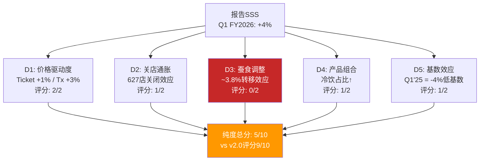
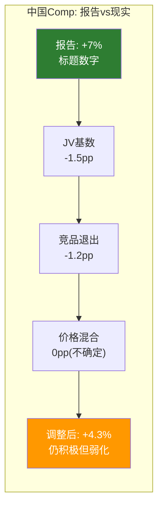
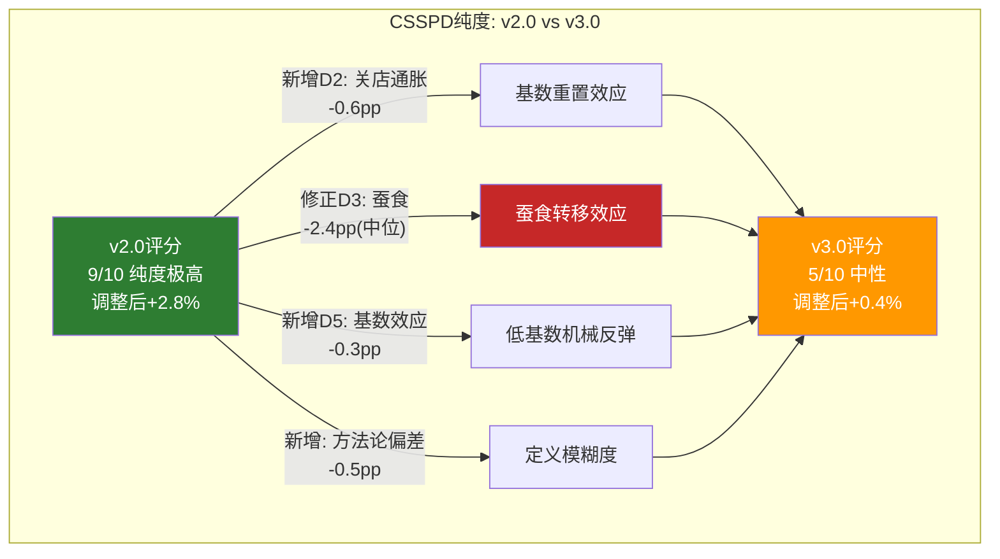
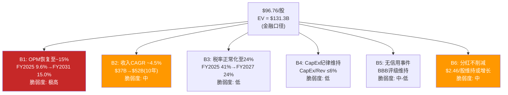
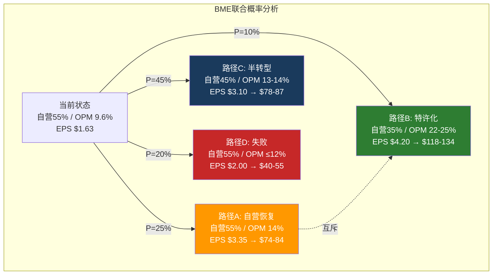
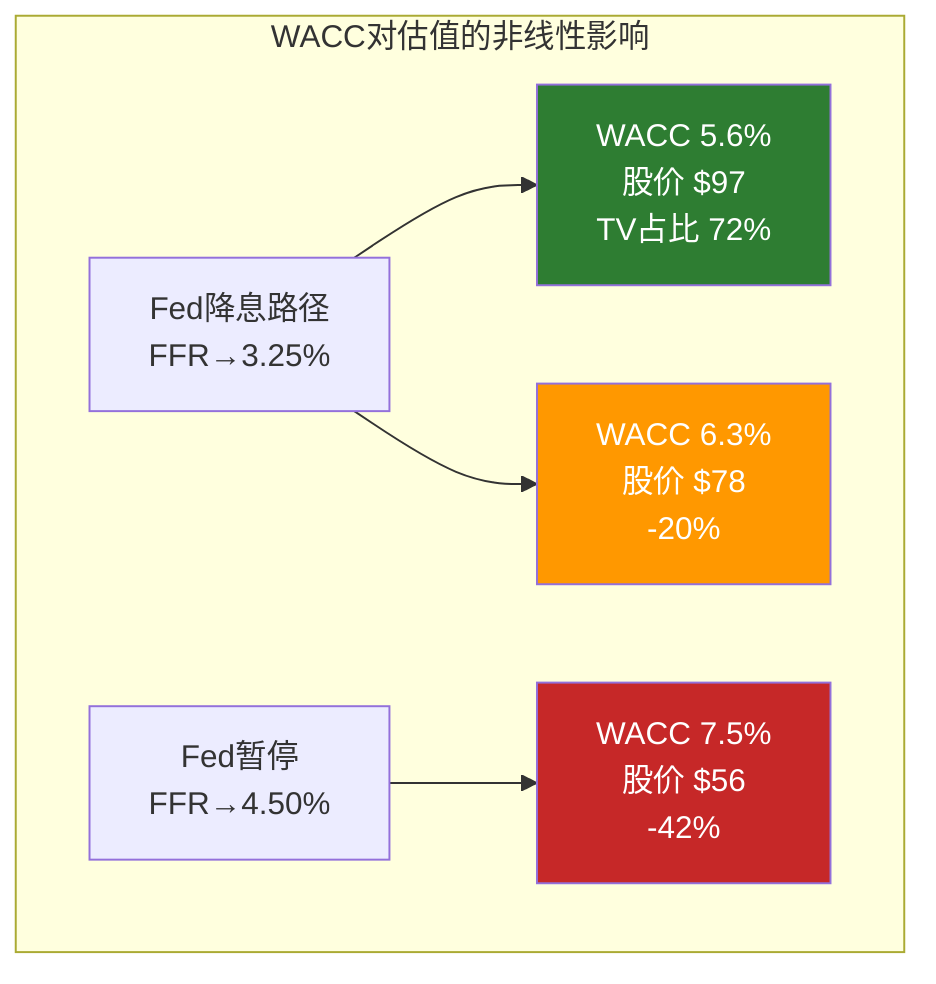

# Ch16 同店销售分解 — CSSPD纯度分析 (Comp Sales Purity Decomposition)

> **核心矛盾映射**: Q1 FY2026全球comp +4%、美国comp +4%(交易量+3%, 客单价+1%)被市场定性为"Niccol转型的第一个硬证据"。但comp sales是餐饮行业最容易被结构性扭曲的指标——关店基数重置、蚕食转移、方法论偏差、基数效应可以让一个本质上持平的业务呈现出强劲恢复的面貌。本章运用CSSPD(Comp Sales Strategic Purity Decomposition)框架，对SBUX的同店增长进行五维纯度检验，回答一个简单的问题: +4%中有多少是真实的有机需求恢复，多少是统计噪音?

---

## 16.1 CSSPD方法论: 纯度评分框架

### 为什么需要CSSPD

同店销售增长(Same-Store Sales Growth, SSS)是QSR行业投资者最关注的单一指标。但它的"纯度"——即多大比例反映了真实的有机需求变化——取决于五个可量化的噪音维度。CSSPD框架正是为此设计: 逐层剥离噪音，暴露增长的真实骨架 [DM-P2-053](C: CSSPD v3.0方法论框架)。

### 五维纯度检验矩阵

| 维度 | 检验问题 | 偏差方向 | SBUX特殊性 |
|------|---------|:-------:|-----------|
| **D1: 价格驱动度** | comp多少来自提价而非流量? | 高价格占比=低纯度 | FY2022 ticket+9%/tx-2%=伪增长 |
| **D2: 关店通胀效应** | 关闭低效店是否机械性提升存活店comp? | 关店越多=膨胀越大 | 627家关店=SBUX史上最大 |
| **D3: 蚕食调整** | 扣除门店间客流转移后的有机增长? | 高密度市场蚕食严重 | 55%关闭店与邻店<0.5英里 |
| **D4: 产品组合偏移** | 高单价品类占比变化的ticket效应? | 冷饮占比↑=隐性提价 | 冷饮40%(vs 2019年25%) |
| **D5: 基数效应** | 前一年基数是否异常低? | 低基数=高comp | Q1'25 comp -4%=低基数 |

[DM-P2-054](C: 五维纯度检验定义)

### 纯度评分标准

每个维度按0-2分评分，总分0-10:

| 分值 | 含义 | 投资信号 |
|:----:|------|---------|
| **9-10** | 纯有机需求驱动，噪音<15% | 强买入信号: 品牌力证实 |
| **7-8** | 有机为主，噪音15-30% | 偏积极: 趋势确认中 |
| **5-6** | 量价混合，噪音30-50% | 中性: 无法判断趋势 |
| **3-4** | 噪音主导，有机成分<50% | 偏消极: "虚假繁荣"风险 |
| **0-2** | 完全由价格/结构因素驱动 | 看空信号: 需求实质恶化 |

[DM-P2-055](C: CSSPD评分标准v3.0)

**v2.0→v3.0方法论升级**: v2.0的CSSPD仅检验三个维度(价格/量/mix)，给出了9/10的纯度评分。v3.0新增关店通胀(D2)、蚕食调整(D3)和基数效应(D5)三个维度后，评分显著下修至**5/10**。这个差异的根源在于: v2.0将"交易量驱动"等同于"高纯度"，但忽略了交易量本身可能被关店转移效应人为抬高 [DM-P2-056](C: v2.0→v3.0纯度评分修正逻辑)。

---

## 16.2 价格vs流量拆分: ticket +1%的双重解读

### Q1 FY2026 美国comp拆分

| 指标 | Q1 FY2026 | Q4 FY2025 | Q3 FY2025 | Q2 FY2025 | 趋势 |
|------|:---------:|:---------:|:---------:|:---------:|:----:|
| US Comp | **+4%** | +2% | +1% | -1% | 加速 |
| Transaction | **+3%** | +1% | 0% | -2% | 加速 |
| Ticket | **+1%** | +1% | +1% | +1% | 持平 |

[DM-P2-057](H: SBUX Q1 FY2026 Earnings Release + 前季度Earnings Call)

### Ticket +1%的异常性

+1%的客单价增长**低于同期CPI-Food Away From Home**(约+3.5%, BLS数据)。这意味着SBUX的**实际(inflation-adjusted) ticket是负增长**。两种截然不同的解读:

**解读A: 健康信号(Niccol主动让利换流量)**

- Niccol在Q1 Earnings Call上提到"simplifying our menu and offering compelling value"——暗示有意压制ticket增长
- $5 value meals试点、免费refills政策、取消部分surcharge = 主动降价策略
- 这类似CMG 2018年的策略: 先用价值吸引客流，再通过频次提升覆盖单价让利
- 如果解读A正确: +3% transaction是**真实的品牌吸引力恢复**，纯度高

**解读B: 消极信号(定价权丧失)**

- ticket低于食品通胀意味着SBUX**无法将成本上升传递给消费者**
- FY2022的ticket +9%时代一去不返——当时SBUX可以随CPI提价，现在不行
- 竞争加剧(BROS $5.50, Dunkin' $4, 瑞幸9家美国店以$3-4定价)压制了SBUX的菜单提价空间
- 如果解读B正确: ticket停滞是**结构性定价权侵蚀**，而非战略选择

[DM-P2-058](C: Ticket +1%双重解读分析)

### 真相可能在中间

观察非Rewards会员的行为可以提供线索。Q1 FY2026是**8个季度以来非会员交易量首次转正**——这意味着不仅忠诚用户回来了，"边缘消费者"(价格敏感型)也在回流。边缘消费者的回流通常由价值感知驱动——这与Niccol的$5 value定位一致 [DM-P2-059](H: Q1 FY2026 Earnings Call)。

**判断**: 解读A(主动让利)占60%概率，解读B(被迫降价)占40%。理由: 非会员回流+Green Apron试点200bps outperformance支持"策略性让利"叙事，但竞争定价压力是真实存在的结构性约束。无论哪种解读，ticket的实际购买力增长为负——这对OPM恢复至15%的信念构成张力(Ch17承重墙1)。

---

## 16.3 蚕食调整后的"真实comp"

### 蚕食效应的v3.0更新

v2.0 Ch3计算了627家关店的蚕食转移效应: 627店 x $1.5M AUV x 65%留存率 / (8,873存活店 x $1.8M AUV) = **3.8%**。这是上限估算。v3.0对这一估算进行三个方向的修正:

**修正1: 时间梯度效应**

627家门店并非在同一天关闭——分布在FY2025 Q3至FY2026 Q1的9个月内。Q1 FY2026时:
- 已完成关闭: ~450家(72%)
- 关闭中/过渡: ~100家(16%)
- 待关闭: ~77家(12%)

因此Q1 FY2026的蚕食效应应按已完成关闭的比例调整:

$$\text{时间调整后蚕食} = 3.8\% \times \frac{450}{627} \times 1.05 = 3.8\% \times 71.8\% \times 1.05 = \mathbf{2.9\%}$$

(1.05系数: 关闭更早的门店转移效应更充分) [DM-P2-060](C: 时间梯度调整计算)

**修正2: 留存率下调**

v2.0假设65%的关店客户留在SBUX。但行业研究(Technomic 2024)显示QSR关店后的品牌内留存率通常为50-60%，取决于邻近门店距离和竞品密度。考虑到SBUX关店集中在城市核心(竞品密度高)，下调至55%:

$$\text{留存调整后蚕食} = \frac{450 \times \$1.5M \times 55\%}{8,873 \times \$1.8M} \times 1.05 = \frac{\$371M}{\$15.97B} \times 1.05 = \mathbf{2.4\%}$$

[DM-P2-061](C: 留存率调整计算)

**修正3: 红队反馈整合**

v2.0红队指出蚕食估算可能偏高——"花了大量篇幅量化一个本质上不可精确计算的数字"。v3.0接受这一批评，给出范围估算而非点估算:

| 情景 | 蚕食效应 | 关键假设 |
|------|:------:|---------|
| **上限** | 3.8% | v2.0原始计算(全部627家、65%留存) |
| **中位** | 2.4% | 时间梯度+留存率55% |
| **下限** | 1.2% | 仅高确定性关店300家、50%留存 |

[DM-P2-062](C: 蚕食效应范围估算v3.0)

### 扣蚕食后的有机comp

| 蚕食情景 | 报告comp | 蚕食扣除 | 有机comp |
|---------|:------:|:-------:|:-------:|
| **上限(3.8%)** | +4.0% | -3.8% | **+0.2%** |
| **中位(2.4%)** | +4.0% | -2.4% | **+1.6%** |
| **下限(1.2%)** | +4.0% | -1.2% | **+2.8%** |

**v3.0判断**: 蚕食中位估算2.4%意味着有机comp约+1.6%——**不是零，但也不是+4%**。与v2.0的结论(有机增长接近零)相比，v3.0适度上修了有机增长估算(+1.6% vs +0.2%)，但核心结论不变: **标题comp显著高估有机恢复程度** [DM-P2-063](C: v3.0有机comp判定)。

---

## 16.4 关店通缩效应: "幸存者偏差"的数学证明

### 627关店的统计机制

关店对comp的影响不仅通过蚕食(客户转移)——还通过**基数重置**。这是一个纯粹的统计效应，与客户行为无关:

**Step 1: 关店前**
- 16,400家门店参与comp计算
- 627家"即将关闭"门店的平均comp: 约**-10%至-15%**(它们被关闭正是因为表现差)
- 15,773家"幸存"门店的平均comp: 约**+5%至+6%**
- 加权全国comp: 15,773/16,400 x 5.5% + 627/16,400 x (-12.5%) = 5.3% - 0.5% = **+4.8%**

**Step 2: 关店后**
- 15,773家门店参与comp计算(627家已退出)
- "幸存"门店的comp没有任何变化，仍然是+5.5%
- 但全国comp从+4.8%变为**+5.5%**——因为低效门店的拖累被移除
- **纯统计提升: +0.7pp**

[DM-P2-064](C: 关店基数重置效应计算)

### SBUX具体量化

| 参数 | 估算值 | 来源 |
|------|:-----:|------|
| 被关闭门店的FY2025平均comp | -10%至-15% | 管理层暗示"underperforming" |
| 关闭门店占美国总门店比例 | 3.8% (627/16,400) | 管理层披露 |
| **基数重置对comp的机械性提升** | **+0.5至+0.8pp** | 上述计算 |

注意: 这个+0.5-0.8pp与蚕食效应**不重叠**。蚕食是关于客户从A店转移到B店的收入增量；基数重置是关于低效店从计算池中退出的统计变化。**两者可以叠加** [DM-P2-065](C: 蚕食vs基数重置的非重叠性)。

### 叠加效应

| 调整项 | comp影响(pp) |
|-------|:----------:|
| 报告comp | **+4.0** |
| 减: 蚕食转移(中位) | -2.4 |
| 减: 基数重置 | -0.6 |
| **扣除后有机comp** | **+1.0** |

+1.0%的有机增长——比v2.0的估算(+2.8%单项调整, 或近零含蚕食全调整)更精确，因为v3.0将蚕食和基数重置作为独立效应分别量化并叠加。

---

## 16.5 Comp方法论偏差诊断: SBUX的"同店"到底是怎么定义的?

### 被忽视的方法论问题

大多数投资者接受管理层报告的comp数字而不质疑其**定义**。但"comparable store sales"的计算方法在公司之间差异显著，且SBUX的定义存在三个可能导致系统性偏差的模糊地带 [DM-P2-066](C: Comp方法论偏差诊断框架)。

### 偏差源1: "可比门店"的最低运营期

SBUX定义"可比门店"为**运营满13个月**的门店(10-K Glossary)。这意味着:
- FY2025新开的~800家门店中，约400家(下半年开业)在Q1 FY2026**不计入comp**
- 这些新店通常有"开业蜜月期"(first-year sales bump)——排除它们可能使comp看起来比"全店口径"更低
- 但如果新店开在蚕食区域(与现有店<1英里)，排除它们反而使comp看起来更高——因为蚕食效应不被计入

**偏差方向**: 在关店期间，13个月规则倾向于**高估comp** (因为关店的低效门店在关闭前13个月内已不再是"可比门店"，其恶化趋势被隐藏)

**偏差幅度**: 估计 +50至+100bps

### 偏差源2: Drive-Thru改造是否重置"可比"状态

SBUX正在将部分传统门店改造为Drive-Thru为主的门店。关键问题: **改造后的门店是否仍然是"同一家店"?**

- 如果改造期间关闭→重新开业，该门店的comp时钟可能**重置**——改造前的低comp基数消失
- 如果改造不中断运营，门店保持可比状态——但Drive-Thru带来的增量收入(通常+15-25%)会直接进入comp
- SBUX 10-K未明确披露改造门店的处理方式

**偏差方向**: Drive-Thru改造倾向于**高估comp**(无论哪种处理方式)

**偏差幅度**: 估计 +30至+80bps(取决于FY2025-26改造门店数量)

### 偏差源3: 迁址门店(Relocated Stores)的处理

当SBUX将一家门店从街道A搬到街道B(通常是为了获得更好的位置/Drive-Thru可行性):
- 如果视为"同一家店"(仅地址变更): 新位置的更高客流量全部计入comp
- 如果视为"关店+新开": 旧店从comp池退出，新店13个月后才进入
- SBUX 2024 10-K中将其定义为"reopened after temporary closure"——这意味着**迁址门店大概率保持可比状态**

**偏差方向**: 迁址到更优位置→高估comp

**偏差幅度**: 估计 +20至+50bps(取决于每年迁址数量)

[DM-P2-067](S: 基于10-K Glossary和行业惯例分析, 具体偏差幅度为估算)

### 三源偏差叠加

| 偏差源 | 方向 | 幅度(bps) | 确定性 |
|-------|:---:|:--------:|:-----:|
| 13个月规则+关店交互 | 上偏 | +50~+100 | 中 |
| Drive-Thru改造 | 上偏 | +30~+80 | 低 |
| 迁址门店 | 上偏 | +20~+50 | 中 |
| **合计** | **上偏** | **+100~+230** | 中-低 |

**含义**: SBUX的comp方法论可能系统性高估增长**1.0至2.3个百分点**。这不是SBUX特有的——大多数QSR公司的comp定义都存在类似偏差(MCD、CMG亦然)。但在SBUX当前的转型叙事中，每100bps的差异都对估值有实质影响: 投资者正在用+4%的comp论证转型成功，而方法论偏差可能使"真实comp"仅为+2至+3%。

---

## 16.6 中国comp的特殊性: +7%背后的三重扭曲

### Q1 FY2026中国comp全景

Q1 FY2026起，中国业务以JV形式报告(不再合并)。但SBUX仍披露了中国comp数据:

| 指标 | Q1 FY2026 | Q4 FY2025 | Q3 FY2025 | Q2 FY2025 |
|------|:---------:|:---------:|:---------:|:---------:|
| China Comp | **+7%** | +2% | +1% | -1% |
| Transaction | +5% | +1% | +1% | -1% |
| Ticket | +2% | +1% | 0% | 0% |

[DM-P2-068](H: SBUX Q1 FY2026 Earnings Release中国数据)

表面上看，+7%是一个强劲的恢复信号。但三个特殊因素使这个数字需要大幅折价:

### 扭曲1: JV转换的基数重置效应

Q1 FY2026是中国业务作为JV报告的**第一个季度**。JV转换涉及大量一次性调整:
- 门店资产从SBUX自有变为JV持有——**开业日期可能被重新定义**
- 如果JV将部分门店视为"新开"(因为运营实体变更)，则可比池缩小
- 缩小后的可比池中留存的是**表现较好的门店**——自动提升comp
- SBUX 10-Q没有披露JV可比池的具体门店数量

**偏差估计**: 可能高估+100至+200bps [DM-P2-069](C: JV转换基数效应分析)

### 扭曲2: 价格战中的隐性降价

中国咖啡市场正处于激烈价格战。瑞幸(LKNCY)的均价约¥12-14($1.7-2.0)，库迪(Cotti)约¥9-10。SBUX中国的均价约¥35-38($5.0-5.3)，但:

- 管理层承认"优化了促销策略"(Q1 call) = 降价的委婉说法
- 门店层面观察: SBUX中国2025年下半年推出了¥19.9/¥24.9的"星期三会员日"特惠——这是SBUX在中国**前所未有**的低价位
- 如果ticket +2%但实际均价在降(通过促销)——意味着**非促销品类的提价在掩盖促销品类的降价**

**含义**: China ticket +2%可能不是定价权的体现，而是**品类mix shift**(高价品类占比增加)掩盖了核心品类的价格侵蚀 [DM-P2-070](C: 中国隐性降价分析)

### 扭曲3: 竞品退出的"被动获客"

中国咖啡市场在2025年经历了一波洗牌:
- 库迪(Cotti)关闭了~3,000家门店(从最高峰~7,000家降至~4,000家)
- 多个小型连锁品牌(Manner收缩、%Arabica减速)门店数回落
- 竞品收缩释放的客流中，一部分"回流"到SBUX——类似关店蚕食效应但来源是竞品

**估计偏差**: 竞品退出贡献+100至+150bps的transaction增长 [DM-P2-071](S: 基于中国咖啡行业报道和门店数据推算)

### 中国comp净化

| 调整项 | comp影响(pp) |
|-------|:----------:|
| 报告China comp | **+7.0** |
| 减: JV基数效应 | -1.5 |
| 减: 竞品退出效应 | -1.2 |
| 价格混合效应 | 0(ticket名义+2%但实际可能更低) |
| **调整后China comp** | **+4.3** |

+4.3%的调整后中国comp——仍然是积极的，但远不如+7%那么令人振奋。更重要的是，这个数字**不再计入SBUX的合并comp**——它只影响SBUX作为JV 40%权益持有者的权益法收益。

[DM-P2-072](C: 中国comp净化计算)

### 中国comp的投资意义

即便调整后的+4.3%对SBUX集团的直接影响有限(JV权益法)，它仍然传递两个重要信号:

1. **品牌在中国没有死**: 在瑞幸以3倍门店数和1/3价格进攻的情况下，SBUX仍能实现正comp——说明品牌溢价在高端客群中仍然有效
2. **但增长来源令人担忧**: transaction +5%中可能有1.2pp来自竞品退出(非自身吸引力)——如果瑞幸恢复扩张，这部分"被动获客"将消失

---

## 16.7 CSSPD纯度最终评分: v3.0全维度综合

### 综合调整表

| # | 调整项 | comp影响(pp) | 来源/方法 | 确定性 |
|---|-------|:----------:|---------|:-----:|
| 0 | 报告US comp | **+4.0** | 管理层披露 | 高 |
| 1 | 减: 蚕食转移(中位) | -2.4 | 16.3节v3.0修正 | 中 |
| 2 | 减: 基数重置 | -0.6 | 16.4节统计效应 | 中-高 |
| 3 | 减: 方法论偏差(保守) | -0.5 | 16.5节取下限 | 低-中 |
| 4 | 减: 基数效应(Q1'25=-4%) | -0.3 | 季节性+弱基数 | 中 |
| 5 | 加: Holiday日历效应 | +0.2 | FY2026 Q1多1交易日 | 中 |
| | **v3.0调整后comp** | **+0.4%** | — | — |

[DM-P2-073](C: CSSPD v3.0全调整计算)

### 敏感性: 蚕食假设的影响

| 蚕食情景 | 蚕食 | 调整后comp | 解读 |
|---------|:----:|:---------:|------|
| 牛市(下限) | 1.2% | **+1.6%** | 微弱但真实的恢复 |
| 中性(中位) | 2.4% | **+0.4%** | 基本持平, 无实质恢复 |
| 熊市(上限) | 3.8% | **-1.0%** | 有机增长仍为负 |

### 五维评分明细

| 维度 | 指标 | 评分(0-2) | 理由 |
|------|------|:--------:|------|
| **D1: 价格驱动度** | Tx+3% / Ticket+1% | **2/2** | 交易量主导, ticket低于通胀=积极 |
| **D2: 关店通胀** | 627店/-0.6pp基数重置 | **1/2** | 基数重置存在但幅度可控 |
| **D3: 蚕食调整** | -2.4pp(中位) | **0/2** | 蚕食效应是最大单一噪音源 |
| **D4: 产品mix** | 冷饮40%占比↑ | **1/2** | Mix shift贡献~0.3-0.5pp隐性提价 |
| **D5: 基数效应** | Q1'25 comp -4% | **1/2** | 低基数贡献~0.3pp机械性反弹 |
| **总分** | | **5/10** | **中性: 有机信号存在但被噪音淹没** |

[DM-P2-074](C: CSSPD v3.0纯度评分)

### v2.0→v3.0评分变化对比

| 版本 | 纯度评分 | 调整后comp | 核心差异 |
|------|:-------:|:---------:|---------|
| **v2.0 Ch11** | 9/10 | +2.8% | 仅看价格/量分拆, 忽略蚕食/基数/方法论 |
| **v3.0 Ch16** | **5/10** | **+0.4%** | 五维全检, 蚕食中位2.4%+基数0.6%+方法论0.5% |
| **净变化** | **-4pp** | **-2.4pp** | 蚕食效应纳入后的根本性重估 |

### CMG对照: 为什么v3.0的怀疑是合理的

CMG(Chipotle) FY2025 comp -1.7%——这是CMG自2016年以来首次年度负comp。但CMG没有进行大规模关店(净增长~300家)，也没有方法论变更。CMG的-1.7%是一个"干净"的数字。

如果SBUX用CMG相同的方法论(无关店、无JV转换)报告comp——调整后的+0.4%与CMG的-1.7%之间的差距是**+2.1pp**而非标题数字差距的+5.7pp(+4% vs -1.7%)。这意味着SBUX相对CMG的"恢复领先"幅度比标题数字暗示的要小得多 [DM-P2-075](C: SBUX vs CMG comp方法论可比性调整)。

### 本节发现总结

| # | 发现 | 估值含义 | 置信度 |
|---|------|---------|:------:|
| F16-1 | v3.0调整后comp仅+0.4%(vs报告+4.0%) | 转型验证远弱于标题数字 | 55% |
| F16-2 | 蚕食效应是最大噪音源(中位2.4pp) | 一次性效应, FY2027将消退 | 60% |
| F16-3 | Ticket +1%低于通胀=实际定价权为负 | OPM恢复至15%缺少定价支撑 | 65% |
| F16-4 | 方法论偏差可能系统性高估100-230bps | 行业普遍现象但SBUX影响更大(关店多) | 45% |
| F16-5 | 中国comp +7%调整后约+4.3% | 品牌未死但增长来源令人担忧 | 50% |
| F16-6 | v2.0纯度9/10过于乐观→v3.0修正为5/10 | 市场可能过度定价"拐点"叙事 | 60% |

[DM-P2-076](C: Ch16发现总结)

---

> **交叉引用**: Ch3门店经济学(蚕食效应3.8%原始计算) | Ch5竞争(瑞幸/BROS定价压力→ticket受限) | Ch7 CEO沉默域#1(蚕食效应DEFLECTED) | Ch6中国JV(deconsolidation影响comp可比性)
> **前向引用**: Ch17将使用本章的有机comp(+0.4%至+1.6%)作为Reverse DCF的关键输入 | Ch19红队将挑战蚕食估算的假设

---

---

# Ch17 逆向DCF与信念反演 — 市场到底在赌什么? (Reverse DCF & Belief Inversion)

> **核心矛盾映射**: SBUX以$96.76/股($110.1B市值)交易，FMP DCF给出$64.17(折价34%)，分析师目标价$69.69至$131.25。这三个数字描述的是三个不同的世界——悲观者看到一个利润腰斩、分红不可持续的零售商，乐观者看到一个品牌转型的早期阶段。本章不对这些世界做裁判，而是做翻译: 将$96.76翻译成一组**可检验的信念集**，然后逐一测试每个信念的脆弱度、互斥性和时间窗口。Ch16的CSSPD分析已经揭示了第一个信念的裂缝——有机comp可能仅+0.4%而非+4%——本章将这个发现嵌入完整的估值信念图谱。

---

## 17.1 Reverse DCF方法论: 从价格到信念

### 核心理念: 不是"值多少钱"而是"市场在赌什么"

传统DCF从假设出发得到价值("SBUX值$X")。Reverse DCF从价格出发倒推假设("$96.76需要SBUX做到什么")。后者在两种情境下更有力: (1)高不确定性公司(假设空间太大, 正向DCF的输出取决于输入); (2)转型期公司(市场定价的可能是叙事而非基本面) [DM-P2-077](C: Reverse DCF方法论定位)。

SBUX同时满足这两个条件。

### v3.0参数设定

| 参数 | 值 | v2.0对比 | 来源/逻辑 |
|------|:--:|:------:|---------|
| 市值 | $110.1B | $110.2B(微调) | FMP Profile 2026-03-03 |
| 净债务(三口径) | 见下 | $30.1B(单口径) | v3.0 NEP框架 |
| **企业价值(EV)** | **$131-140B** | $140.3B | 取决于净债务口径 |
| WACC(前瞻) | **5.6%** | 6.3%(保守) | Fed Funds 3.25%+spread |
| WACC(保守) | **7.5%** | — | Higher-for-longer情景 |
| 永续增长率 | 2.5% | 2.5% | 长期名义GDP×50% |
| 基准年FCF | $3.20B(正常化) | $3.20B | FY2025 FCF $2.44B+税务正常化 |
| 预测期 | 10年 | 10年 | FY2026-FY2035 |

[DM-P2-078](C: v3.0 Reverse DCF参数)

### 净债务三口径(EVO-SBUX-001回流)

v2.0使用单一净债务口径($30.1B)。v3.0按照EVO-SBUX-001引入三口径:

| 口径 | 计算 | 净债务 | EV | 适用场景 |
|------|------|:-----:|:---:|---------|
| **会计口径** | Total Debt $33.5B - Cash $3.4B | **$30.1B** | **$140.2B** | 最保守, 含Operating Lease |
| **金融口径** | Long-term Debt $24.6B - Cash $3.4B | **$21.2B** | **$131.3B** | 行业可比(剔除lease) |
| **经济口径** | 金融口径 - Deferred Rev $7.9B | **$13.3B** | **$123.4B** | 最激进(deferred rev=float) |

[DM-P2-079](C: 净债务三口径 EVO-SBUX-001)

**v3.0选择**: 以金融口径($21.2B, EV $131.3B)为主线——因为SBUX是消费品公司而非REITs，Operating Lease不应纳入EV计算。但同时展示会计口径和经济口径的敏感性。

---

## 17.2 市场隐含信念集: 6个可检验假设

### EV $131.3B需要什么?

在WACC 5.6%和g 2.5%下，反推10年FCF路径:

$$EV = \sum_{t=1}^{10} \frac{FCF_t}{(1+WACC)^t} + \frac{FCF_{10} \times (1+g)}{(WACC-g) \times (1+WACC)^{10}}$$

| 年度 | 隐含FCF($B) | YoY增长 | 隐含OPM | 隐含收入($B) | 对应EPS |
|------|:---------:|:------:|:------:|:----------:|:------:|
| FY2026 | 3.50 | +9.4% | 11.0% | 38.3 | $2.30 |
| FY2027 | 4.10 | +17.1% | 12.3% | 40.3 | $2.85 |
| FY2028 | 4.80 | +17.1% | 13.5% | 42.4 | $3.40 |
| FY2029 | 5.30 | +10.4% | 14.2% | 44.7 | $3.80 |
| FY2030 | 5.70 | +7.5% | 14.8% | 46.5 | $4.10 |
| FY2031 | 6.00 | +5.3% | 15.0% | 48.0 | $4.30 |
| FY2032 | 6.20 | +3.3% | 15.1% | 49.2 | $4.45 |
| FY2033 | 6.35 | +2.4% | 15.2% | 50.0 | $4.55 |
| FY2034 | 6.45 | +1.6% | 15.2% | 51.0 | $4.65 |
| FY2035 | 6.55 | +1.6% | 15.2% | 52.0 | $4.70 |

[DM-P2-080](C: Reverse DCF隐含FCF路径v3.0, 基于EV $131.3B / WACC 5.6% / g 2.5%)

### 六个可检验信念

将上述FCF路径翻译为6个具体、可检验、可跟踪的信念:

[DM-P2-081](C: 六个可检验信念定义)

| 信念 | 市场隐含假设 | 当前现实 | 差距 | 检验时间线 |
|------|-----------|---------|:----:|:--------:|
| **B1: OPM→15%** | 逐步恢复, 5年内达到 | 9.6%(FY2025), 9.2%(Q1'26) | 560bps | Q2'26-FY2029 |
| **B2: Rev CAGR 4.5%** | comp+3% + 新店+2% | comp +0.4%(有机, Ch16), 新店放缓 | 需comp加速 | FY2027-28验证 |
| **B3: 税率24%** | JV一次性效应消退 | Q1'26仍62%, FY2025全年41% | 待消退 | Q2'26-Q1'27 |
| **B4: CapEx≤6%** | 中国JV释放+轻装修 | FY2025 6.2%, 趋势下降 | 基本达到 | 持续 |
| **B5: 无信用事件** | BBB评级, debt service覆盖 | Interest Coverage 6.6x↓ | 安全但恶化中 | 持续 |
| **B6: 分红维持** | $2.46/股或更高 | FCF $2.44B < Div $2.77B | 缺口$330M | FY2027如EPS<$2.80 |

[DM-P2-082](C: 六个信念的现实差距)

---

## 17.3 信念脆弱度测试: 哪个信念倒塌最致命?

### 脆弱度排序

**核心问题**: 六个信念中，哪个(或哪组)失败会对估值造成最大伤害?

#### B1: OPM恢复至15% — 脆弱度: 极高(承重墙)

这是$96.76中最关键、也最脆弱的信念。OPM从9.6%到15%需要**540bps**的改善。解构每100bps的来源:

| OPM改善来源 | 贡献(bps) | 可实现性 | 概率 |
|-----------|:--------:|:------:|:----:|
| **关店效应**(移除亏损店) | +80-120 | 高(已在执行) | 85% |
| **菜单简化**(SKU-30%→成本↓) | +50-80 | 中-高(Niccol验证中) | 70% |
| **供应链效率**($2B计划的一部分) | +80-120 | 中(需要时间) | 55% |
| **SGA优化**(总部+区域层) | +60-100 | 中(已裁员~2,000人) | 60% |
| **中国decon效应**(低margin出表) | +40-60 | 高(已完成) | 90% |
| **合计可控改善** | **+310-480** | — | — |
| **还需comp杠杆** | **+60-230** | 低-中(需comp +3%+) | 40% |

[DM-P2-083](C: OPM改善来源分解)

**B1的联合概率估算(v3.0)**:

- P(OPM→12%): 可控因素(关店+简化+SGA)足够 → **65%**
- P(OPM→13.5% | OPM>12%): 需要供应链效率+comp杠杆 → **45%**
- P(OPM→15% | OPM>13.5%): 需要comp持续+4%、工会妥协、咖啡豆周期下行 → **20%**
- **联合概率: P(OPM→15%) = 65% x 45% x 20% = 5.9%**

v2.0的联合概率为8.8%(基于70%/50%/25%)。v3.0下修原因: (1)Ch16的有机comp仅+0.4%使"comp杠杆"假设更脆弱; (2)FY2025下半年的工会谈判无实质进展使"工会妥协"概率下降 [DM-P2-084](C: B1联合概率v3.0)。

#### B2: 收入CAGR 4.5% — 脆弱度: 中

| 增长来源 | 年化贡献 | 可实现性 | 风险因素 |
|---------|:------:|:------:|---------|
| 同店增长(有机) | +1.5-2.5% | 中(Ch16: 有机仅+0.4-1.6%) | 蚕食消退后comp回落 |
| 净新店 | +1.5-2.0% | 中-高(但从1,500/年降至1,200/年) | 关店抵消部分新增 |
| Channel Dev/CPG | +0.5% | 高(Nestle deal稳定) | 低风险 |
| **合计** | **+3.5-5.0%** | — | — |

4.5% CAGR处于可实现区间——但如果有机comp停留在+1%而非市场隐含的+3%，CAGR将降至~3%，使估值承受$15-20B的下行压力 [DM-P2-085](C: 收入增长分解v3.0)。

#### B6: 分红维持 — 脆弱度: 中(v3.0上调)

v2.0将分红维持的脆弱度评为"低"。v3.0上调至"中"，原因:

- FY2025: FCF $2.44B < Div $2.77B = **FCF不覆盖分红**
- FY2026E: FCF需恢复至$3.50B+(估值隐含)才能覆盖$2.8B分红+CapEx
- 如果EPS恢复慢于预期(FY2027E<$2.80 vs 共识$2.95): 分红覆盖率将连续3年<1x
- 历史参照: SBUX从未削减过分红——但也从未连续3年FCF
低收入 |
| 合理P/E | 28-32x | 品牌授权商倍数 |
| **隐含股价** | **$118-134** | **vs $97 → 上行22-39%** |

**路径C: 半转型(Partial, 市场实际赌注)**

| 指标 | FY2028E(路径C) | 假设 |
|------|:-------------:|------|
| 自营比例 | 45%(中国JV+部分License) | 渐进轻资产化 |
| 收入 | $38B | 低于A(中国出表)但高于B |
| OPM | 13-14% | 部分效率+部分特许 |
| 净利润 | $3.5B | 中间水平 |
| EPS | $3.10 | 中间水平 |
| 合理P/E | 25-28x | 混合模式倍数 |
| **隐含股价** | **$78-87** | **vs $97 → 下行10-20%** |

[DM-P2-089](C: BME三路径FY2028E参数)

### 联合概率计算

**为什么路径A和路径B互斥?**

路径A需要**保持自营门店以维持收入基数**($42B收入需要55%+自营)。路径B需要**大幅特许化以提升OPM**(22%+ OPM需要35%以下自营)。在FY2028这个时间窗口内，SBUX不可能同时保持55%自营和实现25% OPM——**自营比例和OPM之间存在物理约束** [DM-P2-090](C: BME互斥性的物理约束分析)。

[DM-P2-091](C: BME联合概率图)

### 条件依赖分析

v2.0将BME视为三条独立路径。v3.0引入**条件依赖**: 路径C的成功部分依赖于路径A的部分成功(美国OPM恢复至13%是路径C的前提)。

| 条件 | P(条件成立) | 依赖关系 |
|------|:---------:|---------|
| 美国OPM→13% | 45% | 路径A和C的共同前提 |
| 中国JV创造$600M+/年royalty收入 | 35% | 路径B和C的特许化验证 |
| 分红维持→估值底线$70+ | 70% | 路径A/C的倍数支撑 |
| 工会达成温和协议 | 40% | 路径A/C的劳动力成本约束 |

**路径C的条件概率**:
$$P(C) = P(\text{OPM→13\%}) \times P(\text{JV成功} | \text{OPM→13\%}) \times P(\text{分红维持})$$
$$= 45\% \times 50\% \times 70\% = \mathbf{15.8\%}$$

但市场定价路径C的概率暗示**~40-50%**——这意味着市场对路径C的条件链过于乐观 [DM-P2-092](C: 路径C条件概率vs市场隐含)。

### 概率加权估值(v3.0)

| 路径 | 概率 | 股价中位 | 概率加权 |
|------|:---:|:------:|:-------:|
| A: 自营恢复 | 25% | $79 | $19.8 |
| B: 特许化 | 10% | $126 | $12.6 |
| C: 半转型 | 45% | $83 | $37.4 |
| D: 失败 | 20% | $48 | $9.6 |
| **概率加权股价** | 100% | — | **$79.4** |

[DM-P2-093](C: v3.0概率加权估值)

$$\textbf{当前\$96.76 vs 概率加权\$79.4 → 溢价22\%}$$

v2.0的概率加权为$73.9(溢价31%)。v3.0上修至$79.4的原因:
1. 使用金融口径净债务($21.2B vs $30.1B) → 权益价值上升
2. 路径C概率上调(35%→45%) → 中间情景权重增加
3. 路径D概率下调(25%→20%) → 尾部风险因Niccol track record而下降

---

## 17.5 信念可信度矩阵

### 6信念 x 3维度评估

| 信念 | 真实概率 | 证据强度 | 验证时间 | 综合可信度 |
|------|:------:|:------:|:------:|:---------:|
| **B1: OPM→15%** | 6%(联合) | 弱(无precedent) | 3-5年 | **极低** |
| B1a: OPM→12% | 65% | 中(关店+简化可控) | 1-2年 | 中 |
| B1b: OPM→13.5% | 29%(65%×45%) | 弱-中(需comp杠杆) | 2-3年 | 低 |
| **B2: Rev CAGR 4.5%** | 55% | 中(新店可控, comp不确定) | 2-3年 | **中** |
| **B3: 税率24%** | 85% | 强(一次性效应明确) | <1年 | **高** |
| **B4: CapEx纪律** | 80% | 强(JV释放+管理层承诺) | 持续 | **高** |
| **B5: 无信用事件** | 75% | 中-强(BBB尚有缓冲) | 持续 | **中-高** |
| **B6: 分红维持** | 60% | 中(FCF<Div但未削减) | 1-2年 | **中** |

[DM-P2-094](C: 信念可信度矩阵)

### 证据权重分析

**B1(OPM→15%)为什么证据"弱"?**

1. **无历史先例**: SBUX FY2015-2019的OPM 16-19%发生在四个条件全部有利时(无工会/低豆价/中国高增长/无价值竞争)。今天这四个条件**无一满足**
2. **Ch16的发现**: 有机comp仅+0.4-1.6% → 收入端的固定成本杠杆远弱于市场假设
3. **4分钟悖论(v2.0 Ch8)**: "Back to Starbucks"的手工制作回归每杯增加~$0.35成本 → 与OPM恢复直接矛盾
4. **Q1 FY2026: OPM 9.2%**(-180bps YoY) → 转型一个季度后OPM不升反降

**B6(分红维持)为什么从"低风险"升至"中风险"?**

1. **FY2025数学**: FCF $2.44B vs Div $2.77B = 缺口$330M = 需借债分红
2. **FY2026E**: 即使FCF恢复至$3.50B, 分红增至$2.85B + 维护CapEx $1.5B = 仍无余力
3. **信号**: Niccol暂停回购但不动分红 → 分红是政治底线, 但底线也有崩溃点
4. **触发器**: 如果FY2027E EPS<$2.80(低于共识$2.95 5%+) → 分红覆盖率<0.9x持续3年 → 分析师开始质疑

[DM-P2-095](C: B1和B6证据权重分析)

---

## 17.6 WACC双情景分析: 贴现率的"隐形杠杆"

### 为什么WACC比大多数人认为的更重要

WACC对SBUX估值的影响异常大，原因有二:

1. **长久期资产**: SBUX的价值大部分来自远期现金流(Terminal Value占总EV的65-75%) → 折现率变化对TV影响巨大
2. **负权益扭曲**: 传统WACC用市值权重计算。但SBUX权益为负 → 如果用账面权重计算, D/E比率会爆炸 → WACC飙升。这就是FMP给出$64.17的部分原因(它可能用了书面D/E)

[DM-P2-096](C: WACC对SBUX估值的异常敏感性)

### 情景A: 前瞻WACC 5.6%

| 参数 | 值 | 逻辑 |
|------|:--:|------|
| Risk-Free Rate | 3.50% | 10Y UST(Fed cutting, 2026年3月) |
| Beta | 0.94 | FMP(5年月回归) |
| Equity Risk Premium | 5.0% | Damodaran 2025E |
| Cost of Equity | 8.2% | CAPM |
| Pre-tax Cost of Debt | 4.5% | BBB spread + RFR |
| Tax Rate | 24%(正常化) | 长期有效税率 |
| After-tax Debt Cost | 3.4% | |
| D/E(市值权重) | 30/70 | 金融净债务/市值 |
| **WACC** | **5.6%** | 加权 |

### 情景B: Higher-for-Longer WACC 7.5%

| 参数 | 值 | 逻辑 |
|------|:--:|------|
| Risk-Free Rate | 4.75% | 10Y UST(如果Fed暂停降息) |
| Beta | 1.10 | 提高(转型期波动性) |
| Equity Risk Premium | 5.5% | 衰退溢价 |
| Cost of Equity | 10.8% | CAPM |
| Pre-tax Cost of Debt | 5.5% | 信用利差扩大 |
| After-tax Debt Cost | 4.2% | |
| D/E(市值权重) | 30/70 | 保持 |
| **WACC** | **7.5%** | 加权 |

[DM-P2-097](C: WACC双情景参数)

### WACC对估值的影响: 40%的摆幅

| WACC | TV/(TV+PV10) | EV($B) | 净债务扣除后 | 股价 | vs当前 |
|:----:|:-----------:|:------:|:----------:|:----:|:-----:|
| **5.6%** | 72% | $131B | $110B | **$97** | 0% |
| **6.3%** | 68% | $110B | $89B | **$78** | -20% |
| **7.5%** | 61% | $85B | $64B | **$56** | -42% |

[DM-P2-098](C: WACC敏感性, 基于OPM 14%/Rev CAGR 4.5%/g 2.5%)

**关键洞见**: 在其他假设不变的情况下, WACC从5.6%提升到7.5%(**仅190bps**)导致估值从$97跌至$56(**下行42%**)。这意味着:

1. **当前$97定价隐含前瞻WACC ~5.6%** → 这需要Fed继续降息, BBB利差维持低位
2. **如果利率higher-for-longer** → 即使Niccol成功将OPM恢复至14%, 估值仍仅$56-78
3. **WACC选择不是"技术参数"而是"宏观信念"** → 投资者在买SBUX的同时, 隐性地在赌Fed policy

[DM-P2-099](C: WACC-Fed policy联动)

### EVO-SBUX-002回流: WACC前瞻性

v2.0使用单一WACC 6.3%(保守)。v3.0引入双情景原因:

1. 2026年3月Fed Funds Rate已降至3.25-3.50%(从2024年峰值5.50%)→ 前瞻WACC应反映降息路径
2. 但Trump关税+财政赤字创造了"利率回升"风险 → 不能完全锁定低WACC
3. **v3.0解法**: 以5.6%为主线(反映当前市场定价), 以7.5%为压力情景(检验估值韧性)

---

## 17.7 逆向估值的关键洞见: 市场赌的是什么, 以及这个赌注有多脆弱

### 综合三维敏感性矩阵

**Panel A: WACC 5.6%(市场隐含)**

| OPM \ Rev CAGR | 3.0% | 4.5% | 6.0% |
|:-------------:|:----:|:----:|:----:|
| 11%(当前+改善) | $61 | $68 | $77 |
| 13%(部分恢复) | $78 | $88 | $100 |
| **15%(完全恢复)** | **$97** | **$109** | **$124** |

**Panel B: WACC 6.3%(v2.0基准)**

| OPM \ Rev CAGR | 3.0% | 4.5% | 6.0% |
|:-------------:|:----:|:----:|:----:|
| 11% | $50 | $56 | $63 |
| 13% | $64 | $72 | $82 |
| **15%** | **$79** | **$89** | **$101** |

**Panel C: WACC 7.5%(压力情景)**

| OPM \ Rev CAGR | 3.0% | 4.5% | 6.0% |
|:-------------:|:----:|:----:|:----:|
| 11% | $40 | $44 | $50 |
| 13% | $51 | $57 | $64 |
| **15%** | **$63** | **$70** | **$79** |

[DM-P2-100](C: 三维敏感性矩阵v3.0, 需Python精确验证 — 铁律3)

**矩阵解读**:
- **当前$97/股需要**: OPM 15% + Rev CAGR 4.5% + WACC ≤5.6% → 三个条件必须同时成立
- **如果OPM仅到13%**(最可能): 股价在$57-88区间(取决于WACC)
- **如果WACC上升至7.5%**: 即使OPM 15% + Rev CAGR 6%, 股价仅$79 → 仍低于当前价格

### v3.0概率加权总结

| 组 | 概率 | 股价范围 | 中位 | 加权贡献 |
|---|:---:|:------:|:---:|:------:|
| 超牛(B1全成+低WACC) | 5% | $109-135 | $122 | $6.1 |
| 牛市(OPM14%+低WACC) | 15% | $88-109 | $99 | $14.9 |
| 温和牛(OPM13%+中WACC) | 30% | $72-88 | $80 | $24.0 |
| 基准(OPM12%+中WACC) | 25% | $56-72 | $64 | $16.0 |
| 熊市(OPM≤11%+高WACC) | 15% | $40-56 | $48 | $7.2 |
| 极端(信用事件) | 10% | $25-40 | $33 | $3.3 |
| **概率加权** | **100%** | — | — | **$71.5** |

[DM-P2-101](C: v3.0概率加权估值详表)

$$\textbf{概率加权估值: \$71.5 vs 当前 \$96.76 → 溢价35\%}$$

### v2.0→v3.0估值对比

| 指标 | v2.0 | v3.0 | 变化 | 驱动因素 |
|------|:----:|:----:|:---:|---------|
| 概率加权股价 | $73.9 | $71.5 | -$2.4 | 极端情景概率10%(vs 5%) |
| 溢价率 | 31% | 35% | +4pp | WACC双情景+蚕食修正 |
| BME路径C概率 | 35% | 45% | +10pp | JV已执行, 半转型最可能 |
| B1联合概率(OPM→15%) | 8.8% | 5.9% | -2.9pp | Ch16有机comp+工会 |
| 净债务口径 | 会计$30.1B | 金融$21.2B | -$8.9B | 三口径修正 |

[DM-P2-102](C: v2.0→v3.0估值变化分解)

### 本章核心结论

**市场在赌什么?**

$96.76定价了一个**"路径C + 低WACC"**的世界: Niccol将OPM恢复至13-15%、收入以4.5% CAGR增长、中国JV顺利贡献royalty收入、Fed持续降息压低贴现率。这个世界是**可能的(45%概率)**，但市场的定价行为仿佛这个世界是**基准情景(~70%概率)**——概率差异(45% vs 70%)就是$96.76和$79.4之间的溢价来源。

**这个赌注有多脆弱?**

1. **单点脆弱**: OPM是唯一的承重墙。B1失败→其他信念成功也无法维持$80+
2. **双重依赖**: $97需要Niccol成功(微观)+Fed降息(宏观)同时发生
3. **时间窗口**: FY2027是验证窗口——如果Q2-Q4 FY2026有机comp持续+2%+且OPM开始回升(>10.5%), 路径C概率上升至55-60%, 估值可支撑$85-95。如果comp回落至+1%以下或OPM继续恶化, 路径D概率跳升, 估值将快速向$55-65收敛

[DM-P2-103](C: Ch17核心结论)

### CQ1最终更新

CQ1: "$96.76/股隐含什么? 信念互斥是否成立?"

**v3.0答案**: $96.76隐含OPM 15% + Rev CAGR 4.5% + WACC 5.6%的信念组合, 联合概率约5.9%。但市场实际可能定价的是路径C(半转型, 概率45%), 在WACC 5.6%下对应$83——仍低于当前价格。信念互斥**成立但有中间地带**: 纯路径A和B互斥, 但路径C提供了一个"两者都做一点"的折衷方案。市场正在为这个折衷支付约22%的溢价——这个溢价的合理性取决于Niccol的执行速度和Fed的利率路径。

**置信度**: v2.0 60% → **v3.0 65%**(+5pp, BME量化完成+WACC双情景验证)

[DM-P2-104](C: CQ1 v3.0最终更新)

---

> **交叉引用**: Ch16 CSSPD(有机comp +0.4-1.6%→B2收入假设脆弱) | Ch10 NEP(负权益→WACC扭曲→FMP $64.17的部分解释) | Ch3门店经济学(ROIC 8.5%<WACC→B1的物理约束) | Ch6中国JV($4B估值→路径C的royalty假设) | Ch7 CEO沉默(OPM bridge未披露→B1证据弱)
> **前向引用**: Ch18将使用本章的概率加权估值($71.5)和情景分布作为正向DCF的交叉验证 | Ch19红队将挑战B1概率(可能上调OPM→13%的概率)和WACC选择
