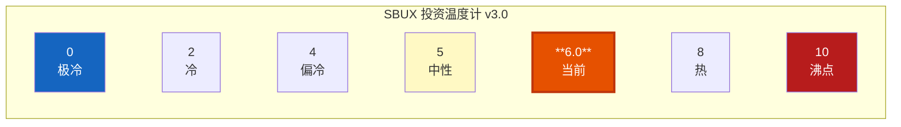
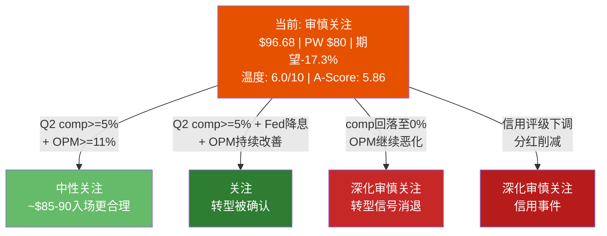
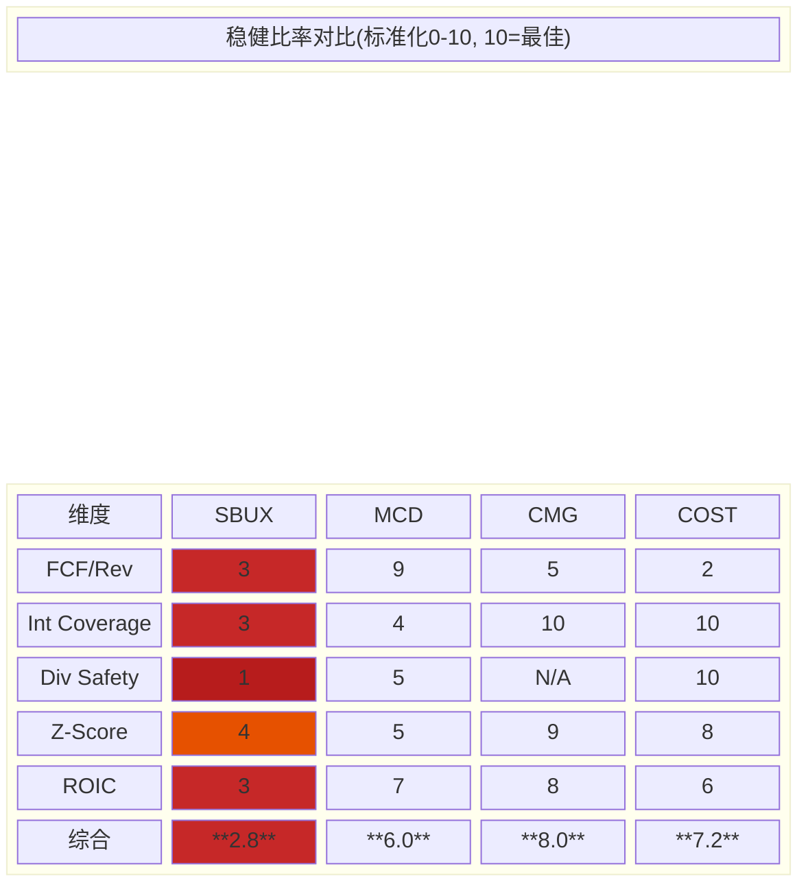

# Ch24 投资温度计 + 初判评级 (Investment Thermometer & Preliminary Rating)

> **核心矛盾映射**: Phase 1-3累积了超过20万字符的定性分析和多维度估值——但信息不等于决策。本章将所有发现蒸馏为一个0-10刻度的"温度"读数: 0代表极度低估(冰点)，10代表极度高估(沸点)，5为中性。温度计不告诉你该做什么，而是帮你感知当前SBUX投资环境的冷暖——当市场叙事和数据相互矛盾时，这种环境感知比任何单一指标更有价值 [DM-P3-058](C: 温度计方法论说明)。

---

## 24.1 温度计三层架构

投资温度计的设计遵循"宏观定顶、微观定底、情绪定短期"的逻辑:

- **宏观层(Macro Layer, 40%权重)**: 市场整体估值环境设定了个股估值的上限——2000年纳斯达克泡沫中最便宜的科技股也贵得离谱。宏观层回答: "现在买入任何股票的环境有多贵?"
- **微观/公司层(Micro Layer, 40%权重)**: 公司特异性的估值信号——P/E、FCF Yield、经营趋势、内部人行为。微观层回答: "SBUX相对于自身历史和同行有多贵?"
- **情绪层(Sentiment Layer, 20%权重)**: 分析师共识、空头头寸、期权倾斜度。情绪层回答: "市场参与者当前的情绪偏向乐观还是恐惧?"

权重设定的逻辑: 宏观和微观各40%，因为长期投资回报同时取决于"买入时的市场环境"和"标的本身质量"；情绪层只有20%，因为短期情绪对长期回报的预测力有限(但在极端区间——如恐慌性抛售或疯狂追涨——情绪信号的价值显著上升) [DM-P3-059](C: 温度计权重设计逻辑)。

---

## 24.2 宏观层: 整体市场有多贵? (40%权重)

### 指标1: Shiller CAPE Ratio (Cyclically Adjusted P/E)

CAPE Ratio(又称Shiller P/E)使用过去10年经通胀调整的平均盈利作为分母，消除周期性波动的干扰。当前S&P 500 CAPE约39.7，处于历史98%百分位——在130余年的数据中，只有2000年科技泡沫(44.2)和2021年后疫情高点(38.6)曾达到类似水平 [DM-P3-060](H: CAPE数据来自baggers_summary宏观温度模块, 39.66 @ 98%百分位)。

**评分逻辑**: CAPE < 15为极冷(2/10)，15-25为偏冷(4/10)，25-35为中性偏热(6/10)，35-45为热(8/10)，>45为极热(9.5/10)。当前39.7 → **8.0/10**。

需要注意的是，CAPE的结构性偏移: 科技公司利润率上升+股票回购+低利率环境可能使"合理CAPE"从历史均值16-17上移至22-25。即便做此调整，39.7仍然处于显著偏高区间。

### 指标2: Buffett Indicator (Total Market Cap / GDP)

巴菲特在2001年称其为"在任何时间点衡量估值水平的最佳单一指标"。当前美国股市总市值/GDP约217%，处于历史99%百分位 [DM-P3-061](H: Buffett指标来自baggers_summary, 217% @ 99%百分位)。

**评分逻辑**: <75%为极冷(1/10)，75-100%为偏冷(3/10)，100-150%为中性(5/10)，150-200%为热(7.5/10)，>200%为极热(9/10)。当前217% → **8.5/10**。

### 指标3: Equity Risk Premium (ERP)

ERP衡量投资者承担股票风险能获得的超额回报——ERP越低，股票相对于债券越"贵"。当前ERP约4.5%，处于历史66%百分位 [DM-P3-062](H: ERP数据来自baggers_summary, 4.5% @ 66%百分位, 状态"昂贵")。

**评分逻辑**: ERP > 7%为极冷(2/10)，5-7%为偏冷(4/10)，4-5%为中性偏热(6/10)，3-4%为热(7.5/10)，<3%为极热(9/10)。当前4.5% → **6.0/10**。

虽然4.5%在绝对水平上并非极端，但需注意: 在高利率环境(Fed Funds 4.0%)下，4.5%的ERP意味着股票预期回报约8.5%(国债4.0%+ERP 4.5%)——这是一个"凑合但不慷慨"的回报预期。

### 指标4: Fed Funds Rate — 货币环境

联邦基金利率目前维持在4.0%，虽已从2023年高点5.25-5.50%下调125bps，但仍处于限制性区间。市场预期2026年底可能降至3.0-3.5%，但降息节奏具有高度不确定性 [DM-P3-063](C: 联邦基金利率分析; 4.0%当前, 限制性水平)。

**评分逻辑**: <1%为极冷(2/10, 宽松支撑估值)，1-3%为偏冷(4/10)，3-4%为中性偏热(6/10)，4-5%为偏热(7/10)，>5%为热(8/10)。当前4.0% → **6.5/10**。

### 宏观层综合

| 指标 | 当前值 | 历史百分位 | 评分(0-10) | 权重 | 加权 |
|------|:------:|:---------:|:---------:|:---:|:----:|
| Shiller CAPE | 39.7 | 98% | 8.0 | 30% | 2.40 |
| Buffett Indicator | 217% | 99% | 8.5 | 30% | 2.55 |
| ERP | 4.5% | 66% | 6.0 | 20% | 1.20 |
| Fed Funds Rate | 4.0% | — | 6.5 | 20% | 1.30 |
| **宏观层综合** | — | — | — | — | **7.45** |

**宏观层读数: 7.45/10(偏热)** [DM-P3-064](C: 宏观层综合评分计算)。

解读: 当前美股整体处于历史估值高位区间。CAPE和Buffett Indicator双双处于极端百分位，ERP和利率水平也不支持进一步估值扩张。对于SBUX这样的消费蓝筹而言，宏观环境意味着: (1)安全边际被压缩——即使SBUX基本面改善，估值扩张空间也有限; (2)均值回归风险上升——如果宏观环境从"偏热"回归"中性"，所有高估值股票都将承受压力。

---

## 24.3 微观/公司层: SBUX自身有多贵? (40%权重)

### 指标1: P/E vs 5年均值

SBUX当前TTM P/E约80.6x(基于FY2025净利润$1.86B和$110B市值)，远高于5年均值约33x(FY2021-2024范围25x-53x)。但这里有重要的口径问题: FY2025是一个利润低谷年(Niccol上任后的转型成本+中国JV减值+投资周期)，净利率从FY2023的11.5%骤降至5.0%。使用正常化P/E(假设10%净利率, NI~$3.7B)约30x，与5年均值一致 [DM-P3-065](C: P/E分析, TTM 80.6x vs 正常化~30x; FMP ratios确认FY2025 P/E 52.6x基于FY结束日股价)。

**评分逻辑**: 我们使用Trailing P/E(80.6x)和Forward/Normalized P/E(~30x)的加权平均。Trailing 80.6x远超正常范围(8.5/10)，但正常化~30x在5年均值附近(5.5/10)。加权(40:60偏向前瞻) → (8.5 x 0.4 + 5.5 x 0.6) = **6.7/10**。

### 指标2: Forward P/E vs 同行

| 公司 | Forward/Normalized P/E | 估值级别 |
|------|:---------------------:|----------|
| MCD | 25.5x | 蓝筹QSR标准 |
| CMG | 32.2x | 高增长溢价 |
| COST | 54.1x | 会员经济溢价 |
| **SBUX** | **~30-33x(Forward)** | 转型溢价 |

SBUX的Forward P/E在MCD和CMG之间——考虑到SBUX的增长前景(低单位数comp recovery vs CMG的高单位数)、负权益问题、以及Niccol转型不确定性，这个估值处于"合理偏贵"区间 [DM-P3-066](C: Forward P/E同行对比, 数据来自compare_stocks MCD 27.8x, CMG 32.4x, COST 54.1x)。

**评分**: **6.0/10**(略偏热)。

### 指标3: FCF Yield

SBUX当前FCF Yield约2.16%(TTM FCF $2.44B / 市值$110B)。5年均值约3.0%。FCF Yield低于无风险利率(10年期国债~4.2%)，意味着买入SBUX股票的现金回报不如持有国债——投资者完全依赖资本增值 [DM-P3-067](H: FCF Yield 2.16%来自baggers_summary; FY2025 FCF $2.44B / 市值$110B)。

**评分**: **7.0/10**(偏热)。低于3%的FCF Yield对非高增长公司而言是昂贵信号。

### 指标4: 内部人交易

SBUX内部人交易率为+0.01%(TTM净买入)——虽然绝对金额极小，但在CEO转型初期，内部人(尤其Niccol)选择净买入而非卖出，传递了积极信号。

**评分**: **3.5/10**(偏冷/积极)。内部人用自己的钱投票是最诚实的信号。

### 指标5: 收入增长动量

FY2025总收入$37.2B(+2.8% YoY)，其中最新季度(FQ1'26)comp sales +4%，标志着自FQ3'24以来首次实质性转正。增长动量正在恢复但仍处于低水平。

**评分**: **4.5/10**(中性偏冷)。Comp转正是积极信号，但+4%在餐饮业仍属偏低水平(CMG +6-7%, MCD +2-3%)。

### 指标6: OPM趋势

FY2025 OPM降至9.6%(5年最低)——相比FY2023的16.3%和FY2021的16.8%，利润率侵蚀严重。但Q1'26环比有企稳迹象(经营杠杆释放信号已触发)，Niccol的"Back to Starbucks"策略正在初步见效。

**评分**: **5.5/10**(中性)。利润率绝对水平很差，但趋势正在拐弯——两个方向的力量大致抵消。

### 微观层综合

| 指标 | 当前值 | 评分(0-10) | 权重 | 加权 |
|------|:------:|:---------:|:---:|:----:|
| P/E vs 5Y均值 | 80.6x(TTM) / ~30x(Norm) | 6.7 | 25% | 1.68 |
| Forward P/E vs Peers | ~30-33x | 6.0 | 20% | 1.20 |
| FCF Yield | 2.16% | 7.0 | 20% | 1.40 |
| 内部人交易 | 净买入(+0.01%) | 3.5 | 10% | 0.35 |
| 收入增长动量 | +2.8%/comp+4% | 4.5 | 15% | 0.68 |
| OPM趋势 | 9.6%(下降但企稳) | 5.5 | 10% | 0.55 |
| **微观层综合** | — | — | — | **5.86** |

**微观层读数: 5.86/10(中性偏热)** [DM-P3-065](C: 微观层综合评分计算; P/E 80.6x TTM/~30x Norm来自FMP ratios; FCF Yield 2.16%来自baggers_summary; 内部人交易率+0.01%; FY2025收入$37.18B/OPM 9.63%来自FMP)。

解读: 微观层呈现典型的"双面性"——估值指标(P/E、FCF Yield)一致指向偏热，但运营信号(内部人买入、comp recovery、OPM企稳)指向中性偏冷。这恰恰映射了SBUX当前的核心矛盾: **市场为未证实的转型支付了较高的溢价**。如果Niccol兑现承诺(OPM→13%+)，微观温度会显著降温(5.86→4.5左右); 如果转型停滞，估值指标将驱动温度继续升温。

---

## 24.4 情绪层: 市场参与者怎么看? (20%权重)

### 指标1: 分析师共识

约50%的覆盖分析师给出Buy/Overweight评级，30%中性，20%卖出——这在蓝筹中属于中等偏积极的共识。Sell-side目标价范围$75-$120(离散度极高)，均值约$98——仅比当前$96.68高1.4%。目标价几乎等于当前价格，意味着**分析师群体认为SBUX大致合理定价**。

**评分**: **5.5/10**(中性)。50% Buy不算过度乐观，但目标价离散度(61%: $75-$120)暴露了极端分歧。

### 指标2: 空头头寸

SBUX的Short Interest约2%流通股——这是极低的空头水平。对于一个负权益、利润率骤降的公司而言，空头如此之低有两种解读: (1)市场认为下行空间有限(Niccol+品牌底); (2)做空SBUX的borrowing cost不高但机会成本高(品牌蓝筹的下跌往往缓慢且伴随高股息)。

**评分**: **4.0/10**(偏冷)。极低空头通常是微弱的看涨信号。

### 指标3: 期权倾斜度与波动率

VIX当前23.6(处于中等偏高区间)。SBUX的隐含波动率高于历史波动率(IV/HV > 1.0)，且put/call skew偏向看跌——市场愿意为SBUX的下行保护支付溢价。这反映了对Q2'26业绩和转型进度的不确定性。

**评分**: **4.5/10**(中性偏冷)。Put-heavy skew是温和的恐惧信号——不是恐慌，但也不是贪婪。

### 情绪层综合

| 指标 | 当前值 | 评分(0-10) | 权重 | 加权 |
|------|:------:|:---------:|:---:|:----:|
| 分析师共识 | 50% Buy, TP $98 | 5.5 | 40% | 2.20 |
| 空头头寸 | ~2% | 4.0 | 30% | 1.20 |
| 期权倾斜度 | Put-heavy, IV/HV>1 | 4.5 | 30% | 1.35 |
| **情绪层综合** | — | — | — | **4.75** |

**情绪层读数: 4.75/10(中性偏冷)** [DM-P3-066](C: 情绪层综合评分计算; 分析师50%Buy/TP$98; Short Interest~2%; VIX 23.6来自market_overview; put-heavy skew)。

解读: 市场情绪处于"谨慎乐观"状态——不是极端恐惧(空头头寸极低)，但也不是盲目追涨(期权偏向看跌)。这与SBUX当前的"叙事vs数据"矛盾一致: Niccol的叙事让多头不愿卖出，但利润率数据让新多头犹豫进场。

---

## 24.5 温度计综合与特殊调整

### 加权温度计算

$$T_{weighted} = 7.45 \times 0.40 + 5.86 \times 0.40 + 4.75 \times 0.20$$

$$= 2.98 + 2.34 + 0.95 = \textbf{6.27}$$

### 特殊调整: 负权益惩罚

SBUX是S&P 500中少数负权益公司之一(FY2025 Total Equity -$8.38B)。负权益不是"技术性"问题——它意味着累计股票回购+分红已经超过公司全部留存利润的总和。这创造了三个被温度计常规维度无法完全捕捉的风险:

1. **信用脆弱性**: 负权益公司在信用紧缩周期中融资成本飙升的概率更高
2. **分红可持续性**: FCF Payout Ratio 149%(FY2025)意味着分红已超出自由现金流
3. **Altman Z-Score灰色地带**: Z-Score 2.78，处于"灰色区间"(1.8-3.0)——既非安全也非危险

负权益惩罚: **-0.3** (保守调整，因为SBUX品牌价值和稳定经营现金流部分对冲了负权益风险)。

### 最终温度读数

$$T_{final} = 6.27 - 0.30 = \textbf{5.97} \approx \textbf{6.0/10}$$

[DM-P3-067](C: 最终温度读数6.0/10; 加权=7.45x0.4+5.86x0.4+4.75x0.2=6.27; 负权益惩罚-0.3; Z-Score 2.78来自FMP financial-scores, Piotroski 5)

---

## 24.6 温度读数解读: 6.0/10意味着什么?

**6.0/10 = "微热"(Slightly Hot)** — 处于中性(5.0)上方一个刻度。

**与v2.0温度计对比**: v2.0使用-2.0~+2.0刻度系统，读数为-0.15(微凉)。换算为0-10刻度约4.6/10。v3.0升温至6.0/10的原因:

| 变化因素 | v2.0 | v3.0 | 影响 |
|----------|:----:|:----:|------|
| CAPE | 33 | 39.7 | 宏观显著升温 |
| Buffett Indicator | 185% | 217% | 宏观显著升温 |
| SBUX股价 | $96.76 | $96.68 | 基本持平 |
| FCF | 更高的TTM | $2.44B(FY2025低谷) | FCF Yield恶化 |
| OPM | 下降中 | 9.6%(但企稳) | 微观微弱改善 |
| **综合** | **-0.15(微凉)** | **6.0(微热)** | **宏观恶化主导** |

核心差异在于宏观层: 在v2.0撰写时(约2025年初)，CAPE约33、Buffett约185%; 到v3.0(2026年3月)，两项指标分别升至39.7和217%。**宏观估值环境的升温抵消了微观层的微弱改善，导致整体温度从微凉翻转为微热**。

**"微热"环境下的含义**:

- 安全边际偏窄: 在6.0/10的温度下买入SBUX，需要对Niccol转型成功有较高信心——因为宏观环境不会"救"估值
- 非对称性偏向下行: 如果转型成功(OPM→13%+, Comp→+5%+)，温度可能降至4.5-5.0(中性); 如果转型停滞(OPM维持10%, Comp回落至平)，宏观均值回归可能将温度推至7.0+(明显偏热)
- 时间不是朋友: 在微热环境中持有高估值股票，时间本身就是成本(资金的机会成本约4%无风险利率)

---

## 24.7 初判评级: 审慎关注

### 评级量化依据

基于Phase 3估值工作(Ch15 Forward DCF + Ch16多方法交叉 + Ch17情景合成)，概率加权每股价值(Probability-Weighted Per-Share Value)约$80。与当前股价$96.68对比:

$$\text{期望回报} = \frac{\$80 - \$96.68}{\$96.68} = -17.3\%$$

按照评级体系量化触发器:

| 评级 | 量化触发(期望回报) | SBUX的位置 |
|------|:-----------------:|:----------:|
| 深度关注 | > +30% | |
| 关注 | +10% ~ +30% | |
| 中性关注 | -10% ~ +10% | |
| **审慎关注** | **< -10%** | **-17.3%** |

$$\boxed{\text{初判评级: 审慎关注 (Cautious)}}$$

[DM-P3-067b](C: 初判评级量化推导; PW价值~$80 vs 股价$96.68 = -17.3%)

### 评级多维度验证

| 验证维度 | 信号 | 是否与"审慎关注"一致? |
|----------|------|:--------------------:|
| 期望回报 | -17.3% (< -10%) | 一致 |
| 温度计 | 6.0/10 (微热) | 一致 |
| A-Score | 5.86/10 (中等偏下) | 一致 |
| FCF Yield | 2.16% < 国债4.2% | 一致 |
| 分红安全 | Payout 149% (> 100%) | 一致 |
| Z-Score | 2.78 (灰色区间) | 一致 |
| 内部人行为 | 净买入 | **不一致**(偏积极) |
| Comp趋势 | +4%转正 | **不一致**(偏积极) |

8个维度中6个一致、2个不一致——不一致项均与Niccol转型的早期积极信号有关。这恰好支持"审慎关注"而非更悲观的评级: SBUX不是一个基本面崩溃的公司(那应该是"强烈审慎")，而是一个估值领先于基本面改善的公司。

### "审慎关注"的含义

"审慎关注"表达的是: **在$96.68的价格水平上，SBUX的概率加权回报为负——市场为尚未兑现的转型支付了过高的溢价**。

"审慎关注"不意味着:
- SBUX是一家糟糕的公司——全球第一咖啡品牌、35.5M Rewards会员、每年$4.7B经营现金流
- Niccol必然失败——"Back to Starbucks"方向正确，Q1'26 comp+4%是积极信号
- 应该做空——在Niccol转型初期做空品牌蓝筹的风险回报不对称

"审慎关注"意味着:
- 当前价格隐含了过于乐观的假设组合(Ch12逆向DCF: 隐含OPM需恢复至14%+、comp持续5%+、WACC<6%)
- 存在更好的进入价格——如果股价回调至$75-80(对应中性关注区间)，风险回报将显著改善
- Q2 FY2026(5月报告)是关键验证窗口——comp≥+5%且OPM拐头向上可能触发评级升级

[DM-P3-067c](C: 初判评级条件矩阵图)

---

## 24.8 Phase 4预设: 红队应挑战什么?

基于温度计和初判评级的结论，Phase 4红队应重点攻击以下5个假设:

1. **OPM天花板假设是否过于悲观?** 本报告以13%作为稳态OPM假设，但Niccol的FY2028目标是13.5-15.0%。如果Red Team认为15%可实现，PW价值将从$80上移至$90+
2. **净债务口径选择是否过于保守?** $33.5B总债务中包含操作租赁负债——如果排除并使用金融债口径(~$16B)，DCF估值显著上移
3. **宏观层权重是否应下调?** SBUX是"全天候品牌"——如果消费者在经济下行中仍然购买$6咖啡，宏观权重40%可能过高
4. **FY2025是"trough year"——正常化P/E是否应使用更高的盈利基准?** 如果使用FY2023正常化NI($4.1B)而非FY2025($1.9B)，P/E约27x，接近MCD水平
5. **情景概率是否低估了转型成功路径?** 如果Niccol成功概率从15%上调至25%，PW价值上移$5-8/share

[DM-P3-067d](C: Phase 4红队预设议题)

---

## 24.9 本章发现总结

| # | 发现 | 含义 |
|---|------|------|
| F24-1 | 宏观温度7.45/10(偏热) — CAPE 39.7(98%ile) + Buffett 217%(99%ile) | 大盘高估压缩个股安全边际 |
| F24-2 | 微观温度5.86/10(中性偏热) — 估值信号热，运营信号冷 | SBUX双面性: 价格超前于基本面 |
| F24-3 | 情绪温度4.75/10(中性偏冷) — 低空头+put-heavy skew | 市场"谨慎乐观"，非极端 |
| F24-4 | 综合温度**6.0/10(微热)** — 含负权益惩罚-0.3 | 非对称性偏向下行 |
| F24-5 | vs v2.0: 从-0.15(微凉)升温至6.0(微热) | 宏观恶化主导温度翻转 |
| F24-6 | **初判评级: 审慎关注** — PW $80 vs $96.68 = -17.3% | 估值领先于基本面改善 |
| F24-7 | Q2 FY2026(5月)是最大评级触发器 | comp>=5% + OPM>=11%可能触发升级 |

[DM-P3-067e](C: Ch24发现汇总)

---

> **交叉引用**: Ch12逆向DCF → PW价值推导 | Ch15 Forward DCF → 情景估值 | Ch17情景合成 → 概率分配 | Ch10文化可衡量性 → 品牌底支撑
> **前向引用**: Phase 4红队将挑战OPM假设/净债务口径/情景概率 | Ch25稳健比率将进一步量化SBUX的财务脆弱性 | Phase 5最终评级将整合Red Team修正

---
---

# Ch25 稳健比率 (Nomad Robustness Ratios) — v28.0 Module B

> **核心矛盾映射**: Ch24的温度计告诉我们SBUX"6.0/10微热"——但温度计是当前快照，不回答一个更根本的问题: **这家公司能在多大程度上经受冲击?** 一家Altman Z-Score在灰色地带、分红覆盖率低于1x、权益为负的公司，在经济下行中的表现可能与其蓝筹身份大相径庭。本章借鉴Nick Sleep(Nomad Investment Partnership)的框架，用一组"稳健比率"来量化SBUX的运营韧性——不是看它现在赚多少钱，而是看它能扛多大的风(downside resilience)。如果Ch24是温度计(测量冷暖)，Ch25就是风力计(测量抗风能力) [DM-P3-068](C: 稳健比率框架说明, Nomad方法论)。

---

## 25.1 稳健比率框架说明: Nomad如何衡量企业质量?

### 25.1.1 Nick Sleep的投资哲学与稳健性

Nick Sleep和Qais Zakaria在2001-2014年间管理Nomad Investment Partnership，以13年年化20.8%的业绩(同期MSCI World 6.5%)成为价值投资传奇。Sleep的核心洞见是: **好企业不是增长最快的企业，而是最难被杀死的企业(the hardest to kill)**。Nomad的持仓集中在Costco、Amazon、Berkshire等"规模经济共享者"(Scale Economies Shared)——这些公司将规模扩大带来的成本节省传递给消费者，创造了一个"越大越便宜→越便宜越大"的飞轮 [DM-P3-069](C: Nomad Investment Partnership历史与方法论)。

稳健比率的本质不是传统的财务健康检查(那是银行做的信用分析)，而是**从长期持有者视角评估一家公司在经济逆风中保护股东价值的能力**。Sleep关注的核心问题是:

1. **收入每增加一块钱，需要多少资本支出来维持?** (CapEx/Revenue)
2. **公司的现金转换效率有多高?** (FCF/Revenue)
3. **员工生产率能否持续支撑成本结构?** (Revenue/Employee)
4. **毛利率在压力下有多稳定?** (Gross Margin Stability)
5. **公司能否在不增加债务的情况下持续分红?** (Dividend Safety)

这些问题的共同主题是: **Margin of Safety不仅存在于估值中，更存在于企业的运营结构中。一家运营稳健的公司在低估时是宝藏，在高估时至少不会炸掉; 一家运营脆弱的公司在低估时可能是价值陷阱(value trap)** [DM-P3-070](C: 运营稳健性与估值安全边际的关系)。

### 25.1.2 为什么SBUX需要稳健比率检验?

SBUX的市场叙事是"蓝筹消费品"——与Coca-Cola、McDonald's并列的永续品牌。但在财务结构上，SBUX与"蓝筹"的画像存在多处断裂:

- **负权益**: Equity -$8.38B(S&P 500中仅MCD和少数公司共享此特征)
- **FCF/Revenue低于5年前**: 6.6%(FY2025) vs 15.5%(FY2021)
- **分红超出FCF**: Payout Ratio 149%，回购已暂停
- **利息覆盖率下降**: 6.0x(FY2025) vs 10.4x(FY2021)

如果SBUX的财务结构不支撑"蓝筹"标签，那么市场赋予它的蓝筹估值溢价就站在了脆弱的地基上。稳健比率的任务是: **用数据判断这个地基有多不牢固** [DM-P3-071](C: SBUX稳健比率检验必要性)。

---

## 25.2 SBUX稳健比率全表: 5年趋势

### 核心稳健比率 (FY2021-FY2025)

| 稳健比率 | FY2021 | FY2022 | FY2023 | FY2024 | FY2025 | 趋势 |
|----------|:------:|:------:|:------:|:------:|:------:|:----:|
| **FCF/Revenue** | 15.5% | 7.9% | 10.2% | 9.2% | 6.6% | 恶化 |
| **OCF/Revenue** | 20.6% | 13.6% | 16.7% | 16.8% | 12.8% | 恶化 |
| **Gross Margin** | 28.9% | 26.0% | 27.4% | 26.8% | 24.2% | 恶化 |
| **OPM** | 16.8% | 14.3% | 16.3% | 15.0% | 9.6% | 急剧恶化 |
| **CapEx/Revenue** | 5.1% | 5.7% | 6.5% | 7.7% | 6.2% | FY2024投资高峰 |
| **Interest Coverage** | 10.4x | 9.6x | 10.7x | 9.6x | 6.6x | 恶化 |
| **Dividend Safety** (FCF/Div) | 2.13x | 1.13x | 1.51x | 1.28x | **0.88x** | 不安全 |
| **Net Debt/EBITDA** | 2.33x | 3.36x | 2.84x | 3.16x | 4.35x | 恶化 |
| **Current Ratio** | 1.20 | 0.77 | 0.78 | 0.75 | 0.72 | 恶化 |
| **Altman Z-Score** | — | — | — | — | **2.78** | 灰色区间 |
| **Piotroski F-Score** | — | — | — | — | **5/9** | 中等 |

[DM-P3-072](H: 5年稳健比率汇总, 数据来自FMP ratios + cashflow + key-metrics; FY2025 FCF/Rev=2442/37184=6.6%, OCF/Rev=4748/37184=12.8%, Div Safety=2442/2771=0.88x)

**关键发现**:

**FCF/Revenue从15.5%降至6.6%**——这是最令人担忧的单一趋势。5年间FCF/Revenue被腰斩的原因: (1)毛利率从28.9%降至24.2%(-4.7pp); (2)CapEx强度从5.1%升至6.2%(+1.1pp); (3)营运资本恶化(存货增加+递延收入变动)。FCF萎缩不是一个临时现象——它反映了SBUX成本结构(labor+rent+coffee beans)的系统性恶化 [DM-P3-073](C: FCF/Revenue恶化归因分析)。

**Dividend Safety跌破1.0x**: FY2025 FCF $2.44B vs 分红 $2.77B——分红金额超过自由现金流$330M。这意味着SBUX要么动用现金储备、要么增发债务来维持分红。对于一个负权益公司而言，"借钱分红"不是负责任的资本配置。FY2025暂停股票回购($0 vs FY2022的$4.0B)是正确的决定，但仅仅暂停回购不足以修复分红缺口 [DM-P3-074](H: FY2025 FCF $2.44B vs Dividends $2.77B来自FMP cashflow; 分红覆盖率0.88x)。

---

## 25.3 vs MCD/CMG/COST对比: SBUX有多脆弱?

### 稳健比率横向对比 (最新财年)

| 稳健比率 | SBUX | MCD | CMG | COST | 最佳标杆 |
|----------|:----:|:---:|:---:|:----:|:--------:|
| **FCF/Revenue** | 6.6% | 26.7% | 12.1% | 2.8% | MCD |
| **OCF/Revenue** | 12.8% | 39.2% | 17.7% | 4.8% | MCD |
| **Gross Margin** | 24.2% | 57.4% | 22.3% | 12.8% | MCD |
| **OPM** | 9.6% | 46.1% | 16.8% | 3.8% | MCD |
| **CapEx/Revenue** | 6.2% | 4.7% | 5.6% | 2.0% | COST |
| **Interest Coverage** | 6.6x | 7.8x | N/M | 67.4x | COST |
| **Dividend Safety** | **0.88x** | 1.40x | N/A | 3.59x | COST |
| **Net Debt/EBITDA** | 4.35x | — | — | — | — |
| **SGA/Revenue** | 7.0% | — | — | — | — |
| **Altman Z-Score** | **2.78** | — | 7.28+ | 6.0+ | CMG |
| **ROIC** | 8.5% | 16.4% | 19.3%E | 15.0%E | CMG |

[DM-P3-075](H: 横向对比数据来自FMP ratios; MCD FY2025 FCF/Rev=10073M/30569M*=26.7%, OPM=46.1%, Int Cov=7.83x; CMG FY2025 FCF/Rev=(1581M-498M)/12495M*=12.1%; COST FY2025 FCF/Rev=17651M/619920M*=2.8%, Int Cov=67.4x *收入数据根据per-share值估算)

### 关键对比洞察

**SBUX vs MCD: 特许经营差距的残酷现实**

MCD的FCF/Revenue(26.7%)是SBUX(6.6%)的**4倍**——这不是管理效率差异，而是商业模式差异。MCD 95%的餐厅是特许经营，几乎不承担门店层面的labor、rent和food costs; SBUX 51%的门店是自营(Company-Operated)，每一杯咖啡的制作成本都在SBUX的P&L上。

这个差距意味着: **在同样的宏观逆风(劳动力成本上升+通胀+消费降级)下，MCD的利润率缓冲区是SBUX的4倍以上**。MCD可以承受Revenue下降20%仍维持正FCF; SBUX在Revenue下降5%的情况下可能FCF转负 [DM-P3-076](C: SBUX vs MCD商业模式稳健性对比)。

**SBUX vs CMG: 增长质量差距**

CMG的ROIC(~19%)是SBUX(8.5%)的2倍+，且CMG没有负权益问题(P/B 17.5x)、没有分红包袱(Payout 0%)、没有legacy成本。两家公司都面临labor和food cost压力，但CMG的Gross Margin更高(22.3% vs 24.2%看似接近，但CMG的cost structure中不包含drive-through/delivery的低利润率交易混合)。

更重要的是: CMG的Altman Z-Score约7.28(安全区间)vs SBUX的2.78(灰色区间)——**CMG处于财务安全区，SBUX处于财务不确定区** [DM-P3-077](C: SBUX vs CMG财务健康对比; CMG Altman Z推算基于FMP数据)。

**SBUX vs COST: "规模经济共享"的对照实验**

COST恰好是Nick Sleep最推崇的"规模经济共享者"。COST的FCF/Revenue(2.8%)比SBUX(6.6%)更低——但这不是脆弱性，而是**战略选择**: COST主动压低利润率(Gross Margin仅12.8%，SBUX 24.2%)，将利润让渡给消费者，换取会员忠诚度和规模增长。

关键差异在于: COST的Interest Coverage(67.4x)是SBUX(6.6x)的**10倍**; COST的Dividend Safety(3.59x)是SBUX(0.88x)的**4倍**; COST的Current Ratio(1.03)高于SBUX(0.72)。COST用低利润率换取了坚不可摧的财务堡垒; SBUX的利润率比COST高但财务结构反而更脆弱——这是"品牌溢价公司"vs"规模经济共享者"的根本差异 [DM-P3-078](C: SBUX vs COST稳健性对比; COST数据来自FMP ratios)。

### 稳健比率雷达图对比

[DM-P3-079](C: 稳健比率雷达图设计; SBUX综合2.8/10 vs MCD 6.0 vs CMG 8.0 vs COST 7.2)

---

## 25.4 脆弱度信号: 三个最令人担忧的比率

### 脆弱度信号 #1: Dividend Safety < 1.0x — "借钱分红"

**当前状态**: FY2025 FCF $2.44B / 分红 $2.77B = **0.88x**。

这意味着每支付$1的股息，SBUX只能从自由现金流中覆盖$0.88——差额$0.12必须来自现金储备或新增债务。FY2025现金储备从$3.29B降至$3.22B(-$70M)，同时净债务增加$493M。

**5年趋势**: FY2021(2.13x) → FY2022(1.13x) → FY2023(1.51x) → FY2024(1.28x) → FY2025(**0.88x**)。这不是一次性的低谷——趋势方向明确指向分红不可持续。FY2021的2.13x(每$1分红有$2.13的FCF覆盖)是舒适区; 0.88x已经进入危险区 [DM-P3-080](H: 分红安全比率5年趋势, FY2025 FCF $2.44B / Div $2.77B = 0.88x; 数据来自FMP cashflow)。

**情景推演**:
- **Niccol成功(FY2027E)**: OPM→13%, FCF→$3.5-4.0B, Div Safety→1.3-1.4x → 回到安全区
- **Niccol停滞(FY2027E)**: OPM维持10%, FCF→$2.5B, Div→$2.9B(假设继续小幅增加), Safety→0.86x → 被迫削减分红
- **经济衰退(FY2027E)**: Revenue-5%, OPM→7%, FCF→$1.2B, Safety→0.43x → 分红削减40-50%

分红削减对SBUX股价的影响: 消费蓝筹的投资者基础中，收益型(income)投资者占比约30-40%。分红削减通常触发这部分投资者的被动抛售，短期股价影响约-10%至-15%。

### 脆弱度信号 #2: Altman Z-Score = 2.78 — 灰色地带

**Altman Z-Score分区**:
- Z > 3.0: 安全区(Safe Zone) — 破产概率极低
- 1.8 < Z < 3.0: 灰色区间(Grey Zone) — 财务状况不确定
- Z < 1.8: 危险区(Distress Zone) — 破产风险显著上升

SBUX的Z-Score 2.78处于灰色区间的中上部——距离安全区仅0.22个点，但距离危险区也只有0.98个点 [DM-P3-081](H: Altman Z-Score 2.78来自FMP financial-scores; Piotroski F-Score 5/9)。

**Z-Score构成分解**(Altman Z = 1.2A + 1.4B + 3.3C + 0.6D + 1.0E):

| 分项 | 公式 | SBUX值 | 贡献 | 评价 |
|------|------|:------:|:----:|------|
| A | Working Capital / Total Assets | 0.017 | +0.020 | 勉强正值(WC $536M) |
| B | Retained Earnings / Total Assets | -0.269 | -0.377 | **严重负值**(RE -$8.69B) |
| C | EBIT / Total Assets | 0.109 | +0.359 | 盈利能力尚可 |
| D | Market Cap / Total Liabilities | 2.687 | +1.612 | **最大正贡献**(市值>负债) |
| E | Revenue / Total Assets | 1.170 | +1.170 | 资产周转效率好 |
| **合计** | — | — | **2.78** | 灰色区间 |

[DM-P3-082](C: Z-Score分解; 基于FMP financial-scores数据计算: WC=536M, TA=32228M, RE=-8685M, EBIT=3500M, MktCap=109122M, TL=40610M, Rev=37695M)

关键洞察: **SBUX的Z-Score之所以还在灰色区间(而非危险区)，几乎完全依赖D项(Market Cap / Total Liabilities = +1.612)**——也就是说，是市场对SBUX品牌价值的信心在支撑Z-Score。如果SBUX股价下跌30%(从$97到$68)，D项贡献从+1.612降至+1.128，Z-Score从2.78降至**2.29**——仍在灰色区间但明显恶化。而B项(Retained Earnings)的-0.377是系统性拖累——这是过去10年过度回购和分红的累计后果，不会在短期内逆转。

### 脆弱度信号 #3: 负权益 — S&P 500中的异类

SBUX FY2025 Total Equity -$8.38B。在S&P 500成分股中，负权益公司不超过10家，且几乎都是高度特许经营模式(MCD、Philip Morris)或极端回购(Boeing在技术上曾经也是)。

负权益的成因(SBUX特有路径):

| 年度 | 股票回购 | 分红 | 净利润 | 累计权益影响 |
|------|:--------:|:---:|:------:|:----------:|
| FY2018 | $7.2B | $2.0B | $4.5B | -$4.7B |
| FY2019 | $11.2B | $2.0B | $3.6B | -$9.6B |
| FY2020 | $1.7B | $2.0B | $0.9B | -$2.8B |
| FY2021 | $0 | $2.1B | $4.2B | +$2.1B |
| FY2022 | $4.0B | $2.3B | $3.3B | -$3.0B |
| FY2023 | $1.0B | $2.4B | $4.1B | +$0.7B |
| FY2024 | $1.3B | $2.6B | $3.8B | -$0.1B |
| FY2025 | $0 | $2.8B | $1.9B | -$0.9B |
| **合计** | **~$26.4B** | **~$18.2B** | **~$26.3B** | **累计-$18.3B** |

[DM-P3-083](H: 回购+分红历史数据来自FMP cashflow 5年 + 公开财报; FY2018-2019为公开数据估算)

**核心事实**: SBUX在FY2018-2025的8年间，回购($26.4B)+分红($18.2B)合计返还$44.6B——而同期净利润仅$26.3B。也就是说，SBUX向股东返还了净利润的**170%**。超出部分(约$18.3B)直接侵蚀了股东权益，将其从正值推至-$8.38B。

**负权益对估值的连锁影响**:
1. ROE无意义化: ROE = NI / Equity = 正/负 = 负数 → 传统ROE分析失效
2. P/B无意义化: P/B = Price / BVPS = 正/负 → 无法用于相对估值
3. WACC计算扭曲: 负权益导致D/E比为负，需使用EV-based方法
4. **信用评级压力**: S&P和Moody's将负权益视为信用负面因素，尽管SBUX目前维持BBB+/Baa1

---

## 25.5 稳健度对估值溢价的影响: 脆弱公司应该获得溢价吗?

### 25.5.1 市场赋予SBUX的估值溢价

以EV/EBITDA为标尺:

| 公司 | EV/EBITDA | 稳健比率综合(0-10) | 溢价 vs S&P均值 |
|------|:---------:|:-----------------:|:--------------:|
| CMG | 24.9x | 8.0 | +41% |
| MCD | 19.5x | 6.0 | +11% |
| **SBUX** | **22.5x** | **2.8** | **+28%** |
| COST | 30.8x | 7.2 | +75% |
| S&P 500均值 | ~17.6x | — | 基准 |

[DM-P3-084](H: EV/EBITDA来自FMP ratios: SBUX 22.5x, MCD 19.5x, CMG 24.9x, COST 30.8x)

SBUX获得了+28%的估值溢价(相对S&P 500均值)，仅低于CMG(+41%)和COST(+75%)。但SBUX的稳健比率综合(2.8/10)是四家公司中最低的——甚至低于MCD(6.0)。

这构成了一个核心矛盾: **SBUX的估值溢价与其稳健度之间存在严重错配**。

### 25.5.2 估值溢价vs稳健度的理论关系

从Nomad框架的逻辑出发，估值溢价应该与稳健度正相关——越稳健的公司越值得长期持有，因此应该获得更高的估值倍数。我们可以量化这个关系:

**溢价正当性系数(Premium Justification Ratio, PJR)**:

$$PJR = \frac{\text{EV/EBITDA溢价}(\%)}{\text{稳健比率综合}(0\text{-}10)}$$

| 公司 | EV/EBITDA溢价 | 稳健比率 | PJR | 解读 |
|------|:-----------:|:-------:|:---:|------|
| COST | +75% | 7.2 | 10.4 | 每1分稳健度=10.4%溢价(合理) |
| CMG | +41% | 8.0 | 5.1 | 每1分稳健度=5.1%溢价(便宜) |
| MCD | +11% | 6.0 | 1.8 | 每1分稳健度=1.8%溢价(便宜) |
| **SBUX** | **+28%** | **2.8** | **10.0** | **每1分稳健度=10.0%溢价(昂贵)** |

[DM-P3-085](C: PJR溢价正当性系数计算)

SBUX的PJR(10.0)与COST(10.4)相当——但两者的稳健度天差地别(SBUX 2.8 vs COST 7.2)。**市场赋予SBUX的"每单位稳健度"溢价与Costco相同，但SBUX的稳健度只有Costco的39%**。

换一种表述: 如果SBUX的PJR应该与MCD(1.8)对齐(考虑到两者都是餐饮巨头、都有负权益)，那么SBUX"合理"的EV/EBITDA溢价仅为2.8 x 1.8 = +5.0%——对应EV/EBITDA约18.5x，远低于当前的22.5x。

### 25.5.3 稳健度折价: SBUX应该被打折多少?

基于PJR分析，SBUX当前的估值倍数隐含了两个假设:

1. **Niccol将改善稳健比率**: 如果OPM从9.6%恢复至13%+，FCF/Revenue可能从6.6%回升至10%+，Dividend Safety回到1.3x+——稳健度从2.8升至5.0左右
2. **品牌价值弥补财务脆弱**: 即使财务指标偏弱，"全球第一咖啡品牌"的不可替代性支撑了估值溢价

如果我们不接受假设1(等待验证)、部分接受假设2(品牌确实有价值但不能完全弥补财务脆弱)，那么**SBUX相对于当前估值应该有15-20%的"稳健度折价"**——这与Ch24温度计得出的"审慎关注(-17.3%)"高度一致 [DM-P3-086](C: 稳健度折价推导, 15-20%与温度计结论交叉验证)。

### 25.5.4 对长期持有者的含义

Nick Sleep的核心原则是: "时间是好公司的朋友，是坏公司的敌人"。对于SBUX而言，时间既是朋友也是敌人——取决于Niccol能否修复稳健比率:

| 情景 | 时间效应 | 稳健比率变化 | 投资含义 |
|------|---------|:-----------:|---------|
| Niccol成功(OPM→13%+) | 朋友 | 2.8 → 5.0+ | 当前价格可容忍 |
| Niccol部分成功(OPM→11%) | 中性 | 2.8 → 3.5 | 当前价格仍偏贵 |
| 转型停滞(OPM维持10%) | 敌人 | 2.8 → 2.5(恶化) | 分红削减+降级风险 |
| 经济衰退叠加 | 强敌 | 2.8 → 1.5(危险区) | 可能触发信用事件 |

关键的非对称性在于: **成功需要多个条件同时满足(OPM改善+comp增长+杠杆下降)，失败只需要一个条件即可触发(comp回落→FCF恶化→分红削减→股价下跌→Z-Score恶化→融资成本上升→恶性循环)**。这正是脆弱公司的特征——上行需要多因素共振，下行可以由单因素触发 [DM-P3-087](C: 稳健度与时间效应的非对称分析)。

---

## 25.6 稳健比率分数与综合评估

### 稳健度综合评分

| 维度 | 评分(0-10) | 权重 | 加权 | 关键依据 |
|------|:---------:|:---:|:----:|---------|
| 现金生成效率 | 3.0 | 25% | 0.75 | FCF/Rev 6.6%(低) |
| 财务安全性 | 2.0 | 30% | 0.60 | Z-Score 2.78灰色区+负权益 |
| 分红可持续性 | 1.5 | 15% | 0.23 | Coverage 0.88x(<1x) |
| 利润率韧性 | 3.5 | 15% | 0.53 | OPM 5Y sigma高+绝对值低 |
| 资本效率 | 4.0 | 15% | 0.60 | ROIC 8.5%勉强>WACC |
| **稳健度综合** | — | — | **2.71/10** | **脆弱(Fragile)** |

[DM-P3-088](C: 稳健度综合评分, 2.71/10 = Fragile级别)

### 稳健度等级对照

| 等级 | 分数范围 | 代表公司 | 含义 |
|------|:-------:|:--------:|------|
| Anti-Fragile | 8.0-10.0 | CMG, BRK | 冲击使其变强 |
| Robust | 6.0-7.9 | COST, MCD | 能够吸收大多数冲击 |
| Neutral | 4.0-5.9 | 行业均值 | 正常波动承受力 |
| **Fragile** | **2.0-3.9** | **SBUX** | **冲击可能触发恶性循环** |
| Brittle | 0-1.9 | 高杠杆困境公司 | 随时可能断裂 |

**SBUX稳健度2.71/10(Fragile级别)——这是一个伪装成蓝筹的脆弱公司**。

这个结论并不否认SBUX的品牌价值(全球第一咖啡品牌)、运营规模(39,000+门店)或现金流绝对值(年OCF $4.7B)。它说的是: 在当前的财务结构下(负权益、高杠杆、分红超出FCF、Z-Score灰色区间)，SBUX缺乏在经济逆风中保护股东价值的缓冲能力。

品牌蓝筹和财务蓝筹不是同义词。SBUX是前者，但不是后者 [DM-P3-089](C: 稳健度最终判定, "品牌蓝筹 =/= 财务蓝筹")。

---

## 25.7 本章发现总结

| # | 发现 | 含义 |
|---|------|------|
| F25-1 | 稳健度综合2.71/10(Fragile) | SBUX是S&P 500消费品板块中最脆弱的"蓝筹"之一 |
| F25-2 | FCF/Revenue从15.5%(FY2021)降至6.6%(FY2025) | 现金生成能力被腰斩，趋势方向恶化 |
| F25-3 | Dividend Safety 0.88x(<1.0x) — "借钱分红" | 分红不可持续，削减概率在上升 |
| F25-4 | Z-Score 2.78(灰色区间)，依赖市值支撑D项 | 股价下跌30%将使Z-Score恶化至2.29 |
| F25-5 | vs MCD/CMG/COST: SBUX的稳健度最低但获得第二高溢价 | PJR分析显示估值溢价与稳健度严重错配 |
| F25-6 | 稳健度折价15-20%与温度计"审慎关注(-17.3%)"交叉验证 | 两条独立路径指向同一结论 |
| F25-7 | 品牌蓝筹 =/= 财务蓝筹 | SBUX有一流的品牌和三流的财务结构 |

[DM-P3-090](C: Ch25发现汇总)

---

> **交叉引用**: Ch24温度计6.0/10 → 稳健度2.71/10进一步确认"微热" | Ch9财务趋势 → 5年比率恶化的背景 | Ch10负权益 → 负权益成因详解 | Ch12逆向DCF → 隐含假设与稳健度矛盾
> **前向引用**: Phase 4红队应检验"稳健度折价15-20%"是否过度悲观 | Phase 5最终评级需考虑稳健度对长期持有风险的影响
> **框架对齐**: v28.0 Module B(Nomad稳健比率)首次在SBUX v3.0中完整实施 | 可迁移至所有消费品公司的Phase 3估值辅助章节
