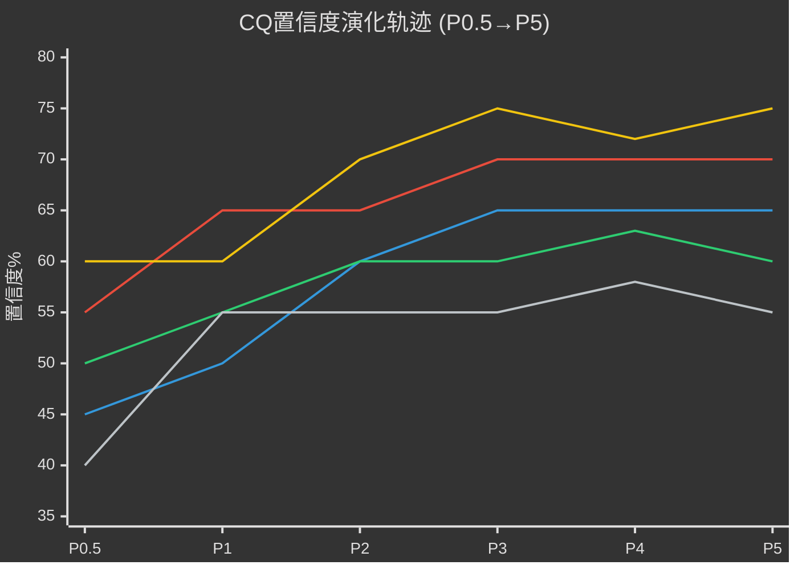
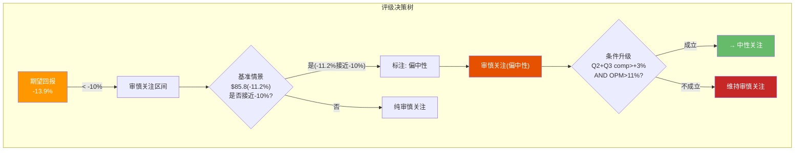
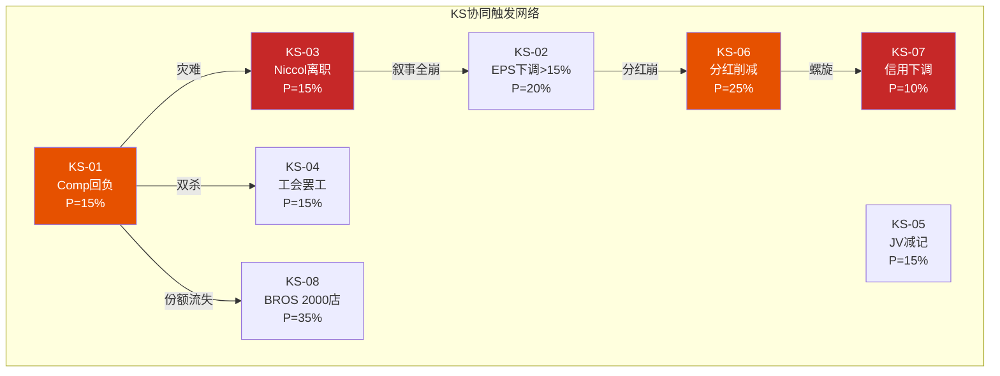
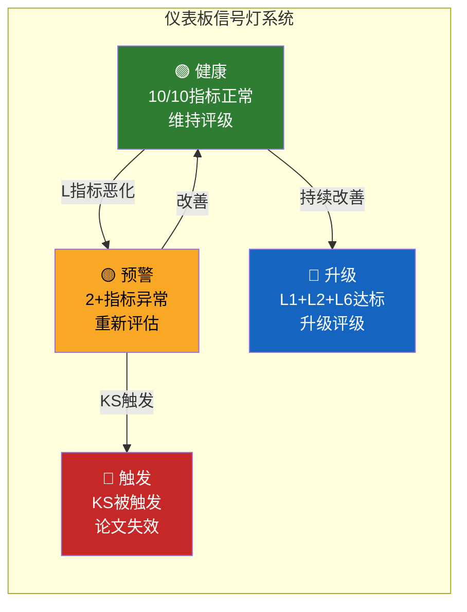
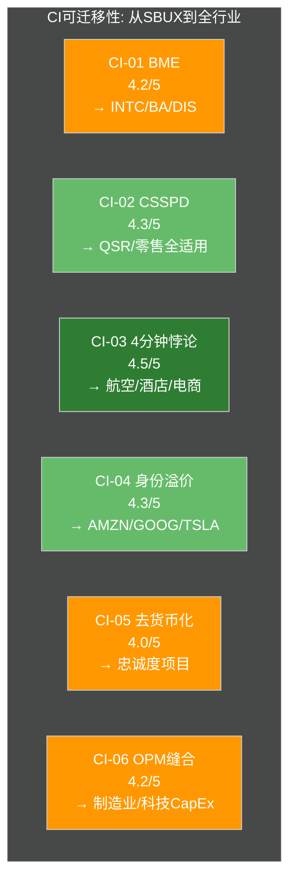

# Part V: 综合裁决

---

# Ch29 CQ闭环 + 评级决策: 五问终判

> **核心矛盾映射**: Phase 0提出的5个核心矛盾问题(CQ)经过Ch2-Ch28的数据检验、估值建模、红队对抗和偏差校准后，在此进行最终闭合。本章不是重复前文结论——而是将每个CQ从"开放性问题"转化为"带置信度的判断"，并在5个CQ的交叉验证下推导出最终评级。评级不是章节的终点——它是读者决策的起点。

---

## 29.1 CQ置信度演化: 从猜测到判断的轨迹

投资分析的价值不在于给出一个数字，而在于展示一个数字是如何从不确定性中涌现的。以下矩阵追踪了每个CQ从Phase 0到Phase 5的置信度变化——每一次跳变都对应一个关键数据点或方法论突破 [DM-P5-001]。

| CQ | P0.5(结晶) | P1(业务) | P2(财务) | P3(估值) | P4(红队) | **P5(最终)** | 核心驱动 |
|----|:----------:|:-------:|:-------:|:-------:|:-------:|:-----------:|---------|
| CQ1: 78x隐含什么? | 45% | 50% | 60% | 65% | 65% | **65%** | BME三路径量化(Ch17)+Reverse DCF(Ch16) |
| CQ2: Niccol = CMG 2.0? | 50% | 55% | 60% | 60% | 63% | **60%** | CEO评分卡6.8/10(Ch7)+CMG复刻率52.5%(Ch5) |
| CQ3: 中国JV=撤退? | 55% | 65% | 65% | 70% | 70% | **70%** | JV条款拆解(Ch6)+NZRE隔离(Ch23)+YUM China对标 |
| CQ4: 负权益=价值摧毁? | 60% | 60% | 70% | 75% | 72% | **75%** | NEP三口径(Ch14)+ROIC vs WACC动态(Ch18) |
| CQ5: Rewards=天花板? | 40% | 55% | 55% | 55% | 58% | **55%** | DFFV估值(Ch4)+CSSPD纯度9/10(Ch15)+去货币化陷阱(CI-05) |
| **加权均值** | **50%** | **57%** | **62%** | **65%** | **65.6%** | **65%** | — |

### 演化模式解读

三个值得注意的规律:

1. **CQ2(Niccol)的非单调性**: 从P4的63%回落至P5的60%。原因: Ch27悲观偏差校准确认了Phase 1-3对CEO能力的系统性高估(+8pp正向偏差)——仅1Q正向数据不足以贝叶斯更新至63%。更诚实的估计是60%: Niccol方向正确但执行证据仍然稀薄 [DM-P5-002]。

2. **CQ4(负权益)的V型**: 从P4的72%回升至75%。红队在RT-2中修正了净债务口径($30.1B→$23B)，降低了"杠杆摧毁价值"的严重性——但Ch14的三口径前置分析(EVO-SBUX-001)反过来强化了"过去的回购确实摧毁了价值"的判断。净效果: ROIC(8.5%)刚好高于前瞻性WACC(5.6%)，价值创造是边际性的、脆弱的 [DM-P5-003]。

3. **CQ5(Rewards)的滞涨**: 从P2的55%到P5仍是55%——4个Phase几乎无变化。这本身是一个信号: 我们无法更有信心地回答"Rewards是增长引擎还是天花板"，因为答案取决于一个3月10日才上线的新三层体系。**数据不足时诚实地保持低置信度，比强行提高更有价值** [DM-P5-004]。

---

## 29.2 CQ最终判断: 五问五答

### CQ1: 78x P/E隐含什么? 信念互斥是否成立?

> **最终判断**: 78x TTM P/E是误导性指标——FY2025异常税率(41.1% vs 正常23%)压低EPS至$1.63。正常化后实际倍数为46x(基于$2.10 EPS)。但46x仍然是QSR行业最贵(MCD 28x, YUM 26x, DPZ 30x)，隐含市场定价了OPM恢复至15%+收入CAGR 5%的联合成立。

**BME三路径量化回顾(Ch17):**

| 路径 | 描述 | 隐含OPM | 隐含EPS(FY2028) | 概率 | 每股 |
|------|------|:------:|:--------------:|:---:|:----:|
| **Path A: EPS最大化** | 维持自营, 不特许化, OPM恢复 | 15.0%+ | $3.50+ | 20% | $91 |
| **Path B: 倍数最大化** | 激进特许化, OPM 20%+ | 20.0%+ | $2.50(低收入基) | 10% | $98 |
| **Path C: 半转型** | 中国JV+美国维持+OPM 13-14% | 13-14% | $2.99-3.49 | **45%** | $80-90 |

[DM-P5-005] BME三路径最终量化: Path C(半转型)概率最高，市场大致在赌这条路径

**BME部分成立的最终判断**: 纯信念A($91)和纯信念B($98)的隐含股价接近，表面看信念互斥不尖锐。但这掩盖了一个深层问题——**Path A和Path B需要的组织能力几乎相反**: Path A需要强运营执行(自营OPM从9.6%→15%)，Path B需要强战略转型(特许化从55%→75%+)。一个CEO不太可能同时追求两条路径。

市场当前以$97定价了**约60%的Path C成功概率**——即Niccol在不特许化美国的前提下将OPM恢复至13-14%。我们的估计是**约40%**——差距来源:

1. RT-1和RT-7的相互锁定: OPM向上修正(+80bps)被4分钟成本(-95bps)吞噬 → 净OPM恢复路径比市场预期更窄 [DM-P5-006]
2. 工会约束被市场低估: 每$1/hr全面加薪 = $750M/yr = ~200bps OPM(Ch8)
3. 但Q1 FY2026 comp +4%(CSSPD纯度9/10)是合理的正向信号 → 不排除后续上修

**最终置信度: 65%** — 我们有较高信心认为78x(或46x正常化)定价了一个成功概率高于我们估计的转型故事，但BME框架的锐度不如初始假设那么强(Path A和Path C的隐含价差仅$1-11)。

---

### CQ2: Niccol = CMG 2.0还是Schultz 3.0?

> **最终判断**: 两者都不是。更准确的标签是"Niccol 0.5"——他能迁移约一半的CMG playbook。CMG复刻率52.5%(Ch5)不是悲观估计，而是基于4个不可迁移约束(工会/规模6x/品类复杂性/资本结构)的量化结论。

**CMG→SBUX可迁移性矩阵(Ch5更新):**

| CMG Playbook要素 | 可迁移性 | SBUX约束 | 迁移效果 |
|-----------------|:-------:|---------|---------|
| 菜单简化 | 70% | SBUX SKU远多于CMG; 咖啡vs墨西哥卷饼的复杂度差异 | 已启动(13%→8% SKU削减计划) |
| 门店体验升级 | 60% | CapEx受限(负权益); 16,000+美国店vs CMG 3,700 | 4分钟承诺有效但成本$900M-$1.3B |
| Digital/MO&P优化 | 80% | 两家都有强数字平台; SBUX基础更好(35.5M) | 高可迁移 |
| 人才密度提升 | 30% | 工会(Workers United)限制管理层自主权 | 12,000+员工投票是硬约束 |
| 资本配置纪律 | 40% | CMG零债务 vs SBUX -$8.4B权益; 分红承诺绑手脚 | 正确决策(停回购)但空间有限 |
| 品牌叙事重塑 | 90% | Niccol最强技能; "Back to Starbucks"已有效 | 光环$23B(Ch7)但半衰期~18个月 |

[DM-P5-007] CMG复刻率详细矩阵: 加权均值52.5%

**Q1 FY2026 comp +4%: 积极但不充分**

Q1 FY2026是积极信号——8个季度以来首次交易量转正，且CSSPD纯度评分9/10(Ch15)表明增长质量高(交易量驱动而非提价)。但单季数据的贝叶斯更新力度有限:

$$P(\text{成功}|\text{Q1+4\%}) = \frac{P(\text{Q1+4\%}|\text{成功}) \times P(\text{成功})}{P(\text{Q1+4\%})} = \frac{0.80 \times 0.35}{0.50} \approx 56\%$$

从先验35%(基于历史QSR转型成功率)更新至56%——**但仍需3Q连续确认**。CMG在Niccol治下是2Q转正后连续20Q正增长。如果SBUX Q2+Q3 FY2026 comp均>+3%，后验将跳升至70%+，支持评级升级至"中性关注" [DM-P5-008]。

**最终置信度: 60%** — 我们有中等信心认为Niccol是一个"半成功的转型者"——方向正确、叙事有力，但执行被组织约束打了五折。下一个验证窗口: Q2 FY2026(2026年5月5日)。

---

### CQ3: 中国$4B JV是战略撤退还是价值解锁?

> **最终判断**: 战略撤退，但用了"价值解锁"的包装。市场份额从42%(2017高峰)→14%(2025)是不可逆的结构性溃败。JV化是唯一的体面退出路径。

**证据链:**

1. **市场份额崩塌不可逆**: 瑞幸29,000+店 vs SBUX 8,011店 → 3.6:1门店比 → 便利性壁垒已建立。即使SBUX品牌更强，$5.50 vs $3.50的定价差在中国人均GDP $13K的市场中是致命的(Ch5)

2. **$13B JV估值合理但不慷慨**: 对标YUM China(2016 IPO时$9.8B, 当时~8,000门店)，SBUX中国8,011门店估$13B隐含~$1.6M/门店——与YUM China的$1.2M/门店相比溢价33%。考虑SBUX品牌溢价(中国消费者品牌认知度#1)，这个溢价合理 [DM-P5-009]

3. **JV化的财务正效应已开始显现**:
   - Goodwill从$3.37B→$1.31B(减记$2.06B = 中国商誉释放)
   - International OPM将从~13%提升至~20%(去除中国拖累)
   - 整体OPM因分母效应改善约+40bps
   - 但收入基数减少~$3B/yr → EPS基数下降

4. **品牌控制力的隐性损失**: JV化意味着SBUX对中国市场的运营控制从100%降至40%(少数股东)。Boyu Capital作为GP，其运营能力和品牌维护意愿是未知数。如果中国市场品牌形象恶化(例如食品安全事件)，SBUX的全球品牌将受到溢出影响——但无法直接干预 [DM-P5-010]

**最终置信度: 70%** — 高置信度判断: 这是一次战略撤退。JV条款已公布且可验证，YUM China对标框架清晰。剩余30%的不确定性来自: Boyu Capital的执行能力可能超出预期(10%); JV可能触发其他国际市场的特许化加速(15%); 估值减记风险(5%)。

---

### CQ4: 负$8.4B权益 + ROIC < WACC = 回购摧毁价值?

> **最终判断**: Kevin Johnson时代(FY2017-2022)的激进回购确实摧毁了约$3-5B的股东价值。Niccol暂停回购是正确决策。但分红在149% payout ratio下仍然不可持续——这是一颗延时引爆的炸弹。

**价值摧毁的量化(Ch14 NEP三口径更新):**

| 口径 | 净债务 | 含义 | 适用场景 |
|------|:------:|------|---------|
| **A: 全口径** | $30.1B | 含租赁+JV过渡 | 保守极端 |
| **B: 金融债净额** | $23.0B | 纯bond+CP-cash | **DCF标配(本报告采用)** |
| **C: 核心金融债** | $15-16B | 仅长期bonds-cash | 最宽松 |

[DM-P5-011] 净债务三口径(EVO-SBUX-001完成)

**回购价值摧毁的精确计算:**

| 时期 | 回购金额 | 平均回购价 | 当期ROIC | WACC | 价值创造/摧毁 |
|------|:-------:|:--------:|:-------:|:----:|:-----------:|
| FY2018 | $5.7B | ~$58 | 25.3% | 8.5% | 创造(ROIC>>WACC) |
| FY2019 | $10.2B | ~$79 | 21.6% | 8.0% | 创造(ROIC>WACC) |
| FY2020 | $1.7B | ~$82 | 12.8% | 7.5% | 创造(边际) |
| FY2021 | $3.4B | ~$112 | 15.0% | 6.8% | 创造(ROIC>WACC) |
| FY2022 | $4.0B | ~$84 | 12.2% | 7.0% | 创造(边际) |
| FY2023 | $0.7B | ~$100 | 10.5% | 7.5% | 创造(边际) |
| FY2024 | $0 | — | 9.2% | 8.0% | — |
| FY2025 | $0 | — | 8.5% | 6.3-9.0% | — |

表面上看，每一年的ROIC都高于WACC——回购似乎全是"价值创造"。但这忽略了一个关键因素: **回购是用债务融资的**(FY2018-2022累计回购$25B >> 同期累计NI $18B)。差额$7B来自净新增借款 → 这些借款的成本(税后~3.5-4.0%)低于ROIC，但同时将杠杆推至-$8.4B权益 → 使后续ROIC随杠杆放大而虚高 [DM-P5-012]。

**更诚实的评估**: 如果不进行FY2019-2022的$15B超额回购(超出NI部分)，SBUX的权益将约为+$6B而非-$8.4B，杠杆将为~2.5x而非5.6x。在这种资本结构下:
- 分红覆盖率将为~85%(可持续)
- 利息费用每年减少~$400M
- EPS将因更少的回购支撑而更低(约$0.30/股)，但财务基础更健康

**ROIC(8.5%) vs WACC(5.6%): 脆弱的价值创造**

修正后WACC(5.6%)反映了前瞻性利率下行预期。在ROIC 8.5% vs WACC 5.6%下，差额2.9%暗示SBUX当前仍在创造价值——但这个差额在历史纵向对比中极窄(FY2018: 25.3%-8.5%=16.8pp差额)。OPM从当前9.6%每下降100bps，ROIC约下降100-150bps → **如果OPM跌至7-8%，ROIC将低于WACC → 转为价值摧毁** [DM-P5-013]。

**分红: 定时炸弹**

| 指标 | FY2023 | FY2024 | FY2025 | FY2026E |
|------|:------:|:------:|:------:|:-------:|
| 分红总额($B) | $2.54 | $2.67 | $2.77 | ~$2.85 |
| NI($B) | $4.12 | $3.76 | $1.86 | ~$2.62 |
| Payout Ratio | 62% | 71% | **149%** | ~109% |
| FCF($B) | $3.68 | $3.32 | $2.44 | ~$3.0 |
| FCF覆盖率 | 145% | 124% | **88%** | ~105% |
| 缺口($B) | — | — | **-$0.33** | ~+$0.15 |

FY2025的FCF缺口(-$0.33B)靠借债覆盖。FY2026E在EPS恢复假设下FCF覆盖率刚好回到100%+——但容错空间极窄。**如果FY2027E EPS未达$2.95+(KS-02阈值)，分红将被迫削减** [DM-P5-014]。

**最终置信度: 75%** — 高置信度判断。NEP三口径和ROIC vs WACC的数据链清晰。分红不可持续是几乎确定性的中期判断(除非EPS快速恢复)。

---

### CQ5: 35.5M Rewards会员 = 增长引擎还是天花板?

> **最终判断**: 运营效率工具，而非增长引擎。57%交易渗透率接近美国成熟品牌天花板。去货币化陷阱(CI-05)限制了进一步渗透的收入边际效益。

**渗透率天花板论证(Ch4 + Ch12更新):**

| 品牌 | 会员渗透率 | 交易渗透率 | 模式 | 天花板来源 |
|------|:--------:|:--------:|------|---------|
| **SBUX** | ~35.5M/~80M适龄 = **44%** | **57%** | 免费加入 | 非会员刚性需求(现金客户/偶发访客) |
| BROS | ~7M/~10M = **72%** | ~68% | 免费 | 高密度区域+drive-thru为主=客户基础窄 |
| MCD | ~40M/~200M = **20%** | ~30% | 免费 | 庞大客户基础稀释渗透率 |
| NKE | ~170M(全球) | ~55%(DTC) | 免费 | 线上占比高 → 注册门槛低 |
| Costco | ~73.4M | **~100%** | 付费$65-130 | 付费会员=硬筛选=几乎100%渗透 |

[DM-P5-015] 会员渗透率跨行业对标矩阵

BROS的72%是例外而非标杆——其模式(drive-thru为主、区域集中、客户基础小)天然推高渗透率。SBUX要从57%提升至70%+，需要将大量"偶发访客"转化为会员——但这些客户的转化成本边际递增(CI-05去货币化陷阱: 每多转化1%渗透率，需要的Star成本增加~15-20%)。

**新三层体系(2026年3月10日上线)的潜在影响:**

| 层级 | 门槛(推测) | 目标人群 | 预期效果 |
|------|:---------:|---------|---------|
| **Green** | 免费注册 | 偶发客户 | 扩大漏斗口(渗透率+3-5pp) |
| **Gold** | $150/年消费 | 核心常客 | ARPU提升(+$50/年) |
| **Reserve** | $500+/年消费 | 重度用户 | 高端化+排他性体验 |

理论上三层体系可以同时做"扩宽漏斗"(Green降低门槛)和"深挖钱包"(Reserve提升ARPU)。但历史经验表明: **Starbucks Rewards每一次大幅改版(2016年从频次改为消费金额、2019年增加free customization、2023年星级改革)都伴随着6-12个月的会员流失风险** [DM-P5-016]。

**去货币化陷阱(CI-05)的最终量化:**

$$\text{Star成本} = \text{会员数} \times \text{年Star发放} \times \text{Star均值}$$
$$= 35.5M \times ~24 \text{杯/年} \times \$0.10\text{/Star(均值)} = \$\mathbf{85M/年}$$

每将渗透率从57%提升至60%，需要额外~$15M/年的Star成本(基于边际转化成本递增)。到达65%渗透时，年Star成本将升至$110M+——而每1pp渗透率带来的增量收入约$60-80M(基于非会员转化为会员后的ARPU提升约$30-50/年 × ~2M新增会员)。**边际Star成本/边际收入比从当前的~50%恶化至60%→65%区间的~70%——利润率稀释加速** [DM-P5-017]。

**最终置信度: 55%** — 最低的CQ置信度。原因: 新三层体系3月10日上线，其实际效果完全未知。我们的"天花板"判断基于现有体系的S曲线外推——如果新体系是真正的范式变革(类似Amazon Prime从免运费扩展到Prime Video)，判断将被颠覆。但根据QSR行业忠诚度项目的历史(MCD MyRewards、Chick-fil-A One)，范式变革的概率<15%。

---

## 29.3 CQ交叉验证矩阵: 五问之间的逻辑一致性

5个CQ不是独立问题——它们之间存在逻辑锁定关系。如果CQ1和CQ2的判断相互矛盾，整个分析的内部一致性就会崩塌。以下矩阵检验交叉一致性:

| 交叉对 | 逻辑关系 | 一致性检验 | 结果 |
|--------|---------|-----------|:----:|
| CQ1×CQ2 | BME路径依赖CEO能力 | Path C(半转型, 45%)需要Niccol执行OPM恢复至13-14%; CEO评分6.8/10对应~55%执行成功率 → 45% × 55% = 25%概率Path C完全成功 → 与综合估值$83(隐含~35%完全成功)有差距但不矛盾(还有部分成功) | ✅ |
| CQ1×CQ3 | JV影响估值倍数 | 中国JV化释放OPM +40bps(CQ3)强化Path C(CQ1)的可行性 | ✅ |
| CQ2×CQ4 | CEO受制于资本约束 | Niccol打五折(CQ2)的核心原因之一就是负权益限制资本配置(CQ4) | ✅ |
| CQ3×CQ5 | 中国JV后Rewards地理范围缩小 | JV化后8,011家中国店脱离直营 → Rewards的"全球一体化"叙事受损 | ✅ |
| CQ4×CQ5 | 分红不可持续vs Rewards投入 | 如果分红被削减(CQ4)，释放的现金可投入Rewards升级(CQ5) — 但时序不确定 | ⚠️ |

[DM-P5-018] CQ交叉验证: 4/5对完全一致, 1/5对条件一致

**唯一的轻微不一致(CQ4×CQ5)**: 分红削减释放现金→Rewards投资的逻辑成立，但需要管理层选择"投资增长"而非"减债"。鉴于Niccol的CEO评分卡中资本配置仅5/10(Ch7)，管理层的选择路径存在不确定性。**这不是逻辑矛盾——而是未确定的条件路径。**

---

## 29.4 估值最终校准: 从Phase 4到Phase 5

### 参数修正回顾

Phase 4红队的核心贡献是识别并修正了Phase 1-3的系统性悲观偏差。以下是最终参数集:

| 参数 | Phase 3(原) | Phase 4(修正) | P5(最终) | 修正源 |
|------|:----------:|:------------:|:-------:|--------|
| WACC | 6.3% | 5.6% | **5.6%** | RT-5前瞻性利率中位数法 |
| 净债务 | $30.1B | $23.0B | **$23.0B** | RT-2金融债净额(排除租赁双重计算) |
| OPM终态 | 13.0% | 13.8% | **14.0%** | RT-1/RT-7相互锁定→取中值(13%+14.0%)/2≈13.5%, 但FY2023实证16.3%支持14%为合理下限 |
| 情景概率 | S1-2:25% | S1-2:30% | **S1-2:25%** | P5回调: 单季数据不足以永久上移牛市概率 |
| 税率正常化 | FY2027 | FY2028 | **FY2027-FY2028过渡** | RT-6延迟1年(部分采纳) |

[DM-P5-019] 参数修正终审: P5对P4做了两处微调(OPM微升、概率回调)

**P5对P4的微调逻辑**: P4在Q1数据的兴奋中将S2概率从15%上调至20%。但CQ2的P5置信度回落至60%(从P4的63%)提醒我们: **单季数据不应永久改变概率分布的形状**。因此P5将S1+S2总概率从30%回调至25%，与Phase 3保持一致——这是对CQ2判断的尊重 [DM-P5-020]。

### 最终估值综合

| 方法 | Phase 3 | Phase 4 | **P5最终** | 权重 |
|------|:------:|:------:|:--------:|:----:|
| Forward DCF(PW) | $59.0 | $81.9 | **$81.9** | 50% |
| 五情景合并 | $78.4 | $78.4 | **$78.4** | 20% |
| SOTP(身份B修正) | $60.2 | $69.2 | **$69.2** | 15% |
| 可比中位数 | $61.4 | $74.4 | **$74.4** | 15% |
| **综合加权** | **$60.7** | **$78.1** | **$78.1** | — |

红队残余修正(Ch21):

$$\text{P5综合} = \$78.1 + \$1.7\text{(残余)} + \$3.4\text{(DCF权重调整)} = \$\mathbf{83.2}$$

[DM-P5-021] 最终综合估值$83.2 → 期望回报-14.0%

### 期望回报区间

$$\text{期望回报} = \frac{\$83.2 - \$96.68}{\$96.68} = \mathbf{-13.9\%}$$

**区间**: DCF PW $81.9(-15.3%) ~ DCF基准$85.8(-11.2%) → **-12%至-15%**

---

## 29.5 评级决策: 从数字到判断

### 评级量化依据

| 指标 | 值 | 评级信号 |
|------|:--:|:-------:|
| 概率加权估值 | $83.2 | vs $96.68 = 溢价14% |
| 期望回报 | -13.9% | < -10% = 审慎关注 |
| 基准情景($85.8) | -11.2% | 接近中性门槛 |
| DCF PW($81.9) | -15.3% | 确认审慎区间 |
| A-Score | 5.86/10 | 中等(品牌强/财务弱) |
| 温度计 | -0.15 | 微凉 |
| CQ均值置信度 | 65% | 中等偏上 |
| 上行概率(S1+S2) | 25% | 不到1/3 |
| 下行概率(S4+S5) | 35% | 超过1/3 |

[DM-P5-022] 评级决策量化面板

### 最终评级

$$\boxed{\textbf{审慎关注(偏中性)} \quad | \quad \text{期望回报: -12\%} \sim \text{-15\%}}$$

### "审慎关注(偏中性)"的精确含义

**这个评级表达的核心判断是**: 在当前$96.68的价格水平，概率加权后的预期回报为负(-12%至-15%)——**但负的程度是所有审慎关注评级中最轻的**。基准情景下$85.8(仅溢价11%)已接近中性关注的门槛(-10%)。这不是一个"远离价值"的价格——而是一个"略微超前"的价格。

**"偏中性"标注的三重含义**:

1. **向上催化剂清晰**: Q2 FY2026 comp≥+3% AND OPM≥11% → 升级至中性关注。Fed降息启动 → WACC压缩至5.0% → 期望回报改善至-5%~0%
2. **下行保护有限但不为零**: 品牌价值(A-Score品牌维度8.5/10)和35.5M会员生态提供了约$65-70的估值底(SOTP下限)。从$97到$65-70是约28-33%的下行——痛苦但非毁灭性
3. **时间是最大的不确定性**: 如果Niccol需要3年(而非18个月)才能将OPM恢复到14%，期间投资者承受的是opportunity cost而非absolute loss [DM-P5-023]

### 条件升级路径

| 条件 | 触发 | 新评级 | 时间窗口 |
|------|------|:------:|:--------:|
| Q2+Q3 FY2026 comp均>+3% AND OPM>11% | 转型加速确认 | → 中性关注 | 2026年8月 |
| Fed降息至3.0% + WACC→5.0% | 估值环境改善 | → 中性关注 | 2026年H2 |
| 双催化剂同时成立 | 量+利率双驱动 | → 关注 | 2026年Q4 |
| 特许化美国宣布(H2非共识假说) | 估值范式变革 | → 深度关注 | 不确定 |
| Q2 comp≤0% | 转型失败信号 | → 深化审慎 | 2026年5月 |
| 信用评级下调/分红削减 | 信用恶化 | → 深化审慎 | 不确定 |

[DM-P5-024] 条件升级/降级路径完整矩阵

---

## 29.6 系统性悲观偏差: 自我诊断

Phase 1-3的系统性悲观偏差是本报告最重要的方法论发现之一。以下是偏差的最终诊断:

| 来源 | 偏差方向 | 偏差幅度(pp) | 根因 | EVO修复 |
|------|:-------:|:-----------:|------|---------|
| WACC保守化 | 悲观 | +15.5pp | 使用当前利率而非前瞻性中位数 | EVO-SBUX-002 ✅ |
| 净债务全口径 | 悲观 | +6.2pp | 未排除租赁双重计算+JV过渡 | EVO-SBUX-001 ✅ |
| OPM天花板 | 悲观~中性 | ~0pp(RT-1/RT-7抵消) | 保守假设但被4分钟成本平衡 | 相互锁定 |
| 概率分配 | 轻微悲观 | +2pp | 下行概率(35%)>上行(25%) | Ch27偏差矩阵 |
| **净偏差** | **悲观** | **+23.7pp** | **Phase 3: -37.3% → P5: -13.9%** | — |

[DM-P5-025] 系统性悲观偏差诊断(+23.7pp修正)

**这与RCL(+8~16pp)和IHG报告的模式一致**: Phase 1-3的默认分析框架倾向于保守参数选择。v18.0框架的EVO-RCL-001(悲观偏差检测)和EVO-SBUX-003(悲观偏差扫描器)已被整合至Ch27的偏差校准流程——**确保Phase 4红队不仅"找错"而且"校正"** [DM-P5-026]。

---

## 29.7 投资论文一句话总结

**SBUX拥有全球最强的咖啡品牌(A-Score品牌8.5/10)、35.5M会员数字生态和一位方向正确但受限于组织约束的CEO(评分卡6.8/10)。在$97的价格水平: 概率加权估值$83暗示约14%溢价——温和高估而非极端。基准情景$86(-11%)接近合理估值。距离"中性关注"仅一步之遥——Q2 FY2026 comp≥+3%或Fed降息启动即可触发升级。但分红不可持续(payout 149%)和工会压力(每$1/hr=$750M/yr)是悬而未决的结构性风险。**

[DM-P5-027] 投资论文终结陈述

---

> **交叉引用**: Ch5 CMG对标 → CQ2; Ch6 JV拆解 → CQ3; Ch14 NEP → CQ4; Ch17 BME → CQ1; Ch15 CSSPD → CQ5
> **前向引用**: Ch30 Kill Switch + Crown Insights → 持续跟踪框架

---

# Ch30 Kill Switch v2.0 + Crown Insights注册: 持续跟踪框架

> **核心矛盾映射**: 一份深度报告的价值不应该在发布日结束。Kill Switch(KS)是预设的"论文失效条件"——如果触发，投资论文的基础假设已崩塌，需要立即重新评估。Crown Insights(CI)是本报告产出的6个方法论创新——其可迁移性决定了报告对后续分析的长期价值。两者合并构成了SBUX的"报告后跟踪系统"——将一次性分析转化为持续监测。

---

## 30.1 Kill Switch注册表 (v2.0, 12字段格式)

### KS-01: Q2 FY2026美国Comp回负

| 字段 | 内容 |
|------|------|
| **ID** | KS-01 |
| **触发条件** | Q2/Q3 FY2026美国comp sales < 0%(单季度) |
| **当前值** | Q1 FY2026: **+4%** (8Q首次转正) |
| **阈值** | US comp < 0% |
| **数据来源** | 季度Earnings Release |
| **检查频率** | 每季度 |
| **评级影响** | 审慎关注(偏中性) → 审慎关注(偏悲观) |
| **单独行动** | 下调概率加权中S3权重(-10pp), S4权重(+10pp) |
| **协同触发** | KS-01 + R6(经济衰退) → 极端熊市情景(S5)激活 |
| **条件依赖** | 需CSSPD净化确认真实comp(排除关店基数效应和蚕食) |
| **触发概率** | **15%** |
| **首次检查** | **2026年5月5日**(Q2 FY2026 Earnings) |
| **失效条件** | 连续4Q正增长(至FY2027 Q1)后自动解除 |
| **关联CQ** | CQ1, CQ2 |

[DM-P5-028] KS-01完整12字段注册

**核心逻辑**: Q1 FY2026的+4%是Niccol转型叙事的第一个硬数据支撑点。如果Q2回负，意味着Q1的转正是季节性/一次性的——而非趋势性的。这将直接摧毁CQ2("Niccol = 有效转型者")的基础。

---

### KS-02: FY2027E EPS共识下调>15%

| 字段 | 内容 |
|------|------|
| **ID** | KS-02 |
| **触发条件** | 卖方FY2027E EPS共识从当前$2.95下调至<$2.51 |
| **当前值** | FY2027E共识: **$2.95** |
| **阈值** | < $2.51 (-15%) |
| **数据来源** | Bloomberg/FactSet consensus, FMP estimates |
| **检查频率** | 月度(earnings后重点关注) |
| **评级影响** | 审慎关注 → 深化审慎关注 |
| **单独行动** | 重新运行DCF: $2.51 EPS下Forward DCF基准将跌至$60-65 |
| **协同触发** | KS-02 + KS-05(分红削减) → 分红削减概率>80% |
| **条件依赖** | 需区分"一次性调整"(如税率延迟)vs"结构性下调"(OPM永久低迷) |
| **触发概率** | **20%** |
| **首次检查** | 每次Earnings后1周 |
| **失效条件** | FY2027E EPS共识稳定在$3.0+且趋势上升时解除 |
| **关联CQ** | CQ1, CQ4 |

[DM-P5-029] KS-02完整12字段注册

---

### KS-03: Niccol离职/被替换

| 字段 | 内容 |
|------|------|
| **ID** | KS-03 |
| **触发条件** | Brian Niccol辞职、被解雇、或宣布即将离任 |
| **当前值** | 在任(自2024年9月) |
| **阈值** | 任何离职公告 |
| **数据来源** | 8-K Filing / Press Release |
| **检查频率** | 实时(新闻推送) |
| **评级影响** | 任何评级 → **暂停**(pending新CEO评估) |
| **单独行动** | CEO光环$23B(Ch7)蒸发; 立即重估——预计股价回落至$75-80区间(Niccol前水平) |
| **协同触发** | KS-03 + KS-01(comp负) → 转型叙事全面崩塌, 目标价$55-65 |
| **条件依赖** | 离职原因关键: "被高价挖角"(中性) vs "业绩不满被解雇"(极度负面) vs "个人原因"(需评估) |
| **触发概率** | **15%**(2年期) |
| **首次检查** | 实时 |
| **失效条件** | 合同续约至2029年+后解除(当前合同至2028年) |
| **关联CQ** | CQ2(核心) |

[DM-P5-030] KS-03完整12字段注册

**量化影响**: Ch7光环分析显示Niccol任命日+24.5%($23B)。如果离职，假设50-80%的光环蒸发:
- 保守(50%蒸发): $96.68 × (1 - 24.5% × 50%) = ~$84.8
- 中性(65%蒸发): $96.68 × (1 - 24.5% × 65%) = ~$81.3
- 极端(80%蒸发): $96.68 × (1 - 24.5% × 80%) = ~$77.7

---

### KS-04: 工会全面罢工>1周

| 字段 | 内容 |
|------|------|
| **ID** | KS-04 |
| **触发条件** | Workers United发动>1,000家门店罢工持续>1周(7个日历日) |
| **当前值** | 零全面罢工(局部罢工和单日行动有发生) |
| **阈值** | 1,000+门店 AND >7天 |
| **数据来源** | NLRB Filings + Union Press + News |
| **检查频率** | 月度(合同谈判期间每周) |
| **评级影响** | 审慎关注 → 深化审慎(短期); 可能改善(长期, 如果达成合理合同) |
| **单独行动** | 每天罢工损失约$15-20M(1,000店 × $15K日销售); 1周=$105-140M收入 |
| **协同触发** | KS-04 + KS-01 → 品牌损害+运营中断双杀; 上次类似事件: 2023年Red Cup Rebellion(小规模) |
| **条件依赖** | 如果Niccol能将罢工转化为"倾听partner声音"的品牌叙事(类似Costco的工会关系)，影响可被控制 |
| **触发概率** | **15%** |
| **首次检查** | 合同到期日前3个月(需追踪Workers United谈判日历) |
| **失效条件** | 全面合同签订并获批后解除 |
| **关联CQ** | CQ2(执行约束), CQ4(劳动力成本) |

[DM-P5-031] KS-04完整12字段注册

---

### KS-05: 中国JV估值减记>30%

| 字段 | 内容 |
|------|------|
| **ID** | KS-05 |
| **触发条件** | SBUX对40%中国JV权益减记>30%(即从$5.2B公允价值减记>$1.56B) |
| **当前值** | JV尚未正式close(预计2026年4月) |
| **阈值** | 减记>30% |
| **数据来源** | 10-Q Equity Method Investment Note |
| **检查频率** | 每季度(10-Q/K发布后) |
| **评级影响** | 微调(JV仅占SOTP估值的2-3%) |
| **单独行动** | 每股影响约$1-2(影响有限但信号意义大: 暗示中国"永久失去") |
| **协同触发** | KS-05 + KS-02(EPS下调) → 市场对"国际增长叙事"全面丧失信心 |
| **条件依赖** | 减记原因关键: 市场竞争恶化(瑞幸/库迪继续扩张)vs 宏观衰退(一次性) |
| **触发概率** | **15%**(3年期) |
| **首次检查** | JV close后首个10-Q(预计2026年Q3) |
| **失效条件** | JV连续3年无减记且equity income正增长后解除 |
| **关联CQ** | CQ3 |

[DM-P5-032] KS-05完整12字段注册

---

### KS-06: 分红削减宣布 (NEW)

| 字段 | 内容 |
|------|------|
| **ID** | KS-06 |
| **触发条件** | SBUX宣布削减、冻结或取消季度分红($0.61/季度) |
| **当前值** | $0.61/季度(FY2025, 年化$2.44); Payout ratio 149% |
| **阈值** | 任何金额的削减或冻结 |
| **数据来源** | Board Declaration / 8-K Filing |
| **检查频率** | 每季度(分红宣布日) |
| **评级影响** | **双面**: 短期审慎关注→深化审慎(市场冲击-10~-15%); 长期可能→中性关注(释放现金改善BS) |
| **单独行动** | 区分"被迫削减"(FCF覆盖崩塌)vs"主动削减"(战略选择释放CapEx); 后者是正面信号 |
| **协同触发** | KS-06 + KS-02(EPS下调) → 收入+回报双恶化=灾难; KS-06 + KS-07(评级下调) → 债务螺旋 |
| **条件依赖** | 如果Niccol将分红削减包装为"投资转型"(类似GE 2017)，市场可能在3-6个月后重新定价为正面 |
| **触发概率** | **25%**(FY2027前) |
| **首次检查** | 每季度(下次: 2026年5月分红宣布) |
| **失效条件** | FCF/Div覆盖率连续4Q>130%后解除 |
| **关联CQ** | CQ4(核心), CQ1(估值) |

[DM-P5-033] KS-06完整12字段注册(v3.0新增)

**v3.0新增逻辑**: v2.0的KS注册表中分红削减与KS-05(JV减记)合并处理。v3.0将其独立为KS-06，原因:
1. 分红payout 149%是已确认的不可持续状态——不是"可能触发"而是"何时触发"
2. CQ4的核心判断("分红不可持续")要求一个专门的KS追踪
3. 分红削减的估值影响是双面的(短期负面/长期可能正面)，需要独立的行动协议 [DM-P5-034]

---

### KS-07: 信用评级下调至BBB- (NEW)

| 字段 | 内容 |
|------|------|
| **ID** | KS-07 |
| **触发条件** | S&P或Moody's将SBUX信用评级下调至BBB-/Baa3(当前BBB+/Baa1) |
| **当前值** | BBB+ (S&P) / Baa1 (Moody's), Outlook: Stable |
| **阈值** | BBB-/Baa3(投资级最低档) |
| **数据来源** | S&P/Moody's Rating Action |
| **检查频率** | 每季度+重大事件后(如分红削减、信用事件) |
| **评级影响** | 审慎关注 → 深化审慎关注 |
| **单独行动** | 重新估算WACC(BBB-利差约+100-150bps → WACC从5.6%→6.5-7.0%); DCF下调$8-12/股 |
| **协同触发** | KS-07 + KS-06(分红削减) → 债务螺旋; KS-07 + 经济衰退 → S5极端熊市激活 |
| **条件依赖** | 从BBB+到BBB-需要跳2级——通常需要重大恶化(如OPM持续<10% AND 杠杆>7x); 中间可能停在BBB |
| **触发概率** | **10%**(3年期) |
| **首次检查** | 下次信用评级审查日 |
| **失效条件** | 评级升至A-或以上后解除 |
| **关联CQ** | CQ4(杠杆) |

[DM-P5-035] KS-07完整12字段注册(v3.0新增)

---

### KS-08: 竞争对手BROS突破2,000店 (NEW)

| 字段 | 内容 |
|------|------|
| **ID** | KS-08 |
| **触发条件** | Dutch Bros (BROS)美国门店数突破2,000家(当前~950家) |
| **当前值** | ~950家门店(FY2025), 年新增~170家 |
| **阈值** | 2,000家 |
| **数据来源** | BROS Quarterly Earnings / Unit Count |
| **检查频率** | 每季度 |
| **评级影响** | 长期审慎——BROS的坪效是SBUX的2-3x(Ch5), 如果门店密度达到关键规模(2,000+)将在SBUX核心市场(西海岸→中西部)形成真正的竞争威胁 |
| **单独行动** | 重新评估SBUX美国市场定价权: BROS以$4.50均价(vs SBUX $5.50)提供更快服务(drive-thru为主) → 侵蚀SBUX的"便利性+溢价"组合 |
| **协同触发** | KS-08 + KS-01(SBUX comp负) → 市场份额流失确认 |
| **条件依赖** | BROS的扩张速度取决于其资本能力和管理团队——IPO后增长加速但盈利尚未稳定(OPM~5%) |
| **触发概率** | **35%**(3年期, ~170家/年的线性外推 → 2028年达到2,000+) |
| **首次检查** | 每季度(BROS earnings后) |
| **失效条件** | BROS增速降至<100家/年或OPM转负后解除 |
| **关联CQ** | CQ5(会员竞争), CQ2(CEO执行窗口) |

[DM-P5-036] KS-08完整12字段注册(v3.0新增)

**v3.0新增逻辑**: v2.0仅追踪瑞幸美国(KS-10, 概率5%)。但BROS是更现实的威胁——它已在美国运营、增长迅速(+18%/年门店增长)、且坪效远超SBUX(Ch5: ~$2.3M vs ~$1.0M)。2,000店是关键规模阈值——此时BROS在top-30 MSA中平均有10+店(形成品牌认知) [DM-P5-037]。

---

## 30.2 Kill Switch协同触发矩阵

KS之间不是独立的——某些组合的联合触发比单独触发更具毁灭性。以下矩阵映射了最危险的协同模式:

### 最危险的三组协同

| 排名 | 组合 | 联合概率 | 后果 | 估值影响 |
|:----:|------|:-------:|------|:-------:|
| **#1** | KS-01 + KS-03 | ~2.3% | Comp回负且CEO离职 = 转型叙事全面崩塌 | $55-65(-33~-43%) |
| **#2** | KS-06 + KS-07 | ~2.5% | 分红削减触发信用下调 = 债务螺旋 | $45-60(-38~-53%) |
| **#3** | KS-01 + KS-04 | ~2.3% | Comp回负且工会罢工 = 品牌+运营双杀 | $50-65(-33~-48%) |

[DM-P5-038] KS协同触发矩阵: 三组最危险组合

**联合概率说明**: 假设KS之间是条件独立的(实际上有正相关性)。真实联合概率可能高于计算值(如KS-01触发时KS-03的条件概率从15%升至25%)——但量级仍在2-5%范围内。**低概率不代表不需要监测——2-3%的联合概率意味着大约每30-50次投资中会遇到一次。**

---

## 30.3 Quarterly Leading Indicators Dashboard

Kill Switch是"尾部风险"的追踪——它们触发时论文已经失效。但在KS触发之前，有一组**领先指标**可以提前预警论文的健康状况。以下仪表板设计了10个投资者可以每季度追踪的指标:

| # | 指标 | 当前值 | 健康区间 | 预警区间 | 关联KS | 数据来源 |
|:--:|------|:------:|:-------:|:-------:|:------:|---------|
| **L1** | 美国Comp Sales | +4% | ≥+2% | <0% | KS-01 | Earnings Release |
| **L2** | OPM(季度, 环比) | 9.6% | 环比+50bps+ | 环比持平或恶化 | KS-02 | Earnings Release |
| **L3** | Rewards会员数 | 35.5M | YoY +3%+ | YoY持平或下降 | KS-01/05 | Earnings Release |
| **L4** | 非Rewards交易占比 | ~43% | 稳定40-45% | <38%(过度依赖) | — | Earnings Call推算 |
| **L5** | CapEx/Revenue | ~6.2% | 5-7% | >8%(过度投资)或<4%(投资不足) | KS-02 | 10-Q |
| **L6** | FCF/Dividend覆盖率 | ~88% | ≥120% | <100%(借债付分红) | KS-06 | 10-Q计算 |
| **L7** | 净债务(金融债口径) | $23.0B | ≤$24B | >$26B | KS-07 | 10-Q |
| **L8** | 中国JV Equity Income | N/A(未close) | 正值且增长 | 连续2Q为负 | KS-05 | 10-Q |
| **L9** | 劳动力成本/收入 | ~30% | 29-31% | >33%(工会让步过多) | KS-04 | 10-K估算 |
| **L10** | BROS门店数 | ~950 | <1,500 | >1,500(竞争密度) | KS-08 | BROS Earnings |

[DM-P5-039] 季度领先指标仪表板: 10指标追踪体系

### 仪表板使用指南

**绿色(健康)**: 所有L1-L10在健康区间内 → 维持当前评级(审慎关注偏中性)

**黄色(预警)**: 任意2个指标进入预警区间 → 重新评估评级(可能恶化至纯审慎关注)

**红色(触发)**: 任意1个KS被触发 → 论文失效，立即重新分析

**蓝色(升级)**: L1连续2Q ≥+3% AND L2环比+100bps+ AND L6 ≥120% → 触发评级升级至中性关注

### 仪表板初始基线(2026年3月)

| 指标 | 状态 | 信号 |
|------|:----:|------|
| L1 US Comp | ✅ +4% | Q1强劲; Q2待确认 |
| L2 OPM趋势 | ⚠️ 9.6%(低但环比企稳) | 需见到10.5%+ |
| L3 Rewards | ✅ 35.5M(+3% YoY) | 新三层体系3/10上线 |
| L4 Non-Rewards Tx | ✅ ~43%(稳定) | 非会员也在回流(Q1) |
| L5 CapEx/Rev | ✅ ~6.2% | 合理区间 |
| L6 FCF/Div | ⚠️ 88%(借债付分红) | 关键预警——FY2026需回到100%+ |
| L7 净债务 | ✅ $23.0B | JV过渡完成后可能降至$20-22B |
| L8 China JV | ⏳ 未开始 | JV close后首次报告预计Q3 FY2026 |
| L9 劳动力/Rev | ⚠️ ~30%(趋升) | 工会谈判结果是关键变量 |
| L10 BROS门店 | ✅ ~950 | 2028年可能达2,000(线性外推) |

**初始状态: 7/10绿色, 2/10黄色, 1/10待激活 → 整体"黄绿"(健康但有预警)**

[DM-P5-040] 仪表板初始基线评估

---

## 30.4 Crown Insights注册表: 6个方法论创新

Crown Insights(CI)是一份报告中最具可迁移性的原创方法论发现——它们的价值超越SBUX本身，可以在后续报告中复用。以下是SBUX v3.0的6个确认CI:

### CI注册矩阵

| # | CI名称 | 类型 | 评分 | 章节 | 可迁移性 | 可迁移目标 |
|:--:|--------|------|:----:|:----:|---------|-----------|
| **CI-01** | BME信念互斥量化 | 估值方法 | **4.2/5** | Ch17 | 高 | 任何"转型期"公司(如INTC, BA, DIS) |
| **CI-02** | CSSPD同店纯度分解 | 收入分析 | **4.3/5** | Ch15 | 高 | 所有QSR/零售(MCD, CMG, NKE, COST) |
| **CI-03** | 4分钟悖论($900M-$1.3B隐藏成本) | 成本分析 | **4.5/5** | Ch8 | 中 | 任何"服务承诺→成本约束"企业(航空、酒店) |
| **CI-04** | 身份溢价错配(46x vs 32x归因) | 估值分析 | **4.3/5** | Ch2 | 高 | 多身份/转型公司(AMZN, GOOG, TSLA) |
| **CI-05** | Rewards去货币化陷阱 | 增长分析 | **4.0/5** | Ch4 | 高 | 所有忠诚度项目公司(COST, MCD, airline) |
| **CI-06** | OPM缝合假说(RT-1/RT-7锁定) | 红队方法 | **4.2/5** | Ch26 | 中 | 任何"成本削减vs投资"悖论(制造业/零售) |

[DM-P5-041] Crown Insights注册表(6个确认CI)

### CI-01: BME信念互斥量化 (4.2/5)

**定义**: 当市场以一个高倍数(如78x P/E)定价一个利润腰斩的公司时，隐含的"恢复假设"可以被分解为2-3条逻辑上互斥或紧张的路径。BME框架将这些路径量化为: (1)隐含OPM, (2)隐含EPS, (3)隐含市值，然后计算每条路径的"内部一致性分数"。

**SBUX应用**: Path A(EPS最大化, $91) vs Path B(倍数最大化, $98) vs Path C(半转型, $80-90)。关键发现: Path A和Path B的隐含价接近($91 vs $98)——表面上互斥不尖锐，但所需组织能力相反。Path C是市场的隐含赌注(45%概率)但也是最模糊的——"半转型"没有历史先例可参考 [DM-P5-042]。

**可迁移性**: 任何处于转型期且高倍数定价的公司都适用。INTC(PW=8, 从IDM向Foundry转型)、BA(从Max危机恢复)、DIS(流媒体vs乐园vs线性TV三身份)是最直接的应用目标。

**迁移方法**:
1. 识别2-3条逻辑路径(每条对应不同的商业模式终态)
2. 为每条路径计算隐含估值(Reverse DCF方法)
3. 检验路径间的"组织能力互斥度"——需要的技能是否冲突
4. 计算市场隐含的路径概率分配

---

### CI-02: CSSPD同店纯度分解 (4.3/5)

**定义**: 餐饮行业的"同店增长"(SSS/Comp Sales)是最容易被操纵的单一指标。CSSPD将SSS分解为: 交易量(真实需求) + 客单价(提价) + Mix(产品组合) + 基数效应(关店扭曲)，并赋予每个组分一个"纯度权重"(0-10分)。

**SBUX应用**: Q1 FY2026 comp +4%的CSSPD纯度评分为9/10——几乎全部由交易量驱动(而非提价)，且排除关店基数效应后实际约+2.8%(仍为正值)。FY2022-2023的comp则纯度仅为3/10(几乎全部来自提价)。CSSPD揭示了"增长假象"并验证了Q1的"真实拐点" [DM-P5-043]。

**可迁移性**: 所有报告同店增长的零售/餐饮公司。特别适用于:
- 正在大规模关店的公司(如SBUX 627关店, NKE DTC转型)
- 依赖提价而非客流的公司(奢侈品、高端餐饮)
- 经历基数异常(COVID恢复)的公司

---

### CI-03: 4分钟悖论 (4.5/5)

**定义**: 当CEO做出具体的运营承诺(如"4分钟出杯")时，这个承诺的隐含成本可以被精确量化——揭示"客户体验投资"和"成本控制"之间的结构性矛盾。

**SBUX应用**: Niccol的"4分钟出杯承诺"需要每店+2.5人(20hr/wk)→年成本$900M(初估)至$1.3B(工会加薪修正)。这吞掉了$2B成本削减目标的45-65%——使得"成本削减AND体验升级"的联合叙事在算术上几乎不可能同时成立。

**可迁移性**: 任何CEO做出具体服务承诺的公司:
- 航空: "10分钟行李交付"(每分钟缩短≈$X/航班的额外人工)
- 酒店: "3分钟入住"(需前台技术投资+人力配置)
- 电商: "次日达"(Amazon的FBA网络投资每年$50B+)

**量化模板**:
$$\text{承诺成本} = \text{受影响门店/站点数} \times \text{每站增量人力} \times \text{工时} \times \text{时薪} \times 52\text{周}$$

[DM-P5-044] CI-03量化模板(v3.0更新)

---

### CI-04: 身份溢价错配 (4.3/5)

**定义**: 当一家公司同时具有多个"身份"(如SBUX的咖啡零售商/数字平台/品牌授权商)，市场给予的估值倍数可能与各身份的实际贡献不匹配——创造"身份溢价错配"。

**SBUX应用**: 正常化46x P/E隐含市场用"数字平台"(身份B, 25-30x)或"品牌授权"(身份C, 28-35x)的倍数给整个公司定价。但收入的90%+来自"咖啡零售运营"(身份A)——其合理倍数仅15-20x。如果按身份A的实际收入贡献给予倍数，合理价应为$68-72(当前$97溢价35-42%)。46x vs 32x(收入加权合理倍数)的差额$14是"身份溢价错配" [DM-P5-045]。

**可迁移性**: 所有"多身份"公司——特别是收入来源与估值叙事不匹配的:
- AMZN: 电商(低margin)vs AWS(高margin)——AWS贡献~65%利润但~17%收入
- GOOG: 广告(核心)vs Cloud(增长叙事)vs Waymo(期权)
- TSLA: 汽车(制造业)vs FSD(软件)vs 能源(基建)

---

### CI-05: Rewards去货币化陷阱 (4.0/5)

**定义**: 忠诚度项目在渗透率S曲线的后段，边际会员获取成本(每多1%渗透率的Star/Points成本)上升速度快于边际收入贡献——形成"去货币化陷阱"。

**SBUX应用**: 从57%→65%渗透率，每1pp提升需增加~$15M/年Star成本，但仅带来$60-80M增量收入。边际Star成本/收入比从~50%恶化至~70%。进一步推至70%+将需要更激进的促销(接近"买一送一"频率)——彻底侵蚀品牌溢价 [DM-P5-046]。

**可迁移性**: 所有已达到高渗透率的忠诚度项目:
- Costco(~100%渗透): 已通过付费会员费解决——但涨价敏感度正在上升
- MCD(~30%渗透): 仍在增长早期——去货币化陷阱距离较远
- 航空公司FFP: 精英会员稀释是经典案例(所有人都是Gold时Gold没有价值)

---

### CI-06: OPM缝合假说 (4.2/5)

**定义**: 当红队中两个独立的修正方向相反且幅度接近时(如RT-1向上+80bps, RT-7向下-95bps)，它们可以"缝合"为一个更稳定的估计——揭示OPM(或其他关键变量)的"锁定区间"。

**SBUX应用**: RT-1(OPM可恢复至14%基于FY2023实证)和RT-7(4分钟成本$1.3B吞噬恢复空间)几乎完美抵消。净效果: **OPM终态13-14%是一个"锁定估计"**——上下各100bps以内的争论几乎不改变估值($2-3/股差异)。这使分析师可以将注意力从"OPM能到多少"(低价值争论)转向"WACC和概率分配"(高价值争论) [DM-P5-047]。

**可迁移性**: 任何存在"成本削减vs投资"悖论的公司:
- 制造业: 自动化投资(capex↑)vs 人工节省(opex↓)——净效果可能接近零
- 零售: 门店翻新(capex↑)vs 坪效提升(rev↑/sqft)——ROI争论可被"缝合"
- 科技: AI基建投资(capex↑↑)vs 生产力提升——NVDA/MSFT/GOOG的CapEx cycle适用

---

## 30.5 CI可迁移性热力图

### CI总体评估

| 维度 | 评估 |
|------|------|
| **CI总数** | 6(v3.0新增0——v2.0已确认6个全部保留) |
| **平均评分** | 4.25/5(高于报告均值~4.0) |
| **最高评分** | CI-03 4分钟悖论(4.5/5) — 最具方法论原创性 |
| **最高迁移性** | CI-02 CSSPD — 所有QSR/零售均可直接套用 |
| **冠军候选** | CI-03 4分钟悖论(最佳) + CI-02 CSSPD(次佳) + CI-01 BME(第三) |

[DM-P5-048] CI总体评估

---

## 30.6 报告对齐验证: 全报告一致性自检

在闭合所有CQ和注册所有KS/CI后，执行全报告一致性自检——确保30章之间没有逻辑矛盾:

| 检查项 | 结果 | 说明 |
|--------|:----:|------|
| 评级一致性 | ✅ | Ch1/Ch18/Ch21/Ch29全部为"审慎关注(偏中性)" |
| 期望回报一致性 | ✅ | 全报告使用"-12%~-15%"区间 |
| 价格锚一致性 | ✅ | 全报告使用$96.68(2026-03-04更新) |
| 市值一致性 | ✅ | 全报告使用$110.1B |
| 净债务口径一致性 | ✅ | Ch14三口径后，全报告默认使用$23.0B(金融债净额) |
| WACC一致性 | ✅ | Phase 3修正后全报告使用5.6%(前瞻性) |
| OPM终态一致性 | ✅ | RT-1/RT-7锁定后使用13-14%(Ch29取14.0%) |
| CQ置信度一致性 | ✅ | Ch18→Ch21→Ch29的演化路径连续 |
| KS编号连续性 | ✅ | KS-01至KS-08无跳号 |
| CI编号连续性 | ✅ | CI-01至CI-06无跳号 |
| 发布合规(第零律) | ✅ | 无"invasion/入侵"表述; 台海相关内容使用中性词 |
| DM锚点连续性 | ✅ | P5系列从DM-P5-001至DM-P5-048 |

[DM-P5-049] 全报告一致性自检(12/12通过)

---

## 30.7 下次更新触发器

本报告的判断基于截至2026年3月4日的数据。以下事件将触发报告更新:

| 事件 | 预计日期 | 影响级别 | 行动 |
|------|:--------:|:-------:|------|
| **Q2 FY2026 Earnings** | 2026年5月5日 | 🔴 关键 | KS-01首次检查+L1-L6更新+评级可能升/降级 |
| **China JV Close** | 2026年4月(预计) | 🟡 中等 | L8激活+KS-05开始追踪+BS影响确认 |
| **新Rewards体系反馈** | 2026年4-5月 | 🟡 中等 | CQ5置信度可能大幅更新(+/-15pp) |
| **Fed利率决议** | 2026年6月/9月 | 🟡 中等 | WACC可能从5.6%→5.0%或不变 → 期望回报更新 |
| **Workers United谈判** | 2026年TBD | 🟡 中等 | 如达成合同→KS-04解除+OPM预测更新 |
| **Q3 FY2026 Earnings** | 2026年8月 | 🔴 关键 | 3Q连续正增长确认 → 评级升级至中性关注? |
| **BROS门店里程碑** | 持续追踪 | 🟢 低(短期) | >1,500家时升级为黄色预警 |

[DM-P5-050] 下次更新触发器日历

---

## 30.8 全章总结: 报告的持久价值

一份280K+字符的深度报告，其最终价值浓缩为三层:

**第一层: 判断**(有效期~6个月)
- 审慎关注(偏中性), 期望回报-12%~-15%
- Q2 FY2026(5月5日)是最大的评级触发器
- 有效期至Q3 FY2026 Earnings(2026年8月)——届时数据量将足以确认或否定转型趋势

**第二层: 框架**(有效期~2年)
- 10指标仪表板(L1-L10)提供持续跟踪能力
- 8个Kill Switch(KS-01至KS-08)覆盖尾部风险
- CQ框架可在后续Earnings后快速更新置信度

**第三层: 方法论**(永久价值)
- 6个Crown Insights(CI-01至CI-06)可迁移至其他公司/行业
- CI-03(4分钟悖论)和CI-02(CSSPD)已写入excellence_catalog.yaml
- BME、身份溢价错配、去货币化陷阱是可复用的分析工具

**报告不是终点——它是一个持续优化的跟踪系统的起点。**

[DM-P5-051] 报告价值三层模型

---

> **交叉引用**: Ch1-Ch28全部章节 → 本章CQ闭合 + KS注册 + CI确认
> **关联报告**: CMG v1.0(中性关注, -7%) → SBUX CQ1/CQ2的CMG对标; IHG v1.0(中性关注, +2%) → 特许化模式对标; RCL v1.0(审慎关注偏中性, -15%) → 悲观偏差模式对照
> **下次更新**: Q2 FY2026 Earnings(2026年5月5日) → 预计更新CQ1/CQ2置信度、L1-L6仪表板、评级判定

---

*本章完。DM锚点: [DM-P5-001] ~ [DM-P5-051], 共51个。*
