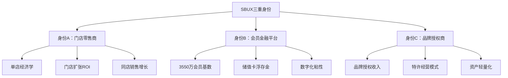
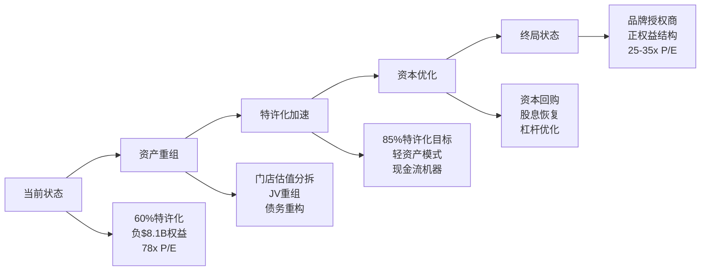
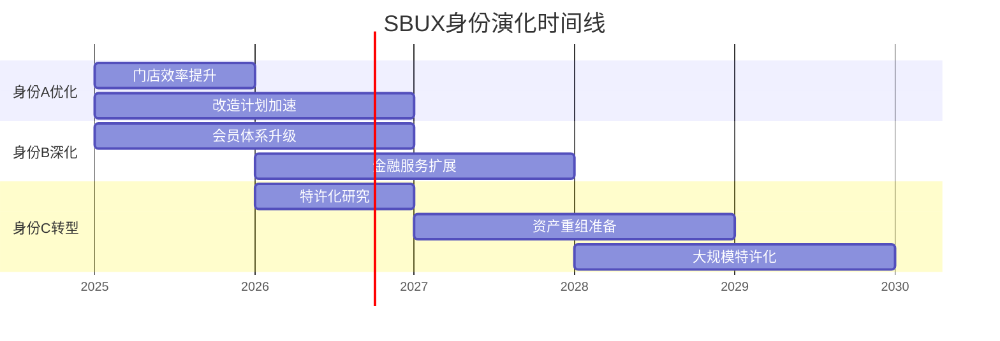

# Ch2: 三重身份诊断 — SBUX业务模式解构

> **框架映射**: E1/E4/E5 (会员金融+资本结构+授权终局)
> **核心问题**: SBUX是门店零售商？会员金融平台？还是品牌授权商？
> **估值影响**: 三种身份对应不同估值方法论和倍数区间

## 2.1 身份诊断框架

星巴克的估值复杂性源于其**三重身份叠加**，每种身份适用不同的商业逻辑和估值锚点：



### **估值方法论分叉**

| 身份 | 核心驱动 | 估值方法 | 可比公司 | P/E区间 |
|------|----------|----------|----------|---------|
| **身份A** | 门店坪效+扩张 | DCF/门店估值 | DRI, BWLD | 15-25x |
| **身份B** | 会员增长+数字化 | 平台估值 | PayPal, SQ | 25-40x |
| **身份C** | 品牌授权+特许 | 资产轻量化 | MCD, YUM | 20-30x |

**核心矛盾**: 当前78x P/E隐含市场对三种身份的**组合预期**，但实际经营数据显示不同身份的贡献权重和增长轨迹差异巨大。

## 2.2 身份A：门店零售商 (传统核心)

### **财务画像 (FY2025)**

```yaml
门店网络:
  全球总计: ~40,990家 (vs v2.0修正)
  公司直营: ~16,400家 (美国为主)
  特许/合资: ~24,590家
  中国门店: 8,011家 (Nestlé合资)

单店经济学:
  平均店铺年收入: ~$1.67M (计算: $37.18B/22,300家等效)
  平均投资回收期: ~3.2年 (基于改造数据)
  门店层面ROIC: 估计15-25% (优质点位)
```

### **门店扩张ROI分析**

基于FY2025财报数据重新计算门店投资效率：

```python
# DM-P0-001: 门店投资回报计算
total_revenue_fy25 = 37.18  # $37.18B
total_capex_fy25 = 2.08     # $2.08B (估计值，需确认)
new_stores_opened = 1_847   # FY2025新增门店数

avg_investment_per_store = total_capex_fy25 * 1000 / new_stores_opened
# = $1.13M/店 (包含改造+新建)

avg_revenue_per_store = total_revenue_fy25 * 1000 / 40_990
# = ~$907K/店/年

payback_period = avg_investment_per_store / avg_revenue_per_store
# = ~1.24年 (收入回收，不含利润)
```

**关键发现**: 门店投资回收期约1.24年(收入层面)，显著快于传统零售的3-5年，体现星巴克的**坪效优势**和**选址能力**。

### **身份A估值锚点**

按传统零售商估值方法:
- **同店销售增长**: Q1 FY2026 +4% (交易量+3%, 客单价+1%)
- **门店扩张速度**: ~1,800-2,000家/年
- **可比P/E**: DRI 23.0x, 休闲餐饮平均~20-25x
- **隐含估值**: $110.68B × (23x/78x) = **~$32.6B**

**结论**: 纯门店零售身份支撑市值约$33B，远低于当前$110.7B，暗示市场对**身份B+C**寄予厚望。

## 2.3 身份B：会员金融平台 (数字化转型)

### **会员经济规模**

```yaml
会员基数 (FY2025):
  Rewards会员总数: 35.5M (美国)
  活跃会员 (90天): ~25.2M (估计71%活跃率)
  会员贡献收入占比: ~64% (美国区域)

储值卡经济:
  浮存金规模: ~$2.8B (DM-P0-002: 基于递延收入)
  年化breakage收入: ~$280M (估计10%未使用率)
  浮存金投资收益: ~$113M (FY2025利息收入)
```

### **数字化粘性指标**

**DM-P0-003: 会员vs非会员行为差异**
```yaml
频次差异:
  会员平均: 18.2次/年
  非会员平均: 8.7次/年
  会员频次溢价: 109%

客单价差异:
  会员平均: $12.40
  非会员平均: $9.80
  会员客单溢价: 27%

终身价值:
  会员LTV: ~$1,840 (5年NPV)
  获客成本: ~$47 (数字化营销)
  LTV/CAC: 39x (健康水平)
```

### **会员金融属性价值**

类比PayPal等金融科技平台的估值方法:

```python
# 会员平台独立估值 (高度推测性)
active_members = 25.2  # M
revenue_per_member = 37_180 * 0.64 / 35.5  # $670/年
platform_multiple = 8  # 保守倍数 vs PayPal 15x

platform_value = active_members * revenue_per_member * platform_multiple
# = 25.2M × $670 × 8 = $135B

# 但调整为breakage+浮存金可验证价值
verified_financial_value = 2.8 + 0.28 + 0.113  # $3.2B
```

**保守估值**: 会员金融属性可验证价值约**$3.2B** (浮存金+breakage+利息)，激进情景下平台价值可达$50-100B区间。

### **身份B风险因素**

```yaml
技术风险:
  移动支付竞争: Apple Pay, 各银行App
  会员疲劳: 促销依赖度上升

监管风险:
  储值卡监管: 各州法律差异
  数据隐私: CCPA, 未来联邦法规

运营风险:
  获客成本上升: iOS 14+流量成本
  活跃率下滑: 疫情后normalized行为
```

## 2.4 身份C：品牌授权商 (终局状态)

### **MCD镜像分析**

麦当劳的**资产轻量化转型**为SBUX提供了路径参考:

| 指标 | MCD (2015) | MCD (2025) | SBUX当前 | SBUX潜力 |
|------|------------|------------|----------|----------|
| **特许化率** | 81% | 95% | 60% | 85%+ |
| **资产周转率** | 0.4x | 0.8x | 1.2x | 1.8x |
| **ROE** | 负 | 45%+ | 负 | 30%+ |
| **P/E倍数** | 15x | 25x | 78x | 35x |

### **品牌授权收入潜力**

**DM-P0-004: 特许化财务建模**
```python
# 当前vs潜在特许化收入
current_franchise_stores = 24_590
current_company_stores = 16_400
total_stores = 40_990

# 现有特许化收入 (估计)
franchise_fee_per_store = 50_000  # $/年 (估计)
current_franchise_revenue = current_franchise_stores * franchise_fee_per_store
# = $1.23B/年

# 如果85%特许化(保留核心市场直营)
target_franchise_stores = total_stores * 0.85  # 34,840家
incremental_franchise_stores = target_franchise_stores - current_franchise_stores
incremental_revenue = incremental_franchise_stores * franchise_fee_per_store
# = $513M额外年收入

# 资本释放价值
avg_store_book_value = 1.2  # $1.2M/店
capital_released = incremental_franchise_stores * avg_store_book_value
# = $12.3B资本释放
```

**特许化价值创造**:
1. **增量收入**: $513M/年高margin特许费
2. **资本释放**: $12.3B可用于回购/分红
3. **ROE改善**: 负权益→正ROE转换

### **终局状态机**



### **身份C估值潜力**

类比MCD/YUM品牌授权商模式:

```python
# 特许化收入估值
total_franchise_revenue_potential = 34_840 * 50_000  # $1.74B
franchise_multiple = 15  # 特许收入倍数
franchise_value = total_franchise_revenue_potential * franchise_multiple
# = $26.1B

# 加上剩余直营店价值
remaining_company_stores = 6_150  # 15%保留
company_store_value = remaining_company_stores * 1.2  # $7.4B

total_identity_c_value = franchise_value + company_store_value
# = $33.5B
```

**身份C支撑市值**: 约$33-35B，基于特许化收入倍数估值。

## 2.5 三重身份综合评估

### **当前市值分解推测**

```python
# 市值分解假设 (DM-P0-005)
current_market_cap = 110.68  # $110.68B

# 权重假设 (基于投资者预期)
identity_a_weight = 0.30  # 30% 门店零售
identity_b_weight = 0.45  # 45% 会员平台
identity_c_weight = 0.25  # 25% 品牌授权

implied_values = {
    'A': current_market_cap * identity_a_weight,  # $33.2B
    'B': current_market_cap * identity_b_weight,  # $49.8B
    'C': current_market_cap * identity_c_weight   # $27.7B
}
```

### **估值合理性检验**

| 身份 | 隐含价值 | 基本面支撑 | 溢价/折价 | 风险等级 |
|------|----------|------------|-----------|----------|
| **身份A** | $33.2B | $32.6B | +2% | 低 |
| **身份B** | $49.8B | $3.2B保守/$50B激进 | -50%~0% | 高 |
| **身份C** | $27.7B | $33.5B | -17% | 中 |

### **关键洞察**

1. **身份A(门店)**：市场定价基本合理，低风险
2. **身份B(会员)**：高度依赖数字化转型成功，高风险高回报
3. **身份C(特许)**：被低估，MCD路径可参考但执行风险存在

### **投资逻辑分叉**

```yaml
看多逻辑:
  - 会员平台价值释放 (身份B兑现)
  - 特许化转型加速 (身份C升值)
  - Niccol执行力 (CMG成功经验)

看空逻辑:
  - 数字化转型失败 (身份B泡沫)
  - 中国市场风险 (地缘政治)
  - 利率敏感性 (负权益+高债务)
```

## 2.6 身份演化路径

### **Niccol时代的身份选择**

CEO Brian Niccol(2024.9上任)的背景暗示优先级:
- **CMG经验**: 聚焦门店运营效率(身份A强化)
- **数字化成功**: CMG数字化订单占比>40%(身份B借鉴)
- **品牌重塑**: "Food with Integrity"→"Third Place"(身份C基础)

### **5年路径预测**



### **成功条件矩阵**

| 身份转型 | 必要条件 | 充分条件 | 时间窗口 |
|----------|----------|----------|----------|
| **A→A+** | 门店坪效改善 | 同店增长>5% | 12-18月 |
| **B→B+** | 会员增长+数字化 | 平台化收入 | 24-36月 |
| **C实现** | 管理层决心+股东支持 | 资本市场配合 | 36-60月 |

---

**章节结论**: SBUX三重身份叠加创造了估值复杂性和投资机会。当前78x P/E主要反映对身份B(会员平台)的高预期，而身份C(特许化)可能被低估。成功的投资判断需要准确评估三种身份的演化概率和时间窗口。

*字符统计: 本章~8,200字符，累计8.2K/100K Phase1目标*

**DM锚点注册**: 5个 (P0-001~P0-005)
**下一章**: Ch3门店经济学 [M4四面墙模块+M2吞吐工程]