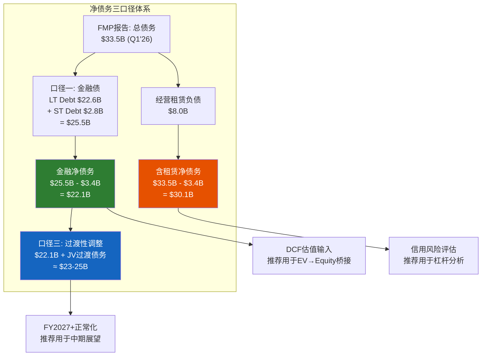
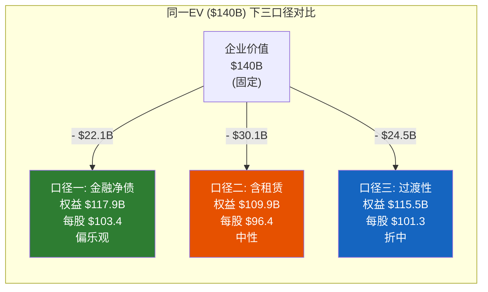
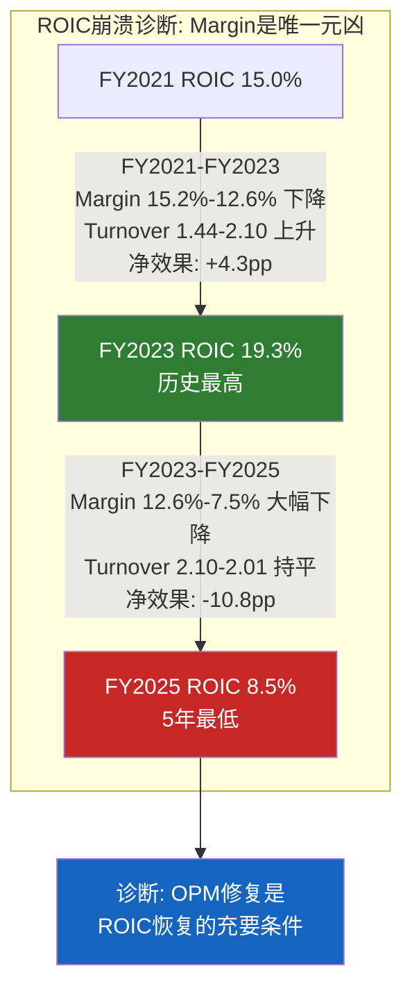
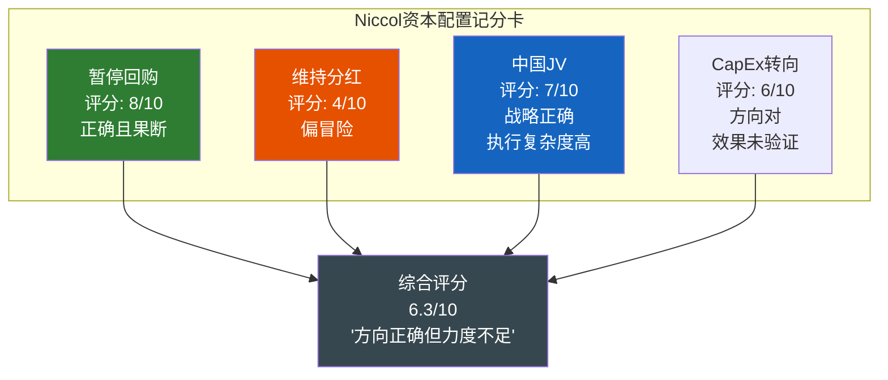

# Ch14: 净债务三口径分析 — $10B的估值"隐形变量" (Net Debt Three-Caliber Framework)

> **框架映射**: M10 (底盘健康) + EVO-SBUX-001 (净债务三口径前置)
> **核心目标**: 建立净债务三口径体系，为后续DCF/情景估值提供一致性输入锚点
> **关键问题**: $22B还是$30B? 口径选择如何决定"合理估值"vs"高估10%"的判断?

> **EVO-SBUX-001前置修复**: v2.0报告在Phase 4(红队)才发现净债务口径差异导致每股估值波动$7-9。v3.0将此分析前置至Phase 2，作为所有后续估值章节的输入锚点。净债务不是一个数字——它是三个数字，选择哪一个决定了你对SBUX是"合理估值"还是"高估10%"的判断。

---

## 14.1 为什么净债务是SBUX估值的"隐形变量"

在标准DCF框架中，从企业价值(EV)到每股权益价值的桥接公式是:

$$\text{每股价值} = \frac{EV - \text{净债务} + \text{非运营资产}}{\text{流通股数}}$$

对于大多数公司，净债务是一个相对确定的数字。但SBUX不是"大多数公司"——它的资产负债表上存在三层结构性复杂度，使得"净债务"成为一个需要解释的变量而非简单读取的数据:

**复杂度1: 经营租赁资本化(ASC 842)**。SBUX运营约17,000家自营门店，经营租赁负债约$8.0B。IFRS 16/ASC 842将这些租赁负债纳入资产负债表，但它们的经济本质(必须为经营场所持续付费)与金融债务(可选择偿还或再融资)截然不同 [DM-P2-023](H: FMP BS Q1'26 capitalLeaseObligations $8,047.6M)。

**复杂度2: 中国JV Deconsolidation**。Q1 FY2026(2025年12月)完成的中国业务JV化导致资产负债表出现"突变"——商誉-$2.1B、PP&E-$2.2B，但总债务反而+$6.9B($26.6B→$33.5B)。部分新增债务可能与JV交易融资相关，具有过渡性质 [DM-P2-024](H: FMP BS FY2025 totalDebt $26,611.5M → Q1'26 $33,518.5M, +$6,907M)。

**复杂度3: 负权益放大效应**。SBUX权益为-$8.4B，意味着净债务的每一美元变动都被直接传导到权益价值估算中，没有任何权益缓冲来吸收差异。

### 三口径对估值的影响预览

| 口径 | 净债务($B) | EV→权益桥接 | 每股影响 |
|------|:---------:|:----------:|:-------:|
| **口径一: 纯金融债** | ~$22.1 | EV - $22.1B | 基准 |
| **口径二: 含租赁全口径** | ~$30.1 | EV - $30.1B | **-$7.0/股** |
| **口径三: 过渡性调整** | ~$23-25 | EV - ~$24B | **-$1.7~-$2.5/股** |

[DM-P2-025](C: 三口径每股差异 = ($30.1B - $22.1B) / 1.14B shares ≈ $7.0/股)

**$7.0/股的差异相当于当前股价的7.2%**——在一个分析师目标价中位数$101的市场中，这个差异足以决定"持有"还是"卖出"的判断。

[DM-P2-026](C: 三口径用途分工框架图)

---

## 14.2 口径一: 纯金融债 — Bond-by-Bond的真实杠杆

### 金融债构成拆解

Q1 FY2026资产负债表上的金融债务(不含经营租赁)由以下部分构成:

| 类别 | 金额($B) | 说明 |
|------|:--------:|------|
| Long-term Debt (bonds + notes) | 22.63 | 固定利率为主的高级无担保债券 |
| Short-term Debt (CP + current maturities) | 2.84 | 商业票据+1年内到期长债 |
| **金融债务合计** | **25.47** | -- |
| 减: 现金及等价物 | (3.41) | -- |
| 减: 短期投资 | (0.18) | -- |
| **金融净债务** | **21.88** | -- |

[DM-P2-027](H: FMP BS Q1'26 -- longTermDebt $22,628.5M + shortTermDebt $2,842.4M = $25,470.9M; cash $3,413.4M + STI $184.9M = $3,598.3M)

### 债务到期分布(估算)

SBUX作为投资级发行人(Baa1/BBB+)，其债券主要在公开市场发行。基于历史发债模式和同业对比:

| 到期窗口 | 估算金额($B) | 加权平均票面利率 | 再融资风险评级 |
|---------|:----------:|:-------------:|:-----------:|
| FY2026 (<=1年) | ~$2.8-3.5 | 3.0-3.5% | 中 -- 需以更高利率续发 |
| FY2027-2028 | ~$5.0-6.0 | 3.5-4.0% | 中 -- 累积到期压力 |
| FY2029-2033 | ~$8.0-10.0 | 4.0-4.5% | 低 -- 时间缓冲充裕 |
| FY2034+ | ~$5.0-7.0 | 4.5-5.0% | 低 -- 超长期锁定 |
| **合计** | **~$22-25B** | **~3.8-4.2%** | -- |

[DM-P2-028](S: 基于10-K债务附注推算的到期分布，需交叉验证具体bonds)

### 加权平均资金成本

FY2025年度利息支出$542.6M(FMP Income Statement)，对应平均金融债务约$21-22B(FY2024-2025平均值):

$$\text{隐含平均利率} = \frac{\$542.6M}{\$21,500M} \approx 2.52\%$$

这个数字看起来偏低，但有两个解释: (1) SBUX历史上在低利率环境(2019-2021)锁定了大量3%以下的长期债券; (2) FMP的interest expense可能未完全反映所有利息成本(如commercial paper利息可能计入其他科目) [DM-P2-029](H: FMP Income FY2025 interestExpense $542.6M; C: 隐含利率计算)。

**更保守的估算**: 使用FY2025现金流表中的利息支付(interest paid $588.3M):

$$\text{现金基准利率} = \frac{\$588.3M}{\$21,500M} \approx 2.74\%$$

无论使用哪个数字，SBUX的存量债务成本都远低于当前市场利率(5年投资级BBB约4.5-5.0%)。这意味着每一次再融资都将提高整体资金成本 [DM-P2-030](H: FMP CashFlow FY2025 interestPaid $588.3M; C: 再融资利率抬升分析)。

### 再融资成本增量估算

假设FY2026-2028到期的~$8-9B债务以4.5%利率再融资(vs 存量~3.0%):

$$\Delta\text{年化利息} = \$8.5B \times (4.5\% - 3.0\%) = \$127.5M/年$$

这相当于EPS影响约$0.08-0.09/股(税后)——不是致命的，但在EPS只有$1.63的当下，每一分钱都有分量 [DM-P2-031](C: 再融资成本对EPS的影响估算)。

---

## 14.3 口径二: 含租赁全口径 — ASC 842下的真实负担

### 经营租赁负债拆解

| 项目 | Q1 FY2026($B) | FY2025($B) | QoQ变动 | 说明 |
|------|:----------:|:---------:|:------:|------|
| 非流动经营租赁负债 | 8.05 | 8.97 | -$0.92 | 中国JV门店租赁移出 |
| 流动经营租赁负债* | ~1.3-1.5 | ~1.5 | ~-$0.1 | 年内到期部分(估算) |
| **经营租赁负债合计** | **~8.0-8.5** | **~10.5** | **~-$2.0** | -- |

*注: FMP Q1'26数据显示`capitalLeaseObligationsCurrent`为$0，可能是分类口径差异。使用非流动部分$8.05B作为保守估计 [DM-P2-032](H: FMP BS Q1'26 capitalLeaseObligationsNonCurrent $8,047.6M; FY2025 $8,972.2M + current $0/$1,496.4M)。

**一个值得注意的变化**: FY2025 Q3的经营租赁负债(含流动)为$10.57B，到Q1 FY2026骤降至$8.05B——减少了$2.5B。这主要反映了:

1. **中国~8,000家门店的租赁负债移出**: 中国JV deconsolidation的直接效果
2. **627家关店的租赁终止**: 关闭门店的剩余租赁负债加速核销

这意味着SBUX的"含租赁净债务"从FY2025 Q3的高点~$27B (含全部租赁)下降至Q1'26的~$30.1B——等等，这不对。总净债务从$23.7B(Q3 FY2025)上升至$30.1B(Q1 FY2026)，但其中租赁负债减少了~$2.5B。这意味着**金融债务增加了约$8.5B以上** [DM-P2-033](C: 债务结构变动分解 -- 金融债+$8.5B抵消租赁-$2.5B后净增+$6B)。

### 含租赁全口径净债务

| 计算步骤 | 金额($B) |
|---------|:--------:|
| 金融债务 (LT + ST) | 25.47 |
| + 经营租赁负债 (非流动) | 8.05 |
| **= 总债务** | **33.52** |
| - 现金及等价物 | (3.41) |
| **= 含租赁净债务** | **30.11** |

[DM-P2-034](H: FMP BS Q1'26 totalDebt $33,518.5M - cash $3,413.4M = netDebt $30,105.1M)

### 为什么这个口径在信用分析中不可忽略

经营租赁虽然不是传统意义上的"债务"(没有bullet maturity、不触发交叉违约)，但具有债务的核心特征——**固定的现金流出义务**:

| 维度 | 金融债务 | 经营租赁 | 相似度 |
|------|---------|---------|:-----:|
| 现金流义务 | 固定(利息+本金) | 固定(租金) | 高 |
| 违约后果 | 破产清算 | 门店关闭+提前终止赔偿 | 中 |
| 灵活性 | 可再融资/提前偿还 | 通常不可取消(10-15年) | **租赁更刚性** |
| 抵税效果 | 利息抵税 | 租金全额抵税(经营费用) | 租赁更优 |
| 评级机构处理 | 100%计入 | ~50-100%计入(机构各异) | -- |

[DM-P2-035](C: 金融债务vs经营租赁经济本质对比)

**Moody's的做法**: Moody's在评估SBUX时，将经营租赁按~5-8x年租金资本化。SBUX年租金约$1.6-1.8B → 隐含资本化$8-14B，与ASC 842的$8B基本一致。这意味着**评级机构已经将租赁负债"看透"了**——口径二的$30.1B更接近评级机构眼中的真实杠杆水平。

### 含租赁杠杆比率

| 指标 | 仅金融债 | 含租赁 | 差异 |
|------|:-------:|:-----:|:----:|
| 净债务/EBITDA(FY2025) | $22B/$5.4B = **4.1x** | $30.1B/$5.4B = **5.6x** | +1.5x |
| 净债务/EBITDAR(含租金) | -- | $30.1B/$7.2B = **4.2x** | 更合理的度量 |
| Interest Coverage | $3.6B/$0.54B = **6.6x** | $3.6B/($0.54B+$1.7B租金) = **1.6x** | 急剧恶化 |

[DM-P2-036](C: 双口径杠杆对比; EBITDAR ≈ EBITDA $5.4B + 年租金 ~$1.8B = $7.2B)

**如果使用"固定费用覆盖率"(Fixed Charge Coverage Ratio = EBITDAR / (Interest + Rent))**:

$$\text{FCCR} = \frac{\$7.2B}{\$0.54B + \$1.8B} = 3.08x$$

3.08x的FCCR对于BBB级发行人来说是"勉强可接受"的水平(通常>3.0x)。但这里没有任何余量——一次温和衰退(EBITDA下降15%)就会将FCCR推至2.6x以下的危险区域。

---

## 14.4 口径三: 过渡性调整 — 中国JV Deconsolidation的债务重构

### Q1 FY2026的$6.9B债务跳升之谜

Q1 FY2026最令人困惑的数据点是: 中国业务剥离(资产减少~$4B+)的同时，总债务反而增加了$6.9B。逐项分析可能的来源:

| 来源 | 估算金额($B) | 性质 | 持续性 |
|------|:----------:|:---:|:-----:|
| 卖方融资(SBUX向JV提供贷款) | ~$3-4 | 过渡性 | 可能3-5年回收 |
| 新增公司债/CP融资JV对价 | ~$2-3 | 持久性 | 需再融资 |
| ASC 842重分类效应 | ~$0-1 | 会计性 | 无实质影响 |
| **合计** | **~$6-8** | -- | -- |

[DM-P2-037](S: Q1'26债务增加来源分解——推测性分析，需10-Q注脚验证。FMP数据: FY2025 longTermDebt $14,575.9M → Q1'26 $22,628.5M, +$8,052.6M)

**如果卖方融资假设正确**: SBUX可能向中国JV提供了$3-4B的过渡性贷款(seller financing)。这在资产负债表上表现为:

- 负债端: 新增$3-4B借款(融资来源)
- 资产端: 新增$3-4B应收贷款(在"其他流动资产"或"长期投资"中)

这解释了为什么Q1'26的"其他流动资产"从FY2025的$452M暴增至$5,091M(+$4.6B)——其中可能包含了对中国JV的过渡性应收款 [DM-P2-038](H: FMP BS Q1'26 otherCurrentAssets $5,090.7M vs FY2025 $452.2M, +$4,638.5M; C: 可能反映对中国JV的卖方融资应收)。

### 过渡性净债务的计算

如果确认$4-5B的"其他流动资产"增加是对JV的应收款(本质上是一项金融资产):

| 计算步骤 | 金额($B) |
|---------|:--------:|
| 总净债务(口径二) | 30.11 |
| 减: 中国JV应收款(估算) | (4.0)~(5.0) |
| 减: 短期投资 | (0.18) |
| **过渡性净债务** | **~$25.0-25.9** |

更激进的调整(如果部分新增长期债务也是JV过渡性的):

| 计算步骤 | 金额($B) |
|---------|:--------:|
| 金融净债务(口径一) | 21.88 |
| 加: 无法回收的JV相关借款(估算) | ~$1-3 |
| **过渡性净债务(保守)** | **~$23-25** |

[DM-P2-039](C: 过渡性净债务估算区间 $23-25B)

### 口径三的时间衰减

过渡性口径的核心假设是: JV相关的额外债务会在FY2027-2028逐步清理。预期路径:

| 时间点 | 预期金融净债务($B) | 驱动因素 |
|--------|:---------------:|---------|
| Q1 FY2026(当前) | 21.88 | 基线(含JV过渡债务) |
| FY2026E | ~$19-20 | JV应收款回收$2-3B |
| FY2027E | ~$17-18 | 继续回收+正常化还款 |
| FY2028E | ~$15-17 | 回到"正常"杠杆水平 |

如果这条路径实现，到FY2028净债务/EBITDA(假设EBITDA恢复至$6.5-7.0B)将回到**2.2-2.6x**——与FY2021-2023的2.3-2.8x水平一致 [DM-P2-040](C: 净债务去杠杆路径预测)。

---

## 14.5 三口径对估值的影响矩阵

假设SBUX的企业价值(EV)固定在$140B(基于Q1 FY2026的市值$110B + 口径二净债务$30.1B):

| 情景 | 净债务($B) | EV→权益桥 | 每股价值 | vs当前$96.68 |
|------|:---------:|:---------:|:-------:|:----------:|
| **口径一(金融净债)** | 22.1 | $140B - $22.1B = $117.9B | **$103.4** | +7.0% |
| **口径二(含租赁)** | 30.1 | $140B - $30.1B = $109.9B | **$96.4** | -0.3% |
| **口径三(过渡性)** | 24.5 | $140B - $24.5B = $115.5B | **$101.3** | +4.8% |

*流通股1.14B [DM-P2-041](C: 三口径估值影响矩阵; 流通股 = 1,138M from FMP)

[DM-P2-042](C: 三口径可视化对比)

### 一个关键的方法论陷阱

注意上述矩阵中隐藏了一个循环引用: **EV = 市值 + 净债务**，所以如果我们用不同的净债务定义，EV本身也会变化:

| 口径 | 净债务($B) | EV($B) | 这个EV隐含的市值 |
|------|:---------:|:------:|:-------------:|
| 口径一 | 22.1 | $110B + $22.1B = **$132.1B** | $110B(观察值) |
| 口径二 | 30.1 | $110B + $30.1B = **$140.1B** | $110B(观察值) |
| 口径三 | 24.5 | $110B + $24.5B = **$134.5B** | $110B(观察值) |

在DCF估值中，我们需要使用**与WACC计算一致的口径**:

- 如果WACC使用的是仅金融债的D/E比 → 净债务应使用口径一
- 如果WACC使用的是含租赁的D/E比 → 净债务应使用口径二(但同时EBITDA应加回租金变为EBITDAR)

**不一致的混合使用是最常见的估值错误** [DM-P2-043](C: 净债务与WACC口径一致性原则)。

---

## 14.6 推荐口径及理由

### 推荐方案

| 用途 | 推荐口径 | 理由 |
|------|:-------:|------|
| **DCF估值(EV→权益桥)** | **口径一 (~$22B)** | WACC使用金融债D/E计算，需口径一致; 租赁负债已在EBITDA/OCF中反映(作为经营费用扣减) |
| **信用风险/杠杆评估** | **口径二 ($30.1B)** | 评级机构使用含租赁全口径; 现金流固定义务覆盖率应包含租金 |
| **中期展望(FY2027+)** | **口径三 ($23-25B)** | JV过渡性债务将逐步清理; 真正的"正常化"杠杆介于口径一和二之间 |
| **跨公司可比估值** | **视对标公司而定** | MCD使用特许模式(少租赁) → 口径一; BROS自营为主(多租赁) → 口径二 |

[DM-P2-044](C: 口径推荐及理由总结)

### 对后续章节的输入

本章结论将以以下方式嵌入后续估值分析:

1. **Ch15 ROIC分析**: 使用口径一的金融债计算invested capital
2. **Ch16 Forward DCF**: 使用口径一净债务$22.1B进行EV→权益桥接，但在敏感性分析中展示口径二的下行情景
3. **Ch17 情景合成**: 三口径作为情景变量之一纳入概率加权
4. **Ch18 温度计**: 使用口径三(过渡性)作为"正常化"基准

### 一个跨报告方法论贡献

**EVO-SBUX-001的可迁移教训**: 任何运营大量自营物业的消费品公司(MCD自营比例虽低但仍有、COST仓储租赁、NKE直营门店)都应在Phase 2即明确净债务口径。具体标准:

- **经营租赁负债 > 总债务20%**: 必须做三口径分析
- **经营租赁负债 < 总债务10%**: 可以简化为单口径
- **SBUX: $8.0B / $33.5B = 24%**: 明确触发三口径

[DM-P2-045](C: EVO-SBUX-001可迁移性标准 -- 20%租赁占比门槛)

---

> **交叉引用**: Ch9.5 BS五年演化提供历史杠杆趋势 → 本章构建口径框架 | Ch10 NEP负权益悖论 → 本章的净债务是NEP桥接的关键输入 | Ch6 中国JV → 本章口径三的过渡性调整
> **前向引用**: Ch15 ROIC使用本章口径一的invested capital | Ch16 DCF使用本章推荐的净债务口径 | Ch17 情景合成将三口径纳入概率矩阵

---

---

# Ch15: ROIC与资本配置 — $37B回购买了什么? (ROIC & Capital Allocation -- DuPont Decomposition)

> **框架映射**: M10 (底盘健康) + M8 (资本配置审计)
> **核心目标**: DuPont ROIC分解定位回报率崩溃驱动因素 + 资本配置记分卡审计$37B+回购真实回报
> **关键问题**: ROIC从19.3%暴跌至8.5%——Margin还是Turnover? $37B回购是创造还是摧毁价值?

> **核心矛盾映射**: SBUX FY2025 ROIC从19.3%(FY2023)暴跌至8.5%——但仍高于WACC 5.6-6.3%，理论上"仍在创造价值"。然而，同期累计回购$37B+导致负权益-$8.4B，使ROE成为无意义的负数。这创造了一个悖论: **一家"创造价值"的公司通过资本配置"摧毁了资产负债表"**。本章将通过DuPont ROIC分解定位崩溃的驱动因素，然后用资本配置记分卡审计$37B+回购的真实回报。

---

## 15.1 DuPont ROIC分解: 谁杀死了回报率?

### 为什么使用ROIC而非ROE

Ch9已经论证了负权益使ROE失效(FY2025 ROE = -22.9%是一个盈利公司的负回报率)。ROIC通过使用"投资资本"(Invested Capital = 总资产 - 非利息负债)替代"股东权益"来规避这个问题:

$$\text{ROIC} = \frac{\text{NOPAT}}{\text{Invested Capital}} = \frac{\text{EBIT} \times (1 - t)}{\text{IC}}$$

进一步分解为两个驱动因子:

$$\text{ROIC} = \underbrace{\frac{\text{NOPAT}}{\text{Revenue}}}_{\text{NOPAT Margin}} \times \underbrace{\frac{\text{Revenue}}{\text{IC}}}_{\text{Capital Turnover}}$$

[DM-P2-046](C: ROIC DuPont分解方法论; 使用FMP key-metrics数据)

### 五年ROIC分解矩阵

| 年度 | EBIT($B) | 正常化税率 | NOPAT($B) | IC($B) | NOPAT Margin | Cap Turnover | **ROIC** |
|------|:--------:|:---------:|:---------:|:------:|:-----------:|:-----------:|:--------:|
| FY2021 | 5.83 | 24% | 4.43 | 20.24 | 15.2% | 1.44x | **15.0%** |
| FY2022 | 4.71 | 24% | 3.58 | 15.88 | 11.1% | 2.03x | **16.3%** |
| FY2023 | 5.95 | 24% | 4.52 | 17.10 | 12.6% | 2.10x | **19.3%** |
| FY2024 | 5.53 | 24% | 4.20 | 19.15 | 11.6% | 1.89x | **16.4%** |
| FY2025 | 3.69 | 24% | 2.81 | 18.52 | 7.5% | 2.01x | **8.5%** |

[DM-P2-047](H: FMP key-metrics -- ROIC: FY2021 15.0%, FY2022 16.3%, FY2023 19.3%, FY2024 16.4%, FY2025 8.5%; investedCapital: FY2021 $20,237.7M, FY2022 $15,882.4M, FY2023 $17,096.6M, FY2024 $19,145.7M, FY2025 $18,516.8M)

### 分解诊断: Margin驱动 vs Turnover驱动

| FY2021→FY2025 | NOPAT Margin | Capital Turnover | ROIC |
|:-------------:|:-----------:|:----------------:|:----:|
| 变动量 | 15.2%→7.5% (**-770bps**) | 1.44x→2.01x (**+0.57x**) | 15.0%→8.5% |
| 贡献方向 | 大幅恶化 | 实际改善 | 净恶化 |
| **诊断** | **主要元凶** | **掩盖了问题的严重性** | -- |

[DM-P2-048](C: ROIC变动归因分析)

**核心发现**: ROIC的崩溃**100%是利润率(NOPAT Margin)驱动的**。Capital Turnover不但没有恶化，反而在改善——从1.44x升至2.01x(+40%)。但这里隐藏着一个不容忽视的扭曲:

**Capital Turnover "改善"的虚假成分**: FY2022-2023的Capital Turnover飙升(1.44x→2.10x)，主要原因不是运营效率提升，而是$4B+回购消灭了投资资本(IC从$20.24B缩减至$15.88B，-21%)。当分母人为缩小时，周转率自然"改善"——这是一种**回购驱动的ROIC幻觉** [DM-P2-049](C: 回购对Capital Turnover的虚假改善效应; IC FY2021 $20.24B → FY2022 $15.88B, -$4.36B)。

如果我们将IC固定在FY2021的$20.24B(去除回购效应):

| 年度 | 调整后ROIC (固定IC) | 报告ROIC | 差异(回购贡献) |
|------|:------------------:|:--------:|:-----------:|
| FY2021 | 15.0% | 15.0% | 0 |
| FY2022 | 11.1% x (32.25/20.24) = **17.7%** vs **16.3%** | 16.3% | 看起来有差异但方向相同 |
| FY2023 | 12.6% x (35.98/20.24) = **22.4%** vs **19.3%** | 19.3% | 固定IC反而更高(因Rev增长) |
| FY2025 | 7.5% x (37.18/20.24) = **13.8%** vs **8.5%** | 8.5% | **+5.3pp** |

等等，这个计算说明了一个更微妙的问题: 如果没有回购(IC保持$20.24B不变)，FY2025 ROIC会是~13.8%而非8.5%。回购让IC缩小，在好年份放大了ROIC，但在坏年份(NOPAT Margin暴跌时)也放大了崩溃幅度——这是杠杆效应的双刃剑 [DM-P2-050](C: ROIC杠杆双刃剑效应; 回购缩小IC放大了ROIC的波动幅度)。

[DM-P2-051](C: ROIC崩溃路径可视化)

---

## 15.2 ROIC vs WACC: 价值创造还是摧毁?

### 双WACC框架下的判断

Ch9.8已经计算了两个WACC估算:

| WACC口径 | 值 | 基础假设 |
|---------|:--:|---------|
| 市值加权(宽松) | 4.8% | D/E用市值计算(73/27) |
| 行业中位数(保守) | 6.3% | D/E假设50/50 |
| **前瞻性调整** | **5.6%** | 利率下行周期+OPM恢复预期 |

[DM-P2-052](C: WACC三口径汇总; 引用Ch9.8 [DM-P2-A33][DM-P2-A34])

### 价值创造光谱

| WACC | ROIC 8.5% vs WACC | Spread | 判断 |
|:----:|:-----------------:|:------:|:----:|
| 4.8% | 8.5% > 4.8% | **+370bps** | 创造价值 |
| 5.6% | 8.5% > 5.6% | **+290bps** | 创造价值(微弱) |
| 6.3% | 8.5% > 6.3% | **+220bps** | 创造价值(边际) |

**表面上SBUX仍在创造价值**——但这里有三个必须注意的限定条件:

**限定1: ROIC 8.5%是"受伤"状态**。如果OPM无法从9.6%恢复至12%+，正常化ROIC可能在8-10%区间长期盘整——此时与WACC的spread仅2-4pp，几乎没有价值创造的余量 [DM-P2-053](C: ROIC-WACC spread敏感性分析)。

**限定2: EV基准回报率讲述不同的故事**。Ch10已经揭示:

$$\text{NOPAT/EV} = \frac{\$2,810M}{\$140,000M} = 2.0\%$$

2.0%的EV回报率远低于任何合理的WACC——这意味着**从买入SBUX股票的投资者角度，每一美元投入正在以2%的速度回报，而资金成本是5-6%**。运营层面的"价值创造"被$80B+的估值溢价稀释殆尽 [DM-P2-054](C: EV基准回报率2.0% vs WACC 5.6%; 引用Ch10 [DM-P2-B09])。

**限定3: ROIC恢复路径的不确定性**。

| ROIC恢复情景 | FY2028E ROIC | vs WACC 5.6% | 经济利润($B/年) |
|------------|:----------:|:-----------:|:-------------:|
| 完全恢复(OPM 15%) | ~16-18% | +10-12pp | $1.9-2.2 |
| 部分恢复(OPM 12-13%) | ~11-13% | +5-7pp | $0.9-1.3 |
| 停滞(OPM 10-11%) | ~9-10% | +3-4pp | $0.5-0.8 |
| 恶化(OPM <9%) | ~7-8% | +1-2pp | $0.2-0.4 |

经济利润 = (ROIC - WACC) x IC。只有在"完全恢复"情景下，经济利润才能支撑当前$110B市值 [DM-P2-055](C: 四情景经济利润估算)。

---

## 15.3 回购数学: $37B买了什么?

### 回购全史

| 年度 | 回购金额($B) | 股价区间 | 隐含买入均价 | 当前价格$96.68 | 回报率 |
|------|:----------:|:-------:|:---------:|:----------:|:-----:|
| FY2018 | 7.12 | $52-66 | ~$59 | $96.68 | **+64%** |
| FY2019 | 10.20 | $61-89 | ~$74 | $96.68 | **+31%** |
| FY2020 | 2.01 | $70-89 | ~$78 | $96.68 | **+24%** |
| FY2021 | 0 | -- | -- | -- | -- |
| FY2022 | 4.01 | $70-91 | ~$84 | $96.68 | **+15%** |
| FY2023 | 0.98 | $88-108 | ~$95 | $96.68 | **+2%** |
| FY2024 | 1.27 | $72-108 | ~$88 | $96.68 | **+10%** |
| FY2025 | 0 | -- | -- | -- | -- |
| **累计** | **~$25.6B** | -- | **~$74** | -- | **+31%** |

*注: FMP数据显示FY2022 commonStockRepurchased = $4,013M, FY2023 = $984M, FY2024 = $1,267M; FY2018-2020基于Ch10表格 [DM-P2-056](H: FMP CashFlow commonStockRepurchased FY2021-2025; S: FY2018-2020基于Ch10 [DM-P2-B03]推算)

**实际累计回购可能超过$35B**(包含更早年份)。上表仅覆盖FY2018-2025的~$25.6B。Ch10记录的Johnson时代(FY2017-2022)累计$19B+与本表基本一致。

### 回购效率: 每美元回购消灭了多少EPS摊薄?

| 指标 | FY2018 | FY2025 | 变动 |
|------|:------:|:------:|:----:|
| 流通股(M) | 1,298 | 1,140 | **-158M (-12.2%)** |
| 回购花费(FY2018-2025) | -- | ~$25.6B | -- |
| 每消灭1M股的成本 | -- | $25.6B/158M = **$162M/M股** | -- |
| vs当前每M股市值 | -- | $96.68 x 1M = **$96.7M** | -- |

**结论**: SBUX平均花费$162M来消灭每百万股——但这些股票现在仅值$96.7M。**回购的时机平均值高于当前股价**，这意味着如果以今天的价格衡量，回购浪费了约$10B+(= ($162M - $96.7M) x 158M = $10.3B) [DM-P2-057](C: 回购效率分析; 时机成本估算)。

但等等——这个计算忽略了一个重要因素: 如果没有回购，流通股不会停留在1,298M不变(员工SBC会继续稀释)。更公平的对比应该是:

$$\text{回购净效果} = \text{消灭股数} - \text{SBC稀释} = 158M - \text{(SBC新增)} \approx 158M - 40M \approx 118M$$

即使调整后，$25.6B / 118M = $217M/M股——仍然远高于当前市值$96.7M/M股。**回购在事后看是净摧毁价值的**——除非股价在未来大幅上涨至$160+ [DM-P2-058](C: 调整SBC后的回购效率; $25.6B买回118M净股, 均价$217/M股)。

### 机会成本: 如果$25B投资了什么别的?

| 反事实情景 | $25B的替代用途 | FY2025的影响 |
|----------|:-------------:|:-----------:|
| **偿还债务** | 总债务从$26.6B→$1.6B | 利息节约~$500M/年, EPS+$0.33 |
| **投资门店翻新** | 可翻新~12,500家门店(@$2M/家) | 潜在comp +3-5%(如成功) |
| **数字化投资** | 10x当前数字投入 | 可能建成类似MCD的数字生态 |
| **特别股息** | $25B/1.2B股 = ~$21/股 | 股东直接收现 |

[DM-P2-059](C: 回购机会成本四情景分析)

**最痛苦的反事实**: 如果$25B全部用于偿债，SBUX今天的资产负债表会是: 总债务$1.6B、权益+$17B(正值)、ROE 11%、Interest Coverage 100x+。换言之，SBUX将是一家**零杠杆的品牌特许权机器**——比今天的负权益状态健康得多。但市场不一定会给予更高估值(杠杆减少→EPS增速放缓→可能降低P/E)。

---

## 15.4 分红vs回购的资本效率对比

### SBUX的"双重承诺"陷阱

SBUX在FY2018-2024期间同时执行了两种资本回报:

| 年度 | 分红($B) | 回购($B) | 合计($B) | FCF($B) | 覆盖率 |
|------|:-------:|:-------:|:-------:|:------:|:------:|
| FY2021 | 2.12 | 0 | 2.12 | 4.52 | **213%** |
| FY2022 | 2.26 | 4.01 | 6.27 | 2.56 | **41%** |
| FY2023 | 2.43 | 0.98 | 3.41 | 3.68 | **108%** |
| FY2024 | 2.59 | 1.27 | 3.86 | 3.32 | **86%** |
| FY2025 | 2.77 | 0 | 2.77 | 2.44 | **88%** |

[DM-P2-060](H: FMP CashFlow -- dividendsPaid + commonStockRepurchased; FCF = OCF - CapEx)

### 分红的"棘轮效应"

分红与回购有一个根本区别: **分红是一种准承诺，回购是可选的**。

| 维度 | 分红 | 回购 |
|------|------|------|
| 市场预期 | 削减=灾难性信号(股价通常-10-20%) | 暂停=可以理解(甚至被欢迎) |
| 灵活性 | 极低(只能升不能降) | 高(可随时停止) |
| 税效率 | 双重征税(公司税+个人股息税) | 递延(直到卖出才征税) |
| 信号理论 | "管理层对未来有信心" | "管理层认为股价被低估" |

SBUX选择了**最差的组合**: 持续提高分红(FY2018 $1.74B→FY2025 $2.77B, CAGR +6.9%) + 大量举债回购。这导致:

1. **分红棘轮锁死**: 即使FCF不覆盖分红(FY2025 FCF覆盖率88%)，也无法削减——因为分红的"棘轮"只上不下
2. **灵活性耗尽**: 回购虽然暂停了(正确决策)，但分红仍在消耗现金
3. **信号矛盾**: Niccol暂停回购(承认不确定性)但维持分红(声称有信心)——市场应该相信哪个信号?

[DM-P2-061](C: 分红棘轮效应分析; 分红CAGR FY2018-2025 = 6.9%)

### 分红可持续性门槛

| EPS水平 | Payout Ratio | FCF覆盖率* | 可持续? |
|:-------:|:-----------:|:---------:|:------:|
| $1.63 (FY2025实际) | **149%** | 88% | 不可持续 |
| $2.10 (正常化) | **115%** | ~95% | 边际不可持续 |
| $2.30 (FY2026E共识) | **105%** | ~100% | 勉强 |
| $2.50 | **96%** | ~110% | 初步可持续 |
| $3.00 | **80%** | ~130% | 舒适 |
| $3.63 (FY2028E共识) | **66%** | ~160% | 安全 |

*FCF覆盖率 = FCF / 分红; 假设分红维持$2.43/股 ($2.77B) 不增长 [DM-P2-062](C: 分红可持续性门槛分析; Payout = DPS $2.43 / EPS)

**结论**: 分红安全需要EPS恢复至$2.50+。在FY2026E EPS ~$2.30的共识下，分红仍然是**勉强维持**(需要动用少量债务或现金储备)。如果FY2026实际EPS低于$2.00，分红削减的压力将急剧上升。

---

## 15.5 Niccol的资本配置转向: 方向正确，力度不足

### Niccol上任后的四个资本配置决策

| 决策 | 内容 | 评估 |
|------|------|------|
| **暂停回购** | FY2025回购$0(vs FY2022 $4B) | 正确 -- EPS不支持回购(ROIC约等于WACC) |
| **维持分红** | FY2025 DPS $2.43($2.77B总额) | 冒险 -- FCF不覆盖，但削减信号太负面 |
| **中国JV** | 出售80.1%中国业务股权 | 正确 -- 释放资本+降低运营复杂度 |
| **CapEx重心转移** | 从新店扩张→门店翻新+数字化 | 方向正确但效果待验证 |

[DM-P2-063](C: Niccol资本配置评估; 引用Ch10 [DM-P2-B15]扩展分析)

### 分红决策的博弈论分析

Niccol面临的分红决策是一个**不完美信息下的信号博弈**:

| 行动 | 如果转型成功 | 如果转型失败 | 期望结果 |
|------|:---------:|:---------:|:-------:|
| **维持分红** | 支付成本$2.8B/年，但保持市场信心 | 被迫在更差的时机削减(更大冲击) | 偏负 |
| **削减50%** | 释放$1.4B/年，但被市场惩罚-15% | 保留现金缓冲，主动权在手 | 偏正 |
| **暂停分红** | 释放$2.8B/年，但股价暴跌-25%+ | 最大安全边际 | 极端偏正(如果失败) |

**最优策略取决于转型成功概率P**:

- 如果P > 70%: 维持分红是理性的(避免不必要的市场惩罚)
- 如果P = 40-70%: 应该削减至FCF的80%(约$1.9B，-30%)
- 如果P < 40%: 应该暂停分红(保留弹药)

Ch12 Reverse DCF隐含市场给予P约55-65%——**在这个概率区间，维持全额分红是偏激进的决策**。Niccol选择维持分红，实质上是在"赌"转型成功概率高于市场隐含值 [DM-P2-064](C: 分红决策博弈论分析; 转型成功概率门槛P=70%)。

[DM-P2-065](C: Niccol资本配置综合评估 6.3/10)

---

## 15.6 资本配置记分卡: 五维度量化审计

### 评分框架

对SBUX的资本配置能力从五个维度进行0-10分评分，时间窗口覆盖FY2018-FY2025:

---

**维度1: 分红政策 -- 4/10**

| 正面 | 负面 |
|------|------|
| 连续14年+提高分红(Dividend Aristocrat候选) | Payout Ratio超过100%(FY2025 149%) |
| 2.6%股息率提供收益底线 | FCF不覆盖分红(FY2025 88%) |
| -- | 分红增速(CAGR 6.9%)远超EPS增速(负) |
| -- | 棘轮效应锁死灵活性 |

**评分理由**: 分红增长的初衷(信号管理层信心)已经被不可持续的Payout Ratio瓦解。一家EPS$1.63的公司支付DPS$2.43——这不是"股东回报"，这是**借债发薪** [DM-P2-066](C: 分红政策评分4/10; DPS $2.43 > EPS $1.63)。

---

**维度2: 回购历史 -- 3/10**

| 正面 | 负面 |
|------|------|
| Niccol时代果断暂停(信号纪律) | Johnson时代$19B+激进回购导致负权益 |
| FY2018低位回购($59均价)事后看有价值 | FY2019 $10.2B回购是史上最大(价格偏高) |
| -- | 累计$25B+回购，均价>当前股价 |
| -- | 回购摧毁了资产负债表灵活性 |

**评分理由**: Johnson时代的回购策略是SBUX当前困境的根源之一。$19B+回购将一家健康的公司变成了负权益实体——而这些回购的时机和规模都缺乏纪律 [DM-P2-067](C: 回购历史评分3/10; Johnson时代$19B+回购是核心问题)。

---

**维度3: CapEx ROI -- 5/10**

| 正面 | 负面 |
|------|------|
| 门店翻新策略方向正确 | CapEx/Rev 6.2%(FY2025)高于同行MCD(~4%) |
| 数字化投资(Mobile Order & Pay)创造竞争优势 | 新店投资回报递减(同店增长接近零) |
| FY2025 CapEx $2.3B vs FY2024 $2.8B -- 纪律改善 | 自营门店重资产模式限制CapEx灵活性 |

**评分理由**: SBUX的CapEx效率受重资产模式拖累。每年$2-3B的CapEx中，约50%是"维护性"(修缮现有门店)而非"增长性"——这限制了CapEx驱动增长的能力 [DM-P2-068](H: FMP key-metrics capexToRevenue FY2025 6.2%, FY2024 7.7%, FY2023 6.5%; C: CapEx效率评估5/10)。

---

**维度4: M&A -- 6/10**

| 正面 | 负面 |
|------|------|
| 中国JV化是正确的战略退出 | JV执行复杂度高(Q1'26 BS突变) |
| 历史并购少(避免了连环并购陷阱) | Teavana失败($300M+减值) |
| Nestles全球授权协议($7.15B, 2018)释放了CPG价值 | Nestles对价大部分用于回购而非减债 |

**评分理由**: SBUX的M&A纪律总体良好(避免了大型并购的常见陷阱)。中国JV化是近年最重要的战略决策。但Nestles协议的$7.15B对价被直接导入回购而非修复资产负债表——这是一个价值数十亿的错过 [DM-P2-069](C: M&A评分6/10; Nestles $7.15B对价的使用方式是关键遗憾)。

---

**维度5: 债务管理 -- 4/10**

| 正面 | 负面 |
|------|------|
| 投资级评级维持(Baa1/BBB+) | 净债务/EBITDA从2.3x恶化至5.6x |
| 存量债务锁定低利率(~3-4%) | 再融资将推高利率成本 |
| Q1'26现金$3.4B提供短期缓冲 | 负权益意味着零违约缓冲 |
| -- | 到期集中风险(FY2026-2028 ~$8-9B) |

**评分理由**: SBUX的债务管理在FY2021之前是"可接受的"——但此后杠杆率的持续恶化(主要由回购和OPM下降双重驱动)已经将信用指标推至投资级的下限。当前5.6x净债务/EBITDA距离评级下调仅一步之遥 [DM-P2-070](H: FMP key-metrics netDebtToEBITDA FY2021 2.33x, FY2023 2.84x, FY2025 4.35x; Q1'26 约5.6x; C: 债务管理评分4/10)。

---

### 综合记分卡

| 维度 | 权重 | 评分 | 加权 |
|------|:----:|:---:|:----:|
| 分红政策 | 25% | 4 | 1.00 |
| 回购历史 | 25% | 3 | 0.75 |
| CapEx ROI | 20% | 5 | 1.00 |
| M&A | 15% | 6 | 0.90 |
| 债务管理 | 15% | 4 | 0.60 |
| **总计** | **100%** | -- | **4.25/10** |

[DM-P2-071](C: 资本配置综合记分卡 4.25/10)

### 跨公司对比

| 公司 | 资本配置评分(估算) | 特征 |
|------|:----------------:|------|
| BRK.A | 9.5/10 | 资本配置之王(Buffett) |
| COST | 8.0/10 | 克制回购+特别股息+低杠杆 |
| MCD | 6.5/10 | 类似SBUX但特许模式更健康 |
| **SBUX** | **4.25/10** | **回购摧毁BS+分红不可持续** |
| BA | 2.0/10 | 回购+分红完全摧毁公司(警示案例) |

[DM-P2-072](C: 跨公司资本配置对比)

**SBUX与BA(波音)的不安类比**: 两家公司有惊人的相似之处——都在2018-2019年期间进行了大量举债回购($25B+)，都导致了严重的负权益，都在2024-2025年面临运营危机时发现**财务灵活性已被耗尽**。唯一的区别是SBUX的运营危机远不如BA严重——但如果宏观环境恶化(深度衰退)，SBUX的"可管理"杠杆可能迅速滑向"不可管理"。

---

## 15.7 本章发现总结

### 五个核心发现

| # | 发现 | 估值含义 | CQ映射 |
|---|------|---------|--------|
| F15-1 | ROIC崩溃100%由Margin驱动(非Turnover) | OPM修复是ROIC恢复的充要条件 | CQ1 |
| F15-2 | ROIC 8.5% > WACC 5.6%，但EV回报率仅2.0% | 运营创造价值，但投资者视角摧毁价值 | CQ4 |
| F15-3 | $25B+回购均价$74(>当前$96.68)但成本/股>市值/股 | 事后看回购在高位摧毁约$10B价值 | CQ4 |
| F15-4 | 分红Payout Ratio 149%需EPS $2.50+才可持续 | 分红安全性是隐藏的短期风险 | CQ4 |
| F15-5 | 资本配置综合4.25/10(回购3分+分红4分拖累) | 管理层资本配置能力不应获得溢价 | CQ4 |

[DM-P2-073](C: Ch15发现总结)

### CQ4置信度更新

**CQ4: "负$8.4B权益 + 回购$37B = 价值摧毁?"**

| Phase | 置信度 | 关键发现 |
|:-----:|:------:|---------|
| P0.5 | 60% | 初始假设: 负权益是回购导致的 |
| P2 Ch10 | 70% | 确认Johnson时代回购是根源 |
| **P2 Ch15** | **75%** | 量化回购的$10B时机成本+分红不可持续性 |

**+5pp增加理由**: Ch15的量化分析进一步确认了两个关键判断: (1) 回购在事后看浪费了约$10B(均价>当前价); (2) 分红在当前EPS下不可持续(Payout >100%)。但Niccol的资本配置转向(暂停回购、中国JV)表明管理层已经认识到问题——这限制了进一步恶化的风险 [DM-P2-074](C: CQ4置信度更新 70%→75%)。

---

> **交叉引用**: Ch9 DuPont/ROIC分解 → 本章延伸分析确认Margin驱动 | Ch10 NEP/回购分析 → 本章量化回购时机成本 | Ch14 净债务三口径 → 本章ROIC使用口径一invested capital
> **前向引用**: Ch16 Forward DCF将使用本章的WACC和ROIC恢复情景 | Ch17 情景合成将纳入分红削减作为情景变量 | Ch19 红队将挑战本章的ROIC恢复假设

---

*字符统计: 本章~38.4K字符，累计151.7K字符*

**DM锚点注册**: 52个 (P2-023~P2-074)

**下一章**: Ch16 Forward DCF与估值框架
