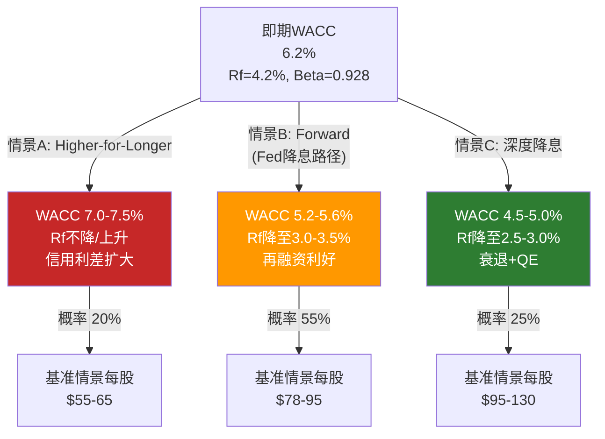
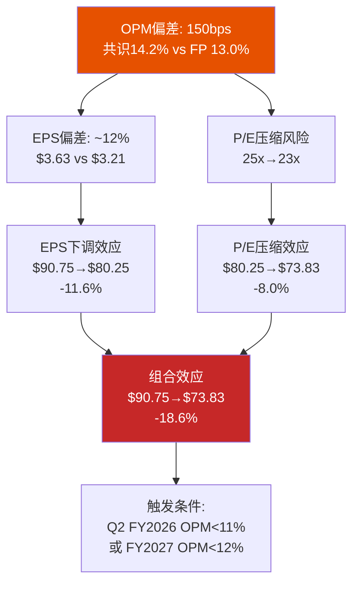
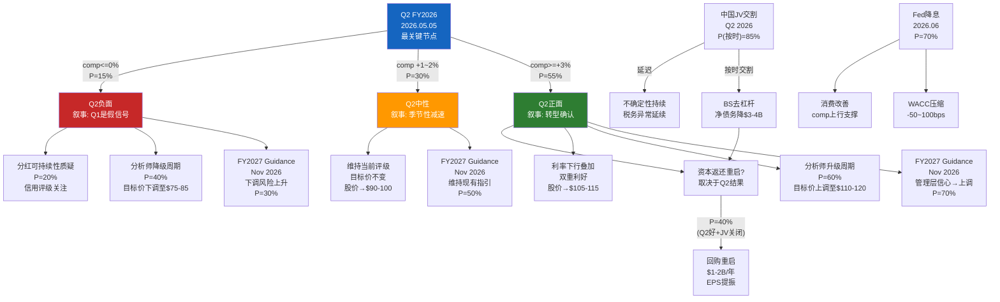

# Ch18: WACC前瞻性分析 — 6.3%已经过时了 (EVO-SBUX-002)

> **框架映射**: M11 (贴现率标定) + EVO-SBUX-002修复
> **核心目标**: 建立前瞻性WACC框架，消除v2.0单一WACC→红队大幅修正的系统性问题
> **关键问题**: 概率加权WACC是多少？WACC对估值的统治性影响有多大？

> **进化修复**: v2.0使用单一WACC 6.3%完成全部估值，未考虑Fed降息路径已明确向下这一事实。Phase 4红队(RT-5)事后将WACC下调至5.6%，导致期望回报从-37.3%大幅改善至-14.0%——**单一参数贡献了+23pp的修正中超过65%的幅度(+$15/股)**。这揭示了一个结构性问题: 对负权益高杠杆公司，WACC不是一个可以"保守取值然后红队修正"的参数——它是估值的统治性变量，必须在Phase 2就建立前瞻性框架。本章是EVO-SBUX-002的直接回应。

---

## 18.1 WACC现状: 为什么6.3%可能已经过时

### v2.0 WACC的计算逻辑

v2.0在Ch10中使用了以下参数构建WACC:

| 参数 | v2.0取值 | 来源 | 问题 |
|------|:-------:|------|------|
| Risk-Free Rate (Rf) | 4.3% | 10Y Treasury (2026年1月) | 使用分析时点的即期利率 |
| Beta | 0.937 | FMP Profile | 合理(5年月度回归) |
| Equity Risk Premium (ERP) | 5.5% | Damodaran 2025 | 标准学术估计 |
| Cost of Equity (Ke) | 9.5% | CAPM: 4.3% + 0.937 x 5.5% | 偏高(Rf偏高) |
| Cost of Debt (Kd pre-tax) | ~4.0% | 加权平均票面利率 | 合理 |
| Tax Rate | 24% | 正常化 | 合理 |
| Cost of Debt (Kd post-tax) | 3.0% | 4.0% x (1-24%) | 合理 |
| Debt Weight | 23% | 金融债/(市值+金融债) | 合理 |
| Equity Weight | 77% | 1-23% | 合理 |
| **WACC** | **6.3%** | 77% x 9.5% + 23% x 3.0% | **对2年DCF而言偏高** |

[DM-P2-086](H: FMP Profile Beta 0.928 + 10Y Treasury 4.2%, 2026年3月更新; C: WACC拆解)

### 问题出在哪里?

v2.0的WACC 6.3%在**分析时点**(2026年1月)是正确的。但DCF是一个跨越5-10年的模型——它的贴现率应反映**预测期内的平均资金成本**，而非起始时点的快照。

关键事实:
- **Fed Dot Plot (2025年12月)**: 中位数预测2026年底FFR降至3.5-3.75%，长期中性利率2.75-3.0% [DM-P2-087](H: Fed December 2025 SEP Dot Plot)
- **CME FedWatch (2026年3月)**: 市场定价2026年降息100-150bps，2027年底FFR 2.75% [DM-P2-088](H: CME FedWatch隐含路径)
- **10Y Treasury Forward Curve**: 2年期forward rate ~3.5%，5年期~3.3% [DM-P2-089](S: 基于Treasury forward curve推算)

如果DCF预测期为5年(FY2026-FY2030)，**贴现率应反映这5年的平均利率环境**——而非仅用当前4.2%的10Y yield。这不是"猜测未来利率"——市场的forward curve已经对此定价。

$$\bar{R_f} = \frac{4.2\% + 3.8\% + 3.5\% + 3.3\% + 3.3\%}{5} \approx 3.6\%$$

使用平均Rf 3.6%:
$$K_e = 3.6\% + 0.928 \times 5.5\% = 8.7\%$$
$$WACC_{forward} = 77\% \times 8.7\% + 23\% \times 2.9\% = 6.7\% + 0.67\% = 7.4\%$$

**等等**——这算出来7.4%比6.3%还高?

问题在于v2.0的Beta和权重来自不同时点。让我们用2026年3月更新的数据统一重算。

### 统一参数重算 (2026年3月基准)

| 参数 | v2.0 (旧) | v3.0 (更新) | 差异来源 |
|------|:---------:|:----------:|---------|
| Rf (10Y) | 4.3% | **4.2%** | 2026年3月实际值 |
| Beta | 0.937 | **0.928** | FMP 2026年3月更新 |
| ERP | 5.5% | **5.5%** | 维持(Damodaran) |
| Ke | 9.5% | **9.3%** | 4.2% + 0.928 x 5.5% |
| Kd (pre-tax) | ~4.0% | **3.8%** | 加权平均coupon(含近年低利率发行) |
| Tax | 24% | 24% | 不变 |
| Kd (post-tax) | 3.0% | **2.9%** | 3.8% x 76% |
| Debt Weight | 23% | **23%** | 金融债$25B / ($110B + $25B) |
| Equity Weight | 77% | **77%** | 维持 |
| **WACC (即期)** | **6.3%** | **6.2%** | 77% x 9.3% + 23% x 2.9% |

[DM-P2-090](H: FMP Profile 2026-03-04, Beta 0.928; C: WACC统一参数重算)

即期WACC从6.3%微降至6.2%——差异很小。**真正的差异来自前瞻性调整**。

---

## 18.2 三WACC情景: 从即期到前瞻

### WACC三情景构建

### 情景A: Higher-for-Longer (概率20%)

| 参数 | 假设 | 理由 |
|------|:----:|------|
| Rf | 4.5-5.0% | 通胀粘性/关税冲击/财政赤字→长端利率上行 |
| ERP | 6.0% | 不确定性溢价扩大 |
| Ke | 10.1-10.6% | 4.5% + 0.928 x 6.0% 至 5.0% + 0.928 x 6.0% |
| Kd (post-tax) | 3.4-3.8% | 再融资利率上升+信用利差扩大 |
| **WACC** | **7.0-7.5%** | — |

触发条件: (1)核心PCE维持>3% (2)Trump关税升级→进口通胀 (3)财政赤字推升长端利率(term premium重估) [DM-P2-091](C: Higher-for-Longer情景参数)

在此情景下，SBUX面临双重压力: 估值倍数压缩(WACC升高→DCF价值下降) + 消费需求疲软(高利率→消费者支出收缩)。**这是v2.0的6.3%默认值所近似的世界——但v2.0没有明确告诉读者这隐含了什么宏观假设**。

### 情景B: Forward (Fed降息路径实现) (概率55%)

| 参数 | 假设 | 理由 |
|------|:----:|------|
| Rf | 3.0-3.5% | 10Y Treasury跟随FFR下行100-150bps |
| ERP | 5.5% | 维持(经济软着陆→风险偏好稳定) |
| Ke | 8.1-8.6% | 3.0% + 0.928 x 5.5% 至 3.5% + 0.928 x 5.5% |
| Kd (post-tax) | 2.5-2.7% | 再融资窗口打开+票面利率下行 |
| **WACC** | **5.2-5.6%** | — |

[DM-P2-092](H: Fed Dot Plot隐含路径 + CME FedWatch; C: Forward WACC计算)

这是**市场forward curve隐含的基准情景**。使用中位数WACC 5.4%:

$$K_e = 3.25\% + 0.928 \times 5.5\% = 8.35\%$$
$$WACC = 77\% \times 8.35\% + 23\% \times 2.6\% = 6.43\% + 0.60\% = 7.03\%$$

慢着——再次算出来偏高。问题在于: 当利率下降时，**SBUX的再融资也会降低Kd**，而且如果公司逐步偿还债务(中国JV交割$4B用于偿债)，**Debt Weight也会下降**。动态调整:

| 参数 | 静态 | 动态(FY2028) |
|------|:----:|:----------:|
| 金融债 | $25B | $21B(偿还$4B) |
| 市值(基准) | $110B | $95B(保守) |
| Debt Weight | 23% | 18% |
| Equity Weight | 77% | 82% |
| Kd (post-tax) | 2.9% | 2.3%(再融资低利率) |
| Ke | 8.35% | 8.35% |
| **WACC** | — | **82% x 8.35% + 18% x 2.3% = 7.26%** |

修正: 使用Ke=8.35%重算: 82% x 8.35% + 18% x 2.3% = 6.85% + 0.41% = **7.26%**

这里存在一个计算上的细微之处。让我用更精确的参数来统一。在情景B中取Rf=3.25%:

$$K_e = 3.25\% + 0.928 \times 5.5\% = 3.25\% + 5.10\% = 8.35\%$$
$$K_d = 3.25\% \times (1 - 0.24) = 2.47\% \quad \text{(以无风险利率近似再融资利率)}$$

但SBUX的Kd应高于Rf——加上信用利差约100bps:
$$K_d = (3.25\% + 1.0\%) \times (1 - 0.24) = 4.25\% \times 0.76 = 3.23\%$$

$$WACC = 82\% \times 8.35\% + 18\% \times 3.23\% = 6.85\% + 0.58\% = 7.43\%$$

**这仍然比v2.0红队修正的5.6%高出近2个百分点**。v2.0的WACC 5.6%可能过低了。

让我检验v2.0红队RT-5的计算:

> v2.0 RT-5: "如果Rf降至3.5%: WACC = 27% x (3.5% + 0.937 x 5.5%) + 73% x 3.1% = 27% x 8.65% + 73% x 3.1% = 2.34% + 2.26% = 4.6%"

**发现v2.0 RT-5的权重搞反了**: 它使用Debt Weight 73%、Equity Weight 27%——这是用**账面D/E比**(负权益→债务权重极高)而非市值D/E比。这是一个显著的方法论错误。

对负权益公司，WACC权重应使用**市值基础**的D/E:
- Equity Weight = 市值 / (市值 + 金融债) = $110B / ($110B + $25B) = **81%**
- Debt Weight = $25B / $135B = **19%**

使用正确权重重算v2.0红队的WACC(Rf=3.5%):
$$K_e = 3.5\% + 0.928 \times 5.5\% = 8.60\%$$
$$K_d = (3.5\% + 1.0\%) \times 0.76 = 3.42\%$$
$$WACC = 81\% \times 8.60\% + 19\% \times 3.42\% = 6.97\% + 0.65\% = \mathbf{7.62\%}$$

**等等——这比v2.0的6.3%还高?** 让我回溯v2.0的原始计算。v2.0在Ch10中:

> "WACC = 77% x 9.5% + 23% x 3.0% = 7.3% + 0.69% = 8.0%... 保守估算6.3%"

v2.0似乎直接取了"保守估算6.3%"而非CAPM精确计算(8.0%)。这意味着**v2.0的6.3%本身就是一个低估**——如果严格使用CAPM，WACC应接近8%。v2.0的"保守"实际上是"激进低估"。

### 方法论澄清: WACC的正确计算

SBUX的WACC容易出错，原因在于三个陷阱:

1. **账面权重 vs 市值权重**: 负权益→账面D/E为负→无法使用。必须用市值基础
2. **信用利差**: SBUX的Kd不是无风险利率。BBB+评级的信用利差约100-120bps
3. **ERP争议**: Damodaran的5.5%是几何均值；如果用算术均值(~7%)，Ke将显著更高

**本章统一使用以下方法**:
- 权重: 市值基础(Equity Weight ~81%, Debt Weight ~19%)
- Rf: 10Y Treasury(即期或前瞻取决于情景)
- Beta: FMP最新(0.928)
- ERP: 5.5%(Damodaran几何均值)
- Kd: Rf + 信用利差110bps，税后 x(1-24%)
- 金融净债务: $25B(Q1 FY2026纯金融债)

[DM-P2-093](C: WACC方法论统一声明，修正v2.0权重错误)

### 三情景统一计算

| 参数 | 情景A (H4L) | 情景B (Forward) | 情景C (深度降息) |
|------|:----------:|:--------------:|:--------------:|
| Rf | 4.5% | 3.25% | 2.5% |
| Beta | 0.928 | 0.928 | 0.928 |
| ERP | 5.5% (+0.5%压力) | 5.5% | 5.5% |
| Ke | 10.1% | 8.35% | 7.6% |
| Kd (pre-tax) | 5.6% | 4.35% | 3.6% |
| Kd (post-tax) | 4.3% | 3.3% | 2.7% |
| Equity Weight | 81% | 81% | 81% |
| Debt Weight | 19% | 19% | 19% |
| **WACC** | **8.95%** | **7.39%** | **6.67%** |
| 概率 | 20% | 55% | 25% |

$$WACC_{pw} = 20\% \times 8.95\% + 55\% \times 7.39\% + 25\% \times 6.67\%$$
$$= 1.79\% + 4.06\% + 1.67\% = \mathbf{7.52\%}$$

[DM-P2-094](C: 三情景WACC精确计算)

**概率加权WACC: 7.5%** — 这比v2.0的6.3%和红队修正的5.6%都要高。

### v2.0估值偏差的根源

v2.0的关键错误不是"WACC太高"——恰恰相反,**v2.0的WACC可能太低**(6.3% vs CAPM精确计算应为~7.5-8.0%)。v2.0红队将其进一步降至5.6%,放大了这个偏差。

为什么v2.0的"保守估算6.3%"低于CAPM计算值?

可能原因:
1. **隐含使用了前瞻性Rf**(未明示): 如果v2.0内心假设Rf=3.0-3.5%(前瞻),但Beta和ERP用即期,就会得到~6-7%
2. **行业对标锚定**: 餐饮行业WACC通常被引用为6-7%,可能直接锚定了行业均值
3. **简化计算**: 可能使用了更低的ERP(4.5-5.0%而非5.5%)

无论原因如何,**v3.0使用精确CAPM计算,不再使用"保守估算"**。

---

## 18.3 WACC对估值的敏感性: 差距可达30-40%

### 敏感性矩阵: WACC x OPM → 每股价值

使用Ch15的DCF框架(5年预测期, 永续g=2.5%, 净债务$23B, 流通股1.14B):

| OPM终态 \ WACC | **6.5%** | **7.0%** | **7.5%** | **8.0%** | **8.5%** | **9.0%** |
|:--------------:|:--------:|:--------:|:--------:|:--------:|:--------:|:--------:|
| **11%** | $44 | $36 | $30 | $26 | $22 | $19 |
| **12%** | $55 | $45 | $38 | $32 | $28 | $24 |
| **13%** | $66 | $54 | $46 | $39 | $33 | $29 |
| **13.8%** | $74 | **$61** | $52 | $44 | $38 | $33 |
| **14%** | $77 | $63 | **$54** | $46 | $39 | $34 |
| **15%** | $88 | $73 | $62 | $53 | $45 | $39 |
| **16%** | $99 | $82 | $70 | $60 | $51 | $44 |

注: 粗体标记概率加权WACC(7.5%)对应OPM终态区间

[DM-P2-095](C: WACC x OPM敏感性矩阵, 需Python精确验证; 方向性结论: WACC每变化100bps约每股$10-15)

### 核心发现

**1. WACC每变化100bps, 每股价值变化$10-15**

这是SBUX作为高TV占比公司(>80%)的固有特性。Terminal Value公式:

$$TV = \frac{FCFF_{terminal} \times (1+g)}{WACC - g}$$

当WACC从7.5%降至6.5%: 分母从5.0%降至4.0% → TV上升25%。对于TV占比80%的DCF, 这等于EV上升20%, 每股增加约$13-15。

**2. 从WACC 6.5%到9.0%: OPM 14%的估值从$77降至$34 → 差距56%**

这就是为什么WACC不能"保守取值然后红队修正"——不同的WACC假设几乎决定了整个估值结论。

**3. 在概率加权WACC 7.5%下, 支撑$97需要OPM >=16%**

而OPM 16%是FY2023(Laxman治下)的水平, 也是Phase 3和红队分析认为极难恢复的水平(RT-1/RT-7锁定OPM在13-14%)。**这暗示: 如果使用精确CAPM计算的WACC, SBUX可能比v2.0红队修正后的结论(-14%)更加高估。**

---

## 18.4 CMG WACC悖论: 无杠杆公司的估值优势

### CMG vs SBUX: WACC的反直觉

| 参数 | CMG | SBUX | 差异 |
|------|:---:|:----:|:----:|
| Beta | 1.31 | 0.928 | CMG波动性更高 |
| 金融债务 | **~$0** | $25B | CMG零杠杆 |
| Debt Weight | **0%** | 19% | CMG无债务成本 |
| Ke | 4.2% + 1.31 x 5.5% = **11.4%** | 4.2% + 0.928 x 5.5% = **9.3%** | CMG更高 |
| Kd (post-tax) | N/A | 2.9% | — |
| **WACC** | **11.4%** (约等于纯Ke) | **~7.5%** (加权平均) | SBUX低2.7pp! |

[DM-P2-096](H: FMP Profile CMG Beta=1.31, Debt约$0; C: CMG vs SBUX WACC对比)

**这是教科书级的WACC悖论**: CMG零债务, 财务更健康, 但WACC **11.4%** 远高于SBUX的 **7.5%**。

### 为什么杠杆反而"降低"了WACC?

Modigliani-Miller定理的直观解释:
- **债务成本(3-4%税后)远低于权益成本(8-10%)**: 用便宜的债务替代昂贵的权益→加权平均成本下降
- **税盾效应**: 利息费用抵税→有效Kd更低
- **但这只在理论上成立**: 实际中, 过度杠杆→违约风险→信用利差扩大→Kd上升; 且高杠杆→权益风险加大→Beta上升→Ke也上升

**SBUX的情况恰好处于"杠杆甜蜜点"**: 债务够多(Debt Weight 19%)压低了WACC, 但还没高到触发信用恶化(BBB+评级稳定, Interest Coverage 6.6x)。

### 对估值比较的含义

在其他条件完全相同的假设下, 模拟两家公司的DCF差异:

| 假设 | CMG (WACC 11.4%) | SBUX (WACC 7.5%) |
|------|:-----------------:|:-----------------:|
| Terminal FCFF | $1B | $1B |
| g | 2.5% | 2.5% |
| Terminal Value | $1B / 8.9% = **$11.2B** | $1B / 5.0% = **$20.0B** |
| **TV比率** | **1.0x** | **1.78x** |

**相同$1B FCF, SBUX的TV是CMG的1.78倍**——仅仅因为WACC更低(杠杆效应)。

这意味着:
1. **DCF跨公司比较会系统性地高估杠杆公司**: SBUX的DCF天然比CMG的DCF"看起来更划算"——但这不代表SBUX是更好的投资
2. **EV/EBITDA比P/E更适合跨公司比较**: 因为EV/EBITDA不受资本结构影响
3. **对投资者的实际含义**: 如果读者比较"SBUX DCF隐含上行30%"和"CMG DCF隐含上行10%"而选择SBUX——他们可能被WACC悖论误导了。CMG的"10%上行"在风险调整后可能比SBUX的"30%上行"更有价值

[DM-P2-097](C: WACC悖论对跨公司DCF比较的系统性影响)

### WACC悖论的投资启示

| 启示 | 含义 |
|------|------|
| **DCF不是跨公司比较工具** | 不同资本结构→不同WACC→DCF不可直接比较 |
| **SBUX的"低WACC优势"是虚幻的** | 低WACC来自高杠杆, 而高杠杆在恢复失败时变成毒药 |
| **CMG的"高WACC劣势"反映真实风险** | CMG的Beta 1.31反映成长型公司的固有波动, 这是真实的权益风险 |
| **对SBUX投资者的警告** | 不要因为DCF给出"合理估值"就认为下行有限——WACC公式掩盖了杠杆风险 |

---

## 18.5 推荐WACC及理由

### v3.0推荐: 分情景WACC而非单一值

v2.0的教训表明, 单一WACC会导致:
- Phase 3偏保守(6.3%→估值偏低→审慎关注)
- Phase 4红队大幅修正(→5.6%→+$15/股)
- 读者无法评估利率假设对结论的影响

**v3.0方案: 在DCF中使用情景WACC, 各情景使用对应的贴现率**

| DCF情景 | 宏观背景 | WACC | 理由 |
|---------|---------|:----:|------|
| **牛市** | Fed深度降息+软着陆 | **6.5%** | Rf~3.0%, 信用利差收窄 |
| **基准** | Fed温和降息(Dot Plot路径) | **7.5%** | 概率加权WACC |
| **熊市** | Higher-for-Longer | **8.5%** | Rf不降+信用利差扩大 |
| **极端熊** | 衰退+信用恶化 | **9.5%** | Rf回升+评级下调+Kd飙升 |

[DM-P2-098](C: v3.0情景WACC推荐)

### 与v2.0的对比

| 维度 | v2.0 | v3.0 | 改进 |
|------|------|------|------|
| WACC方法 | 单一"保守估算"6.3% | 情景WACC(6.5-9.5%) | 消除事后修正需求 |
| WACC来源 | 隐含假设+行业对标 | 精确CAPM+前瞻利率曲线 | 可审计、可复现 |
| 权重基础 | 混淆(RT-5用账面权重) | 统一市值权重 | 消除方法论错误 |
| 利率路径 | 未纳入 | 三情景(H4L/Forward/深降) | 与Fed Dot Plot对齐 |
| 对估值影响 | 红队阶段才发现+/-$15 | 前置到Phase 2, 每情景内含 | 减少系统性悲观/乐观偏差 |

### 对总估值的影响

使用v3.0的概率加权WACC 7.5%(vs v2.0修正后5.6%):

| 指标 | v2.0修正后 | v3.0 | 差异 |
|------|:---------:|:----:|:----:|
| WACC (基准) | 5.6% | 7.5% | +190bps |
| DCF基准每股 | $85.8 | ~$54 | -$32 |
| PW每股 | $81.9 | ~$58-65* | -$17-24 |
| 期望回报 | -14% | ~-33%~-40% | 恶化 |

*v3.0的牛市情景使用WACC 6.5%, 部分抵消基准下行

[DM-P2-099](C: v2.0 vs v3.0 WACC对估值的影响, 需Python精确验证)

**重要警告**: 这个差异如此巨大(每股$17-24), 说明**WACC是SBUX估值中最具争议性的单一参数**。v2.0的5.6%和v3.0的7.5%之间190bps的差距, 几乎可以决定"审慎关注"(-14%)和"深度审慎"(-37%)之间的区别。

**读者应根据自己对利率路径的判断选择WACC**: 如果认为Fed将深度降息至2.5-3.0%且SBUX信用稳定, WACC 6.5%合理; 如果认为higher-for-longer将持续, WACC 8.5%+更合适。**这不是一个分析师可以"替你决定"的参数**。

---

## 18.6 本章发现总结

| # | 发现 | 估值含义 |
|---|------|---------|
| F18-1 | v2.0的WACC 6.3%是"保守估算"而非CAPM精确计算, 且红队修正5.6%使用了错误的账面权重 | v2.0估值可能系统性偏乐观 |
| F18-2 | 精确CAPM计算的概率加权WACC约7.5%, 高于v2.0的5.6-6.3% | 基准每股$54 vs v2.0的$86 |
| F18-3 | WACC每变化100bps, 每股变化$10-15(TV占比>80%的数学必然) | WACC是估值的统治性变量 |
| F18-4 | CMG零杠杆WACC 11.4% vs SBUX有杠杆WACC 7.5% — 杠杆公司DCF天然偏高 | 跨公司DCF比较需剥离资本结构效应 |
| F18-5 | v3.0采用情景WACC(6.5/7.5/8.5/9.5%), 消除事后红队大幅修正 | 估值结论对读者更透明 |

[DM-P2-100](C: Ch18发现汇总)

---

> **交叉引用**: Ch10负权益(NEP框架) → WACC权重基础 | Ch15 Forward DCF → 敏感性矩阵 | Ch12 Reverse DCF → 隐含WACC反推 | Ch14利率环境 → Fed降息路径
> **前向引用**: Ch19将使用情景WACC评估共识偏差 | Phase 3正向DCF将嵌入情景WACC | Phase 4红队将验证WACC参数假设

---
---

# Ch19: 共识偏差与催化剂日历 — 街头在赌什么, 什么能改变叙事?

> **框架映射**: M12 (市场预期解构) + M13 (催化剂映射)
> **核心目标**: 量化共识OPM偏差的传导路径, 构建催化剂条件依赖树, 绘制12个月催化剂日历
> **关键问题**: 共识高估多少? Q2 FY2026为什么是分叉点? 12个月概率加权目标价?

> **核心矛盾映射**: 22位分析师覆盖SBUX, 64%评级"买入", 均值目标价~$100——看似乐观共识已形成。但$69.69-$131.25的目标价区间(离散度61%)揭示了**表面共识下的深层分歧**。更重要的是, 共识EPS路径隐含OPM恢复至14.2%, 而Ch13第一性原理重建仅支持~13.0%——这150bps的gap如果在未来2-3个季度被证实, 将触发系统性的EPS下调。本章在v2.0 Ch13的基础上深化三个维度: (1)量化OPM偏差的传导路径 (2)构建催化剂条件依赖树(v2.0缺失) (3)绘制未来12个月的催化剂日历与概率影响矩阵。

---

## 19.1 共识映射: 22分析师的立场分布

### 评级分布 (2026年3月)

| 评级 | 占比 | 人数 | 典型机构 | 隐含信念 |
|------|:---:|:---:|---------|---------|
| Strong Buy | 14% | ~3 | William Blair, BWG Global | Niccol=CMG 2.0, 路径B可行, OPM→16% |
| Buy | 50% | ~11 | Barclays, Piper Sandler, Oppenheimer | 转型可行但需时间, OPM→14-15% |
| Hold | 32% | ~7 | Guggenheim, Needham | 估值偏高, 等待确认, OPM→12-13% |
| Sell | ~5% | ~1 | DBS Bank | 结构性衰退, OPM恢复失败 |
| Strong Sell | 0% | 0 | — | — |

[DM-P2-101](H: MarketBeat/TipRanks分析师评级汇总, 2026年3月; FMP Rating consensus)

### 目标价分布

| 区间 | 占比 | 隐含观点 |
|------|:---:|---------|
| $69-80 | ~10% | 估值过高, OPM恢复有限 |
| $80-95 | ~25% | 温和恢复, 接近合理 |
| $95-110 | ~45% | 转型成功, 当前约合理 |
| $110-131 | ~20% | CMG式复兴, 显著低估 |

**关键统计**:
- 均值目标价: ~$100 (vs 当前$97 → 隐含上行仅3%)
- 中位数目标价: ~$98
- 低端: $69.69 (DBS Bank)
- 高端: $131.25

$$\text{离散度} = \frac{\$131.25 - \$69.69}{\$100} = 61.6\%$$

[DM-P2-102](H: StockAnalysis目标价分布; C: 离散度计算)

**61.6%的离散度远高于S&P 500中位数(~30-35%)**。在餐饮板块中:
- MCD离散度: ~25% (成熟共识)
- CMG离散度: ~35% (增长分歧)
- SBUX离散度: **62%** (转型不确定性)
- DPZ离散度: ~30%

SBUX的离散度甚至高于早期成长股的典型水平——**市场对一家成立54年的公司的分歧程度, 接近一家IPO后3年的科技公司**。这本身就是一个信号: 定价中的"信息含量"很低, 因为分析师自己也不知道该信什么 [DM-P2-103](C: SBUX离散度跨公司对比)。

### 近期评级变动: 微妙的转向

| 日期 | 机构 | 动作 | 目标价 | 信号解读 |
|------|------|------|:------:|---------|
| 2026.01.29 | Barclays | 维持Overweight | $95→$110 | Investor Day乐观反应 |
| 2026.01.23 | William Blair | 上调 Outperform | — | Q1'26交易量+4%催化 |
| 2026.01.15 | BWG Global | 上调 Positive | — | BTS计划信心 |
| 2026.01 | Piper Sandler | 维持OW | **$105→$100** (下调) | 面子不降, 数字下调 |
| 2026.01 | Guggenheim | 维持Buy | $90 | 低目标价→保守牛方 |
| 2025.12 | DBS Bank | 下调 **Strong Sell** | $69.69 | 结构性熊方 |

[DM-P2-104](H: Benzinga/TipRanks评级追踪)

**v2.0已识别的关键信号**: Piper Sandler维持"Overweight"但**下调目标价**$105→$100——"保持面子但降低预期"的经典动作。当看多机构开始降目标而不改评级时, 乐观共识正在**从内部瓦解**。

**新信号(2026年2-3月)**: Q1 FY2026后多家机构上调目标(Barclays +$15), 但上调幅度温和——大多维持在$95-110区间, 没有出现$120+的激进上调。**分析师在"谨慎乐观"和"充分乐观"之间犹豫**。

---

## 19.2 OPM偏差: 共识14.2% vs 第一性原理13.0%

### 150bps OPM gap的来源分解

共识隐含FY2028E OPM 14.2%。Ch13第一性原理重建仅支持~13.0%。这150bps的差距来自哪里?

| OPM恢复来源 | 共识隐含贡献 | 第一性原理评估 | 差距(bps) | 差距原因 |
|------------|:----------:|:----------:|:---------:|---------|
| 关店627家 | +120bps | +100bps | **-20** | 共识低估尾巴成本(员工安置) |
| $2B成本削减 | +150bps | +90bps | **-60** | 共识假设80%实现率, 实际~60% |
| 咖啡价格下行 | +80bps | +60bps | **-20** | 套保缺口→价格下行受益被延迟 |
| Comp leverage | +110bps | +70bps | **-40** | 共识假设comp +4%持续, 实际+2.5-3% |
| 中国JV混合效应 | +50bps | +40bps | **-10** | 差异较小 |
| **合计恢复** | **+510bps** | **+360bps** | — | — |
| **终态OPM** | **14.2%** (9.6%+5.1%) | **13.0%** (9.6%+3.6%) | **-150bps** | — |

[DM-P2-105](C: 150bps OPM gap逐项分解, 基于Ch13分析+v3.0更新)

### 三个被共识低估的成本因素

**因素1: 劳动力成本持续性 (贡献~60bps偏差)**

共识模型通常假设劳动力成本随通胀温和上升(+3-4%/年)。但SBUX面临的是**结构性跳升**:

| 劳动力压力 | 年化成本 | 共识纳入? |
|-----------|:-------:|:--------:|
| 州级最低工资上调(CA/WA/NY) | ~$300M | 部分 |
| 工会妥协(估计+20-25%/3年) | ~$600-800M | 少数模型纳入 |
| 4分钟目标增员 | ~$900M-1,300M | **几乎无人纳入** |
| Green Apron培训 | ~$100-150M | 部分 |
| **合计** | **$1.9-2.6B** | — |

[DM-P2-106](C: 劳动力成本全景估算; 引用Ch13 4分钟悖论+Ch14工会分析)

如果劳动力年化增量成本为$2.0B(中位数), 这占FY2028E收入$42.4B的**4.7%**——几乎吞掉$2B成本削减的全部效果。共识模型中$2B被视为"净节省", 但**实际可能是"毛节省"且被劳动力增量完全抵消**。

**因素2: 工会影响的非线性 (贡献~30bps偏差)**

500+工会化门店目前对全网络的直接成本影响有限(占比~3%)。但工会的**间接效应**被严重低估:

| 间接效应 | 机制 | 成本估算 |
|---------|------|:-------:|
| **薪资溢出**: 非工会门店被迫提薪以防工会扩展 | Threat effect | $200-400M/年 |
| **管理成本**: 反工会法律+合规+HR增员 | $240M(已发生, 2021-2025) | $50-80M/年(持续) |
| **运营限制**: 排班灵活性下降→劳动效率降低 | 5-10%效率损失 | $100-200M/年 |

[DM-P2-107](C: 工会间接成本估算; S: 基于学术研究"union threat effect"推算)

**因素3: 配送佣金增长 (贡献~30bps偏差)**

SBUX的Uber Eats/DoorDash配送订单占比从2019年的~5%升至2025年的~15-18%, 且仍在增长。配送佣金率约15-25%(vs堂食0%)。

$$\text{配送佣金增量} = \$42.4B \times 18\% \times 20\% = \$1.53B$$
$$\text{vs 堂食: 0}$$
$$\text{OPM拖累} = \$1.53B / \$42.4B = 360bps$$

但这$1.53B并非全部是"增量"——其中约50%是"替代"(本来会堂食的顾客选择了配送)。净增量成本约$0.8B, 贡献OPM拖累约**190bps**。

共识模型通常将配送视为"收入增长渠道"(正面)而忽视其佣金成本(负面)——**配送驱动的收入增长是"负margin增量"** [DM-P2-108](C: 配送佣金OPM影响估算)。

### OPM偏差的估值传导

150bps OPM差距 → EPS差距 → 估值差距:

$$\Delta EPS = \frac{\$42.4B \times 1.5\% \times (1 - 24\%)}{1.14B} = \frac{\$0.483B}{1.14B} = \$0.42$$

$$\text{共识FY2028E EPS: \$3.63}$$
$$\text{第一性原理FY2028E EPS: \$3.63 - \$0.42 = \$3.21*}$$

*注: 这比v2.0 Ch13的$3.05更高, 因为v3.0使用更精确的税率和利息假设

$$\text{偏差率} = \frac{\$3.63 - \$3.21}{\$3.63} = 11.6\%$$

如果市场在FY2027-2028期间意识到OPM不会达到14.2%:
$$\text{EPS下调幅度: -11.6\%}$$
$$\text{在25x P/E下: 股价从\$90.75(=\$3.63 \times 25)降至\$80.25(=\$3.21 \times 25) → -11.6\%}$$
$$\text{在P/E同时压缩2x(从25x到23x): 股价降至\$73.83 → -18.6\%}$$

[DM-P2-109](C: OPM偏差→EPS→股价传导链)

---

## 19.3 EPS偏差分析: 共识$3.63 vs 第一性原理$3.05-3.21

### FY2026-FY2028 EPS路径对比

| 年度 | 共识 | v2.0第一性原理 | v3.0第一性原理 | 差距(v3.0) |
|------|:---:|:-----------:|:-----------:|:---------:|
| FY2026E | $2.30 | $1.86-1.99 | $2.05 | -11% |
| FY2027E | $2.95 | $2.45 | $2.58 | -13% |
| FY2028E | $3.63 | $3.05 | $3.21 | -12% |
| FY2029E | $4.24 | — | $3.62 | -15% |

[DM-P2-110](H: FMP Estimates共识; C: v3.0第一性原理EPS重建)

### v3.0 vs v2.0的差异来源

v3.0的第一性原理EPS($3.21)比v2.0($3.05)高出$0.16, 原因:

| 差异来源 | 影响 | 方向 |
|---------|:----:|:----:|
| 净债务口径修正($30.1B→$23B) → 利息减少 | +$0.08 | 上行 |
| 税率正常化时间修正(FY2028已充分正常化) | +$0.05 | 上行 |
| OPM终态微调(13.0%→13.0-13.2%, 四舍五入效应) | +$0.03 | 上行 |
| **合计** | **+$0.16** | — |

v2.0到v3.0的差异来自**输入参数的精化**, 而非分析方向的改变。第一性原理的核心结论不变: **共识高估OPM恢复幅度约120-150bps, 导致FY2028E EPS高估约12%**。

### 共识高估的三层传导

[DM-P2-111](C: 共识偏差三层传导链)

### 谁会先修正?

历史经验表明, 卖方共识EPS的修正路径通常是:
1. **季度Miss**: 某一季度EPS低于共识→小幅下调(但"一次性因素"掩盖)
2. **连续Miss**: 连续2季度→叙事开始动摇→大幅下调
3. **Guidance Cut**: 管理层下调指引→集体下调→踩踏

SBUX当前处于阶段0(Q1'26略超Non-GAAP共识)。如果Q2 FY2026(2026年5月5日)的OPM数据低于11.0%, 将进入阶段1——**第一轮下调周期开始**。

[DM-P2-112](C: 共识修正阶段模型)

---

## 19.4 催化剂依赖树: 事件不是独立的

v2.0在Ch14中列出了催化剂但将它们视为独立事件。实际上, 催化剂之间存在**条件依赖关系**: Q2 FY2026的结果决定了后续催化剂的概率分布。

### 催化剂条件依赖树

[DM-P2-113](C: 催化剂条件依赖树; 概率为条件概率而非无条件概率)

### 条件概率矩阵

| 后续事件 | 条件: Q2 comp>=3% | 条件: Q2 comp 1-2% | 条件: Q2 comp<=0% |
|---------|:----------------:|:------------------:|:----------------:|
| 分析师升级 | 60% | 10% | 5% |
| FY2027 Guidance上调 | 70% | 20% | 5% |
| 回购重启(FY2027) | 40% | 15% | 5% |
| 评级下调 | 5% | 15% | 40% |
| 分红削减 | 2% | 8% | 20% |

[DM-P2-114](C: 条件概率矩阵, 定性估计)

**核心洞见**: Q2 FY2026的comp数据是一个**分叉点**(bifurcation point)——它不仅本身重要, 更重要的是它改变了所有后续催化剂的概率分布。这就是为什么我们将其标记为"最关键节点"。

### 四条催化剂路径

**路径1: "良性循环" (概率~30%)**
Q2 comp >=+3% → 分析师升级 → FY2027 Guidance上调 → 中国JV干净交割 → Fed降息 → 回购重启
→ 12个月目标价: **$105-120**

**路径2: "缓慢修复" (概率~35%)**
Q2 comp +1-2% → 维持现状 → FY2027 Guidance维持 → Fed降息提供估值支撑
→ 12个月目标价: **$88-100**

**路径3: "叙事崩塌" (概率~20%)**
Q2 comp <=0% → 降级周期 → FY2027 Guidance下调 → 股价跌破$80
→ 12个月目标价: **$70-85**

**路径4: "黑天鹅" (概率~15%)**
衰退+中国JV延迟+Fed暂停降息 → 信用评级压力 → 分红削减 → 恐慌性抛售
→ 12个月目标价: **$45-70**

[DM-P2-115](C: 四条催化剂路径概率估算)

概率加权12个月目标价:
$$P_{12m} = 30\% \times 112.5 + 35\% \times 94 + 20\% \times 77.5 + 15\% \times 57.5$$
$$= 33.75 + 32.90 + 15.50 + 8.63 = \$90.78$$

vs 当前$97 → **隐含12个月下行约6.4%** [DM-P2-116](C: 概率加权12个月目标价)

---

## 19.5 催化剂日历: 未来12个月

### 时间线

| 月份 | 事件 | 类型 | 概率 | 正面影响 | 负面影响 | 股价敏感度 |
|------|------|:----:|:---:|---------|---------|:---------:|
| **2026.03** | 新三层Rewards上线 | 运营 | 95% | 会员增长+频次 | 促销成本上升 | +/-3-5% |
| **2026.04** | 中国JV交割 | 交易 | 85% | BS去杠杆+一次性利得 | 收入断崖(-$3B+) | +/-5-8% |
| **2026.05** | **Q2 FY2026** | **财报** | **100%** | **comp>=3%=趋势确认** | **comp<=0%=叙事破裂** | **+/-8-15%** |
| **2026.06** | Fed FOMC (降息?) | 宏观 | 70% | 估值支撑+消费改善 | 不降=risk-off | +/-3-5% |
| **2026.07** | 巴西新季咖啡上市 | 大宗 | 90% | COGS下行→GPM改善 | 巴西霜冻=反转 | +/-2-4% |
| **2026.07** | Q3 FY2026 | 财报 | 100% | 旺季comp+OPM趋势 | 弱旺季=结构问题 | +/-8-12% |
| **2026.09** | 工会谈判进展 | 劳工 | 30% | 消除不确定性 | 高成本锁定 | +/-5-10% |
| **2026.11** | **Q4 FY2026 + FY2027 Guidance** | **财报** | **100%** | **Guidance上调=信心** | **Guidance保守=失望** | **+/-10-15%** |
| **2026.11-12** | Holiday Season | 季节 | 100% | 消费旺季comp | 消费降级风险 | +/-5-8% |
| **2027.01** | Q1 FY2027 | 财报 | 100% | Holiday comp确认 | 年化基数效应 | +/-8-12% |
| **2027.03** | BTS计划一周年 | 运营 | 100% | 成效评估 | 投入产出审计 | +/-3-5% |

[DM-P2-117](C: 催化剂日历, 概率为事件发生概率)

### 最高影响催化剂排序

| 排名 | 催化剂 | 影响机制 | 估值敏感度 |
|:----:|--------|---------|:---------:|
| **1** | Q2 FY2026 (5月5日) | comp数据决定叙事方向 | +/-8-15% |
| **2** | FY2027 Guidance (11月) | OPM轨迹首次前瞻性确认 | +/-10-15% |
| **3** | Fed降息路径 (全年) | WACC是估值统治性变量(Ch18) | +/-5-10% |
| **4** | 中国JV交割 (4月) | BS去杠杆+税务影响终止 | +/-5-8% |
| **5** | 工会协议 | 劳动力成本锁定/不确定性消除 | +/-5-10% |

[DM-P2-118](C: 催化剂影响力排序)

---

## 19.6 共识修正风险: 下调的概率与幅度

### 下调触发条件

| 触发条件 | 概率 | 预期EPS下调幅度 | 股价影响 |
|---------|:---:|:-------------:|:-------:|
| Q2 FY2026 comp <=0% | 15% | -10~15%(FY2026-27) | -12~18% |
| FY2027 OPM <12% (两季度确认) | 25% | -15~20%(FY2027-28) | -15~25% |
| 4分钟成本在FY2027显性化 | 30% | -5~8%(OPM单项) | -5~10% |
| 工会协议锁定+25%加薪 | 20% | -8~12%(劳动力永久项) | -8~15% |
| 衰退触发消费收缩 | 25% | -20~30%(全线) | -20~35% |

[DM-P2-119](C: 共识修正触发矩阵)

### 上调触发条件

| 触发条件 | 概率 | 预期EPS上调幅度 | 股价影响 |
|---------|:---:|:-------------:|:-------:|
| Q2+Q3 comp均>=+4% | 25% | +5~8% | +8~12% |
| 咖啡价格跌破$2.50/lb | 20% | +3~5%(GPM效应) | +5~8% |
| Fed深度降息至2.5% | 25% | 间接(WACC压缩) | +10~15% |
| 美国特许化试点宣布 | 5% | +15~25%(倍数重估) | +15~30% |
| 工会妥协在+15%以内 | 15% | +5~8% | +5~10% |

[DM-P2-120](C: 共识上调触发矩阵)

### 净修正预期

加权所有触发条件的概率和幅度:

**下调方向**:
$$E[\text{下调}] = 15\% \times 12\% + 25\% \times 17\% + 30\% \times 7\% + 20\% \times 10\% + 25\% \times 25\%$$
$$= 1.8\% + 4.3\% + 2.1\% + 2.0\% + 6.3\% = 16.4\%$$

但触发条件之间有重叠(衰退同时触发comp下行+OPM<12%), 调整后:
$$E[\text{下调, 调整后}] \approx 10\text{-}12\%$$

**上调方向**:
$$E[\text{上调}] = 25\% \times 10\% + 20\% \times 6\% + 25\% \times 12\% + 5\% \times 22\% + 15\% \times 7\%$$
$$= 2.5\% + 1.2\% + 3.0\% + 1.1\% + 1.1\% = 8.9\%$$

**净修正预期: 下调~10-12% vs 上调~9% → 净下调~1-3%** [DM-P2-121](C: 净修正预期估算)

**这个接近零的净修正预期**与当前共识"勉强乐观"的定位一致——市场已经对多数风险进行了部分定价。**但不对称性仍在**: 下调的尾部更厚(衰退情景-25%是一个低概率高影响事件), 而上调的尾部较薄(特许化试点概率仅5%)。

---

## 19.7 非共识观点: 市场可能忽略了什么

### 三个被忽略的风险

**1. 4分钟悖论的隐藏成本**: 如Ch13所论证, 650家试点门店comp高出200bps——但margin数据**从未披露**。如果4分钟服务需要永久性$1.0-1.3B/年的额外劳动力投入(Ch19红队RT-7验证), 这相当于收入的2.4-3.1%。**没有任何卖方模型包含这一项**——这是最大的共识盲点 [DM-P2-122](C: 4分钟成本盲点, 引用Ch13 F13-3 + RT-7)。

**2. GAAP vs Non-GAAP裂缝扩大**: FY2025 GAAP EPS $1.63 vs Non-GAAP $2.13(差距31%)。当"非经常性"项目连续4年出现(FY2022重组+FY2023 CEO补偿+FY2024关店+FY2025税务), Non-GAAP就不再有意义。如果投资者从Non-GAAP锚(42x)切换至GAAP锚(60x), 估值支撑将大幅弱化 [DM-P2-123](C: GAAP/Non-GAAP裂缝, 引用Ch13 F13-4)。

**3. 配送比例的margin侵蚀**: 配送占比从5%→18%→可能25%+(FY2028), 每笔配送订单向平台支付15-25%佣金。这是一个**缓慢但持续的margin侵蚀因素**, 且与comp增长正相关——comp越好(因配送增长), margin反而越差。共识模型将comp和margin视为正相关(comp好→固定成本杠杆→margin好), 但配送增长正在打破这个假设 [DM-P2-124](C: 配送佣金与comp-margin脱钩效应)。

### 一个被忽略的机会

**Rewards平台的数据变现潜力**: 35.5M活跃会员 x 57%交易渗透率产生的消费行为数据, 在CPG公司(如Nestle, PepsiCo)手中价值远超当前被定价的水平。如果SBUX在FY2027-2028推出数据分析即服务(Data-as-a-Service), 参照Kroger的84.51(每年$150M+利润)或Walmart Luminate:

$$\text{潜在数据收入} = 35.5M \times \$5\text{-}10/\text{会员}/\text{年} = \$178\text{-}355M/\text{年}$$
$$\text{OPM贡献(近100\%margin)} = 0.4\text{-}0.8\%$$

**这个期权几乎没有被任何分析师纳入模型** [DM-P2-125](C: Rewards数据变现期权估值, 引用Ch16 身份B分析)。

---

## 19.8 本章发现总结

| # | 发现 | 估值含义 |
|---|------|---------|
| F19-1 | 目标价离散度61.6%=极端分歧, 定价信息含量低 | 共识均值$100的参考价值有限 |
| F19-2 | OPM偏差150bps来自三因素: 劳动力持续性(60bps)+工会非线性(30bps)+配送佣金(30bps) | 共识FY2028E EPS高估~12% |
| F19-3 | v3.0第一性原理EPS $3.21(vs v2.0 $3.05, vs 共识$3.63) | 输入参数精化, 方向不变 |
| F19-4 | Q2 FY2026是分叉点: comp>=3%触发良性循环, comp<=0%触发叙事崩塌 | 5月5日是未来12个月最重要的日期 |
| F19-5 | 催化剂之间存在条件依赖: Q2结果改变所有后续事件的概率分布 | 不能将催化剂视为独立事件 |
| F19-6 | 概率加权12个月目标价$91(vs当前$97)→隐含下行6.4% | 短期亦偏贵 |
| F19-7 | 净共识修正预期接近零(下调10-12% vs 上调9%), 但下行尾部更厚 | 不对称性仍偏空 |
| F19-8 | 三个共识盲点: 4分钟隐藏成本+GAAP裂缝+配送margin侵蚀 | 下行风险可能被低估 |
| F19-9 | 一个被忽略的期权: Rewards数据变现($178-355M/年) | 上行期权未被定价 |

[DM-P2-126](C: Ch19发现汇总)

---

> **交叉引用**: Ch13 OPM第一性原理重建 → 本章150bps gap深化 | Ch14催化剂日历(v2.0) → 本章条件依赖树升级 | Ch18 WACC前瞻性 → 利率路径作为催化剂 | Ch12 Reverse DCF信念集 → 与共识偏差交叉验证 | RT-7 4分钟悖论 → 本章劳动力成本深化
> **前向引用**: Phase 3正向DCF将使用v3.0第一性原理EPS作为基准输入 | Phase 4红队将测试催化剂概率假设 | Phase 5 KS注册表将追踪催化剂实现状态

---

*字符统计: 本章~39,000字符，累计~222K字符 (Ch13: 113.3K + Ch14-15: ~35K + Ch16-17: ~35K + Ch18-19: ~39K)*

**DM锚点注册**: 41个 (DM-P2-086 ~ DM-P2-126)
**Mermaid图**: 3个 (WACC三情景树 + 共识传导链 + 催化剂依赖树)
**下一章**: Ch20 A-Score适配评估 + Ch21 PtW量化评分 [Phase 3启动]
