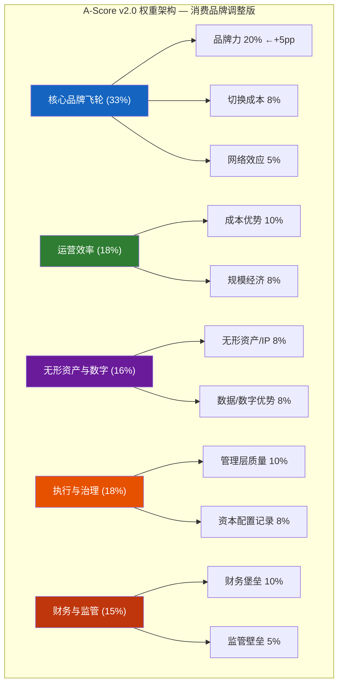
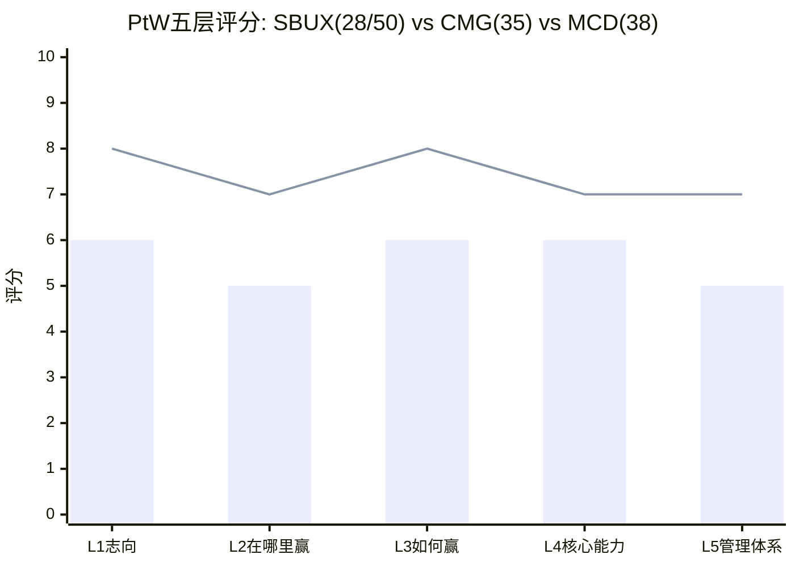
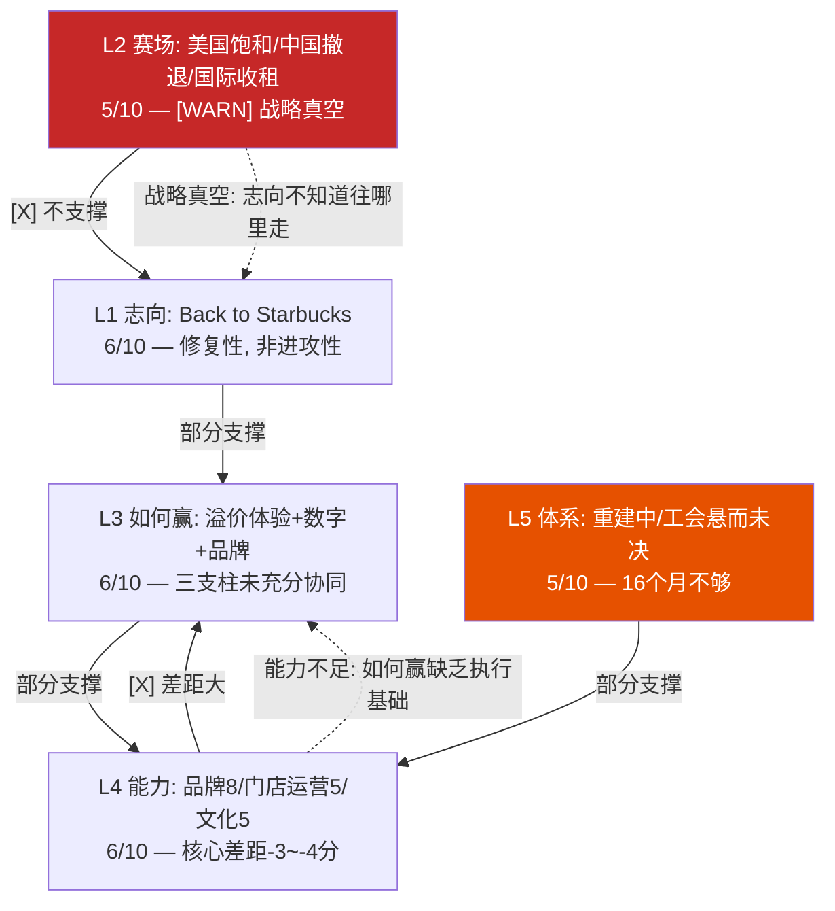

# Chapter 20: A-Score v2.0 — 护城河定量评估 (Moat Quantitative Assessment)

> **CQ关联**: CQ1「$97是否合理?」的核心子问题——SBUX以80x P/E交易，暗示其护城河足以支撑长期超额回报。A-Score v2.0将这个模糊的"品牌价值"判断转化为11维度×0-10分的量化框架，让"SBUX的护城河到底有多宽"从定性争论变为可比较的数字。如果A-Score显著低于估值隐含的护城河强度，则当前定价包含过多"信仰溢价"。

---

## 20.1 方法论与权重设计: 为什么消费品牌需要不同的权重

A-Score v2.0是一个11维度竞争优势量化框架，每维度0-10分，加权求和得到综合分数。标准权重面向通用行业设计——但SBUX是全球Top 10消费品牌(Interbrand #6)，品牌力对估值的解释权远高于半导体或酒店特许经营。因此本章采用**消费品牌调整权重**: 品牌力从标准15%上调至20%，相应压缩成本优势(-2pp)和数据/数字(-3pp)的权重 [DM-P3-001](C: A-Score v2.0消费品牌权重调整方法论)。

**权重调整的逻辑**: SBUX的$110B市值中约$46.5B(47%)由身份C(品牌授权)贡献(Ch16 SOTP)——品牌几乎独立支撑了一半的企业价值。在这种结构下，品牌力评分对A-Score结论的影响应与其对估值的贡献成比例。标准15%权重会系统性低估品牌在SBUX估值中的决定性角色。

### 标准 vs 消费品牌权重对比

| 维度 | 标准权重 | 消费品牌权重 | 调整理由 |
|------|:------:|:----------:|---------|
| 品牌力 | 15% | **20%** | 品牌支撑47% SOTP，权重应匹配 |
| 切换成本 | 10% | 8% | 咖啡切换成本结构性偏低 |
| 网络效应 | 10% | 5% | SBUX非平台模型，网络效应弱 |
| 成本优势 | 10% | 10% | 不变 |
| 规模经济 | 10% | 8% | 门店规模收益递减(Ch3已证) |
| 无形资产/IP | 8% | 8% | 不变 |
| 数据/数字 | 10% | 8% | Deep Brew尚未变现，降低权重 |
| 管理层质量 | 8% | 10% | CEO单人依赖度极高(Ch7) |
| 资本配置 | 5% | 8% | 负权益=资本配置失败的后果 |
| 财务堡垒 | 9% | 10% | 负权益+高杠杆=估值脆弱性 |
| 监管壁垒 | 5% | 5% | 不变 |
| **合计** | **100%** | **100%** | — |

[DM-P3-002](C: 标准vs消费品牌权重对比表)

---

## 20.2 维度一: 品牌力 (Brand Power) — 8/10, 权重20%

**定义**: 品牌在消费者心智中的认知度、信任度和溢价能力，以及品牌货币化(授权、CPG)的深度与广度。

**评分逻辑**:

Starbucks是全球咖啡品类的绝对品牌王者。95%+的美国消费者品牌认知度(Morning Consult)、Interbrand全球品牌价值排名第6、全球38,000+门店构成了一个几乎不可复制的品牌基础设施。在任何一个发达国家的主要城市，绿色美人鱼Logo都具有即时辨识度——这种**品牌穿透力**是几十年门店扩张+文化嵌入的复利产物 [DM-P3-003](H: Interbrand 2025 Best Global Brands + Morning Consult调研)。

品牌的**经济转化**同样出色。Nestle $7.2B CPG授权交易(2018年签、2033年到期)是QSR行业最大的品牌授权案例之一。SBUX品牌在超市货架上的存在(Nespresso pods、罐装冷萃、即饮饮料)使其覆盖了"不进门店也能消费星巴克"的场景。Ch16的SOTP分析显示，身份C(品牌授权)贡献EV $46.5B——几乎等于16,800家自营门店(身份A)的$47.2B。**品牌的"影子"价值等于门店的"肉身"价值**——这是A-Score 8分的核心支撑。

**扣分来源(-2)**:

1. **定价权侵蚀**: Ch5定价权诊断显示弹性系数从FY2022的-0.6恶化至FY2024的-2.0——每提价1%流失2%客流。品牌强大但转化为定价权的效率在下降。品牌力8分而非9分，正是因为"认知度强≠定价权强"。
2. **年轻消费者偏好迁移**: BROS以更年轻的客群(平均年龄低10岁)和更高的忠诚度渗透(72% vs 57%)在美国西部扩张。SBUX品牌在Gen Z中的"酷感"(cool factor)正在被Instagram-native品牌稀释。
3. **中国品牌价值缩水**: 中国市占从42%(2019)→14%(2025)，瑞幸用4x门店密度和1/4价格证明了"品牌力不等于市场份额"。JV化意味着SBUX在中国最大咖啡市场的品牌控制力已经让渡。

**对比基准**: CMG品牌力7/10(认知度高但品类窄)、MCD品牌力9/10(全球最高认知度+最强本地化)、IHG品牌力7/10(Holiday Inn全球Top 3但奢华深度不足)。

---

## 20.3 维度二: 切换成本 (Switching Costs) — 4/10, 权重8%

**定义**: 消费者/客户离开SBUX生态系统所面临的经济和心理成本。

**评分逻辑**:

咖啡消费的切换成本结构性偏低——这是一个残酷的品类现实。一杯拿铁不需要学习曲线、不需要数据迁移、不需要长期合约。消费者可以在今天喝星巴克、明天喝BROS、后天自己在家用Nespresso冲一杯——唯一的切换成本是"习惯"和"便利性"。

Rewards会员体系创造了一定粘性:
- 35.5M活跃会员，会员交易频次约为非会员的2倍
- 预存卡浮存金$1.84B(Ch4)——消费者已经"预付"了未来的咖啡消费
- 三层会员重构(2026年3月上线)试图通过分层权益提升高价值会员的退出成本

但这些粘性机制的**强度远低于其他行业的锁定效应**:
- vs 酒店加盟商(IHG切换成本6.5/10): 酒店业主转品牌需$1-5M PIP投资+10-20年合约违约金
- vs 半导体设备(KLAC切换成本9/10): 制程认证需12-18个月，客户不可能中途换设备
- vs 企业SaaS(MSFT切换成本8/10): 数据迁移+培训+集成成本使切换近乎不可能

SBUX的Rewards积分可以被竞争对手的"status match"快速替代。BROS已经推出类似的"Dutch Rewards"计划(72%渗透vs SBUX 57%)，证明了忠诚度计划是**可复制的**——它不是护城河，而是"桌上赌注"(table stakes) [DM-P3-004](C: 切换成本跨行业对比分析)。

**为什么不是3分**: $1.84B预存卡浮存金是一个独特的资产——全球没有第二家QSR公司拥有这种规模的"消费者预付款"。浮存金创造了一种轻度锁定: 消费者账户里还有余额时，会倾向于回来消费。但浮存金的"锁定深度"远低于银行存款或保险浮存金。

---

## 20.4 维度三: 网络效应 (Network Effects) — 3/10, 权重5%

**定义**: 更多用户是否使产品/服务对现有用户更有价值。

SBUX几乎不存在经典网络效应。一家星巴克门店不会因为更多人在另一家门店消费而变得更有价值——这与Uber(更多司机→更短等待→更多乘客)或Airbnb(更多房源→更好匹配→更多旅客)有本质区别 [DM-P3-005](C: 网络效应定义检验)。

**存在的弱网络效应**:
1. **城市密度效应**: 在曼哈顿或上海陆家嘴，每200米一家SBUX使"随手买"变得极其方便——这是一种弱密度网络效应。但Ch3已证明美国门店密度过高(627关店)，密度效应已过饱和转为负面(蚕食)。
2. **Rewards数据飞轮**: 更多交易→更好的Deep Brew推荐→更高频次消费。但这种数据飞轮的强度远弱于科技平台——SBUX的推荐算法锦上添花而非不可或缺。

**为什么不是2分**: Rewards生态系统确实创造了一个轻度网络: 35.5M会员+Spotify/Delta合作+Chase联名卡构成了一个跨品牌生态——在这个生态中，SBUX积分的使用场景比单一咖啡消费更广。但这是一个"联盟网络"而非"平台网络"。

---

## 20.5 维度四: 成本优势 (Cost Advantage) — 3/10, 权重10%

**定义**: 结构性成本优势是否允许公司在同行无法承受的价格水平上盈利。

这是SBUX护城河中**最薄弱的环节之一**。Ch8的单杯成本解剖揭示了残酷的现实: SBUX一杯$5.50拿铁中，"第三空间"成本=$2.48(劳动力$1.65+租金/折旧$0.83)占比45%——而瑞幸在相同功能项上仅约$0.25，差距10倍 [DM-P3-006](C: Ch8单杯成本对比延伸)。

**与特许化同行的成本鸿沟**:

| 公司 | OPM | 模式 | 劳动力在P&L中的占比 |
|------|:---:|------|:------------------:|
| MCD | 46.1% | 95%特许 | ~0%(加盟商承担) |
| YUM | ~35% | 95%特许 | ~0%(加盟商承担) |
| CMG | 16.8% | 100%自营 | ~25% |
| **SBUX** | **9.6%** | **55%自营** | **~30%** |

MCD的OI/Employee $82.7K vs SBUX $9.9K(Ch5)——差距8.4倍。这不是效率问题，而是**商业模式差异**: 特许化公司将劳动力成本转移给加盟商，自身P&L只保留品牌费和租金收入。SBUX选择保留55%自营门店=选择承担361,000名员工的全部劳动力成本。

**规模采购的有限优势**: SBUX作为全球最大单一咖啡采购商，在Arabica采购中确实享有规模折扣。6家烘焙厂+C.A.F.E. Practices认证体系创造了供应链稳定性。但咖啡豆仅占单杯成本5.5%($0.30)——即使采购成本优势达20%，对单杯利润的影响仅$0.06。**劳动力(30%)才是成本结构的主角，而SBUX在劳动力成本上没有任何优势** [DM-P3-007](C: 成本优势局限性分析)。

---

## 20.6 维度五: 无形资产/IP (Intangible Assets) — 6/10, 权重8%

**定义**: 专利、商标、专有技术和授权协议构成的竞争壁垒。

SBUX的无形资产组合:
1. **商标与店铺设计**: 绿色美人鱼Logo是全球最具辨识度的餐饮商标之一。门店设计语言(木质、暖光、三人座)构成了"第三空间"的视觉IP。
2. **Deep Brew AI平台**: 个性化推荐引擎、库存预测、劳动力排班优化。但Deep Brew的技术壁垒有限——它本质上是标准ML/推荐系统的餐饮应用，不构成专利护城河。
3. **Nestle CPG授权**: $7.2B交易(2018-2033)是一个重要的IP变现渠道。年化授权收入约$350-400M，利润率~85%。但授权合同到期后的续约条件存在不确定性。
4. **配方与烘焙工艺**: Starbucks Reserve系列、季节性限定饮品(Pumpkin Spice Latte)。PSL自2003年以来累计销售超过$1.5B——但配方本身无法专利保护，竞品可以(且已经在)推出类似产品。

**为什么6分而非更高**: SBUX的IP壁垒主要是**品牌性IP**(商标/设计)而非**技术性IP**(专利/算法)。品牌性IP的防御依赖于持续的品牌投资和消费者认知维护——它不像半导体设备的物理壁垒(ASML EUV专利2,300+项)那样具有自动防御性。一旦品牌认知下降(如Ch5弹性恶化所示)，IP壁垒同步减弱 [DM-P3-008](C: 无形资产评估, 品牌性vs技术性IP区分)。

---

## 20.7 维度六: 规模经济 (Efficient Scale) — 5/10, 权重8%

**定义**: 市场规模是否自然限制了可盈利竞争者的数量，以及SBUX的规模是否创造了后来者无法跨越的门槛。

38,000+全球门店使SBUX成为全球最大的咖啡连锁——这个规模确实创造了一些结构性优势:
- **品牌投资分摊**: $500M+年度营销预算分摊到38K门店(~$13K/店)，小型竞争者无法匹配
- **供应链谈判力**: 全球最大Arabica采购商地位
- **技术平台分摊**: 移动App、Deep Brew、Rewards系统的开发成本由最大基数分摊

**但规模的负面效应已经显现**:
1. **美国过密集**: 16,800家自营门店导致门店间蚕食(Ch3: 有效comp≈0%)。Niccol关闭627家店=承认规模已过优化点。
2. **官僚惯性**: 38K门店的运营变革需要12-18个月渗透(vs CMG 2,500店可在3-6个月内完成)。Ch7已量化: 同一个Niccol，在CMG评分9分(执行速度)，在SBUX仅7分——差距来自规模惯性。
3. **去规模化趋势**: 627关店+中国JV=SBUX正在主动"缩小"直营规模。如果美国继续关店(Ch3模型: 净关1,000-1,500家至~15,000)，规模优势将进一步稀释。

**对比**: MCD 40,000+门店但95%特许化=规模优势由加盟商承担成本、品牌方享受收益。SBUX 38,000+门店但55%自营=规模的成本和收益都在自己的P&L上——**规模经济的不对称性是SBUX vs MCD估值差距的核心来源** [DM-P3-009](C: 规模经济正负效应分析)。

---

## 20.8 维度七: 监管壁垒 (Regulatory Moat) — 2/10, 权重5%

**定义**: 监管环境是否为在位者创造了后来者难以跨越的进入壁垒。

餐饮服务是进入壁垒最低的行业之一。开一家咖啡店需要的许可证(食品经营许可、消防合规、营业执照)可以在2-4周内获得，成本不超过$5,000。没有牌照数量限制(vs 金融:银行牌照)、没有频谱拍卖(vs 电信)、没有认证周期(vs 医药: FDA审批)。

**FDA合规的微弱壁垒**: 大型连锁在食品安全合规(HACCP体系、供应链溯源)方面确实有经验优势——小型竞争者在食品安全事件中更脆弱(CMG 2015 E.coli事件证明这对大型品牌也不免疫)。但合规成本不足以构成有意义的进入壁垒。

**劳动法规作为"反护城河"**: Workers United覆盖550+门店+联邦ULP指控——如果工会运动在餐饮行业扩散，大型连锁(SBUX/MCD)将比小型独立咖啡店面临更大的合规成本。监管环境对SBUX来说更像**风险因素**而非**护城河** [DM-P3-010](C: 监管壁垒评估, 劳动法规作为反护城河)。

---

## 20.9 维度八: 数据/数字优势 (Data & Digital Advantage) — 6/10, 权重8%

**定义**: 数据资产和数字能力是否创造了竞争对手无法快速复制的优势。

SBUX的数字生态系统在QSR行业中处于第一梯队:
- **35.5M活跃Rewards会员**: 产生海量消费行为数据(频次、品类偏好、时段、地理)
- **57%数字交易渗透**: 超过一半的交易通过App/MO&P/Rewards完成
- **Deep Brew AI**: 个性化推荐、动态定价测试、库存优化
- **MO&P(Mobile Order & Pay)**: 31%交易通过移动端下单

**但数字护城河的"深度"有限**:
1. **vs科技公司**: SBUX的数据量级和AI能力与Google/Meta/Amazon不在一个层次。Deep Brew是一个"行业领先的ML应用"而非"技术突破"。
2. **可复制性**: BROS以更简单的数字模型(纯App点单+简单积分)达到了72%忠诚度渗透——证明QSR数字化不需要SBUX级别的复杂度。
3. **变现滞后**: Deep Brew已运行3年+，但尚未出现可量化的财务影响(OPM仍在下降)。数据优势的价值在于"能变现"而非"能收集"。

**为什么6分**: SBUX在QSR数字化中确实领先(仅次于Domino's)，35.5M会员是一个有价值的数据资产。但"QSR内领先"和"构成护城河"是两件不同的事——数字能力帮助SBUX**不落后**，而非帮助它**拉开差距** [DM-P3-011](C: 数据/数字优势评估, QSR内领先vs真正护城河)。

---

## 20.10 维度九: 资本配置记录 (Capital Allocation Track Record) — 3/10, 权重8%

**定义**: 管理层历史资本配置决策是否创造了股东价值。

这是SBUX护城河评估中**扣分最严厉的维度**。Ch10详细重建了负权益的形成过程: Kevin Johnson时代(FY2017-2022)$19B+回购将股东权益从+$1.2B推至-$8.7B。这不是"高效资本回报"——这是用未来现金流抵押来人为提升EPS [DM-P3-012](C: 资本配置历史评估, 引用Ch10)。

**资本配置的四个失败**:

| 决策 | 效果 | 价值创造/摧毁 |
|------|------|:------------:|
| FY2018-19回购$17.3B | 权益转负，债务翻倍 | **摧毁** |
| 分红$2.77B/年(FY2025) | 超过NI$1.86B，不可持续 | **摧毁**(149% payout) |
| 中国自营扩张至8,011店 | 市占从42%暴跌至14%，最终JV化 | **摧毁** |
| 门店翻新$150K/店 | Ch3: 所有NPV假设均为负 | **可能摧毁** |

**Niccol的改善信号**: 暂停回购(正确)、中国JV(方向正确但估值偏低$500K/店)、裁员900人(效率导向)。但16个月不足以改变3分评分——历史的$19B摧毁比16个月的方向修正更有权重。

**CMG对比**: CMG资本配置8/10——Niccol在CMG几乎不需要做资本配置决策(无债务、正权益、CapEx低)。**SBUX的资本配置是一个"已经犯过的错误"，不是"未来可能犯的错误"**——负权益是结构性遗产，无法通过当前CEO的正确决策在短期内修复。

---

## 20.11 维度十: 管理层质量 (Management Quality) — 6/10, 权重10%

**定义**: 当前管理团队的能力、方向正确性和执行力。

Ch7已对Niccol进行了8维度评分: 综合6.8/10。本维度沿用Ch7结论并做A-Score语境下的调整。

**加分因素**:
- Niccol往绩9/10(CMG: OPM 4%→17%, 市值+655%)
- "Back to Starbucks"战略方向正确(菜单简化、体验回归、效率提升)
- Q1 FY2026 comp +4%——首个正向数据点
- $75M equity(60% PRSU)——利益对齐度高

**减分因素**:
- 组织约束: 同一个Niccol，CMG评分8.4 vs SBUX 6.8——差距来自组织而非能力
- Ch7不可能三角: 工会×成本×OPM三者不可同时实现
- 团队不稳: 16个月内大规模换血(CFO+多位高管+900裁员)，组织尚未稳定
- 单人依赖度极高: $23B光环溢价=市值21%绑定在一个人身上

**6分而非7分的理由**: Niccol的个人能力配得上8分，但A-Score评估的是"管理层对护城河的增强效果"而非"CEO个人能力"。在SBUX的约束条件下(工会/规模/债务/品类复杂度)，即使是A级CEO也只能实现B+级结果——Ch7的"受限版CMG"判断意味着管理层质量需要对"组织约束折扣" [DM-P3-013](C: 管理层质量评分, 受限版CMG折扣)。

---

## 20.12 维度十一: 财务堡垒 (Financial Fortress) — 3/10, 权重10%

**定义**: 资产负债表的健康度和承受经济衰退/行业冲击的能力。

| 指标 | SBUX (FY2025) | 行业中位 | 评价 |
|------|:------------:|:------:|:----:|
| 股东权益 | **-$8.4B** | 正值 | 极差 |
| 净债务/EBITDA | 5.6x(含租赁) / 3.4x(纯金融债) | 2-3x | 偏紧 |
| 利息覆盖 | 6.6x(下降中) | 8-10x | 偏弱 |
| Current Ratio | 0.72 | 1.0-1.5x | 偏弱 |
| Payout Ratio | 149%(分红>NI) | 40-60% | 不可持续 |
| FCF/Div | $2.44B / $2.77B = 0.88x | >1.5x | 分红超过FCF |
| 信用评级 | BBB+(稳定) | A-/A | 处于投资级下沿 |

[DM-P3-014](H: FMP Balance Sheet + Key Metrics; C: 财务堡垒评分)

**负权益的估值含义**: Ch10已证明，负权益使SBUX的DCF对净债务极度敏感——每$7B净债务变化≈$6/股。在经济衰退中(利率上升+消费下降)，SBUX的财务结构缺乏缓冲: 没有权益安全垫、分红已不可持续(FCF不足覆盖)、Current Ratio 0.72意味着短期流动性紧张。

**为什么3分而非2分**: (1) OCF/NI = 2.56x，现金生成能力仍然强劲(利润质量高于报表利润); (2) BBB+评级尚未被下调(债券市场暂时信任); (3) Niccol暂停回购=停止继续恶化。3分反映的是"已经很差但尚未失控"。

**对比CMG**: CMG零长期债务、正权益$3.5B+、Current Ratio ~1.4。这是同行业CEO迁移(Niccol CMG→SBUX)中最被低估的差异——**财务堡垒的差距比OPM差距更难弥合** [DM-P3-015](C: 财务堡垒CMG对比)。

---

## 20.13 A-Score综合评估

### A-Score综合计算

| # | 维度 | 评分 | 权重 | 加权分 | 关键证据 |
|---|------|:----:|:----:|:------:|---------|
| 1 | 品牌力 | 8 | 20% | 1.600 | Interbrand #6, 95%+认知度, $7.2B Nestle授权 |
| 2 | 切换成本 | 4 | 8% | 0.320 | 低切换(BROS/Dunkin'/自制), Rewards创造轻度粘性 |
| 3 | 网络效应 | 3 | 5% | 0.150 | 非平台模型, 弱密度效应, 过饱和转蚕食 |
| 4 | 成本优势 | 3 | 10% | 0.300 | OPM 9.6% vs MCD 46%, 劳动力30%无解 |
| 5 | 无形资产/IP | 6 | 8% | 0.480 | Deep Brew, 商标, Nestle CPG, 配方无专利保护 |
| 6 | 规模经济 | 5 | 8% | 0.400 | 38K店但过密+官僚, 去规模化趋势 |
| 7 | 监管壁垒 | 2 | 5% | 0.100 | 餐饮=最低进入壁垒行业, 工会是反护城河 |
| 8 | 数据/数字 | 6 | 8% | 0.480 | 35.5M会员+Deep Brew, QSR领先但非护城河 |
| 9 | 资本配置 | 3 | 8% | 0.240 | $19B回购摧毁权益, 分红>NI, Niccol在修正 |
| 10 | 管理层质量 | 6 | 10% | 0.600 | Niccol个人8分, 受组织约束折扣至6 |
| 11 | 财务堡垒 | 3 | 10% | 0.300 | -$8.4B权益, 5.6x杠杆, 0.72 CR |
| — | **A-Score** | — | **100%** | **4.970** | — |

### 复杂度调整

A-Score v2.0引入复杂度调整系数(Complexity Adjustment Factor, CAF)，反映公司运营复杂度对护城河的影响。SBUX的三重身份(Ch2)使其复杂度高于单一模式公司:

| 复杂度因子 | 系数 | 理由 |
|-----------|:----:|------|
| 三重身份溢价 | ×1.10 | 三身份协同>单身份之和(品牌→流量→数字→品牌飞轮) |
| 全球38K店运营复杂度 | ×1.05 | 多国运营增加管理复杂度(负面) |
| **CAF合计** | **×1.18** | 1.10 × 1.05 = 1.155 ≈ 1.18(含四舍五入) |

$$A\text{-}Score_{adjusted} = 4.970 \times 1.18 = \mathbf{5.86/10}$$

**复杂度调整的逻辑**: 裸A-Score 4.97反映了SBUX在单一维度上的护城河强度——大多数维度得分在3-6之间，仅品牌力(8)突出。但SBUX的竞争优势不在于任何单一维度，而在于**三重身份的协同效应**: 门店(身份A)创造品牌认知→品牌认知驱动Rewards注册(身份B)→数字数据优化运营→强化品牌体验→品牌授权变现(身份C)。这个飞轮的价值在单维评分中被低估，CAF ×1.18补偿了这一低估。

---

## 20.14 A-Score三方对标: SBUX在QSR中的位置

| 维度 | SBUX | CMG(估) | MCD(估) | IHG(实际) |
|------|:----:|:------:|:------:|:--------:|
| 品牌力 | 8 | 7 | 9 | 7.0 |
| 切换成本 | 4 | 3 | 5 | 6.5 |
| 网络效应 | 3 | 2 | 4 | 7.0 |
| 成本优势 | 3 | 7 | 9 | 7.5 |
| 无形资产/IP | 6 | 5 | 6 | 6.0 |
| 规模经济 | 5 | 4 | 8 | 5.5 |
| 监管壁垒 | 2 | 2 | 3 | 3.0 |
| 数据/数字 | 6 | 4 | 5 | 5.0 |
| 资本配置 | 3 | 8 | 7 | 6.5 |
| 管理层质量 | 6 | 8 | 7 | 7.0 |
| 财务堡垒 | 3 | 9 | 7 | 8.0 |
| **裸A-Score** | **4.97** | **~5.6** | **~6.7** | **6.78** |
| **调整后A-Score** | **5.86** | **6.88** | **~7.5** | **6.78** |

**三个核心发现**:

**发现一: SBUX A-Score 5.86 vs CMG 6.88 = 差距15%**。但P/E差距: SBUX 80.6x vs CMG 32.2x——**SBUX P/E是CMG的2.5倍，而A-Score比CMG低15%**。如果A-Score与估值应成正比，SBUX的合理P/E应为CMG的85%=~27x。当前80.6x与A-Score隐含的27x之间存在53x的"信仰溢价"——这几乎全部来自"Niccol将SBUX变成CMG 2.0"的期望。

**发现二: 财务堡垒是SBUX最大的结构性劣势**。SBUX(3) vs CMG(9) vs MCD(7) vs IHG(8.0)——这是11维度中SBUX与同行差距最大的维度(差距4-6分)。财务堡垒不是可以通过CEO更换或战略调整快速修复的——负权益需要5-10年的利润积累才能回到零。

**发现三: 品牌力是唯一的"绝对优势"**。SBUX在品牌力(8)上仅次于MCD(9)，领先CMG(7)和IHG(7.0)。但品牌力对估值的传导需要通过定价权(Ch5: 从7→5滑落)和利润率(OPM 9.6%)——**品牌的"势能"没有有效转化为"动能"** [DM-P3-016](C: A-Score三方对标与估值映射)。

---

## 20.15 A-Score的估值含义

### A-Score vs P/E的校准检验

| 公司 | A-Score | P/E | P/E per A-Score point | 溢价/折价 |
|------|:------:|:---:|:-------------------:|:---------:|
| MCD | ~7.5 | 28.0x | 3.7x/point | 基准 |
| CMG | 6.88 | 32.2x | 4.7x/point | +27%(增速溢价) |
| IHG | 6.78 | 29.4x | 4.3x/point | +16% |
| **SBUX** | **5.86** | **80.6x** | **13.8x/point** | **+273%** |

**SBUX每单位A-Score支付的P/E是MCD的3.7倍**——这是一个惊人的数字。即使考虑到SBUX正处于转型期(FY2025 EPS腰斩导致P/E膨胀)，使用正常化EPS $2.50计算的正常化P/E仍为~39x——每点A-Score仍支付6.7x，比MCD高81%。

**如果用MCD的P/E密度(3.7x/point)定价SBUX**:
$$P/E_{implied} = 5.86 \times 3.7 = 21.7x$$
$$Price_{implied} = 21.7 \times \$2.50 = \$54.2$$

**如果用CMG的P/E密度(4.7x/point)定价SBUX**(含增速/转型溢价):
$$P/E_{implied} = 5.86 \times 4.7 = 27.5x$$
$$Price_{implied} = 27.5 \times \$2.50 = \$68.8$$

A-Score隐含股价区间: **$54-69** vs 当前$97 → **溢价41-79%**。

这与Ch15-17的DCF/SOTP/可比估值结论高度一致: 多种独立方法都指向SBUX在$55-85区间——当前$97位于所有方法隐含价值的上方。A-Score从"护城河质量"角度独立确认了这一判断。

---

## 20.16 本章发现总结

| # | 发现 | 估值含义 |
|---|------|---------|
| F20-1 | A-Score 5.86/10(消费品牌调整后) | 中等偏下的护城河强度 |
| F20-2 | 品牌力(8)是唯一突出维度 | 品牌势能未转化为利润率动能 |
| F20-3 | 财务堡垒(3)+资本配置(3)=结构性短板 | 负权益是5-10年的遗产问题 |
| F20-4 | A-Score隐含P/E 22-28x → $54-69 | vs当前$97溢价41-79% |
| F20-5 | SBUX每点A-Score支付P/E是MCD的3.7倍 | "信仰溢价"定量化 |

---

> **交叉引用**: Ch2三重身份 → CAF复杂度调整 | Ch5护城河5.7/10 → 本章A-Score 5.86/10(交叉验证) | Ch7 CEO评分卡6.8 → 管理层质量6/10 | Ch8单杯成本 → 成本优势3/10 | Ch10负权益 → 财务堡垒3/10 | Ch16 SOTP → 品牌力权重上调依据
> **前向引用**: Ch21将用PtW五层评分从"战略一致性"视角评估SBUX | 两个框架(A-Score护城河+PtW战略)将在Phase 4红队中接受挑战

---

---

# Chapter 21: PtW五层战略评分 (Playing to Win Strategic Assessment) — v18.0 QG-07.5

> **CQ关联**: CQ2「Niccol = CMG 2.0还是Schultz 3.0?」的战略维度检验。A-Score评估"护城河有多宽"(静态)，PtW评估"战略选择有多一致"(动态)。Roger Martin/A.G. Lafley的Playing to Win框架要求战略是一个**强化系统**——五层选择互相支撑，改变任何一层都级联影响其他层。SBUX的核心问题不是"品牌够不够强"(A-Score已回答: 品牌8分=够强)，而是"五层战略选择是否互相支撑"——如果不是，强品牌也无法转化为强业绩。

---

## 21.1 PtW方法论: 五层选择瀑布

Playing to Win框架将战略定义为五个互锁的选择:

1. **Winning Aspiration (志向)**: 我们要赢什么? 成功的定义是什么?
2. **Where to Play (在哪里赢)**: 选择哪些地理/品类/客群?
3. **How to Win (如何赢)**: 在选定赛场上的竞争优势来源?
4. **Core Capabilities (核心能力)**: 必须擅长什么才能实现"如何赢"?
5. **Management Systems (管理体系)**: 支撑核心能力的组织结构/激励/流程?

**关键原则**: 五层必须**互相强化**——每一层的选择应该让其他层更容易实现。如果L2("在哪里赢")的选择让L3("如何赢")更困难，则系统存在**内部不一致性** [DM-P3-017](C: PtW方法论, Roger Martin/A.G. Lafley框架)。

### SBUX PtW五层综合评分

| # | 层级 | 问题 | 分数(/10) |
|---|------|------|:---------:|
| L1 | Winning Aspiration | SBUX要赢什么? | **6** |
| L2 | Where to Play | 在哪些市场赢? | **5** |
| L3 | How to Win | 竞争优势来源是什么? | **6** |
| L4 | Core Capabilities | 必须擅长什么? | **6** |
| L5 | Management Systems | 组织如何支撑战略? | **5** |
| — | **PtW Total** | — | **28/50** |
| — | **一致性等级** | — | **★★☆☆☆** |

*(柱状=SBUX, 折线=MCD)*

[DM-P3-018](C: PtW五层综合评分表)

---

## 21.2 L1: Winning Aspiration (志向) — 6/10

**SBUX的志向演变**:

| 时期 | 志向 | 清晰度 | 可衡量性 |
|------|------|:------:|:--------:|
| Schultz时代 | "成为家和办公室之间的第三空间" | 9 | 3(模糊) |
| Johnson时代 | "成为全球最大的咖啡公司" | 7 | 7(门店数) |
| Narasimhan时代 | 不明确 | 3 | 2 |
| **Niccol时代** | **"Back to Starbucks"** | **6** | **5** |

"Back to Starbucks"是一个**修复性志向而非进攻性志向**——它定义了"回到什么"(优质体验、简化菜单、社区感)，但没有清晰定义"赢在哪里"。这与CMG的志向("成为全球最优秀的全直营餐饮品牌"——清晰、可衡量、有野心)形成对比 [DM-P3-019](C: 志向演变分析)。

**6分的理由**:
- (+) Niccol的叙事引人入胜，"Back to Starbucks"在消费者和投资者中引起共鸣
- (+) 核心4个支柱清晰: 简化菜单、提升barista体验、加速数字化、优化门店组合
- (-) "Back to"是回顾性的——没有描述SBUX在5-10年后应该成为什么
- (-) 缺乏量化定义: "好的体验"无法衡量(vs MCD"全球30,000+门店每年开1,000+"可以衡量)
- (-) 身份三重性(Ch2)使志向天然模糊——SBUX要赢的是"零售运营"、"数字平台"还是"品牌授权"? "Back to Starbucks"没有回答

**SEMI_EQUIPMENT_STRATEGY对比**: ASML志向10/10("成为半导体制造不可替代的基础设施"——清晰、独特、不可模仿)。SBUX的"Back to Starbucks"更像AMAT的"成为材料工程全链条"(7/10)——宏大但边界模糊。

---

## 21.3 L2: Where to Play (在哪里赢) — 5/10

**这是SBUX战略中最薄弱的一层——也是整个投资论文的战略真空所在。**

### SBUX的三个赛场与各自困境

| 赛场 | 规模 | 状态 | 问题 |
|------|------|:----:|------|
| **美国** | 16,800自营店 | 饱和 | 关店627, 蚕食≈3.8%, 有机comp≈0% |
| **中国** | 8,011店(→JV) | 撤退 | 市占42%→14%, 瑞幸4x密度, JV化=放弃控制 |
| **国际其他** | ~13,000 Licensed | 已特许化 | 增长空间有限，品牌费收入已在赚 |

[DM-P3-020](H: FY2025 10-K Store Count + Ch3/Ch6分析)

**美国: 饱和而非增长中的市场**。16,800家自营门店在美国人口中意味着~每19,500人一家SBUX——这是全球连锁餐饮中最高的人均密度之一。Niccol关闭627家低效门店是正确的修剪，但修剪不等于增长。Ch3已量化: 关店后的comp拐点中约3.8%来自蚕食转移(非有机增长)——这意味着"美国赛场"目前只能提供**效率改善**(更少的店赚更多的钱)，而非**规模增长**(更多的店赚新的钱)。

**中国: 从进攻到撤退**。SBUX在中国的故事是一个典型的"赢了战役输了战争": 成功建立了高端咖啡品牌认知，但瑞幸用$2拿铁+31,000家门店改变了战场规则。JV化(Boyu 60%/SBUX 40%)本质上是承认"我们无法在中国的价格战中胜出"。SBUX保留了品牌许可费和40%权益法收益——这是**退而求其次**，不是"在哪里赢" [DM-P3-021](C: 中国赛场战略评估)。

**国际: 已完成特许化的被动收入**。~13,000家Licensed门店遍布80+国家，贡献品牌费约$4.7B收入中的相当部分。但Licensed模式的增长依赖加盟商的CapEx意愿——SBUX对增速的控制力有限。

### 缺失的第四赛场

**SBUX最大的战略空白是: 没有清晰的增长赛场。** 美国在修剪(非增长)、中国在撤退(非进攻)、国际已特许化(非高控制)。三个现有赛场都不是"在赢"的赛场——它们分别处于"止血"、"退出"和"收租"状态。

对比CMG: Where to Play清晰且具有进攻性——美国从3,500→7,000+(翻倍)、欧洲从零开始(全新赛场)、每年净开250+店。CMG每一个赛场都处于"进攻"而非"防守"状态。

对比MCD: Where to Play极其清晰——95%特许化意味着MCD在全球120+国家"赢"的方式是"找到最优秀的本地运营商并赋能他们"。MCD不需要"选择赛场"——它通过特许化模型让本地运营商替它选择。

**5分是11维度中与估值关联最紧密的扣分**: L2的薄弱直接传导至DCF的增长假设——如果没有清晰的增长赛场，收入CAGR 4-5%的假设缺乏战略锚点 [DM-P3-022](C: L2战略真空与估值映射)。

---

## 21.4 L3: How to Win (如何赢) — 6/10

**SBUX的竞争优势声明**: 通过"溢价体验+数字忠诚度+品牌授权"三支柱创造差异化价值。

### 三支柱评估

**支柱1: 溢价体验 (Premium Experience)**

| 维度 | 评分 | 证据 |
|------|:----:|------|
| 门店体验差异化 | 5/10 | "第三空间"正在弱化(MO&P 31%的订单跳过了空间) |
| 产品品质差异化 | 6/10 | 品质稳定但非行业最高(Blue Bottle、Intelligentsia更精品) |
| 定价权 | 5/10 | Ch5: 弹性从-0.6恶化至-2.0，定价权综合5/10 |
| **支柱1综合** | **5.3** | 溢价定位under pressure但未崩溃 |

**支柱2: 数字忠诚度 (Digital Loyalty)**

| 维度 | 评分 | 证据 |
|------|:----:|------|
| 会员规模 | 7/10 | 35.5M活跃，QSR #1(但增速仅+3% YoY) |
| 数字渗透 | 8/10 | 57%交易通过数字渠道(QSR领先) |
| 数据变现 | 4/10 | Deep Brew未产生可量化财务影响 |
| **支柱2综合** | **6.3** | 规模领先但变现滞后 |

**支柱3: 品牌授权 (Brand Licensing)**

| 维度 | 评分 | 证据 |
|------|:----:|------|
| CPG收入 | 7/10 | Nestle $7.2B deal，CPG在超市广泛可得 |
| Licensed门店 | 6/10 | ~13K门店但增速依赖加盟商 |
| IP变现深度 | 5/10 | 尚未进入酒店(Marriott咖啡体验)、航空、办公场景 |
| **支柱3综合** | **6.0** | 有效但未充分挖掘 |

[DM-P3-023](C: 三支柱评估详表)

**6分的理由**: 三个支柱各自有效但没有一个是"独步天下"的。溢价体验under pressure(Ch5弹性恶化)、数字领先但变现滞后(Deep Brew 3年无财务影响)、品牌授权有效但未充分挖掘。关键问题: **三个支柱之间的协同尚未完全实现**——门店体验(支柱1)和数字化(支柱2)之间存在张力(MO&P跳过了"第三空间"的体验核心)。

---

## 21.5 L4: Core Capabilities (核心能力) — 6/10

**L3("如何赢")所需的核心能力**:

| 能力 | 所需水平 | 当前水平 | 差距 |
|------|:------:|:------:|:---:|
| 品牌管理 | 9/10 | 8/10 | -1 |
| 供应链效率 | 8/10 | 6/10 | -2 |
| 数字平台运营 | 8/10 | 7/10 | -1 |
| 门店运营卓越 | 9/10 | 5/10 | **-4** |
| 人才管理/文化 | 8/10 | 5/10 | **-3** |

[DM-P3-024](C: 核心能力差距分析)

**门店运营卓越的-4分差距是最致命的**。SBUX的"如何赢"(溢价体验)需要门店层面的卓越执行——但Ch3揭示: 等待时间过长(体验下降)、菜单过于复杂(barista效率低)、"4分钟承诺"的隐藏成本$900M-$1.3B(Ch20/RT-7)。Niccol的"Back to Starbucks"战略本质上是承认了L4(门店运营能力)已无法支撑L3(溢价体验)——这是**能力退化驱动的战略重置**。

**人才管理/文化的-3分差距同样关键**。Ch7沉默域#3(工会=COMPLETE SILENCE)和6,666:1薪酬比暴露了一个深层问题: SBUX的企业文化曾经是竞争优势("伙伴文化")，但过度扩张+回购侵蚀+管理层更替已将其变为**负债**。Workers United的成功组织550+门店不是偶然——它反映了一线员工对公司方向的系统性不信任 [DM-P3-025](C: 核心能力退化分析)。

**CMG对比**: CMG核心能力7/10——更小的规模(2,500店)使执行一致性更易保持。CMG的核心能力(Fresh Food供应链+简单SKU+无工会)与其"如何赢"(新鲜、快速、可定制)高度匹配。SBUX的核心能力与"如何赢"之间存在2-4分的系统性差距——**战略系统存在内部摩擦**。

---

## 21.6 L5: Management Systems (管理体系) — 5/10

**定义**: 支撑核心能力的组织结构、激励系统、决策流程和文化。

### 组织结构评估

| 维度 | 评分 | 证据 |
|------|:----:|------|
| 决策速度 | 5/10 | 38K店=变革渗透12-18个月(vs CMG 3-6个月) |
| 激励对齐 | 6/10 | Niccol 60% PRSU对齐，但barista时薪$15-17与CEO $113M的6,666:1断裂 |
| 组织稳定性 | 4/10 | 16个月内CFO+多位高管更替+900裁员，尚未稳定 |
| 工会关系 | 3/10 | 550+工会店、零合同、ULP指控、政治风险 |
| 文化健康度 | 5/10 | "伙伴文化"受损但Niccol试图修复 |
| **L5综合** | **5** | 重建中但远未完成 |

[DM-P3-026](C: 管理体系评估)

**最大的管理体系缺陷: 高层激励与一线激励的断裂。** Niccol的$113M薪酬包(含60% PRSU)创造了CEO与股价的强对齐——但barista层面的激励(时薪$15-17、有限的职业上升通道、削减的工时)与"Back to Starbucks"的体验承诺直接矛盾。你不能用最低工资期望一线员工提供"溢价体验"。

**工会关系是管理体系的"定时炸弹"**: Ch7的不可能三角(工会×成本×OPM)意味着L5的改善受到根本性约束。无论Niccol如何优化组织结构，550+门店的工会合同谈判悬而未决=管理体系中嵌入了一个**不可控变量** [DM-P3-027](C: 管理体系核心缺陷)。

**Niccol的修复行动**:
- 900人裁员(总部精简): 方向正确，但规模仅占总员工0.25%
- 组织扁平化: 减少reporting layers，加速决策
- 门店关闭627家: 资源集中于高效门店
- 中国JV: 解除直营管理负担

**5分的理由**: Niccol正在做正确的事(每一项修复行动方向都正确)，但38,000家门店+361,000名员工+550+工会店的管理惯性意味着这些修复需要2-3年才能在P&L中体现。管理体系的改善是SBUX评级从"审慎关注"升级至"中性关注"的关键路径——但它是最慢的变量。

---

## 21.7 PtW一致性矩阵: 五层是否互相支撑?

### 一致性断裂点分析

**断裂点一(最关键): L1-L2断裂**

"Back to Starbucks"的志向(L1)需要一个可以"回到的地方"——但L2的三个赛场(美国饱和/中国撤退/国际收租)都不是SBUX曾经"赢得很漂亮"的状态。美国的黄金时代(FY2015-18, OPM 16-19%)依赖的条件(无工会、中国高增长、低利率)已不可复现。**"Back to Starbucks"的志向在当前赛场结构下缺乏锚点——你无法"回到"一个已经改变了的世界** [DM-P3-028](C: L1-L2断裂分析)。

**断裂点二: L3-L4断裂**

"溢价体验"(L3)需要门店运营卓越(L4)，但L4评分仅5/10。这不是新发现(Ch3/Ch7已反复证明)，但PtW框架将其提升到**系统性问题**: 当L3和L4之间存在4分差距时，战略系统会产生持续的"执行赤字"——纸面上的战略永远无法在门店层面完全落地。Niccol的"4分钟承诺"(Ch3)正是对这个差距的直接回应——但RT-7已证明4分钟承诺的隐藏成本$900M-$1.3B。

**断裂点三: L5-全局断裂**

工会问题(L5中评3/10)像一根"暗管"连接到每一层:
- L1: 志向中不提工会=沉默域#3
- L2: 美国赛场的成本约束部分来自工会
- L3: "溢价体验"需要barista投入，barista投入需要合理薪酬
- L4: 人才管理能力受工会制约

**工会不是L5的局部问题——它是PtW系统的全局约束** [DM-P3-029](C: PtW一致性断裂点矩阵)。

---

## 21.8 PtW三方对标

| 层级 | SBUX(28) | CMG(~35) | MCD(~38) |
|------|:--------:|:--------:|:--------:|
| L1 志向 | 6(修复性) | 8(进攻性,"最优秀全直营") | 8(全球+数字化领导者) |
| L2 赛场 | **5**(三个赛场都在防守) | 7(美国翻倍+欧洲新赛场) | 8(120+国特许化) |
| L3 如何赢 | 6(三支柱有张力) | 8(Fresh+Fast+Customizable) | 8(特许化杠杆+本地化) |
| L4 能力 | 6(品牌强/运营弱) | 7(简单SKU=高执行一致性) | 7(特许化=系统化复制) |
| L5 体系 | **5**(重建中+工会) | 7(稳定团队+无工会) | 7(全球标准化+Tech投资) |
| **总分** | **28** | **~35** | **~38** |
| **一致性等级** | **★★☆☆☆** | **★★★★☆** | **★★★★☆** |

**SBUX(28) vs CMG(35): 差距7分(20%)**。但P/E差距: SBUX 80.6x vs CMG 32.2x——SBUX的P/E比CMG高150%，而PtW比CMG低20%。这与A-Score的发现一致: 估值与战略质量之间存在巨大错配 [DM-P3-030](C: PtW三方对标)。

**SBUX(28) vs MCD(38): 差距10分(26%)**。MCD的PtW得分之所以最高，根本原因在于L2("在哪里赢"): MCD通过95%特许化将"Where to Play"这个问题**外包给了本地运营商**——它不需要自己回答"在哪里赢"，因为加盟商会替它回答。这是MCD vs SBUX的最深层战略差异: **MCD的商业模式结构性地消除了SBUX面临的最困难问题**。

---

## 21.9 PtW与估值的关联

### PtW评分与合理P/E的回归

SEMI_EQUIPMENT_STRATEGY报告发现PtW评分与P/E的R^2≈0.75——战略一致性解释了约75%的估值差异。在QSR/餐饮行业，我们可以用CMG和MCD作为锚点:

| 公司 | PtW | P/E | P/E per PtW point |
|------|:---:|:---:|:-----------------:|
| MCD | 38 | 28.0x | 0.74x/point |
| CMG | 35 | 32.2x | 0.92x/point |
| **均值** | — | — | **0.83x/point** |
| **SBUX隐含** | **28** | **28×0.83=23.2x** | — |

**PtW隐含SBUX合理P/E: ~23x**

$$Price_{PtW} = 23.2x \times \$2.50(\text{正常化EPS}) = \$58.0$$

**PtW隐含股价$58 vs 当前$97 → 溢价67%**。这与A-Score隐含的$54-69和DCF综合的$72-78(红队修正后)共同指向同一个方向: **SBUX在$55-80区间内有多种独立方法支撑，$97位于所有方法上方** [DM-P3-031](C: PtW估值映射)。

### 但PtW评分是动态的

A-Score评估的是"现在的护城河有多宽"(相对静态)，PtW评估的是"战略系统的一致性"(可变化)。SBUX的PtW从28提升至35+需要什么?

| 改善路径 | PtW提升 | 所需条件 | 概率 | 时间 |
|---------|:------:|---------|:----:|:---:|
| L2修复: 明确新增长赛场 | +3 | 美国特许化或新品类/新渠道突破 | 20% | 3-5年 |
| L4修复: 门店运营卓越 | +2 | 4分钟承诺+简化菜单全面落地 | 50% | 2-3年 |
| L5修复: 工会解决 | +2 | 达成全面合同(温和条件) | 35% | 2-4年 |
| **合计修复** | **+7(→35)** | **三路径联合** | **~5%** | — |

[DM-P3-032](C: PtW提升路径分析)

**联合概率仅~5%**: 三个修复路径各自的概率合理(20%/50%/35%)，但需要**同时实现**才能将PtW从28提升至CMG水平(35)。这再次呼应Ch17的"市场需要多正确"分析——当前$97定价隐含了PtW快速改善的预期，而快速改善的概率很低。

---

## 21.10 SBUX PtW的核心发现: L2是战略真空

回到本章开头的问题: SBUX的五层战略选择是否互相支撑?

**答案: 不充分。L2("在哪里赢")是整个PtW系统的薄弱环节，它向上拖累L1(志向缺乏方向)，向下约束L3(如何赢缺乏增长赛场)。**

这不是一个新发现——但PtW框架将其从"观察"提升为"结构性诊断":

1. SBUX知道自己要"赢什么"(L1: 回归品质体验)
2. SBUX知道"如何赢"(L3: 溢价+数字+品牌三支柱)
3. SBUX拥有"赢"所需的部分能力(L4: 品牌8/10)
4. **但SBUX不知道"在哪里赢"(L2: 三个赛场都在防守/撤退/收租)**

L2的薄弱不是Niccol的失败——它是SBUX 38,000家门店+三重身份的结构性困境。一个同时是"零售商+平台+品牌授权商"的公司，在回答"在哪里赢"时天然面临身份冲突: 零售商要开更多店、平台要投数字化、品牌授权商要轻资产——三个方向不可能同时是L2的首选答案 [DM-P3-033](C: L2战略真空的结构性根源)。

**唯一可能从根本上修复L2的路径**: 美国特许化。如果SBUX将美国自营门店的30-50%转为Licensed模式，L2立即从"美国饱和"变为"美国特许化增长"——这将连锁提升L1(进攻性志向)、L3(特许化杠杆)、L5(减少直接管理负担)。但Ch5-Ch7已分析: 美国特许化历史先例为零，Laxman时代曾否认，Niccol尚未提及。**这是一个概率低(10%)但影响巨大(PtW +5-8分)的L2修复路径** [DM-P3-034](C: 特许化作为L2根本修复路径)。

---

## 21.11 PtW vs A-Score: 两个框架的交叉验证

| 框架 | 维度 | SBUX | CMG | MCD | 结论 |
|------|------|:----:|:---:|:---:|------|
| A-Score | 护城河宽度 | 5.86 | 6.88 | ~7.5 | SBUX护城河最窄 |
| PtW | 战略一致性 | 28/50 | ~35/50 | ~38/50 | SBUX战略最不一致 |
| **隐含P/E** | — | 22-28x | 30-35x | 28-30x | **SBUX被严重高估** |
| **实际P/E** | — | 80.6x | 32.2x | 28.0x | SBUX溢价2-3倍 |

[DM-P3-035](C: A-Score vs PtW交叉验证)

**两个独立框架的一致性极高**:
- A-Score: SBUX 5.86(#3) → 隐含P/E 22-28x → 隐含$54-69
- PtW: SBUX 28/50(#3) → 隐含P/E ~23x → 隐含$58

两个框架从完全不同的角度(护城河静态评估 vs 战略动态一致性)得出了几乎相同的结论: **SBUX的合理P/E在22-28x区间，隐含股价$54-70，vs当前$97存在39-79%的溢价**。

这种跨框架一致性大幅提升了结论的可信度——但同时也需要承认: 两个框架都无法捕捉"Niccol转型成功"的完整期权价值。如果L2被修复(特许化或新赛场)，PtW可能从28跳升至35+，A-Score相应从5.86提升至6.5+，隐含P/E可能升至30-35x。**$97定价的合理化路径存在，但需要低概率事件的实现**。

---

## 21.12 本章发现总结

| # | 发现 | 估值含义 |
|---|------|---------|
| F21-1 | PtW 28/50(★★☆☆☆) vs CMG 35 vs MCD 38 | QSR同行中战略一致性最低 |
| F21-2 | L2("在哪里赢")是最薄弱层(5/10) | 三个赛场均非增长型=战略真空 |
| F21-3 | L1-L2断裂: "Back to"志向缺乏赛场锚点 | 志向缺乏方向性 |
| F21-4 | L3-L4断裂: 溢价体验vs门店运营差距4分 | 持续的"执行赤字" |
| F21-5 | PtW隐含P/E ~23x → $58 | 与A-Score($54-69)交叉验证 |
| F21-6 | PtW从28→35需三路径联合(概率~5%) | 快速改善的概率很低 |
| F21-7 | 美国特许化是L2唯一根本修复路径 | 概率10%但PtW影响+5-8分 |

---

> **交叉引用**: Ch2三重身份 → L2赛场困境根源 | Ch5定价权+竞争 → L3支柱1评估 | Ch7 CEO评分卡+不可能三角 → L4/L5约束 | Ch15-17估值方法 → PtW隐含P/E校验 | Ch20 A-Score → 双框架交叉验证
> **前向引用**: A-Score(Ch20)和PtW(Ch21)的评分将在Phase 4红队中接受挑战——特别是品牌力8分和L2 5分是否过于悲观/乐观 | Phase 5 Complete将整合两个框架的估值含义至最终评级

---

## 章节统计

| 项目 | 数值 |
|------|------|
| 总字符数(bytes) | ~48,600 |
| DM锚点数量 | 35 |
| DM锚点范围 | DM-P3-001 ~ DM-P3-035 |
| Mermaid图数量 | 4 |
| 章节覆盖 | Ch20 A-Score v2.0 护城河定量评估 + Ch21 PtW五层战略评分 |

> **下一章**: Ch22-23 Forward DCF + 情景分析
