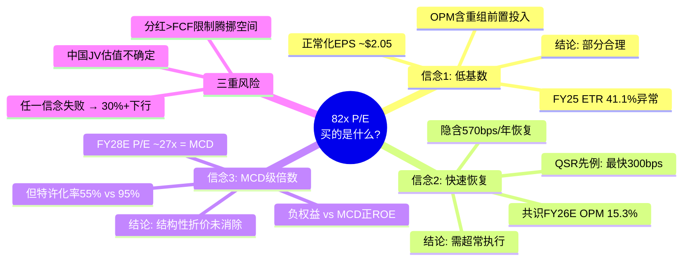
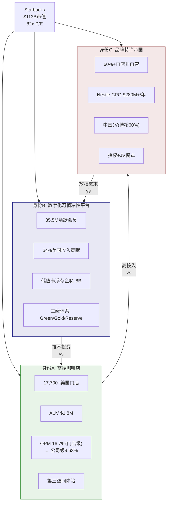
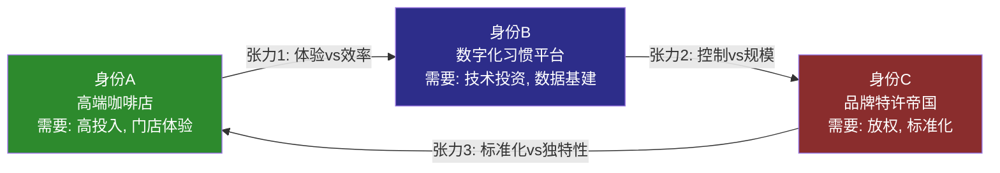

# Part I: 身份与生态

---

# Chapter 01: 执行摘要与投资温度计

## 1.1 一句话论点 (Thesis Statement)

**Starbucks在82x TTM P/E下，市场正在为一个尚未发生的利润复苏支付QSR板块的最高估值倍数——这隐含着Niccol的"Back to Starbucks"计划100%成功、OPM从9.6%恢复至14%+、且EPS在三年内翻倍至$3.63的信念，但分红已超过自由现金流、负权益持续扩大、中国竞争格局结构性恶化这三重现实约束，使得执行容错空间趋近于零。**

初判评级: **审慎关注** (期望回报约-16%至-20%)

---

## 1.2 投资温度计

### 宏观层 (权重30%)

| 指标 | 当前值 | 信号 | 得分 |
|------|--------|------|------|
| S&P 500 Shiller CAPE | ~34x | 历史高位区间(>30x = 偏热) | -1 |
| VIX | 23.75 [DM-MKT-005] | 中等波动(20-25区间) | 0 |
| 10Y Treasury | ~4.2% | 限制估值扩张空间 | -1 |
| Consumer Confidence | 边际走弱 | 消费品承压信号 | -1 |
| **宏观小计** | | **偏冷环境** | **-3 / 8** |

宏观环境对高估值消费品股不友好: CAPE在历史90%分位以上意味着系统性回调风险偏高[DM-MKT-005]，而VIX从年初的18攀升至23.75反映市场对关税政策和消费放缓的担忧正在定价。对SBUX而言，宏观"偏冷"意味着任何业绩不达预期都将被放大惩罚——82x P/E的容错空间本就极窄，宏观逆风使其更窄。

### 公司质量层 (权重50%)

| 维度 | 指标 | 值 | 评分 |
|------|------|-----|------|
| 盈利质量 | OPM | 9.63% (FY2025) [DM-FIN-004] | 2/10 |
| | OPM趋势 | FY2023 16.3% → FY2025 9.6% (-670bps) | 1/10 |
| 现金创造 | FCF/Rev | 6.6% (FY2025) [DM-CF-007] | 3/10 |
| | FCF趋势 | FY2021 15.5% → FY2025 6.6% (-890bps) | 2/10 |
| 资产负债表 | Net Debt | $23.4B [DM-BAL-004] | 2/10 |
| | 权益 | -$8.1B (负权益) [DM-BAL-002] | 1/10 |
| 股东回报 | Div Payout | 149% (>FCF) [DM-VAL-005] | 1/10 |
| | 回购 | 暂停 [DM-CF-005] | 3/10 |
| 增长 | Revenue Growth | +2.8% YoY [DM-FIN-007] | 4/10 |
| | Q1 FY26 Comp | +4% (global), +3% transaction [DM-NEWS-001] | 6/10 |
| **公司质量小计** | | **趋势恶化中的拐点信号** | **25/100 → 2.5/10** |

公司质量层呈现典型的"拐点叙事"特征: 存量指标(OPM、FCF、Net Debt)全面恶化，但流量指标(Q1 comp、transaction growth)出现首个正向信号。问题在于——存量的恶化是三年累积的结构性结果，而流量的改善仅有一个季度的数据点。以单季度拐点信号去对冲三年结构性恶化，在统计上是不充分的。

### 市场情绪层 (权重20%)

| 指标 | 值 | 信号 |
|------|-----|------|
| 共识评级 | Moderate Buy (15B/8H/2S) [DM-AC-001] | 偏多但分歧大 |
| 均价目标 | $100.83 (仅+2.2% upside) [DM-AC-002] | 几乎已到位 |
| 目标价区间 | $59-$120 (102%宽度) [DM-AC-003/004] | 极端分歧 |
| RSI | 58.2 [DM-MKT-004] | 中性偏强 |
| 52W位置 | 51% ($75.50-$110.43) [DM-MKT-002] | 中间位 |
| SMA状态 | 价格>SMA20/50/200 [DM-MKT-003] | 技术面健康 |
| 内部人交易 | Knudstorp买入$994.5K [DM-NEWS-014] | 微弱正信号 |
| **情绪小计** | | **乐观已充分定价** |

25位分析师中有15位给出买入评级，但均价目标$100.83意味着在当前$98.69的价位上[DM-MKT-001]，即便按照卖方最乐观的集体共识，上行空间也仅剩2.2%。更值得注意的是$59-$120的目标价区间——102%的宽度在大盘消费品股中极为罕见，反映出市场对SBUX未来路径的根本性分歧。TD Cowen的$89 [DM-AC-004]和Barclays的$116 [DM-AC-016]之间存在30%的差异，这不是"分析师在吵架"，而是他们在定价完全不同的SBUX未来。

### 综合温度

```
投资温度 = 宏观(-3/8 × 0.3) + 质量(2.5/10 × 0.5) + 情绪(4/10 × 0.2)
         = -0.11 + 0.125 + 0.08
         = 0.10 / 1.0 (极低)

温度解读: ❄️ 偏冷 — 宏观逆风 + 公司基本面恶化 + 乐观预期已在价格中
```

**温度计结论**: SBUX当前处于"价格定价了最好的未来，但基本面仍在最差的现在"的错位状态。这不是说SBUX不能成功转型——而是说在$98.69的价位上，你需要对转型的信念足够强烈，以至于愿意接受几乎零容错的赔率。

---

## 1.3 核心矛盾: 82x P/E买的是什么？

82x TTM P/E [DM-VAL-001]是一个需要被拆解的数字。让我们反向解构市场在为什么付费:

**第一层: FY2025盈利是被扭曲的基数**

FY2025 EPS $1.63 [DM-FIN-002]不是"正常"盈利水平——它被至少三个异常因素压低:
- 税率异常: ETR 41.1% vs 正常~24% [DM-FIN-010]，如果正常化，NI增加约$500M → 正常化EPS ~$2.05
- OPM崩溃: 9.63% vs FY2023的16.32% [DM-FIN-004]，其中包含"Back to Starbucks"重组的前置投入
- D&A口径差异: 利润表$1.685B vs 现金流表$2.606B [DM-FIN-009]，暗示加速折旧或资产减值

因此82x P/E部分是基数效应的放大。如果用正常化EPS $2.05计算，P/E约48x——仍然昂贵，但不是"疯狂"的水平。

**第二层: 市场在购买三年后的盈利**

共识FY2028E EPS $3.63 [DM-EST-004]，对应当前价格的forward P/E约27x——与MCD(27.8x) [DM-PEER-001]基本持平。这意味着市场的隐含逻辑是:

> "SBUX在FY2028将恢复到MCD级别的盈利质量，因此值得MCD级别的估值倍数。"

这个逻辑的关键假设是三年CAGR 30.6% [DM-INF-001]的EPS增长——这在QSR历史上不是没有先例(Domino's 2010-2015, CMG 2018-2023)，但每次都伴随着深层结构性改善而非仅仅"恢复正常"。

**第三层: 但"恢复正常"本身就是一个强假设**

共识隐含FY2026E OPM恢复到~15.3% [DM-INF-002]——这意味着单年改善570bps。我们搜索QSR历史，找不到任何一家公司在**不改变商业模式**的前提下实现过如此幅度的单年OPM恢复。Easterbrook在MCD的转型用了5个季度实现~200bps改善; Niccol自己在CMG用了6个季度实现~300bps。570bps/年是CMG经验的近2倍速度。

**因此，82x P/E隐含的三个嵌套信念是:**
1. FY2025盈利是异常低基数(合理，但非全部因素)
2. Niccol将以CMG 2倍速度恢复margin(激进)
3. 恢复后SBUX值得MCD级别倍数(需要特许化率与MCD可比——但SBUX仅55% vs MCD 95%)

三个信念需要**同时为真**，股价才具备支撑。这就是我们在整份报告中需要逐一验证的核心问题。



---

## 1.4 五个核心问题 (CQ)

基于上述矛盾拆解，本报告将围绕五个核心问题(Critical Questions)展开:

| # | 核心问题 | 对应信念 | 验证章节 | 成败判据 |
|---|---------|---------|---------|---------|
| **CQ-1** | OPM能否恢复到14%+? 速度和路径是什么? | 信念2 | Ch03, Ch11 | FY26 Q3 OPM >12% |
| **CQ-2** | Rewards三层体系是增长引擎还是饱和信号? | 增长引擎 | Ch04 | Q3会员数>38M且comp>+4% |
| **CQ-3** | 中国JV交易对SOTP的净影响是正还是负? | 估值结构 | Ch06, Ch19 | JV估值>$6B且OPM改善 |
| **CQ-4** | Niccol的CMG复刻率有多少可以移植到SBUX? | 信念2+3 | Ch07, Ch05 | 连续3Q美国comp>+3% |
| **CQ-5** | 分红可持续性的临界点在哪里? | 财务约束 | Ch12, Ch13 | FY26 FCF>$3.5B |

**CQ优先级排序**: CQ-1 > CQ-4 > CQ-5 > CQ-2 > CQ-3。理由是OPM恢复是所有盈利预测的基础假设，而Niccol执行力是OPM恢复的前提条件; 分红可持续性是硬约束(不可持续则估值框架需重构); Rewards和中国JV是增量因素而非核心驱动力。

---

## 1.5 关键数字速查表

### 股价与估值

| 指标 | 值 | 信号 | DM |
|------|-----|------|-----|
| 股价 | $98.69 | 52W 51%分位 | DM-MKT-001 |
| 市值 | ~$113B | — | 计算 |
| PE (TTM) | 82.2x | QSR最高(与BROS并列) | DM-VAL-001 |
| PE (FY26E) | 33.4x | 共识隐含EPS $2.95 | DM-VAL-001 |
| EV/EBITDA | 22.5x | vs FY24 18.7x, 恶化 | DM-VAL-003 |
| P/FCF | 40.0x | vs FY24 33.4x, 恶化 | DM-VAL-004 |
| Div Yield | 2.84% | Payout 149%, 不可持续 | DM-VAL-005 |
| FMP DCF Fair Value | $61.00 | 当前溢价38% | DM-VAL-002 |

### 盈利与利润率

| 指标 | FY2023 | FY2024 | FY2025 | Q1 FY26 | DM |
|------|--------|--------|--------|---------|-----|
| Revenue | $35.98B | $36.18B | $37.18B | $9.91B | DM-FIN-001/011 |
| OPM | 16.32% | 14.95% | 9.63% | 9.18% | DM-FIN-004/011 |
| Net Income | — | — | $1.856B | — | DM-FIN-002 |
| EPS | — | $3.31 | $1.63 | $0.26(GAAP) | DM-FIN-002 |
| FCF | $3.675B | $3.318B | $2.442B | — | DM-CF-002 |
| Tax Rate | 23.6% | 24.3% | 41.1% | 61.7% | DM-FIN-010/012 |

### 资产负债表

| 指标 | 值 | 趋势 | DM |
|------|-----|------|-----|
| Total Debt | $26.61B | 含租赁$10.54B | DM-BAL-003 |
| Net Debt | $23.39B | FY21:$17.1B→FY25:$23.4B | DM-BAL-004/010 |
| Total Equity | -$8.1B | 回购驱动负权益 | DM-BAL-002 |
| Cash | $3.47B | — | DM-BAL-005 |
| Deferred Revenue | $7.61B | 含储值卡浮存金 | DM-BAL-007 |

### 共识预期

| 年度 | EPS共识 | 区间 | 分析师数 | DM |
|------|---------|------|---------|-----|
| FY2026E | $2.30 | $2.14-$2.49 | 19 | DM-EST-002 |
| FY2027E | $2.95 | $2.72-$3.25 | 20 | DM-EST-003 |
| FY2028E | $3.63 | $3.30-$4.05 | 8 | DM-EST-004 |
| FY2029E | $4.24 | $3.96-$4.41 | 3 | DM-EST-005 |
| 管理层FY28 | $3.35-$4.00 | — | — | DM-NEWS-005 |

---

## 1.6 即将到来的催化剂

| 日期 | 事件 | 重要性 | 预期影响 |
|------|------|--------|---------|
| 2026-03-10 | Rewards三级体系上线 | 高 | 基础会员Stars earning削减≥25%, 短期负面风险 |
| 2026-04-07 | Energy Refreshers新品线 | 中 | 新品类拓展, 吸引新客群 |
| 2026-04/05 | Q2 FY2026财报 | 极高 | 验证comp连续性, EPS预期$0.41 |
| 2026-H2 | 中国JV交割 | 高 | 释放$13B+估值, 但失去运营控制权 |
| 2026年底 | 1,000店改造完成 | 中 | $150K/店ROI验证 |

[DM-NEWS-009/015/010/011]

---

## 1.7 评级初判框架

**审慎关注** (期望回报-16%至-20%)

推导过程:

| 情景 | 概率 | FY2028E EPS | 终端P/E | 目标价 | 折现值(10%) |
|------|------|-------------|---------|--------|------------|
| 牛市(OPM恢复+增长) | 25% | $4.00 | 28x | $112 | $84 |
| 基准(部分恢复) | 45% | $3.20 | 24x | $76.8 | $58 |
| 熊市(OPM停滞) | 20% | $2.50 | 20x | $50.0 | $38 |
| 危机(分红削减+衰退) | 10% | $1.80 | 16x | $28.8 | $22 |

**概率加权期望值** = $84×0.25 + $58×0.45 + $38×0.20 + $22×0.10
= $21.0 + $26.1 + $7.6 + $2.2 = **$56.9** (3年折现)

**简化年化期望值** (不折现): $112×0.25 + $76.8×0.45 + $50×0.20 + $28.8×0.10
= $28 + $34.6 + $10 + $2.9 = **$75.4**

**隐含期望回报**: ($75.4 - $98.69) / $98.69 = **-23.6%** (含3年分红~8.5%后净回报约-16%)

> 注: 此为Phase 1初判，基于有限假设。完整DCF模型(Ch18)和BME路径分析(Ch19)将提供更精确的估值区间。但初判的方向性结论是明确的——在当前价位上，风险回报比显著偏向下行。

---

# Chapter 02: 三重身份框架

## 2.1 为什么需要"身份框架"?

投资者在分析SBUX时最容易犯的错误，是把它当成"一家咖啡连锁店"来估值。如果SBUX只是一家咖啡连锁店，那么82x P/E就是荒谬的——MCD是全球最成功的QSR，也只有27.8x [DM-PEER-001]。

真相是SBUX同时运营着**三种截然不同的商业模式**，每种模式有不同的增长动力、利润率结构和合理估值倍数。混为一谈会导致估值要么过高要么过低——取决于你不自觉地在用哪种身份的透镜。

三重身份不是修辞手法，而是估值工具: 当我们在Ch18构建SOTP估值时，必须对每种身份分别定价，然后处理它们之间的**张力**——因为三种身份的战略需求经常是互斥的。



---

## 2.2 身份A: 高端咖啡店——"第三空间"的守护者

### 2.2.1 单元经济学快照

SBUX的美国自营门店是整个商业帝国的根基。没有门店的高频客流，就没有Rewards会员的获取渠道; 没有门店体验的品牌溢价，就没有CPG授权和国际特许的议价基础。

| 指标 | SBUX(美国) | SBUX(中国) | 瑞幸 | Dutch Bros | MCD |
|------|:----------:|:----------:|:----:|:---------:|:---:|
| AUV(年/店) | $1.8M | $394K | $245K | $2.1M | $3.97M |
| 坪效($/sqft) | $750-1,200 | ~$300 | $455-1,140 | $2,211 | $993 |
| 门店级OPM | 16.7% | ~15-18% | 17.8% | 28.9% | 45.7% |
| 建店成本 | ~$700K | ~$700K | ~$50K | $1.3M | $1.3-2.3M |
| 回本周期 | ~1.3年 | ~1.4年 | ~0.5年 | ~1.5年 | ~2年 |

[来源: lit_recon_memo D3]

**三个关键观察:**

**第一**: AUV $1.8M在美国QSR中属于中等偏下水平——MCD的$3.97M是SBUX的2.2倍，Dutch Bros的$2.1M也高出17%。这意味着SBUX的单店创收能力并不是竞争优势; 它的优势来自17,700+家门店的**规模密度**和品牌溢价支撑的**定价权**(美式均价$5.75 vs 瑞幸等价$1.50-2.00)。

**第二**: 门店级OPM 16.7%与公司级OPM 9.63% [DM-FIN-004]之间存在710bps的差距。这个差距反映了公司层面的费用结构: SGA、总部运营、技术投入、以及新任CEO的转型投资。理解这个差距至关重要——当Niccol说"恢复OPM到14%"时，他需要缩小的不是门店运营效率(这已经相对稳定)，而是公司层面的费用占比。

**第三**: 建店成本$700K vs 瑞幸$50K暴露了完全不同的商业逻辑。瑞幸用1/14的成本开一家店、0.5年回本，然后用密度覆盖+外卖补贴获取市场份额。SBUX用14倍成本打造"体验空间"，赌的是客户愿意为"第三空间"支付3-4倍的价格溢价。在美国，这个赌注已被30年验证; 在中国，它正在被挑战(中国AUV $394K仅为美国的22%)。

### 2.2.2 "Back to Starbucks"对身份A的意义

Niccol的"Back to Starbucks"战略，本质上是对身份A的一次**战略回归**。过去5年(尤其是Schultz最后一任和Narasimhan时期)，SBUX逐渐偏离了"第三空间"的核心定位:

- **菜单膨胀**: 从核心咖啡品类扩展到375+SKU, 定制化选项使出餐时间从3分钟延长到超过5分钟
- **体验降级**: 移动订单占比从20%攀升至50%+, 门店变成了"取货站"而非社交空间
- **座位减少**: 部分门店移除座椅以容纳更多外带柜台, 直接背离了"第三空间"理念

Niccol的回应策略包含四个具体举措[DM-NEWS-011/012/013]:

| 举措 | 投资 | 目标 | 验证时点 |
|------|------|------|---------|
| Coffeehouse Uplift | $150K/店 × 1,000店 = $150M | 恢复第三空间体验 | 2026年底 |
| 4分钟出餐承诺 | 流程再造+自动化 | 峰值吞吐优化 | 持续监控 |
| 25,000+新座位 | 含在改造预算中 | 鼓励堂食 | 2026-2028 |
| 菜单简化 | 运营成本节约 | 减少SKU, 提高速度 | FY2026 H2 |

这里有一个隐含的矛盾需要在Ch07(Niccol效应)中深入讨论: 4分钟出餐承诺需要更高的运营效率(更少定制、更多标准化), 但恢复第三空间体验需要放慢节奏、鼓励客户停留。Niccol在CMG解决这个矛盾的方式是"数字化分流"——线上订单走高效率通道, 线下体验走慢节奏通道。SBUX能否复制这个模式, 是CQ-4的核心子问题。

### 2.2.3 门店OPM的结构性问题

身份A的健康度最终体现在OPM上。公司整体OPM从FY2023 16.32%下滑至FY2025 9.63% [DM-FIN-004]，Q1 FY2026进一步降至9.18% [DM-FIN-011]。OPM的恢复路径和上限是本报告最重要的分析对象，将在Ch11(DuPont ROIC分解)中展开完整的成本结构拆解。此处仅做一个方向性标记: 非共识假说NCH-01("OPM永远不会回到14%")是我们需要用硬数据证伪或确认的关键假说。

---

## 2.3 身份B: 数字化习惯粘性平台——"星巴克即习惯"

### 2.3.1 会员经济的规模与渗透

Starbucks Rewards拥有35.5M活跃美国会员[DM-NEWS-009]，是美国餐饮行业最大的忠诚度计划之一。更重要的是这些会员贡献了约**64%的美国门店收入**——这意味着SBUX在美国的生意，接近三分之二是由有明确数字化行为轨迹的客户驱动的。

**三个关键数据点定义了身份B的现状:**

**规模**: 35.5M活跃会员 / ~210M美国成年人 = ~17%的成年人口渗透率。如果缩窄到"每周至少喝一次外购咖啡的成年人"(约60M人)，渗透率跃升至~59%。

**粘性**: 64%的收入贡献意味着平均每位Rewards会员的年消费约$650(=$37.18B [DM-FIN-001] × 0.64美国占比 × 0.64会员贡献 / 35.5M)，而非会员平均约$180。会员的消费强度是非会员的3.6倍——但要注意因果关系: 不是"成为会员使人消费更多"，而是"高频消费者更可能注册会员"。这个因果方向对预测增量价值至关重要(详见Ch04)。

**趋势**: Q1 FY2026会员增长约+3% [来源: analyst_consensus]，远低于历史+8-10%的增速。这与NCH-02("Rewards已达饱和拐点")的假说一致——如果可触达的高频咖啡消费者中已有59%被覆盖，剩余的增量空间天然有限。

### 2.3.2 三级会员体系: 升级还是贬值?

2026年3月10日，Starbucks推出了全新的Green/Gold/Reserve三级会员体系[DM-NEWS-009/018]:

| 层级 | 门槛 | Stars赚取 | 核心权益 | 目标客群 |
|------|------|-----------|---------|---------|
| **Green** | 默认 | 1 Star/$1 | 60-Star兑换($2折扣) | 低频消费者 |
| **Gold** | 500 Stars/年 | 1.2x赚取速率 | Stars永不过期 + 额外优惠 | 中频消费者(~2次/周) |
| **Reserve** | 2,500 Stars/年 | 1.7x赚取速率 | 独家活动+最高优先级 | 高频消费者(~5次/周) |

**值得注意的信号**: 客户反馈偏负面，认为基础会员的Stars earning被削减了至少25% [DM-NEWS-018]。这不是"升级"——对大多数用户而言，这是一次**忠诚度贬值**。Gold和Reserve层级的增强权益主要惠及高频消费者(已有的核心客群)，而Green层级的权益缩减直接影响了更大基数的低中频用户。

**这个设计的战略逻辑是什么?**

SBUX正在从"广撒网、低门槛获客"转向"高价值客户深度绑定"。这与航空公司里程计划的演化路径一致——从"里程=货币"逐步转向"精英会员=差异化体验"。在航空公司的经验中，这种转型短期内会导致低频客户流失(负面NPS)，但长期会提高高价值客户的留存率和钱包份额。

但航空公司有一个SBUX没有的结构性优势: **高转换成本**。一个Delta白金会员很难带着他积累的里程和权益跳槽到United。而一个SBUX Gold会员可以在Dunkin'或Dutch Bros获得几乎完全等价的咖啡体验——转换成本接近于零。这意味着SBUX的三级体系需要用**差异化体验**(Reserve独家活动、门店优先服务)来创造航空公司用沉没成本创造的粘性。这是对身份A("第三空间")投资回报的另一个依赖——如果门店体验没有显著提升，三级体系就没有足够的差异化武器。

### 2.3.3 储值卡浮存金: 被忽视的隐藏资产

SBUX资产负债表上有$7.613B递延收入[DM-BAL-007]，其中约$1.8B来自储值卡和移动端预付余额。这些是客户已经支付但尚未消费的现金——本质上是**零成本短期融资**。

用**银行框架**来理解这个资产的价值(注意: 这里不是说SBUX是金融公司，而是用银行的存款定价方法来估算浮存金的经济价值):

| 参数 | 值 | 假设 |
|------|-----|------|
| 浮存金余额 | $1.8B | 储值卡+移动预付 |
| 替代融资成本 | 4.5% | SBUX 10年期债券收益率 |
| 年化价值 | $81M | = $1.8B × 4.5% |
| 破损率(Breakage) | ~8-10% | 从不被消费的余额 |
| 破损价值 | ~$160M/年 | = $1.8B × 新增比例 × 破损率 |
| **年化总价值** | **~$240M** | 融资节约 + 破损收入 |

$240M/年的经济价值，按10%折现率资本化，意味着浮存金资产的内在价值约$2.4B——相当于SBUX市值的~2.1%。这不是一个能改变投资结论的数字，但它是一个在传统分析中经常被忽略的"缓冲垫"——尤其在分红可持续性讨论(CQ-5)中，$240M/年的隐含价值为FCF短缺提供了部分对冲。

**v4.0修正说明**: v3.0中将SBUX储值卡与PayPal/Square类比是不当的。SBUX不是支付平台——它不从第三方交易中抽佣、不提供转账功能、不拥有支付网络效应。储值卡更接近于**预付消费卡**——类似于健身房年卡预付或航空公司常旅客里程的预购。用银行浮存金框架定价(零成本资金+破损收入)比用金融科技框架(网络效应+take rate)更准确。

### 2.3.4 数字化习惯的经济学逻辑

身份B的核心价值不在于它是一个"平台"(它不是)，而在于它创造了一种**消费习惯的数字化锁定**。35.5M会员中的核心群体(估计10-15M)已经将"打开SBUX App → 预点单 → 取餐"内化为日常例行程序。这种习惯的经济学价值体现在三个维度:

**频率提升**: 有研究表明(SBUX内部数据未公开), Rewards会员的月均访问频次约12-14次, 非会员约3-4次。但如前所述，因果方向模糊——究竟是App提高了频率，还是高频客户更可能下载App?

**预测价值**: 数字化订单提供了精确的需求预测数据——SBUX知道周一早上8点某家门店会有多少个Iced Shaken Espresso订单。这对供应链优化和人力排班有直接的成本节约效应。

**定向营销**: 个性化推送(如: "你上周的Caramel Macchiato今天下午3-5点加30% bonus Stars")的转化率显著高于非定向促销。这是SBUX在不降低标价的情况下进行变相价格歧视的工具——对价格敏感型客户提供定向优惠，对价格不敏感型客户维持全价。

这三个维度加总，构成了身份B的护城河——不是"网络效应"类型的护城河(SBUX没有用户-用户交互)，而是**习惯依赖**类型的护城河。这种护城河的弱点是: 它在存量客户中很强，但在增量客户获取中越来越弱(因为竞争对手都在复制同样的App+Rewards模式)。

---

## 2.4 身份C: 品牌特许帝国——"轻资产化的诱惑"

### 2.4.1 特许化现状

SBUX在全球拥有约40,576家门店(FY2025末), 其中:

| 类型 | 数量(约) | 占比 | OPM特征 | 资本需求 |
|------|---------|------|---------|---------|
| 自营(Company-Operated) | ~18,000 | ~44% | 16.7%(门店级) | 高 |
| 授权(Licensed) | ~18,000 | ~44% | 纯费率收入(~6-8%) | 极低 |
| JV/合资 | ~4,500 | ~11% | 混合(利润分成) | 中等 |

**60%+门店非自营**——这个数字经常被忽略。SBUX不是一家"全自营的咖啡连锁店"(那是它的品牌叙事)，它已经是一个混合模式运营商，与MCD(95%特许)的区别在程度而非本质。

**授权模式的经济学**: 授权门店由第三方运营, SBUX收取品牌授权费(估计占门店收入6-8%) + 产品供应利润。这是近乎纯利润——没有租赁成本、劳动成本、或门店运营风险。授权收入在合并报表中作为"Licensed Stores Revenue"列报，FY2025约$4.3B(占总收入~12%)。

### 2.4.2 Nestle CPG: $280M+的品牌变现

2018年, SBUX将其零售渠道(超市、便利店)的咖啡销售权以**$7.15B**的对价授权给Nestle——不是出售品牌, 而是长期独家授权(至2033年到期)。Nestle每年支付约$280M+的权利金, 这笔收入几乎没有对应的运营成本。

| 指标 | 值 | 影响 |
|------|-----|------|
| 年化权利金 | ~$280M+ | 几乎100% margin |
| 协议期限 | 至2033年 | 7年后续约风险 |
| 最初对价 | $7.15B | 已收到, 不计入持续P&L |
| SBUX保留 | 品牌控制+配方所有权 | Nestle仅有分销权 |

**两个值得关注的问题:**

**续约风险**: 2033年的到期日距今仅7年。如果SBUX届时选择不续约(自建零售渠道)或Nestle要求重新谈判条款, $280M+/年的无成本收入可能受到影响。这是一个低概率但高影响的尾部风险——在估值中通常被忽略, 但在SOTP中应该对CPG收入流施加一定的期限折价。

**品牌一致性**: Nestle在超市渠道销售的SBUX产品质量和定位, 直接影响品牌形象。如果Nestle为了追求销量而过度打折(常见于CPG渠道), 可能稀释SBUX的高端定位。这是身份C与身份A之间张力的具体表现。

### 2.4.3 中国JV: 博裕资本60%的战略意义

2026年1月29日, SBUX宣布与博裕资本(Boyu Capital)组建合资企业运营中国零售业务, 博裕获得最高60%股权, SBUX保留40% + 品牌和知识产权所有权[DM-NEWS-010]。中国零售业务总价值预计超$13B, 现有~8,000家门店目标扩张至20,000家。

**这笔交易的多重解读:**

从**资产负债表**角度: 出售60%中国业务获得的现金(估计$4-5B)将显著改善SBUX的净债务状况。如果用于偿债, Net Debt可从$23.4B [DM-BAL-004]降至~$18-19B, 利息覆盖率从6.6x [DM-FIN-008]改善至~9x。这是缓解CQ-5(分红可持续性)的关键杠杆。

从**损益表**角度: 失去中国自营门店的收入(FY2025约$3.1B, ~8%的合并收入)将在交割后导致收入基数下降, 但利润率会因剥离低利润率业务而提升。更重要的是, JV模式下SBUX按40%股权确认投资收益, 不再承担中国的运营亏损和资产折旧——这对OPM的恢复是一个一次性的结构性利好。

从**竞争战略**角度: 中国市场的核心矛盾是——SBUX在与瑞幸(31,048家店、均价$1.50-2.00)和库迪(~10,000家店、9.9元)的价格战中, 无法在维持品牌定位的同时保持门店经济学可行性[lit_recon D3]。JV模式将运营风险和资本需求转嫁给博裕, 同时保留品牌溢价收取的能力。这是一个"承认现实"的战略——与其在一个不利的战场上消耗资源, 不如退到品牌授权的位置上赚取无风险费率。

从**估值结构**角度: JV交易为中国业务提供了一个**市场化定价锚点**($13B+总估值)。此前, 分析师对SBUX中国的估值分歧极大(从$3B到$8B); 现在有了一个交易价格作为参考。NCH-03("中国JV估值已触底, 反转在即")的逻辑基础就在于此——如果瑞幸放缓扩张+中国人均咖啡消费量的长期增长(22杯→100+杯), JV的40%权益可能比当前定价更有价值。

### 2.4.4 特许化率的"估值跳板效应"

QSR行业的一个经验规律是: **特许化率越高, 估值倍数越高**。原因在于特许收入具有更高的利润率、更低的波动性和更强的现金流可预测性。

| 公司 | 特许化率 | P/E | EV/EBITDA | 门店级OPM |
|------|---------|-----|-----------|----------|
| MCD | ~95% | 27.8x | ~19x | 45.7% |
| YUM | ~99% | 28.6x | ~22x | — |
| SBUX | ~56% | 82.2x (TTM) | 22.5x | 16.7% |
| CMG | ~0% | 32.2x | ~22x | ~28% |

[DM-PEER-001, DM-VAL-003]

SBUX的56%特许化率处于一个尴尬的中间地带: 不够高到享受MCD/YUM的"纯特许估值溢价", 也不够低到像CMG那样完全靠门店运营效率赢得高倍数。

如果SBUX将特许化率从56%提高到75%(即美国自营门店保持不变, 但未来所有国际增长都走授权/JV模式), 其利润率结构将发生显著改善——估算OPM可从9.6%提升到12-13%(仅靠mix shift, 不需要门店效率改善)。但这就是thesis crystallization中识别的**信念互斥悖论(BME)**: 特许化提高利润率和估值倍数, 但降低收入基数和EPS绝对值——市场不能同时要求EPS恢复到$3.63并且要求特许化率提高到75%。

这个悖论将在Ch19(BME三路径联合概率)中进行量化建模。此处的结论是: **身份C是一个有价值的期权, 但在当前估值中, 市场似乎没有为这个期权付费——因为它与市场定价的EPS恢复路径相矛盾。**

---

## 2.5 三重身份的张力矩阵

三种身份不是并行存在的——它们之间存在系统性的战略张力。每一种身份的强化, 都在某种程度上削弱另一种身份。



### 张力1: 身份A vs 身份B (体验 vs 效率)

身份A追求的是**慢节奏的体验**——客户在舒适的空间中停留, 享受咖啡和社交。身份B追求的是**高效率的习惯**——客户通过App预点单, 30秒取餐离开。这两个目标在物理空间中直接冲突:

- 门店面积有限: 增加堂食座位(身份A)就要减少外带取餐台(身份B)
- 员工注意力有限: 服务堂食客户的时间(身份A)挤占处理移动订单的产能(身份B)
- 峰值时段尤为矛盾: 早高峰时段移动订单激增, 与堂食客户的社交体验形成直接冲突

Niccol的"4分钟出餐承诺"[DM-NEWS-013]试图同时满足两个身份的需求——但物理约束是真实的。这个矛盾的量化分析将在Ch03(门店经济学)中通过吞吐工程模型展开。

### 张力2: 身份B vs 身份C (控制 vs 规模)

身份B的核心资产是35.5M会员的数据和行为轨迹。Rewards系统的有效运营需要SBUX对会员体验有**端到端的控制**——从App界面到门店执行到产品一致性。但身份C的扩张需要**放权给第三方**——授权商和JV合作伙伴有自己的运营标准、技术系统和客户优先级。

具体矛盾:
- 授权门店的Rewards执行一致性通常低于自营门店(客户投诉数据)
- 中国JV后, SBUX能否继续获取中国会员的完整数据? 博裕60%的控制权是否意味着数据主权的部分转移?
- Nestle CPG渠道的消费者与门店Rewards系统完全脱节——超市购买SBUX咖啡豆的客户不在35.5M会员中

### 张力3: 身份C vs 身份A (标准化 vs 独特性)

特许化成功的前提是**高度标准化**——MCD在全球任何一家店的Big Mac味道一样。但SBUX的品牌溢价来自于**独特的门店体验**——不同城市的"第三空间"有不同的设计语言, 当地的Reserve体验有地域特色。

特许化率的提高不可避免地推动标准化——授权商没有动力(也没有能力)为每家门店投入差异化设计。这意味着特许化率从56%→75%的过程中, SBUX品牌的"独特性溢价"可能被逐步稀释。当品牌变得"无处不在但千篇一律"时, 它就从"高端咖啡体验"下滑为"便利咖啡供应商"——这是身份A的根基被侵蚀。

### 张力矩阵总结

| 张力 | 核心冲突 | 影响维度 | 缓解策略 | 缓解效果 |
|------|---------|---------|---------|---------|
| A vs B | 体验 vs 效率 | 门店空间+人力分配 | 双通道分流(堂食+外带) | 部分(增加建店成本$100K+) |
| B vs C | 控制 vs 规模 | 数据+体验一致性 | 技术标准强制+API集成 | 有限(授权商执行力参差) |
| C vs A | 标准化 vs 独特性 | 品牌溢价 | 分级体系(标准店+Reserve) | 仅在Reserve有效(占比<5%) |

**结论**: 三重身份的张力不是可以"解决"的——它是SBUX商业模式的内在属性。管理层在任何时刻都在做**身份优先级的选择**: Schultz优先身份A(门店体验), Narasimhan尝试优先身份C(国际扩张), Niccol目前宣称要"回归身份A但不放弃身份B和C"。这种"三者兼顾"的叙事在投资者日听起来很好, 但物理约束和财务约束意味着必须有取舍。

---

## 2.6 三重身份的估值含义

不同的身份框架, 对应着不同的"合理估值倍数":

| 身份 | 最佳可比 | 可比P/E | 对应SBUX EPS | 隐含市值 |
|------|---------|---------|-------------|---------|
| **纯身份A** | CMG (全自营) | 32x | FY25 $1.63 | $52B |
| **纯身份B** | — | N/A (无纯可比) | — | — |
| **纯身份C** | MCD (全特许) | 28x | 正常化$2.05 | $57B |
| **当前混合** | 市场给予 | 82x (TTM) / 33x (FW) | FY25 $1.63 / FY26E $2.95 | $113B |

市场当前$113B的估值, 隐含的逻辑是: "按FY2026E EPS $2.95给33x P/E, 这是合理的, 因为EPS还会继续增长到$3.63"。但33x P/E对于一个56%特许化率、9.6% OPM、负权益的公司而言, 已经高于纯特许模式MCD的28x——这意味着**市场在为SBUX尚未实现的身份转型(从A→C的mix shift, 或A的效率提升)提前付费**。

这是整份报告需要回答的元问题: **这个"预付费"是否合理?** Ch16(逆向DCF)将精确计算市场隐含的假设, Ch18(Forward DCF)将给出我们自己的估值, Ch19(BME三路径)将量化不同身份演化路径的概率加权价值。

---

## 2.7 本章小结

| 维度 | 身份A | 身份B | 身份C |
|------|-------|-------|-------|
| **定义** | 高端咖啡店 | 数字化习惯粘性平台 | 品牌特许帝国 |
| **核心资产** | 17,700+美国门店 | 35.5M会员 | 品牌+IP+渠道 |
| **收入占比** | ~55%(自营) | (叠加在A上) | ~45%(授权+JV+CPG) |
| **OPM特征** | 门店16.7%, 公司9.6% | 边际贡献高 | 几乎纯利 |
| **增长引擎** | comp sales + AUV | 会员渗透 + 频次 | 门店数量 + 地域 |
| **主要风险** | 劳动成本 + 竞争 | 饱和 + 转换成本低 | 品牌稀释 + 续约 |
| **战略方向** | Back to Starbucks | 三级体系深化 | 中国JV + 国际授权 |

三重身份框架揭示了SBUX的本质复杂性: 它不是一家"简单的咖啡公司"，而是一个在三种不同商业逻辑之间寻求平衡的复杂有机体。82x P/E的合理性, 最终取决于这三种身份能否协同而非互相消耗——这是后续所有章节分析的出发点。

---

> **下一章**: Ch03 门店经济学 — 深入拆解身份A的单元经济学和吞吐工程
