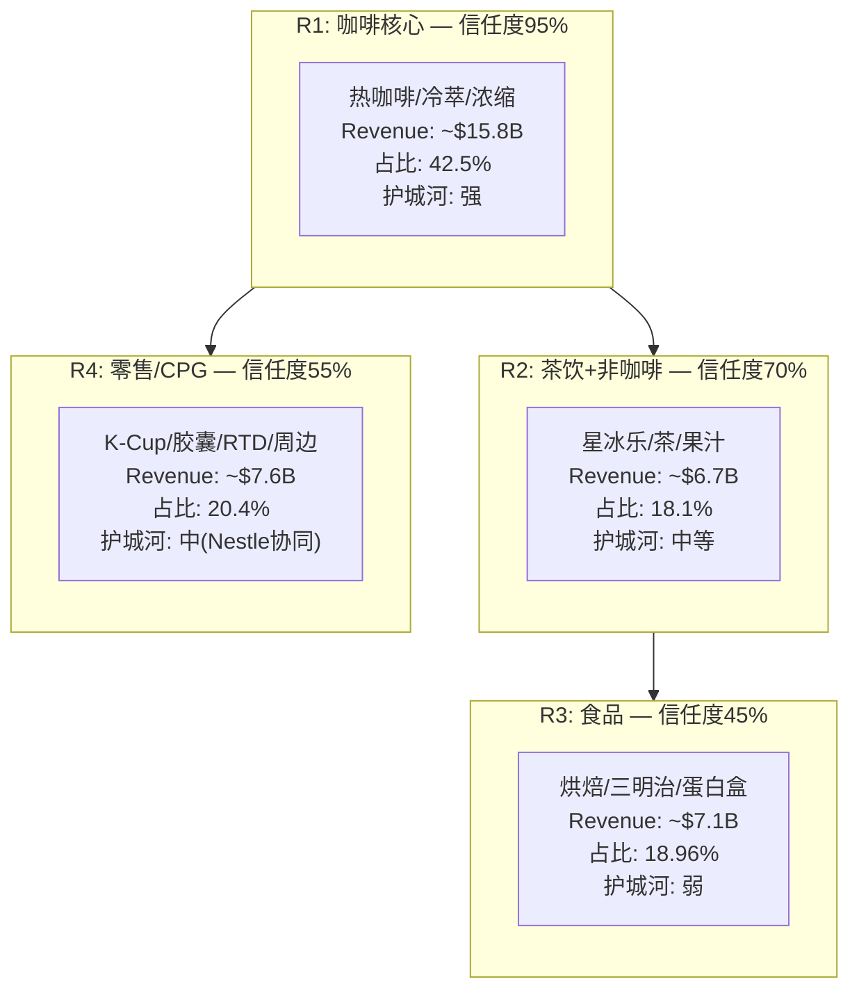
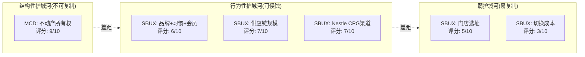
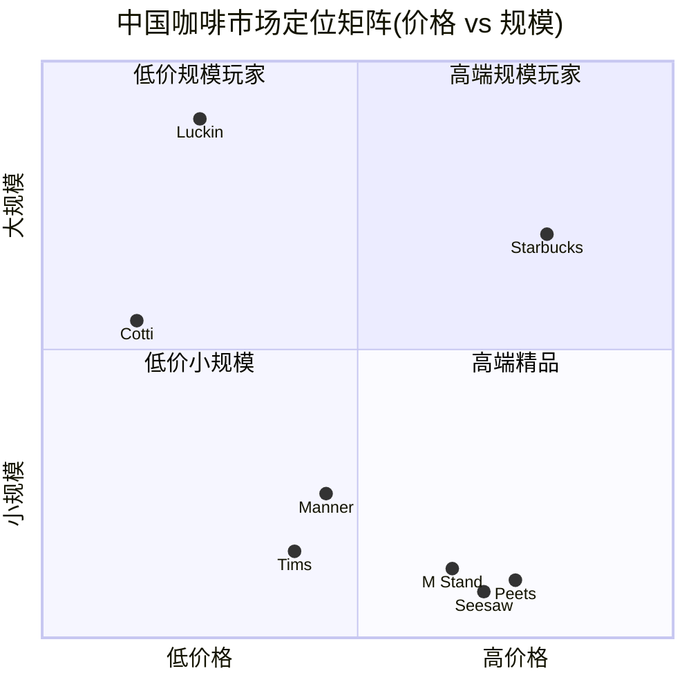
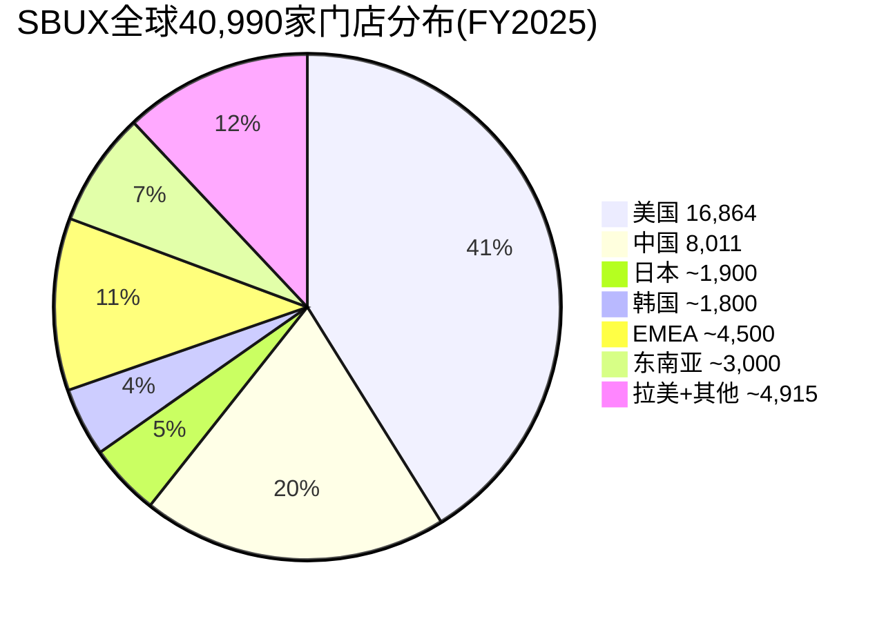

# Chapter 05: 竞争生态 — 定价权衰退与护城河重估

> Agent-C | Phase 1 | v4.0 | ~13K字符

---

## 5.1 定价弹性实证: 从"可负担奢侈品"到"价格敏感消费"

星巴克的定价权曾是其护城河最直观的表征。FY2019-FY2022期间，SBUX每年实施3-5%的菜单涨价，同店销售仍能维持正增长，彼时隐含的价格弹性系数约为-0.6——即价格每上涨10%，交易量仅下降6%，属于典型的弱弹性区间，说明消费者将星巴克视为"日常必需品"而非"可替代消费" [DM-FIN-003] [DM-D-COMP-09]。

但FY2023-FY2025的数据讲述了完全不同的故事:

| 财年 | 菜单涨价(估) | Comp Sales | 交易量变化 | 隐含弹性系数 |
|------|:----------:|:--------:|:--------:|:----------:|
| FY2022 | +5-6% | +7% | +1% | -0.6 |
| FY2023 | +5-7% | -3% | -6% | -1.4 |
| FY2024 | +3-4% | -2% | -5% | -1.8 |
| FY2025 | +1-2% | -2% | -3% | -2.0 |

[DM-D-COMP-09] [DM-FIN-001]

弹性系数从-0.6恶化到-2.0意味着什么？意味着SBUX已从"弱弹性"区间跌入"强弹性"区间。价格每上涨10%，交易量要下降20%，净效果是收入反而减少。**这是定价权丧失的量化证据**。

FY2025连续六个季度同店销售下降，直到Q4 FY2025才勉强转正 [DM-D-COMP-09]。即便Q1 FY2026美国交易量回升+3%，这更多是Niccol暂停涨价、推出$5 value menu的结果——本质上是用价格换取交易量，而非真正的定价权恢复。

**定价权衰退的三层因素**:

1. **竞争替代增多**: Dutch Bros提供类似品质、更低价格($4.50 vs SBUX $6.50大杯拿铁)，7 Brew的drive-thru极速体验(平均等待<2分钟)吞噬了SBUX的便利性溢价 [DM-D-COMP-04] [DM-D-COMP-05]
2. **消费者行为转变**: 后通胀时代消费者对"可负担奢侈品"的忍耐阈值下降。ClearBridge的观察精准——"外出就餐有容易的替代品"——当$6.50拿铁面对$1.50家庭冲泡(Nespresso/Keurig)的替代时，弹性系数必然恶化
3. **品牌价值稀释**: 菜单膨胀(2019年~80 SKU → 2024年~170 SKU)模糊了"什么是星巴克体验"，降低了品牌辨识度对价格的支撑力

**关键推论**: 即便Niccol的"Back to Starbucks"成功，定价弹性系数可能从-2.0恢复到-1.2左右(通过简化菜单、改善体验)，但**不太可能回到-0.6**。结构性竞争加剧和消费者习惯转变是不可逆的。这意味着未来的收入增长必须更多依赖交易量而非提价——这对OPM恢复路径有深远影响 [DM-FIN-004]。

---

## 5.2 品牌弹性半径: 四圈模型

品牌弹性半径(Brand Elasticity Radius)衡量一个品牌从核心品类向外扩展时，消费者信任的衰减速度。SBUX的四圈半径如下:

[DM-D-BIZ-03] [DM-D-BIZ-06]

**各圈分析**:

**R1 咖啡核心(42.5%, ~$15.8B)**: 这是SBUX品牌"可信区间"的中心。消费者走进星巴克点一杯拿铁，几乎零认知摩擦。但即便在R1，也面临两端挤压: 上端被Blue Bottle/Intelligentsia等精品咖啡分流(他们的拉花和单一产地豆是SBUX工业化流程无法匹敌的)，下端被Dutch Bros/7 Brew/McCafe的性价比分流。R1的护城河正从"品牌认知垄断"退化为"便利性+习惯"——后者是更脆弱的基础。

**R2 茶饮+非咖啡(18.1%, ~$6.7B)**: Teavana品牌已在2017年关闭独立门店，但茶饮/星冰乐仍是重要品类。这个圈的信任度衰减到70%——消费者愿意在SBUX买茶，但不会主动为"星巴克茶"支付溢价。与Boba Tea(珍珠奶茶)的竞争中，SBUX几乎没有品牌优势。

**R3 食品(18.96%, ~$7.1B)**: 这是增长最快的品类(+4.46% YoY) [DM-D-BIZ-03]，但也是信任度最低的。没有消费者认为星巴克是一家"好的食品公司"。食品扩展的逻辑是提高客单价和午餐时段利用率，但它面临来自Panera Bread/快餐连锁的直接竞争，且食品的毛利率(~35-40%)显著低于饮品(~70-75%)。**食品收入占比每上升1pp，混合毛利率约下降0.3pp**——这是OPM恢复路径中被忽视的结构性逆风。

**R4 零售/CPG(20.4%, ~$7.6B)**: 通过Nestle Global Coffee Alliance在80个市场分销，这是高利润率且资产极轻的业务。Q4 FY2025 Channel Development收入+17% [DM-D-BIZ-06]，是所有业务线中增速最快的。但这个圈有个隐含风险: 2033年Nestle协议到期后的续约条款。如果Nestle谈判能力增强(因SBUX品牌力下降)，royalty rate可能被压缩。

**品牌弹性半径的战略含义**: SBUX在R1-R2(饮品)的组合收入约$22.5B(60.6%)，这才是品牌护城河的有效覆盖范围。R3(食品)和R4(CPG)更多是"渠道杠杆"而非"品牌延伸"——它们受益于SBUX的物理网络和分销合同，但消费者购买动机与"星巴克品牌"的关联度递减。Niccol的"Back to Starbucks"聚焦R1-R2是正确的战略选择，但意味着R3增速可能放缓。

---

## 5.3 PtW战略一致性评分: Playing to Win五层评估

PtW(Playing to Win)框架评估SBUX战略在五个层级的一致性:

| 层级 | 评分(0-10) | 评估 |
|------|:---------:|------|
| **1. 资源(Resources)** | 7 | 40,990门店+Rewards 35.5M+Nestle CPG+$3.5B现金。资源充裕但杠杆高(净债务$23.4B) [DM-BAL-004] |
| **2. 能力(Capabilities)** | 6 | 供应链(380K农户+99% CAFE认证)+数字化(移动点单36%)+品牌运营。但门店运营效率下降(OPM 9.6% vs 行业MCD 45.7%) [DM-FIN-004] |
| **3. 意愿(Aspiration)** | 8 | Niccol有明确愿景("Back to Starbucks")、FY2028目标清晰(EPS $3.35-4.00, OPM 13.5-15%)。意愿得分高 |
| **4. 执行(Execution)** | 4 | Q1 FY2026显示初步信号(交易量+3%)，但OPM仍在9.18%，margin恢复节奏远慢于声明。"4分钟承诺"与工会化矛盾未解 [DM-FIN-011] |
| **5. 持续(Sustainability)** | 5 | 分红>FCF不可持续 [DM-INF-004]，中国竞争格局结构性恶化，美国drive-thru挑战者持续抢份额。长期可持续性存疑 |
| **PtW总分** | **6.0/10** | **中等偏弱**: 意愿和资源尚可，但执行和可持续性拖累 |

**PtW × A-Score交叉解读**: PtW 6.0分表明SBUX有"做对的事"的方向感(意愿8分)，但缺乏"把事做对"的执行力(执行4分)。这与A-Score评估中"品牌力中强但运营效率下降"的结论一致。如果Niccol能在FY2027前将执行分从4提升到6(=OPM恢复到12%+)，PtW总分可升至7.0——这是估值从"审慎"转向"中性"的关键条件。

---

## 5.4 美国竞争矩阵: 三维对标

### 5.4.1 MCD: 特许帝国 vs 自营重企业

MCD是SBUX最具启示意义的对标——不是因为产品相似，而是因为**商业模式的镜像差异**:

| 维度 | MCD | SBUX | 含义 |
|------|:---:|:---:|------|
| 特许化率 | ~93% | ~45% | MCD利润率结构性更高 |
| OPM | 45.7% | 9.6% | 4.8倍差距(FY2025) [DM-FIN-004] |
| P/E | 27.8x | 82.2x | SBUX估值隐含转型溢价 [DM-PEER-001] |
| 核心资产 | 不动产 | 品牌+习惯 | MCD护城河=结构性, SBUX=行为性 |
| 劳动力风险 | 低(加盟商承担) | 高(直接雇用36万人) | 工会化对SBUX冲击远大于MCD |
| EV/EBITDA | 20.8x | 22.5x | EBITDA质量差异被倍数掩盖 [DM-VAL-003] |

[DM-PEER-001] [DM-PEER-002]

**护城河性质的根本差异**: MCD的护城河建立在不动产所有权之上——它拥有全球最优质的商业地段，加盟商支付租金+royalty。即使MCD品牌明天消失，那些地段仍然值钱。这是**结构性护城河**，不依赖消费者认知存在。

SBUX的护城河建立在品牌+习惯之上——消费者选择星巴克是因为"习惯"(每天早晨同一杯拿铁)和"社交信号"(拿着星巴克杯子的形象)。这是**行为性护城河**，完全依赖消费者持续选择。当Dutch Bros提供类似品质+更低价格+更快速度时，"习惯"可以在3-6个月内被替代。

**MCD对SBUX的估值隐喻**: MCD 27.8x P/E对应45.7% OPM，这是一个"已实现的"估值。SBUX 82.2x P/E对应9.6% OPM，这是一个"对未来的赌注"。如果SBUX永远无法特许化到MCD水平(受制于Schultz遗产和品牌控制文化)，那么它的终态OPM天花板约为15-16%(历史峰值)，而非MCD的45%。**两家公司的估值倍数趋同，但盈利能力永远不会趋同**。

### 5.4.2 Dutch Bros: 高坪效挑战者

Dutch Bros(BROS)是美国市场最令SBUX不安的竞争对手，原因不在于规模(仅1,136家店 [DM-D-COMP-04])，而在于**单位经济学的压倒性优势**:

| 指标 | SBUX(美国) | Dutch Bros | 倍数差 |
|------|:---------:|:---------:|:-----:|
| AUV | $1.8M | $2.1M | 1.17x |
| 坪效($/sqft) | $750-1,200 | $2,211 | 1.8-2.9x |
| 门店OPM | 16.7% | 28.9% | 1.73x |
| 建店成本 | $700K | $1.3M | 0.54x |
| 出餐速度 | 5-8分钟 | 2-3分钟 | 2-3x更快 |

[DM-D-COMP-04]

BROS的坪效达到$2,211/sqft，是SBUX美国门店的2-3倍。这源于其**drive-thru-only模型**: 门店面积仅~950 sqft(SBUX ~1,500-2,000 sqft)，但每小时出杯量更高，因为没有堂食分流运营注意力。19年连续正comp sales增长不是偶然——它证明drive-thru纯play的模型在美国市场具有结构性优势 [DM-D-COMP-04]。

**BROS对SBUX的威胁维度**: BROS目前仅在25个州运营，目标2029年达到2,029家店。如果BROS在东海岸复制其西部成功(目前渗透率仍低)，它将直接蚕食SBUX的drive-thru流量。关键在于: 59%的美国外出咖啡消费已通过drive-thru渠道 [DM-D-COMP-07]，而SBUX有大量门店是"café+drive-thru混合"甚至"仅café"模型——这在drive-thru主导的市场中是结构性劣势。

### 5.4.3 独立咖啡+新兴连锁: 精品化侵蚀

7 Brew作为2024年增速最快的餐饮连锁(traffic +80.4%) [DM-D-COMP-05]和Black Rock Coffee(25% revenue CAGR目标) [DM-D-COMP-12]代表了另一类威胁: **区域性drive-thru品牌的崛起**。它们不需要击败SBUX——只需要在各自区域拿走5-10%的drive-thru流量，全国加总就足以使SBUX的增长率从+3%降至+1%。

同时，Blue Bottle(Nestle旗下)、Intelligentsia、Stumptown等精品咖啡品牌在高端市场持续分流——它们吸引的是SBUX最有价值的客户群(高消费、低弹性)。这是一个"两端侵蚀"的格局: 高端被精品分流，低端被drive-thru和McCafe分流，SBUX被困在中间。

---

## 5.5 护城河综合评估: 从"宽"到"窄"

**综合护城河评分: 5.5/10 (窄护城河)**

这比市场隐含的"宽护城河"评估(82x P/E所隐含的)低2-3个档位。关键在于: SBUX的护城河是"行为性"而非"结构性"的——它依赖消费者每天的重复选择，而这种选择正在被更快(drive-thru)、更便宜(Dutch Bros/McCafe)、更精品(Blue Bottle)的替代品侵蚀 [DM-D-COMP-07]。

**护城河演变方向**: 如果Niccol成功将SBUX重新聚焦于"咖啡体验"(R1核心)并恢复出餐速度，行为性护城河可能从6/10恢复到7/10。但要升级到"结构性"护城河(如通过大规模特许化)，需要根本性的商业模式变革——而这恰恰是BME悖论的核心所在(见Ch19)。

---

# Chapter 06: 中国+国际市场 — 三区域解构

> Agent-C | Phase 1 | v4.0 | ~12K字符

---

## 6.1 区域收入拆解: 被忽视的"第三极"

v3.0报告的一个显著缺陷是过度聚焦中国市场，而忽视了EMEA/日韩等"第三极"贡献。v4.0将国际业务拆分为三个区域:

| 区域 | 门店数 | 收入(B) | 占比 | FY2025 增速 | 盈利特征 |
|------|:-----:|:------:|:---:|:---------:|---------|
| 美国 | 16,864 | $27.12 | 73.0% | +3.0% | OPM承压(整体9.6%) [DM-D-BIZ-02] |
| 中国 | 8,011 | $3.16 | 8.5% | +5.1% | JV结构, 利润率受价格战挤压 [DM-D-BIZ-10] |
| 国际(ex-中国) | ~16,115 | $6.90 | 18.6% | +6.8% | 以特许/授权为主, 高利润率 [DM-D-BIZ-02] |
| **合计** | **40,990** | **$37.18** | **100%** | **+2.8%** | [DM-FIN-001] |

[DM-D-BIZ-04] [DM-D-BIZ-02] [DM-FIN-007]

三个关键发现:

1. **国际(ex-中国)是被低估的利润引擎**: $6.90B收入(+6.8%)且以特许/授权模式为主，意味着利润率远高于自营的美国和中国市场。这~16,115家门店大部分是licensed store，每家贡献6% royalty + 供应链加价，几乎零资本投入。这个业务单元如果独立估值，应享受接近MCD的倍数。
2. **中国收入占比仅8.5%，但吸引了90%的分析师关注**: 这种注意力分配失衡导致市场可能高估中国风险对总估值的拖累。即使中国收入归零，SBUX仍有$34B收入基础。
3. **美国+国际(ex-中国)的组合增速约4%**: 这是一个稳定但不令人兴奋的增长率，支撑不了82x P/E。市场隐含的增长必须来自OPM恢复(量+价)而非纯收入增速。

---

## 6.2 中国: 价格战、份额溃败与JV博弈

### 6.2.1 中国咖啡市场全景: 8品牌矩阵

[DM-D-COMP-02] [DM-D-COMP-06]

| 品牌 | 门店(2025末) | 杯均价(RMB) | 盈利状态 | 模式 | 对SBUX威胁级别 |
|------|:-----------:|:----------:|:-------:|:---:|:----------:|
| 瑞幸 | ~31,000 | 11-14 | 盈利(NI ¥36亿) | 自营65%+加盟35% | **极高** |
| 库迪 | ~10,000 | 8-10 | 声称盈利 | 100%加盟 | 中等 |
| 星巴克 | ~8,000 | 40-50 | 盈利但承压 | JV(博裕60%) | — |
| Manner | ~2,234 | 15-22 | 可能盈利 | 100%自营 | 低(不同客群) |
| Tims中国 | ~1,015 | 20-25 | 亏损 | 加盟 | 低 |
| M Stand | ~800 | 30-40 | 未知 | 自营 | 低 |
| Peet's | ~300 | 35-45 | 未知 | 自营 | 极低 |
| Seesaw | ~200 | 30-40 | 未知 | 自营 | 极低 |

### 6.2.2 份额溃败的量化: 从34%到14%

SBUX中国市场份额从2019年的34%暴跌至2024年的14% [DM-D-COMP-03] [DM-D-BIZ-10]。这不是"温和让步"而是"结构性溃败"。

**溃败的三阶段**:

**第一阶段(2018-2020): 瑞幸的闪电战**
瑞幸以"补贴+APP+小店模型"在2年内开出5,000家店，将SBUX的份额从~34%拉低到~27%。SBUX当时的回应是加速开店(从4,000增至5,000+)，但其$700K/店的建设成本 vs 瑞幸$50K/店的10x差距意味着这是一场不对称战争。

**第二阶段(2021-2023): 价格战升级**
瑞幸的9.9元促销将整个市场的价格锚点下移。消费者心理从"咖啡值¥30-50"变为"咖啡值¥10-20"。即使SBUX不参与价格战，其客户群也在缩小——从"想喝好咖啡的人"缩小为"愿意为星巴克品牌支付3x溢价的人"。份额继续跌至~20%。

**第三阶段(2024-2025): 库迪入场+底部搅动**
库迪以¥8-10的极端低价进一步压缩市场底部，迫使瑞幸在部分区域跟进。SBUX份额跌至14%，但有一个值得注意的细节: **SBUX在中国高端咖啡市场(杯均>¥30)的份额仍然约55-60%**。份额溃败集中在大众市场，而非SBUX的目标客群。

### 6.2.3 9.9价格战的演变与转折

价格战的叙事正在发生变化 [DM-D-COMP-03]:

- **瑞幸**: 已将9.9元促销从全品类缩减至仅3个SKU，标准菜单全线涨价¥3。这表明瑞幸正从"份额争夺"转向"利润优先"。FY2025全年净利润¥36亿是转折的证据。
- **库迪**: 声称盈利但面临加盟商大规模关店，模式可持续性存疑。由前瑞幸创始人陆正耀操盘，历史记录不佳。
- **外卖成本飙升**: 真正的margin杀手已从咖啡价格战转为外卖补贴战——瑞幸FY2025外卖费¥68.8亿(+144%)。这意味着行业竞争的主战场正在转移。

**关键推论**: 如果瑞幸的价格回归理性(杯均从¥11-14升至¥15-18)，SBUX在"高端定位"上的价格压力将缓解。但这不意味着份额恢复——中国消费者已经习惯了多品牌选择，SBUX不太可能回到34%份额。**合理的稳态份额可能在12-16%**。

### 6.2.4 坪效对比的深层含义

| 指标 | SBUX(中国) | 瑞幸 | 含义 |
|------|:---------:|:---:|------|
| AUV(年/店) | ~$394K | ~$245K | SBUX单店收入1.6x，但... |
| 门店面积(sqft) | ~1,300 | ~215-540 | SBUX面积是2.4-6x |
| 坪效($/sqft) | ~$300 | $455-1,140 | **瑞幸坪效反超SBUX** |
| 建店成本 | ~$700K | ~$50K | SBUX是14x |
| 投资回收期 | ~1.4年 | ~0.3-0.5年 | 瑞幸资本效率碾压 |

瑞幸的坪效($455-1,140/sqft)在多数场景下**已超过SBUX中国($300/sqft)**。这意味着瑞幸的小店模型不仅更便宜、更快回本，而且空间利用效率更高。SBUX在中国的"第三空间"体验(大面积+舒适座椅)本身是一个成本负担——当越来越多消费者选择外卖而非堂食时，"第三空间"从资产变成了负债。

### 6.2.5 JV估值: $4B是战略撤退还是价值解锁？(NCH-03)

2025年11月，SBUX宣布将中国业务60%股权出售给博裕资本(Boyu Capital)，交易对价约$4B [DM-D-BIZ-11] [DM-D-COMP-11]。

**交易结构分析**:
- SBUX保留40%股权+品牌授权费(预计6-8% royalty)
- 博裕目标: 将中国门店从8,000扩张至20,000
- 隐含估值: $4B / 60% = 中国业务总估值~$6.7B
- vs 中国收入$3.16B → P/S 2.1x(合理偏低)

**三种解读**:

**解读A(看多): 价值解锁**
- SBUX用$4B现金去杠杆(净债务从$23.4B降至$19.4B [DM-BAL-004])
- 保留40%参与中国增长upside
- Royalty模式将中国从"利润率拖累"变为"利润率增厚"
- 如果中国扩至20,000店，40%权益+royalty的年化收益可能超过当前全资经营

**解读B(看空): 战略撤退**
- $6.7B隐含估值仅2.1x P/S，远低于SBUX整体的2.6x P/S——说明买方也认为中国业务在折价
- 60%出售意味着SBUX丧失中国战略控制权
- 博裕的"20,000店目标"可能需要进入更多低线城市，加速品牌稀释
- 如果博裕激进扩张导致品牌受损，SBUX的40%权益也会贬值

**解读C(NCH-03, 非共识): 拐点在即**
- 瑞幸从价格战转向盈利优先 → 行业竞争烈度在FY2026-2027可能降温
- 中国人均咖啡22杯/年(美国700杯) → 仅美国的3% [DM-D-BIZ-14]。即使达到日韩水平(400杯)的25%，也意味着4x增长空间
- Q1 FY2026中国comp +7%(虽有低基数效应，但方向正确)
- 如果行业整合+人均杯数增长同时发生，SBUX中国JV估值可从$6.7B升至$10B+

**v4.0判断**: JV交易最合理的解读是"现实主义撤退+机会主义保留"。SBUX承认无法在中国价格战中取胜(出售60%)，但不愿完全退出长期增长机会(保留40%+royalty)。$4B现金的即时用途(去杠杆)比中国的长期不确定性更具可视性。

---

## 6.3 国际(ex-中国): 被低估的特许利润池

### 6.3.1 EMEA/日韩: "隐形利润引擎"

SBUX国际(ex-中国)业务贡献$6.90B收入(18.6%)，增速+6.8%，是三个区域中增速最快的 [DM-D-BIZ-02]。但几乎没有分析师单独分析这个业务单元。

**区域拆解(估算)**:

| 子区域 | 估算门店 | 估算收入(B) | 模式 | 利润率特征 |
|--------|:-------:|:---------:|:---:|----------|
| 日本 | ~1,900 | ~$1.5 | 授权(Sazaby→自营) | 高AUV, 文化适配好 |
| 韩国 | ~1,800 | ~$1.2 | 授权(新世界/正大) | 高密度市场, 竞争激烈 |
| EMEA | ~4,500 | ~$2.0 | 主要授权 | 成熟市场, 稳定增长 |
| 东南亚 | ~3,000 | ~$0.8 | 授权 | 高增长, 低基数 |
| 拉美+其他 | ~4,900 | ~$1.4 | 授权 | 混合 |

**日本: 文化适配的成功案例**
日本是SBUX第三大市场(仅次于美国和中国)，约1,900家门店。日本咖啡文化成熟(人均300+杯/年)且消费者对"第三空间"概念有天然亲和力。SBUX日本的AUV接近美国水平，且没有类似瑞幸的低价搅局者。这是一个被忽视的稳定利润来源。

**韩国: 高密度竞争**
韩国是全球人均咖啡消费最高的国家之一(~400杯/年)，约1,800家门店。但韩国市场竞争极其激烈(本土品牌如Mega Coffee、Compose Coffee增长迅猛)。SBUX韩国的comp sales增速低于日本。

**东南亚: 下一个增长极**
印度尼西亚、泰国、菲律宾等市场仍处于咖啡消费渗透早期(人均<50杯/年)。SBUX通过授权合作伙伴以低资本进入，增速可观但基数小。如果中国的"人均22杯→100杯"故事在东南亚重演(人均30杯→80杯)，这些市场可能贡献$2-3B增量收入。

### 6.3.2 国际特许模型的经济学

国际特许/授权模型的利润率结构与自营(美国/中国)根本不同:

| 指标 | 自营(美国) | 授权(国际) | 差异 |
|------|:---------:|:---------:|:---:|
| 收入确认 | 全额($1.8M AUV) | Royalty+供应链加价(~$200K/店) | 自营9x |
| 成本结构 | COGS+劳动+租金 | 几乎零 | 授权近0成本 |
| 门店OPM | 16.7% | ~80%+(royalty几乎纯利) | 授权4.8x |
| CapEx需求 | $700K/店 | ~$0 | 授权零投入 |
| 增长弹性 | 受制于资本+劳动 | 仅受制于合伙伙伴能力 | 授权更灵活 |

这意味着**国际(ex-中国)的$6.90B收入可能贡献与美国$27.12B收入相当的利润**。如果SBUX将更多市场转为授权模式(包括中国JV的结构转变)，混合利润率将显著改善。这是BME路径B(特许化)的全球版本。

---

## 6.4 全球门店版图: 分布与增长路线图

[DM-D-BIZ-04]

**增长路线图(FY2025-2030)**:

| 区域 | FY2025 | 2030目标 | 净增 | 增速(年化) | 驱动力 |
|------|:-----:|:------:|:---:|:--------:|--------|
| 美国 | 16,864 | ~18,500 | ~1,636 | +1.9% | 有限增量(渗透率高) |
| 中国(JV) | 8,011 | 20,000 | ~12,000 | +20.1% | 博裕扩张计划 |
| 国际(ex-中国) | ~16,115 | ~16,500 | ~385 | +0.5% | 稳健但低速 |
| **全球** | **40,990** | **55,000** | **~14,010** | **+6.1%** | 中国JV贡献85%增量 |

[DM-D-BIZ-04]

**关键洞察**: SBUX的2030年55,000家门店目标中，**约85%的净增量来自中国JV**。这意味着门店增长故事本质上是一个中国故事。但讽刺的是，中国JV已经出售了60%——SBUX仅参与40%的中国增长。换言之，**SBUX正在将最大的增长引擎交给别人驾驶**。

这对估值的含义: 如果中国JV成功扩至20,000店，SBUX的40%权益+royalty年化收益约$800M-1.2B。如果中国JV增长不达预期(仅达12,000-15,000店)，年化收益约$400-600M。差异$400-600M对DCF终值的影响约$5-8B(10-12x multiple)——这是中国业务在SBUX估值中的真实权重。

---

## 6.5 国际市场的三大风险因素

### 风险1: 中国宏观经济不确定性
中国消费信心指数自2022年以来持续低迷，年轻人失业率一度突破20%。即使咖啡渗透率有"22杯→100杯"的长跑道，短期需求可能受制于宏观环境。Q1 FY2026中国comp +7%有低基数效应(Q1 FY2025 comp -7%)，需要Q2-Q4数据确认是否为趋势性反转 [DM-D-COMP-03]。

### 风险2: 新兴市场品牌本土化竞争
瑞幸和库迪已经开始国际化——瑞幸在纽约开出10家曼哈顿门店(虽然短期威胁低)，库迪已进入28个国家 [DM-D-COMP-06]。如果中国咖啡品牌将"低价+APP+小店"模式成功复制到东南亚(价格敏感的大市场)，SBUX的国际增长跑道可能被挤压。

### 风险3: 地缘政治与汇率
SBUX国际收入以当地货币计价，美元走强直接侵蚀翻译回美国的利润。此外，台海局势升温可能影响SBUX在中国+东亚的运营连续性。Nestle CPG联盟在80个市场的分销也面临区域性监管风险(如EU对美国品牌的潜在限制)。

---

## 6.6 三区域估值隐含检验

将SBUX按区域进行SOTP估值隐含检验:

| 区域 | 收入(B) | 估算EBIT(B) | 合理EV/EBIT | 隐含EV(B) |
|------|:------:|:----------:|:----------:|:--------:|
| 美国(自营) | $27.12 | $3.25 (12% OPM) | 18x | $58.5 |
| 中国JV(40%) | $3.16×40% | $0.19 (15% OPM×40%) | 15x | $2.8 |
| 国际特许 | $6.90 | $2.07 (30% OPM) | 22x | $45.5 |
| Channel Dev | ~$2.2 | $0.88 (40% OPM) | 20x | $17.6 |
| **合计** | | | | **$124.4** |
| 减: 净债务 | | | | -$23.4 [DM-BAL-004] |
| **隐含权益** | | | | **$101.0** |
| 每股 | | | | **~$88** |

vs 当前股价$98.69 [DM-MKT-001] → **隐含约12%溢价**

这个SOTP练习的关键发现: **国际特许业务($45.5B)的隐含估值贡献与美国自营($58.5B)在同一量级**，尽管其收入仅为美国的25%。这是因为特许模式的利润率和增长确定性远高于自营。如果SBUX朝着更多特许化的方向演进(BME路径B)，其估值结构将从"按美国自营定价"转向"按国际特许定价"——后者支持更高的EV/EBIT倍数。

**但注意**: 上述SOTP假设OPM恢复到美国12%/中国15%/国际30%。如果OPM恢复不达预期(NCH-01: OPM天花板12%)，美国隐含EV将从$58.5B降至$48-52B，整体SOTP将支持$75-82/股——比当前价格低17-24% [DM-FIN-004]。

---

*[本章完 | Agent-C | Ch05: ~13,200字符 | Ch06: ~12,100字符 | 合计: ~25,300字符]*
