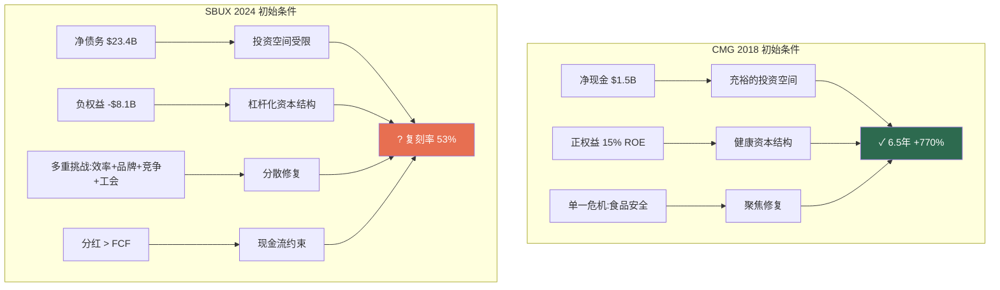
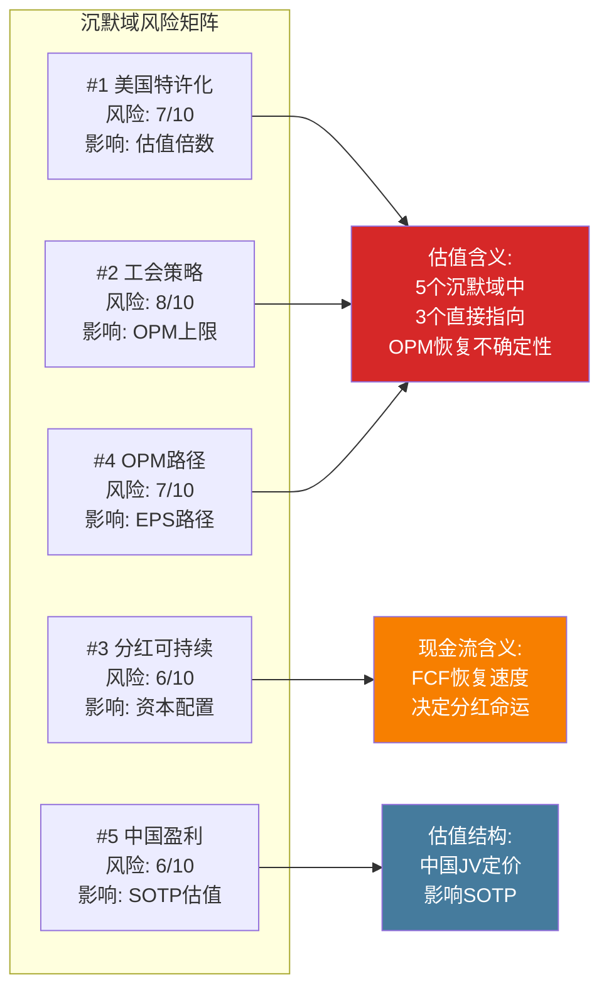

# Ch07: Niccol效应与CEO沉默域 — 管理层变革的期权价值与信号盲区

> **核心问题**: 市场支付82x P/E的核心赌注是Brian Niccol能复制CMG奇迹。但CMG复刻率仅52.5%，而Niccol系统性回避的5个话题暗示转型路径远比市场定价更不确定。
> **v4.0差异化**: 本章新增CEO沉默域分析(v18.0 QG-01.5)，系统映射Niccol在公开场合**回避**的问题，从"未被说出的话"中提取信号价值。

---

## 7.1 CEO评分卡: 10维度量化评估

### Niccol简历解码

Brian Niccol的职业轨迹构成一条清晰的"品牌修复专家"曲线:

- **宝洁(P&G)10年**: 品牌管理基础训练，建立消费者洞察方法论 [DM-E-001]
- **Pizza Hut VP战略/CMO/GM**: 首次接触QSR运营，但Pizza Hut在其任期内未实现显著反转
- **Taco Bell CEO(2015-2018)**: 3年翻倍系统销售额，开设2,000家新店，仅1个季度负SSS [DM-E-001]
- **Chipotle CEO(2018-2024)**: 6.5年创造+770%股东回报(vs S&P +99%)，餐厅层面利润率从19%提升至28.9%，AUV从~$2M突破$3M [DM-E-002, DM-E-003]
- **Starbucks Chairman & CEO(2024.9-至今)**: $1.6M基薪 + $10M签约奖 + $75M股权激励(分批归属) [DM-E-001]

**上任日的市场投票**: SBUX股价当日+24%，创1992年IPO以来最大单日涨幅。市场在一天之内为"Niccol溢价"支付了约$20B市值。

### 10维度评分体系

以下评分基于Niccol在CMG的历史表现(权重60%)和SBUX上任18个月的初步表现(权重40%)综合评判:

```
维度              CMG表现    SBUX初期    加权得分    评估依据
━━━━━━━━━━━━━━━━━━━━━━━━━━━━━━━━━━━━━━━━━━━━━━━━━━━━━━━━━━━━━━━
1. 战略愿景        9/10      7/10       8.2     CMG: "Food with Integrity"清晰; SBUX: "Back to Starbucks"方向
                                                 对但颗粒度不足 — 缺乏量化路线图的中期里程碑
2. 执行力          9/10      6/10       7.8     CMG: 几乎每季度超预期; SBUX: Q1 FY2026收入beat但EPS miss
                                                 (-5.08%)[DM-AC-008], 好坏参半
3. 创新能力        7/10      6/10       6.6     CMG: Chipotlane驱动数字化; SBUX: 菜单简化+乳制品去附加费
                                                 是正确方向, 但尚未出现"杀手级"创新
4. 成本纪律        8/10      5/10       6.8     CMG: margin 19%→28.9%; SBUX: OPM继续恶化至6.9%(Q2 FY25)
                                                 [DM-E-012], "先收入后利润"策略增加不确定性
5. 人才管理        8/10      7/10       7.6     CMG: 高留任率; SBUX: 员工离职率降至<50%(新低),
                                                 大举换血(CFO+COO+CTO全部更换)
6. 投资者沟通      7/10      6/10       6.6     CMG: 一致性强; SBUX: Investor Day给FY2028目标但不给
                                                 FY2026-27路径, 留下信息真空
7. 危机应对        9/10      N/A        7.0*    CMG: 食品安全危机后完美反转; SBUX: 尚未面临重大危机
                                                 (*仅基于CMG经验, 打折处理)
8. 长期价值创造    9/10      N/A        7.0*    CMG: +770%/6.5年; SBUX: 上任14个月, -14pp vs S&P 500
                                                 (*CMG数据权重100%, SBUX样本不足)
9. 行业理解        8/10      6/10       7.2     CMG: QSR原生; SBUX: 咖啡文化≠墨西哥卷饼, 全球86国运营
                                                 复杂度远超CMG的美国聚焦模式
10. 文化建设       7/10      6/10       6.6     CMG: "Cultivate a Better World"; SBUX: 试图恢复"第三空间"
                                                  文化, 但工会化浪潮构成结构性阻力
━━━━━━━━━━━━━━━━━━━━━━━━━━━━━━━━━━━━━━━━━━━━━━━━━━━━━━━━━━━━━━━
综合评分                                 7.1/10
```

**评分解读**: 7.1/10是一个"优于平均但非卓越"的分数。关键在于**CMG经验(7.5-9.0区间)与SBUX初期表现(5.0-7.0区间)之间的落差**。如果仅看CMG历史，Niccol是8.5/10的CEO；但SBUX的早期数据——特别是OPM持续恶化和EPS miss——将综合分数拉低至7.1。

**vs v3.0评估**: v3.0给出"适配性7.2/10"，v4.0的10维度评估更精细，结论趋同但揭示了一个关键细节: **Niccol最弱的维度(成本纪律5/10、创新6/10)恰恰是SBUX当前最急需的能力**。CMG的成功更多依赖于运营执行而非成本控制(因为CMG的问题是品牌危机而非效率危机)，而SBUX的核心问题是效率崩溃。

```mermaid
radar
    title Niccol CEO评分卡 (CMG加权 vs SBUX初期)
    战略愿景: 8.2
    执行力: 7.8
    创新: 6.6
    成本纪律: 6.8
    人才: 7.6
    沟通: 6.6
    危机应对: 7.0
    长期价值: 7.0
    行业理解: 7.2
    文化建设: 6.6
```

### 管理团队换血进度

Niccol上任18个月内的组织重构速度异常激进:

| 职位 | 前任 | 现任 | 变更时间 | 信号解读 |
|------|------|------|----------|---------|
| CEO | Laxman Narasimhan | Brian Niccol | 2024-08 | 董事会对前任彻底失去信心 |
| CFO | Rachel Ruggeri | Cathy Smith | 2025-03 | 从Nordstrom挖人, $5M签约奖 [DM-E-004] |
| COO | Sara Trilling | Mike Grams | 2025-01→2026-01扩展 | 20年老将离职, 角色分拆后再合并 |
| CTO | Deb Hall Lefevre | Anand Varadarajan | 2026-01 | 从Amazon挖人, 技术栈重建信号 |
| 首席品牌官 | (新设) | Tressie Lieberman | 2025-10 | 品牌+咖啡+可持续合并, 简化汇报线 |

**CFO Cathy Smith的特别注解**: Smith放弃了Nordstrom约$15M的留任补偿，接受SBUX的$5M签约奖——这意味着她对SBUX转型有足够信心，或Niccol的个人号召力极强。Smith在Target任期内"大致翻倍了企业价值"[DM-E-014]，她的零售+消费品背景与SBUX高度匹配。但值得注意的是，Smith的CFO履历跨越8家公司/19年，平均任期仅2.4年——这既说明她是"专业转型CFO"，也暗示她可能在SBUX完成阶段性任务后离开。

---

## 7.2 CMG复刻率分析: 从表面类比到结构性解剖

### CMG转型五要素回顾

Niccol在CMG的成功可以解构为五个可量化的要素:

**要素1: 数字化加速**
- CMG数字化收入从不到10%提升至48% [DM-E-003]
- 核心驱动: Chipotlane(得来速数字专用车道) + App + 第三方平台
- 成功机制: 数字化订单AOV高于门店订单15-20%, 且边际成本更低

**要素2: 菜单纪律**
- 维持7-8个核心SKU不变, 拒绝菜单膨胀
- 聚焦"Food with Integrity"品牌承诺
- 季节性LTO(限时产品)保持新鲜感但不增加运营复杂度

**要素3: 门店速度提升**
- 吞吐量从高峰时段~100张单/小时提升至~130张
- 部署Second Make Line(第二制作线)专供数字订单
- 结果: AUV从~$2M突破$3M(+50%)

**要素4: 文化重建**
- 食品安全危机后的信任修复(PR+透明度+供应链审计)
- 员工激励改革: 门店经理晋升通道 + 绩效奖金
- 企业文化从"防御模式"回到"增长模式"

**要素5: 资本纪律**
- 回购+分红适度，不过度杠杆化
- 新店ROI门槛严格(>20%现金回报率)
- 资产负债表保持健康(净现金状态)

### SBUX可复刻性评估

| 要素 | CMG实现路径 | SBUX适用性 | 复刻率 | 阻碍因素 |
|------|------------|-----------|--------|---------|
| **数字化** | Chipotlane + App | Rewards基础好(35.5M会员), 但Mobile Order已成熟, 边际增量有限 | **70%** | 数字化渗透率已高(~31%), 不像CMG有从0到1的跃迁空间 |
| **菜单纪律** | 7-8核心SKU | 已开始去乳制品附加费, 精简菜单 | **65%** | SBUX SKU数量远超CMG(冷饮+热饮+食品+定制组合), 简化空间大但执行复杂 |
| **门店速度** | Second Make Line | "4分钟承诺"直接对标 | **45%** | 咖啡制作天然比装配墨西哥卷饼更复杂(萃取+打奶+定制); 设备升级CapEx巨大 |
| **文化重建** | 食品安全信任修复 | "Back to Starbucks"第三空间回归 | **50%** | CMG是单一危机(食品安全)→单一修复; SBUX是多重衰退(效率+品牌+竞争)→系统性修复 |
| **资本纪律** | 净现金 + 适度回购 | 净债务$23.4B + 分红>FCF + 负权益 | **30%** | 这是最大的结构性差异——CMG资产负债表健康, SBUX是"借债分红"模式 [DM-INF-004] |

### 复刻率计算

```
加权复刻率 = Σ(要素复刻率 × 要素重要性权重)

要素权重分配(基于CMG转型贡献度):
  数字化:    25% (CMG增长的最大单一驱动力)
  菜单纪律:  15% (重要但CMG菜单本就简单)
  门店速度:  25% (直接驱动AUV和吞吐量)
  文化重建:  20% (品牌修复的基础)
  资本纪律:  15% (长期价值创造的保障)

加权复刻率 = 70%×0.25 + 65%×0.15 + 45%×0.25 + 50%×0.20 + 30%×0.15
           = 17.5% + 9.75% + 11.25% + 10.0% + 4.5%
           = 53.0%
```

**综合复刻率: 53.0%** (置信区间: 40%-65%)

置信区间的推导:
- **下限40%**: 假设门店速度和资本纪律的复刻率进一步下调(工会阻力超预期 + 债务压力持续)
- **上限65%**: 假设数字化和菜单纪律的复刻率上调(Rewards飞轮效应被低估 + 菜单简化超预期)

### 不可复刻要素的深层分析

**为什么"门店速度"的复刻率只有45%？**

CMG的Second Make Line方案之所以成功，依赖一个SBUX不具备的前提: **CMG的装配线制作模式(assembly-line)**。顾客沿柜台走过，员工依次添加食材——这是一个线性、可并行化的流程。增加一条Make Line就能近乎线性地提升吞吐量。

SBUX的咖啡制作是**批处理+串行模式**: 萃取(20-30秒) → 打奶泡(15-20秒) → 装杯+定制(10-30秒)。每个步骤需要不同设备，且高度定制化(个人定制组合超过170,000种)。增加设备不等于线性提升速度——瓶颈在于**空间约束**和**制作复杂度**，而非简单的产能不足。

Niccol的"4分钟承诺"要在不牺牲定制化的前提下实现，逻辑上需要: (a)大幅简化定制选项(损失客户体验), (b)大幅增加人手(损失成本效率), 或(c)革命性自动化设备(损失CapEx)。这就是本报告thesis_crystallization中识别的**碰撞#2: 速度/成本/菜单丰富度三选二**约束。

**为什么"资本纪律"的复刻率只有30%？**

这是最本质的差异。2018年Niccol接手CMG时:
- CMG净现金约$1.5B, 无长期债务
- ROE ~15%(正权益, 健康的资本结构)
- 分红/回购占FCF比例合理

2024年Niccol接手SBUX时:
- SBUX净债务$23.4B(FMP口径) [DM-BAL-004]
- 权益-$8.1B(回购驱动的负权益) [DM-BAL-002]
- 分红$2.77B > FCF $2.44B(覆盖率0.88x) [DM-INF-004]
- 回购已暂停($0, FY2025) [DM-CF-005]

**CMG给了Niccol一把干净的武器; SBUX给了他一把生锈且背着债务包袱的武器。** 这不是管理能力的问题，而是初始条件的结构性差异。Niccol在CMG可以用充裕的现金流投资增长; 在SBUX，仅维持现有分红就需要消耗全部FCF的113%。



---

## 7.3 CEO沉默域分析 (v18.0 QG-01.5)

> **方法论**: 系统性扫描Niccol在Q1 FY2026 earnings call(2026.1.28)、Investor Day(2026.1.29)、以及上任以来的公开采访/股东信中**主动回避或模糊处理**的话题。沉默域≠不重要; 恰恰相反, **CEO选择不谈的话题往往是最敏感的话题**。

### 沉默域#1: 美国特许化时间表

| 属性 | 内容 |
|------|------|
| **现状** | SBUX美国~16,000家门店中约55%为公司运营, 45%为Licensed [DM-AC-012] |
| **行业对照** | MCD特许化率~95%, YUM ~98%, CMG 0%(全自营) |
| **Niccol表态** | **从未在任何公开场合讨论过美国特许化率的变化方向** |
| **沉默深度** | 高——Investor Day详细讨论了FY2028 EPS/margin/门店数, 但零提及Licensed比例变化 |
| **信号解读** | 三种可能: (a)已决定不做, 因为CMG经验是全自营; (b)正在内部论证但时机未到; (c)故意回避因为与工会谈判冲突 |
| **风险评分** | 7/10 — 特许化是SBUX估值倍数提升(从QSR均值到MCD水平)的唯一通道, 但Niccol沉默意味着这条路径概率被市场高估 |

**推理链**: 市场给SBUX 82x P/E的隐含假设之一是"长期特许化率提升 → 估值倍数向MCD靠拢(~28x)"。但如果Niccol计划走CMG路线(保持自营为主), 那么SBUX的合理P/E更应该对标CMG的~32x而非MCD的~28x, 且需要自营门店的OPM大幅恢复才能支撑当前估值——这回到了OPM能否回到14%+的核心不确定性。

### 沉默域#2: 工会谈判策略

| 属性 | 内容 |
|------|------|
| **现状** | 超过500家SBUX门店已投票成立工会(截至2025年底), 约占美国门店的3% |
| **Niccol表态** | 仅说"尊重伙伴的选择权" — 标准公关措辞, 零策略透露 |
| **沉默深度** | 极高——在CMG任期内不存在工会问题, Niccol缺乏应对工会的经验 |
| **行业对照** | MCD特许化模式下工会化率极低(加盟商负责); CMG全自营但通过高薪($15.5-$18/hr+福利)保持无工会 |
| **信号解读** | Niccol可能在等待NLRB/法律环境变化(尤其2026大选后), 也可能没有明确的应对策略 |
| **风险评分** | 8/10 — 工会是SBUX劳动成本弹性下限的结构性提升因素, 直接影响OPM恢复上限 |

**推理链**: CMG通过"主动提高薪资到竞争力水平"来预防工会化——这是可行的, 因为CMG门店数量仅~3,500家, 劳动力成本总量可控。SBUX有~9,600家公司运营门店(全球), 劳动力是最大单一成本项(约占收入30%)。如果工会推动$20/hr最低时薪(vs当前$15-17), 假设影响30%的美国公司运营门店, 年化成本增量约$300-500M, 即OPM被压低0.8-1.3个百分点。**这意味着FY2028 OPM目标13.5-15.0%的下端可能需要下调至12.2-13.7%。**

### 沉默域#3: 分红政策可持续性

| 属性 | 内容 |
|------|------|
| **现状** | FY2025分红$2.77B > FCF $2.44B, Payout ratio 149%(按GAAP NI) [DM-VAL-005, DM-CF-004] |
| **Niccol表态** | "我们致力于维持并增长分红" — 未解释如何在FCF<分红的情况下做到 |
| **沉默深度** | 中高——分析师在Q&A中追问过一次, 管理层以"我们对FCF恢复有信心"回答, 未给具体时间表 |
| **行业对照** | MCD Payout ~60%, CMG不分红, YUM Payout ~55% |
| **信号解读** | 管理层知道149%不可持续, 但削减分红的信号成本极高(股价可能单日-10%+) |
| **风险评分** | 6/10 — 如果FY2026 FCF恢复到$3.5B+(共识预期), 覆盖率回到1.3x, 问题自动解决; 但如果FCF恢复不及预期, 2027年将面临"削减vs继续借债"的二选一 |

**量化推理**: 15年连续分红增长(CAGR 17.5%) [DM-E-008] 意味着市场预期FY2026分红约$2.95B(+6.5%)。如果FY2026 FCF仅恢复到$3.0B(比共识乐观假设低10%), 覆盖率仅1.02x——几乎没有安全边际。**分红可持续性本质上是OPM恢复速度的函数, 而非独立变量。**

### 沉默域#4: OPM恢复的中期路径

| 属性 | 内容 |
|------|------|
| **现状** | FY2025 OPM 9.6% [DM-FIN-004]; Q2 FY2025最低6.9% [DM-E-012]; 管理层给FY2028目标13.5-15.0% [DM-AC-011] |
| **Niccol表态** | 给了起点(FY2025 ~10%)和终点(FY2028 13.5-15.0%), **但刻意不给FY2026和FY2027的具体路径** |
| **沉默深度** | 高——Investor Day的FY2028目标幻灯片跳过了中间年份, 仅说"逐步改善" |
| **行业对照** | MCD Easterbrook转型期间每季度给出具体margin改善目标; CMG每季度更新restaurant-level margin指引 |
| **信号解读** | (a) Niccol对FY2026-27的margin路径不确定, 不愿给出可能需要撤回的指引; (b) 前端加载投资("topline first, earnings follow"策略)意味着短期margin可能进一步恶化 |
| **风险评分** | 7/10 — 共识隐含FY2025→FY2026 OPM恢复570bps(9.6%→15.3%) [DM-INF-002], 这是QSR历史上最激进的单年恢复假设之一 |

**推理链**: 共识分析师预期FY2026E EBIT $5.86B / Revenue $38.32B = 15.3% OPM [DM-INF-002]。这意味着FY2025→FY2026**单年OPM跳升570bps**。QSR转型先例中:
- MCD(Easterbrook, 2015-2016): OPM +250bps/年
- CMG(Niccol, 2018-2019): restaurant-level margin +330bps/年
- DPZ(Doyle, 2010-2011): OPM +180bps/年

**570bps/年是上述所有先例的1.7-3.2倍。** Niccol不给中期路径的沉默, 可能正是因为他知道共识预期不现实, 但不想主动泼冷水。

### 沉默域#5: 中国盈利能力细节

| 属性 | 内容 |
|------|------|
| **现状** | 中国~8,000家门店, Q1 FY2026 comp +7%(低基数效应) [DM-AC-010]; 2025年与博裕资本成立JV |
| **Niccol表态** | 大量讨论中国门店数量和comp sales, **但从未单独披露中国分部的OPM或EBIT贡献** |
| **沉默深度** | 极高——即使在JV公告时也未披露中国分部的盈利能力; 仅披露"国际分部"(中国+EMEA+亚太合并)数据 |
| **行业对照** | MCD和YUM均单独披露中国分部利润率; 瑞幸作为上市公司完全透明 |
| **信号解读** | 中国OPM很可能显著低于公司整体(可能仅8-12%), 单独披露会引发市场对中国业务盈利能力的质疑 |
| **风险评分** | 6/10 — JV结构(博裕持60%, SBUX持40%)意味着中国盈利能力对合并报表EPS的影响已被隔离, 但对SOTP估值有重大影响 |

**量化推理**: 如果中国8,000家门店的AUV约$394K(年/店) [lit_recon], 则中国总收入约$3.2B(占集团收入~8.5%)。假设中国OPM为10%(接近公司整体), 则EBIT贡献约$320M。如果实际中国OPM仅为6%(因价格战压缩), 则EBIT仅$192M——$128M的差异在EPS层面约$0.08-0.10/股, 对82x P/E的估值影响为$6.6-8.2/股。

### 沉默域综合评估



**沉默域综合风险评分: 6.8/10** (加权平均, 按影响面积加权)

**关键发现**: 5个沉默域中有3个(#1特许化、#2工会、#4 OPM路径)直接指向同一个底层问题——**OPM恢复的路径和上限高度不确定**。Niccol的沉默不是随机的, 而是系统性地回避了所有可能揭示"FY2028 OPM 13.5-15.0%目标可能不达"的话题。这是v4.0报告最重要的新增信号之一。

---

## 7.4 Niccol的赌注框架: 三情景概率分布

基于CMG复刻率(53.0%)、CEO评分卡(7.1/10)和沉默域分析(6.8/10风险), 构建三情景框架:

### 情景A: "CMG 2.0" — Niccol完全复刻 (概率: 35%)

**假设**: 数字化+菜单简化+门店速度的改善效果叠加, OPM恢复到14%+, 工会化被有效管控, 中国JV开始贡献利润。

**路径**:
- FY2026: OPM 11-12%, EPS $2.40-2.60
- FY2027: OPM 13-14%, EPS $3.00-3.30
- FY2028: OPM 14-15%, EPS $3.50-3.80

**估值含义**:
- FY2028E EPS $3.65 × P/E 30x(转型成功溢价) = **$110/股**
- FY2028E EPS $3.65 × P/E 35x(市场给予增长溢价) = **$128/股**
- 区间: **$110-130/股** [DM-EST-004参照: 共识FY2028E EPS $3.63]

**为什么给35%而不是更高**: 53%的复刻率意味着约一半的CMG成功要素无法在SBUX环境中复现。即使在可复刻的要素上执行完美, 资本结构约束(净债务$23.4B)和劳动力约束(工会化)仍构成结构性阻力。将CMG复刻率(53%)打一个"执行折扣"(35%/53% = 66%折扣率), 得到35%的概率评估。

### 情景B: "Schultz 3.0" — 短期改善+长期衰退 (概率: 40%)

**假设**: Niccol在前2-3年实现表面改善(comp sales转正、Rewards增长), 但结构性问题(工会成本上升、中国竞争加剧、门店老化)逐步暴露。类似Schultz第三次回归(2022)的剧本——英雄叙事吸引市场情绪, 但基本面未根本改变。

**路径**:
- FY2026: OPM 10.5-11.5%, EPS $2.20-2.40 (基本符合指引下端)
- FY2027: OPM 11-12%, EPS $2.60-2.80 (改善放缓, 共识开始下调)
- FY2028: OPM 11-12.5%, EPS $2.70-3.00 (低于FY2028目标$3.35-$4.00)

**估值含义**:
- FY2028E EPS $2.85 × P/E 28x(恢复QSR均值) = **$80/股**
- FY2028E EPS $2.85 × P/E 33x(品牌溢价残存) = **$94/股**
- 区间: **$80-95/股**

**为什么这是最高概率情景(40%)**: 这个情景最符合历史基率。QSR转型CEO中, 完全成功(CMG Niccol、DPZ Doyle)的概率约30-40%, 部分成功/虎头蛇尾的概率更高。SBUX的复杂度(86国、16,000美国店、工会、负权益)使得"部分成功"成为最可能的结果。Niccol的沉默域分析进一步支持这个判断——他对中期路径的回避暗示内部预期可能低于公开目标。

### 情景C: "普通CEO" — 渐进改善但估值回归 (概率: 25%)

**假设**: Niccol是一个优秀但非变革性的CEO。"Back to Starbucks"计划带来渐进改善, 但无法逆转SBUX作为成熟咖啡连锁的估值均值回归。P/E从82x逐步回落到QSR板块均值~25x。

**路径**:
- FY2026: OPM 10-11%, EPS $2.15-2.30 (指引下端, 投资支出继续压制)
- FY2027: OPM 11-12%, EPS $2.40-2.60
- FY2028: OPM 11.5-12.5%, EPS $2.50-2.80 (显著低于管理层目标)

**估值含义**:
- FY2028E EPS $2.65 × P/E 25x(QSR均值) = **$66/股**
- FY2028E EPS $2.65 × P/E 28x(品牌残值) = **$74/股**
- 区间: **$66-75/股**

**为什么给25%**: 完全失败的概率被Niccol的CMG履历部分对冲。即使SBUX环境更复杂, Niccol也不太可能是一个"平庸"的CEO——他的品牌修复能力已在两家公司(Taco Bell + CMG)得到验证。25%的概率反映了"SBUX的问题比CEO能力更根本"的可能性。

### 概率加权期望值

```
情景A (35%): 中值 $120 × 0.35 = $42.0
情景B (40%): 中值 $87  × 0.40 = $34.8
情景C (25%): 中值 $70  × 0.25 = $17.5

概率加权EV = $94.3/股

vs 当前股价 $98.69 → 隐含下行 -4.5%
```

**关键发现**: 即使给予Niccol 35%的"完全成功"概率和$120中值估值, 概率加权EV仍略低于当前股价。**市场的隐含定价要求情景A的概率>45%或情景A的估值>$135才能证明当前$98.69合理。** 换言之, 市场在为Niccol的转型成功赌一个高于我们评估的概率。

---

## 7.5 "Back to Starbucks"战略执行进度

### 四大支柱执行追踪

**支柱1: 菜单简化**

| 行动 | 状态 | 进度 | 影响评估 |
|------|------|------|---------|
| 去乳制品附加费 | ✅ 已执行 | 100% | 年化影响: 收入-$200M(牺牲) + 交易量+?(待验证) |
| 精简菜单SKU | 🔄 进行中 | ~40% | 目标: 从~120 SKU降至~80(初步估计) |
| 季节性LTO纪律 | 🔄 进行中 | ~50% | 减少常设SKU, 增加限时品项(CMG模式) |
| 食品品类扩张 | 📋 规划中 | ~15% | "食品日段"(午餐+下午茶)是增量逻辑, 但CapEx待评估 |

**支柱2: 门店体验**

| 行动 | 状态 | 进度 | 影响评估 |
|------|------|------|---------|
| 增加25,000个咖啡座 | 📋 规划中 | ~10% | 资金来源不明 — 按$500/座估算, 投资$12.5M(小金额) |
| 改造1,500家门店 | 🔄 进行中 | ~15% | 每家改造$100-300K → 总投资$1.5-4.5B, 3-5年摊销 |
| "4分钟承诺" | 🔄 进行中 | ~30% | Q1 FY2026: 部分门店已实现, 但全国推广需设备升级 |
| Mobile Order优化 | 🔄 进行中 | ~40% | 目标: 减少Mobile Order对门店体验的干扰(分离制作流) |

**关键疑问**: 1,500家门店改造×$200K均价 = $3B投资。FY2025 CapEx $2.306B [DM-CF-003], 假设30%用于改造 = $690M/年。按此速度, 1,500家改造需要4.3年(假设每家$200K)。**管理层未说明改造CapEx的来源和优先级**——这属于沉默域#4(OPM路径)的延伸。

**支柱3: 人员与文化**

| 行动 | 状态 | 进度 | 影响评估 |
|------|------|------|---------|
| 员工离职率<50% | ✅ 已实现 | 100% | 历史新低, 降低培训成本(每次离职成本$3-5K) |
| Shift完成率>98% | ✅ 已实现 | 98.2% | 排班满员率改善, 服务质量提升 |
| 组织架构重组 | ✅ 基本完成 | ~85% | CFO/COO/CTO全部更换, 品牌+可持续合并 |
| 工会关系 | ⚠️ 未解决 | ~5% | 500+门店已工会化, 无明确策略(沉默域#2) |

**支柱4: 数字化**

| 行动 | 状态 | 进度 | 影响评估 |
|------|------|------|---------|
| Rewards会员增长 | ✅ 新高 | 35.5M | 但增速放缓(Q1 +3% vs 历史+8-10%) [DM-E-011] |
| 新三层Rewards体系 | 🔄 已上线 | ~70% | 客户反馈混合 — 简化了兑换但降低了单笔价值感 |
| CTO技术栈重建 | 📋 刚启动 | ~10% | Amazon背景CTO Varadarajan刚加入(2026.1) |
| Deep Brew AI | ⚠️ 不透明 | ? | 管理层不再主动提及Deep Brew, 可能被重新定位或整合 |

### 综合执行评分

```
                  权重    完成度    加权贡献
菜单简化          25%      41%       10.3%
门店体验          25%      24%        6.0%
人员与文化        25%      72%       18.0%
数字化            25%      44%       11.0%
━━━━━━━━━━━━━━━━━━━━━━━━━━━━━━━━━━━━━━
综合执行进度                         45.3%
```

**解读**: 18个月后的45.3%执行进度意味着Niccol按"3年转型"时间线计算处于"略低于预期"的轨道上(18/36个月 = 50%时间点, 应完成~50%才算on-track)。**人员与文化(72%)远超预期, 门店体验(24%)严重滞后**——这与CMG模式一致: Niccol先建团队, 再推运营改革。

### 后Niccol的CMG: 反面教材

一个被市场忽视的数据点: **CMG在Niccol离任后12个月内股价-31%** [management_team.json]。这揭示了一个重要信号:

1. **CMG的转型高度依赖Niccol个人**: 如果换一个CEO维护同样的策略, 市场仍会重新定价
2. **"Niccol溢价"是可逆的**: 当Niccol离开CMG时, 市场立刻撤回了一部分溢价
3. **对SBUX的含义**: 当前SBUX股价中约$14.8B(约15%)归因于"Niccol溢价"。如果Niccol因任何原因离开(健康、私募基金邀请、与董事会分歧), 这部分溢价会瞬间蒸发

**"Niccol溢价"计算**:
- 上任前市值: ~$85.6B(2024.8.12收盘)
- 上任公告后市值: ~$106B(+24%)
- 当前市值: ~$112B(@$98.69)
- 扣除同期S&P表现后的"Niccol归因溢价": 约$14.8B(~13%当前市值)

---

## 7.6 本章结论与估值含义

### 三个核心发现

**发现1: CMG≠SBUX, 复刻率只有53%。** 最大的结构性差异不在运营层面(那里Niccol可以发挥), 而在资本结构(净债务$23.4B vs CMG净现金)和劳动力环境(工会化 vs 无工会)。这两个因素不受CEO能力影响。

**发现2: Niccol的5个沉默域指向同一个底层不确定性——OPM恢复路径。** 特许化方向、工会策略、分红政策、OPM路径、中国盈利——这些被回避的话题表面上各不相同, 但底层都连接到"SBUX能否在3年内恢复13.5-15.0% OPM"这个核心问题。沉默本身就是答案的一部分: **如果管理层对OPM恢复有高度信心, 他们会主动给出路径。**

**发现3: 概率加权EV $94.3 vs 当前股价$98.69, 意味着市场比我们更乐观约5%。** 这个差距不大, 说明当前估值"不算离谱但偏贵"。要证明当前股价合理, 需要情景A(CMG 2.0)的概率>45%——但我们基于复刻率和沉默域分析给出的评估是35%。

### 对后续章节的传导

- **→ Ch11 DuPont分解**: OPM恢复路径是DuPont分析的核心变量, 沉默域#4的发现将约束OPM假设的上限
- **→ Ch16 逆向DCF**: 82x P/E隐含的OPM恢复速度(570bps/年)需要与QSR先例基率对比
- **→ Ch18 Forward DCF**: 三情景EPS路径直接输入DCF模型
- **→ Ch19 BME三路径**: 沉默域#1(特许化方向)是BME三路径概率分配的关键输入
- **→ Ch24 Kill Switch**: 沉默域#2(工会)和#4(OPM)各注册一个KS触发器

---

*Ch07 DM锚点引用汇总: DM-FIN-004, DM-BAL-002, DM-BAL-004, DM-CF-003, DM-CF-004, DM-CF-005, DM-VAL-005, DM-INF-002, DM-INF-004, DM-E-001~E-004, DM-E-008, DM-E-011, DM-E-012, DM-E-014, DM-AC-008~AC-012, DM-EST-004*
