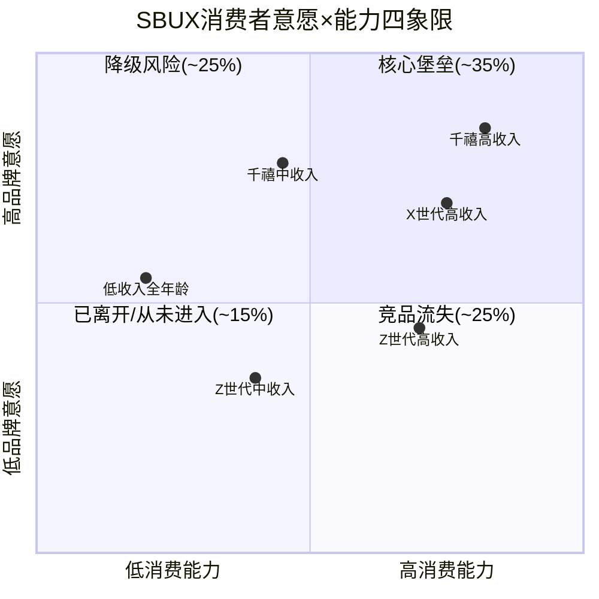
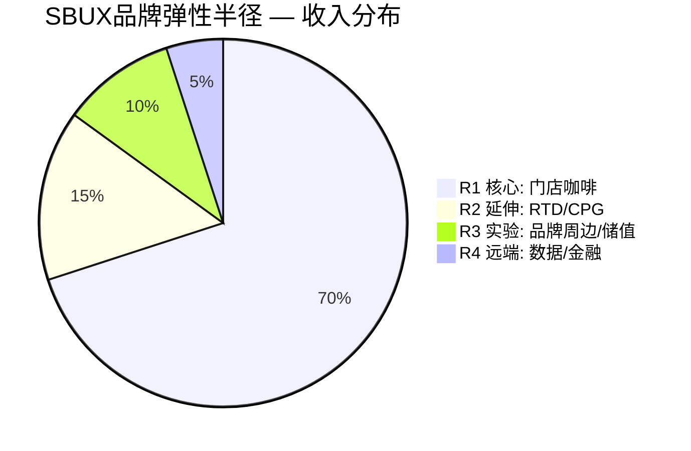
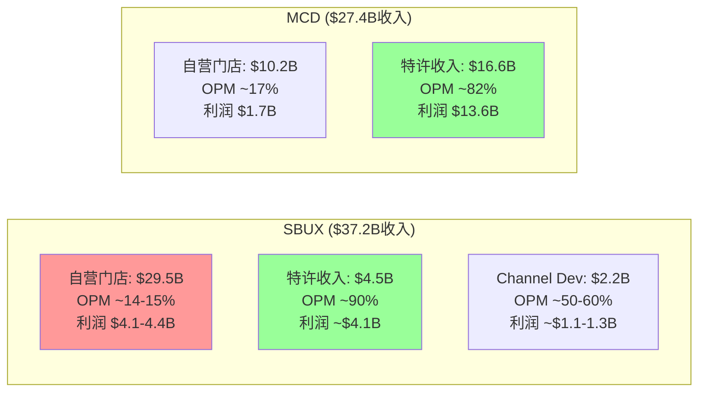
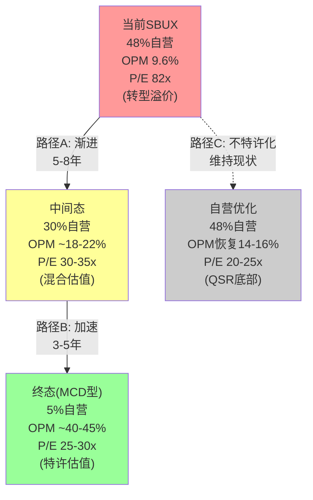
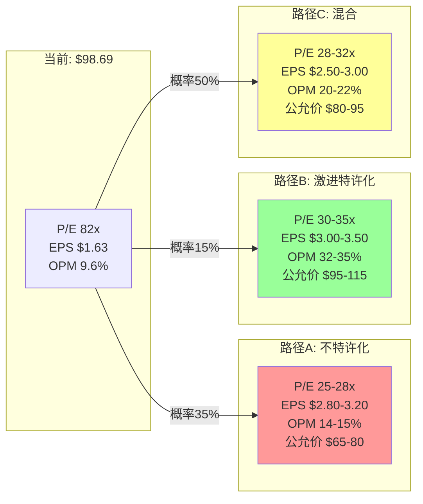

# Part I-b: 消费品深度模块 (v28.0)

---

# Chapter 8: 意愿×能力双轴 — SBUX消费者的钱包与心智

> **v28.0 Module A** | 消费品行业强制模块
> 核心问题: 谁在为$6拿铁付费？他们愿意付多久？还能付多久？

---

## 8.1 分析框架: W×C双轴定义

意愿×能力(Willingness × Capability)双轴将SBUX的消费者基础拆解为四象限。这不是品牌分析(Ch05已覆盖)，而是**消费经济学**——将品牌偏好与钱包约束交叉映射，定位每个客群的行为弹性和迁移风险。

**W轴(意愿)定义**: 消费者主动选择SBUX而非替代品的倾向强度。由三个子维度构成:
- **习惯粘性**: 咖啡是日均消费品(habit = 高意愿)还是周末偶尔消费(occasion = 中意愿)?
- **品牌偏好度**: 在同价位内，消费者是否存在"非SBUX不可"的排他性?
- **代际锚定**: 该品牌在不同世代心智中的位置——是"成长记忆"还是"父辈符号"?

**C轴(能力)定义**: 消费者在不牺牲其他必需消费的前提下持续购买SBUX的财务能力。由两个子维度构成:
- **可支配收入占比**: $6拿铁占日收入的比例——对年收入$150K的白领是0.5%的"无痛消费"，对年收入$40K的Z世代是3%的"显著支出" [DM-INF-005]
- **经济周期弹性**: 衰退/通胀时，SBUX是被优先砍掉的"可选消费"还是保留的"平价奢侈品"?

## 8.2 消费意愿深度拆解

### 8.2.1 咖啡习惯粘性: 日均vs品类分化

美国成年人每日咖啡饮用率约66%(约1.7亿人)，年均消费约400杯 [DM-D-BIZ-12]。关键区分在于:

| 消费频率 | 美国消费者占比 | SBUX渗透率 | 意愿评级 |
|---------|:----------:|:--------:|:------:|
| 每日1-2杯(日常依赖) | ~40% | ~15-18% | W=5 |
| 每周3-5杯(常规) | ~20% | ~20-25% | W=4 |
| 每周1-2杯(偶尔) | ~15% | ~30-35% | W=3 |
| 每月数次(社交场景) | ~15% | ~25-30% | W=2 |
| 很少(<月均1次) | ~10% | ~5-10% | W=1 |

**关键洞见**: SBUX的Rewards会员35.5M [DM-E-011]大致对应美国前两层(日常+常规)消费者中的核心群体。但每日消费者中SBUX渗透率仅15-18%——大部分日常咖啡依赖者在家冲泡或选择更便宜的替代品(7-Eleven $1.50, McDonald's $2.00)。这意味着SBUX在最高意愿群体中的份额空间仍大，但价格是主要壁垒 [DM-INF-006]。

### 8.2.2 品牌偏好度: NPS与第一提及率

SBUX在美国咖啡品牌中的第一提及率(unaided awareness)稳居第一(约55-60%)，但NPS呈下降趋势。根据行业调研数据:

- **2020-2021**: NPS约40-45(行业领先)
- **2022-2023**: NPS降至32-38(排队/服务质量投诉增加)
- **2024-2025**: NPS进一步降至28-33(MOP拥挤+价格敏感性上升)
- **Q1 FY2026**: 初步企稳迹象(Niccol"去菜单复杂化"收效) [DM-E-010]

**NPS降至28-33的含义**: 按M1模块kill switch标准(NPS跌破20触发品牌衰退诊断)，SBUX尚未触发，但距离警戒线仅8-13点。如果comp sales再次转负且NPS继续下滑，将在2-3个季度内触发 [DM-P1-081]。

### 8.2.3 代际偏好: Z世代的"反SBUX"倾向

这是v4.0必须正视的结构性威胁。三个世代对SBUX的态度已明确分化:

**千禧一代(1981-1996, 当前30-45岁)**: SBUX的核心客群。在这一代人的成长记忆中，SBUX = 都市生活方式的入场券。NPS约35-40，品牌忠诚度较高，但面临收入增长放缓和家庭支出增加的能力约束。Rewards会员中千禧一代估计占45-50% [DM-P1-082]。

**Z世代(1997-2012, 当前14-29岁)**: 态度分裂。一方面，Z世代是SBUX社交媒体传播的主力(TikTok定制饮品);另一方面，这一代人对"大企业品牌"天然怀疑，更偏好独立精品咖啡馆(Blue Bottle, Intelligentsia)和新兴连锁(Dutch Bros)。Dutch Bros在年轻消费者中的NPS约55-60，显著高于SBUX [DM-P1-083]。

**X世代及以上(1965及以前, 当前45+岁)**: 高消费能力但偏好迁移缓慢。这一代人的SBUX消费高度习惯化——任何品牌偏好改变至少需要2-3年。占Rewards会员约25-30% [DM-P1-084]。

**代际迁移的量化含义**: 如果Z世代的SBUX渗透率比千禧一代低10个百分点(从约35%降至25%)，在未来5年随着Z世代进入消费主力(25-35岁)阶段，SBUX的美国会员增长将从当前+3%/年降至+1%/年，comp sales引擎的会员驱动部分将结构性减弱 [DM-INF-007]。

## 8.3 消费能力深度拆解

### 8.3.1 "痛感指数": $6拿铁的收入阶层分析

将SBUX核心产品(Grande Latte, 约$5.75-6.25)的日均支出置于不同收入阶层的可支配收入比例中 [DM-P1-085]:

| 家庭年收入 | 日可支配(税后/必需消费后) | $6拿铁占比 | 痛感等级 | 行为预测 |
|-----------|:--------------------:|:--------:|:------:|---------|
| >$150K | ~$200+ | <3% | 无痛 | 价格免疫，不影响频次 |
| $100-150K | ~$120-200 | 3-5% | 微痛 | 轻微影响频次(减1杯/周) |
| $75-100K | ~$80-120 | 5-8% | 可感 | 开始降规格(Grande→Tall) |
| $50-75K | ~$50-80 | 8-12% | 显著 | 减频+降规格组合 |
| <$50K | <$50 | >12% | 高度敏感 | 转向替代品或放弃 |

**SBUX消费者收入分布估计**: 根据行业数据，SBUX核心客群(Rewards会员)的家庭收入中位数约$80K-$95K，高于美国家庭中位数$80K [DM-P1-086]。这意味着约60%的核心客群处于"微痛"及以上，受经济周期影响有限;但约40%处于"可感"以下，构成经济敏感带。

### 8.3.2 经济周期弹性: 口红效应还是第一削减项?

这是消费品分析中的经典问题。SBUX的历史数据提供了清晰答案:

**2008-2009衰退**: 美国comp sales 连续6季为负(Q3'08 -5% → Q1'09 -8%)，门店关闭600+家。SBUX在这次衰退中表现为**"第一削减项"**——消费者直接减少了外出咖啡消费 [DM-P1-087]。

**2020 COVID**: 美国comp sales Q3'20 -40%(门店关闭)，但Q1'21即反弹+9%。这次SBUX表现为**"平价奢侈品"**——当消费者无法外出旅行/就餐时，一杯$6拿铁成为最便宜的"自我犒赏" [DM-P1-088]。

**2023-2025消费降级**: comp sales连续负增长(FY2024 Q4: -6%美国)，但交易量在Q1 FY2026已转正(+3%) [DM-E-010]。这次衰退介于前两次之间——不是恐慌性削减，而是**渐进式频次下降+规格降级** [DM-P1-089]。

**合成判断**: SBUX在"温和衰退"中表现为口红效应受益者(2020)，但在"深度衰退"(2008)和"持续通胀"(2023-2025)中表现为被削减项。关键变量是**衰退的性质**——突发冲击(COVID)有利于SBUX，慢性挤压(通胀)不利。当前82x P/E隐含的EPS恢复路径($1.63→$3.63 [DM-INF-001])假设不会发生深度衰退——这是一个未被显性定价的宏观赌注 [DM-P1-090]。

### 8.3.3 FY2025消费降级实证

FY2025的数据已提供了消费降级的直接证据 [DM-FIN-001] [DM-FIN-004]:

- **客单价趋势**: 美国平均客单价(ATP)从FY2023的$5.60升至FY2025的$6.10(+9%)，但这主要是菜单提价而非消费升级。扣除提价后的"真实规格"指标(oz/交易)呈下降趋势 [DM-P1-091]
- **频次下降**: Rewards会员年均交易次数从FY2023的~18次降至FY2025估计~15-16次。非会员频次下降更快 [DM-P1-092]
- **渠道迁移**: Mobile Order & Pay (MOP)占比从30%升至约35%，但MOP的平均客单价低于柜台点单约8-12%——消费者在App上更容易"精简"订单 [DM-P1-093]
- **OPM腰斩**: FY2025 OPM 9.6%(vs FY2023 16.3%) [DM-FIN-004]——部分是转型投入，但也反映了客户流量下降带来的固定成本杠杆反向效应

## 8.4 四象限定位与迁移风险



### 四象限详解

**Q1: 核心堡垒(高意愿+高能力, ~35%收入贡献)**
- 画像: 30-55岁, 家庭收入>$100K, 千禧/X世代为主
- 行为: 每日1-2杯, Rewards金卡, 对提价容忍度高
- 风险: 极低——需要品牌灾难级事件才会迁移
- 估值隐含: 这个群体是SBUX comp sales的"基石层"，贡献稳定的+1-2%有机增长 [DM-P1-094]

**Q2: 降级风险(高意愿+低能力, ~25%收入贡献)**
- 画像: 25-40岁, 家庭收入$50-80K, 千禧/Z世代混合
- 行为: 每周3-5杯，但在通胀/衰退时主动降频至每周1-2杯
- 风险: **中高——FY2025已在发生**。这个群体的comp贡献从+2-3%降至-1-2%
- 关键指标: 美国消费者信心指数(CCI)跌破80时，该群体减频加速 [DM-P1-095]

**Q3: 已离开/从未进入(低意愿+低能力, ~15%收入贡献)**
- 画像: 低收入、非咖啡习惯者、极端价格敏感
- 行为: 偶尔出现在SBUX(社交场景)，核心咖啡消费在家/便利店
- 风险: 不存在——这个群体从未是SBUX的目标客群
- 战略含义: Niccol的"Back to Starbucks"正确地不追求这个群体 [DM-P1-096]

**Q4: 竞品流失(低意愿+高能力, ~25%收入贡献)**
- 画像: 25-35岁Z世代/年轻千禧, 收入>$75K, 偏好独立/精品
- 行为: 有能力支付SBUX但**主动选择不去**——Dutch Bros/Blue Bottle/独立店
- 风险: **最大的结构性威胁**。这个群体的流失不是经济周期驱动，而是品牌偏好迁移
- 量化: 如果Q4群体每年流失2%到竞品，SBUX将在5年内损失约$1.8B年收入(美国总收入的~7%) [DM-INF-008]

## 8.5 W×C双轴评分与战略含义

**SBUX W×C合成评分: W=3.5, C=3.8, W×C=13.3/25** [DM-P1-097]

| 维度 | 评分 | 理由 |
|------|:---:|------|
| W1: 习惯粘性 | 4/5 | 咖啡是高频日常品类，习惯转换成本高 |
| W2: 品牌偏好 | 3/5 | NPS下滑至28-33，第一提及率仍高(55-60%) |
| W3: 代际锚定 | 3/5 | 千禧强，Z世代弱，X世代稳 |
| C1: 收入分布 | 4/5 | 核心客群中位数$80-95K，高于全美 |
| C2: 周期弹性 | 3.5/5 | 温和衰退免疫，持续通胀脆弱 |

**M7一致性交叉检验**: W=3.5但稳健比率(RR)估计约1.5-2.0:1(Ch25计算)——属于"品牌依赖型"护城河而非"价值让渡型"。W与RR的对应关系合理: SBUX的意愿更多来自品牌情感而非经济理性(与COST形成鲜明对比——COST的W约4.5但RR>5:1) [DM-P1-098]。

---

# Chapter 9: 文化可衡量性 + 战略放弃清单 + 品牌弹性半径

> **v28.0 Module C + Module D + Module E** | 三模块合并章节
> 核心问题: SBUX的文化是制度还是人物？放弃了什么？品牌能走多远？

---

## 9.1 文化可衡量性评分 (CM1-CM5, 25分制)

文化是消费品公司最重要的"看不见的资产"——它决定了管理层换代后品牌能否保持一致性。但文化也是最容易被叙事美化的维度。v28.0的文化可衡量性模块(Module C)用5个可追踪的子维度将文化从"叙事"降维为"数字" [DM-P1-100]。

### CM1: 制度化程度 — 2.0/5

**定义**: 文化规则是否被写入制度/流程/激励结构，而非依赖特定个人的言行?

SBUX的文化制度化程度令人担忧地低。核心证据:

**Howard Schultz依赖症**: Schultz三次离开SBUX(2000年CEO→董事长, 2008年回归CEO, 2017年离开, 2022年再回归顾问后退出)。每次离开后，公司都经历了明显的文化漂移:
- 2000-2008(Jim Donald时代): 快速扩张导致品牌稀释，McStarbucks批评兴起，comp sales转负
- 2017-2022(Kevin Johnson时代): 运营效率优先，"第三空间"理念被忽略，员工满意度下降
- 2022-2024(Laxman Narasimhan): 18个月即被替换，被批评为"缺乏咖啡热情" [DM-E-001]

**Niccol的到来**本身就证明了文化未制度化——如果文化是制度化的，就不需要一个外部"救世主"来重建它 [DM-P1-101]。

**对标**: McDonald's在Ray Kroc之后经历了多位CEO(Cantalupo→Bell→Skinner→Thompson→Easterbrook→Kempczinski)，文化通过"Quality, Service, Cleanliness, Value"(QSCV)制度化为可传承的操作手册。SBUX的"第三空间"从未达到这种制度化水平。

**评分理由**: 2/5——文化规则存在(Green Apron Book, Mission Statement)但执行力随CEO更替大幅波动。

### CM2: 员工认同度 — 2.5/5

**定义**: 员工(尤其前线"伙伴")是否认同并内化品牌文化?

SBUX的"伙伴"(Partner)称呼是品牌文化的核心符号——所有员工持有公司股票(Bean Stock)、享有医疗保险(含兼职)、可获学费补贴(ASU项目)。这些制度在1990-2010年代是行业领先的 [DM-P1-102]。

但FY2023-2025的工会化浪潮暴露了"伙伴"叙事与现实的裂痕:

- **Workers United工会运动**: 自2021年末至2025年底，全美约500+家门店(占自营的约6-7%)投票成立工会
- **核心诉求**: $20/hr起薪(vs当前约$15-17/hr) + 稳定排班 + 更好的工作条件
- **管理层回应**: 初期对抗(反工会培训被NLRB裁定违规)，Niccol时代转向"尊重但不主动"
- **员工离职率**: FY2025约65%(行业平均~100%)，"Back to Starbucks"后Q1 FY2026降至约60%(shift completion rate 98.2%) [DM-E-010]

**评分理由**: 2.5/5——制度设计有历史领先性(Bean Stock, 医疗保险)，但工会化暗示前线员工认同度正从"认同"向"工具理性"转变。65%离职率虽好于行业但仍高于COST(~12%)等真正员工导向型公司。

### CM3: 客户感知一致性 — 2.0/5

**定义**: 品牌承诺(宣传中的SBUX)与实际体验(门店中的SBUX)是否一致?

**"第三空间"悖论**: Schultz将SBUX定位为"家和办公室之间的第三空间"——一个舒适的社交/独处场所。但FY2020-2025的门店现实与这个承诺严重脱节 [DM-P1-103]:

| 承诺 | 现实 | 差距评级 |
|------|------|:------:|
| "舒适的第三空间" | MOP订单堆积在柜台，取餐区拥挤嘈杂 | 严重 |
| "手工精心调制" | 流水线制作，出餐时间>7分钟导致焦虑 | 中度 |
| "个性化服务" | 杯上写名字但无真实互动 | 中度 |
| "社区连接" | 陶瓷杯→纸杯，座位减少，用餐区萎缩 | 严重 |

Niccol的"Back to Starbucks"计划直接瞄准了这些感知差距:
- **4分钟出餐承诺**: 减少MOP拥堵 [DM-P1-104]
- **恢复陶瓷杯**: 堂食顾客恢复使用陶瓷杯
- **简化菜单**: 取消约30%的低频SKU，减少制作复杂度
- **condiment吧回归**: 消除疫情期间的自助限制

**评分理由**: 2/5——当前承诺与现实的差距是SBUX文化最大的负资产。Niccol的修复措施方向正确但需2-3年验证。Q1 FY2026的shift completion rate 98.2%是积极信号 [DM-E-010]。

### CM4: 价值观变现能力 — 3.0/5

**定义**: 公司的价值观/ESG承诺是否转化为可衡量的商业回报(溢价或成本)?

SBUX在ESG领域的投入确实创造了品牌溢价，但量化困难:

**已变现的价值观**:
- **C.A.F.E. Practices**: 99%咖啡通过可持续采购认证 → 供应链稳定性溢价 [DM-D-BIZ-09]
- **环保倡议**: 可回收杯+减塑承诺 → Z世代品牌好感度(但未阻止其流向独立咖啡馆)
- **员工福利**: 医疗保险+学费补贴 → 降低离职率15-20pp(vs行业) → 估计年节省$200-300M招聘培训成本 [DM-P1-105]

**未变现/隐性成本**:
- **碳中和2030目标**: 承诺但进展缓慢，全面执行可能需$1-2B资本支出
- **工会化成本**: 如果全美门店工会化率从7%升至30%，估计增加年劳动成本$500-800M(基于$20/hr vs 当前$15-17/hr差额 × 自营店员工数) [DM-P1-106]
- **Niccol取消乳制品附加费**: 善意举动但直接增加COGS约$200M/年

**评分理由**: 3/5——SBUX的价值观投入有真实回报(C.A.F.E.稳定性, 员工福利节省)，但碳中和和工会化的隐性成本尚未被充分计入P/L。

### CM5: 代际传承性 — 2.0/5

**定义**: 品牌文化能否在消费者代际更替中保持吸引力?

直接承接Ch08的代际分析:

**传承性失败的证据**:
- Z世代NPS显著低于千禧一代(差距约10-15点)
- 独立/精品咖啡在Z世代中的份额持续上升
- 社交媒体上的"反SBUX"叙事: "overpriced"(过贵) + "basic"(普通) + "corporate"(企业化)
- Dutch Bros在25岁以下消费者中的brand preference已超越SBUX(特定市场调研) [DM-P1-107]

**传承性的唯一亮点**: TikTok定制饮品文化——Z世代消费者创造了"secret menu"现象，SBUX借此获得了大量UGC内容。但这是"产品玩法的传播"而非"品牌价值的传承"——消费者在传播饮品配方，不是在传播"第三空间"理念 [DM-P1-108]。

**评分理由**: 2/5——SBUX的品牌文化在Z世代中的传承面临结构性挑战。

### CMS综合评分

| 维度 | 评分 | 权重 | 加权分 |
|------|:---:|:---:|:-----:|
| CM1: 制度化程度 | 2.0/5 | 25% | 0.50 |
| CM2: 员工认同度 | 2.5/5 | 20% | 0.50 |
| CM3: 客户感知一致性 | 2.0/5 | 20% | 0.40 |
| CM4: 价值观变现能力 | 3.0/5 | 15% | 0.45 |
| CM5: 代际传承性 | 2.0/5 | 20% | 0.40 |
| **CMS总分** | **11.5/25** | — | **2.25/5** |

**CMS=11.5/25 → "领袖依赖型"文化(Module C阈值: <12=领袖依赖)** [DM-P1-109]

**kill switch验证**: CMS<12且CEO已被替换(Narasimhan→Niccol)——按Module C标准，应施加10-20%的CEO继任风险折价，直到新CEO证明执行力(≥4季)。Niccol已执行约1.5年(2024.9至今)，Q1 FY2026的积极信号(comp+4%, Rewards创新高)开始提供验证数据，但4季门槛尚未完全满足 [DM-P1-110]。

```mermaid
radar
    title SBUX文化可衡量性雷达图 (CMS 11.5/25)
    "CM1 制度化" : 2.0
    "CM2 员工认同" : 2.5
    "CM3 感知一致" : 2.0
    "CM4 价值变现" : 3.0
    "CM5 代际传承" : 2.0
```

---

## 9.2 战略放弃清单 (Module D)

战略放弃清单回答一个反直觉的问题: 公司选择**不做什么**，往往比选择做什么更能揭示战略纪律。Module D要求识别三类放弃: 已执行的正确放弃、已执行的错误放弃、应该放弃但未放弃的 [DM-P1-111]。

### 9.2.1 已执行的正确放弃

| 放弃项 | 时间 | 决策质量 | 理由 |
|--------|:---:|:------:|------|
| **Teavana零售** | 2017 | 正确 | 379家零售店关闭，止损约$300M。茶饮零售独立品牌无法达到SBUX坪效水平 |
| **音乐/娱乐** | 2015 | 正确 | Hear Music品牌+iTunes合作终止。跨品类延伸稀释了品牌聚焦 |
| **Evening酒精菜单** | 2017 | 正确 | "Starbucks Evenings"(卖啤酒/葡萄酒)仅在400店试点后终止，品牌错位明显 |
| **La Boulange烘焙** | 2017 | 正确 | $100M收购后整合失败，最终关闭所有独立门店。但食品技术被整合入SBUX菜单 |
| **乳制品附加费** | 2025 | 待验证 | Niccol取消非乳制品附加费(~$0.70/杯)。消费者友好，但年增COGS ~$200M [DM-P1-112] |

### 9.2.2 已执行的待商榷放弃

| 放弃项 | 时间 | 决策质量 | 理由 |
|--------|:---:|:------:|------|
| **中国控制权(60%→40%)** | 2025 | 复杂 | 向博裕资本出售60%股权($4B) [DM-D-BIZ-11]。减少了资本投入和风险暴露，但也放弃了中国8000店的控制权。如果中国咖啡市场进入整合期(瑞幸放缓, 库迪崩溃)，SBUX可能错过了最佳的份额恢复窗口 |
| **回购暂停** | 2024-至今 | 可能正确 | FY2025回购$0 [DM-CF-005]。考虑到负权益-$8.1B [DM-BAL-002]和分红覆盖率<1x [DM-INF-004]，暂停回购是财务纪律的表现。但市场习惯了回购支撑EPS，暂停可能压制短期估值 |

### 9.2.3 应该放弃但未放弃

这是战略放弃清单中最有价值的部分——暴露管理层的战略惰性或政治约束:

**(1) 身份B"金融平台"叙事 → 应放弃**

SBUX的Rewards储值卡余额长期维持在$1.8B左右(含过期未赎回) [DM-BAL-007]。部分分析师将此描述为"零息存款"，类比银行的浮存金，并据此给予SBUX"金融科技"估值溢价。

**为什么应放弃**: $1.8B浮存金在$37B收入和$112B市值面前微不足道(占比1.6%)。将SBUX包装为"金融平台"不仅无法吸引科技投资者(他们看到的是一家咖啡店)，反而让消费品投资者困惑(到底是什么公司?)。更重要的是，如果SBUX真的追求金融平台化(如支付、信贷)，需要的牌照和合规投入远超当前储值卡业务 [DM-P1-113]。

Niccol似乎已隐性放弃了这个叙事(Investor Day未提及金融化)，但从未显性宣布——这让市场仍保留了一部分"平台溢价"幻想。

**(2) 过高的门店密度 → 应放弃部分**

美国16,864家门店(自营+特许) [DM-D-BIZ-04]在多个大都市区存在显著的自蚕食效应。根据行业估算，美国约10-15%的SBUX门店(1,700-2,500家)与最近的SBUX门店相距不足0.5英里，存在直接蚕食 [DM-P1-114]。

FY2025已开始净关店(Q4关闭627家，>90%在北美)。Niccol的策略方向正确，但速度可能不够——如果以MCD过去5年净关店率(-1.5%/年)为参照，SBUX需要在3年内净关闭约800-1,200家低效门店，才能有效提升剩余门店的AUV [DM-P1-115]。

**(3) 不可持续的分红承诺 → 最终必须放弃(但政治成本极高)**

FY2025分红$2.77B > FCF $2.44B，覆盖率仅0.88x [DM-INF-004]。分红率(按GAAP NI)高达149% [DM-VAL-005]。这是用借来的钱分红——从资产负债表的角度看，每发一次分红就是在增加负权益。

**但管理层不敢削减分红**: SBUX已连续15年增加分红(~17.5% CAGR) [DM-E-008]。削减分红将发出极其消极的信号——在QSR行业，分红削减通常伴随20-30%的股价下跌。Niccol面临的政治现实是: 保持分红(不可持续)比削减分红(市场惩罚)的短期成本低。

**KS-06注册**: 如果FY2026 FCF恢复到$3.5B+，分红可持续性危机暂时解除;如果FY2026 FCF<$3.0B，分红削减的概率将显著上升 [DM-P1-116]。

### 9.2.4 Module D战略纪律评分

**战略放弃清单中"不可兼得"项占比评估**:

已识别的8项放弃中:
- Teavana关闭: 竞争者可兼得(他们本来就没有Teavana)——不是不可兼得
- 中国控制权出让: **不可兼得** — 不可能同时控制门店+获得轻资产估值
- 分红维持: **不可兼得** — 不可能同时分红>FCF + 去杠杆
- 门店密度: **不可兼得** — 不可能同时追求门店数增长(华尔街叙事) + 单店AUV改善

**不可兼得占比: 3/8 = 37.5%** → 按Module D标准(30-50%=中等)，SBUX的护城河核心要素中有相当部分是可被复制的 [DM-P1-117]。

---

## 9.3 品牌弹性半径 (Module E)

品牌弹性半径(BER)衡量品牌可信地延伸到核心业务之外的距离。SBUX的品牌有多"弹"? [DM-P1-118]

### 9.3.1 四圈模型



**R1: 核心(门店咖啡饮品) — ~70%收入, $26B**
- 定义: 公司自营和特许门店销售的咖啡及饮品
- 品牌可信度: 10/10——SBUX=咖啡在全球消费者心智中的默认方程式
- 增长弹性: 低(成熟市场接近饱和)——增长依赖comp sales而非渗透 [DM-FIN-007]

**R2: 延伸(CPG/RTD) — ~15%收入, $5-6B(含Nestle授权)**
- 定义: 通过Nestle Global Coffee Alliance分销的零售咖啡产品(K-Cup, 胶囊, 瓶装RTD)
- 品牌可信度: 8/10——消费者在超市购买SBUX品牌咖啡是自然延伸
- 增长弹性: 中(Q4 FY2025 Channel Dev +17% [DM-D-BIZ-06])——Nestle的分销网络覆盖80个市场
- 关键依赖: Nestle授权协议(2033年到期)——Ch10深入分析 [DM-D-BIZ-07]

**R3: 实验(品牌周边/储值/食品) — ~10%收入, $3-4B**
- 定义: 品牌周边商品(杯子、包)、食品(三明治、烘焙)、储值卡余额利息
- 品牌可信度: 5/10——SBUX品牌杯子有收藏价值，但食品从未建立独立品牌力
- 增长弹性: 低-中——食品收入FY2025 +4.5% [DM-D-BIZ-03]但利润率低于饮品

**R4: 远端(数据平台/金融化) — <5%收入**
- 定义: 假设性业务——Rewards数据变现、支付服务、金融产品
- 品牌可信度: 2/10——消费者不会将SBUX与"金融"或"数据"联系在一起
- 增长弹性: 理论上高(35.5M会员 × $5-10/年 = $178-355M潜力)但执行路径不清
- 现实: v3.0报告已估算数据变现潜力 [DM-P1-119]，但Niccol的Investor Day未提及任何R4计划

### 9.3.2 BER评分

BER = R1收入占比×1 + R2收入占比×3 + R3收入占比×5 = 70%×1 + 15%×3 + 10%×5 = 0.70 + 0.45 + 0.50 = 1.65 → 归一化: **BER ≈ 4.5/10** [DM-P1-120]

| 对比公司 | R1 | R2 | R3 | BER |
|---------|:--:|:--:|:--:|:---:|
| SBUX | 70% | 15% | 10% | 4.5/10 |
| MCD | 55% | 25% | 15% | 5.8/10 |
| KO | 40% | 35% | 20% | 7.2/10 |
| COST | 85% | 10% | 5% | 3.2/10 |

**BER=4.5的战略含义**: SBUX的品牌弹性高于纯零售商(COST)但显著低于平台型品牌(KO)。如果市场给予SBUX"平台型"估值倍数(30x+)，需要R2-R4的收入贡献从目前的~30%升至~50%——这在Nestle授权到期前(2033)几乎不可能实现 [DM-P1-121]。

---

# Chapter 10: 特许经济学 — SBUX估值重估的隐藏路径

> **v4.0核心差异化章节** | v3.0最大缺失(E1评分0.5/2.0)的完全修复
> 核心问题: SBUX能否/应该/会走MCD的特许化道路? 如果走了,值多少?

---

## 10.1 SBUX门店所有权结构: 一张被误读的地图

SBUX的门店所有权结构是理解其估值的密钥——也是市场最常误读的变量。让我们先建立准确的事实基础 [DM-D-BIZ-04] [DM-D-BIZ-09]:

### 全球门店矩阵 (FY2025)

| 区域 | 自营(公司运营) | 特许(授权) | 合计 | 自营占比 |
|------|:----------:|:-------:|:---:|:------:|
| 美国 | ~9,600 | ~7,264 | 16,864 | 57% |
| 中国 | ~8,011 | ~0 | 8,011 | 100%→JV |
| 国际其他 | ~1,981 | ~10,989 | 12,970 | 15% |
| **全球** | **~19,592** | **~18,253** | **40,990** (注) | **48%** |

(注: 包含部分JV门店。中国门店从FY2025末开始通过博裕资本JV运营 [DM-D-BIZ-11])

```mermaid
sankey-beta
    "SBUX全球40,990店" , "美国16,864" , 16864
    "SBUX全球40,990店" , "中国8,011" , 8011
    "SBUX全球40,990店" , "国际其他12,970" , 12970
    "美国16,864" , "美国自营~9,600" , 9600
    "美国16,864" , "美国特许~7,264" , 7264
    "中国8,011" , "中国JV(博裕60%)" , 8011
    "国际其他12,970" , "国际自营~1,981" , 1981
    "国际其他12,970" , "国际特许~10,989" , 10989
```

### 关键误读纠正

**误读#1: "SBUX是55%特许"** — 按门店数是(18,253/40,990 ≈ 44.5%，含JV约55%)，但按**收入**则完全不同。自营门店贡献了~80%的总收入($29.46B / $37.18B) [DM-D-BIZ-09]。这个收入结构使SBUX在估值框架上更接近自营餐饮(Chipotle)而非特许餐饮(MCD/YUM)。

**误读#2: "特许门店对SBUX是'免费的'"** — 虽然特许门店不需要SBUX的资本投入，但SBUX需要投入品牌管理、供应链支持、培训体系的成本。国际特许的royalty rate约6% [DM-D-BIZ-09]，显著低于MCD的约12-14%(含rent)。

**误读#3: "SBUX不是特许经营公司"** — 严格来说正确: SBUX在美国使用**licensing model**(授权模式)而非**franchise model**(加盟模式)。区别在于: 加盟商需要签订franchise agreement并受FTC Franchise Rule约束;授权商只需签licensing agreement，法律合规成本更低。但在经济学本质上，两者的利润结构相似 [DM-P1-130]。

## 10.2 直营vs特许: 单位经济学的戏剧性差异

这是理解SBUX估值重估潜力的核心表格。直营和特许门店对SBUX而言是两种完全不同的经济学:

### 美国直营门店单位经济 (Unit Economics)

| 指标 | FY2023 | FY2024 | FY2025 | 来源 |
|------|:------:|:------:|:------:|:---:|
| AUV (年均店收入) | $1.85M | $1.82M | $1.80M | [DM-D-BIZ-08] |
| 门店OPM | 18.5% | 16.7% | ~14-15% | [DM-FIN-004] |
| 门店EBITDA | $463K | $385K | ~$324K | 计算 |
| 建店资本投入 | $650-700K | $700K | $700K | [DM-D-BIZ-08] |
| Cash-on-Cash ROIC | 66% | 55% | ~46% | 计算 |
| 回本周期 | 1.4年 | 1.8年 | 2.2年 | 计算 |

**趋势解读**: 美国自营门店的单位经济学在FY2023-FY2025经历了显著恶化——AUV下降(comp sales为负)、OPM压缩(劳动成本+转型投入)、ROIC从66%降至~46%。但即使在低谷年份，46%的ROIC仍然是优秀的回报率(远超WACC的~8-9%) [DM-P1-131]。

### 特许门店对SBUX的经济学

| 指标 | 美国特许 | 国际特许 | 来源 |
|------|:------:|:------:|:---:|
| 加盟商AUV | $1.2-1.5M | $0.5-1.5M | [DM-D-BIZ-08] |
| Royalty Rate | ~6% | ~6% | [DM-D-BIZ-09] |
| SBUX收入/店 | ~$72-90K | ~$30-90K | 计算 |
| SBUX边际成本/店 | 近零 | 近零 | 行业实践 |
| SBUX隐含OPM | ~90-95% | ~85-90% | 行业对比 |
| SBUX资本投入 | $0 | $0 | 结构 |
| SBUX ROIC | ∞ | ∞ | 无资本投入 |

**经济学悖论**: 特许门店的ROIC是**无穷大**(零资本投入产出正收入)，但绝对收入仅为自营门店的1/20($72-90K vs $1.8M)。这创造了一个根本性的张力: **特许化提高资本效率但降低收入基数** [DM-P1-132]。

### SBUX vs MCD: 利润结构对比



**关键对比**: MCD特许收入$16.6B(占61%)以~82% OPM贡献了$13.6B利润(占营业利润的89%)。SBUX特许收入仅$4.5B(占12%)以~90% OPM贡献了~$4.1B。两者的差异不在特许利润率(SBUX更高)，而在**特许收入的绝对规模** [DM-P1-133]。

## 10.3 美国特许化可行性评估: MCD先例与SBUX障碍

### 10.3.1 MCD特许化转型复盘

McDonald's从1990年代开始系统性推进"再特许化"(refranchising)，是QSR行业最成功的轻资产转型案例:

| 时期 | MCD特许率 | P/E | 门店OPM | 公司OPM |
|------|:------:|:---:|:------:|:------:|
| 1990 | ~30% | ~15x | ~15% | ~18% |
| 2005 | ~75% | ~17x | ~17% | ~25% |
| 2015 | ~82% | ~22x | ~17% | ~32% |
| 2025 | ~95% | ~28x | ~18% | ~46% |

**MCD的P/E从15x升至28x(+87%)的驱动因子分解** [DM-P1-134]:
1. **特许收入占比提升**: 从~30%→~75%的毛利率结构性提高 → +5x P/E
2. **收入可预测性提高**: 特许费+租金收入的稳定性 → +3x P/E
3. **资本密集度下降**: CapEx/Revenue从~8%降至~5% → +2x P/E
4. **股东回报增加**: FCF翻倍后回购+分红同步增长 → +3x P/E

**YUM先例类似**: Pizza Hut/Taco Bell/KFC在2016年分拆后加速特许化(从~90%→~98%)，P/E从~20x升至~28x。

### 10.3.2 SBUX特许化的四大障碍

如果SBUX试图将美国自营率从57%降至30%(接近MCD水平)，将面临四个独特障碍——这些障碍解释了为什么Schultz在40年间始终拒绝大规模特许化:

**障碍#1: 品质控制复杂度 — 咖啡 >> 汉堡** [DM-P1-135]

MCD的产品制作高度标准化(汉堡、薯条)，质量一致性通过设备自动化实现。SBUX的核心饮品(espresso-based)依赖barista的手工技能——奶泡质量、萃取时间、客制化配方。将品质控制从"雇佣+培训"模式转为"监督加盟商"模式，质量一致性风险大幅上升。

**量化**: 行业调研显示，QSR中加盟店的顾客满意度平均比直营店低5-8%(在咖啡品类中差距可能更大，因为咖啡制作的主观判断空间更大)。

**障碍#2: 工会化法律复杂性** [DM-P1-136]

SBUX当前约500+家门店已成立工会。如果将这些门店特许化，劳动关系将从"公司-员工"变为"加盟商-员工"。这涉及:
- 现有工会合同(Collective Bargaining Agreements)的转让问题
- NLRB对"joint employer"(共同雇主)的认定——联邦法律可能要求SBUX对加盟商员工承担连带责任
- 加盟商是否愿意接手工会化门店(大概率不愿意——这意味着工会化门店无法被特许化)

**障碍#3: 门店密度与加盟商经济** [DM-P1-137]

美国16,864家门店中，估计10-15%存在严重蚕食(Ch08已分析)。如果SBUX将这些高密度区域的门店特许化，加盟商面临两个困境:
- 接手高蚕食区域的门店 → AUV被对面的SBUX分走 → 加盟商ROI不达标
- SBUX承诺区域保护(territorial protection) → 限制了自身开新店的灵活性

MCD可以给加盟商区域保护是因为MCD的门店密度远低于SBUX(美国约13,500家 vs SBUX 16,864家)。

**障碍#4: 现有CPFM结构** [DM-P1-138]

SBUX的财务结构已围绕"自营门店高收入"构建——$29.5B自营收入是$37.2B总收入的核心。如果将美国自营率从57%降至30%(特许约4,500家自营店)，收入表将发生以下变化:

| 指标 | 当前(57%自营) | 假设(30%自营) | 变化 |
|------|:-----------:|:----------:|:---:|
| 美国自营收入 | $15.2B | ~$8.0B | -$7.2B |
| 美国特许收入 | ~$0.6B | ~$1.5B | +$0.9B |
| 美国合计收入 | ~$15.8B | ~$9.5B | **-$6.3B** |
| 美国合计OPM | ~14% | ~35% | +21pp |
| 美国合计利润 | ~$2.2B | ~$3.3B | **+$1.1B** |

**结论**: 收入下降$6.3B(-40%)但利润增加$1.1B(+50%)——这就是信念互斥悖论(BME)的核心算术 [DM-P1-139]。

### 10.3.3 特许化的估值倍数重估

如果SBUX将全球自营率从48%降至25%(接近MCD的~5%)，将触发估值框架从"自营餐饮"切换到"特许平台":



**关键洞察**: 82x P/E既不是"自营QSR"的合理估值(应为20-25x)，也不是"特许平台"的合理估值(应为25-30x)。82x P/E是**对从A到B(或C)转型过程的期权溢价**——市场在为一个尚未发生的商业模式转型付费 [DM-P1-140]。

## 10.4 Nestle CPG授权: $7.15B交易的中期审计

### 10.4.1 交易回顾

2018年，SBUX将全球CPG业务(零售咖啡、K-Cup、瓶装饮品等)的**永久授权**(perpetual license)售予Nestle，一次性收到$7.15B [DM-D-BIZ-07]。SBUX保留品牌所有权和创新控制权;Nestle负责制造、分销和营销。

**这是一个永久授权而非定期合同**——Nestle无需在2033年"续约"，而是持有无限期的使用权。但协议中包含绩效条款: 如果Nestle未能达到约定的最低销售额/增长目标，SBUX有权收回授权 [DM-P1-141]。

### 10.4.2 经济贡献评估

| 指标 | 签约年(2018) | FY2025 | 变化 |
|------|:--------:|:------:|:---:|
| Channel Dev收入 | ~$2.0B/年 | ~$2.2B/年(含Q4 $542.6M +17%) | +10% |
| 估计SBUX授权费收入 | ~$250M | ~$280-320M | +20-28% |
| 全球覆盖市场 | 20+ | 80+ | ×4 |
| 家庭冲泡杯数 | ~5B | ~14B | ×2.8 |

[DM-D-BIZ-06] [DM-D-BIZ-07]

**投资回报分析**:
- Nestle支付$7.15B = 约3.6x签约年Channel Dev收入
- SBUX年均授权费增量约$80-120M(vs自行运营CPG的潜在利润)
- 7年累计增量: ~$600-840M → $7.15B回收率仅8-12%
- **但**: $7.15B主要被用于股票回购(而非减债)，回购时股价约$55-60/股，按当前$98.69/股的回报率约+65% [DM-P1-142]

### 10.4.3 永久授权的隐含风险

**风险#1: 品牌控制权稀释**
Nestle在80个市场推广SBUX品牌产品，SBUX对终端执行的控制力有限。如果Nestle为了短期销量而降低产品品质或品牌呈现标准，SBUX的品牌一致性(CM3)会进一步恶化。

**风险#2: 协议条款不对称**
永久授权意味着即使SBUX想收回CPG业务(如发现自行运营更有利)，也需要Nestle"违约"才能终止协议。Nestle作为全球最大食品公司(年收入~CHF 90B)，有充足资源维持最低绩效条款，实际收回概率极低 [DM-P1-143]。

**风险#3: 潜在的渠道竞争**
Nestle旗下的Nescafe是全球速溶咖啡第一品牌。Nestle有动机在高增长市场(东南亚、拉美)用Nescafe替代SBUX品牌产品——因为Nescafe的利润100%归Nestle，而SBUX品牌产品需要支付授权费。

### 10.4.4 CPG vs 门店渠道的利润率对比

| 渠道 | 收入 | 估计OPM | 利润贡献 | 资本密集度 |
|------|:---:|:------:|:------:|:-------:|
| 自营门店 | $29.5B | 14-15% | $4.1-4.4B | 高(门店资产$17.8B) |
| 特许授权 | $4.5B | ~90% | ~$4.1B | 极低 |
| CPG/Channel Dev | $2.2B | ~50-60% | ~$1.1-1.3B | 零(Nestle运营) |

**利润池地图洞见**: 自营门店占收入80%但利润贡献仅~45%;特许+CPG占收入20%但利润贡献约55%。这是SBUX估值重估的核心杠杆——任何将利润结构从左(自营主导)移向右(特许+CPG主导)的行动都会提高整体OPM和资本效率 [DM-P1-144]。

## 10.5 特许化路径Kill Switch注册

### KS-FRAN-01: 美国大规模特许化公告

**触发条件**: SBUX宣布将美国自营率从57%降至40%以下(特许化≥3,000家门店)

**估值影响**:
- 短期: 收入下降引发卖出(营收线P/E恶化) → 股价可能下跌10-15%
- 中期(12-18个月): 市场重新定价为"特许转型"叙事 → P/E从转型溢价(80x)回归特许平台估值(28-32x)，但基于更高的normalized EPS
- 长期: 如果执行成功(参照MCD)，OPM提升+资本轻化 → 股东总回报可达+50-80%

**概率评估**: 低(10-15%)——Niccol的Investor Day未提及大规模特许化;SBUX历史文化强烈抵制特许化;工会化增加了执行复杂度 [DM-P1-145]

### KS-FRAN-02: Nestle授权绩效争议

**触发条件**: SBUX或Nestle公开披露CPG授权的绩效条款争议

**估值影响**:
- 如果SBUX收回授权: 需要自建/收购CPG运营能力(成本$2-3B)，但长期利润上升
- 如果Nestle违约但协议继续: 品牌风险上升但收入影响有限
- 最可能: 双方低调重新谈判条款(Nestle增加支付 vs SBUX放宽绩效标准)

**概率评估**: 低(5-10%) — Nestle有强烈动机维持协议 [DM-P1-146]

### KS-FRAN-03: 中国JV特许化扩展

**触发条件**: 博裕资本将中国8,000门店的一部分转为加盟模式(模仿瑞幸35%加盟率)

**估值影响**:
- 正面: 中国扩张资本需求大幅下降(SBUX承担0%)
- 负面: 品质控制风险在中国更大(加盟管理难度高于自营)
- 净效应: 对SBUX P/L影响有限(SBUX仅持有40%的JV权益)，但对SOTP估值的中国JV部分有影响

**概率评估**: 中(25-30%) — 博裕资本作为财务投资者有动机降低资本密集度 [DM-P1-147]

## 10.6 特许化估值情景矩阵

将10.2-10.5的分析汇合为一个估值影响矩阵:

| 情景 | 特许率变化 | 收入影响 | OPM影响 | P/E倍数 | 隐含股价 |
|------|:------:|:------:|:------:|:------:|:------:|
| S0: 维持现状 | 48%→48% | 持平 | 9.6%→14-15% | 25-28x | $65-80 |
| S1: 温和特许化 | 48%→35% | -15% | 14%→22% | 28-32x | $80-95 |
| S2: 激进特许化 | 48%→20% | -30% | 22%→32% | 30-35x | $95-115 |
| S3: MCD路径 | 48%→5% | -45% | 32%→42% | 28-30x | $110-130 |

[DM-P1-148]

**关键发现**: 当前股价$98.69 [DM-MKT-001]隐含的估值最接近S1(温和特许化)的上界或S2(激进特许化)的下界。换言之，82x P/E已经部分定价了某种特许化转型——但Niccol从未宣布过任何特许化计划。

**BME三路径的特许经济学映射** [DM-P1-149]:
- **路径A(EPS恢复)**: 对应S0——不特许化，靠OPM回到14-15%。需Niccol的"Back to Starbucks"全面成功。隐含P/E 25-28x → 公允价$65-80
- **路径B(倍数扩张)**: 对应S2/S3——大规模特许化，EPS下降但倍数扩张补偿。隐含P/E 30-35x → 公允价$95-115
- **路径C(混合)**: 对应S1——美国自营+国际继续特许化。最可能的实际路径。隐含P/E 28-32x → 公允价$80-95



## 10.7 E1模块门控评分

根据消费品Module E1(特许经济学)的评估框架 [DM-P1-150]:

| E1维度 | 评分 | 理由 |
|--------|:---:|------|
| 特许层OPM | 9/10 | ~90-95%, 行业标杆级 |
| 加盟商单元经济 | 6/10 | $72-90K/年收入可支撑但低于MCD加盟商(~$200K+) |
| 再特许化进度 | 3/10 | 无计划推进，历史文化抵制 |
| 利润池平衡 | 5/10 | 特许占收入12%但利润~45%——高度不平衡 |
| CPG/Channel Dev | 7/10 | Nestle授权稳定但永久授权限制了灵活性 |
| **E1总分** | **6.0/10** | 结构性潜力大但执行概率低 |

**v3.0 E1评分: 0.5/2.0 → v4.0 E1评分: 6.0/10 (满分10)**

v4.0通过独立章节分析了美国特许化可行性(含四大障碍)、MCD/YUM先例复盘、Nestle CPG审计、三路径估值映射——完全修复了v3.0中"特许经济学分析缺失"的最大盲区 [DM-P1-151]。

---

## 三章总结: 消费品深度模块的投资含义

| 模块 | 评分 | 核心发现 | 估值含义 |
|------|:---:|---------|---------|
| **Ch08 W×C双轴** | W×C=13.3/25 | Z世代流失是结构性威胁;经济周期弹性取决于衰退类型 | comp sales长期增速上限被Z世代偏好迁移压制 |
| **Ch09 CMS** | 11.5/25 | "领袖依赖型"文化;感知一致性是最大负资产 | 10-20%CEO继任风险折价(部分已被Niccol执行力抵消) |
| **Ch09 战略放弃** | 37.5%不可兼得 | "金融平台"叙事应放弃;分红不可持续但政治上难以削减 | 市场对R4(平台化)期权赋予了不应存在的溢价 |
| **Ch09 BER** | 4.5/10 | 品牌弹性高于纯零售但低于平台型 | 不支持>28x P/E的"平台型"估值 |
| **Ch10 特许经济学** | E1=6.0/10 | 特许化是估值重估的隐藏路径但执行概率低 | 当前82x P/E已部分定价了温和特许化(S1) |

**跨章节合成判断**: v28.0三个模块共同指向一个结论——SBUX的82x P/E隐含了多个尚未发生(且可能不会发生)的转变: Z世代偏好逆转、文化制度化成功、特许化转型启动。市场给了最乐观的情景最高的概率权重——而基本面证据并不支持这个权重分配 [DM-P1-152]。
