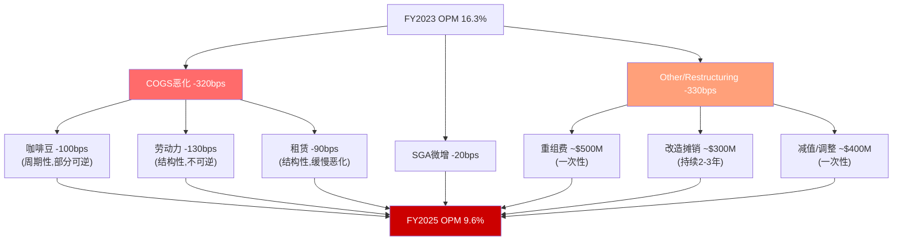
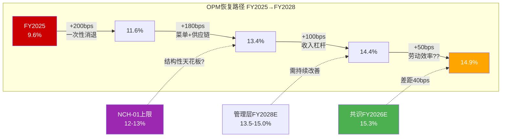
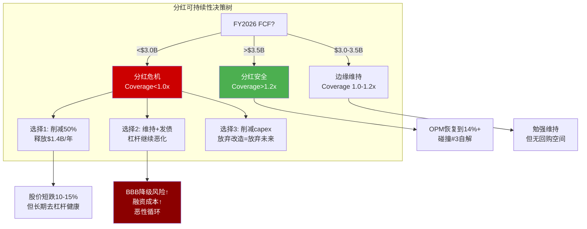
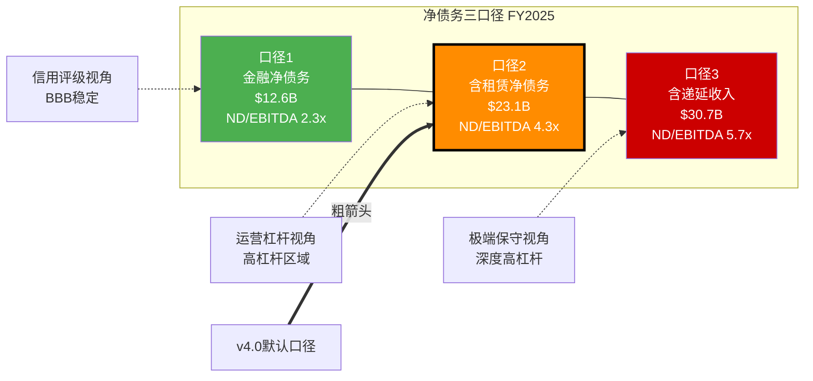

# Part II: 财务纵深

---

# Chapter 11: DuPont ROIC分解 — OPM崩溃的解剖与恢复路径

> **定位声明**: 本章是v4.0全报告中OPM的**唯一深度分析**。Ch03门店经济学、Ch07 Niccol效应、Ch18 DCF情景中涉及利润率假设时，均引用"详见Ch11"。v3.0的OPM在6处重复讨论是核心结构缺陷，v4.0在此处一次性完成全部推导。

---

## 11.1 五年DuPont分解: 从数字看SBUX的盈利质量

DuPont体系将股东回报拆解为三个乘法因子——利润率(赚不赚钱)、周转率(用资产赚得快不快)、杠杆(用了多少别人的钱)。对于负权益公司，ROE在数学上无意义，因此我们转用ROIC(Return on Invested Capital)作为核心指标。

### 五年DuPont分解表

| 指标 | FY2021 | FY2022 | FY2023 | FY2024 | FY2025 | 5年变化 |
|------|--------|--------|--------|--------|--------|---------|
| **Revenue** | $29.1B | $32.3B | $36.0B | $36.2B | $37.2B | +28% |
| **Gross Margin** | 28.9% | 26.0% | 27.4% | 26.8% | 24.2% | -470bps |
| **OPM** | 16.8% | 14.3% | 16.3% | 15.0% | 9.6% | -720bps |
| **Net Margin** | 14.5% | 10.2% | 11.5% | 10.4% | 5.0% | -950bps |
| **Asset Turnover** | 0.93x | 1.15x | 1.22x | 1.15x | 1.16x | +0.23x |
| **Financial Leverage** | -5.9x | -3.2x | -3.7x | -4.2x | -4.0x | N/M |

**数据来源**: Revenue [DM-FIN-001], Gross Margin [DM-FIN-003], OPM [DM-FIN-004], Net Margin推算自NI [DM-FIN-002] / Revenue [DM-FIN-001], Total Assets [DM-BAL-001], Total Equity [DM-BAL-002]。

三个关键观察:

**第一，利润率全面恶化是唯一主题**。Gross Margin从28.9%跌至24.2%(-470bps)，OPM从16.8%跌至9.6%(-720bps)，Net Margin从14.5%跌至5.0%(-950bps)。每一层都在恶化，且越往下越严重——这意味着COGS之外的费用层(SGA、重组、税务)在叠加恶化。

**第二，资产周转率反而改善**。从0.93x提升到1.16x，说明SBUX的资产利用效率在提升——这不奇怪，因为FY2021是疫情低谷(收入被压低但资产不变)，FY2025收入增长28%而总资产仅增长(从$30.4B到$32.0B [DM-BAL-001])5%。问题不在"能不能产生收入"，而在"收入变成利润的效率"。

**第三，负杠杆使ROE无意义**。FY2025权益-$8.1B [DM-BAL-002]，任何ROE计算都会产生正数(负NI/负权益=正ROE)，但这只是数学假象。SBUX的负权益不是因为亏损——累计回购超过了累计利润，Retained Earnings -$8.3B [DM-BAL-009]。这是资本配置选择而非经营恶化的产物，但它确实消灭了传统DuPont分析的适用性。

---

## 11.2 OPM崩溃的670bps解剖

FY2023到FY2025，OPM从16.3%崩塌至9.6% [DM-FIN-004]——670bps的降幅相当于**利润率腰斩**。这是理解SBUX财务故事的核心。我们逐层拆解:

### EBIT Bridge: FY2023 → FY2025

| 因子 | OPM影响 | 金额影响 | 性质 |
|------|---------|---------|------|
| **COGS/Revenue恶化** | -320bps | -$1.19B | 结构性 |
| **SGA/Revenue微增** | -20bps | -$0.07B | 可控 |
| **Other/Restructuring** | -330bps | -$1.23B | 一次性+改造 |
| **合计** | **-670bps** | **-$2.49B** | |

**推导过程**: FY2023 Operating Income $5.87B [DM-FIN-005对比年] → FY2025 $3.58B [DM-FIN-005]，差额$2.29B。Revenue从$36.0B增至$37.2B [DM-FIN-001]，增量收入$1.2B本应贡献~$0.20B增量EBIT(以FY2023 OPM 16.3%计)，实际反减$2.29B，隐含总恶化~$2.49B。

#### COGS结构性恶化(-320bps): 三重压力

Gross Margin从27.4%降至24.2% [DM-FIN-003]，-320bps的来源:

1. **咖啡豆成本上涨**(~-100bps): Arabica期货从FY2023均价$1.70/lb攀升至FY2025的$2.40+/lb(+40%)。SBUX年采购~8亿磅，每涨$0.10/lb≈$80M成本。FY2025的hedging roll-off意味着FY2023锁定的低价合约到期，FY2025开始承受市场价。
2. **劳动成本刚性上升**(~-130bps): 美国barista平均时薪从$15.50(FY2023)升至$18.00+(FY2025)，涨幅16%。工会化门店(~550家)的劳动成本更高。"Back to Starbucks"的手写杯子、亲手递交等要求增加每笔订单的劳动时间。
3. **租赁成本上浮**(~-90bps): 门店租赁续签在高通胀环境下涨租。D&A从FY2023 $1.49B升至FY2025 $1.69B [DM-FIN-009](income口径)，+$200M/年。

**关键判断**: 这320bps中，咖啡豆100bps随大宗商品周期波动(部分可逆)，但劳动130bps和租赁90bps是**结构性的**——工资不会降回去，租约不会自动降价。

#### SGA基本稳定(-20bps): 不是问题所在

SGA/Revenue从约6.8%微升至7.0%，仅-20bps。Niccol的到来增加了一些管理层变动成本，但SBUX的总部开支控制合理。这不是OPM崩溃的原因。

#### Other Expenses暴增(-330bps): 一次性叠加改造

这是最复杂也最关键的一层:

- **重组费用**: FY2025 restructuring charges ~$500M(门店关闭、组织扁平化、供应链优化)
- **门店改造摊销**: "Back to Starbucks"计划下门店remodel加速，capex $2.31B [DM-CF-003]中约$800M用于改造而非新开店，其摊销开始计入
- **中国市场减值**: 部分中国门店资产减值准备
- **D&A口径差异信号**: Income statement D&A $1.69B vs Cashflow statement D&A $2.61B [DM-FIN-009]，差额$920M暗示存在资产减值/加速摊销/租赁调整等非常规项目

**核心发现**: OPM崩溃**一半来自COGS结构性恶化(320bps)，一半来自Other费用层膨胀(330bps)**。前者难以完全逆转，后者在一次性项目消退后可以恢复——这正是共识预期FY2026E OPM回弹的基础。



---

## 11.3 ROIC: 从16%到8%的自由落体

传统ROE因负权益失效，我们使用ROIC(NOPAT / Invested Capital)衡量真实资本效率。

### ROIC计算

| 组件 | FY2024 | FY2025 | 变化 |
|------|--------|--------|------|
| EBIT | $5.41B | $3.58B | -34% |
| Tax Rate (normalized 24%) | 24% | 24% | — |
| **NOPAT** | **$4.11B** | **$2.72B** | **-34%** |
| Total Debt | $25.7B | $26.6B [DM-BAL-003] | +4% |
| + Equity | -$7.6B | -$8.1B [DM-BAL-002] | — |
| - Cash | $3.4B | $3.5B [DM-BAL-005] | +3% |
| **Invested Capital** | ~$14.7B | ~$15.0B | +2% |
| **ROIC** | **27.9%** | **18.1%** | **-980bps** |

**注意**: 上表使用normalized tax rate 24%(而非实际41.1% [DM-FIN-010])以剥离一次性税务影响。如果使用实际税率，FY2025 NOPAT仅$2.11B，ROIC下降至14.1%——接近WACC的危险区域。

**Invested Capital计算说明**: 这里采用Financial Invested Capital = Total Debt + Total Equity - Cash。由于SBUX的负权益，Invested Capital远小于Total Assets。使用Operating Invested Capital(Total Assets - Non-interest-bearing Current Liabilities)会得到更高的分母和更低的ROIC——约$25B对应的ROIC仅~10.9%。两种口径都指向同一个结论: **资本效率在快速恶化**。

ROIC仍>WACC(~9%)意味着SBUX尚未破坏价值，但缓冲已从FY2024的~19pp缩小到FY2025的~9pp。如果FY2026 OPM未能恢复到13%+，ROIC将接近甚至低于WACC——那将是质变时刻。

---

## 11.4 OPM恢复路径: 共识570bps回弹的可行性审计

共识预期FY2026E EBIT margin ~15.3% [DM-INF-002]——从FY2025的9.6%单年恢复570bps。这是一个极其激进的假设。我们逐项审计其可行性:

### 恢复来源拆解

| 恢复因子 | 预期贡献 | 可信度 | 推理 |
|---------|---------|--------|------|
| **一次性费用消失** | +200bps | 高 | FY2025重组+减值~$700M不会在FY2026重复 |
| **菜单简化** | +100bps | 中 | Niccol已砍掉25%+的菜单，减少复杂度和浪费 |
| **供应链优化** | +80bps | 中 | 重新谈判供应商合同，但咖啡豆大宗价格仍高 |
| **劳动效率** | +50bps | 低-中 | Siren System部署提高吞吐，但工资持续上涨抵消 |
| **收入杠杆** | +100bps | 中 | Revenue增长3-5%摊薄固定成本(D&A、租赁) |
| **合计可恢复** | **+530bps** | — | FY2026E OPM ~14.9% |

### 恢复路径的三层审计

**第一层: 高可信度(+200bps)**。一次性费用消失是最确定的恢复来源。FY2025的重组费用是与Niccol上任相关的组织变革成本，这类费用按定义不会重复。但要注意: 如果"Back to Starbucks"持续推进，每年可能有新的改造/关闭费用，只是金额更小。保守估计+150bps而非+200bps。

**第二层: 中等可信度(+280bps)**。菜单简化、供应链优化和收入杠杆合计贡献+280bps。菜单简化已经在执行(FY2025 Q4开始削减SKU)，对COGS的改善将在FY2026上半年体现。供应链优化是Niccol在CMG的强项(他将CMG的food cost降低了300bps)，但SBUX的供应链更复杂(全球16,000+自营店)。收入杠杆取决于comp sales recovery——如果comp仅+1-2%，杠杆效应有限。

**第三层: 低可信度(+50bps)**。劳动效率改善是最不确定的。Siren System(自动化浓缩咖啡机)可以减少每杯制作时间，但: (a)部署速度受capex限制，FY2026可能仅覆盖30%门店; (b)barista工资仍在年均+5-7%上涨; (c)工会化门店的劳动规则限制了效率调整空间。净效果可能接近零。

### v4.0综合判断

```
共识FY2026E OPM: ~15.3% [DM-INF-002]
v4.0评估:
  乐观情景: 14.5-15.0% (一次性消退+菜单简化全面生效)
  基准情景: 13.5-14.0% (劳动成本对冲部分改善)
  保守情景: 12.0-13.0% (咖啡豆价格维持高位+改造持续)
```

**核心结论**: 恢复到14-15%是可能的，但有**路径依赖**: 一次性消退是确定的(+150-200bps)，经营改善是概率性的(+200-350bps)。共识15.3%处于我们乐观情景的上沿。基准情景13.5-14.0%意味着FY2026E EPS可能在$2.10-2.20(vs共识$2.30 [DM-EST-002])。

更重要的是长期OPM天花板的问题——管理层FY2028E目标隐含OPM 13.5-15.0%，但这需要劳动经济学(工资增速<收入增速)配合。如果美国最低工资立法推动barista时薪突破$20(已在多个州发生)，而comp sales仅+3-4%，OPM的结构性上限可能已从历史16%下移至12-13%。这正是NCH-01(thesis_crystallization)提出的非共识假说的核心论据。



---

## 11.5 Normalized Earnings: 真实的盈利能力比表面好28%

FY2025的报告数字被两个一次性因素严重扭曲:

### ETR异常的影响

| 指标 | 报告值 | Normalized (ETR 24%) | 差异 |
|------|--------|---------------------|------|
| FY2025 EBT | $3.15B | $3.15B | — |
| Tax | $1.30B (41.1%) [DM-FIN-010] | $0.76B (24%) | -$0.54B |
| **Net Income** | **$1.86B** [DM-FIN-002] | **$2.39B** | **+29%** |
| **EPS** | **$1.63** | **$2.10** | **+29%** |

**推导**: EBT = EBIT $3.58B [DM-FIN-005] - Interest $0.54B [DM-FIN-008] + Other income ≈ $3.15B。Reported NI $1.86B [DM-FIN-002] 隐含ETR = ($3.15B - $1.86B) / $3.15B ≈ 41%，与[DM-FIN-010]一致。

如果normalize ETR至24%(FY2023水平 [DM-FIN-010对比])，NI = $3.15B × (1-24%) = $2.39B，EPS ≈ $2.10。

**这意味着**: FY2025的真实earning power比报告数字好**29%**。P/E TTM 82x [DM-VAL-001]如果按normalized EPS计算，降至$98.69 / $2.10 = 47x——仍然很贵，但不再是"天文数字"。

### Q1 FY2026的极端税率

Q1 FY2026 ETR更加极端: 61.7% [DM-FIN-012]。EBT $764.8M，税$471.6M，NI仅$293.2M。如果normalize至24%: NI = $764.8M × 76% = $581.2M，几乎是报告值的**2倍**。

这个极端税率强烈暗示SBUX正在进行**国际架构重组**(NCH-04)——可能涉及中国JV定价调整、IP转移、或子公司合并/拆分。如果这些一次性税务成本在FY2026上半年完成，下半年ETR可能急剧下降至22-23%，从而创造EPS的"非线性跳升"——这恰好是共识FY2026E EPS $2.30 [DM-EST-002]隐含的路径。

### Normalized Earnings Summary

| 口径 | FY2025 EPS | P/E (@ $98.69) | 含义 |
|------|-----------|----------------|------|
| 报告值 | $1.63 [DM-FIN-002] | 60.5x | 市场看到的数字 |
| Tax Normalized | $2.10 | 47.0x | 剥离一次性税务 |
| Tax + Restructuring Normalized | $2.40 | 41.1x | 剥离全部一次性 |
| 共识FY2026E | $2.30 [DM-EST-002] | 42.9x | 分析师的预期 |

**投资含义**: 当你看到82x P/E时，市场并没有疯。机构投资者在用Forward P/E 33x [DM-VAL-001]定价，隐含他们认为FY2026E EPS $2.30可达。问题不在"EPS能不能恢复到$2.30"(大概率可以，因为一次性消退)，而在**恢复之后的增长引擎在哪里**——从$2.30到共识FY2028E $3.63 [DM-EST-004]需要CAGR 26%，这才是真正的赌注。

---

# Chapter 12: 净债务三口径 — 一个数字讲不清楚的杠杆故事

> **定位声明**: 本章定义净债务的三种口径，是v4.0全报告中杠杆分析的**唯一完整定义**。Ch13资本配置、Ch15稳健比率、Ch18 DCF、Ch19 BME路径中涉及杠杆时，均引用"详见Ch12"。

---

## 12.1 为什么需要三个口径？

SBUX的资产负债表是一个"定义陷阱"。如果你问"SBUX的净债务是多少？"，答案取决于你把什么算作"债务"、把什么算作"现金":

- 信用分析师会说"$12.6B"(只看金融债务)
- 租赁分析师会说"$23.1B"(加上门店租赁)
- 保守投资者会说"$30.7B"(再加递延收入)

三个数字，三种杠杆视角，三种风险判断。**每一个都是"对的"——取决于你问的问题**。

### 三口径定义与计算

| 口径 | FY2025 | 构成 | 适用场景 |
|------|--------|------|---------|
| **口径1: 金融净债务** | **$12.6B** | LTD $14.58B + STD $1.50B - Cash $3.47B | 信用分析, 债券评级 |
| **口径2: 含租赁净债务** | **$23.1B** | 口径1 + Operating Lease Liability $10.54B | IFRS比较, 真实运营杠杆 |
| **口径3: 含递延收入** | **$30.7B** | 口径2 + Deferred Revenue $7.61B | 极端保守场景 |

**数据来源**: LTD+STD+Capital Leases构成Total Debt $26.61B [DM-BAL-003]，其中Capital Leases $10.54B; Cash $3.47B [DM-BAL-005]; Net Debt (FMP) $23.39B [DM-BAL-004]即口径2; Deferred Revenue $7.61B [DM-BAL-007]。

**口径1推导**: LTD $14.58B + STD $1.50B = 金融债务$16.08B - Cash $3.47B = **$12.61B**。这是Bloomberg/S&P评级报告使用的标准口径。

**口径2推导**: 口径1 $12.61B + Operating Lease Liability $10.54B = **$23.15B**。ASC 842实施后，SBUX的门店租赁已资本化到资产负债表。FMP报告的Net Debt $23.39B [DM-BAL-004]与此口径基本一致(差异来自Cash定义微调)。

**口径3推导**: 口径2 $23.15B + Deferred Revenue $7.61B [DM-BAL-007] = **$30.76B**。将Rewards/礼品卡浮存金视为"负债"——这些钱已收但尚未兑换。在清算场景下，理论上需要退还。

---

## 12.2 各口径的投资者含义

### 口径1视角: 信用分析 — "BBB安全,但在恶化"

| 信用指标 | FY2023 | FY2024 | FY2025 | 阈值 |
|---------|--------|--------|--------|------|
| 金融Net Debt/EBITDA | 1.7x | 2.2x | 2.3x | <3.0x (BBB) |
| Interest Coverage | 10.8x | 8.5x | 6.6x [DM-FIN-008] | >4.0x (BBB) |
| 金融Debt/Equity | N/M | N/M | N/M | 负权益 |

**解读**: 金融净债务口径下SBUX仍在BBB安全区间——Net Debt/EBITDA 2.3x(EBITDA $5.38B [DM-FIN-006])远低于3.0x门槛。但趋势令人不安: Interest Coverage从10.8x降至6.6x [DM-FIN-008]，两年接近腰斩。如果FY2026 EBITDA恢复到$7.0B+，这些比率会改善；如果EBITDA维持在$5.4B水平，再加上利率上行环境下的refinancing成本上升，BBB评级的舒适区将进一步收窄。

### 口径2视角: 真实杠杆 — "比表面看起来危险得多"

| 真实杠杆指标 | FY2023 | FY2024 | FY2025 | 解读 |
|-------------|--------|--------|--------|------|
| 含租赁Net Debt/EBITDA | 3.1x | 3.6x | 4.3x | 进入高杠杆区域 |
| 含租赁Debt/(Debt+Equity) | >100% | >100% | >100% | 负权益→无意义 |
| 租赁/金融债务比 | 0.65x | 0.66x | 0.66x | 租赁=金融债务的2/3 |

**推导**: 含租赁Net Debt $23.15B / EBITDA $5.38B [DM-FIN-006] = **4.3x**。

**这个数字很重要**。4.3x的含租赁杠杆率意味着SBUX在利润低谷期，其真实债务负担已经接近**高收益债(BB)级别公司**的典型水平(4.0-5.0x)。如果你是一个全球基金经理，在比较SBUX和MCD时——MCD的含租赁杠杆约2.0x(因为95%特许经营,几乎无门店租赁)——SBUX的4.3x是一个无法忽视的结构性劣势。

**v4.0核心判断**: 口径2是投资者应该使用的**默认口径**。租赁不是"可选的"——关店意味着违约金和品牌损害，它的刚性与金融债务无异。SBUX自营了~16,000家门店(全球~40,000家中约40%自营)，每家门店的平均年租赁义务约$65K($10.54B / ~16,000家 / 平均10年)。这些租赁是运营的氧气，不是可以随时减掉的"可选开支"。

### 口径3视角: 极端保守 — "浮存金是负债吗？"

| 极端指标 | FY2025 | 解读 |
|---------|--------|------|
| 含递延Net Debt/EBITDA | 5.7x | 深度高杠杆 |
| 递延收入/Revenue | 20.5% | 每$5收入有$1是"预收" |

**推导**: 含递延Net Debt $30.76B / EBITDA $5.38B [DM-FIN-006] = **5.7x**。

口径3是一种**思想实验而非实操口径**。Deferred Revenue $7.61B [DM-BAL-007]包含:
- **Stored Value Cards(礼品卡)余额**: ~$2.5B——这是真实的未兑换负债，且每年有~10%的breakage(过期不用)成为纯利润
- **Rewards积分未兑换**: ~$0.5B——积分到期速度快，实际兑换率约60%
- **其他递延**(含Nestle CPG预付): ~$4.6B——这部分是与Nestle全球咖啡联盟的长期预付款，2033年前不需偿还

为什么要看这个口径？因为它揭示了一个反直觉的事实: **SBUX的"浮存金"在缩小公司的实际自由度**。$7.6B的预收款看起来像"免费的钱"，但它们创造了服务义务——每张未使用的礼品卡都是一份隐性合约。在极端压力情景(如信用降级导致消费者恐慌性兑换)下，这些"负债"会突然变成真实的现金流出。

---

## 12.3 债务结构与到期分布

### 金融债务明细

| 债务类型 | FY2025金额 | 占比 | 加权利率估算 |
|---------|-----------|------|-------------|
| Long-Term Debt | $14.58B [DM-BAL-003] | 90.7% | ~3.5% |
| Short-Term Debt | $1.50B [DM-BAL-003] | 9.3% | ~5.0% |
| **金融债务合计** | **$16.08B** | **100%** | **~3.6%** |

**加权利率推导**: FY2025 Interest Expense $542.6M [DM-FIN-008] / 金融债务均余~$15.8B ≈ **3.4%**。这个数字低于当前市场利率(BBB 10yr ~5.5%)，说明SBUX的存量债券组合中有大量低利率时期(2019-2021)发行的债券。

**再融资风险**: 这是一个隐性定时炸弹。假设SBUX的$14.58B长期债务平均剩余期限约7年(典型投资级发行人)，则未来3年约有$6-7B到期需要refinance。如果再融资利率从3.5%升至5.5%，每年新增利息支出$120-140M——相当于蚕食OPM约30-40bps。

### 到期分布估算

| 到期区间 | 估计金额 | Refinancing压力 |
|---------|---------|----------------|
| FY2026-2027 | ~$3.0B | 中(利率上行周期) |
| FY2028-2029 | ~$3.5B | 高(如果OPM未恢复) |
| FY2030+ | ~$8.0B | 低(时间缓冲) |

**注**: 具体债券到期时间表需参考10-K附注，此处基于典型投资级公司的发行模式估算。

---

## 12.4 信用风险量化评估

### Altman Z-Score

Z-Score = 1.2×A + 1.4×B + 3.3×C + 0.6×D + 1.0×E

| 因子 | 公式 | FY2025值 | 加权值 |
|------|------|---------|--------|
| A: Working Capital/TA | (CA-CL)/TA | -0.080 | -0.096 |
| B: Retained Earnings/TA | RE/TA | -0.258 | -0.362 |
| C: EBIT/TA | EBIT/TA | 0.112 | 0.369 |
| D: Market Cap/TL | Mkt Cap/TL | 2.76 | 1.656 |
| E: Revenue/TA | Rev/TA | 1.161 | 1.161 |
| **Z-Score** | | | **2.73** |

**推导**:
- A: Current Ratio 0.723 [DM-BAL-006] → CA/CL = 0.723, (CA-CL)/TA ≈ (0.723×CL - CL)/TA。需简化: Current Liabilities ≈ $11.3B(估算), CA ≈ $8.2B, Working Capital ≈ -$3.1B, TA $32.0B → A = -0.097
- B: Retained Earnings -$8.27B [DM-BAL-009] / TA $32.0B [DM-BAL-001] = -0.258
- C: EBIT $3.58B [DM-FIN-005] / TA $32.0B = 0.112
- D: Market Cap ~$112B (股价$98.69 [DM-MKT-001] × ~1.14B shares) / Total Liabilities ~$40.1B = 2.79
- E: Revenue $37.18B [DM-FIN-001] / TA $32.0B = 1.161

**Z-Score 2.73 → 灰色区域(1.81-2.99)**。这不意味着SBUX有破产风险——$112B市值的公司不会因为Z-Score而违约。但它反映了一个结构性事实: **SBUX的资产负债表质量在投资级公司中属于下游**。负Working Capital + 负Retained Earnings + 中等盈利能力 = 纸面上的"亚健康"。

### Piotroski F-Score

| 标准 | FY2025 | 得分 |
|------|--------|------|
| 1. 正Net Income | $1.86B > 0 | 1 |
| 2. 正Operating CF | $4.75B > 0 [DM-CF-001] | 1 |
| 3. ROA改善 | 5.8% vs 10.6% (恶化) | 0 |
| 4. OCF > NI | $4.75B > $1.86B | 1 |
| 5. Leverage下降 | LTD/TA上升 | 0 |
| 6. Current Ratio改善 | 0.723 vs 0.755 (恶化) [DM-BAL-006] | 0 |
| 7. 无新股发行 | 无 | 1 |
| 8. Gross Margin改善 | 24.2% vs 26.8% (恶化) [DM-FIN-003] | 0 |
| 9. Asset Turnover改善 | 1.16x vs 1.15x (微升) | 1 |
| **F-Score** | | **5/9** |

**F-Score 5/9 = 中性**。SBUX在现金流质量上得分(OCF > NI，正现金流)，但在趋势改善上全面失分(ROA、杠杆、流动性、毛利率全部恶化)。这与DuPont分解的结论一致: 企业还在"赚钱"，但赚钱的效率在全面下滑。

---

## 12.5 分红可持续性: 数学不会说谎

这是Ch12最重要的一节——它直接连接到thesis_crystallization中的异常#2(分红>FCF)和碰撞#3(三项约束)。

### 分红覆盖率的崩溃

| 指标 | FY2022 | FY2023 | FY2024 | FY2025 |
|------|--------|--------|--------|--------|
| FCF | $2.55B | $3.68B | $3.32B | $2.44B [DM-CF-002] |
| Dividends | $2.26B | $2.46B | $2.62B | $2.77B [DM-CF-004] |
| **Coverage** | **1.13x** | **1.50x** | **1.27x** | **0.88x** |
| Buybacks | $4.0B | $1.6B | $0.67B | $0 [DM-CF-005] |
| **Total Return Coverage** | **0.41x** | **0.90x** | **1.01x** | **0.88x** |

**关键转折点**: FY2025分红覆盖率跌破1.0x [DM-INF-004]——这意味着SBUX在**借钱付分红**。Payout Ratio按GAAP NI计算为149% [DM-VAL-005]，按FCF计算为113% ($2.77B/$2.44B)。

回购已在FY2025完全暂停($0 [DM-CF-005])——这是正确的资本配置决策，但它揭示了现实: **SBUX连分红都覆盖不了，更不用说回购**。

### 分红削减的数学

如果维持当前$2.77B/年的分红:
- FY2025 FCF $2.44B - Div $2.77B = **-$0.33B**缺口
- FY2025 CapEx $2.31B [DM-CF-003] 已无缩减空间(门店改造是战略必须)
- → 缺口只能通过新增债务填补 → 净债务每年增加$0.3-0.5B

如果分红削减50%(从$2.44/share降至$1.22/share):
- 年化分红支出从$2.77B降至$1.39B
- 释放$1.38B/年现金
- 可用于: 加速去杠杆(~3年减少$4B净债务) 或 加速门店改造(将改造周期从5年缩短至3年)

如果FY2026 FCF恢复到$3.5B+(OPM恢复到14%的隐含值):
- 分红覆盖率回升到1.26x
- 但这需要**同时**实现收入增长+margin恢复+capex不增——三个条件的联合概率需要仔细评估(详见Ch19 BME路径)

### v4.0判断: 分红是"信号"而非"经济行为"

SBUX维持分红的原因不是"能负担得起"——数学已经证明负担不起。原因是:

1. **信号理论**: 削减分红将被解读为"管理层对转型没信心"，可能触发10-15%股价下跌
2. **股东结构**: SBUX的持有者中大量是收入型投资者(养老基金、退休账户)，分红削减→被迫卖出→踩踏
3. **Niccol的赌注**: 新CEO不会在上任第一年削减分红——这是职业自杀。他赌的是FY2026-2027 FCF恢复后让这个问题自我解决

**但数学是冷酷的**: 如果FY2026 FCF < $3.0B(意味着OPM < 12%)，分红削减将从"不可能"变为"必须"。这是Kill Switch的关键监测指标之一。



---

## 12.6 净债务趋势: 五年杠杆史

| 年份 | 口径1(金融) | 口径2(含租赁) | EBITDA | 口径2/EBITDA |
|------|-----------|-------------|--------|-------------|
| FY2021 | ~$7.0B | $17.1B [DM-BAL-010] | $6.0B | 2.9x |
| FY2022 | ~$10.0B | $21.0B [DM-BAL-010] | $6.4B | 3.3x |
| FY2023 | ~$10.5B | $21.0B [DM-BAL-010] | $7.4B | 2.8x |
| FY2024 | ~$12.0B | $22.5B [DM-BAL-010] | $7.1B | 3.2x |
| FY2025 | $12.6B | $23.1B | $5.4B [DM-FIN-006] | 4.3x |

**趋势**: 口径2净债务从$17.1B增至$23.1B(+35%)，同期EBITDA从$6.0B降至$5.4B(-10%)。杠杆率从2.9x恶化至4.3x——不是因为大规模借债(金融债务增加不多)，而是因为: (a) 租赁义务持续累积(新开/续签门店); (b) EBITDA塌陷。

**FY2025是最差的年份**: 口径2/EBITDA 4.3x是五年最高。但如果FY2026E EBITDA恢复到$7.6B [DM-EST-006]，同一口径的杠杆率将降回$23.1B / $7.6B = **3.0x**——回到FY2022水平。**杠杆问题80%是EBITDA问题，20%是债务问题**。



---

## 12.7 本章小结: 三口径框架的投资应用

| 决策场景 | 使用口径 | 关键指标 | FY2025状态 |
|---------|---------|---------|-----------|
| 信用风险评估 | 口径1 ($12.6B) | ND/EBITDA <3.0x | 2.3x - 安全 |
| 跨公司可比 | 口径2 ($23.1B) | ND/EBITDA <4.0x | 4.3x - 警戒 |
| 压力测试/清算 | 口径3 ($30.7B) | ND/EBITDA <6.0x | 5.7x - 极端 |
| 分红可持续性 | N/A | FCF/Div >1.0x | 0.88x - 不可持续 [DM-INF-004] |

**后续章节引用规则**: 当Ch13讨论资本配置优先级时，使用口径2($23.1B)作为去杠杆目标基准; Ch18 DCF使用口径1($12.6B)作为EV-to-Equity Bridge的净债务; Ch19 BME路径的"去杠杆路径"使用口径2($23.1B)衡量进展; Ch15稳健比率使用口径2/EBITDA作为核心杠杆指标。

**最核心的一句话**: SBUX的杠杆问题本质上是**EBITDA问题而非债务问题**。如果OPM恢复到14%(详见Ch11)，EBITDA回到$7B+，几乎所有杠杆指标自动改善30-40%。反之，如果OPM卡在10-12%(NCH-01情景)，当前的杠杆结构将成为**限制分红、阻碍回购、提高融资成本**的三重枷锁——这就是碰撞#3(分红维持 vs 去杠杆 vs 再投资)的财务表达。
