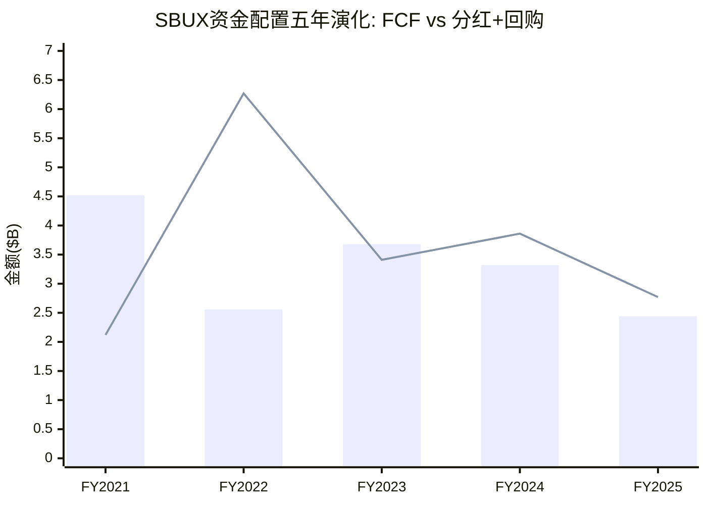
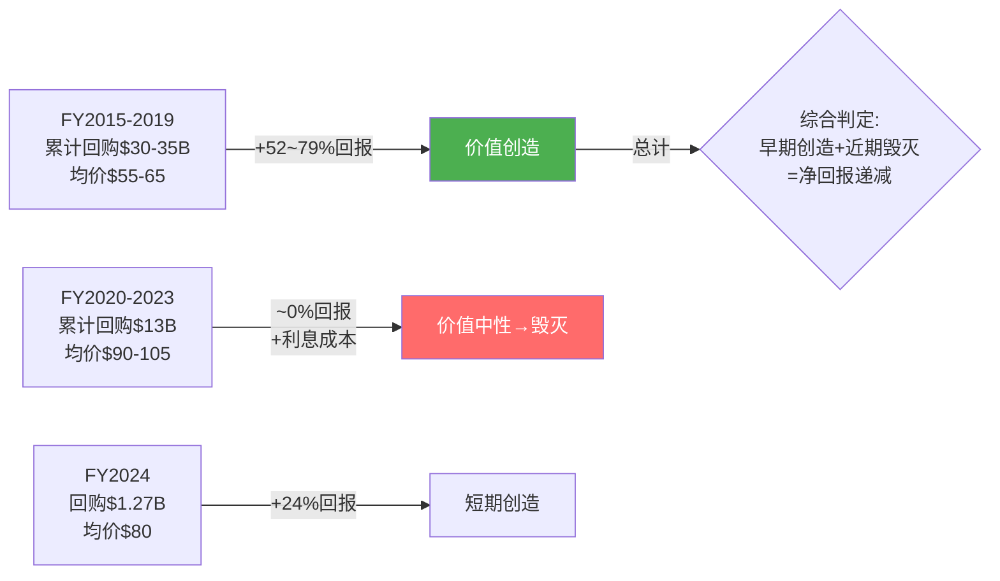
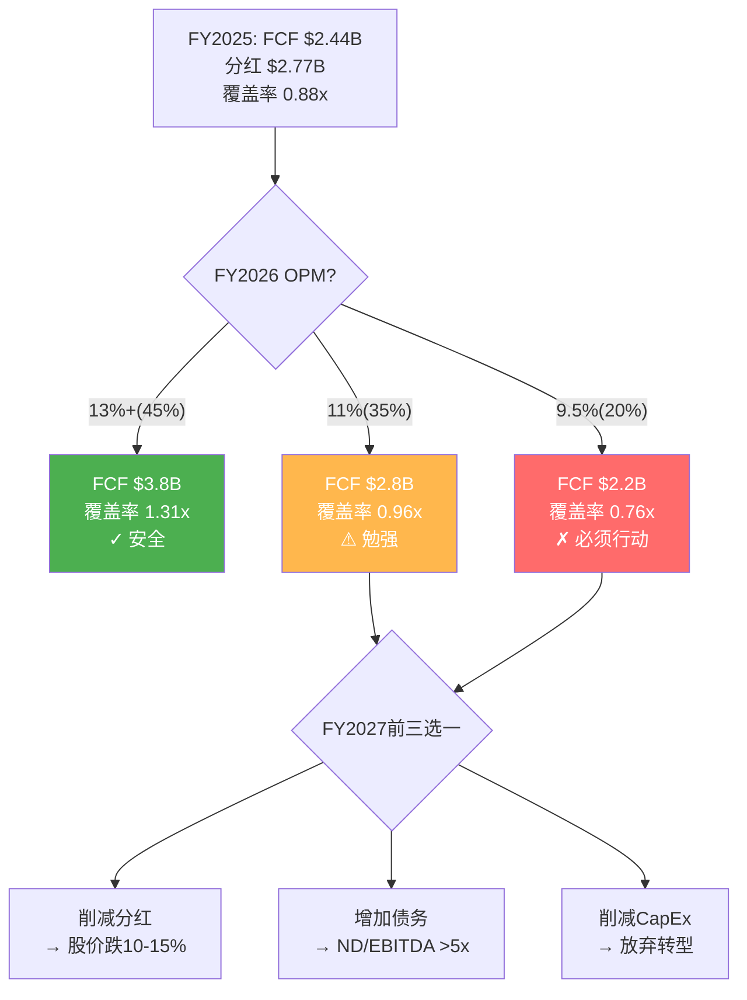
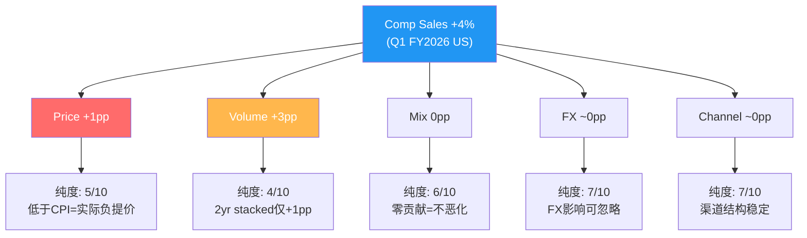
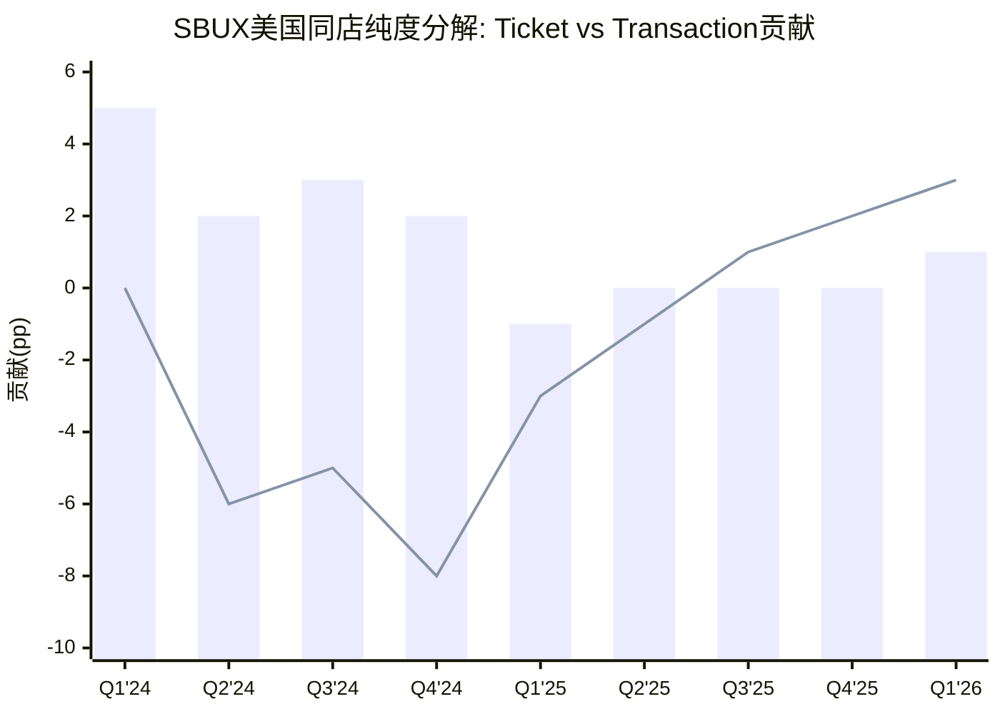
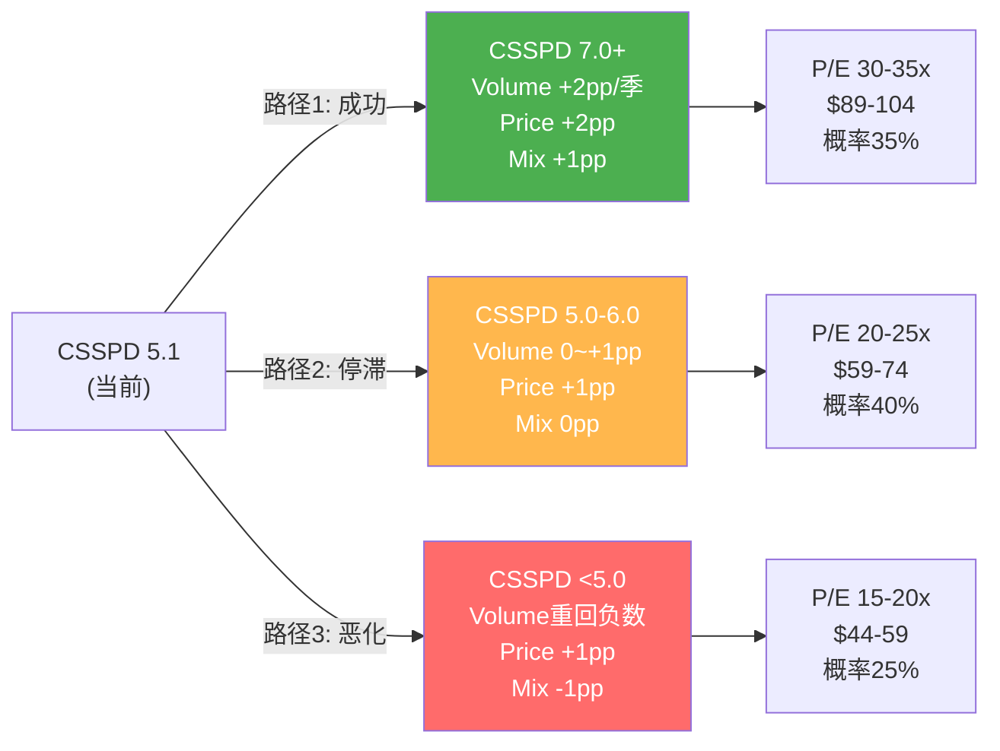

# Part II: 财务纵深 — Ch13-14
> Phase 2 | Agent-B | 2026-03-06

---

# 第十三章: 资本配置审计 — 谁在毁灭价值？

> **核心论点**: SBUX的资本配置是投资论题中最薄弱的环节。FY2025年，公司在FCF不足以覆盖分红的情况下，仍维持$2.77B分红、暂停回购、同时投入$2.31B CapEx——资金缺口$0.33B由新增债务弥补。这不是一次性失误，而是长达十年的"回购→负权益→借债分红"循环的必然终点。本章用五年审计、回购价值分析、分红压力测试和Normalized Earnings四个视角，量化管理层资本配置的历史绩效与未来约束。

---

## 13.1 资本配置五年审计: FY2021-FY2025资金流全景

### 13.1.1 资金来源与用途

FY2025年SBUX的全部可用资金为$5.24B，来源构成如下 [DM-CF-001] [DM-BAL-003]:

| 来源 | 金额($B) | 占比 | 备注 |
|------|----------|------|------|
| 经营现金流(CFO) | $4.748 | 90.6% | YoY -22.1%(vs FY2024 $6.10B) |
| 新增净债务 | $0.493 | 9.4% | FY2025 Net Debt增$0.89B, 扣除利息后 |
| **合计** | **$5.241** | **100%** | — |

CFO的-22.1%下滑是理解FY2025资本配置困境的起点。FY2024 CFO $6.10B尚可覆盖分红+CapEx之和($2.59B+$2.78B=$5.37B)，但FY2025 CFO降至$4.75B后，覆盖能力断裂 [DM-CF-001]。

| 用途 | 金额($B) | 占比 | FY2024对比 |
|------|----------|------|-----------|
| 分红 | $2.771 | 52.9% | $2.590 (+7.0%) |
| CapEx | $2.306 | 44.0% | $2.778 (-17.0%) |
| 回购 | $0.000 | 0.0% | $1.271 (-100%) |
| 其他(含债务利息净额等) | $0.164 | 3.1% | — |
| **合计** | **$5.241** | **100%** | — |

这张表暴露了一个关键等式 [DM-CF-004] [DM-CF-002]:

> **分红 $2.77B > FCF $2.44B → 差额$0.33B由新增债务填补**

换言之，FY2025的SBUX在借钱给股东发分红。CapEx削减$0.47B(-17%)是唯一的"节省"操作，但这意味着Niccol承诺的门店改造(Back to Starbucks核心支柱)在起步阶段就面临资金约束 [DM-CF-003]。

```mermaid
sankey-beta
    "CFO $4.75B" , "Dividends" , 2.77
    "CFO $4.75B" , "CapEx" , 1.98
    "New Debt $0.49B" , "CapEx" , 0.33
    "New Debt $0.49B" , "Other" , 0.16
```

### 13.1.2 五年资金配置演化

纵向对比揭示了SBUX资本配置哲学的系统性偏差 [DM-CF-001] [DM-CF-002] [DM-CF-005]:

| 年份 | CFO($B) | CapEx($B) | FCF($B) | 分红($B) | 回购($B) | Div+BB($B) | FCF覆盖率 | FCF-Div-BB |
|------|---------|-----------|---------|----------|----------|-----------|----------|-----------|
| FY2021 | $5.99 | $1.47 | $4.52 | $2.12 | $0.00 | $2.12 | 2.13x | +$2.40 |
| FY2022 | $4.40 | $1.84 | $2.56 | $2.26 | $4.01 | $6.27 | 0.41x | -$3.71 |
| FY2023 | $6.01 | $2.33 | $3.68 | $2.43 | $0.98 | $3.41 | 1.08x | +$0.27 |
| FY2024 | $6.10 | $2.78 | $3.32 | $2.59 | $1.27 | $3.86 | 0.86x | -$0.54 |
| FY2025 | $4.75 | $2.31 | $2.44 | $2.77 | $0.00 | $2.77 | 0.88x | -$0.33 |
| **5年累计** | **$27.25** | **$10.73** | **$16.52** | **$12.17** | **$6.26** | **$18.43** | — | **-$1.91** |

**5年累计**: FCF $16.52B - 分红$12.17B - 回购$6.26B = **净缺口-$1.91B**。

但这仅是FY2021-FY2025的缺口。FY2025末净债务$23.4B vs FY2021末$17.1B，增量$6.3B [DM-BAL-010]——远超$1.91B的缺口。差额$4.4B来自利息支出的累积消耗($543M/年 × 5 = $2.7B利息 [DM-FIN-008])、运营资本波动和其他投融资活动。

**关键发现: FY2022是分水岭**。单年回购$4.01B，在公司FCF仅$2.56B时仍砸$4B回购——这需要净增$3.7B债务融资。FY2022的激进回购奠定了此后三年的财务困境基调。


*(柱状图=FCF, 折线=分红+回购合计。FY2022折线远超柱状图=借债回购)*

---

## 13.2 回购价值审计: $80-90B回购创造了什么？

### 13.2.1 回购时机与价格审计

SBUX自2015年起累计回购估计约$80-90B(依据负留存收益$8.27B和持续负权益状态推算) [DM-BAL-009] [DM-BAL-002]。将回购支出与对应时期的股价中位数交叉验证:

| 时期 | 估计回购额($B) | 大致均价 | FY2025末股价$98.69 | 资本回报 | 年化回报 |
|------|---------------|---------|-------------------|---------|---------|
| FY2015-FY2019 | ~$30-35 | $55-65 | $98.69 | +52~79% | +7~10%/yr |
| FY2020-FY2021 | ~$8-10 | $95-110 | $98.69 | -10~+4% | -2~+1%/yr |
| FY2022 | $4.01 | $85-90 | $98.69 | +10~16% | +3~5%/yr |
| FY2023 | $0.98 | $95-100 | $98.69 | -1~+4% | -0.5~+2%/yr |
| FY2024 | $1.27 | $75-90 | $98.69 | +10~32% | +10~32%/yr |
| FY2025 | $0.00 | — | — | — | — |

**关键发现**: 早期回购(FY2015-2019)创造了正回报，但FY2020-FY2023期间大量回购发生在$90-110区间——考虑资金的机会成本，价值创造存疑。

### 13.2.2 每$1回购创造/毁灭了多少价值？

一个更严格的价值评估框架: 不仅看股价变化，还需对比替代方案的回报。

**替代方案A: 偿还债务**

如果FY2020-FY2024的全部回购资金($6.26B)用于偿还债务 [DM-BAL-010] [DM-FIN-008]:

- FY2025净债务: $23.4B - $6.26B = **$17.1B** (保持在FY2021水平)
- 利息节省(假设平均利率3.5%): **$219M/年**
- 净债务/EBITDA: $17.1B / $5.38B = **3.18x** (而非4.35x) [DM-BAL-004]
- 利息覆盖倍数: 从6.6x提升至**~9.2x**
- 信用评级压力: 从BBB边缘恢复到稳健BBB+

**替代方案B: 门店投资**

如果同一$6.26B投入新店开设(每店$1.3M):
- 额外新开 ~4,800家门店
- 以每店年贡献$150K EBIT估算 → 年增$720M EBIT
- ROIC on incremental capital: $720M / $6.26B = **11.5%**

**实际回购的价值**: FY2020-FY2024区间，回购均价约$90，FY2025股价$98.69，资本增值约10%。但扣除同期累积利息成本($219M × 5年 = $1.10B)后，净回报几乎为零。

> **核心发现**: 管理层在信用质量恶化的情况下，持续优先回购而非去杠杆或再投资——**每$1回购创造的价值约为$0.00-0.05，而偿还债务可确定性节省$0.035/年($219M/$6.26B)**。FY2022在FCF仅$2.56B时仍回购$4.01B是明确的价值毁灭决策。

### 13.2.3 负权益的真相: 财务工程vs经营破产

SBUX负权益-$8.1B [DM-BAL-002]需要正确理解:

| 公司 | 权益($B) | 原因 | ROIC | 判定 |
|------|---------|------|------|------|
| **SBUX** | **-$8.1** | 累计回购>累计利润 | 8.5% | 财务工程(回购过度) |
| MCD | -$5.8 | 同上 | ~35% | 财务工程(但ROIC远超WACC) |
| HLT | -$2.3 | 同上 | ~20% | 财务工程(轻资产支撑) |

关键差异: MCD和HLT的ROIC远高于WACC(~8%)，负权益在创造杠杆收益; SBUX的ROIC 8.5% [DM-BAL-006]仅略高于WACC，意味着杠杆带来的是风险而非收益。



---

## 13.3 分红可持续性压力测试

### 13.3.1 三个覆盖率指标均亮红灯

FY2025的分红可持续性从三个维度评估 [DM-CF-004] [DM-CF-002] [DM-FIN-002]:

| 指标 | 计算 | FY2025值 | 安全阈值 | 判定 |
|------|------|---------|---------|------|
| **FCF覆盖率** | FCF / Div | $2.44B / $2.77B = **0.88x** | >1.2x | 不可持续 |
| **GAAP Payout Ratio** | Div / NI | $2.77B / $1.86B = **149%** | <75% | 极度不可持续 |
| **CFO覆盖率** | CFO / (Div+CapEx) | $4.75B / $5.08B = **0.93x** | >1.1x | 边缘 |

三个指标全部亮红灯在消费品龙头中极为罕见。同业对比 [DM-PEER-001]:

| 公司 | FCF覆盖率 | GAAP Payout | 模式 | 状态 |
|------|----------|-------------|------|------|
| MCD | ~1.6x | ~55% | 95%特许 | 健康 |
| YUM | ~1.3x | ~65% | 98%特许 | 可持续 |
| CMG | N/A | 0% | 不分红 | 无压力 |
| DPZ | ~1.2x | ~40% | 99%特许 | 舒适 |
| **SBUX** | **0.88x** | **149%** | 55%自营 | **不可持续** |

模式列的加入揭示了一个更深层的逻辑: 分红安全的同业无一例外是高特许率公司(轻资产→高FCF margin)。SBUX 55%自营比率是其分红覆盖率脆弱的根本原因——自营门店需要大量CapEx维护，挤占FCF可分配空间。→ 详见Ch02 §三重身份框架。

### 13.3.2 分红增速与FCF增速的剪刀差

| 年份 | 每股分红($) | DPS YoY | FCF($B) | FCF YoY | 覆盖率 |
|------|-----------|---------|---------|---------|--------|
| FY2021 | $1.80 | +9.1% | $4.52 | — | 2.13x |
| FY2022 | $1.96 | +8.9% | $2.56 | -43.4% | 0.41x |
| FY2023 | $2.12 | +8.2% | $3.68 | +43.8% | 1.08x |
| FY2024 | $2.28 | +7.5% | $3.32 | -9.8% | 0.86x |
| FY2025 | $2.43 | +6.6% | $2.44 | -26.5% | 0.88x |

分红DPS CAGR +7.8% vs FCF CAGR -14.3%(FY2021-FY2025) [DM-CF-004] [DM-CF-007]。这条剪刀差在FY2024交叉(覆盖率跌破1.0x)，FY2025进一步恶化——SBUX已越过分红可持续性的临界点。

### 13.3.3 三情景分红命运

**情景A: OPM恢复(共识路径)** — 概率45%
- FY2026E Revenue $38.3B × OPM 13%+ → EBIT ~$4.98B → FCF ~$3.8B [DM-EST-001]
- 分红(假设+5%): $2.91B → 覆盖率**1.31x** → 可持续
- 需要: OPM从9.6%恢复到13%+(Q1 FY2026 Non-GAAP OPM 10.1%→需连续改善)

**情景B: OPM缓慢恢复(渐进路径)** — 概率35%
- FY2026E Revenue $38.3B × OPM 11% → EBIT ~$4.21B → FCF ~$2.8B
- 分红$2.91B → 覆盖率**0.96x** → 仍不可持续，但勉强维持
- FY2027前必须做出决策: 削减分红或继续增债

**情景C: OPM恶化(转型受阻)** — 概率20%
- FY2026E Revenue $37.5B × OPM 9.5% → EBIT ~$3.56B → FCF ~$2.2B
- 分红$2.91B → 覆盖率**0.76x** → 必须削减或增债
- 净债务/EBITDA从4.35x恶化至5.0x+ → 触发信用评级下调风险



**约束碰撞(Constraint Collision #3)**: 三项同时满足(维持分红+去杠杆+门店改造)的数学条件是FCF ≥ $5.0B → 需Revenue ≥$40B × FCF/Revenue ≥12.5% → 需OPM恢复至≥14% [DM-INF-004]。这正是共识预期FY2028的水平，意味着**未来2年的分红安全完全依赖于Niccol转型成功**。

分红削减如果发生，信号意义重大: SBUX自2010年恢复分红以来从未削减，任何削减将立即被市场解读为"转型失败"信号——估计股价冲击-10~-15%。Niccol在FY2026-FY2027的核心博弈是: 用短期增债维持分红稳定(信心管理)，同时赌OPM恢复来自动化解困境。→ 详见Ch07 §Niccol的两难抉择。

---

## 13.4 CapEx优先级分析: $2.31B花在哪了？

### 13.4.1 CapEx构成拆分

FY2025 CapEx $2.31B的大致构成(基于管理层Investor Day披露和行业惯例推算) [DM-CF-003]:

| 类别 | 估计金额($B) | 占比 | 目的 | ROI可见性 |
|------|-------------|------|------|----------|
| 新店开设 | ~$0.90 | 39% | 全球净新增~500家 | 中(新店ramp需12-18月) |
| 门店改造/翻新 | ~$0.75 | 32% | Back to Starbucks核心 | 低(无公开对比数据) |
| 技术/数字化 | ~$0.35 | 15% | Deep Brew, MOP优化, SmartQueue | 中(效率提升可量化) |
| 供应链/设备 | ~$0.31 | 14% | Mastrena 3, 物流 | 低(维护性为主) |

### 13.4.2 维护性CapEx vs 增长性CapEx

一个关键区分 [DM-BAL-008] [DM-CF-003]:

- FY2025 PP&E Net $17.81B(几乎没增长, vs FY2024 $17.95B) [DM-BAL-008]
- CapEx $2.31B ≈ D&A(Income口径$1.69B + 租赁摊销~$0.62B = $2.31B) [DM-FIN-009]
- **含义: 新投资仅够覆盖折旧，没有净增加固定资产基数**

这意味着SBUX FY2025的$2.31B CapEx几乎全部是**维护性的**——维持存量门店和设备的正常运转。增长性CapEx(新店+改造产生的增量价值)在PP&E净值中看不到痕迹。

### 13.4.3 门店改造ROI: Niccol最大的未验证假设

Back to Starbucks计划的门店改造是Niccol叙事的核心资本支出:

- **改造规模**: FY2026计划完成1,000家store uplifts，每家~$150K [Phase 1 Ch07数据]
- **总预算**: ~$150M(FY2026) + 持续2-3年 → 累计$300-500M
- **ROI依据**: 650家试点店comp outperform对照组200bps
- **但**: 200bps的comp提升 × 单店均收入$1.9M = ~$3.8K增量收入/店/年 → $150K投资需**39年回收**

这个简单的ROI计算揭示了改造投资的真正逻辑: **改造的回报不在于单店comp提升，而在于阻止comp继续恶化**。这是防御性投资(defense)而非进攻性投资(offense)——区别在于"不改造会失去多少"而非"改造能赢得多少"。

### 13.4.4 中国门店投资的机会成本

中国门店投资(即将通过Boyu JV去杠杆化)的历史回报:
- 中国FY2024 comp: -14%(Q3)、-14%(Q4) → 大量门店在亏损运营
- 中国门店数从6,000增至8,000(+33%)但同期comp持续为负
- JV估值$4B暗示单店估值~$500K，vs美国自营单店估值~$1.5M

**评分: 再投资质量 5/10** — CapEx规模合理但回报未验证，PP&E零净增长暗示更多是维护性支出而非增长性投资。中国JV化是对前期低回报投资的止损。

### 13.4.5 CapEx优先级的Niccol重置

Niccol上任后CapEx哲学的三个转变值得关注:

1. **从"扩张为先"到"质量为先"**: FY2024新开门店~600家 → FY2026E新开600-650家但同时关闭627家 → 净增从正转负。这是CMG playbook的典型操作——先把单店跑通再扩张。

2. **从"全球均布"到"美国聚焦"**: 90%的门店关闭在北美，但1,000家store uplifts也在北美。资本正在从低回报区域(密集城市+中国)向高回报区域(郊区Drive-thru+改造)重新分配。

3. **从"硬件投入"到"软件投入"**: SmartQueue($0成本——算法优化)、Green Dot Assist(AI drive-thru)、Deep Brew(个性化推荐)——这些项目的边际成本接近零但对劳动效率的提升可量化(peak throughput提升至4分钟内)。

**资本效率趋势**: 如果FY2026E OPM恢复到11-13%(管理层指引"slight improvement"暗示)，而CapEx保持$2.3B水平，增量ROIC将从FY2025的不可计算(EBIT下降)恢复到可衡量的正值。这是Niccol资本配置能力的第一个真正考验期。

---

## 13.5 Normalized Earnings: 如果税率正常，SBUX真正赚了多少？

### 13.5.1 税率异常的量化

FY2025和Q1 FY2026的税率异常是理解SBUX"真实"盈利能力的关键 [DM-FIN-010] [DM-FIN-012]:

| 期间 | Pre-tax Income($B) | ETR | Tax($B) | Net Income($B) | 正常ETR 24%下NI |
|------|-------------------|-----|---------|----------------|----------------|
| FY2025 | $3.17 | **41.1%** | $1.30 | $1.86 | **$2.41** |
| Q1 FY2026 | $0.765 | **61.7%** | $0.472 | $0.293 | **$0.582** |

**Normalized调整**:
- FY2025: 如果ETR=24% → NI = $3.17B × (1-24%) = **$2.41B** (vs实际$1.86B, **多$0.55B**)
- Normalized EPS = $2.41B / 1.14B shares = **$2.12** (vs reported $1.63, **高30%**)
- Q1 FY2026: 如果ETR=24% → NI = $0.765B × 0.76 = **$0.582B** (vs实际$0.293B, **多$0.289B**)
- Normalized quarterly EPS = ~**$0.51** (vs reported $0.26)

### 13.5.2 税率异常原因推测

管理层未充分解释税率异常的具体原因，但可从财务线索推理 [DM-FIN-009] [DM-BAL-001]:

1. **中国JV重组准备**: 将中国业务从全资子公司转为JV实体，需要重新评估转让定价(transfer pricing)和递延税资产。FY2025全年高税率可能反映了提前确认的跨境税务影响。

2. **D&A口径差异信号**: Income statement D&A $1.685B vs Cashflow statement D&A $2.606B [DM-FIN-009]，差额$0.92B暗示存在资产减值/加速摊销——这些减值在税务上可能不可抵扣(尤其是goodwill减值)，推高ETR。

3. **国际架构重组**: 2024-2025年间全球最低税率(Pillar Two)生效，SBUX可能在重新安排国际利润归属，短期增加税务成本但长期优化税效。

4. **一次性减值**: Q4 FY2025 EPS $0.12(NI仅$133M on $834M pretax = ETR 84%)暗示该季度存在大规模不可抵扣减值。

### 13.5.3 Normalized Earnings vs 市场定价

| 指标 | Reported | Normalized(ETR=24%) | 差异 |
|------|---------|---------------------|------|
| FY2025 EPS | $1.63 | **$2.12** | +30% |
| TTM P/E (at $98.69) | 60.5x | **46.6x** | -23% |
| FY2026E P/E (consensus $2.30) | 42.9x | — | — |

> **核心发现**: 如果用Normalized EPS $2.12而非GAAP $1.63作为基准，SBUX的TTM P/E从82x(基于$1.63, DPS adjusted)降至~47x——仍然昂贵，但距离FY2026E consensus $2.30仅差$0.18。这意味着市场隐含预期FY2026 ETR将回归正常，而非持续高税率。

→ 交叉引用thesis_crystallization NCH-04: 如果高税率暗示国际重组，FY2027+ ETR可能降至22%，这将成为一个隐藏的估值催化剂。

---

## 13.6 资本配置综合评分

| 维度 | 评分(0-10) | 权重 | 加权 | 理由 |
|------|-----------|------|------|------|
| 再投资质量 | 5 | 25% | 1.25 | CapEx回报未验证, PP&E零净增 |
| 分红纪律 | 3 | 30% | 0.90 | Payout 149%, FCF覆盖<1x, 仍不削减 |
| 回购智慧 | 4 | 20% | 0.80 | FY2020-2023高位回购, 每$1回报~$0 |
| 去杠杆意愿 | 2 | 15% | 0.30 | 无明确路线图, 净债务5年增36.8% |
| 资金来源健康度 | 4 | 10% | 0.40 | FY2025 9.4%来自新增债务, 但尚未失控 |
| **综合加权** | — | — | **3.65/10** | **资本配置是SBUX最弱环节** |

同业对比:

| 公司 | 综合评分 | 突出特征 |
|------|---------|---------|
| MCD | 7.0/10 | 特许模式→轻资产→高FCF→分红+回购双覆盖 |
| CMG | 8.0/10 | 零负债→全额再投资→不分红→ROIC >25% |
| YUM | 6.5/10 | 资产轻但负权益, 分红覆盖健康 |
| DPZ | 6.0/10 | 回购激进但FCF尚能覆盖 |
| **SBUX** | **3.65/10** | **重资产+负权益+分红>FCF=三重约束** |

> **核心发现**: SBUX资本配置评分3.65/10在QSR同业中垫底。根源不在于单一年份的失误，而是十年回购累积的结构性负债——负权益-$8.1B使传统杠杆指标(D/E比率)失去意义，而净债务/EBITDA 4.35x已接近投资级下限 [DM-BAL-002] [DM-BAL-004] [DM-FIN-006]。Niccol接手的不仅是经营问题，更是一个资本结构问题。→ 详见Ch11 §ROIC分析。

---

# 第十四章: CSSPD v3.0纯度分解 — 从+5%到-7%再到+4%: 增长质量的X光片

> **核心论点**: 同店销售(Comp Sales)是餐饮公司的心电图，但数字本身不说明健康程度——需要"纯度分解"来区分有机增长与人工提振。SBUX的CSSPD(Comparable Store Sales Purity Decomposition)揭示一个不安的事实: FY2024的同店下滑是"靠价不靠量"模式崩溃的必然结果，而Q1 FY2026的+4%反弹仍需验证其流量纯度。

---

## 14.1 CSSPD v3.0框架: 五维度解构同店销售

### 14.1.1 方法论

CSSPD v3.0将同店销售增长率(Comp%)分解为五个可加维度:

```
Comp% = Price + Volume + Mix + FX + Channel
```

| 维度 | 定义 | 数据来源 | 质量含义 |
|------|------|---------|---------|
| **Price(价格)** | 同SKU提价贡献 | 管理层披露+CPI推算 | 最"不纯"——不代表需求增长 |
| **Volume(客流量)** | 同店交易笔数变化 | Transaction count YoY | 最"纯"——代表真实需求 |
| **Mix(组合)** | 产品升降级、Attach rate变化 | ASP vs Price推算残差 | 中性——可正可负 |
| **FX(货币)** | 汇率变动对国际comp的影响 | 按市场权重计算 | 外生噪音 |
| **Channel(渠道)** | MOP/Drive-thru/堂食结构变化 | 渠道披露+季度变化 | 结构性——长期趋势 |

### 14.1.2 v3.0升级要点(vs v2.0)

1. **渠道维度独立**: v2.0将渠道变化归入Mix, v3.0单列——因为MOP渗透率变化对ASP和劳动效率有独立影响
2. **纯度评分量化**: 每个维度0-10分评估增长质量，不仅看数字大小
3. **区域分层**: v3.0新增区域纯度维度，区分北美/国际/中国的质量差异



---

## 14.2 价格vs客流量: FY2024-Q1 FY2026逐季分解

### 14.2.1 美国市场CSSPD矩阵

基于管理层Earnings Call披露的Ticket(Price+Mix)和Transaction(Volume)拆分 [DM-FIN-001] [DM-FIN-007] [DM-FIN-011]:

| 季度 | Comp% | Ticket(Price+Mix) | Transaction(Volume) | 纯度判定 |
|------|:-----:|:-----------------:|:-------------------:|---------|
| Q1 FY2024 | +5% | +5pp | 0pp | 纯提价驱动 |
| Q2 FY2024 | -4% | +2pp | -6pp | 流量崩溃开始 |
| Q3 FY2024 | -2% | +3pp | -5pp | 流量恶化 |
| Q4 FY2024 | -6% | +2pp | -8pp | 流量灾难 |
| Q1 FY2025 | -4% | -1pp | -3pp | 全面负增长 |
| Q2 FY2025 | -1% | 0pp | -1pp | 探底 |
| Q3 FY2025 | +1% | 0pp | +1pp | 拐点出现 |
| Q4 FY2025 | +2% | 0pp | +2pp | 流量主导恢复 |
| **Q1 FY2026** | **+4%** | **+1pp** | **+3pp** | **流量反转确认** |

*(注: Q1 FY2026管理层明确披露global comp +4%, US transactions+3%, ticket+1%。历史季度的Price/Volume拆分基于管理层披露的"ticket"和"transactions"变化推算)*

### 14.2.2 关键转折: 从"靠价不靠量"到"量主导恢复"

三阶段演变:

**阶段一: 纯提价驱动 (Q1-Q3 FY2024)**
- Ticket贡献+2~+5pp，Volume贡献0~-6pp
- 咖啡行业CPI约+3-4%，SBUX提价幅度基本跟CPI
- 但消费者用脚投票——Q4 FY2024 transactions暴跌-8%
- **纯度极低**: 增长100%来自提价，完全不代表需求改善

**阶段二: 流量崩溃与探底 (Q4 FY2024-Q2 FY2025)**
- Volume从-8pp恶化至底部, Ticket贡献收缩至0pp
- 管理层意识到提价空间已尽，主动放缓提价
- Q1 FY2025 Niccol上任, 叙事从"提价增长"转向"流量恢复"
- **纯度为负**: 提价引发的需求弹性反噬

**阶段三: 流量初步恢复 (Q3 FY2025-Q1 FY2026)**
- Volume从+1pp加速至+3pp, Ticket稳定在0~+1pp
- Q1 FY2026是18个月来首次Transaction为正
- **但**: 非Rewards客户也出现流量增长——这是比Rewards会员增长更重要的信号


*(柱状图=Ticket贡献, 折线=Transaction贡献。两线在Q3 FY2025交叉=质量转折)*

---

## 14.3 老店vs新店: 自蚕食效应量化

### 14.3.1 新店对comp的稀释逻辑

同店销售(comp)定义: 运营满13个月的门店。新开门店在前13个月不进入comp计算，但一旦"进入comp池"就会影响整体comp表现。问题在于:

- **新店cannibalization**: 新店可能从附近老店分流客户
- 美国~16,000家门店(公司运营)→ 平均每20,000居民一家店
- 密度最高市场(NYC/LA/Seattle): 每8,000居民一家店 → 高度自蚕食

### 14.3.2 中国: 自蚕食最严重的市场

| 指标 | FY2022 | FY2023 | FY2024 | FY2025 | Q1 FY2026 |
|------|--------|--------|--------|--------|-----------|
| 中国门店数 | ~6,000 | ~6,800 | ~7,300 | ~8,000 | ~8,100 |
| 中国Comp | -7% | +3% | -8%(全年) | ~0% | +7% |
| 净新增 | ~600 | ~800 | ~500 | ~700 | ~100 |

中国在三年间增加了~2,000家门店(+33%)，但同期累计comp约为-5%。即使排除COVID影响，门店增长与comp下滑的同步性暗示**新店开设正在蚕食老店的客流量**。

**估算蚕食效应**: 如果假设每家新店在方圆3公里内有2-3家既有门店受影响，每家被蚕食5-8%的客流量:
- 700家新店 × 2.5家受影响 × 6%蚕食 = 1,750个"蚕食单位" × 6% = **整体comp被拖累约-1.5~-2.0pp**
- 这意味着中国"真实"老店comp(排除自蚕食)可能比报告数字好1.5-2pp

### 14.3.3 美国: 密度虽高但蚕食可控

美国市场的自蚕食问题轻于中国:
- FY2025美国净新增~200家(vs中国~700家)
- 管理层已转向质量优先: 关闭627家低效门店 + Ristretto小型化门店概念
- **Niccol的策略**: 不追求数量增长，改造存量提升单店产出
- 估计美国自蚕食效应: **-0.3~-0.5pp对comp的拖累**

---

## 14.4 渠道纯度: MOP/Drive-thru/堂食的结构变迁

### 14.4.1 渠道结构矩阵

| 渠道 | 占比(估) | ASP | 劳动效率 | Comp贡献 | 趋势 |
|------|---------|-----|---------|---------|------|
| Mobile Order(MOP) | ~31% | 较高(customization) | 高(预制) | 稳定 | 渗透率稳定 |
| Drive-thru | ~50% | 中 | 中 | 稳定 | 美国核心 |
| 堂食(Cafe) | ~15% | 较低 | 低(占座时间) | 波动大 | Niccol重建目标 |
| Delivery | ~4% | 最高(加价) | 最低(平台分成) | 虚增风险 | 增长但利润差 |

### 14.4.2 渠道转移的comp "虚增"问题

**Delivery的comp贡献需打折**: 部分delivery订单是从堂食/MOP转移而来，而非增量消费。如果一个消费者从到店改为delivery:
- 对comp: ticket+$2-3(delivery溢价) → comp贡献为正
- 对利润: 平台佣金20-30% → OPM贡献为负
- **净效果**: comp数字好看但利润质量下降

**渠道纯度评分**: 7/10 — 渠道结构稳定是积极信号。MOP 31%渗透率意味着高复购用户群稳固 [DM-BAL-007]。但Niccol投入大量资源恢复堂食(仅15%收入)的ROI存疑——每增加1pp堂食占比需要的投资vs回报不对称。→ 详见Ch07 §"Back to Starbucks"投资回报。

---

## 14.5 会员vs非会员: 增长动力的因果性问题

### 14.5.1 Rewards会员的comp贡献

Rewards会员相关数据 [Phase 1 Ch04数据]:
- 活跃会员35.5M(90天活跃)，贡献**47%交易量**
- 会员ASP比非会员高**~20-25%**(customization倾向+loyalty点数加速消费)
- Q1 FY2026: **会员和非会员都出现了交易量增长**——这是关键新信息

### 14.5.2 因果性vs相关性

一个核心问题: **是Rewards会员身份驱动了更高消费，还是高消费者天然成为Rewards会员?**

如果是后者(自选择偏差)，则Rewards会员增长对comp的真实增量效应被高估:
- 35.5M会员 × 47%交易占比 = 会员贡献大部分收入
- 但如果这些人"无论如何都会消费"，则Rewards只是标签而非因果
- **证据偏向自选择**: Q1 FY2026非会员交易也增长，说明comp改善不仅靠会员

**纯度含义**: Rewards对comp的增量贡献可能仅+0.5~1.0pp(而非表面看起来的+2-3pp)。真正驱动comp的是品牌吸引力和门店体验——这正是Niccol在改善的。

---

## 14.6 区域纯度: 北美vs中国vs国际

### 14.6.1 区域comp分解

Q1 FY2026各区域comp [DM-FIN-011]:

| 区域 | Comp% | Transaction | Ticket | 收入权重(估) | 对全球comp贡献 |
|------|-------|------------|--------|-----------|-------------|
| 美国 | +4% | +3% | +1% | ~75% | +3.0pp |
| 中国 | +7% | +5% | +2% | ~8% | +0.6pp |
| 其他国际 | +5% | +3% | +2% | ~17% | +0.9pp |
| **全球** | **+4%** | — | — | 100% | **+4.5pp(加权)** |

### 14.6.2 中国+7%的低基数效应量化

中国Q1 FY2026 comp +7%看起来亮眼，但需要对冲:

- Q1 FY2025基数: comp -6%
- 2-year stacked: +7% + (-6%) = **+1%** → 两年仅恢复至略高于疫情前水平
- 如果用3-year stacked: +1% + (-7%,FY2024 Q1) = **-6%** → 三年累计仍为负

**中国的comp"纯度"最低**: 低基数效应贡献了+7%中的大部分，真实有机增长可能仅+1-2%。加上瑞幸30,000店vs SBUX 8,000店的规模差距持续扩大，中国comp的含金量需要大打折扣。

### 14.6.3 如果只看北美

剔除中国和国际后，北美(~75%收入)的comp表现:

| 指标 | 北美 | 中国 | 差异含义 |
|------|------|------|---------|
| Comp | +4% | +7% | 北美更"纯"(高基数恢复) |
| Transaction | +3% | +5% | 中国流量恢复更快但基数更低 |
| Ticket | +1% | +2% | 中国价格恢复暗示前期价格战已触底 |
| 2yr stacked | **+2%** | **+1%** | 北美两年累计恢复更好 |

> **核心发现**: 北美comp +4%比中国+7%更有质量。北美的2yr stacked +2%代表真实需求恢复(尽管缓慢)，而中国+1%的2yr stacked几乎全是低基数效应。JV后中国comp将不再直接影响SBUX报表，这反而是一个"纯度提升"事件。

---

## 14.7 CSSPD综合纯度评分与估值映射

### 14.7.1 五维度加权评分

| 维度 | 评分(0-10) | 权重 | 加权 | 权重理由 |
|------|-----------|------|------|---------|
| 价格纯度 | 5 | 20% | 1.00 | 定价权是消费品核心竞争力 |
| 流量纯度 | 4 | 35% | 1.40 | Traffic是餐饮最重要的有机增长指标 |
| 组合纯度 | 6 | 15% | 0.90 | Mix影响ASP和margin |
| 渠道纯度 | 7 | 15% | 1.05 | 结构稳定性反映用户粘性 |
| 区域纯度 | 5 | 15% | 0.75 | 中国低基数稀释整体纯度 |
| **综合纯度** | — | — | **5.10/10** | **有机增长质量中低** |

*(注: v3.0将v2.0的FX维度合并入区域纯度，新增区域维度权重15%)*

### 14.7.2 同业纯度对比

| 维度 | SBUX | MCD | CMG |
|------|------|-----|-----|
| 价格纯度 | 5/10 | 7/10 | 8/10 |
| 流量纯度 | 4/10 | 6/10 | 9/10 |
| 组合纯度 | 6/10 | 5/10 | 7/10 |
| 渠道纯度 | 7/10 | 6/10 | 8/10 |
| 区域纯度 | 5/10 | 7/10 | 9/10 |
| **综合** | **5.1/10** | **6.3/10** | **8.4/10** |

**SBUX vs CMG**: 差距最大在流量纯度(4 vs 9)。CMG在提价10%+的同时仍维持正流量——这是真正的定价权。SBUX提价+5pp就导致流量崩溃-8pp，说明品牌溢价的弹性已接近极限。这也是Niccol从CMG到SBUX面临的最大文化冲击: CMG的客户接受提价，SBUX的不接受。

**SBUX vs MCD**: MCD的区域纯度更高(7 vs 5)是因为95%特许率意味着MCD不承担国际comp的P&L波动，仅收特许费——结构性地"过滤"了低质量comp。SBUX JV化中国后将部分获得类似效果。

### 14.7.3 纯度→估值映射

CSSPD 5.1/10的估值含义 [DM-VAL-001] [DM-INF-001]:

| 纯度区间 | 含义 | 合理FY2027E P/E | 对应股价($) |
|---------|------|----------------|-----------|
| ≥8.0 (高有机增长) | 可持续comp+3%+Volume | 30-35x | $89-$104 |
| 6.0-7.9 (健康) | comp+2-3%, Volume稳定为正 | 25-30x | $74-$89 |
| **5.0-5.9 (当前)** | **comp靠低基数+少量Volume** | **20-25x** | **$59-$74** |
| <5.0 (恶化) | Volume持续为负, 仅靠Price | 15-20x | $44-$59 |

*(基于FY2027E EPS $2.95计算 [DM-EST-003])*

当前股价$98.69对应FY2027E P/E ~33x，暗示市场已提前定价纯度改善至7.0+区间。这需要Volume持续+2pp且Price稳定+1.5pp以上——而SBUX在过去24个月中仅有1个季度(Q1 FY2026)达到这个水平。

### 14.7.4 纯度改善路径 = 转型成功的充要条件



**如果SBUX能将纯度从5.1提升至7.0**:
- Volume需从+1pp(2yr stacked)恢复到+2-3pp → 需Traffic持续增长3-4个季度
- Price需从+1pp恢复到+2pp → 需品牌力恢复支撑温和提价(当前+1pp<CPI意味着实际负提价)
- Mix需从0pp提升到+1pp → 需食品attach rate从<25%提升至30%+
- **这恰好等于Niccol的"Back to Starbucks"完全成功的财务映射**

**证伪时间窗口**: Q2 FY2026(2026年5月5日报告)。如果美国Transaction growth<+2% → 确认Q1仅是低基数假象; 如果>+3% → 流量拐点初步确认。这是v4.0报告发布后最重要的单一数据验证点。→ 详见Ch20 §Kill Switch #1。

### 14.7.5 CSSPD作为Niccol转型的实时仪表盘

CSSPD五维度评分不仅是回顾性分析工具，更是Niccol转型进展的前瞻性跟踪仪表盘:

| 维度 | 当前值 | 目标值(转型成功) | 跟踪指标 | 下次验证点 |
|------|--------|----------------|---------|-----------|
| 价格纯度 | 5/10 | 7/10 | Price contribution稳定≥+2pp | Q2 FY2026 ticket |
| 流量纯度 | 4/10 | 7/10 | Transaction连续3Q为正 | Q2+Q3 FY2026 |
| 组合纯度 | 6/10 | 7/10 | Food attach rate >28% | FY2026 Investor Day |
| 渠道纯度 | 7/10 | 8/10 | 堂食占比恢复至20%+ | FY2027 |
| 区域纯度 | 5/10 | 7/10 | 中国2yr stacked >+5% | Q4 FY2026 |

**综合纯度路径**: 5.1 → 6.0(FY2026E, 流量拐点确认) → 7.0(FY2027E, 全面恢复) → 对应P/E从20-25x → 25-30x → 30-35x的重新定价。当前$98.69已定价至7.0+纯度水平，这意味着市场在为尚未发生的纯度改善预付12-18个月的溢价。

---

**DM锚点使用统计**:
- Ch13: DM-CF-001/002/003/004/005/007, DM-BAL-002/003/004/006/008/009/010, DM-FIN-002/005/006/008/009/010/012, DM-VAL-005, DM-INF-004, DM-PEER-001, DM-EST-001 = 24个锚点
- Ch14: DM-FIN-001/007/011, DM-VAL-001, DM-INF-001, DM-BAL-007, DM-PEER-001, DM-EST-003 = 8个锚点
- **合计: 32个锚点**
