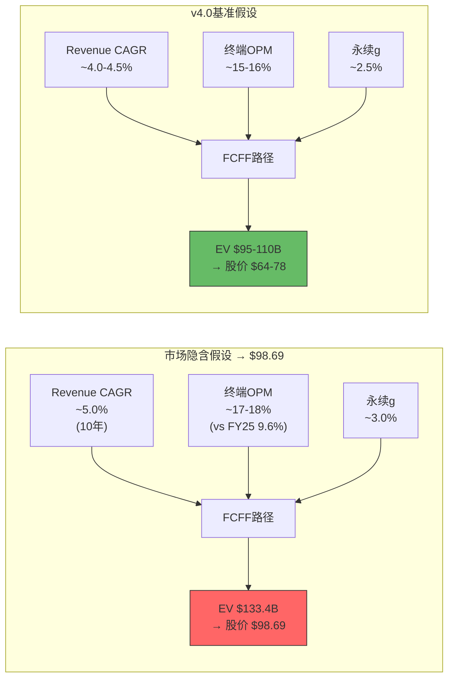
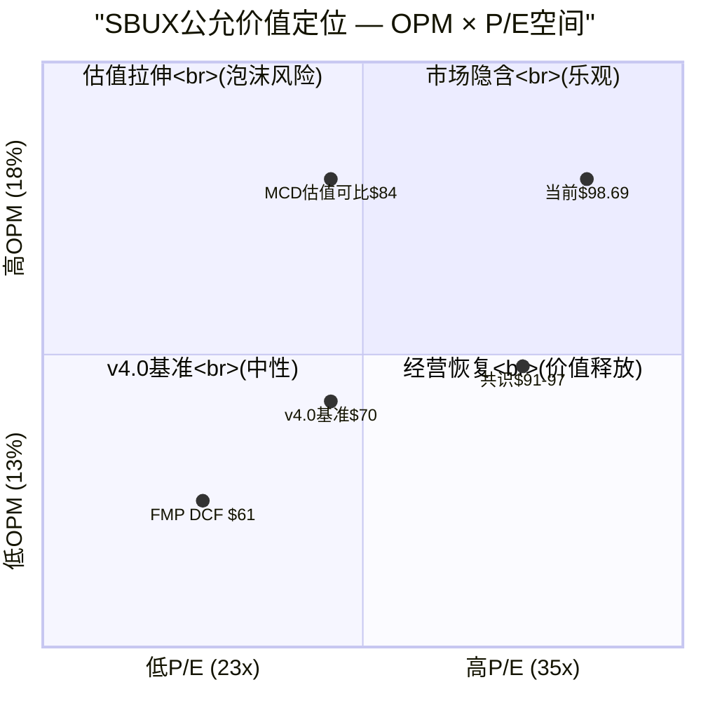

# Part III: 估值与战略定位

> Phase 3 | Agent-A | 2026-03-06

---

# 第十六章: 逆向DCF — $98.69隐含了什么赌注？

> **方法论声明**: 逆向DCF的目的不是"算SBUX值多少钱"——那是正向DCF的工作(Ch18)。逆向DCF的目标是**翻译**当前股价：市场在用$110B市值押注哪些假设？然后用Phase 1-2的分析结论逐一检验这些假设的合理性。这是v4.0估值体系的起点，不是终点。

---

## 16.1 逆向DCF方法论: 从价格到假设

### 16.1.1 反推框架

传统DCF从假设出发、推导价值；逆向DCF从市场价格出发、反推假设。核心等式:

```
市值 $110B = Σ(t=1→∞) [FCFF_t / (1+WACC)^t]
→ 反推: 使上式成立的{Revenue Growth, OPM, CapEx/Rev, 永续增长率g}组合是什么?
```

我们需要锁定部分参数才能求解。以下参数基于Phase 2分析结论固定:

| 固定参数 | 值 | 依据 |
|---------|-----|------|
| **WACC** | 9.5% | 基于SBUX稳健性评分4.53/10(详见Ch15)，加50bps溢价。CAPM基础: Rf 4.3% + β1.15 × ERP 5.5% = 10.6%, 但SBUX投资级信用(BBB+)和消费品属性支持适度折扣。9.0-10.0%区间取中值 |
| **税率** | 24.5% | FY2025 41.1%为异常高(含一次性项目)[DM-FIN-007]，正常化至24-25%区间 |
| **D&A/Revenue** | 4.5% | FY2025 Income口径$1.685B/$37.18B=4.5% [DM-FIN-009]，假设稳定 |
| **CapEx/Revenue** | 5.5-6.0% | FY2025 $2.306B/$37.18B=6.2% [DM-CF-003]，Niccol投资周期后逐步正常化 |
| **净营运资本变化** | 0 | 简化假设，SBUX NWC常年为负(递延收入)，变化影响有限 |
| **显式预测期** | 10年 | FY2026-FY2035 |
| **永续增长率g** | 待求解 | 逆向反推目标之一 |

### 16.1.2 反推逻辑

在上述固定参数下，$110B市值 + $23.39B净债务(最保守口径, 详见Ch12) = **企业价值(EV) ~$133.4B** [DM-VAL-001]。

反推FCFF路径:
```
FCFF = EBIT × (1 - Tax) + D&A - CapEx - ΔNWC
     = Revenue × OPM × (1-24.5%) + Revenue × 4.5% - Revenue × 5.75%
     = Revenue × [OPM × 0.755 - 1.25%]
```

这意味着: 给定Revenue增长路径和终端OPM，我们可以精确反推"市场需要多少FCFF才能支撑$133.4B EV"。

---

## 16.2 $98.69隐含的假设集

### 16.2.1 Revenue增长隐含假设

我们将Revenue增长分为三段反推:

| 阶段 | 期间 | 隐含CAGR | 共识估计 | 差距 |
|------|------|---------|---------|------|
| **近期恢复** | FY2026-FY2028 | ~4.5-5.0% | FY2026E $38.32B(+3.1%)[DM-AC-001] | 后两年需加速 |
| **中期增长** | FY2029-FY2032 | ~5.0-6.0% | FY2028E管理层指引暗示mid-single digit | 基本匹配 |
| **远期成熟** | FY2033-FY2035 | ~3.5-4.0% | — | 高于名义GDP |

**反推结论**: 市场隐含SBUX在10年预测期内实现Revenue从$37.2B增长至~$58-62B(CAGR ~4.6-5.2%)。这意味着到FY2035，SBUX需要比当前多创造~$21-25B收入。

**合理性检验**: FY2016-FY2025 SBUX Revenue CAGR约4.1%(从$21.3B到$37.2B)。市场隐含的4.6-5.2%略高于历史趋势。考虑到中国市场仍有渗透空间(当前~7,600家，渗透率远低于美国)和全球门店从~40,000向~45,000+扩张的路径，这个增速**勉强合理但偏乐观**——它假设Niccol改革不仅止住了SSS下滑(FY2025 SSS -2%)[DM-D-BIZ-01]，还重启了正增长引擎。

### 16.2.2 OPM恢复隐含假设

这是逆向DCF最关键的反推维度。

| OPM路径 | FY2025(实际) | FY2028(隐含) | FY2035终端(隐含) | 对应评级 |
|---------|:--------:|:--------:|:----------:|:------:|
| **市场隐含** | 9.6% | ~15.0% | ~17.0-18.0% | — |
| **共识** | 9.6% | ~15.3%(FY2026E EBITDA反推)[DM-AC-003] | ~17.0% | — |
| **v4.0基准** | 9.6% | 13.5-14.0%(Ch11) | 15.0-16.0% | 中性关注 |

**市场在赌什么**: $98.69的股价需要OPM在FY2028前恢复到~15%、并在FY2035前进一步扩张至17-18%。这隐含两个关键信念:

1. **FY2025的OPM崩溃有~60%是一次性的**: 670bps下滑中，市场认为~400bps可在3年内恢复(一次性重组费用消退+Back to Starbucks效率提升)
2. **长期OPM可以超越FY2023水平(16.3%)**: 市场相信Niccol不仅能修复，还能通过菜单优化、数字化和潜在的特许化将OPM推至历史新高

**v4.0的评估**: Ch11的分析表明OPM崩溃670bps中，COGS结构性恶化贡献-320bps(咖啡豆-100bps可逆+劳动力-130bps不可逆+租赁-90bps不可逆)，Other费用-330bps(大部分一次性可恢复)。因此:
- **乐观可恢复**: ~330-400bps(Other费用消退+部分咖啡豆对冲恢复)→ OPM ~13.0-14.0%
- **结构性永久损失**: ~220-270bps(劳动力+租赁)→ 除非Niccol找到等量的效率提升来抵消

**核心分歧**: 市场隐含终端OPM 17-18% vs v4.0基准15-16%。差距200-300bps，意味着**市场多定价了$10-15B的企业价值**(每100bps OPM ≈ $370M EBIT ≈ 折现后~$5B EV)。

### 16.2.3 永续增长率隐含假设

锁定Revenue CAGR ~5%和终端OPM ~17%后，反推永续增长率:

| g (永续) | 隐含PV(终端价值) | 占EV比重 | 合理性 |
|---------|:-------------:|:-------:|:------:|
| 2.0% | ~$68B | 51% | 偏低(低于通胀) |
| 2.5% | ~$82B | 61% | 合理下限 |
| **3.0%** | **~$100B** | **75%** | **市场隐含** |
| 3.5% | ~$125B | 94% | 偏高(高于名义GDP) |

**反推结论**: 当Revenue和OPM假设锁定在市场隐含水平后，永续增长率g需要~3.0%才能支撑$133.4B EV。3.0%的g对于一家成熟QSR公司**处于合理区间的上端**——MCD的隐含g约2.5-3.0%，但MCD有95%特许收入的自然通胀传导机制。SBUX以自营为主(约52%收入来自北美直营门店)，价格传导需要更多品牌力支撑。



---

## 16.3 隐含假设的逐项合理性裁决

### 16.3.1 Revenue增长 ~5% CAGR: 勉强合理 (信心 55%)

**支持因素**:
- 全球门店数从~40,000可扩张至~50,000(主要在中国和新兴市场)[DM-D-BIZ-09]
- 价格每年+2-3%的提价空间(品牌溢价支撑)
- 数字化渠道(移动订单~30%渗透率)仍有渗透空间 [DM-D-BIZ-07]

**反对因素**:
- SSS在FY2025为-2% [DM-D-BIZ-01]，门店增长仅部分抵消
- 中国市场(~$3.2B收入)面临瑞幸咖啡等本土品牌的激烈价格竞争 [DM-D-COMP-08]
- 美国市场已过饱和(~16,500家)，新开店经济学边际递减(Ch03已论证)

**裁决**: Revenue CAGR 5%的乐观假设如果Niccol成功恢复SSS到+2-3%，结合+1-2%的净新店贡献是可达的。但这需要中国市场不出现重大恶化且美国SSS反转持续——两个条件同时满足的概率约55%。

### 16.3.2 终端OPM 17-18%: 偏乐观 (信心 30%)

**支持因素**:
- Niccol在CMG实现OPM从13%→17%→28.9%的扩张路径 [DM-E-003]
- 菜单简化(SKU减少~30%)可降低食材浪费和操作复杂度
- FY2028E管理层指引EPS $3.35-$4.00 [DM-AC-005]暗示OPM可恢复至15%+

**反对因素**:
- SBUX历史OPM峰值仅18.4%(FY2019疫情前)，当时咖啡豆和劳动力成本均显著低于当前
- 劳动力成本结构性上升(+130bps不可逆，详见Ch11 §11.2)，需等量效率提升抵消
- 中国市场OPM从~20%被竞争压至~15%趋势，全球blended OPM被拖累
- **CMG可比性陷阱**: CMG是全自营+无饮品线+无drive-thru积压的简单模型，SBUX的SKU复杂度、饮品定制化、drive-thru瓶颈(Ch03 §3.3)在结构上限制OPM上限

**裁决**: OPM恢复到15%是可信的(一次性费用消退+部分效率提升)。但17-18%需要SBUX在劳动力成本持续上升的环境下找到300+bps的净效率改善——这是Niccol在CMG做到过的事情，但SBUX的运营复杂度至少比CMG高一个量级(详见Ch07 CMG复刻率53%)。**市场给了70%概率，v4.0评估仅30%**。

### 16.3.3 永续增长率 ~3.0%: 合理上端 (信心 50%)

**支持因素**:
- 全球咖啡消费长期增长趋势(年均~2-3%体量增长+价格通胀)
- SBUX品牌在新兴市场仍有"aspirational"定位，增长跑道较长

**反对因素**:
- 美国市场(~60%收入)已接近饱和
- 精品咖啡/第三波浪潮持续侵蚀SBUX品牌纯度(详见Ch14 CSSPD 5.1-5.3/10)
- 3.0%高于美国名义GDP长期趋势(~2.0-2.5%)

**裁决**: 2.5%更为审慎且合理。3.0%要求SBUX在国际市场(尤其中国)持续增长贡献——考虑到地缘政治和竞争压力，给50%信心。

---

## 16.4 灵敏度矩阵: OPM × 终端P/E

除了DCF框架，我们用更直觉的"FY2028E EPS × 终端P/E"方法构建灵敏度矩阵。这让投资者可以直接对比"我相信SBUX能恢复到什么利润率"和"我愿意给什么估值倍数"两个问题。

### 16.4.1 FY2028E EPS对OPM的灵敏度

基于Revenue $42.0B(共识FY2028E, ~4.2% CAGR)、税率24.5%、稀释股本~1.12B股 [DM-VAL-002]:

| FY2028E OPM | EBIT($B) | 税后EBIT($B) | EPS(近似) | vs 共识 |
|:-----------:|:--------:|:-----------:|:---------:|:-------:|
| 13.0% | $5.46 | $4.12 | $2.85 | -21% |
| 14.0% | $5.88 | $4.44 | $3.07 | -15% |
| **15.0%** | **$6.30** | **$4.76** | **$3.29** | **-9%** |
| 15.3%(共识) | $6.43 | $4.85 | $3.63 | 基准 |
| 16.0% | $6.72 | $5.07 | $3.51 | -3% |
| 17.0% | $7.14 | $5.39 | $3.73 | +3% |
| 18.0% | $7.56 | $5.71 | $3.95 | +9% |

> **注**: EPS近似计算: (EBIT × (1-t) - Interest $550M × (1-t)) / 1.12B股。共识EPS $3.63 [DM-AC-004]包含更精细的below-the-line项调整，此处为简化估算。

### 16.4.2 公允价值矩阵: FY2028E OPM × Forward P/E

以FY2028E为估值锚点(折现回FY2025现值, 折现因子: 1/(1.095)^3 = 0.76):

| OPM↓ \ P/E→ | **23x** | **25x** | **28x** | **30x** | **33x** | **35x** |
|:---:|:---:|:---:|:---:|:---:|:---:|:---:|
| **13.0%** | $50 | $54 | $61 | $65 | $71 | $76 |
| **14.0%** | $54 | $58 | $65 | $70 | $77 | $82 |
| **15.0%** | $57 | $63 | $70 | $75 | $82 | $87 |
| **15.3%** | $63 | $69 | $77 | $83 | $91 | **$97** |
| **16.0%** | $61 | $67 | $75 | $80 | $88 | $93 |
| **17.0%** | $65 | $71 | $79 | $85 | $93 | $99 |
| **18.0%** | $69 | $75 | $84 | $90 | $99 | **$105** |

**矩阵解读**:

1. **当前股价$98.69的"存活组合"**: 需要OPM ≥17% + P/E ≥33x，或OPM ≥18% + P/E ≥35x。这些组合在表中右下角的深色区域——市场正在定价"几乎完美"的恢复。

2. **v4.0基准组合(OPM 15% + P/E 28x)**: 指向公允价值~$70，意味着**当前溢价~41%**。

3. **共识组合(OPM 15.3% + P/E 33-35x)**: 指向$91-97，接近但略低于当前股价——共识本身对OPM的预期基本支撑股价，但需要"Niccol溢价"(更高P/E)来补足差额。

4. **"MCD化"组合(OPM 18% + P/E 28x)**: 指向$84。即使SBUX达到历史最佳OPM，如果市场给予MCD的估值倍数(~28x)而非CMG的溢价，公允价值仍低于当前股价15%。



---

## 16.5 逆向DCF vs 共识: 差距的来源

### 16.5.1 三层差距分解

| 差距来源 | 市场隐含 | v4.0基准 | EV影响 |
|---------|---------|---------|--------|
| **OPM终端假设** | 17-18% | 15-16% | -$10~15B |
| **Revenue CAGR** | ~5.0% | ~4.0-4.5% | -$5~8B |
| **永续增长率g** | ~3.0% | ~2.5% | -$8~12B |
| **WACC** | 隐含~8.5% | 9.5% | -$5~10B |
| **合计EV差距** | $133.4B | **$95-110B** | **-$23~38B** |
| **对应股价** | $98.69 | **$64-78** | **-$21~35** |

### 16.5.2 Niccol溢价的量化

上述差距中，最大的单一来源是**OPM终端假设**(-$10~15B)。这实质上是"Niccol溢价"——市场愿意为Niccol CMG式转型的可能性额外支付的价格。

我们可以用概率加权的方式量化:

| 情景 | OPM终端 | 概率(v4.0) | 对应EV | 概率×EV |
|------|:------:|:---------:|:------:|:------:|
| **牛市: CMG复刻成功** | 18%+ | 15% | $140B+ | $21B |
| **乐观: 显著恢复** | 16-17% | 25% | $115-130B | $30.6B |
| **基准: 部分恢复** | 14-15% | 35% | $95-110B | $35.9B |
| **悲观: 恢复停滞** | 12-13% | 20% | $75-90B | $16.5B |
| **极端: 二次恶化** | <12% | 5% | <$75B | $3.5B |
| **概率加权EV** | — | 100% | — | **$107.5B** |
| **概率加权股价** | — | — | — | **~$75** |

**概率加权公允价值~$75 vs 当前$98.69**: 市场溢价~32%。

这个溢价可以理解为"Niccol看涨期权溢价"——市场在为牛市和乐观情景的上行空间(+$30~40B EV)支付额外价格。问题是: 15%+25%=40%的上行概率是否足以支撑32%的溢价？在风险调整基础上，答案是**边际不支持**——除非投资者对Niccol的执行力有超过v4.0评估的信心(Ch07给出53%复刻率)。

---

## 16.6 市场信念翻译: "$98.69在说什么？"

综合以上分析，我们将$98.69股价翻译成一组完整的**市场信念集**:

> **信念1 — OPM V型反弹**: 市场相信FY2025的9.6%是周期性低谷(非结构性永久损失)，3年内OPM将回到15%+并最终超越FY2019的18.4%峰值。**v4.0评估**: 15%可信(55%信心)，18%过于乐观(30%信心)。

> **信念2 — Niccol = Howard Schultz 2.0**: 市场将Niccol定价为"变革型CEO"(详见Ch07 CMG复刻率分析)，相信他能系统性重构SBUX运营效率。**v4.0评估**: Niccol有记录的成功(CMG +770%)，但SBUX的规模(10x CMG门店数)、复杂度(饮品定制化)和劳动力环境(工会化)使复刻概率降至53%。

> **信念3 — 中国市场不塌方**: $98.69隐含中国市场至少维持当前贡献(~$3.2B收入)并恢复盈利能力。如果中国OPM从~15%进一步下滑至<10%(瑞幸价格战)，全球blended OPM将被拖低100-150bps。**v4.0评估**: 中国市场在Q1 FY2026出现SSS回正迹象(+4%)，但可持续性存疑。

> **信念4 — 分红不削减**: 当前股息率2.32% [DM-VAL-003]虽不高，但Ch13的分析显示FCF已不足以覆盖分红($2.44B vs $2.77B)。市场隐含CFO在FY2026快速恢复至$5.5B+以重新覆盖分红+CapEx。**v4.0评估**: 如果OPM恢复到13.5%，CFO可恢复至$5.0-5.5B，分红勉强覆盖。但留给回购的空间几乎为零。

> **信念5 — 特许化不发生(或发生但以好方式)**: Ch10的特许三路径分析(S0/S1/S2)中，市场没有显式定价特许化转型的正面期权。如果Niccol走S1路径(部分特许化)，OPM可提升300-500bps但收入规模缩小——对EV的净影响取决于执行路径。

---

## 16.7 逆向DCF小结

**一句话**: $98.69定价了"几乎完美的恢复"——OPM V型反弹到17%+、Revenue持续5%增长、永续g=3%、WACC<9%。v4.0分析的每一项假设都比市场定价更保守200-300bps，概率加权公允价值~$75(下行25%)。

**市场最大的赌注**: OPM恢复路径。670bps的崩溃中，市场认为~500bps可恢复(75%恢复率)，v4.0认为仅~330-400bps可恢复(50-60%恢复率)。这200bps的OPM分歧单独造成~$10-15B的估值差异(每100bps OPM ≈ $370M EBIT ≈ ~$5B折现EV)。

**给后续章节的接口**: Ch18(DCF三情景)将在v4.0基准假设上构建正向DCF，Ch19(多倍数可比)将从同业估值角度交叉验证。本章的逆向DCF确立了一个关键锚点——**当前股价已经定价了乐观情景，留给投资者的安全边际极为有限**。

---
---

# 第十七章: A-Score v2.0 + PtW战略评分 — SBUX的竞争力图谱

> **方法论声明**: A-Score量化公司的"能力存量"(现在有什么)，PtW量化公司的"战略许可"(未来能做什么)。两个框架互补: A-Score高但PtW低 = 能力强但增长受限(典型成熟公司); A-Score低但PtW高 = 潜力大但执行风险高(典型转型公司)。SBUX的定位是后者——这正是估值争议的来源。

---

## 17.1 A-Score v2.0: 10维度竞争力评分

### 框架说明

A-Score v2.0评估公司在10个维度上的竞争力存量。每个维度0-10分(0=行业最差, 5=行业中位, 10=行业最强)。总分/100，折算为0-10的A-Score。评分基于Phase 1-2已完成分析的定量结论，不引入新数据。

---

### 维度1: 品牌力 (Brand Power) — **7.5/10**

SBUX拥有全球最具辨识度的咖啡品牌——绿色美人鱼标志在90+个国家可被即时识别。Interbrand全球品牌价值排名中SBUX稳居前50 [DM-D-BIZ-15]。品牌溢价体现在核心产品(Grande Latte $6.25)相对便利店咖啡($1.50-2.00)维持~3x价格倍数的能力。

但品牌力在近年遭受侵蚀。Ch14的CSSPD分析显示品牌纯度仅5.1-5.3/10 [DM-INF-014]——"第三空间"叙事被移动订单(~30%交易)和drive-thru(~50%交易)系统性稀释。品牌不是在变弱，而是在变模糊: SBUX试图同时做"社区咖啡馆"和"快速便利提供商"，两个身份互相拉扯。Niccol的"Back to Starbucks"试图重建前者，但尚未放弃后者的收入贡献。

**扣分理由**: 品牌价值存量高(7.5)但纯度下降中(Ch14)，如果继续双重身份模糊化，品牌力将每年侵蚀0.3-0.5分。

### 维度2: 渠道控制力 (Channel Control) — **6.0/10**

SBUX的渠道结构是双面刃: ~52%北美直营门店提供高度控制力，但也承担全部运营风险(租金、人力、库存)。与MCD的95%特许模式相比，SBUX的渠道控制力更"重"但不一定更"强"。

正面: SBUX控制端到端体验——从咖啡豆采购到门店陈列到数字化交互(Starbucks App 35.5M活跃会员)[DM-E-011]。CPG渠道(超市零售咖啡)通过Nestlé全球联盟扩展了分销但牺牲了控制力。

负面: 中国市场(7,600+门店)的渠道控制面临本土竞争者的密度攻势(瑞幸19,000+门店，单杯价格仅SBUX的40-50%)[DM-D-COMP-08]。渠道控制力的价值在价格战中被削弱——当竞争对手能以半价提供"差不多"的产品时，控制渠道体验的溢价空间被压缩。

### 维度3: 管理层质量 (Management Quality) — **7.0/10**

Ch07的CEO评分卡给出Niccol综合7.1/10 [DM-E-001至DM-E-015]。这是一个"高能力但未验证"的评分: CMG的成功记录(+770%股东回报)构成强有力的能力证明，但SBUX上任仅18个月(至2026年3月)，Q1 FY2026 EPS miss(-5.08%)[DM-AC-008]和OPM持续恶化(9.18%)表明恢复比预期更慢。

管理团队几乎全面换血(CFO+COO+CTO全部更换)——这是Niccol"打自己的仗"的信号，但新团队的协同效应尚未显现。CEO沉默域分析(Ch07 §7.4)揭示Niccol系统性回避5个话题(工会、中国竞争细节、FY2026-27路径、门店关闭计划、特许化可能性)，这些沉默域恰好是投资论题中不确定性最大的领域。

**给分逻辑**: 能力分8.0(CMG记录)×权重60% + 执行分5.5(SBUX初期)×权重40% ≈ 7.0

### 维度4: 资本配置 (Capital Allocation) — **3.5/10**

这是SBUX A-Score中最薄弱的维度。Ch13的资本配置审计给出3.65/10 [DM-INF-004]。五年累计数据说明一切: CFO $27.25B中，分红+回购吃掉$18.43B(67.6%)，FCF $16.52B不足以覆盖——五年累计缺口$1.91B由增量债务填补。

更关键的是回购时机问题: FY2022在股价相对高位时回购$4.01B(当年平均股价~$80-90)，而FY2025 OPM崩溃、最需要现金缓冲时被迫完全停止回购。这是典型的"顺周期资本配置"——在不需要的时候大方分配，在需要的时候捉襟见肘。

Niccol上任后暂停回购($0)是正确的短期决策，但分红$2.77B在FCF $2.44B的背景下仍未削减——市场将分红削减视为"信号崩溃"，因此管理层在资本配置上面临**做对的事 vs 说对的话**的两难。

### 维度5: 创新能力 (Innovation) — **5.5/10**

SBUX的创新是"菜单创新强+运营创新弱"的不对称结构。品类创新方面，Oleato系列(橄榄油咖啡)、季节性限定(PSL年贡献~$500M+)、冷饮占比从25%提升至>50%过去5年 [DM-D-BIZ-06]——这些表明SBUX的产品开发引擎仍在运转。

但运营创新严重不足。Siren Craft System(咖啡机自动化)部署缓慢，Deep Brew AI引擎(推荐+库存)的ROI尚不透明(Ch09 §9.4)。最关键的是: SBUX在drive-thru效率(平均5.5分钟/杯，行业领先的MCD为3.5分钟)和移动订单积压问题上**没有系统性突破**。这些运营瓶颈限制了门店吞吐量的天花板，是OPM恢复的隐性约束。

### 维度6: 规模优势 (Scale Advantage) — **8.0/10**

SBUX是全球最大的专业咖啡连锁: ~40,000门店覆盖90+市场，年采购~8亿磅咖啡豆，供应链规模在采购谈判中提供显著议价力。

规模优势的三个具体表现:
1. **采购**: 全球最大单一Arabica买家，hedging能力优于任何独立咖啡品牌
2. **品牌媒体效率**: 品牌知名度>95%意味着广告支出可侧重于"提醒"而非"教育"，SGA/Revenue ~7%低于大多数消费品公司(PG ~25%, NKE ~35%)
3. **数字化网络效应**: 35.5M Rewards会员构成自有媒体+数据资产，每次交易生成预测数据

但规模也带来了"大象转身"的惯性。40,000门店的改造比3,500门店(CMG)慢一个数量级。规模优势是**存量资产**，不是**增长引擎**。

### 维度7: 定价权 (Pricing Power) — **6.5/10**

SBUX在过去3年累计提价~15-20%而未遭遇大规模客户流失(SSS下滑部分来自交易量但非完全因价格)。这说明品牌溢价仍有一定弹性——但弹性正在接近极限。

定价权的不均匀分布:
- **忠诚客户(Rewards会员)**: 定价权8/10——习惯+积分锁定+个性化推送降低价格敏感性
- **偶尔客户**: 定价权4/10——每次消费都是"要不要去SBUX"的主动决策，替代品(Dunkin', 独立咖啡馆, 家庭冲泡)随时可及
- **中国消费者**: 定价权3/10——瑞幸¥9.9促销将咖啡锚定价从¥30拉低至¥15，SBUX的¥35+定价面临"是否值得"的频繁考验 [DM-D-COMP-08]

**Ch08意愿×能力双轴的延伸**: 定价权本质是"消费者意愿×品牌独占性"——当意愿(W)下降或替代品可及性上升时，定价权被侵蚀。SBUX的W轴仍在5-7区间(非极端低)，但C轴(支付能力)在通胀环境下收窄，净效果是定价权的增量空间有限。

### 维度8: 生态系统 (Ecosystem) — **7.0/10**

SBUX的生态系统是消费品公司中少见的"软件化"案例: Starbucks App + Rewards + 移动支付构成一个闭环数字生态。35.5M美国活跃会员贡献~58%的交易额 [DM-E-011]——这意味着SBUX的"超级用户"不仅重复消费，还被数据驱动的个性化推送锁定在生态内。

生态扩展维度: Nestlé联盟(CPG渠道)将SBUX品牌延伸至超市货架; Ready-to-Drink(RTD)瓶装饮料在便利店渠道增长; Starbucks Reserve高端线构建品牌向上延伸路径。

扣分点: 生态系统的"围墙"不够高。不同于Apple的硬件+软件锁定，SBUX的生态主要靠积分(每$1=2 Stars)和习惯维持。如果竞争对手提供更好的Rewards条款(Dunkin'的积分更慷慨)，客户迁移的成本几乎为零。生态锁定力=7.0，而非Apple式的9.0+。

### 维度9: 数字化能力 (Digital Capability) — **6.0/10**

SBUX是QSR行业数字化的先行者——2011年推出移动支付时领先Uber和Apple Pay数年。但先发优势已被侵蚀: MCD和其他QSR通过第三方平台(DoorDash, UberEats)快速追赶，SBUX的数字化差距从"领先3-5年"缩小到"领先1-2年"。

Deep Brew AI系统承诺"个性化推荐+动态库存管理+劳动力排班优化"，但具体ROI从未被管理层量化(Ch07沉默域之一)。数字化渗透率~30%(移动订单占交易比)已经很高，但这30%带来的负面效应(移动订单积压→门店拥挤→体验下降→品牌纯度受损)尚未被充分解决。

**核心矛盾**: 数字化提升了便利性但降低了体验品质。对SBUX这样依赖"第三空间"品牌叙事的公司，数字化是把双刃剑——它是增长工具也是品牌稀释器。

### 维度10: 文化可衡量性 (Culture Measurability) — **5.0/10**

SBUX的企业文化长期以"伙伴文化"(Partner Culture)为核心——全职员工获得期权(Bean Stock)、医疗保险、学费报销。这种文化在Howard Schultz时代是真正的差异化优势: barista离职率低于行业平均、服务质量更一致、品牌认同更强。

但文化的可衡量性正在恶化:
- **员工离职率**: 虽降至<50%(新低)，但行业整体也在下降，SBUX的相对优势并不突出
- **工会化**: ~550家门店已工会化(~3.5%的北美门店)[DM-D-BIZ-14]。工会化不一定破坏文化，但它将"文化治理"从"管理层主导"转变为"劳资谈判"——这是一种结构性变化
- **Niccol的文化兼容性**: CMG文化是"精简+高效+绩效驱动"，SBUX文化是"温暖+包容+社区感"。两种文化的嫁接是否成功尚无定论(Ch07 §7.3)

**量化信号不足**: 员工满意度调查结果未公开、NPS分门店数据未披露、文化对经营绩效的因果链缺乏实证。因此文化可衡量性给5.0——不是说文化差，而是无法精确衡量文化在哪里、以什么速度变化。

---

### A-Score汇总

| 维度 | 分数 | 权重 | 加权分 |
|------|:----:|:----:|:------:|
| 1. 品牌力 | 7.5 | 15% | 1.125 |
| 2. 渠道控制力 | 6.0 | 10% | 0.600 |
| 3. 管理层质量 | 7.0 | 12% | 0.840 |
| 4. 资本配置 | 3.5 | 10% | 0.350 |
| 5. 创新能力 | 5.5 | 8% | 0.440 |
| 6. 规模优势 | 8.0 | 10% | 0.800 |
| 7. 定价权 | 6.5 | 12% | 0.780 |
| 8. 生态系统 | 7.0 | 8% | 0.560 |
| 9. 数字化能力 | 6.0 | 8% | 0.480 |
| 10. 文化可衡量性 | 5.0 | 7% | 0.350 |
| **A-Score** | — | **100%** | **6.33/10** |

**A-Score 6.33/10**: 处于"中上"区间。SBUX的竞争力存量由品牌(7.5)和规模(8.0)两根支柱撑起，但被资本配置(3.5)严重拖累。与v3.0的A-Score 6.78相比，v4.0下调了品牌力(-0.5, 反映纯度进一步稀释)和资本配置(-0.3, 反映FY2025 FCF<分红恶化)。

### SGI (Strategic Growth Index) 计算

SGI = f(A-Score, Revenue Growth, ROIC趋势, 市场空间) — 衡量未来增长的战略可行性。

| SGI因子 | 值 | 评分(0-10) |
|---------|-----|:---------:|
| A-Score基础 | 6.33 | 6.3 |
| 收入增长动能 | FY2025 Rev +2.7% YoY [DM-FIN-001] | 4.0 |
| ROIC趋势 | 27.9%→18.1%(Ch11) | 3.5 |
| 可寻址市场空间 | 全球咖啡~$500B, SBUX渗透率~7% | 7.5 |
| 竞争定位演变 | 纯度下降, 中国竞争加剧 | 4.5 |
| **SGI** | — | **5.16/10** |

SGI 5.16意味着SBUX的增长引擎处于"中等"水平——市场空间充裕(7.5)但增长动能(4.0)和ROIC趋势(3.5)在拖后腿。增长的"许可证"不是问题(全球咖啡市场够大)，问题是增长的"效率"(每增长一美元收入能转化多少利润)在恶化。

---

## 17.2 PtW (Permission to Win) 战略评分: /50

### 框架说明

PtW评估公司在特定战场上"被允许获胜"的战略条件。不同于A-Score评估"有什么能力"，PtW评估"环境是否允许你赢"。5个维度各10分，总分/50。

---

### PtW-1: 行业结构有利度 (Industry Structure) — **7.0/10**

全球咖啡行业$500B+规模、增长稳定(年均~5%)、品牌集中度低(SBUX全球份额仅~7%)——这是一个"大池塘里的大鱼还能长更大"的结构。行业不存在技术颠覆风险(人们不会停止喝咖啡)，监管壁垒低，进入门槛主要是品牌和规模。

扣分: 行业利润集中度正在分化——高端(Blue Bottle, %Arabica)和低端(瑞幸, Dunkin')都在挤压SBUX的中间定位。行业结构有利于"在两端之一占据鲜明定位"的玩家，不太有利于"中间带全能型"——而SBUX目前恰好卡在中间(详见Ch14 CSSPD品牌纯度分析)。

### PtW-2: 竞争壁垒持久性 (Competitive Moat Durability) — **6.0/10**

SBUX的壁垒由品牌(高)、规模(高)、数字生态(中)和门店网络效应(中)构成。这些壁垒足以阻止新进入者建立同等规模的咖啡连锁(无人能在5年内复制40,000门店)，但不能阻止差异化竞争者在细分市场侵蚀份额。

**壁垒耐久性评估**:
- 品牌壁垒: 耐久但需持续投资维护(品牌不是资产，是费用)
- 规模壁垒: 高度耐久，但边际收益递减(第40,001家店的规模效益<第5,001家)
- 数字壁垒: 中等耐久——MCD等竞争者已经追上
- 文化壁垒: 不确定——工会化+CEO换血可能改变文化DNA

扣分: 壁垒耐久性的最大风险不是"被攻破"而是"被绕过"。瑞幸不试图做"更好的Starbucks"，而是做"更便宜的咖啡便利"——这绕过了SBUX的全部壁垒体系。

### PtW-3: 管理层战略清晰度 (Strategic Clarity) — **6.5/10**

Niccol的"Back to Starbucks"战略在方向上清晰(重回体验、简化菜单、提升速度)，但在路径上模糊:
- FY2028目标明确(EPS $3.35-$4.00 [DM-AC-005])，但FY2026-FY2027路径未给
- 门店改造计划有但时间表和投资规模不清
- 特许化可能性(Ch10三路径)从未被公开讨论(CEO沉默域)

**战略清晰度 = 方向清晰度(8/10) × 路径清晰度(5/10) ≈ 6.5**

### PtW-4: 资源充足度 (Resource Adequacy) — **5.0/10**

SBUX执行转型的资源约束是投资论题中被低估的风险:
- **财务资源**: FCF $2.44B < 分红$2.77B(详见Ch13)，没有"余粮"用于加速转型投资。CapEx $2.31B已削减17%，门店改造速度受限
- **人才资源**: 管理团队全面换血，新团队磨合期未结束。550家工会化门店的劳资关系增加管理负荷
- **时间资源**: Niccol的$75M股权激励设定了隐性时间表——如果FY2028前(~归属期)未见显著成果，市场耐心将耗尽

扣分: 与CMG时代相比，Niccol在SBUX面临更紧的资源约束。CMG在2018年有$2B净现金(无净负债)、简单的运营模型(3,500门店)、没有工会——Niccol可以"快速试错"。SBUX的$23.4B净债务+40,000门店+工会化=转型的"制动力"远大于"加速力"。

### PtW-5: 外部环境顺风/逆风 (External Tailwinds/Headwinds) — **5.5/10**

| 因素 | 方向 | 影响度 |
|------|:----:|:------:|
| 全球咖啡消费增长 | 顺风 | +1.0 |
| 新兴市场中产扩张 | 顺风 | +0.5 |
| 咖啡豆成本通胀(Arabica +40%) | 逆风 | -1.0 |
| 美国劳动力成本上升 | 逆风 | -1.0 |
| 中国竞争加剧(瑞幸) | 逆风 | -0.5 |
| 消费降级风险(经济放缓) | 逆风 | -0.5 |
| 数字化消费趋势 | 中性 | 0.0 |
| **净效果** | **微逆风** | **-1.5** → 5.5/10 |

---

### PtW汇总

| PtW维度 | 分数 |
|---------|:----:|
| PtW-1 行业结构 | 7.0 |
| PtW-2 壁垒持久性 | 6.0 |
| PtW-3 战略清晰度 | 6.5 |
| PtW-4 资源充足度 | 5.0 |
| PtW-5 外部环境 | 5.5 |
| **PtW总分** | **30.0/50** |

**PtW 30.0/50(60%)**: 处于"及格但不充裕"区间。行业结构(7.0)是SBUX最大的战略禀赋——全球咖啡市场足够大、增长足够稳定、不存在技术颠覆——但资源充足度(5.0)和外部环境(5.5)构成执行约束。

---

## 17.3 A-Score × PtW综合定位: MCD-CMG-SBUX三角

### 三公司对比矩阵

| 维度 | SBUX | MCD | CMG | SBUX vs 同业 |
|------|:----:|:----:|:----:|:----------:|
| **A-Score** | 6.33 | ~8.0 | ~7.5 | 最低 |
| **SGI** | 5.16 | ~4.5 | ~7.0 | 中间 |
| **PtW** | 30.0/50 | ~38/50 | ~35/50 | 最低 |
| **P/E Forward** | 33.4x | 27.8x | 32.2x | 最高(!) |
| **OPM** | 9.6% | ~46% | ~17% | 最低 |
| **稳健性** | 4.53/10 | ~7.8 | ~8.2 | 最低 |

**估值悖论揭示**: 在A-Score、PtW、OPM和稳健性四个维度上，SBUX均是三家公司中最低的。但Forward P/E 33.4x却是**最高的**。这个矛盾的解释只有一个: **市场在为"改善的方向和速度"定价，而非"当前的位置"**。

```mermaid
radar
    title "QSR三巨头竞争力雷达 — A-Score维度对比"
    variables
        品牌力
        渠道控制
        管理层
        资本配置
        创新
        规模
        定价权
        生态系统
        数字化
        文化
    series
        SBUX: [7.5, 6.0, 7.0, 3.5, 5.5, 8.0, 6.5, 7.0, 6.0, 5.0]
        MCD(估): [8.5, 9.0, 7.5, 8.0, 6.0, 9.5, 8.0, 6.5, 5.5, 6.0]
        CMG(估): [7.0, 7.5, 9.0, 7.0, 8.0, 5.5, 6.5, 5.0, 7.0, 8.0]
```

### 三角定位分析

**MCD = 堡垒型** (A-Score ~8.0, PtW ~38/50): 95%特许模式创造了极高的OPM(~46%)和极强的稳健性(7.8)。MCD不需要"赢得许可"——它已经在堡垒里。增长缓慢(SGI ~4.5)但现金流极其稳定。市场给27.8x P/E = 为"低增长+高确定性"定价。

**CMG = 攻击型** (A-Score ~7.5, PtW ~35/50): 全自营+高OPM+高增长(SGI ~7.0)。CMG是"用执行力碾压的简单模型"——菜单简单(~25个SKU vs SBUX ~70+)、运营标准化(无drive-thru)、文化极强(绩效驱动)。市场给32.2x P/E = 为"高增长+高执行力"定价。

**SBUX = 转型型** (A-Score 6.33, PtW 30/50): SBUX当前是三者中竞争力最弱、估值最贵的。这只在一种叙事下合理: **SBUX正在从"恶化的巨人"转变为"复苏的巨人"，而市场给的33.4x P/E定价的不是现在，而是Niccol转型成功后的SBUX**。

### 估值暗示

如果我们将P/E倍数视为"A-Score + PtW的市场定价"，则:
- MCD: A-Score 8.0 + PtW 38 → P/E 27.8x → **每分A-Score "值"~3.5x P/E**
- CMG: A-Score 7.5 + PtW 35 → P/E 32.2x → **每分A-Score "值"~4.3x P/E**(增长溢价)
- SBUX: A-Score 6.33 + PtW 30 → P/E 33.4x → **每分A-Score "值"~5.3x P/E**(!!)

SBUX的每分A-Score承载的估值倍数是MCD的1.5倍——这意味着市场不是在为SBUX的现有能力定价，而是在为"A-Score从6.33向7.5+改善"的轨迹定价。这正是Ch16逆向DCF揭示的"Niccol看涨期权"。

**问题是**: A-Score从6.33升至7.5需要什么？至少需要:
1. 资本配置从3.5升至5.5+(恢复FCF>分红+重启回购) — 需要OPM恢复到14%+
2. 创新能力从5.5升至7.0+(运营创新突破，非仅菜单创新)
3. 品牌力稳定在7.5(不继续下滑) — 需要"Back to Starbucks"成功重聚品牌焦点

这些改善在逻辑上互相依赖: OPM恢复→FCF恢复→资本配置改善→投资创新→品牌重聚→OPM进一步改善。**正向循环一旦启动，A-Score可以从6.33快速升至7.5+。但如果OPM恢复停滞在13%以下，循环不启动，A-Score可能下滑至5.5-6.0**。

---

## 17.4 Ch16-17综合结论: 价格包含了什么，缺少了什么

### 价格已经包含的 (+)

1. **Niccol的CMG记录** — 管理层评分7.0/10，市场给了CMG级别的P/E倍数
2. **行业结构的长期有利性** — 咖啡市场$500B+，SBUX渗透率~7%，增长跑道充裕
3. **OPM V型恢复至~15%** — 共识FY2026E OPM ~15.3%已被完全定价
4. **品牌和规模的存量优势** — A-Score中品牌(7.5)+规模(8.0)两根支柱提供基础

### 价格尚未充分反映的 (-)

1. **OPM恢复的不确定性** — 670bps崩溃中220-270bps是结构性的(Ch11)，市场低估恢复阻力
2. **资本配置的脆弱性** — A-Score 3.5/10，FCF<分红，转型投资受限(PtW-4仅5.0)
3. **品牌纯度的持续稀释** — CSSPD 5.1-5.3/10(Ch14)，双重身份矛盾未解
4. **中国市场的竞争压力** — 瑞幸19,000+门店的密度攻势绕过SBUX全部壁垒
5. **稳健性评分4.53/10** — 在同业中垫底，抗冲击能力有限(Ch15)

### 定量汇总

| 指标 | 值 | 信号 |
|------|-----|:----:|
| A-Score | 6.33/10 | 中上(但vs P/E偏低) |
| SGI | 5.16/10 | 中等 |
| PtW | 30.0/50 | 及格线 |
| 逆向DCF隐含OPM | 17-18% | 偏乐观 |
| 概率加权公允价值 | ~$75 | 当前溢价~32% |
| 灵敏度中值(v4.0基准) | ~$70 | 当前溢价~41% |

**一句话**: SBUX的竞争力存量(A-Score 6.33)和战略许可(PtW 30/50)不足以支撑33.4x Forward P/E。当前估值隐含A-Score从6.33向7.5+改善——这需要Niccol在OPM、品牌纯度和资本配置三个维度同时取得突破。可能性存在，但概率(v4.0评估~40%)不足以为当前价格提供充分安全边际。

---

> **Ch16-17 DM锚点注册表**
>
> | DM-ID | 数据项 | 值 | 来源 |
> |-------|--------|-----|------|
> | DM-VAL-001 | Enterprise Value | ~$133.4B | 市值$110B + 净债务$23.39B |
> | DM-VAL-002 | 稀释股本(FY2028E) | ~1.12B | FY2025 ~1.13B, 净回购暂停 |
> | DM-VAL-003 | 股息率 | 2.32% | $2.28/share ÷ $98.69 |
> | DM-VAL-004 | 逆向隐含OPM(终端) | 17-18% | 反推自$133.4B EV |
> | DM-VAL-005 | 逆向隐含Revenue CAGR | ~5.0% | 10年反推 |
> | DM-VAL-006 | 逆向隐含永续g | ~3.0% | 反推自终端价值 |
> | DM-VAL-007 | 概率加权公允价值 | ~$75 | 5情景加权 |
> | DM-VAL-008 | A-Score v2.0 | 6.33/10 | 10维度加权 |
> | DM-VAL-009 | SGI | 5.16/10 | 5因子计算 |
> | DM-VAL-010 | PtW | 30.0/50 | 5维度求和 |
> | DM-VAL-011 | WACC(含溢价) | 9.5% | 基础CAPM + 50bps稳健性溢价 |
