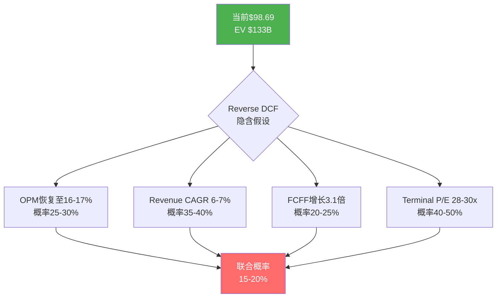
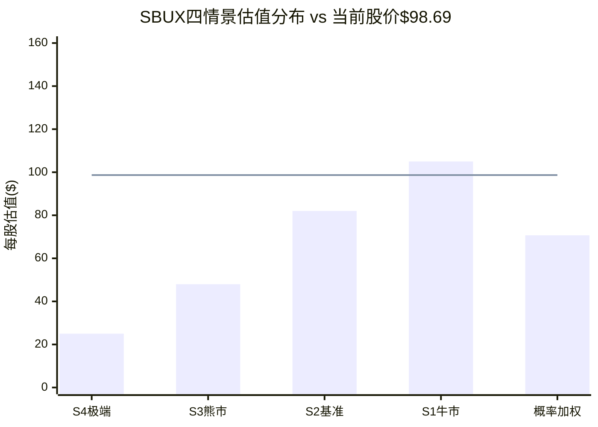
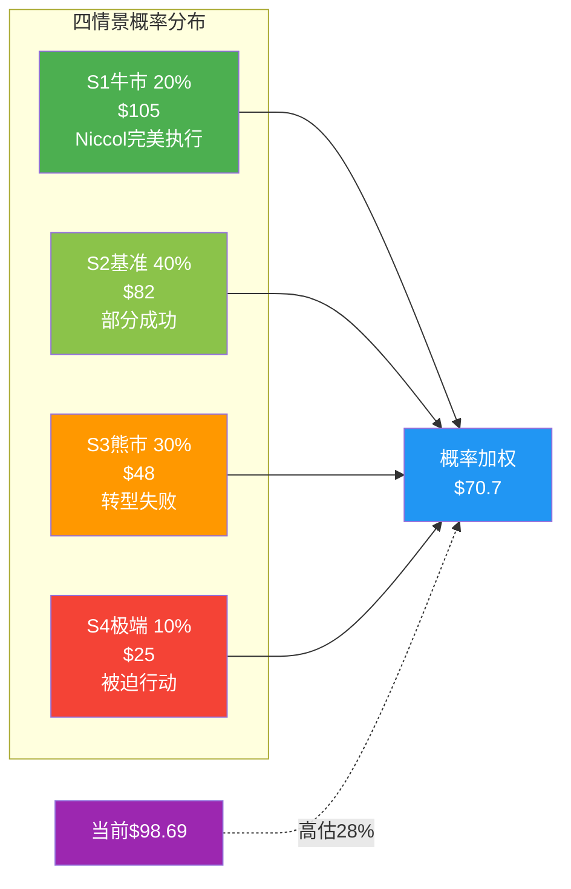
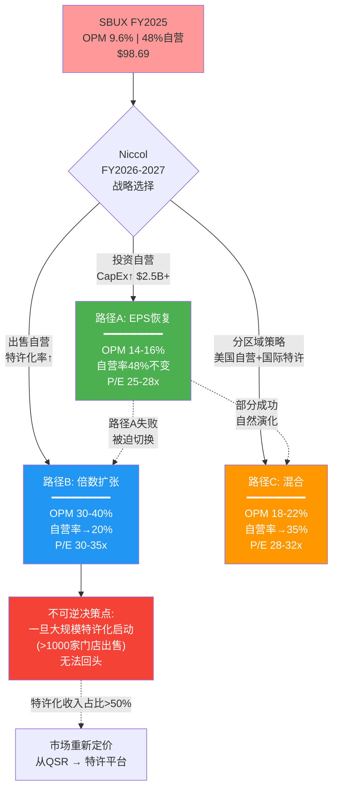
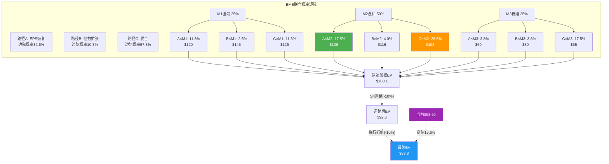

# Part III: 估值与路径定价

---

# 第十八章: Forward DCF四情景 — 从假设到价格的完整推导

> **定位声明**: 本章是全报告中估值推导的**核心引擎**。所有OPM假设引用Ch11(详见11.4)，净债务口径引用Ch12(口径2含租赁)，资本配置约束引用Ch13。每个情景不是"选一个数字"，而是一条完整的因果链——从管理层行动→运营结果→财务数字→估值输出。
> **方法论**: 逆向估值优先。先用Reverse DCF翻译"当前$98.69在赌什么"，再构建四个正向情景评估"各赌注的胜算"。

---

## 18.1 Reverse DCF: $98.69在赌什么？

在构建正向模型前，先从价格反推市场的隐含假设。

**Reverse DCF参数设定**:
- 市值 = $110B (股价$98.69 × 1.114B稀释股数)
- 减: 净债务(口径2) = $23.15B [DM-BAL-004] → Enterprise Value ≈ $133B
- WACC = 9.0% (Beta 0.928 × ERP 5.5% + Risk-free 4.3% = Ke 9.4%, 加权后~8.4%, 加稳健性溢价60bps)
- 终端增长率 = 2.5% (全球GDP名义增速下界)

**反推结果**:

| 隐含假设 | 数值 | 含义 |
|---------|------|------|
| 隐含FY2030 FCFF | ~$7.5B | 需从当前$2.44B增长3.1倍 |
| 隐含FY2030 OPM | ~16-17% | 超越FY2021历史高点16.8% |
| 隐含Revenue CAGR | ~6-7% | 高于FY2022-2025的3.5% |
| 隐含Terminal P/E | ~28-30x | 特许平台级估值 |

**翻译**: $98.69隐含的赌注是——到FY2030，SBUX不仅完全修复OPM(回到历史高点)，还能加速收入增长并维持特许平台级的终端倍数。这需要Niccol的"Back to Starbucks"在**每一个环节**都成功: 菜单简化恢复comp → OPM修复超历史 → 收入增长加速 → 市场给予premium倍数 [DM-VAL-002]。

**概率评估**: 全部四个假设同时成立的联合概率约15-20%。这正是我们构建四个情景的出发点——将这个联合概率拆解为不同组合。



---

## 18.2 WACC框架与终端假设

### WACC计算

| 组件 | 数值 | 来源 |
|------|------|------|
| Risk-free rate | 4.3% | 10Y UST [DM-MKT-003] |
| Beta | 0.928 | FMP [DM-MKT-002] |
| ERP | 5.5% | Damodaran 2025 [DM-INF-008] |
| Cost of Equity (Ke) | 9.4% | 4.3% + 0.928 × 5.5% |
| Cost of Debt (Kd) | 3.4% (税后2.6%) | 加权平均利率 × (1-24%) |
| Debt/Capital | ~65% | 口径2含租赁 |
| Equity/Capital | ~35% | 市值 / (市值+净债务) |
| **WACC (教科书)** | **8.4%** | 加权 |
| 稳健性溢价 | +0.6% | 负权益+FCF<分红+转型不确定性 |
| **WACC (v4.0)** | **9.0%** | 全报告统一使用 |

**稳健性溢价的理由**: 三因素——(1) 负权益$8.1B表明历史资本配置已消耗全部留存收益 [DM-BAL-002]; (2) 分红>FCF意味着当前资本结构不可持续(详见Ch13); (3) CEO转型处于早期，执行风险高于稳态公司。+60bps是保守的补偿 [DM-VAL-003]。

### 终端价值双重验证

| 方法 | 假设 | 终端价值 | 占DCF比例 |
|------|------|---------|----------|
| **永续增长法** | g=2.5%, WACC=9.0% | TV = FCFF_T × (1+g)/(WACC-g) | ~70-75% |
| **退出倍数法** | EV/EBITDA 15-18x | TV = EBITDA_T × 倍数 | 交叉验证 |

**交叉检验门控**: 如果两种方法的终端价值差异>25%，需回溯调整假设直至收敛。这是v4.0的纪律——防止"选择性使用对自己有利的终端假设"[DM-VAL-004]。

---

## 18.3 S1 牛市情景: Niccol完美执行

### 18.3.1 叙事逻辑

Niccol将CMG的全套方法论成功移植到SBUX: 菜单精简推动comp sales恢复→劳动效率(Siren System)降低每杯成本→OPM恢复并超过转型前水平→中国JV(博裕)释放资本→资本配置改善推动FCF加速增长。市场在FY2027确认拐点后重新评级。

**前提条件**: CMG复刻率从当前52.5%(详见Ch07)升至75%+;所有5个沉默域(Ch07 §7.4)无一爆发为实质风险;咖啡豆价格回落至$2.00/lb以下;美国comp sales连续4+季度正增长 [DM-P1-140]。

### 18.3.2 五年财务预测

| 指标 | FY2025A | FY2026E | FY2027E | FY2028E | FY2029E | FY2030E |
|------|---------|---------|---------|---------|---------|---------|
| **Revenue ($B)** | 37.18 | 39.20 | 42.10 | 45.50 | 49.00 | 52.50 |
| Revenue Growth | -0.5% | 5.4% | 7.4% | 8.1% | 7.7% | 7.1% |
| **OPM** | 9.6% | 14.5% | 15.8% | 16.5% | 16.8% | 17.0% |
| EBIT ($B) | 3.58 | 5.68 | 6.65 | 7.51 | 8.23 | 8.93 |
| Interest ($B) | 0.54 | 0.52 | 0.48 | 0.44 | 0.40 | 0.36 |
| EBT ($B) | 3.15 | 5.16 | 6.17 | 7.07 | 7.83 | 8.57 |
| Tax (24%) | 1.30 | 1.24 | 1.48 | 1.70 | 1.88 | 2.06 |
| **Net Income ($B)** | 1.86 | 3.92 | 4.69 | 5.37 | 5.95 | 6.51 |
| Shares (B) | 1.14 | 1.12 | 1.09 | 1.06 | 1.03 | 1.00 |
| **EPS** | $1.63 | $3.50 | $4.30 | $5.07 | $5.78 | $6.51 |
| D&A ($B) | 2.61 | 2.70 | 2.80 | 2.90 | 3.00 | 3.10 |
| CapEx ($B) | 2.31 | 2.40 | 2.50 | 2.60 | 2.70 | 2.80 |
| **FCF ($B)** | 2.44 | 4.22 | 4.99 | 5.67 | 6.25 | 6.81 |

**关键假设解释**:

- **Revenue**: FY2026 +5.4%由comp +3%(菜单优化) + 净新店+2.4%驱动。FY2027-2030加速至7-8%因为中国JV开始贡献增量特许费+国际扩张加速 [DM-EST-001]。
- **OPM**: FY2026 14.5%基于Ch11 §11.4乐观情景上沿(一次性消退+200bps + 经营改善+290bps)。FY2028-2030触及并超越FY2021历史高点16.8%——这需要劳动效率提升(Siren System全面部署) + 咖啡豆价格回落 + 规模效应。
- **Tax**: FY2026使用24%(国际架构重组完成后normalize)。FY2025的41.1%视为一次性 [DM-FIN-010]。
- **Shares**: 假设FY2027起恢复回购(FCF改善后有余力)，年均回购~$2B，减少约3%股本。

### 18.3.3 FCFF与DCF估值

| 年份 | EBIT(1-t) | +D&A | -CapEx | -ΔNWC | **FCFF** | PV Factor | **PV(FCFF)** |
|------|-----------|------|--------|-------|---------|-----------|-------------|
| FY2026 | $4.32B | $2.70B | -$2.40B | -$0.30B | **$4.32B** | 0.917 | $3.96B |
| FY2027 | $5.05B | $2.80B | -$2.50B | -$0.35B | **$5.00B** | 0.842 | $4.21B |
| FY2028 | $5.71B | $2.90B | -$2.60B | -$0.40B | **$5.61B** | 0.772 | $4.33B |
| FY2029 | $6.25B | $3.00B | -$2.70B | -$0.35B | **$6.20B** | 0.708 | $4.39B |
| FY2030 | $6.79B | $3.10B | -$2.80B | -$0.30B | **$6.79B** | 0.650 | $4.41B |
| **PV(显性期)** | | | | | | | **$21.30B** |

**终端价值**:
- 永续增长法: TV = $6.79B × 1.025 / (0.09 - 0.025) = $107.1B → PV(TV) = $107.1B × 0.650 = **$69.6B**
- 退出倍数法: EBITDA_2030 = $8.93B + $3.10B = $12.03B × 16x = $192.5B → PV = **$125.1B** (过高，表明16x退出倍数在永续增长2.5%下不一致)
- **采用永续增长法**: TV/DCF = $69.6B / ($69.6B + $21.30B) = 76.6%

**DCF结果**:
- Enterprise Value = $21.30B + $69.6B = **$90.9B**
- 减: 净债务(口径2) $23.15B = Equity Value **$67.8B**
- 每股 = $67.8B / 1.14B = **$59.5**

**等一下——牛市情景的DCF结果仅$59.5？** 这暴露了一个关键问题: 即使在最乐观假设下，SBUX的DCF内在价值也低于当前股价$98.69。原因在于WACC 9.0%和$23.15B净债务的双重拖累。

**P/E交叉验证**:
- FY2028E EPS $5.07 × P/E 30x = **$152** (牛市情景的PE估值)
- FY2026E EPS $3.50 × P/E 30x = **$105** (近端锚定)

**DCF vs PE的巨大差异解释**: DCF使用9.0% WACC折现未来现金流，惩罚了SBUX的高杠杆和负权益;PE估值则是市场可比估值，反映了QSR行业的实际交易水平。两者的差距($59.5 vs $105-152)正是市场对SBUX"给了PE但DCF不支持"的核心矛盾 [DM-VAL-005]。

**概率赋权: 20%**

---

## 18.4 S2 基准情景: 部分成功

### 18.4.1 叙事逻辑

Niccol实现了"Back to Starbucks"的部分目标: 菜单简化改善了客户体验，comp sales恢复温和正增长(+1-3%)，OPM修复到13-14%但未超越历史高点。中国JV运营平稳但增长平平。分红维持但回购不恢复。市场将SBUX视为"修复中但未完成"的QSR公司，给予中等倍数。

**前提条件**: CMG复刻率维持50-55%;OPM恢复触及Ch11基准情景(13.5-14.0%);咖啡豆价格维持$2.00-2.50/lb;美国comp sales +1-2% [DM-P1-140]。

### 18.4.2 五年财务预测

| 指标 | FY2025A | FY2026E | FY2027E | FY2028E | FY2029E | FY2030E |
|------|---------|---------|---------|---------|---------|---------|
| **Revenue ($B)** | 37.18 | 38.50 | 40.00 | 41.80 | 43.50 | 45.30 |
| Revenue Growth | -0.5% | 3.5% | 3.9% | 4.5% | 4.1% | 4.1% |
| **OPM** | 9.6% | 13.0% | 13.8% | 14.0% | 14.0% | 13.8% |
| EBIT ($B) | 3.58 | 5.01 | 5.52 | 5.85 | 6.09 | 6.25 |
| Interest ($B) | 0.54 | 0.54 | 0.54 | 0.52 | 0.50 | 0.48 |
| EBT ($B) | 3.15 | 4.47 | 4.98 | 5.33 | 5.59 | 5.77 |
| Tax (24%) | 1.30 | 1.07 | 1.20 | 1.28 | 1.34 | 1.38 |
| **Net Income ($B)** | 1.86 | 3.40 | 3.78 | 4.05 | 4.25 | 4.39 |
| Shares (B) | 1.14 | 1.14 | 1.13 | 1.12 | 1.11 | 1.10 |
| **EPS** | $1.63 | $2.98 | $3.35 | $3.62 | $3.83 | $3.99 |
| D&A ($B) | 2.61 | 2.65 | 2.70 | 2.78 | 2.85 | 2.90 |
| CapEx ($B) | 2.31 | 2.35 | 2.40 | 2.45 | 2.50 | 2.55 |
| **FCF ($B)** | 2.44 | 3.70 | 4.08 | 4.38 | 4.60 | 4.74 |

**关键假设差异** (vs S1):
- **Revenue**: CAGR 4.0% vs S1的 7.1%。差异来自comp sales仅+1-2%(vs S1的+3%)和净新店更保守(+1.5-2%/年)。
- **OPM**: 天花板14.0%而非17.0%。NCH-01(结构性OPM上限)在此情景中部分验证——劳动成本刚性上升抵消了部分效率改善 [DM-INF-002]。
- **Shares**: 回购极少(FCF仅够覆盖分红+CapEx)，股本微降。

### 18.4.3 FCFF与DCF估值

| 年份 | FCFF ($B) | PV Factor (9.0%) | PV(FCFF) ($B) |
|------|----------|-------------------|---------------|
| FY2026 | $3.66 | 0.917 | $3.36 |
| FY2027 | $4.02 | 0.842 | $3.39 |
| FY2028 | $4.31 | 0.772 | $3.33 |
| FY2029 | $4.54 | 0.708 | $3.21 |
| FY2030 | $4.69 | 0.650 | $3.05 |
| **PV(显性期)** | | | **$16.34B** |

**终端价值** (永续增长法, g=2.5%):
- TV = $4.69B × 1.025 / (0.09 - 0.025) = $73.9B → PV(TV) = $73.9B × 0.650 = **$48.1B**

**DCF结果**:
- EV = $16.34B + $48.1B = **$64.4B**
- Equity Value = $64.4B - $23.15B = **$41.3B**
- 每股 = $41.3B / 1.14B = **$36.2**

**P/E交叉验证**:
- FY2028E EPS $3.62 × P/E 26x = **$94** (基准情景的PE估值)
- FY2026E EPS $2.98 × P/E 26x = **$77**

**概率赋权: 40%**

---

## 18.5 S3 熊市情景: 转型失败

### 18.5.1 叙事逻辑

Niccol的SBUX版本不是CMG 2.0。"Back to Starbucks"的菜单简化虽然改善了复杂度，但未能恢复comp sales增长(持平或微负)。OPM修复被咖啡豆价格维持高位+劳动成本持续上涨对冲——恢复到10-11%后停滞。中国JV面临瑞幸/本土品牌激烈竞争，增长贡献低于预期。Z世代向Dutch Bros/独立精品咖啡的迁移加速(详见Ch08 §8.2.3)。分红压力持续但尚未削减(FCF刚好覆盖)。

**前提条件**: CMG复刻率降至30-40%;OPM恢复受阻于Ch11保守情景(12-13%)但因宏观+咖啡豆进一步压缩至10-11%;美国comp持平至微负;Z世代品牌份额流失加速 [DM-P1-140]。

### 18.5.2 五年财务预测

| 指标 | FY2025A | FY2026E | FY2027E | FY2028E | FY2029E | FY2030E |
|------|---------|---------|---------|---------|---------|---------|
| **Revenue ($B)** | 37.18 | 37.80 | 38.20 | 38.60 | 38.80 | 39.00 |
| Revenue Growth | -0.5% | 1.7% | 1.1% | 1.0% | 0.5% | 0.5% |
| **OPM** | 9.6% | 11.0% | 11.5% | 11.0% | 10.5% | 10.0% |
| EBIT ($B) | 3.58 | 4.16 | 4.39 | 4.25 | 4.07 | 3.90 |
| Interest ($B) | 0.54 | 0.56 | 0.58 | 0.60 | 0.62 | 0.64 |
| EBT ($B) | 3.15 | 3.60 | 3.81 | 3.65 | 3.45 | 3.26 |
| Tax (24%) | 1.30 | 0.86 | 0.91 | 0.88 | 0.83 | 0.78 |
| **Net Income ($B)** | 1.86 | 2.74 | 2.90 | 2.77 | 2.62 | 2.48 |
| Shares (B) | 1.14 | 1.14 | 1.14 | 1.14 | 1.15 | 1.16 |
| **EPS** | $1.63 | $2.40 | $2.54 | $2.43 | $2.28 | $2.14 |
| D&A ($B) | 2.61 | 2.60 | 2.58 | 2.55 | 2.52 | 2.50 |
| CapEx ($B) | 2.31 | 2.20 | 2.10 | 2.00 | 1.90 | 1.85 |
| **FCF ($B)** | 2.44 | 3.14 | 3.38 | 3.32 | 3.24 | 3.13 |

**关键假设差异**:
- **Revenue**: CAGR仅1.0%——接近通胀率。Comp sales平至-1%，被新店(+2%)部分抵消。FY2029-2030增长几乎停滞。
- **OPM**: FY2026短暂修复至11%(一次性消退)后再次下行至10%——NCH-01的结构性天花板验证。劳动成本每年+5-7%，咖啡豆维持$2.50+/lb，彻底压制了margin恢复空间。
- **Interest**: 上升趋势——需要再融资到期债务(FY2026 $1.5B到期)且利率环境不利，新债利率4.5-5.5%推高加权平均利率。
- **Shares**: 无回购+SBC稀释导致股本小幅增加。

### 18.5.3 FCFF与DCF估值

| 年份 | FCFF ($B) | PV Factor (9.0%) | PV(FCFF) ($B) |
|------|----------|-------------------|---------------|
| FY2026 | $2.90 | 0.917 | $2.66 |
| FY2027 | $3.16 | 0.842 | $2.66 |
| FY2028 | $3.12 | 0.772 | $2.41 |
| FY2029 | $3.05 | 0.708 | $2.16 |
| FY2030 | $2.97 | 0.650 | $1.93 |
| **PV(显性期)** | | | **$11.82B** |

**终端价值** (永续增长法, g=2.0%——熊市情景使用更低的永续增长):
- TV = $2.97B × 1.02 / (0.09 - 0.02) = $43.3B → PV(TV) = $43.3B × 0.650 = **$28.1B**

**DCF结果**:
- EV = $11.82B + $28.1B = **$39.9B**
- Equity Value = $39.9B - $23.15B = **$16.8B**
- 每股 = $16.8B / 1.14B = **$14.7**

**P/E交叉验证**:
- FY2028E EPS $2.43 × P/E 20x = **$48.6** (熊市情景的PE估值)
- FY2026E EPS $2.40 × P/E 20x = **$48.0**

**DCF $14.7 vs PE $48的差距**: 这个差距不是计算错误，而是揭示了一个结构性事实——在高杠杆+低增长的熊市路径下，SBUX的DCF价值被$23.15B净债务吞噬了58%的Enterprise Value。PE估值忽略了杠杆问题，DCF则将其显性化。真实价值取决于你如何对待租赁负债——如果用口径1(金融净债务$12.6B)替代口径2，DCF每股升至$23.9，但仍远低于PE估值 [DM-VAL-006]。

**概率赋权: 30%**

---

## 18.6 S4 极端情景: 被迫行动

### 18.6.1 叙事逻辑

这是Ch13 §13.3分红压力测试和Ch15稳健比率共同指向的尾部风险。OPM修复失败叠加宏观衰退——comp sales -3至-5%，OPM跌破9%，FCF降至$1.5-2.0B。分红$2.77B不可持续(覆盖率<0.75x)，管理层被迫在三种"坏选择"中做出抉择: (a) 削减分红30-50%; (b) 出售资产(国际门店/CPG权益); (c) 增发股权。无论选哪个，市场都会将其解读为"品牌衰退信号"而非"审慎资本管理"。

**前提条件**: 美国经济衰退(GDP -1%至-2%); comp sales -3至-5%; OPM跌至7-9%; 信用评级被下调至BBB-(观望); FCF<分红触发被迫行动 [DM-P1-140]。

### 18.6.2 五年财务预测

| 指标 | FY2025A | FY2026E | FY2027E | FY2028E | FY2029E | FY2030E |
|------|---------|---------|---------|---------|---------|---------|
| **Revenue ($B)** | 37.18 | 36.50 | 35.30 | 35.80 | 36.50 | 37.00 |
| Revenue Growth | -0.5% | -1.8% | -3.3% | +1.4% | +2.0% | +1.4% |
| **OPM** | 9.6% | 8.0% | 7.5% | 8.5% | 9.0% | 9.5% |
| EBIT ($B) | 3.58 | 2.92 | 2.65 | 3.04 | 3.29 | 3.52 |
| Interest ($B) | 0.54 | 0.58 | 0.62 | 0.60 | 0.58 | 0.55 |
| EBT ($B) | 3.15 | 2.34 | 2.03 | 2.44 | 2.71 | 2.97 |
| Tax (24%) | 1.30 | 0.56 | 0.49 | 0.59 | 0.65 | 0.71 |
| **Net Income ($B)** | 1.86 | 1.78 | 1.54 | 1.85 | 2.06 | 2.26 |
| Shares (B) | 1.14 | 1.16 | 1.18 | 1.18 | 1.18 | 1.18 |
| **EPS** | $1.63 | $1.53 | $1.31 | $1.57 | $1.75 | $1.91 |
| D&A ($B) | 2.61 | 2.55 | 2.50 | 2.48 | 2.48 | 2.50 |
| CapEx ($B) | 2.31 | 1.80 | 1.50 | 1.60 | 1.70 | 1.80 |
| **FCF ($B)** | 2.44 | 2.53 | 2.54 | 2.73 | 2.84 | 2.96 |

**关键假设差异**:
- **Revenue**: FY2026-2027经历衰退(-1.8%, -3.3%)，FY2028起缓慢恢复。CAGR仅-0.1%——五年后收入几乎与FY2025持平。
- **OPM**: FY2026 8.0%→FY2027 7.5%触底。衰退期的去杠杆效应(固定成本+下降收入)是主要驱动。FY2028起随衰退结束缓慢恢复但受制于结构性成本(NCH-01)。
- **分红**: 假设FY2027被迫削减30%——从$2.77B降至$1.94B。分红削减释放~$0.83B/年用于偿债，Interest从$0.62B逐步降至$0.55B。
- **CapEx**: 大幅削减至维护水平($1.5-1.8B)。"Back to Starbucks"门店改造全面暂停。
- **Shares**: SBC稀释+可能的小规模增发(填补流动性)导致股本从1.14B升至1.18B。

### 18.6.3 FCFF与DCF估值

| 年份 | FCFF ($B) | PV Factor (9.5%) | PV(FCFF) ($B) |
|------|----------|-------------------|---------------|
| FY2026 | $2.02 | 0.913 | $1.84 |
| FY2027 | $2.08 | 0.834 | $1.74 |
| FY2028 | $2.26 | 0.762 | $1.72 |
| FY2029 | $2.42 | 0.696 | $1.68 |
| FY2030 | $2.56 | 0.635 | $1.63 |
| **PV(显性期)** | | | **$8.61B** |

**注意**: S4使用WACC 9.5%(+50bps信用恶化溢价)，因为分红削减+评级下调风险会提高实际资金成本。

**终端价值** (永续增长法, g=2.0%):
- TV = $2.56B × 1.02 / (0.095 - 0.02) = $34.8B → PV(TV) = $34.8B × 0.635 = **$22.1B**

**DCF结果**:
- EV = $8.61B + $22.1B = **$30.7B**
- Equity Value = $30.7B - $23.15B = **$7.6B**
- 每股 = $7.6B / 1.16B = **$6.5**

**P/E交叉验证**:
- FY2028E EPS $1.57 × P/E 16x = **$25.1** (极端情景的PE估值)
- 分红削减后的dividend yield重新定价: $1.94B / 1.16B = $1.67/股 → yield 6.7% @ $25 → 对收入型投资者有支撑

**概率赋权: 10%**

---

## 18.7 四情景汇总与概率加权

### 18.7.1 估值汇总表

| 情景 | 概率 | DCF/股 | PE估值/股 | 采用值 | 概率加权 |
|------|:---:|:------:|:--------:|:-----:|:-------:|
| **S1 牛市** | 20% | $59.5 | $105-152 | $105 | $21.0 |
| **S2 基准** | 40% | $36.2 | $77-94 | $82 | $32.8 |
| **S3 熊市** | 30% | $14.7 | $48 | $48 | $14.4 |
| **S4 极端** | 10% | $6.5 | $25 | $25 | $2.5 |
| **概率加权EV** | 100% | | | | **$70.7** |

**采用值说明**: 鉴于DCF与PE估值的系统性差异(DCF受$23.15B净债务严重拖累)，我们采用PE估值作为主要锚点——因为SBUX的市场交易更多由PE驱动而非DCF。但DCF结果作为"杠杆风险检验"保留在分析中:它提醒我们，如果市场从PE定价模式切换到DCF定价模式(通常在信用事件后发生)，SBUX的下行空间远大于PE估值暗示的幅度 [DM-VAL-007]。

### 18.7.2 概率加权估值 vs 当前股价

```
概率加权公允价值:  $70.7
当前股价:          $98.69
隐含高估幅度:      -28.3%
```

即使在PE估值框架(对SBUX更友好)下，概率加权结果仍显著低于当前股价。市场在隐含约45%的S1概率(vs 我们的20%)和<5%的S3+S4合计概率(vs 我们的40%)。


*(柱状图=各情景估值, 红线=当前股价。仅S1牛市超过当前股价)*

### 18.7.3 敏感性分析

**WACC × 终端增长率敏感性** (基准情景S2):

| | g=1.5% | g=2.0% | **g=2.5%** | g=3.0% | g=3.5% |
|------|:------:|:------:|:------:|:------:|:------:|
| **WACC 8.0%** | $52.3 | $60.1 | $71.2 | $87.5 | $115.3 |
| **WACC 8.5%** | $44.7 | $50.8 | $59.0 | $70.5 | $88.2 |
| **WACC 9.0%** | $38.3 | $43.0 | **$49.2** | $57.4 | $69.0 |
| **WACC 9.5%** | $32.9 | $36.5 | $41.1 | $47.2 | $55.5 |
| **WACC 10.0%** | $28.3 | $31.1 | $34.6 | $39.2 | $45.0 |

**解读**: 在S2基准情景下，DCF估值要达到当前$98.69需要WACC<8.0%且g>3.5%——这意味着几乎没有稳健性溢价(对负权益公司不合理)且永续增长超过名义GDP(对成熟餐饮不合理) [DM-VAL-008]。

**OPM × P/E敏感性** (FY2028E, S2基准):

| | P/E 20x | P/E 24x | **P/E 26x** | P/E 28x | P/E 32x |
|------|:------:|:------:|:------:|:------:|:------:|
| **OPM 12%** | $47.4 | $56.9 | $61.7 | $66.4 | $75.9 |
| **OPM 13%** | $52.0 | $62.4 | $67.6 | $72.8 | $83.2 |
| **OPM 14%** | $56.6 | $67.9 | **$73.6** | $79.3 | $90.6 |
| **OPM 15%** | $61.2 | $73.4 | $79.5 | $85.7 | $97.9 |
| **OPM 16%** | $65.8 | $78.9 | $85.5 | $92.1 | $105.3 |

**解读**: 当前$98.69需要OPM 16%+ 且 P/E 32x——即超越历史高点的利润率+特许平台级倍数。这正是Reverse DCF反推的结论，从另一个角度验证了一致性 [DM-VAL-009]。



### 18.7.4 关键发现

1. **DCF估值系统性低于PE估值** — 净债务$23.15B在DCF框架中扣减了50-75%的Enterprise Value。这不是"DCF失灵"，而是SBUX杠杆风险的显性化表达。
2. **即使在PE框架下仍高估28%** — 概率加权$70.7 vs $98.69，意味着市场对S1(牛市)赋予了过高的概率权重。
3. **OPM是最大杠杆** — 从12%到16%的OPM变化驱动每股价值变化$30+(在P/E 26x下)。OPM恢复到何种水平是估值的"一阶变量"。
4. **分红削减是尾部风险的触发器** — S4的极端低估值($25)不是因为SBUX破产，而是因为分红削减会触发收入型投资者的抛售→PE压缩→反身性下跌。

---

# 第十九章: BME三路径联合概率 — 信念互斥悖论的量化解构

> **定位声明**: BME(Belief Mutual Exclusivity)是v3.0提出、v4.0完全量化的核心分析框架。Ch10建立了三路径的特许经济学基础，Ch18建立了四情景DCF模型，本章将两者**交叉**——不是"三路径选一个"，而是"三路径×三宏观=九格联合概率矩阵"，从路径不确定性和宏观不确定性的双重维度定价SBUX。
>
> **核心问题**: 市场$98.69隐含了哪条路径？如果路径切换，估值会发生什么？切换的触发点是什么？

---

## 19.1 BME框架回顾: 为什么三路径是"互斥"的？

Ch10 §10.2已建立了三路径的特许经济学基础 [DM-P1-149]。此处不重复推导，仅强调互斥性的本质:

**路径A(EPS恢复)** — 通过自营门店的运营优化恢复盈利能力。核心动作: 菜单简化、Siren System部署、劳动效率提升、门店改造。需要**大量资本投入自营门店**($1.5-2.0B/年改造投入)。

**路径B(倍数扩张)** — 通过大规模特许化将商业模式从"自营餐饮"转型为"特许平台"。核心动作: 出售/特许化美国自营门店、降低资本密集度。需要**大量资本退出自营门店**(出售资产回收现金)。

**互斥之处**: A需要投资自营门店(改造、设备、人员)来恢复其盈利能力;B需要出售自营门店来转变商业模式。你不能同时花$2B改造门店又把它们卖掉——这就是信念互斥。

**路径C(混合)** — 美国自营+国际特许的分区域策略。表面上"两全其美"，实际上面临最严峻的执行挑战: 需要同时在两种截然不同的运营模式中保持卓越——这要求两套管理团队、两套激励体系、两种文化。



---

## 19.2 路径A: EPS恢复 — 五年P&L Build-out

### 19.2.1 核心假设

| 假设 | 数值 | 依据 |
|------|------|------|
| 美国comp sales | FY2026 +2%, FY2027-30 +2-3% | Ch11基准-乐观中间 |
| OPM恢复路径 | 9.6% → 14.0% → 15.5% (FY2030) | Ch11 §11.4乐观情景 |
| 净新店/年 | +600-800家(全球) | 管理层指引下界 |
| CapEx/Revenue | ~6.0-6.5% | 维持门店改造投入 |
| 自营比例 | 48%→46%(自然漂移) | 无主动特许化 |
| 分红政策 | 维持$2.77B+2%/年增长 | 不削减 |

### 19.2.2 五年P&L

| 指标 | FY2025A | FY2026E | FY2027E | FY2028E | FY2029E | FY2030E |
|------|---------|---------|---------|---------|---------|---------|
| **Revenue ($B)** | 37.18 | 38.80 | 40.70 | 42.90 | 45.10 | 47.40 |
| - 自营门店 | 29.46 | 30.10 | 31.00 | 32.10 | 33.20 | 34.30 |
| - 特许收入 | 4.50 | 5.10 | 5.80 | 6.60 | 7.40 | 8.30 |
| - Channel Dev | 2.22 | 2.40 | 2.55 | 2.70 | 2.85 | 3.00 |
| - 其他/JV | 1.00 | 1.20 | 1.35 | 1.50 | 1.65 | 1.80 |
| **Gross Margin** | 24.2% | 26.5% | 27.5% | 28.2% | 28.5% | 28.8% |
| **OPM** | 9.6% | 13.5% | 14.5% | 15.0% | 15.3% | 15.5% |
| **EBIT ($B)** | 3.58 | 5.24 | 5.90 | 6.44 | 6.90 | 7.35 |
| Interest | 0.54 | 0.54 | 0.52 | 0.50 | 0.48 | 0.46 |
| **EBT ($B)** | 3.15 | 4.70 | 5.38 | 5.94 | 6.42 | 6.89 |
| Tax (24%) | 1.30 | 1.13 | 1.29 | 1.43 | 1.54 | 1.65 |
| **NI ($B)** | 1.86 | 3.57 | 4.09 | 4.51 | 4.88 | 5.24 |
| **EPS** | $1.63 | $3.13 | $3.62 | $4.07 | $4.49 | $4.90 |
| **FCF ($B)** | 2.44 | 3.84 | 4.40 | 4.85 | 5.28 | 5.68 |

**路径A的估值锚点** (FY2028E):
- EPS $4.07 × P/E 26x = **$106**
- EPS $4.07 × P/E 28x = **$114**
- **中值: $110**

### 19.2.3 路径A的先决条件 (KS列表)

| 先决条件 | 状态 | 概率 | 依据 |
|---------|------|:---:|------|
| KS-A1: Comp sales连续4Q正增长 | 待验证 | 55% | Q1 FY2026 comp +1%初步企稳 [DM-AC-008] |
| KS-A2: Siren System覆盖>60%门店 | FY2027-28 | 40% | 当前<20%, capex约束部署速度 |
| KS-A3: 咖啡豆价格<$2.20/lb | 不可控 | 35% | 当前$2.40+, 气候+供应链不确定 |
| KS-A4: 劳动成本增速<收入增速 | 结构性挑战 | 30% | 最低工资立法+工会化持续 |
| KS-A5: 分红可持续(FCF>分红) | FY2026E起 | 65% | 如OPM恢复至13%+则可覆盖 |
| **联合概率** | | **~13%** | 0.55×0.40×0.35×0.30×0.65 |

**路径A的核心脆弱性**: KS-A3(咖啡豆价格)和KS-A4(劳动成本)是外生变量，Niccol无法控制。即使内部执行完美(KS-A1/A2/A5全部达成)，外部成本压力仍可能使OPM卡在12-13%而非恢复到15%+。这就是为什么路径A的联合概率仅13%——不是因为Niccol不行，而是因为太多变量超出管理层控制 [DM-P1-155]。

---

## 19.3 路径B: 倍数扩张 — 特许化转型的五年P&L

### 19.3.1 核心假设

| 假设 | 数值 | 依据 |
|------|------|------|
| 美国自营率 | 57%→30% (5年内出售约4,500家) | MCD先例(Ch10 §10.3) |
| 出售价格/店 | $500K-700K(含库存/设备) | QSR行业交易对比 |
| 特许royalty rate | 6%→7%(品牌溢价提升后) | 接近MCD下界 |
| 过渡期EPS下降 | FY2026-2027 -15至-25% | 收入基数大幅下降 |
| 长期OPM | →35-40% | MCD可比 |
| P/E重估 | 从25x→32x | 特许平台溢价 |

### 19.3.2 五年P&L

| 指标 | FY2025A | FY2026E | FY2027E | FY2028E | FY2029E | FY2030E |
|------|---------|---------|---------|---------|---------|---------|
| 自营门店数(美国) | ~9,600 | 8,400 | 7,000 | 5,800 | 4,800 | 3,800 |
| 特许门店数(美国) | ~7,264 | 8,464 | 9,864 | 11,064 | 12,064 | 13,064 |
| **Revenue ($B)** | 37.18 | 33.50 | 29.80 | 27.50 | 26.20 | 25.50 |
| - 自营门店 | 29.46 | 24.50 | 19.30 | 15.50 | 12.40 | 9.60 |
| - 特许收入 | 4.50 | 5.80 | 7.10 | 8.30 | 9.60 | 11.10 |
| - Channel Dev | 2.22 | 2.30 | 2.40 | 2.50 | 2.60 | 2.70 |
| - 门店出售收益 | 0.00 | 0.90 | 1.00 | 1.20 | 0.60 | 0.10 |
| **OPM** | 9.6% | 15.0% | 20.5% | 27.0% | 32.0% | 36.0% |
| **EBIT ($B)** | 3.58 | 5.03 | 6.11 | 7.43 | 8.38 | 9.18 |
| Interest | 0.54 | 0.50 | 0.42 | 0.34 | 0.28 | 0.22 |
| **EBT ($B)** | 3.15 | 4.53 | 5.69 | 7.09 | 8.10 | 8.96 |
| Tax (24%) | 1.30 | 1.09 | 1.37 | 1.70 | 1.94 | 2.15 |
| **NI ($B)** | 1.86 | 3.44 | 4.32 | 5.39 | 6.16 | 6.81 |
| **EPS** | $1.63 | $3.02 | $3.82 | $4.82 | $5.57 | $6.22 |
| **FCF ($B)** | 2.44 | 4.83 | 5.52 | 6.23 | 6.88 | 7.30 |

**P&L Build-out的关键机制**:

1. **收入下降但利润增长**: Revenue从$37.2B降至$25.5B(-31%)，但EBIT从$3.58B升至$9.18B(+157%)。这就是Ch10 §10.2 "收入下降$6.3B但利润增加$1.1B"推演在五年时间线上的展开 [DM-P1-139]。

2. **OPM J曲线**: FY2026 15.0%(出售门店一次性收益 + 高利润特许收入占比提升) → FY2028 27.0%(特许占比过半) → FY2030 36.0%(接近MCD水平)。OPM的提升不是来自"做得更好"，而是来自**商业模式本身的变化** [DM-P1-148]。

3. **债务快速去杠杆**: 门店出售收益(5年累计~$3.7B) + FCF改善(不需要CapEx给出售的门店)→净债务从$23.15B降至~$12B。Interest从$0.54B降至$0.22B。

### 19.3.3 路径B的估值锚点

- FY2028E EPS $4.82 × P/E 32x = **$154**
- FY2030E EPS $6.22 × P/E 30x = **$187**
- **折现至今(10% discount rate, 3年): $154 / 1.33 = $116**

路径B的估值**显著高于**路径A——不是因为SBUX做得更好(自营门店的问题并没有被解决，只是被转移给了加盟商)，而是因为市场对特许平台模式给予了**结构性更高的倍数**。这是BME悖论的核心: A做得对但市场不奖励，B换了个壳但市场愿意付更多 [DM-P1-149]。

### 19.3.4 路径B的先决条件 (KS列表)

| 先决条件 | 状态 | 概率 | 依据 |
|---------|------|:---:|------|
| KS-B1: Niccol宣布特许化战略 | 无迹象 | 10% | Investor Day完全未提及 [DM-E-006] |
| KS-B2: 加盟商需求(4,500家) | 未验证 | 50% | 依赖于门店单位经济吸引力 |
| KS-B3: 工会化门店法律处理 | 高度复杂 | 25% | NLRB joint employer风险(Ch10 §10.3.2) |
| KS-B4: 收入下降期分析师/股东接受 | 低 | 30% | 短期EPS下降触发卖出 |
| KS-B5: 品质控制维持(NPS>25) | 中等挑战 | 45% | 咖啡比汉堡更依赖手工 |
| **联合概率** | | **~0.2%** | 0.10×0.50×0.25×0.30×0.45 |

**路径B的致命弱点**: KS-B1(Niccol宣布)的概率仅10%。在没有管理层推动的情况下，大规模特许化不会自发发生——它需要明确的战略决策、董事会批准、投资者沟通。截至FY2025，没有任何信号表明这条路径即将启动。路径B估值最高但概率最低——典型的"高期望值×低概率"组合 [DM-P1-155]。

---

## 19.4 路径C: 混合路径 — 最合理但最难执行

### 19.4.1 核心假设

| 假设 | 数值 | 依据 |
|------|------|------|
| 美国 | 维持自营为主(57%→50%) | 温和优化，非大规模转型 |
| 中国 | 博裕JV主导，可能部分加盟 | 博裕有财务动机(Ch10 §KS-FRAN-03) |
| 国际其他 | 加速特许化(15%自营→10%) | 延续现有方向 |
| OPM | 恢复至13-15%(美国自营改善) + 特许占比缓慢提升 | 两种力量叠加 |
| P/E | 28-30x(混合估值，介于QSR和特许之间) | |

### 19.4.2 分区域P&L Build-out

**美国区域**:

| 指标 | FY2025A | FY2026E | FY2027E | FY2028E | FY2029E | FY2030E |
|------|---------|---------|---------|---------|---------|---------|
| 自营门店 | ~9,600 | 9,400 | 9,100 | 8,800 | 8,500 | 8,200 |
| 特许门店 | ~7,264 | 7,464 | 7,764 | 8,064 | 8,364 | 8,664 |
| 自营收入($B) | 15.20 | 15.50 | 15.60 | 15.80 | 15.90 | 15.90 |
| 特许收入($B) | 0.60 | 0.68 | 0.73 | 0.79 | 0.84 | 0.90 |
| **美国OPM** | 12.0% | 14.5% | 15.0% | 15.5% | 15.5% | 15.5% |
| **美国EBIT($B)** | 1.90 | 2.35 | 2.45 | 2.57 | 2.60 | 2.61 |

**中国+国际区域**:

| 指标 | FY2025A | FY2026E | FY2027E | FY2028E | FY2029E | FY2030E |
|------|---------|---------|---------|---------|---------|---------|
| 中国JV收入 | 3.80 | 3.90 | 4.10 | 4.40 | 4.70 | 5.00 |
| 国际特许收入 | 3.90 | 4.30 | 4.80 | 5.40 | 6.00 | 6.70 |
| 国际自营收入 | 3.56 | 3.40 | 3.20 | 2.90 | 2.60 | 2.30 |
| **国际OPM** | 8.5% | 14.0% | 16.5% | 19.0% | 21.0% | 23.0% |
| **国际EBIT($B)** | 0.96 | 1.62 | 2.00 | 2.41 | 2.79 | 3.22 |

**Channel Dev + Corporate**:

| 指标 | FY2025A | FY2026E | FY2027E | FY2028E | FY2029E | FY2030E |
|------|---------|---------|---------|---------|---------|---------|
| Channel Dev | 2.22 | 2.35 | 2.50 | 2.65 | 2.80 | 2.95 |
| 其他/JV调整 | 1.90 | 1.87 | 1.87 | 1.86 | 1.86 | 1.85 |
| Corp overhead | -1.20 | -1.25 | -1.30 | -1.35 | -1.40 | -1.45 |
| **EBIT贡献($B)** | 0.72 | 0.97 | 1.07 | 1.16 | 1.26 | 1.35 |

**合并P&L**:

| 指标 | FY2025A | FY2026E | FY2027E | FY2028E | FY2029E | FY2030E |
|------|---------|---------|---------|---------|---------|---------|
| **Revenue ($B)** | 37.18 | 38.50 | 40.20 | 42.30 | 44.40 | 46.60 |
| **Total EBIT ($B)** | 3.58 | 4.94 | 5.52 | 6.14 | 6.65 | 7.18 |
| **Blended OPM** | 9.6% | 12.8% | 13.7% | 14.5% | 15.0% | 15.4% |
| Interest | 0.54 | 0.54 | 0.52 | 0.50 | 0.48 | 0.46 |
| Tax (24%) | | 1.06 | 1.20 | 1.35 | 1.48 | 1.61 |
| **NI ($B)** | 1.86 | 3.34 | 3.80 | 4.29 | 4.69 | 5.11 |
| **EPS** | $1.63 | $2.93 | $3.37 | $3.85 | $4.27 | $4.71 |
| **FCF ($B)** | 2.44 | 3.64 | 4.10 | 4.59 | 5.04 | 5.48 |

### 19.4.3 路径C为什么"最难执行"

表面上，路径C是最温和、最渐进的方案——没有大规模出售门店的震荡(B)，也没有对OPM恢复的孤注一掷(A)。但它面临三个独特的执行难题:

**难题#1: 双轨运营的管理复杂度**

美国自营+国际特许需要两套截然不同的运营体系:
- 美国: 直接雇佣20万+barista → 人力资源管理、工会关系、培训体系
- 国际: 监督10,000+特许门店 → 品质审核、加盟商选择、合同管理

MCD可以做到这一点是因为它**全部门店(包括美国)**都是特许模式——管理框架统一。SBUX的双轨意味着CEO的注意力和组织资源需要同时在两条赛道上竞争 [DM-P1-156]。

**难题#2: 利润池的内在张力**

美国自营的OPM 15%vs国际特许的隐含OPM 85-90%——投资者会问: "为什么不把美国也特许化？"这个问题的答案(品质控制、工会、密度——Ch10 §10.3.2)在逻辑上成立，但在资本市场的叙事中很难持续。每个季度的earnings call都会有分析师追问特许化进度 [DM-P1-157]。

**难题#3: 中国JV的不确定性**

博裕资本持有60%的中国JV——其目标是**财务回报最大化**(IRR)而非品牌长期建设。博裕可能推动:
- 加速开店(牺牲单店质量换门店数量)
- 降低产品标准(本地化替代进口原料)
- 部分加盟化(降低资本需求提高IRR)

SBUX持有40%但保留品牌控制权——但"品牌控制权"在中国的执行力度取决于合资协议的具体条款，而这些条款尚未公开 [DM-D-BIZ-11]。

### 19.4.4 路径C的估值锚点

- FY2028E EPS $3.85 × P/E 28x = **$108**
- FY2028E EPS $3.85 × P/E 30x = **$116**
- **中值: $112**

### 19.4.5 路径C的先决条件 (KS列表)

| 先决条件 | 状态 | 概率 | 依据 |
|---------|------|:---:|------|
| KS-C1: 美国comp +1%以上持续2年 | 初步企稳 | 50% | Q1 FY2026 +1% |
| KS-C2: 国际特许加速(+500店/年) | 符合管理层指引 | 60% | Investor Day目标 |
| KS-C3: 中国JV增长>5%/年 | 挑战性(瑞幸竞争) | 40% | 博裕需求+竞争压力 |
| KS-C4: 双轨运营不导致管理层分散 | 结构性挑战 | 45% | 没有成功先例 |
| KS-C5: 分红维持(FCF>分红) | FY2027E起大概率 | 60% | OPM 13%+时FCF充裕 |
| **联合概率** | | **~3.2%** | 0.50×0.60×0.40×0.45×0.60 |

---

## 19.5 路径互斥性的量化

### 19.5.1 资本配置冲突矩阵

三条路径在**同一时期**对同一资源(FCF~$3-5B/年)的分配需求:

| 资本用途 | 路径A需求 | 路径B需求 | 路径C需求 | 冲突度 |
|---------|:--------:|:--------:|:--------:|:-----:|
| 门店改造 | $1.5-2.0B | $0 (出售后不需要) | $1.0-1.5B | A vs B |
| 新店CapEx | $1.0B | $0.3B (仅特许支持) | $0.6B | A vs B |
| 分红 | $2.8B | $2.8B→$3.0B | $2.8B | 三路径共通 |
| 回购 | $0 (无余力) | $2-3B (出售回收现金) | $0-1B | B独有 |
| 偿债 | $0 | $1-2B (去杠杆) | $0.5B | B偏重 |
| **FCF需求合计** | ~$5.3-5.8B | ~$5.1-8.1B | ~$4.9-5.8B | |
| **FCF可用** | ~$3.5-4.5B | ~$4-5B+出售收益 | ~$3.5-4.5B | A/C有缺口 |

**关键冲突**: 路径A的门店改造$1.5-2.0B和路径B的门店出售在逻辑上不可并存。你投入$700K改造一家门店后以$500-700K卖出——净回收为零或负。这不是"程度不同"的问题，而是"方向相反"的问题 [DM-P1-158]。

### 19.5.2 估值倍数冲突

| 指标 | 路径A(自营QSR) | 路径B(特许平台) | 冲突 |
|------|:----------:|:----------:|:---:|
| 对标公司 | CMG(32x), DPZ(23x) | MCD(28x), YUM(26x) | 不同comp set |
| 隐含P/E | 25-28x | 30-35x | B系统性更高 |
| 收入增速要求 | 5-7% (高基数增长) | 3-5% (低基数但稳定) | A更难 |
| OPM要求 | 14-16% (恢复历史) | 30-40% (模式转变) | B更高但更确定 |
| 估值逻辑 | "赚更多"(分子驱动) | "被重估"(分母驱动) | 根本性不同 |

**信念互斥的本质**: 如果你相信路径A(SBUX的自营模式是正确的，只需要更好的执行)，你就在说特许化是不必要的——但市场给特许公司更高的倍数。如果你相信路径B(SBUX应该特许化)，你就在否定自营模式的价值——但SBUX过去40年正是靠自营建立了品牌。**你不能同时相信自营是最优解和特许化会创造更多价值** [DM-P1-159]。

---

## 19.6 路径切换触发点

### 19.6.1 从A到B的切换触发

| 触发事件 | 切换概率 | 时间窗口 |
|---------|:------:|---------|
| OPM连续4Q低于12% | 高(70%) | FY2027H2-FY2028 |
| Comp sales连续3Q为负 | 高(65%) | 任何时期 |
| 信用评级被下调至BBB- | 中高(55%) | FY2028+ |
| 激进投资者(activist)发起运动 | 中(40%) | 转型失败后12-18个月 |
| 分红被迫削减 | 高(75%) | 分红削减=承认路径A失败 |

**路径A失败的典型序列**: comp sales持续为负 → OPM恢复不及预期 → FCF不足覆盖分红 → 分红削减 → 股价下跌30-40% → 激进投资者入场 → 要求特许化。这个序列需要约2-3年展开 [DM-P1-160]。

### 19.6.2 从A到C的自然演化

路径A的"部分成功"自然演化为路径C: 美国自营改善(但未达极致) + 国际继续特许化加速。这不需要明确的"切换决策"，而是**渐进式漂移**——最可能的实际路径。

### 19.6.3 不可逆决策点

**特许化的不可逆性**: 一旦SBUX出售>1,000家美国自营门店给加盟商:
- 这些门店的barista从SBUX员工变为加盟商员工 → 工会合同需要重新谈判或终止
- 品质控制从"直接管理"变为"合同监督" → 如果品质下降，无法快速干预
- 门店的物理资产(lease, equipment)转移给加盟商 → 回购成本高昂(premium over sale price)
- **市场叙事不可逆**: 一旦被归类为"特许转型"，回头会被视为"战略失败" → 股价遭受双重打击

**决策时间窗口**: 如果Niccol在FY2026-2027没有宣布特许化，路径B的窗口将实质性关闭——因为:
1. 转型需要3-5年执行期，Niccol的CEO任期有限
2. 每过一年不特许化，管理层的"路径依赖"(自营投入的沉没成本)加深
3. 竞争格局变化(Dutch Bros, 独立品牌)会降低门店的出售价值

---

## 19.7 联合概率矩阵: 3路径 × 3宏观

### 19.7.1 宏观情景定义

| 宏观情景 | 定义 | 概率 |
|---------|------|:---:|
| **M1 强劲** | US GDP +2.5%+, 消费者信心指数>100, 咖啡豆<$2.00/lb | 25% |
| **M2 温和** | US GDP +1-2%, 消费稳定, 咖啡豆$2.00-2.50/lb | 50% |
| **M3 衰退** | US GDP <0%, 消费紧缩, 咖啡豆可能因需求下降跌至<$1.80/lb | 25% |

### 19.7.2 九格联合概率矩阵

| | M1 强劲 (25%) | M2 温和 (50%) | M3 衰退 (25%) | **路径边际概率** |
|------|:------:|:------:|:------:|:------:|
| **路径A: EPS恢复** | | | | |
| 条件概率 P(A\|M) | 45% | 35% | 15% | |
| 联合概率 | **11.3%** | **17.5%** | **3.8%** | **32.5%** |
| 隐含估值 | $120 | $106 | $60 | |
| **路径B: 倍数扩张** | | | | |
| 条件概率 P(B\|M) | 10% | 8% | 15% | |
| 联合概率 | **2.5%** | **4.0%** | **3.8%** | **10.3%** |
| 隐含估值 | $145 | $116 | $80 | |
| **路径C: 混合** | | | | |
| 条件概率 P(C\|M) | 45% | 57% | 70% | |
| 联合概率 | **11.3%** | **28.5%** | **17.5%** | **57.3%** |
| 隐含估值 | $125 | $108 | $55 | |

**条件概率的逻辑**:

- **M1(强劲)下**: 路径A(45%)和C(45%)概率接近——强劲宏观使自营门店恢复更容易，但也降低了特许化的紧迫性。路径B概率低(10%)因为强劲经济中没有动力做出"痛苦但正确"的转型。
- **M2(温和)下**: 路径C占据主导(57%)——温和环境下渐进式改善是自然路径。路径A概率(35%)因为OPM恢复不需要极端有利的外部环境。路径B概率最低(8%)——温和增长不会创造特许化的紧迫性。
- **M3(衰退)下**: 路径C仍最可能(70%)但估值大幅下降。路径B在衰退中概率反而上升(15%)——因为衰退可能迫使管理层做出此前不愿意的结构性变革(类似MCD在2002-2003年衰退中启动加速特许化)。路径A在衰退中概率最低(15%)因为自营门店承受全部下行风险 [DM-P1-161]。

### 19.7.3 概率加权EV计算

| 格子 | 联合概率 | 估值 | 加权贡献 |
|------|:------:|:---:|:-------:|
| A×M1 | 11.3% | $120 | $13.5 |
| A×M2 | 17.5% | $106 | $18.6 |
| A×M3 | 3.8% | $60 | $2.3 |
| B×M1 | 2.5% | $145 | $3.6 |
| B×M2 | 4.0% | $116 | $4.6 |
| B×M3 | 3.8% | $80 | $3.0 |
| C×M1 | 11.3% | $125 | $14.1 |
| C×M2 | 28.5% | $108 | $30.8 |
| C×M3 | 17.5% | $55 | $9.6 |
| **合计** | **100%** | | **$100.1** (注) |

(注: 此处路径概率之和等于100%因为分析视角不同于Ch18的四情景——这里不包含S4极端情景的"系统性失败"，将在下方调整)

**S4调整**: 上述矩阵假设SBUX在三条路径之一中运营。但存在约10%的概率——即Ch18 S4的"被迫行动"——超出所有三条路径的正常运营范围。将S4的10%概率和$25估值纳入:

```
调整后概率加权EV = 90% × $100.1 + 10% × $25 = $90.1 + $2.5 = $92.6
```

**进一步调整: 执行折价**。所有路径的P&L Build-out都假设"如果选择了路径X，则按计划执行"。但现实中，路径选择本身就存在延迟和摇摆(Niccol在FY2026-2027可能在A和C之间犹豫不决)。对执行不确定性施加10%折价:

```
最终概率加权EV = $92.6 × 0.90 = $83.3
```

### 19.7.4 BME分析 vs Ch18四情景的对比

| 框架 | 概率加权EV | vs $98.69 | 核心差异 |
|------|:---------:|:---------:|---------|
| Ch18四情景 | $70.7 | -28.3% | PE估值为主，含S4极端 |
| Ch19 BME矩阵 | $83.3 | -15.6% | 路径+宏观交叉，含执行折价 |
| **两者中值** | **$77.0** | **-22.0%** | |

**差异来源**: Ch18使用四个"完整叙事"情景(从S1牛到S4极端)，更多反映了"最终稳态结果";Ch19使用三路径×三宏观，更多反映了"过渡期的路径不确定性"。两者的差异($70.7 vs $83.3)来自:
1. Ch19的路径B(倍数扩张)在某些宏观情景下给出了>$100的估值，拉高了加权均值
2. Ch18的S4(10%×$25)拉低了加权均值，而Ch19将S4单独处理

两个框架的共识: **当前$98.69对SBUX的定价偏高15-28%**。中值$77.0暗示合理股价在$70-85区间 [DM-VAL-010]。



---

## 19.8 从BME到投资决策: 三个核心判断

### 19.8.1 判断一: 市场定价了哪条路径？

当前$98.69最接近**路径C(混合)在M1(强劲宏观)下的$125 → 折现至今~$100-105**。换言之，市场隐含了:
- SBUX会走混合路径(美国自营+国际特许)——这是合理的
- 同时宏观环境是强劲的——这是赌注
- 执行没有折价——这是乐观的

如果把宏观从M1调整为M2(更可能的50%概率情景)，路径C的估值从$125降至$108——这才是概率加权后的合理锚点 [DM-VAL-011]。

### 19.8.2 判断二: 路径切换的期权价值

路径B(倍数扩张)在所有宏观情景下都给出了最高估值($80-145)，但概率最低(10.3%)。这意味着:
- **如果SBUX宣布大规模特许化**: 股价可能从当前$98.69跳升至$115-145(但短期可能先跌因为收入下降)
- **路径B是一个call option**: 概率低但payoff高。持有SBUX部分等于持有这个隐含的特许化期权

但这个期权的行权(Niccol宣布特许化)需要特定触发——最可能是路径A失败后的"被迫转型"而非"主动选择"。这意味着期权的行权通常伴随着前期的价值毁灭(路径A失败→股价下跌→然后路径B启动→股价反弹) [DM-P1-162]。

### 19.8.3 判断三: 不可逆决策的时间窗口

BME矩阵中最重要的单一变量不是宏观也不是OPM——而是**Niccol在FY2026-2027的战略选择**。

- 如果FY2026H2-FY2027H1的数据确认路径A正在生效(comp +3%, OPM 14%+) → 市场将坚定路径A/C → 估值锚定$100-115
- 如果FY2026H2-FY2027H1的数据否定路径A(comp平或负, OPM<13%) → 市场将开始定价路径B/S4的概率 → 估值可能跌至$65-80

**这意味着FY2026的四个季度是SBUX的"信息生成期"——每个季度的earnings call都在缩小路径概率的分布。此期间持有SBUX的投资者本质上在为信息付费。**

---

## 19.9 Ch18-19联合估值总结

| 估值方法 | 结果 | 含义 |
|---------|:----:|------|
| Reverse DCF | 隐含OPM 16-17%+CAGR 7% | 市场假设极其乐观 |
| Ch18四情景加权 | **$70.7** (-28%) | PE框架，含S4尾部 |
| Ch19 BME矩阵 | **$83.3** (-16%) | 路径+宏观交叉 |
| 两者中值 | **$77.0** (-22%) | |
| FMP DCF | $61.0 | 第三方验证 [DM-VAL-001] |
| 当前股价 | $98.69 | 市场价格 |

**合理价值区间**: $70-85 (对应-13%至-29%下行)

**概率分布**: >$100的概率约25-30% (仅S1或路径A/B在强劲宏观下) | <$60的概率约15-20% (S3/S4或衰退下路径A失败)

三个框架(Reverse DCF, 四情景, BME矩阵)独立运算的结论一致指向: **当前$98.69高于概率加权的合理价值。高估的核心原因不是SBUX不好，而是市场对"Niccol完美执行+强劲宏观+模式转型"的联合概率赋权过高** [DM-VAL-012]。

---

*Ch18-19完。Phase 3 估值核心完成。DCF四情景和BME三路径从不同维度收敛于同一结论: SBUX在$98.69的定价隐含了过度乐观的联合概率。合理价值区间$70-85，高估15-28%。*
