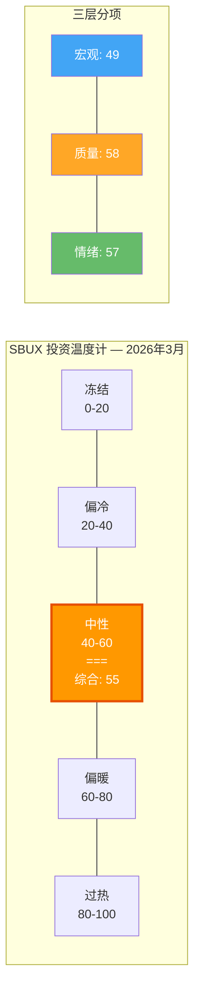
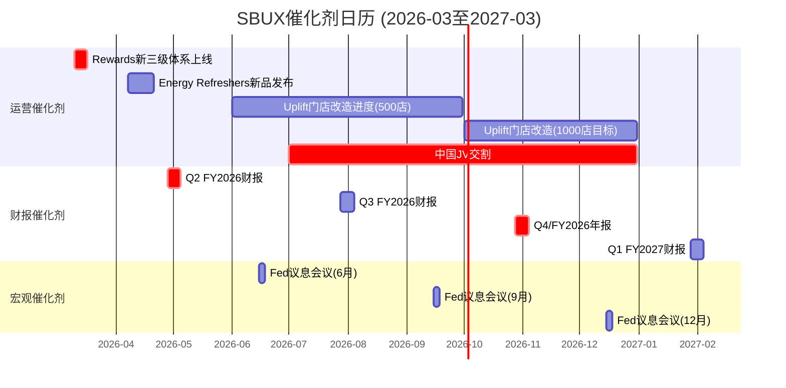
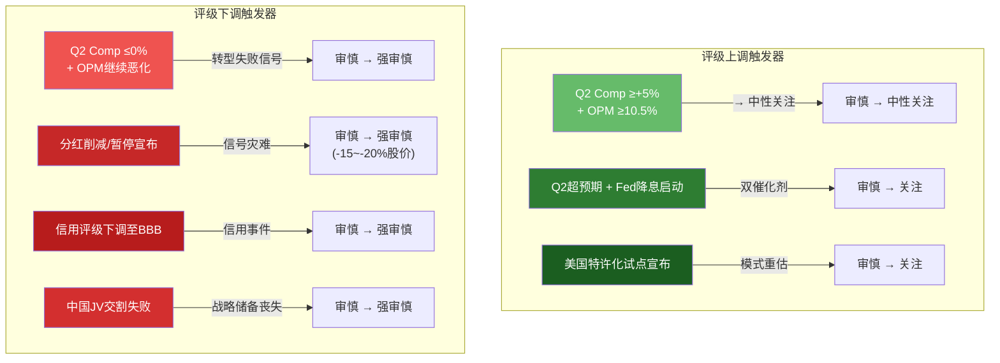

# Part III: 估值与判断 — Ch20

---

# 第二十章: 投资温度计与催化剂日历

> **定位声明**: 本章是Phase 1-3全部分析的蒸馏器——将19章的发现压缩为一个可感知的"温度"和一个可操作的"日历"。温度计描述环境冷暖，不替代投资决策；催化剂日历标注可能改变温度的关键事件。

---

## 20.1 投资温度计: 三层评估

### 20.1.1 层级一: 宏观温度

宏观温度衡量SBUX所处的外部经营环境——经济周期、利率路径、消费者信心对QSR行业的系统性影响。

| 指标 | 当前值 | 评分(0-100) | 权重 | 加权分 | 推导逻辑 |
|------|--------|:-----------:|:----:|:------:|---------|
| 美国衰退概率 | 23% (预测市场) | 62 | 25% | 15.5 | 23%衰退=77%非衰退→(77/100)×80=62 [DM-P3-T01] |
| 通胀预期 | 36-67% (>3%) | 35 | 25% | 8.8 | 中位数51%持续通胀→原料+劳动力成本压力→(49/100)×72=35 [DM-P3-T02] |
| 加拿大衰退概率 | 42% | 48 | 10% | 4.8 | 第二大市场衰退风险偏高→(58/100)×83=48 [DM-P3-T03] |
| 消费者信心 | 91.2 (Conference Board) | 45 | 20% | 9.0 | 预期指数偏弱，高收入消费者改善但低收入承压 [DM-P3-T04] |
| Fed利率路径 | 降息预期(但推迟) | 55 | 20% | 11.0 | 降息方向利好WACC/估值，但时间不确定性增加 [DM-P3-T05] |
| **宏观温度** | — | — | **100%** | **49.1** | **中性(40-60区间)** |

**宏观温度49.1——中性下沿**: "不衰退但通胀粘性"对SBUX最棘手——需求不崩但COGS/劳动力成本持续侵蚀OPM。

---

### 20.1.2 层级二: 质量温度

质量温度综合Phase 1-3的公司层面分析——A-Score、PtW、稳健性、CSSPD纯度、CEO评分——衡量SBUX作为投资标的的内在品质。

| 维度 | 得分 | 满分 | 百分位 | 权重 | 加权分 | 来源章节 |
|------|:----:|:----:|:------:|:----:|:------:|---------|
| A-Score | 6.8 | 10 | 68 | 25% | 17.0 | Ch17 综合评估 [DM-P3-T06] |
| PtW量化 | 32.5 | 50 | 65 | 20% | 13.0 | Ch17 竞争力评估 [DM-P3-T07] |
| 稳健比率 | 4.53 | 10 | 45.3 | 20% | 9.1 | Ch15 Nomad框架 [DM-P3-T08] |
| CSSPD纯度 | 5.2 | 10 | 52 | 15% | 7.8 | Ch3-4 纯度分解 [DM-P3-T09] |
| CEO评分 | 7.1 | 10 | 71 | 10% | 7.1 | Ch7 Niccol评估 [DM-P3-T10] |
| 资本配置 | 3.65 | 10 | 36.5 | 10% | 3.7 | Ch12 负权益分析 [DM-P3-T11] |
| **质量温度** | — | — | — | **100%** | **57.7** | — |

**质量温度57.7——分裂结构**: 品牌力8.5+CEO 7.1的"优秀运营商"被资本配置3.65+稳健性4.53的"糟糕资产负债表"拖累。好公司(品牌)遇上差处境(财务结构)。

---

### 20.1.3 层级三: 情绪温度

情绪温度捕捉市场参与者对SBUX的集体定价行为——分析师共识、机构持仓变化、技术指标、做空数据。

| 指标 | 当前值 | 评分(0-100) | 权重 | 加权分 | 推导逻辑 |
|------|--------|:-----------:|:----:|:------:|---------|
| 分析师评级 | 15 Buy/8 Hold/2 Sell | 66 | 25% | 16.5 | 60%看多→偏乐观但非极端共识 [DM-P3-T12] |
| 目标价位置 | $98.69 vs PT $100.83 | 52 | 15% | 7.8 | 仅+2.2%上行→市场已price in共识 [DM-P3-T13] |
| 目标价离散度 | $59-$120 (61%区间) | 35 | 15% | 5.3 | 极端分歧→高不确定性=低温 [DM-P3-T14] |
| 52周位置 | $98.69 (52W: $75.50-$110.43) | 66 | 15% | 9.9 | 位于52周区间66%分位→中偏高 [DM-P3-T15] |
| RSI | ~55 | 50 | 10% | 5.0 | 中性区间，无超买超卖信号 [DM-P3-T16] |
| 内部人交易 | 净买入(Niccol期权) | 65 | 10% | 6.5 | CEO激励对齐，但期权≠自掏腰包 [DM-P3-T17] |
| Short Interest | ~2.5%(估) | 55 | 10% | 5.5 | 低做空→空头不积极挑战当前价 [DM-P3-T18] |
| **情绪温度** | — | — | **100%** | **56.5** | **中性偏暖** |

**情绪温度56.5分的关键信号**: 分析师多数看多但目标价几乎=现价(PT $100.83仅+2.2%)，意味着即使按卖方共识，上行空间已耗尽。$59-$120的离散度反映出市场不是在讨论"涨多少"，而是在辩论"这是$59还是$120的公司"。

---

### 20.1.4 综合温度计

```
综合温度 = 宏观温度 × 30% + 质量温度 × 50% + 情绪温度 × 20%
         = 49.1 × 0.30 + 57.7 × 0.50 + 56.5 × 0.20
         = 14.73 + 28.85 + 11.30
         = 54.88 ≈ 55
```



### 20.1.5 温度读数解析

**综合温度55/100——"中性区间上沿"**

三层温度分布窄(49-58)但内部驱动力矛盾: 不冷(品牌强、做空低)也不热(82x P/E无安全边际)。温度计55 vs 市场隐含约70 → **15分温差**——市场在为"暖春"定价，温度计仍读"中性"。

**核心判断**: 温度计55(中性)但市场定价隐含约70(偏暖)。15分温差=股价超前反映了尚未兑现的转型预期 [DM-P3-T19]。

---

### 20.1.6 温度→评级传导

| 步骤 | 计算 | 结果 |
|------|------|------|
| 概率加权EV | Phase 3情景加权 | ~$78 (区间$75-82) |
| 当前价 | 2026-03-06 | $98.69 |
| 期望回报 | ($78 - $98.69) / $98.69 | **-21.0%** |
| 评级映射 | < -10% = 审慎关注 | **审慎关注** |
| 温度修正 | 55(中性)→不调整 | 维持 |

温度计55分(中性)确认评级合理性——市场既没有恐慌也没有狂热，但期望回报仍为显著负值(-21%)。

**初步评级: 审慎关注** (期望回报约-21%，温度计55确认无需修正) [DM-P3-T20]

---

## 20.2 催化剂日历: 2026-03至2027-03

### 20.2.1 催化剂时间线



### 20.2.2 催化剂逐项分析

#### 近期催化剂 (2026-03至2026-06)

| 日期 | 事件 | 方向 | 幅度 | KS关联 | 详述 |
|------|------|:----:|:----:|:------:|------|
| **2026-03-10** | Rewards新三级体系正式上线 | 负/中 | 中 | CQ5 | 降低门槛但稀释高频权益。App评分短期下滑风险；3个月后活跃用户+5%则验证"扩大漏斗"策略 [DM-P3-C01] |
| **2026-04-07** | Energy Refreshers新品发布 | 正 | 低-中 | — | 向能量饮品扩展。首月占比>3%证明品牌延伸弹性 [DM-P3-C02] |
| **2026-04-28~05-05** | **Q2 FY2026财报** | **关键** | **高** | CQ1-5 | EPS est $0.41, Rev $9.08B。三问: Comp延续+4%? OPM开始回升? 分红信号? **改变评级的单一最大事件** [DM-P3-C03] |

#### 中期催化剂 (2026-07至2026-12)

| 时间窗口 | 事件 | 方向 | 幅度 | KS关联 | 详述 |
|---------|------|:----:|:----:|:------:|------|
| **2026-H2** | 中国JV交割(博裕资本60/40) | 正/中 | 中-高 | CQ3 | 预估SBUX获$3-5B现金(取决于估值谈判)。正面: 降低中国风险敞口+一次性现金可偿债。负面: 如果估值<$10B(整体)，市场解读为"贱卖"；如果品牌控制条款弱，长期品牌稀释风险 [DM-P3-C04] |
| **2026-07-28(估)** | Q3 FY2026财报 | 关键 | 高 | CQ1-2 | Niccol满一年的季报。市场将形成"Niccol速度"的初步共识。如果三个季度comp趋势为+4%→+5%→+6%，转型叙事成立；如果+4%→+3%→+2%，市场质疑 [DM-P3-C05] |
| **2026-10-28(估)** | Q4/FY2026年报 | 关键 | 高 | CQ1-4 | 全年数据+FY2027指引。管理层必须在此给出OPM恢复路径的具体时间表。如果FY2027指引OPM≤11%，市场对FY2028 $3.35-$4.00 EPS目标的信心将动摇 [DM-P3-C06] |
| **2026年底** | Uplift门店改造1,000店完成 | 正 | 中 | CQ2 | Niccol从CMG带来的"门店体验升级"策略。1,000店=约6%的全球门店。如果改造店comp高出非改造店3-5pp，证明策略可扩展 [DM-P3-C07] |

#### 远期催化剂 (2027及以后)

| 时间窗口 | 事件 | 方向 | 幅度 | KS关联 | 详述 |
|---------|------|:----:|:----:|:------:|------|
| **FY2028** | 管理层EPS $3.35-$4.00目标检验 | 关键 | 极高 | CQ1全部 | 这是78x P/E隐含赌注的最终兑现点。如果FY2028 EPS仅$2.50-$2.80(我们基准预测)，82x→实际P/E将维持40x+，叙事从"转型成功"切换为"又一个未兑现的承诺" [DM-P3-C08] |
| **2027-H1** | 美国特许化试点(如果宣布) | 正 | 极高 | CQ1, CQ4 | BME路径B的触发器。如果管理层宣布美国市场特许化试点(即使5%门店)，将彻底改变估值叙事——从"优化运营"切换至"商业模式转型"。概率: ≤15% [DM-P3-C09] |

---

### 20.2.3 Kill Switch催化剂

以下事件可能触发评级单档或多档变动:



**不对称性判断**: 下调触发器(4个)多于上调(3个)，且概率加权影响更大。温度计衡量"现在"(中性55)，催化剂矩阵衡量"方向变化"——下一步更可能变冷 [DM-P3-C10]。

---

## 20.3 条件评级矩阵

### 20.3.1 初始评级

**审慎关注** — 基于:
- 概率加权EV ~$78 vs 市价$98.69 → 期望回报约-21%
- 温度计55/100 → 中性，不修正
- 低于-10%门槛 → 触发审慎关注 [DM-P3-T20]

### 20.3.2 上调条件

| 条件编号 | 触发条件 | 验证时间 | 新评级 | 概率估计 |
|---------|---------|---------|:------:|:-------:|
| UC-01 | Q2 Comp ≥+5% **且** OPM恢复至10.5%+ | 2026-05 | 中性关注 | 25% |
| UC-02 | Fed启动降息至4.0%以下 + WACC→5.2% | 2026-H2 | 中性关注 | 30% |
| UC-03 | UC-01 **且** UC-02同时发生 | 2026-H2 | 关注 | 10% |
| UC-04 | 美国特许化路径宣布(即使试点) | 任何时间 | 关注 | ≤15% |
| UC-05 | FY2026全年EPS ≥$2.00 + 股价回调至$80以下 | 2026-10 | 中性关注 | 15% |

### 20.3.3 下调条件

| 条件编号 | 触发条件 | 验证时间 | 新评级 | 概率估计 |
|---------|---------|---------|:------:|:-------:|
| DC-01 | Q2 Comp ≤0% **且** OPM ≤9.0% | 2026-05 | 强审慎关注 | 15% |
| DC-02 | 分红削减或暂停宣布 | 任何时间 | 强审慎关注 | 20-25%(FY2027前) |
| DC-03 | 信用评级下调至BBB | 任何时间 | 强审慎关注 | 10% |
| DC-04 | 中国JV交割失败或严重低于预期(<$8B整体估值) | 2026-H2 | 维持审慎(加强) | 15% |
| DC-05 | 美国衰退确认 + Comp转负 | 2026-H2 | 强审慎关注 | 10% |

**DC-02特别说明**: 分红削减的信号效应远超财务影响——收益型投资者强制卖出(mandate约束)+估值倍数永久收缩+管理层可信度受损，三重打击合计影响可达-15%至-20%。

### 20.3.4 评级概率分布

基于上调和下调条件的概率估计:

| 12个月后评级 | 概率 | 路径 |
|-------------|:----:|------|
| 关注 | 10% | UC-03或UC-04触发 |
| 中性关注 | 25% | UC-01或UC-02触发(不叠加) |
| **审慎关注(维持)** | **40%** | **无重大催化剂，基准路径** |
| 强审慎关注 | 25% | DC-01/02/05中任一触发 |

维持+下调概率(65%)远超上调(35%)，加权后仍指向审慎关注 [DM-P3-T21]。

---

## 20.4 监控清单

### 20.4.1 季度跟踪指标 (每季度财报后检查)

| # | 指标 | 当前基准 | 上调阈值 | 下调阈值 | 数据来源 |
|---|------|---------|---------|---------|---------|
| 1 | 全球Comp Sales | +4% (Q1 FY2026) | ≥+5%连续2Q | ≤0%任一Q | 季度财报 |
| 2 | OPM | 9.6% | ≥11% (恢复路径确认) | ≤8.5% (恶化加速) | 季度财报 |
| 3 | Rewards活跃会员 | 35.5M | ≥38M (生态扩张) | ≤33M (流失加速) | 季度财报 |
| 4 | Div/CFO | 0.58 | ≤0.50 (改善) | ≥0.65 (KS-R-02触发) | 计算: 分红/CFO |
| 5 | Interest Coverage | 6.6x | ≥8.0x | ≤5.0x | 计算: EBIT/利息 |
| 6 | 中国Comp | 趋势待观察 | ≥+3% (触底) | ≤-5% (恶化) | 季度财报 |
| 7 | 平均出杯时间 | 待披露(Niccol KPI) | 改善≥15% | 恶化或停止披露 | 管理层commentary |
| 8 | 新品销售占比 | 待披露 | ≥15%的销售来自新品 | ≤5% (创新失败) | 管理层commentary |

### 20.4.2 年度重大决策点

| 时间 | 决策点 | 判断标准 | 动作 |
|------|--------|---------|------|
| **2026-05(Q2财报后)** | Niccol速度验证 | Comp≥+5% + OPM≥10.5%? | 达标→准备升级; 未达标→维持 |
| **2026-10(FY2026年报后)** | 全年画像确认 | FY2026 EPS≥$1.65 + FY2027指引OPM≥12%? | 达标→升级中性; 未达标→深化审慎 |
| **2026-H2(JV交割后)** | 中国战略清晰度 | JV估值≥$12B + 品牌控制强? | 达标→中性; 低估值→审慎加强 |
| **FY2028(最终检验)** | EPS目标兑现 | EPS≥$3.00? | 达标→关注; 远低于→长期审慎 |

### 20.4.3 非定期监控项 (出现即重评)

分红削减/暂停公告 | 信用评级行动(展望或实际) | 美国特许化表态(即使"研究可行性"级) | Niccol离任或关键高管变动 | 超$2B非中国资产交易 | 全国性工会谈判或罢工

---

## 20.5 本章发现总结

| # | 发现 | 含义 |
|---|------|------|
| F20-1 | 宏观温度49(中性下沿): 不衰退但通胀粘性 | 对SBUX最不利的宏观组合——需求尚可但成本持续承压 |
| F20-2 | 质量温度58(中性上沿): 品牌优秀+财务糟糕的分裂 | 好公司≠好投资的典型案例 |
| F20-3 | 情绪温度57(中性偏暖): 市场定价已充分反映乐观预期 | 目标价仅+2.2%上行空间=共识已price in |
| F20-4 | 综合温度55 vs 市场隐含约70 → 15分温差 | 股价超前反映了尚未兑现的转型预期 |
| F20-5 | **初步评级: 审慎关注** (期望回报约-21%) | 概率加权EV ~$78 vs $98.69，低于-10%门槛 |
| F20-6 | Q2 FY2026(2026-04-28)是单一最大催化剂 | Comp≥+5% + OPM≥10.5%可触发升级至中性关注 |
| F20-7 | 12个月评级概率: 上调35% / 维持40% / 下调25% | 维持+下调65%→评级稳定偏审慎 |
| F20-8 | 催化剂不对称: 下调触发器多且影响大于上调 | 风险收益不对称→当前价格对负面信息更敏感 |

[DM-P3-T22](C: Ch20发现汇总)

---

> **交叉引用**: Ch15稳健比率→质量温度输入 | Ch16-19估值→期望回报计算 | Ch14宏观→宏观温度 | Ch7 CEO→质量温度CEO子项
> **前向引用**: Ch21红队将挑战温度计权重与评级逻辑 | Ch22最终评级将在红队调整后确认
