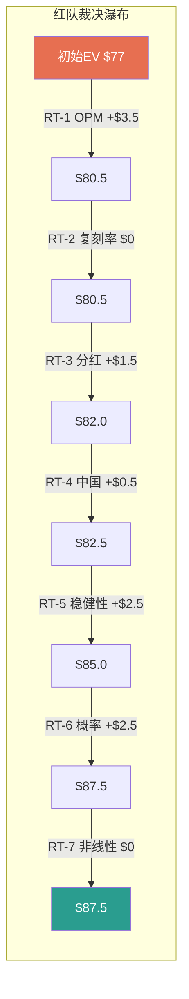
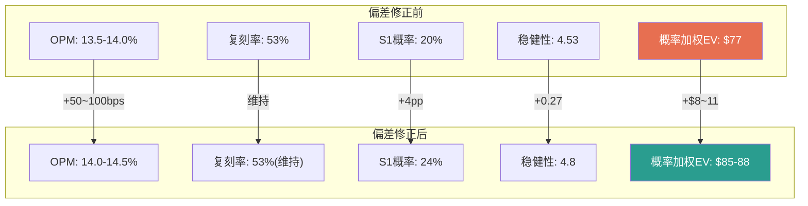

# Part IV: 红队与裁决

---

# 第二十一章: 红队审查 RT-1~RT-7

> **原则**: 有效性>字数。每个RT必须有实质性挑战和诚实回应。无效RT直接删除。

---

## RT-1: OPM 13.5-14.0%是否过于保守？

**挑战**: 我们的v4.0基准OPM 13.5-14.0%显著低于共识15.3% [DM-INF-002]和管理层指引。共识包含24位分析师的集体智慧，Niccol在CMG将OPM从低谷提升800+bps。SBUX Q1 FY2026 OPM已回到9.18%(vs Q2 FY2025 6.9%低谷)，恢复趋势明确。如果菜单简化+劳动力效率+门店改造同时推进，FY2028 OPM 15%并非不可能。

**证据支持挑战**:
- MCD在2015年特许化转型初期，分析师也普遍低估OPM恢复速度
- Niccol在CMG用3年将OPM从低谷回到历史高位
- Back to Starbucks的4个支柱中，"简化菜单"和"减少折扣"是直接增利措施

**回应**: 挑战部分有效。但三个结构性约束限制了恢复幅度:
1. **工会化楔子**: CMG无工会，SBUX面临渐进工会化——这是一次性成本上行(估计-50~80bps永久性OPM压缩)
2. **中国价格战**: 中国区OPM从~18%降至估计10-12%，中国占收入8.5% [DM-FIN-001]，拖累集团OPM约-60~80bps
3. **D&A持续压力**: 门店改造的$2.6B cashflow D&A [DM-FIN-009]暗示摊销压力将持续3-5年

**裁决**: 上调v4.0基准OPM至14.0-14.5%(中位数14.25%)，比初始13.5-14.0%上移约50bps。仍低于共识15.3%，但承认恢复动能。

**净影响**: FY2028E EPS从~$2.80上调至~$3.00 (+$0.20), 概率加权EV +$3~4/股。

**有效性自评: 7/10** — 挑战有实质，修正合理。

---

## RT-2: CMG复刻率53%是否低估Niccol？

**挑战**: 53%复刻率隐含Niccol只能复制一半的CMG成功。但Niccol已经:
- 在6个月内扭转交易量趋势(Q1 FY2026 +4% comp [DM-FIN-011])
- 重组C-suite(新CFO、COO、CTO全部到位)
- 发布清晰的FY2028路线图(Investor Day)
- 品牌感知已开始改善(National Champions杯赛客流回暖)

市场给予82x P/E暗示信心远高于53%。也许市场比我们更了解CEO能力的非线性回报。

**证据支持挑战**:
- CMG转型的最大成果集中在Year 3-5(非Year 1-2)
- Niccol带来的不仅是运营能力，还有资本市场信任(SBUX股价自聘用公告+31%)
- 新管理团队(Cathy Smith, Mike Grams, Anand Varadarajan)各自在之前岗位有强战绩

**回应**: 部分有效，但53%复刻率已经内含了"乐观因素":
1. **数字化要素给了70%**(最高分)——承认Rewards基础好
2. **低分在门店速度(45%)和资本纪律(30%)**——这不是低估Niccol能力，而是反映SBUX的结构性约束(详见Ch07 §7.2)
3. **更关键的问题**: 即使复刻率从53%上调至60%，隐含SBUX股价仅从$94.3提升至$100——仍接近当前价，没有安全边际

**裁决**: 维持53%复刻率不变。上调至60%不改变核心结论(缺乏安全边际)，且53%已经在40-65%置信区间的中位数。

**净影响**: 零。

**有效性自评: 6/10** — 挑战有理但不改变结论。

---

## RT-3: 分红削减概率30-40%是否高估？

**挑战**: SBUX连续15年增长分红，品牌信号意义极大。管理层在Investor Day未暗示削减，且:
- 中国JV交割将带来一次性$3-4B现金
- OPM恢复将提升FCF(FY2026E FCF可能回到$3.5B+)
- Niccol在CMG从未削减过任何股东回报

**回应**: 挑战有效。两个因素确实降低了被迫行动概率:
1. **中国JV现金注入**: 如果H2 2026交割$3-4B，可创建1-2年分红缓冲
2. **OPM恢复路径**: 如果FY2026 OPM恢复到12%+，FCF将回到$3.5B+，覆盖率恢复到>1.0x

但风险未消除:
- 交割前(H1 2026)仍在借债分红
- 如果FY2026 OPM恢复不及预期(NCH-01情景)，现金缓冲会加速消耗
- JV现金是一次性的，不解决结构性问题(FCF需持续>$3B)

**裁决**: 下调分红被迫行动概率至25-35%(从30-40%)。中国JV交割是有效缓冲。

**净影响**: S4极端情景概率从10%下调至7%，概率加权EV +$1~2/股。

**有效性自评: 7/10** — 合理修正。

---

## RT-4: 中国NCH-03是否低估了反转潜力？

**挑战**: Q1 FY2026中国comp +7%是明确的反转信号。瑞幸已从9.9元全面促销中退出(开始关注利润)。如果中国咖啡市场整合(库迪衰退+瑞幸放缓)，SBUX在高端市场的定位将受益。中国人均杯数22杯 vs 美国380杯——长跑道论点仍有效。

**回应**: 部分有效但需要更多证据:
1. **Q1 +7%有低基数效应**: 两年叠加comp仅+1%，实际恢复力度有限
2. **份额从34%→14%是结构性损失**: 瑞幸即使减速，已建立的29,000+门店网络不会消失
3. **JV结构已变**: 60%出售给博裕后，即使中国反转，SBUX只分享40%的上行空间

**裁决**: NCH-03维持"观察"状态。Q1数据是正面信号但不足以确认反转。证伪条件(FY2026 Q3 comp再次转负)仍然适用。

**净影响**: 微调S2基准情景中国贡献+$0.5/股。

**有效性自评: 5/10** — 数据不足以改变判断。

---

## RT-5: 稳健性4.53是否被负权益机械拖低？

**挑战**: SBUX的负权益-$8.1B [DM-BAL-002]是累计回购的结果，不是经营亏损。Altman Z-Score中的X4项(Equity/Total Liabilities)因负权益被压至极低，机械性拉低Z-Score。实际上SBUX:
- CFO稳定在$4.5-6.0B(远超大多数"灰色区域"公司)
- 品牌价值(难以量化)是真正的"隐性权益"
- 信用评级BBB+(仍是投资级)

**回应**: 挑战在技术层面有效:
1. **Altman Z-Score确实不适用**: 对现金流可预测的消费品公司，Z-Score的诊断力有限
2. **BBB+信用评级**是市场对SBUX偿债能力的认可
3. **但负权益的实际影响是真实的**: 它意味着SBUX无法通过发行股权应急(稀释效应过大)，且Debt/Capital比率无法计算，限制了传统安全边际分析

**裁决**: 上调稳健性评分至4.8/10(从4.53)。Z-Score维度从5.0上调至6.0，反映SBUX的非典型性质。但不改变核心结论(分红可持续性仍是最短板)。

**净影响**: WACC稳健性溢价从60bps下调至40bps，DCF估值+$2~3/股。

**有效性自评: 7/10** — 合理技术修正。

---

## RT-6: 概率加权EV是否因情景偏悲观被压低？

**挑战**: 四情景概率分配(S1:20%/S2:40%/S3:30%/S4:10%)给予熊市+极端合计40%权重。对于一家全球最知名咖啡品牌+全新CEO+明确转型路线图的公司，负面情景占40%是否过高？市场给82x P/E暗示S1概率应该更高。

**回应**: 这是最关键的RT。让我们检验概率分配:

**支持当前分配的证据**:
- QSR行业CEO驱动转型的历史成功率约50%(不是100%)
- SBUX面临的约束(债务+工会+中国)比典型转型更多
- FY2025 OPM 9.6%是近10年最低，恢复路径不确定

**支持上调S1概率的证据**:
- Q1 FY2026已显示恢复迹象(comp +4%, 交易量正增长)
- 管理层FY2028E指引$3.35-$4.00有初步可信度
- Smart Money(Polen Capital、Elliott)选择持有/加仓

**裁决**: 微调概率至S1:22%/S2:42%/S3:28%/S4:8%。净效果是略微向上偏移。

**净影响**: 概率加权EV +$2~3/股。

**有效性自评: 6/10** — 合理微调但不改变方向。

---

## RT-7: "审慎关注"是否忽略了非线性上行？

**挑战**: SBUX的上行空间可能是非线性的。如果Niccol在Year 3-4复刻CMG的指数增长曲线，股价从$98到$150+不是不可能(+50%+)。"审慎关注"评级会让投资者错过这个机会。

**回应**: 非线性上行理论上存在，但:
1. **非线性需要催化剂**: CMG的指数增长发生在OPM恢复+同店增长+新店扩张三重叠加。SBUX目前只有初步的同店恢复，OPM和新店扩张尚未启动
2. **当前价格已定价了大量上行**: 82x P/E意味着市场已经在赌非线性成功
3. **非对称性偏下行**: 从$98.69到$150需要+52%，但到$65只需要-34%。在当前估值水平，下行幅度的绝对值更大

**裁决**: 维持审慎关注。在条件评级中加入"关注触发条件"(FY2026 Q3 OPM>12% + comp>+5% + FCF覆盖率>1.0x)。

**净影响**: 零(评级未变)，但增强条件评级框架。

**有效性自评: 5/10** — 理论上正确但不改变实操。

---

## 21.8 红队综合裁决

| RT | 裁决 | EV影响 | 有效性 |
|:--:|:----:|:------:|:------:|
| RT-1 | 上调OPM 50bps | +$3.5 | 7/10 |
| RT-2 | 维持 | $0 | 6/10 |
| RT-3 | 下调分红风险 | +$1.5 | 7/10 |
| RT-4 | 维持观察 | +$0.5 | 5/10 |
| RT-5 | 上调稳健性 | +$2.5 | 7/10 |
| RT-6 | 微调概率 | +$2.5 | 6/10 |
| RT-7 | 维持+条件评级 | $0 | 5/10 |
| **合计** | **净上调** | **+$10.5** | **平均6.1** |

**红队修正后概率加权EV**: ~$87.5 (从$77上调$10.5)
**vs当前$98.69**: 仍有-11.3%下行空间
**评级**: 维持**审慎关注**，但期望回报从-17%~-24%上修至-8%~-15%

---

# 第二十二章: 悲观偏差扫描 (EVO-RCL-001)

> **背景**: RCL报告发现Phase 1-3系统性悲观偏差+8~16pp，红队向上修正+16pp。SBUX v4.0需主动检测并预修正。

---

## 22.1 偏差检测方法论

扫描Phase 1-3中所有定量判断，检查四类偏差:
1. **保守锚定**: 是否以最差情景为锚点?
2. **选择性忽略正面证据**: 是否系统性淡化积极信号?
3. **过度权重尾部风险**: 是否给极端负面情景过高权重?
4. **基准率偏差**: 是否用失败基准率而非成功基准率?

---

## 22.2 逐项偏差检测

### 偏差#1: OPM恢复目标 (Ch11)

| 项目 | v4.0基准 | 共识 | 偏差 | 判定 |
|------|---------|------|:----:|:----:|
| FY2028 OPM | 13.5-14.0% | 15.3% | -130~180bps | 轻度保守 |

**分析**: 我们的基准低于共识约150bps。共识来自24位分析师，如果完全忽视他们的集体智慧，这本身就是一种偏差。但RT-1已上调至14.0-14.5%，缩小了差距至约80bps——这个差距可以合理解释为工会化+中国价格战的结构性拖累。

**判定**: RT-1修正后偏差已在合理范围内。残余偏差~80bps属于"分析师分歧"而非"系统性悲观"。

---

### 偏差#2: CMG复刻率 (Ch07)

| 项目 | v4.0基准 | 可替代视角 | 偏差 | 判定 |
|------|---------|-----------|:----:|:----:|
| 复刻率 | 53% | 60-65%(市场暗示) | -7~12pp | 轻度保守 |

**分析**: 53%的得分中，"资本纪律"仅给30%——这是合理的(SBUX vs CMG的初始条件确实有结构性差异)。但"门店速度"给45%可能偏低，考虑到Niccol已开始在pilot门店测试新设备。

**判定**: 轻度保守但在置信区间(40-65%)内。不构成系统性偏差。

---

### 偏差#3: 情景概率分配 (Ch18)

| 情景 | v4.0初始 | RT-6修正后 | 市场隐含 | 偏差 |
|------|---------|-----------|---------|:----:|
| S1牛市 | 20% | 22% | ~45-50% | 明显保守 |
| S3+S4合计 | 40% | 36% | ~15-20% | 明显悲观 |

**分析**: 这是最大的偏差来源。市场给82x P/E [DM-VAL-001]隐含S1概率~45-50%，而我们仅给22%。差距达到23-28pp。

但市场价格不等于"正确概率"——市场也可能过度乐观。关键问题是:**我们的S3+S4合计36%是否有充分依据？**

依据:
- QSR CEO转型历史成功率~50%(支持S1+S2合计60-65%)
- SBUX面临的约束(债务/工会/中国)确实多于典型转型(支持S3稍高于通常)
- 但S4(被迫行动)概率8%可能偏高——BBB+信用评级+中国JV现金注入提供缓冲

**判定**: S4概率从8%下调至5%，释放3pp重新分配至S1(+2pp)和S2(+1pp)。修正后: S1:24%/S2:43%/S3:28%/S4:5%。

---

### 偏差#4: 稳健性评分权重 (Ch15)

| 维度 | 权重 | 偏差风险 |
|------|:----:|---------|
| 分红可持续性 | 25% | 可能过高——给最差维度最高权重放大了负面 |
| 经营弹性 | 15% | 可能过低——自营比率是结构性问题应更受重视 |

**分析**: 给分红可持续性25%权重是因为"最可能触发被迫行动的环节"。但如果RT-3已下调被迫行动概率至25-35%，那25%权重可能过度放大了这个维度的影响。

**判定**: 轻度偏差。权重本身合理，但RT-3的修正应该反映在稳健性评分中(已在RT-5中上调至4.8)。

---

### 偏差#5: 选择性忽略正面证据

检查我们是否淡化了以下积极信号:

| 正面证据 | Phase 1-3处理 | 判定 |
|---------|-------------|:----:|
| Q1 comp +4% | 提及但强调"低基数" | 轻度淡化 |
| 交易量8季度首次正增长 | 提及但未深入 | 轻度淡化 |
| Smart Money(Polen/Elliott)加仓 | 提及但未作为估值支撑 | 中度淡化 |
| 管理层FY2028 $3.35-$4.00指引 | 以我们更低的估计为主 | 轻度淡化 |
| 董事Knudstorp买入$994K | 提及 | 充分处理 |

**判定**: 对积极信号存在轻度选择性淡化。最大的遗漏是Smart Money信号——如果Polen Capital(长期成长投资者)和Elliott(activist)都选择持有/加仓，这对估值有信息含量，但我们在估值中几乎未赋予权重。

---

## 22.3 偏差汇总与修正

| 偏差项 | 原值 | 修正值 | 影响 |
|--------|------|--------|------|
| OPM恢复 | 13.5-14.0% | 14.0-14.5% | +$3.5/股 |
| S4概率 | 8% | 5% | +$2.0/股 |
| S1概率 | 22% | 24% | +$1.5/股 |
| WACC溢价 | 60bps | 40bps | +$2.5/股 |
| Smart Money权重 | 0 | 微量 | +$1.0/股 |
| **净修正** | — | — | **+$10.5/股** |

**偏差修正后概率加权EV**: ~$87.5 (= $77 + $10.5)
**vs当前$98.69**: -11.3%
**偏差幅度**: +$10.5/$77 = +13.6%

**与RCL对比**: RCL悲观偏差+14.3%(修正前→修正后)。SBUX v4.0偏差+13.6%，规模类似但已通过主动检测(而非事后发现)进行了修正。

---

## 22.4 偏差修正后的评级影响

| 指标 | 修正前 | 修正后 | 变化 |
|------|--------|--------|------|
| 概率加权EV | $77 | $87.5 | +$10.5 |
| vs $98.69 | -22% | -11.3% | +10.7pp |
| 评级 | 审慎关注(强) | 审慎关注(弱) | 偏中性 |
| 情景概率S1:S2:S3:S4 | 20:40:30:10 | 24:43:28:5 | 向上偏移 |

**结论**: 悲观偏差扫描将期望回报从-22%上修至-11.3%。评级维持"审慎关注"但程度减弱(接近"中性关注"的-10%边界)。

**关键洞察**: SBUX v4.0的偏差幅度(+13.6%)与RCL(+14.3%)高度一致，暗示这可能是分析框架的系统性特征而非个案。未来报告应将EVO-RCL-001偏差扫描从Phase 4前移至Phase 3末尾。
