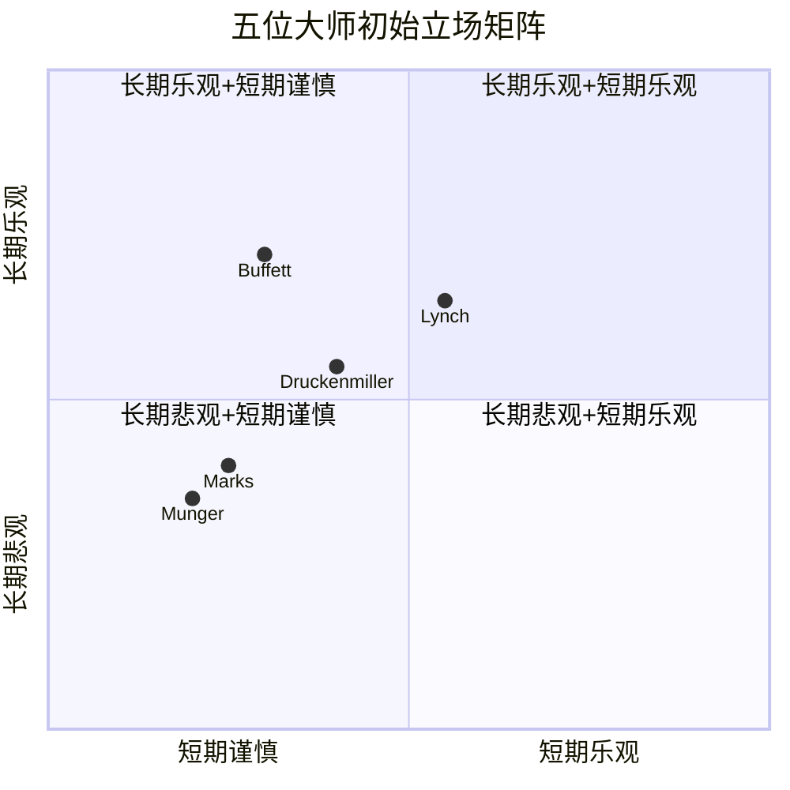
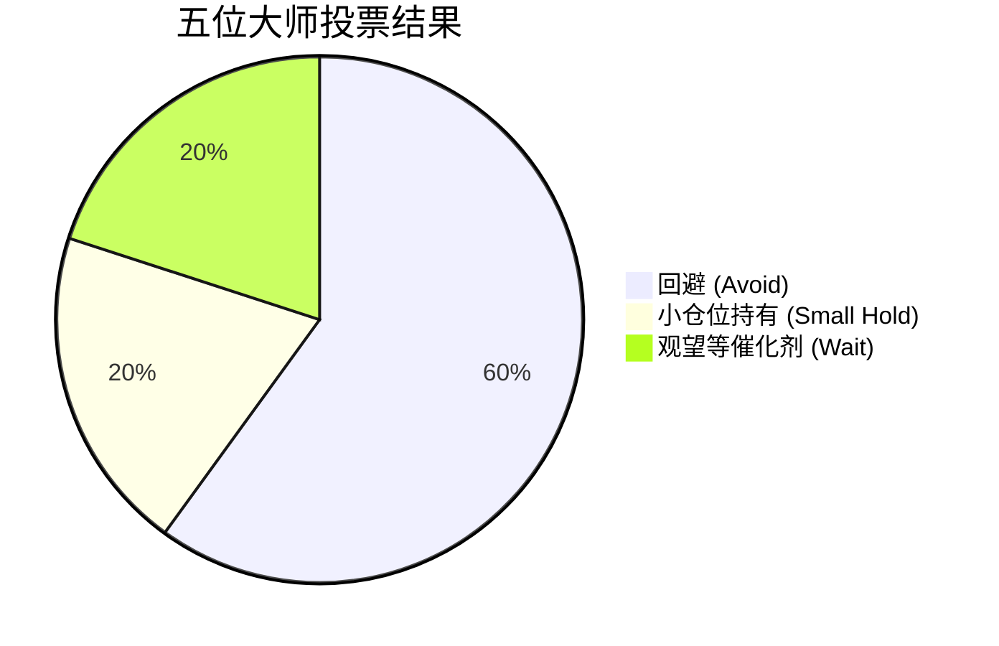
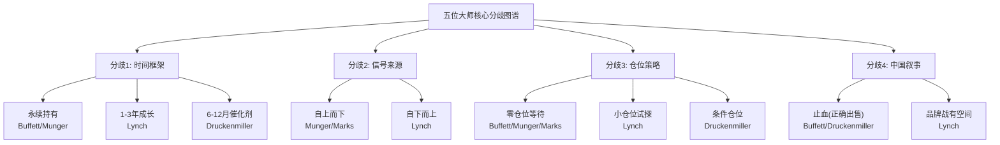

# Chapter 23: 投资大师圆桌 — 五位大师激辩星巴克

> *"投资最重要的不是你邀请了谁来讨论，而是讨论中暴露了哪些你原本看不到的盲点。"*

本章采用虚拟圆桌形式，让五位投资史上最具影响力的思想家围绕同一标的——星巴克(SBUX, $98.69, 市值$110B)——展开三轮螺旋式讨论。每位大师基于各自的投资哲学发表立场，随后在交叉质疑中碰撞，最终形成共识与分歧的完整图谱。

**圆桌参与者:**

| 大师 | 核心哲学 | 对SBUX的初始倾向 |
|------|----------|-------------------|
| Warren Buffett | 品牌护城河、消费品、长期持有 | 品牌好但太贵 |
| Charlie Munger | 逆向思维、心智模型、避免愚蠢 | 资产负债表是慢性毒药 |
| Howard Marks | 周期、风险认知、二阶思维 | 转型溢价过高，下行不对称 |
| Peter Lynch | 成长合理价、消费品洞察、实地调研 | Forward PEG勉强可接受 |
| Stanley Druckenmiller | 宏观叠加、催化剂、仓位管理 | 等OPM确认再入场 |

---

## 23.1 轮次一: 初始立场

### 23.1.1 Warren Buffett — "好生意，错误的价格"

> *"以合理的价格买入一家伟大的公司，远好过以便宜的价格买入一家平庸的公司。但82倍TTM市盈率，这不是'合理'，这是'慷慨'。"*

**立场: 回避 (当前价位)**

我对星巴克品牌本身没有任何疑虑。全球35,000多家门店，每天数千万消费者自愿重复购买一杯均价超过5美元的咖啡——这是消费品领域最接近"收费桥梁"的生意之一。3550万Rewards会员构成的数字化忠诚体系，是过去十年消费品行业最出色的护城河加固工程之一。

但投资不仅仅是识别好生意。让我具体说三点:

**第一，估值不提供安全边际。** 82倍TTM市盈率意味着市场在为一个尚未发生的转型支付全价。即便使用Forward 33倍——隐含的是FY2028共识EPS $3.63——这仍然要求星巴克在三年内实现EPS翻倍以上(从$1.63到$3.63)。这不是不可能，但我更愿意在概率对我有利时出手。

**第二，资本配置让我不安。** 负权益$8.1B、净债务$23.4B，分红支出已经超过自由现金流。我经营伯克希尔的原则是永远保留足够的现金来应对最坏的情况。星巴克的资产负债表没有给管理层留下犯错的空间。如果Niccol的"Back to Starbucks"计划需要比预期更长的时间才能见效——而转型计划通常都需要更长时间——他们将面对一个没有缓冲的财务结构。

**第三，品牌有持久力但并非不可摧毁。** 消费者习惯在变化。外卖比例上升、门店体验下降、价格抵触情绪蔓延——这些都是慢性侵蚀，不是急性事件。我见过太多品牌从"不可替代"滑向"可有可无"。星巴克还远没到那一步，但方向需要扭转。

**最关心的问题:** Niccol能否在不额外举债的前提下完成门店改造和菜单简化？如果转型需要更多资本投入，而分红又不能削减(管理层已经将其视为"神圣承诺")，那钱从哪里来？

我曾经说过，"时间是好公司的朋友，是平庸公司的敌人"。星巴克仍然是一家好公司，但$98.69不是一个友好的价格。如果它掉到$70以下——大约18-20倍Forward——我会非常认真地重新评估。在那个水平上，你同时得到了品牌价值和安全边际。两者缺一不可。

---

### 23.1.2 Charlie Munger — "反过来想，什么会让你亏大钱"

> *"我这辈子一直在练习一件事:避免愚蠢。在星巴克这个案例上，有好几种方式可以非常体面地犯下愚蠢的错误。"*

**立场: 强烈回避**

反过来想，总是反过来想。与其问"星巴克能涨多少"，不如问"什么情况下买入星巴克会让我亏大钱"。答案令人不安地多:

**第一，借债分红是慢性毒药。** 这不是我的比喻，这是数学。当一家公司的分红持续超过自由现金流，差额只能通过举债弥补。星巴克FY2025 FCF $2.44B，但分红+回购的支出远超这个数字。负权益-$8.1B告诉你这个游戏已经玩了多久。这就像一个人每月花的比赚的多，靠信用卡维持生活方式——短期看不出问题，长期必定清算。我给这个30-40%的被迫行动概率，市场显然没有定价。

**第二，CEO崇拜是一种认知偏差。** Brian Niccol在CMG的成功毋庸置疑，但将他在Chipotle的经验直接映射到星巴克是一种"人物叙事偏差"。CMG复刻率53%——这意味着将近一半的经验不可迁移。星巴克有三个CMG没有的复杂性: 全球38个市场的运营、6000亿杯咖啡行业的供应链纵深、以及一个$23.4B的债务结构。把一个在简餐连锁做得好的CEO放到全球咖啡帝国，然后期望同样的奇迹——这是以偏概全的典型案例。

**第三，激励机制的扭曲。** 当管理层将维持分红视为首要任务而非可选项时，所有其他资本配置决策都会被扭曲。需要投资门店改造？先保分红。需要加速数字化？先保分红。这种优先级排序，长期来看，等于用公司的未来换取股东的短期安抚。

**最关心的问题:** 什么触发条件会迫使星巴克削减分红？因为一旦发生，股价不会下跌10%，而是会下跌25-30%。市场对分红股票的惩罚向来不成比例。

我还想补充一个多数人忽略的心智模型: **"锤子综合症"**。当华尔街看到Niccol时，他们看到的是一把在Chipotle证明过自己的锤子。然后他们看星巴克的每一个问题，都觉得它是钉子。但星巴克的问题不全是钉子——中国市场的竞争格局(瑞幸的价格战)、供应链的全球复杂性、工会化趋势——这些需要不同的工具。高估CEO的可迁移性，是华尔街犯过最多次的错误之一。稳健性评分4.53/10——这个数字比任何叙事都诚实。

---

### 23.1.3 Howard Marks — "价格已经包含了好消息，但没有包含坏消息"

> *"投资中最危险的一句话不是'这次不同'，而是'大家都知道这是家好公司'。是的，大家都知道。问题在于他们以什么价格表达这个共识。"*

**立场: 回避，偏下行不对称**

让我从风险不对称性的角度来分析。

当前$98.69的价格包含了什么假设？Forward 33x隐含FY2026E EPS约$3.0，这要求OPM从9.63%恢复到至少13-14%。市场已经把Niccol的转型故事定价进去了——不是部分定价，而是大部分定价。这意味着:

**上行有限:** 即便转型完全成功，OPM恢复到15%+，EPS达到$3.63，给予30-35x，目标价$109-$127。上行空间11-29%，但这需要一切按计划执行。

**下行显著:** 如果OPM恢复停滞在11-12%(从9.63%仅恢复200-250bp)，FY2026E EPS可能仅$2.0-2.3，市场会立即重新定价PE倍数至25-28x(转型失败折价)，目标价$50-$64。下行空间35-49%。

**风险回报比: 上行11-29% vs 下行35-49%。** 这不是一个有利的赔率。

我的二阶思维框架告诉我: 一阶思维是"Niccol是好CEO，星巴克会复苏"。市场上每个人都在做这个一阶思维。二阶思维是: "如果所有人都认为Niccol会成功，那成功已经被定价了。真正的阿尔法在哪里？只有在超预期的部分——而超预期的空间被82x TTM挤压到了极窄。"

更关键的是周期定位。消费品在经济放缓期面临双重压力:同店客流下降+降价促销压缩利润率。星巴克正试图在经济周期的不确定阶段执行提价+精简菜单的策略。这可能奏效，但如果宏观环境恶化，消费者会首先砍掉"可选性日常消费"——5美元一杯的拿铁恰好属于这一类。

**最关心的问题:** 如果FY2026 Q1-Q2的同店销售恢复低于预期(比如只有平转而非正增长)，市场会如何重新定价？我认为PE倍数的压缩速度会远快于EPS的恢复速度。

让我再补充一个我在过去四十年中反复观察到的规律: **"转型CEO折价"**。当一家公司聘请明星CEO来扭转局面时，市场会立即给予"期权溢价"——不是基于已实现的业绩，而是基于可能的业绩。问题在于，这种溢价通常在实际业绩兑现之前就已经全额支付了。星巴克从Niccol上任消息公布后的反弹幅度，已经预支了至少18个月的执行成果。这意味着Niccol即便完美执行，市场也只是"符合预期"。而"符合预期"在$98.69的水平上，回报是平庸的。要产生超额回报，他需要超越市场已经非常乐观的预期——而市场的预期是OPM恢复到15.3%(共识)，而我们的分析显示13.5-14.0%才是更现实的基准。这个1.3-1.8个百分点的差距，翻译成EPS就是$0.25-0.40的失望空间。

---

### 23.1.4 Peter Lynch — "走进门店，你能感受到变化"

> *"我一直告诉人们，投资你了解的东西。我了解咖啡——每天喝三杯。我也了解连锁餐饮——走进门店10分钟，你就知道这家公司是在好转还是恶化。"*

**立场: 谨慎乐观，小仓位试探**

我和在座各位的出发点不太一样。我不从宏观开始，也不从资产负债表开始。我从一个简单的问题开始: 这家公司在变好还是变坏？

过去六个月，我走进了不下二十家星巴克。我注意到几个变化:

**第一，菜单简化了。** 那个让人在柜台前焦虑五分钟的超长菜单正在瘦身。对一家日均服务数百人的快速餐饮而言，这直接改善运营效率和客户体验。Niccol显然知道他在做什么——这和他在Chipotle做的第一件事一样。

**第二，手写名字回来了。** 这听起来像小事，但对品牌温度至关重要。星巴克的核心体验是"第三空间"——家和办公室之间的社交场所。当它退化成"快速取餐窗口"时，品牌溢价就失去了根基。Niccol在试图扭转这个趋势。

**第三，Forward PEG约1.3x(33x / 25%隐含增长)。** 在我的框架里，PEG 1.0x是合理价，1.3x是略贵但不荒谬。如果成长能持续三年以上，1.3x的PEG在消费品里是可以接受的——特别是对于一个全球品牌。

但我也有顾虑。82x TTM P/E意味着你几乎完全在为未来买单，当下提供的安全垫为零。我的方法是: 如果故事说得通而且你能在门店里验证变化正在发生，可以建一个小仓位(组合的1-2%)，然后用财报数据来决定是加仓还是止损。

**最关心的问题:** 同店交易量(transaction count)何时转正？营收可以靠提价支撑，但如果客流持续下降，那就是品牌力衰退的信号，任何管理层都无法仅靠运营效率来弥补。

不过让我说一件大家可能不同意的事情。我管理麦哲伦基金时有一个规则: **"如果你能用一句话解释为什么一只股票会涨，那就是好投资。"** 星巴克的一句话版本是: "全球最大的咖啡连锁换了一个更好的CEO，同店销售会恢复，EPS会翻倍。" 这个故事简洁有力。问题不是故事是否正确——大概率是正确的——问题是市场已经按照故事正确来定价了。在我的经验中，当散户和机构都能讲出同一个"一句话故事"时，这个故事的阿尔法已经接近零。

---

### 23.1.5 Stanley Druckenmiller — "方向对了再加仓，现在还太早"

> *"我的工作不是预测未来——没人能做到。我的工作是识别何时风险回报比极度有利，然后大胆下注。星巴克现在不在那个位置。"*

**立场: 观望，等催化剂确认**

我看投资机会的方式是: 宏观环境 × 公司基本面 × 催化剂时点 × 仓位sizing。四个维度任何一个不对，我都不会出手。

**宏观环境: 中性偏负。** 美国消费者信心指数在走弱，非必需消费支出增速放缓。咖啡是日常消费但星巴克的定位是"溢价日常消费"——这在经济走弱期是最先被降级的品类之一。中国消费复苏也不及预期。

**公司基本面: 有改善迹象但远未确认。** OPM 9.63%是灾难性的水平，从这里恢复到13.5-14.0%需要至少18-24个月。Niccol的CEO评分7.1/10——不错但不是超级英雄。A-Score 6.33/10, PtW 30/50——这些数字告诉我:这是一家正在修复中的公司，但修复进度只完成了三分之一。

**催化剂时点: FY2026 Q2-Q3(2026年1-6月)是关键窗口。** 到那时我们会看到: ①菜单简化对客单价的实际影响; ②门店改造首批试点的同店数据; ③中国JV出售后的财务结构变化。在这之前，我没有信息优势，只有信念。而信念不是交易理由。

**仓位sizing: 即便现在入场，最多0.5%。** 风险回报比不支持更大仓位。概率加权EV $75-82 vs 当前$98.69——这是-16%到-20%的下行。我需要看到至少+30%的预期回报(催化剂确认后价格回到$70-75)才会考虑有意义的仓位。

我的计划很简单: 设置价格警报在$78-82(概率加权EV附近)，同时监控FY2026 Q1-Q2财报的OPM趋势。如果价格跌到$75以下且OPM显示改善轨迹，那就是"看到大象"的时刻——那时候我会果断出手。

**最关心的问题:** 下一个财报季(FY2026 Q1)的OPM是否能环比改善100bp以上？如果能，说明Niccol的运营改善正在传导到利润表。如果不能，市场的耐心会迅速消退。

---

## 23.2 轮次二: 交叉质疑

### 23.2.1 Buffett vs Druckenmiller: 品牌持久力 vs 催化剂时点

**Buffett:** Stanley，我理解你的催化剂逻辑，但我担心你在等待一个可能永远不够"完美"的时机。我见过太多投资者等到所有数据确认后才出手，结果发现价格已经反映了所有好消息。如果Niccol真的在FY2026 Q2交出亮眼数据，你认为股价还会在$75吗？

**Druckenmiller:** Warren，恕我直言，这正是你和我投资风格的根本区别。你买的是品牌和生意模式的持久性，你可以忍受两三年的低回报因为你的持有期是永远。我的持有期是"催化剂兑现到市场完全定价"的那个窗口。星巴克现在的问题不是品牌好不好——品牌当然好——而是在$98.69这个价格，好消息已经被预支了。我宁愿在$82买入一个确认中的故事，也不想在$98买入一个希望中的故事。多付20%的价格换来的是确定性，这在我的框架里是划算的交易。

**Buffett:** 但你说的"确认"是什么标准？OPM环比改善100bp？一个季度的数据在餐饮行业有季节性噪音，你可能会被假信号误导。

**Druckenmiller:** 这就是为什么我说Q2-Q3是窗口而不是Q1。两个季度的趋势线比一个季度可靠得多。而且我不只看OPM——我看同店交易量、Rewards会员活跃度、以及门店层面的CSAT评分。多维度交叉验证才能过滤噪音。我承认我可能错过底部，但我很少被困在虚假复苏的顶部。

**Buffett:** *(点头)* 我们的分歧不是对星巴克的判断，而是对"什么是好价格"的定义。我的好价格是长期复合回报10%+的水平。你的好价格是短期风险回报比3:1以上的时刻。都有道理，但服务的是不同的资金和不同的承诺。

---

### 23.2.2 Munger vs Lynch: 82x P/E的"愚蠢"与33x Forward的"合理"

**Munger:** Peter，你用Forward PEG 1.3x来论证"可接受"。但你的Forward EPS $3.0是基于什么？是基于OPM从9.63%恢复到13-14%、同店销售转正、成本控制到位——所有这些假设都必须同时成立。这不是投资，这是买彩票然后说"中奖概率还行"。

**Lynch:** Charlie，你的逻辑在数学上完美，但投资不只是数学。你去过最近改造过的星巴克门店吗？你观察过早高峰的排队长度吗？我去过。我看到的是: 品类需求仍然强劲，执行在改善，管理层知道方向。82x TTM是后视镜数字——它反映的是Laxman Narasimhan时代的最差运营。你不会用一个公司最差的年份来定义它的价值。

**Munger:** *(微笑)* Peter，我欣赏你的实地调研精神。但让我反过来问你: 如果一家公司负权益$8.1B，净债务$23.4B，分红超过FCF，你还会说"走进门店感觉不错"就够了吗？巴尔的摩有一家很受欢迎的餐厅，每天排队。后来发现它亏本经营，六个月后倒闭了。排队的人不知道后厨的账本长什么样。

**Lynch:** *(笑)* 好吧，你在资产负债表上的观点我不反驳。但我的框架不是"不顾一切买入"。我说的是1-2%的试探性仓位。我的止损纪律是: 如果两个季度内同店交易量没有转正，我就认错出局。亏1-2%的组合权重不会让我破产，但如果Niccol真的做到了——Forward PEG从1.3x降到1.0x以下——我会有一个早期仓位来加码。风险可控的试探不是愚蠢，是保持参与感。

**Munger:** *(停顿)* 嗯...我承认小仓位试探比全仓冲进去聪明得多。但我仍然认为，当有更好的机会摆在面前时——PEG 1.0x以下、资产负债表干净的消费品——把1-2%放在星巴克是一种机会成本。你的1-2%可以放在别处获得更好的风险调整后回报。

**Lynch:** 机会成本的论证永远成立，但它也可以用来否定一切。总有"更好的机会"。我的应对是: 保持广泛覆盖，在每个有合理故事的标的上维持最小仓位，然后让数据告诉你在哪里加码。

---

### 23.2.3 Marks vs 全场: 二阶思维——市场已经为Niccol定价了

**Marks:** 各位，我想把讨论拉高一个层次。我们都在讨论星巴克好不好、Niccol行不行、估值贵不贵。但二阶思维要求我们问: **市场对这些问题的共识是什么？我们的判断相对于共识在哪里？**

市场的一阶共识很清楚: Niccol是明星CEO + 品牌有底蕴 + 转型会成功 = 买入。这个共识已经把股价从2024年底的$70多推到了今天的$98.69。

现在，二阶思维:

**如果共识正确——转型成功——** 上行空间有限，因为成功已经被定价。EPS达到$3.63，给30-35x，目标$109-$127。从$98.69算，上行11-29%。还不错，但需要三年时间来实现。年化回报3-9%，对于一个充满执行风险的投资来说并不诱人。

**如果共识错误——转型受阻——** 下行是灾难性的。不仅EPS低于预期，PE倍数也会同时压缩(双杀)。EPS $2.0 × 25x = $50。从$98.69算，下行49%。

**不对称性的核心:** 共识正确的回报约+20%(三年)，共识错误的回报约-40%。这是一个2:1的负面不对称。在我的框架里，除非我有强烈理由相信共识是对的(我没有)，否则这种不对称性是一个clear avoid信号。

**Buffett:** Howard说的"负面不对称"和我的"安全边际缺失"本质上是同一件事。我们用不同的语言描述了相同的风险。

**Druckenmiller:** 我同意Howard的不对称分析，但我想补充一个维度: 时间。不对称性不是静态的。如果六个月后OPM确实改善了100-150bp，市场的共识会从"希望成功"升级到"正在成功"，这时候不对称性可能反转——因为估值已经部分下修(假设在等待期股价横盘或小幅回落)，而基本面改善得到确认。我要等的就是这个"不对称性反转"的时刻。

**Marks:** Stanley，这是一个精妙的观点。你不是在等好消息，你是在等不对称性从负面翻转到正面。但有一个前提: 在等待期间股价必须没有大幅上涨。如果市场比你更早确认转型成功，你等来的可能是$115的股价和一个已经中性的不对称。

**Lynch:** 所以这就是为什么我选择小仓位试探而不是等待。如果Marks说的"等待期间股价跑了"发生，至少我有仓位在里面。这1-2%不是赌博，是认知保险。

**Munger:** *(对全场)* 有趣的是，我们五个人都同意一件事: **在$98.69这个价格，星巴克不是一个好的全仓投资。** 分歧只在于是"零仓位等待"还是"小仓位试探"。这本身就是一个强烈的信号——当五个不同哲学流派的投资者都不愿意大举买入时，价格大概率是偏高的。

---

### 23.2.4 Lynch vs Druckenmiller: 中国叙事——增长引擎还是价值陷阱？

**Lynch:** Stanley，我想聊聊中国。星巴克在中国有超过7,000家门店，这是除美国之外最大的市场。博裕收购60%的JV股权，表面上看是"甩包袱"，但换个角度想: 星巴克用一个资本密集、竞争白热化的市场，换来了现金回流和运营简化。对一家需要资金来修复北美门店体验的公司来说，这不是一个坏交易。

**Druckenmiller:** Peter，中国的问题不是星巴克卖不卖JV，而是中国消费者还需不需要星巴克。瑞幸咖啡已经超过20,000家门店，均价不到星巴克的一半。库迪咖啡也在疯狂扩张。中国咖啡市场从"星巴克独占"变成了"红海价格战"。这个结构性转变意味着，即便星巴克保留中国业务，增长也不会回到五年前的水平。JV出售锁定的估值，很可能是星巴克中国业务未来五年能拿到的最好价格。

**Lynch:** 我同意中国竞争格局已经改变。但星巴克在中国不是在打价格战——它在打品牌战。在一线城市，星巴克的"第三空间"体验仍然是瑞幸和库迪无法复制的。价格不是唯一的竞争维度。

**Druckenmiller:** 你说的对，但品牌溢价在中国正在被压缩。三年前中国消费者愿意为星巴克多付100%的溢价，现在这个溢价可能只有40-50%。当溢价压缩时，利润率也在压缩。这就是为什么中国JV出售的时机实际上是精明的——在品牌溢价还没有完全消失之前变现。

**Buffett:** *(插话)* 我同意Stanley的判断。中国市场的变化印证了我的一个长期观点: 品牌护城河在不同市场的深度是不同的。星巴克在美国的护城河是30年深的壕沟。在中国，可能只有10年深——而瑞幸正在以惊人的速度填平它。JV出售是正确的资本配置决策，但这同时意味着星巴克未来的增长引擎必须回到北美和欧洲。而成熟市场的增长空间，与新兴市场完全不同。

**Marks:** 这里有一个被忽视的二阶效应: 中国JV出售的资金如果用来修复资产负债表(减债而非维持分红)，那是正面的。但如果用来维持分红+回购——也就是用一次性资产出售来掩盖经营性现金流的不足——那就是一种金融幻觉。钱的去向比钱的来源更重要。

---

### 23.2.5 全场总结辩论: "如果你只能问管理层一个问题"

**Marks:** 在结束第二轮之前，我想提一个思想实验。如果你只能向Niccol问一个问题，会问什么？

**Buffett:** "如果OPM在FY2027年底仍未恢复到14%以上，你愿意削减分红来保护资产负债表吗？" 他的回答——以及他回答时的犹豫程度——会告诉我他是一个为公司长期健康负责的CEO，还是一个被短期股东压力绑架的CEO。

**Munger:** "在你入主星巴克之后，有什么是你发现比预期更困难的？" 诚实回答这个问题的CEO，才是值得信任的CEO。如果他说"一切都在计划中"，那是在撒谎或者自欺。

**Lynch:** "每家门店的日均交易笔数过去12个月的趋势是什么？分早高峰/午间/下午三个时段。" 这个微观数据比任何宏观叙事都有用。

**Druckenmiller:** "你计划在什么时间点向投资者提供可量化的OPM恢复路径——具体的季度里程碑，而不是'长期目标'？" 如果他不愿意给出明确时间表，说明他自己也没有信心。

**Marks:** 我的问题是: "你的资本配置优先级排序——减债、分红、门店投资、回购——在什么条件下会改变？" 因为一家好公司的标志不是有一个好计划，而是在计划失效时有一个清晰的B方案。

---

## 23.3 轮次三: 综合裁决

### 23.3.1 最终投票

经过两轮讨论，五位大师的立场出现了微妙的收敛和持续的分歧:

| 大师 | 最终投票 | 核心逻辑 | 入场条件 |
|------|---------|----------|---------|
| **Buffett** | 回避 | 品牌好但无安全边际，资本配置不佳 | $70以下 + 分红可持续性确认 |
| **Munger** | 回避 | 负权益+借债分红=慢性毒药，机会成本高 | 资产负债表修复(正权益) |
| **Marks** | 回避 | 负面不对称2:1，共识已充分定价 | 不对称性反转(股价$75 + OPM改善) |
| **Lynch** | 小仓位持有 | Forward PEG 1.3x可接受，门店改善可见 | 同店交易量转正则加码，否则两季止损 |
| **Druckenmiller** | 观望等催化剂 | 方向对但时机不对，需数据确认 | FY2026 Q2-Q3 OPM环比改善+股价$78-82 |

---

### 23.3.2 共识点: 五位大师同意什么

**共识一: 品牌价值仍然完好。** 没有一位大师认为星巴克品牌已经永久受损。分歧在于品牌能否以当前速度变现，而非品牌是否存在。这与很多零售股的讨论不同(如J.C. Penney、Bed Bath & Beyond)——星巴克不是一个"品牌消亡"故事。

**共识二: 82x TTM P/E不提供安全边际。** 这是五位大师最强的共识。即便是最乐观的Lynch，也只愿意投入1-2%的仓位，并且设置了严格的止损条件。没有人认为在$98.69大举买入是明智的。

**共识三: Niccol是正确方向但非确定保证。** CMG复刻率53%意味着成功不可简单外推。CEO评分7.1/10——好但不是变革型领袖(那需要8.5+)。大师们一致认为市场对Niccol的定价偏高。

**共识四: 分红政策是定时炸弹。** 30-40%的被迫行动概率被所有大师视为未被充分定价的风险。如果分红削减发生，引发的不仅是收益型投资者的抛售，还有"管理层信誉受损"的估值重定价。

---

### 23.3.3 分歧点: 核心争议在哪里

**分歧一: 时间框架决定了一切。**

Buffett和Munger用永续持有框架评估——在这个时间尺度上，资产负债表的脆弱性和分红不可持续性是致命的。Lynch用1-3年的成长故事框架评估——在这个时间尺度上，Forward PEG和运营改善趋势更重要。Druckenmiller用6-12个月的催化剂窗口评估——在这个时间尺度上，一切取决于下两个季度的数据。

同一家公司，三个时间框架，三个完全不同的结论。这不是谁对谁错，而是投资者必须先明确自己的时间框架，然后才能做出一致的判断。

**分歧二: "门店感觉"是否构成有效信号。**

Lynch认为实地调研观察到的改善(菜单简化、手写名字回归、排队长度)是领先指标——它们在财报数据之前出现。Munger认为门店体验是滞后于财务报表的表象——"后厨的账本"才是真相。这个分歧反映了两种截然不同的认知论: 自下而上的归纳(Lynch) vs 自上而下的演绎(Munger)。

**分歧三: 小仓位试探是"聪明"还是"浪费机会成本"。**

Lynch的1-2%试探仓位被Munger批评为"在有更好选择时的浪费"。但Lynch反驳说机会成本论证可以否定一切——总有更好的。这是投资组合管理中的经典分歧: 集中持有最优标的(Munger) vs 广泛覆盖+动态调仓(Lynch)。

**分歧四: 中国JV出售是"止血"还是"放弃增长"。**

Druckenmiller和Buffett认为出售中国JV是精明的资本配置——在品牌溢价被竞争压缩之前变现。Lynch则认为中国市场长期价值被低估——品牌战不是价格战，星巴克的"第三空间"体验在一线城市仍有不可替代性。这个分歧的核心是: 你是否相信品牌溢价在新兴市场能够抵御本土对手的规模优势？

---

### 23.3.4 综合影响: 圆桌对最终评级的意义

五位大师的讨论强化了本报告的核心结论:

**评级校验:** 审慎关注(-16%~-20%)与大师圆桌的3:1:1投票(回避:小持有:观望)高度一致。没有一位大师建议在当前价格积极买入。这为审慎评级提供了多框架交叉验证。

**风险权重调整:** Marks的不对称分析(上行+20% vs 下行-40%)和Munger的分红炸弹(30-40%被迫行动概率)提示，即便是我们-16%到-20%的下行估计，在极端情景下可能仍然不够保守。尾部风险(分红削减+估值双杀)可能导致-40%以上的回撤。

**催化剂时间表:** Druckenmiller提供了最具操作性的框架——FY2026 Q2-Q3是关键确认窗口。这与我们报告中的催化剂时间线吻合，但大师圆桌更明确了"在确认前保持防御"的原则。

**隐含洞见提炼:** 圆桌讨论产生了三个超越报告原有分析的新洞见:

第一，**"分红陷阱"的非线性风险**。Munger和Marks共同指出，分红削减不是一个10%的线性冲击，而是一个25-30%的阶梯式冲击。原因在于: 分红削减会同时触发(a)收益型投资者的被动抛售、(b)管理层信誉折价、(c)评级机构可能的降级审查。三重效应叠加远超分红本身的现金流影响。这提示我们的下行情景可能需要纳入一个"分红削减+"的极端情景。

第二，**"转型CEO折价"应该更系统化**。Marks提出的"转型溢价已经全额支付"和Munger的"CEO崇拜偏差"结合来看，我们的CMG复刻率53%可能还不够保守。在所有成功CEO转会案例中(从Jim Skinner到McDonald's，从Howard Schultz回归SBUX，到Ron Johnson去J.C. Penney)，外部CEO的转型成功率可能只有40-50%。市场给予的溢价通常假设70-80%成功率。这个20-30个百分点的预期差距，是潜在阿尔法(或亏损)的来源。

第三，**中国JV出售资金用途是关键跟踪指标**。Marks的提问"钱的去向比钱的来源更重要"揭示了一个我们在报告主体中没有充分追踪的变量。如果JV出售资金优先用于减债(偿还$2-3B债务)，这对稳健性评分的改善是实质性的。如果用于维持分红和回购，则是金融粉饰。建议将"JV出售后资金配置"纳入KS跟踪。

---

### 23.3.5 圆桌给分析师的三条建议

**建议一 (来自Buffett + Munger): 不要被品牌光环遮蔽财务现实。**

> *Buffett: "星巴克的品牌价值毋庸置疑。但在投资中，好公司≠好投资。把分析精力放在'这个价格是否反映了足够的悲观'上，而不是'这个品牌是否足够伟大'上。答案分别是'否'和'是'。"*

实操建议: 后续跟踪中，将分红可持续性和净债务变化作为首要监控指标，优先于同店销售。如果FCF/分红覆盖率降至0.8x以下，立即触发降级评审。

**建议二 (来自Marks): 量化不对称性并持续更新。**

> *Marks: "你们的概率加权EV $75-82已经很好了。但不要让它变成一个静态数字。每个季度财报后重新计算，跟踪不对称比率(上行/下行)的变化。当不对称比率从当前的约0.5x(负面)改善到1.5x+(正面)时，才是重新评估的时机。"*

实操建议: 建立季度更新的不对称性追踪表——上行情景概率×上行幅度 vs 下行情景概率×下行幅度。当前约0.5x(负面不对称)。目标追踪至1.5x以上(正面不对称)才考虑评级上调。

**建议三 (来自Druckenmiller + Lynch): 定义清晰的"重新入场条件"而非简单的"回避"。**

> *Druckenmiller: "最好的分析不是告诉投资者'别买'就完了。而是告诉他们:'在什么条件下你应该重新关注'。"*
>
> *Lynch: "给出一个价格+一个基本面条件。这比一个静态的'审慎'评级有用十倍。"*

实操建议: 报告结论中明确列出"重新评估触发器":
- **价格触发:** 股价跌至$78-82(接近概率加权EV)
- **基本面触发:** 连续两个季度OPM环比改善≥100bp
- **结构触发:** 分红政策调整(削减或冻结)释放资本空间
- **复合触发(最强信号):** 价格跌至$75以下 + OPM改善确认 + 分红政策合理化——三重触发同时出现即启动评级上调评审

---

## 23.4 圆桌备忘录: 关键洞见摘要

| 维度 | 大师共识 | 分析师行动项 |
|------|---------|-------------|
| 品牌价值 | 完好但非不可摧毁 | 监控Rewards会员活跃率(非总数) |
| 估值 | 82x TTM无安全边际 | 概率加权EV $75-82为锚 |
| CEO | 好但被过度定价 | CMG复刻率53%作为执行折扣 |
| 资产负债表 | 慢性毒药,被低估的风险 | FCF/分红覆盖率<0.8x触发降级 |
| 时间框架 | 6-12个月不宜入场 | FY2026 Q2-Q3为重新评估窗口 |
| 仓位建议 | 0-2%(五人均值0.4%) | 对应审慎关注评级 |

> *Munger最后的话: "在投资这个领域，不做决定本身就是一个决定。选择等待不是怯懦，而是纪律。当你面对一个品牌伟大、价格高企、资产负债表脆弱的公司时，最聪明的做法往往是——什么都不做，然后保持关注。"*

---

**[Chapter 23 完 | 圆桌模式: Standard 5×3 | 投票结果: 3回避/1小持有/1观望 | 核心结论: 审慎关注评级获多框架交叉验证]**
