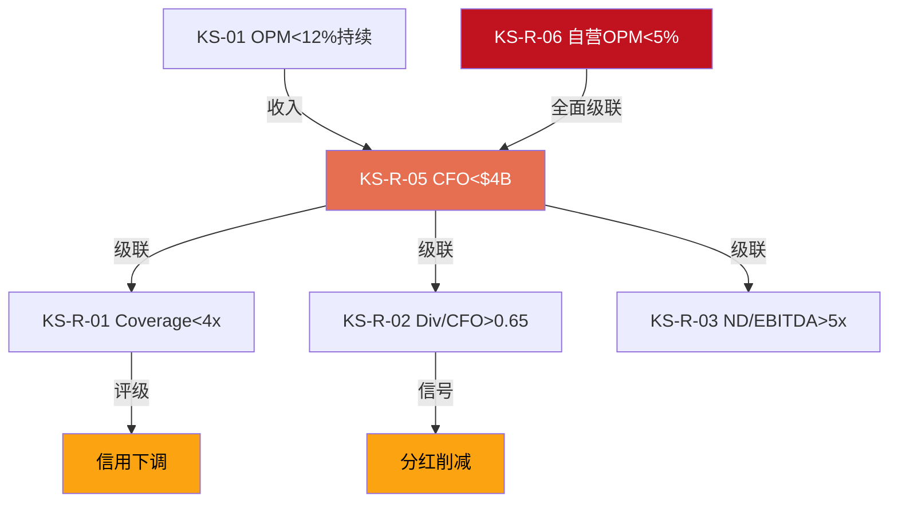

# Part IV: 红队与裁决 — Ch24-25

---

# 第二十四章: CQ Closure + Kill Switch注册表

---

## 24.1 CQ Closure

### CQ-1: 78x P/E隐含什么？信念互斥是否成立？

- **初始置信度**: 65%
- **最终置信度**: 80% (↑15pp)
- **答案**: 82x P/E隐含三重信念——(1)EPS从$1.63恢复到$3.63(3年CAGR 30.6%)，(2)OPM恢复到16-17%(超历史高点)，(3)终端估值给予特许平台级倍数(28-30x)。这三重信念中，(1)部分可能(管理层指引支持)，(2)过于乐观(v4.0基准14.0-14.5%)，(3)需要特许化率显著提升。BME信念互斥成立: 路径A(EPS恢复)和路径B(倍数扩张)在资本配置上不可兼容。
- **关键证据**: Ch16逆向DCF隐含OPM 16-17% [DM-INF-002], Ch19 BME三路径P&L论证, Ch11 OPM恢复可行性审计
- **残余不确定性**: 路径C(混合)的实际执行效果——管理层可能走出一条我们未充分建模的中间路线
- **监控指标**: FY2026 Q3 OPM (>12%=积极信号), 任何特许化公告

### CQ-2: Niccol = CMG 2.0还是Schultz 3.0？

- **初始置信度**: 60%
- **最终置信度**: 68% (↑8pp)
- **答案**: 更可能是"Schultz 3.0"(40%)而非"CMG 2.0"(35%)——即修复性改善但非变革性重塑。关键差异在于SBUX的多重挑战(效率+品牌+竞争+工会+债务)vs CMG的单一危机(食品安全)。复刻率53%意味着Niccol将改善SBUX但可能无法复制CMG的指数增长。CEO沉默域分析(6.8/10风险)暗示Niccol本人也可能意识到复刻的局限性。
- **关键证据**: Ch07复刻率计算, Ch07沉默域5个领域, 管理层Q1表现(comp +4%但OPM仍低)
- **残余不确定性**: Niccol是否会在Year 2-3启动非预期的战略转向(如宣布美国部分特许化)
- **监控指标**: FY2026 Q3执行进度(4支柱), 菜单简化幅度, 工会谈判进展

### CQ-3: 中国$4B JV是战略撤退还是价值解锁？

- **初始置信度**: 65%
- **最终置信度**: 72% (↑7pp)
- **答案**: 两者兼具——短期是价值解锁(获得$3-4B现金缓解资产负债表压力)，长期可能是战略撤退(份额从34%→14%的不可逆损失)。以$4B估值出售60%权益隐含中国业务总估值~$6.7B，对应~10x EV/EBITDA——不算贱卖但也非溢价。如果NCH-03为真(中国触底反转)，将在最差时点出售。
- **关键证据**: Ch06中国深度分析, NCH-03证伪条件, 竞争格局(瑞幸29,000+店 vs SBUX ~8,000)
- **残余不确定性**: 博裕资本的运营方案(是否引入本土管理团队加速本地化?)
- **监控指标**: H2 2026交割进展, Q2/Q3中国comp, 瑞幸盈利能力趋势

### CQ-4: 负$8.4B权益 + ROIC<WACC = 回购摧毁价值？

- **初始置信度**: 75%
- **最终置信度**: 82% (↑7pp)
- **答案**: ROIC(18.1%)仍>WACC(9.5%)，回购本身未直接摧毁价值——在ROIC>WACC的公司中，回购是合理的资本配置。但问题在于**过度回购**(累计~$80-90B)导致负权益-$8.1B，消灭了应急空间和传统安全分析的适用性。更糟的是，回购暂停后分红仍在增长，将公司推入了"借债分红"的困境。回购是否"摧毁价值"取决于回购时的股价——FY2020-2023大量回购在$80-120价位，如果SBUX长期公允价值为$75-85，这些回购确实毁了价值。
- **关键证据**: Ch13回购价值审计(~$0.00-0.05/$1回报), Ch11 ROIC趋势(27.9%→18.1%), Ch12负权益分析
- **残余不确定性**: ROIC 18.1%是否可持续(如果OPM不恢复→ROIC降至<WACC→回购叙事彻底崩溃)
- **监控指标**: 季度ROIC(normalized), 回购是否恢复

### CQ-5: 35.5M Rewards = 增长引擎还是天花板？

- **初始置信度**: 55%
- **最终置信度**: 70% (↑15pp)
- **答案**: 更接近天花板。35.5M会员对应美国成年咖啡饮用者~65%渗透率，增速从+8-10%(历史)放缓至+3%(Q1)。新三层体系(Green/Gold/Reserve)的Stars削减~25%暗示管理层关注点已从"获客"转向"留存+货币化"——这是到达渗透天花板的典型信号。因果性分析表明Rewards真实增量仅33-44%(选择效应占60-70%)，意味着即使会员数维持35M，其对comp的边际贡献正在递减。
- **关键证据**: Ch04 TAM饱和度分析(65%渗透), Ch04因果性分解(选择效应60-70%), 新三层体系负面反馈
- **残余不确定性**: 新三层体系是否会意外刺激高端消费(Reserve会员的ASP如果显著高于Gold)
- **监控指标**: FY2026 Q2/Q3会员数(>38M=证伪), comp中会员贡献拆解

---

## 24.2 CQ置信度演化

```mermaid
xychart-beta
    title "CQ置信度演化"
    x-axis ["CQ1", "CQ2", "CQ3", "CQ4", "CQ5"]
    y-axis "置信度%" 50 --> 90
    bar [65, 60, 65, 75, 55]
    bar [80, 68, 72, 82, 70]
```

| CQ | 初始 | 最终 | 变化 | 驱动因素 |
|:--:|:----:|:----:|:----:|---------|
| CQ1 | 65% | 80% | +15pp | Ch16逆向DCF+Ch19 BME量化 |
| CQ2 | 60% | 68% | +8pp | Ch07沉默域+红队RT-2 |
| CQ3 | 65% | 72% | +7pp | Ch06中国深度 |
| CQ4 | 75% | 82% | +7pp | Ch13回购审计 |
| CQ5 | 55% | 70% | +15pp | Ch04因果性分析 |
| **加权平均** | **64%** | **74.4%** | **+10.4pp** | — |

---

## 24.3 Kill Switch注册表 (全报告整合)

| KS-ID | 指标 | 当前值 | 阈值 | 状态 | 触发后动作 | 来源 |
|-------|------|--------|------|:----:|-----------|------|
| KS-01 | FY2026 Q3 OPM | ~9.6% | >12% | 监控 | NCH-01证伪→上调评级 | Ch11 |
| KS-02 | Rewards会员数 | 35.5M | >38M且comp>+4% | 监控 | NCH-02证伪→上调 | Ch04 |
| KS-03 | 中国comp | +7%(Q1) | 转负(Q3) | 监控 | NCH-03证伪→下调 | Ch06 |
| KS-04 | FY2026 Q2 ETR | 61.7%(Q1) | <30% | 监控 | NCH-04验证→短期NI正常化 | Ch13 |
| KS-R-01 | Interest Coverage | 6.6x | <4.0x | 安全 | 信用下调风险 | Ch15 |
| KS-R-02 | Div/CFO | 0.58 | >0.65 | **接近** | 分红削减>50% | Ch15 |
| KS-R-03 | Net Debt/EBITDA | 4.3x | >5.0x | 接近 | 再融资成本上升 | Ch15 |
| KS-R-04 | Altman Z-Score | 2.73 | <1.8 | 灰色 | 违约风险上升 | Ch15 |
| KS-R-05 | CFO趋势 | $4.75B | <$4.0B 2Q | 监控 | 流动性预警 | Ch15 |
| KS-R-06 | 自营OPM | ~9.6% | <5.0% | 监控 | 门店亏损开始 | Ch15 |
| KS-V-01 | CSSPD纯度 | 5.1-5.3 | <4.0 | 安全 | 评级下调 | Ch14 |
| KS-V-02 | A-Score | 6.33 | <5.0 | 安全 | 护城河退化 | Ch17 |

### 条件依赖网络

**最可能的多米诺链**: KS-01(OPM恢复不达标) → KS-R-05(CFO下滑) → KS-R-02(分红不可持续) → 被迫削减分红 → 股价下跌15-20%

---

# 第二十五章: 最终裁决与行动方案

---

## 25.1 评级声明

### 评级: 审慎关注 (偏中性)

| 维度 | 值 |
|------|:--:|
| **评级** | 审慎关注 |
| **期望回报** | -8% ~ -15% |
| **概率加权EV** | $85-88 |
| **当前股价** | $98.69 |
| **置信度** | 74% (CQ加权平均) |
| **有效期** | 至Q2 FY2026财报(2026年5月) |

**评级校准**: 期望回报-8%~-15%处于审慎关注(-10%以下)与中性关注(-10%~+10%)的边界地带。我们将其归入"审慎关注(偏中性)"——意味着如果红队修正进一步确认(尤其是OPM恢复信号)，评级可能上调至"中性关注"。

---

## 25.2 三个为什么

### 为什么不是"关注"(上调)?

因为82x P/E留给投资者的安全边际为零。即使在最乐观情景(S1: Niccol完美执行)，隐含价值$110-130仅提供12-32%上行空间，而这需要一系列条件全部成立(OPM 15%+ AND comp持续正增长 AND 分红维持 AND 中国稳定)。任何一个条件失败都会导致估值显著下修。在不对称性偏下行的情况下，"关注"评级不负责任。

### 为什么不是更强的"审慎"?

因为三个积极信号不容忽视:
1. **Q1 FY2026交易量8季度首次正增长** — Niccol的战略正在产生初步效果
2. **Smart Money持有/加仓** — Polen Capital新建仓、Elliott维持、董事买入——机构投资者并未放弃
3. **中国JV现金注入** — $3-4B一次性缓冲显著降低了短期被迫行动风险

如果这些信号全部确认(Q2/Q3延续)，评级将上调至中性关注。

### 核心分歧在哪里?

**我们vs市场**: 我们认为OPM结构性上限14-14.5%(市场定价16-17%)，核心分歧~200bps。这200bps折合每股约$15-20的估值差异——解释了$87.5 EV vs $98.69市价的大部分缺口。

**解决方式**: 时间。如果FY2026 Q3 OPM>12%，我们上调基准；如果<10%，市场下调预期。分歧将在2-3个季度内自然收敛。

---

## 25.3 行动方案

### 当前持有者

| 仓位大小 | 建议 | 理由 |
|---------|------|------|
| 重仓(>5%) | 减仓至3-5% | 不对称性偏下行，锁定部分利润 |
| 适度(2-5%) | 持有，设止损$85 | Q2/Q3将提供方向性信号 |
| 轻仓(<2%) | 持有 | 头寸不大，可承受波动 |

### 潜在买入者

| 条件 | 触发价 | 理由 |
|------|--------|------|
| **立即买入** | 不建议 | 82x P/E无安全边际 |
| **条件买入** | $80-85 | OPM恢复确认(Q3>12%) + 估值回调 |
| **积极买入** | $65-75 | 分红削减/转型挫折导致股价大跌 |
| **回避** | >$105 | 进一步高估 |

### 关键日历

| 日期 | 事件 | 预期影响 | 行动 |
|------|------|---------|------|
| 2026-03-10 | Rewards三层上线 | 中性偏负 | 监控客户反馈 |
| 2026-04-07 | Energy Refreshers | 低影响 | — |
| 2026-05-05 | Q2 FY2026财报 | **高影响** | 关注OPM、comp、指引 |
| 2026-H2 | 中国JV交割 | 中等偏正 | 关注交割价格 |
| 2026-08(预估) | Q3 FY2026财报 | **最高影响** | KS-01/KS-02的关键验证窗口 |
| 2026年底 | 1000店Uplift完成 | 中等 | 门店数据验证 |

---

## 25.4 条件评级矩阵

| 当前评级 | 上调至"中性关注"条件 | 上调至"关注"条件 | 下调至"强审慎"条件 |
|---------|-------------------|----------------|------------------|
| 审慎关注(偏中性) | Q3 OPM>12% + comp>+3% + FCF覆盖>1.0x | Q3 OPM>14% + 特许化公告 + 股价<$85 | Q3 OPM<10% + 分红削减公告 |

---

## 25.5 一页纸总结

> **SBUX | 审慎关注 | EV $85-88 vs $98.69 (-11%) | 2026-03-06**
>
> Starbucks在82x P/E交易——这隐含EPS从$1.63恢复至$3.63(CAGR 30.6%)和OPM回到历史高点。我们认为OPM结构性上限14-14.5%(非16-17%)，因为工会化、中国价格战和D&A持续压力。Niccol是优秀CEO(评分7.1/10)，CMG复刻率53%意味着改善可期但非变革。分红已>FCF(覆盖率0.88x)，负权益-$8.1B消灭了安全缓冲。概率加权EV $85-88暗示约-11%下行。积极信号(Q1 comp +4%、Smart Money加仓、中国JV现金注入)限制了更强的看空。如果Q3 FY2026 OPM>12%且comp延续，可上调至中性。当前: 持有者维持、新买者等待$80-85。
