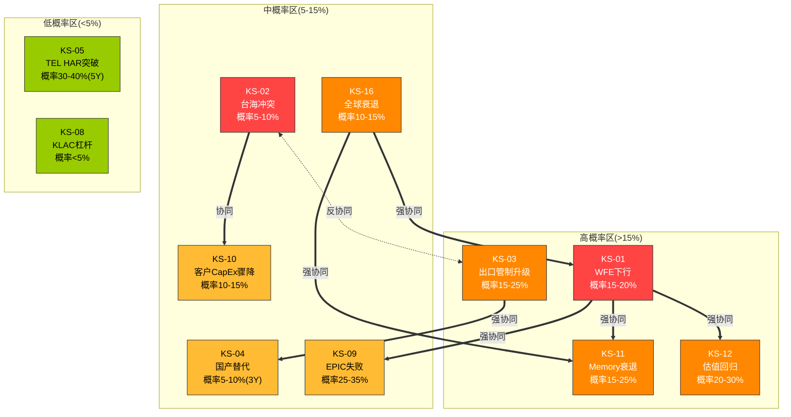

# Appendix C: Kill Switch完整注册表与风险监控手册

> **用途**: 可独立使用的风险监控操作手册。覆盖17个Kill Switch的完整定义、触发条件、行动指引和监控体系
> **数据截止**: 2026-02-24 | **交叉引用**: Ch14(B5风险地图) + Ch21(决策仪表盘)
> **设计原则**: 每个KS有明确触发阈值+数据源+检查频率+具体行动 | 可直接打印使用
> **发布合规**: 台海相关描述使用"台海冲突/台海危机/cross-strait tension"

---

## C.1 Kill Switch注册表总览

### C.1.1 17个Kill Switch一览表

以下按风险类型分组列出全部17个Kill Switch。严重度(1-5)衡量"如果触发，对持仓的破坏程度"；概率为12个月内触发概率(除特别标注)；时间窗为"从信号出现到影响兑现"的估计。

**周期风险 (3个)**

| KS-ID | 描述 | 严重度 | 概率(12月) | 时间窗 | 主要影响公司 |
|-------|------|--------|-----------|--------|------------|
| KS-01 | WFE同比下降>15% | 5/5 | 15-20% | 6-18月 | LRCX>AMAT>KLAC>ASML |
| KS-11 | Memory周期衰退(NAND价格连续2Q↓>15% + Memory CapEx削减>20%) | 4/5 | 15-25% | 6-18月 | LRCX>>AMAT>KLAC>ASML |
| KS-16 | 全球经济衰退(美国GDP连续2Q负增长) | 4/5 | 10-15% | 6-18月 | LRCX>AMAT>KLAC>ASML |

**地缘风险 (4个)**

| KS-ID | 描述 | 严重度 | 概率(12月) | 时间窗 | 主要影响公司 |
|-------|------|--------|-----------|--------|------------|
| KS-02 | 台海冲突(军事行动启动或全面封锁) | 5/5 | ~5-10% | 0-36月 | ASML>>AMAT≈LRCX>KLAC |
| KS-03 | 出口管制升级至成熟节点(BIS新规覆盖28nm+设备) | 4/5 | 15-25% | 6-18月 | AMAT>>LRCX>KLAC>ASML |
| KS-13 | 出口管制扩展至服务(BIS限制中国安装设备的维修/升级) | 3/5 | 5-10% | 6-24月 | LRCX(CSBG)>>AMAT(AGS)>KLAC>ASML |
| KS-14 | ASML DUV全面禁售中国(荷兰政府扩展至所有ArF DUV) | 3/5 | 10-15% | 6-18月 | ASML(单一) |

**竞争风险 (2个)**

| KS-ID | 描述 | 严重度 | 概率(12月) | 时间窗 | 主要影响公司 |
|-------|------|--------|-----------|--------|------------|
| KS-04 | 中国国产替代加速(NAURA获Tier-1非中国fab production订单) | 3/5 | 5-10%(3年) | 12-60月 | AMAT>>LRCX>KLAC>ASML |
| KS-05 | TEL NAND HAR刻蚀突破(获Tier-1 memory fab full qualification) | 3/5 | 30-40%(5年) | 12-36月 | LRCX(单一) |

**范式风险 (2个)**

| KS-ID | 描述 | 严重度 | 概率(12月) | 时间窗 | 主要影响公司 |
|-------|------|--------|-----------|--------|------------|
| KS-06 | GAA/CFET量产大幅延迟(TSMC N2或Intel 18A延迟>12个月) | 2/5 | 10-15% | 6-24月 | LRCX≈KLAC(受益延迟)>ASML>AMAT |
| KS-07 | 先进封装替代前道(封装设备TAM>前道WFE的15%) | 2/5 | <5%(5年) | 60-120月 | LRCX>ASML>AMAT>KLAC |

**财务风险 (4个)**

| KS-ID | 描述 | 严重度 | 概率(12月) | 时间窗 | 主要影响公司 |
|-------|------|--------|-----------|--------|------------|
| KS-08 | KLAC杠杆恶化(利息覆盖<8x 或 D/E>1.5x) | 2/5 | <5% | 4-12月 | KLAC(单一) |
| KS-09 | AMAT EPIC Center失败(FY2027末EPIC收入<$500M) | 4/5 | 25-35% | 12-24月 | AMAT(单一) |
| KS-10 | ASML客户CapEx骤降(任一Top 3客户CapEx削减>25%) | 3/5 | 10-15% | 3-12月 | ASML(单一) |
| KS-12 | 全行业估值均值回归(WFE增速<5% + Hyperscaler CapEx增速<15%) | 4/5 | 20-30% | 6-18月 | LRCX(溢价最高)>KLAC>ASML>AMAT |

**监管风险 (2个)**

| KS-ID | 描述 | 严重度 | 概率(12月) | 时间窗 | 主要影响公司 |
|-------|------|--------|-----------|--------|------------|
| KS-15 | AMAT合规再犯(新BIS违规处罚或Suspended Penalty触发) | 3/5 | 10-15% | 0-36月 | AMAT(单一) |
| KS-17 | ASML反垄断审查(欧盟/美国对EUV垄断发起调查) | 2/5 | <5% | 12-60月 | ASML(单一) |

### C.1.2 KS分布统计

| 统计维度 | 数值 |
|---------|------|
| Kill Switch总数 | 17个 |
| 严重度5/5(灾难级) | 2个 (KS-01 WFE下行, KS-02 台海冲突) |
| 严重度4/5(重大) | 5个 (KS-03, KS-09, KS-11, KS-12, KS-16) |
| 严重度3/5(显著) | 5个 (KS-04, KS-05, KS-10, KS-13, KS-15) |
| 严重度2/5(中等) | 4个 (KS-06, KS-07, KS-08, KS-14) |
| 严重度1/5(轻微) | 1个 (KS-17) |
| 12个月概率>15% | 5个 (KS-01, KS-03, KS-09, KS-11, KS-12) |
| 需实时/每周监控 | 7个 (见C.5) |
| 需季度监控 | 6个 |
| 需半年/年度监控 | 4个 |

### C.1.3 严重度×概率优先级矩阵

```
               概率 →
          低(<10%)    中(10-25%)    高(>25%)
严 高   | KS-02      | KS-01       |           |
重 (5)  | 台海冲突    | WFE下行      |           |
度       |            |             |           |
  (4)   | KS-16      | KS-03 KS-11 | KS-09     |
↑       | 全球衰退    | 管制 Memory  | EPIC失败   |
  (3)   | KS-04 KS-13| KS-05 KS-10 |           |
        | 国产 服务管制 | TEL 客户CapEx| KS-15     |
  (2)   | KS-07 KS-08| KS-06 KS-14 |           |
  低    | 封装 杠杆   | GAA DUV禁    |           |
  (1)   | KS-17      |             |           |
        | 反垄断      |             |           |
```

**优先级分区**:
- **红色区(高严重度+中高概率)**: KS-01, KS-03, KS-09, KS-11, KS-12 -- 季度review常设议题
- **橙色区(高严重度+低概率)**: KS-02, KS-16 -- 低频但需实时监控信号
- **黄色区(中严重度+中概率)**: KS-05, KS-10, KS-15 -- 常规季度跟踪
- **绿色区(低严重度或低概率)**: KS-04, KS-06, KS-07, KS-08, KS-13, KS-14, KS-17 -- 半年/年度review

---

## C.2 Kill Switch详细卡片

### KS-01: WFE同比下降>15%

**分类**: 周期风险
**严重度**: 5/5 (灾难级 -- 影响全行业收入和估值)
**当前概率**: 15-20% (12个月内)
**时间窗**: 6-18个月

**风险描述**: 全球半导体设备支出(Wafer Fab Equipment)从周期峰值出现>15%的同比下降。过去25年发生4次(2001 -35%, 2009 -42%, 2012-13 -12%, 2023 -22%)，平均约6年一次。当前WFE处于CY2024起的连续上行第四年($104B→$116B→$126-135B E)，已超过历史最长连续上行记录(CY2016-18三年)。

**触发条件** (可观察+可量化):
- 条件1: SEMI/SEAJ B2B Ratio < 0.85x，连续2个月 (当前~1.0x)
- 条件2: 全球fab利用率 < 80% (当前先进节点>95%，成熟节点85-90%)
- 条件3: NAND价格连续2季度下跌>15% (当前温和上涨)
- 条件4: Hyperscaler CapEx增速 < 10% YoY (当前+36%)

**影响矩阵**:

| 公司 | 影响程度 | 周期Beta | 传导路径 | 预估影响 |
|------|---------|---------|---------|---------|
| LRCX | 极高 | 1.3-1.5x | Memory 50-55%暴露→Memory CapEx波动>>Logic→收入-26~-30% | P/E压缩15-20点, 收入-$4.5-5.5B |
| AMAT | 高 | 1.0x | ICAPS随周期+中国波动→收入-18~-22%; FCF从22%降至14-17% | EPIC CapEx覆盖临界, 回购可能暂停 |
| KLAC | 中 | 0.7x | 检测粘性+高服务占比→收入-12~-15%; 毛利率仅降1-2pp | 利息覆盖降至11-12x, 回购减速 |
| ASML | 低 | 0.5x | EUV积压€38.8B提供18+月缓冲→收入-8~-12% | 积压消化延长但不影响经济学 |

**与其他KS的关系**:
- 协同: KS-11 Memory周期衰退 (WFE下行通常包含Memory调整; 1+1>2对LRCX)
- 协同: KS-09 EPIC Center失败 (WFE下行使AMAT面临"投资沉没+收入下降"双杀)
- 协同: KS-12 估值回归 (收入下行+P/E压缩形成"双杀")
- 弱反协同: KS-07 先进封装替代 (WFE下行时封装投资也减速)

**监控数据源**:
- SEMI/SEAJ月报 -- B2B Ratio (每月中旬发布, 最关键先行指标) [月度检查]
- TSMC月度营收 (每月10日前发布, 全球需求最佳代理变量) [每周检查]
- DRAMeXchange/TrendForce -- NAND/DRAM报价 [每月检查]
- Hyperscaler季报 -- CapEx指引和实际值 [季度检查]

**行动指引**:
- **预警阶段**(B2B降至0.90x或NAND价格开始下跌): 审视LRCX仓位大小，确认止损规则已就位; 不立即行动但提高警觉
- **触发阶段**(B2B<0.85x连续2月): 减仓LRCX至≤3%→减仓AMAT至0%→KLAC和ASML维持或逢低加仓(低Beta防御)
- **确认阶段**(WFE同比确认-15%+): 执行情景切换至Bear(Ch21 21.5.3); KLAC成为"唯一应保留的半导体设备仓位"

---

### KS-02: 台海冲突

**分类**: 地缘风险
**严重度**: 5/5 (灾难级 -- 全球半导体供应链中断)
**当前概率**: ~5-10% (Polymarket 2026年底前10.45%，真实概率估计5-8%)
**时间窗**: 0-36个月 (零预警跳变特征)

**风险描述**: 台海发生军事冲突或全面封锁，导致TSMC台湾fab不可运营。这是半导体行业最极端的尾部风险: 概率低但影响灾难性。Polymarket实时定价(2026-02-24): 2026年底前10.45%($9.2M交易量, 流动性高); Trump访问中国概率96.15%暗示短期中美高层互动活跃。但概率的"尾部跳变"特征意味着可以在数天内从5%跳至30%。

**触发条件** (可观察+可量化):
- 条件1: Polymarket台海冲突概率 > 15% (预警阈值)
- 条件2: Polymarket台海冲突概率 > 25% (止损阈值)
- 条件3: 大规模军事集结或实弹演习超越历史规模
- 条件4: 外交渠道全面中断(大使召回等)

**影响矩阵**:

| 公司 | 影响程度 | 传导路径 | 预估影响 |
|------|---------|---------|---------|
| ASML | 灾难性(10/10) | TSMC=最大客户(30-35%收入)+EUV安装基数>60%在台湾→即时损失€9-10B→长期服务收入永久丧失 | 短期收入-40~-50%, P/E可能腰斩 |
| AMAT | 重大(7/10) | TSMC≈15-20%收入+全球fab暂停扩产+服务中断 | 收入-20~-30%, 但客户分散缓冲 |
| LRCX | 重大(7/10) | TSMC≈15-18%收入+CSBG台湾服务中断 | 收入-15~-25% |
| KLAC | 显著(6/10) | TSMC≈15%收入, 但客户更分散+检测设备冲突后可恢复 | 收入-12~-18% |

**反直觉的长期逻辑**: 台湾fab被破坏→全球fab重建需求爆发(美/日/韩/欧)→ASML作为唯一EUV供应商，长期需求反而因"重建效应"增加。代价是3-5年的收入真空期。

**与其他KS的关系**:
- 反协同: KS-03 出口管制升级 (冲突发生后，管制变得完全无意义; 如果管制有效限制技术扩散，冲突动机可能降低)
- 协同: KS-10 ASML客户CapEx骤降 (冲突→TSMC中断→同时Samsung/Intel暂停=完美风暴)
- 独立: KS-08 KLAC杠杆, KS-09 EPIC失败

**监控数据源**:
- Polymarket -- 台海冲突合约价格 (建议设置15%和25%两档价格提醒) [实时监控]
- 外交信号 -- 大使召回、高层会谈取消、军售升级 [每周扫描]
- 军事动态 -- PLA演习规模和位置、舰队部署 [每周扫描]
- 全球供应链反应 -- TSMC是否启动海外备份产能加速 [季度检查]

**行动指引**:
- **预警阶段**(概率升至15%): ASML减仓3-5%仓位; 评估ASML占组合总暴露
- **触发阶段**(概率升至25%): ASML清仓或降至≤5%; 全行业风险重评估
- **事件发生**: 全行业紧急评估; 短期全面回避; 长期关注"重建"逻辑反转

**特别说明**: 不需要同时对冲KS-02和KS-03。如果你认为台海冲突概率>15%，对冲ASML的TSMC暴露; 如果<5%，更需关注出口管制的渐进收紧。ASML的风险折扣上限约5-8% P/E，非无限叠加。

---

### KS-03: 出口管制升级至成熟节点

**分类**: 地缘风险
**严重度**: 4/5
**当前概率**: 15-25% (12个月内)
**时间窗**: 6-18个月

**风险描述**: BIS将出口管制范围从先进节点(当前≤14nm)扩展至成熟节点(28nm以上)设备。中国$32-36B WFE中约60-70%是成熟节点设备，若被限制将从根本上改变游戏规则。当前管制已从2022年10月的"一次性冲击"演变为持续收紧的政策环境。

**触发条件** (可观察+可量化):
- 条件1: BIS正式发布覆盖28nm+设备的新规
- 条件2: 国会通过要求扩大管制范围的法案
- 条件3: 多国协调(日韩荷)同步扩大限制清单
- 条件4: 中美外交关系急剧恶化(如制裁升级)

**影响矩阵**:

| 公司 | 影响程度 | 传导路径 | 预估影响 |
|------|---------|---------|---------|
| AMAT | 极高 | 中国收入~30%(~$8.5B), ICAPS暴露最大→成熟节点管制使中国收入可能骤降至$1-2B | 收入-$4-6B(-15~-22%), P/E压缩5-8点 |
| LRCX | 高 | 中国收入~34%(~$6.2B), 但成熟刻蚀品类受限程度低于AMAT | 收入-$2-4B(-10~-20%) |
| KLAC | 中低 | 中国收入~26%(~$3.3B), 检测管制较晚+国产替代差距最大 | 收入-$0.5-1.5B, 相对免疫 |
| ASML | 低 | DUV已部分受限; 成熟节点管制主要影响非光刻品类 | 间接影响为主 |

**"管制悖论"**: 出口管制的最大讽刺在于它同时创造短期收入损失和长期竞争威胁。限制越严→中国政策支持越强(大基金三期¥344B/$47B)→国产设备市场空间越大→5-10年维度上管制可能是中国设备产业最好的"催化剂"。

**与其他KS的关系**:
- 协同: KS-04 中国国产替代加速 (管制越严→替代越快→正反馈)
- 反协同: KS-02 台海冲突 (冲突发生则管制无意义; Max而非Sum)
- 独立: KS-08 KLAC杠杆, KS-09 EPIC Center

**监控数据源**:
- BIS联邦公报(Federal Register) -- 新规提案和最终规则 [月度检查]
- 国会听证记录 -- CHIPS Act执行+管制范围讨论 [月度检查]
- 荷兰/日韩政策动态 -- 多边协调信号 [月度检查]
- 行业游说组织(SIA/SEMI) -- 政策立场和预测 [季度检查]

**行动指引**:
- **预警阶段**(草案/提案出现): 评估AMAT中国收入细分(哪些品类在成熟节点); 不立即减仓但准备行动计划
- **触发阶段**(新规正式发布): 立即减仓AMAT(-3~-5%仓位); LRCX评估CSBG中国部分影响; KLAC/ASML相对免疫不需操作
- **长期评估**: 重新校准AMAT中国收入下降曲线; 如中国收入占比降至<20%且无EPIC催化剂，AMAT可能降级至"不持有"

---

### KS-04: 中国国产替代加速

**分类**: 竞争风险
**严重度**: 3/5
**当前概率**: 5-10% (3年内里程碑事件)
**时间窗**: 12-60个月

**风险描述**: 中国半导体设备国产化从"成熟节点补充"升级为"Tier-1 fab production线进入"。当前NAURA PVD/CVD在中芯国际和长江存储的成熟节点产线运行，但尚未进入TSMC/Samsung/Intel。如果NAURA在3年内获得第一个非中国Tier-1 fab的production tool订单，将是里程碑事件。

**国产替代时间分化**: 成熟节点设备(PVD/CVD/扩散/清洗) 3-5年国产化率从20-30%升至40-50%，主要受害者AMAT; 中等壁垒设备(CCP刻蚀/CMP) 5-8年可能突破20%，受害者LRCX(成熟刻蚀)/AMAT(CMP); 高壁垒设备(ICP/HAR刻蚀/先进检测/DUV光刻) 10年+仍然困难，LRCX核心/KLAC/ASML受保护。

**触发条件** (可观察+可量化):
- 条件1: NAURA/AMEC获得非中国Tier-1 fab(TSMC/Samsung/Intel)的production evaluation邀请
- 条件2: 中国设备公司在成熟节点某品类全球份额突破20%
- 条件3: 大基金三期对设备企业的投资开始产出量产级设备

**影响矩阵**:

| 公司 | 影响程度 | 传导路径 | 预估影响 |
|------|---------|---------|---------|
| AMAT | 极高(8/10) | PVD份额从~85%→~75%年失2-4pp + CVD 21%份额面临NAURA/拓荆竞争 + 中国30%收入双重暴露 | 5年累计收入-$3-5B |
| LRCX | 中(5/10) | 成熟CCP刻蚀面临AMEC竞争, 但ICP/HAR差距5-8年; CSBG安装基数锁定 | 成熟节点刻蚀份额小幅下降, HAR堡垒不受影响 |
| KLAC | 低(3/10) | 检测/量测技术壁垒最高(差距8-10年); 精测电子OCD有进展但量级微小 | 几乎不受影响; 中国份额反而上升 |
| ASML | 极低(1/10) | SMEE DUV差距15-20年; EUV国产替代在可预见未来不可能 | 不受影响; 风险是"市场被缩小" |

**与其他KS的关系**:
- 协同: KS-03 出口管制升级 (管制越严→替代加速→正反馈循环)
- 独立: KS-01 WFE下行 (国产替代是结构性趋势, 不随WFE周期变化)
- 独立: KS-02 台海冲突

**监控数据源**:
- 中国设备公司(NAURA/AMEC/ACM/华海清科)年报和季报 -- 收入增速+新客户公告 [季度检查]
- 中国fab采购订单信息 -- 行业媒体(Semiconductor Engineering, EE Times China) [季度检查]
- SEMI China数据 -- 中国本土设备市场份额变化 [半年检查]

**行动指引**:
- **预警阶段**(NAURA在28nm以上获得更多中国Tier-1客户): 监控AMAT中国PVD份额季度变化; 无需立即行动
- **触发阶段**(NAURA获非中国fab evaluation邀请): AMAT长期估值下调(通才折价加深); 考虑从AMAT换仓至KLAC
- **确认阶段**(NAURA获production qualification): AMAT PVD份额从线性下降转为加速下降; 长期持仓逻辑需全面重评估

---

### KS-05: TEL NAND HAR刻蚀突破

**分类**: 竞争风险
**严重度**: 3/5
**当前概率**: 30-40% (5年内)
**时间窗**: 12-36个月

**风险描述**: Tokyo Electron (TEL) Certas平台在NAND高深宽比(HAR)通道刻蚀获得Tier-1 memory fab的full production qualification。TEL宣称Certas可以2.5x速度完成>400层NAND通道刻蚀。Samsung和SK Hynix有动机培育LRCX之外的第二供应商(供应链安全考量)。这是LRCX估值溢价的核心支柱面临的最直接威胁。

**触发条件** (可观察+可量化):
- 条件1: TEL Certas在Samsung或SK Hynix获得NAND HAR full production qualification
- 条件2: TEL财报中NAND HAR刻蚀收入出现显著跳升(>$200M/年)
- 条件3: Samsung/SK Hynix在供应商公告中明确提及"第二供应商多元化"

**影响矩阵**:

| 公司 | 影响程度 | 传导路径 | 预估影响 |
|------|---------|---------|---------|
| LRCX | 高(单一受影响) | NAND HAR 100%份额→80-85%; 估值倍数从premium降至in-line | P/E压缩5-8点 (从50.9x→43-46x), 约-10~-15%市值 |
| 其他公司 | 无直接影响 | — | — |

**关键细节**: 即使TEL成功进入(概率30-40%在5年内)，LRCX仍将维持70-80%份额(技术领先+安装基数锁定+良率转换成本)。品类内竞争的影响更多是"估值倍数压缩"而非"基本面崩溃"。

**与其他KS的关系**:
- 独立: 与其他所有KS基本独立(TEL的技术突破不受宏观/地缘影响)
- 微弱协同: KS-11 Memory周期衰退 (Memory衰退时Memory fab更有动力压价→培育第二供应商的动力增强)

**监控数据源**:
- TEL季度财报 -- 刻蚀业务收入和新订单结构 [半年检查]
- Samsung/SK Hynix -- 供应商多元化公告、设备采购信息 [半年检查]
- IEDM/VLSI技术会议 -- TEL HAR刻蚀技术论文 [年度检查]

**行动指引**:
- **预警阶段**(TEL获得qualification测试机会): 跟踪但不行动; 从qualification到production通常需要12-18个月
- **触发阶段**(full production qualification确认): LRCX估值倍数从peer premium调整至in-line; 减仓LRCX 2-3%

---

### KS-06: GAA/CFET量产大幅延迟

**分类**: 范式风险
**严重度**: 2/5
**当前概率**: 10-15% (12个月内)
**时间窗**: 6-24个月

**风险描述**: TSMC N2(2nm, 2025年量产)或Intel 18A(2025年)因工艺良率问题延迟>12个月。GAA不是"范式风险"而是"范式机遇"——制造复杂度每增加一代，设备需求密度($/wafer)增长约15-20%。真正的风险是"延迟"而非"取消"。

**触发条件** (可观察+可量化):
- 条件1: TSMC宣布N2量产时间表延迟>12个月(从2025年risk production推迟)
- 条件2: Intel 18A再次延迟(已有多次延迟历史)
- 条件3: GAA良率数据低于预期(fab利用率在N2节点<60%)

**影响矩阵**:

| 公司 | 影响程度 | 传导路径 | 预估影响 |
|------|---------|---------|---------|
| LRCX | 中(短期利空) | 选择性刻蚀(Akara)+ALD(ALTUS Halo)的SAM扩展延迟 | 短期: 刻蚀步骤增量推迟; 长期: 需求不消失 |
| KLAC | 中(短期利空) | 3D检测/量测SAM扩展延迟(KLAC是GAA最大受益者, A9=9/10) | 短期利空; 长期需求确定 |
| ASML | 中低 | EUV层数增量(从~15层增至~20-25层)延迟; High-NA需求时间表后移 | 积压缓冲, 影响有限 |
| AMAT | 低 | GAA不增加AMAT的"必经节点"地位; 中性影响 | 几乎不受影响 |

**与其他KS的关系**:
- 弱反协同: KS-01 WFE下行 (GAA延迟→短期设备需求减少→叠加WFE下行会加重冲击; 但也可能因延迟导致后续需求集中释放)
- 独立: KS-02, KS-03, KS-08, KS-09

**监控数据源**:
- TSMC技术论坛和季报 -- N2量产进度更新 [季度检查]
- Intel Foundry Services更新 -- 18A进度 [季度检查]
- IEDM/VLSI技术论文 -- GAA良率和工艺数据 [年度检查]

**行动指引**:
- **预警阶段**(量产延迟3-6个月): 无需操作; 视为正常工艺调整
- **触发阶段**(延迟>12个月): 短期可能下调LRCX和KLAC的SAM扩展时间表; 但不改变长期投资逻辑
- **KLAC是范式迁移的"全天候赢家"**: 无论GAA/CFET/先进封装哪条路线胜出，都增加检测需求

---

### KS-07: 先进封装替代前道

**分类**: 范式风险
**严重度**: 2/5
**当前概率**: <5% (5年内达到触发阈值)
**时间窗**: 60-120个月

**风险描述**: chiplet架构+先进封装(CoWoS/HBM/Foveros)持续替代monolithic die，前道晶圆加工的WFE增量被封装端分流。当前先进封装设备TAM约$8-10B(占前道WFE ~7-9%)，即使5年内增至$20B也仅占前道增量的29%。关键是chiplet是"补充"而非"替代"前道。

**触发条件** (可观察+可量化):
- 条件1: 先进封装设备TAM > 前道WFE的15% (当前~7-9%)
- 条件2: chiplet层数从2-3层增至8-16层(前道WFE增速可能被稀释)
- 条件3: 先进封装设备CAGR持续>前道WFE CAGR超过5年

**影响矩阵**:

| 公司 | 影响程度 | 传导路径 | 预估影响 |
|------|---------|---------|---------|
| LRCX | 中低 | 刻蚀在TSV制造中有用但非核心; 前道WFE增速可能被稀释 | 极远期风险; 5年内不影响 |
| ASML | 中低 | 封装层光刻用DUV(非EUV); 增量需求中性偏正 | 中性 |
| AMAT | 低(反而受益) | CMP在hybrid bonding是关键步骤; EPIC可能受益 | 净正面 |
| KLAC | 低(受益) | 先进封装检测(接合对准、TSV检测)是SAM扩展 | 净正面 |

**与其他KS的关系**:
- 弱反协同: KS-01 WFE下行 (WFE下行时封装投资也减速)
- 独立: 与其他KS基本独立

**监控数据源**:
- SEMI先进封装TAM预测 -- 年度报告 [年度检查]
- CoWoS产能和价格数据 -- TSMC季报 [半年检查]

**行动指引**:
- **当前**: 极远期风险，无需任何操作
- **5年后**: 如果封装TAM>前道15%，开始评估对前道设备商的长期TAM影响
- 2030年后可能变得更重要

---

### KS-08: KLAC杠杆恶化

**分类**: 财务风险
**严重度**: 2/5
**当前概率**: <5% (12个月内)
**时间窗**: 4-12个月

**风险描述**: KLAC的D/E 1.08x是四家最高，利息覆盖14.4x是四家最低。但深层分析揭示这是"聪明杠杆": 杠杆主要用于股票回购(过去5年累计$12B+)而非运营支出，ROIC~54%>>利率~4-5%。Z-Score 21.22极高，破产风险接近于零。

**触发条件** (可观察+可量化):
- 条件1: 利息覆盖 < 8x (当前14.4x)
- 条件2: D/E > 1.5x (当前1.08x, 历史最高1.3x)
- 条件3: 联合触发: 10Y Treasury > 6% + WFE -20%同时发生 (概率约5-10%)

**影响矩阵**:

| 公司 | 影响程度 | 传导路径 | 预估影响 |
|------|---------|---------|---------|
| KLAC | 中(单一受影响) | 利率飙升→再融资成本跳升→利息覆盖降至7-8x→回购空间被严重压缩 | 回购暂停→EPS增厚效应消失→估值承压 |
| 其他公司 | 无影响 | — | — |

**与其他KS的关系**:
- 协同(弱): KS-01 WFE下行 (WFE下行+利率上升同时发生使利息覆盖双重承压)
- 独立: 与其他所有KS独立

**监控数据源**:
- KLAC季报 -- D/E ratio, 利息覆盖倍数, 回购金额 [季度检查]
- 美国10年期国债收益率 -- 再融资成本前瞻 [每周检查]

**行动指引**:
- **预警阶段**(D/E升至1.3x或利息覆盖降至10x): 关注但无需操作; KLAC管理层可能主动放缓回购
- **触发阶段**(D/E>1.5x或利息覆盖<8x): 减仓KLAC 2-3%; 评估回购暂停对EPS增长率的影响
- **注意**: 即使触发，KLAC的Z-Score(21.22)仍远高于安全线，破产风险为零; 核心影响是回购减速而非偿债危机

---

### KS-09: AMAT EPIC Center失败

**分类**: 财务风险
**严重度**: 4/5
**当前概率**: 25-35% (失败情景)
**时间窗**: 12-24个月

**风险描述**: AMAT过去30年最大的单一资本赌注。总投资~$5B(已投~$2.3B，剩余~$2.7B FY2026-2028)。战略意图: 从"设备供应商"升级为"系统级解决方案平台"。CapEx/收入已从FY2021的2.9%飙升至FY2025的8.0%。

**情景概率分布**:
- 全面成功(20-25%): Top 3 fab采用EPIC验证的系统方案→估值re-rate至peer水平(P/E 45-50x)
- 部分成功(40-50%): 1-2个fab采用，未成行业标准→CapEx回归5-6%，ROI中等
- 失败(25-35%): 客户不接受suite selling→资产减值$1-2B + FCF永久偏低

**触发条件** (可观察+可量化):
- 条件1: FY2027末EPIC相关收入(新增suite selling合同) < $500M
- 条件2: CapEx/收入在FY2028仍 > 7% (确认"重资产陷阱")
- 条件3: 连续2次Investor Day无EPIC进展更新(管理层回避信号)

**影响矩阵**:

| 公司 | 影响程度 | 传导路径 | 预估影响 |
|------|---------|---------|---------|
| AMAT | 极高(单一受影响) | $5B沉没+CapEx长期高于同业+FCF利润率结构性偏低→"高CapEx低回报"陷阱 | 资产减值$1-2B; P/E从37.9x降至25-30x; 估值折扣永久化 |
| 其他公司 | 无直接影响 | — | — |

**与其他KS的关系**:
- 协同: KS-01 WFE下行 (WFE下行使AMAT面临"EPIC投资沉没+收入下降"双杀; FCF可能从$6.2B降至$3-4B)
- 独立: KS-02, KS-05, KS-08

**监控数据源**:
- AMAT季报 -- CapEx/收入比、EPIC相关收入披露 [季度检查]
- AMAT Investor Day(通常11月) -- EPIC进展核心窗口 [半年检查]
- 行业分析师 -- suite selling接受度评估 [半年检查]

**行动指引**:
- **预警阶段**(连续2Q无EPIC进展更新): 减仓AMAT 2-3%
- **触发阶段**(FY2027末EPIC收入<$500M): AMAT长期估值锚定至"硬件通才"(P/E 25-28x)而非"平台"(P/E 45-50x); 考虑清仓
- **成功信号**(EPIC获Tier-1 production订单): 反向操作 -- 大幅加仓AMAT +3~+5%

---

### KS-10: ASML客户CapEx骤降

**分类**: 财务风险
**严重度**: 3/5
**当前概率**: 10-15% (12个月内)
**时间窗**: 3-12个月

**风险描述**: ASML的EUV客户仅5家(TSMC/Samsung/Intel/SK Hynix/Micron)，前2客户合计55-60%收入。这是"结构性特征"而非"管理缺陷"——市场客户上限就是5-7家。任何单一Top客户的CapEx意外削减都能产生肉眼可见的收入波动。

**触发条件** (可观察+可量化):
- 条件1: 任一Top 3客户(TSMC/Samsung/Intel)宣布CapEx削减>25%
- 条件2: ASML季度新增订单连续2Q < €4B (积压消化速度超过补充)
- 条件3: 客户取消或大幅推迟EUV/High-NA订单(累计>€5B)

**影响矩阵**:

| 公司 | 影响程度 | 传导路径 | 预估影响 |
|------|---------|---------|---------|
| ASML | 高(单一受影响) | TSMC CapEx -29%(如$56B→$40B)→ASML损失€3-4B(约10-13%收入) | 收入增速拐点; 积压质量存疑 |
| 其他公司 | 间接影响 | 大客户CapEx削减通常意味着全行业放缓 | 触发KS-01评估 |

**客户预付款的双刃剑**: EUV订单预付20-30%使速动比率看似低(0.72x)，但扣除预付款后调整为~1.2-1.5x。真正风险不在偿债而在"取消退款"——历史从未发生(EUV太稀缺)，但极端情景理论上可能。

**与其他KS的关系**:
- 协同: KS-02 台海冲突 (冲突→TSMC中断→Samsung/Intel暂停=完美风暴)
- 协同(弱): KS-01 WFE下行 (WFE下行时客户更可能削减CapEx)
- 独立: KS-08, KS-09

**监控数据源**:
- TSMC/Samsung/Intel季报 -- CapEx指引和实际值 [季度检查]
- ASML季报 -- 新增订单、积压变化(QoQ) [季度检查]

**行动指引**:
- **预警阶段**(单一客户下调CapEx 10-15%): 监控ASML新增订单趋势; 无需操作
- **触发阶段**(Top 3客户CapEx削减>25%或订单连续2Q<€4B): 重新评估ASML收入指引和积压订单质量; 减仓1-2%
- **严重阶段**(订单取消>€10B累计): ASML清仓信号

---

### KS-11: Memory周期衰退

**分类**: 周期/财务风险
**严重度**: 4/5
**当前概率**: 15-25% (12个月内)
**时间窗**: 6-18个月

**风险描述**: LRCX的核心脆弱点。Memory收入占比50-55%(DRAM ~25-30%, NAND ~20-25%)。Memory CapEx历史波动率远高于Logic(峰谷差+/-40-60% vs +/-20-30%)。NAND设备是LRCX周期波动的最大来源。

**触发条件** (可观察+可量化):
- 条件1: NAND价格连续2个季度下跌>15%
- 条件2: Samsung和SK Hynix同时宣布Memory CapEx削减>20%
- 条件3: DRAM spot价格环比下跌>20%(单季度)

**影响矩阵**:

| 公司 | 影响程度 | 传导路径 | 预估影响 |
|------|---------|---------|---------|
| LRCX | 极高 | Memory CapEx -40%时→Memory收入$10B→$6-7B; 总收入降33-37%; CSBG提供$6.5-7.0B底部 | P/E压缩15-20点; 但CSBG底部估值≈$60-65/股 |
| AMAT | 高 | Memory ~35%收入暴露; 但ICAPS分散缓冲 | 收入-10~-15% |
| KLAC | 中低 | Memory ~40%收入暴露, 但检测需求粘性高 | 收入-5~-8% |
| ASML | 低 | EUV以Logic为主(Memory仅~25%); 积压缓冲 | 收入影响<5% |

**LRCX CSBG缓冲器**: CSBG FY2025收入$7.2B，毛利率55-60%，基于100K+安装腔室。CY2023 WFE衰退(-22%)期间CSBG仅下降~5%，展现极强周期免疫力(Beta 0.2-0.3x)。

**与其他KS的关系**:
- 协同: KS-01 WFE下行 (Memory衰退通常伴随WFE整体下行; 1+1>2对LRCX)
- 协同: KS-12 估值回归 (Memory衰退+估值压缩="双杀")
- 内在负反馈: NAND价格过高→抑制投片→CapEx减少→供应收缩→价格企稳(周期自我调节)

**监控数据源**:
- DRAMeXchange/TrendForce -- NAND/DRAM合约价和现货价 [月度检查]
- Samsung/SK Hynix/Micron季报 -- Memory CapEx指引 [季度检查]
- SEAJ B2B Ratio -- Memory设备订单先行指标 [月度检查]

**行动指引**:
- **预警阶段**(NAND价格开始下跌但<15%/Q): 审视LRCX仓位; 确认止损位
- **触发阶段**(NAND连续2Q↓>15%): 减仓LRCX(-3~-5%); 关注CSBG底部估值支撑(约$60-65/股)
- **确认阶段**(Memory CapEx同比-20%+): LRCX清仓或降至≤3%; 如果减仓价位低于CSBG内在价值则是过度恐慌

---

### KS-12: 全行业估值均值回归

**分类**: 财务/估值风险
**严重度**: 4/5
**当前概率**: 20-30% (12个月内)
**时间窗**: 6-18个月

**风险描述**: 四家公司P/E均处于历史5年均值之上23-82%，反映市场对"AI超级周期"的定价。估值风险不是"会不会回归均值"(长期一定会)而是"什么触发回归"。当前CAPE处于98百分位，宏观估值环境脆弱。

**当前估值水平**:

| 公司 | P/E (TTM) | 5年均值P/E | 溢价率 |
|------|----------|-----------|--------|
| ASML | 51.7x | ~38-42x | +23-36% |
| KLAC | 49.0x | ~32-36x | +36-53% |
| LRCX | 50.9x | ~28-32x | +59-82% |
| AMAT | 37.9x | ~22-26x | +46-72% |

**触发条件** (可观察+可量化):
- 条件1: WFE增速从+15%降至<5% (周期放缓信号)
- 条件2: Hyperscaler CapEx增速放缓至<15% (AI叙事削弱)
- 条件3: 美国10Y Treasury > 5.5% (折现率上升压缩估值)
- 条件4: "AI is the new dotcom"叙事在市场传播(不可量化但影响巨大)

**影响矩阵**:

| 公司 | 影响程度 | 溢价水平 | P/E回归均值时跌幅 | 预估影响 |
|------|---------|---------|-----------------|---------|
| LRCX | 极高 | +82%溢价 | 50.9x→30x = -41% | 股价从$241→$142 |
| KLAC | 高 | +53%溢价 | 49.0x→34x = -31% | 股价从$1,515→$1,050 |
| ASML | 高 | +36%溢价 | 51.7x→40x = -23% | 股价从€1,440→€1,110 |
| AMAT | 中 | +72%溢价但基数最低 | 37.9x→24x = -37% | 但当前P/E已是最低，相对防御力最强 |

**与其他KS的关系**:
- 协同: KS-01 WFE下行 (收入下行+P/E压缩="双杀"; 联合概率约15-20%)
- 协同: KS-11 Memory衰退 (Memory衰退削弱增长叙事→加速估值回归)
- 反协同(弱): 正面催化剂(如EPIC成功/HBM4量产)可延缓估值回归

**监控数据源**:
- WFE预测和实际值 -- SEMI/公司指引 [季度检查]
- Hyperscaler CapEx实际值和指引 -- MSFT/GOOG/META/AMZN季报 [季度检查]
- 美国10Y Treasury -- 折现率环境 [每周检查]
- 市场叙事/情绪指标 -- 分析师估值模型变化 [月度检查]

**行动指引**:
- **预警阶段**(WFE增速降至5-10%或Hyperscaler CapEx降至15-20%): 减少对高估值品种(LRCX)的暴露; 准备增配低估值品种(AMAT相对防御)
- **触发阶段**(WFE增速<5% + Hyperscaler CapEx<15%同时触发): 全行业P/E压缩→LRCX减仓至0%; AMAT低P/E提供相对缓冲; KLAC/ASML持有(品质溢价提供估值底)
- **注意**: 估值回归不等于基本面恶化; 如果公司EPS增长能消化估值压缩，长期投资者可以忍受短期P/E下降

---

### KS-13: 出口管制扩展至服务

**分类**: 地缘风险
**严重度**: 3/5
**当前概率**: 5-10% (12个月内)
**时间窗**: 6-24个月

**风险描述**: BIS将出口管制从设备销售扩展至对中国已安装设备的维修、升级和服务。这将打击LRCX CSBG(中国安装腔室约25K台，年服务收入约$1.8B)和AMAT AGS。

**触发条件** (可观察+可量化):
- 条件1: BIS发布限制对中国安装设备维修/升级的新规
- 条件2: 国会提案要求禁止对中国fab提供技术支持

**影响矩阵**:

| 公司 | 影响程度 | 传导路径 | 预估影响 |
|------|---------|---------|---------|
| LRCX | 极高 | CSBG中国25K腔室≈$1.8B/年服务收入面临风险 | CSBG估值重估; 收入-$1.5-2.0B |
| AMAT | 高 | AGS中国服务收入$1.5-2.0B面临风险 | AGS收入-$1-1.5B |
| KLAC | 中低 | 检测设备服务合同在中国规模较小 | 收入-$0.3-0.5B |
| ASML | 低 | DUV服务已部分受限; 影响边际 | 影响有限 |

**与其他KS的关系**:
- 协同: KS-03 出口管制升级 (服务管制通常是设备管制的升级延伸)
- 独立: KS-02, KS-05

**监控数据源**:
- BIS联邦公报 -- 服务/维修/升级相关提案 [半年检查]
- 国会听证 -- 服务管制议题 [半年检查]

**行动指引**:
- **预警阶段**(服务管制提案出现): 评估LRCX CSBG中国部分占比; 准备替代估值模型
- **触发阶段**(新规发布): LRCX CSBG估值重估(中国部分收入视为风险收入); AMAT AGS同步评估

---

### KS-14: ASML DUV全面禁售中国

**分类**: 地缘风险
**严重度**: 3/5
**当前概率**: 10-15% (12个月内)
**时间窗**: 6-18个月

**风险描述**: 荷兰政府将限制范围从部分DUV型号扩展至所有ArF DUV型号(包括immersion)。ASML DUV中国收入约€2-4B。

**触发条件**:
- 条件1: 荷兰政府正式扩展DUV出口限制至所有ArF型号
- 条件2: 瓦森纳安排(Wassenaar Arrangement)更新限制清单

**影响矩阵**:

| 公司 | 影响程度 | 传导路径 | 预估影响 |
|------|---------|---------|---------|
| ASML | 高(单一受影响) | 中国DUV收入€2-4B归零→短期利空 | 短期收入-€2-4B; 但长期可能利好(加速EUV替代需求) |

**反直觉逻辑**: DUV全面禁令→中国fab无法获得任何ASML光刻机→全球fab重新配置→非中国fab加速扩建→EUV需求因friendshoring增加→长期利好ASML。

**与其他KS的关系**:
- 协同(弱): KS-03 出口管制升级 (DUV禁令通常伴随更广泛管制)
- 反协同: KS-02 台海冲突 (冲突发生则DUV禁令无意义)

**监控数据源**:
- 荷兰政府政策公告 [半年检查]
- 瓦森纳安排更新 [年度检查]

**行动指引**:
- **触发阶段**: ASML短期利空(-€2-4B)→但评估长期"重新配置"需求增量; 短期可能减仓1-2%，长期不改变持有逻辑

---

### KS-15: AMAT合规再犯

**分类**: 监管风险
**严重度**: 3/5
**当前概率**: 10-15% (12个月内)
**时间窗**: 0-36个月

**风险描述**: AMAT已有$252M合规罚款前科(违反BIS出口管制)。存在Suspended Penalty(缓刑惩罚)机制——如果再次违规，惩罚可能翻倍且伴随业务限制。这是AMAT A-Score中A11(合规品质)仅得3.0/10的原因。

**触发条件**:
- 条件1: BIS对AMAT发出新的违规处罚
- 条件2: Suspended Penalty因新违规被触发
- 条件3: SEC Filing中披露新的合规调查

**影响矩阵**:

| 公司 | 影响程度 | 传导路径 | 预估影响 |
|------|---------|---------|---------|
| AMAT | 高(单一受影响) | 中国业务进一步受限+合规成本跳升+管理层信誉受损→估值折扣加深 | P/E可能压缩3-5点; 中国收入加速下降; 管理层时间被合规事务分散 |

**与其他KS的关系**:
- 协同: KS-03 出口管制升级 (管制越严→合规雷区越多→再犯概率上升)
- 独立: 与非AMAT公司的KS独立

**监控数据源**:
- BIS执法行动公告 [季度检查]
- AMAT 10-K/10-Q -- 法律事项和或有负债披露 [季度检查]
- SEC EDGAR -- 相关Filing [季度检查]

**行动指引**:
- **触发阶段**(新违规确认): 全面重评估AMAT中国业务可持续性; 减仓-5%+
- **Suspended Penalty触发**: 可能需要清仓AMAT(业务限制范围不确定)

---

### KS-16: 全球经济衰退

**分类**: 宏观/周期风险
**严重度**: 4/5
**当前概率**: 10-15% (12个月内)
**时间窗**: 6-18个月

**风险描述**: 美国GDP连续2个季度负增长，全球经济进入衰退。半导体设备支出高度相关于全球经济周期——衰退导致企业缩减CapEx、消费者减少电子产品购买→半导体需求下降→fab CapEx冻结→WFE下行15-25%。

**触发条件**:
- 条件1: 美国GDP连续2Q负增长
- 条件2: 全球PMI < 48 连续3个月
- 条件3: 美国非农就业连续3个月净减少
- 条件4: 收益率曲线倒挂>12个月后经济数据恶化

**影响矩阵**: 与KS-01(WFE下行)高度重叠，但宏观衰退还增加以下传导:

| 公司 | 影响程度 | 额外传导路径 | 预估影响 |
|------|---------|------------|---------|
| LRCX | 极高 | 消费电子需求萎缩→NAND/DRAM价格暴跌→Memory CapEx冻结 | 收入-25~-35%, P/E压缩至25-30x |
| AMAT | 高 | 成熟节点fab利用率骤降→ICAPS需求冻结→中国缓冲消失 | 收入-20~-28% |
| KLAC | 中 | 检测需求虽粘性高但不能完全免疫→服务收入小幅下降 | 收入-10~-15%, 防御性最强 |
| ASML | 中低 | 积压提供缓冲但新订单可能骤停 | 收入-8~-12% |

**与其他KS的关系**:
- 强协同: KS-01 WFE下行 (衰退几乎必然触发WFE下行)
- 强协同: KS-11 Memory周期衰退 (衰退加速Memory调整)
- 强协同: KS-12 估值回归 (衰退+流动性收紧=估值双杀)

**监控数据源**:
- BEA -- 美国GDP数据 [月度/季度]
- ISM/Markit PMI [月度]
- 非农就业报告 [月度]
- 收益率曲线 [每周检查]

**行动指引**:
- **预警阶段**(PMI<48连续2月): 全行业减仓准备; 确认止损规则
- **触发阶段**(GDP负增长确认): 全行业减仓→ASML/KLAC作为防御性持仓保留; LRCX/AMAT清仓

---

### KS-17: ASML反垄断审查

**分类**: 监管风险
**严重度**: 2/5
**当前概率**: <5% (12个月内)
**时间窗**: 12-60个月

**风险描述**: 欧盟委员会或美国DOJ对ASML的EUV垄断地位发起反垄断调查。ASML在EUV光刻市场拥有100%份额——这种垄断程度在科技行业罕见，理论上可能引发监管关注。

**触发条件**:
- 条件1: 欧盟委员会正式启动ASML垄断调查
- 条件2: 美国DOJ对ASML定价行为发起调查
- 条件3: 多个客户联合投诉ASML定价不公

**影响矩阵**:

| 公司 | 影响程度 | 传导路径 | 预估影响 |
|------|---------|---------|---------|
| ASML | 中(单一受影响) | 定价权可能受限→长期毛利率天花板降低→估值溢价缩窄 | P/E可能压缩5-10%, 但调查通常需要3-5年 |

**为什么概率极低**: ASML的垄断源于技术壁垒(非商业行为)，且其客户(TSMC/Samsung/Intel)有强烈动机维持ASML的健康和投资能力。监管机构更关注的是"市场主导地位被滥用"而非"自然垄断的存在"——ASML目前没有明显的滥用行为。

**与其他KS的关系**:
- 独立: 与其他所有KS基本独立

**监控数据源**:
- 欧盟委员会竞争事务公告 [年度检查]
- DOJ/FTC反垄断动态 [年度检查]

**行动指引**:
- **当前**: 概率极低，无需任何操作
- **如果启动调查**: 评估可能的定价权限制范围; 短期情绪冲击(P/E压缩5-10%)可能提供买入机会

---

## C.3 风险协同矩阵

### C.3.1 协同/反协同关系总表

以下矩阵仅标注非独立关系(空白=独立)。"S"=协同(1+1>2), "A"=反协同(一个缓解另一个), "w"=弱关系。

```
        01  02  03  04  05  06  07  08  09  10  11  12  13  14  15  16  17
KS-01   --      wS  wS          wA      S       S   S               S
KS-02       --  A                           S
KS-03   wS  A   --  S                               wS  S   wS
KS-04   wS      S   --
KS-05                   --                      wS
KS-06           wS              --  wA
KS-07                       wA      --
KS-08                                   --
KS-09   S                               --
KS-10       S                                   --
KS-11   S           wS                          --  S               S
KS-12   S                                           --
KS-13           S                                       --
KS-14           wS                                      --
KS-15           wS                                          --
KS-16   S                                       S   S               --
KS-17                                                                   --
```

**图例**: S=协同, A=反协同, wS=弱协同, wA=弱反协同

### C.3.2 最危险的3个风险组合

**组合A (三重打击): KS-01 + KS-03 + KS-11**
WFE下行 + 出口管制升级 + Memory周期衰退

| 参数 | 单独影响 | 三重打击联合影响 | 协同放大系数 |
|------|---------|---------------|------------|
| LRCX收入 | KS-01: -26~-30% | -35~-42% | 1.3x |
| AMAT收入 | KS-01: -18~-22% | -28~-35% | 1.4x |
| KLAC收入 | KS-01: -12~-15% | -15~-20% | 1.1x |
| ASML收入 | KS-01: -8~-12% | -12~-18% | 1.2x |

- 联合概率: ~5-8% (静态)
- 条件概率: 如果WFE下行确认(KS-01触发)，三重打击概率升至15-25%(事件相关系数0.3-0.5)
- 协同机制: 出口管制减少中国"缓冲需求"; Memory衰退叠加WFE整体下行对LRCX形成"双重挤压"

**组合B (ASML完美风暴): KS-02 + KS-10**
台海冲突 + 客户CapEx骤降

- ASML短期收入可能降40-50%
- 概率极低(~5%)
- 但ASML积压€38.8B提供12-18月缓冲
- 长期"重建效应"可能反转

**组合C (全面去估值): KS-01 + KS-12 + KS-16**
WFE下行 + 估值回归 + 全球衰退

- 收入下行 + P/E压缩 + 流动性收紧 = "三杀"
- 联合概率: ~5-10%
- LRCX股价可能下跌50-60%
- KLAC/ASML可能下跌25-35%
- 2009年场景的现代版

### C.3.3 "温水煮青蛙"组合

**温水组合一: AMAT的渐进式边缘化** (概率25-30%)
KS-04(国产替代) + KS-03(成熟节点管制) + KS-09(EPIC延迟) 的缓慢叠加

| 时间线 | 事件 | 单季影响 | 累积影响 |
|--------|------|---------|---------|
| Year 1 | NAURA PVD在中国成熟fab份额升至30% | PVD收入-$200M | -$200M |
| Year 2 | 出口管制收紧，中国收入从30%降至25% | 中国收入-$1.5B | -$1.7B |
| Year 3 | EPIC未达预期，CapEx维持8%高位 | FCF利润率持平22% | -$1.7B + 估值折扣5% |
| Year 4 | TEL/LRCX在GAA刻蚀扩大份额 | 份额增长停滞 | -$2.5B + 估值折扣10% |
| Year 5 | 累积效应 | — | 收入-$3-4B + P/E 37x→28-30x = 市值-22~-30% |

**核心危险**: 每个季度变化仅-2%到-5%的边际恶化，不触发任何单一止损线，但5年累积是毁灭性的。

**温水组合二: LRCX的周期顶部幻觉** (概率20-25%)
KS-11(Memory见顶) + KS-12(估值回归) 的渐进展开

- 三重正面领先信号逐一由绿变黄变红
- NAND价格从温和上涨→横盘→下跌
- Memory CapEx指引从+10-15%→持平→削减
- 历史教训: 2021年Q4也是三重正面，2022年Q2 NAND转跌后6个月LRCX股价-48%

### C.3.4 风险拓扑网络图



---

## C.4 公司风险暴露热力图

### C.4.1 四公司 x 17个KS暴露度矩阵

以下矩阵中，1=影响最小，4=影响最大(在四家中的相对排名)。数字越大=风险暴露越高。

| KS-ID | 风险描述 | ASML | KLAC | LRCX | AMAT |
|-------|---------|------|------|------|------|
| KS-01 | WFE下行 | 1 | 2 | **4** | 3 |
| KS-02 | 台海冲突 | **4** | 1 | 2 | 3 |
| KS-03 | 出口管制升级 | 2 | 1 | 3 | **4** |
| KS-04 | 国产替代 | 1 | 1 | 2 | **4** |
| KS-05 | TEL HAR突破 | 1 | 1 | **4** | 1 |
| KS-06 | GAA延迟 | 2 | 3 | 3 | 1 |
| KS-07 | 先进封装替代 | 2 | 1 | 3 | 2 |
| KS-08 | KLAC杠杆 | 1 | **4** | 1 | 1 |
| KS-09 | EPIC失败 | 1 | 1 | 1 | **4** |
| KS-10 | 客户CapEx骤降 | **4** | 2 | 2 | 1 |
| KS-11 | Memory衰退 | 1 | 2 | **4** | 3 |
| KS-12 | 估值回归 | 3 | 3 | **4** | 1 |
| KS-13 | 服务管制 | 1 | 2 | **4** | 3 |
| KS-14 | DUV全禁 | **4** | 1 | 1 | 1 |
| KS-15 | AMAT合规再犯 | 1 | 1 | 1 | **4** |
| KS-16 | 全球衰退 | 1 | 2 | **4** | 3 |
| KS-17 | 反垄断 | **4** | 1 | 1 | 1 |
| **平均排名** | — | **2.00** | **1.71** | **2.59** | **2.35** |
| **最脆弱次数(排名4)** | — | **4次** | **1次** | **5次** | **5次** |

### C.4.2 风险形态画像

**ASML: "堡垒+阿喀琉斯之踵"**
- 最脆弱: KS-02(台海冲突), KS-10(客户CapEx骤降), KS-14(DUV全禁), KS-17(反垄断) -- 4次排名4
- 最安全: KS-01(WFE下行仅排1, Beta最低), KS-04/KS-08/KS-09/KS-13(多个风险排名1)
- 风险形态: **极端化分布** -- 大多数风险几乎不受影响，但少数特定风险影响灾难性
- 核心脆弱点: TSMC客户集中(30-35%收入) + 台湾地理集中(EUV安装>60%在台)

**KLAC: "全天候防御者"**
- 最脆弱: KS-08(自身杠杆) -- 仅1次排名4，且实际影响可控
- 最安全: 在14个KS中排名1或2
- 风险形态: **均衡且低暴露** -- 没有任何外部风险是KLAC的致命弱点
- 核心优势: 技术不可知(任何架构都需检测) + 低周期Beta(0.7x) + 检测壁垒(8-10年差距)

**LRCX: "高Beta周期选手"**
- 最脆弱: KS-01(WFE下行), KS-05(TEL HAR), KS-11(Memory衰退), KS-12(估值回归), KS-13(服务管制), KS-16(全球衰退) -- 5次排名4(加上KS-16是6次)
- 最安全: 在范式/财务(非自身)维度暴露低
- 风险形态: **周期集中型** -- 脆弱点高度集中在周期和竞争维度
- 核心脆弱点: Memory 50-55%暴露 + 周期Beta 1.3-1.5x(四家最高) + P/E溢价82%

**AMAT: "四面受敌的通才"**
- 最脆弱: KS-03(出口管制), KS-04(国产替代), KS-09(EPIC失败), KS-15(合规再犯) -- 5次排名4(但分布最广)
- 最安全: KS-10(客户CapEx骤降排名1), KS-06(GAA延迟排名1)
- 风险形态: **多维分散暴露** -- 在周期、地缘、竞争、财务四个维度同时暴露
- 核心脆弱点: 中国30%(四家最高) + PVD年失2-4pp + EPIC $5B赌注 + 合规前科

### C.4.3 B5评分与KS暴露度一致性检查

| 公司 | B5评分 | 平均KS排名 | 最脆弱次数 | 一致性 |
|------|--------|-----------|-----------|--------|
| KLAC | 8.0 (#1) | 1.71 (#1) | 1次 (#1) | **完全一致** -- B5评分准确反映了KLAC最低的风险暴露 |
| ASML | 7.0 (#2) | 2.00 (#2) | 4次 (#2) | **一致** -- B5反映了垄断保护(均值低)但有集中尾部风险(4次最脆弱) |
| AMAT | 4.5 (#4) | 2.35 (#3) | 5次 (#3) | **基本一致** -- B5略低于KS排名因为多维分散暴露的累积效应更严重 |
| LRCX | 5.5 (#3) | 2.59 (#4) | 5次 (#4) | **基本一致** -- LRCX B5高于AMAT因为周期暴露"可预判"(有CSBG缓冲)而AMAT多维暴露更难预判 |

一致性结论: B5评分与KS暴露度矩阵高度一致。唯一的微小差异是LRCX(B5 #3)和AMAT(B5 #4)的排序——KS排名中LRCX更脆弱(2.59 vs 2.35)，但B5给了LRCX更高分(5.5 vs 4.5)。原因: LRCX的风险虽然频率高但集中在周期维度(可通过CSBG缓冲和止损管理)，而AMAT的风险虽然频率类似但分布在四个维度(更难系统性防御)。

---

## C.5 季度风险检查清单

以下清单可直接打印使用。建议每季度(1月/4月/7月/10月)执行一次全面检查，每周执行Tier 1快速扫描。

### C.5.1 每周快速扫描 (Tier 1, 7项, 约15-20分钟)

```
┌─────────────────────────────────────────────────────────────────────┐
│                    半导体设备 Kill Switch 周报                        │
│                    检查日期: ____/____/2026                          │
│                    检查人: _____________                             │
├────┬─────────────────────────┬─────────┬─────────┬─────────────────┤
│ #  │ 指标                     │ 当前值   │ 信号灯   │ 备注            │
├────┼─────────────────────────┼─────────┼─────────┼─────────────────┤
│ T1 │ Polymarket台海冲突概率    │ _____% │ □绿□黄□红 │ 黄>15%, 红>25%  │
│ -1 │ (KS-02)                  │         │         │                 │
├────┼─────────────────────────┼─────────┼─────────┼─────────────────┤
│ T1 │ SEMI B2B Ratio (SEAJ)    │ _____x │ □绿□黄□红 │ 黄<0.90x,       │
│ -2 │ (KS-01)                  │         │         │ 红<0.85x×2月    │
├────┼─────────────────────────┼─────────┼─────────┼─────────────────┤
│ T1 │ TSMC月营收               │ $_____B │ □绿□黄□红 │ 黄<$7.0B×2月,   │
│ -3 │ (KS-01/KS-10)            │         │         │ 红<$6.5B×3月    │
├────┼─────────────────────────┼─────────┼─────────┼─────────────────┤
│ T1 │ NAND/DRAM均价走势        │ ______ │ □绿□黄□红 │ 黄: 环比-10%×1Q │
│ -4 │ (KS-11)                  │         │         │ 红: 环比-15%×2Q │
├────┼─────────────────────────┼─────────┼─────────┼─────────────────┤
│ T1 │ 四公司股价vs P/E触发线   │         │ □绿□黄□红 │ 黄: 触减仓线    │
│ -5 │ (Ch21触发表)             │ A:___x  │         │ 红: 触止损线    │
│    │                         │ K:___x  │         │ ASML: 加<42/减>58│
│    │                         │ L:___x  │         │ KLAC: 加<40/减>56│
│    │                         │ M:___x  │         │ LRCX: 加<35/减>55│
│    │                         │         │         │ AMAT: 加<28      │
├────┼─────────────────────────┼─────────┼─────────┼─────────────────┤
│ T1 │ BIS/出口管制新闻         │ □无□有  │ □绿□黄□红 │ 黄: 草案/提案   │
│ -6 │ (KS-03/KS-13/KS-14)     │         │         │ 红: 正式新规    │
├────┼─────────────────────────┼─────────┼─────────┼─────────────────┤
│ T1 │ Hyperscaler CapEx信号    │ _____%  │ □绿□黄□红 │ 黄: 指引下修>10%│
│ -7 │ (KS-12)                  │ YoY增长 │         │ 红: 增速<10%    │
├────┴─────────────────────────┴─────────┴─────────┴─────────────────┤
│ 总体评估: □全部绿灯(维持) □有黄灯(关注) □有红灯(行动)              │
│ 下周关注重点: ____________________________________________________ │
│ 需要采取的行动: __________________________________________________ │
└─────────────────────────────────────────────────────────────────────┘
```

### C.5.2 季度深度检查 (Tier 2, 约60分钟)

```
┌─────────────────────────────────────────────────────────────────────┐
│              半导体设备 Kill Switch 季度报告                          │
│              检查日期: ____Q__ 2026 | 上次检查: ____Q__ 2026        │
├─────────────────────────────────────────────────────────────────────┤
│ Part A: 每周指标趋势回顾 (从周报汇总)                                │
├─────┬──────────────────────┬──────────┬──────────┬─────────────────┤
│ 指标 │ 季初值               │ 季末值    │ 趋势     │ 信号灯变化      │
├─────┼──────────────────────┼──────────┼──────────┼─────────────────┤
│ 台海 │ _____% → _____% │ ↑/↓/→   │ _________ │                 │
│ B2B  │ _____x → _____x │ ↑/↓/→   │ _________ │                 │
│ TSMC │ $_____B → $_____B│ ↑/↓/→   │ _________ │                 │
│ NAND │ ______ → ______ │ ↑/↓/→   │ _________ │                 │
└─────┴──────────────────────┴──────────┴──────────┴─────────────────┘

┌─────────────────────────────────────────────────────────────────────┐
│ Part B: 公司专属指标 (季报后更新)                                     │
├──────────────────────────────────────────────────────────────────── ┤
│ ASML:                                                                │
│   积压(QoQ): €____B → €____B (净变化€____B) □正常□预警             │
│   High-NA出货: □按计划□延迟___月                                     │
│   毛利率: ___% (目标54-56%) □正常□预警(<51%)                        │
│   客户集中Top 1: ___%  □正常□预警(>45%)                             │
├──────────────────────────────────────────────────────────────────── ┤
│ KLAC:                                                                │
│   检测强度系数: ___% YoY □正常□预警(管理层下调)                      │
│   毛利率: ___% □正常□预警(<60%×2Q)                                  │
│   回购/FCF: ___%  □正常□预警(暂停/大幅削减)                         │
│   D/E: ___x  利息覆盖: ___x □正常□预警(D/E>1.3x)                   │
├──────────────────────────────────────────────────────────────────── ┤
│ LRCX:                                                                │
│   CSBG收入增速: ___% YoY □正常□预警(<5%×2Q)                        │
│   Memory收入占比: ___% □正常□预警(>60%)                             │
│   新增订单Memory比: ___% □正常□预警(>70%)                           │
│   WFE份额: ___% □正常□预警(<34%×2Q)                                │
│   HBM/先进存储订单: □强劲□一般□预警(<预期20%)                       │
├──────────────────────────────────────────────────────────────────── ┤
│ AMAT:                                                                │
│   中国收入占比: ___% □正常□预警(<22%加速)                           │
│   EPIC进度: □有新进展□无变化□预警(连续2Q无更新)                      │
│   Semi Systems YoY: ___% □正常□预警(<0%)                            │
│   AGS收入: $____B □正常□预警(增速<WFE增速)                          │
├──────────────────────────────────────────────────────────────────── ┤
│ 跨公司:                                                              │
│   毛利率异常(任一QoQ降>200bp): □无□有(_____公司)                    │
│   B:B Ratio异常(任一<0.9x): □无□有(_____公司)                      │
│   中国收入异常(任一QoQ降>5pp): □无□有(_____公司)                    │
└──────────────────────────────────────────────────────────────────── ┘

┌─────────────────────────────────────────────────────────────────────┐
│ Part C: Kill Switch状态汇总                                          │
├────┬──────────────────────┬──────────┬──────────┬──────────────────┤
│ KS │ 描述                  │ 上季状态  │ 本季状态  │ 概率变化         │
├────┼──────────────────────┼──────────┼──────────┼──────────────────┤
│ 01 │ WFE下行              │ □绿□黄□红│ □绿□黄□红│ ___% → ___%     │
│ 02 │ 台海冲突              │ □绿□黄□红│ □绿□黄□红│ ___% → ___%     │
│ 03 │ 出口管制升级          │ □绿□黄□红│ □绿□黄□红│ ___% → ___%     │
│ 04 │ 国产替代              │ □绿□黄□红│ □绿□黄□红│ ___% → ___%     │
│ 05 │ TEL HAR突破           │ □绿□黄□红│ □绿□黄□红│ ___% → ___%     │
│ 06 │ GAA延迟              │ □绿□黄□红│ □绿□黄□红│ ___% → ___%     │
│ 07 │ 先进封装替代          │ □绿□黄□红│ □绿□黄□红│ ___% → ___%     │
│ 08 │ KLAC杠杆              │ □绿□黄□红│ □绿□黄□红│ ___% → ___%     │
│ 09 │ EPIC失败              │ □绿□黄□红│ □绿□黄□红│ ___% → ___%     │
│ 10 │ 客户CapEx骤降        │ □绿□黄□红│ □绿□黄□红│ ___% → ___%     │
│ 11 │ Memory衰退            │ □绿□黄□红│ □绿□黄□红│ ___% → ___%     │
│ 12 │ 估值回归              │ □绿□黄□红│ □绿□黄□红│ ___% → ___%     │
│ 13 │ 服务管制              │ □绿□黄□红│ □绿□黄□红│ ___% → ___%     │
│ 14 │ DUV全禁              │ □绿□黄□红│ □绿□黄□红│ ___% → ___%     │
│ 15 │ AMAT合规再犯          │ □绿□黄□红│ □绿□黄□红│ ___% → ___%     │
│ 16 │ 全球衰退              │ □绿□黄□红│ □绿□黄□红│ ___% → ___%     │
│ 17 │ 反垄断                │ □绿□黄□红│ □绿□黄□红│ ___% → ___%     │
├────┴──────────────────────┴──────────┴──────────┴──────────────────┤
│ 绿灯数: ___/17 | 黄灯数: ___/17 | 红灯数: ___/17                   │
│ 上季→本季变化: ___个升级(更危险) / ___个降级(更安全) / ___个不变    │
└─────────────────────────────────────────────────────────────────────┘

┌─────────────────────────────────────────────────────────────────────┐
│ Part D: 情景概率更新                                                  │
│ Bull: ___%  (上季___%) | Base: ___% (上季___%) | Bear: ___% (上季__%)│
│ 是否触发情景切换? □否□是(→Bull / →Bear)                             │
│ 切换依据: ________________________________________________________ │
├─────────────────────────────────────────────────────────────────────┤
│ Part E: 行动决议                                                      │
│ 需要调整的仓位: __________________________________________________ │
│ 需要进一步研究的问题: _____________________________________________ │
│ 下季度重点监控项: _________________________________________________ │
│ 下次检查日期: ____/____/2026                                        │
└─────────────────────────────────────────────────────────────────────┘
```

### C.5.3 半年结构性评估 (Tier 3, 7项)

建议在每年1月和7月执行。

| # | 指标 | 当前状态 | 关键监控事件 | 上次评估 | 本次评估 | 变化 |
|---|------|---------|------------|---------|---------|------|
| T3-1 | 中国国产替代进度 | NAURA 28nm+进展中 | 非中国fab production评估 | □稳定□加速□突破 | □稳定□加速□突破 | |
| T3-2 | WFE长期TAM修正 | CY2030预测$150-220B | SEMI/Gartner年度报告 | 上修/下修/不变 | 上修/下修/不变 | |
| T3-3 | GAA/CFET路线图 | N2/18A按计划 | TSMC/Intel量产进度 | □按计划□延迟 | □按计划□延迟 | |
| T3-4 | 先进封装vs前道 | 封装TAM ~7-8% WFE | 封装TAM增速>前道? | ___% | ___% | |
| T3-5 | AI虚拟检测 | 学术概念阶段 | 任何fab pilot合同 | □无进展□有进展 | □无进展□有进展 | |
| T3-6 | Backside Power | Intel PowerVia引入 | TSMC是否跟进 | □Intel only□扩散 | □Intel only□扩散 | |
| T3-7 | 全球fab地理分布 | Friendshoring推进 | 新fab设备订单归属 | ________________ | ________________ | |

---

## C.6 风险对冲策略

### C.6.1 不可消除的风险与对冲思路

某些Kill Switch无法通过选股消除——它们是半导体设备行业的系统性风险。以下是针对这些不可消除风险的对冲策略。

**系统性风险(无法通过选股消除)**:

| 风险 | 对冲手段 | 成本/代价 |
|------|---------|---------|
| KS-01 WFE下行 | 仓位管理: 半导体设备≤总组合X%; 看跌期权: SMH put | 期权溢价约2-3%/年 |
| KS-02 台海冲突 | ASML仓位上限40%+KLAC对冲; 或持有TSM put | 机会成本(ASML弹性受限) |
| KS-12 估值回归 | 现金储备30%+(示例C中防御型); 跨板块分散化 | 牛市机会成本 |
| KS-16 全球衰退 | 宏观对冲: 长期国债+黄金; 板块配置降低至组合的10% | 组合复杂度增加 |

**特异性风险(可通过选股消除)**:

| 风险 | 消除方法 |
|------|---------|
| KS-09 EPIC失败 | 不持有AMAT(或仅期权式小仓位) |
| KS-08 KLAC杠杆 | 监控D/E并设置触发线; KLAC杠杆在可控范围内 |
| KS-05 TEL HAR突破 | LRCX仓位≤15%+严格止损; 或用KLAC替代 |
| KS-15 AMAT合规再犯 | 不持有AMAT |

### C.6.2 ASML+KLAC组合的风险对冲效果

ASML+KLAC双持是全报告推荐的核心组合(Ch19/Ch21)。以下分析该组合对17个KS的覆盖度。

| KS | ASML暴露 | KLAC暴露 | 组合净暴露 | 对冲效果 |
|----|---------|---------|-----------|---------|
| KS-01 | 低(1) | 中低(2) | **低** | ASML积压缓冲+KLAC低Beta=组合WFE下行免疫力高 |
| KS-02 | 极高(4) | 低(1) | **中** | KLAC的低暴露部分对冲ASML的台海风险 |
| KS-03 | 中低(2) | 低(1) | **低** | 两者中国暴露均在可控范围 |
| KS-04 | 极低(1) | 极低(1) | **极低** | 国产替代主要影响AMAT; 完全对冲 |
| KS-05 | 不受影响(1) | 不受影响(1) | **无** | TEL突破仅影响LRCX; 完全对冲 |
| KS-06 | 中低(2) | 中(3) | **中低** | GAA延迟对两者影响短期且有限 |
| KS-07 | 中低(2) | 受益(1) | **极低** | KLAC反而受益先进封装检测 |
| KS-08 | 无(1) | 高(4) | **中低** | KLAC独有风险, 但D/E>1.5x概率<5%且Z-Score极安全 |
| KS-09 | 无(1) | 无(1) | **无** | EPIC仅影响AMAT; 完全对冲 |
| KS-10 | 高(4) | 中低(2) | **中** | ASML客户集中是结构性特征, 积压缓冲 |
| KS-11 | 极低(1) | 中低(2) | **低** | Memory风险主要在LRCX; 高度对冲 |
| KS-12 | 高(3) | 高(3) | **高** | **唯一未对冲的系统性风险** -- 两者P/E均处高位 |
| KS-13 | 低(1) | 中低(2) | **低** | 服务管制主要影响LRCX |
| KS-14 | 高(4) | 无(1) | **中** | ASML独有; KLAC不受影响 |
| KS-15 | 无(1) | 无(1) | **无** | AMAT独有; 完全对冲 |
| KS-16 | 低(1) | 中低(2) | **低** | 低Beta组合(0.65-0.85x) |
| KS-17 | 高(4) | 无(1) | **中低** | ASML独有但概率极低 |

**组合对冲效果总结**:
- **完全对冲(无暴露)**: KS-04(国产替代), KS-05(TEL), KS-09(EPIC), KS-15(合规) -- 4个
- **高度对冲(低暴露)**: KS-01(WFE), KS-03(管制), KS-07(封装), KS-11(Memory), KS-13(服务管制), KS-16(衰退) -- 6个
- **部分对冲(中暴露)**: KS-02(台海), KS-06(GAA), KS-08(KLAC杠杆), KS-10(客户CapEx), KS-14(DUV禁), KS-17(反垄断) -- 6个
- **未对冲(高暴露)**: KS-12(估值回归) -- 1个

ASML+KLAC组合的对冲盲区是**全行业估值回归(KS-12)**——这是唯一无法通过板块内选股消除的风险。对冲方案: (a) 30%现金储备(Ch21示例C); (b) 跨板块分散(半导体设备≤总组合20%); (c) 估值纪律(P/E触发线严格执行)。

### C.6.3 仓位管理规则: 根据KS状态调整

以下规则将17个KS的实时状态翻译为具体的仓位调整幅度:

**信号灯→仓位规则映射**:

| 绿灯数/17 | 黄灯数/17 | 红灯数/17 | 组合总仓位建议 | 行动 |
|-----------|-----------|-----------|--------------|------|
| 15-17 | 0-2 | 0 | 板块基准仓位(100%) | 维持正常配置 |
| 12-14 | 3-5 | 0 | 基准的85-95% | 边际减仓高Beta品种(LRCX) |
| 10-13 | 3-5 | 1-2 | 基准的70-85% | 减仓LRCX/AMAT; 增配KLAC |
| 7-10 | 4-6 | 3-4 | 基准的50-70% | 仅保留ASML+KLAC核心仓; 卫星仓清零 |
| <7 | — | >4 | 基准的30-50% | 仅保留KLAC底仓; ASML视台海风险决定 |

**单一KS红灯的紧急响应**:

| 触发的KS | 紧急操作 | 影响品种 |
|---------|---------|---------|
| KS-02 红灯(台海>25%) | ASML降至≤5% | ASML |
| KS-01 红灯(WFE确认-15%) | LRCX降至≤3%; AMAT降至0% | LRCX, AMAT |
| KS-11 红灯(Memory CapEx -20%) | LRCX清仓 | LRCX |
| KS-09 红灯(EPIC终止) | AMAT清仓 | AMAT |
| KS-12 红灯(WFE<5% + CapEx<15%) | 全行业减仓20-30% | 全部 |

### C.6.4 年度风险审计清单

每年1月执行，与Ch21 21.7年度复盘配合:

1. **KS概率更新**: 根据过去一年数据重新估计17个KS的12个月概率
2. **新增KS评估**: 是否出现新的风险源需要加入注册表?
3. **KS退出评估**: 是否有KS的概率已降至可忽略水平(<1%)可以退出监控?
4. **协同关系更新**: 风险之间的协同/反协同关系是否因新事件而改变?
5. **暴露度重校准**: 四公司的收入结构、客户集中度、地理暴露是否有显著变化?
6. **B5评分重评**: 结合最新数据重新计算B5评分，确认排序是否变化
7. **对冲效果回顾**: 过去一年的对冲策略(如果执行)效果如何? 成本是否合理?
8. **检查清单更新**: Tier 1/2/3指标的阈值是否需要调整(如P/E触发线随盈利变化)?

---

## 附录说明

本Kill Switch注册表与风险监控手册是一份可独立使用的操作文档。它从Ch14(B5风险地图)提取了17个Kill Switch的定义、量化阈值和风险互动关系，从Ch21(决策仪表盘)提取了触发条件、行动指引和监控框架。

**使用建议**:
- **日常**: 每周花15-20分钟执行C.5.1的Tier 1快速扫描(7项指标)
- **季度**: 季报发布后执行C.5.2的深度检查(约60分钟)
- **半年**: 1月和7月执行C.5.3的结构性评估
- **年度**: 1月执行C.6.4的风险审计清单
- **紧急**: 任何KS触发红灯时，查阅C.2对应卡片的"触发阶段"行动指引

**框架局限性**: 本手册覆盖了半导体设备行业最重要的"已知的未知"(known unknowns)，但无法覆盖"未知的未知"(unknown unknowns)。投资者的最后防线不是更多的指标或更频繁的监控，而是仓位纪律: 单一板块不超过总组合的X%，单一公司不超过板块的40%。

**数据截止与更新周期**: 本手册基于2026-02-24数据快照。概率估计和阈值在首次年度审计(2027年1月)前有效。如在此之前发生情景切换(Ch21 21.5)，应提前触发全面更新。

---

*[交叉引用]: Ch14(B5风险地图 -- KS定义+风险拓扑) | Ch21(决策仪表盘 -- 触发条件+监控体系) | Ch9(A-Score -- 护城河排名) | Ch13(B4估值 -- P/E触发线) | Ch17(情景分析 -- 概率加权) | Ch19(投资者适配 -- 组合构建)*
