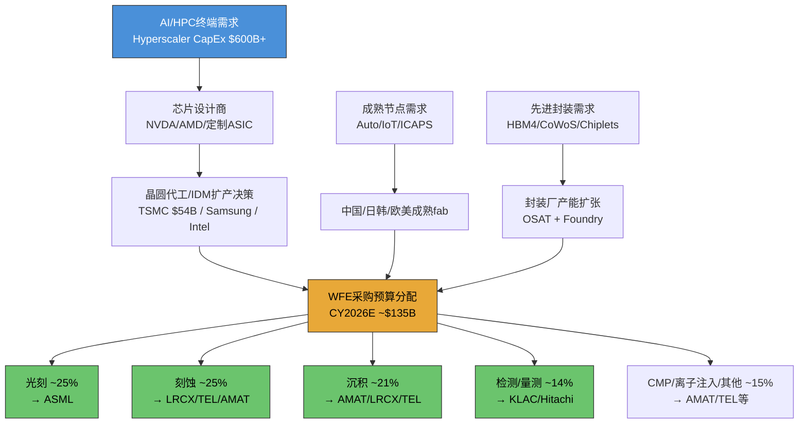
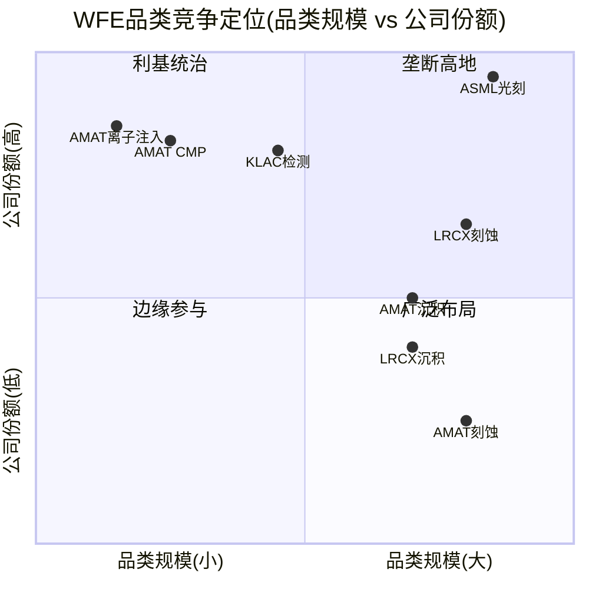
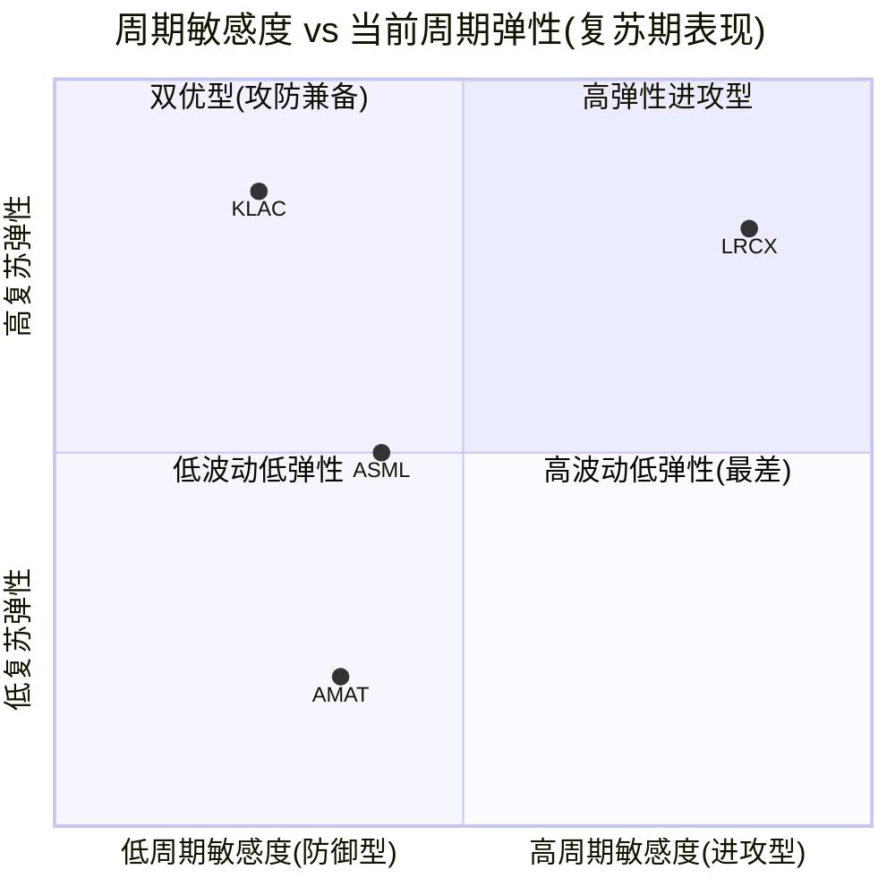

# Chapter 3: WFE市场结构与周期定位

**核心论点**: 全球WFE市场正处于AI驱动的第四年连续上行周期(CY2024-CY2027E),这在近30年中前所未有。四家公司共享同一宏观周期背景,但由于品类暴露度、经常性收入缓冲和积压订单厚度的差异,周期冲击的传导路径和幅度截然不同。KLAC在周期维度上最具投资吸引力——下行保护最强(Beta<1)、复苏弹性最高(Beta>1)、且当前估值对周期乐观预期的定价相对LRCX更为温和。

---

## 3.1 全球WFE市场全景 (2021-2026E)

### 3.1.1 市场规模与增速

全球晶圆厂设备(Wafer Fab Equipment, WFE)市场是半导体产业链中最具周期性的环节之一。设备采购直接反映芯片制造商对未来2-3年终端需求的预期,因此WFE是半导体产业的"二阶导数"——不仅受终端需求影响,更受终端需求变化率的驱动 [EC-MKT-001]。

**WFE历史规模与增速** (CY2019-CY2027E):

| 年份 | WFE规模 | YoY增速 | 驱动因素 |
|------|---------|---------|---------|
| CY2019 | $48.8B | -19% | 存储过剩+贸易摩擦 |
| CY2020 | $65B | +33% | 疫情需求+5nm启动 |
| CY2021 | $90B+ | +38% | 全面扩产(逻辑+存储+成熟节点) |
| CY2022 | $98B | +9% | 峰值,NAND CapEx开始冻结 |
| CY2023 | $76B | -22% | NAND CapEx冻结+库存调整 |
| CY2024 | $104B | +37% | AI复苏+中国抢装 |
| CY2025E | $116B | +11% | Memory复苏+AI CapEx启动 |
| CY2026E | $135B | +9% | GAA量产+HBM扩张 |
| CY2027E | $145-156B | +7-15% | 先进封装+延续投资(SEMI vs Gartner分歧) |

**来源**: SEMI 2026-02预测 + Yole/Gartner交叉验证 [DM-CYCLE-002 from LRCX报告], AMAT报告 [DM-MACRO-005]

关键分歧值得特别标注: SEMI预测CY2027E达$145-156B并创历史新高,而Gartner更为保守(CY2026E仅$120B级别,+4.4%增速),并警告CY2027-2028可能出现"周期性暂停" [EC-MKT-002]。分歧核心在于: AI需求是否构成"结构性需求底"(SEMI立场),还是叠加在传统周期之上的一次性脉冲(Gartner立场)。

### 3.1.2 关键驱动力解构

当前WFE超级周期由五大驱动力交织形成,按影响权重排序:

1. **AI/HPC芯片需求 (权重~35%)**: 四大超大规模厂商(Amazon/Google/Microsoft/Meta)CY2026合计CapEx预计达$600B+(+36% YoY),其中约75%直接用于AI基础设施 [EC-MKT-003, from AMAT报告]。下游传导至TSMC先进制程/CoWoS产能扩张和三星/SK海力士HBM产能翻倍。每$100B数据中心投资,设备公司可捕获约$8B WFE支出 [DM-BIZ-014 from LRCX报告]。

2. **先进封装/HBM (权重~20%)**: HBM3E/HBM4量产需要大量新增设备。Samsung HBM月产能目标CY2026底25万片(+47% vs当前17万片); SK Hynix DRAM总产能2H26可达约62万片/月(较2023年中期翻倍) [DM-CYCLE-005 from LRCX报告]。先进封装设备TAM的CAGR约33%($5.5B至$17.5B,CY2024-2028) [EC-MKT-004, from AMAT报告DM-MACRO-004]。

3. **先进逻辑节点迁移 (权重~20%)**: TSMC 3nm/2nm + Intel 18A/14A + Samsung 2nm GAA量产,每一代节点迁移增加工艺步骤数(从FinFET的约350步到GAA的约400-600步) [EC-MKT-005, from KLAC报告DM-TECH-301],对刻蚀/沉积/检测的设备需求产生乘数效应。

4. **成熟节点/ICAPS (权重~15%)**: 汽车/工业/IoT需求驱动28nm及以上产能扩张。中国在成熟节点的抢装虽已从峰值回落,但全球8英寸产能利用率已从75-80%回升至85-90% [DM-CYCLE-004 from LRCX报告],表明消化周期接近尾声 [EC-MKT-006]。

5. **地缘政治驱动的产能冗余 (权重~10%)**: 美国CHIPS法案、欧盟芯片法案、日本半导体战略推动的"在岸化"产能建设。TSMC亚利桑那厂、Intel俄亥俄厂、Samsung德州厂等项目预计在CY2025-2028为ASML贡献约120-150亿欧元设备订单 [DM-CHIPS-1 from ASML报告]。

### 3.1.3 设备品类分布

WFE并非一个均质市场,不同设备品类的市场规模、增速和竞争格局差异巨大:

| 设备品类 | CY2025E规模 | 占WFE比例 | CAGR(5Y) | 竞争格局 |
|---------|-----------|----------|---------|---------|
| **光刻** | ~$28-30B | ~25-26% | 10-12% | ASML垄断(EUV 100%, DUV ~85%) |
| **刻蚀** | ~$28B | ~24-25% | 7-8% | LRCX 45%, TEL 27%, AMAT 15% |
| **沉积(CVD/PVD/ALD/ECD)** | ~$22-24B | ~20-21% | 8-10% | AMAT领先(PVD ~85%), LRCX(ALD), TEL |
| **检测/量测** | ~$15B | ~13-14% | 7-8% | KLAC 63%, Hitachi, Lasertec |
| **CMP/清洗** | ~$7-8B | ~6-7% | 5-6% | AMAT(CMP 65%), Screen(清洗) |
| **离子注入** | ~$4-5B | ~4% | 4-5% | AMAT ~70%, Axcelis |
| **其他(热处理等)** | ~$8-10B | ~7-8% | 5-7% | TEL, Kokusai |

**来源**: 综合SEMI/Yole/各公司年报SAM数据; LRCX报告刻蚀TAM [DM-BIZ-007, DM-BIZ-015]; KLAC报告检测市场 [DM-RISK-006]; AMAT报告品类分析 [EC-MKT-007]

品类结构揭示了一个关键事实: **光刻和刻蚀合计占WFE约50%**,这两个品类分别由ASML和LRCX主导。而AMAT虽然在多个品类有布局,但除PVD和离子注入外,没有在任何单一高价值品类取得绝对领先。KLAC所在的检测/量测占比约13-14%,规模虽不最大,但增速与WFE同步甚至超越(KLA收入CAGR 15.1% vs WFE CAGR约8-10%) [EC-MKT-008]。

### 3.1.4 WFE需求传导链

从终端AI需求到设备公司收入,存在多级传导和放大/衰减效应:

**传导链的关键特征**:

- **放大效应**: 终端AI收入的增长通过芯片设计→代工扩产→设备采购的链条被放大。Hyperscaler每增加$1B AI CapEx,大约有$0.08-0.10B流向WFE设备 [EC-MKT-009]。
- **时滞效应**: 从Hyperscaler CapEx决策到设备公司确认收入,存在12-24个月时滞。这意味着CY2026的WFE收入很大程度上由CY2024-2025的订单决定 [EC-MKT-010]。
- **非对称衰减**: 上行传导时需求信号被逐级放大("牛鞭效应"),下行传导时衰减更为剧烈——Hyperscaler可能仅削减10%CapEx,但传导到WFE层面可能导致20-30%的下降 [EC-MKT-011]。

---

## 3.2 四公司在WFE中的位置

### 3.2.1 品类覆盖与市场份额

四家公司在WFE中的定位截然不同——从ASML的单品类绝对垄断到AMAT的多品类广泛覆盖,构成了半导体设备行业最具代表性的战略频谱:

**ASML: 光刻垄断者**

| 子品类 | 市场份额 | 竞争对手 | 备注 |
|--------|---------|---------|------|
| EUV光刻 | **100%** | 无 | 全球唯一EUV供应商 |
| DUV光刻(ArF浸没式) | **~85%** | Nikon (~15%) | 先进节点仍需DUV辅助层 |
| DUV光刻(KrF/i-line) | **~60%** | Nikon, Canon | 成熟节点,技术壁垒较低 |
| High-NA EUV | **100%** | 无 | 2nm/1.4nm的唯一选择 |

ASML的垄断不仅是市场份额的垄断,更是技术路径的垄断——没有ASML的EUV光刻机,3nm及以下节点的芯片无法制造。EUV系统单台售价超过2亿欧元,High-NA更达3.5亿欧元,这使光刻成为WFE中单台ASP最高的品类 [EC-POS-001, from ASML报告DM-TECH-06]。

**LRCX: 刻蚀/沉积双引擎**

| 子品类 | 市场份额 | 竞争对手 | 备注 |
|--------|---------|---------|------|
| 刻蚀(整体) | **~45%** | TEL (~27%), AMAT (~15%) | #1,绝对领先 |
| NAND通道刻蚀 | **100%** | TEL Certas挑战中 | 独占,但面临新威胁 |
| ALD沉积 | **领先** | AMAT, TEL, ASM | FY2025 ALD收入增50%+ |
| PECVD沉积 | **~25%** | AMAT CVD ~21% | 第二梯队领先 |

**来源**: LRCX报告 [DM-BIZ-007, DM-BIZ-008, DM-BIZ-009, DM-BIZ-015, DM-BIZ-016]

LRCX的核心竞争力集中在刻蚀领域,特别是3D NAND的超高深宽比(HAR)刻蚀中拥有近乎不可替代的技术优势。SAM占WFE的mid-30s%,目标扩展至high-30s% [DM-BIZ-005 from LRCX报告]。

**AMAT: 多品类通才**

| 子品类 | 市场份额 | 竞争对手 | 备注 |
|--------|---------|---------|------|
| PVD | **~85%** | Ulvac, Naura(1%→10%) | 份额最高的单一品类 |
| CVD | **~21%** | LRCX, TEL | 市场第二 |
| CMP | **~65%** | Ebara | 寡占 |
| 离子注入 | **~70%** | Axcelis | 近垄断 |
| 刻蚀 | **~15%** | LRCX, TEL | 市场第三 |
| ECD(电化学沉积) | **领先** | — | 先进封装相关 |

**来源**: AMAT报告五维度对比框架 [DM-COMP-001, DM-COMP-003], 各品类份额综合行业研报

AMAT覆盖8大独立WFE市场,是Big 5中产品线最广的公司(产品线宽度评分9/10) [EC-POS-002]。但"广度"并未转化为"深度"优势——过去5年WFE份额持平在约19%,研发费用$3.57B分散在8条产品线后每条仅约$4.5亿,低于KLAC和LRCX在各自核心领域的研发密度 [DM-COMP-001 from AMAT报告]。

**KLAC: 检测/量测垄断者**

| 子品类 | 市场份额 | 竞争对手 | 备注 |
|--------|---------|---------|------|
| 过程控制(整体) | **~63%** | Hitachi, Lasertec | 2010年50%→2024年63%,持续扩张 |
| 光学检测(明场) | **~60%** | Hitachi, 少量AMAT | 核心优势 |
| 光掩模(Reticle)检测 | **>80%** | Lasertec (~30%) | 近垄断 |
| 先进封装检测 | **~50%** | Camtek, AMAT, Onto | 从10%快速扩张 |
| CD-SEM量测 | **15-20%** | Hitachi (~70%) | 接受Hitachi领先,不主动争夺 |

**来源**: KLAC报告 [DM-BIZ-004, DM-RISK-006], 检测市场结构表

KLAC的战略是"窄赛道深耕"——在过程控制这一WFE细分中建立绝对统治,但不涉足沉积、刻蚀、光刻等其他品类。结果是: 更高毛利率(62% vs 47-52%)、更强客户粘性(跨工具数据整合)和更低资本需求(CapEx 2.8% vs 5-8%) [EC-POS-003, from KLAC报告]。

### 3.2.2 品类价值 vs 品类份额矩阵

下表将四家公司的竞争定位映射到"品类规模"和"公司份额"两个维度:

| 公司 | 核心品类 | 品类CY2025E规模 | 公司份额 | 公司品类收入 | 份额趋势 |
|------|---------|---------------|---------|------------|---------|
| ASML | 光刻 | ~$28-30B | ~90%+ | ~$26-28B | 稳定(EUV+High-NA扩张) |
| LRCX | 刻蚀 | ~$28B | ~45% | ~$12.6B | 稳定(TEL挑战中) |
| LRCX | 沉积 | ~$22-24B | ~25% | ~$5.5-6.0B | 上升(ALD增长) |
| AMAT | 沉积(PVD/CVD/ECD) | ~$22-24B | ~35% | ~$7.7-8.4B | 稳中有降(PVD被Naura侵蚀) |
| AMAT | CMP+离子注入 | ~$11-13B | ~68% | ~$7.5-8.8B | 稳定 |
| AMAT | 刻蚀 | ~$28B | ~15% | ~$4.2B | 稳定 |
| KLAC | 检测/量测 | ~$15B | ~63% | ~$9.5B | 上升(2010年50%→2024年63%) |

[EC-POS-004]

**关键洞见**: ASML和KLAC各自在所处品类拥有最高份额,但品类规模差异巨大(光刻$30B vs 检测$15B),这直接解释了两者的收入和市值差距。LRCX在最大的非光刻品类(刻蚀$28B)中份额最高(45%),理论上拥有最大的绝对收入弹性——但也意味着最高的周期暴露度。AMAT的"广度"意味着它在$90B+(非光刻WFE)的广阔市场中都有触点,但没有在任何单一高价值品类建立压倒性优势。

**矩阵解读**:
- **垄断高地**(高份额+大品类): ASML光刻独居此位,这是整个WFE行业中最有价值的战略位置。
- **利基统治**(高份额+中小品类): KLAC检测和AMAT的CMP/离子注入。份额极高但品类规模限制了绝对收入天花板。
- **广泛布局**(中低份额+大品类): AMAT刻蚀、LRCX沉积。在大市场中有存在但不主导。
- LRCX刻蚀处于大品类+中高份额的有利位置,是除ASML外"品类价值*份额"乘积最大的组合。

---

## 3.3 周期定位与需求可见度 (WFE六层雷达)

### 3.3.1 六层雷达框架

沿用B1维度定义的WFE六层雷达框架,逐层分析当前周期位置:

| 层级 | 维度 | 当前信号 | 定量指标 | 周期阶段判定 |
|------|------|---------|---------|-----------|
| **L1** | 终端需求 | AI/HPC需求强劲, DRAM价格QoQ+90-95%, NAND QoQ+55-60% | 价格暴涨+供给受限 | **扩张期(P2)** |
| **L2** | 客户CapEx | TSMC $54B(+32%), WFE CY2026E $135B(+9%), 但增速从+37%递减至+9% | 绝对值新高但增速递减 | **接近峰值(P3)** |
| **L3** | WFE总量 | CY2026E $135B(SEMI), CY2024-2027连续4年增长为30年首次 | 历史罕见的长上行 | **中后期(P2.5)** |
| **L4** | 品类分布 | 先进封装设备TAM CAGR 33%, ALD增长50%+, 检测增速超WFE | AI驱动品类结构变化 | **扩张期(P2)** |
| **L5** | 订单/积压 | ASML Q4 FY2025订单创纪录13.2B欧元; LRCX递延收入+81% YoY但Q2环比-19% | 混合信号 | **过渡期(P2.5)** |
| **L6** | 库存/利用率 | TSMC 3nm/5nm满载, 8英寸利用率回升至85-90%; 设备库存增速低于收入增速 | 供需紧平衡 | **扩张期(P2)** |

**来源**: LRCX报告六层雷达 [DM-CYCLE-001~007], KLAC报告 [DM-TECH-309~310], AMAT报告 [DM-MACRO-005], ASML报告 [DM-CAPEX-01]

**综合加权判定: P2.3-2.7 (扩张中后期, 尚未到达峰值但增速边际放缓)**

[EC-CYC-001]

六层雷达呈现一个"需求强劲但增速边际放缓"的典型特征:
- **最强扩张信号**: 存储价格暴涨(DRAM QoQ +90-95%)、先进节点满载(TSMC 3nm/5nm 100%)、Hyperscaler CapEx创纪录($600B+)
- **最大拖拽力**: WFE增速从CY2024的+37%递减至CY2025的+11%再到CY2026E的+9%和CY2027E的+7%——增速递减是经典的峰值前12-18个月特征

### 3.3.2 WFE周期历史节奏

过去20年的WFE周期遵循一个相对清晰的节奏:

| 周期 | 上行期 | 持续年数 | 峰值年WFE | 峰值后跌幅 | 驱动因素 |
|------|--------|---------|----------|----------|---------|
| Cycle 1 | CY1997-2000 | 3年 | ~$28B | -46% | PC/互联网 |
| Cycle 2 | CY2003-2007 | 4年 | ~$40B | -34% | 手机/DRAM |
| Cycle 3 | CY2009-2011 | 2年 | ~$38B | -18% | 智能手机 |
| Cycle 4 | CY2016-2018 | 3年 | ~$60B | -7% | 10nm/7nm+3D NAND |
| Cycle 5 | CY2020-2022 | 3年(4年) | ~$98B | -22% | 疫情需求+5nm+HBM |
| **当前** | **CY2024-2027E** | **4年(预测)** | **$145-156B** | **?** | **AI/HBM超级周期** |
| **均值** | — | **3.2年** | — | **-22%** | — |

**来源**: KLAC报告周期历史表 [DM-TECH-310], LRCX报告 [DM-CYCLE-002]

[EC-CYC-002]

**历史规律的关键启示**:
1. WFE连续上行超过3年的情况极为罕见。CY2024-2027如果实现SEMI预测的连续4年增长,将是近30年来最长的上行周期。
2. 峰值后的平均跌幅为-22%,但波动幅度在收窄(从-46%收窄至-7%再到-22%),反映终端需求多元化和服务收入缓冲的结构性改善。
3. **增速递减模式确认**: CY2024 +37% --> CY2025E +11% --> CY2026E +9% --> CY2027E +7%。即使WFE绝对值持续创新高,增速递减斜率与历史周期峰值前12-18个月的模式高度一致。

### 3.3.3 "AI结构性转变" vs "传统周期延长"辩论

当前市场叙事中,最大的分歧在于AI是否改变了WFE的周期性本质:

**"结构性转变"阵营** (SEMI/多数卖方):
- AI需求创造了"结构性需求底",即使传统终端需求走弱,AI/HPC的设备需求也能维持WFE在较高水平
- HBM/先进封装是全新的设备需求品类,而非传统DRAM/NAND的简单升级
- 地缘政治驱动的产能冗余(CHIPS Act等)提供了与终端需求无关的设备采购动力

**"周期延长"阵营** (Gartner/部分对冲基金):
- 半导体设备在过去40年中没有任何一次成功逃逸周期性——AI不太可能是第一次
- Hyperscaler CY2026 $600B+ CapEx的可持续性存疑(收入验证缺口: AI产业需$2T/年收入 vs 最乐观预测$1.2T) [EC-CYC-003, from AMAT报告]
- Memory投资具有最强周期性,当前热度可能是HBM超级周期的暂时现象

**本报告立场**: 倾向于"有条件的周期延长",而非纯粹的结构性转变。AI确实创造了新的设备需求品类(先进封装TAM CAGR 33%),但WFE的核心周期性机制——客户CapEx的前置/后移、产能利用率周期、库存-产能振荡——并未被根本改变。最可能的路径是: CY2024-2027连续上行后,CY2028-2029出现10-15%的调整(而非历史均值的-22%),因为AI需求确实提供了较高的周期底部 [EC-CYC-004]。

---

## 3.4 周期扰动差异对比

### 3.4.1 核心问题

同样的WFE下行周期,为什么四家公司受到的冲击截然不同? 这个问题的答案直接决定了在当前周期位置(P2.3-2.7,增速递减但绝对值仍在扩张)下,哪家公司的风险收益比最优。

### 3.4.2 收入波动率: 过去两个完整周期的表现

| 指标 | AMAT | LRCX | ASML | KLAC |
|------|------|------|------|------|
| **FY2023→FY2024收入YoY** (WFE下行期) | +2.5% | **-14.5%** | +2.6% | -6.5% |
| **FY2024→FY2025收入YoY** (复苏期) | +4.4% | +23.7% | +11.0% | +23.9% |
| **2019下行周期最大收入回撤** | -12.7% | **-22.1%** | -16.3% | **-3.8%** |
| **CY2020-2021上行最大YoY** | +18.4% | +22.7% | +30.2% | +33.1% |
| **4Y收入CAGR (FY2021-2025)** | +5.3% | +5.9% | +13.9% | **+15.1%** |
| **收入波动率排名(高→低)** | #3 | **#1(最高)** | #2 | **#4(最低)** |

**来源**: financial_comparison_v2.md 第9节5年收入增长走廊, AMAT报告 [DM-REV-002~003]

[EC-CYC-005]

**波动率解读**:
- **LRCX波动最大**: 在下行周期跌幅最深(-14.5% FY2024, -22.1% 2019),在上行周期弹性也最强(+23.7% FY2025)。这直接反映了刻蚀设备采购与CapEx高度正相关的特性,加上存储暴露度(NAND 100%份额)放大了波动。
- **KLAC波动最小**: 下行期跌幅最浅(-3.8% in 2019, -6.5% FY2024),同时上行期弹性极强(+33.1% FY2022, +23.9% FY2025)。这种"抗跌跟涨"的不对称性是KLAC获得估值溢价的结构性来源。
- **AMAT稳中偏弱**: 下行跌幅温和(产品线分散化对冲),但上行弹性也有限(+4.4% FY2025远低于同期WFE增速)——"广度"提供了下行保护但牺牲了上行弹性。
- **ASML延迟感知**: CY2022-2023 WFE下行时ASML收入反而增长(FY2023 +30.2%, FY2024 +2.6%),因为2年+的订单积压延迟了周期冲击。但这也意味着ASML的周期下行可能在WFE已经复苏时才迟到显现。

### 3.4.3 周期缓冲机制: 四种不同的对冲策略

每家公司都发展出了独特的周期缓冲机制,但有效性差异巨大:

**ASML: 积压订单缓冲 (最长时滞)**

ASML的订单积压从CY2020约150亿欧元增长到CY2024超过390亿欧元 [DM-ORDER-1 from ASML报告]。以FY2025收入313.78亿欧元计,约390亿欧元积压相当于约15个月的收入覆盖。这意味着:
- 即使新订单归零(极端假设),ASML仍有15个月的已确认收入可执行
- 周期下行信号需要12-18个月才能传导至ASML的收入报表
- 但反面是: 一旦积压消化,ASML可能经历剧烈的收入断崖
- FY2025 Q4创纪录的13.2B欧元新订单表明当前积压仍在增厚,周期下行尚未开始影响订单簿

[EC-CYC-006]

**LRCX: CSBG经常性收入缓冲 (最直接的底部支撑)**

LRCX的CSBG(Customer Support and Business Group)FY2025收入$6.94B,占总收入37.7%,YoY增长16.0% [DM-BIZ-001 from LRCX报告]。CSBG的类SaaS特征为LRCX提供了周期底部支撑:
- 100K+安装腔室在15-20年生命周期内持续产生服务收入
- 即使新设备订单下滑,存量设备仍需维护
- 服务合同绑定原厂配件,第三方替代成本高且良率风险大
- FY2024(WFE下行年)CSBG仍实现正增长,部分对冲了Systems业务-14.5%的下滑

但CSBG缓冲的有效性有限: FY2024总收入仍下降-14.5%,说明Systems下滑的幅度远超CSBG增长的对冲能力。37.7%的经常性收入占比意味着62.3%的Systems收入仍完全暴露于WFE周期 [EC-CYC-007]。

**KLAC: 检测刚需 + 低周期Beta + 服务缓冲**

KLAC的周期防御来自三个层面:
1. **检测设备的刚需特性**: 检测是fab的"保险单"——fab可以延迟产能扩张(减少刻蚀/沉积采购),但不能降低在产产能的良率监控标准。这一不对称性是KLAC下行Beta<1的结构性来源 [DM-BIZ-001 from KLAC报告]。
2. **服务业务的压舱石**: 服务收入$2.68B(22%),52个季度(13年)连续同比增长,75%订阅合同+95%续约率 [DM-BIZ-006, DM-FIN-112 from KLAC报告]。
3. **历史Beta分析**: 下行周期Beta<1(CY2018-2019: 0.57x), 上行周期Beta>1(CY2020-2021: 1.38x, CY2023-2024: 2.67x)。但5/5次WFE下行期KLAC有机收入均为负增长——Beta<1不等于正增长,只是跌幅小于市场 [DM-RT7-001~003 from KLAC报告]。

[EC-CYC-008]

**AMAT: 产品线广度 + AGS服务**

AMAT的8条产品线理论上提供了分散化对冲,实际效果有限:
- FY2022→FY2023: AMAT收入+2.8%(同期LRCX -14.5%),分散化确实起效
- 但根本原因是所有8条产品线都服务于同一个WFE宏观周期,相关性远高于独立行业
- 真正的周期防御来自AGS($6.39B,22%收入,含>67%经常性占比,90%+续约率) [DM-SEG-002 from AMAT报告]
- FY2022→FY2023: SSG -12%但AGS +5%,验证了AGS的反周期缓冲
- 但AGS中的中国收入($300-500M)同样面临出口管制风险

[EC-CYC-009]

### 3.4.4 下行时利润率弹性

利润率在周期下行时的表现揭示了各公司的"成本刚性"和定价权差异:

**5年毛利率走廊** (FY2021-FY2025):

| 年份 | ASML | LRCX | KLAC | AMAT |
|------|------|------|------|------|
| FY2021 | 52.7% | 46.5% | 59.9% | 47.3% |
| FY2022 | 50.5% | 45.7% | 61.0% | 46.5% |
| FY2023 | 51.3% | 44.6% | 59.8% | 46.7% |
| FY2024 | 51.3% | 47.3% | 60.0% | 47.5% |
| FY2025 | 52.8% | 48.7% | 62.3% | 48.7% |
| **5Y均值** | **51.7%** | **46.6%** | **60.6%** | **47.3%** |
| **5Y极差** | **2.3pp** | **4.1pp** | **2.5pp** | **2.2pp** |

**来源**: financial_comparison_v2.md 第10节

[EC-CYC-010]

**利润率稳定性排名**: AMAT (极差2.2pp) > ASML (2.3pp) ≈ KLAC (2.5pp) > LRCX (4.1pp)

**关键洞见**:
- **KLAC毛利率最高(60.6%均值)且波动极小(2.5pp极差)**: 过程控制的"软件+光学"本质使成本结构中固定成本占比高,但定价权极强(客户无法通过降低检测投入来节省成本——良率损失远大于设备费用)。下行期毛利率几乎不压缩。
- **LRCX波动最大(4.1pp极差)**: 刻蚀设备的利润率与产品组合(先进节点高利润 vs 成熟节点低利润)和产能利用率高度相关。FY2023谷底44.6%到FY2025峰值48.7%的410bps改善反映了CSBG占比提升和ALD溢价。
- **AMAT极差最小(2.2pp)但绝对水平最低(47.3%均值)**: 8条产品线的"混合"效应既平滑了波动,也拉低了整体水平。
- **ASML极差2.3pp且均值居中(51.7%)**: 垄断定价权提供了利润率稳定性,但EUV系统的复杂制造工艺限制了毛利率上限。

### 3.4.5 复苏弹性: 谁在上行周期反弹更快

| 指标 | AMAT | LRCX | ASML | KLAC |
|------|------|------|------|------|
| FY2024→FY2025收入YoY | +4.4% | **+23.7%** | +11.0% | **+23.9%** |
| FY2025 TTM收入增速 | +4.4% | +23.7% | +11.0% | +23.9% |
| WFE上行Beta(近两轮均值) | ~0.8x | ~1.5x | ~1.2x | **~2.0x** |
| 领先信号净值(2026-02-24) | 0 (±1) | **+3** | +2 | 0 (±1) |

**来源**: financial_comparison_v2.md 第9节+第14节

[EC-CYC-011]

**复苏弹性排名**: KLAC (上行Beta ~2.0x) > LRCX (~1.5x) > ASML (~1.2x) > AMAT (~0.8x)

KLAC的上行Beta>1看似与"检测刚需"叙事矛盾,但实际驱动因素不同: 上行期KLAC的超额增速来自(1)制程复杂度驱动的检测强度提升(+2-3pp vs WFE); (2)先进封装检测增量($925M CY2025, +85% YoY); (3)份额从50%→63%的持续提升 [DM-BIZ-004, DM-BIZ-106 from KLAC报告]。这意味着KLAC在上行周期中不仅享受WFE增长,还获得了超越WFE的结构性增量。

### 3.4.6 周期扰动对比总表

| 维度 | AMAT | LRCX | ASML | KLAC |
|------|------|------|------|------|
| **FY2024收入YoY** (下行期) | +2.5% | -14.5% | +2.6% | -6.5% |
| **FY2025收入YoY** (复苏期) | +4.4% | +23.7% | +11.0% | +23.9% |
| **毛利率5Y极差** | 2.2pp | 4.1pp | 2.3pp | 2.5pp |
| **经常性收入占比** | 22%(AGS) | 37.7%(CSBG) | ~30%(服务) | 22%(服务) |
| **积压订单厚度(月)** | N/A (未披露) | ~1.7月(递延$2.57B/FY2025 Rev) | **~15月**(约390亿欧元) | ~2.4月(RPO $2.35B) |
| **下行Beta** | ~0.7x | ~1.3x | ~0.5x(延迟) | ~0.7x |
| **上行Beta** | ~0.8x | ~1.5x | ~1.2x | ~2.0x |
| **2019最大回撤** | -12.7% | -22.1% | -16.3% | -3.8% |
| **周期防御评分** | 7/10 | 4/10 | 6/10 | **8/10** |
| **复苏弹性评分** | 4/10 | 8/10 | 6/10 | **9/10** |

**来源**: 综合financial_comparison_v2.md, AMAT报告五维度对比框架 [DM-COMP-001], 各公司报告周期分析

[EC-CYC-012]

**积压订单厚度说明**:
- ASML约15个月的积压是四家中最厚的,这是EUV光刻机长制造周期(18-24个月)和客户提前锁定策略的结果 [DM-ORDER-1 from ASML报告]
- LRCX递延收入$2.57B(FY2025)仅覆盖约1.7个月收入,但递延收入不等于全部积压——部分订单未反映在递延收入中
- KLAC RPO(Remaining Performance Obligations)$2.35B(流动$2.00B+非流动$0.35B),覆盖约2.4个月收入
- AMAT未单独披露积压订单数据,透明度相对较低 [EC-CYC-013]

### 3.4.7 周期敏感度可视化

**象限解读**:
- **KLAC**: 位于"双优型"象限——低周期敏感度(下行Beta ~0.7x)且高复苏弹性(上行Beta ~2.0x),这是四家中唯一同时具备攻防优势的公司。
- **LRCX**: 位于"高弹性进攻型"象限——复苏弹性极强(+23.7%)但周期敏感度也最高(下行-14.5%),是典型的"高Beta"选择。
- **ASML**: 位于图的中间位置——积压订单延迟了周期冲击,使其表现出中等敏感度和中等弹性。
- **AMAT**: 位于"低波动低弹性"象限——产品线广度提供了下行保护,但也牺牲了上行弹性,FY2025仅+4.4%的复苏远逊于同业。

---

## 3.5 投资排名视角: 周期维度

### 3.5.1 当前周期位置的投资含义

当前WFE处于P2.3-2.7(扩张中后期),这对投资意味着:
1. **WFE绝对值仍在创新高,但增速递减**: 对设备股来说,增速递减通常先于绝对值见顶导致估值压缩
2. **历史先例: 连续4年上行后下行概率上升**: CY2027可能是峰值年,CY2028-2029面临调整风险
3. **估值已反映大量乐观预期**: 四家公司当前P/E均处于历史高位(TTM P/E 38-52x vs 5Y均值19-39x),溢价幅度34%-119% [financial_comparison_v2.md第13节]

### 3.5.2 周期维度排名

**排名 #1: KLAC -- 攻防兼备,最优风险收益比**

- **下行保护**: 检测刚需(5-7% fab CapEx但影响良率产出); 5Y毛利率极差仅2.5pp; 服务业务52Q连续增长; 下行Beta ~0.7x; 2019最大回撤仅-3.8%
- **复苏弹性**: 上行Beta ~2.0x; 先进封装检测增量($925M CY2025, +85%); 份额持续从50%→63%扩张
- **估值对周期乐观的定价**: TTM P/E 49.0x vs 5Y均值25.7x(+91%溢价),估值不便宜,但PR(市赚率)=0.49x是四家最低,意味着相对于ROE水平(100.7%),市场定价还留有一定空间
- **周期定位**: WFE零增长基准+0~+4%(非管理层宣称的+8~10%),但仍优于同业的负增长 [DM-RT7-001~003 from KLAC报告]

[EC-INV-001]

**排名 #2: LRCX -- 高弹性但高波动,适合周期交易者**

- **下行保护**: CSBG 37.7%提供底部,但Systems 62.3%完全暴露; 下行Beta ~1.3x; 2019回撤-22.1%
- **复苏弹性**: 上行Beta ~1.5x; NAND升级收入+90%; 递延收入+81% YoY; 三重正面领先信号(财务对比表净信号+3,四家最优)
- **估值对周期乐观的定价**: TTM P/E 50.9x vs 5Y均值23.2x(**+119%溢价,四家中最高**)——市场已充分定价了复苏弹性
- **关键风险**: 如果CY2027-2028 WFE下行,LRCX将是跌幅最深的公司; 且当前50.9x P/E意味着任何不及预期都会引发双杀(盈利下行+估值压缩)

[EC-INV-002]

**排名 #3: ASML -- 延迟的安全感,但非真正的免疫**

- **下行保护**: 约15个月的积压订单提供收入可见度; 垄断定价权使毛利率极为稳定(5Y极差2.3pp); 下行Beta约0.5x(含延迟效应)
- **复苏弹性**: 中等(上行Beta ~1.2x); EUV单价持续提升; High-NA打开新增量
- **估值对周期乐观的定价**: TTM P/E 51.7x vs 5Y均值38.5x(+34%溢价,四家最低)——垄断溢价使5Y均值本身已很高,+34%的额外溢价在绝对水平上仍然昂贵
- **关键风险**: 积压订单不是免疫,只是延迟——一旦CY2028-2029新订单放缓,ASML可能在市场复苏时才感受到前轮下行的冲击("滞后效应")
- **独特问题**: 约390亿欧元积压中有多少可能被取消或推迟? 历史上周期转折时客户推迟EUV交付的先例存在

[EC-INV-003]

**排名 #4: AMAT -- 稳健但乏味,周期上行中的落后者**

- **下行保护**: 产品线广度(8品类)+AGS 22%经常性收入; 下行Beta ~0.7x; 毛利率极差最小(2.2pp)
- **复苏弹性**: 四家最弱(上行Beta ~0.8x); FY2025仅+4.4%(远低于WFE +11%和同业20%+)
- **估值对周期乐观的定价**: TTM P/E 37.9x vs 5Y均值19.5x(+94%溢价)——虽然绝对P/E最低,但相对于自身历史均值的溢价几乎与KLAC持平
- **关键矛盾**: 下行保护适中但上行弹性严重不足。在WFE上行周期中持有AMAT的机会成本很高(FY2025跑输LRCX约19pp, 跑输KLAC约19.5pp)。EPIC Center的$5B投资可能在CY2027+改变这一局面,但目前仍是$0收入贡献
- **WFE份额19%持平5年**: 广度策略未能转化为增量增长,这是周期维度上AMAT排名末位的核心原因 [DM-COMP-001 from AMAT报告]

[EC-INV-004]

### 3.5.3 排名的限定条件

以上排名仅基于**周期维度**,需要在后续章节与护城河(A-Score)、估值(B-Score)、竞争格局等维度整合后才能形成最终判决。特别注意:

1. **KLAC的估值风险**: 虽然周期维度排名第一,但TTM P/E 49.0x意味着下行保护已被部分定价。如果市场已经为KLAC的"抗跌跟涨"支付了充分溢价,实际的风险调整回报可能不如排名暗示的那么优越。
2. **LRCX的周期交易价值**: 对于愿意承担波动的投资者,LRCX在周期底部(FY2024 P/E 36.4x, EPS谷底$2.96)的买入机会可能比KLAC在任何时点的买入更具回报潜力。
3. **ASML的垄断永续假设**: 如果AI确实改变了WFE周期性(使结构性需求底显著抬升),ASML的积压订单+垄断定价权组合将使其成为最佳长期持有标的,周期排名的重要性将大幅下降。
4. **AMAT的EPIC期权**: 如果EPIC Center在CY2027+成功将WFE份额从19%提升至20%+,AMAT的周期弹性将显著改善。当前排名反映的是已证实的历史表现,而非未来潜力。

**最终判决将在Ch20中综合所有维度后给出。本章周期排名为: KLAC > LRCX > ASML > AMAT。**

---

## Evidence Card注册表 (Chapter 3新建)

| EC编号 | 描述 | 来源 | 置信度 |
|--------|------|------|--------|
| EC-MKT-001 | WFE是半导体产业的"二阶导数",受终端需求变化率驱动 | 行业通识 + LRCX/KLAC报告 | H |
| EC-MKT-002 | SEMI vs Gartner对CY2026-2027 WFE规模存在13%+分歧 | LRCX报告DM-CYCLE-002, AMAT报告DM-MACRO-005 | H |
| EC-MKT-003 | CY2026 Top 5 Hyperscaler CapEx预计达$600B+,75%用于AI | AMAT报告 | M |
| EC-MKT-004 | 先进封装设备TAM CAGR 33%($5.5B至$17.5B,CY2024-2028) | AMAT报告DM-MACRO-004 | M |
| EC-MKT-005 | GAA工序从350-450道增至400-600道,检测占比从15%升至20% | KLAC报告DM-TECH-301~302 | M |
| EC-MKT-006 | 全球8英寸利用率从75-80%回升至85-90%,成熟节点消化接近尾声 | LRCX报告DM-CYCLE-004 | H |
| EC-MKT-007 | WFE品类分布: 光刻~25%, 刻蚀~25%, 沉积~21%, 检测~14%, 其他~15% | 综合SEMI/Yole/各公司SAM | M |
| EC-MKT-008 | KLAC收入CAGR 15.1% vs WFE CAGR ~8-10%,持续跑赢大盘 | financial_comparison_v2.md | H |
| EC-MKT-009 | Hyperscaler每增加$1B AI CapEx约$0.08-0.10B流向WFE | LRCX报告DM-BIZ-014推算 | M |
| EC-MKT-010 | 从Hyperscaler CapEx到设备收入确认存在12-24个月时滞 | 行业通识 | H |
| EC-MKT-011 | WFE的牛鞭效应: Hyperscaler削减10%CapEx可能导致WFE下降20-30% | 行业经验法则推算 | L |
| EC-POS-001 | ASML: EUV 100%份额, DUV ~85%, High-NA 100%, 单台EUV >2亿欧元 | ASML报告DM-TECH-06 | H |
| EC-POS-002 | AMAT覆盖8大WFE市场,产品线宽度9/10,但WFE份额5年持平19% | AMAT报告DM-COMP-001 | H |
| EC-POS-003 | KLAC"窄赛道深耕"策略: 更高毛利率(62% vs 47-52%)、更低CapEx(2.8%) | KLAC报告 + financial_comparison_v2.md | H |
| EC-POS-004 | 品类价值*份额乘积: ASML光刻>LRCX刻蚀>AMAT沉积>KLAC检测 | 各公司SAM + 份额数据综合 | M |
| EC-CYC-001 | WFE六层雷达综合判定: P2.3-2.7(扩张中后期) | LRCX报告DM-CYCLE-007, KLAC/AMAT报告交叉 | M |
| EC-CYC-002 | WFE历史上行均值3.2年,当前第4年将是30年来最长 | KLAC报告DM-TECH-310, LRCX报告DM-CYCLE-002 | H |
| EC-CYC-003 | AI收入验证缺口: 需$2T/年 vs 最乐观预测$1.2T | AMAT报告 | M |
| EC-CYC-004 | 本报告立场: "有条件的周期延长",CY2028-2029可能调整10-15% | 综合分析判断 | L |
| EC-CYC-005 | LRCX收入波动率最高(下行-14.5%), KLAC最低(下行-6.5%) | financial_comparison_v2.md | H |
| EC-CYC-006 | ASML积压订单约390亿欧元,覆盖约15个月收入 | ASML报告DM-ORDER-1 | H |
| EC-CYC-007 | LRCX CSBG 37.7%提供底部支撑,但Systems 62.3%完全暴露于WFE周期 | LRCX报告DM-BIZ-001 | H |
| EC-CYC-008 | KLAC: 下行Beta ~0.7x, 上行Beta ~2.0x, "抗跌跟涨"不对称性 | KLAC报告DM-TECH-310 | H |
| EC-CYC-009 | AMAT AGS $6.39B, >67%经常性, FY2022→2023 SSG -12%但AGS +5% | AMAT报告DM-SEG-002 | H |
| EC-CYC-010 | 5Y毛利率极差: AMAT 2.2pp, ASML 2.3pp, KLAC 2.5pp, LRCX 4.1pp | financial_comparison_v2.md | H |
| EC-CYC-011 | 复苏弹性排名: KLAC(Beta ~2.0x) > LRCX(~1.5x) > ASML(~1.2x) > AMAT(~0.8x) | 综合各报告Beta分析 | M |
| EC-CYC-012 | 周期防御评分: KLAC 8/10, AMAT 7/10, ASML 6/10, LRCX 4/10 | AMAT报告五维度框架 | M |
| EC-CYC-013 | AMAT未单独披露积压订单数据,透明度相对较低 | AMAT报告 | H |
| EC-INV-001 | 周期维度排名#1 KLAC: 攻防兼备(下行Beta 0.7x + 上行Beta 2.0x) | 综合分析 | M |
| EC-INV-002 | 周期维度排名#2 LRCX: 高弹性但P/E 50.9x(+119%溢价)已充分定价 | 综合分析 | M |
| EC-INV-003 | 周期维度排名#3 ASML: 积压订单提供延迟保护但非真正免疫 | 综合分析 | M |
| EC-INV-004 | 周期维度排名#4 AMAT: 下行保护适中但上行弹性最弱(FY2025仅+4.4%) | 综合分析 | M |
