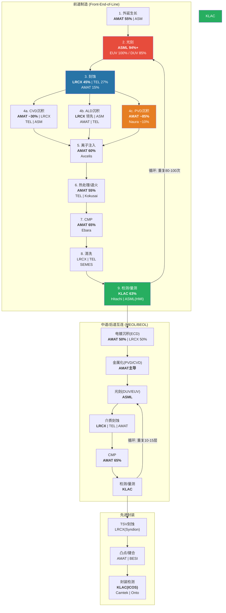
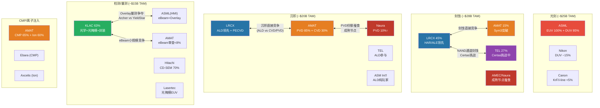
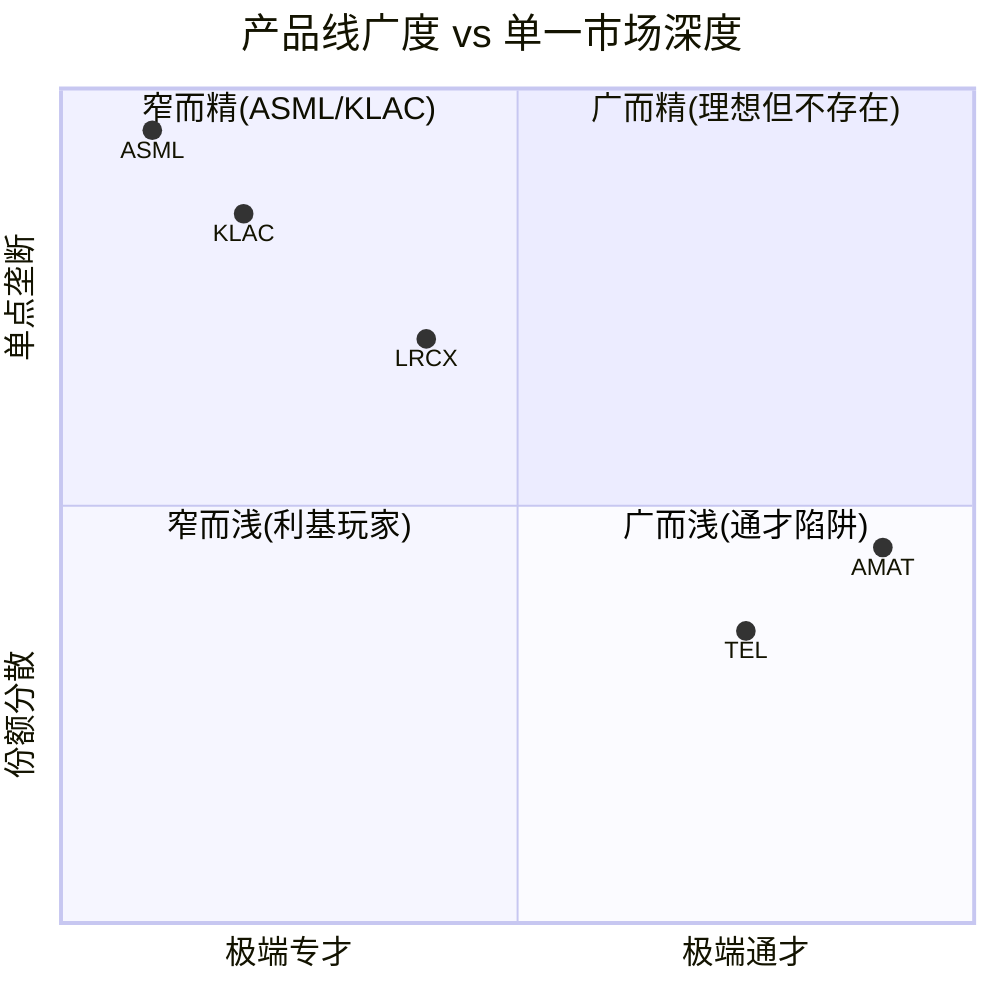

# Chapter 4: 设备价值链与竞争地图

**半导体设备行业的竞争格局呈现出"垄断-寡头-碎片化"的三级梯度结构: ASML在光刻领域构建了不可复制的100%垄断, KLAC在检测/量测领域以63%份额实现准垄断, LRCX与AMAT在刻蚀/沉积领域形成寡头竞争。四家公司的竞争交叉有限但真实存在 -- 叠对量测(KLAC vs ASML)、eBeam检测(AMAT vs KLAC)、沉积(AMAT vs LRCX)是三个活跃的竞争边界。产品线广度与专精度的战略取舍直接映射到毛利率差异: KLAC(专精)61.9% vs AMAT(通才)48.7%, 13pp的差距是战略选择的财务代价。**

---

## 4.1 半导体制造工艺流程与设备对应

### 4.1.1 从晶圆到芯片: 工艺全流程

半导体制造是人类工业史上最复杂的制造过程。一颗先进逻辑芯片(如TSMC N3)需要经历400-600道工序, 历时2-3个月, 涉及十余类设备的反复配合。理解每道工序对应的设备类型及其供应商, 是评估四家公司竞争地位的基础。

制造流程可分为三大阶段: **前道(Front-End-of-Line, FEOL)** 制造晶体管本身; **中道/后道(MEOL/BEOL)** 构建互连线路; **封装测试(Back-End)** 完成芯片封装与功能验证。

**前道核心工序链:**

| 序号 | 工序 | 功能 | 设备类型 | 主要供应商 | 属性 |
|------|------|------|---------|-----------|------|
| 1 | 外延生长(Epitaxy) | 在硅片表面生长单晶硅薄膜 | EPI设备 | **AMAT**(55%), ASM | Must-have |
| 2 | 光刻(Lithography) | 将电路图案转移到晶圆表面 | EUV/DUV光刻机 | **ASML**(94%+) | Must-have |
| 3 | 刻蚀(Etch) | 去除未被光刻胶保护的材料 | 等离子刻蚀机 | **LRCX**(45%), TEL(27%), AMAT(15%) | Must-have |
| 4 | 薄膜沉积(Deposition) | 在晶圆上沉积各种功能薄膜 | CVD/ALD/PVD设备 | **AMAT**(PVD 85%), **LRCX**(ALD领先) | Must-have |
| 5 | 离子注入(Ion Implant) | 将掺杂原子注入半导体 | 离子注入机 | **AMAT**(60%), Axcelis | Must-have |
| 6 | 热处理(RTP/Anneal) | 激活掺杂、修复晶格损伤 | 快速热处理设备 | **AMAT**(55%), TEL, Kokusai | Must-have |
| 7 | CMP(化学机械抛光) | 平坦化晶圆表面 | CMP设备 | **AMAT**(65%), Ebara | Must-have |
| 8 | 清洗(Clean) | 去除残留颗粒与化学品 | 湿法清洗设备 | LRCX(DV-Prime), TEL, SEMES | Must-have |
| 9 | 检测/量测(Inspection/Metrology) | 检测缺陷、测量尺寸精度 | 光学/eBeam检测、量测工具 | **KLAC**(63%), Hitachi, ASML(HMI) | Must-have |
| 10 | 涂覆/显影(Coat/Develop) | 光刻前后的光刻胶处理 | 涂覆/显影机(Track) | TEL(90%), SEMES | Must-have |

[EC-VC-001: 先进逻辑芯片(3nm/2nm)制造涉及400-600道工序, 光刻+刻蚀+沉积+检测四类设备合计占fab总CapEx的70-80%]

**关键理解: 光刻-刻蚀-沉积-检测的循环**

先进芯片制造的核心不是"线性流水线", 而是"循环往复"。每个功能层的制造都需要完整经历一次"光刻->刻蚀->沉积->CMP->检测"的循环。一颗3nm芯片可能需要80-100次光刻曝光(其中15-20次EUV), 每次光刻后跟随1-3次刻蚀和1-3次沉积, 每个关键步骤后需要检测/量测。这种"循环叠加"的工艺结构意味着:

- **光刻次数决定整体工序复杂度** -- ASML的工具含量(tool intensity)随节点缩小指数增长
- **刻蚀/沉积步骤数随光刻层数线性甚至超线性增长** -- LRCX和AMAT直接受益
- **检测步骤数随总工序数增长** -- KLAC的需求弹性最高(每增加一道工序就可能需要增加一次检测)

[EC-VC-002: 从5nm FinFET到2nm GAA, 制造工序从350-450道增至400-600道, 检测步骤占比从15%升至20%]

### 4.1.2 四公司在制造流程中的卡位全景

**四公司在制造流程中的覆盖度对比:**

| 工艺环节 | ASML | LRCX | AMAT | KLAC | 属性 |
|---------|------|------|------|------|------|
| 外延生长 | -- | -- | **领先(55%)** | -- | Must-have |
| 光刻 | **垄断(94%+)** | -- | -- | -- | Must-have |
| 刻蚀 | -- | **领先(45%)** | 参与(15%) | -- | Must-have |
| CVD沉积 | -- | 参与 | **领先(~30%)** | -- | Must-have |
| ALD沉积 | -- | **领先** | 参与 | -- | Must-have |
| PVD沉积 | -- | -- | **垄断(85%)** | -- | Must-have |
| ECD电镀 | -- | 参与(50%) | 参与(50%) | -- | Must-have |
| 离子注入 | -- | -- | **领先(60%)** | -- | Must-have |
| 热处理 | -- | -- | **领先(55%)** | -- | Must-have |
| CMP | -- | -- | **领先(65%)** | -- | Must-have |
| 清洗 | -- | 参与 | -- | -- | Must-have |
| 检测/量测 | 参与(HMI) | -- | 参与(~8%) | **垄断(63%)** | Must-have |
| 涂覆/显影 | -- | -- | -- | -- | Must-have |
| 封装检测 | -- | -- | -- | **领先(50%+)** | Must-have |
| **覆盖环节数** | **2** | **4** | **10** | **2** | -- |

[EC-VC-003: AMAT覆盖10个制造环节(行业最广), LRCX覆盖4个, ASML和KLAC各覆盖2个。但覆盖广度与在每个环节的竞争深度呈反比关系]

一个关键观察: **所有制造环节都是"must-have"**, 没有一个可以跳过。但"must-have"并不等于"高壁垒"。涂覆/显影是must-have(没有它光刻无法进行), 但TEL以90%份额统治该领域, 技术壁垒和毛利率远低于EUV光刻。真正的投资价值在于"must-have + 高壁垒 + 高利润池"的交集 -- ASML的EUV光刻、KLAC的先进检测、LRCX的HAR刻蚀、AMAT的PVD正是这类交集。

---

## 4.2 四公司产品线全景与竞争格局

### 4.2.1 ASML: 光刻帝国

ASML是四家公司中产品线最窄但垄断程度最深的一家。其产品线本质上只有一条: **光刻设备**。但这一条产品线内部的技术含量和商业价值, 超过了许多公司的全部业务组合。

**EUV光刻系统 (极紫外光刻, 波长13.5nm)**

| 型号 | 定位 | ASP | WPH | 市场份额 | 状态 |
|------|------|-----|-----|---------|------|
| NXE:3600D | 标准EUV | ~$200M | ~185 | 100% | 量产主力 |
| NXE:3800E | 高产能EUV | ~$350-380M | ~220 | 100% | 新一代主力 |
| EXE:5000 (High-NA) | 下一代光刻 | ~$350M+ | TBD | 100% | 量产初期 |
| EXE:5200 (High-NA) | High-NA量产型 | ~$350M+ | TBD | 100% | 开发中 |

[EC-VC-004: ASML在EUV光刻领域保持100%市场份额, 全球无竞品。EUV单台设备包含超过25万个零部件, 需Zeiss光学系统和Trumpf/Cymer光源的独家配合]

EUV光刻是半导体制造的技术制高点。没有EUV, 7nm以下先进节点芯片无法高效量产(DUV多重曝光理论上可做到7nm甚至5nm, 但成本和良率均不可接受)。ASML的EUV垄断建立在三大支柱之上:

1. **25+年累积研发投入**: 从2000年前后开始EUV研发, 历经"十年暗淡期"(2000-2010), 投入超过$10B+研发费用
2. **不可复制的供应链生态**: Zeiss(光学)、Trumpf(光源)、Cymer(光源, 已被ASML收购)形成独家合作网络
3. **客户投资绑定**: 2012年Intel/TSMC/Samsung向ASML投资$4.1B, 形成命运共同体

**DUV光刻系统 (深紫外光刻, 波长193nm/248nm)**

| 型号 | 技术 | ASP | 市场份额 | 竞争者 |
|------|------|-----|---------|--------|
| NXT系列(NXT:2100i等) | ArF浸没式 | ~$80-100M | ~85% | Nikon ~15% |
| PAS系列 | KrF | ~$30-50M | ~80% | Nikon, Canon |

DUV光刻在成熟节点(28nm+)和部分先进节点(非关键层)中仍不可替代。DUV装机基数庞大(全球数千台), 是ASML服务收入的重要来源。Nikon在DUV领域仍有约15%份额, 但技术差距在拉大, 份额在缓慢流失。

**核心生态系统:**

| 供应商 | 提供组件 | 关系 | 占EUV COGS比例 |
|--------|---------|------|---------------|
| Carl Zeiss SMT | 光学系统(反射镜组) | 独家合作, ASML持股24.9% | ~25-30% |
| Trumpf | CO2激光驱动源 | 独家合作 | ~15-20% |
| Cymer(已收购) | EUV光源 | 全资子公司 | ~15-20% |

[EC-VC-005: ASML的EUV生态系统由Zeiss(光学)+Trumpf(激光)+Cymer(光源)构成, 三者均为独家供应商。这种深度绑定既是ASML的护城河, 也是其毛利率天花板(~52-53%)的制约因素 -- 外购成本占COGS 55-70%]

### 4.2.2 LRCX: 刻蚀与沉积双引擎

LRCX的产品线聚焦于刻蚀、沉积和清洗三大领域, 外加庞大的CSBG服务业务。

**刻蚀产品线 (~28% of Revenue)**

| 产品系列 | 技术路线 | 应用场景 | 竞争地位 |
|---------|---------|---------|---------|
| Flex | 介质/多层刻蚀 | Logic/NAND前道 | 行业领先 |
| Kiyo | 导体刻蚀 | 金属栅极、互连 | 行业领先 |
| Syndion | TSV深硅刻蚀 | 先进封装/3D集成 | 细分领先 |
| Versys | 金属刻蚀 | 后道互连 | 稳固 |
| Akara | 新一代综合平台 | AI/先进节点 | 新推出 |

LRCX整体刻蚀市场份额约45%, 排名第一 [EC-VC-006]。其最突出的竞争壁垒在于NAND通道刻蚀的100%份额 -- 3D NAND从200层到300+层的超高深宽比(HAR)刻蚀, 需要在微米级深度中保持纳米级精度, 这需要等离子体化学、腔室工程和工艺控制算法的深度耦合, LRCX在该领域领先竞争对手至少1-2代。

[EC-VC-006: 刻蚀市场份额: LRCX 45%, TEL 27%, AMAT 15%, 其他(Hitachi/NAURA/AMEC) 13%。前三名合计控制87%市场]

**沉积产品线 (~21% of Revenue)**

| 产品系列 | 技术路线 | 应用场景 | 竞争地位 |
|---------|---------|---------|---------|
| ALTUS Halo | Mo(钼)ALD | GAA金属栅极 | 首创品类, 先发优势 |
| Striker | 通用ALD | 先进逻辑节点 | 领先 |
| VECTOR | PECVD | 薄膜沉积 | 参与 |
| SABRE | ECD电镀 | 互连/封装 | 与AMAT双寡头(50/50) |
| Prestis | PLD脉冲激光沉积 | MEMS/传感器/量子 | 新开辟品类 |

沉积市场中LRCX整体排名第二(AMAT凭PVD/ECD主导), 但在高增长的ALD子领域LRCX正在建立领先地位。ALD收入FY2025增长50%+, 是公司增速最快的产品线 [EC-VC-007]。

[EC-VC-007: LRCX ALD业务从FY2024 $1B基数增长50%+至FY2025~$1.5B, 驱动力为GAA架构转换(FinFET到Nanosheet)对Mo栅极沉积的需求]

**CSBG服务 (~38% of Revenue)**

CSBG(Customer Support Business Group)是LRCX最具战略价值的业务板块。FY2025收入$6.94B, 基于100K+活跃腔体(active chambers)的庞大装机基数, ARPU约$72K/腔体/年。CSBG包含备件供应、服务合同、设备升级(NAND升级FY2025 YoY+90%)和Reliant翻新系统四大子业务。

### 4.2.3 AMAT: 八大产品线通才

AMAT是四家公司中产品线最广的, 覆盖8个独立WFE市场, 同时拥有AGS服务和显示/邻接业务。

**八大产品线深度拆解:**

| 产品线 | 核心平台 | 全球份额 | 份额趋势 | 利润贡献 |
|--------|---------|---------|---------|---------|
| **PVD** | Endura | ~85% | 下降(-2~5pp/年, Naura蚕食) | **最高**(利润堡垒#1) |
| **CMP** | Reflexion | ~65% | 稳定 | **高**(利润堡垒#2) |
| **离子注入** | VIISta | ~60% | 略增(>50%→60%+) | **高**(利润堡垒#3) |
| **RTP/外延** | Centura | ~55% | 上升(GAA驱动) | 中 |
| **CVD** | Producer | ~30% | 上升(从10%→30%) | 中 |
| **ECD** | Raider | ~50% | 稳定 | 中 |
| **刻蚀** | Sym3 Magnum | ~15-20% | 上升(CY2024刻蚀>$1.2B) | 中(增长中) |
| **检测** | SEMVision | <8% | 下降(从13%→<8%) | **低** |

[EC-VC-008: AMAT八大产品线中, 三大"利润堡垒"(PVD/CMP/离子注入)合计贡献SSG营业利润的45-50%。这三条线的共同特征: 份额>60%、竞争者少、技术壁垒高]

**AGS服务 (~23% of Revenue)**

AGS(Applied Global Services)FY2025收入$6.39B, 基于约47,000台装机设备(估计), 经常性收入占比>67%, 续约率90%+。AGS独立估值约$19-26B。

**AMAT的"通才困境"数据实证:**

AMAT在8个市场的综合WFE份额约19%, 且5年来持平 [EC-VC-009]。这个数字隐藏了一个关键矛盾:
- **利润堡垒(PVD/CMP/Ion Implant)**: 份额>60%但市场规模偏小, 且PVD正被Naura侵蚀
- **增长品类(刻蚀/CVD/ALD)**: 市场规模大但份额仅15-30%, 面临LRCX/TEL/ASM等专精化对手

R&D支出$3.57B分散在8条产品线, 每条线平均仅~$450M, 远低于KLAC在过程控制领域集中投入的$1.36B或LRCX在刻蚀/沉积领域集中投入的$2.1B。

[EC-VC-009: AMAT综合WFE份额~19%, 5年持平。Mizuho估计约60%的收入位于份额正在下降的细分市场(PVD/Plasma CVD/28nm+导体刻蚀)]

### 4.2.4 KLAC: 检测/量测垄断者

KLAC的产品线集中在检测(Inspection)和量测(Metrology)两大类别, 是四家中产品线最窄但在细分领域最深的公司。

**检测产品线 (~65% of系统收入)**

| 产品系列 | 技术路线 | 关键型号 | 市场份额 | 竞争者 |
|---------|---------|---------|---------|--------|
| 39xx系列(Gen5) | BBP明场光学 | 3920/3950 | ~60% | Hitachi |
| 29xx系列(Gen4) | BBP暗场光学 | 2925/2975 | >50% | Hitachi, Lasertec |
| Teron | 光掩模检测 | Teron系列 | **>80%** | Lasertec(~30%) |
| eDR系列 | 电子束审查 | eDR-7xxx | 参与 | AMAT |
| Kronos | AI光学(封装) | Kronos 1190 | 新兴领先 | Camtek, Onto |

[EC-VC-010: KLAC在光掩模检测领域份额>80%, 是其最强的单一子领域垄断。光掩模检测TAM~$1.6B, CAGR 12-15%, 是增速最快的子领域之一]

**量测产品线 (~25% of系统收入)**

| 产品系列 | 技术路线 | 市场份额 | 竞争者 |
|---------|---------|---------|--------|
| SpectraShape/CD | 光学CD(OCD) | ~45%(广义) / ~15-20%(纯SEM) | Hitachi(SEM 70%), AMAT |
| Archer系列 | 覆盖量测(Overlay) | **~40%** | **ASML YieldStar(~35%)** |
| 薄膜量测 | 光学 | 领先 | Onto Innovation |
| Axion T2000 | X射线量测 | **技术独占** | 无直接竞品 |
| ICOS | 红外封装检测 | 领先 | Camtek |
| Lumina | IC基板检测 | 首创品类 | 新品类 |

**EPC软件生态:**

KLAC区别于其他设备商的核心差异化在于其软件/数据能力。30+年积累的缺陷数据库(数万亿样本)、Klarity/5D Analyzer数据分析平台、aiSIGHT AI检测引擎构成了一个跨工具数据整合平台。客户一旦将其检测数据流(data pipeline)建立在KLAC的软件生态上, 切换成本极高 -- 不仅需要替换硬件, 还需要重建整个缺陷分析工作流。

[EC-VC-011: KLAC过程控制整体份额从2010年50%持续增长至2024年63%, 15年间+13pp。份额增长主要来自制程复杂度驱动的检测需求增加, 以及KLAC在高增速子领域(光掩模/先进封装)的高份额]

**服务收入 (~30% of Revenue)**

服务业务$2.68B(FY2025, 占22%收入), 连续52个季度增长, 基于15,000+台装机设备。75%订阅合同+95%续约率, 提供了高度可预测的经常性收入基础。

---

## 4.3 竞争交叉地带: 谁在抢谁的地盘

### 4.3.1 竞争重叠全景图

尽管四家公司各有"主场", 竞争边界并非完全清晰。以下Mermaid图展示了四公司与主要外部竞争者之间的品类重叠关系:

### 4.3.2 交叉地带一: AMAT vs LRCX -- 刻蚀与沉积的正面碰撞

AMAT与LRCX的竞争是四家公司之间最激烈、最直接的。两者在**刻蚀**和**沉积**两个大品类上形成全面交叉:

**刻蚀领域:**
- LRCX占据45%份额, 是绝对领导者
- AMAT以Sym3 Magnum平台从15%攻向20%, CY2024刻蚀收入突破$1.2B [EC-VC-012]
- AMAT的突破口在EUV图案化导体刻蚀(DRAM应用), 而非LRCX最强的NAND HAR刻蚀
- 双方在导体刻蚀的竞争最为激烈, LRCX的Kiyo vs AMAT的Sym3 Magnum

**沉积领域:**
- AMAT主导传统CVD(Producer)和PVD(Endura), 在ECD(Raider)与LRCX(SABRE)形成50/50双寡头
- LRCX在ALD(ALTUS/Striker)领域建立先发优势, 特别是Mo ALD直接服务GAA架构
- GAA架构转换是结构性分水岭: ALD需求激增有利于LRCX, PVD/CVD需求相对平稳有利于AMAT

[EC-VC-012: AMAT刻蚀收入CY2024突破$1.2B, 图案化SAM从2013年$1.5B/10%份额扩张至2023年$8B/30%+份额。但在NAND HAR刻蚀领域(LRCX 100%垄断), AMAT几乎无存在感]

**竞争走向判断:** LRCX在刻蚀领域的领先地位短期内不可撼动(45% vs 15%的份额差距和20+年的技术积累差距)。AMAT的真正增长机会在沉积领域, 但需要在ALD细分市场证明自己 -- 这恰恰是LRCX发力最猛的方向。双方的竞争将在GAA时代进一步加剧。

### 4.3.3 交叉地带二: KLAC vs ASML -- 叠对量测(Overlay)的寡头角力

KLAC和ASML的竞争集中在一个高度专业化但战略价值巨大的细分市场: **覆盖量测(Overlay Metrology)**。

Overlay量测用于测量不同光刻层之间的对准精度, 是EUV多重图案化工艺中的关键质量控制环节。随着EUV层数增加, overlay精度要求从纳米级提升到亚纳米级, 该市场的战略重要性持续上升。

| 维度 | KLAC Archer系列 | ASML YieldStar |
|------|----------------|---------------|
| 市场份额 | ~40% | ~35% |
| 技术路线 | 独立光学量测 | 集成于光刻流程 |
| 竞争优势 | 多工具数据整合、独立第三方验证 | 与光刻机协同优化、实时反馈 |
| 客户倾向 | 偏好独立第三方检验(避免"自己检查自己") | 偏好流程整合(减少步骤、提升效率) |

[EC-VC-013: Overlay量测市场~$1.5B, KLAC Archer ~40% vs ASML YieldStar ~35%。ASML的优势在于将量测集成到光刻工作流中(Computational Lithography), 长期有"内化"该品类的潜力]

**竞争动态解读:** ASML的YieldStar将overlay量测集成到光刻流程中, 通过Computational Lithography平台实现"光刻+量测"一体化。这对KLAC构成潜在的长期威胁 -- 如果ASML能证明其集成方案的精度和可靠性足以替代独立第三方量测, KLAC在该细分市场的份额将面临压力。

但KLAC有一个结构性防御优势: **fab不希望设备供应商同时做"裁判"**。让ASML的光刻机自己检测自己的对准精度, 存在内在的利益冲突。独立第三方检验是工艺控制的基本原则, 这为KLAC在overlay量测市场提供了制度性保护。

### 4.3.4 交叉地带三: AMAT vs KLAC -- eBeam检测的小规模摩擦

AMAT与KLAC在eBeam检测/审查(defect review)领域存在小规模竞争:

- **AMAT**: SEMVision平台, 2025年推出SEMVision H20(冷场发射技术, 分辨率提升50%, 成像速度10x)
- **KLAC**: eDR系列, 聚焦缺陷分类和根因分析

但这一竞争的实际商业意义有限:
- eBeam检测/审查市场总规模仅~$860M
- AMAT过程控制整体份额从2010年13%降至2024年<8% [EC-VC-014]
- KLAC在光学检测(>60%份额)的绝对主导地位使eBeam竞争边缘化

[EC-VC-014: AMAT在过程控制市场份额从2010年~13%持续下降至2024年<8%, 与KLAC(63%)的差距从37pp扩大至55pp。AMAT曾大力宣传的eBeam检测战略实际上份额在流失给KLAC的光学方案]

**投资含义:** eBeam竞争不构成KLAC的实质威胁。KLAC的护城河核心在光学检测和软件/数据生态, eBeam是一个互补性(而非替代性)品类。即使AMAT在eBeam获得进展, 也无法撼动KLAC在光学检测领域的统治地位。

### 4.3.5 交叉地带四: 中国竞争者的崛起 -- 成熟节点蚕食

中国半导体设备企业正在成熟节点(28nm+)积极蚕食份额, 对四家公司的影响各不相同:

| 中国竞争者 | 目标品类 | 当前份额 | 增速 | 主要威胁对象 |
|-----------|---------|---------|------|-------------|
| 北方华创(Naura) | PVD、刻蚀(导体) | PVD ~10%↑ | +2-5pp/年 | **AMAT**(PVD) |
| 中微半导体(AMEC) | 导体刻蚀(>28nm) | 局部显著 | 稳步增长 | **AMAT**(刻蚀), **LRCX**(成熟制程) |
| 盛美半导体 | 湿法清洗 | 局部显著 | 快速增长 | LRCX, TEL |
| 精测电子/睿励 | 量测(基础型) | 起步阶段 | 缓慢 | KLAC(长期) |

[EC-VC-015: 中国竞争者的份额增长集中在成熟节点(>28nm), 先进节点(<7nm)的技术壁垒仍然极高。AMAT受中国竞争威胁最大(PVD份额以2-5pp/年流失), KLAC受威胁最小(检测技术壁垒最高)]

**差异化影响分析:**
- **AMAT受冲击最大**: PVD是AMAT最高利润率产品线, 正在被Naura以2-5pp/年蚕食。虽然Naura份额增长集中在成熟节点(>28nm), 但成熟节点PVD市场规模不小
- **LRCX受冲击中等**: 成熟制程刻蚀(>28nm导体刻蚀)面临AMEC竞争, 但HAR刻蚀和ALD完全不受威胁
- **ASML几乎不受影响**: EUV无中国竞品, DUV受出口管制保护。中国EUV自主化至少需要5-10年
- **KLAC受冲击最小**: 检测/量测的技术壁垒(纳米级光学+30年数据积累)是中国企业最难跨越的

---

## 4.4 产品线广度 vs 专精度的战略取舍

### 4.4.1 通才 vs 专才: 战略光谱

四家公司在"产品线广度-专精度"光谱上的位置清晰可辨:

| 维度 | AMAT (通才) | LRCX (聚焦型) | KLAC (极端专才) | ASML (极端专才) |
|------|-----------|-------------|---------------|---------------|
| 产品线数 | 8条 | 3条(刻蚀/沉积/清洗) | 2类(检测/量测) | 1条(光刻) |
| WFE覆盖度 | ~40% SAM | mid-30s% SAM | ~12-15% SAM | ~18-20% SAM |
| 最强单点份额 | PVD 85% | 刻蚀 45% | 过程控制 63% | EUV 100% |
| R&D集中度 | $3.57B / 8线 = ~$450M/线 | $2.1B / 3线 = ~$700M/线 | $1.36B / 2类 = ~$680M/类 | $4.5B+ / 1线 = $4.5B+/线 |
| 毛利率 | 48.7% | 49.8% | 61.9% | 52.8% |
| 营业利润率 | 29.1% | 33.8% | 42.4% | 34.6% |

[EC-VC-016: ASML每条产品线R&D投入($4.5B+)是AMAT每条产品线($450M)的10倍。这一数量级差距解释了为何ASML在光刻领域的技术代差(>15年)远超AMAT在任何单一品类的领先优势]

### 4.4.2 通才优势: AMAT的防守论据

AMAT的"八大产品线"战略有三个可辩护的优势:

**1. 一站式采购(Suite Selling):** 客户可以从AMAT一家供应商采购覆盖大部分工艺步骤的设备, 降低供应链管理复杂度。对于新建fab的客户(如Intel扩建、TSMC亚利桑那), 一站式采购有实际价值。

**2. 交叉销售(Cross-selling):** AGS服务工程师在现场维护一台设备时, 可以观察到客户其他设备的需求, 形成交叉销售机会。EPIC Center的核心逻辑也在于此 -- 通过跨产品线的工艺协同创新, 将"设备供应商"升级为"工艺解决方案合作伙伴"。

**3. 风险分散(Downside Protection):** 8条产品线意味着任何单一品类的下行都被其他品类部分对冲。FY2023 AMAT收入+2.5%而LRCX -14.5%, 直接验证了分散化的防御效果 [EC-VC-017]。

[EC-VC-017: WFE下行周期中的防御效果: AMAT 8线分散化使其FY2023收入仅微增2.5%, 而聚焦型LRCX同期收入-14.5%。但这一优势的"价格"是长期份额停滞(5年WFE份额持平19%)]

### 4.4.3 通才劣势: 市场给出的定价判决

通才策略的劣势同样明确, 且已被市场定价:

**1. 资源分散, 研发密度不足:** $3.57B R&D分散到8条线, 每条线~$450M。结果是AMAT在新兴高增长品类(ALD、光学检测)的竞争力不足, 份额增长乏力。对比KLAC将$1.36B全部集中于检测/量测, 实现了15年间份额从50%到63%的持续增长。

**2. 在每个品类面临专精化对手:** 刻蚀打不过LRCX(15% vs 45%), 检测打不过KLAC(<8% vs 63%), ALD打不过LRCX/ASM。只有PVD、CMP、离子注入三个"利润堡垒"拥有真正的领导地位 -- 但这三个市场规模都偏小。

**3. 毛利率受拖累:** 8条线的制造复杂度和管理开销拉低了毛利率。AMAT 48.7% vs KLAC 61.9%, 13pp的差距中相当一部分可归因于"通才折价" [EC-VC-018]。

[EC-VC-018: AMAT毛利率48.7% vs KLAC 61.9%, 13pp差距的归因拆解: (1) KLAC检测业务本质为"软件+光学"(高毛利), AMAT覆盖大量硬件密集型品类(低毛利) ~8pp; (2) KLAC的规模经济在单一领域更强 ~3pp; (3) AMAT产品线复杂度带来的制造效率损失 ~2pp]

**4. 市场给出了"通才折价"定价:** AMAT P/E 37.9x显著低于LRCX 50.9x、ASML 51.7x和KLAC 49.0x, 溢价差距约11-14x。这一折价反映了市场对"广而不精"策略的结构性折价, 不应期望随周期好转而消失 -- 19%份额5年持平证明这是结构特征而非周期波动。

### 4.4.4 GAA时代: 通才折价会缩窄吗?

AMAT最有力的反击论点在于**GAA(Gate-All-Around)架构转换**。GAA要求工艺步骤从~40步增至~80+步, 涉及全新的沉积(Mo ALD)、刻蚀(纳米片释放)、外延(多层堆叠)等工艺, 几乎涉及AMAT全部八大产品线。AMAT管理层声称GAA相关收入从$2.5B翻倍至$5B [EC-VC-019]。

[EC-VC-019: AMAT声称GAA收入从$2.5B倍增至$5B。但这一增长中AMAT特异的份额提升(vs行业共振)仍难分离。竞争压力同样真实 -- LRCX/TEL在GAA关键步骤(ALE/ALD)的追赶不容忽视]

如果GAA时代真正使"系统级整合"从可选变为必需, AMAT的通才折价可能从30-40% P/E折价收窄至15-20%。但证伪条件很清晰: 观察AMAT WFE份额是否在2年内从19%升至20%+。如果份额仍然持平, 则"GAA有利于通才"的论点缺乏实证支撑。

---

## 4.5 投资排名视角: 竞争地位

### 4.5.1 竞争地位综合评估框架

基于前文的竞争格局分析, 从五个维度对四家公司的竞争地位进行排名:

| 评估维度 | ASML | KLAC | LRCX | AMAT | 权重 |
|---------|------|------|------|------|------|
| **垄断/寡头程度** | 10 (EUV 100%) | 9 (PC 63%, 光掩模>80%) | 7 (刻蚀 45%, NAND 100%) | 5 (PVD 85%但其余分散) | 30% |
| **份额趋势** | 8 (EUV渗透率持续提升) | 9 (50%->63%, 15年+13pp) | 6 (整体稳定, ALD增长) | 4 (19%持平5年) | 25% |
| **被入侵风险** | 9 (极低, 无竞品) | 8 (低, 30年数据壁垒) | 6 (中, TEL Certas挑战) | 4 (高, PVD被Naura蚕食) | 25% |
| **定价权** | 10 (EUV无替代, 客户排队) | 8 (良率保险, 客户不敢砍) | 7 (HAR不可替代, 但沉积有竞品) | 5 (PVD/CMP有定价权, 其余一般) | 20% |
| **加权总分** | **9.3** | **8.6** | **6.5** | **4.5** | 100% |

### 4.5.2 竞争地位排名与投资理由

**第一名: ASML -- 不可复制的技术垄断 (9.3/10)**

ASML的竞争地位在工业史上都属罕见。EUV光刻100%份额, DUV 85%份额, 合计占光刻市场94%+。这种垄断不是靠规模、品牌或网络效应建立的, 而是基于25年累积技术投入和不可复制的供应链生态。三大客户(TSMC/Samsung/Intel)对EUV的依赖程度随节点缩小而加深, ASML不存在"客户议价"问题 -- 客户是来"排队购买"而非"谈判价格"。

竞争地位的唯一风险: (1) 中国EUV自主化(5-10年以上时间窗口); (2) 后EUV技术范式突破(目前无可见替代路径)。两者短期概率极低。

**第二名: KLAC -- 数据驱动的准垄断 (8.6/10)**

KLAC的竞争地位建立在"设备+软件+数据"三位一体的基础上。光学检测60%+份额、光掩模检测>80%份额、过程控制整体63%份额, 且份额趋势持续上升(15年+13pp)。KLAC是唯一一家份额在长期持续扩张的公司, 这反映了其在制程复杂度提升中的结构性受益地位。

KLAC与ASML的关键区别: ASML是"技术垄断"(100%份额, 无竞品), KLAC是"数据垄断"(63%份额, 有竞品但数据壁垒不可逾越)。ASML的垄断更绝对, 但KLAC的垄断更"自我加强" -- 30年缺陷数据积累意味着每多一天运营, 竞争者追赶的距离就更远一步。

**第三名: LRCX -- 刻蚀寡头但面临挑战 (6.5/10)**

LRCX在刻蚀领域45%份额是强大的竞争地位, NAND通道刻蚀100%份额是行业最突出的垄断之一。但两个风险因素拉低了其竞争地位评分: (1) TEL Certas平台对NAND 100%份额的挑战是真实的, 5年内份额降至80-85%是合理预期; (2) 沉积市场的竞争格局碎片化(AMAT/TEL/ASM均为强劲对手), LRCX在该领域的领先地位不如刻蚀稳固。

LRCX的结构性优势在于CSBG -- 100K+腔体的装机基数是一个持续15-20年产生经常性收入的"飞轮资产", 这为竞争地位提供了防御性缓冲。

**第四名: AMAT -- 广而不精的结构性困境 (4.5/10)**

AMAT的竞争地位评分最低, 不是因为它弱, 而是因为它"没有一个领域足够强到构成垄断或准垄断"。PVD 85%份额本应是强大壁垒, 但Naura正以2-5pp/年蚕食; CMP 65%和离子注入60%是稳固领先但市场规模偏小; 刻蚀15%和检测<8%的份额意味着在两个最大品类中都处于弱势。

WFE份额19%持平5年是最有力的证据: 广度策略在创造增量方面表现为零效果 [EC-VC-020]。EPIC Center($5B投资)是AMAT试图改变游戏规则的战略赌注, 但其是否能打破"通才困境"仍待验证。

[EC-VC-020: AMAT竞争地位排名最末的核心原因: WFE份额19%五年持平, 证明广度策略无法转化为份额增长。三大利润堡垒(PVD/CMP/Ion)提供了稳定现金流但缺乏增长叙事, 而增长品类(刻蚀/ALD)面临专精化对手的激烈竞争]

### 4.5.3 竞争地位与估值的一致性检验

| 公司 | 竞争地位评分 | P/E (TTM) | FCF Yield | 一致性判断 |
|------|------------|-----------|-----------|-----------|
| ASML | 9.3/10 | 51.7x | 2.25% | 一致: 最强竞争地位匹配最高估值 |
| KLAC | 8.6/10 | 49.0x | 1.97% | 一致: 第二强竞争地位匹配第二高估值 |
| LRCX | 6.5/10 | 50.9x | 2.13% | **不一致**: 竞争地位第三但估值最高之一 |
| AMAT | 4.5/10 | 37.9x | 2.11% | 一致: 最弱竞争地位匹配最低估值 |

[EC-VC-021: LRCX估值(50.9x)与竞争地位(6.5/10)之间存在张力。LRCX估值溢价的来源不在于竞争地位(低于ASML和KLAC), 而在于周期因素(收入+22% vs AMAT -2%)和AI叙事中刻蚀的内容增长逻辑]

最值得注意的不一致是LRCX: 竞争地位第三但估值与ASML/KLAC接近。这暗示LRCX当前估值中包含了大量"周期溢价"和"AI叙事溢价", 而非纯粹的竞争壁垒溢价。如果WFE周期回调或AI CapEx增速放缓, LRCX的估值回调幅度可能大于ASML和KLAC。

AMAT是估值与竞争地位最一致的公司: 37.9x P/E对应4.5/10竞争地位评分, 市场已充分定价了"通才折价"。这也意味着如果GAA真的改变游戏规则(份额从19%升至20%+), 估值上修空间反而最大。

---

## Evidence Card 新建清单

| EC编号 | 描述 | 来源 | 置信度 |
|--------|------|------|--------|
| EC-VC-001 | 先进芯片制造400-600道工序, 四类核心设备占CapEx 70-80% | 行业文献+源报告交叉 | M |
| EC-VC-002 | 5nm到2nm工序从350-450增至400-600道, 检测占比15%->20% | KLAC报告DM-TECH-301/302 | H |
| EC-VC-003 | AMAT覆盖10环节(最广), LRCX 4个, ASML/KLAC各2个 | 源报告产品线梳理 | H |
| EC-VC-004 | ASML EUV 100%份额, 25万+零部件, Zeiss/Trumpf/Cymer独家供应 | ASML报告+公开信息 | H |
| EC-VC-005 | ASML EUV生态外购成本占COGS 55-70%, 制约毛利率天花板~52-53% | UVD/UDC框架推算 | M |
| EC-VC-006 | 刻蚀市场份额: LRCX 45%, TEL 27%, AMAT 15%, 其他13% | LRCX报告DM-BIZ-007/015/016 | H |
| EC-VC-007 | LRCX ALD收入FY2025从$1B基数增长50%+, GAA为核心驱动力 | LRCX报告DM-BIZ-010 | H |
| EC-VC-008 | AMAT三大利润堡垒(PVD/CMP/Ion)贡献SSG营业利润45-50% | AMAT报告分析推算 | M |
| EC-VC-009 | AMAT综合WFE份额~19%, 5年持平; Mizuho估计60%收入在份额下降品类 | AMAT报告DM-COMP-001 | H |
| EC-VC-010 | KLAC光掩模检测份额>80%, TAM~$1.6B, CAGR 12-15% | KLAC报告DM-BIZ-004 | H |
| EC-VC-011 | KLAC过程控制份额2010年50%->2024年63%, 15年+13pp | KLAC报告DM-BIZ-004 | H |
| EC-VC-012 | AMAT刻蚀收入CY2024>$1.2B, 图案化SAM从$1.5B/10%扩至$8B/30%+ | AMAT报告DM-COMP-003 | H |
| EC-VC-013 | Overlay量测: KLAC Archer ~40% vs ASML YieldStar ~35% | KLAC报告DM-TECH-303 | M |
| EC-VC-014 | AMAT过程控制份额从2010年13%降至2024年<8% | AMAT报告检测产品线分析 | H |
| EC-VC-015 | 中国竞争者集中于成熟节点(>28nm), Naura PVD份额+2-5pp/年 | AMAT报告DM-COMP-001 | M |
| EC-VC-016 | ASML R&D $4.5B+/线 vs AMAT ~$450M/线, 10倍差距 | 源报告R&D数据计算 | H |
| EC-VC-017 | FY2023 AMAT收入+2.5% vs LRCX -14.5%, 验证分散化防御效果 | FMP财务数据 | H |
| EC-VC-018 | AMAT毛利率48.7% vs KLAC 61.9%, 13pp差距含通才折价 | FMP TTM数据+归因分析 | M |
| EC-VC-019 | AMAT GAA收入$2.5B->$5B倍增(管理层声称), 竞争压力待观察 | AMAT报告DM-COMP-004 | M |
| EC-VC-020 | AMAT WFE份额19%五年持平, 广度策略创造增量为零 | AMAT报告DM-COMP-001 | H |
| EC-VC-021 | LRCX估值(50.9x)与竞争地位(6.5/10)存在张力, 含周期/AI叙事溢价 | 估值-竞争力交叉验证 | M |
