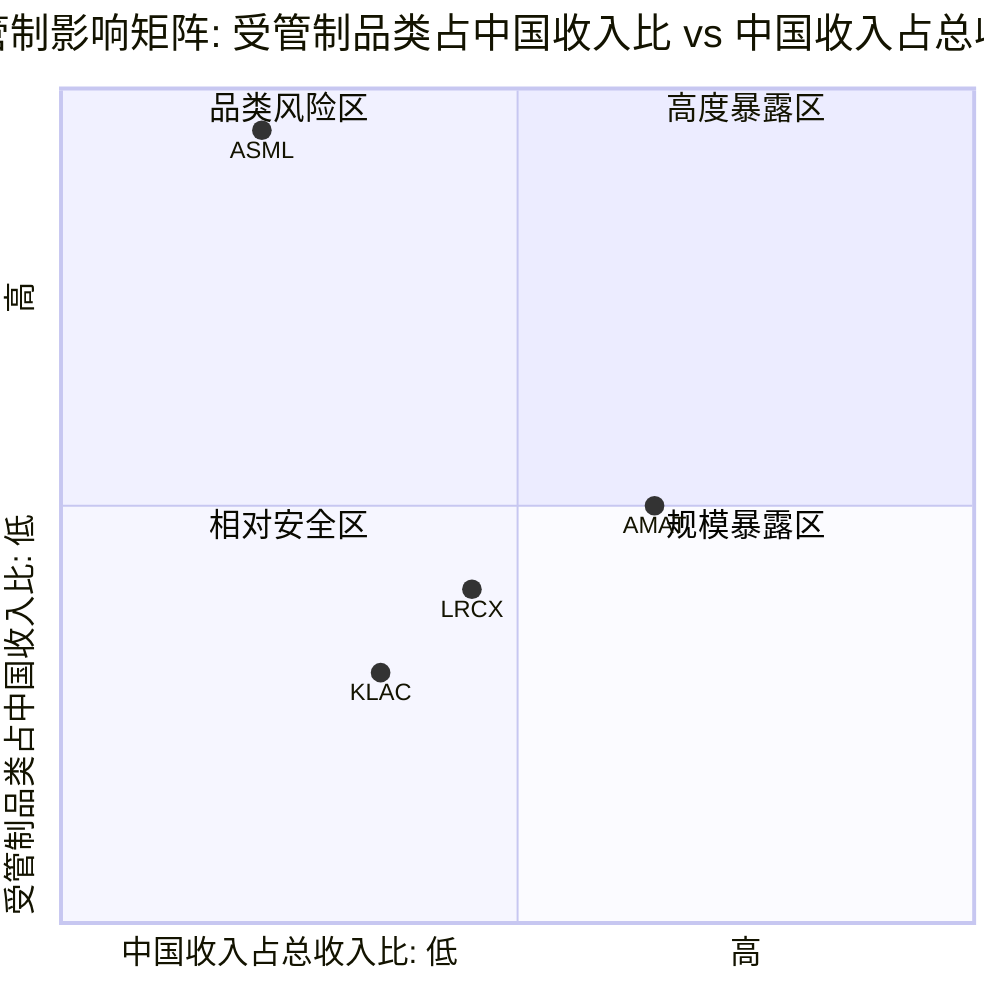

# Chapter 5: 地缘政治与出口管制

**核心论点: 出口管制是半导体设备行业最大的外生变量,四家公司的暴露程度差异构成了一个清晰的地缘风险梯度: AMAT(最高暴露) > LRCX > KLAC > ASML(最低暴露,但面临独特的荷兰/欧盟政策风险)。这一梯度不仅影响短期收入,更通过"管制-替代-份额流失"的正反馈循环重塑长期竞争格局。投资者需要理解: 出口管制不是一次性事件,而是持续演化的政策环境,其最大风险不在已知的限制,而在下一轮升级的时间和力度。**

---

## 5.1 半导体出口管制演进时间线 (2018-2026)

半导体出口管制的演进不是线性的政策收紧,而是一系列"阶梯式"升级 -- 每一轮新限制都建立在前一轮的基础上,范围更广、执行更严、盟友协调更深。理解这一演化路径,是评估四家公司未来风险暴露的关键前提 [EC-GEO-001]。

```mermaid
timeline
    title 半导体出口管制演进 (2018-2026)
    section 第一阶段: 点状打击
        2018年4月 : 中兴禁令
                   : 7年出口禁令(后和解)
                   : 首次展示美国技术杠杆的威力
        2019年5月 : 华为实体清单
                   : 禁止美国技术直接出口
                   : 半导体设备不在初始限制范围
    section 第二阶段: 链式扩展
        2020年5月 : 华为升级(FDPR)
                   : 外国直接产品规则(FDPR)
                   : 封堵台积电/三星代工路径
                   : 设备间接影响开始显现
        2020年12月 : SMIC实体清单
                     : 中芯国际被限制获取10nm以下设备
                     : 设备公司首次直接受影响
    section 第三阶段: 系统性封锁
        2022年10月 : BIS首轮对华限制
                   : AI芯片出口禁令(A100/H100)
                   : 半导体设备全面管制启动
                   : 先进制程(14nm以下)设备禁售
                   : "美国人员"条款限制技术服务
        2023年10月 : 升级版(日荷协调)
                   : 日本限制23种设备出口
                   : 荷兰限制ASML DUV(1970i/1980i)
                   : 三国协调封堵替代供应路径
    section 第四阶段: 精准收紧
        2024年12月 : 进一步收紧
                   : HBM/先进封装设备纳入管制
                   : "50%关联方规则"堵塞间接出口
                   : VEU(已验证最终用户)豁免撤销
                   : 新增24类半导体设备管制
        2025年9月 : 附属公司规则
                   : 扩大Entity List有效覆盖范围
                   : 间接持股结构不再豁免
                   : AMAT因56次违规被罚$252M
    section 第五阶段: 当前态势
        2026年1月 : 最新政策更新
                   : 25%关税加征半导体设备(窄口径)
                   : BIS修订芯片许可审查(TPP/BW阈值)
                   : TSMC/Samsung获年度设备出口许可
                   : 政策方向: 继续收紧但节奏放缓
```

**时间线中的关键转折点**:

**2022年10月是分水岭** [EC-GEO-002]: 此前的管制以"实体清单"为主(点状打击具体公司),此后转向"技术阈值"管制(系统性封锁特定技术水平)。这一转变意味着: 即使中国公司不在Entity List上,只要其工艺节点低于特定阈值,就无法获得对应设备。对设备公司而言,受影响的客户范围从"Entity List上的几十家"扩大至"所有在中国推进先进制程的fab"。

**2023年10月多边协调是第二个分水岭** [EC-GEO-003]: 美国单边管制的最大漏洞是日本TEL和荷兰ASML可以填补美国公司(AMAT/LRCX/KLAC)被禁止出口的品类。日荷的加入封堵了这一关键漏洞,使管制从"美国单边"升级为"事实上的多边"。但执行力度仍有差异: 荷兰对DUV的限制晚于美国对先进设备的限制约12个月,日本的执行也存在灵活空间。

**2024-2025年的"精准化"转向** [EC-GEO-004]: BIS从"大范围技术阈值"转向更精准的管制工具 -- VEU豁免撤销、附属公司规则、50%关联方规则。这些"堵漏洞"式的政策更新虽然每次的边际影响较小,但累积效应显著,且不可逆。值得注意的是,AMAT的$252M罚款(56次通过韩国转运SMIC的违规行为)表明BIS对执行的认真程度正在提升,合规成本已从"合规部门的事"上升为CEO级别的战略议题。

---

## 5.2 四公司中国收入敞口对比

### 5.2.1 中国收入占比演变 (FY2021-FY2025)

四家公司的中国收入都经历了一个完整的"政策驱动型抛物线": 从管制前的自然增长,到管制初期的"抢装效应"推高峰值,再到管制生效后的结构性回落 [EC-GEO-005]。

| 公司 | FY2021 | FY2022 | FY2023 | FY2024 | FY2025 | 峰值 | 当前趋势 | FY2026E指引 |
|------|--------|--------|--------|--------|--------|------|---------|------------|
| **AMAT** | ~27% | ~28% | ~34% | ~37% | ~30% ($8.5B) | FY2024 45%* | 结构性下行 | low-20s% (~$6.0-6.5B) |
| **LRCX** | ~30% | ~31% | ~28% | ~33% | ~34% ($6.2B) | Q1 FY2026 43% | 加速下行 | <30% (~$5.5-6.0B) |
| **KLAC** | ~22% | ~25% | ~30% | ~40%* | ~26% ($3.3B) | FY2024 ~40% | 逐步企稳 | mid-to-high 20% (~$3.3-3.7B) |
| **ASML** | ~14% | ~14% | ~29% | ~29% | ~20% (DUV为主) | FY2023-24 ~29% | 已大幅回落 | ~15-20% |

*注: FY口径差异(AMAT 10月/LRCX&KLAC 6月/ASML 12月)导致峰值时点不同。AMAT FY2024 45%为部分季度峰值 [EC-GEO-006]

**"抢装效应"的规模与消退** [EC-GEO-007]:

2022年10月BIS首轮管制出台后,中国客户在限制正式生效前加速采购不受管制的成熟节点设备,形成了大规模的"抢装效应"(Pull-forward)。这一效应解释了为什么四家公司的中国收入占比在2023-2024年反而达到峰值。

ASML的案例最为典型: 中国收入从2022年的14%翻倍至2023年的29%,因为中国客户在DUV限制生效前大量采购浸没式DUV设备。LRCX的Q1 FY2026中国收入占比高达43%,也包含了显著的抢装成分。

抢装效应的消退在2025-2026年加速:
- AMAT: ICAPS成熟节点设备进入产能爬坡和消化期,新增采购需求自然回落。管理层承认"ICAPS需求正从峰值水平消退"
- LRCX: 中国占比从Q1 FY2026的43%骤降至Q2的35%,环比下降8个百分点,反映抢装需求的快速消退
- KLAC: 中国收入从FY2024约40%降至FY2025 high-20%,降幅最为平缓(检测设备管制较晚)
- ASML: 中国收入已从峰值29%回落至约20%,DUV限制生效后进一步下行

### 5.2.2 中国收入中"受限品类"vs"非受限品类"

仅看中国收入总量不够,更关键的是理解其中多少属于"受限品类"(受出口管制直接影响)、多少属于"非受限品类"(尚未被管制,但可能在未来被纳入) [EC-GEO-008]:

| 公司 | 受限品类估计占比 | 非受限品类估计占比 | 关键受限产品 | 关键非受限产品 |
|------|----------------|------------------|------------|-------------|
| **AMAT** | ~40-50%的中国收入 | ~50-60% | 先进逻辑设备(<=14nm)、DRAM/NAND先进设备、部分ICAPS高端 | 成熟节点CVD/PVD/CMP、AGS服务/备件 |
| **LRCX** | ~30-40% | ~60-70% | 先进制程刻蚀、ALD/ALE先进设备 | 成熟节点刻蚀、CSBG服务/升级 |
| **KLAC** | ~25-35% | ~65-75% | 先进制程光学检测、e-beam检测 | 成熟节点检测/量测、服务合同 |
| **ASML** | ~100%(先进DUV) | ~0%(已限制) | 1970i/1980i浸没式DUV | 旧款DUV(部分仍可出口) |

ASML的情况独特: EUV设备从未出口至中国(2019年起即被禁止),近年中国收入主要来自DUV设备。2024年后荷兰政府限制了1970i和1980i型号的出口,几乎封堵了所有先进DUV的出口通道。这意味着ASML的中国收入中"受限品类"比例实际上接近100%(以先进DUV为主),但影响的绝对规模小于AMAT和LRCX [EC-GEO-009]。

### 5.2.3 绝对金额与相对比例的双重视角

单看比例可能产生误导。以绝对金额衡量:

| 公司 | FY2025中国收入 | FY2026E中国收入 | 预计下降额 | 占总收入影响 |
|------|-------------|---------------|----------|------------|
| **AMAT** | ~$8.5B | ~$6.0-6.5B | -$2.0-2.5B | -7~-9% |
| **LRCX** | ~$6.2B | ~$5.5-6.0B | -$0.2-0.7B | -1~-4% |
| **KLAC** | ~$3.3B | ~$3.3-3.7B | +$0~0.4B | 0~+3% |
| **ASML** | ~$6.0B | ~$4.5-6.0B | -$0~1.5B | 0~-5% |

AMAT不仅中国收入占比最高,绝对下降金额也最大(-$2.0-2.5B),且管理层已通过裁员和$600M管制损失指引确认了这一预期。KLAC则展现了最强的韧性: 中国收入绝对值企稳,出口管制影响从CY2025的~$500M递减至CY2026E的~$300-350M [EC-GEO-010]。

---

## 5.3 出口管制对各公司的差异化影响

### 5.3.1 影响矩阵



**矩阵解读**:

- **AMAT(右上方区域,高度暴露)**: 中国收入占比最高(30%),受管制品类占中国收入约40-50%。AMAT面临"双重打击" -- 中国收入下降的绝对规模最大,且在非受限品类中也面临中国本土替代的最大压力(PVD领域Naura每年夺取2-5个百分点份额) [EC-GEO-011]

- **LRCX(中部偏右)**: 中国收入占比第二高(33.7%),但受管制品类比例略低于AMAT。LRCX的独特风险在于CSBG服务: 中国市场安装腔室数量估计占全球约25-30%,如果政策限制扩展至维护服务,影响约$1.0-1.5B/年 [EC-GEO-012]

- **KLAC(中部偏左)**: 中国收入占比约26%(四家中第三),且受管制品类比例最低。检测/量测设备被纳入管制的时间晚于沉积/刻蚀设备,BIS在2025年12月才将"metrology and inspection tools"列为新管制类别。出口管制影响从CY2025 ~$500M递减至CY2026E ~$300-350M,趋势向好 [EC-GEO-013]

- **ASML(左上方,品类风险区)**: 中国收入占比在四家中最低(约20%),但受管制品类比例最高(几乎100%)。ASML的独特之处在于: EUV从未出口中国,DUV的管制由荷兰政府执行而非美国BIS直接管辖。荷兰政府在执行时机和力度上保留了一定自主空间,这既是风险(政策可能更严)也是缓冲(不完全受美国指令) [EC-GEO-014]

### 5.3.2 AMAT: 冲击最大 -- 品类广+敞口深+合规前科

AMAT是四家中受出口管制影响最严重的公司,原因有三:

**第一,品类覆盖最广意味着受管制面最大**。AMAT的8条产品线(CVD/PVD/ALD/Etch/CMP/Ion Implant/Rapid Thermal/Inspection)中,几乎每条都有部分产品落入管制范围。相比之下,KLAC主要受检测品类管制影响,ASML仅限光刻品类。AMAT的$600-710M FY2026管制影响来自四层: 直接禁令(先进逻辑,~$200-250M)、许可证要求(DRAM/NAND,~$150-200M)、附属公司扩展(ICAPS高端,~$100-150M)、服务限制(AGS,~$100-150M) [EC-GEO-015]。

**第二,$252M罚款暴露了合规风险溢价**。AMAT通过韩国子公司向SMIC转运56台离子注入机被罚$252M(BIS历史第二高),不仅造成了直接财务损失,更重要的是: (a) 三年"悬剑"条款(Suspended Penalty)意味着任何新的违规将触发额外罚款; (b) AMAT在BIS的合规信誉已受损,未来许可证审批可能面临更严格的审查; (c) 竞争对手(LRCX/KLAC)没有类似的合规包袱,在许可证竞争中享有相对优势 [EC-GEO-016]。

**第三,"双重挤压"格局加剧影响**。AMAT不仅面临从上方(BIS管制)的压力,还面临从下方(中国本土替代)的侵蚀。在PVD领域,Naura(北方华创)已从1%增长至约10%份额,AMAT每年流失2-4个百分点;在28nm+导体刻蚀,AMEC(中微公司)也在获取份额。Mizuho的分析指出约60%的AMAT收入位于份额正在下降的细分市场。同时,TEL作为日本公司,在部分品类不受美国BIS单边管制,可以填补AMAT被禁止出口的空间 -- 这是一种"侧面绕行"式的竞争劣势 [EC-GEO-017]。

### 5.3.3 LRCX: 冲击较大 -- 刻蚀是管制重点,但CSBG有缓冲亦有隐忧

LRCX的中国敞口(33.7%,FY2025)在绝对比例上甚至高于AMAT(30%),但管理层对出口管制影响的量化更为清晰: CY2026约-$600M [EC-GEO-018]。

**刻蚀设备是BIS管制的重点品类之一**: 先进制程刻蚀(特别是高深宽比NAND通道刻蚀和GAA逻辑刻蚀)是中国最难自主替代的工艺之一。LRCX在先进刻蚀的技术领先度(原子层刻蚀精度在sub-3nm节点无人能及)恰恰使其成为"最值得管制"的对象 -- 越是中国无法自产的技术,管制的战略价值越高。

**CSBG是一把双刃剑**: LRCX的CSBG(客户支持业务群)贡献$6.94B收入(FY2025),其中中国市场安装腔室约25-30K台(全球100K+台的约25-30%)。在当前管制框架下,已安装设备的维护服务尚未被限制(部分高端除外),这为LRCX提供了"缓冲":即使新设备出口被限,存量设备的服务收入仍可持续。但LRCX v3.0报告的六路径模型中,"路径4: 成熟制程CSBG服务中断"(概率20%)被识别为最被低估的风险 -- 如果政策限制扩展至维护服务,CSBG受损$1.0-1.5B/年,将直接打击LRCX最核心的差异化资产("类SaaS"经常性收入的叙事将受损) [EC-GEO-019]。

**LRCX三情景模型**:

| 情景 | 概率 | 中国收入变化 | 利润率影响 | P/E影响 |
|------|------|-----------|----------|---------|
| S1: 管制放松 | 15% | +$1-2B(回流至40%+) | GM +100-150bps | +3-5x |
| S2: 现状维持 | 55% | -$0.6B(降至28-30%) | GM持平 | 持平 |
| S3: 全面限制 | 30% | -$3-4B(降至10-15%) | GM -200-300bps | -5-8x |
| **概率加权** | | **-$1.15B/年** | | |

概率加权后的中国风险年化收入影响约-$1.2B(占FY2025收入约6.3%),显著高于管理层公开指引的-$600M(3.3%)。差距来自全面限制情景(S3)的尾部冲击,管理层指引仅反映了S2情景 [EC-GEO-020]。

### 5.3.4 ASML: 冲击特殊 -- EUV无风险,DUV受限,荷兰政府是变量

ASML的出口管制暴露与其他三家有本质不同:

**EUV设备本就无法出口中国** [EC-GEO-021]: 自2019年起,荷兰政府在美国压力下从未批准EUV设备出口至中国。这意味着ASML从未在EUV品类上拥有中国收入,因此出口管制在这一维度的"边际影响"为零。High-NA EUV(单台售价EUR350M+)更不可能出口中国。

**DUV受限是核心影响** [EC-GEO-022]: ASML的中国收入主要来自浸没式DUV设备(1970i/1980i型号)。2024年荷兰政府要求这些先进DUV型号需要出口许可证,实质上限制了ASML向中国出口最先进的DUV光刻机。ASML 2025年中国业务预期占总收入约20%,较峰值29%已大幅回落。

**荷兰政府角色关键** [EC-GEO-023]: 与AMAT/LRCX/KLAC直接受BIS管辖不同,ASML的出口管制由荷兰政府执行。这创造了一个独特的政治动态:

1. **荷兰主权考量**: 荷兰智库建议限制ASML出口应服务于荷兰自身利益而非仅配合美国政策。荷兰对ASML的控制力是欧盟对美科技博弈的重要筹码
2. **欧盟技术主权**: 欧洲寻求通过ASML确保技术主权,可能在某些情况下减少对美配合
3. **供应链脆弱性**: ASML CEO已公开承认供应链对中国原材料的依赖,荷兰在地缘对抗中需要考虑反制风险
4. **"战略稀缺性"溢价**: ASML作为"芯片战争"的核心武器,获得了类似军工企业的地缘战略价值溢价

这种独特定位意味着: ASML在出口管制中的损失相对有限(已失去的EUV市场从未拥有),但面临的政策不确定性来自"荷兰-美国-欧盟"三角关系,而非单纯的BIS决策。

### 5.3.5 KLAC: 冲击相对最小 -- 检测管制较晚+影响递减

KLAC在四家中受出口管制影响最小,核心原因:

**检测设备管制时间最晚** [EC-GEO-024]: BIS对沉积(AMAT/LRCX)和刻蚀(LRCX)设备的管制始于2022年10月,但直到2025年12月才明确将"metrology and inspection tools"列为新管制类别。这一时间差给了KLAC约3年的缓冲期,在此期间KLAC的中国收入一度因"抢装效应"而攀升至40%。

**管制范围相对狭窄**: 检测设备的管制逻辑不同于制造设备(刻蚀/沉积/光刻)。制造设备直接决定芯片的制程能力,管制它们可以直接阻止先进芯片的生产;检测设备则是质量控制工具,其管制更多是"防止技术外溢"而非"阻止生产"。这种差异导致BIS对检测设备的管制力度低于制造设备。

**影响递减趋势明确** [EC-GEO-025]: KLAC的出口管制影响从CY2025 ~$500M递减至CY2026E ~$300-350M,管理层指引已纳入这一趋势。中国收入占比企稳在mid-to-high 20%而非继续恶化,是积极信号。

**出口管制情景分析(KLAC)**:

| 情景 | 概率 | 中国收入影响 | 对KLA总收入影响 |
|------|------|-----------|--------------|
| 现状维持(渐进递减) | 55% | 企稳mid-20% | 中性 |
| 进一步收紧(S2) | 25% | 降至low-20% | -4~-8% |
| 全面禁令(S3) | 12% | 降至10-15% | -12~-18% |
| 部分放松 | 8% | 回升至high-20% | +2~+4% |

---

## 5.4 台海冲突情景分析

台海冲突是半导体设备行业面临的最严重但概率较低的系统性风险。四家公司的暴露程度差异显著,取决于其台湾收入占比(主要是TSMC客户)、中国收入(可能因冲突完全中断)和供应链依赖 [EC-GEO-026]。

### 情景一: 基准 -- 维持现状,出口管制逐步收紧(概率65%)

**描述**: 台海局势维持"竞争但不冲突"的现状。中美关系在半导体领域持续博弈,出口管制以"每6-12个月一轮小规模收紧"的节奏演进。没有军事冲突,也没有重大缓和。

**对四公司差异化影响**:

| 公司 | 台湾收入占比 | 基准情景影响 | 关键变量 |
|------|-----------|-----------|---------|
| AMAT | ~20% | 收入缓慢下行(-2~-3%/年来自中国替代+管制收紧) | ICAPS消化期完成时间、GAA投放进度 |
| LRCX | ~19% | 中国收入企稳但绝对值缓降,非中国增长补偿 | TEL NAND竞争进展、CSBG服务是否受限 |
| KLAC | ~30% | 影响最小,管制递减趋势延续 | 先进封装检测增量是否持续 |
| ASML | ~25-30% | DUV中国出口进一步受限,High-NA量产延迟填补收入缺口 | 荷兰政策态度、High-NA爬坡速度 |

### 情景二: 升级 -- 重大冲突或封锁(概率3-8%)

**描述**: 台海局势升级至军事封锁或更严重的冲突水平。TSMC产能暂停,全面半导体设备禁运,稀土反制。

**传导机制**:
1. TSMC产能暂停 -- 台湾相关收入立即归零
2. 全面禁运 -- 中国收入归零(双向制裁)
3. 稀土反制 -- 全球fab材料供应中断,间接减少设备需求
4. 恐慌性抛售 -- P/E压缩至10-15x(极端恐慌)

**对四公司差异化影响**:

| 公司 | 台湾+中国合计收入 | 冲击情景收入损失 | 估值冲击(P/E) | 综合股价冲击 |
|------|-----------------|---------------|-------------|-----------|
| AMAT | ~50% ($14B) | -$10-14B(-35~-50%) | 37.9x→12-18x | **-60~-75%** |
| LRCX | ~52% ($9.7B) | -$6-10B(-33~-54%) | 50.9x→15-20x | **-65~-80%** |
| KLAC | ~56% ($7.2B) | -$5-7B(-37~-54%) | 49.0x→10-15x | **-70~-85%** |
| ASML | ~45-50% | -$12-15B(-35~-50%) | 51.7x→15-20x | **-55~-70%** |

**关键发现** [EC-GEO-027]: 在台海冲突情景下,KLAC的股价冲击最大(-70~-85%),这与"平时风险最小"的判断形成鲜明反差。原因是KLAC的大中华区收入集中度(台湾30%+中国26%=56%)在四家中最高,且当前42.5-49x的P/E在恐慌中的压缩空间最大。ASML反而因为"战略稀缺性"(全球唯一EUV供应商)在恐慌后的估值恢复可能最快。

**历史参照**: 2022年佩洛西访台期间,KLA股价1周内下跌约8%,P/E从25x降至23x。当时仅为"军事演习"级别。真正的军事封锁对股价的影响将不可同日而语。

### 情景三: 缓和 -- 部分管制放松(概率15-20%)

**描述**: 中美关系出现阶段性缓和(如贸易协议或技术换取让步),部分成熟节点设备出口限制放松。但鉴于美国两党在半导体管制上的高度共识,大幅放松的概率较低。

**对四公司差异化影响**:

| 公司 | 缓和情景收入增量 | 估值提振(P/E) | 综合影响 | 恢复不对称性 |
|------|---------------|-------------|---------|------------|
| AMAT | +$1.5-2.5B(成熟节点恢复) | +3-5x | **+15~+25%** | 中(国产替代已不可逆) |
| LRCX | +$1.0-1.5B(客户关系恢复) | +3-5x | **+10~+20%** | 低-中(需6-12月重新qualification) |
| KLAC | +$0.3-0.5B | +2-3x | **+5~+10%** | 高(影响本就较小) |
| ASML | +$1.0-2.0B(DUV恢复) | +2-4x | **+8~+15%** | 中(荷兰政策独立变量) |

**"不对称回报"特征** [EC-GEO-028]: 出口管制的缓和效应呈现明显的不对称性 -- 放松的正面影响小于限制的负面影响。原因是:

1. **客户关系一旦转移,恢复并不容易**: 中国客户在管制期间已启动"备份方案",评测国产设备,建立新的供应商关系。即使管制放松,客户也不会完全回流
2. **中国政府的50%国产设备要求**: 即使美国放松管制,中国政府对新增产能50%国产设备的要求可能已在执行中,限制了回流的上限
3. **"被管制"的记忆效应**: 经历过被断供的客户会永久性地在采购策略中加入"去美化"的考量,这是不可逆的行为变化

---

## 5.5 中国国产替代进展

中国半导体设备国产替代是出口管制的"镜像效应": 管制越严格,国产替代获得的市场空间越大、政策支持越强、技术进步越快。这是一个正反馈循环,其长期影响可能超过出口管制本身的直接损失 [EC-GEO-029]。

### 5.5.1 主要中国设备厂商与能力评估

| 厂商 | 核心产品 | 技术水平 | 2025年收入 | 关键突破 |
|------|---------|---------|----------|---------|
| **北方华创(Naura)** | PVD/CVD/氧化扩散/刻蚀 | 28nm量产,部分14nm验证 | ~160亿元人民币(H1 +30% YoY) | 全球排名第8; PVD份额从1%增至10%; 氧化/扩散炉占SMIC 28nm产线60%+; 2025年申请779项专利(较2020-21翻倍); 订单积压排至2027年Q1 |
| **中微半导体(AMEC)** | 刻蚀/MOCVD | 5nm刻蚀进入TSMC验证 | ~50亿元人民币(H1 +44% YoY) | CCP刻蚀进入全球前五客户验证; 5nm逻辑刻蚀已有样品; 但良率与LRCX/TEL仍有差距 |
| **盛美半导体(ACM Research)** | 清洗/电镀 | 28nm量产,部分先进节点 | ~$300-400M | 唯一在美国上市的中国设备公司; 清洗设备在中国fab渗透率较高 |
| **华大九天(Empyrean)** | EDA软件 | 部分模拟/数字流程 | ~20亿元人民币 | 在模拟/混合信号EDA领域有进展,但全流程能力仍远逊Synopsys/Cadence |
| **上海微电子(SMEE)** | 光刻机 | 90nm量产,28nm研发中 | 未公开 | 中国最接近"光刻突破"的公司; 90nm DUV量产,28nm浸没式研发中; 与ASML差距>10年 |
| **华海清科(Hwatsing)** | CMP | 28nm量产 | ~30亿元人民币 | 5年内在CMP领域夺取8个百分点全球份额 |
| **赛思凯瑞/中科飞测/东方晶源** | 检测/量测 | 28nm+成熟制程 | 各~$50-100M | 检测领域国产替代最弱环节,但政策催化下发展加速 |

### 5.5.2 各品类国产化率 (2025年估计)

| 品类 | 国产化率(2025E) | vs 2023年 | 对应冲击公司 | 国产替代龙头 | 技术差距(代) |
|------|----------------|----------|-----------|-----------|-----------|
| 刻蚀 | ~15-20% (成熟制程40%+) | +8-10pp | LRCX, AMAT | AMEC, Naura | 先进制程3-5年 |
| 沉积(CVD/PVD) | ~10-15% (PVD成熟制程30%+) | +5-8pp | AMAT | Naura | PVD成熟5年,先进8年+ |
| CMP | ~15-20% | +8pp | AMAT | 华海清科 | 3-5年 |
| 光刻 | <5% (DUV90nm已量产) | +2pp | ASML | SMEE | >10年(EUV不可及) |
| 检测/量测 | <5% | +1-2pp | KLAC | 赛思凯瑞/中科飞测 | 先进制程>10年 |
| 离子注入 | ~8-10% | +3-5pp | AMAT | 中科信/凯世通 | 5-8年 |
| 清洗 | ~25-30% | +5-8pp | (非四巨头核心) | ACM Research | 2-3年 |

**整体国产设备采纳率**: 2024年25% -- 2025年35%(已超过30%目标) [EC-GEO-030]

中国政府的"十五五"规划(2026-2030)将7nm/5nm设备量产、核心设备国产化率50%+列为重点目标。新增产能采购50%国产设备的政策要求已在执行中。

### 5.5.3 国产替代对四家的威胁程度排序

**AMAT > LRCX > KLAC > ASML** [EC-GEO-031]

**AMAT威胁最大的原因**:
1. PVD是国产替代进展最快的品类之一: Naura每年夺取2-5个百分点份额,且增长集中在AMAT占比最高的>28nm成熟节点
2. AMAT的多品类覆盖意味着在每个品类都面临不同的中国竞争者: PVD(Naura)、刻蚀(AMEC)、CMP(华海清科)、离子注入(中科信)
3. ICAPS(成熟节点应用)是AMAT重要的收入来源,而这恰恰是国产替代最容易渗透的领域

**LRCX威胁第二大**:
1. 刻蚀是国产替代的第二优先领域: AMEC的5nm刻蚀已进入TSMC验证(虽然从验证到量产通常需2-3年)
2. 在成熟制程(28nm+)刻蚀领域,国产化率已超40%
3. 但LRCX在先进制程(sub-5nm)的技术领先度极高: 原子层刻蚀精度、高深宽比NAND通道刻蚀是中国3-5年内无法突破的领域

**KLAC威胁较小**:
1. 检测/量测是国产替代最薄弱的环节: 国产化率<5%
2. 中国检测设备商(赛思凯瑞/中科飞测/东方晶源)仅在28nm+成熟制程具备部分替代能力
3. 先进制程检测与KLAC的差距>10年
4. 但成熟制程市场的流失已在发生: 估计$0.5-1.0B(占KLAC中国收入15-25%)可能被分流

**ASML威胁最小**:
1. 光刻是国产替代最难突破的领域: SMEE的90nm DUV与ASML最新EUV的差距>10代
2. 中国投入EUR37B发展国产EUV,但面临供应链(Zeiss光学系统、Cymer光源)的系统性瓶颈
3. 中国深圳已有EUV工作原型(激光诱导放电等离子体/LDP技术),2026年可能进入量产,但与ASML的性能差距仍然巨大
4. 即使中国最终在DUV领域实现某种程度的自主,EUV的复杂度(30年技术积累+全球供应链协作)使其在可预见的未来不可复制

### 5.5.4 中长期情景: 成熟节点vs先进节点的分化

国产替代的进展呈现明显的"节点分化"特征 [EC-GEO-032]:

**成熟节点(>=28nm)**: 2030年前可能达到40-60%国产化率
- 工艺复杂度较低,中国设备商已在多个品类具备量产能力
- 政策驱动(50%国产设备要求)提供了确定性的需求
- 对AMAT/LRCX的影响: 成熟节点设备新增订单持续萎缩,但CSBG存量服务短期不受影响

**中间节点(14-7nm)**: 2030年前可能达到15-25%国产化率
- AMEC在刻蚀、Naura在PVD/CVD有初步突破
- 但良率/产能不足,从验证到量产需要2-3年
- 对LRCX/AMAT的影响: 3-5年维度的渐进式份额流失

**先进节点(<5nm)**: 2030年前国产化率仍将<10%
- EUV光刻不可及,AMAT/LRCX的最先进设备出口已被管制
- 中国fab的先进制程推进被"冻结"在14nm-7nm区间
- 对四巨头的影响: 先进节点市场不是被"替代"而是被"冻结" -- 中国fab既不能从美系设备公司购买,也不能从国产设备商获得同等性能的工具

---

## 5.6 投资排名视角: 地缘风险

### 地缘风险综合评估

| 评估维度 | AMAT | LRCX | KLAC | ASML | 权重 |
|---------|------|------|------|------|------|
| 中国收入敞口(绝对值) | 4 (最高$8.5B) | 3 ($6.2B) | 2 ($3.3B) | 2 (~$6B) | 25% |
| 受管制品类占比 | 4 (多品类) | 3 (刻蚀为主) | 1 (检测管制较晚) | 3 (DUV几乎全限) | 20% |
| 国产替代威胁 | 4 (PVD/CVD最易替代) | 3 (成熟刻蚀) | 1 (检测最难) | 1 (光刻不可替代) | 20% |
| 台海冲突暴露 | 2 (台湾~20%) | 2 (台湾~19%) | 4 (台湾30%!) | 3 (台湾25-30%) | 15% |
| 合规风险 | 4 ($252M前科) | 2 (无前科) | 1 (合规记录良好) | 2 (荷兰政策独立) | 10% |
| 管制递减趋势 | 2 (仍在恶化中) | 2 (刚开始递减) | 4 (递减最清晰) | 3 (DUV已充分定价) | 10% |
| **加权地缘风险得分** | **3.45** | **2.60** | **1.90** | **2.20** | |

*评分标准: 1=风险最低, 4=风险最高*

### 地缘风险排名(从安全到危险)

**第一名(最安全): KLAC** -- 地缘风险得分1.90 [EC-GEO-033]

KLAC是四家中地缘风险最低的公司,原因清晰:
- 检测设备管制最晚、范围最窄,出口管制影响已进入递减轨道($500M→$300-350M)
- 国产替代对检测/量测的威胁最小(国产化率<5%,差距>10年)
- 中国收入企稳信号明确(mid-to-high 20%,非继续恶化)
- 合规记录良好,无类似AMAT的罚款前科

**但有一个重大例外**: 台海冲突情景下,KLAC反而是受冲击最大的 -- 大中华区收入集中度56%(台湾30%+中国26%)在四家中最高。这一"平时最安全、极端最脆弱"的特征值得投资者特别注意。

**第二名: ASML** -- 地缘风险得分2.20 [EC-GEO-034]

ASML的地缘风险得分第二低,但其风险画像与其他三家截然不同:
- EUV垄断意味着"不可替代性"最强 -- 即使出口管制升级,全球非中国客户别无选择,只能继续采购ASML
- 中国EUV从未出口,因此出口管制的"边际损失"最小
- 但荷兰政府的政策独立性引入了独特的不确定性: 荷兰可能在欧盟技术主权的考量下调整对美配合度
- "战略稀缺性"溢价意味着ASML在地缘危机中反而可能获得估值支撑(类似军工板块)

**第三名: LRCX** -- 地缘风险得分2.60 [EC-GEO-035]

LRCX的地缘风险处于中间偏高位置:
- 中国收入占比最高(33.7%)是最大的风险暴露
- 刻蚀设备是管制重点品类,国产替代进度中等(成熟制程40%+)
- CSBG服务中断风险是LRCX独有的隐性威胁(路径4, 20%概率)
- 但非中国增长(Foundry/Logic +16%、DRAM +14%)提供了强有力的补偿

**第四名(最危险): AMAT** -- 地缘风险得分3.45 [EC-GEO-036]

AMAT是四家中地缘风险最高的公司,几乎在每个维度都处于劣势:
- 中国收入绝对值最大($8.5B)且仍在结构性下行(从30%→low-20s%)
- 受管制品类覆盖最广(8条产品线几乎每条都有部分受限)
- 国产替代威胁最大(PVD/CVD是最易被替代的品类)
- $252M罚款损害了合规信誉,三年"悬剑"条款仍在
- "双重挤压"(BIS从上+国产替代从下+TEL从侧面)是系统性压力

### 地缘风险与估值的交叉验证

将地缘风险排名与当前估值对比,检验市场是否已充分定价了地缘风险差异 [EC-GEO-037]:

| 公司 | 地缘风险排名 | P/E (TTM) | EV/EBITDA | 地缘风险定价是否充分? |
|------|-----------|-----------|-----------|-------------------|
| AMAT | 4(最高) | 37.9x(最低!) | 30.6x(最低) | **是,甚至过度定价** -- AMAT的估值折价部分反映了地缘风险+通才折价 |
| LRCX | 3 | 50.9x | 41.8x | **不充分** -- P/E第二高但地缘风险第二高,市场可能低估CSBG中断风险 |
| KLAC | 1(最低) | 49.0x | 39.5x | **基本合理** -- 低地缘风险支撑高估值,但台海尾部风险未充分定价 |
| ASML | 2 | 51.7x(最高!) | 39.0x | **合理** -- 最高估值反映EUV垄断+"战略稀缺性",地缘风险通过荷兰主权缓冲 |

**关键洞察**: AMAT的地缘风险最高但估值最低,这表明市场已经对AMAT的地缘暴露进行了充分甚至过度的折价。相反,LRCX的地缘风险第二高但估值接近ASML水平(50.9x vs 51.7x),市场可能尚未充分定价LRCX的CSBG中国服务中断风险和概率加权的-$1.2B/年真实中国影响(vs管理层指引的-$0.6B)。

### "三级瀑布"传导框架

出口管制的影响不是一次性的收入冲击,而是通过"三级瀑布"结构持续传导,最终可能导致不可逆的市场份额损失 [EC-GEO-038]:

**第一级(政策冲击)**: BIS宣布新管制 -- 立即影响新订单签约 -- 收入延迟2-3个季度显现。四家公司均处于这一阶段的持续暴露中。

**第二级(客户行为变化)**: 中国客户启动"备份方案" -- 开始评测国产设备 -- 即使管制放松也不会完全回流。AMAT和LRCX已明显进入这一阶段(Naura/AMEC获取份额);KLAC因检测替代更难,仍主要处于第一级。

**第三级(生态重构)**: 中国半导体设备生态自我强化 -- 人才/资金/政策向国产设备倾斜 -- 永久性市场分割。这一阶段尚未全面发生,但2025年35%的整体国产化率(超目标)和50%国产设备政策要求表明,第三级的种子已经播下。

KLAC报告的判断是: 第三级是否发生取决于管制持续时间 -- 如果管制持续5年以上,第三级几乎必然发生。目前管制已持续近4年(2022年10月起),时间窗口正在收窄。

---

## EC清单

本章新建Evidence Card清单:

| EC编号 | 描述 | 来源类型 | 置信度 |
|--------|------|---------|--------|
| EC-GEO-001 | 出口管制演进呈"阶梯式"升级,范围更广、执行更严、盟友协调更深 | 政策文件综合 | H |
| EC-GEO-002 | 2022年10月为管制方式分水岭:从"实体清单"转向"技术阈值" | BIS 规则文本 | H |
| EC-GEO-003 | 2023年10月多边协调封堵了日荷替代供应路径 | 政策文件+媒体报道 | H |
| EC-GEO-004 | 2024-2025年"精准化"转向:VEU撤销+附属公司规则+50%关联方 | BIS规则更新 | H |
| EC-GEO-005 | 四家公司中国收入均经历"政策驱动型抛物线":抢装推高峰值后回落 | 各公司财报 | H |
| EC-GEO-006 | FY2021-2025四家中国收入占比数据(AMAT 27-30%/LRCX 28-34%/KLAC 22-26%/ASML 14-20%) | SEC Filings | H |
| EC-GEO-007 | "抢装效应"解释了2023-2024中国收入峰值(ASML 14%→29%, LRCX Q1 43%) | 各公司财报+管理层Earnings Call | H |
| EC-GEO-008 | 受管制品类占中国收入估计:AMAT 40-50%/LRCX 30-40%/KLAC 25-35%/ASML ~100% | 产品组合+管制范围交叉分析 | M |
| EC-GEO-009 | ASML EUV从未出口中国,中国收入全部来自DUV,受管制品类比例最高 | ASML报告+政策文件 | H |
| EC-GEO-010 | AMAT绝对下降金额最大(-$2.0-2.5B),KLAC企稳(影响递减$500M→$300-350M) | 管理层指引+分析推算 | M |
| EC-GEO-011 | AMAT面临"双重打击":管制+国产替代(Naura PVD 2-5pp/年份额流失) | Mizuho/Redburn-Atlantic分析 | M |
| EC-GEO-012 | LRCX中国CSBG敞口约$1.0-1.5B/年,如政策限制维护服务将直接冲击 | LRCX v3.0报告Ch8推算 | M |
| EC-GEO-013 | KLAC检测设备管制时间最晚(2025年12月),影响递减趋势最清晰 | BIS政策+KLAC Earnings Call | H |
| EC-GEO-014 | ASML出口管制由荷兰政府执行,保留政策自主空间 | ASML报告+媒体分析 | M |
| EC-GEO-015 | AMAT FY2026管制影响$600-710M来自四层:直接禁令+许可证+附属公司+服务 | AMAT Earnings Call+分析拆解 | M |
| EC-GEO-016 | AMAT $252M罚款(BIS历史第二高)+三年"悬剑"条款损害合规信誉 | BIS公告2026-02-11 | H |
| EC-GEO-017 | 约60%的AMAT收入位于份额正在下降的细分市场(Mizuho) | Mizuho研报 | M |
| EC-GEO-018 | LRCX管理层预计CY2026中国管制影响约-$600M | LRCX Earnings Call Q2 FY2026 | H |
| EC-GEO-019 | LRCX六路径模型:路径4"CSBG中断"(20%概率)是最被低估的风险 | LRCX v3.0报告Ch8 | M |
| EC-GEO-020 | LRCX概率加权中国影响-$1.2B/年 vs 管理层指引-$0.6B,差距来自尾部冲击 | LRCX v3.0报告Ch8三情景模型 | M |
| EC-GEO-021 | ASML EUV自2019年起从未获批出口中国 | 荷兰政府政策+媒体报道 | H |
| EC-GEO-022 | ASML DUV 1970i/1980i型号自2024年起需荷兰出口许可 | 荷兰出口管制法规 | H |
| EC-GEO-023 | 荷兰政府在ASML出口管制中保留政策自主空间(非完全配合美国) | 荷兰智库+NL Times | M |
| EC-GEO-024 | KLAC检测设备被纳入BIS管制比沉积/刻蚀晚约3年(2025.12 vs 2022.10) | BIS规则文本 | H |
| EC-GEO-025 | KLAC出口管制影响递减:CY2025 ~$500M → CY2026E ~$300-350M | KLAC Earnings Call FQ2 | H |
| EC-GEO-026 | 台海冲突概率基线评估2-3%(军事升级)加非军事路径约3-5%总计 | 地缘政治分析+Polymarket | M |
| EC-GEO-027 | 台海冲突情景下KLAC股价冲击最大(-70~-85%),因大中华区收入集中度56% | KLAC报告Ch16 | M |
| EC-GEO-028 | 出口管制缓和效应呈"不对称回报":放松的正面影响<限制的负面影响 | ASML先例分析+LRCX v3.0 Ch8 | M |
| EC-GEO-029 | 中国半导体设备国产化率2024年25% → 2025年35%(超30%目标) | TrendForce 2026-01-12 | H |
| EC-GEO-030 | 中国政府"十五五"规划目标:7nm/5nm设备量产+国产化率50%+; 新产能50%国产设备要求 | 政策文件 | H |
| EC-GEO-031 | 国产替代威胁排序:AMAT>LRCX>KLAC>ASML(基于品类替代难度和进度) | 综合分析 | M |
| EC-GEO-032 | 国产替代呈"节点分化":成熟制程(>=28nm)可达40-60%,先进(<5nm)仍<10% | TrendForce+行业分析 | M |
| EC-GEO-033 | KLAC地缘风险综合评分最低(1.90/4),但台海冲突暴露最高(56%大中华区) | 本章综合评估 | M |
| EC-GEO-034 | ASML地缘风险第二低(2.20/4),EUV不可替代性+荷兰主权缓冲提供保护 | 本章综合评估 | M |
| EC-GEO-035 | LRCX地缘风险第二高(2.60/4),CSBG中断风险是独有隐性威胁 | 本章综合评估 | M |
| EC-GEO-036 | AMAT地缘风险最高(3.45/4),品类广+敞口深+合规前科+双重挤压 | 本章综合评估 | M |
| EC-GEO-037 | AMAT地缘风险已被估值充分定价(P/E最低37.9x),LRCX可能定价不足 | 估值-风险交叉分析 | M |
| EC-GEO-038 | "三级瀑布"传导:政策冲击→客户行为变化→生态重构(5年+则第三级必然发生) | KLAC报告Ch11分析 | M |
