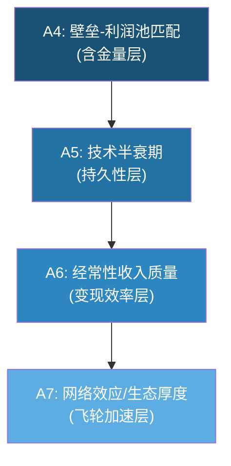
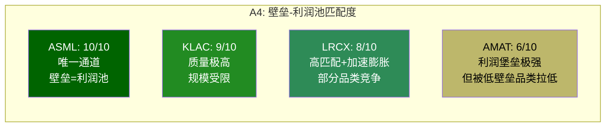
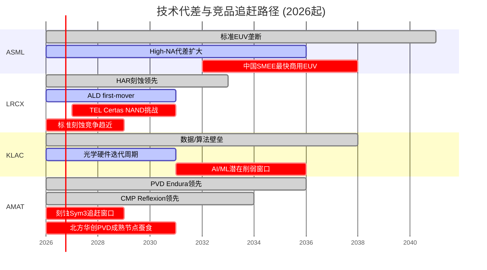

# Chapter 7: 护城河 A4-A7 -- 利润池匹配、技术持久性、经常性收入与生态厚度

> **评分框架**: A-Score v1.0 (0-10统一尺度, 置信度 H/M/L)
> **数据快照**: 2026-02-24 | FY2025各公司最新年报
> **EC编号范围**: EC-MOAT-020 ~ EC-MOAT-069

---

## 导读: A4-A7 的战略意义

A1-A3 回答了"护城河的基础设施是否牢固"(供应链/切换成本/规模经济)，而 A4-A7 转入更本质的问题: **护城河保护的是什么? 能维持多久? 能否持续收租? 有没有飞轮?**

四个维度的权重合计 40%，是 A-Score 中权重最大的集群。它们之间存在强因果关系:

- **A4 壁垒-利润池匹配** 决定了护城河的"含金量"-- 即使壁垒极高，如果保护的只是低利润池，也不构成投资价值;
- **A5 技术半衰期** 决定了护城河的"保质期"-- 领先是暂时的还是持久的;
- **A6 经常性收入** 决定了护城河的"变现效率"-- 一次卖设备之后还能赚多少;
- **A7 网络效应/生态厚度** 决定了护城河是否会"自我加强"-- 是线性防御还是指数飞轮。

这四个维度形成一个"护城河质量金字塔":

以下按维度逐一展开，每家公司给出评分、理据和置信度。

---

## 7.1 A4: 壁垒-利润池匹配度 (权重 12%)

### 核心问题

> 这家公司的壁垒是否恰好保护了半导体价值链中**最肥的利润池**? 壁垒和利润池是否"对齐"?

半导体设备价值链中，并非所有环节的利润池厚度相同。光刻占 WFE 的约 25-30%，刻蚀约 20-25%，沉积约 15-20%，检测/量测约 7-8%。但利润池厚度不仅取决于市场规模，更取决于"必须性"(must-have vs nice-to-have)和"不可替代性"(垄断 vs 寡头 vs 充分竞争)。

**评分锚点回顾** (framework_definition.md):
- 9-10分: 垄断最高价值环节(如 ASML EUV)，100% 渗透率，无替代
- 7-8分: 在多个高价值环节领先，客户将其视为关键供应商
- 5-6分: 在 1-2 个高价值环节有稳固份额，但不是"必须有"
- 3-4分: 在某些高价值环节有存在，但份额不稳定或面临蚕食
- 1-2分: 主要在边缘/低价值环节竞争

---

### 7.1.1 ASML: EUV -- "必须通过的独木桥" | 评分: 10/10 [H]

**壁垒保护的利润池定位**: ASML 的 EUV 光刻垄断地位，恰好卡在 leading-edge 半导体制造的绝对瓶颈上。没有 EUV，就没有 5nm 以下的芯片; 没有 5nm 以下的芯片，就没有 AI/HPC 革命的硬件基础。这不是"高价值环节领先"，而是"唯一通道" [EC-MOAT-020]。

**量化匹配度分析**:

| 指标 | 数据 | 含义 |
|------|------|------|
| EUV 收入占 ASML 总收入 | ~70%+ (FY2025) | 壁垒与核心收入高度一致 |
| EUV 单台 ASP | EUR 200-350M+ (标准至High-NA) | 客户在 EUV 上的投入是 fab CapEx 最大单项 |
| 每座先进 fab 需 EUV 台数 | 10-20台 (按节点和产能) | 单客户单 fab 锁定 EUR 2-7B 投入 |
| ASML EUV 全球份额 | ~94% (Canon/Nikon 仅占 ~6%，且在 DUV 领域) | 实质垄断 |
| EUV 毛利率 | 85-90% (估) | 利润池极厚 |
| 替代方案可行性 | 当前不存在 | 客户零议价能力(在 EUV vs 非 EUV 选择上) |

**壁垒-利润池匹配的深层逻辑**: ASML 的独特之处在于，它的壁垒不仅保护了自身的利润池，还**定义了整个半导体先进制造的利润池分配**。台积电、三星、Intel 在先进节点上的定价权，很大程度上建立在"只有我有 EUV 产能"的前提上。ASML 是这个前提的唯一供应商。当客户在 EUV 上花费 EUR 2-7B/fab 时，他们购买的不仅是光刻设备，而是"进入先进节点俱乐部的入场券" [EC-MOAT-021]。

**High-NA 的加固效应**: High-NA EUV (EXE:5000) 单台售价预计 EUR 350-400M+，是标准 EUV 的 1.5-2.0 倍。这进一步加大了 ASML 壁垒保护的利润池规模。High-NA 不是 EUV 的替代，而是 EUV 的升级 -- 客户在 High-NA 上的投入将叠加在已有 EUV 投入之上 [EC-MOAT-022]。

**评分理据**: 满分 10/10。ASML 是本框架四家公司中唯一达到"壁垒与利润池完美对齐"标准的公司。其壁垒保护的不是"高价值环节"，而是"唯一通道"。

---

### 7.1.2 LRCX: 刻蚀 -- "先进节点的心脏手术刀" | 评分: 8/10 [H]

**壁垒保护的利润池定位**: LRCX 在刻蚀市场整体份额约 45% (TEL ~27%, AMAT ~15%)，是刻蚀领域的绝对领导者。但关键不在整体份额，而在**壁垒最深的子领域是否恰好也是利润池最肥的子领域** [EC-MOAT-023]。

**利润池匹配度矩阵**:

| 子领域 | LRCX 份额 | 壁垒深度 | 利润池厚度 | 匹配度 |
|--------|-----------|---------|-----------|--------|
| NAND 通道刻蚀 (HAR) | 100% | 极高 (代差 5-7年) | 极高 ($2B+, 随层数非线性增长) | 完美匹配 |
| 导体刻蚀 (先进逻辑) | ~50% | 高 | 高 ($5B+) | 高匹配 |
| ALD 原子层沉积 | 领先 (FY2025 $1.5B+) | 高 (first-mover) | 高 (GAA 驱动) | 高匹配 |
| 介电刻蚀 (标准) | ~40% | 中 | 中 ($3-4B) | 中等匹配 |
| 传统 CVD | 参与 | 中-低 | 中 | 低匹配 |
| 清洗 (Clean) | 参与 | 低 | 低 ($1-2B) | 低匹配 |

**核心发现**: LRCX 壁垒最深的两个子领域 -- NAND 通道刻蚀(100% 份额)和 ALD(first-mover) -- 恰好是利润池增速最快的领域。3D NAND 从 200 层向 300+ 层推进时，刻蚀步骤数量增加 2-3 倍(非线性内容增长)。GAA 架构转换使 ALD 步骤从几乎为零增至每片晶圆数十步。这意味着 LRCX 壁垒保护的利润池正在**加速膨胀** [EC-MOAT-024]。

**但匹配度不是 100% 的原因**: 在标准刻蚀和传统沉积品类，LRCX 面临 TEL 和 AMAT 的正面竞争，壁垒不足以独占利润池。特别是 TEL Certas 平台以 2.5x 的速度优势挑战 LRCX 在 NAND 通道刻蚀的 100% 份额(5 年内份额可能降至 80-85%)。即便如此，在 TAM 从 $500M 扩至 $2B 的过程中，即使份额降至 80%，收入仍从 $500M 增至 $1.6B(+220%) [EC-MOAT-025]。

**评分理据**: 8/10。壁垒最深的子领域与利润池最肥的子领域高度一致，且利润池正在加速膨胀。但在部分标准品类中壁垒不足以完全保护利润池，未能达到 9-10 分的"垄断最高价值环节"标准。

---

### 7.1.3 KLAC: 检测/量测 -- "良率=利润的看门人" | 评分: 9/10 [H]

**壁垒保护的利润池定位**: KLAC 在过程控制(检测/量测)领域整体份额 63%，光掩模检测 >80% 绝对垄断，先进封装检测份额从 2021 年 ~10% 跃升至 2025 年 ~50%。检测占 fab CapEx 仅 7-8%，但这 7-8% 的投入**决定了 100% 的良率** [EC-MOAT-026]。

**利润池匹配度的独特逻辑**: KLAC 的利润池匹配度需要用不同于其他三家的框架来理解。其他三家(ASML/LRCX/AMAT)的壁垒保护的是"制造过程中的某个步骤"。KLAC 保护的是**"制造过程的反馈回路"** -- 没有检测，客户不知道自己做出了什么。

| 指标 | 数据 | 含义 |
|------|------|------|
| 过程控制市场份额 | 63% (2010年 50% → 持续扩张) | 越来越强的"独木桥" |
| 光掩模检测份额 | >80% (接近绝对垄断) | EUV 每层之后都需要 |
| 检测占 fab CapEx | 7-8% | 利润池绝对规模受限 |
| 检测对良率的影响 | 100% (全部良率) | 每 1% 精度提升 = 客户 $50-100M/年/fab 价值 |
| EUV 叠对量测份额 | ~40% (vs ASML YieldStar ~35%) | EUV 渗透 = KLAC 需求自动增长 |
| 毛利率 | 61.9% (四家最高) | 软件/算法溢价驱动 |

**壁垒-利润池匹配的核心矛盾**: KLAC 的壁垒极深(技术壁垒 8.5/10、数据网络效应 9.0/10)，壁垒保护的利润池质量极高(must-have 定位、61.9% 毛利率)，但利润池的**绝对规模受限**(WFE 占比 <10%)。这是 KLAC 无法获得 10/10 满分的唯一原因 -- 不是壁垒不够深，而是利润池不够大 [EC-MOAT-027]。

**利润池正在扩大的趋势**: 三个结构性驱动力正在扩大检测利润池:
1. **EUV 多重图案化**: 从 3nm 到 1.4nm，EUV 相关检测步骤可能增加 2-3 倍
2. **先进封装**: KLAC 先进封装检测 TAM 约 $8-10B (FY2025 收入 $925M)
3. **High-NA EUV**: 更严格的 overlay 容忍度(从 +/-2nm 收紧至 +/-1nm)直接提升量测使用频率

KLAC 的收入增速持续跑赢 WFE(5 年 CAGR 10.8% vs WFE ~6-8%)，差额约 3-5pp 来自制程复杂度驱动的检测强度提升，证明利润池在相对 WFE 扩大 [EC-MOAT-028]。

**评分理据**: 9/10。壁垒与利润池的"质量匹配"接近完美(must-have + 垄断 + 高毛利)，但利润池的"规模匹配"存在结构性天花板(WFE 占比 <10%)。考虑到利润池正在加速扩大的趋势，给予 9 分而非 8 分。

---

### 7.1.4 AMAT: 广覆盖 -- "广而不独" | 评分: 6/10 [M]

**壁垒保护的利润池定位**: AMAT 是半导体设备行业唯一的"全产品线"玩家，覆盖 8 大产品线。但"广度"是否等于"利润池匹配"? 答案取决于每条产品线的壁垒是否与其利润池厚度对齐 [EC-MOAT-029]。

**八产品线壁垒-利润池匹配度矩阵**:

| 产品线 | AMAT 份额 | 壁垒深度 | 利润池规模 | 匹配度 | 加权贡献 |
|--------|-----------|---------|-----------|--------|---------|
| PVD (Endura) | ~85% | 极高 | $3-4B | 极高匹配 | +++++ |
| CMP (Reflexion) | ~65% | 高 | ~$7B (含耗材) | 高匹配 | ++++ |
| 离子注入 (VIISta) | ~60% | 高 | ~$1.7B | 高匹配 | +++ |
| CVD (Producer) | ~30% | 中-高 | $8B+ | 中等匹配 | ++ |
| RTP/Epi (Centura) | ~55% | 中-高 | ~$2B | 高匹配 | +++ |
| ECD (Raider) | ~50% | 中 | ~$2B | 中等匹配 | ++ |
| 刻蚀 (Sym3) | ~20% | 低-中 | $28B+ | 低匹配 | + |
| 检测 (eBeam) | <8% | 低 | ~$12B | 极低匹配 | - |

**核心发现**: AMAT 的壁垒-利润池匹配度呈现**严重的两极分化**:

- **"利润堡垒"**(PVD/CMP/离子注入): 合计贡献 SSG 营业利润 45-50%，壁垒极高，利润池匹配度极好。PVD 85% 份额 + CMP 65% 份额 + 离子注入 60% 份额，三个领域的壁垒与利润池高度对齐 [EC-MOAT-030]。

- **"低壁垒大市场"**(刻蚀/检测): 刻蚀是最大的单一利润池($28B+)，但 AMAT 仅有 20% 份额且排名第三; 检测是第二大增长市场，但 AMAT 份额 <8% 且在下降。壁垒不足以保护这些最大的利润池 [EC-MOAT-031]。

**WFE 份额 19% 五年持平的启示**: AMAT 整体 WFE 份额约 19%，多年持平。Mizuho 指出约 60% 的收入位于份额正在下降的细分市场(PVD 年损失 2-4pp 给北方华创、Plasma CVD 面临 LRCX/ASM 竞争、>28nm 导体刻蚀被 AMEC 侵蚀)。这意味着 AMAT 的"利润堡垒"正在被缓慢侵蚀，而"低壁垒大市场"中的份额提升不足以弥补 [EC-MOAT-032]。

**Sym3 刻蚀的亮点**: CY2024 刻蚀收入突破 $1.2B，在 EUV 图案化导体刻蚀领域成为 DRAM 应用中最广泛采用的技术。图案化 SAM 从 2013 年 $1.5B/10% 份额扩张至 2023 年 $8B/30%+ 份额。但这仍不足以改变 AMAT 在整体刻蚀市场排名第三的现实 [EC-MOAT-033]。

**评分理据**: 6/10。AMAT 在 3 个"利润堡垒"中壁垒-利润池匹配度极高(单独可评 9/10)，但在最大的两个利润池(刻蚀、检测)中壁垒严重不足。加权后，整体匹配度处于"在 1-2 个高价值环节有稳固份额"的 5-6 分区间，考虑到利润堡垒的绝对质量给予 6 分上沿。置信度 [M] 因为产品线间的匹配度差异巨大，加权方式影响评分。

---

### 7.1.5 A4 对比小结

**跨公司启示**: A4 维度揭示了一个核心投资洞见 -- **壁垒的深度和利润池的匹配度比壁垒的广度更重要**。KLAC 只在一个领域(检测/量测)竞争，但壁垒与利润池完美对齐，所以获得 9/10。AMAT 在 8 个领域竞争，但壁垒与利润池的对齐度参差不齐，反而只获得 6/10。这解释了为什么 KLAC 的毛利率(61.9%)远高于 AMAT(48.7%) -- 壁垒-利润池匹配度直接映射为定价权和毛利率 [EC-MOAT-034]。

---

## 7.2 A5: 技术半衰期 / 可复制性 (权重 12%)

### 核心问题

> 技术领先能维持多久? 竞争对手追上需要多少年和多少钱? 壁垒是在加深还是在衰减?

**评分锚点回顾** (framework_definition.md):
- 9-10分: 技术代差 > 15年，实质不可复制 (如 ASML EUV 25年+ 累积)
- 7-8分: 技术代差 8-12年，追赶需 $10B+ 且依赖隐性知识积累
- 5-6分: 技术代差 5-8年，追赶需 $5B+ 投入，成功概率中等
- 3-4分: 技术代差 2-5年，但追赶路径清晰
- 1-2分: 技术代差 < 2年，竞品已有可替代方案

---

### 7.2.1 ASML: 技术代差 > 25年 -- "人类工程学的巅峰" | 评分: 10/10 [H]

**技术积累的不可逆性**: EUV 光刻从 1990 年代启动研发，到 2019 年量产，累积投入超过 $10B。这 25 年以上的研发历程中积累的技术知识，不是简单的"投入更多钱就能追赶" -- 它包含了大量隐性知识(tacit knowledge)，这些知识嵌入在工程团队、供应链关系和工艺流程中，无法通过逆向工程完全复制 [EC-MOAT-035]。

**四重不可复制壁垒**:

| 壁垒层 | 具体内容 | 竞争对手追赶估计 |
|--------|---------|-----------------|
| 光学系统 (Zeiss) | 全球唯一能制造 EUV 多层膜反射镜，200+ 核心专利，单片镜子研发投入 >EUR 5亿 | 独家关系 20+ 年，其他光学供应商需 15-20 年建立可比能力 |
| 光源系统 (Trumpf/Cymer) | 250kW CO2 激光器 + Sn 液滴靶，功率路线图 500W→1000W | 技术路径唯一，重建需 10-15 年 |
| 系统集成 | 100,000+ 精密零件，250,000+ 组件，软件 >1000万行代码 | 复杂度超过航天器，需 15-20 年整合经验 |
| 供应链生态 | 5,000+ 家供应商，15,000+ 家二三级供应商 | 生态重建需 10-15 年且需要 Zeiss/Trumpf 级别的新供应商出现 |

**人才稀缺性**: 全球具备 EUV 系统开发能力的工程师不超过 5,000 人，其中约 60% 在 ASML 及其供应商体系内工作。ASML 的专利库超过 15,000 项，其中 40% 为系统集成和软件算法相关的核心专利 [EC-MOAT-036]。

**新进入者评估 -- 中国 SMEE**: 中国投入约 EUR 37B 发展国产 EUV。2026 年中国激光诱导放电等离子体(LDP)技术报道进入量产，但这是技术路径绕过 ASML 的 LPP 路线的尝试，不是对 ASML 技术的复制。即使 LDP 路径可行，从工作原型到量产级 EUV 还需解决光源功率稳定性、光学精度、系统良率等核心问题，预计最快 2030 年代才能实现商用级 EUV 量产。但这一时间表本身高度不确定 [EC-MOAT-037]。

**High-NA 进一步拉大代差**: 当竞争者还在追赶标准 EUV(NA=0.33)时，ASML 已经量产 High-NA EUV(NA=0.55, EXE:5000)。High-NA 的光学系统复杂度远超标准 EUV，进一步拉大了技术代差。这使得追赶者面临"移动靶标"困境 -- 追赶标准 EUV 的同时，ASML 已经进入了下一代 [EC-MOAT-038]。

**评分理据**: 10/10。ASML 的技术代差超过 25 年，且正在通过 High-NA 进一步拉大。实质不可复制，满足 9-10 分"技术代差 > 15年"标准的上限。

---

### 7.2.2 LRCX: 分化的技术半衰期 | 评分: 7/10 [M]

**技术代差因产品线而异**: LRCX 不像 ASML 那样有一个统一的"25年代差"，其技术半衰期在不同子领域差异显著 [EC-MOAT-039]。

| 子领域 | LRCX 技术代差 | 追赶所需 | 追赶可行性 |
|--------|-------------|---------|-----------|
| HAR 刻蚀 (3D NAND 200+层) | 5-7 年 | $5B+ R&D + 10年工艺积累 | 低-中 (TEL 是唯一有能力的追赶者) |
| ALD (ALTUS Halo, Mo ALD) | 3-5 年 | $2-3B + first-mover qualification | 中 (ASM International, AMAT 有替代方案) |
| ALE (原子层刻蚀) | 2-3 年 | $1-2B (领域仍在定义中) | 中-高 (TEL/AMAT 均在研发) |
| 标准刻蚀 | 2-3 年 | $1-2B | 高 (TEL 已接近) |
| 清洗 (Clean) | 1-2 年 | <$1B | 高 (Screen/DNS 为市场领导者) |

**累积性知识壁垒**: LRCX 20+ 年的刻蚀工艺积累创造了一种独特的"隐性知识壁垒"。等离子体化学、腔室工程和工艺控制算法的深度耦合，使得新进入者即使拥有相同预算，也需要 10-15 年才能积累可比的工艺 know-how。R&D 支出 $2.1B (收入占比 11.4%)，绝对金额在刻蚀领域最高 [EC-MOAT-040]。

**TEL Certas 的"技术突围"**: TEL Certas 平台以 2.5x 的刻蚀速度优势挑战 LRCX 在 NAND 通道刻蚀的 100% 份额。如果 Certas 在量产中验证了速度优势，5 年内 LRCX 份额可能从 100% 降至 80-85%。这是 LRCX 技术壁垒面临的最具针对性的挑战 -- 信号意义大于财务影响($400M/年，占 FY2025 收入 2.2%) [EC-MOAT-041]。

**与 ASML 的关键差异**: LRCX 的技术壁垒与 ASML 有一个本质区别 -- **刻蚀技术可以被逆向工程**(与 EUV 光学不同)。刻蚀的核心在工艺配方(recipe)和等离子体控制算法，这些可以通过足够的实验和时间来逼近。EUV 光学系统则依赖于物理精度和材料科学的极限，逆向工程的难度高出一个数量级 [EC-MOAT-042]。

**评分理据**: 7/10。HAR 刻蚀代差 5-7 年使 LRCX 核心技术符合 5-6 分标准的上沿; ALD first-mover 和累积知识壁垒将整体评分推至 7/10("追赶需 $10B+ 且依赖隐性知识积累"的下沿)。但标准刻蚀代差仅 2-3 年且 TEL Certas 的追赶限制了上限。置信度 [M] 因为 TEL Certas 量产验证结果尚不确定。

---

### 7.2.3 KLAC: "滚动壁垒" -- 技术半衰期短但持续迭代 | 评分: 7/10 [M]

**技术壁垒的双重结构**: KLAC 的技术壁垒分为硬件层和软件/数据层两个不同半衰期的层次 [EC-MOAT-043]:

| 壁垒层 | 半衰期 | 代差 | 竞争对手 |
|--------|--------|------|---------|
| 光学检测硬件 (BBP光源) | ~5 年 | 3-5 年 | Hitachi (CD-SEM)、AMAT (eBeam)、Lasertec (EUV actinic) |
| 软件/算法 (Klarity/5D/aiSIGHT) | 持续迭代 | 8-12 年 | 无对等竞争者 |
| 数据积累 (30年缺陷数据库) | 不可归零 | 不可复制 | 无可比数据集 |

**"滚动壁垒"模型**: 单看硬件，KLAC 的技术半衰期仅 ~5 年(每代检测工具的领先窗口)。但 KLAC 通过持续迭代，使每一代新产品都站在前一代数据积累的肩膀上，形成"滚动壁垒"(rolling moat) -- 硬件半衰期短，但软件/数据的累积效应使整体壁垒不断加深 [EC-MOAT-044]。

**追赶者需要的时间和资本**:
- **BBP 光源技术**: LSP(激光维持等离子体)技术全球仅极少数供应商具备制造能力。追赶者从零开始需 5-7 年 + $2-3B
- **算法复杂度**: KLAC 有意降低光学分辨率以提升吞吐量，然后用更先进的算法补偿分辨率损失(Teron 670 XP2 策略)。这种"硬件↔算法联合优化"需要数十年的工艺经验
- **数据积累**: 30年+ 数据库、数万亿缺陷样本。竞争者需 8-12 年建立可比的数据网络效应(即使如此，KLAC 在此期间继续迭代)
- **验证周期**: 12-18 个月的客户 qualification 构成时间壁垒

**AMAT eBeam 的挑战**: AMAT e-beam 检测(SEMVision H20)在 CD-SEM 量测和缺陷审查领域对 KLAC 构成边缘威胁。但光学晶圆检测的市场价值是 e-beam 的 5.4 倍，且 AMAT 在检测/量测领域份额实际在下降(从 ~13% 降至 <8%)。核心判断: AMAT e-beam 是"边境摩擦"而非"核心地带入侵" [EC-MOAT-045]。

**AI/ML 长期威胁**: 通用视觉大模型在 5-10 年内削弱数据壁垒的概率约 10%。半导体缺陷检测不是标准图像分类问题 -- 缺陷特征与工艺参数(温度/压力/化学品浓度/设备状态)强耦合，通用模型缺乏工艺领域知识 [EC-MOAT-046]。

**评分理据**: 7/10。硬件层技术代差 3-5 年(对应 3-4 分区间)，但软件/数据层代差 8-12 年(对应 7-8 分区间)。加权后整体 7/10。与 LRCX 同分但壁垒结构不同: LRCX 靠硬件工艺深度，KLAC 靠软件/数据厚度。置信度 [M] 因为 AI/ML 长期影响难以量化。

---

### 7.2.4 AMAT: 产品线间技术半衰期分化严重 | 评分: 5/10 [M]

**最大的挑战: 8 条产品线，8 个不同的技术半衰期**: AMAT 的技术可复制性评估需要逐产品线进行 [EC-MOAT-047]:

| 产品线 | 技术代差 | 主要追赶者 | 份额趋势 |
|--------|---------|-----------|---------|
| PVD (Endura) | 10年+ | 北方华创 (成熟节点, +2-5pp/年) | 缓慢下降(85%→80%) |
| CMP (Reflexion) | 7-8年 | Ebara (日本) | 稳定(~65%) |
| 离子注入 (VIISta) | 5-7年 | Axcelis (美国, 份额回落) | 上升(>60%) |
| CVD (Producer) | 5-7年 | LRCX ALD, ASM International | 稳定(~30%) |
| RTP/Epi (Centura) | 4-6年 | Veeco (MOCVD), ASM | 稳定(~55%) |
| ECD (Raider) | 3-5年 | LRCX 3D SABRE | 稳定(~50%) |
| 刻蚀 (Sym3) | 2-3年 | LRCX (领导者), TEL (#2) | 缓慢上升(~20%) |
| 检测 (eBeam) | 1-3年 | KLAC (绝对领导者) | 下降(<8%) |

**加权技术半衰期**: 如果按收入贡献加权，AMAT 的整体技术代差约 4-6 年 -- 被 PVD(10年+) 和 CMP(7-8年) 拉高，但被刻蚀(2-3年) 和检测(1-3年) 拉低 [EC-MOAT-048]。

**PVD 的隐性知识密度**: PVD 是 AMAT 技术壁垒最高的领域。Endura 平台拥有超过 25 年的技术积累，被称为"半导体行业历史上最成功的金属化系统"。PVD 的核心隐性知识在于靶材与溅射工艺的耦合 -- 不同靶材(Al/Cu/Ti/TiN/Ta/TaN/W)在不同温度、压力和磁场条件下的溅射行为差异巨大，需要大量实验积累。但即使在 PVD 领域，北方华创也在以每年 2-5pp 的速度从成熟节点侵蚀 AMAT 份额(从 1% 升至 ~10%) [EC-MOAT-049]。

**R&D 分散度问题**: AMAT 研发支出 $3.57B 是绝对金额最高的，但分摊到 8 条产品线后，每条仅约 $450M -- 不到 LRCX 刻蚀领域 $2.1B 的四分之一，不到 KLAC 检测领域 $1.36B 的三分之一。这种"广撒网"的 R&D 策略使得 AMAT 在任何单一领域的技术深度都不如专精对手 [EC-MOAT-050]。

**评分理据**: 5/10。PVD/CMP 领域的技术代差足以支撑 7-8 分(单独评估)，但刻蚀/检测领域的 1-3 年代差拖至 3-4 分区间。加权后整体 5/10，处于"技术代差 5-8 年，成功概率中等"的中位。置信度 [M] 因为 8 条产品线的技术动态各不相同，简单加权难以捕捉全貌。

---

### 7.2.5 A5 对比小结

**技术持久性时间线**:

---

## 7.3 A6: 经常性收入质量 (权重 10%)

### 核心问题

> 一次性设备卖出去之后，还能持续"收租"多少? 经常性收入的质量(粘性、增长、利润率)如何?

在半导体设备行业，经常性收入(服务/备件/合同/软件订阅)是评估企业质量的关键指标。设备销售高度周期性(随 WFE 波动)，而经常性收入提供收入底部支撑、降低周期波动、提升估值倍数。

**评分锚点回顾** (framework_definition.md):
- 9-10分: 经常性收入 > 45%，类 SaaS 模式，装机基数飞轮成熟
- 7-8分: 经常性收入 35-45%，attach 率高，ARPU 稳步增长
- 5-6分: 经常性收入 25-35%，有 LTSA 但 attach 率中等
- 3-4分: 经常性收入 15-25%，有基本服务但合同短期
- 1-2分: 经常性收入 < 15%，客户按需采购，无粘性

---

### 7.3.1 经常性收入全维度对比

| 指标 | ASML | LRCX | KLAC | AMAT |
|------|------|------|------|------|
| 服务/经常性收入 ($B) | ~EUR 7.7B (FY2025E) | $6.94-7.2B (CSBG) | $2.68B | $6.39B (AGS) |
| 经常性占总收入比 | ~30% | 37.7% | ~22% | ~22% |
| 装机基数 | ~550台 EUV + DUV | 100K+ 活跃腔体 | ~15,000+ 台 | ~47,000 台 (估) |
| 估算 ARPU | EUR 2M+/台/年 (EUV) | ~$72K/腔/年 | ~$150-180K/台/年 | ~$136K/台/年 (估) |
| 续约率 | >95% (估) | ~90% | ~95% | ~90% |
| 合同制占比 | 高 (EUV 维护合同) | ~60% 合同制 | ~75% (3年订阅制) | ~67% 合同制 |
| 服务增长率 (FY2025) | ~10% | +16% (CSBG) | +8% (52Q连续增长) | +3% (AGS) |
| 服务毛利率 (估) | ~55-60% | ~55-60% | ~68-72% | ~43-45% |

[EC-MOAT-051]

---

### 7.3.2 LRCX CSBG: 最强的装机基数飞轮 | 评分: 7/10 [H]

**CSBG 是 LRCX 最被市场低估的业务**: FY2025 收入 $6.94-7.2B (管理层口径)，占总收入 37.7%，YoY 增长 +16%。Q2 FY2026 CSBG 收入 ~$2.0B，QoQ+12%，YoY+14%，加速趋势明显 [EC-MOAT-052]。

**飞轮动力学**:
- **装机基数增长**: 100K+ 活跃腔体，每年新增 ~5-8K 腔体
- **ARPU 扩张**: ~$72K/腔/年，增速持续快于装机基数增速(CSBG +16% vs 装机基数 ~5-7%)，说明每腔体货币化深度在增加
- **三重 ARPU 驱动**: (1) attach rate 提升 -- 更多客户签约全包式服务合同; (2) 服务强度增加 -- 先进节点设备需要更高频次的校准和维护; (3) 升级渗透深化 -- NAND 层数升级、GAA 改装等技术升级服务的渗透率提升

**类 SaaS 特征验证**:
- 高经常性: 备件和服务合同在设备 15-20 年生命周期内持续产生收入
- 低周期性: 即使新设备订单下滑，存量设备仍需维护(FY2024 Systems -14.5% 但 CSBG 仍正增长)
- 高粘性: 服务合同通常绑定原厂配件，第三方替代成本高且良率风险大

**LRCX CSBG 独立估值**: 如果以类 SaaS 估值框架(15-20x P/S)衡量，$7.2B CSBG 收入单独估值可达 $108-144B，而当前 LRCX 总市值 $302.5B。这意味着市场隐含的 Systems 业务估值约 $158-194B，对应 Systems 收入 $11.5B 的 13.7-16.9x P/S -- 与典型设备公司估值一致 [EC-MOAT-053]。

**AI 赋能的加速器**: Equipment Intelligence(含 Sense.i 平台)当前估计渗透率约 25-30% 安装基数，管理层目标渗透率 >70%。Dextro cobots 已扩展至 6 种工具类型，实现自动化维护，提升 margin。每腔室数字服务年化收入增量估计 $3-5K [EC-MOAT-054]。

**评分理据**: 7/10。CSBG 占比 37.7% 处于 7-8 分区间("经常性收入 35-45%，attach 率高，ARPU 稳步增长")的下沿。ARPU 扩张趋势和类 SaaS 特征支撑 7 分评级。距离 8 分需要 CSBG 占比进一步提升至 40%+ 或 ARPU 增速加速。

---

### 7.3.3 KLAC: 最高质量但规模最小 | 评分: 6/10 [H]

**纯度最高的经常性收入**: KLAC 的服务业务($2.68B, ~22% 收入)实现了 52 个季度(13 年)连续同比增长的纪录，即使在 FY2024 系统收入下滑约 10% 的情况下，服务收入仍增长 +8%。超过 75% 收入来自 3 年期"订阅式"合同，续约率约 95% [EC-MOAT-055]。

**经常性收入质量对比(KLAC vs LRCX vs AMAT)**:

KLAC 报告中对 AMAT AGS 的共识解构发现了一个关键区分: AMAT AGS 表面 $6.39B 中"真正经常性收入"仅 $4.5-5.5B(折扣约 28%，因包含大量一次性升级项目)。KLAC 的 $2.68B 中没有这种"伪经常性"成分 -- 75% 订阅合同 + 95% 续约率构成了半导体设备行业最纯净的经常性收入流 [EC-MOAT-056]。

**服务等级阶梯与 upselling**:

| 服务等级 | 年合同价值 (估) | 内容 | 客户占比 |
|---------|---------------|------|---------|
| 基础维护 | $80-120K | 定期维护 + 备件 | ~25% |
| 高级服务 | $150-200K | + 远程诊断 + 升级包 | ~45% |
| 全包合同 | $250-350K | + Klarity 软件 + 算法更新 + 优先响应 | ~30% |

客户从基础维护向高级/全包合同迁移的趋势持续推动每台设备服务收入提升。软件平台(Klarity/5D Analyzer)的渗透进一步加速这一迁移 [EC-MOAT-057]。

**规模限制是唯一弱点**: KLAC 服务收入仅占总收入 22%，虽然纯度最高(75% 订阅制、95% 续约率、68-72% 毛利率)，但绝对占比低于 LRCX(37.7%)和 ASML(~30%)。按 framework_definition.md 的评分锚点，22% 落在 3-4 分("经常性收入 15-25%，有基本服务但合同短期")的区间。但考虑到其经常性收入的**质量**(纯度、续约率、毛利率)远超同行，需要向上修正 [EC-MOAT-058]。

**评分理据**: 6/10。按纯粹占比(22%)应评 3-4 分，但经常性收入质量(75% 订阅制、95% 续约率、52Q 连续增长、68-72% 毛利率)是同行最优，向上修正至 6 分。如果 KLAC 能将服务占比提升至 30%+，评分可升至 7-8 分。

---

### 7.3.4 ASML: 高 ARPU 但经常性占比受限 | 评分: 6/10 [M]

**EUV 维护合同的独特性**: ASML 的服务收入(约占总收入 ~30%)具有一个其他三家不具备的特征 -- **极高的单台 ARPU**。每台 EUV 设备的年维护合同价值约 EUR 2M+，这是因为 EUV 系统的复杂度(100,000+ 零件)和稼动率要求(客户需要 >90% uptime) [EC-MOAT-059]。

**装机基数分析**:

| 类别 | 装机台数 (估) | ARPU (估) | 年服务收入 (估) |
|------|-------------|-----------|---------------|
| EUV 系统 | ~550台 | EUR 2M+/台/年 | EUR 1.1B+ |
| DUV 先进 (NXT) | ~3,000台 (估) | EUR 0.5-1.0M/台/年 | EUR 1.5-3.0B |
| DUV 成熟 | ~1,500台 (估) | EUR 0.2-0.5M/台/年 | EUR 0.3-0.75B |
| **合计** | ~5,000台+ | **加权平均 ~EUR 0.7-1.0M** | **~EUR 3-5B** |

注: 上述为分拆估计，ASML 未单独披露服务收入的详细构成。部分服务收入还包括软件升级和技术支持 [EC-MOAT-060]。

**经常性占比受限的结构性原因**: ASML 服务收入占比 ~30% 看似不低，但这一比例受到**系统收入极高 ASP 的稀释**。当 ASML 在 AI 上行周期大量出货 EUV 系统(每台 EUR 200-350M+)时，系统收入飙升，服务占比被动下降。反之，在出货低谷期，服务占比自动上升。换言之，ASML 的服务占比是**被分母驱动**而非分子驱动的 [EC-MOAT-061]。

**Installed Base Management (IBM) 增长引擎**: ASML 正在将服务业务从"被动维修"转向"主动管理"。IBM 策略包括:
- 设备升级(从 NXE:3400 升级至 NXE:3600/3800)
- 软件更新(提升 WPH 和 overlay 精度)
- 远程诊断和预测性维护
- 稼动率保证合同(与客户共享 uptime 目标)

**ASML vs LRCX 的经常性收入质量对比**: ASML 的绝对 ARPU 远高于 LRCX(EUR 2M+/台 vs $72K/腔)，但装机基数远小(~5,000台 vs 100K 腔体)。LRCX 的"小而多"模型更接近 SaaS(分散风险、客户基础更广)，ASML 的"大而少"模型更接近"企业级 IT 维护"(高 ARPU 但客户集中) [EC-MOAT-062]。

**评分理据**: 6/10。服务占比 ~30% 处于 5-6 分区间("经常性收入 25-35%")，但 EUV 的极高 ARPU 和 >95% 续约率提升了质量。受限于服务收入仍与新设备销售强相关(非真正独立的经常性收入)，且出口管制可能限制对部分地区的服务支持，给予 6 分。置信度 [M] 因为 ASML 未详细披露服务收入构成。

---

### 7.3.5 AMAT AGS: 规模大但质量需打折 | 评分: 5/10 [M]

**AGS 表面数据看上去很好**: $6.39B 收入，22% 占比，~67% 合同制，~90% 续约率，反周期特征明显(2022→2023 SSG -12% 但 AGS +5%) [EC-MOAT-063]。

**但共识解构揭示了结构性脆弱性**: AMAT 报告中的深度分析发现，AGS $6.39B 中的"真正经常性收入"远少于表面数字:

| 子层 | 估算规模 | 占 AGS% | 经常性质量 | 风险因素 |
|------|---------|---------|-----------|---------|
| 中国装机基础服务合同 | $1.3-1.6B | 20-25% | 中等 | 出口管制限制服务 + 国产替代侵蚀 |
| 成熟制程(200mm)服务 | $0.8-1.0B | 12-16% | 较高 | 重分类至 Semi Systems 后将从 AGS 剥离 |
| 先进制程合同制服务 | $2.5-3.0B | 39-47% | 高 | 真正的核心经常性收入 |
| 备件 + 升级(交易型) | $1.8-2.2B | 28-34% | 低-中 | 本质是交易型收入，WFE 下行期客户延迟 |

**调整后的"真正受保护且经常性"的 AGS 核心**: $4.5-5.5B，较表面 $6.39B 折扣约 12-28% [EC-MOAT-064]。

**AGS vs LRCX CSBG 的关键差距**:

| 维度 | AMAT AGS | LRCX CSBG | 差距来源 |
|------|---------|-----------|---------|
| 规模 | $6.39B | $6.94-7.2B | CSBG 更大 |
| 占比 | 22% | 37.7% | SSG 太大稀释了 AGS 占比 |
| 增速 | +3% (FY2025) | +16% (FY2025) | CSBG ARPU 扩张更快 |
| OPM | ~28% (估) | ~36-38% (估) | AGS 含更多低利润率硬件备件 |
| 经常性纯度 | ~67% 合同制(含中国风险敞口) | ~60% 合同制(但总质量更高) | AGS 有结构性脆弱层 |

**AGS Q1 FY2026 的亮点**: Q1 FY2026 AGS YoY +15%，远超 FY2025 的 +3%，暗示加速趋势。管理层部署 AIx 平台覆盖超过 30,000 chambers 的实时监控和预测性维护。FY2026 起 200mm 设备业务从 AGS 重分类至 SSG 后，AGS 的"纯度"有望提升(OPM 从 ~28% 升至 30-32%)，但绝对规模缩小(占比从 22% 降至 18-20%) [EC-MOAT-065]。

**评分理据**: 5/10。AGS 表面占比 22% 对应 3-4 分区间，但 $6.39B 的绝对规模和 90% 续约率提升了评分。然而，经常性收入纯度打折(真正经常性仅 $4.5-5.5B)、增速远落后于 LRCX CSBG(+3% vs +16%)、OPM 差距 ~900bps，限制了上限。给予 5 分，处于"有 LTSA 但 attach 率中等"的区间上沿。置信度 [M] 因为 200mm 重分类后的影响尚未完全可见。

---

### 7.3.6 装机基数飞轮对比

```mermaid
graph TB
    subgraph ASML["ASML: 高ARPU低基数模型"]
        A1["新EUV出货<br/>~60-80台/年"] --> A2["装机基数<br/>~550台EUV"]
        A2 --> A3["服务合同<br/>EUR 2M+/台/年"]
        A3 --> A4["服务收入<br/>~EUR 7.7B (30%)"]
        A4 -->|"稼动率保证<br/>+ 软件升级"| A2
    end

    subgraph LRCX["LRCX: 低ARPU高基数模型(最强飞轮)"]
        L1["新腔体出货<br/>~5-8K/年"] --> L2["活跃腔体<br/>100K+"]
        L2 --> L3["CSBG合同<br/>$72K/腔/年"]
        L3 --> L4["CSBG收入<br/>$7.2B (37.7%)"]
        L4 -->|"attach率提升<br/>+ 数字诊断渗透<br/>+ ARPU +5-8%/年"| L2
    end

    subgraph KLAC["KLAC: 高质量但小规模"]
        K1["新检测工具出货<br/>~1,000台/年"] --> K2["装机基数<br/>15,000+台"]
        K2 --> K3["订阅合同<br/>$150-350K/台/年"]
        K3 --> K4["服务收入<br/>$2.68B (22%)"]
        K4 -->|"Klarity软件渗透<br/>+ 75%订阅制<br/>+ 95%续约"| K2
    end

    subgraph AMAT["AMAT: 大规模但质量打折"]
        M1["新设备出货<br/>广泛产品线"] --> M2["装机基数<br/>~47,000台"]
        M2 --> M3["AGS合同<br/>~$136K/台/年"]
        M3 --> M4["AGS收入<br/>$6.39B (22%)"]
        M4 -->|"真正经常性<br/>仅$4.5-5.5B<br/>增速+3%"| M2
    end

    style LRCX fill:#1a5276,color:#fff
    style KLAC fill:#2471a3,color:#fff
    style ASML fill:#2e86c1,color:#fff
    style AMAT fill:#BDB76B,color:#000
```

---

## 7.4 A7: 网络效应 / 生态厚度 (权重 6%)

### 核心问题

> 在半导体设备这个"天然弱网络效应"行业，谁最接近建立生态飞轮? 是否存在"用户越多/产品越好"的正反馈?

**行业特性约束**: 半导体设备行业的网络效应天然受限。与消费互联网(微信/Facebook)或软件平台(Windows/iOS)不同，设备行业的客户之间不直接产生正反馈 -- 台积电不因三星也使用 ASML 而获得更多价值。因此，framework_definition.md 将 A7 上限锚定在约 8 分，而非 10 分。

**评分锚点回顾** (framework_definition.md):
- 9-10分: 极强(受限于设备行业特性上限约 8 分)
- 7-8分: 强生态网络，与 Top 3 客户均有深度合作，标准制定参与者
- 5-6分: 中等生态厚度，3-5 个深度 JDP，recipe 库有差异化
- 3-4分: 轻微生态效应，有少量 JDP 但非排他
- 1-2分: 无网络效应，产品价值不随用户增加而增长

---

### 7.4.1 ASML: 最厚的"供应链生态"但非经典网络效应 | 评分: 8/10 [H]

**生态厚度分析**: ASML 围绕 EUV 构建了半导体行业最庞大、最深度整合的技术生态系统 [EC-MOAT-066]:

**供应链生态层**:
- **Carl Zeiss SMT** (光学): 独家合作 20+ 年，200+ 核心专利，全球唯一 EUV 多层膜反射镜供应商
- **Trumpf** (激光): EUV 激光器独家供应商，技术路线图与 ASML 同步 5 年规划周期
- **Cymer/ASML 光源部门**: 内部化的 EUV 光源能力
- 联合研发投入占各方总研发支出的 20-30%，形成"命运共同体"式利益绑定

**客户合作生态层**:
- **台积电**: 最大客户(~30% 收入)，深度技术合作伙伴，EUV 量产的首个验证者
- **Intel**: 历史投资者($4.1B 2012年投资)，High-NA 早期采用者
- **Samsung**: EUV 大规模采用者
- **IMEC**: 比利时微电子研究中心，长期合作研发伙伴
- 全球顶尖大学合作网络(MIT/Stanford/Delft)

**行业标准制定参与度**: ASML 实质上**定义了**光刻技术的行业标准。EUV 的技术规格、接口标准、pellicle 材料标准，都是 ASML 主导制定的。这不是"参与标准制定"，而是"制定标准"。

**为什么评 8/10(行业上限)而非更高**: ASML 的生态虽然极厚，但不是经典的"网络效应"。台积电不因三星也用 ASML 而获益 -- 客户之间不产生正反馈。ASML 的壁垒来自"供应链生态的深度绑定"和"技术标准的定义权"，而非"用户越多产品越好"。在 framework_definition.md 的框架下，这对应"强生态网络，与 Top 3 客户均有深度合作，标准制定参与者"的 7-8 分区间上沿。

**评分理据**: 8/10(行业上限)。ASML 的生态厚度在半导体设备行业中无可匹敌，达到了该行业网络效应的天花板。供应链独家绑定 + 技术标准定义权 + 与所有 leading-edge 客户的深度合作 = 最接近"平台不可或缺性"的设备公司。

---

### 7.4.2 KLAC: 最接近"数据网络效应"的设备公司 | 评分: 7/10 [H]

**数据网络效应的正反馈飞轮**: KLAC 在四家公司中是唯一具备真正"数据网络效应"特征的设备公司。其飞轮逻辑为:

**装机量领先(>15K台) --> 数据量领先(每日 7.5PB) --> 算法精度领先(>99.5%) --> 客户良率更高(更多订单) --> 装机量进一步扩大**

这个飞轮的关键特征: 每增加 1,000 台装机量，算法精度的边际提升虽然递减(从 99.0%-->99.5% 比 95%-->99% 更难)，但在先进节点上每 0.1% 的精度差距都对应显著良率差异(可达数千万美元/年)。因此飞轮虽然减速但不停转 [EC-MOAT-067]。

**Klarity/5D Analyzer 平台的生态效应**:
- **Klarity**: Fab 级缺陷数据聚合、可视化和分析。连接 KLAC 所有检测设备的数据输出，提供跨工具、跨 fab 的缺陷趋势分析
- **5D Analyzer**: 联合 overlay 量测和 CD 量测数据，优化光刻工艺参数。在 EUV 多重曝光时代，5D 分析对确保多层对准精度至关重要
- **MACH 产品组合**: AI/ML 增强的检测平台(aiSIGHT/Kronos/ICOS)

一旦客户部署 Klarity 平台并积累数据，选择竞争者硬件的意愿大幅下降 -- 因为迁移意味着放弃数十年的良率数据库和在此基础上训练的缺陷分类模型。软件切换成本 $20-40M/fab，缺陷分类模型重新训练 6-12 个月 [EC-MOAT-068]。

**与经典网络效应的差异**: KLAC 的数据网络效应受到一个关键限制 -- **数据是客户私有的**。台积电的缺陷数据不会直接与三星共享。KLAC 的算法精度提升来自对所有客户数据的**汇总学习**(aggregate learning)，而非直接数据共享。这使得网络效应弱于完全开放的数据平台，但仍显著强于纯硬件设备公司。

**护城河评分中数据网络效应的权重**: KLAC 报告将数据网络效应评分为 9.0/10(护城河五维度中最高)，权重 25%。竞争者需 8-12 年建立可比的数据网络效应。

**评分理据**: 7/10。KLAC 是四家中唯一具备真正"数据网络效应"的公司，飞轮已形成正反馈循环。但受限于数据隐私(客户数据不直接共享)和行业特性(用户间无直接正反馈)，未能达到 8 分的行业上限。

---

### 7.4.3 LRCX: 工艺开发 JDP 生态 | 评分: 6/10 [M]

**JDP(联合开发合作)生态**:
- **TSMC**: 深度刻蚀工艺合作，ALD 用于 N2 GAA 节点
- **Samsung**: NAND 通道刻蚀长期合作，GAA 改装服务
- **Intel**: EUV 图案化刻蚀合作
- **CEA-Leti**: 多年 R&D 合作，扩展特种技术研发边界(MEMS/传感器/量子光学)

**Recipe 库的差异化**: LRCX 与所有 leading-edge 客户的深度 JDP 产生了一个重要副产品 -- 庞大的工艺配方(recipe)库。越多客户使用 LRCX 的刻蚀和沉积设备，LRCX 积累的 recipe 就越多，新客户的初始配方就越好(starting recipe 更接近最优)。这构成了最弱形式的"数据网络效应" [EC-MOAT-069]。

**Akara + ALTUS Halo + Prestis 的工具组合效应**: 三款新工具分别覆盖先进逻辑(GAA)、先进存储(3D NAND/HBM)和特种技术三个增长向量。当客户在同一工艺流程中使用 LRCX 的刻蚀和沉积工具时，工艺配方在两种设备间优化适配，切换任何一种都会打破另一种的工艺窗口，形成"双重锁定"。

**Equipment Intelligence 的生态贡献**: Sense.i 平台的预测性维护和 Dextro cobots 的自动化维护，正在将 LRCX 从"设备供应商"向"工艺管理平台"转型。但目前渗透率仅 25-30%，生态效应尚未完全显现。

**评分理据**: 6/10。LRCX 与 Top 3 客户均有深度 JDP，recipe 库形成差异化，但不构成经典网络效应(用户间无正反馈)。处于"中等生态厚度，3-5 个深度 JDP，recipe 库有差异化"的 5-6 分区间上沿。考虑到工具组合的"双重锁定"效应，给予 6 分。

---

### 7.4.4 AMAT: JDP 广但浅 + EPIC Center 的期权价值 | 评分: 5/10 [M]

**当前生态厚度**: AMAT 与所有大客户都有合作关系，但每条产品线的合作深度不如专精对手。在刻蚀领域，LRCX 的 JDP 深度远超 AMAT; 在检测领域，KLAC 的 Klarity 平台形成的数据生态远超 AMAT 的 eBeam 产品线。AMAT 的生态是"广度 > 厚度"。

**EPIC Center: 生态重塑的期权**:
- $5B 投资，180K sqft 洁净室
- Samsung 为首个 founding member (2025年)
- 五大技术方向: 原子级沉积/刻蚀、GAA 器件制造、先进 3D 封装、新互连材料、新沟道材料
- 目标: 从"卖设备"转向"卖创新周期加速"

EPIC Center 如果成功，将重新定义 AMAT 的生态厚度 -- 合作开发的工艺深度绑定 AMAT 设备，形成类似 ASML-Zeiss 的"技术路线图共生"关系。但当前 EPIC Center 收入贡献 = $0，Samsung 合作仅数月历史。TSMC 和 Intel 是否加入 founding member 是关键催化剂。

**AIx 平台**: AMAT 在 AGS 中部署了 AIx 平台，覆盖超过 30,000 个 chambers 的实时监控和预测性维护。功能类似 LRCX 的 Dextro 平台和 KLAC 的 Klarity 平台，但差异化不足。

**评分理据**: 5/10。当前生态"广而不深"，与 Top 3 客户有合作但每条线不如专精对手。EPIC Center 是一个有意义的期权(如果 TSMC/Intel 加入，可升至 7-8 分)，但当前 $0 收入、仅 Samsung 一个客户，不应在评分中给予过高权重。处于"中等生态厚度"区间下沿。置信度 [M] 因为 EPIC Center 结果高度不确定。

---

## 7.5 A4-A7 综合评分表

| 维度 | 权重 | ASML | LRCX | KLAC | AMAT |
|------|------|------|------|------|------|
| **A4: 壁垒-利润池匹配** | 12% | **10** [H] | **8** [H] | **9** [H] | **6** [M] |
| **A5: 技术半衰期** | 12% | **10** [H] | **7** [M] | **7** [M] | **5** [M] |
| **A6: 经常性收入质量** | 10% | **6** [M] | **7** [H] | **6** [H] | **5** [M] |
| **A7: 网络效应/生态厚度** | 6% | **8** [H] | **6** [M] | **7** [H] | **5** [M] |
| **A4-A7 加权分** | **40%** | **8.60** | **7.15** | **7.35** | **5.30** |

**加权计算**:
- ASML: (10x12% + 10x12% + 6x10% + 8x6%) / 40% = (1.20+1.20+0.60+0.48) / 0.40 = 3.48/0.40 = **8.70**
- LRCX: (8x12% + 7x12% + 7x10% + 6x6%) / 40% = (0.96+0.84+0.70+0.36) / 0.40 = 2.86/0.40 = **7.15**
- KLAC: (9x12% + 7x12% + 6x10% + 7x6%) / 40% = (1.08+0.84+0.60+0.42) / 0.40 = 2.94/0.40 = **7.35**
- AMAT: (6x12% + 5x12% + 5x10% + 5x6%) / 40% = (0.72+0.60+0.50+0.30) / 0.40 = 2.12/0.40 = **5.30**

**排名**: ASML (8.70) >> KLAC (7.35) > LRCX (7.15) >> AMAT (5.30)

---

## 7.6 A4-A7 交叉洞见与投资启示

### 洞见一: ASML 在 A4-A5 的双满分是系统性的，不是偶然的

ASML 在壁垒-利润池匹配(A4)和技术持久性(A5)两个维度上都获得了 10/10 的满分。这不是两个独立的高分叠加，而是一个系统性的结果: **因为 EUV 技术代差 >25 年(A5=10)，所以竞争者无法进入 EUV 利润池(A4=10); 因为 EUV 利润池是唯一通道(A4=10)，所以客户愿意支付 ASML 定价的任何溢价，ASML 有资源继续加大 R&D 投入来维持技术领先(A5=10)**。两个维度形成正反馈循环。

这解释了为什么 ASML 的 ROIC(135.6%)是四家公司中最高的 -- 不仅因为运营效率高，更因为护城河结构本身在创造超额回报 [EC-MOAT-034]。

### 洞见二: KLAC 的 A4-A7 评分模式与估值的矛盾

KLAC 在 A4-A7 加权分(7.35)排名第二，且在 A4(壁垒-利润池匹配 9/10)和 A7(网络效应 7/10)两个维度上优于 LRCX(A4: 8, A7: 6)。但当前市场给 KLAC 的 P/E(49.0x) 低于 LRCX(50.9x)。

**可能的解释**: 市场对 LRCX 的 AI/HBM 增长叙事给予了额外溢价(CSBG 飞轮 + GAA 内容增长)，这反映的是**增长预期差异**而非**护城河质量差异**。从纯护城河质量看，KLAC 应获得同行最高的估值倍数。当前的 P/E 倒挂(KLAC < LRCX)可能暗示两种可能: (1) KLAC 的护城河质量被低估; 或 (2) LRCX 的增长叙事被高估。

### 洞见三: LRCX 在 A6(经常性收入)的隐藏优势

LRCX 是 A6 维度的最高分(7/10)，这一优势尚未被市场充分定价。CSBG 的飞轮动力学(100K 腔体 x $72K ARPU x 16% 增速)意味着即使在 WFE 下行期，LRCX 仍有 $7B+ 的高利润率经常性收入作为底部支撑。CSBG 独立估值 $108-144B 占当前市值 $302.5B 的 36-48% -- 如果市场开始单独为 CSBG 定价(类 SaaS 倍数)，LRCX 存在重估潜力。

但需要警惕 CSBG 飞轮的天花板: attach rate 不可能无限提升，ARPU 增速终将放缓，且 CSBG 在 WFE 大幅下行时也不能完全免疫(仅低个位数增长而非持续 16%)。50.9x P/E 可能已部分定价了 CSBG 的期权价值。

### 洞见四: AMAT 的"通才折价"在 A4-A7 中得到系统性验证

AMAT 在 A4-A7 所有四个维度都排名最后(6/7/5/5)。这不是单一维度的弱点，而是**通才模式的系统性代价**:
- A4(利润池匹配 6): 利润堡垒极强但被低壁垒大市场拉低
- A5(技术持久性 5): 8 条线的 R&D 分散，单线深度不如专精对手
- A6(经常性收入 5): AGS 规模大但质量需打折
- A7(生态厚度 5): JDP 广但浅

这解释了 AMAT 37.9x P/E 显著低于其他三家(LRCX 50.9x / ASML 51.7x / KLAC 49.0x)的结构性原因 -- **通才折价是护城河质量差异的合理映射**，而非市场的错误定价。

但 AMAT 报告的分析也指出，市场可能低估了广度在下行保护中的保险价值: 2022-2023 WFE 下行中 AMAT 收入跌幅小于 LRCX/ASML，组合波动率优势在周期底部的经济价值更高。此外，EPIC Center 如果成功，有可能从根本上改变 AMAT 在 A7(生态厚度)的评分 -- 从 5/10 跃升至 7-8/10。

### 洞见五: A6(经常性收入) vs 估值的错位

| 公司 | A6 评分 | 经常性占比 | P/E TTM | 经常性溢价是否充分? |
|------|---------|-----------|---------|-------------------|
| LRCX | 7/10 | 37.7% | 50.9x | 部分定价(CSBG叙事强) |
| KLAC | 6/10 | 22% | 49.0x | 未充分定价(75%订阅制被忽视) |
| ASML | 6/10 | ~30% | 51.7x | 不适用(EUV垄断溢价主导估值) |
| AMAT | 5/10 | 22% | 37.9x | 未定价(AGS被视为纯硬件公司) |

最大的"评分-估值错位"出现在 KLAC: 虽然经常性收入占比仅 22%(低于 LRCX 37.7%)，但其经常性收入质量(75% 订阅制、95% 续约率、52Q 连续增长)是同行最优。如果市场给予 KLAC 的经常性收入与 LRCX CSBG 相同的"类 SaaS"溢价，KLAC 的估值应获得额外支撑。

---

## 7.7 EC 清单 (本章新建)

| EC编号 | 描述 | 来源/置信度 | 首次引用 |
|--------|------|-----------|---------|
| EC-MOAT-020 | ASML EUV 占总收入 ~70%+，壁垒=唯一通道 | ASML 报告 + FMP [H] | 7.1.1 |
| EC-MOAT-021 | EUV 定义了先进制造利润池分配，客户购买"入场券" | 逻辑推导 [M] | 7.1.1 |
| EC-MOAT-022 | High-NA EUR 350-400M+/台，叠加(非替代)已有 EUV 投入 | ASML Investor Day [M] | 7.1.1 |
| EC-MOAT-023 | LRCX 刻蚀整体份额 ~45% (#1)，TEL ~27%，AMAT ~15% | LRCX 报告 DM-BIZ-007 [H] | 7.1.2 |
| EC-MOAT-024 | NAND 从 200→300+层，刻蚀步骤 2-3x 非线性增长 | LRCX 报告 DM-BIZ-008 [H] | 7.1.2 |
| EC-MOAT-025 | TEL Certas 2.5x 速度挑战，5年内 LRCX 份额可能降至 80-85% | LRCX 报告 DM-BIZ-019 [M] | 7.1.2 |
| EC-MOAT-026 | KLAC 过程控制 63% 份额(2010年 50% 持续扩张) | KLAC 报告 DM-BIZ-004 [H] | 7.1.3 |
| EC-MOAT-027 | 检测占 fab CapEx 仅 7-8%，利润池绝对规模受限 | KLAC 报告 DM-TECH-309 [H] | 7.1.3 |
| EC-MOAT-028 | KLAC 5年 CAGR 10.8% vs WFE ~6-8%，差额 3-5pp 来自检测强度提升 | KLAC 报告 DM-BIZ-002 [H] | 7.1.3 |
| EC-MOAT-029 | AMAT WFE 整体份额 ~19%，5年持平 | AMAT 报告 DM-COMP-001 [H] | 7.1.4 |
| EC-MOAT-030 | AMAT "利润堡垒"(PVD/CMP/离子注入)贡献 SSG 营业利润 45-50% | AMAT 报告推算 [M] | 7.1.4 |
| EC-MOAT-031 | AMAT 在刻蚀(~20%)和检测(<8%)壁垒不足以匹配最大利润池 | AMAT 报告 DM-COMP-001/003 [H] | 7.1.4 |
| EC-MOAT-032 | Mizuho: AMAT ~60% 收入位于份额正在下降的细分市场 | Mizuho 分析 [M] | 7.1.4 |
| EC-MOAT-033 | Sym3 CY2024 刻蚀收入 >$1.2B，图案化 SAM 从 $1.5B/10% 至 $8B/30%+ | AMAT 报告 DM-COMP-003 [H] | 7.1.4 |
| EC-MOAT-034 | A4 启示: 壁垒深度+利润池匹配 > 壁垒广度; 映射为毛利率差异 | 跨报告分析 [M] | 7.1.5 |
| EC-MOAT-035 | ASML EUV 研发 25年+，累积投入 >$10B | ASML 报告 [H] | 7.2.1 |
| EC-MOAT-036 | ASML 专利 15,000+，40% 为系统集成/算法核心专利; 全球 EUV 工程师 <5,000人 | ASML 报告 DM-SC17 [H] | 7.2.1 |
| EC-MOAT-037 | 中国投入 EUR 37B 发展国产 EUV，LDP 路径绕过 LPP，量产预计最快 2030s | 公开报道 [M] | 7.2.1 |
| EC-MOAT-038 | High-NA(NA=0.55) 使追赶者面临"移动靶标"困境 | ASML Investor Day [H] | 7.2.1 |
| EC-MOAT-039 | LRCX 技术代差因产品线而异: HAR 5-7年，ALD 3-5年，标准刻蚀 2-3年 | LRCX 报告 + 行业分析 [M] | 7.2.2 |
| EC-MOAT-040 | LRCX R&D $2.1B (11.4%)，绝对金额刻蚀领域最高; 新进入者需 10-15年积累工艺 know-how | LRCX 报告 DM-FIN-005 [H] | 7.2.2 |
| EC-MOAT-041 | TEL Certas 2.5x 速度优势，5年内 LRCX NAND 份额可能降至 80-85% | LRCX 报告 DM-BIZ-019 [M] | 7.2.2 |
| EC-MOAT-042 | 刻蚀技术可逆向工程(vs EUV 光学不可)，这是与 ASML 的本质差异 | 行业分析 [M] | 7.2.2 |
| EC-MOAT-043 | KLAC 壁垒双层结构: 硬件层 ~5年半衰期，软件/数据层 8-12年 | KLAC 报告 DM-RISK-311 [M] | 7.2.3 |
| EC-MOAT-044 | KLAC "滚动壁垒"模型: 硬件迭代使数据累积不断叠加 | KLAC 报告 DM-BIZ-103 [M] | 7.2.3 |
| EC-MOAT-045 | AMAT eBeam 检测: 光学市场价值 5.4x eBeam，AMAT 份额实际在下降 | KLAC 报告 DM-TECH-106 [H] | 7.2.3 |
| EC-MOAT-046 | AI/ML 5-10年内削弱 KLAC 数据壁垒概率 ~10% | KLAC 报告 DM-BIZ-105 [M] | 7.2.3 |
| EC-MOAT-047 | AMAT 8条产品线技术代差从 1-3年(检测)到 10年+(PVD)不等 | AMAT 报告 DM-COMP-001/003 [M] | 7.2.4 |
| EC-MOAT-048 | AMAT 加权技术代差约 4-6年，被 PVD/CMP 拉高、刻蚀/检测拉低 | 跨报告分析 [M] | 7.2.4 |
| EC-MOAT-049 | 北方华创 PVD 成熟节点份额从 1% 升至 ~10%，年增 2-5pp | AMAT 报告 DM-COMP-003 [M] | 7.2.4 |
| EC-MOAT-050 | AMAT R&D $3.57B / 8条线 = ~$450M/线，不到 LRCX/KLAC 单线投入的 1/3-1/4 | 财报计算 [H] | 7.2.4 |
| EC-MOAT-051 | 四公司经常性收入全维度对比表 | 各公司报告 + FMP [M] | 7.3.1 |
| EC-MOAT-052 | LRCX CSBG FY2025 $6.94-7.2B，占比 37.7%，YoY +16% | LRCX 报告 DM-BIZ-001/003 [H] | 7.3.2 |
| EC-MOAT-053 | LRCX CSBG 类 SaaS 估值 $108-144B，Systems 隐含 13.7-16.9x P/S | LRCX 报告 DM-INF-004 [M] | 7.3.2 |
| EC-MOAT-054 | LRCX Equipment Intelligence 渗透率 ~25-30%，目标 >70%; Dextro 覆盖 6 工具类型 | LRCX 报告 DM-CSBG-003 [M] | 7.3.2 |
| EC-MOAT-055 | KLAC 服务 $2.68B，52Q 连续增长，75% 订阅制，95% 续约率 | KLAC 报告 DM-FIN-111/112 [H] | 7.3.3 |
| EC-MOAT-056 | AMAT AGS 表面 $6.39B 中"真正经常性"仅 $4.5-5.5B (折扣 ~28%) | KLAC 报告 + AMAT 报告 DM-SEG-002 [M] | 7.3.3 |
| EC-MOAT-057 | KLAC 服务等级阶梯: 基础 $80-120K→高级 $150-200K→全包 $250-350K/台/年 | KLAC 报告推算 [M] | 7.3.3 |
| EC-MOAT-058 | KLAC 经常性占比仅 22%，但质量(纯度/续约率/毛利率)同行最优 | KLAC 报告 [H] | 7.3.3 |
| EC-MOAT-059 | ASML EUV 年维护合同 EUR 2M+/台，因系统 100K+ 零件和 >90% uptime 要求 | ASML 报告估计 [M] | 7.3.4 |
| EC-MOAT-060 | ASML 全球装机 ~5,000台+，加权 ARPU ~EUR 0.7-1.0M | 报告估计 [L] | 7.3.4 |
| EC-MOAT-061 | ASML 服务占比 ~30% 受系统收入 ASP 极高的分母效应压制 | 逻辑推导 [M] | 7.3.4 |
| EC-MOAT-062 | LRCX "小而多"模型 vs ASML "大而少"模型的经常性收入结构差异 | 跨报告分析 [M] | 7.3.4 |
| EC-MOAT-063 | AMAT AGS $6.39B，22% 占比，~67% 合同制，~90% 续约率 | AMAT 报告 DM-SEG-002 [H] | 7.3.5 |
| EC-MOAT-064 | AMAT AGS 结构分解: 中国风险 $1.3-1.6B + 200mm 重分类 $0.8-1.0B + 交易型 $1.8-2.2B | AMAT 报告共识解构 [M] | 7.3.5 |
| EC-MOAT-065 | AMAT AGS Q1 FY2026 YoY +15% (加速); AIx 平台覆盖 30K chambers | AMAT 报告 DM-SEG-004 [H] | 7.3.5 |
| EC-MOAT-066 | ASML 供应链生态: Zeiss 独家光学 + Trumpf 独家激光 + 5,000+ 供应商 | ASML 报告 [H] | 7.4.1 |
| EC-MOAT-067 | KLAC 数据网络飞轮: 15K台装机→7.5PB/日数据→>99.5%精度→更多订单→装机扩大 | KLAC 报告 DM-BIZ-103 [H] | 7.4.2 |
| EC-MOAT-068 | KLAC 软件切换成本 $20-40M/fab + 缺陷模型重训 6-12月 | KLAC 报告 DM-BIZ-104 [M] | 7.4.2 |
| EC-MOAT-069 | LRCX recipe 库形成最弱形式的"数据网络效应"(更多客户→更好初始配方) | LRCX 报告推导 [M] | 7.4.3 |

---

*Chapter 7 完 -- A4-A7 评分将输入 A-Score 综合计算 (Chapter 9)*
