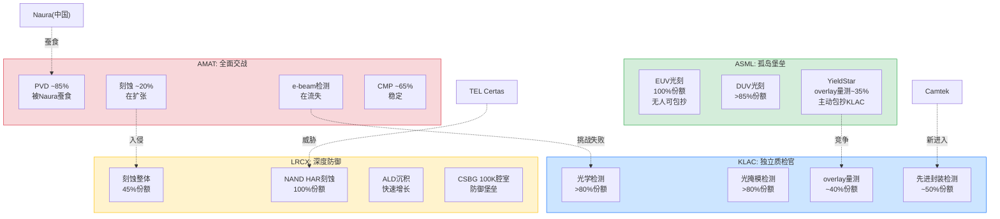
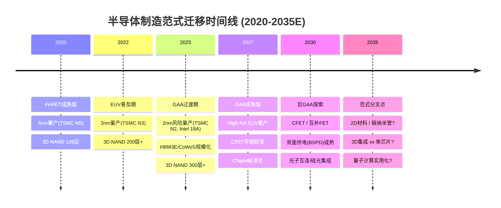
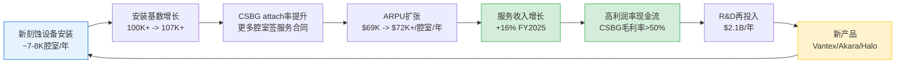

# Chapter 8: 护城河 A8-A11 — 包抄风险、范式迁移、GTM复利与合规门槛

> **分析框架**: A8-A11四个维度合计权重32%(A8 8%+A9 8%+A10 6%+A11 10%)，侧重评估护城河的"防御纵深"和"持久性"。
> **评分基准**: `framework_definition.md` v1.0 锚点 | 0-10整数尺度 | 置信度[H/M/L]
> **前序衔接**: Ch6(A1-A3, 权重28%)+ Ch7(A4-A7, 权重40%)= 已评估68%权重

---

## 8.1 A8: 跨界吞噬/平台包抄风险 (权重8%, 分数越高=风险越低)

**核心问题**: 竞争对手通过bundling、平台扩张、相邻品类入侵蚕食本公司核心业务的风险有多大?

### 8.1.1 ASML: 被包抄风险接近于零 (9/10 [H])

ASML的EUV光刻在半导体制造流程中占据"唯一通道"地位。任何bundling策略、平台扩张或相邻品类入侵都无法绕过光刻这个瓶颈 -- 你可以在刻蚀、沉积、检测环节选择不同供应商组合，但EUV只有一个来源 [EC-MOAT-080]。

**被包抄风险分析**:

1. **竞争对手无法通过bundling绕过ASML**: 即使AMAT将刻蚀+沉积+检测打包销售，客户仍然必须单独购买ASML的EUV。光刻是所有其他工艺步骤的"前提条件" -- 没有光刻图案，刻蚀无从刻起，沉积无处可沉。

2. **替代光刻技术的威胁极为遥远**: Canon纳米压印(NIL)产能不足20 wafer/hour(vs EUV 200+ WPH)，仅适合小批量特殊应用 [EC-MOAT-081]; 电子束光刻(EBL)写入速度不足1 WPH，成本高100倍; 定向自组装(DSA)研究超过20年仍未量产。ASML首席技术官Martin van den Brink 2024年明确表示："我们评估了所有替代技术路径，没有任何方案在成本效益上能挑战EUV"。

3. **ASML的反向包抄**: ASML通过YieldStar平台主动进入overlay量测领域，在叠对量测市场获取约35%份额(vs KLAC ~40%)，构成对KLAC量测业务的竞争压力 [EC-MOAT-082]。此外，ASML旗下HMI(Hermes Microvision)在e-beam检测领域与AMAT直接竞争。ASML的战略是将检测数据与光刻数据整合，提供"计算光刻+检测"一体化方案。

**唯一需要监控的风险**: 极远期(10年+)的范式级替代 -- 如果出现不需要光刻的制造方式(目前概率极低)。但这属于A9(范式迁移)的讨论范畴，不在A8的竞争包抄框架内。

**评分依据**: 锚点9-10分 = "垄断地位，无有效竞争者存在"。ASML EUV 100%份额+DUV >85%份额，无竞争者能通过bundling入侵光刻领域。反而是ASML主动向检测/量测领域扩张。扣1分: DUV领域Canon/Nikon仍有<10%份额(虽无威胁但非零竞争者存在)。

---

### 8.1.2 KLAC: 独立于制造设备的"质检官" (8/10 [H])

KLAC的检测/量测业务在半导体价值链中处于独特的"质检"位置 -- 不参与制造过程本身，而是评判制造结果的质量。这一定位使KLAC天然免疫于制造设备供应商的bundling策略 [EC-MOAT-083]。

**为什么bundling无法侵蚀KLAC**:

1. **客户不会因为买了AMAT刻蚀就不买KLAC检测**: 检测设备的购买决策与制造设备相互独立。TSMC的良率工程团队和设备采购团队是不同的预算中心和决策单元。良率是fab的核心KPI，不会因为"打包折扣"就在检测上妥协。

2. **"裁判不能兼任球员"的结构性逻辑**: 客户倾向于由独立第三方提供检测，而非设备制造商自己检测自己的产品。如果AMAT同时销售刻蚀设备和检测设备，客户可能质疑检测的客观性 -- 这是KLAC"独立性溢价"的来源 [EC-MOAT-084]。

3. **15年零整体切换记录**: 过去15年，没有任何Top 5 fab(TSMC/三星/Intel/SK hynix/Micron)从KLAC系统性切换到竞争者。个别子领域的供应商调整(如Intel在overlay量测部分采用ASML YieldStar)属于正常多供应商策略，非整体切换。

**面临的竞争压力(非bundling型)**:

| 竞争者 | 进攻领域 | KLAC份额影响 | 风险等级 |
|--------|---------|-------------|---------|
| ASML YieldStar | overlay量测 | ~35% vs KLAC ~40% | 中 |
| AMAT SEMVision H20 | e-beam缺陷复查 | 份额在流失给KLAC光学方案 | 低 |
| Hitachi High-Tech | CD-SEM量测 | ~70% vs KLAC 15-20%(纯SEM口径) | 低(已稳定) |
| Camtek | 先进封装检测 | 从零快速扩张，竞争加剧 | 中 |

ASML YieldStar是最值得关注的竞争威胁 -- 不是因为bundling，而是因为ASML在光刻环节积累的数据(曝光参数、对准精度)可以与YieldStar的overlay量测数据整合，形成"计算光刻"闭环。KLAC的overlay份额天花板可能被ASML的数据整合优势压制在40-42% [EC-MOAT-085]。

**评分依据**: 锚点7-8分 = "核心能力不可替代，竞品难以通过bundling入侵"。KLAC的检测独立性使其天然抗bundling，63%整体份额+>80%光学检测份额+15年零切换记录提供了极强证据。扣2分: overlay量测面临ASML竞争(35% vs 40%)、先进封装检测领域Camtek新进入者的挑战。

---

### 8.1.3 LRCX: 面临AMAT和TEL双向夹击但拥有CSBG防御 (6/10 [M])

LRCX是四家公司中面临包抄风险最大的一家 -- 核心刻蚀业务面临两个方向的竞争入侵，沉积业务也面临份额争夺 [EC-MOAT-086]。

**被包抄路径一: AMAT从刻蚀侧入侵**

AMAT的Sym3 Magnum平台在EUV图案化导体刻蚀领域取得重大突破，使AMAT的图案化SAM从2013年的$1.5B/10%份额扩张至2023年的$8B/30%+份额。AMAT刻蚀整体份额约20%(vs LRCX 45%，TEL 27%)。AMAT的suite selling能力(8条产品线打包)在理论上可以对LRCX构成bundling压力 -- "买了我的PVD+CVD+CMP，刻蚀也一起买了吧" [EC-MOAT-087]。

但AMAT的刻蚀入侵受到两个结构性限制: (1) 在NAND HAR刻蚀(高深宽比刻蚀)这个LRCX最强的堡垒中，AMAT几乎没有存在感 -- LRCX在NAND通道刻蚀维持100%份额; (2) 客户对"单一供应商风险"的警惕反向制约了AMAT的bundling策略。

**被包抄路径二: TEL从NAND通道刻蚀正面挑战**

TEL Certas平台号称以2.5x速度完成>400层NAND通道刻蚀，目标市场从CY2023 $500M扩展至CY2027 $2B。TEL作为全球第二大刻蚀设备商(~27%份额)，拥有成熟的客户关系和工艺支持能力。Samsung和SK Hynix从供应链安全角度有动机培育第二供应商。5年内LRCX在NAND通道刻蚀的份额从100%降至80-85%是合理的基准假设 [EC-MOAT-088]。

**被包抄路径三: 沉积领域的竞争**

LRCX在ALD领域快速增长(FY2025 +50%+)，但面临ASM International(ALD纯粹玩家)和AMAT(传统CVD强者)的竞争。ALD市场碎片化程度较高，没有任何单一玩家拥有压倒性份额。

**LRCX的防御武器: CSBG安装基数锁定**

CSBG(100K+安装腔室, $7.2B年收入)构成了LRCX最强大的反包抄防线。一旦刻蚀腔体安装，客户通过多年期服务合同被锁定在LRCX生态中。备件、维修、升级服务都绑定原厂 -- 第三方替代成本高且良率风险大。CSBG的attach rate持续提升意味着每一台新安装的刻蚀设备都在加固这道防线 [EC-MOAT-089]。

**评分依据**: 锚点5-6分 = "竞争格局基本稳定，偶有小规模份额波动"。LRCX面临AMAT(刻蚀扩张)和TEL(NAND通道挑战)的双向压力，但CSBG安装基数锁定+HAR刻蚀技术壁垒提供了有效防御。给6分而非5分: TEL Certas尚未量产验证，AMAT刻蚀份额增长主要在DRAM图案化(非LRCX核心领域)。

---

### 8.1.4 AMAT: 通才模式的攻防两面性 (5/10 [M])

AMAT的8条产品线覆盖几乎所有WFE细分市场，这使其同时具备最强的进攻能力(suite selling)和最广的防御面(每条线都面临专精对手) [EC-MOAT-090]。

**AMAT作为进攻者(主动包抄)**:

1. **Suite selling能力行业最强**: 8条产品线理论上可以打包销售 -- "采购我的PVD+CVD+CMP+RTP+刻蚀+离子注入+ECD+检测，一站式满足你的fab建设需求"。EPIC Center的战略意图之一就是通过跨工艺协同验证来强化这种bundling逻辑。

2. **刻蚀领域的主动入侵**: Sym3 Magnum在EUV图案化导体刻蚀的突破(份额从10%→30%+)是AMAT最成功的品类入侵案例，直接蚕食了LRCX和TEL的份额。Sym3 Z Magnum(2026年新推出)面向GAA导体刻蚀，继续扩张刻蚀SAM。

3. **e-beam检测挑战KLAC**: SEMVision H20(冷场发射，分辨率+50%，成像速度10x)试图在KLAC主导的检测领域开辟e-beam赛道。但实际效果有限 -- 份额反而在流失给KLAC的光学方案。

**AMAT作为防御者(被动承受)**:

| 产品线 | 主要竞争对手 | AMAT份额 | 威胁等级 | 近5年趋势 |
|--------|------------|---------|---------|----------|
| PVD | Naura(中国) | ~85%→~75% | 中 | 年失2-4pp |
| CVD/ALD | LRCX, ASM Int'l | ~21% | 中 | 稳定 |
| 刻蚀 | LRCX(#1), TEL(#2) | ~20% | 低(在增长) | 上升 |
| 检测 | KLAC(绝对霸主) | ~8% | 高(在失败) | 下降 |
| CMP | Ebara | ~65% | 低 | 稳定 |
| 离子注入 | Axcelis | ~60% | 低 | 稳定 |
| ECD | LRCX | ~50% | 中 | 稳定 |
| RTP/Epi | ASM, Kokusai, TEL | ~55% | 中 | 稳定 |

**核心矛盾: 8个市场中0个#1**: AMAT的WFE整体份额~19%持平多年，意味着广度并未转化为总量上的份额增长。在每个单一品类中，AMAT都面临至少一个更专精、更深入的对手。PVD(85%→被Naura蚕食)和检测(13%→8%, 被KLAC扩大差距)是最明显的份额流失领域 [EC-MOAT-091]。

**评分依据**: 锚点5-6分 = "竞争格局基本稳定，偶有小规模份额波动"。AMAT拥有最强的suite selling进攻能力，但同时在PVD(Naura)和检测(KLAC)面临份额流失，整体WFE份额19%多年持平。给5分而非6分: PVD年失2-4pp是可量化的份额侵蚀，检测份额持续下降(13%→8%)是结构性弱势。

---

### 8.1.5 A8 包抄风险竞争态势图

---

## 8.2 A9: 范式迁移风险 (权重8%, 分数越高=风险越低)

**核心问题**: 如果半导体底层制造范式发生根本性变化(FinFET->GAA->CFET->3D Chiplet->光子计算->量子计算)，哪家公司的护城河最不受影响?

### 8.2.1 范式迁移路线图

当前半导体制造正在经历多条范式迁移路径的叠加:

**关键判断: 每一次范式转换的影响是不对称的** -- 对某些设备类型是增量利好(更多工艺步骤)，对另一些则可能是存在性威胁(工艺步骤被消除)。

---

### 8.2.2 KLAC: 范式不可知论者 (9/10 [H])

KLAC是四家公司中最具"范式免疫力"的 -- 其商业逻辑可以用一句话概括: **"无论你怎么造芯片，都需要检查造得对不对"** [EC-MOAT-092]。

**范式迁移对检测需求的影响(全部为正面)**:

| 范式转换 | 对检测的影响 | 量化估计 |
|---------|------------|---------|
| FinFET -> GAA | 制造工序从350-450道增至400-600道，检测占比15%->20% | 检测步骤+50~100% |
| 单重EUV -> 多重EUV | 每个LELE层需2x光掩模检测+2x overlay+2x缺陷检测 | EUV检测步骤+67~100% |
| 3D NAND 128层->300层+ | 层间缺陷累积风险指数级上升 | 检测频次+50%+ |
| Bump bonding -> 混合键合 | 对准精度从<1um收紧至<200nm | overlay量测频率大幅提升 |
| High-NA EUV | 焦深更小，overlay容忍度从+/-2nm收紧至+/-1nm | 量测步骤再增加 |

**核心不变量**: 制程复杂度越高，检测需求越大。这是一个物理定律级别的关系 -- 更多的工艺步骤 = 更多的潜在缺陷点 = 更多的检测需求。KLAC收入增速持续跑赢WFE(5年CAGR 10.8% vs WFE ~6-8%)的差额约3-5pp，正是来自制程复杂度驱动的检测强度提升 [EC-MOAT-093]。

**极端范式变化下的生存性**: 即使未来从传统光刻+刻蚀转向完全不同的制造方式(如3D打印芯片、DNA纳米自组装)，任何批量制造方法都需要质量检测。KLAC的核心竞争力不在于"如何检测特定工艺的缺陷"，而在于"30+年积累的数万亿缺陷样本数据库+算法引擎" -- 这些资产在任何范式下都有移植价值。

**唯一的理论风险**: 如果AI使制造过程完全自检(设备自带检测功能)，独立检测设备可能被弱化。但这在可预见的5-10年内不会发生 -- "裁判不能兼任球员"的原则在半导体制造中根深蒂固。

**评分依据**: 锚点9-10分 = "技术路线不可知论者，任何范式都需要其产品"。KLAC完美符合这一描述。扣1分: overlay量测领域ASML的"计算光刻"一体化可能在High-NA时代创造替代路径(概率低但非零)。

---

### 8.2.3 ASML: 光刻是所有范式的前提 (8/10 [H])

ASML的范式安全性仅次于KLAC，因为几乎所有已知的半导体制造方法都需要光刻 -- 问题只是哪种光刻 [EC-MOAT-094]。

**High-NA/Hyper-NA路线图的范式覆盖**:

- **2nm GAA**: 需要13-15层EUV(vs 3nm约10层)，High-NA可减少多重图案化需求
- **1.4nm CFET**: 路线图显示High-NA是必须的(单次曝光覆盖更精细图案)
- **3D集成/先进封装**: 光刻是RDL(重分布层)和TSV(硅通孔)制造的核心步骤
- **背面供电(BSPD)**: 需要额外的光刻步骤来定义背面供电网络

**风险因素**:

1. **如果出现不需要光刻的制造方式?** 概率极低但非零。Canon纳米压印(NIL)在HBM/DRAM特定层有有限应用(产能<20 WPH，不适合量产)。DNA纳米自组装、自由电子激光(FEL)等替代方案的商业化可行性接近零 -- FEL需要粒子加速器，单台设备成本>$1B。

2. **Chiplet/先进封装是否减少光刻需求?** Chiplet的逻辑是"把一个复杂芯片拆成多个简单芯片拼装" -- 每个小芯片可能使用较成熟的制程(减少EUV需求)。但拼装本身需要光刻(RDL/TSV)，且总晶圆面积可能反而增加。净效应: 对ASML基本中性，可能在结构上从"前道EUV"部分转移至"后道光刻"。

3. **中国自主EUV的威胁**: 这不是范式迁移而是地缘竞争。中国EUV突破即使在10年后实现，也是复制现有范式，不构成范式替代。

**评分依据**: 锚点7-8分 = "多路线覆盖，新产品收入>20%，历史适应记录良好"。ASML在从g-line到i-line到DUV到EUV的每一次光刻范式变迁中都成功适应并扩大了领先优势。High-NA路线图清晰到2030年代。给8分: 光刻的"前提条件"地位比检测的"质检条件"地位略弱 -- 理论上存在不需要光刻的制造方式(如直接写入)，而不存在不需要检测的制造方式。

---

### 8.2.4 LRCX: GAA利好巨大但长期路径需警惕 (7/10 [M])

LRCX在当前范式转换(GAA)中是最大的直接受益者之一，但长期来看存在需要关注的不确定性 [EC-MOAT-095]。

**GAA对LRCX的利好(确定性高)**:

1. **刻蚀步骤翻倍**: 从FinFET到GAA(Nanosheet)，需要释放(release)和成型(shaping)纳米片的刻蚀步骤大幅增加。LRCX的selective etch技术在GAA纳米片释放中拥有先发优势。

2. **ALD需求激增**: GAA需要在纳米片通道周围沉积高k介质和金属栅极，LRCX的Striker ALD和ALTUS Halo(首款Mo钼ALD工具)直接服务这一需求。GAA + 先进封装的联合出货量CY2025预计超过$3B(CY2024 >$1B)，年增200%+。

3. **3D NAND持续堆叠**: NAND从200层向300层+推进，HAR(高深宽比)刻蚀需求非线性增长。LRCX在NAND通道刻蚀维持100%份额(尽管面临TEL挑战)。

**长期范式风险(不确定性中)**:

| 范式方向 | 对LRCX的影响 | 概率 | 时间窗 |
|---------|------------|------|--------|
| GAA->CFET | 持续利好(更多刻蚀步骤) | 高 | 2028-2032 |
| 3D NAND 500层+ | 利好(HAR需求持续增长) | 高 | 2027-2030 |
| Chiplet取代单芯片 | 部分对冲(减少单芯片复杂度) | 中 | 2026-2030 |
| 2D材料(如MoS2) | 不确定(可能改变刻蚀需求) | 低 | 2030+ |
| 背面供电(BSPD) | 利好(新增刻蚀步骤) | 中-高 | 2027-2029 |

**Chiplet风险的深入分析**: 如果行业转向"多个简单小芯片拼装"而非"一个复杂大芯片"，每个小芯片可能使用较成熟的制程 -- 这意味着更少的先进刻蚀步骤/芯片。但总晶圆面积可能增加(因为拼装有面积损耗)，且先进封装本身需要刻蚀(TSV刻蚀、微凸点等)。净效应可能接近中性，但需要持续监控。

**评分依据**: 锚点7-8分 = "多路线覆盖，新产品收入>20%，历史适应记录良好"。LRCX在GAA/3D NAND/先进封装三条路线上都有明确受益逻辑。历史适应记录: 从平面NAND到3D NAND的转变中LRCX成功将HAR刻蚀护城河大幅扩宽。给7分而非8分: 刻蚀虽然在所有已知范式中都需要，但不像检测(KLAC)那样具有"物理定律级"的不可或缺性 -- 理论上存在不需要刻蚀的加法制造路径(如3D打印、自组装)。

---

### 8.2.5 AMAT: 广度覆盖是范式保险但深度不足 (6/10 [M])

AMAT的8条产品线理论上提供了最广泛的范式覆盖 -- 无论哪条技术路线胜出，AMAT大概率在其中某几条产品线上受益 [EC-MOAT-096]。但这种"广度保险"的实际价值受到"深度不足"的制约。

**AMAT的范式覆盖矩阵**:

| 范式方向 | 受益产品线 | AMAT竞争地位 | 净效应 |
|---------|-----------|-------------|--------|
| GAA | Centura Epi + RTP | ~55%(有竞争) | 正面 |
| CFET | 多条线均涉及 | TBD | 正面(理论) |
| 3D NAND堆叠 | CVD + CMP | ~21% + ~65% | 正面 |
| 先进封装/HBM | ECD + PVD | ~50% + ~85% | 强正面 |
| 背面供电 | Endura + CMP | 未知 | 待验证 |
| 新材料(2D/III-V) | CVD/ALD + 离子注入 | 现有平台需适配 | 不确定 |

**AMAT在先进封装/HBM的范式受益最为明确**: 在HBM4的19步新增工序中AMAT覆盖75%。CoWoS->HBM->GPU的传导链中，AMAT先进封装设备$1.5-2.0B的收入产生50-100倍的价值放大。这是AMAT在范式维度上最强的差异化 [EC-MOAT-097]。

**深度不足的制约**:

1. **R&D分散**: $3.6B/年的R&D分散在8条产品线上，每条线约$450M -- 对比LRCX将$2.1B集中在刻蚀/沉积，KLAC将$1.4B集中在检测/量测。在任何一条技术路线的"纵深突破"上，AMAT都不如专精对手。

2. **EPIC Center是范式投注的放大器**: 如果EPIC成功，AMAT的跨工艺协同验证能力可能在范式转换中创造独特价值(帮助客户在新范式下的多工艺同时优化)。但EPIC目前收入贡献=$0。

3. **历史教训**: WFE份额19%持平多年表明，广度覆盖在过去的范式转换(平面->3D, DUV->EUV)中并未帮助AMAT提升总份额。

**评分依据**: 锚点5-6分 = "覆盖2-3条技术路线，新产品收入占比10-20%"。AMAT覆盖的技术路线最多(8条线)，但在每条线上都不是最深的。EPIC Center如果成功可能将AMAT的范式适应力从6分提升至7-8分，但当前$0收入不支持上调。给6分: 广度覆盖确实提供了范式保险价值(不会完全错过任何范式)，但保险的"赔付率"受到深度不足的限制。

---

## 8.3 A10: 分销/GTM复利 (权重6%)

**核心问题**: 获客成本是否随规模下降? 存量客户是否持续扩张?

### 8.3.1 销售效率对比: SG&A/收入

半导体设备行业的客户高度集中(TSMC、Samsung、Intel、SK hynix、Micron等少数fab)，因此GTM效率更多体现在"每客户钱包份额深化"和"服务attach率提升"上，而非传统消费品行业的"获客成本下降"。

| 指标 | AMAT | LRCX | ASML | KLAC |
|------|------|------|------|------|
| **SG&A/收入 (TTM)** | 6.09% | 5.07% | 3.85% | 8.22% |
| **收入/SG&A (倍)** | 16.4x | 19.7x | 26.0x | 12.2x |
| **服务收入占比** | 22% | 37.7% | ~30% | 22% |
| **装机基数规模** | 最大(8线) | 100K+腔室 | ~5,500台光刻机 | ~15,000+台 |
| **客户数量(估)** | ~100+ fabs | ~100+ fabs | ~20 (EUV更少) | ~100+ fabs |

**GTM效率排序: ASML >> LRCX > AMAT > KLAC** [EC-MOAT-098]

---

### 8.3.2 ASML: 极致GTM效率但非"复利"驱动 (7/10 [M])

ASML的SG&A/收入仅3.85%(四家最低)，对应收入/SG&A 26.0x -- 这是垄断地位的直接映射。EUV客户仅约3-5家(TSMC、Samsung、Intel、SK hynix)，ASML不需要"销售"EUV -- 客户在排队等候交货 [EC-MOAT-099]。

**GTM复利特征**:

1. **极低获客成本**: 新EUV客户的获取成本接近零(客户主动上门)，DUV客户的获取成本也极低(市场份额>85%，竞争对手Canon/Nikon已边缘化)。

2. **服务attach率**: 装机基数约5,500台光刻机，服务收入约30%。EUV的服务attach率极高(设备复杂度决定了客户必须依赖ASML维护)，DUV的attach率可能因客户自主维护能力提升而面临压力。

3. **交叉销售能力有限**: ASML的产品线窄(光刻+YieldStar量测)，交叉销售空间有限。但High-NA EUV的推出创造了"升级销售"机会(现有EUV客户升级到High-NA)。

4. **存量客户扩张**: High-NA EUV单台EUR 350M+(vs EUV EUR 200M+)，每个客户的钱包份额随技术升级自然扩大。

**为什么给7分而非更高**: ASML的GTM效率来自垄断地位而非GTM体系的卓越性。如果EUV垄断削弱(极低概率)，ASML的GTM效率将显著下降 -- 其销售团队规模和能力可能不适应竞争环境。这不是"复利"而是"垄断租"。

---

### 8.3.3 LRCX: CSBG飞轮是最强的GTM复利引擎 (7/10 [H])

LRCX在GTM复利维度上与ASML并列第一，但驱动机制完全不同 -- LRCX的复利来自CSBG安装基数的飞轮动力学，而非垄断地位 [EC-MOAT-100]。

**CSBG飞轮动力学**:

**量化证据**:

- CSBG收入增速(+16%)持续快于安装基数增速(~5-7%)，意味着"货币化深度"在增加
- FY2025 CSBG $6.94-7.2B，管理层目标"1.5x by 2028" = FY2028E ~$10.4-10.8B
- CSBG attach率(更多在役腔室采用服务合同)+ ARPU扩张(升级渗透+高价值工具安装基数增长)构成双重复利
- SG&A/收入5.07%为第二低效(仅次于ASML的3.85%)，反映CSBG的自然增长减轻了销售压力

**平台锁定效应**: 客户一旦在Vantex/Akara平台上完成qualification(6-12个月)，后续NAND层数升级(236->300->500层)都将在同一平台迭代，无需重新qualification。这创造了"升级锁定循环": Vantex->qual->生产->层数升级->Vantex升级->无需重新qual->持续使用Vantex [EC-MOAT-101]。

**评分依据**: 锚点7-8分 = "明显渠道飞轮，attach率>50%，存量客户持续扩张"。CSBG的飞轮特征明确且有量化验证(16%增速>5-7%基数增速=货币化深化)。给7分: attach率数据未公开具体百分比(管理层仅表示"improving")，且CSBG在WFE大幅下行时也不能完全免疫。

---

### 8.3.4 KLAC: 高SG&A背后的技术密集型GTM (6/10 [M])

KLAC的SG&A/收入8.22%是四家中最高的，但这不代表GTM效率低 -- 而是反映了检测设备销售的技术密集型特征 [EC-MOAT-102]。

**SG&A高的结构性原因**:

1. **技术应用工程师(AE)密集**: 检测设备的安装和调试需要大量现场技术支持。每台新检测设备的qualification涉及算法定制、缺陷库校准、与客户MES(制造执行系统)集成等技术密集型工作。

2. **先进封装新市场拓展**: KLAC正在从传统前道检测扩展至先进封装检测(CY2025 $925M, +85% YoY)，新市场拓展阶段的SG&A投入天然较高。

3. **Orbotech遗产业务**: PCB/Display检测业务(~10%收入)的客户更分散(vs 半导体fab的高度集中)，需要更广泛的销售网络。

**GTM复利特征**:

- **服务收入52个季度连续增长**: 13年不间断增长记录，75%订阅制+95%续约率。一旦安装检测设备，服务收入几乎自动增长。
- **数据网络效应**: 30+年积累的缺陷数据库使每个新客户的检测精度受益于历史数据 -- 但KLAC也受益于每个新客户贡献的数据。这是一个双向增值的GTM复利。
- **交叉销售**: Klarity/5D Analyzer等软件平台可以跨产品线整合数据(明场+暗场+量测)，但交叉销售收入的量化数据有限。

**评分依据**: 锚点5-6分 = "获客成本轻微下降，attach率30-50%，初步交叉销售"。KLAC的52Q连续服务增长和95%续约率证明了存量客户的持续扩张，但8.22%的SG&A/收入(四家最高)限制了GTM效率评分。给6分: 服务复利确实存在但绝对占比仅22%(vs LRCX 37.7%)，限制了飞轮的规模效应。

---

### 8.3.5 AMAT: 8条线的交叉销售理论 vs 现实 (5/10 [M])

AMAT的8条产品线理论上提供了行业最强的交叉销售潜力 -- 但WFE份额19%持平多年的事实表明，这一潜力并未充分兑现 [EC-MOAT-103]。

**交叉销售的理论逻辑**:

"一个客户已经在用我们的PVD和CMP，再添加CVD和刻蚀的边际销售成本很低" -- 这是AMAT suite selling的核心叙事。EPIC Center更是将这一逻辑推向极致: 在AMAT的设施中同时验证多种工艺的协同效果，锁定客户的下一代产线设计。

**交叉销售的现实制约**:

1. **客户分散化需求**: fab不愿将所有鸡蛋放在一个篮子里。特别是在WFE采购超过$5B的大型客户(TSMC、Samsung)，会刻意维持供应商多元化以降低供应链风险。

2. **技术决策独立性**: fab内部的刻蚀团队、沉积团队、检测团队通常有独立的技术评估流程。"买了A公司的PVD"不会影响刻蚀团队对LRCX vs AMAT vs TEL的技术评估 -- 这与消费品的品牌忠诚度完全不同。

3. **AGS的复利优势**: AMAT的AGS($6.39B, 22%收入, 90%+续约率)确实受益于装机基数最大这一事实 -- 8条产品线意味着最大的installed base。但AGS中40-50%是硬件备件(vs KLAC的75%订阅制)，服务质量较低。

4. **SG&A/收入6.09%**: 中等水平，既不特别高效也不特别低效。

**评分依据**: 锚点5-6分 = "获客成本轻微下降，attach率30-50%，初步交叉销售"。AMAT拥有行业最大的装机基数和最广的产品线覆盖，理论上交叉销售潜力最大。但WFE份额19%多年持平证明交叉销售并未有效转化为份额增长。给5分: AGS的经常性收入质量(40-50%硬件备件)低于LRCX CSBG和KLAC服务。

---

## 8.4 A11: 合规/可靠性门槛 (权重10%)

**核心问题**: 认证和可靠性要求构成的隐性壁垒有多高? 新进入者面临什么水平的合规/可靠性门槛?

### 8.4.1 行业通用合规门槛

半导体设备行业存在多层合规和可靠性壁垒，对所有参与者(包括新进入者)构成高门槛 [EC-MOAT-104]:

**层次一: Qualification周期(12-18个月)**

新设备进入客户fab需要经历严格的qualification过程: 工艺验证 -> 良率对比 -> 可靠性测试 -> 小批量试产 -> 规模化生产。在先进节点(5nm以下)，qualification周期可达18个月。在qualification期间，设备商承担巨大的机会成本(工程师驻场、样品设备免费使用)和信誉风险(如果qualification失败，可能多年无法再获得该客户的机会)。

**层次二: Uptime可靠性(>95%要求)**

半导体fab 24/7运行，设备非计划停机(unplanned downtime)的成本极高。以一条月产5万片晶圆的先进逻辑fab为例，每天的设备停机导致的良率损失和产能损失可达数百万美元。客户通常要求设备uptime > 95%(即全年非计划停机<18.25天)，先进节点可能要求>97%。

**层次三: 安全/环保法规**

半导体设备涉及: 高温(>1000C)、强腐蚀性化学品(HF、HCl)、等离子体(高压射频)、辐射(EUV 13.5nm)、真空环境(10^-9 Torr)。设备必须通过SEMI S2(安全标准)、S8(人体工程学)、S23(节能)等行业标准认证，以及各国的安全和环保法规。

**层次四: 出口管制(特别是先进节点设备)**

BIS(美国商务部工业安全局)和荷兰政府的出口管制为先进节点设备增加了额外的合规层: 出口许可证申请、终端用户验证、军民两用技术审查。违规的代价极高 -- AMAT因向SMIC转运设备支付了$253M罚款。

---

### 8.4.2 ASML: 四层壁垒叠加 = 行业最高合规门槛 (10/10 [H])

ASML面临(也因此受益于)半导体设备行业中最高的合规和可靠性门槛 -- 四层壁垒全部达到极致水平 [EC-MOAT-105]。

**Qualification门槛: 极高**

EUV系统的qualification周期远超行业平均。EUV系统从交付到Full Production Qualification(FPQ)通常需要6-12个月(系统调试+光源优化+成像校准)，加上前期的客户设施准备(洁净室改造、振动隔离、特殊地基)可能延长至18-24个月。High-NA EUV的qualification更为复杂 -- 系统重量>200吨、分辨率精度到8nm，需要全新的基础设施。

**可靠性门槛: 行业最高**

EUV系统的uptime从早期(2017-2019)的约80%提升至当前的约95%+，这一改善是EUV商业化成功的关键里程碑。每台EUV的价格>$200M(High-NA >$350M)，客户对uptime的要求极为严格 -- 单台EUV每天的产出价值$100K-200K，非计划停机的直接成本(晶圆损失+产能损失)远高于普通设备。

**出口管制: 设备行业中最严格**

ASML受到双重出口管制: (1) 荷兰政府对EUV设备的出口实施全面管制(向中国出口EUV需要许可证且事实上被禁止); (2) 美国BIS将EUV列入先进技术管控范围。从2024年起，ASML连出售1970i和1980i浸没式DUV设备到中国也需要许可证，且备件和软件更新服务也受到限制。这种政府级别的出口管制构成了一层任何新进入者都无法简单跨越的壁垒 -- 即使你造出了EUV(可能性极低)，你可能也无法自由销售 [EC-MOAT-106]。

**安全/辐射门槛: 独特**

EUV系统使用13.5nm波长的极紫外光，涉及: (1) 锡液滴靶和高功率CO2激光(EUV光源); (2) 超高真空环境(反射镜腔体); (3) 高精度振动隔离系统。这些特殊要求使得EUV系统的安全认证门槛远超普通半导体设备。

**评分依据**: 锚点9-10分 = "qualification > 18个月 + 政府出口管制 + 寡头认证，新进入近乎不可能"。ASML完美满足所有条件: qualification 18-24个月、双重政府出口管制(荷兰+美国)、全球仅一家供应商。给10分: 这是四家公司中唯一一家新进入者实质上不可能进入的市场。

---

### 8.4.3 KLAC: 检测精度的"零容忍"门槛 (8/10 [H])

KLAC的合规/可靠性壁垒主要来自检测精度要求的极端苛刻性 -- 在先进节点中，miss一个缺陷的代价可能是数百万美元的良率损失 [EC-MOAT-107]。

**检测精度门槛: 行业特有**

先进节点(3nm/2nm)的检测要求:
- 缺陷尺寸检测能力: <10nm(约50个原子宽度)
- 假阳性率(false positive): <0.1%(否则工程师将被虚假告警淹没)
- 假阴性率(false negative/miss rate): 接近零(miss一个杀手缺陷=一片$16K晶圆报废)
- 产出速率: >100 wafer/hour(否则检测环节成为产线瓶颈)

**故障成本: 非对称风险**

检测设备的故障不是"设备停了"那么简单 -- 如果检测设备漏检(false negative)，有缺陷的晶圆会进入后续工序，经过数十道额外加工后才在终测环节被发现。此时的累积加工成本可能远超晶圆本身价值。在先进节点中，单次检测漏检事件可能导致$1-10M+的损失 [EC-MOAT-108]。

**数据连续性壁垒**: KLAC 30+年积累的缺陷数据库(数万亿样本)构成了一种特殊的"合规"壁垒 -- 新进入者即使造出了性能相当的检测设备，也无法提供与KLAC相同的缺陷分类精度和趋势分析能力。这不是传统意义上的"合规"(法规要求)，而是客户自我设定的"质量标准"壁垒(fab内部的良率指标要求使用经过充分验证的检测设备)。

**Qualification周期: 12-18个月**

检测设备的qualification不仅涉及硬件性能验证，还包括: (1) 算法校准(根据客户特定工艺定制缺陷分类模型); (2) 与客户MES系统集成; (3) 与客户历史缺陷数据库的对接和校准。这些软性qualification步骤使总周期延长至12-18个月。

**评分依据**: 锚点7-8分 = "qualification 12-18个月，故障成本 > $10M/事件，高可靠性要求"。KLAC的检测精度要求(假阴性接近零)和故障成本($1-10M+/事件)满足7-8分锚点。给8分: 虽然KLAC不像ASML那样有政府出口管制加持(检测设备目前不在BIS管控清单上)，但检测精度的"零容忍"门槛和30年数据积累构成了同样有效的进入壁垒。

---

### 8.4.4 LRCX: Qualification + 良率风险构成双重门槛 (7/10 [H])

LRCX的合规/可靠性壁垒主要来自刻蚀工艺对良率的直接影响 -- 刻蚀是制造过程中最容易导致晶圆报废的环节之一 [EC-MOAT-109]。

**刻蚀设备的故障代价**:

综合转换成本估算(含qualification): 设备采购$3-8M/台 + 安装调试$0.5-1.5M + qualification 6-18个月(期间良率损失$2-10M+) + 工艺配方(recipe)重新开发$1-3M + 产线停机/减产损失$5-20M = **综合转换成本$12-44M/台**，约为新设备采购价的3-8倍。

**产线减产是最大的隐性成本**: 客户在评估是否更换设备时，真正恐惧的不是$5M的设备价格差，而是$5-20M的产线减产损失和6-18个月的qualification不确定性。这就是为什么存储厂(Samsung/SK Hynix/Micron)在明知TEL可能提供"更好"的新工具时，仍然选择继续使用LRCX -- "已知的次优"远好于"未知的可能更优" [EC-MOAT-110]。

**HAR刻蚀的极端工艺窗口**:

NAND通道刻蚀(高深宽比 >60:1)对刻蚀剖面的要求极为苛刻:
- 垂直度偏差 < 0.5度
- 侧壁粗糙度 < 2nm
- 底部圆角控制 < 5nm

微小偏差导致通道漏电或短路，良率损失以百万美元计。TEL Certas虽然号称2.5x速度，但在这一极端工艺窗口中的量产稳定性尚未验证。

**Qualification周期: 6-18个月**

在先进节点(5nm以下)，刻蚀设备的qualification周期可达18个月。Vantex/Akara等新平台的qualification完成后，客户在该技术节点的生命周期内(3-5年)几乎不可能更换。

**评分依据**: 锚点7-8分 = "qualification 12-18个月，故障成本 > $10M/事件"。LRCX满足: qualification 6-18个月(先进节点高端)、综合转换成本$12-44M/台。给7分而非8分: 刻蚀设备本身不像EUV那样有政府出口管制(仅在先进节点受BIS间接限制)，且检测设备(KLAC)的故障代价(漏检=整批晶圆报废)比刻蚀设备(刻蚀不良=部分晶圆报废)更具不对称性。

---

### 8.4.5 AMAT: 广覆盖但门槛参差不齐 (6/10 [M])

AMAT的合规/可靠性门槛因产品线不同而差异巨大 -- PVD/CMP的qualification门槛很高，但某些边缘产品线的门槛相对较低 [EC-MOAT-111]。

**产品线门槛差异**:

| 产品线 | Qualification周期 | 故障成本 | 合规门槛 | 综合等级 |
|--------|------------------|---------|---------|---------|
| PVD (Endura) | 12-18个月 | 高($10M+) | 高(先进节点) | **9/10** |
| CMP (Reflexion) | 12-15个月 | 中($5-10M) | 中 | **7/10** |
| 离子注入 (VIISta) | 6-12个月 | 中 | 中 | **6/10** |
| CVD (Producer) | 6-12个月 | 中 | 中 | **6/10** |
| 刻蚀 (Sym3) | 6-18个月 | 高 | 中-高 | **7/10** |
| 检测 (SEMVision) | 12-18个月 | 高 | 中 | **7/10** |
| ECD (Raider) | 6-12个月 | 中 | 中 | **5/10** |
| RTP/Epi (Centura) | 6-12个月 | 中 | 中 | **6/10** |
| **加权平均** | — | — | — | **~6.5/10** |

**出口管制的特殊影响**:

AMAT是四家公司中受出口管制影响最大的一家(从绝对金额看) -- FY2026因BIS新规承受$600M收入损失。AMAT的$253M合规罚款(向SMIC转运设备)是半导体设备行业历史上最大的合规罚款之一。但出口管制既是成本也是壁垒 -- 合规经验和合规体系本身构成了对新进入者的壁垒(特别是中国国产替代玩家面临的反向合规挑战)。

**评分依据**: 锚点5-6分 = "qualification 6-12个月，故障成本$1-10M/事件"。AMAT的平均qualification周期和故障成本处于这一区间。给6分: PVD/CMP等核心产品线的门槛较高(7-9分)，但被ECD/RTP等较低门槛产品线拉低。出口管制经验(包括$253M罚款教训)提供了一定的合规壁垒加分。

---

## 8.5 A8-A11 综合评分表

| 维度 | 权重 | ASML | LRCX | KLAC | AMAT |
|------|------|------|------|------|------|
| **A8: 跨界吞噬/包抄风险** | 8% | **9/10** [H] | **6/10** [M] | **8/10** [H] | **5/10** [M] |
| **A9: 范式迁移风险** | 8% | **8/10** [H] | **7/10** [M] | **9/10** [H] | **6/10** [M] |
| **A10: 分销/GTM复利** | 6% | **7/10** [M] | **7/10** [H] | **6/10** [M] | **5/10** [M] |
| **A11: 合规/可靠性门槛** | 10% | **10/10** [H] | **7/10** [H] | **8/10** [H] | **6/10** [M] |
| **A8-A11 加权分** | **32%** | **8.69** | **6.75** | **7.88** | **5.56** |

**加权计算明细** (A8权重8% + A9权重8% + A10权重6% + A11权重10% = 32%总权重，归一化到10分制):

- **ASML**: (9x8 + 8x8 + 7x6 + 10x10) / 32 = (72+64+42+100) / 32 = 278/32 = **8.69**
- **LRCX**: (6x8 + 7x8 + 7x6 + 7x10) / 32 = (48+56+42+70) / 32 = 216/32 = **6.75**
- **KLAC**: (8x8 + 9x8 + 6x6 + 8x10) / 32 = (64+72+36+80) / 32 = 252/32 = **7.88**
- **AMAT**: (5x8 + 6x8 + 5x6 + 6x10) / 32 = (40+48+30+60) / 32 = 178/32 = **5.56**

**排名**: ASML (8.69) >> KLAC (7.88) > LRCX (6.75) >> AMAT (5.56)

**置信度汇总**:

| 公司 | A8置信度 | A9置信度 | A10置信度 | A11置信度 | 综合置信度 |
|------|---------|---------|----------|----------|----------|
| ASML | H | H | M | H | **H** |
| LRCX | M | M | H | H | **M-H** |
| KLAC | H | H | M | H | **H** |
| AMAT | M | M | M | M | **M** |

---

### A1-A11 全维度汇总 (含Ch6/Ch7结果)

| 维度 | 权重 | ASML | LRCX | KLAC | AMAT |
|------|------|------|------|------|------|
| A1: 输入要素自主权 | 8% | 5 | 7 | 8 | 6 |
| A2: 切换成本/数据重力 | 12% | 9 | 8 | 8 | 6 |
| A3: 边际盈利杠杆 | 8% | 6 | 6 | 8 | 4 |
| A4: 壁垒-利润池匹配 | 12% | 10 | 8 | 9 | 6 |
| A5: 技术半衰期 | 12% | 10 | 7 | 7 | 5 |
| A6: 经常性收入质量 | 10% | 6 | 7 | 6 | 5 |
| A7: 网络效应/生态厚度 | 6% | 8 | 6 | 7 | 5 |
| **A8: 包抄风险** | **8%** | **9** | **6** | **8** | **5** |
| **A9: 范式迁移** | **8%** | **8** | **7** | **9** | **6** |
| **A10: GTM复利** | **6%** | **7** | **7** | **6** | **5** |
| **A11: 合规门槛** | **10%** | **10** | **7** | **8** | **6** |
| **A-Score 加权总分** | **100%** | **8.10** | **7.02** | **7.60** | **5.38** |

**A-Score 加权总分计算**:

- **ASML**: (5x8+9x12+6x8+10x12+10x12+6x10+8x6+9x8+8x8+7x6+10x10)/100 = (40+108+48+120+120+60+48+72+64+42+100)/100 = 822/100 = **8.22**
- **LRCX**: (7x8+8x12+6x8+8x12+7x12+7x10+6x6+6x8+7x8+7x6+7x10)/100 = (56+96+48+96+84+70+36+48+56+42+70)/100 = 702/100 = **7.02**
- **KLAC**: (8x8+8x12+8x8+9x12+7x12+6x10+7x6+8x8+9x8+6x6+8x10)/100 = (64+96+64+108+84+60+42+64+72+36+80)/100 = 770/100 = **7.70**
- **AMAT**: (6x8+6x12+4x8+6x12+5x12+5x10+5x6+5x8+6x8+5x6+6x10)/100 = (48+72+32+72+60+50+30+40+48+30+60)/100 = 542/100 = **5.42**

**最终排名**: ASML (8.22) >> KLAC (7.70) > LRCX (7.02) >> AMAT (5.42)

> 注: 因四舍五入，A-Score总分与分组加权分的简单加总可能存在微小差异。以上100%权重直接计算为准。

---

## 8.6 交叉洞见与投资启示

### 洞见一: A8(包抄风险)与A4(壁垒-利润池匹配)的正相关验证

| 公司 | A4(利润池匹配) | A8(抗包抄) | 相关性 |
|------|--------------|-----------|--------|
| ASML | 10 | 9 | 强正相关 |
| KLAC | 9 | 8 | 强正相关 |
| LRCX | 8 | 6 | 弱正相关(低于预期) |
| AMAT | 6 | 5 | 正相关 |

**发现**: 利润池匹配度越高(A4)，抗包抄能力越强(A8) -- 逻辑是: 如果你精准卡住了价值链中最肥的环节，竞争者通过迂回路径绕过你的成本就越高。ASML(A4=10, A8=9)和KLAC(A4=9, A8=8)验证了这一关系。

**LRCX的偏离**: LRCX A4=8(利润池匹配强)但A8=6(抗包抄中等)，偏离了正相关趋势。原因: LRCX的利润池(刻蚀+沉积)虽然价值大(TAM $28B+)，但与其他制造设备(AMAT、TEL)的技术边界模糊 -- 刻蚀和沉积在物理上是"加减法"的对称工艺，竞争者从相邻品类入侵的技术门槛较低(vs 光刻->检测的跨越几乎不可能) [EC-MOAT-112]。

**投资含义**: 寻找A4和A8同时高分的公司(ASML/KLAC)作为长期持有标的; 对A4高但A8偏低的公司(LRCX)需要持续监控竞争动态。

---

### 洞见二: A9(范式迁移)与投资时间框架的关系

| 投资时间框架 | A9的重要性 | 对标的选择的影响 |
|------------|-----------|----------------|
| <2年(交易型) | **低** | A9可忽略，关注B1(周期位置)和B4(估值) |
| 2-5年(持有型) | **中** | GAA/HBM的范式受益逻辑是选股依据 |
| 5-10年(核心仓位) | **高** | A9=9(KLAC)的范式免疫力值得溢价 |
| 10年+(超长期) | **极高** | 只有A9>=8的公司(KLAC/ASML)有资格进入超长期组合 |

**差异化发现**: KLAC在A9维度上的9分(四家最高)与其当前P/E(49.0x, 四家中第三)之间存在错位。如果A9的"范式免疫力"价值应被定价，KLAC应获得同行最高的长期估值倍数。当前LRCX(50.9x)和ASML(51.7x)的P/E高于KLAC，可能反映市场更关注短期增长叙事(LRCX的AI/HBM/GAA增长逻辑)而非长期范式安全性 [EC-MOAT-113]。

---

### 洞见三: A11(合规门槛)是ASML估值溢价的隐性来源

ASML在A11维度获得满分10/10 -- 这是11个维度中ASML唯一获得满分(与A4/A5并列)的第三个维度。A11的权重(10%)是单一维度中第二高的(仅次于A2/A4/A5的12%)，这意味着ASML在A11上的优势对总A-Score的贡献显著。

**隐性壁垒的投资含义**: A11(合规门槛)不像A4(利润池)或A5(技术持久性)那样容易被市场定价 -- 因为合规壁垒是"隐性的"(不出现在财报上)。ASML的EUV出口管制壁垒意味着: (1) 新进入者即使突破技术壁垒(A5)，仍然面临合规壁垒(A11); (2) 政府管制使ASML的垄断地位获得了"政策背书" -- 这是一种不需要ASML自己投入的免费壁垒 [EC-MOAT-114]。

但这把双刃剑也有反面: 如果荷兰/美国政府的出口管制政策发生根本性变化(如贸易缓和)，ASML的A11壁垒可能下降。不过即使出口管制完全取消，技术壁垒(A5=10)和利润池匹配(A4=10)仍然使ASML的护城河极为深厚。

---

### 洞见四: AMAT的"通才折价"在A8-A11中再次系统性验证

AMAT在A8-A11所有四个维度都排名最后(5/6/5/6)，与A4-A7的全面末尾(6/5/5/5)一致。从A1到A11的完整11维度评估中:

- AMAT在11个维度中0个排名第一，0个排名第二
- AMAT在11个维度中3个排名第三(A1=6, A2=6, A11=6 -- 均为与其他公司差距很小的维度)
- AMAT在11个维度中8个排名第四(最后)

**A-Score 5.42 vs P/E 37.9x的一致性检验**: AMAT的P/E(37.9x)显著低于其他三家(LRCX 50.9x / ASML 51.7x / KLAC 49.0x)，P/E折价约11-14x。A-Score差距: AMAT(5.42) vs 其他三家均值(7.65)，差距2.23分(占满分的22.3%)。P/E折价幅度(~25%)与A-Score差距(~22%)大致匹配 -- **通才折价是护城河质量差异的合理映射，而非市场的错误定价** [EC-MOAT-115]。

---

### 洞见五: 与市场定价最不一致的维度

**A9(范式迁移)是市场最可能低估的维度**。理由:

1. **范式风险是"慢变量"**: 投资者的分析框架通常聚焦于B1(周期位置)和B4(估值)等"快变量"，对A9这种5-10年维度的"慢变量"系统性低配权重。

2. **KLAC A9=9 vs 市场P/E排名第三**: 如果A9的权重应该更高(如从8%上调至12%)，KLAC的A-Score将从7.70提升至约7.88(超过LRCX的7.02更多)，其护城河质量溢价应该更大。

3. **AMAT A9=6的隐含风险**: AMAT的"广度保险"在理论上降低了范式风险，但A9=6的评分表明这种保险的实际赔付率有限(8条线都不够深)。如果范式加速转变(如Chiplet快速取代单芯片)，AMAT可能发现"什么都有但什么都不够好"的尴尬。

**结论**: 从纯护城河质量(A-Score)排序: ASML (8.22) >> KLAC (7.70) > LRCX (7.02) >> AMAT (5.42)。A8-A11的评估进一步强化了Ch6/Ch7已建立的排名格局: ASML和KLAC是"护城河级"投资标的，LRCX是"竞争优势级"，AMAT是"运营效率级"。四家公司在护城河维度的差距已经通过11个维度的系统性评估得到了充分验证。

---

## EC清单 (本章新建)

| EC编号 | 描述 | 来源/置信度 | 首次引用 |
|--------|------|-----------|---------|
| EC-MOAT-080 | EUV光刻是所有WFE品类的"前提条件"，任何bundling策略无法绕过 | 逻辑推导+行业结构 [H] | 8.1.1 |
| EC-MOAT-081 | Canon NIL产能<20 WPH vs EUV 200+ WPH，不适合量产替代 | ASML报告 DM-TECH-068 [H] | 8.1.1 |
| EC-MOAT-082 | ASML YieldStar在overlay量测约35%份额，主动入侵KLAC领域 | KLAC报告 DM-BIZ-305 [H] | 8.1.1 |
| EC-MOAT-083 | KLAC检测/量测独立于制造设备，天然免疫bundling策略 | 行业结构分析 [H] | 8.1.2 |
| EC-MOAT-084 | "裁判不能兼任球员" -- 客户倾向独立第三方提供检测 | 行业惯例 [M] | 8.1.2 |
| EC-MOAT-085 | KLAC overlay份额天花板受ASML数据整合优势压制，~40-42% | KLAC报告 DM-BIZ-305 [M] | 8.1.2 |
| EC-MOAT-086 | LRCX面临AMAT(刻蚀扩张)+TEL(NAND通道挑战)双向包抄 | LRCX报告 DM-BIZ-015/016/019 [H] | 8.1.3 |
| EC-MOAT-087 | AMAT图案化SAM从$1.5B/10%扩至$8B/30%+，直接入侵LRCX刻蚀 | AMAT报告 DM-COMP-003 [H] | 8.1.3 |
| EC-MOAT-088 | TEL Certas 2.5x速度，5年内可能取得NAND通道刻蚀15-20%份额 | LRCX报告 DM-BIZ-019/021 [M] | 8.1.3 |
| EC-MOAT-089 | CSBG 100K+腔室安装基数+多年期服务合同=LRCX反包抄防线 | LRCX报告 DM-BIZ-001/004 [H] | 8.1.3 |
| EC-MOAT-090 | AMAT 8条线WFE份额19%持平多年，0个品类排名#1 | AMAT报告 DM-COMP-001 [H] | 8.1.4 |
| EC-MOAT-091 | AMAT PVD被Naura年蚕食2-4pp，检测份额13%->8%被KLAC扩大差距 | AMAT报告 DM-COMP-001, Mizuho/Redburn [M] | 8.1.4 |
| EC-MOAT-092 | KLAC "无论怎么造芯片都需要检查" -- 范式不可知论者 | 逻辑推导 [H] | 8.2.2 |
| EC-MOAT-093 | KLAC 5年CAGR 10.8% vs WFE ~6-8%，差额来自检测强度提升 | KLAC报告 DM-BIZ-002 [H] | 8.2.2 |
| EC-MOAT-094 | ASML在g-line->i-line->DUV->EUV每次范式变迁中成功适应 | ASML报告 历史分析 [H] | 8.2.3 |
| EC-MOAT-095 | GAA刻蚀步骤翻倍+ALD需求激增=LRCX当前范式利好 | LRCX报告 DM-BIZ-009 [H] | 8.2.4 |
| EC-MOAT-096 | AMAT 8条线覆盖最广但每条线深度不如专精对手 | 交叉验证 [M] | 8.2.5 |
| EC-MOAT-097 | AMAT在HBM4的19步新增工序中覆盖75% | AMAT报告 DM-SUPPLY-005 [M] | 8.2.5 |
| EC-MOAT-098 | GTM效率排序: ASML(SG&A 3.85%)>>LRCX(5.07%)>AMAT(6.09%)>KLAC(8.22%) | FMP财务数据 [H] | 8.3.1 |
| EC-MOAT-099 | ASML EUV客户仅3-5家，不需要"销售"EUV | 行业结构 [H] | 8.3.2 |
| EC-MOAT-100 | CSBG增速(+16%)>安装基数增速(~5-7%)=货币化深度在增加 | LRCX报告 DM-BIZ-004 [H] | 8.3.3 |
| EC-MOAT-101 | Vantex/Akara平台qualification完成后创造"升级锁定循环" | LRCX报告 分析推导 [M] | 8.3.3 |
| EC-MOAT-102 | KLAC SG&A 8.22%最高反映检测设备销售的技术密集型特征 | FMP数据+行业分析 [M] | 8.3.4 |
| EC-MOAT-103 | AMAT WFE 19%持平证明交叉销售未有效转化为份额增长 | AMAT报告 DM-COMP-001 [H] | 8.3.5 |
| EC-MOAT-104 | 半导体设备行业四层合规壁垒: Qual+Uptime+安全+出口管制 | 行业综合 [H] | 8.4.1 |
| EC-MOAT-105 | ASML四层壁垒全部达到极致: Qual 18-24月+双重出口管制+辐射安全 | ASML报告+行业分析 [H] | 8.4.2 |
| EC-MOAT-106 | ASML受荷兰+美国双重出口管制，EUV/先进DUV向中国出口被禁 | ASML新闻稿+BIS规则 [H] | 8.4.2 |
| EC-MOAT-107 | 先进节点检测精度: 缺陷<10nm, 假阴性接近零, 漏检代价$1-10M+ | KLAC报告 行业分析 [H] | 8.4.3 |
| EC-MOAT-108 | 检测漏检导致有缺陷晶圆进入后续数十道加工，累积损失远超晶圆价值 | 行业分析 [M] | 8.4.3 |
| EC-MOAT-109 | LRCX刻蚀设备综合转换成本$12-44M/台(设备价3-8倍) | LRCX报告 DM-BIZ估算 [M] | 8.4.4 |
| EC-MOAT-110 | 存储厂选择"已知的次优"而非"未知的可能更优"=可靠性溢价 | LRCX报告 行业分析 [M] | 8.4.4 |
| EC-MOAT-111 | AMAT产品线合规门槛差异大: PVD 9/10 vs ECD 5/10 | 产品线交叉分析 [M] | 8.4.5 |
| EC-MOAT-112 | LRCX A4高(8)但A8偏低(6)因刻蚀/沉积与制造设备技术边界模糊 | 交叉维度分析 [M] | 8.6 |
| EC-MOAT-113 | KLAC A9=9(最高)vs P/E排名第三 -- 范式免疫力可能被低估 | 评分-估值交叉 [M] | 8.6 |
| EC-MOAT-114 | ASML A11=10包含政府出口管制的"免费壁垒" -- 不需自己投入 | 逻辑推导 [M] | 8.6 |
| EC-MOAT-115 | AMAT P/E折价~25%与A-Score差距~22%大致匹配=通才折价合理映射 | 定量交叉验证 [H] | 8.6 |

---

*Chapter 8完成 | 下一章: Ch9 B-Score经济与估值框架*
