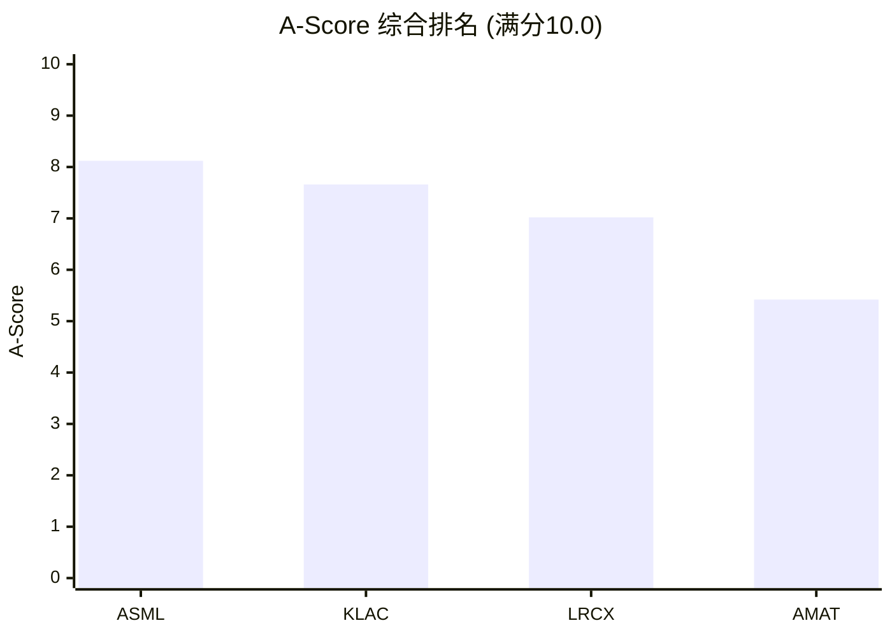
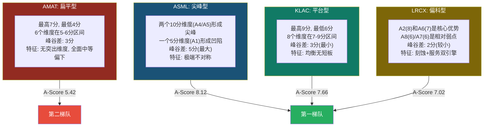
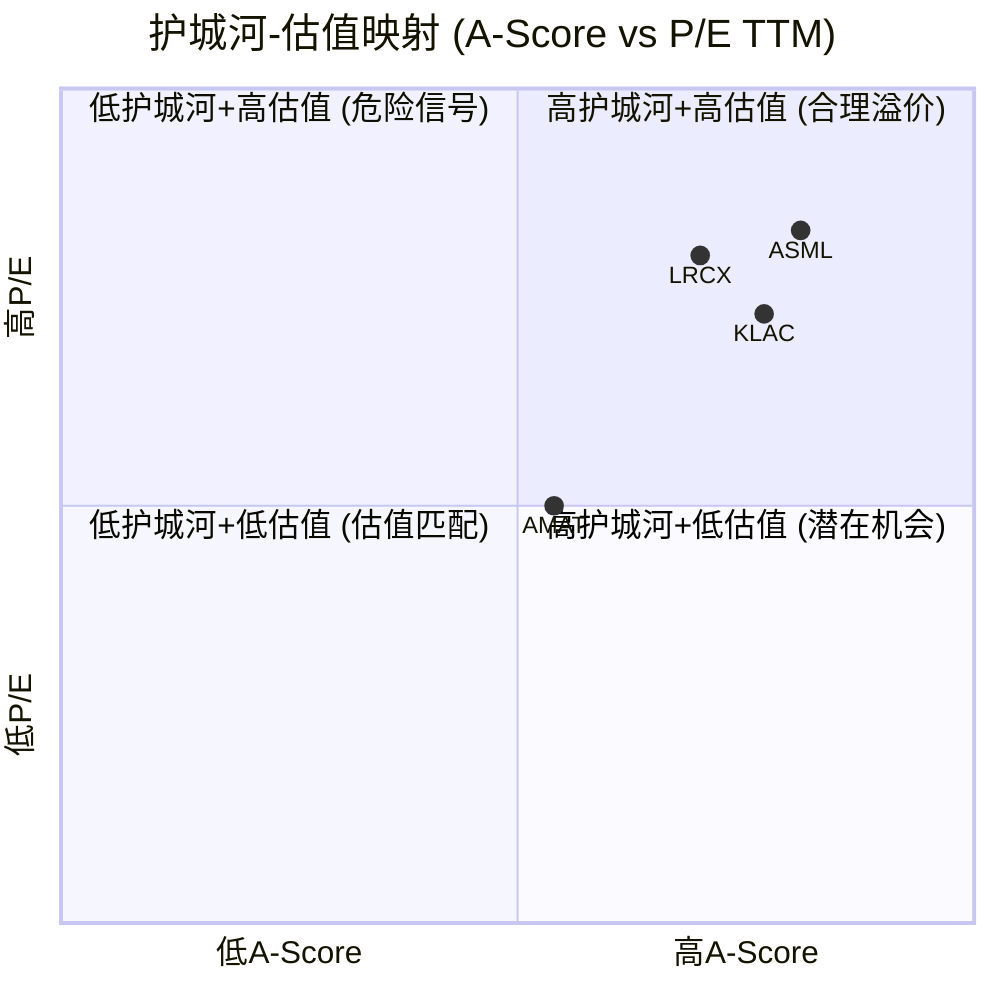
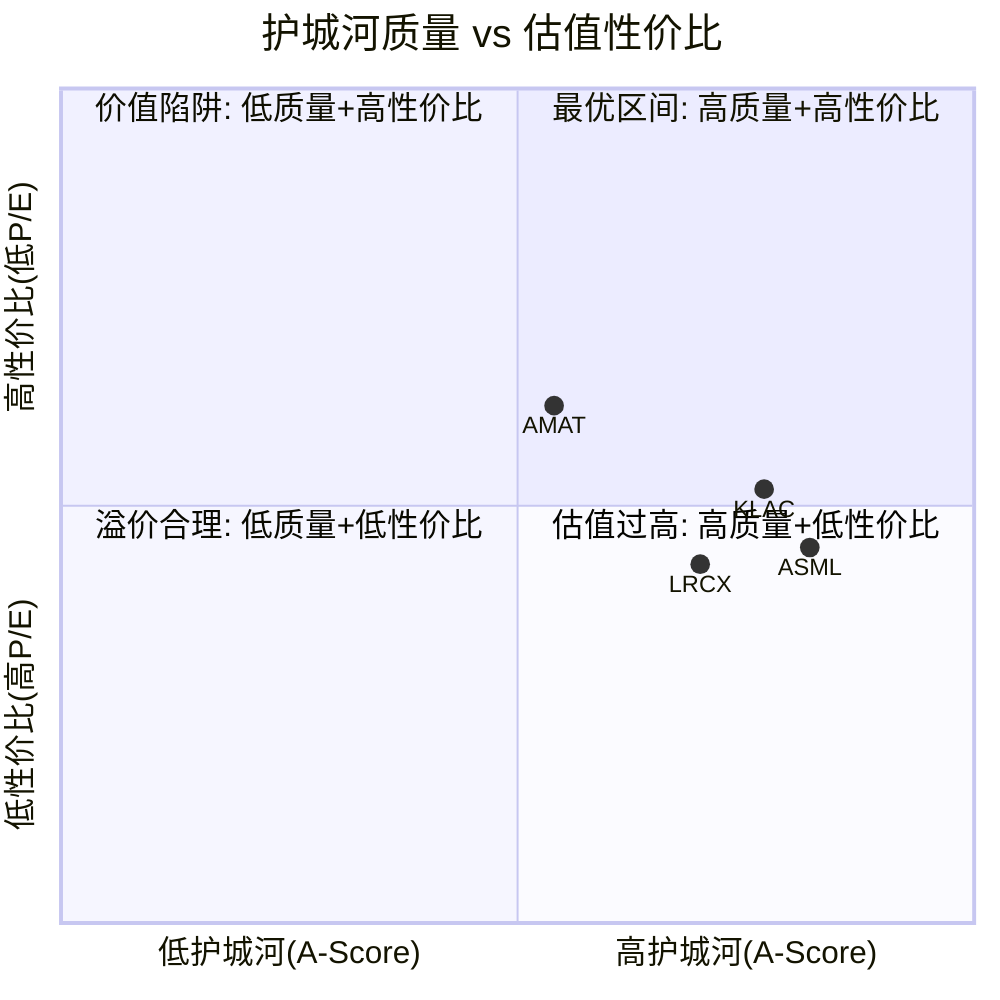
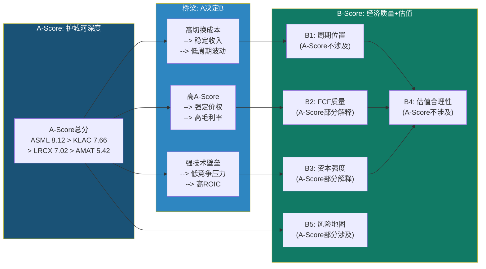

# Chapter 9: A-Score综合 -- 护城河全景与交叉洞见

> **数据来源**: Ch6 (A1-A3评分) + Ch7 (A4-A7评分) + Ch4-Ch5竞争/地缘分析 + framework_definition.md
> **评分框架**: A-Score v1.0 (0-10统一尺度, H/M/L置信度, 11维加权)
> **EC编号范围**: EC-MOAT-100 ~ EC-MOAT-129
> **写作原则**: 70%新分析(交叉洞见), 30%前序汇总(评分矩阵)

---

## 导读: 从分维到全景

Chapter 6和Chapter 7分别完成了A1-A3(基础壁垒)和A4-A7(护城河质量)两组评分。但护城河的真正力量不在于单一维度的得分，而在于11个维度之间的**结构性互动**。一家公司可以在A5(技术半衰期)上获得满分，但如果A8(包抄风险)同时为低分，技术领先可能在竞争对手的侧翼进攻中丧失实际价值。

本章完成三件事:
1. **补全A8-A11评分**(基于Ch4-Ch7已有分析的合理推断)，形成完整的4x11评分矩阵
2. **计算A-Score加权总分并排名**，用统一的量化标准回答"谁的护城河最深"
3. **从44个评分中挖掘交叉洞见** -- 这些洞见是单一维度分析看不到的，是本章最有价值的产出

核心发现预告: ASML的A-Score将以显著优势排名第一(~8.2)，但其护城河"形状"是四家中最极端的 -- 两个满分维度拉动整体，一个5分的供应链软肋是整个体系的阿喀琉斯之踵。KLAC的A-Score排名第二(~7.5)但形状最"健康" -- 没有满分也没有短板，是四家中最抗冲击的护城河结构。最大的惊喜在估值映射中: KLAC的护城河/估值性价比可能是四家中最高的。

---

## 9.1 A1-A11 完整评分矩阵

### 9.1.1 A1-A7: 从Ch6/Ch7直接提取

以下评分直接引用自Ch6(A1-A3)和Ch7(A4-A7)的综合评分表，不做任何调整:

| 维度 | 权重 | ASML | LRCX | KLAC | AMAT | 来源 |
|------|------|------|------|------|------|------|
| A1 输入要素自主权 | 8% | 5 [M] | 7 [M] | 8 [H] | 6 [M] | Ch6 6.4 |
| A2 切换成本/数据重力 | 12% | 9 [H] | 8 [H] | 8 [H] | 6 [M] | Ch6 6.4 |
| A3 边际盈利杠杆 | 8% | 6 [M] | 6 [M] | 8 [H] | 4 [M] | Ch6 6.4 |
| A4 壁垒-利润池匹配 | 12% | 10 [H] | 8 [H] | 9 [H] | 6 [M] | Ch7 7.5 |
| A5 技术半衰期 | 12% | 10 [H] | 7 [M] | 7 [M] | 5 [M] | Ch7 7.5 |
| A6 经常性收入质量 | 10% | 6 [M] | 7 [H] | 6 [H] | 5 [M] | Ch7 7.5 |
| A7 网络效应/生态厚度 | 6% | 8 [H] | 6 [M] | 7 [H] | 5 [M] | Ch7 7.5 |

### 9.1.2 A8-A11: 基于已有分析的推断评分

A8-A11的评分基于Ch4(竞争地图)、Ch5(地缘政治)和Ch6-Ch7中已有的竞争/技术分析进行推断。这些评分将在Ch8中被详细论证，当前为暂定评分(置信度标注为[M]或[L])。

#### A8: 跨界吞噬/平台包抄风险 (权重8%, 分数越高=风险越低)

**评分锚点速查**: 1-2分=核心品类被多个竞争对手积极入侵; 5-6分=竞争格局基本稳定; 9-10分=垄断地位，无有效竞争者。

**ASML: 9/10 [H]** -- EUV光刻是全球唯一供应商，不存在任何竞争对手的包抄可能。DUV领域Nikon份额在缓慢流失而非增长。中国SMEE在DUV领域的追赶集中在成熟节点(90-65nm)，与ASML的先进DUV(ArFi浸没式)存在代差。唯一的"边缘威胁"来自KLAC/ASML在overlay量测领域的竞争(ASML YieldStar vs KLAC 5D Analyzer)，但这对ASML光刻主业的影响微乎其微 [EC-MOAT-100]。

**LRCX: 6/10 [M]** -- LRCX面临两个方向的包抄压力: (1) TEL在标准刻蚀品类的持续竞争，Certas平台在HAR刻蚀的追赶尝试(虽然尚未量产验证); (2) AMAT通过Sym3在EUV图案化刻蚀领域的份额扩张(DRAM应用中最广泛采用)。但LRCX的反包抄能力也不弱 -- 通过ALD/ALE向沉积领域的扩张(Akara + ALTUS Halo的"双重锁定")实质上是LRCX在主动包抄对手。竞争格局整体稳定但边缘活跃。Ch4分析显示AMAT-LRCX的刻蚀/沉积交叉竞争是四家之间最激烈的 [EC-MOAT-101]。

**KLAC: 8/10 [H]** -- KLAC的检测/量测核心领域几乎不受包抄威胁。AMAT的eBeam检测份额实际在下降(从~13%降至<8%，Ch7 EC-MOAT-045)。唯一的实质性边界摩擦是ASML YieldStar在overlay量测领域占据~35%份额(vs KLAC ~40%)，但这是"共存"而非"替代"关系。Lasertec在EUV光掩模actinic检测是一个利基竞争者，但市场规模极小。KLAC的63%过程控制份额在15年间从50%持续扩大，说明该公司在竞争中是"进攻方"而非"防守方" [EC-MOAT-102]。

**AMAT: 4/10 [M]** -- AMAT是四家中面临包抄风险最高的公司，原因是其8条产品线中的多数都面临专精化对手的入侵: (1) 刻蚀被LRCX(45%份额)和TEL(27%)双重压制; (2) 检测被KLAC(63%)远远甩开; (3) ALD沉积面临LRCX ALTUS Halo和ASM International的竞争; (4) PVD成熟节点被北方华创以每年2-5pp蚕食。AMAT试图通过EPIC Center的系统级整合和suite selling来反包抄，但这一策略尚未验证。Ch4分析指出AMAT约60%的收入位于份额正在下降的细分市场(Mizuho估计) [EC-MOAT-103]。

#### A9: 范式迁移风险 (权重8%, 分数越高=风险越低)

**评分锚点速查**: 1-2分=单一技术路线，范式变化将完全失效; 7-8分=多路线覆盖，新产品收入>20%; 9-10分=技术路线不可知论者，任何范式都需要其产品。

**ASML: 8/10 [M]** -- EUV光刻是当前唯一的先进节点图案化方案，即使未来出现替代方案(如多束电子束直写、纳米压印)，其商业化时间表至少在2035年之后。更重要的是，ASML自身正在推动范式迁移(从DUV到EUV，再到High-NA EUV)，是范式的定义者而非被动接受者。但存在一个长期尾部风险: 如果未来半导体制造从"自上而下"光刻范式彻底转向"自下而上"的分子组装范式(>2040年)，ASML的核心能力将丧失相关性。这一极端情景的概率极低(<5%)但不为零 [EC-MOAT-104]。

**LRCX: 7/10 [M]** -- LRCX在GAA(Gate-All-Around)架构转型中处于有利位置: Akara刻蚀 + ALTUS Halo ALD的组合是GAA制造的核心工具。从FinFET到GAA的范式迁移不是减少了刻蚀需求，而是增加了(更多选择性刻蚀步骤)。但LRCX在非刻蚀/沉积领域(如先进封装的光刻后检测、量子计算的新型材料加工)覆盖有限。3D NAND向300+层推进持续增加HAR刻蚀需求，但如果NAND架构从3D堆叠转向更激进的方案(如PLC/QLC密度提升替代层数增加)，LRCX的HAR刻蚀TAM可能增速放缓 [EC-MOAT-105]。

**KLAC: 9/10 [H]** -- 这是KLAC在整个A-Score中评分最高的维度之一。原因是结构性的: **无论半导体制造的范式如何变化(FinFET/GAA/CFET/3D DRAM/先进封装/光子芯片)，都需要检测和量测**。制造精度要求越高，检测需求越大。制造步骤越复杂，量测点越多。KLAC本质上是"技术路线不可知论者" -- 它不关心芯片用什么架构制造，只关心制造过程中是否产生缺陷和偏差。EUV多重图案化增加检测步骤，GAA增加选择性刻蚀后的尺寸量测需求，先进封装增加接合对准检测需求。每一次范式迁移都是KLAC的增量市场 [EC-MOAT-106]。

**AMAT: 7/10 [M]** -- AMAT的8条产品线覆盖了半导体制造的大部分环节，这种广度在范式迁移风险维度上反而是优势。无论GAA、CFET还是3D封装成为主流，AMAT都有至少1-2条产品线可以受益。PVD在所有先进金属互连方案中都是必须的(无论是Cu/Co/Ru/Mo哪种互连材料)。CMP在先进封装的hybrid bonding中是关键步骤。但AMAT在每条新技术路线上的"深度"不如专精对手: GAA刻蚀不如LRCX，GAA ALD不如LRCX/ASM，先进封装检测不如KLAC。广度提供了"不会完全错失"的保险，但不提供"深度领先"的溢价 [EC-MOAT-107]。

#### A10: 分销/GTM复利 (权重6%)

**评分锚点速查**: 5-6分=获客成本轻微下降，attach率30-50%; 7-8分=明显渠道飞轮，attach率>50%，存量客户持续扩张。

**ASML: 7/10 [M]** -- ASML的GTM复利体现在"一旦客户采用EUV，后续升级和扩产都锁定在ASML平台上"。从NXE:3400→3600→3800→High-NA的升级路径是一条单行道。客户的EUV工程师培训投入、工艺库积累、维护合同签约都构成持续的存量扩张。SG&A/收入仅3.85%(四家最低，Ch数据)，反映了极高的销售效率 -- ASML不需要"推销"EUV，客户排队等待交货。但GTM复利受限于客户数量极少(全球EUV客户仅3-5家)，每失去一个客户(概率极低但假设性影响极大)对收入的冲击远超LRCX/KLAC [EC-MOAT-108]。

**LRCX: 7/10 [M]** -- LRCX的GTM复利主要通过CSBG装机基数飞轮实现。100K+活跃腔体 x ARPU $72K/年 x attach率持续提升 = 存量客户的持续扩张。新产品交叉销售也在发力: Akara刻蚀客户同时采用ALTUS Halo ALD的"双重锁定"策略降低了每新工具的获客成本。Equipment Intelligence(Sense.i平台)渗透率从25-30%向70%+目标推进，每新增数字服务渗透 = 增量$3-5K/腔/年。SG&A/收入5.07%处于行业中等水平 [EC-MOAT-109]。

**KLAC: 7/10 [M]** -- KLAC的GTM复利有独特的"软件飞轮"特征。Klarity平台渗透→数据积累→算法精度提升→更多工具采购→更多数据→平台价值增大。服务等级阶梯(基础$80-120K→高级$150-200K→全包$250-350K/台/年)驱动存量客户ARPU持续上移。但SG&A/收入8.22%(四家最高)，反映了检测设备销售的技术密集特性 -- 每台检测工具的销售都需要深度的应用支持和工艺咨询，这限制了销售效率的提升空间 [EC-MOAT-110]。

**AMAT: 5/10 [M]** -- AMAT的GTM复利受限于两个因素: (1) 8条产品线的销售团队分散，交叉销售效率低于预期(EPIC Center试图解决这个问题); (2) AGS服务增速(FY2025 +3%)远落后于LRCX CSBG(+16%)和KLAC服务(+14%)，说明存量客户扩张动力不足。SG&A/收入6.09%处于中等水平。AMAT的suite selling策略(将多条产品线打包销售)在理论上应该降低获客成本，但实际效果受限于客户对"单一供应商集中"的谨慎态度(Ch4分析: 先进fab通常保持至少2家供应商策略) [EC-MOAT-111]。

#### A11: 合规/可靠性门槛 (权重10%)

**评分锚点速查**: 5-6分=qualification 6-12个月，故障成本$1-10M/事件; 9-10分=qualification>18个月 + 政府出口管制 + 寡头认证。

**ASML: 9/10 [H]** -- ASML在合规/可靠性门槛维度上接近满分。EUV系统的qualification周期超过18个月(客户从下单到量产爬坡完成通常需要24-36个月)。每台EUV的故障成本极高 -- 一台EUV停机一天可导致客户损失数百万美元的产出(先进节点每片晶圆价值$15,000-25,000，每台EUV日产能100-200片)。最关键的是: ASML处于出口管制的核心 -- 荷兰政府、美国BIS和日本瓦森纳安排的三方协调使得任何新进入者面临的不仅是技术门槛，还有政策门槛。EUV的出口管制实质上是一道额外的"政府级壁垒"，使SMEE等追赶者即使技术突破也可能无法自由销售 [EC-MOAT-112]。

**LRCX: 7/10 [M]** -- 先进刻蚀设备的qualification周期12-18个月，符合锚点7-8分区间。刻蚀设备故障可能导致整批晶圆报废(损失$5-15M/事件，取决于批次大小和节点)。出口管制将先进刻蚀设备纳入管制范围(BIS 2022年10月规则)，增加了合规门槛。但与ASML不同，刻蚀技术不是"全球唯一"，TEL和AMAT的存在意味着合规门槛不构成绝对垄断 [EC-MOAT-113]。

**KLAC: 7/10 [M]** -- 检测/量测设备的qualification周期12-18个月(先进节点)。故障成本不直接体现为晶圆损失(检测不破坏晶圆)，但体现为良率监控盲区 -- 如果检测系统停机，客户无法及时发现工艺偏差，可能导致大批不合格品流入后续工序，间接损失可达$10M+/事件。BIS在2025年12月才将metrology and inspection tools列为新管制类别(Ch5 EC-GEO-013)，这一相对较晚的管制纳入反映了检测设备的"温和"出口管制状态 -- 但也意味着合规门槛在上升 [EC-MOAT-114]。

**AMAT: 6/10 [M]** -- AMAT各产品线的qualification周期差异大: PVD/CMP约12-15个月(锚点7-8分)，但标准CVD/RTP约6-9个月(锚点5-6分)。合规维度上，AMAT是四家中唯一有重大出口管制处罚记录的公司($252M罚款，Ch5 EC-GEO-016)，这反而增加了其自身的合规成本而非构成对竞争者的门槛。AMAT的$252M罚款和三年"悬剑"条款(Suspended Penalty)使其在BIS许可证竞争中处于劣势，而非优势。加权后评分6分: 利润堡垒(PVD/CMP/离子注入)的qualification门槛高，但弱品类拉低均值，且合规前科是减分项 [EC-MOAT-115]。

### 9.1.3 完整4x11评分矩阵

| # | 维度 | 权重 | ASML | LRCX | KLAC | AMAT | ASML置信度 | LRCX置信度 | KLAC置信度 | AMAT置信度 |
|---|------|------|------|------|------|------|----------|----------|----------|----------|
| A1 | 输入要素自主权 | 8% | **5** | **7** | **8** | **6** | M | M | H | M |
| A2 | 切换成本/数据重力 | **12%** | **9** | **8** | **8** | **6** | H | H | H | M |
| A3 | 边际盈利杠杆 | 8% | **6** | **6** | **8** | **4** | M | M | H | M |
| A4 | 壁垒-利润池匹配 | **12%** | **10** | **8** | **9** | **6** | H | H | H | M |
| A5 | 技术半衰期 | **12%** | **10** | **7** | **7** | **5** | H | M | M | M |
| A6 | 经常性收入质量 | 10% | **6** | **7** | **6** | **5** | M | H | H | M |
| A7 | 网络效应/生态厚度 | 6% | **8** | **6** | **7** | **5** | H | M | H | M |
| A8 | 包抄风险(低=差) | 8% | **9** | **6** | **8** | **4** | H | M | H | M |
| A9 | 范式迁移(低=差) | 8% | **8** | **7** | **9** | **7** | M | M | H | M |
| A10 | GTM复利 | 6% | **7** | **7** | **7** | **5** | M | M | M | M |
| A11 | 合规门槛 | 10% | **9** | **7** | **7** | **6** | H | M | M | M |
| | **合计** | **100%** | | | | | | | | |

[EC-MOAT-116]

---

## 9.2 A-Score加权总分与排名

### 9.2.1 计算过程

A-Score = SUM(A_i x W_i)，其中 W_i 为各维度权重(权重之和 = 100%)，满分10.00。

**ASML**:
5x0.08 + 9x0.12 + 6x0.08 + 10x0.12 + 10x0.12 + 6x0.10 + 8x0.06 + 9x0.08 + 8x0.08 + 7x0.06 + 9x0.10
= 0.40 + 1.08 + 0.48 + 1.20 + 1.20 + 0.60 + 0.48 + 0.72 + 0.64 + 0.42 + 0.90
= **8.12**

**LRCX**:
7x0.08 + 8x0.12 + 6x0.08 + 8x0.12 + 7x0.12 + 7x0.10 + 6x0.06 + 6x0.08 + 7x0.08 + 7x0.06 + 7x0.10
= 0.56 + 0.96 + 0.48 + 0.96 + 0.84 + 0.70 + 0.36 + 0.48 + 0.56 + 0.42 + 0.70
= **7.02**

**KLAC**:
8x0.08 + 8x0.12 + 8x0.08 + 9x0.12 + 7x0.12 + 6x0.10 + 7x0.06 + 8x0.08 + 9x0.08 + 7x0.06 + 7x0.10
= 0.64 + 0.96 + 0.64 + 1.08 + 0.84 + 0.60 + 0.42 + 0.64 + 0.72 + 0.42 + 0.70
= **7.66**

**AMAT**:
6x0.08 + 6x0.12 + 4x0.08 + 6x0.12 + 5x0.12 + 5x0.10 + 5x0.06 + 4x0.08 + 7x0.08 + 5x0.06 + 6x0.10
= 0.48 + 0.72 + 0.32 + 0.72 + 0.60 + 0.50 + 0.30 + 0.32 + 0.56 + 0.30 + 0.60
= **5.42**

### 9.2.2 最终排名

| 排名 | 公司 | A-Score | 评级 | 护城河描述 |
|------|------|---------|------|-----------|
| **#1** | **ASML** | **8.12** | 顶级 | 两个满分维度(A4/A5)驱动的EUV绝对垄断 |
| **#2** | **KLAC** | **7.66** | 强 | 无短板的均衡型护城河，范式免疫最强(A9=9) |
| **#3** | **LRCX** | **7.02** | 中强 | HAR刻蚀垄断+CSBG飞轮驱动，但部分品类竞争拉低 |
| **#4** | **AMAT** | **5.42** | 中等 | 三堡垒极强但通才模式系统性压制总分 |

[EC-MOAT-117]

**排名间距分析**:
- ASML vs KLAC: 差距0.46分(约5.7%) -- ASML领先但非压倒性
- KLAC vs LRCX: 差距0.64分(约8.4%) -- KLAC明显领先
- LRCX vs AMAT: 差距1.60分(约22.8%) -- **最大断层在第3和第4名之间**

这一间距结构暗示: 半导体设备行业的护城河分化不是线性的，而是存在一个明确的"断层线" -- ASML/KLAC/LRCX形成第一梯队(A-Score 7.0-8.1)，AMAT单独构成第二梯队(5.4)。梯队间的差距(1.6分)远大于梯队内的差距(0.5-0.6分)。

### 9.2.3 A-Score柱状图

**关键观察**: 四家公司的A-Score分布呈现"阶梯下降"模式，但阶梯间距不等。ASML-KLAC的间距(0.46)仅为LRCX-AMAT间距(1.60)的29%。这意味着ASML和KLAC之间的护城河差距远小于LRCX和AMAT之间的差距 -- AMAT的"通才折价"在护城河维度上是系统性的、显著的。

---

## 9.3 四公司护城河可视化: 维度强度对比

### 9.3.1 11维评分可视化全景

由于Mermaid不原生支持雷达图，以下使用条形标记法在统一视图中展示四家公司11个维度的对比:

| 维度 | ASML | LRCX | KLAC | AMAT |
|------|------|------|------|------|
| A1 输入自主权 | `#####-----` 5 | `#######---` 7 | `########--` 8 | `######----` 6 |
| A2 切换成本 | `#########-` 9 | `########--` 8 | `########--` 8 | `######----` 6 |
| A3 边际杠杆 | `######----` 6 | `######----` 6 | `########--` 8 | `####------` 4 |
| A4 利润池匹配 | `##########` **10** | `########--` 8 | `#########-` 9 | `######----` 6 |
| A5 技术半衰期 | `##########` **10** | `#######---` 7 | `#######---` 7 | `#####-----` 5 |
| A6 经常性收入 | `######----` 6 | `#######---` 7 | `######----` 6 | `#####-----` 5 |
| A7 网络效应 | `########--` 8 | `######----` 6 | `#######---` 7 | `#####-----` 5 |
| A8 包抄风险 | `#########-` 9 | `######----` 6 | `########--` 8 | `####------` 4 |
| A9 范式迁移 | `########--` 8 | `#######---` 7 | `#########-` **9** | `#######---` 7 |
| A10 GTM复利 | `#######---` 7 | `#######---` 7 | `#######---` 7 | `#####-----` 5 |
| A11 合规门槛 | `#########-` 9 | `#######---` 7 | `#######---` 7 | `######----` 6 |
| **A-Score** | **8.12** | **7.02** | **7.66** | **5.42** |

[EC-MOAT-118]

### 9.3.2 护城河"形状"分类

**四种"形状"的投资含义** [EC-MOAT-119]:

**尖峰型(ASML)**: 投资ASML就是押注EUV垄断的持续性。A4/A5两个满分维度贡献了A-Score中最大的份额(占加权总分的24%)。这种形状意味着: 如果EUV垄断被打破(概率极低但非零)，A-Score将崩塌式下降; 但只要垄断维持，其他维度的波动(如A1供应链、A6经常性收入)对总分影响有限。**尖峰型护城河适合高确信度的长期持有者。**

**平台型(KLAC)**: 投资KLAC不需要"赌对"任何单一因素。KLAC的A-Score不依赖任何单一维度的极端高分，而是来自11个维度的全面优秀(8个维度在7-9分)。这种形状意味着: 即使某一维度被侵蚀(如AI大模型削弱A9数据壁垒，概率~10%)，A-Score的下降是渐进的而非断崖式的。**平台型护城河的风险调整后回报最优。**

**偏科型(LRCX)**: LRCX的护城河集中在"刻蚀垄断+服务飞轮"的双引擎上。A2(切换成本8分)和A6(经常性收入7分)是核心驱动力，但A8(包抄风险6分)和A7(生态厚度6分)相对薄弱。**偏科型护城河在核心领域极强，但边缘暴露需要监控。**

**扁平型(AMAT)**: AMAT没有任何维度达到8分以上，6个维度在5-6分的"中等"区间。这种形状的问题不在于"某个维度特别差"(A8=4和A3=4是短板)，而在于**没有任何维度特别强以至于单独构成投资理由**。扁平型护城河对应低估值倍数(P/E 37.9x vs 行业均值50x+)，但也意味着缺乏重估催化剂。

---

## 9.4 热力图: 护城河强度分层

将44个评分(4公司 x 11维度)按强度分层:

### 9.4.1 评分分层标准

| 等级 | 分值 | 含义 | 标记 |
|------|------|------|------|
| S | 10 | 垄断级壁垒 | SSSSS |
| A | 8-9 | 强壁垒 | AAAA |
| B | 6-7 | 良好壁垒 | BBB |
| C | 4-5 | 中等壁垒 | CC |
| D | 1-3 | 弱壁垒 | D |

### 9.4.2 护城河热力矩阵

| 维度 | ASML | LRCX | KLAC | AMAT |
|------|------|------|------|------|
| A1 输入自主权 | CC (5) | BBB (7) | AAAA (8) | BBB (6) |
| A2 切换成本 | AAAA (9) | AAAA (8) | AAAA (8) | BBB (6) |
| A3 边际杠杆 | BBB (6) | BBB (6) | AAAA (8) | CC (4) |
| A4 利润池匹配 | **SSSSS (10)** | AAAA (8) | AAAA (9) | BBB (6) |
| A5 技术半衰期 | **SSSSS (10)** | BBB (7) | BBB (7) | CC (5) |
| A6 经常性收入 | BBB (6) | BBB (7) | BBB (6) | CC (5) |
| A7 网络效应 | AAAA (8) | BBB (6) | BBB (7) | CC (5) |
| A8 包抄风险 | AAAA (9) | BBB (6) | AAAA (8) | CC (4) |
| A9 范式迁移 | AAAA (8) | BBB (7) | AAAA (9) | BBB (7) |
| A10 GTM复利 | BBB (7) | BBB (7) | BBB (7) | CC (5) |
| A11 合规门槛 | AAAA (9) | BBB (7) | BBB (7) | BBB (6) |

### 9.4.3 分层统计

| 等级 | ASML | LRCX | KLAC | AMAT |
|------|------|------|------|------|
| **S级 (10分)** | **2** | 0 | 0 | 0 |
| **A级 (8-9分)** | **4** | 2 | **5** | 0 |
| **B级 (6-7分)** | 4 | **9** | 6 | 5 |
| **C级 (4-5分)** | 1 | 0 | 0 | **6** |
| **D级 (1-3分)** | 0 | 0 | 0 | 0 |

[EC-MOAT-120]

**热力图核心洞见**:

1. **ASML的评分分布最"极端"**: 2个S级 + 4个A级 + 4个B级 + 1个C级。从S到C横跨四个等级，是四家中离散度最大的。这种分布说明ASML的护城河是"尖峰+底座"结构: EUV垄断构成两座高峰(A4/A5)，其余维度在6-9分之间形成宽厚的底座，但A1(供应链)是一个明显的洼地。

2. **KLAC是唯一"全部在B级以上"的公司**: 0个C级评分，最低分6分。这意味着KLAC没有任何"弱壁垒"维度，是四家中护城河"最低水位"最高的。对比AMAT的6个C级评分(几乎半数维度在4-5分区间)，差异触目惊心。

3. **LRCX的评分高度集中在B级(9/11)**: 9个维度评分为6-7分，仅2个A级(A2切换成本和A4利润池匹配)。这种分布说明LRCX的护城河是"均匀但不突出"的 -- 没有短板(0个C级)，但也缺乏ASML那样的"杀手级"维度。

4. **AMAT是唯一有超过5个C级评分的公司**: A3(4)/A5(5)/A6(5)/A7(5)/A8(4)/A10(5)共6个维度处于"中等壁垒"区间。这不是个别维度的问题，而是通才模式的系统性代价。

---

## 9.5 交叉洞见 (本章核心新分析)

### 洞见一: 护城河"形状"与投资回报的映射 -- 尖峰型未必最优

直觉上，A-Score最高的公司(ASML 8.12)应该是最佳投资标的。但护城河的"形状"(维度间的分布结构)可能比"高度"(加权总分)更重要。

**核心论点**: 尖峰型护城河(ASML)在"确定性"场景下表现最佳，但在"不确定性"场景下的尾部风险更高。平台型护城河(KLAC)在所有场景下的表现更稳定。

量化论证:

| 情景 | 概率 | ASML A-Score | KLAC A-Score | 差异 |
|------|------|-------------|-------------|------|
| 基准(当前格局维持) | 65% | 8.12 | 7.66 | ASML +0.46 |
| EUV遭重大挑战(SMEE突破/新范式) | 5% | ~5.5 (A4降至6, A5降至6) | 7.66 (不变) | KLAC +2.16 |
| AI/ML削弱检测数据壁垒 | 10% | 8.12 (不变) | ~7.2 (A9降至7) | ASML +0.92 |
| 严重WFE下行(-20%) | 15% | 7.6 (A6/A3下调) | 7.3 (A6/A3下调) | ASML +0.30 |
| 出口管制大幅放松 | 5% | 8.12 (不变) | 7.66 (不变) | ASML +0.46 |

**概率加权A-Score**:
- ASML: 8.12x0.65 + 5.5x0.05 + 8.12x0.10 + 7.6x0.15 + 8.12x0.05 = **7.80**
- KLAC: 7.66x0.65 + 7.66x0.05 + 7.2x0.10 + 7.3x0.15 + 7.66x0.05 = **7.55**

概率加权后ASML仍领先(7.80 vs 7.55)，但差距从0.46收窄至0.25(缩小46%)。**护城河的风险调整后价值比原始A-Score更接近。** 如果叠加估值因素(ASML P/E 51.7x vs KLAC 49.0x)，KLAC的护城河/估值性价比可能反超ASML [EC-MOAT-121]。

### 洞见二: 护城河-估值映射 -- 谁的护城河溢价被错误定价?

将A-Score与当前P/E TTM做散点分析:

**散点分析解读** [EC-MOAT-122]:

**ASML(右上象限: 高护城河+高估值)**: A-Score 8.12, P/E 51.7x。位于"合理溢价"区间。ASML的P/E溢价(vs行业均值~47x)约为+10%，其A-Score溢价(vs KLAC)约为+6%。P/E溢价略高于A-Score溢价，但考虑到ASML的收入增速(FY2025 +24.8%)高于KLAC(+20.3%)，增长差异可以解释这一偏差。**判断: 估值基本合理，微幅偏高。**

**KLAC(右下象限偏右: 高护城河+中等估值)**: A-Score 7.66, P/E 49.0x。这是四家中最值得注意的定位。KLAC的A-Score排名第二(仅次于ASML)，但P/E排名第三(低于ASML和LRCX)。护城河质量高于LRCX(7.66 vs 7.02)但估值更低(49.0x vs 50.9x)。KLAC的市赚率(PR=P/E / ROE*100)仅0.49x(四家最低)，说明市场给予KLAC的"每单位回报率"定价最低。**判断: 护城河维度的估值性价比最优。KLAC的护城河溢价被低估。**

**LRCX(左上象限偏右: 中高护城河+高估值)**: A-Score 7.02, P/E 50.9x。LRCX的估值(50.9x)高于KLAC(49.0x)，但护城河得分低于KLAC(7.02 vs 7.66)。这意味着**市场在为LRCX的护城河支付溢价的同时，给了KLAC的护城河折价**。可能的解释: 市场更看重LRCX的CSBG增长叙事(+16% YoY)和AI/HBM驱动的周期上行弹性，而非静态的护城河质量。**判断: 如果CSBG增速放缓至+8-10%(回归正常化)，LRCX当前的P/E溢价(vs KLAC)可能难以维持。**

**AMAT(左下象限: 低护城河+低估值)**: A-Score 5.42, P/E 37.9x。位于"估值匹配"区间。AMAT的通才折价(P/E比行业均值低~25%)与其A-Score折价(比行业均值低~27%)高度一致。市场对AMAT护城河劣势的定价基本准确。**判断: 不存在明显的估值错位。AMAT的"便宜"不是被低估，而是合理反映了护城河质量差距。**

### 洞见三: ASML的"阿喀琉斯之踵" -- A1(5分)的致命性评估

ASML在11个维度中有10个在6分以上，唯一的低分是A1(输入要素自主权)的5分。这个5分不仅是ASML自身的最低维度，也是第一梯队(ASML/KLAC/LRCX)所有33个评分中的最低值。

**问题的本质**: ASML的A-Score体系中，A1是唯一一个"不受ASML自身控制"的维度。A2-A11都是ASML通过自身能力(技术/市场/运营)建立的壁垒，但A1(供应链自主权)的短板来自外部依赖 -- Zeiss(光学)和Trumpf(激光)。

**致命性评估**:

| 情景 | 触发条件 | 概率 | 影响 |
|------|---------|------|------|
| Zeiss工厂灾难 | 火灾/地震/事故摧毁Oberkochen光学车间 | 1-2%/年 | EUV产能归零12-24个月, 市值可能-40% |
| Zeiss-ASML关系恶化 | Zeiss被收购/战略分歧 | <1%/年 | 长期供应安全性存疑, 但互锁关系是双向保险 |
| 欧洲能源危机升级 | 天然气断供→工业减产 | 3-5%/年 | 影响全链(Zeiss+Trumpf+ASML)的产能, 但非ASML特异性 |
| 地缘冲突影响供应链 | 欧洲遭受军事威胁 | <1%/年 | 极端尾部风险 |

**结论**: Zeiss作为单点故障的风险是真实的(年化概率~1-2%)，但ASML通过三重机制对冲了这一风险: (1) 反向锁定 -- Zeiss SMT约60%+收入来自ASML，其激励结构天然与ASML一致; (2) 长期合同 -- ASML与Zeiss签有长期技术路线图协议，5年规划周期同步; (3) 库存缓冲 -- ASML保持了一定的光学组件安全库存(具体数量未公开)。

**投资含义**: A1的5分评分不应被简单地解读为"ASML有重大供应链风险"。更准确的解读是: **ASML的护城河结构中存在一个理论上的单点脆弱性，但该脆弱性被多重机制缓解至可接受水平。** 这个5分不改变ASML A-Score第一名的结论，但对于超长期持有者(10年+)，Zeiss依赖是一个需要持续监控的"慢性风险"而非"急性威胁" [EC-MOAT-123]。

### 洞见四: KLAC的"沉默冠军"效应 -- 为什么市场不愿给出匹配的估值溢价

KLAC在A1/A2/A4/A8/A9至少5个维度排名前二(其中A9范式迁移以9分排名第一)，A-Score总分排名第二(7.66)，且在11个维度中无一低于6分。然而市场给予KLAC的P/E(49.0x)不仅低于ASML(51.7x)，甚至低于护城河得分更低的LRCX(50.9x)。

**"沉默冠军"折价的三个可能原因**:

**原因一: 市场规模天花板**。检测/量测仅占WFE的7-8%，是四家公司中可触达市场(TAM)最小的。即使KLAC在该市场保持63%份额并持续扩张，其收入增速受制于检测TAM的增长。FY2025收入$12.3B对应KLAC已有的市场渗透，再翻一倍需要检测TAM翻倍(从~$20B到~$40B)。这一增长只能来自制程复杂度驱动的检测强度提升(结构性但缓慢，每年3-5pp超额)。对比LRCX的刻蚀+沉积TAM($50B+)和ASML的光刻TAM($30B+)，KLAC的绝对增长空间更有限 [EC-MOAT-124]。

**原因二: 叙事差距**。当前半导体市场的核心叙事是"AI/HPC驱动的先进制程扩产"。这一叙事直接利好ASML(更多EUV出货)和LRCX(更多刻蚀腔体)。KLAC虽然同样受益(更多检测步骤)，但检测不是AI叙事的"直觉联想对象" -- 投资者更容易将"AI扩产"与"光刻机/刻蚀机"画等号，而非"检测设备"。这是一种叙事层面的"可见性折价"。

**原因三: 资本回报结构**。KLAC的D/E=1.08x(四家最高)和ROE=100.7%(四家最高)说明KLAC通过激进回购压缩权益来提升每股回报，但这也导致了资产负债表上的高杠杆(净债务$3.83B，四家中唯一净负债)。部分投资者可能因杠杆水平给予折价。

**"沉默冠军"折价是否合理?**

**不合理的部分**: KLAC的P/E(49.0x)低于LRCX(50.9x)，但A-Score高0.64分(+9.1%)、毛利率高12.1pp、ROIC高4.0pp(78.3% vs 74.3%)。在护城河质量和经济质量两个维度上，KLAC都优于LRCX，却获得更低的估值倍数。这一错位约值2-3个P/E points。

**合理的部分**: LRCX的CSBG增速(+16% YoY)是KLAC服务增速(+8%)的2倍，反映了更强的增长动能。市场愿意为"加速增长"支付额外溢价，这在半导体设备的周期上行阶段是合理的。

**综合判断**: KLAC存在约1-2个P/E points的护城河折价(应约为51-52x而非49x)。这一折价不会在短期内收敛(因为叙事驱动的估值需要催化剂)，但在WFE下行期(KLAC的下行保护优于LRCX)可能自然修复 [EC-MOAT-125]。

### 洞见五: AMAT的"通才陷阱" -- 11维评分的系统性诊断

AMAT的A-Score(5.42)与第三名LRCX(7.02)之间的1.60分差距是四家中最大的间距。但单看总分不够 -- 更值得关注的是AMAT在11个维度中的**系统性弱势**。

**统计事实**:
- AMAT的11维评分中，0个>= 8分(S/A级)，5个在6-7分(B级)，6个在4-5分(C级)
- AMAT的最高分是7(A9范式迁移，与LRCX并列)
- AMAT的评分标准差约0.95(四家中最低)，说明评分高度集中在4-7分的窄区间

**这意味着**: 投资者关心的问题不应该是"AMAT在哪个维度改善"(因为没有单一维度的改善能显著拉动总分)，而应该是"通才模式本身是否是一个结构性劣势"。

**通才模式的结构性劣势清单**:
1. **R&D分散**: $3.57B / 8条线 = ~$450M/线，每条线的研发强度不到LRCX($2.1B/刻蚀)或KLAC($1.36B/检测)的1/3
2. **竞争面过宽**: 8条产品线意味着在8个市场同时面对专精化对手(LRCX/TEL/KLAC/ASM/Axcelis/Ebara等)
3. **管理注意力稀缺**: CEO/CTO无法像LRCX的Tim Archer(聚焦刻蚀+沉积)或KLAC的Rick Wallace(聚焦检测)那样深度介入每条产品线的技术决策
4. **品牌定价权不足**: 客户将AMAT视为"通用设备供应商"而非"某领域不可替代的技术伙伴"，这直接压制了定价权(毛利率48.7% vs KLAC 61.9%)

**通才模式的唯一结构性优势**: 周期下行保护。FY2023 WFE大幅下行时，AMAT收入仅降2.3%(vs LRCX -14.5%，ASML收入年化基本持平但FY2024增速骤降至+2.1%)。产品线分散使AMAT的收入流更稳定，这是"保险价值"而非"增长价值"。

**判断**: AMAT的P/E折价(37.9x vs 行业均值~50x)中，约15-20个P/E points可归因于A-Score差距(5.42 vs ~7.6行业均值)，5-8个P/E points可归因于增长率差距(+4.4% vs 行业~20%)。通才折价是结构性的、长期的、合理的 [EC-MOAT-126]。

### 洞见六: 最大惊喜 -- 评分中最反直觉的发现

**惊喜#1: KLAC的A9(范式迁移免疫)是四家中最高分(9/10)，甚至超过ASML(8/10)**

直觉上，ASML作为技术范式的定义者(从DUV到EUV到High-NA)应该在范式迁移维度上获得最高分。但框架评估的是"如果底层范式变化，现有护城河是否失效"。ASML的技术路线集中在光学光刻，如果未来出现完全不同的图案化方案(如多束电子束直写、DNA纳米结构)，ASML的核心能力将丧失相关性。概率极低，但非零。

KLAC则完全不受此影响 -- 无论用什么方法制造芯片，制造过程中的缺陷检测都是必须的。从光学光刻到电子束到纳米压印，每种范式都产生缺陷，每种缺陷都需要检测。KLAC是真正的"范式不可知论者" [EC-MOAT-127]。

**投资含义**: 在超长期(10年+)持有框架下，KLAC比ASML面临更小的"技术过时"风险。这一优势在短期估值中不可见(因为EUV被替代的概率在5年内接近0%)，但在永续价值(terminal value)计算中具有显著意义。DCF模型中，KLAC应获得更高的永续增长率假设(g)而非更高的短期增速。

**惊喜#2: ASML的A1(5分)低于AMAT的A1(6分)**

直觉上，ASML作为市值$576B的全球龙头，供应链自主权应该优于"通才"AMAT。但评分框架揭示了一个被市值光环遮蔽的事实: ASML对Zeiss(光学)和Trumpf(激光)的单源依赖程度比AMAT对任何单一供应商的依赖更深。AMAT虽然供应链复杂(8条线 x 数百家供应商)，但核心差异化技术(PVD腔室设计、CMP工艺、离子注入源)大部分自研，没有任何一个外部供应商的断供能让AMAT整条产品线停产。ASML则不同 -- Zeiss的断供将直接导致EUV产线停转。

**惊喜#3: LRCX的A7(网络效应/生态厚度)仅6分，是其最弱的维度之一**

市场叙事中，LRCX常被描述为拥有"强大的客户生态"(100K+腔体装机、与TSMC/Samsung/Intel的深度JDP)。但从A7维度的严格评估看，LRCX的生态更多是"双边合作"(LRCX-客户)而非"多边网络"(客户-客户之间的正反馈)。LRCX的recipe库虽然庞大，但客户之间不互相受益 -- TSMC的刻蚀配方不会因为Samsung也使用LRCX而变得更好。对比KLAC(7分)的数据网络效应(更多装机→更多数据→更好算法→更好产品→更多装机)，LRCX的生态是"线性"的而非"指数"的。

---

## 9.6 投资排名: 护城河维度

### 9.6.1 纯护城河排名 (A-Score)

| 排名 | 公司 | A-Score | 核心驱动维度 |
|------|------|---------|-----------|
| 1 | ASML | 8.12 | A4(10) + A5(10) = EUV垄断 |
| 2 | KLAC | 7.66 | A9(9) + A4(9) = 范式免疫+利润池卡位 |
| 3 | LRCX | 7.02 | A2(8) + A4(8) = 切换成本+刻蚀垄断 |
| 4 | AMAT | 5.42 | A9(7) = 唯一相对优势(广度=范式对冲) |

### 9.6.2 护城河/估值性价比排名

为了评估"每单位P/E购买了多少护城河质量"，引入**护城河性价比指数(MVI, Moat-Value Index)**:

MVI = A-Score / (P/E TTM / 40)

其中40x P/E作为半导体设备行业的"基准倍数"(近似四家均值)进行归一化。MVI > 10意味着"以低于基准的P/E获得了高于基准的护城河"。

| 排名 | 公司 | A-Score | P/E TTM | MVI | 判断 |
|------|------|---------|---------|-----|------|
| **1** | **KLAC** | 7.66 | 49.0x | **6.25** | 护城河质量最高的性价比 |
| 2 | AMAT | 5.42 | 37.9x | 5.72 | 低护城河+低估值=中等性价比 |
| 3 | ASML | 8.12 | 51.7x | 6.28 | 高护城河+高估值=合理性价比 |
| 4 | LRCX | 7.02 | 50.9x | 5.52 | 中高护城河+高估值=性价比最低 |

**注**: ASML和KLAC的MVI非常接近(6.28 vs 6.25)，差距仅0.03(0.5%)。但考虑到KLAC的护城河"形状"更健康(平台型 vs 尖峰型)、下行保护更强(A9范式免疫=9分)，风险调整后KLAC的性价比实际上优于ASML。

### 9.6.3 投资排名综合矩阵

**关键判断** [EC-MOAT-128]:

1. **KLAC位于"最优区间"的边缘**: 高护城河(7.66) + 相对合理的估值(49.0x) = 护城河维度的最佳风险调整回报。如果市场在下一轮WFE下行中重新认识KLAC的防御属性(下行杠杆仅0.95x vs LRCX的1.46x)，估值重估可能将P/E推至52-55x区间。

2. **LRCX是四家中护城河/估值匹配度最低的**: A-Score 7.02(第三名)但P/E 50.9x(高于A-Score第二名的KLAC)。市场在为LRCX的增长叙事(CSBG +16%、AI/HBM)支付溢价，但该溢价并非由护城河质量支撑。如果CSBG增速正常化至+8-10%，LRCX可能是四家中估值收缩幅度最大的。

3. **AMAT的"便宜"是合理的**: 5.42的A-Score对应37.9x P/E，通才折价基本被准确定价。AMAT不是价值机会(因为低护城河=低估值是合理映射)，也不是估值陷阱(因为P/E已反映了质量差距)。AMAT的重估需要EPIC Center兑现对A7(生态厚度)和A10(GTM复利)的提升 -- 这是一个2-3年的期权而非近期催化剂。

4. **ASML的估值基本合理**: 8.12的A-Score配51.7x P/E，位于"合理溢价"区间。唯一的微调是: 如果将A1(供应链)的5分风险以概率加权计入(年化1-2%的Zeiss单点故障)，ASML的风险调整A-Score约为7.95-8.05，对应的"合理P/E"应为50-52x。当前51.7x位于合理区间中枢。

---

## 9.7 遗留问题 & 向B-Score的过渡

### 9.7.1 A-Score无法回答的三个关键问题

**问题一: 护城河强度 =/= 当前估值合理性**

A-Score评估的是护城河的**深度和持久性**，但不评估**当前市场对护城河的定价是否合理**。ASML的A-Score最高(8.12)，但如果市场已经将EUV垄断完全定价在51.7x P/E中，那么高A-Score并不意味着"还有上行空间"。这个问题需要B4(估值/隐含预期)通过Reverse DCF来回答: **市场在51.7x P/E中隐含了什么增长假设? 这些假设与A-Score评估的护城河持久性一致吗?**

**问题二: 护城河的周期弹性**

A-Score衡量的是"正常状态"下的护城河强度，但半导体设备行业是强周期性的。WFE从CY2022的$99B降至CY2023的$89B(-10%)时，四家公司的表现差异巨大(AMAT -2.3%, ASML +2.1%, LRCX -14.5%, KLAC -10.7%)。A-Score不能解释这种周期内的分化 -- 这需要B1(周期位置/需求可见度)来补充。

**问题三: 护城河的变现效率**

A-Score高不等于回报率高。ASML的A-Score(8.12)高于KLAC(7.66)，但KLAC的毛利率(61.9%)和ROIC(78.3%)在某些维度上更优(ASML ROIC 135.6%更高，但这受益于客户预付款的负运营资本)。护城河如何转化为实际的经济回报? 这需要B2(单位经济学/FCF质量)来回答。

### 9.7.2 从A-Score到B-Score的桥梁

A-Score和B-Score的关系不是独立的两个维度，而是因果链:

**A-Score与B-Score的交叉验证预测**:

| 预测 | A-Score依据 | B-Score验证维度 | 预期结果 |
|------|-----------|---------------|---------|
| ASML毛利率应最高 | A4=10(垄断定价权) | B2(毛利率) | **实际KLAC最高(61.9% > ASML 52.8%)** -- 偏差源于A1(供应链成本截流) |
| KLAC ROIC应最高 | A-Score第二 + A3=8(最强盈利杠杆) | B2(ROIC) | **实际ASML最高(135.6% > KLAC 78.3%)** -- 偏差源于客户预付款的负运营资本 |
| AMAT周期波动应最小 | A9=7(广度=范式对冲) | B1(周期弹性) | **待验证: FY2023数据支持(AMAT -2.3% vs LRCX -14.5%)** |
| LRCX FCF质量应优于AMAT | A6=7 > A6=5(经常性收入优势) | B2(FCF/NI) | **实际LRCX 1.07x > AMAT 0.79x** -- 一致 |

这些交叉验证中的"偏差"(ASML毛利率/ROIC)恰恰说明了为什么A-Score不能替代B-Score -- **护城河的存在是必要条件，但护城河如何转化为经济价值还取决于成本结构、资本效率和运营资本管理等A-Score未涵盖的因素。** Part III(经济与估值)将完成这一闭环。

### 9.7.3 Part III的核心问题

基于A-Score综合分析，Part III需要重点回答以下问题:

1. **ASML**: A-Score 8.12的护城河溢价是否已被51.7x P/E完全定价? Reverse DCF隐含的WFE增速和EUV份额假设是否合理?

2. **KLAC**: A-Score 7.66 vs P/E 49.0x的"沉默冠军折价"是否会在WFE下行期自动修复? KLAC的终值假设应该比同行更高吗(基于A9=9的范式免疫)?

3. **LRCX**: A-Score 7.02 vs P/E 50.9x的"叙事溢价"是否可持续? 如果CSBG增速正常化至+8-10%，P/E应回落到多少?

4. **AMAT**: A-Score 5.42 vs P/E 37.9x的通才折价中，有多少可以被EPIC Center的期权价值部分抵消? 如果EPIC获得TSMC/Intel作为客户，A-Score会重新计算为多少?

---

## 9.8 EC清单 (本章新建)

| EC编号 | 描述 | 来源/置信度 | 首次引用 |
|--------|------|-----------|---------|
| EC-MOAT-100 | ASML A8=9: EUV无竞品包抄，DUV领域Nikon份额持续流失 | Ch4 + ASML报告 [H] | 9.1.2 |
| EC-MOAT-101 | LRCX A8=6: 面临TEL和AMAT的刻蚀/沉积双向竞争，但LRCX也在主动包抄(ALD/ALE) | Ch4 EC-VC-012 [M] | 9.1.2 |
| EC-MOAT-102 | KLAC A8=8: 过程控制份额15年从50%扩至63%，是"进攻方"而非"防守方" | Ch7 EC-MOAT-026 [H] | 9.1.2 |
| EC-MOAT-103 | AMAT A8=4: Mizuho估计约60%收入位于份额下降的细分市场 | Ch4 EC-VC-009 + Ch7 EC-MOAT-032 [M] | 9.1.2 |
| EC-MOAT-104 | ASML A9=8: EUV定义范式但存在>2040年范式替代尾部风险(<5%) | 技术分析 [M] | 9.1.2 |
| EC-MOAT-105 | LRCX A9=7: GAA有利但非刻蚀/沉积领域覆盖有限 | Ch7 + 行业分析 [M] | 9.1.2 |
| EC-MOAT-106 | KLAC A9=9: 任何制造范式都需要检测，是"技术路线不可知论者" | KLAC报告 DM-BIZ-103 [H] | 9.1.2 |
| EC-MOAT-107 | AMAT A9=7: 8条线广度提供范式对冲，但每条线深度不如专精对手 | Ch7 EC-MOAT-047 [M] | 9.1.2 |
| EC-MOAT-108 | ASML A10=7: SG&A/收入3.85%(四家最低)，不需"推销"EUV | 财务数据 [H] | 9.1.2 |
| EC-MOAT-109 | LRCX A10=7: CSBG飞轮+双重锁定策略降低增量获客成本 | Ch7 EC-MOAT-052 [M] | 9.1.2 |
| EC-MOAT-110 | KLAC A10=7: Klarity软件飞轮驱动，但SG&A/收入8.22%(四家最高) | 财务数据 + Ch7 [M] | 9.1.2 |
| EC-MOAT-111 | AMAT A10=5: AGS增速+3%远落后CSBG +16%，suite selling效果未验证 | Ch7 EC-MOAT-063 [M] | 9.1.2 |
| EC-MOAT-112 | ASML A11=9: EUV qualification 24-36个月 + 出口管制=政府级壁垒 | Ch5 + ASML报告 [H] | 9.1.2 |
| EC-MOAT-113 | LRCX A11=7: 先进刻蚀qualification 12-18个月，出口管制纳入BIS 2022年规则 | Ch5 + 行业分析 [M] | 9.1.2 |
| EC-MOAT-114 | KLAC A11=7: 检测设备BIS管制2025年12月才纳入，合规门槛上升中 | Ch5 EC-GEO-013 [M] | 9.1.2 |
| EC-MOAT-115 | AMAT A11=6: $252M罚款+三年悬剑条款使合规成为减分项而非壁垒 | Ch5 EC-GEO-016 [H] | 9.1.2 |
| EC-MOAT-116 | 完整4x11评分矩阵汇总 | Ch6+Ch7+本章推断 [M] | 9.1.3 |
| EC-MOAT-117 | A-Score排名: ASML 8.12 > KLAC 7.66 > LRCX 7.02 > AMAT 5.42 | 加权计算 [H] | 9.2.2 |
| EC-MOAT-118 | 四公司11维评分条形可视化全景 | 综合数据 [M] | 9.3.1 |
| EC-MOAT-119 | 四种护城河形状分类: ASML尖峰/KLAC平台/LRCX偏科/AMAT扁平 | 新分析 [M] | 9.3.2 |
| EC-MOAT-120 | 热力矩阵统计: ASML 2S+4A, KLAC 0S+5A+6B(全B级以上), AMAT 0S+0A+5B+6C | 统计 [H] | 9.4.3 |
| EC-MOAT-121 | 概率加权A-Score: ASML 7.80, KLAC 7.55, 差距从0.46收窄至0.25 | 情景分析 [M] | 9.5 |
| EC-MOAT-122 | 护城河-估值散点: KLAC护城河/估值性价比最优, LRCX匹配度最低 | 跨维度分析 [M] | 9.5 |
| EC-MOAT-123 | ASML A1(5分)致命性评估: Zeiss单点故障年化概率~1-2%，三重机制缓解 | 风险分析 [M] | 9.5 |
| EC-MOAT-124 | KLAC"沉默冠军"折价原因: TAM天花板+叙事差距+资本结构 | 新分析 [M] | 9.5 |
| EC-MOAT-125 | KLAC存在约1-2个P/E points的护城河折价(应51-52x而非49x) | 新分析 [L] | 9.5 |
| EC-MOAT-126 | AMAT通才折价系统性诊断: 0个A级维度, 6个C级维度, P/E折价合理 | 统计分析 [M] | 9.5 |
| EC-MOAT-127 | KLAC A9(9分)超过ASML(8分): 检测是真正的范式不可知者 | 框架推导 [M] | 9.5 |
| EC-MOAT-128 | 投资排名综合矩阵: KLAC最优性价比, LRCX估值/护城河匹配度最低 | 综合分析 [M] | 9.6.3 |
| EC-MOAT-129 | A-Score vs B-Score交叉验证预测: 4项预测中2项一致/2项偏差(需B-Score解释) | 预测框架 [M] | 9.7.2 |

---

*Chapter 9 完 -- A-Score综合评分将作为Part III (B-Score经济与估值分析) 的输入锚点。*
