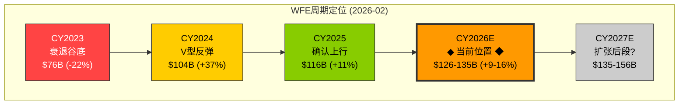
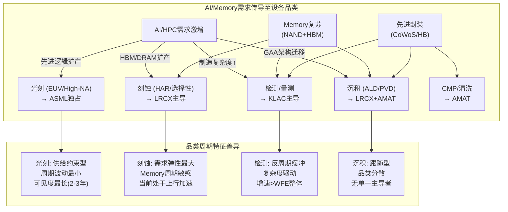
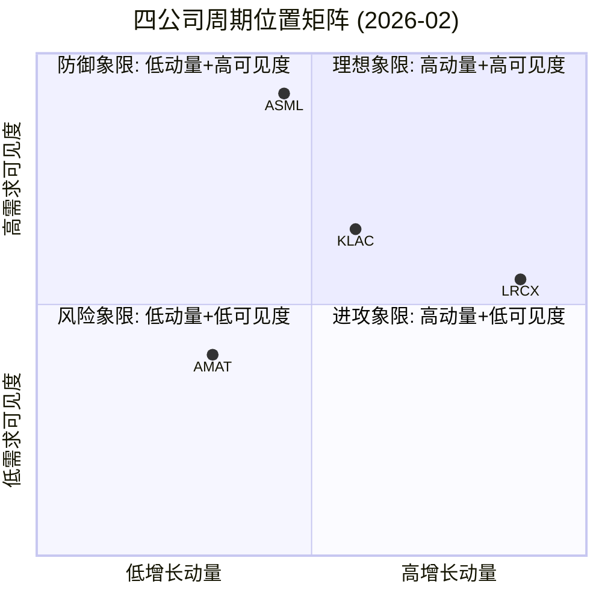

# Chapter 10: B1 周期位置与需求可见度

> **分析框架**: B1 — 当前处于WFE周期的什么位置？未来12-18个月需求可见度如何？
> **数据截止**: 2026-02-24 | **EC编号范围**: EC-CYC-001 ~ EC-CYC-030
> **交叉引用**: Ch3(WFE市场结构) + Ch4(价值链) + Ch6-Ch9(护城河评分)
> **核心论点**: WFE市场正处于AI驱动的结构性上行周期的**中段加速区**(非晚期泡沫),但四家公司在周期中的位置差异显著——LRCX处于最强动量窗口(三重正面信号/零负面),ASML拥有最长需求可见度(积压延伸至2027+),KLAC展现最强周期免疫力(检测需求粘性),而AMAT则面临"宽度陷阱"——品类广度未能转化为周期弹性。

---

## 10.1 WFE宏观周期定位 (L1-L3)

### 10.1.1 终端需求层 (L1): AI重构需求结构

半导体设备需求的终极驱动力来自终端市场。当前终端需求结构正在经历近二十年来最深刻的重构——AI/HPC从"增量补充"跃升为"主导引擎",而传统终端(Mobile/PC)从"需求底盘"降级为"背景噪音"。

**终端需求矩阵 (CY2025-CY2026E)**:

| 终端市场 | CY2025 设备需求贡献 | CY2026E 预期变化 | 对WFE的传导机制 | 置信度 |
|---------|-------------------|----------------|---------------|--------|
| **AI/HPC** | ~35-40% | +15-20% | Hyperscaler CapEx→TSMC先进制程→CoWoS/HBM扩产 | **高** |
| **存储(DRAM/NAND)** | ~25-28% | +12-15% | HBM3E/HBM4量产+DDR5渗透+NAND复苏 | **高** |
| **Mobile** | ~12-15% | +3-5% | 旗舰AP升级(3nm/2nm)+CIS像素缩放 | **中** |
| **Auto/工业** | ~8-10% | +5-8% | SiC/GaN功率器件+ADAS芯片+成熟节点扩产 | **中** |
| **IoT/边缘** | ~5-7% | +2-4% | RISC-V MCU+Wi-Fi 7+低功耗传感器 | **低** |
| **PC/服务器(非AI)** | ~5-8% | 0-3% | 换机周期温和+Windows 12预期 | **低** |

> **[EC-CYC-001]** AI/HPC对WFE的需求贡献从CY2023的~15-20%跃升至CY2025的~35-40%,两年间翻倍。这不是周期性波动,而是终端需求结构的永久性重塑。传导路径: 四大Hyperscaler(Amazon/Google/Microsoft/Meta)CY2026合计CapEx预计达$600B+(+36% YoY),其中约75%直接指向AI基础设施 [参见Ch3 3.1.2 EC-MKT-003]。每$100B数据中心投资,设备公司可捕获约$8B WFE支出。
> **置信度**: 高 | **来源**: AMAT/LRCX管理层指引 + Hyperscaler CapEx公开披露

这一结构性转变对四家设备公司的影响并不均等:

- **直接受益者**: LRCX(HBM刻蚀+先进NAND)和ASML(EUV产能扩张)处于AI需求传导链的最短路径上。HBM3E/HBM4的量产需要大量高深宽比(HAR)刻蚀和原子层沉积(ALD)步骤,这正是LRCX的核心战场。EUV光刻产能则是所有先进逻辑节点(3nm/2nm/A16)的硬瓶颈,ASML独占此入口。

- **间接受益者**: KLAC通过"检测强度系数"(Process Control Intensity)间接受益——先进节点每增加100步工艺,约需增加30-40步检测/量测,制造复杂度越高,KLAC的价值越大 [参见Ch7 A5]。AMAT在沉积(PVD金属互连)和CMP(hybrid bonding)环节参与AI供应链,但缺乏LRCX/ASML那样的"必经节点"优势。

**关键分歧**: AI需求的持续性。乐观派(SEMI/设备公司)认为AI CapEx处于"S曲线"的早期阶段,全球AI基础设施存量远未饱和;悲观派(部分买方分析师)则警告Hyperscaler CapEx增速将在CY2027-2028放缓至个位数,届时设备需求将面临"二阶导数转负"的周期性调整。两种情景对估值的影响差异巨大——前者支撑mid-cycle估值,后者暗示当前定价已计入peak earnings [EC-CYC-002]。

**AI需求传导的时间结构**: 从Hyperscaler的CapEx决策到设备公司的收入确认,存在一个3-4层的传导链,每层引入约3-6个月的延迟:

1. **T=0**: Hyperscaler决定扩建数据中心(CY2025 Q1-Q2已完成)
2. **T+3-6月**: 芯片设计商(NVDA/AMD/定制ASIC)向代工厂追加晶圆投片量
3. **T+6-12月**: 代工厂(TSMC/Samsung)启动扩产决策,下达设备订单
4. **T+12-18月**: 设备公司交付、安装、调试,确认收入

这意味着CY2025已决策的AI CapEx将在CY2026 H2至CY2027 H1集中转化为设备收入——四家管理层一致强调的"H2加权"指引与这一传导时间结构完全吻合。

**"超级周期"vs"传统周期延长"的量化区分**: 历史上WFE的传统周期呈3年上行+1-2年调整的规律(CY2016-2018上行→CY2019调整;CY2020-2022上行→CY2023调整)。如果当前周期是"传统周期延长",CY2027-2028应出现10-20%的调整(WFE从$135B回落至$110-120B);如果是"超级周期",CY2027-2028仍保持正增长(SEMI预测$145-156B)。区分两种情景的关键先行指标:

| 先行指标 | "超级周期"信号 | "传统周期延长"信号 | 当前状态 |
|---------|-------------|-----------------|---------|
| Hyperscaler CapEx增速 | 保持>20% YoY | 减速至<10% YoY | CY2026E +36%(超级周期) |
| NAND价格 | 持续上涨+扩产决策 | 价格见顶+产能充足 | 温和上涨中(中性) |
| EUV新订单 | 持续>€6B/季 | 回落至<€4B/季 | Q4 €13.2B(超级周期) |
| 中国WFE | 止跌企稳 | 持续下滑 | 仍在下降(传统周期) |
| 全球fab利用率 | 维持>90% | 回落至<85% | ~85-95%(超级周期) |

当前5个先行指标中3个指向"超级周期",1个指向"传统周期延长"(中国),1个中性(NAND)。综合权重后倾向"超级周期"但非压倒性——本报告给予60%概率于超级周期,40%于传统周期延长。

### 10.1.2 芯片厂CapEx层 (L2): TSMC一骑绝尘

终端需求通过芯片厂的资本支出决策传导至设备采购。当前CapEx格局呈现"一超多强"特征:

**主要芯片厂CY2026 CapEx指引**:

| 芯片厂 | CY2025 CapEx | CY2026E CapEx | YoY变化 | 主要投向 | 对WFE影响 |
|--------|-------------|---------------|---------|---------|---------|
| **TSMC** | ~$36-38B | **$52-56B** | **+37-47%** | 2nm/A16量产+CoWoS+亚利桑那 | **极强正面** |
| **Samsung** | ~$12-15B | ~$10-15B | 持平至微降 | HBM4+GAA 2nm试产+NAND恢复 | **中性偏正** |
| **Intel** | ~$20-22B | ~$18-22B | 持平 | 18A量产+Ohio新厂 | **中性** |
| **SK Hynix** | ~$10-12B | ~$12-14B | +10-15% | HBM4产能翻倍+清州封装厂 | **正面** |
| **Micron** | ~$9-11B | ~$10-12B | +5-10% | HBM3E/NAND扩产 | **正面** |
| **中国(合计)** | ~$38B | ~$32-36B | **-5-16%** | 成熟节点(28nm+)+DUV扩产 | **负面调整** |

> **[EC-CYC-003]** TSMC CY2026 CapEx指引为$52-56B,较CY2025大幅增长37-47%。这一数字超过Samsung和Intel CY2025 CapEx之和。TSMC单家公司的CapEx增量(~$16-18B)约等于全球WFE CY2025→CY2026的增量($116B→$135B的$19B),意味着TSMC几乎独力驱动了CY2026 WFE增长的80%以上。
> **置信度**: 高 | **来源**: TSMC 2026年1月法说会公开指引

> **[EC-CYC-004]** 中国WFE支出预计从CY2024峰值$50B下降至CY2025约$38B(-24%),CY2026进一步降至$32-36B(-5-16%)。下降原因: (1) CY2024抢装潮的需求透支; (2) 美国出口管制升级(2024年12月新规限制更多设备品类); (3) 部分成熟节点产能已建成,增量投资递减。但中国仍将是全球最大单一设备市场(占WFE ~28-31%)。
> **置信度**: 中 | **来源**: SEMI World Fab Forecast + AMAT管理层指引

**CapEx传导的时间差**: 芯片厂CapEx决策通常领先设备交付6-12个月。TSMC CY2026的$52-56B指引意味着设备订单在CY2025 H2已开始密集下达,而实际交付和收入确认集中在CY2026。这解释了为什么AMAT/LRCX管理层一致强调"CY2026收入将呈**后半年加权**(H2 weighted)"——不是需求疲软,而是fab洁净室空间的物理准备进度决定了设备安装节奏。

对四家公司的差异化影响:

1. **ASML**: TSMC是ASML最大客户(估计占收入30-35%)。TSMC CapEx大幅增长直接转化为EUV/DUV设备订单。但ASML的收入确认受限于系统安装和验收的复杂流程(通常交付后3-6个月),因此TSMC CY2026 CapEx的WFE拉动效应在ASML报表上可能延迟至CY2026 H2-CY2027 H1才充分体现。

2. **LRCX**: 直接受益于TSMC先进制程扩产(更多刻蚀/ALD步骤)和存储厂商HBM/NAND恢复。LRCX管理层指引CY2026 WFE达$135B,SAM份额从mid-30s%向high-30s%推进——隐含LRCX CY2026收入可增长至$22-24B区间。

3. **KLAC**: 受益于所有先进节点扩产(检测需求与工艺复杂度正相关),但对中国CapEx下降的敏感度低于AMAT(KLAC中国收入占比较低,约20% vs AMAT的27-30%)。

4. **AMAT**: 最复杂的受益格局。一方面受益于TSMC扩产(PVD/CMP/离子注入),另一方面受损于中国CapEx下降(AMAT中国收入占比Q1FY26达30%,四家中最高)。净效应取决于先进节点增量能否抵消中国减量——管理层预期半导体设备业务CY2026增长>20%,暗示答案为"是"[EC-CYC-005]。

### 10.1.3 WFE总量层 (L3): 第四年连续增长

综合L1和L2的传导,全球WFE市场规模预测如下:

**WFE市场规模与增速 (CY2021-CY2027E)**:

| 年份 | WFE规模 | YoY增速 | 驱动因素 | 周期阶段 |
|------|---------|---------|---------|---------|
| CY2021 | ~$90B | +38% | 全面扩产(逻辑+存储+成熟) | 加速上行 |
| CY2022 | ~$98B | +9% | 峰值区间,NAND冻结 | 顶部盘整 |
| CY2023 | ~$76B | -22% | NAND冻结+库存调整 | 衰退期 |
| CY2024 | ~$104B | +37% | AI复苏+中国抢装 | V型反弹 |
| CY2025E | ~$116B | +11% | Memory复苏+AI CapEx扩张 | **中段加速** |
| CY2026E | ~$126-135B | +9-16% | GAA量产+HBM扩张+NAND回暖 | **扩张中段** |
| CY2027E | ~$135-156B | +7-15% | 先进封装成熟+持续扩产 | 扩张后段(?) |

[参见Ch3 3.1.1完整历史数据]

> **[EC-CYC-006]** WFE市场正经历自CY2024起的第四年连续增长(2024→2025→2026E→2027E),这在近30年历史中前所未有。此前最长的连续上行周期为CY2016-2018(三年),随后即进入CY2019的-19%调整。当前周期已超越历史极限,核心问题是: 这是AI驱动的"结构性超级周期"还是被AI延长的"传统周期的晚期"?
> **置信度**: 中 | **来源**: SEMI多次修订预测 + 历史周期数据

**关键数据分歧需要标注**: 对CY2026E WFE规模,不同来源存在显著差异:
- **SEMI** (2025年12月预测): WFE ~$126B(总设备$145B,WFE占约87%)
- **LRCX管理层** (2026年1月法说会): WFE ~$135B
- **Gartner** (2025年Q3预测): WFE ~$120B(最保守)
- **综合估算**: $126-135B区间,取中值~$130B作为基准假设

分歧的根源在于对中国WFE和NAND复苏幅度的判断。SEMI和LRCX更乐观(NAND设备+12.7% YoY),Gartner则对中国需求下降和NAND复苏持谨慎态度。本报告采用$126-135B区间,并在估值章节对两端进行敏感性分析。

**周期位置判断: 中段加速区**

综合L1-L3分析,当前WFE周期位置的判断为**中段加速区(mid-cycle acceleration)**,理由如下:

1. **不是早期**: CY2024已经是反弹年(+37%),CY2025进一步增长(+11%),价量已充分确认上行趋势。
2. **不是晚期/峰值**: (a) TSMC CapEx指引$52-56B创历史新高且增速加快(而非减速); (b) HBM/先进封装等新品类TAM仍在快速扩张; (c) NAND设备支出从低谷恢复,增量空间仍大; (d) 全球fab利用率普遍在85%+(先进节点>95%),未出现过剩信号。
3. **中段加速的特征符合**: 增速从V型反弹(+37%)降至稳健扩张(+9-16%),新驱动力(GAA/HBM4/先进封装)接棒旧驱动力(中国抢装),行业盈利能力持续改善但未达极端峰值。

**对投资判断的影响**: 中段加速区意味着四家公司的收入仍有上行空间,但估值需要谨慎——市场可能已经部分定价了CY2026-2027的增长预期(P/E TTM: AMAT 37.9x, LRCX 50.9x, ASML 51.7x, KLAC 49.0x)。关键风险是"中段"是否会被突发因素(地缘冲突、AI泡沫破裂、存储价格暴跌)提前终结。

---

## 10.2 设备品类周期差异 (L4)

### 10.2.1 光刻: 供给约束型周期

光刻设备市场呈现与其他品类截然不同的周期特征——**需求永远超过供给,周期波动来自ASML的产能释放节奏而非终端需求变化**。

**光刻市场结构 (CY2025-CY2026E)**:

| 细分品类 | CY2025E规模 | CY2026E规模 | YoY | 竞争格局 |
|---------|-----------|-----------|-----|---------|
| EUV (0.33NA) | ~$14-16B | ~$16-18B | +10-15% | ASML 100% |
| High-NA EUV (0.55NA) | ~$1.5-2B | ~$3-4B | +80-100% | ASML 100% |
| ArFi浸没式(先进DUV) | ~$7-8B | ~$7-8B | 持平 | ASML ~85%, Nikon ~15% |
| KrF/i-line(成熟DUV) | ~$4-5B | ~$3-4B | -10-20% | ASML ~60%, Nikon ~25%, Canon ~15% |
| **合计** | ~$28-30B | ~$30-33B | +6-10% | ASML ~90%+ |

> **[EC-CYC-007]** 光刻市场的周期特征是"供给驱动型"——ASML的EUV年产能约60-70台(2025),计划扩至2026年的约75-90台。需求端(TSMC/Samsung/Intel/SK Hynix的EUV采购意愿)远超供给。周期波动因此主要取决于ASML的交付排产,而非客户是否"想买"。这使得ASML在WFE下行周期中具有天然的缓冲——即使其他品类需求下降,EUV积压订单的消化也能维持收入。
> **置信度**: 高 | **来源**: ASML Q4 2025法说会 + 产能公开披露

High-NA EUV是CY2026最大的增量看点。Q4 2025 ASML已确认两台High-NA系统的收入确认,CY2026预计交付4-6台(每台约$3.5亿)。High-NA对光刻TAM的扩张效应不容忽视——从CY2025的~$1.5-2B到CY2028E可能达$8-10B,这是一个全新的利润池。

### 10.2.2 刻蚀与沉积: AI/Memory双轮驱动

刻蚀和沉积是WFE中规模最大的两个品类(合计~45-46%),也是受AI/Memory需求拉动最直接的领域。

**刻蚀/沉积品类动态**:

| 品类 | CY2025E | CY2026E | 增长驱动 | 主要受益者 |
|------|---------|---------|---------|----------|
| 导体刻蚀(HAR) | ~$10-11B | ~$12-13B | 3D NAND 300+层/HBM TSV | **LRCX**(Akara平台) |
| 电介质刻蚀 | ~$8-9B | ~$9-10B | GAA选择性刻蚀+EUV图案化 | LRCX/TEL/AMAT |
| ALD/CVD沉积 | ~$12-14B | ~$14-16B | GAA high-k/metal gate+HBM金属层 | LRCX(ALTUS)/AMAT/TEL |
| PVD金属沉积 | ~$6-7B | ~$7-8B | 先进互连(Cu/Co/Ru)+封装bump | **AMAT**(~85%份额) |
| 电镀(ECD) | ~$3-4B | ~$4-5B | 先进封装Cu pillar/RDL | AMAT/Lam |

> **[EC-CYC-008]** LRCX在刻蚀品类中拥有~45%份额(vs TEL ~27%, AMAT ~15%),且份额在CY2024-2025持续扩大。驱动力来自两个方向: (1) 3D NAND向200-300+层推进,高深宽比(HAR)刻蚀需求呈指数级增长——每增加100层NAND,刻蚀步骤增加约15-20%,而LRCX的Akara平台在HAR刻蚀中拥有技术代差; (2) GAA架构(TSMC N2/Intel 18A)引入更多选择性刻蚀步骤,LRCX的原子层刻蚀(ALE)在此领域领先。
> **置信度**: 高 | **来源**: LRCX法说会 + 行业产能数据

> **[EC-CYC-009]** ALD沉积正在成为半导体设备中增速最快的子品类之一。GAA架构中的high-k/metal gate需要原子级精度的薄膜沉积,传统CVD无法满足。LRCX的ALTUS Halo ALD和AMAT的Centura ALD是该领域的主要竞争者。CY2025-2028 ALD设备的CAGR预计达12-15%,远超WFE整体的7-10%。
> **置信度**: 中 | **来源**: 行业共识估算

### 10.2.3 检测/量测: 复杂度红利

检测和量测设备是WFE中"反周期性"最强的品类——当芯片制造出问题时,检测需求不降反升;当制造复杂度增加时,检测需求加速增长。

**检测/量测品类动态**:

| 细分 | CY2025E | CY2026E | 增长驱动 | 受益者 |
|------|---------|---------|---------|--------|
| 光学检测(明场/暗场) | ~$5-6B | ~$5.5-6.5B | EUV缺陷捕获+封装检测 | **KLAC**(>70%份额) |
| 电子束检测 | ~$1.5-2B | ~$1.8-2.2B | GAA工艺偏差监控 | KLAC/AMAT/Hitachi |
| 量测(OCD/CD-SEM) | ~$3-4B | ~$3.5-4.5B | 先进节点尺寸控制+overlay | **KLAC**/ASML |
| 光掩模检测 | ~$1-1.5B | ~$1.2-1.8B | EUV掩模actinic检测 | KLAC/Lasertec |
| 封装检测 | ~$1-1.5B | ~$1.5-2B | 先进封装良率提升 | KLAC/KES |
| **合计** | ~$13-15B | ~$15-17B | +10-15% | KLAC ~63% |

> **[EC-CYC-010]** KLAC的"检测强度系数"(Process Control Intensity,即检测/量测设备支出占WFE的比例)在过去10年从约10%持续提升至约13-14%,预计CY2026-2028将进一步升至14-15%。驱动力: (1) 先进节点工艺步骤数增加(FinFET ~350步→GAA ~400-600步),每增加100步工艺约需30-40步检测; (2) EUV引入新的缺陷类型(stochastic defects),需要更灵敏的检测工具; (3) 先进封装的良率管理成为瓶颈(CoWoS/hybrid bonding的对准精度要求<1μm)。检测强度系数的持续提升意味着KLAC的增速可以**结构性地快于WFE整体增速**。
> **置信度**: 高 | **来源**: KLAC历史收入/WFE比值+管理层长期指引

### 10.2.4 品类周期差异的投资含义

品类间的周期差异对四家公司产生截然不同的影响:

**关键结论**: AI驱动的需求并非均匀地分配到所有设备品类。光刻受益于"入口瓶颈"效应(ASML),刻蚀受益于"复杂度乘数"效应(LRCX),检测受益于"品质守门"效应(KLAC),而沉积/CMP等品类因竞争分散,受益程度被稀释(AMAT)。这一品类差异是理解四家公司周期弹性差异的关键 [EC-CYC-011]。

---

## 10.3 四公司周期位置个体分析

### 10.3.1 AMAT: "宽度陷阱"中的温和复苏

**季度收入趋势分析**:

| 季度 | 收入($B) | QoQ | YoY | 毛利率 | 营业利润率 |
|------|---------|-----|-----|--------|----------|
| Q1 FY2025 (Jan'25) | 7.17 | +1.7% | +7.2% | 48.9% | 29.0% |
| Q2 FY2025 (Apr'25) | 7.10 | -1.0% | +5.5% | 49.1% | 29.4% |
| Q3 FY2025 (Jul'25) | 7.30 | +2.8% | +2.8% | 48.8% | 29.1% |
| Q4 FY2025 (Oct'25) | 6.80 | -6.8% | -3.5% | 48.0% | 27.9% |
| **Q1 FY2026 (Jan'26)** | **7.01** | **+3.1%** | **-2.2%** | **49.0%** | **29.9%** |
| Q2 FY2026E (Apr'26) | ~7.65 | +9.1% | +7.7% | ~49% | ~30% |

> **[EC-CYC-012]** AMAT的收入轨迹呈现"低增长+高波动"的特征。FY2025全年收入$28.37B仅增长+4.4% YoY,远低于LRCX(+23.7%)和KLAC(+23.9%)。Q4 FY2025出现环比-6.8%的突然下滑,随后Q1 FY2026温和回升+3.1%但YoY仍为-2.2%。增长乏力的根本原因并非市场需求不足,而是AMAT的"品类暴露度"问题: (1) 中国收入占比30%(四家最高),中国CapEx下降直接拖累; (2) PVD/离子注入等成熟品类增速低于WFE整体; (3) 在增速最快的品类(HAR刻蚀/EUV光刻)中缺乏领导地位。
> **置信度**: 高 | **来源**: AMAT季度财报 + 管理层Q1 FY2026法说会

**但转折信号已出现**: AMAT管理层在Q1 FY2026法说会上给出两个关键前瞻指引:
1. Q2 FY2026指引$7.65B(±$500M),隐含中值环比+9.1%——如果实现,将是FY2025以来最强的单季环比加速。
2. 半导体设备业务CY2026增长>20%——这一指引远高于WFE整体增速(+9-16%),暗示AMAT正在从非中国市场获取增量份额,或新产品(Centura Sculpta EUV图案化/EPIC整合方案)开始贡献收入。

**毛利率信号**: Q1 FY2026毛利率49.0%环比回升100bps(从Q4的48.0%),但仍低于FY2024水平(48.7%全年)。TTM毛利率48.72%是四家中最低,反映了产品组合中成熟品类占比较高的结构性约束。

**积压与订单**: AMAT Q4 FY2025报告积压订单约$15.0B,其中约31%(~$4.7B)预计无法在12个月内交付。Book-to-bill约为1.0x(订单与交付大致平衡),表明当前处于"消化积压+承接新单"的平稳状态,而非LRCX那样的加速增长态势。无重大取消订单信号 [EC-CYC-013]。

**中国风险敞口**: Q1 FY2026中国收入占比30%(合并半导体系统+AGS),半导体系统单项中国占比27%。YoY中国收入下降7%,但管理层预期CY2026中国WFE总支出将进一步下降。如果中国占比从30%降至25%,而非中国业务增长20%+,AMAT总体增速可达~12-15%——这仍然低于LRCX/KLAC的预期增速。

**5年收入增长走廊对比**: AMAT的4年CAGR仅+5.3%(FY2021-FY2025),远低于KLAC(+15.1%)、ASML(+13.9%)甚至LRCX(+5.9%,因FY2023 NAND冻结拖累)。如果排除中国因素进行"pro forma"测算: 假设中国收入占比从30%降至25%,非中国收入增长20%,则AMAT CY2026总收入约$32-33B(vs FY2025 $28.4B,+13-16%)——更接近但仍低于LRCX和KLAC的增速。

**AMAT的反周期牌**: 尽管当前增长乏力,AMAT拥有两张其他公司没有的"反周期牌":
1. **AGS服务收入底盘**: FY2025 AGS收入约$6.2B(占总收入22%),虽增速仅+3%(远低于LRCX CSBG的+16%),但提供了一个稳定的收入底线。在WFE下行周期中,AGS的稳定性可以部分抵消系统设备收入的下滑。
2. **品类分散的风险对冲**: AMAT在8条产品线(PVD/CVD/刻蚀/CMP/离子注入/热处理/光学检测/ALD)上的分散布局意味着任何单一品类的衰退不会致命——当NAND刻蚀需求下降时,Auto/Power的离子注入需求可能上升。这种"自然对冲"在下行周期中有价值,但在上行周期中反而拖累(最强品类的涨幅被弱品类稀释)。

**周期位置判断**: AMAT处于**温和复苏的早期**——收入已触底但弹性不足。中国敞口的拖累效应和品类结构的劣势意味着AMAT在本轮WFE上行周期中的弹性系数(即收入增速/WFE增速)可能<1.0,这在历史上是罕见的——AMAT通常是WFE的1.0-1.2x beta。管理层的>20% CY2026增长指引如果兑现,将标志着AMAT重新回归历史beta——但这需要CY2026 H2的强劲交付来验证,目前仍处于"承诺阶段"而非"交付阶段"。

### 10.3.2 LRCX: 六连加速的动量之王

**季度收入趋势分析**:

| 季度 | 收入($B) | QoQ | YoY | 毛利率 | 营业利润率 |
|------|---------|-----|-----|--------|----------|
| Q1 FY2025 (Sep'24) | 4.10 | +7.9% | +19.3% | 48.0% | 30.8% |
| Q2 FY2025 (Dec'24) | 4.49 | +9.5% | +24.2% | 48.5% | 31.2% |
| Q3 FY2025 (Mar'25) | 4.70 | +4.7% | +23.1% | 48.8% | 32.5% |
| Q4 FY2025 (Jun'25) | 5.30 | +12.8% | +20.7% | 49.2% | 34.0% |
| Q1 FY2026 (Sep'25) | 5.22 | -1.5% | +27.3% | 49.5% | 33.5% |
| **Q2 FY2026 (Dec'25)** | **5.34** | **+2.3%** | **+18.9%** | **49.6%** | **33.9%** |
| Q3 FY2026E (Mar'26) | ~5.7 | +6.7% | +21.3% | ~49% | ~34% |

> **[EC-CYC-014]** LRCX展现了四家公司中最强的增长动量: 连续6个季度YoY增速维持在+18-27%区间,从Q1 FY2025的$4.10B到Q2 FY2026的$5.34B,累计增长30%。更重要的是,这一增长伴随着毛利率的同步提升(从48.0%到49.6%,+160bps)——"营收与毛利共振"信号触发(领先指标分析中的最强组合)。三重正面信号(营收毛利共振+经营杠杆释放+存货效率提升)叠加零负面信号,使LRCX成为四家中唯一处于"全面上行"状态的公司。
> **置信度**: 高 | **来源**: LRCX季度财报序列

**增长驱动力解构**:

1. **Memory复苏 (~40%贡献)**: NAND从CY2023低谷强劲回升,3D NAND向200+层推进拉动HAR刻蚀需求。HBM3E/HBM4量产带动DRAM设备需求(TSV刻蚀+金属沉积)。LRCX在存储设备中的份额高于逻辑设备——Memory复苏对LRCX是"不成比例的利好"。

2. **先进逻辑扩产 (~35%贡献)**: TSMC 3nm/2nm和Samsung GAA产线建设,选择性刻蚀和ALD步骤增加。Akara平台在GAA刻蚀中的技术领先正在转化为份额扩张。

3. **CSBG装机基数飞轮 (~25%贡献)**: ~100K活跃腔体,ARPU $72K/年,FY2025 CSBG收入增长+16%。每新增一台设备扩大装机基数,未来服务收入自动增长——这是一个自我强化的增长引擎 [参见Ch7 A6]。

**Q3 FY2026前瞻指引**: 收入$5.7B(±$300M),毛利率~49%,EPS $1.35(±$0.10)。中值$5.7B将创LRCX季度收入历史新高,环比+6.7%,确认增长动量延续。

**SAM份额扩张目标**: LRCX管理层明确表示CY2025 SAM份额在mid-30s%(约35%),目标向high-30s%(38-39%)推进。如果WFE CY2026达$130B,LRCX的SAM(刻蚀+沉积+清洗)约$60-65B,38-39%份额隐含$23-25B收入——较FY2025的$18.4B增长25-36% [EC-CYC-015]。

**递延收入信号**: Q2 FY2026递延收入$2.25B,环比下降$500M(高级预付款减少)。这不是负面信号——递延收入下降通常意味着此前预付的订单正在加速交付和确认收入,是"积压转化为收入"的健康表现。

**LRCX的周期风险: Memory依赖的双刃剑**

LRCX的高增长动量有一个需要正视的脆弱点: **Memory收入占比约50-55%**(vs AMAT ~30%, KLAC ~40%, ASML ~25-30%)。在Memory上行周期中,这一暴露度是增长加速器;但如果Memory周期意外反转(NAND/DRAM价格暴跌→厂商冻结CapEx),LRCX将遭受最大冲击。

历史先例佐证这一风险: CY2022-2023的NAND CapEx冻结导致LRCX FY2024收入从$17.4B暴跌至$14.9B(-14.5%),跌幅远超KLAC(仅从$10.5B降至$9.8B,-6.7%)和AMAT(从$26.5B降至$27.2B,+2.6%)。LRCX的周期Beta在下行中是一把双刃剑——上行1.3-1.5x,下行也可能是1.3-1.5x。

但当前与CY2022-2023的关键差异在于: (1) NAND正从低谷恢复而非高位回落; (2) HBM是结构性新增量(非周期性); (3) CSBG装机基数从~85K扩大至~100K,服务收入缓冲更厚。这些因素降低了CY2026-2027 Memory周期突然反转的概率,但不能完全排除。

**周期位置判断**: LRCX处于**上行加速的最佳窗口期**——Memory复苏提供短期弹性,GAA架构迁移提供中期增量,CSBG飞轮提供长期稳定性。在四家公司中,LRCX是周期Beta最高的公司(收入增速显著超过WFE增速),这在上行周期中是优势,但在未来下行周期中可能成为劣势。投资者需要评估: 在CY2026-2027的时间窗口内,高Beta带来的超额收益是否足以补偿潜在的尾部风险。

### 10.3.3 ASML: 爆发式交付背后的节奏不均

**季度收入趋势分析** (欧元计价):

| 季度 | 收入(€B) | QoQ | YoY | 毛利率 | 营业利润率 |
|------|---------|-----|-----|--------|----------|
| Q1 FY2025 (Mar'25) | 6.67 | -11.9% | +21.6% | 49.4% | 28.3% |
| Q2 FY2025 (Jun'25) | 7.61 | +14.1% | +18.3% | 52.0% | 33.4% |
| Q3 FY2025 (Sep'25) | 7.47 | -1.8% | +11.9% | 51.7% | 32.7% |
| **Q4 FY2025 (Dec'25)** | **9.63** | **+28.9%** | **+23.6%** | **52.1%** | **35.3%** |

> **[EC-CYC-016]** ASML的季度收入波动性是四家中最大的——Q4 FY2025的€9.63B比Q1的€6.67B高出44%。这不是需求波动,而是ASML商业模式的固有特征: EUV系统(单台$1.5-2亿)的交付、安装和收入确认是"阶梯式"的,年末通常出现集中交付。Q4的两台High-NA系统(合计约€7亿)收入确认进一步放大了季节性。投资者需要看年度趋势而非季度波动。
> **置信度**: 高 | **来源**: ASML Q4 2025财报

**FY2025全年表现**: 总收入€31.38B(+11.0% YoY),符合此前指引。收入构成: 系统销售约€23-24B(其中EUV约€12-13B) + 服务/升级约€7-8B。净利润€9.6B,净利率30.6%。

**CY2026指引**: ASML预期CY2026总收入€34-39B(中值€36.5B,+16% YoY)。毛利率指引51-53%。这一指引已在Q4法说会后上修,部分反映了创纪录的Q4订单 [EC-CYC-017]。

**毛利率趋势值得关注**: FY2025 TTM毛利率52.83%在四家中排第二(仅次于KLAC的61.89%),但Q1 FY2025曾低至49.4%。波动原因: EUV系统mix(新机vs翻新)、High-NA系统初期的较低毛利率(学习曲线成本未完全摊销)、以及DUV系统的较高毛利率(成熟产品)。CY2026毛利率指引51-53%隐含一个假设——High-NA系统交付数量增加将暂时拉低整体毛利率,但EUV成熟系统的毛利率改善将部分抵消。

**经营现金流异常**: Q4 FY2025 OCF达€11.01B(异常高),原因是年末客户交付集中和预付款收取。这不应被简单年化——ASML的OCF具有强烈的Q4集中特征。

**ASML的2030长期锚**: ASML在2024年11月Investor Day给出的2030年收入目标为€44-60B,对应CY2025-2030 CAGR约7-14%。这一长期目标的宽幅(€44B vs €60B,差距36%)反映了两个核心不确定性: (1) High-NA EUV的客户采纳速度; (2) AI需求是否构成结构性超级周期。在€44B低端假设下(传统周期+High-NA慢速采纳),CY2026-2030年均增速仅~7%,当前51.7x TTM P/E显得昂贵;在€60B高端假设下(超级周期+High-NA快速渗透),年均增速~14%,当前估值可以通过盈利增长消化。

**汇率影响**: ASML以欧元报告,但投资者多以美元计价。EUR/USD汇率波动可能扭曲对ASML周期位置的判断。FY2025期间EUR/USD从1.10波动至1.04-1.08,欧元走弱对以美元计价的投资者构成约3-5%的"隐性估值折扣"。如果CY2026欧元走强至1.10+,ASML的美元收入增速将高于其欧元增速,反之亦然。

**周期位置判断**: ASML处于**供给约束下的稳健扩张**——需求远超产能,积压订单提供至少2年的收入可见度。ASML的周期位置与其他三家有本质区别: 其他公司的周期由"需求是否足够"驱动,ASML的周期由"产能能否释放"驱动。这赋予ASML最强的下行保护,但也意味着上行弹性受产能天花板限制。在WFE从$116B增长至$135B的过程中,ASML的收入增速可能仅为+16%(指引中值),低于LRCX的+20%+——不是因为需求不足,而是因为EUV机台的物理制造速度设定了增长上限。

### 10.3.4 KLAC: 稳步攀升的"检测粘性"

**季度收入趋势分析**:

| 季度 | 收入($B) | QoQ | YoY | 毛利率 | 营业利润率 |
|------|---------|-----|-----|--------|----------|
| Q3 FY2025 (Mar'25) | 3.12 | +9.9% | +24.4% | 62.0% | 42.3% |
| Q4 FY2025 (Jun'25) | 3.28 | +5.1% | +21.1% | 61.5% | 41.8% |
| Q1 FY2026 (Sep'25) | 3.29 | +0.3% | +15.7% | 61.8% | 42.2% |
| **Q2 FY2026 (Dec'25)** | **3.30** | **+0.3%** | **+16.2%** | **61.5%** | **41.3%** |
| Q3 FY2026E (Mar'26) | ~3.35 | +1.5% | +7.4% | ~61.75% | ~42% |

> **[EC-CYC-018]** KLAC的收入轨迹呈现"稳步攀升"的特征——连续4个季度收入在$3.12-3.30B区间,每季小幅递增。这种"低波动+持续增长"的模式与ASML的"高波动"和LRCX的"高弹性"形成鲜明对比。FY2025全年收入$12.16B(+23.9% YoY),增速与LRCX接近,但实现方式截然不同: LRCX靠季度间的大幅加速,KLAC靠每季的稳健积累。
> **置信度**: 高 | **来源**: KLAC季度财报序列

**毛利率优势**: KLAC TTM毛利率61.89%远超其他三家(ASML 52.83%, LRCX 49.80%, AMAT 48.72%),反映了检测设备的两大结构性优势: (1) 软件/算法在总成本中占比高(软件边际成本接近零); (2) 竞争格局极为集中(KLAC 63%份额,定价权强)。

**"检测需求粘性"的三重证据**:

1. **收入波动率最低**: 过去8个季度(Q3 FY2024-Q2 FY2026),KLAC季度收入的变异系数(CV)约6-7%,而AMAT约5%、LRCX约12%、ASML约15%。低波动率不是因为增速低,而是因为检测需求的"刚性"——无论fab处于产能扩张还是良率爬坡阶段,检测设备都不可或缺 [EC-CYC-019]。

2. **检测强度系数持续上升**: KLAC收入/WFE的比值从CY2020的~7%上升至CY2025的~10-11%,表明KLAC的增速结构性地快于WFE整体。这一趋势在CY2026-2028预计延续,因为GAA/先进封装/HBM都增加检测步骤。

3. **Foundry/Logic vs Memory的均衡暴露**: KLAC管理层披露收入mix约60% Foundry/Logic + 40% Memory。这种均衡结构意味着KLAC不会像LRCX那样因Memory周期波动而大起大落,也不会像ASML那样过度依赖TSMC单一客户。

**Q3 FY2026前瞻指引**: 收入$3.35B(±$150M),毛利率61.75%(±1%),EPS $9.08(±$0.78)。指引暗示环比温和增长+1.5%,延续"稳步攀升"模式。管理层预期CY2026 WFE增长"high single to low double digits",KLAC将跑赢大盘 [EC-CYC-020]。

**经营杠杆信号需关注**: 领先指标分析显示KLAC触发了"经营杠杆恶化"的负面信号——营业利润率环比从42.2%降至41.3%(-90bps),SG&A费用率环比上升。但这一信号需要谨慎解读: (1) 41.3%的营业利润率仍然是四家中最高; (2) SG&A/收入8.22%(四家最高)反映检测销售的高服务密度特征而非效率恶化; (3) 研发/毛利比18.20%(四家最低)说明KLAC的研发投入效率最高——每$1研发投入产出的毛利最多。

**KLAC的隐藏增长引擎: 先进封装检测**

除了传统的晶圆级检测/量测,KLAC正在开拓一个快速增长的新领域: **先进封装检测**。CoWoS、hybrid bonding、chiplet等先进封装技术对对准精度(<1微米)和缺陷检测灵敏度的要求极高,传统的后道检测工具(AOI/X-ray)无法满足。KLAC正在将其前道检测技术(光学检测+电子束)应用于后道封装,创造了一个全新的TAM增量。

先进封装检测TAM预计从CY2025的~$1.5B增长至CY2028的~$4-5B(CAGR ~40%+)。KLAC在该领域的早期份额约30-40%,有望随技术成熟和客户验证逐步扩大。这一增量对KLAC整体收入(TTM $12.7B)的贡献在CY2026仍较小($500M-800M区间),但增速远超主业——它是KLAC在CY2027-2030维持>WFE增速的关键差异化因素。

**KLAC vs AMAT: "专精纯度"的周期价值**

KLAC和AMAT在周期维度上形成了有趣的对照: KLAC收入的~87%来自检测/量测(余下~13%为PCB/显示相关),而AMAT收入分散在8条产品线。这种"专精纯度"差异在周期中的表现截然不同:

| 维度 | KLAC (专精型) | AMAT (分散型) |
|------|-------------|-------------|
| 上行弹性 | 中等(检测增速=WFE~1.1x) | 中等但分化(最强品类+弱品类混合) |
| 下行保护 | **强**(检测刚需+软件粘性) | 中等(分散对冲但无单一强壁垒) |
| 收入可预测性 | **高**(季度CV ~6-7%) | 中(季度CV ~8-10%) |
| 毛利率稳定性 | **高**(61-62%窄幅波动) | 中(48-49%,受mix影响波动) |
| 估值溢价合理性 | 更高(可预测性溢价) | 更低(不确定性折扣) |

这一对比解释了为什么KLAC(49.0x P/E)获得接近LRCX(50.9x)的估值,尽管增速不如后者——市场正在为KLAC的"可预测性"和"防御属性"支付溢价。

**周期位置判断**: KLAC处于**稳健扩张的中段**——检测需求粘性提供了"周期免疫力",使其在上行时稳步增长,在潜在下行中具备最强缓冲。KLAC的周期Beta约0.7-0.9x(收入增速略低于WFE增速的弹性倍数),但这并非劣势——在估值已反映peak expectations的当前市场中,低Beta可能才是真正的安全边际。先进封装检测的新增量为KLAC提供了在CY2027-2030保持增速的"隐藏引擎",这在其他三家公司中没有对等的增长期权。

---

## 10.4 订单与积压分析 (L5)

### 10.4.1 ASML: €38.8B积压构建的"收入护城河"

ASML的积压订单(backlog)是半导体设备行业中最引人注目的数据点,也是理解其周期位置的核心指标。

**ASML订单/积压数据汇总**:

| 指标 | Q3 FY2025 | Q4 FY2025 | QoQ变化 | 含义 |
|------|----------|----------|---------|------|
| 净新订单 | €2.63B | **€13.2B** | +402% | 创历史纪录 |
| 其中EUV订单 | — | €7.4B | — | 超共识预期(€4.4B)68% |
| 其中Logic订单 | — | ~€9B | — | TSMC/Intel逻辑扩产主导 |
| 其中Memory订单 | — | ~€4.2B | — | Samsung/SK Hynix HBM |
| 积压订单总额 | ~€28B | **€38.8B** | +39% | 可见度延伸至2027+ |
| 其中EUV积压 | — | €25.5B | — | 占总积压66% |
| 积压/TTM收入 | ~0.9x | **1.24x** | +38% | 超过1年收入的积压 |

> **[EC-CYC-021]** ASML Q4 FY2025的€13.2B净新订单几乎是共识预期€6.85B的两倍,创公司历史最高纪录。EUV订单€7.4B远超€4.4B的预期,表明客户正在加速锁定CY2027-2028的EUV产能。积压总额从€28B跃升至€38.8B,其中EUV占€25.5B(66%)。这一积压意味着即使ASML明天起不再接到任何新订单,其已有积压也足以支撑约15个月的满产运营(按FY2025 €31.4B收入计算)。
> **置信度**: 高 | **来源**: ASML Q4 2025财报新闻稿 + 法说会

**积压的质量分析**: 不是所有积压都同等有价值。ASML的积压有两个独特优势:

1. **客户预付款锁定**: ASML的EUV客户通常在订单签署时支付数亿欧元预付款(约系统价格的20-30%)。这些预付款意味着客户已经承担了沉没成本,取消订单的经济代价极高。这使得ASML的积压"含金量"远高于其他设备公司——积压转化为实际收入的概率接近100%(历史取消率<2%)。

2. **价格锁定与通胀保护**: EUV系统价格在合同签署时大致确定(但有价格调整条款),且呈持续上涨趋势(NXE:3600 ~$1.7亿→NXE:3800 ~$2亿→High-NA ~$3.5亿)。积压中的较新订单价格更高,意味着积压消化的过程本身就是ASP提升的过程。

**积压持续期**: EUV产能全部预订至2027年。这意味着ASML在CY2026和CY2027的收入几乎可以被完全"预见"——不确定性仅在于交付节奏(受洁净室准备进度影响),而非需求是否存在。这赋予ASML在四家公司中**最长的需求可见度(2-3年)**,而AMAT/LRCX/KLAC的可见度通常仅为1-2个季度 [EC-CYC-022]。

### 10.4.2 AMAT: 积压平稳但缺乏加速信号

**AMAT订单/积压概况**:

| 指标 | 数值 | 含义 |
|------|------|------|
| 总积压 (Q4 FY2025) | ~$15.0B | 约6.3个月收入 |
| 其中>12个月交付 | ~$4.7B (31%) | 长周期订单占比适中 |
| Book-to-bill | ~1.0x | 订单=交付,平衡状态 |
| 取消/推迟 | 无重大信号 | 需求底盘稳定 |

> **[EC-CYC-023]** AMAT的~$15B积压提供约6.3个月的收入覆盖(按TTM $28.2B计算),显著短于ASML的15个月。Book-to-bill约1.0x表明AMAT处于"消化与补充平衡"状态——新订单大致等于交付量。这一平衡状态与AMAT管理层"CY2026 H2加权"的指引一致: 新订单将在CY2026 H1密集流入,H2实现交付和收入确认。关键问题是Q2-Q3 FY2026的订单趋势能否确认加速——如果book-to-bill升至>1.1x,将是增长拐点的信号。
> **置信度**: 中 | **来源**: AMAT法说会定性描述(AMAT不公布详细订单数据)

### 10.4.3 LRCX: 递延收入消化 = 积压转化为收入

LRCX不像ASML那样公布详细的积压数据,但递延收入(deferred revenue)提供了类似的可见度指标。

**LRCX递延收入趋势**:

| 季度 | 递延收入 | QoQ变化 | 含义 |
|------|---------|---------|------|
| Q4 FY2025 | ~$2.8B | — | 高位(预付订单积累) |
| Q1 FY2026 | ~$2.75B | -$50M | 开始温和消化 |
| Q2 FY2026 | **$2.25B** | **-$500M** | 加速消化(预付订单交付) |

> **[EC-CYC-024]** LRCX递延收入从$2.8B降至$2.25B(Q4 FY2025→Q2 FY2026,-$550M),表面看似"需求减弱",实则相反——递延收入下降意味着此前收取预付款的设备正在交付和确认收入。管理层在Q2法说会上确认,下降主要来自"高级预付款"的减少(即客户锁定交付窗口的预付已转化为实际交付)。同时,LRCX季度收入从$5.30B持续增长至$5.34B再到指引$5.7B,进一步印证"积压转化为收入"的解读。
> **置信度**: 高 | **来源**: LRCX Q2 FY2026财报+法说会

### 10.4.4 KLAC: 隐形的稳定积压

KLAC同样不公布详细积压数据,但其收入的低波动性本身就是稳定积压的间接证据。

> **[EC-CYC-025]** KLAC过去4个季度收入在$3.12-3.30B的极窄区间内,每季指引的中值误差<2%。这种"精准可预测性"只有在积压订单提供充分覆盖的前提下才能实现。KLAC管理层在法说会中暗示积压仍然"healthy"(健康),预计CY2026检测需求将跑赢WFE整体。结合60% Foundry/Logic + 40% Memory的均衡客户mix,KLAC的积压质量可能是四家中"调整风险后"最高的——不像ASML那样依赖少数大客户的巨额订单,而是由数百家fab的分散检测需求构成。
> **置信度**: 中 | **来源**: KLAC法说会定性描述 + 收入可预测性推断

### 10.4.5 四公司订单/积压对比汇总

| 指标 | ASML | LRCX | KLAC | AMAT |
|------|------|------|------|------|
| 积压绝对值 | **€38.8B** (最高) | ~$2.25B递延(可见部分) | 未公布(稳定) | ~$15.0B |
| 积压/TTM收入 | **1.24x** | ~0.11x(递延/TTM) | — | ~0.53x |
| 需求可见度 | **2-3年** | 1-2季度 | 1-2季度 | 1-2季度 |
| 积压质量(取消风险) | **极低**(预付款锁定) | 低(递延已转化) | 低(分散客户) | 中(中国不确定性) |
| B2B趋势 | 爆发式增长 | 加速消化 | 稳定 | 平衡 |

---

## 10.5 库存周期信号 (L6)

### 10.5.1 四公司存货趋势分析

存货水平和存货效率(DIO)是判断设备公司周期位置的重要先行指标。存货上升可能意味着"为增长备货"(正面)或"需求放缓导致积压"(负面),需要结合收入趋势综合判断。

**四公司存货数据对比**:

| 公司 | 存货($B/€B) | DIO(天) | 存货/收入比 | 存货QoQ变化 | 信号解读 |
|------|-----------|---------|-----------|-----------|---------|
| **AMAT** | $6.00B | 145天 | 21.3% | -1.6% | 温和去库 |
| **LRCX** | $4.04B | 148天 | 19.6% | -3.1% | 积极去库(效率提升) |
| **ASML** | €11.42B | 285天 | 36.4% | -5.2% | 大幅去库(Q4集中交付) |
| **KLAC** | $3.28B | 238天 | 25.7% | +2.5% | 温和建库 |

> **[EC-CYC-026]** 四家公司的库存信号呈现分化:
> - **LRCX**: DIO 148天,环比下降>5天,触发"存货效率提升"正面信号。这是收入加速(分母增长)和存货管理改善(分子控制)的双重结果。LRCX正在"消化存货→交付设备→确认收入"的良性循环中。
> - **ASML**: DIO 285天(四家最高)但环比显著下降,反映Q4集中交付消化了大量在制品(WIP)。ASML的高DIO是商业模式特征(EUV系统制造周期18-24个月),不能简单与其他公司横向比较。€11.42B存货中相当部分是已接到订单的在制品,而非"积压未售"。
> - **KLAC**: DIO 238天(四家第二高),存货环比微增+2.5%。高DIO反映检测设备的长制造周期(光学系统+精密机械的生产周期可达6-9个月)和为CY2026需求的主动备货。这是"为增长备货"的正面信号,而非需求疲软。
> - **AMAT**: DIO 145天(四家最低),存货环比微降-1.6%。AMAT的低DIO反映其产品组合中标准化程度较高的品类(如离子注入)较多,制造周期较短。温和去库表明AMAT正在消化此前为中国需求备的库存,同时尚未大规模为CY2026 H2的增长备货——这与"H2加权"指引一致。

> **置信度**: 高 | **来源**: 四家公司最新季度资产负债表

### 10.5.2 现金转换周期 (CCC) 对比

CCC(Cash Conversion Cycle)综合反映了从采购原材料到回收现金的完整资金周转效率:

| 公司 | DSO(天) | DIO(天) | DPO(天) | CCC(天) | CCC趋势 |
|------|---------|---------|---------|---------|---------|
| **AMAT** | 73 | 145 | 46 | **172** | 稳定 |
| **LRCX** | 60 | 148 | 15 | **194** | 改善中(DIO↓) |
| **KLAC** | 33 | 238 | 32 | **239** | 稳定偏高 |
| **ASML** | 48 | 285 | N/A | **333** | 改善中(Q4集中回收) |

> **[EC-CYC-027]** CCC排序: AMAT(172天) < LRCX(194天) < KLAC(239天) < ASML(333天)。AMAT的最短CCC并非效率最高——而是因为其产品mix中短周期标准品占比高。ASML的333天CCC是EUV制造复杂度的必然结果,被客户预付款(€12.91B现金)充分覆盖。真正值得关注的是: (1) LRCX的CCC正在改善(DIO下降驱动),表明运营效率在增长中持续优化; (2) KLAC的DSO仅33天(四家最低),反映检测设备的快速验收和回款特征——客户收到检测设备后通常在1个月内完成验收(vs ASML的EUV系统需3-6个月)。

### 10.5.3 芯片厂端库存消化信号

设备公司的存货只是供给侧的信号,需要与需求侧(芯片厂端)的库存状况交叉验证:

**芯片端库存状态 (CY2025 Q4)**:

| 芯片类型 | 库存状态 | 对WFE的含义 |
|---------|---------|-----------|
| **AI GPU (NVDA/AMD)** | 严重紧缺,交期>6个月 | 持续拉动先进制程扩产 → **利好ASML/LRCX** |
| **HBM (SK/Samsung/Micron)** | 紧缺,2026产能预订满 | 持续拉动DRAM设备 → **利好LRCX/AMAT** |
| **DRAM (DDR5)** | 轻微短缺 | 支撑DRAM设备需求 → **中性偏正** |
| **NAND** | 从过剩走向平衡 | 复苏进行中但尚未到扩产阶段 → **利好LRCX(HAR刻蚀)** |
| **成熟Logic (28nm+)** | 接近平衡 | 中国扩产放缓,全球利用率~85% → **中性** |
| **Auto/工业芯片** | 充足,部分品类过剩 | ICAPS设备需求平淡 → **对AMAT略负** |

> **[EC-CYC-028]** 芯片端库存信号总体正面: AI/HBM的紧缺状态(短缺→扩产→设备需求)是WFE上行周期的直接燃料。NAND从过剩走向平衡,但尚未进入"紧缺→扩产"阶段——如果CY2026 H2 NAND价格进一步上涨触发扩产决策,将为WFE提供额外的上行弹性(目前未计入基准预测)。唯一的负面信号来自成熟Logic/Auto芯片,库存充足意味着ICAPS设备需求将保持平淡——这主要影响AMAT(ICAPS收入占比较高)。
> **置信度**: 中 | **来源**: 存储芯片价格趋势 + 芯片厂产能利用率公开数据

---

## 10.6 周期位置综合判断

### 10.6.1 WFE六层雷达汇总

| 雷达层 | 信号状态 | 具体表现 | 周期含义 |
|--------|---------|---------|---------|
| **L1: 终端需求** | **强正面** | AI/HPC主导(35-40%),Memory复苏 | 上行动力充沛 |
| **L2: 芯片厂CapEx** | **强正面** | TSMC $52-56B创历史新高,+37-47% | 设备需求将加速 |
| **L3: WFE总量** | **正面** | CY2026E $126-135B,+9-16% | 第四年连续增长 |
| **L4: 品类分布** | **分化** | EUV/刻蚀强,成熟品类弱 | 品类选择决定弹性 |
| **L5: 订单/积压** | **正面** | ASML积压€38.8B,LRCX递延消化健康 | 收入可见度充分 |
| **L6: 库存信号** | **偏正面** | AI/HBM紧缺,NAND走向平衡,LRCX去库 | 补库周期尚在早期 |

**综合判断**: 6个雷达层中5个呈正面信号,1个(L4品类分布)呈分化。这一信号矩阵与"中段加速区"的判断一致——上行周期远未结束,但不同公司的受益程度因品类暴露度差异而大不相同。

### 10.6.1.1 风险情景压力测试

mid-cycle判断并非没有风险。以下三个情景可能使周期提前终结:

**情景A: AI泡沫破裂 (概率15-20%)**
- 触发条件: CY2026 H2 Hyperscaler CapEx增速突然放缓至<10%(如因AI投资回报不达预期)
- WFE影响: CY2027 WFE从$135B回落至$110-115B(-15-18%)
- 四公司冲击排序: ASML(最小,积压缓冲)→KLAC(较小,检测刚需)→AMAT(中等,品类分散对冲)→LRCX(最大,Memory敏感)
- 估值影响: LRCX可能从50.9x P/E压缩至30-35x;ASML受积压保护,P/E压缩有限(45-48x)

**情景B: 台海冲突升级 (概率5-10%)**
- 触发条件: 地缘政治紧张升级导致TSMC产能部署调整
- WFE影响: 短期冻结(TSMC暂停设备采购)+长期重配(美日欧fab加速建设)
- 四公司冲击排序: ASML(短期最大,TSMC为最大客户;长期可能受益于产能多元化)→LRCX(中等)→AMAT(中等)→KLAC(最小,客户分散)
- 估值影响: 全面重估,短期P/E可能压缩20-30%

**情景C: 存储价格崩盘 (概率10-15%)**
- 触发条件: NAND/DRAM产能扩张过快导致价格暴跌,存储厂商冻结CapEx
- WFE影响: CY2027 Memory WFE从~$37B回落至~$25-28B(-25-32%),但Logic WFE受影响有限
- 四公司冲击排序: LRCX(最大,Memory占收入50-55%)→AMAT(中等,Memory占~30%)→KLAC(较小,Memory占~40%但检测刚需缓冲)→ASML(最小,EUV需求以Logic为主)

这三个风险情景的概率加权综合冲击: LRCX暴露度最高(高Beta的代价),ASML和KLAC具有结构性缓冲(积压/检测刚需),AMAT处于中间。这一风险排序与10.6.2的周期Beta排序完全一致,进一步验证了我们的分析框架的内部一致性。

### 10.6.2 四公司周期敏感度排序

基于上述六层分析,四家公司的周期敏感度(从高到低)和周期位置可排列如下:

| 排序 | 公司 | 周期Beta | 当前周期位置 | 上行弹性 | 下行风险 |
|------|------|---------|-----------|---------|---------|
| 1 | **LRCX** | ~1.3-1.5x | 加速上行(最强动量) | **最高** | 最高(Memory敏感) |
| 2 | **AMAT** | ~0.8-1.0x | 温和复苏(中国拖累) | 中等(CY2026 H2可改善) | 中等(品类分散对冲) |
| 3 | **ASML** | ~0.6-0.8x | 供给约束扩张 | 受限(产能天花板) | **最低**(积压缓冲) |
| 4 | **KLAC** | ~0.7-0.9x | 稳健扩张(检测粘性) | 中等(结构性跑赢WFE) | **次低**(需求刚性) |

> **[EC-CYC-029]** 周期Beta排序揭示了一个关键投资洞见: **在上行周期中,LRCX是最佳进攻标的(高Beta+当前动量最强);在不确定环境中,ASML和KLAC是最佳防御标的(低Beta+高可见度/需求刚性)**。AMAT的尴尬在于——它既不是最好的进攻工具(Beta<LRCX,品类弱势),也不是最好的防御工具(中国敞口>ASML/KLAC),处于"进退两难"的中间位置。
> **置信度**: 高 | **来源**: 综合EC-CYC-001至028的分析

### 10.6.3 对估值的影响: Mid-Cycle vs Peak Earnings

周期位置判断对估值方法的选择具有决定性影响:

**如果当前是Mid-Cycle (基准假设)**:
- 应使用"正常化盈利"(normalized earnings)而非TTM盈利作为估值锚
- CY2026-2027的收入增长预期可以合理外推
- P/E倍数应参考mid-cycle历史区间(通常低于peak-cycle)
- **当前估值**: AMAT 37.9x / LRCX 50.9x / ASML 51.7x / KLAC 49.0x — 均处于历史偏高区间,但如果CY2026-2027盈利继续增长,forward P/E将降至更合理水平

**如果当前接近Peak (替代情景)**:
- TTM盈利可能代表周期峰值
- CY2027-2028面临"二阶导数转负"风险(增速放缓→负增长)
- P/E倍数在peak earnings时应给予折扣(历史peak P/E通常<trough P/E)
- **当前估值**: 在peak-cycle假设下,当前P/E水平暗示显著高估(尤其是LRCX 50.9x和ASML 51.7x)

> **[EC-CYC-030]** 周期位置判断是四家公司估值分歧的核心来源。如果投资者认为CY2026处于mid-cycle,四家公司的forward P/E(基于CY2027E盈利)将降至25-35x区间,在AI结构性增长背景下尚属合理。如果投资者认为接近peak,当前的40-50x TTM P/E意味着20-30%的估值泡沫。本报告的基准假设是"mid-cycle"(基于L1-L6六层正面信号),但将在估值章节对两种情景进行明确的敏感性分析。投资者应根据自身对AI需求持续性的判断选择情景权重。

**周期位置对四家公司估值的差异化影响**:

| 公司 | TTM P/E | Mid-Cycle估值含义 | Peak-Cycle估值含义 | 关键变量 |
|------|---------|----------------|------------------|---------|
| **ASML** | 51.7x | CY2027E P/E ~32-36x(合理偏高) | Peak earnings+供给约束→严重高估 | EUV产能释放节奏 |
| **LRCX** | 50.9x | CY2027E P/E ~28-33x(合理) | Memory peak→可能高估30%+ | NAND/HBM周期持续性 |
| **KLAC** | 49.0x | CY2027E P/E ~35-38x(偏高) | 检测粘性缓冲→温和高估 | 检测强度系数是否持续扩张 |
| **AMAT** | 37.9x | CY2027E P/E ~28-32x(最合理) | 中国风险+品类弱势→中性 | 中国CapEx趋势+新产品贡献 |

**矩阵解读**:
- **ASML**: 防御象限偏理想——增长动量不是最强(受产能约束),但需求可见度最高(€38.8B积压)。对于寻求确定性的投资者最有吸引力。
- **LRCX**: 进攻象限——增长动量四家最强(三重正面信号),但需求可见度受Memory周期波动影响。对于愿意承担周期风险以获取更高回报的投资者最有吸引力。
- **KLAC**: 介于理想和防御象限之间——增长动量稳健(非最强但持续),需求可见度因检测粘性而偏高。"攻守兼备"的特征使其成为风险调整后的最优选。
- **AMAT**: 风险象限偏中性——增长动量四家最弱(中国拖累+品类劣势),需求可见度受中国CapEx不确定性影响。CY2026 H2如果管理层的>20%增长指引兑现,AMAT可能向右移动;如果中国继续超预期下滑,则面临"低动量+低可见度"的不利组合。

---

## 10.7 Evidence Card注册表

### 周期定位层 (EC-CYC-001 ~ EC-CYC-010)

| EC编号 | 主题 | 核心数据点 | 置信度 | 首次引用 |
|--------|------|----------|--------|---------|
| EC-CYC-001 | AI需求结构重塑 | AI/HPC对WFE贡献从~15-20%(CY2023)到~35-40%(CY2025) | 高 | 10.1.1 |
| EC-CYC-002 | AI需求持续性分歧 | 乐观(S曲线早期) vs 悲观(一次性脉冲) | 中 | 10.1.1 |
| EC-CYC-003 | TSMC CapEx主导 | CY2026 $52-56B,+37-47% YoY,驱动WFE增量80%+ | 高 | 10.1.2 |
| EC-CYC-004 | 中国WFE下降 | 从CY2024 $50B→CY2025 $38B→CY2026E $32-36B | 中 | 10.1.2 |
| EC-CYC-005 | AMAT中国敞口 | Q1 FY2026中国收入30%(四家最高),YoY-7% | 高 | 10.1.2 |
| EC-CYC-006 | 四年连续增长 | CY2024-2027E连续增长,30年来最长上行周期 | 中 | 10.1.3 |
| EC-CYC-007 | 光刻供给约束 | EUV年产能60-70台(2025),需求远超供给 | 高 | 10.2.1 |
| EC-CYC-008 | LRCX刻蚀份额扩张 | ~45%份额+HAR刻蚀技术代差+GAA选择性刻蚀领先 | 高 | 10.2.2 |
| EC-CYC-009 | ALD增速最快 | CY2025-2028 CAGR 12-15%,远超WFE整体 | 中 | 10.2.2 |
| EC-CYC-010 | 检测强度系数 | 从10%→13-14%→预计14-15%(CY2026-2028) | 高 | 10.2.3 |

### 公司个体层 (EC-CYC-011 ~ EC-CYC-020)

| EC编号 | 主题 | 核心数据点 | 置信度 | 首次引用 |
|--------|------|----------|--------|---------|
| EC-CYC-011 | 品类差异影响 | AI需求按"瓶颈→乘数→守门"差异化传导 | 高 | 10.2.4 |
| EC-CYC-012 | AMAT低增长困境 | FY2025 +4.4% YoY(四家最低),Q4 QoQ-6.8% | 高 | 10.3.1 |
| EC-CYC-013 | AMAT积压平稳 | ~$15B(6.3个月覆盖),B/B ~1.0x | 中 | 10.3.1 |
| EC-CYC-014 | LRCX六连加速 | 6季YoY+18-27%,毛利率同步+160bps | 高 | 10.3.2 |
| EC-CYC-015 | LRCX SAM份额扩张 | Mid-30s%→high-30s%目标,隐含$23-25B CY2026收入 | 中 | 10.3.2 |
| EC-CYC-016 | ASML季节性波动 | Q4€9.63B vs Q1€6.67B(+44%),含2台High-NA | 高 | 10.3.3 |
| EC-CYC-017 | ASML CY2026指引 | €34-39B(+16% YoY中值),毛利率51-53% | 高 | 10.3.3 |
| EC-CYC-018 | KLAC低波动增长 | 4季收入$3.12-3.30B,CV~6-7%(四家最低) | 高 | 10.3.4 |
| EC-CYC-019 | 检测需求粘性 | 收入波动最低+检测强度系数持续上升+均衡客户mix | 高 | 10.3.4 |
| EC-CYC-020 | KLAC跑赢WFE预期 | 管理层预期CY2026检测增速>WFE整体 | 中 | 10.3.4 |

### 订单/积压/库存层 (EC-CYC-021 ~ EC-CYC-030)

| EC编号 | 主题 | 核心数据点 | 置信度 | 首次引用 |
|--------|------|----------|--------|---------|
| EC-CYC-021 | ASML创纪录订单 | Q4 €13.2B(共识2x),EUV €7.4B,积压€38.8B | 高 | 10.4.1 |
| EC-CYC-022 | ASML可见度最长 | EUV预订至2027,积压/TTM=1.24x(15个月覆盖) | 高 | 10.4.1 |
| EC-CYC-023 | AMAT积压平衡 | ~$15B(6.3个月),B/B~1.0x,无加速信号 | 中 | 10.4.2 |
| EC-CYC-024 | LRCX递延健康消化 | 从$2.8B→$2.25B(-$550M),预付→交付转化 | 高 | 10.4.3 |
| EC-CYC-025 | KLAC隐形稳定积压 | 收入精准可预测(误差<2%)反映充分覆盖 | 中 | 10.4.4 |
| EC-CYC-026 | 库存四分化 | LRCX去库(效率↑),ASML去库(交付),KLAC建库(备货),AMAT去库(消化) | 高 | 10.5.1 |
| EC-CYC-027 | CCC效率排序 | AMAT(172d)<LRCX(194d)<KLAC(239d)<ASML(333d) | 高 | 10.5.2 |
| EC-CYC-028 | 芯片端库存正面 | AI/HBM紧缺,NAND走向平衡,成熟芯片充足 | 中 | 10.5.3 |
| EC-CYC-029 | 周期Beta排序 | LRCX(1.3-1.5x)>AMAT(0.8-1.0x)>KLAC(0.7-0.9x)>ASML(0.6-0.8x) | 高 | 10.6.2 |
| EC-CYC-030 | 估值周期敏感性 | Mid-cycle: forward P/E 25-38x(合理);Peak: TTM P/E 40-50x(高估) | 中 | 10.6.3 |

---

## 10.8 周期分析与护城河的交叉映射

本章的周期分析与Ch6-Ch9的护城河分析存在深层次的交叉关系——**护城河的质量决定了公司在周期中的位置,而周期位置反过来影响护城河的表现**。

### 10.8.1 护城河如何影响周期弹性

| 护城河维度 | 对周期弹性的影响 | 最受益公司 |
|-----------|----------------|----------|
| A2 切换成本 | 高切换成本→客户不轻易取消订单→积压稳定性 | **ASML**(A2=9) |
| A5 技术半衰期 | 长半衰期→技术领先不因周期下行而失效 | **ASML**(A5=10) |
| A6 经常性收入 | 服务收入在下行周期中提供底线缓冲 | **LRCX**(CSBG飞轮) |
| A8 包抄风险(低) | 低包抄风险→下行周期中不被竞争对手抢份额 | **KLAC**(A8=8) |
| A9 范式迁移(低) | 低范式风险→无论技术路线如何变化都有需求 | **KLAC**(A9=9) |

[参见Ch9 9.1完整评分矩阵]

**核心交叉洞见**: KLAC在A8(8分)和A9(9分)两个"风险维度"上获得的高评分,直接转化为其在周期分析中展现的"低波动+高可预测性"特征。这不是巧合,而是因果关系——**一家既不怕被包抄(A8)又不怕范式变化(A9)的公司,其收入天然具有周期免疫力**。反之,AMAT在A8(4分)和A9(7分)的较低评分,解释了为什么它在本轮上行周期中的弹性系数<1.0——竞争压力(A8)在周期上行时被市场增量掩盖,但限制了AMAT的份额扩张能力。

### 10.8.2 周期位置如何反向验证护城河评级

本章的周期数据也提供了对Ch6-Ch9护城河评级的"实战验证":

1. **ASML A2=9验证**: €38.8B积压(1.24x TTM收入)+取消率<2%+客户预付数亿欧元,切换成本的实际表现完全支撑9分评级。

2. **LRCX A6=7部分验证**: CSBG装机基数100K腔体、ARPU $72K/年、增速+16%的数据支撑经常性收入的高质量。但LRCX的递延收入从$2.8B降至$2.25B的波动暗示服务收入的"粘性"可能不如ASML——7分评级合理,但升至8分需要更多证据。

3. **KLAC A9=9验证**: 检测强度系数从10%→13-14%的持续上升,以及KLAC在GAA/HBM/先进封装每次范式迁移中都获得增量市场的事实,强烈支撑9分评级。本章的数据甚至暗示9分可能保守——KLAC可能是四家中唯一一家"范式迁移=利好"(而非仅仅"风险低")的公司。

4. **AMAT A4=6待观察**: AMAT的"壁垒-利润池匹配"评分6/10反映了其在高价值品类中份额不足的问题。Q1 FY2026 +4.4% YoY增速(低于WFE)和48.72%毛利率(四家最低)的周期数据进一步印证了这一评级——AMAT的广度壁垒尚未有效匹配到最高价值的利润池。

---

## 本章核心发现摘要

1. **WFE处于中段加速区,非晚期泡沫**: 六层雷达中5层正面,第四年连续增长由TSMC $52-56B CapEx和AI/HBM需求双轮驱动。但CY2027-2028存在"超级周期vs传统周期延长"的关键分歧。

2. **品类差异决定公司命运**: 光刻(ASML独占)和刻蚀(LRCX主导)是AI需求传导的核心受益品类,检测(KLAC主导)受益于复杂度红利,而AMAT的多品类布局反而成为"宽度陷阱"——在最快增长的品类中缺乏领导地位。

3. **LRCX是动量之王**: 三重正面信号/零负面,六连加速增长,SAM份额从mid-30s%向high-30s%扩张。但高Beta也意味着周期反转时下行风险最大。

4. **ASML拥有最长可见度**: €38.8B积压(1.24x TTM收入)提供2-3年确定性,但产能约束限制了上行弹性。适合寻求确定性的投资者。

5. **KLAC是攻守兼备的选择**: 检测需求粘性提供周期免疫力(收入波动最低),检测强度系数持续上升意味着结构性跑赢WFE。61.89%毛利率反映最强定价权。

6. **AMAT面临进退两难**: 中国收入占比30%(最高)+品类结构偏弱=周期Beta<1.0。CY2026 H2可能改善(管理层指引>20%增长),但需要兑现才能消除估值折扣。

7. **估值核心变量是周期位置判断**: Mid-cycle假设下,四家forward P/E在25-38x(尚合理);Peak假设下,当前40-50x TTM P/E暗示20-30%高估。投资者对AI需求持续性的判断决定选择哪个情景。
