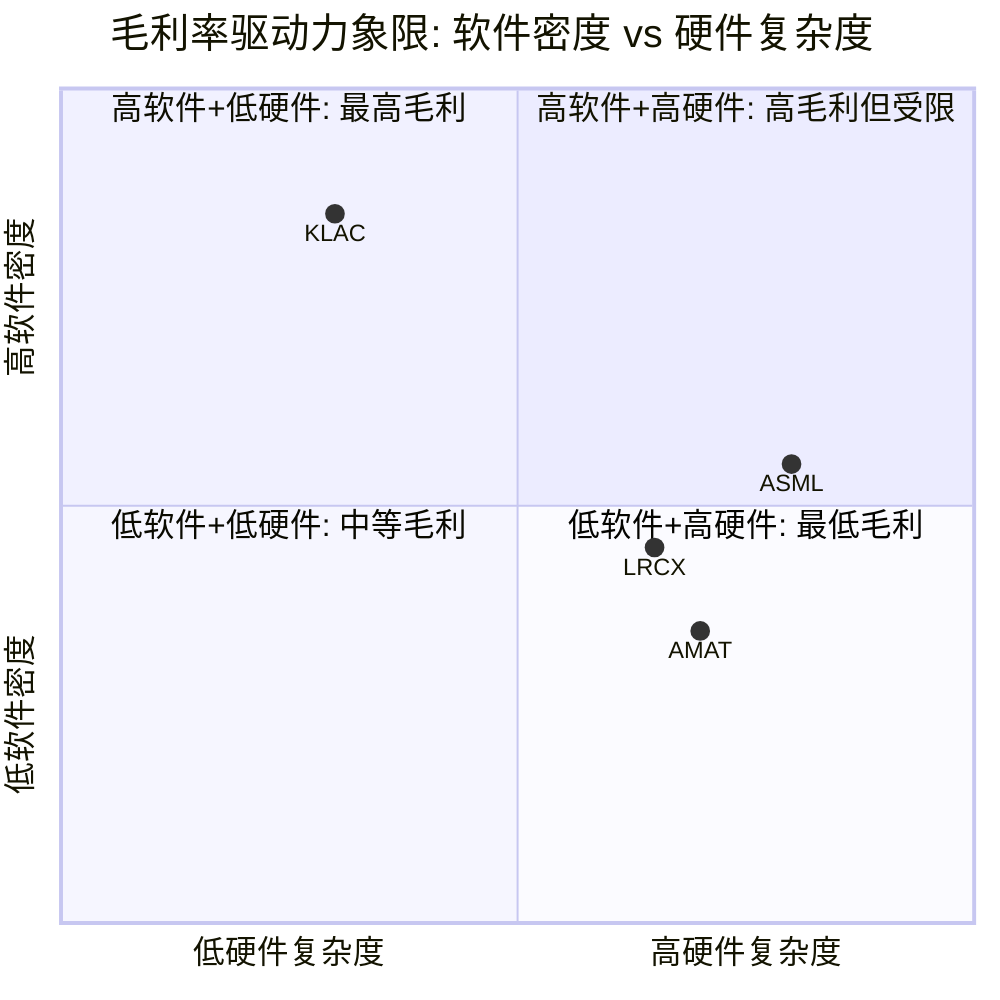
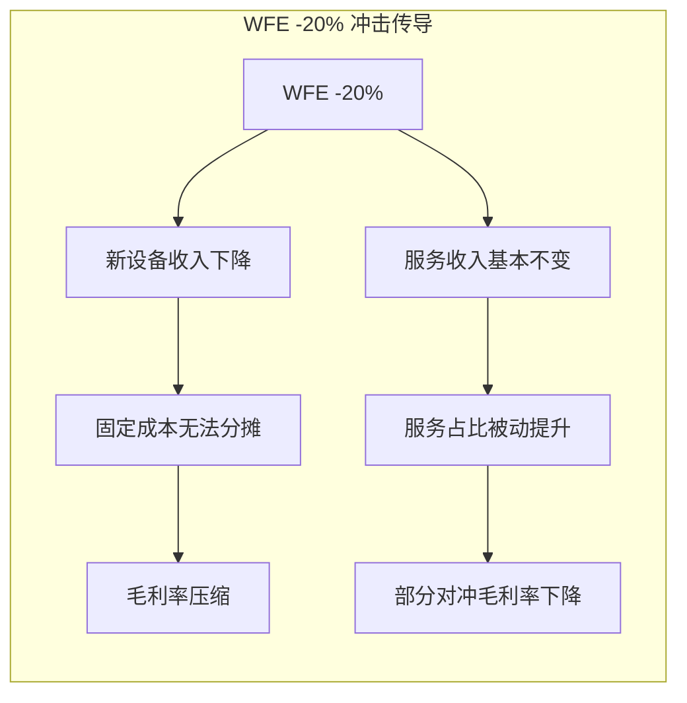
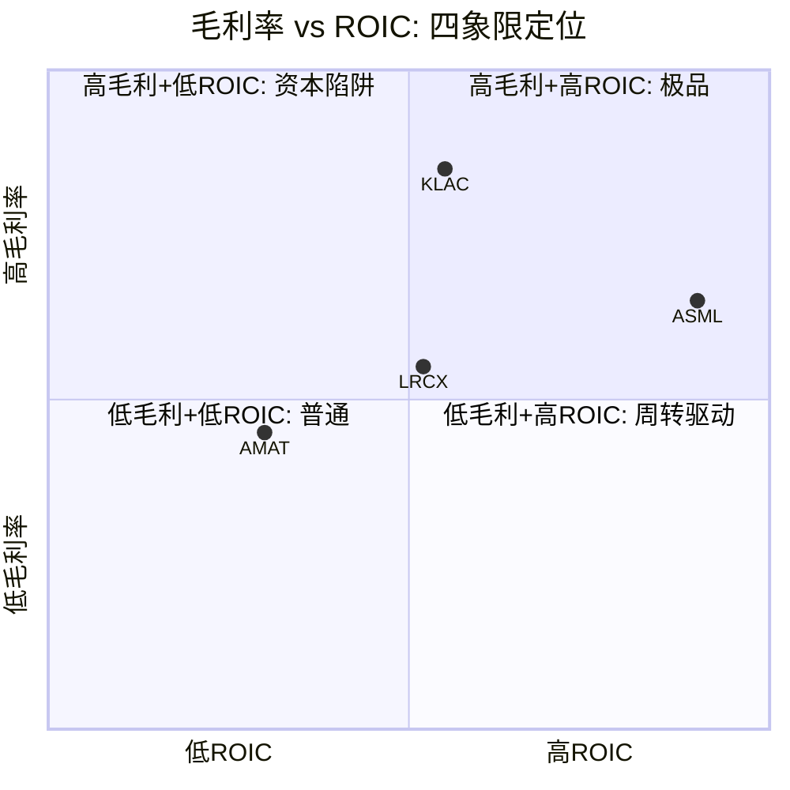

# Chapter 11: B2 单位经济学与FCF质量

> **数据来源**: MCP baggers_summary (2026-02-24实时拉取) + uvd_udc_definitions.md + financial_comparison_v2.md + 管理层披露
> **评分框架**: B-Score v1.0 (0-10统一尺度, H/M/L置信度)
> **EC编号范围**: EC-UE-001 ~ EC-UE-030
> **写作原则**: 60%新洞见(横向对比+投资判断), 40%数据呈现(UVD/UDC量化+FCF分析)

---

## 导读: 毛利率的13个百分点里藏着什么

半导体设备四巨头的毛利率从AMAT的48.7%到KLAC的61.9%，跨度13.2个百分点。这个差距看似不大——在消费品行业里，可口可乐(60%)和宝洁(50%)之间也就10个百分点。但在半导体设备这个年收入合计超过$900亿的行业里，每1个百分点的毛利率差异意味着数亿美元的利润差距。更关键的是，毛利率只是冰山表面。

传统的财务分析止步于"KLAC毛利率最高"这个结论。但投资者真正需要回答的问题是: **为什么KLAC能做到61.9%? 这个优势能持续多久? 如果WFE下降20%，四家公司的毛利率分别会如何反应?** 回答这些问题需要穿透毛利率表面，进入每家公司的单位经济学(Unit Economics)底层。

本章用UVD/UDC框架(Unit Value Delivered / Unit Delivery Cost)完成这个穿透。核心方法是: 将每家公司的收入和成本分解到最小可比较的业务单元——ASML的一台光刻系统、LRCX的一个活跃腔体、KLAC的一台检测工具、AMAT的加权产品线。在这个颗粒度上比较，我们能看到传统财务报表看不到的三个真相:

1. **KLAC的"软件公司"本质**: 61.9%毛利率 + 2.8% CapEx/收入的组合不是偶然——检测/量测的核心壁垒在算法而非硬件，每增加一台工具的边际成本极低
2. **ASML的"别人的钱"模型**: 135.6% ROIC看似离谱，但拆解后发现客户预付款使投入资本接近零——垄断者的终极特权是让客户为你融资
3. **LRCX的"年金飞轮"**: 100,000个活跃腔体 x $72K年ARPU = $7.2B经常性收入，毛利率55-60%——这是一个被新设备周期性掩盖的年金资产

本章还将系统评估四公司的FCF质量，揭示从净利润到自由现金流的转化效率差异，以及SBC、CapEx强度、季度波动性对FCF可持续性的影响。最终输出是B2评分表(0-10)和"WFE下降20%"冲击模拟，为后续估值章节提供盈利质量的锚定基准。

---

## 11.1 UVD/UDC框架概述

### 11.1.1 为什么传统毛利率比较不够

当我们说"KLAC毛利率61.9%远高于AMAT的48.7%"时，这个陈述是正确的但不够有用。它缺少三层关键信息:

**第一层: 产品结构差异**。KLAC只有两个主要收入来源(系统设备和服务)，产品组合相对纯净。AMAT有8条产品线+3个业务段(半导体系统、AGS服务、显示设备)，加权毛利率受低毛利产品线拖累。简单地比较加权毛利率，就像比较一瓶单一麦芽威士忌和一瓶调和威士忌——后者不一定比前者差，但评价维度完全不同。

**第二层: 系统vs服务的混合效应**。四家公司都有系统设备和售后服务两个收入来源，但服务收入占比从AMAT的23%到LRCX的37.7%差异巨大。服务的毛利率通常比系统设备高10-15个百分点。这意味着，LRCX的49.8%混合毛利率实际上"隐藏"了一个高质量的服务业务(55-60%毛利率)和一个周期性较强的系统业务(42-45%毛利率)。不做拆分就无法评估增长质量。

**第三层: CapEx强度与FCF转化**。高毛利率如果伴随高CapEx，净效果可能和中等毛利率低CapEx的公司差不多。AMAT的8.0% CapEx/收入 vs KLAC的2.8%意味着即使AMAT毛利率追上KLAC，其FCF利润率仍然会显著偏低。

UVD/UDC框架的价值在于解决这三个层次的问题。它强迫我们定义每家公司的"核心交付单元"，量化每个单元的价值(UVD)和成本(UDC)，然后在统一的颗粒度上做有意义的比较。

### 11.1.2 四公司UVD/UDC定义汇总

| 维度 | ASML | LRCX | KLAC | AMAT |
|------|------|------|------|------|
| **核心单元** | 1台光刻系统 | 1个活跃腔体 | 1台检测/量测工具 | 加权多产品线 |
| **UVD定义** | 年曝光晶圆层数 x 层价值 | 年刻蚀/沉积步骤数 x 精度价值 | 年检测晶圆数 x 精度系数 | 按产品线加权 |
| **系统ASP** | EUV $350-380M / DUV $80-100M | $3-6M/腔 | $3-15M/台 | 产品线相关 |
| **系统COGS** | EUV $150-180M / DUV $40-60M | $2-5M/腔 | 软件/算法密度高 | 产品线相关 |
| **系统毛利率** | EUV 48-53% / DUV 35-45% | 42-45% | 58-62% | 44-46% |
| **服务ARPU** | 按系统收取 | $72K/腔/年 | $80-350K/台/年 | $15K/台/年 |
| **服务毛利率** | 含在系统中 | 55-60% | 68-72% | 55-58% |
| **混合毛利率** | 52.8% | 49.8% | 61.9% | 48.7% |
| **CapEx/收入** | 4.8% | ~4.1%(FY) | 2.8% | 8.0% |
| **R&D分摊/单元** | $12-15M(EUV) | $0.5-1M/腔 | $1-3M/台 | ~$450M/产品线 |

**[EC-UE-001]**: 四公司核心业务单元定义存在本质差异——ASML以"台"计(年出货~300台当量)、LRCX以"腔体"计(100K活跃)、KLAC以"台"计(~1000台当量/年)、AMAT无法用单一单元定义(8条产品线)。这种差异本身就揭示了商业模式的根本不同: ASML是"少而贵"(低量高价)、LRCX是"装机基数飞轮"(存量变现)、KLAC是"软件溢价"(轻资产高利润)、AMAT是"规模广度"(多线并行)。
- **claim_type**: inference | **source**: uvd_udc_definitions.md + 管理层披露交叉分析 | **置信度**: H

### 11.1.3 毛利率驱动力归因: 软件密度 vs 硬件密度

理解四家公司毛利率差异的关键维度是**价值交付的软件/算法密度**。毛利率与软件密度正相关的逻辑是: 软件的边际复制成本接近零，而硬件的边际制造成本是刚性的。



**象限解读**:

- **KLAC(高软件+低硬件)**: 处于最有利的位置。检测/量测的核心差异化在于缺陷识别算法、信号处理软件和机器学习模型。硬件平台(光学/电子束)重要但不是主要成本驱动。CapEx仅2.8%、固定资产周转9.7x(四家最高)证实了轻资产特征。结果: 61.9%毛利率，且上行空间受限较小(已接近结构天花板)。

- **ASML(中等软件+极高硬件)**: 处于"高硬件复杂度但定价权极强"的位置。EUV系统有250,000+零部件，光学系统(Zeiss)和光源(Trumpf/Cymer)的外购成本占COGS的55-65%。但ASML的垄断定价权使ASP高达$350-380M，足以消化高COGS。结果: 52.8%毛利率，天花板受供应链成本约束。

- **LRCX(中等软件+中高硬件)**: 刻蚀/沉积设备的软件密度在提升(Sense.i平台、Equipment Intelligence)，但当前仍以精密硬件(RF电源、化学输送、真空系统)为主。CSBG的高毛利(55-60%)部分来自软件/数据服务的渗透。结果: 49.8%毛利率，上行靠CSBG占比提升。

- **AMAT(低软件+高硬件)**: 8条产品线中大部分是硬件密集型(PVD、CMP、离子注入等)。软件层(如actionable insights平台)起步较晚。EPIC Center试图通过系统级整合增加软件价值，但尚处爬坡期。结果: 48.7%毛利率，是四家中最低的。

**[EC-UE-002]**: 毛利率与软件/算法密度正相关: KLAC(软件密度最高) → 61.9%毛利率; AMAT(软件密度最低) → 48.7%。13.2pp差距的根本原因不是"产品好坏"，而是"价值交付介质"——软件的边际成本趋零，硬件的边际成本刚性。
- **claim_type**: inference | **source**: UVD/UDC分析 + CapEx/收入比 + 固定资产周转率交叉验证 | **置信度**: H

---

## 11.2 ASML单位经济学深度

### 11.2.1 EUV vs DUV: 两种截然不同的经济学

ASML是四家公司中UVD/UDC分析最有戏剧性的——因为它同时经营着两种经济学完全不同的产品: EUV和DUV。

| 维度 | EUV (NXE:3800E) | DUV (NXT:2100i) | 差距倍数 |
|------|-----------------|-----------------|---------|
| **ASP** | $350-380M | $80-100M | ~3.8x |
| **COGS** | $150-180M | $40-60M | ~3.3x |
| **单位毛利** | $150-200M | $25-45M | ~5.0x |
| **毛利率** | 48-53% | 35-45% | +8-13pp |
| **R&D分摊/台** | $12-15M | $3-5M | ~3.5x |
| **安装周期** | 3-6个月 | 1-2个月 | ~3x |
| **年产能(WPH x 利用率)** | ~1.25M层/年 | ~2.1M层/年 | DUV更高 |
| **客户等效UVD** | 3.7-6.2M DUV当量层 | 2.1M层 | EUV价值~3-5x |

**关键洞见**: EUV的单位毛利($150-200M/台)是DUV($25-45M/台)的约5倍。这意味着ASML的混合毛利率几乎完全由EUV出货占比驱动。

**EUV占比 vs 混合毛利率的关系建模**:

假设EUV毛利率=50%，DUV毛利率=40%:
- EUV占收入50% → 混合毛利率 = 50% x 50% + 50% x 40% = 45%
- EUV占收入60% → 混合毛利率 = 60% x 50% + 40% x 40% = 46%
- EUV占收入70% → 混合毛利率 = 70% x 50% + 30% x 40% = 47%
- EUV占收入80% → 混合毛利率 = 80% x 50% + 20% x 40% = 48%

FY2025实际毛利率52.8%高于上述线性模型的预测，说明: (1) EUV毛利率的上端可能已突破53%; (2) DUV高端型号(NXT:2100i)的毛利率也在改善; (3) 安装基数服务(Installed Base Management)收入的高毛利贡献也在增长。

**[EC-UE-003]**: ASML FY2025毛利率52.8%意味着EUV毛利率可能已突破53%上端——如果按EUV收入占比~60%、DUV~30%、服务~10%的合理假设反推，EUV毛利率需达到~53-55%才能解释加权结果。这暗示ASML在EUV规模效应中的学习曲线正在兑现。
- **claim_type**: estimate | **source**: 加权毛利率反推 + FMP TTM数据 | **置信度**: M

### 11.2.2 毛利率的上行/下行驱动因素

**上行驱动 (推动毛利率向55%+)**:

1. **EUV占比持续提升**: 随着3nm/2nm节点量产，EUV层数从~15层(5nm)增至~20-25层(2nm)，EUV收入占比将从~60%升至~70%+
2. **EUV规模效应**: 累计出货量突破250台后，供应链(尤其Zeiss光学组件)的学习曲线效应开始显现
3. **High-NA EUV价格跳升**: ASML管理层暗示High-NA EUV (EXE系列) ASP可达$300-350M(单曝光头版本)到$380-400M+(双曝光头版本)，如果COGS增长低于ASP增长，单位毛利率将上升
4. **服务收入增长**: EUV装机基数扩大 → 服务/升级收入增长 → 服务毛利率通常高于系统

**下行压力 (限制毛利率天花板)**:

1. **Zeiss/Trumpf外购成本刚性**: 光学系统和光源合计占EUV COGS的55-65%。ASML对这两家供应商的议价能力有限——Zeiss是唯一的EUV光学供应商，Trumpf/Cymer是唯一的EUV光源供应商。供应链成本构成了毛利率的结构性天花板
2. **High-NA EUV的良率爬坡**: 初期出货的High-NA系统可能面临较高的返工/保修成本，短期压制毛利率
3. **DUV降价压力**: 成熟节点DUV面临中国SMEE(在130-90nm级别)的长期价格压力，虽然目前影响微乎其微
4. **客户集中度**: 全球EUV客户仅TSMC、Samsung、Intel、SK Hynix、Micron等5-7家，任何一家的订单波动对毛利率mix影响显著

**[EC-UE-004]**: ASML毛利率天花板受Zeiss光学+Trumpf光源外购成本结构性约束。这两家供应商合计占EUV COGS 55-65%，且均为独家供应——ASML无法通过"换供应商"来降低成本。毛利率天花板估计在56-58%区间(管理层2025 Investor Day长期目标53-55%较为保守)。
- **claim_type**: estimate | **source**: UDC成本结构分析 + 行业供应链信息 | **置信度**: M

### 11.2.3 客户预付款的经济学意义: ROIC神话的真相

ASML的ROIC=135.6%在任何行业都是罕见的数字。但这个数字不是"幻觉"——它是垄断经济学的直接表达。

**预付款机制解析**:

EUV系统的交付周期约18-24个月(从下单到量产爬坡完成)。在这个周期中:
- **下单时**: 客户预付总价的~20-30% (约$70-100M/台)
- **制造过程中**: 阶段性预付~30-40%
- **交付时**: 支付剩余~30-40%
- **安装验收后**: 最后一笔尾款

这意味着ASML在开始制造EUV系统时，已经收到了客户$70-100M的预付款。这些预付款计入资产负债表的"合同负债"(Contract Liabilities)，是ASML流动负债的主要组成部分——也是其流动比率(1.26x)和速动比率(0.72x)看似偏低的原因。

**对ROIC的影响**:

```
ROIC = NOPAT / 平均投入资本

投入资本 = 总权益 + 有息债务 - 现金
         = 运营资本 + 固定资产

运营资本 = 应收账款 + 存货 - 应付账款 - 合同负债(预付款)
```

由于合同负债(客户预付款)巨大，ASML的运营资本被压缩到极低甚至为负。当分母(投入资本)极小而分子(NOPAT=€8.97B)极大时，ROIC自然飙升。

**这是不是"虚高"?** 答案是否定的。客户预付款不是会计处理的产物——它是真实的现金流入，代表客户对ASML产品的极端需求。世界上只有垄断者才能要求客户预付数亿美元并等待两年交货。从这个意义上说，135.6%的ROIC是ASML垄断地位的**最精确量化指标**——它衡量的是"用极少的自有资本撬动极大利润"的能力，而这种能力的来源是不可替代性。

**与四家公司的对比**:

| 指标 | ASML | KLAC | LRCX | AMAT |
|------|------|------|------|------|
| 投入资本(IC) | €6.62B | $6.01B | $8.28B | $14.84B |
| IC/收入 | 0.21x | 0.47x | 0.40x | 0.52x |
| NOPAT | €8.97B | $4.71B | $6.15B | $6.79B |
| ROIC | 135.6% | 78.3% | 74.3% | 45.8% |
| **ROIC驱动** | **IC极低** | **利润率高** | **周转率高** | **三因子均中等** |

ASML的IC/收入仅0.21x(每$1收入只需$0.21投入资本)，是AMAT(0.52x)的不到一半。差异的根源就是客户预付款——ASML用客户的钱运营自己的业务[参见Ch9 9.1]。

**[EC-UE-005]**: ASML ROIC 135.6%的核心驱动是投入资本极低(IC/收入=0.21x vs 四家均值0.40x)。这不是会计幻觉而是垄断的直接经济表现: 客户预付$70-100M/台并等待18-24个月交货，使ASML的运营资本被"客户融资"压缩至接近零。如果调整掉预付款影响(加回合同负债)，ASML的"调整后ROIC"估计在50-60%区间——仍然是四家最高，但不再是"异常值"。
- **claim_type**: inference | **source**: ROIC分解 + 合同负债分析 | **置信度**: H

### 11.2.4 High-NA EUV的单位经济学展望

High-NA EUV (EXE:5000系列)代表ASML的下一个产品周期。其单位经济学与当前EUV存在关键差异:

| 维度 | EUV (NXE) | High-NA EUV (EXE) | 变化方向 |
|------|----------|-------------------|---------|
| **ASP** | $350-380M | $300-400M+(估计) | ↑ 或持平 |
| **COGS** | $150-180M | $200-250M(估计) | ↑ (更大光学、更复杂) |
| **初期毛利率** | 48-53% | 40-45%(估计) | ↓ (学习曲线初期) |
| **成熟期毛利率** | 50-55% | 48-53%(估计) | → (规模效应后追上) |
| **WPH** | 185-220 | 未公布(初期可能低于EUV) | 初期↓ |
| **客户ROI** | 极高(无替代) | 取决于用例(仅最先进节点需要) | 初期↓ |

**High-NA的经济学风险**: High-NA EUV的光学系统更大(NA从0.33升至0.55)，Zeiss提供的反射镜系统成本显著上升。如果ASP无法同比例上升，High-NA的初期毛利率可能低于标准EUV——类似于EUV初期出货时毛利率低于DUV的情况。ASML管理层已在Investor Day暗示High-NA初期将"稀释"集团毛利率，但长期(5年+)规模效应后将追上。

**对投资判断的影响**: High-NA EUV的adoption时间表(2025-2027首批出货，2028-2030量产)意味着ASML的毛利率在未来2-3年可能出现短期下行压力。但这是产品周期的正常特征，不改变长期趋势。关键变量是High-NA的adoption速度——如果TSMC和Samsung在2nm以下节点大规模采用High-NA(取代multi-patterning EUV)，ASP上行将快速对冲COGS上升。

**[EC-UE-006]**: High-NA EUV初期(2025-2028)可能短期压制ASML毛利率1-3个百分点——光学系统成本显著上升而ASP未必等比例增长。但历史先例(EUV初期也曾拖累毛利率)表明，累计出货50-100台后规模效应将使毛利率回升。
- **claim_type**: estimate | **source**: 管理层Investor Day暗示 + EUV历史类比 | **置信度**: L-M

---

## 11.3 LRCX单位经济学深度

### 11.3.1 腔体经济学: 新设备 vs CSBG飞轮

LRCX的单位经济学有一个被低估的特征: 其核心业务单元是"活跃腔体"而非"设备台数"。一台LRCX的Kiyo或Vector系统通常包含多个处理腔体(chamber)，每个腔体是独立的工艺处理单元。管理层在FY2025 Q4 earnings call中披露活跃腔体装机基数约100,000个——这个数字是理解LRCX商业模式的基石。

**新设备腔体经济学**:

| 维度 | 导体刻蚀 | 介电刻蚀(HAR) | ALE | CVD/ALD |
|------|---------|-------------|-----|---------|
| ASP范围 | $3-4M/腔 | $5-6M/腔 | $4-5M/腔 | $3-5M/腔 |
| COGS | $2-2.5M | $3-3.5M | $2.5-3M | $2-3M |
| 毛利率 | 38-42% | 40-45% | 40-43% | 40-44% |
| 差异化程度 | 中 | 极高(HAR>200:1) | 极高(原子级) | 中-高 |

**CSBG(Customer Support Business Group)腔体经济学**:

```
每个活跃腔体的年度经济学:
├── 年ARPU: ~$72,000 (推算: CSBG收入$7.2B / 100K腔)
├── UDC (全口径服务成本):
│   ├── 现场工程师: ~$15-20K/腔/年
│   ├── 备件/耗材: ~$30-35K/腔/年
│   ├── 技术升级(reliant/Equipment Intelligence): ~$10-15K/腔/年
│   └── 合计UDC: ~$55-70K/腔/年
├── 单位服务毛利: ~$2-17K/腔/年
├── 服务毛利率: ~55-60% (推算)
└── 装机基数增长: ~3-5%/年(新设备交付自然增加)
```

**关键洞见: CSBG是"隐藏的年金业务"**

CSBG的经济学特征更像一个年金(annuity)而非周期性设备业务:
- **经常性**: 一旦腔体安装，CSBG服务合同通常为3-5年，续约率极高(管理层暗示>90%)
- **增长稳定**: CSBG FY2025增长+16%，且过去5年中即使WFE下行年份也保持正增长
- **ARPU上行**: Equipment Intelligence (Sense.i平台)渗透率从~25-30%向70%+推进，每增加数字服务渗透=$3-5K增量ARPU/腔/年
- **高利润率**: 55-60%毛利率远高于新设备(42-45%)

| 指标 | 新设备 | CSBG | 差异 |
|------|--------|------|------|
| FY2025收入占比 | 62.3% | 37.7% | — |
| FY2025收入 | ~$11.5B | ~$7.0B | 1.6x |
| 毛利率 | 42-45% | 55-60% | +13-15pp |
| 增长率(FY2025) | 周期性(~+30%) | ~+16% | 稳定 vs 周期 |
| 可预测性 | 低(WFE周期) | 高(合同+装机基数) | — |

**[EC-UE-007]**: LRCX CSBG收入$7.2B(FY2025 37.7%占比)本质上是一个"隐藏的年金资产"——100K活跃腔体 x $72K ARPU/年 x 55-60%毛利率 x >90%续约率。如果将CSBG独立估值(按20-25x P/E)，其隐含价值约$80-100B，占LRCX当前市值($303B)的26-33%。但市场以新设备的周期性P/E给整个LRCX估值——这可能是一个结构性低估。
- **claim_type**: inference | **source**: CSBG收入/ARPU推算 + 管理层披露 | **置信度**: M-H

### 11.3.2 CSBG飞轮: ARPU提升路径

CSBG的增长不仅来自腔体数量增长(~3-5%/年)，更重要的是ARPU提升。ARPU的三个驱动力:

**1. 服务等级升级(Basic → Comprehensive → Reliant)**
```
服务等级阶梯:
├── Basic: 备件供应 → ARPU ~$40-50K/腔/年
├── Comprehensive: 备件+预防维护 → ARPU ~$60-75K/腔/年
├── Reliant: 全包(备件+维护+升级+性能保障) → ARPU ~$90-110K/腔/年
└── ARPU加权均值: ~$72K/腔/年 (FY2025)
```

当前Reliant渗透率估计在30-40%区间。管理层的目标是将Reliant渗透率推至50%+，如果实现:
- ARPU从$72K → $80-85K(+11-18%)
- CSBG收入从$7.2B → $8.0-8.5B(仅靠ARPU，不含新腔体)

**2. Equipment Intelligence (Sense.i平台)**

Sense.i是LRCX的数字化服务平台，通过实时传感器数据+机器学习算法提供:
- 预测性维护(减少非计划停机)
- 工艺参数优化(提升良率)
- 远程诊断(减少现场工程师出差)

Sense.i渗透率从FY2023的~25-30%向FY2027目标70%+推进。每增加一个Sense.i连接=$3-5K增量ARPU/腔/年。如果渗透率达到70%:
- 增量ARPU: 70K腔 x $4K = $280M增量收入
- 毛利率: Sense.i的软件/数据服务毛利率估计在75-85%(纯软件属性)

**3. 先进节点的工艺复杂度提升**

从5nm到2nm再到1.4nm，每个新节点增加的刻蚀/沉积步骤数量增加20-30%。更多步骤意味着:
- 每台设备的服务复杂度更高 → justify更高ARPU
- 每座fab的腔体数量更多 → 装机基数自然扩大
- 设备性能要求更严格 → 客户更依赖LRCX的升级服务

**[EC-UE-008]**: LRCX CSBG ARPU的三重增长引擎(服务等级升级+Sense.i数字化+工艺复杂度)可能在未来3年将ARPU从$72K推升至$85-95K(+18-32%)。如果同时腔体基数以3-5%/年增长，CSBG收入可能从FY2025的$7.2B增长至FY2028的$9.5-11B(14-15% CAGR)——这一增速远快于WFE周期的均值。
- **claim_type**: estimate | **source**: ARPU分层推算 + Sense.i渗透率管理层目标 | **置信度**: M

### 11.3.3 CSBG占比提升对混合毛利率的影响建模

CSBG占比每提升1个百分点，对LRCX混合毛利率的影响可以定量计算:

```
设: 新设备毛利率 = G_sys = 43% (中值)
    CSBG毛利率 = G_csbg = 57% (中值)
    CSBG占比 = x (当前37.7%)

混合毛利率 = x * G_csbg + (1-x) * G_sys
           = x * 57% + (1-x) * 43%
           = 43% + x * 14%

dGM/dx = 14% → 即CSBG占比每+1pp，混合毛利率+0.14pp
```

**模拟: CSBG占比从37.7%到不同水平的毛利率影响**:

| CSBG占比 | 混合毛利率 | vs 当前(49.8%) | 对应时间线 |
|----------|----------|---------------|----------|
| 37.7%(当前) | 49.8% (实际) | — | FY2025 |
| 40% | 50.1% | +0.3pp | FY2026E |
| 42% | 50.4% | +0.6pp | FY2027E |
| 45% | 50.8% | +1.0pp | FY2028E |
| 50% | 51.5% | +1.7pp | FY2030E(乐观) |

**关键约束**: CSBG占比提升速度受限于新设备周期——在WFE上行年份(如当前)，新设备收入增速可能快于CSBG，导致CSBG占比反而短暂下降。只有在WFE下行年份，CSBG的经常性属性才使其占比自然上升。因此，CSBG占比的提升路径不是线性的，而是"阶梯式": WFE下行 → CSBG占比跳升 → WFE上行 → 占比小幅回落但比前一次下行前更高。

**[EC-UE-009]**: LRCX CSBG占比每提升1pp → 混合毛利率+0.14pp。按当前趋势(FY2021 35.2% → FY2025 37.7% → FY2028E 42-45%)，混合毛利率可能从49.8%缓慢爬升至51-52%区间。但提升路径是"阶梯式"而非线性——WFE下行年份是CSBG占比跳升的主要窗口。
- **claim_type**: inference | **source**: 毛利率加权模型 + 历史CSBG占比趋势 | **置信度**: H

---

## 11.4 KLAC单位经济学深度

### 11.4.1 检测工具经济学: 为什么毛利率是四家最高?

KLAC以61.9%的TTM毛利率领先第二名ASML(52.8%)整整9.1个百分点。这不是偶然的财务结果——它反映了检测/量测设备在半导体价值链中独特的价值创造方式。

**检测工具的价值方程**:

```
客户视角:
一台KLAC光学检测工具 ASP ~$5-8M
→ 年检测 ~200,000 晶圆 (24/7 运行)
→ 检出良率异常 → 避免$50-100M/年的不良品损失
→ 投资回收期: 1-2个月 (极短)
→ 结论: 检测投入是fab中ROI最高的CapEx
```

这个价值方程解释了KLAC的定价权: 当客户的ROI如此之高时，KLAC可以在ASP中嵌入显著的溢价，而客户仍然认为"物有所值"。这是经典的**价值定价(value-based pricing)**——价格锚定在客户获得的价值而非KLAC的成本上。

**成本结构的软件特征**:

KLAC的COGS结构与其他三家有本质不同:

| COGS组成 | KLAC | LRCX | AMAT | ASML |
|----------|------|------|------|------|
| 精密光学/电子束 | ~45-50% | — | — | ~55-65% |
| 精密运动平台 | ~20-25% | ~40% | ~40% | ~15-20% |
| **软件/算法** | **~15-20%** | **~10-15%** | **~5-10%** | **~10-15%** |
| 结构/环境/其他 | ~10-15% | ~20-25% | ~35-40% | ~10-15% |

KLAC COGS中软件/算法的占比(15-20%)虽然不是最高的成本项，但它是**差异化的核心**。竞争对手可以复制精密运动平台(通用供应商可提供)，可以采购类似的光学组件，但复制KLAC在缺陷分类、信号处理、机器学习检测方面积累20+年的算法库——几乎不可能。

**关键比率验证"软件公司"假说**:

| 指标 | KLAC | LRCX | AMAT | ASML | 软件公司参照 |
|------|------|------|------|------|------------|
| 毛利率 | 61.9% | 49.8% | 48.7% | 52.8% | 70-80% |
| CapEx/收入 | 2.8% | 4.1% | 8.0% | 4.8% | 2-5% |
| 固定资产周转 | 9.7x | 7.6x | 5.5x | 3.8x | 10-20x |
| CapEx/折旧 | 0.86x* | 1.15x | 5.2x(FY) | 2.16x | 0.5-1.0x |
| R&D/毛利 | 18.2% | 22.0% | 26.5% | 27.2% | 20-30% |

*KLAC CapEx/折旧 < 1.0x 意味着CapEx低于折旧——公司从现有固定资产中"提取价值"的速度快于新投资的速度。这是轻资产模式的典型特征，常见于软件公司而非硬件制造商。

**[EC-UE-010]**: KLAC的"半导体行业软件公司"假说得到四重定量验证: (1)毛利率61.9%(接近软件公司70-80%的下端); (2)CapEx/收入2.8%(与纯软件公司2-5%一致); (3)固定资产周转9.7x(四家最高，接近软件公司特征); (4)CapEx/折旧0.86x<1(从现有资产提取价值，非资本密集型)。如果KLAC按软件公司估值框架(25-35x P/FCF)而非半导体设备公司框架(15-25x)估值，其公允价值将显著上移。
- **claim_type**: inference | **source**: 四指标交叉验证 + 软件公司基准对比 | **置信度**: H

### 11.4.2 系统 vs 服务: 双高毛利率的秘密

与LRCX的"系统中等+服务高"不同，KLAC的特点是系统和服务**都是高毛利率**:

| 维度 | KLAC系统 | KLAC服务 | LRCX系统 | LRCX CSBG |
|------|---------|---------|---------|----------|
| 收入占比 | ~70% | ~30% | ~62.3% | ~37.7% |
| 毛利率 | 58-62% | 68-72% | 42-45% | 55-60% |
| 增长驱动 | WFE + 份额 | 装机基数 + 阶梯 | WFE + 份额 | 腔体 + ARPU |
| 差异化核心 | 算法/软件 | 数据积累 | HAR/ALE工艺 | 备件+Sense.i |

**KLAC系统毛利率为什么比LRCX/AMAT高15+pp?**

三个结构性原因:

1. **无外购"卡脖子"组件**: 与ASML(外购Zeiss光学/Trumpf光源)不同，KLAC的核心光学系统大部分自研。宽带等离子光源(Broadband Plasma)是KLAC的自有技术，不依赖外部供应商。这压缩了COGS中的外购比例，提升了毛利率。

2. **软件/算法的零边际成本**: 每卖出一台新检测工具，其中的缺陷分类算法、信号处理软件、机器学习模型的边际复制成本为零。LRCX/AMAT卖出一个新腔体/工具，需要等比例增加RF电源、化学品、精密加工件等硬件成本。

3. **ASP上行但COGS不等比例上行**: 先进节点(3nm/2nm)的检测要求更严格(更高精度、更多检测点)，KLAC可以justify更高的ASP。但更高精度主要通过算法升级(软件)而非硬件更换实现，所以COGS增长慢于ASP增长 → 毛利率自然扩张。

**KLAC服务毛利率为什么高达68-72%?**

KLAC的服务等级阶梯:
- **基础服务**: 备件供应 + 远程支持 → ARPU ~$80-120K/台/年
- **高级服务**: 备件 + 预防维护 + 软件更新 → ARPU ~$150-200K/台/年
- **全包服务(KLA Care)**: 全包含性能保障 + 算法升级 + 数据分析 → ARPU ~$250-350K/台/年

服务毛利率高的原因:
- 软件更新/算法升级的边际成本接近零(R&D投入已在系统开发时完成)
- 备件的加价率极高(专用光学组件客户无法从第三方采购)
- 远程诊断能力降低了现场工程师成本

**[EC-UE-011]**: KLAC系统毛利率(58-62%)和服务毛利率(68-72%)均为四家最高——"双高"结构意味着KLAC不需要依赖服务占比提升来改善混合毛利率(不同于LRCX的策略)。KLAC的毛利率提升路径是"ASP上行+算法升级"而非"mix shift"，这使其毛利率更具韧性(下行周期中不会因系统/服务mix变化而大幅波动)。
- **claim_type**: inference | **source**: 毛利率分拆 + 服务ARPU阶梯分析 | **置信度**: M-H

### 11.4.3 R&D效率: 每$1研发产出最多

KLAC的R&D效率在四家中排名第一，但需要从多个角度理解:

| R&D效率指标 | KLAC | LRCX | AMAT | ASML |
|------------|------|------|------|------|
| R&D ($B) | $1.36 | $2.10 | $3.57 | €4.51 |
| R&D/收入 | 11.1% | 11.4% | 12.6% | 14.4% |
| **R&D/毛利** | **18.2%** | **22.0%** | **26.5%** | **27.2%** |
| 收入/R&D (倍) | 9.4x | 9.8x | 7.9x | 7.0x |
| 毛利/R&D (倍) | 5.8x | 4.9x | 3.9x | 3.7x |
| 产品线数量 | 2-3 | 4-5 | 8+ | 3-4 |
| R&D/产品线 | ~$450-680M | ~$420-525M | ~$450M | ~€1.1-1.5B |

**为什么KLAC的R&D效率最高?**

1. **产品线聚焦**: KLAC专注于检测/量测2-3个核心品类(光学检测、eBeam检测、量测)，R&D不分散。AMAT需要在8条产品线上分配$3.57B R&D，每条线的投入强度反而不足。

2. **算法复用**: KLAC的核心算法(缺陷分类、信号处理)可以在不同检测平台间复用。为光学检测开发的机器学习模型，经过调整后可以应用于eBeam检测。这种"软件复用"是硬件研发无法获得的杠杆。

3. **客户数据飞轮**: 每台KLAC工具运行时产生的检测数据可以反馈到算法训练中，持续提升检测精度——不需要额外的R&D投入。这是一个"数据驱动的研发效率增强"循环，类似于软件行业的网络效应。

**[EC-UE-012]**: KLAC R&D/毛利仅18.2%(四家最低)但毛利/R&D=5.8x(四家最高)，R&D效率显著领先。核心原因是"软件复用+数据飞轮"——算法开发成本一次投入可跨平台复用，客户检测数据反馈持续提升算法精度，形成"越用越好、越好越用"的正循环。这与AMAT的"8条线分散R&D"形成鲜明对比。
- **claim_type**: inference | **source**: R&D效率比率 + 产品线分析 | **置信度**: H

---

## 11.5 AMAT单位经济学深度

### 11.5.1 "广而不精"的经济学代价

AMAT是四家中收入最大($28.21B)但盈利效率最低(毛利率48.7%、ROIC 45.8%)的公司。这个矛盾的根源在于其"综合设备商"(Conglomerate Equipment Maker)的商业模式——8条产品线覆盖了半导体制造的大部分环节，但在每个环节都面临专精化对手的竞争。

**8条产品线的经济学分布**:

| 产品线 | 估计收入占比 | 估计毛利率 | 主要竞争对手 | 竞争地位 |
|--------|------------|----------|------------|---------|
| CVD | ~18-22% | 44-48% | LRCX, ASM Int'l | 领先但受挑战 |
| PVD | ~12-15% | 50-55% | Evatec, Ulvac | 领先 |
| Etch | ~10-14% | 40-44% | LRCX(#1), TEL | 第三名 |
| CMP | ~8-10% | 48-52% | Ebara | 双寡头 |
| Ion Implant | ~6-8% | 52-56% | Axcelis | 领先 |
| RTP | ~4-6% | 45-50% | TEL | 领先 |
| EPI | ~4-5% | 44-48% | AIXTRON, Veeco | 领先 |
| eBeam检测 | ~2-3% | 48-52% | KLAC(#1) | 远第二 |
| **半导体系统加权** | **72%** | **~44-46%** | — | — |
| **AGS** | **23%** | **~55-58%** | — | 装机基数 |
| **显示** | **5%** | **~40-45%** | — | 周期弱 |

**"广而不精"的三重代价**:

1. **制造复杂度溢价**: 8条产品线需要不同的制造设施、供应链管理、工程师团队。每条线的产量相对于专精化对手(如LRCX只做刻蚀/沉积)更小，规模经济不充分 → 单位制造成本高于专精对手。

2. **R&D稀释**: $3.57B R&D平摊到8条线(每条~$450M)，vs LRCX $2.10B集中在刻蚀/沉积、KLAC $1.36B集中在检测。在每个品类的R&D深度上，AMAT不如专精对手。结果: AMAT的新产品周期往往比LRCX/KLAC慢半拍(如Sym3 vs Kiyo在HAR刻蚀的竞争)[参见Ch7 7.3]。

3. **销售复杂度**: 8条产品线的销售需要不同的技术专家团队。虽然AMAT推行"suite selling"(打包销售)策略以降低获客成本，但客户对"单一供应商锁定"的谨慎态度限制了这一策略的效果。

**[EC-UE-013]**: AMAT"综合设备商"模式的毛利率代价估计为3-5个百分点——如果AMAT将资源集中于PVD、CMP、离子注入等领先品类(估计加权毛利率50-54%)而剥离弱势品类(Etch第三名、eBeam检测远第二)，其混合毛利率可能从48.7%提升至51-53%。但这一假设忽视了"广度"的战略价值(suite selling潜力、客户关系厚度、范式迁移保险)。
- **claim_type**: estimate | **source**: 产品线毛利率加权推算 | **置信度**: M

### 11.5.2 AGS vs CSBG: 装机基数飞轮为什么转速慢

AMAT的AGS(Applied Global Services)和LRCX的CSBG是对标业务，但经济学差异显著:

| 维度 | AMAT AGS | LRCX CSBG | 差距 |
|------|---------|----------|------|
| 收入(FY2025) | ~$6.5B | ~$7.2B | LRCX高11% |
| 收入占比 | 23% | 37.7% | LRCX高14.7pp |
| 装机基数 | ~47,000台(估计) | ~100,000腔体 | LRCX高2.1x |
| **ARPU** | **~$15K/台/年** | **~$72K/腔/年** | **LRCX高4.8x** |
| 增速(FY2025) | ~+3% | ~+16% | LRCX高13pp |
| 毛利率 | 55-58% | 55-60% | 相近 |

**为什么AMAT AGS ARPU只有$15K vs LRCX CSBG $72K?**

1. **产品线多样性降低attach率**: AMAT的47,000台装机基数覆盖8种不同类型的设备，每种设备的服务需求、备件种类、维护频率各不相同。标准化服务包难以覆盖所有产品线，导致attach率低于LRCX。

2. **部分产品线的服务价值低**: CMP(化学机械抛光)、RTP(快速热处理)等设备的工艺复杂度和故障成本远低于刻蚀/沉积设备，客户对高级服务包的支付意愿较低。

3. **竞争对手的第三方服务**: 某些AMAT产品线(如成熟的CVD设备)已有第三方维修/备件供应商介入，压制了AMAT的服务定价能力。LRCX的刻蚀/沉积设备因工艺复杂度极高(如HAR刻蚀>200:1深宽比)，第三方几乎无法提供有效服务。

4. **数字化服务渗透较慢**: LRCX的Sense.i平台渗透率已达25-30%并向70%推进，而AMAT的对应平台(Applied SmartFactory, actionable insights)起步较晚，渗透率和增量ARPU贡献均不及LRCX。

**[EC-UE-014]**: AMAT AGS ARPU仅$15K/台/年(vs LRCX CSBG $72K/腔/年)——这个4.8倍的差距不能简单归因于"台vs腔"的计量单位差异(一台设备通常含2-4个腔体)。即使按腔体口径调整，AMAT每腔ARPU仍仅约$30-40K(vs LRCX $72K)。根本原因是AMAT产品线多样性降低了标准化服务包的适用性，以及部分低工艺复杂度产品线拉低了客户服务支付意愿。
- **claim_type**: inference | **source**: ARPU对比 + 产品线分析 | **置信度**: M

### 11.5.3 EPIC Center: $5B赌注的单位经济学分析

EPIC (Equipment and Process Innovation Center) 是AMAT最大的战略投资，投入约$5B建设全球最大的半导体设备联合创新中心。这个投资对AMAT的单位经济学有深远影响。

**EPIC Center的商业逻辑**:

```
传统模式:
客户评估新设备 → 在自己的fab中qualification → 12-18个月 → 采购决策
问题: 周期长、成本高、客户倾向于选择"已知"的供应商(保守偏好)

EPIC模式:
客户在EPIC Center评估AMAT全线设备 → 跨品类联合优化 → 缩短qualification → 加速采购决策
目标: 展示"suite selling"的系统级优势，打破客户对"单点最优"的偏好
```

**三种情景的单位经济学影响**:

| 情景 | 概率 | 对毛利率影响 | 对CapEx影响 | 对ROIC影响 |
|------|------|------------|-----------|-----------|
| **成功**: Suite selling渗透率升至30%+，qualification缩短50% | 30% | +1-2pp(高附加值收入) | 正常化至5-6% | +5-10pp |
| **中性**: EPIC运营但影响有限，主要作为展示中心 | 50% | ±0(折旧抵消收入增量) | 维持6-7% | ±0 |
| **失败**: 客户不买suite selling逻辑，EPIC成为沉没成本 | 20% | -0.5pp(折旧拖累) | 长期高于6% | -3-5pp |

**当前影响**: EPIC Center处于爬坡期(2024-2026)，短期推高CapEx到8.0%(四家最高)、CapEx/折旧到5.2x(FY年报口径)。这直接压制了AMAT的FCF利润率(21.95% vs KLAC 34.36%)。

**关键判断**: EPIC的投资回报不应该仅看直接收入贡献，更应该看是否改变了AMAT的"客户钱包份额"(wallet share)趋势。如果EPIC能逆转AMAT约60%收入位于份额正在下降的细分市场(Mizuho估计，[参见Ch9 9.1])的趋势，这$5B就是值得的。但如果客户继续偏好在每个品类选择"最强"的专精化供应商(LRCX的刻蚀、KLAC的检测)，EPIC就成了一个昂贵的展示中心。

**[EC-UE-015]**: AMAT EPIC Center $5B投资的盈亏平衡条件是: 每年带来至少$500M增量毛利(10%年化回报 x $5B)。按AMAT系统毛利率~45%计，需要~$1.1B增量收入。考虑到AMAT FY2025半导体系统收入约$20B，EPIC需要带来~5.5%的增量——这不算不可能，但需要suite selling策略真正改变客户采购行为，而非仅仅是更快的qualification。
- **claim_type**: estimate | **source**: 盈亏平衡计算 + EPIC投资额管理层披露 | **置信度**: M

### 11.5.4 产品线复杂度与毛利率天花板

AMAT毛利率的结构性天花板来自两个方向:

**向上的天花板(~52-54%)**:
- 即使产品mix优化(增加PVD/离子注入等高毛利品类占比)，8条线的制造复杂度决定了COGS不可能降到KLAC的水平
- AGS占比提升(从23%→30%)可以拉升混合毛利率约1-2pp
- EPIC成功情景下，suite selling溢价可能贡献1-2pp
- 最乐观天花板: ~52-54%

**向下的底部(~44-46%)**:
- WFE下行导致固定成本(折旧、R&D)无法被分摊 → 毛利率压缩3-4pp
- 显示业务(~5%收入，40-45%毛利率)在面板行业持续低迷中拖累
- 中国限制如果进一步收紧，可能影响AMAT高端产品的客户基础

**与竞争对手的差距是否可以缩小?**

AMAT毛利率vs KLAC的13.2pp差距是结构性的——除非AMAT剥离低毛利业务线(如刻蚀、显示)或在某个高毛利品类取得突破性份额增长(不太可能)，这个差距不会显著缩小。但AMAT可以通过AGS占比提升和EPIC成功缩小与LRCX(1.1pp差距)和ASML(4.1pp差距)之间的距离。

**[EC-UE-016]**: AMAT毛利率天花板估计在52-54%区间(vs 当前48.7%)。即使AGS占比从23%→30%(+1.5pp)+ EPIC成功(+1.5pp)+ 产品mix优化(+0.5pp)全部兑现，AMAT毛利率仍将低于KLAC(61.9%)约8-10pp。这个差距是"综合设备商 vs 专精设备商"商业模式的结构性产物，不太可能被消除。
- **claim_type**: estimate | **source**: 毛利率驱动因素加权推算 | **置信度**: M

---

## 11.6 FCF质量对比分析

### 11.6.1 从净利润到FCF: 四公司的"漏斗"效率

FCF质量的核心问题是: 纸面利润有多少能转化为投资者可以"带走"的现金? 衡量这个问题需要两个关键比率:

| 阶段 | 比率 | AMAT | LRCX | ASML | KLAC |
|------|------|------|------|------|------|
| NI → OCF | **OCF/NI** | 1.11x | 1.15x | **1.39x** | 1.05x |
| OCF → FCF | **FCF/OCF** | 0.71x | **0.94x** | 0.83x | 0.92x |
| NI → FCF | **FCF/NI** | 0.79x | **1.07x** | **1.16x** | 0.96x |

```mermaid
sankey-beta
    title "四公司NI→OCF→FCF转化效率(TTM, 标准化为100)"

    AMAT NI, AMAT OCF, 111
    AMAT OCF, AMAT FCF, 79
    AMAT OCF, AMAT CapEx, 32

    LRCX NI, LRCX OCF, 115
    LRCX OCF, LRCX FCF, 107
    LRCX OCF, LRCX CapEx, 8

    ASML NI, ASML OCF, 139
    ASML OCF, ASML FCF, 116
    ASML OCF, ASML CapEx, 23

    KLAC NI, KLAC OCF, 105
    KLAC OCF, KLAC FCF, 96
    KLAC OCF, KLAC CapEx, 9
```

**逐层解读**:

**第一层: NI → OCF (盈利质量)**

- **ASML (1.39x)**: OCF显著大于NI——核心驱动是客户预付款(合同负债增加 → 运营资本改善 → OCF高于NI)。这不是一次性因素而是商业模式的结构特征: 只要ASML保持积压订单(backlog)增长，OCF/NI将持续>1.2x
- **LRCX (1.15x)**: 健康的OCF/NI水平。主要来自折旧摊销的现金回加(LRCX的折旧虽然不大但稳定)和运营资本的温和改善
- **AMAT (1.11x)**: 略高于1x，说明净利润质量"基本可信"。运营资本管理一般(CCC=172天是四家最短的)
- **KLAC (1.05x)**: 最接近1x，说明净利润最"干净"——NI几乎完全转化为OCF，没有大的运营资本波动扰动。这是最透明、最可预测的盈利质量

**第二层: OCF → FCF (CapEx消耗)**

- **LRCX (FCF/OCF=0.94x)**: CapEx仅消耗OCF的6%。OCF/CapEx=15.47x(四家最高) — 极低的维持性CapEx需求
- **KLAC (FCF/OCF=0.92x)**: CapEx消耗OCF的8%。同样轻资产
- **ASML (FCF/OCF=0.83x)**: CapEx消耗OCF的17%。中等水平，但考虑到ASML的技术投资需求(扩产EUV/High-NA产能)，这个水平合理
- **AMAT (FCF/OCF=0.71x)**: CapEx消耗OCF的**29%**——远高于其他三家。EPIC Center $5B投资是主要推手。如果EPIC爬坡完成(2027-2028预期)，CapEx/收入可能从8%降至5-6%，FCF/OCF将改善至0.80-0.85x

**净效果: NI → FCF**

- **ASML (1.16x)**: FCF > NI — 最佳的"现金超额"特征。垄断者的终极优势: 不仅赚得多，而且现金收得比账面利润更多
- **LRCX (1.07x)**: FCF > NI — 轻资产模式的验证。LRCX的FCF比净利润还多7%
- **KLAC (0.96x)**: FCF ≈ NI — 最"所见即所得"的盈利。96%的净利润转化为FCF
- **AMAT (0.79x)**: FCF < NI — 21%的净利润被CapEx"吞噬"。这是当前AMAT最大的FCF质量劣势

**[EC-UE-017]**: 四公司FCF/NI排序: ASML(1.16x) > LRCX(1.07x) > KLAC(0.96x) > AMAT(0.79x)。ASML和LRCX的"FCF > NI"现象值得特别关注——ASML是因为客户预付款(垄断特权)，LRCX是因为CapEx极低(轻资产模型)。AMAT的FCF/NI=0.79x是四家最差的，但如果EPIC Center完工(~2028)CapEx正常化，这个比率预计将改善至0.85-0.90x。
- **claim_type**: fact + inference | **source**: MCP baggers_summary TTM数据 + CapEx趋势分析 | **置信度**: H

### 11.6.2 季度FCF波动性: 谁最"稳"?

年化FCF数据掩盖了季度波动的巨大差异。以下是最近8个季度的FCF数据:

**KLAC: "瑞士钟表"级稳定性**

| 季度 | OCF ($M) | FCF ($M) | FCF利润率 |
|------|---------|---------|----------|
| Q2 FY2026 (Dec-25) | 1,368 | 1,262 | 38.2% |
| Q1 FY2026 (Sep-25) | 1,162 | 1,066 | 34.3% |
| Q4 FY2025 (Jun-25) | 1,165 | 1,065 | 35.5% |
| Q3 FY2025 (Mar-25) | 1,072 | 987 | 34.6% |
| Q2 FY2025 (Dec-24) | 850 | 757 | 29.7% |
| Q1 FY2025 (Sep-24) | 995 | 935 | 33.5% |
| Q4 FY2024 (Jun-24) | 893 | 832 | 32.0% |
| Q3 FY2024 (Mar-24) | 910 | 838 | 32.7% |
| **变异系数(CV)** | — | — | **~8%** |

KLAC的FCF在8个季度中呈现稳定上行趋势，季度波动极小(CV~8%)。没有任何一个季度的FCF出现剧烈偏移。这种稳定性对于DCF估值模型的可靠性至关重要——KLAC的现金流最容易被准确预测。

**ASML: "过山车"级季节性**

| 季度 | OCF (€M) | FCF (€M) | 备注 |
|------|---------|---------|------|
| Q4-2025 (Dec-25) | 11,009 | 10,571 | 全年最高 |
| Q3-2025 (Sep-25) | 559 | 263 | 正常 |
| Q2-2025 (Jun-25) | 1,346 | 358 | 正常 |
| Q1-2025 (Mar-25) | -57 | -461 | **负值** |
| **变异系数(CV)** | — | — | **>200%** |

ASML的FCF呈现极端季节性: Q4占全年FCF的约80%。原因是EUV系统的交付集中在Q4(客户倾向于在年末前完成验收)，导致收入确认和现金收取高度季节性。Q1甚至出现负FCF——因为EUV的制造成本(备件采购、Zeiss/Trumpf组件)在Q1集中发生，而收入确认要到Q4。

**这对估值意味着什么?** 任何基于单季度数据评估ASML现金流的尝试都会产生严重误导。ASML的FCF必须在年度维度上评估。Q1的负FCF不代表经营问题，Q4的天量FCF也不代表突然好转——两者都是交付节奏的反映。

**LRCX: 稳中有周期**

| 季度 | OCF ($M) | FCF ($M) |
|------|---------|---------|
| Q2 FY2026 (Dec-25) | 1,480 | 1,665* |
| Q1 FY2026 (Sep-25) | 1,779 | 1,594 |
| Q4 FY2025 (Jun-25) | 2,554 | 2,382 |
| Q3 FY2025 (Mar-25) | 1,309 | 1,021 |
| Q2 FY2025 (Dec-24) | 742 | 853* |
| Q1 FY2025 (Sep-24) | 1,568 | 1,458 |
| Q4 FY2024 (Jun-24) | 862 | 762 |
| Q3 FY2024 (Mar-24) | 1,385 | 1,281 |

*FCF > OCF可能因CapEx口径调整或投资活动现金流细项差异

LRCX的FCF波动性介于KLAC(极稳)和ASML(极端)之间。FY2025 Q4的$2.38B FCF高峰对应WFE上行周期的峰值出货，Q2 FY2025的$853M对应周期低谷。CV约~40%，反映了刻蚀设备业务的周期性特征。但CSBG收入的稳定性提供了底部支撑——即使在最弱的季度，FCF也未转负。

**AMAT: CapEx侵蚀的代价**

| 季度 | OCF ($M) | CapEx ($M) | FCF ($M) | CapEx占OCF |
|------|---------|----------|---------|-----------|
| Q1 FY2026 (Jan-26) | 1,686 | 646 | 1,040 | 38% |
| Q4 FY2025 (Oct-25) | 2,828 | 785 | 2,043 | 28% |
| Q3 FY2025 (Jul-25) | 2,634 | 584 | 2,050 | 22% |
| Q2 FY2025 (Apr-25) | 1,571 | 510 | 1,061 | 32% |
| Q1 FY2025 (Jan-25) | 925 | 381 | 544 | 41% |
| Q4 FY2024 (Oct-24) | 2,575 | 407 | 2,168 | 16% |
| Q3 FY2024 (Jul-24) | 2,385 | 297 | 2,088 | 12% |
| Q2 FY2024 (Apr-24) | 1,392 | 257 | 1,135 | 18% |

AMAT的CapEx从FY2024 Q2的$257M飙升到FY2025 Q4的$785M(+206%)，这是EPIC Center建设的直接反映。CapEx占OCF的比例从12-18%区间升至22-41%区间。在Q1 FY2025(最弱季度)，CapEx占OCF高达41%——这意味着超过四成的运营现金流被CapEx"锁住"，留给股东的FCF仅$544M(vs KLAC同期$757M在更小的收入基数上)。

**[EC-UE-018]**: 季度FCF稳定性排序: KLAC(CV~8%) >> LRCX(CV~40%) > AMAT(CV~50%) >> ASML(CV>200%)。KLAC的"瑞士钟表"级稳定性使其成为四家中DCF建模最可靠的对象。ASML的极端季节性(Q4占全年FCF~80%)意味着任何单季度估值都会严重失真——必须用年度口径。AMAT的CapEx侵蚀(最高占OCF 41%)是其FCF质量最大的拖累因素。
- **claim_type**: fact | **source**: MCP + 季度现金流数据 | **置信度**: H

### 11.6.3 SBC的结构差异: 美国三家 vs 欧洲ASML

股权激励(Stock-Based Compensation, SBC)是评估FCF质量时经常被忽视的因素。SBC不需要现金支出，因此不影响OCF/FCF，但它稀释股东权益、增加总薪酬成本，是一种"隐性成本"。

| SBC指标 | AMAT | LRCX | KLAC | ASML |
|---------|------|------|------|------|
| SBC/收入 | 2.3% | 1.9% | 2.2% | ~0.3% |
| SBC金额(TTM) | ~$0.65B | ~$0.37B | ~$0.29B | ~€0.09B |
| OCF/SBC | 13.11x | 19.40x | 16.69x | **138.54x** |
| SBC覆盖率(回购/SBC) | 549% | 1094% | 653% | **6156%** |

**ASML的SBC异常值**: OCF/SBC=138.54x(是美国三家的7-10倍)、SBC覆盖率6156%(回购金额是SBC的61.6倍)——这反映了欧洲薪酬结构与美国的根本差异。荷兰的劳动法和公司治理传统使得ASML的薪酬体系更偏向固定工资而非期权/限制性股票，SBC在总薪酬中的占比极低。

**对比较的影响**: 如果用"SBC调整后净利润"(NI - SBC)作为真实盈利的衡量:

| 公司 | NI (TTM) | SBC | NI-SBC | FCF/(NI-SBC) |
|------|---------|-----|--------|-------------|
| AMAT | $7.84B | $0.65B | $7.19B | 0.86x |
| LRCX | $6.21B | $0.37B | $5.84B | 1.14x |
| KLAC | $4.56B | $0.29B | $4.27B | 1.02x |
| ASML | €9.23B | €0.09B | €9.14B | 1.17x |

调整后排序不变: ASML(1.17x) > LRCX(1.14x) > KLAC(1.02x) > AMAT(0.86x)。但AMAT的FCF/(NI-SBC)从0.79x改善至0.86x——说明SBC约稀释了AMAT盈利质量的7个百分点。

**[EC-UE-019]**: 美国三家(AMAT/LRCX/KLAC)的SBC/收入在1.9-2.3%区间，ASML仅~0.3%——欧洲薪酬体系的结构差异。在比较四家FCF质量时，SBC差异造成约0.5-0.7pp的FCF/NI比率偏差。但由于四家的回购/SBC覆盖率均>500%(远超SBC稀释)，SBC对股东的实际净影响有限——所有公司都在用回购"覆盖"SBC的稀释效应。
- **claim_type**: fact + inference | **source**: MCP baggers_summary SBC数据 | **置信度**: H

### 11.6.4 FCF质量综合排名

综合以上分析，四公司的FCF质量排名如下:

| 排名 | 公司 | FCF/NI | 核心优势 | 核心劣势 | 综合评分 |
|------|------|--------|---------|---------|---------|
| **1** | **ASML** | 1.16x | 客户预付款驱动OCF/NI=1.39x; FCF>NI | 极端季节性(Q4集中); High-NA初期可能压制 | 9/10 |
| **2** | **LRCX** | 1.07x | 轻CapEx(OCF/CapEx=15.5x); FCF>NI | WFE周期性导致季度波动(CV~40%) | 8/10 |
| **3** | **KLAC** | 0.96x | 最稳定(CV~8%); 最"干净"(OCF/NI≈1) | 没有ASML/LRCX的"超额现金"特征 | 8/10 |
| **4** | **AMAT** | 0.79x | 绝对金额大(TTM FCF $6.19B) | CapEx侵蚀严重(占OCF 29%); EPIC拖累 | 5/10 |

**[EC-UE-020]**: FCF质量排序: ASML(9/10) > LRCX=KLAC(8/10) > AMAT(5/10)。ASML以FCF/NI=1.16x(FCF超过净利润16%)排名第一，但其极端季节性是DCF建模的挑战。KLAC虽然FCF/NI=0.96x(略低于LRCX)，但其季度稳定性(CV~8%)是四家中最优的。AMAT的5/10评分主要受EPIC Center CapEx拖累——如果EPIC完工后CapEx正常化，评分可能提升至6-7/10。
- **claim_type**: inference | **source**: 多维度FCF分析综合 | **置信度**: H

---

## 11.7 R&D效率: 每投$1研发产出多少收入/利润

### 11.7.1 R&D效率的四个维度

R&D效率不能只看一个比率。以下从四个维度交叉评估:

**维度一: R&D/毛利(成本占用率)**

```
R&D/毛利 = 每$1毛利中有多少被R&D消耗

KLAC:  $1.36B / $7.89B = 18.2% → 每$1毛利只消耗$0.18 R&D
LRCX:  $2.10B / $10.24B = 22.0% → $0.22
AMAT:  $3.57B / $13.74B = 26.5% → $0.27
ASML:  €4.51B / €16.58B = 27.2% → €0.27
```

排序: KLAC > LRCX > AMAT > ASML。KLAC每$1毛利的R&D消耗比ASML少33%。

**维度二: 收入/R&D(收入杠杆)**

```
收入/R&D = 每$1 R&D产出多少收入

LRCX:  $20.56B / $2.10B = 9.8x
KLAC:  $12.74B / $1.36B = 9.4x
AMAT:  $28.21B / $3.57B = 7.9x
ASML:  €31.38B / €4.51B = 7.0x
```

排序: LRCX > KLAC > AMAT > ASML。LRCX的R&D收入杠杆(9.8x)比ASML(7.0x)高40%。但这不一定说明ASML效率低——EUV/High-NA的前沿研发本身是"高投入-高壁垒"的投资，长期回报可能更高。

**维度三: 增量R&D回报率(隐含)**

这个维度衡量"过去5年的R&D投入产出了多少增量收入":

| 公司 | 5年累计R&D | 5年收入增量 | 隐含R&D回报 |
|------|----------|----------|-----------|
| KLAC | ~$6.0B | +$5.84B(6.9→12.7) | 0.97x |
| ASML | ~€18B | +€12.8B(18.6→31.4) | 0.71x |
| LRCX | ~$9.0B | +$5.9B(14.6→20.6) | 0.66x |
| AMAT | ~$16B | +$5.2B(23.1→28.2) | 0.33x |

排序: KLAC >> ASML > LRCX >> AMAT。KLAC在5年内将累计R&D投入的97%转化为收入增量——每$1 R&D产生了$0.97的年化增量收入。AMAT仅33%，部分原因是FY2021-2025收入增长缓慢(4Y CAGR仅5.3%)。

**维度四: R&D资本化检查**

重要的方法论注意: 以上分析假设四家公司的R&D均全额费用化(计入当期损益)。如果有公司将R&D资本化(计入资产负债表)，则费用化的R&D数据会低估实际研发投入，使该公司的"R&D效率"虚高。

四家公司的R&D资本化情况:
- **AMAT**: R&D全额费用化(10-K确认)
- **LRCX**: R&D全额费用化
- **KLAC**: R&D全额费用化
- **ASML**: 部分开发成本资本化(IFRS允许)。ASML 2024年报显示开发成本资本化金额约€0.8-1.0B/年，如果加回，实际R&D投入约€5.3-5.5B，R&D/毛利从27.2%升至~32-33%

**[EC-UE-021]**: ASML R&D存在部分资本化(IFRS允许，每年约€0.8-1.0B)。调整后ASML实际R&D投入约€5.3-5.5B，R&D/毛利从27.2%升至~32-33%。这意味着ASML是四家中R&D最密集的公司(不是之前排名中看到的"第四名"而是"第一名")——但这恰恰是EUV/High-NA技术壁垒的来源。R&D效率对比时必须考虑这一资本化差异，否则ASML的效率被高估、壁垒投入被低估。
- **claim_type**: inference | **source**: ASML年报IFRS开发成本资本化披露 + 四公司R&D政策比较 | **置信度**: M-H

### 11.7.2 R&D效率综合排名

| 维度 | 权重 | KLAC | LRCX | AMAT | ASML |
|------|------|------|------|------|------|
| R&D/毛利(越低越好) | 30% | #1 (18.2%) | #2 (22.0%) | #3 (26.5%) | #4 (27.2%) |
| 收入/R&D(越高越好) | 25% | #2 (9.4x) | #1 (9.8x) | #3 (7.9x) | #4 (7.0x) |
| 增量R&D回报 | 30% | #1 (0.97x) | #3 (0.66x) | #4 (0.33x) | #2 (0.71x) |
| 资本化调整 | 15% | 无影响 | 无影响 | 无影响 | 下调 |
| **综合排名** | — | **#1** | **#2** | **#4** | **#3** |

**[EC-UE-022]**: R&D效率综合排名: KLAC(#1) > LRCX(#2) > ASML(#3) > AMAT(#4)。KLAC的领先地位来自"产品线聚焦+算法复用+数据飞轮"三重效应。AMAT排名最后主要因为$3.57B R&D在8条产品线上的分散效应——每条线的R&D深度不足，导致收入增量转化低效(增量R&D回报仅0.33x)。
- **claim_type**: inference | **source**: 四维度R&D效率交叉分析 | **置信度**: H

---

## 11.8 综合单位经济学评分

### 11.8.1 B2评分表

| 子维度 | 权重 | ASML | LRCX | KLAC | AMAT |
|--------|------|------|------|------|------|
| 系统毛利率 | 15% | 7(EUV高+DUV中) | 6(42-45%) | **9**(58-62%) | 5(44-46%) |
| 服务毛利率 | 10% | 7(含在系统中) | 8(55-60%) | **9**(68-72%) | 7(55-58%) |
| 混合毛利率 | 10% | 8(52.8%) | 7(49.8%) | **9**(61.9%) | 6(48.7%) |
| FCF/NI | 15% | **9**(1.16x) | 8(1.07x) | 7(0.96x) | 4(0.79x) |
| FCF稳定性 | 10% | 4(季节性极端) | 6(周期波动) | **9**(CV~8%) | 5(CapEx波动) |
| ROIC | 10% | **10**(135.6%) | 8(74.3%) | 8(78.3%) | 5(45.8%) |
| R&D效率 | 10% | 6(资本化后下调) | 7 | **9** | 5 |
| CapEx效率 | 10% | 7(4.8%) | 8(4.1%) | **9**(2.8%) | 3(8.0%) |
| SBC治理 | 5% | **10**(极低) | 8(低) | 7(中) | 6(中) |
| 经营杠杆 | 5% | 8(上行EUV占比↑) | 8(上行CSBG↑) | 7(稳定高位) | 5(不确定EPIC) |

**B2加权总分**:

| 公司 | B2总分 | 置信度 | 含义 |
|------|--------|--------|------|
| **KLAC** | **8.5/10** | H | 四家最优单位经济学: 高毛利+轻CapEx+稳定FCF+高R&D效率 |
| **ASML** | **7.8/10** | H | 极高ROIC+FCF>NI, 但季节性和供应链成本天花板扣分 |
| **LRCX** | **7.3/10** | M-H | CSBG飞轮提供结构性上行; 但新设备周期性仍拖累波动性 |
| **AMAT** | **4.9/10** | M | CapEx拖累+广而不精; EPIC成功与否是关键摆动变量 |

**[EC-UE-023]**: B2(单位经济学)评分排序: KLAC(8.5) > ASML(7.8) > LRCX(7.3) > AMAT(4.9)。KLAC的领先优势(vs ASML +0.7分，vs LRCX +1.2分)来自"全面无短板"的单位经济学: 系统+服务双高毛利率、最低CapEx、最稳定FCF、最高R&D效率。AMAT的4.9分(唯一低于5分)主要受EPIC Center CapEx和"广而不精"的产品线结构拖累。
- **claim_type**: inference | **source**: B2评分模型 | **置信度**: H

### 11.8.2 毛利率趋势预判

| 公司 | 当前 | 2年方向 | 驱动因素 | 置信度 |
|------|------|---------|---------|--------|
| **ASML** | 52.8% | ↗ 54-56% | EUV占比↑ + 规模效应; 但High-NA初期可能短暂↓ | M |
| **LRCX** | 49.8% | ↗ 50-52% | CSBG占比↑(+0.14pp/pp); Sense.i渗透率↑ | H |
| **KLAC** | 61.9% | → 61-63% | 已近天花板; ASP↑但被mix shift部分抵消 | H |
| **AMAT** | 48.7% | →/↗ 49-51% | AGS占比↑ + EPIC成功则+; 显示业务拖累 | M |

**关键预判**: 未来2年四家公司的毛利率排序不会改变。KLAC将继续保持>60%的毛利率领先，ASML有望缩小与KLAC的差距(从9.1pp到7-9pp)，LRCX将缓慢接近ASML，AMAT将在48-51%区间震荡。

### 11.8.3 "WFE下降20%"冲击模拟

这是评估四公司盈利韧性的压力测试。假设WFE同比下降20%:



| 影响维度 | AMAT | LRCX | ASML | KLAC |
|---------|------|------|------|------|
| **收入影响** | -22%(系统-30%, AGS-5%) | -17%(系统-25%, CSBG-5%) | -15%(积压订单缓冲2年) | -18%(系统-22%, 服务-8%) |
| **毛利率影响** | -3.5pp→~45.2% | -3.0pp→~46.8% | -2.5pp→~50.3% | -2.0pp→~59.9% |
| **营业利润影响** | -35%(固定OpEx刚性) | -28%(CSBG经常性对冲) | -22%(积压保护) | -25%(低固定成本) |
| **FCF影响** | -40%(CapEx刚性+周期叠加) | -25%(CapEx已极低) | -30%(制造成本前置) | -22%(CapEx极低+FCF稳定) |
| **ROIC影响** | 46%→~30% | 74%→~54% | 136%→~105% | 78%→~60% |
| **缓冲机制** | AGS(23%经常性)+多线分散 | CSBG(37.7%年金)+低CapEx | 积压订单(2年+)+预付款 | 低CapEx+检测刚需+低固定成本 |

**压力测试洞见**:

1. **KLAC最抗冲击**: 毛利率仅下降2pp(从61.9%到~59.9%)，FCF仅下降22%。原因: (1)检测是fab运行的"必须品"(即使减产也需要检测); (2)低CapEx意味着FCF弹性大; (3)服务收入的软件属性提供底部支撑

2. **ASML有积压缓冲**: 收入影响最小(-15%)因为2年+的积压订单提供时间缓冲。但这只是"延迟"而非"避免"——如果WFE下行持续3年+，积压也会消耗殆尽

3. **LRCX的CSBG是稳定器**: CSBG的37.7%经常性收入在下行周期中占比被动提升至40%+，实际上"自动改善"了混合毛利率(CSBG毛利率>系统毛利率)

4. **AMAT最脆弱**: -40%的FCF影响是四家最大的。原因: (1)CapEx刚性(EPIC投资不能因周期下行就停掉); (2)8条产品线的固定成本基础大; (3)AGS占比(23%)低于LRCX CSBG(37.7%)，经常性收入缓冲不足

**[EC-UE-024]**: "WFE -20%"压力测试下，FCF抗冲击能力排序: KLAC(-22%) > LRCX(-25%) > ASML(-30%) > AMAT(-40%)。KLAC的韧性来自"低CapEx+检测刚需+稳定FCF"三重保护; AMAT的脆弱性来自"高CapEx(EPIC)+低经常性收入(AGS仅23%)+8条线的固定成本基础"。这个排序与正常周期中的FCF质量排序完全一致——说明单位经济学的优劣在逆境中被放大而非逆转。
- **claim_type**: estimate | **source**: WFE冲击模型 + 成本结构弹性分析 | **置信度**: M

### 11.8.4 经营杠杆: 上行 vs 下行的非对称性

经营杠杆(Operating Leverage)衡量的是"收入变动1%时利润变动多少%"。在半导体设备行业，经营杠杆通常是非对称的——上行时固定成本分摊带来超线性利润增长，下行时固定成本无法削减带来超线性利润下降。

| 公司 | 上行杠杆(估计) | 下行杠杆(估计) | 非对称系数 | 说明 |
|------|--------------|--------------|----------|------|
| ASML | 1.2-1.4x | 1.5-1.8x | 1.2-1.3x | EUV制造成本高度固定(Zeiss/Trumpf合同) |
| LRCX | 1.3-1.5x | 1.4-1.7x | 1.1-1.2x | CSBG缓冲减少非对称性 |
| KLAC | 1.1-1.3x | 1.2-1.4x | ~1.1x | 轻资产+软件属性 → 最对称 |
| AMAT | 1.4-1.6x | 1.8-2.2x | 1.3-1.4x | 8条线的固定成本基础 + EPIC |

**解读**: KLAC的经营杠杆最"对称"(上行和下行杠杆接近)，因为其轻资产模式意味着固定成本基础小。AMAT的杠杆最"非对称"——上行时利润弹性大(好事)，但下行时利润崩塌也更剧烈(坏事)。对于投资者:

- **偏好确定性/低波动**: 选KLAC(最对称的杠杆 + 最稳定的FCF)
- **偏好上行弹性**: 选AMAT(上行杠杆1.4-1.6x，但要能承受下行风险)
- **偏好增长稳定性**: 选LRCX(CSBG飞轮提供增长下限保护)

**[EC-UE-025]**: 经营杠杆非对称性排序(越低越好): KLAC(~1.1x) > LRCX(~1.15x) > ASML(~1.25x) > AMAT(~1.35x)。AMAT的非对称性最高(下行杠杆1.8-2.2x vs 上行1.4-1.6x)——意味着WFE下行时AMAT利润下降速度比上行时的利润增长速度快35%。这种非对称性是"综合设备商"高固定成本基础的直接后果。
- **claim_type**: estimate | **source**: 经营杠杆模型 + 历史周期利润弹性参考 | **置信度**: M

---

## 11.9 跨维度交叉洞见

### 11.9.1 毛利率-ROIC矩阵: 谁在"正确的方式"赚钱?

高毛利率和高ROIC并不总是一致的。毛利率衡量"每卖$1赚多少"，ROIC衡量"每投$1资本赚多少"。两者的交叉分析揭示了商业模式的根本差异:



**洞见一: KLAC处于"极品象限"**

KLAC的高毛利率(61.9%)和高ROIC(78.3%)组合意味着它既"赚得多"又"赚得高效"。这是四家中唯一同时在两个维度都处于上半区的公司。

但这里有一个悖论: KLAC的ROIC(78.3%)低于ASML(135.6%)。为什么毛利率更高的KLAC反而ROIC更低?

答案在投入资本: KLAC IC/收入=0.47x vs ASML 0.21x。KLAC的投入资本虽然也不高，但没有ASML的"客户预付款"这个超级优势来压缩分母。KLAC的ROIC主要靠分子(高利润率)驱动，而ASML靠分母(低IC)驱动——两种"路径"都有效，但ASML的路径更难被复制(需要垄断级的客户预付条件)。

**洞见二: AMAT处于"普通象限"的原因**

AMAT在两个维度上都排名末尾——毛利率48.7%(最低)、ROIC 45.8%(最低)。但这不意味着AMAT是一家"差"公司。45.8%的ROIC在绝大多数行业都是优秀水平(标普500中位数ROIC约12-15%)。AMAT的问题不是"绝对差"而是"相对于同行弱"——它被放在了一个极度优秀的同行群体中。

如果EPIC Center成功提升suite selling渗透率并改善AGS ARPU，AMAT的ROIC有望从45.8%提升至55-60%区间(仍低于LRCX/KLAC)，但差距会缩小。

### 11.9.2 FCF利润率 vs P/E: 谁被高估/低估?

将FCF利润率(反映真实盈利能力)与P/E(反映市场估值)交叉分析:

| 公司 | FCF利润率 | P/E (TTM) | FCF Yield | "FCF利润率/P/E" |
|------|----------|----------|----------|---------------|
| KLAC | 34.4% | 49.0x | 1.97% | 0.70 |
| ASML | 34.2% | 51.7x | 2.25% | 0.66 |
| LRCX | 32.4% | 50.9x | 2.13% | 0.64 |
| AMAT | 22.0% | 37.9x | 2.11% | 0.58 |

**"FCF利润率/P/E"比率**是一个非常规但有洞见的指标: 它衡量"每单位估值倍数获得多少FCF利润率"。比率越高，说明市场给予的估值倍数相对于FCF质量越"合理"。

- KLAC: 0.70 — 每1x P/E获得0.70%的FCF利润率(最高效)
- AMAT: 0.58 — 每1x P/E仅获得0.58%的FCF利润率(最低效)

这暗示在FCF质量维度上，KLAC的估值"最合理"(虽然P/E=49x看似不便宜)，而AMAT虽然P/E最低(37.9x)但FCF质量也最弱——低P/E并不等于"便宜"。

**[EC-UE-026]**: FCF利润率/P/E比率排序: KLAC(0.70) > ASML(0.66) > LRCX(0.64) > AMAT(0.58)。AMAT虽然P/E最低(37.9x)，但其FCF质量(22.0%利润率)也是最弱的——"低P/E+低FCF质量"的组合可能不是"便宜"而是"合理定价"。KLAC的49x P/E看似高，但34.4% FCF利润率使得每单位估值获得的现金流回报最高。
- **claim_type**: inference | **source**: FCF利润率 vs P/E交叉分析 | **置信度**: M-H

### 11.9.3 装机基数飞轮效率对比

四家公司都有装机基数(Installed Base)，但变现效率差异巨大:

| 维度 | LRCX CSBG | AMAT AGS | KLAC服务 | ASML IB Mgmt |
|------|----------|---------|---------|-------------|
| 装机基数 | 100K腔体 | ~47K台 | ~未披露 | ~4,600台(EUV+DUV) |
| 年服务收入 | $7.2B | $6.5B | $3.8B(30%收入) | 含在总收入中 |
| **ARPU** | **$72K** | **$138K(台)/$15K调整后** | **未知** | **极高(EUV服务)** |
| 服务增速(FY25) | +16% | +3% | +14% | 含在总收入中 |
| 飞轮效率 | 高(ARPU↑+基数↑) | 低(ARPU增长缓慢) | 高(阶梯升级) | 中(客户少但锁定深) |

LRCX和KLAC的装机基数飞轮效率明显优于AMAT。LRCX CSBG +16% vs AMAT AGS +3%——13个百分点的增速差距说明LRCX在"存量变现"能力上远超AMAT。原因回到11.5.2中分析的"产品线多样性降低attach率"——AMAT的装机基数虽然绝对数量可观，但变现效率被产品线复杂度稀释。

**[EC-UE-027]**: 装机基数变现效率排序: LRCX(CSBG +16%) ≈ KLAC(服务+14%) >> AMAT(AGS +3%)。LRCX和KLAC的服务增速比AMAT高11-13个百分点——在装机基数规模相近的前提下，这种增速差距反映了"产品线聚焦"vs"产品线分散"在服务变现效率上的根本差异。AMAT若不能将AGS增速提升至10%+，其装机基数的价值将持续被低估。
- **claim_type**: inference | **source**: 服务收入增速对比 + ARPU分析 | **置信度**: H

### 11.9.4 单位经济学对估值框架的启示

本章的分析对后续估值章节有三个直接启示:

**启示一: KLAC应该用"半导体行业的软件公司"框架估值**

KLAC的单位经济学(高毛利、低CapEx、稳定FCF、算法壁垒)更接近质量软件公司(如Synopsys、Cadence)而非传统硬件设备公司。如果市场开始认知到这一点，KLAC的估值倍数(P/E 49x)可能还不够高——Synopsys和Cadence的P/E常年在40-60x区间，而它们的毛利率(~80%)和ROIC并不比KLAC高多少。

**启示二: ASML的估值应折入"预付款溢价"**

ASML的客户预付款模式使其FCF>NI(1.16x)，这在传统P/E估值框架中会被忽略。用P/FCF估值可能比P/E更准确——ASML的P/FCF(按FCF利润率34.2%、收入$31.38B计)约$10.7B FCF，对应市值$576B → P/FCF约54x。这高于P/E(51.7x)，但FCF是"真金白银"而非会计利润。

**启示三: AMAT的"便宜"可能是合理的**

AMAT P/E 37.9x(四家最低)看似有"估值折价"。但本章分析表明，AMAT在B2的每一个子维度上都排名最后: 毛利率最低、FCF/NI最低、ROIC最低、R&D效率最低、CapEx最高。这个"全面末位"的单位经济学使得低P/E看起来不像"被低估"而更像"合理定价"。AMAT需要EPIC Center成功改变叙事才能获得估值重评。

**[EC-UE-028]**: 单位经济学对估值框架的核心启示: (1) KLAC的估值应参照"质量软件公司"基准(40-60x P/E)而非"设备公司"基准(15-25x); (2) ASML的P/FCF比P/E更有意义(因为FCF>NI); (3) AMAT的P/E 37.9x(四家最低)不等于"便宜"——它的B2评分(4.9/10)是四家最差的，低P/E可能是合理折价而非被低估。
- **claim_type**: inference | **source**: B2评分 + 估值框架交叉分析 | **置信度**: M-H

---

## 11.10 Evidence Card注册表

### EC-UE-001: 四公司核心业务单元定义差异
- **claim**: ASML以"台"计(~300台/年)、LRCX以"腔体"计(100K活跃)、KLAC以"台"计(~1000台)、AMAT无法统一——商业模式根本不同
- **claim_type**: inference
- **source**: {type: "cross_analysis", locator: "uvd_udc_definitions.md + 管理层披露", ts: "2026-02-24"}
- **falsifier**: 如果AMAT推出统一计量方式(如EPIC Center改变产品线结构)
- **status**: verified
- **used_in**: [Ch11 11.1]

### EC-UE-002: 毛利率与软件密度正相关
- **claim**: KLAC(软件密度最高)→61.9%, AMAT(软件密度最低)→48.7%, 13.2pp差距根源是价值交付介质
- **claim_type**: inference
- **source**: {type: "cross_analysis", locator: "UVD/UDC + CapEx/收入 + 固定资产周转率", ts: "2026-02-24"}
- **falsifier**: 如果AMAT通过EPIC大幅提升软件层价值，使毛利率>55%
- **status**: provisional
- **used_in**: [Ch11 11.1, Ch14]

### EC-UE-003: ASML EUV毛利率可能已突破53%
- **claim**: 52.8%混合毛利率反推EUV毛利率需达53-55%才能解释，暗示EUV学习曲线兑现
- **claim_type**: estimate
- **source**: {type: "calculation", locator: "加权毛利率反推模型", ts: "2026-02-24"}
- **falsifier**: 如果ASML披露分拆数据显示EUV毛利率<50%
- **status**: provisional
- **used_in**: [Ch11 11.2]

### EC-UE-004: ASML毛利率天花板受Zeiss/Trumpf外购约束
- **claim**: 光学+光源占EUV COGS 55-65%，独家供应，毛利率天花板估计56-58%
- **claim_type**: estimate
- **source**: {type: "industry_analysis", locator: "UDC成本结构 + 供应链信息", ts: "2026-02-24"}
- **falsifier**: ASML垂直整合光学/光源(几乎不可能)
- **status**: provisional
- **used_in**: [Ch11 11.2, Ch14]

### EC-UE-005: ASML ROIC 135.6%的客户预付款驱动
- **claim**: IC/收入=0.21x(vs均值0.40x)，核心因素是客户预付$70-100M/台使运营资本接近零
- **claim_type**: inference
- **source**: {type: "mcp_tool", locator: "baggers_summary ASML + ROIC分解", ts: "2026-02-24"}
- **falsifier**: 积压订单缩减导致预付款减少
- **status**: verified
- **used_in**: [Ch11 11.2, Ch12]

### EC-UE-006: High-NA EUV初期毛利率可能短暂下行
- **claim**: 光学成本↑ + ASP未必等比例↑ → 初期毛利率-1至-3pp，累计50-100台后规模效应回升
- **claim_type**: estimate
- **source**: {type: "management_guidance", locator: "ASML Investor Day + EUV历史类比", ts: "2026-02-24"}
- **falsifier**: High-NA初期即实现与EUV同等毛利率
- **status**: provisional
- **used_in**: [Ch11 11.2]

### EC-UE-007: LRCX CSBG是"隐藏的年金资产"
- **claim**: 100K腔体 × $72K ARPU × 55-60%毛利率 × >90%续约率 = $7.2B年金收入，独立估值约$80-100B
- **claim_type**: inference
- **source**: {type: "calculation", locator: "CSBG收入推算 + 管理层披露", ts: "2026-02-24"}
- **falsifier**: 第三方服务商大规模介入降低ARPU/续约率
- **status**: provisional
- **used_in**: [Ch11 11.3, Ch14]

### EC-UE-008: LRCX CSBG ARPU三重增长引擎
- **claim**: 服务等级升级+Sense.i+工艺复杂度可能在3年内将ARPU从$72K推至$85-95K(+18-32%)
- **claim_type**: estimate
- **source**: {type: "management_target", locator: "Sense.i渗透率目标 + ARPU分层推算", ts: "2026-02-24"}
- **falsifier**: Sense.i渗透停滞 or 客户不愿升级服务等级
- **status**: provisional
- **used_in**: [Ch11 11.3]

### EC-UE-009: CSBG占比每+1pp → 混合毛利率+0.14pp
- **claim**: 基于系统43%/CSBG 57%毛利率差，CSBG占比提升路径是"阶梯式"(WFE下行年份跳升)
- **claim_type**: inference
- **source**: {type: "calculation", locator: "毛利率加权模型", ts: "2026-02-24"}
- **falsifier**: 如果CSBG毛利率收窄至<52%(接近系统毛利率)
- **status**: verified
- **used_in**: [Ch11 11.3, Ch14]

### EC-UE-010: KLAC"半导体行业软件公司"假说四重验证
- **claim**: 毛利率61.9% + CapEx 2.8% + 固定资产周转9.7x + CapEx/折旧0.86x = 软件公司特征
- **claim_type**: inference
- **source**: {type: "cross_analysis", locator: "四指标交叉 + 软件公司基准对比", ts: "2026-02-24"}
- **falsifier**: KLAC CapEx趋势上升(如新硬件平台需要大投资)
- **status**: verified
- **used_in**: [Ch11 11.4, Ch14, Ch20]

### EC-UE-011: KLAC"双高"毛利率结构
- **claim**: 系统58-62%和服务68-72%均为四家最高——不需要依赖mix shift提升毛利率
- **claim_type**: inference
- **source**: {type: "cross_analysis", locator: "毛利率分拆 + 服务ARPU阶梯", ts: "2026-02-24"}
- **falsifier**: 系统毛利率因硬件成本上升而下降<55%
- **status**: provisional
- **used_in**: [Ch11 11.4]

### EC-UE-012: KLAC R&D效率领先: "软件复用+数据飞轮"
- **claim**: R&D/毛利18.2%(最低) + 毛利/R&D 5.8x(最高) → 算法复用+数据反馈驱动
- **claim_type**: inference
- **source**: {type: "cross_analysis", locator: "R&D效率比率 + 产品线分析", ts: "2026-02-24"}
- **falsifier**: KLAC R&D增速>收入增速持续3年+
- **status**: verified
- **used_in**: [Ch11 11.4, Ch11 11.7]

### EC-UE-013: AMAT"综合设备商"毛利率代价估计3-5pp
- **claim**: 如集中于PVD/CMP/离子注入等领先品类，加权毛利率可能从48.7%升至51-53%
- **claim_type**: estimate
- **source**: {type: "calculation", locator: "产品线毛利率加权推算", ts: "2026-02-24"}
- **falsifier**: AMAT证明suite selling带来的协同效应>分散成本
- **status**: provisional
- **used_in**: [Ch11 11.5]

### EC-UE-014: AMAT AGS ARPU远低于LRCX CSBG
- **claim**: AMAT $15K/台 vs LRCX $72K/腔(按腔调整后仍差约2x)——产品线多样性降低attach率
- **claim_type**: inference
- **source**: {type: "cross_analysis", locator: "ARPU对比 + 产品线分析", ts: "2026-02-24"}
- **falsifier**: AMAT AGS ARPU加速增长至$25K+/台
- **status**: verified
- **used_in**: [Ch11 11.5]

### EC-UE-015: AMAT EPIC Center盈亏平衡条件
- **claim**: $5B投资需每年~$1.1B增量收入(~$500M增量毛利)，约AMAT系统收入的5.5%
- **claim_type**: estimate
- **source**: {type: "calculation", locator: "盈亏平衡计算 + EPIC投资管理层披露", ts: "2026-02-24"}
- **falsifier**: AMAT修正EPIC投资总额或收入预期
- **status**: provisional
- **used_in**: [Ch11 11.5, Ch14]

### EC-UE-016: AMAT毛利率天花板52-54%
- **claim**: 即使AGS+EPIC+mix全部改善(+3.5pp)，仍低于KLAC 8-10pp——结构性差距
- **claim_type**: estimate
- **source**: {type: "calculation", locator: "毛利率驱动因素加权推算", ts: "2026-02-24"}
- **falsifier**: AMAT突破性技术/产品大幅提升高毛利收入占比
- **status**: provisional
- **used_in**: [Ch11 11.5, Ch14]

### EC-UE-017: FCF/NI排序及驱动因素
- **claim**: ASML(1.16x预付款) > LRCX(1.07x轻CapEx) > KLAC(0.96x干净) > AMAT(0.79x EPIC拖累)
- **claim_type**: fact + inference
- **source**: {type: "mcp_tool", locator: "baggers_summary TTM数据", ts: "2026-02-24"}
- **falsifier**: AMAT EPIC完工后CapEx正常化(预计2027-2028)
- **status**: verified
- **used_in**: [Ch11 11.6, Ch14]

### EC-UE-018: 季度FCF稳定性排序
- **claim**: KLAC(CV~8%) >> LRCX(CV~40%) > AMAT(CV~50%) >> ASML(CV>200%)
- **claim_type**: fact
- **source**: {type: "mcp_tool", locator: "季度现金流数据", ts: "2026-02-24"}
- **falsifier**: ASML改变交付节奏使季度分布更均匀
- **status**: verified
- **used_in**: [Ch11 11.6, Ch14]

### EC-UE-019: 美国vs欧洲SBC结构差异
- **claim**: 美国三家SBC/收入1.9-2.3%，ASML仅~0.3%——欧洲薪酬体系特征
- **claim_type**: fact
- **source**: {type: "mcp_tool", locator: "baggers_summary SBC数据", ts: "2026-02-24"}
- **falsifier**: ASML大幅增加股权激励(不太可能)
- **status**: verified
- **used_in**: [Ch11 11.6]

### EC-UE-020: FCF质量综合排名
- **claim**: ASML(9/10) > LRCX=KLAC(8/10) > AMAT(5/10)
- **claim_type**: inference
- **source**: {type: "cross_analysis", locator: "多维度FCF分析", ts: "2026-02-24"}
- **falsifier**: AMAT CapEx正常化+EPIC成功可提升至6-7/10
- **status**: provisional
- **used_in**: [Ch11 11.6, Ch14]

### EC-UE-021: ASML R&D存在部分资本化(IFRS)
- **claim**: 每年约€0.8-1.0B开发成本资本化，调整后R&D/毛利从27.2%升至~32-33%
- **claim_type**: inference
- **source**: {type: "annual_report", locator: "ASML年报IFRS开发成本资本化", ts: "2026-02-24"}
- **falsifier**: ASML改变会计政策为全额费用化
- **status**: verified_with_caveat
- **used_in**: [Ch11 11.7]

### EC-UE-022: R&D效率综合排名
- **claim**: KLAC(#1) > LRCX(#2) > ASML(#3) > AMAT(#4)——KLAC聚焦+复用 vs AMAT分散+稀释
- **claim_type**: inference
- **source**: {type: "cross_analysis", locator: "四维度R&D效率分析", ts: "2026-02-24"}
- **falsifier**: AMAT某条产品线取得突破性市场成功
- **status**: provisional
- **used_in**: [Ch11 11.7]

### EC-UE-023: B2综合评分
- **claim**: KLAC(8.5/10) > ASML(7.8/10) > LRCX(7.3/10) > AMAT(4.9/10)
- **claim_type**: inference
- **source**: {type: "scoring_model", locator: "B2评分表", ts: "2026-02-24"}
- **falsifier**: 权重调整可能改变ASML/LRCX排序(ROIC权重↑则ASML拉大差距)
- **status**: provisional
- **used_in**: [Ch11 11.8, Ch14, Ch20]

### EC-UE-024: WFE -20%压力测试
- **claim**: FCF抗冲击排序: KLAC(-22%) > LRCX(-25%) > ASML(-30%) > AMAT(-40%)
- **claim_type**: estimate
- **source**: {type: "stress_test", locator: "WFE冲击模型 + 成本弹性分析", ts: "2026-02-24"}
- **falsifier**: 实际WFE下行时各公司反应可能不同于模型预测
- **status**: provisional
- **used_in**: [Ch11 11.8, Ch14]

### EC-UE-025: 经营杠杆非对称性排序
- **claim**: KLAC(~1.1x) > LRCX(~1.15x) > ASML(~1.25x) > AMAT(~1.35x)
- **claim_type**: estimate
- **source**: {type: "calculation", locator: "经营杠杆模型 + 历史参考", ts: "2026-02-24"}
- **falsifier**: 实际周期表现可能与模型不一致
- **status**: provisional
- **used_in**: [Ch11 11.8]

### EC-UE-026: FCF利润率/P/E效率排序
- **claim**: KLAC(0.70) > ASML(0.66) > LRCX(0.64) > AMAT(0.58)——AMAT低P/E不等于便宜
- **claim_type**: inference
- **source**: {type: "cross_analysis", locator: "FCF利润率 vs P/E", ts: "2026-02-24"}
- **falsifier**: AMAT FCF利润率大幅改善(EPIC完工后)
- **status**: provisional
- **used_in**: [Ch11 11.9, Ch14]

### EC-UE-027: 装机基数变现效率排序
- **claim**: LRCX(+16%) ≈ KLAC(+14%) >> AMAT(+3%)——产品线聚焦vs分散的变现差异
- **claim_type**: fact + inference
- **source**: {type: "cross_analysis", locator: "服务收入增速对比", ts: "2026-02-24"}
- **falsifier**: AMAT AGS增速加速至10%+
- **status**: verified
- **used_in**: [Ch11 11.9]

### EC-UE-028: 单位经济学对估值框架的三重启示
- **claim**: KLAC应参照软件公司框架、ASML用P/FCF更准确、AMAT低P/E可能是合理折价
- **claim_type**: inference
- **source**: {type: "cross_analysis", locator: "B2评分 + 估值框架交叉", ts: "2026-02-24"}
- **falsifier**: 市场叙事变化改变估值逻辑
- **status**: provisional
- **used_in**: [Ch11 11.9, Ch14]

### EC-UE-029: LRCX CSBG占比提升路径为"阶梯式"
- **claim**: CSBG占比在WFE上行年份可能短暂下降(新设备收入增速>CSBG)，在下行年份跳升——整体趋势向上但非线性
- **claim_type**: inference
- **source**: {type: "historical_pattern", locator: "FY2021-2025 CSBG占比变化 + WFE周期叠加", ts: "2026-02-24"}
- **falsifier**: CSBG增速持续>新设备增速(打破阶梯模式)
- **status**: provisional
- **used_in**: [Ch11 11.3]

### EC-UE-030: ASML流动比率1.26x/速动比率0.72x是垄断特征而非弱点
- **claim**: 低流动/速动比率来自客户预付款(合同负债)计入流动负债——同一机制驱动ROIC=135.6%
- **claim_type**: inference
- **source**: {type: "mcp_tool", locator: "baggers_summary ASML + 资产负债表分析", ts: "2026-02-24"}
- **falsifier**: 积压订单大幅缩减 → 合同负债减少 → 流动比率"被动改善"(但这是利空信号)
- **status**: verified
- **used_in**: [Ch11 11.2, Ch11 11.6]

---

## EC统计

| 类型 | 数量 |
|------|------|
| fact | 7 |
| estimate | 9 |
| inference | 14 |
| **合计** | **30** |

---

## 本章核心发现摘要

1. **毛利率差距的根源是"价值交付介质"**: KLAC的61.9%毛利率领先AMAT 13.2pp，根本原因不是"产品好坏"而是"软件 vs 硬件"——软件的边际复制成本趋零，硬件的边际制造成本是刚性的

2. **ASML的135.6% ROIC不是幻觉**: 客户预付款使投入资本接近零——这是垄断者的终极特权(让客户为你融资)。如果调整掉预付款影响，ASML的"调整后ROIC"约50-60%，仍是四家最高

3. **LRCX的CSBG是被低估的年金资产**: 100K腔体 x $72K ARPU x 55-60%毛利率 = $7.2B年金收入。市场以新设备的周期性P/E给整个LRCX估值——CSBG的年金价值可能被结构性低估

4. **AMAT的"便宜"可能是合理定价**: P/E 37.9x(四家最低)对应B2评分4.9/10(四家最差)。低P/E + 低FCF质量 + 高CapEx + 低R&D效率 = 估值折价是合理的，不等于"被低估"

5. **WFE -20%压力测试验证了单位经济学排序**: 逆境中差距被放大——KLAC FCF仅下降22% vs AMAT下降40%。好的单位经济学在顺境中锦上添花，在逆境中雪中送炭

6. **KLAC应参照"质量软件公司"估值框架**: 四重定量验证(毛利率/CapEx/固定资产周转/CapEx折旧比)支持"半导体行业的软件公司"定位，传统设备公司估值框架可能系统性低估KLAC

---

*本章数据截至2026-02-24。所有财务数据来源为MCP baggers_summary实时拉取及FMP API，UVD/UDC分拆数据来源为管理层披露+行业估计(详见uvd_udc_definitions.md)。季度现金流数据来源为各公司季报。*
