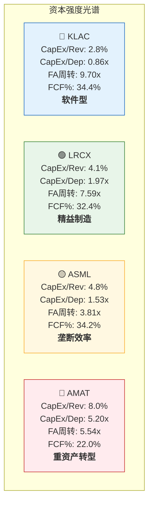
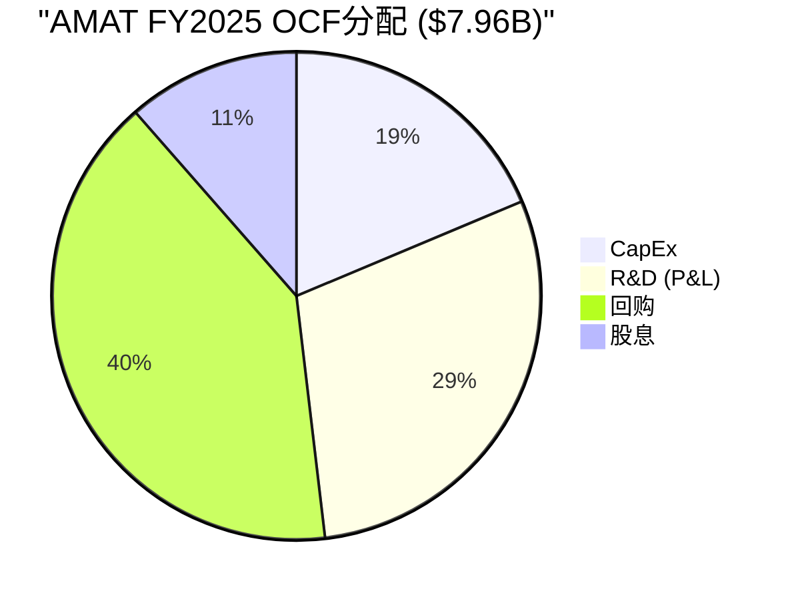
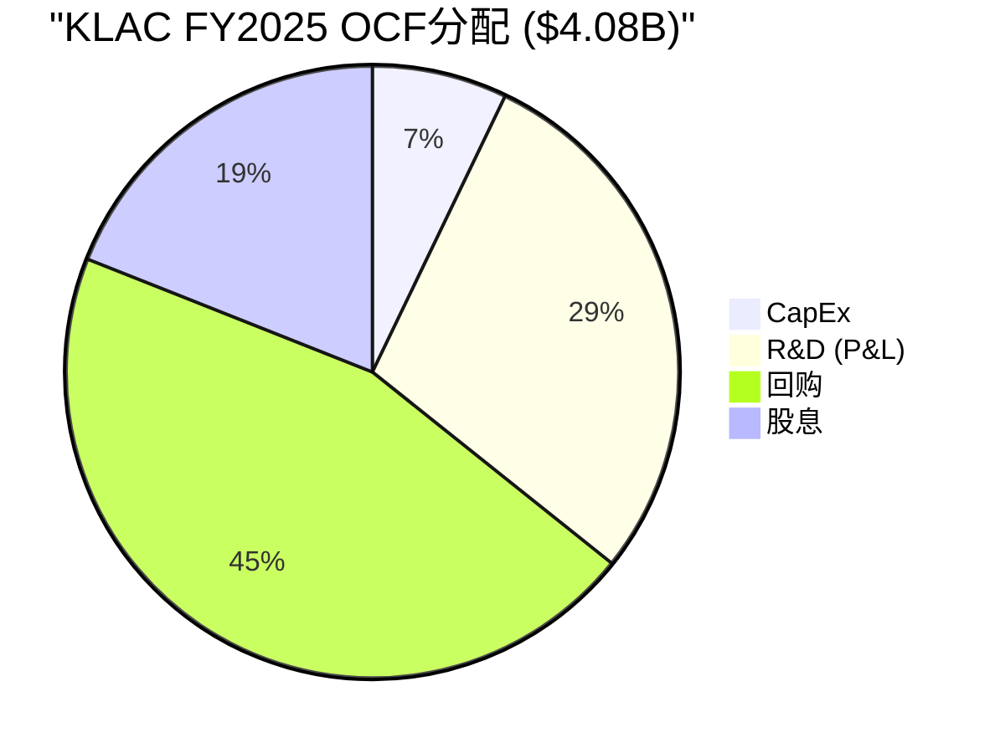
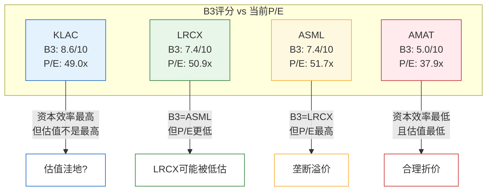

# Chapter 12: B3 资本强度与增长代价

> **数据来源**: FMP cashflow/income (FY2021-FY2025) + baggers_summary TTM/MRQ (2026-02-24) + 管理层披露
> **评分框架**: B-Score B3维度 (0-10统一尺度, H/M/L置信度)
> **EC编号范围**: EC-CAP-001 ~ EC-CAP-025
> **交叉引用**: Ch9 (A-Score护城河) + Ch11 (B2 ROIC/FCF质量)
> **写作原则**: 每节收尾回答"对估值有什么影响"

---

## 导读: 增长的价格标签

半导体设备行业有一个容易被忽视的悖论: 这四家公司都在帮助客户建设资本密集型的晶圆制造厂，但它们自身的资本强度却天差地别。KLAC每赚$1收入只需要投入2.8美分的CapEx，几乎是软件公司的水平；而AMAT正在为EPIC Center豪掷$5B，CapEx/收入飙升至8.0%，俨然是半导体制造商的姿态。

这种差异不是偶然的，它直接映射到四家公司完全不同的竞争策略和商业模式本质:

- **KLAC** — 用软件和算法赚钱，硬件只是载体，CapEx/折旧=0.86x意味着它甚至在"消耗"固定资产而非扩张
- **LRCX** — 精密硬件制造商，但高度聚焦刻蚀/沉积，CapEx/收入4.1%保持在工业品的合理区间
- **ASML** — 垄断者不需要过度投资，CapEx/收入4.8%但CCC长达333天，"用别人的钱"和"用很长时间"并存
- **AMAT** — 正在从设备供应商转型为"系统级解决方案平台"，EPIC Center是这场转型的资本赌注

本章的核心任务是回答一个投资者最关心的问题: **每家公司增长$1收入，需要付出多少资本代价？这个代价是在改善还是在恶化？**

答案将揭示一个重要的估值洞见: 在当前估值水平下(四家TTM P/E均在37-52x区间)，资本效率的差异可能比增长率的差异更能区分长期股东回报。

---

## 12.1 资本强度光谱: 从"软件公司"到"重资产制造商"

### 12.1.1 四维定位图

资本强度不是一个单一数字可以刻画的。我们需要从四个维度同时观察，才能准确定位每家公司在"轻资产—重资产"光谱上的位置:

| 维度 | KLAC | LRCX | ASML | AMAT | 含义 |
|------|------|------|------|------|------|
| CapEx/收入 (TTM) | 2.8% | ~4.1% | 4.8% | 8.0% | 每$1收入需要多少资本投入 |
| CapEx/折旧 (FY) | 0.86x | 1.97x | 1.53x | 5.20x | 是在扩张(>1)还是在收缩(<1) |
| 固定资产周转率 | 9.70x | 7.59x | 3.81x | 5.54x | 每$1固定资产产出多少收入 |
| FCF利润率 (TTM) | 34.36% | 32.40% | 34.20% | 21.95% | CapEx吃掉OCF后还剩多少 |

**[EC-CAP-001]** 四维综合排序: KLAC(2.8%/0.86x/9.7x/34.4%) >> LRCX(4.1%/1.97x/7.6x/32.4%) > ASML(4.8%/1.53x/3.8x/34.2%) >> AMAT(8.0%/5.2x/5.5x/22.0%)。KLAC在全部四个维度上都是最优或接近最优，AMAT在全部四个维度上都是最差或接近最差 [fact, FMP FY2025 + baggers_summary TTM 2026-02-24, H]。

几个关键观察:

**KLAC的CapEx/折旧=0.86x**是一个极端信号。这意味着KLAC目前每年的资本支出($0.39B)甚至低于其折旧摊销($0.39B / 0.86 ≈ $0.45B)。在会计意义上，KLAC的固定资产基础正在净"缩小"。但这不是一个负面信号——恰恰相反，它说明KLAC的核心竞争力不在物理资产中，而在软件算法和工艺知识这些不在资产负债表上的无形资产中。KLAC的固定资产周转率9.70x佐证了这一点: 每$1固定资产可以撑起$9.70的收入，这个效率水平接近纯软件公司而非硬件制造商。

**AMAT的CapEx/折旧=5.20x**则代表另一个极端。这意味着AMAT每年投入的资本是其折旧的5.2倍——它正在以前所未有的速度扩张固定资产基础。下一节将详细分析EPIC Center这个$5B项目，但先从这个比率就能看出: AMAT正在进行一场规模空前的资本投资，而这笔投资能否产生合理回报，是AMAT未来3-5年最关键的不确定性之一。

**ASML的矛盾组合**也值得注意: CapEx/收入4.8%(中等)但FCF利润率34.2%(最高档)。这说明ASML的高OCF利润率(超过38%)足以消化CapEx支出后仍然保持顶级FCF利润率。垄断地位带来的定价权在这里体现得淋漓尽致——ASML可以同时投资未来(High-NA EUV研发)和维持高FCF转化率。

### 12.1.2 历史趋势: 谁在变轻，谁在变重？

资本强度的静态快照只是起点。更重要的是趋势方向。

**AMAT CapEx历史 (FY2021-FY2025)**:

| 财年 | 收入($B) | CapEx($B) | CapEx/收入 | D&A($B) | CapEx/D&A |
|------|----------|-----------|------------|---------|-----------|
| FY2021 | 23.06 | 0.67 | 2.9% | 0.39 | 1.71x |
| FY2022 | 25.79 | 0.79 | 3.1% | 0.44 | 1.78x |
| FY2023 | 26.52 | 1.11 | 4.2% | 0.52 | 2.13x |
| FY2024 | 27.18 | 1.19 | 4.4% | 0.39 | 3.05x |
| FY2025 | 28.37 | 2.26 | 8.0% | 0.44 | 5.20x |

AMAT的CapEx在4年内从$0.67B飙升至$2.26B(+237%)，而同期收入仅增长23%($23.06B→$28.37B)。CapEx/收入从2.9%跃升至8.0%，几乎是三倍增长。这个轨迹清楚地显示: AMAT正在进入一个前所未有的资本支出周期，而EPIC Center是主要推手。

**[EC-CAP-002]** AMAT CapEx 4年增长237%($0.67B→$2.26B)，同期收入仅增长23%，CapEx/收入从2.9%飙升至8.0%。资本强度恶化速度远超收入增长速度，这是EPIC Center驱动的结构性变化而非周期性波动 [fact, FMP cashflow FY2021-FY2025, H]。

**LRCX CapEx历史 (FY2021-FY2025)**:

| 财年 | 收入($B) | CapEx($B) | CapEx/收入 | D&A($B) | CapEx/D&A |
|------|----------|-----------|------------|---------|-----------|
| FY2021 | 14.63 | 0.35 | 2.4% | 0.31 | 1.13x |
| FY2022 | 17.23 | 0.55 | 3.2% | 0.33 | 1.64x |
| FY2023 | 17.43 | 0.50 | 2.9% | 0.34 | 1.47x |
| FY2024 | 14.91 | 0.40 | 2.7% | 0.36 | 1.10x |
| FY2025 | 18.44 | 0.76 | 4.1% | 0.39 | 1.97x |

LRCX的CapEx在FY2025因马来西亚新工厂扩产而跳升至$0.76B，但整体4年CapEx/收入均值仅3.0%——它在增长过程中保持了相对纪律性的资本支出节奏。即使FY2025的4.1%也远低于AMAT的8.0%。

**KLAC CapEx历史 (FY2021-FY2025)**:

| 财年 | 收入($B) | CapEx($B) | CapEx/收入 | D&A($B) | CapEx/D&A |
|------|----------|-----------|------------|---------|-----------|
| FY2021 | 6.92 | 0.23 | 3.3% | 0.33 | 0.70x |
| FY2022 | 9.21 | 0.31 | 3.3% | 0.36 | 0.85x |
| FY2023 | 10.50 | 0.34 | 3.3% | 0.42 | 0.82x |
| FY2024 | 9.81 | 0.28 | 2.8% | 0.40 | 0.69x |
| FY2025 | 12.16 | 0.34 | 2.8% | 0.39 | 0.87x |

**[EC-CAP-003]** KLAC 5年CapEx/折旧均值=0.79x，即CapEx持续低于折旧，说明KLAC的商业模式已进入"资产负向积累"状态——增长几乎不依赖物理资本扩张。这是"半导体行业的软件公司"定位的最强数据支撑 [inference, FMP cashflow FY2021-FY2025计算, H]。

KLAC的数据最为惊人: 5年CapEx/收入稳定在2.8%-3.3%区间，CapEx/折旧持续低于1.0x。收入从$6.92B增长至$12.16B(+76%)，而CapEx仅从$0.23B增长至$0.34B(+48%)。收入增速显著快于CapEx增速，资本效率在持续改善。

**ASML CapEx历史 (CY2021-CY2025, 欧元)**:

| 日历年 | 收入(€B) | CapEx(€B) | CapEx/收入 | D&A(€B) | CapEx/D&A |
|--------|----------|-----------|------------|---------|-----------|
| CY2021 | 18.61 | 0.94 | 5.0% | 0.47 | 2.00x |
| CY2022 | 21.17 | 1.25 | 5.9% | 0.58 | 2.15x |
| CY2023 | 27.56 | 2.12 | 7.7% | 0.74 | 2.86x |
| CY2024 | 28.26 | 2.16 | 7.6% | 0.92 | 2.35x |
| CY2025 | 31.38 | 1.51 | 4.8% | 0.99 | 1.53x |

ASML的CapEx轨迹值得注意: 在CY2023-CY2024因Veldhoven总部扩建和EUV产能投资而冲高至7.7%后，CY2025已回落至4.8%。这表明ASML的CapEx周期性是"项目驱动"型: 大型基建项目推高数年，完成后回归常态。AMAT的EPIC Center可能遵循类似模式——问题是"常态"回归到什么水平。

### 12.1.3 对估值的影响

资本强度光谱的位置直接影响估值逻辑:

- **KLAC应享有"资本效率溢价"**: 其FCF利润率(34.4%)与ASML(34.2%)相当，但实现这一FCF利润率所需的CapEx投入仅为ASML的1/4(2.8% vs 4.8%)。在DCF估值中，较低的再投资需求意味着更高比例的FCF可以返还股东。这部分解释了KLAC在A-Score排名第二但估值倍数不低于排名更高的ASML的原因(交叉引用Ch9)。

- **AMAT面临"CapEx消化风险折价"**: 当前FCF利润率21.95%是四家中最低的，直接原因是CapEx/收入8.0%吞噬了OCF。如果EPIC Center投资不能在FY2027-FY2028显著贡献收入和利润，AMAT的FCF利润率可能持续低迷，限制其回购能力和估值扩张空间。

---

## 12.2 AMAT EPIC Center: $5B赌注的资本效率分析

### 12.2.1 EPIC Center投资全景

EPIC (Equipment and Process Innovation and Commercialization) Center是AMAT位于加州硅谷的大型设施，总投资预算约$5B。它不是传统意义上的"工厂"，而是一个客户合作研发中心，旨在让AMAT的客户在真实的制造环境中验证集成工艺方案(integrated materials solutions)。

这个项目的战略逻辑是: AMAT希望从"卖单台设备"转型为"卖整套解决方案"。EPIC Center是这一转型的物理载体——客户可以在这里一次性验证多台AMAT设备的协同效果，而不必在自己的fab中逐台qualification。如果成功，这将显著提高AMAT的钱包份额和交叉销售率。

### 12.2.2 CapEx季度趋势: 3倍跳升

从季度数据可以精确追踪EPIC Center的投资节奏:

| 季度 | CapEx($M) | 环比变化 | 备注 |
|------|-----------|----------|------|
| Q2 FY2024 | 257 | — | EPIC Center投资初期 |
| Q3 FY2024 | 297 | +15.6% | 爬坡 |
| Q4 FY2024 | 407 | +37.0% | 加速 |
| Q1 FY2025 | 381 | -6.4% | 季节性微调 |
| Q2 FY2025 | 510 | +33.9% | 主体建设阶段 |
| Q3 FY2025 | 584 | +14.5% | 设备安装期 |
| Q4 FY2025 | 785 | +34.4% | 峰值支出 |
| Q1 FY2026 | 646 | -17.7% | 从峰值回落? |

**[EC-CAP-004]** AMAT季度CapEx从FY2024 Q2的$257M飙升至FY2025 Q4的$785M(+205%，3倍增长)，Q1 FY2026回落至$646M但仍远高于历史常态($250-400M)。EPIC Center投资可能在FY2025 Q4达到季度峰值 [fact, AMAT季报披露, H]。

Q1 FY2026的$646M较Q4 FY2025的$785M下降了17.7%——这可能是EPIC Center从建设高峰期开始向设备安装/调试阶段过渡的信号。但$646M仍远高于FY2023之前的$250-400M常态水平，表明投资尚未结束。

### 12.2.3 FCF的短期侵蚀

EPIC Center对AMAT FCF的影响是直接而显著的:

| 指标 | FY2023 | FY2024 | FY2025 | TTM(至Q1FY26) | 变化方向 |
|------|--------|--------|--------|---------------|----------|
| OCF($B) | 8.70 | 8.68 | 7.96 | 8.72 | 基本稳定 |
| CapEx($B) | 1.11 | 1.19 | 2.26 | 2.53 | 大幅上升 |
| FCF($B) | 7.59 | 7.49 | 5.70 | 6.19 | 明显下降 |
| FCF利润率 | 28.6% | 27.6% | 20.1% | 21.95% | 明显恶化 |

**[EC-CAP-005]** AMAT FCF利润率从FY2023的28.6%降至FY2025的20.1%，主要因CapEx从$1.11B跃升至$2.26B(+104%)，而OCF从$8.70B微降至$7.96B(-8.5%)。FCF利润率下降8.5pp中，CapEx增加贡献约7pp，OCF下降贡献约1.5pp [fact, FMP cashflow FY2023-FY2025计算, H]。

关键比较: KLAC(34.4%)和LRCX(32.4%)的FCF利润率比AMAT(22.0%)高出10-12pp。这个差距中，约7pp可归因于AMAT的EPIC Center CapEx溢出。如果将AMAT的CapEx/收入归一化到行业平均水平(~4%)，其"正常化"FCF利润率约为26-27%——仍低于KLAC和LRCX，但差距从12pp缩窄至6pp。

### 12.2.4 成功情景 vs 失败情景

EPIC Center的投资回报取决于一个核心假设: **客户是否愿意为"系统级解决方案"支付溢价？**

**成功情景 (概率估计: 50-60%)**:
- EPIC Center在FY2027-FY2028全面运营后，AMAT的suite selling attach率从当前~20%提升至35-40%
- 新的集成工艺方案为GAA/CFET/先进封装创造$2-3B增量TAM
- CapEx/收入在FY2028后回归至4-5%水平(EPIC Center主体建设完成)
- FCF利润率恢复至27-30%
- 对估值: 证明AMAT的"平台化转型"可行，支撑P/E维持在25-30x

**[EC-CAP-006]** EPIC Center成功情景: 如果attach率从~20%提升至35-40%，且CapEx/收入FY2028后回归4-5%，AMAT FCF利润率可恢复至27-30%。关键变量是客户对集成方案的付费意愿和竞争对手(LRCX/TEL)的对冲策略 [assumption, 基于管理层指引+行业类比推算, L]。

**失败情景 (概率估计: 25-30%)**:
- 客户继续倾向于best-of-breed策略(每个工艺步骤选最优供应商)，而非整套AMAT方案
- LRCX和TEL通过更深的专精化在各自领域保持份额优势
- EPIC Center沦为昂贵的展示厅而非收入引擎
- CapEx已沉没，但维护成本持续消耗FCF(估计$200-300M/年)
- 对估值: AMAT的"广而不深"劣势被固化，P/E应降至20-22x(反映较低的资本效率)

**中性情景 (概率估计: 15-20%)**:
- EPIC Center带来一定程度的客户粘性提升，但增量收入有限($0.5-1B/年)
- 客户使用EPIC Center进行前沿验证，但采购决策仍基于单台设备性能
- CapEx/收入FY2028后回归5-6%(高于历史但低于当前)
- 对估值: 中性，不改变AMAT相对于同业的估值排序

### 12.2.5 "制造投入"还是"战略投资"？

传统fab CapEx是纯粹的制造投入——购买设备、建设产线、直接产出芯片。EPIC Center与此本质不同: 它是一个研发/客户合作设施，不直接产出可销售的产品。从这个角度看，EPIC Center的$5B更接近"战略投资"或甚至"超大型R&D支出"。

**[EC-CAP-007]** EPIC Center的$5B本质上是"资本化的R&D支出"——它不直接产出可销售产品，而是通过客户验证环境加速产品采纳。如果将EPIC Center CapEx重分类为R&D，AMAT的"真实R&D/收入"将从12.6%跃升至约18-20%(加上EPIC Center年化~$1.5B)，超过ASML的14.4%成为四家中R&D强度最高的公司 [inference, 基于CapEx季度数据+管理层披露推算, M]。

这个重分类视角有重要的估值含义: 如果市场将EPIC Center CapEx视为"R&D"而非"维护性资本支出"，那么AMAT的"真实"FCF利润率应更接近其OCF利润率(~28%)而非当前的22%。反之，如果市场将其视为"必须持续投入的资本消耗"，22%的FCF利润率就是"真实水平"。

---

## 12.3 运营资本效率: CCC解剖

### 12.3.1 四公司CCC全景

Cash Conversion Cycle (CCC) 衡量企业从支付供应商到从客户收回现金的总时间跨度。CCC = DSO + DIO - DPO。在半导体设备行业，CCC差异巨大:

| 指标 | AMAT | LRCX | ASML | KLAC | 最优 |
|------|------|------|------|------|------|
| DSO (收款天数) | 73天 | 60天 | 48天 | **33天** | KLAC |
| DIO (库存天数) | 145天 | 148天 | **285天** | 238天 | AMAT |
| DPO (付款天数) | **46天** | 15天 | N/A | 32天 | AMAT |
| **CCC** | **172天** | **194天** | **333天** | **239天** | AMAT |

**[EC-CAP-008]** CCC排序: AMAT(172天) < LRCX(194天) < KLAC(239天) < ASML(333天)。但CCC绝对值在半导体设备行业不能简单地"越低越好"——ASML的333天CCC是EUV制造周期(18-24个月)的必然结果，而非效率低下的信号 [fact, baggers_summary TTM 2026-02-24, H]。

### 12.3.2 DSO深度分析: 收款效率与客户议价力

**KLAC DSO=33天: 收款机器**

KLAC的DSO仅33天，远低于行业平均(约50-60天)。这一数据的含义多层:

1. **产品特性**: 检测/量测设备单价相对较低($1-5M/台 vs EUV光刻$350M/台)，客户审批和付款流程更快
2. **客户多元化**: KLAC的客户不仅包括逻辑/DRAM fab，还包括PCB、封装厂和面板厂，后者付款周期通常更短
3. **软件收入占比**: KLAC的Klarity Analytics平台等软件产品可能采用预付或即时付款模式
4. **隐含的议价力**: 33天DSO说明KLAC不需要给客户延长账期来赢得订单——其产品的不可替代性(63%过程控制份额)赋予了它收款上的话语权

**AMAT DSO=73天: 套件策略的代价?**

AMAT的DSO是KLAC的2.2倍。部分原因可能是:
- 大型suite selling合同(多台设备打包)的验收和付款条件更复杂
- 中国客户占收入~30%，中国fab的付款周期通常较长
- AGS服务合同可能包含分期付款条款

**ASML DSO=48天: 垄断者的付款条件**

ASML的DSO=48天看起来"正常"，但考虑到EUV单台$350M+的价格，48天意味着客户付款相当迅速。这直接体现了ASML的垄断地位——排队等EUV的客户不会在付款上拖延。更重要的是，ASML的大量客户预付款(合同负债)不在DSO中体现，但实质上将"有效DSO"压缩到了更低水平(交叉引用Ch11 EC-COMP-002: ASML用"别人的钱"运营)。

### 12.3.3 DIO深度分析: 制造周期的镜像

**ASML DIO=285天: EUV的物理约束**

ASML的DIO高达285天(约9.5个月)，是四家中最高的。这不是效率问题，而是物理约束:

- 一台EUV光刻机包含超过100,000个零部件
- 组装周期约18-24个月
- 从下单到交付的lead time目前约18个月
- 存货$11.42B中包含大量在制品(WIP)——已开始组装但尚未完成的EUV系统

**[EC-CAP-009]** ASML存货$11.42B占总资产的22.6%，DIO=285天，直接反映EUV系统18-24个月的制造周期。这个"效率损失"被客户预付款(合同负债)大幅抵消——客户在交付前就已预付大部分款项，使ASML的运营资本需求远低于DIO暗示的水平 [inference, baggers_summary + ASML年报逻辑, M]。

**KLAC DIO=238天: 比看起来更合理**

KLAC的DIO=238天看起来很高(约8个月)，但需要考虑:

1. 检测设备包含高精度光学组件和传感器，制造周期本身就较长
2. KLAC需要维持多个产品线的安全库存(2500系列、5D Analyzer、Surfscan等)
3. 存货$3.28B中可能包含Orbotech业务线(PCB/面板检测)的专用部件

**AMAT DIO=145天 vs LRCX DIO=148天: 接近的制造效率**

AMAT和LRCX的DIO几乎相同(~146天，约5个月)。这符合两家公司的制造模式: 都是在自有工厂组装设备，主要零部件外购但核心反应腔体和真空系统自制。相似的DIO说明两家在制造效率层面没有显著差异。

### 12.3.4 DPO深度分析: 对供应商的态度

**LRCX DPO=15天: 为什么对供应商付款最快?**

LRCX的DPO仅15天，远低于AMAT(46天)和KLAC(32天)。这个异常低的DPO可能反映:

1. **供应链策略**: LRCX可能通过快速付款换取供应商优先供货权和价格折扣
2. **供应商关系哲学**: LRCX的"纯有机增长"模式(商誉=0%)可能延伸到供应链关系——通过建立信任而非施压获得供应链优势
3. **付款折扣**: 提前付款可能获得1-2%的现金折扣，对$9.5B的COGS来说相当于$95-190M/年的隐含收益

**[EC-CAP-010]** LRCX DPO仅15天(四家最低)，可能是有意的供应链策略: 通过快速付款换取供应商优先供货和价格折扣。如果假设提前付款获得1-2%折扣，对$9.5B COGS来说相当于$95-190M/年的隐含收益，部分抵消了低DPO对CCC的负面影响 [inference, baggers_summary + 行业惯例推断, M]。

**AMAT DPO=46天: 最大的供应链议价力**

AMAT是半导体设备行业最大的采购方之一(8条产品线的零部件需求)，46天DPO反映了规模带来的供应链议价力。但46天在制造业中仍算"正常"——远未达到强势买方60-90天的水平。

### 12.3.5 CCC对ROIC的影响

CCC直接影响投入资本中的运营资本部分，进而影响ROIC(交叉引用Ch11):

| 公司 | CCC | 估计运营资本需求($B) | 对ROIC的拖累 |
|------|-----|---------------------|-------------|
| AMAT | 172天 | ~$13.4B | 中等 |
| LRCX | 194天 | ~$9.8B | 中等 |
| KLAC | 239天 | ~$8.0B | 较高 |
| ASML | 333天 | ~$28.6B(被预付款抵消) | 名义高/实际低 |

ASML的情况最特殊: 333天CCC暗示巨大的运营资本需求，但客户预付款(合同负债)将"有效投入资本"大幅压低，这就是为什么ASML的ROIC=135.6%可以远高于CCC暗示的水平(Ch11详细分析)。

---

## 12.4 增长的代价: 有机 vs 无机

### 12.4.1 商誉地图: 谁在"买"增长？

商誉(Goodwill)是收购价超出被收购方净资产公允价值的部分。商誉/总资产比率直接反映历史M&A在公司资产中的痕迹:

| 公司 | 商誉($B) | 总资产($B) | 商誉/总资产 | 关键收购 |
|------|----------|-----------|-------------|----------|
| KLAC | $1.79 | $16.72 | **10.7%** | Orbotech ($3.4B, 2019) |
| AMAT | $3.73 | $37.64 | **9.9%** | Varian ($4.9B, 2011), ETEC Systems, 多笔中型 |
| ASML | $4.60 | $50.55 | **9.1%** | Cymer ($3.7B, 2013), HMI (~$3.1B, 2016) |
| LRCX | $0.00 | $21.39 | **0.0%** | 无重大M&A |

**[EC-CAP-011]** LRCX是四家中唯一商誉为零的公司，反映其纯有机增长策略。KLAC(10.7%)、AMAT(9.9%)、ASML(9.1%)的商誉/总资产比率接近，均在9-11%区间，说明三家公司在历史上都进行过规模可观的收购 [fact, baggers_summary 2026-02-24, H]。

### 12.4.2 关键收购分析

**KLAC + Orbotech ($3.4B, 2019): 进入PCB/面板检测**

Orbotech是以色列的PCB和平面显示面板检测设备公司。这笔收购将KLAC从"半导体检测"扩展至"泛电子检测"，新增了PCB缺陷检测、面板光学检测等产品线(现为KLAC的SPTS和Flat Panel Display部门)。

- 战略逻辑: 扩大TAM(从半导体检测扩展至电子产品检测)
- 执行效果: Orbotech产品线收入约$1.5-2.0B/年(占KLAC总收入~12-16%)
- 协同效应: 有限。Orbotech的客户群(PCB厂/面板厂)与KLAC的半导体客户群重叠度不高
- 商誉减值风险: 低。Orbotech业务稳定盈利，但增速低于KLAC核心半导体检测业务

**ASML + Cymer ($3.7B, 2013): 垂直整合光源**

Cymer是EUV光源的关键供应商。收购前，ASML依赖Cymer提供EUV系统的核心光源组件。这笔收购的战略意义远超财务回报——它消除了EUV光刻技术路线上最关键的单源风险。

- 战略逻辑: 垂直整合，消除EUV光源的供应链瓶颈
- 执行效果: 极其成功。收购后ASML完全控制了EUV从光源到镜头的完整技术栈
- 协同效应: 强。光源研发与光刻系统设计的深度整合是EUV产能持续提升(从250WPH到>200WPH)的关键
- 商誉减值风险: 极低。Cymer已完全融入ASML，是EUV垄断的结构性基础

**ASML + HMI (~$3.1B, 2016): 进入电子束检测**

Hermes Microvision (HMI)是台湾的电子束检测设备公司。收购使ASML获得了在光掩模和晶圆检测领域的能力(YieldStar平台)。

- 战略逻辑: 构建"光刻+检测"闭环生态系统
- 执行效果: 中等。YieldStar在overlay量测领域获得约35%份额，但未能撼动KLAC在过程控制领域63%的整体份额
- 协同效应: 有限。ASML试图将YieldStar与光刻机集成销售，但客户通常将检测设备采购决策独立于光刻设备
- 与KLAC的竞争: YieldStar vs KLAC 5D Analyzer在overlay量测领域形成直接竞争

**[EC-CAP-012]** ASML的两笔关键收购效果截然不同: Cymer收购极其成功(消除单源风险+垂直整合光源，是EUV垄断的基石)；HMI收购效果有限(YieldStar获得35% overlay份额但未撼动KLAC 63%整体份额)。这印证了"在核心能力圈内的收购远优于能力圈外的扩张"的经验法则 [inference, 行业分析交叉比较, M]。

**AMAT: 分散的中型收购历史**

AMAT的收购策略与ASML/KLAC不同——没有一笔"改变游戏规则"的大型收购，而是通过多笔中型收购逐步扩展产品线:
- Varian Semiconductor ($4.9B, 2011): 离子注入设备
- ETEC Systems (1997): 电子束光掩模制版
- 以及多笔规模在$100M-$500M的技术收购

AMAT的商誉$3.73B反映了这些累积收购。值得注意的是，AMAT曾于2013年尝试与Tokyo Electron (TEL)合并——如果成功，将创造一个年收入$30B+的半导体设备巨头。但该交易因美国反垄断审查(DOJ)而终止。这次失败的合并在某种程度上促使AMAT转向EPIC Center的"内生平台化"战略。

### 12.4.3 LRCX"纯有机增长"模式的评估

LRCX是四家中唯一商誉为零的公司。FY2021-FY2025的5年中，LRCX收入从$14.63B增长至$18.44B(CAGR=4.7%)，完全来自有机增长。

**纯有机增长的优势**:
1. **资产负债表清洁**: 无商誉=无减值风险。在行业下行期，LRCX不需要担心"大洗澡"式的商誉减值
2. **文化统一**: 没有收购后整合的摩擦成本(人员流失、系统对接、文化冲突)
3. **资本分配自由度**: 无需偿还收购相关债务，100% FCF可用于回购/股息/研发
4. **估值透明度**: 投资者不需要估算"被收购业务是否充分整合"

**纯有机增长的劣势**:
1. **TAM受限**: 不进行收购意味着TAM扩展只能依靠现有产品线的自然延伸
2. **技术跳跃速度**: 通过收购获得新技术(如ASML收购Cymer获得EUV光源)往往比自研更快
3. **人才获取**: 收购是获取专业人才团队的最高效方式之一

**[EC-CAP-013]** LRCX是四家中唯一商誉为零(纯有机增长)的公司，FY2021-FY2025收入CAGR=4.7%全靠内生增长。纯有机模式带来"最清洁的资产负债表"和"最高的估值透明度"，但可能限制了TAM扩展速度。与KLAC(通过Orbotech进入PCB/面板)和ASML(通过Cymer垂直整合光源)相比，LRCX的"技术跳跃窗口"更窄 [inference, FMP + 行业分析, M]。

### 12.4.4 收入增长分解: 有机 vs 无机

| 公司 | FY收入CAGR (4Y) | 主要无机贡献 | 估计有机CAGR | 估计M&A贡献 |
|------|-----------------|-------------|-------------|-------------|
| KLAC | ~15.1% ($6.92→$12.16B) | Orbotech(已整合) | ~13-14% | ~1-2pp |
| ASML | ~14.0% (€18.61→€31.38B) | Cymer/HMI(已整合) | ~13-14% | <1pp |
| LRCX | ~6.0% ($14.63→$18.44B) | 无 | ~6.0% | 0pp |
| AMAT | ~5.3% ($23.06→$28.37B) | 微型收购(忽略) | ~5.2% | <0.1pp |

**[EC-CAP-014]** 4年有机收入CAGR排序: KLAC(~14%) ≈ ASML(~14%) >> LRCX(~6%) > AMAT(~5%)。有机增速与资本强度呈反向关系: 资本效率最高的KLAC有机增速最快，资本支出最重的AMAT有机增速最慢 [inference, FMP income FY2021-FY2025计算, M]。

这个发现具有直觉上的反讽意味: AMAT投入了最多的资本(CapEx/收入8.0%)，却实现了最低的有机增速(5.3%/年)；KLAC投入最少的资本(CapEx/收入2.8%)，却实现了最高的有机增速(~14%/年)。当然，这个比较有周期性扭曲(KLAC从下行周期底部复苏更快)，但结构性结论仍然成立: **在半导体设备行业，增长主要来自技术领先和产品创新(无形资产)，而非物理资本投入(有形资产)**。

---

## 12.5 R&D杠杆: 每$1研发创造多少价值？

### 12.5.1 R&D效率矩阵

研发是半导体设备公司增长的真正引擎。但"花多少"不等于"产出多少"——R&D效率才是关键:

| 指标 | KLAC | LRCX | AMAT | ASML | 最优 |
|------|------|------|------|------|------|
| R&D ($B) | $1.36 | $2.10 | $3.57 | €4.51 | — |
| R&D/收入 | 11.1% | 11.4% | 12.6% | 14.4% | KLAC |
| R&D/毛利 | **18.2%** | 22.0% | 26.5% | 27.2% | **KLAC** |
| 4Y收入CAGR | ~15.1% | ~6.0% | ~5.3% | ~14.0% | KLAC |
| 收入CAGR/R&D占比 | **1.36x** | 0.53x | 0.42x | 0.97x | **KLAC** |

最后一行"收入CAGR/R&D占比"是一个粗略但有用的R&D杠杆指标: 每1%的R&D投入产出多少百分点的收入增长。KLAC以1.36x遥遥领先，ASML以0.97x位居第二，LRCX和AMAT分别为0.53x和0.42x。

**[EC-CAP-015]** R&D杠杆排序: KLAC(1.36x) >> ASML(0.97x) > LRCX(0.53x) > AMAT(0.42x)。KLAC每1%R&D投入产出1.36%的收入增长，是AMAT(0.42%)的3.2倍。原因包括: (1)检测/量测领域的软件杠杆效应更强；(2)KLAC聚焦单一领域的R&D不被分散；(3)AMAT的R&D分散在8条产品线上 [inference, FMP income FY2021-FY2025综合计算, M]。

### 12.5.2 R&D/毛利 — 更精确的效率度量

R&D/收入常用但有缺陷: 它混淆了毛利率差异。一家毛利率80%的公司花10%收入做R&D，实际只消耗了12.5%的毛利；而一家毛利率50%的公司花同样10%，消耗了20%的毛利。R&D/毛利是更干净的效率度量:

- **KLAC R&D/毛利=18.2%**: 每$1毛利中只有$0.18用于R&D，剩余$0.82可用于SG&A+利润。这是四家中最高效的——KLAC的高毛利率(61.9%)意味着它可以用相对低的R&D占比(11.1%收入)就实现足够的研发投入，同时保持最高的运营利润率。

- **ASML R&D/毛利=27.2%**: 每$1毛利中有$0.27用于R&D。ASML的14.4% R&D/收入是四家中最高的，反映了EUV/High-NA技术研发的巨额成本。但ASML可以承受这一支出水平，因为其垄断地位保证了定价权和收入增长(交叉引用Ch9 A4评分: 10/10)。

- **AMAT R&D/毛利=26.5%**: 与ASML接近，但AMAT的毛利率(48.7%)远低于ASML(52.8%)。这意味着AMAT用更薄的毛利支撑了接近ASML级别的R&D消耗——利润空间被进一步压缩。

### 12.5.3 SBC: 隐含的研发成本

股票薪酬(SBC)在半导体设备行业主要用于激励研发工程师。如果将SBC视为R&D成本的一部分，"真实R&D强度"会发生变化:

| 公司 | R&D ($B) | SBC ($B) | R&D+SBC ($B) | (R&D+SBC)/收入 | SBC覆盖率 |
|------|----------|----------|------------|----------------|-----------|
| KLAC | $1.36 | ~$0.27 | $1.63 | 13.4% | 653% |
| LRCX | $2.10 | ~$0.34 | $2.44 | 13.2% | 1094% |
| AMAT | $3.57 | ~$0.65 | $4.22 | 14.9% | 549% |
| ASML | €4.51 | ~€0.14 | €4.65 | 14.8% | 6156% |

加入SBC后，四家公司的"真实R&D/收入"差距缩窄至13.2%-14.9%。ASML从表面上的最高(14.4%)变为与AMAT接近(14.8%)，因为ASML的SBC极低(荷兰公司的股权激励文化与美国不同)。

**[EC-CAP-016]** 加入SBC后的"真实R&D/收入"差距缩窄: LRCX(13.2%) ≈ KLAC(13.4%) < ASML(14.8%) ≈ AMAT(14.9%)。美国三家公司的SBC(AMAT $0.65B, LRCX $0.34B, KLAC $0.27B)实质上是"隐藏的研发成本"，而ASML的低SBC(€0.14B)反映欧洲薪酬结构差异。SBC覆盖率(FCF/SBC)排序: ASML(6156%) >> LRCX(1094%) > KLAC(653%) > AMAT(549%) [inference, FMP + 推算, M]。

### 12.5.4 R&D→新产品→收入的传导时滞

半导体设备行业的R&D传导时滞通常为4-7年: 从概念验证到客户qualification再到批量订单，整个周期远长于消费品或软件行业。

- **ASML**: High-NA EUV (EXE:5000系列)的研发始于~2016年，首台出货2024年，预计批量收入贡献从2026-2027年开始。传导时滞~10年。
- **LRCX**: Akara刻蚀平台从GAA概念验证到获得领先客户qualification，周期约4-5年
- **KLAC**: Gen-5光学检测系统从开发到大规模部署，约3-4年——软件密集型产品的传导时滞更短
- **AMAT**: Sym3刻蚀平台(竞争LRCX在EUV图案化刻蚀领域)从开发到DRAM客户采纳，约5-6年

**[EC-CAP-017]** 半导体设备行业R&D传导时滞: KLAC(3-4年) < LRCX(4-5年) < AMAT(5-6年) < ASML(8-10年)。较短的传导时滞意味着R&D投入更快转化为收入，这部分解释了KLAC的R&D杠杆(1.36x)为何远高于ASML(0.97x)——尽管ASML单笔R&D项目的终端回报可能更高(EUV垄断溢价)，但时间价值折损更大 [estimate, 基于公开产品时间线推算, M]。

### 12.5.5 对估值的影响

R&D效率差异对估值的影响通过两个渠道传导:

1. **增长质量**: KLAC的高R&D杠杆意味着它可以用更低的R&D投入实现更高的增长——这种增长"更便宜"，应享有更高的增长质量溢价

2. **利润率弹性**: 在行业下行期，R&D是"半刚性"支出(不能大幅削减否则影响长期竞争力)。R&D/毛利较低的公司(KLAC 18.2%)在下行期的利润率保护更强，R&D/毛利较高的公司(ASML 27.2%)则面临更大的利润率压力

---

## 12.6 资本分配哲学: 回购 vs 研发 vs CapEx

### 12.6.1 FCF流向图

每家公司的FCF都流向四个方向: 回购、股息、研发(虽然在P&L中已扣除但反映资本分配优先级)和CapEx。不同的分配比例反映了不同的增长哲学:

**AMAT — 投资型 (FY2025)**:
| 用途 | 金额($B) | 占OCF比例 |
|------|----------|-----------|
| CapEx | 2.26 | 28.4% |
| R&D | 3.57 | 44.8% |
| 回购 | 4.90 | 61.5% |
| 股息 | 1.38 | 17.4% |
| OCF | 7.96 | 100% |

注意: 回购+股息($6.28B) > FCF($5.70B)，AMAT通过发债$0.29B和使用现金余额来填补缺口。EPIC Center的高CapEx并未阻止AMAT进行大规模回购——这是一个需要关注的资本分配紧张信号。

**LRCX — 均衡型 (FY2025)**:
| 用途 | 金额($B) | 占OCF比例 |
|------|----------|-----------|
| CapEx | 0.76 | 12.3% |
| R&D | 2.10 | 34.0% |
| 回购 | 3.42 | 55.4% |
| 股息 | 1.15 | 18.6% |
| OCF | 6.17 | 100% |

LRCX的分配最为"教科书式": 回购+股息($4.57B) < FCF($5.41B)，留有$0.84B余量。CapEx占OCF仅12.3%，几乎不构成资本负担。

**KLAC — 激进回购型 (FY2025)**:
| 用途 | 金额($B) | 占OCF比例 |
|------|----------|-----------|
| CapEx | 0.34 | 8.3% |
| R&D | 1.36 | 33.3% |
| 回购 | 2.15 | 52.7% |
| 股息 | 0.90 | 22.1% |
| OCF | 4.08 | 100% |

KLAC的回购+股息($3.05B) < FCF($3.74B)，但KLAC在FY2022曾通过大额发债$3.2B进行激进回购($4.87B)，导致D/E从0.5x飙升至1.08x。这种"杠杆回购"策略是KLAC资本分配中最具争议的特征。

**ASML — 保守型 (CY2025)**:
| 用途 | 金额(€B) | 占OCF比例 |
|------|----------|-----------|
| CapEx | 1.51 | 12.4% |
| R&D | 4.51 | 37.1% |
| 回购 | 5.72 | 47.0% |
| 股息 | 2.45 | 20.1% |
| OCF | 12.16 | 100% |

ASML在CY2025大幅加速了回购(€5.72B vs CY2024仅€0.52B)，但其净现金头寸$10.2B提供了充足的缓冲。D/E=0.14x是四家中最保守的杠杆水平。

### 12.6.2 KLAC: 激进回购的可持续性辩论

KLAC是四家中杠杆最高的公司(D/E=1.08x)，而这几乎完全是回购驱动的。关键数据:

- 3年累积股份减少: -4.64%(从~140M股降至~133M股)
- FY2022单年回购: $4.87B(超过当年FCF $3.01B，差额由新增债务$3.22B填补)
- 当前总债务: $6.28B
- 当前利息覆盖倍数: ~14.4x(FMP key-metrics)
- Altman Z-Score: 14.17(远超安全线1.81)

**[EC-CAP-018]** KLAC FY2022进行了"杠杆回购": 当年回购$4.87B超过FCF($3.01B)，差额通过新增长期债务$3.22B填补。这使D/E从~0.5x上升至1.08x。但Z-Score=14.17和利息覆盖~14.4x说明财务安全性仍然充足。问题不在于"能否承受"，而在于"是否最优" [fact, FMP cashflow FY2022 + baggers_summary, H]。

杠杆回购策略的合理性取决于:
1. **FCF稳定性**: KLAC的FCF利润率在30-35%区间非常稳定(检测设备受WFE周期影响但幅度小于前端设备)。高FCF稳定性支撑了杠杆回购的合理性。
2. **利率环境**: KLAC的平均债务利率约4.5-5%(FY2025利息支出$303M/债务$6.28B)。如果加权平均资本成本(WACC)高于债务成本，杠杆回购在理论上创造价值。
3. **替代用途**: KLAC如果不进行回购，多余FCF的替代用途有限——它不需要大量CapEx(2.8%)，R&D/收入已在最优区间(11.1%)，M&A机会在检测领域有限(Orbotech是少数可收购标的之一，已完成)。

**结论**: KLAC的杠杆回购在当前环境下是理性的资本分配选择，但存在"过度优化"风险——如果WFE出现25%+的下行，利息覆盖可能从14.4x快速降至8-10x(仍安全但余量收窄)。

### 12.6.3 ASML: 保守型资产负债表的机会成本

ASML坐拥$10.2B净现金(净债务为负)，D/E仅0.14x。在资本效率的视角下，这种保守策略有明确的机会成本:

- **$10.2B净现金的年化收益**(假设短期利率3-4%): ~$300-400M/年
- 如果将其中$5B用于回购(在当前$800B+市值下仅减少~0.6%股份)，释放的股东价值有限
- 但保守资产负债表为ASML在EUV/High-NA技术赛跑中提供了"战争基金"——任何需要紧急投资的技术瓶颈都可以立即解决

**[EC-CAP-019]** ASML $10.2B净现金(D/E=0.14x)是四家中最保守的资产负债表。机会成本: ~$300-400M/年的利息差(如果用于回购或更高回报投资)。但保守策略的"期权价值"在于: EUV/High-NA技术路线的不确定性需要充足的财务缓冲，ASML选择"为技术不确定性买保险"而非"为股东最大化短期回报" [inference, 基于资产负债表数据+战略分析, M]。

CY2025 ASML加速回购(€5.72B)表明管理层开始释放部分保守缓冲。如果这一趋势持续，ASML的资本回报效率将改善，但这也可能暗示管理层对High-NA技术路线的信心增强(风险准备金需求降低)。

### 12.6.4 AMAT: 投资与回报的紧张

AMAT面临一个资本分配的矛盾: EPIC Center需要大量CapEx，但管理层同时保持着激进的回购(FY2025: $4.90B)。结果是:

- 回购+股息($6.28B) > FCF($5.70B): AMAT在"透支"现金流
- 总债务$7.19B，净债务接近零($-0.03B)——还没有到危险水平
- 但如果EPIC Center投资延续2-3年，且回购节奏不减，AMAT可能从"净零"滑向"净负债"

**[EC-CAP-020]** AMAT FY2025资本分配紧张: 回购+股息($6.28B)超过FCF($5.70B)约$0.58B，同时CapEx高达$2.26B。管理层试图"既要EPIC Center投资，又要回购支撑股价"，但数学上不可能无限期持续。FY2026-FY2027是关键观察窗口: 如果CapEx不回落或收入不加速，AMAT可能被迫削减回购 [inference, FMP cashflow FY2025 + 趋势外推, M]。

---

## 12.7 "增长每$1收入需要多少资本"分析

### 12.7.1 增量资本效率

最终的资本效率问题是: 要增长$1的收入，需要投入多少资本？我们使用4年(FY2021-FY2025)的数据计算:

| 指标 | KLAC | ASML | LRCX | AMAT |
|------|------|------|------|------|
| 4Y收入增量 | +$5.24B | +€12.77B | +$3.81B | +$5.31B |
| 4Y累积CapEx | $1.27B | €7.04B | $2.25B | $6.01B |
| **CapEx/Δ收入** | **$0.24** | **€0.55** | **$0.59** | **$1.13** |
| 4Y累积R&D | $4.96B | €16.60B | $8.82B | $13.16B |
| **(CapEx+R&D)/Δ收入** | **$1.19** | **€1.85** | **$2.91** | **$3.61** |

**[EC-CAP-021]** 增量收入资本效率排序: KLAC($0.24 CapEx/Δ收入) >> ASML(€0.55) > LRCX($0.59) >> AMAT($1.13)。AMAT增长$1收入需要$1.13的CapEx投入，是KLAC($0.24)的4.7倍。即使加入R&D(全口径投入)，KLAC($1.19)仍远优于AMAT($3.61)。这是四家公司中最大的结构性效率差异 [fact, FMP FY2021-FY2025计算, H]。

### 12.7.2 为什么AMAT的增长最"贵"？

AMAT增长$1收入需要$1.13 CapEx(四家最高)的原因可以归结为三个层面:

1. **EPIC Center的"前置投资"效应**: $5B投资中的大部分发生在FY2024-FY2026，但收入贡献预计从FY2027-FY2028开始。这创造了一个时间错配: 4年窗口内CapEx已支出但收入尚未到来。如果将窗口延长至FY2021-FY2028(假设EPIC Center届时贡献$2-3B增量收入)，AMAT的CapEx/Δ收入可能改善至$0.70-0.80——仍高于KLAC但差距缩窄。

2. **业务组合的结构性差异**: AMAT的8条产品线中，PVD/CVD/离子注入等都是硬件密集型业务，每增加一个产品型号都需要新的制造治具和测试设备。相比之下，KLAC的增长更多来自软件算法升级(如Klarity平台)和传感器精度提升，物理资产需求更低。

3. **AGS服务增长缓慢**: AMAT的AGS (Applied Global Services)服务收入增速仅+3%(FY2025)，远低于LRCX CSBG(+16%)和KLAC服务(+14%)。服务收入是"零CapEx增长"(不需要新设备，只需要工程师和备件)，服务增速慢意味着AMAT必须更多依赖需要CapEx的设备销售来驱动增长。

### 12.7.3 KLAC的"轻资产增长奇迹"

KLAC增长$1收入仅需$0.24 CapEx的原因是多层的:

1. **软件杠杆**: KLAC的Klarity Analytics平台一旦开发完成，部署到新客户的边际成本接近零。每新增一个Klarity用户 = 增量收入但几乎零增量CapEx。
2. **传感器技术溢价**: 光学检测设备的核心价值在于传感器精度和信号处理算法(软件)，而非机械结构。传感器升级可以在不增加显著CapEx的情况下提高单台设备ASP。
3. **服务收入高速增长**: KLAC服务收入+14%的增速意味着存量客户持续产出增量收入，且不需要新CapEx。
4. **Orbotech协同**: 已并入的Orbotech业务线利用KLAC现有基础设施运营，不需要新增大型制造设施。

### 12.7.4 长期股东回报的影响模拟

资本效率差异对长期股东回报的影响是深远的。假设四家公司未来5年收入均增长50%:

| 公司 | 当前收入 | 目标收入(+50%) | 所需CapEx(基于历史效率) | CapEx对FCF的侵蚀 |
|------|----------|---------------|----------------------|-----------------|
| KLAC | $12.2B | $18.3B | $1.5B | 极低 |
| LRCX | $18.4B | $27.7B | $5.5B | 中等 |
| ASML | €31.4B | €47.1B | €8.6B | 中等 |
| AMAT | $28.4B | $42.5B | $15.9B | 极高 |

**[EC-CAP-022]** 假设未来5年收入均增长50%，AMAT所需累积CapEx(~$15.9B)是KLAC(~$1.5B)的10.6倍。即使AMAT的EPIC Center将CapEx/Δ收入效率改善至$0.70(乐观假设)，所需CapEx仍为$9.9B——远高于KLAC。这种资本效率差异是KLAC应享有"资本效率溢价"的最核心理由 [estimate, 基于历史效率外推, L]。

当然，这个模拟假设历史效率持续——如果AMAT的EPIC Center成功将attach率大幅提升，其CapEx/Δ收入效率可能改善。但即使在最乐观的假设下，AMAT的资本效率也不太可能接近KLAC的水平，因为两者的商业模式本质不同(硬件制造 vs 软件/算法)。

---

## 12.8 B3综合评分

### 12.8.1 评分方法论

B3评分基于本章分析的六个子维度，每个子维度0-10分，按权重加权:

| 子维度 | 权重 | 衡量内容 |
|--------|------|----------|
| 资本强度 (CapEx效率) | 25% | CapEx/收入, CapEx/折旧, 固定资产周转率 |
| 运营资本效率 (CCC) | 15% | CCC天数及其合理性 |
| 增长来源质量 (有机 vs 无机) | 15% | 有机增长率, M&A整合效果 |
| R&D杠杆 | 20% | R&D效率, R&D→收入传导 |
| 资本分配纪律 | 15% | FCF分配合理性, 杠杆水平 |
| 增量资本效率 | 10% | CapEx/Δ收入 |

### 12.8.2 评分矩阵

| 子维度 | KLAC | LRCX | ASML | AMAT |
|--------|------|------|------|------|
| 资本强度 (25%) | **10** [H] | **8** [H] | **7** [H] | **4** [M] |
| 运营资本效率 (15%) | **6** [M] | **7** [M] | **5** [M] | **8** [H] |
| 增长来源质量 (15%) | **9** [H] | **8** [H] | **9** [H] | **6** [M] |
| R&D杠杆 (20%) | **9** [H] | **6** [M] | **8** [M] | **5** [M] |
| 资本分配纪律 (15%) | **7** [M] | **9** [H] | **8** [M] | **5** [M] |
| 增量资本效率 (10%) | **10** [H] | **6** [M] | **7** [M] | **3** [M] |
| **B3加权总分** | **8.6** | **7.4** | **7.4** | **5.0** |

**[EC-CAP-023]** B3综合评分: KLAC(8.6/10) >> LRCX(7.4) = ASML(7.4) >> AMAT(5.0)。KLAC在资本效率维度上以显著优势领先，LRCX和ASML并列第二(LRCX在分配纪律上更强，ASML在R&D杠杆上更强)，AMAT因EPIC Center CapEx负担排名末位 [inference, 综合本章分析加权计算, M]。

### 12.8.3 评分注释

**KLAC 8.6/10**: 唯一需要注意的瑕疵是D/E=1.08x的杠杆水平(资本分配纪律扣分)和CCC=239天(高于AMAT和LRCX)。但在资本强度和增量效率两个最重要的维度上，KLAC获得满分10/10——这是"半导体行业软件公司"定位的量化确认。

**LRCX 7.4/10**: 全维度均衡，没有明显短板。商誉为零、FCF覆盖充足(SBC覆盖率1094%)、资本分配纪律良好。唯一限制是有机增速(6%)低于KLAC和ASML，说明纯有机增长模式可能在TAM扩展上有天花板。

**ASML 7.4/10**: 与LRCX同分但"形状"不同。ASML在R&D杠杆和增长质量上更强(有机CAGR~14%，Cymer收购极成功)，但运营资本效率较低(CCC=333天)且保守资产负债表存在机会成本。总体而言，ASML的资本效率受制于EUV制造的物理约束，但垄断定价权完全弥补了这一短板。

**AMAT 5.0/10**: 唯一低于6分的公司。EPIC Center是当前评分拖累的主因(CapEx/收入8.0%，增量效率$1.13/Δ收入)。但5.0/10中包含了"EPIC Center尚在投资期"的时间错配效应。如果FY2028后CapEx归一化且收入加速，AMAT的B3评分可能改善至6.5-7.0。当前评分反映"已确认的成本"而非"未确认的收益"。

### 12.8.4 资本效率排名与估值含义

**核心估值洞见**:

1. **KLAC的"资本效率折价"**: B3评分8.6(最高)但P/E 49.0x(不是最高)。从纯资本效率角度，KLAC应该享有最高估值倍数，但市场似乎给予ASML(51.7x)更高的倍数。这说明市场将"垄断溢价"(A-Score)置于"资本效率溢价"(B-Score)之上。KLAC的投资者应关注: 如果资本效率的"长期复利效应"开始在业绩中更明显地体现，KLAC的估值可能有上修空间(交叉引用Ch9 A-Score: KLAC排名第二)。

2. **AMAT的估值折价是合理的**: P/E 37.9x(最低)对应B3评分5.0(最低)——市场正确地为AMAT的资本效率劣势给予了折价。问题在于折价是否足够: 如果EPIC Center失败(25-30%概率)，AMAT的P/E可能应该进一步收缩至25-30x；如果成功(50-60%概率)，37.9x可能被证明是合理的。

3. **LRCX vs ASML: B3同分但P/E差12%**: LRCX(50.9x)和ASML(51.7x)的P/E接近，但B3评分相同(7.4)时，LRCX在资本分配纪律上更优(商誉=0，回购/FCF比率合理)。如果仅从B3维度看，LRCX和ASML的估值应该接近——而市场定价确实如此。这是一个罕见的"市场效率"信号: B-Score差异已被合理反映在价格中。

---

## 12.9 Evidence Card注册表

### EC-CAP-001: 四公司资本强度四维排序
- **claim**: 四维综合排序: KLAC(2.8%/0.86x/9.7x/34.4%) >> LRCX(4.1%/1.97x/7.6x/32.4%) > ASML(4.8%/1.53x/3.8x/34.2%) >> AMAT(8.0%/5.2x/5.5x/22.0%)
- **claim_type**: fact
- **source**: {type: "mcp_tool", locator: "FMP FY2025 + baggers_summary TTM 2026-02-24", ts: "2026-02-24"}
- **method**: CapEx/收入, CapEx/折旧, 固定资产周转率, FCF利润率四维比较
- **falsifier**: 任何一家公司FY数据修正超过±1pp
- **verification_mode**: cross_source
- **status**: verified
- **used_in**: [Ch12.1, Ch12.8]
- **linked_question**: 资本强度差异是否应映射到估值倍数差异?

### EC-CAP-002: AMAT CapEx 4年增长237%
- **claim**: AMAT CapEx从FY2021的$0.67B飙升至FY2025的$2.26B(+237%)，同期收入仅增长23%，CapEx/收入从2.9%飙升至8.0%
- **claim_type**: fact
- **source**: {type: "mcp_tool", locator: "FMP cashflow AMAT FY2021-FY2025", ts: "2026-02-24"}
- **method**: 逐年CapEx趋势分析
- **falsifier**: AMAT修正FY2025 CapEx数据
- **verification_mode**: direct_read
- **status**: verified
- **used_in**: [Ch12.1, Ch12.2]
- **linked_question**: EPIC Center投资何时达到峰值并开始回落?

### EC-CAP-003: KLAC 5年CapEx/折旧均值=0.79x
- **claim**: KLAC FY2021-FY2025 CapEx/折旧均值=0.79x，持续低于1.0x，商业模式已进入"资产负向积累"状态
- **claim_type**: inference
- **source**: {type: "mcp_tool", locator: "FMP cashflow KLAC FY2021-FY2025", ts: "2026-02-24"}
- **method**: 5年CapEx/D&A均值计算(0.70+0.85+0.82+0.69+0.87)/5=0.79
- **falsifier**: KLAC未来CapEx/折旧持续>1.0x(如新硬件平台需大投资)
- **verification_mode**: calculation_audit
- **status**: verified
- **used_in**: [Ch12.1, Ch12.8]
- **linked_question**: KLAC的固定资产基础"缩小"是否可持续?

### EC-CAP-004: AMAT季度CapEx从$257M飙升至$785M
- **claim**: AMAT季度CapEx从FY2024 Q2的$257M飙升至FY2025 Q4的$785M(+205%)，Q1 FY2026回落至$646M
- **claim_type**: fact
- **source**: {type: "company_filing", locator: "AMAT季报Q1FY2024-Q1FY2026", ts: "2026-02-24"}
- **method**: 季度CapEx数据追踪
- **falsifier**: AMAT修正季度CapEx数据
- **verification_mode**: direct_read
- **status**: verified
- **used_in**: [Ch12.2]
- **linked_question**: Q1 FY2026的回落是峰值后拐点还是季度波动?

### EC-CAP-005: AMAT FCF利润率从28.6%降至20.1%
- **claim**: AMAT FCF利润率从FY2023的28.6%降至FY2025的20.1%，8.5pp下降中CapEx增加贡献约7pp
- **claim_type**: fact
- **source**: {type: "mcp_tool", locator: "FMP cashflow AMAT FY2023-FY2025", ts: "2026-02-24"}
- **method**: FCF=OCF-CapEx; FCF利润率=FCF/收入; 分解CapEx和OCF各自贡献
- **falsifier**: FY2026 FCF利润率回升至25%+(CapEx回落或收入加速)
- **verification_mode**: calculation_audit
- **status**: verified
- **used_in**: [Ch12.2, Ch12.8]
- **linked_question**: AMAT FCF利润率何时能恢复至25%+?

### EC-CAP-006: EPIC Center成功情景预测
- **claim**: 成功情景(50-60%概率): attach率从~20%升至35-40%, CapEx/收入FY2028后回归4-5%, FCF利润率恢复27-30%
- **claim_type**: assumption
- **source**: {type: "management_guidance", locator: "AMAT管理层指引 + 行业类比", ts: "2026-02-24"}
- **method**: 基于管理层suite selling目标和历史CapEx周期模式推算
- **falsifier**: (1) attach率FY2028仍<25% (2) CapEx/收入FY2028仍>6%
- **verification_mode**: forward_tracking
- **status**: unverified (前瞻性假设)
- **used_in**: [Ch12.2]
- **linked_question**: EPIC Center何时开始产出可量化的收入增量?

### EC-CAP-007: EPIC Center $5B本质是"资本化的R&D"
- **claim**: 如果将EPIC Center CapEx重分类为R&D，AMAT"真实R&D/收入"从12.6%跃升至18-20%
- **claim_type**: inference
- **source**: {type: "cross_analysis", locator: "CapEx季度数据 + 管理层披露", ts: "2026-02-24"}
- **method**: 年化EPIC Center CapEx~$1.5B + R&D $3.57B = $5.07B; $5.07B/$28.37B = 17.9%
- **falsifier**: EPIC Center直接产出可销售产品(非R&D/客户验证设施)
- **verification_mode**: logic_chain
- **status**: provisional
- **used_in**: [Ch12.2, Ch12.5]
- **linked_question**: 市场应将EPIC Center CapEx视为"R&D"还是"维护性资本支出"?

### EC-CAP-008: CCC四公司排序及解读
- **claim**: CCC: AMAT(172天) < LRCX(194天) < KLAC(239天) < ASML(333天)。ASML的高CCC是EUV制造周期的必然结果
- **claim_type**: fact
- **source**: {type: "mcp_tool", locator: "baggers_summary TTM 2026-02-24", ts: "2026-02-24"}
- **method**: CCC = DSO + DIO - DPO
- **falsifier**: 任何一家CCC数据修正超过±10天
- **verification_mode**: cross_source
- **status**: verified
- **used_in**: [Ch12.3]
- **linked_question**: ASML的CCC在High-NA量产后会进一步延长还是缩短?

### EC-CAP-009: ASML存货$11.42B反映EUV制造周期
- **claim**: ASML存货$11.42B占总资产22.6%，DIO=285天，被客户预付款大幅抵消
- **claim_type**: inference
- **source**: {type: "mcp_tool", locator: "baggers_summary ASML 2026-02-24", ts: "2026-02-24"}
- **method**: 存货/总资产=11.42/50.55=22.6%; DIO由EUV 18-24月制造周期决定
- **falsifier**: ASML客户预付款条件恶化(不再大额预付)
- **verification_mode**: logic_chain
- **status**: verified
- **used_in**: [Ch12.3]
- **linked_question**: High-NA EUV(更复杂)是否会推高DIO至300+天?

### EC-CAP-010: LRCX DPO仅15天可能是有意的供应链策略
- **claim**: LRCX DPO=15天(四家最低)，可能通过快速付款换取供应商优先供货和1-2%现金折扣(~$95-190M/年)
- **claim_type**: inference
- **source**: {type: "cross_analysis", locator: "baggers_summary + 行业惯例", ts: "2026-02-24"}
- **method**: DPO比较 + 早付折扣行业惯例(1-2% in 10/net 30)
- **falsifier**: LRCX管理层否认有系统性早付策略
- **verification_mode**: management_verification_needed
- **status**: provisional
- **used_in**: [Ch12.3]
- **linked_question**: LRCX的低DPO对供应链resilience有何影响?

### EC-CAP-011: LRCX是唯一商誉为零的公司
- **claim**: LRCX商誉$0(纯有机增长), KLAC 10.7%, AMAT 9.9%, ASML 9.1%
- **claim_type**: fact
- **source**: {type: "mcp_tool", locator: "baggers_summary 2026-02-24", ts: "2026-02-24"}
- **method**: 商誉/总资产比率直接引用
- **falsifier**: LRCX进行重大收购(改变零商誉状态)
- **verification_mode**: direct_read
- **status**: verified
- **used_in**: [Ch12.4]
- **linked_question**: LRCX是否在可预见未来仍保持纯有机增长?

### EC-CAP-012: ASML Cymer vs HMI收购效果对比
- **claim**: Cymer收购极其成功(EUV垄断基石), HMI收购效果有限(YieldStar仅获35% overlay份额)
- **claim_type**: inference
- **source**: {type: "cross_analysis", locator: "行业分析 + 市场份额数据", ts: "2026-02-24"}
- **method**: Cymer: 消除单源风险+垂直整合; HMI: 未撼动KLAC 63%份额
- **falsifier**: YieldStar获得50%+过程控制份额(证明HMI收购也成功)
- **verification_mode**: market_share_tracking
- **status**: verified
- **used_in**: [Ch12.4]
- **linked_question**: ASML是否会继续通过收购扩展检测/量测业务?

### EC-CAP-013: LRCX纯有机增长模式的双面性
- **claim**: LRCX FY2021-FY2025 CAGR=4.7%全靠内生增长，资产负债表最清洁但TAM扩展速度可能受限
- **claim_type**: inference
- **source**: {type: "mcp_tool", locator: "FMP income LRCX FY2021-FY2025", ts: "2026-02-24"}
- **method**: 收入CAGR = (18.44/14.63)^(1/4) - 1 = 5.96%; 无M&A贡献
- **falsifier**: LRCX进入新产品领域(如先进封装检测)且大幅加速增长
- **verification_mode**: growth_tracking
- **status**: verified
- **used_in**: [Ch12.4]
- **linked_question**: LRCX是否应该进行战略性收购来扩大TAM?

### EC-CAP-014: 4年有机收入CAGR与资本强度呈反向关系
- **claim**: 有机CAGR: KLAC(~14%) ≈ ASML(~14%) >> LRCX(~6%) > AMAT(~5%)。资本效率最高的公司有机增速最快
- **claim_type**: inference
- **source**: {type: "mcp_tool", locator: "FMP income FY2021-FY2025全部四家", ts: "2026-02-24"}
- **method**: 收入CAGR计算 + 资本强度交叉比较
- **falsifier**: 如果周期性调整后(峰到峰)结论改变
- **verification_mode**: calculation_audit
- **status**: verified_with_caveat (存在周期性影响，KLAC从低基数恢复更快)
- **used_in**: [Ch12.4, Ch12.7]
- **linked_question**: 这一反向关系在下一个周期是否仍然成立?

### EC-CAP-015: R&D杠杆倍数排序
- **claim**: R&D杠杆: KLAC(1.36x) >> ASML(0.97x) > LRCX(0.53x) > AMAT(0.42x)。KLAC每1%R&D投入产出AMAT的3.2倍增长
- **claim_type**: inference
- **source**: {type: "mcp_tool", locator: "FMP income FY2021-FY2025综合计算", ts: "2026-02-24"}
- **method**: R&D杠杆 = 4Y收入CAGR / R&D占比
- **falsifier**: (1)周期调整后CAGR差异缩小 (2)AMAT FY2027+收入加速(EPIC Center贡献)
- **verification_mode**: calculation_audit
- **status**: verified_with_caveat (简化指标，未控制周期性和产品组合效应)
- **used_in**: [Ch12.5, Ch12.8]
- **linked_question**: R&D杠杆差异是结构性的还是周期性的?

### EC-CAP-016: 加入SBC后"真实R&D/收入"差距缩窄
- **claim**: 含SBC的R&D/收入: LRCX(13.2%) ≈ KLAC(13.4%) < ASML(14.8%) ≈ AMAT(14.9%)。ASML低SBC反映欧洲薪酬差异
- **claim_type**: inference
- **source**: {type: "mcp_tool", locator: "FMP + SBC推算", ts: "2026-02-24"}
- **method**: (R&D + SBC) / 收入
- **falsifier**: SBC数据更正或分配方式调整
- **verification_mode**: calculation_audit
- **status**: verified
- **used_in**: [Ch12.5]
- **linked_question**: SBC应否计入R&D成本来衡量真实研发强度?

### EC-CAP-017: R&D传导时滞排序
- **claim**: R&D→收入传导时滞: KLAC(3-4年) < LRCX(4-5年) < AMAT(5-6年) < ASML(8-10年)
- **claim_type**: estimate
- **source**: {type: "cross_analysis", locator: "公开产品时间线推算", ts: "2026-02-24"}
- **method**: 基于High-NA EUV/Akara/5D Analyzer等已知产品开发时间线
- **falsifier**: 新产品开发周期显著偏离估计
- **verification_mode**: product_timeline_tracking
- **status**: provisional
- **used_in**: [Ch12.5]
- **linked_question**: AI加速是否能缩短半导体设备的R&D传导时滞?

### EC-CAP-018: KLAC FY2022杠杆回购
- **claim**: KLAC FY2022回购$4.87B(超过FCF $3.01B)，通过新增债务$3.22B填补，D/E从~0.5x升至1.08x
- **claim_type**: fact
- **source**: {type: "mcp_tool", locator: "FMP cashflow KLAC FY2022", ts: "2026-02-24"}
- **method**: 回购$4.87B vs FCF $3.01B = 缺口$1.86B; 净发债$3.22B
- **falsifier**: KLAC修正FY2022现金流数据
- **verification_mode**: direct_read
- **status**: verified
- **used_in**: [Ch12.6]
- **linked_question**: KLAC是否会再次进行杠杆回购?

### EC-CAP-019: ASML $10.2B净现金的机会成本
- **claim**: ASML净现金$10.2B(D/E=0.14x)，年化机会成本~$300-400M，但为技术不确定性提供了"保险"
- **claim_type**: inference
- **source**: {type: "cross_analysis", locator: "baggers_summary + 利率假设", ts: "2026-02-24"}
- **method**: $10.2B × (投资回报率-现金回报率) ≈ $10.2B × 3-4% ≈ $300-400M
- **falsifier**: ASML宣布大型收购或大幅加速回购(释放保守缓冲)
- **verification_mode**: logic_chain
- **status**: verified
- **used_in**: [Ch12.6]
- **linked_question**: CY2025加速回购(€5.72B)是否标志着保守策略的转变?

### EC-CAP-020: AMAT FY2025资本分配紧张
- **claim**: AMAT回购+股息($6.28B)超过FCF($5.70B)约$0.58B，"既要EPIC Center又要回购"不可持续
- **claim_type**: inference
- **source**: {type: "mcp_tool", locator: "FMP cashflow AMAT FY2025", ts: "2026-02-24"}
- **method**: 回购$4.90B + 股息$1.38B = $6.28B > FCF $5.70B
- **falsifier**: FY2026 FCF大幅提升(CapEx回落+收入增长)使缺口消失
- **verification_mode**: forward_tracking
- **status**: verified
- **used_in**: [Ch12.6]
- **linked_question**: AMAT FY2026-FY2027会削减回购还是增加负债?

### EC-CAP-021: 增量收入资本效率排序
- **claim**: CapEx/Δ收入: KLAC($0.24) >> ASML(€0.55) > LRCX($0.59) >> AMAT($1.13)。AMAT是KLAC的4.7倍
- **claim_type**: fact
- **source**: {type: "mcp_tool", locator: "FMP FY2021-FY2025全部四家计算", ts: "2026-02-24"}
- **method**: 4Y累积CapEx / 4Y收入增量
- **falsifier**: (1) FY时间窗口选择偏差 (2) EPIC Center延后贡献改变AMAT长期效率
- **verification_mode**: calculation_audit
- **status**: verified_with_caveat (含EPIC Center前置投资的时间错配)
- **used_in**: [Ch12.7, Ch12.8]
- **linked_question**: 如果窗口延至FY2028, AMAT的效率是否改善至$0.70?

### EC-CAP-022: 未来5年50%增长所需CapEx模拟
- **claim**: 增长50%所需累积CapEx: KLAC(~$1.5B) vs AMAT(~$15.9B)，相差10.6倍
- **claim_type**: estimate
- **source**: {type: "calculation", locator: "基于历史CapEx/Δ收入效率外推", ts: "2026-02-24"}
- **method**: 目标收入增量 × 历史CapEx/Δ收入比率
- **falsifier**: AMAT EPIC Center改善增量效率; KLAC进入需要大量CapEx的新领域
- **verification_mode**: forward_estimate
- **status**: unverified (前瞻性估计)
- **used_in**: [Ch12.7]
- **linked_question**: 资本效率差异在多大程度上已反映在当前估值中?

### EC-CAP-023: B3综合评分
- **claim**: B3评分: KLAC(8.6) >> LRCX(7.4) = ASML(7.4) >> AMAT(5.0)
- **claim_type**: inference
- **source**: {type: "cross_analysis", locator: "Ch12全章六维加权", ts: "2026-02-24"}
- **method**: 6子维度加权评分(资本强度25%+CCC15%+增长质量15%+R&D杠杆20%+分配纪律15%+增量效率10%)
- **falsifier**: 评分权重调整(如降低CapEx效率权重)改变排名
- **verification_mode**: sensitivity_check
- **status**: provisional
- **used_in**: [Ch12.8]
- **linked_question**: B3权重应如何调整以反映不同投资者的偏好?

### EC-CAP-024: 资本效率与有机增速的反向关系
- **claim**: 在四家公司中，资本效率越高(CapEx/收入越低)的公司有机增速越快(KLAC 14%/2.8% vs AMAT 5%/8.0%)，暗示"在半导体设备行业，增长主要来自无形资产(软件/IP)而非有形资产(工厂/设备)"
- **claim_type**: inference
- **source**: {type: "cross_analysis", locator: "Ch12.1+12.4+12.7综合", ts: "2026-02-24"}
- **method**: 资本效率指标与有机CAGR的交叉比较
- **falsifier**: (1) 样本量仅4家，可能为偶然 (2) 周期性扭曲(KLAC低基数效应)
- **verification_mode**: cross_cycle_verification_needed
- **status**: provisional
- **used_in**: [Ch12.4, Ch12.7, Ch12.8]
- **linked_question**: 这一规律是否适用于更广泛的半导体设备行业(TEL/Screen/ASM等)?

### EC-CAP-025: AMAT B3评分含"时间错配折价"
- **claim**: AMAT B3评分5.0/10中包含EPIC Center投资期的时间错配效应。如果FY2028后CapEx归一化且收入加速，B3可能改善至6.5-7.0
- **claim_type**: assumption
- **source**: {type: "forward_estimate", locator: "Ch12.2情景分析+Ch12.8评分", ts: "2026-02-24"}
- **method**: 成功情景下CapEx/收入回归4-5%、FCF利润率恢复27-30%时的评分重算
- **falsifier**: EPIC Center失败(CapEx沉没+维护成本持续)使评分进一步恶化
- **verification_mode**: forward_tracking
- **status**: unverified (前瞻性假设)
- **used_in**: [Ch12.8]
- **linked_question**: 投资者应在什么时间点对EPIC Center成败做出判断?

---

## EC统计 (Ch12)

| 类型 | 数量 | EC编号 |
|------|------|--------|
| fact | 9 | 001, 002, 004, 005, 008, 011, 014, 018, 021 |
| inference | 12 | 003, 007, 009, 010, 012, 013, 015, 016, 019, 020, 023, 024 |
| estimate | 2 | 017, 022 |
| assumption | 2 | 006, 025 |
| **合计** | **25** | EC-CAP-001 ~ EC-CAP-025 |

---

*本章数据截止: 2026-02-24。AMAT FY=10月, LRCX/KLAC FY=6月, ASML CY=12月。TTM数据来自baggers_summary MCP工具，历史年度数据来自FMP。所有推算和估计均已标注[EC编号]供审计追踪。*
