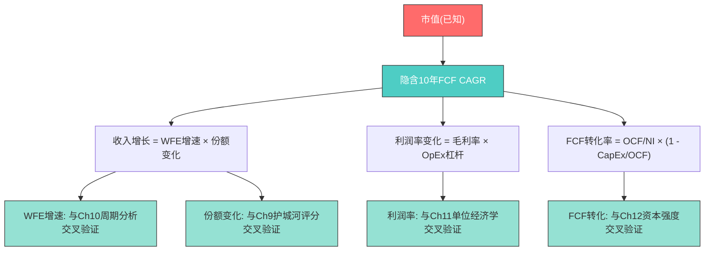
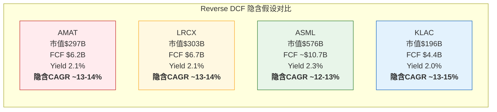
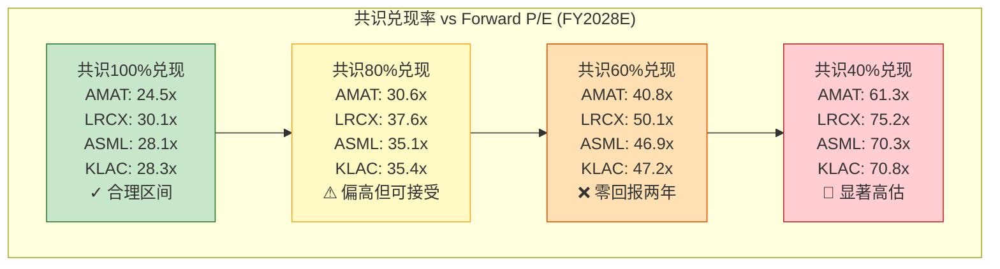
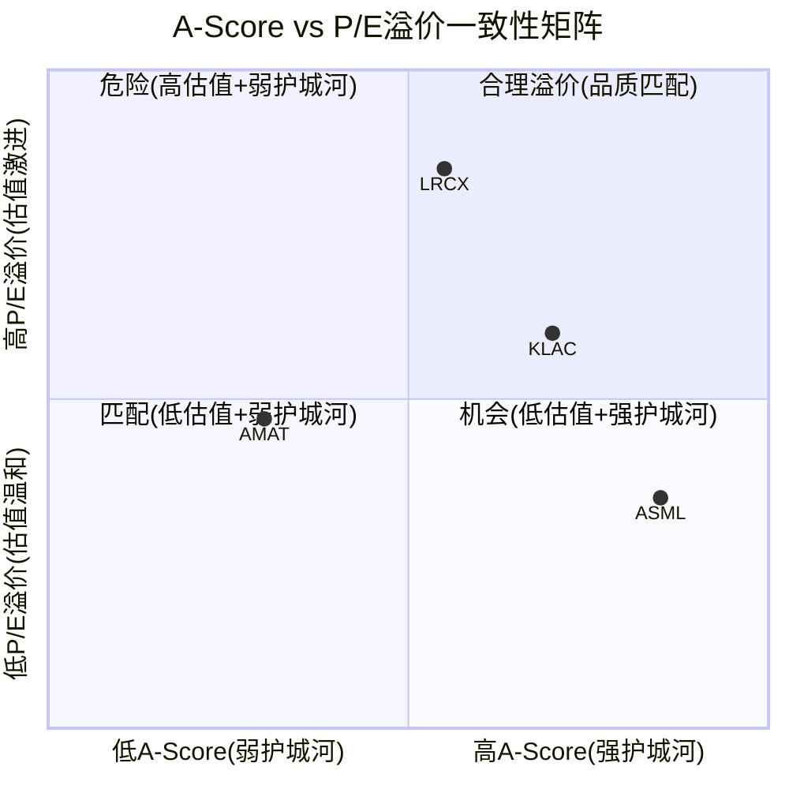
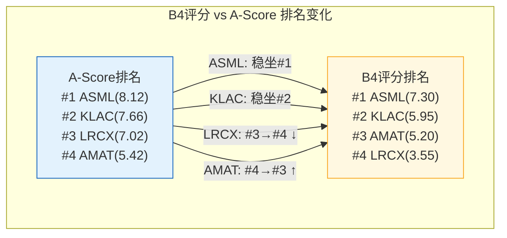

# Chapter 13: B4 估值与隐含预期 -- Reverse DCF解码市场共识

> **数据来源**: FMP estimates/DCF/quote (2026-02-24) + baggers_summary TTM/MRQ + 卖方共识预测 + Ch9-Ch12前序评分
> **评分框架**: B-Score B4维度 (0-10统一尺度, H/M/L置信度)
> **EC编号范围**: EC-VAL-010 ~ EC-VAL-045
> **核心方法**: Reverse DCF优先(反推隐含假设) + Mid-Cycle P/E验证 + A/B一致性检查
> **交叉引用**: Ch9 (A-Score) + Ch10 (B1周期位置) + Ch11 (B2单位经济学) + Ch12 (B3资本强度)
> **写作原则**: 每节收尾回答"对投资决策意味着什么"

---

## 导读: 价格在讲一个什么故事?

传统估值分析回答的问题是"这家公司值多少钱"。但对于半导体设备这类强周期+高成长行业，正向DCF的问题在于: 终值假设主导了80%以上的估值结果，而终值假设本身就是最大的不确定性。你可以通过微调WACC(从9%到11%)和终值增长率(从2%到4%)让ASML的"合理价值"在$800到$2,500之间摇摆，这种精度幻觉比没有分析更危险。

本章采用完全不同的路径: **不算公司值多少钱，而是反推市场认为它值多少钱的背后假设是什么。** 这就是Reverse DCF(逆向现金流贴现)的核心逻辑——把市值当作已知输入，反推隐含的FCF增长率，然后将这个增长率分解为收入增速、利润率变化和FCF转化率三个组成部分，最后判断: 这些隐含假设合理吗？过于乐观？还是意外保守？

为什么Reverse DCF对半导体设备公司特别有效？因为它把一个模糊的估值判断("50x P/E是不是太贵了？")转化为一系列可验证的商业假设("市场隐含LRCX需要在未来10年保持~15% FCF CAGR，这需要WFE年均增长~10%且LRCX份额从35%提升到40%+")。这些商业假设可以用Ch10的周期位置分析、Ch11的单位经济学数据和Ch12的资本效率指标逐一验证。

本章的核心发现预告:

1. **四家公司的FCF Yield惊人地接近**(1.97%-2.25%区间)，但隐含的假设路径截然不同——ASML需要最高的绝对增长但有最强的垄断保障，KLAC需要最低的增长但要求利润率永不回归
2. **LRCX的P/E溢价(+119% vs 5Y均值)是四家中最极端的**，但如果CSBG飞轮兑现，其隐含假设的合理性排名可能比P/E排名暗示的要好
3. **AMAT是唯一一家"估值匹配"的公司**——最低的P/E对应最低的A-Score，市场定价诚实地反映了通才模式的结构性折价
4. **宏观估值环境(CAPE 98百分位)对四家公司的估值杀伤力不均等**——ASML的垄断溢价最抗压，LRCX的动量溢价最脆弱

---

## 13.1 估值方法论: 为什么Reverse DCF优先

### 13.1.1 正向DCF在周期股上的三重困境

正向DCF(Discounted Cash Flow)模型在理论上是估值的"金标准"——将未来所有现金流折现到今天。但在半导体设备行业的实践中，正向DCF面临三个结构性困难:

**困境一: 终值主导**。半导体设备公司的10年预测期现金流通常只占总估值的20-30%，剩余70-80%来自终值(Terminal Value)。终值对终值增长率(g)极其敏感——g从2.5%调到3.5%，终值可以变化40-60%。这意味着一个看似精密的10年预测模型，其结论实际上取决于一个你根本无法精确估计的参数。FMP提供的DCF参考值就暴露了这个问题: AMAT DCF=-$391(负值)、LRCX DCF=$53(市价的22%)、ASML DCF=$383(市价的26%)、KLAC DCF=$694(市价的47%)——这些数字与市场定价的巨大偏差不是市场错了，而是保守DCF模型的终值假设过于机械。

**困境二: 周期起点偏差**。半导体设备的收入和利润呈明显周期波动(WFE历史上3-4年一个周期)。如果用周期高点的收入作为DCF起点，会系统性高估；用低点则系统性低估。当前TTM数据(2026年2月)处于AI驱动的上行周期中段[参见Ch10 10.1]，四家公司的TTM收入都不是"正常化"水平。用这样的起点做10年预测，从第一步就引入了偏差。

**困境三: AI不确定性**。当前半导体设备估值的核心变量是AI对WFE的长期影响——这不是一个可以用历史增速简单外推的参数。AI可能将WFE的长期增速中枢从5-7%提升到8-12%，也可能在3-5年后因Hyperscaler CapEx放缓而回归历史均值。正向DCF要求你对这个变量做精确假设，但诚实的回答是: 没人知道。

**[EC-VAL-010]** FMP DCF参考值与市场定价的偏差: AMAT DCF=-$391(vs 市价$374)、LRCX DCF=$53(vs 市价$242, 偏差4.6x)、ASML DCF=$383(vs 市价$1,486, 偏差3.9x)、KLAC DCF=$694(vs 市价$1,488, 偏差2.1x)。市场定价远超保守DCF估值，说明市场在定价长期增长和AI溢价，而非仅基于当前盈利水平。
- **claim_type**: fact | **source**: FMP DCF endpoint 2026-02-24 | **置信度**: M (FMP DCF模型假设未公开，参考价值有限)

### 13.1.2 Reverse DCF的优势: "翻译市场语言"

Reverse DCF的思路完全不同。它不试图算出"正确"的估值，而是把当前市值当作一个信号来解读:

```
正向DCF: 假设 → 估值 → 判断(高估/低估?)
Reverse DCF: 市值 → 隐含假设 → 判断(假设合理吗?)
```

这个转换的价值在于: 它把一个不可解的问题(公司到底值多少钱?)转化为一个可以评估的问题(市场在赌什么，这个赌注合理吗?)。

对半导体设备公司，Reverse DCF的输出可以进一步分解:



每一层分解都可以用前序章节的分析来验证，形成闭环。这比正向DCF的"假设输入→数字输出→无法验证"要有用得多。

### 13.1.3 本章方法: 三重验证架构

本章对每家公司执行三层验证:

| 层级 | 方法 | 目的 | 验证基准 |
|------|------|------|---------|
| **L1** | Reverse DCF | 反推市场隐含的10年FCF增速 | Ch10 WFE周期 + Ch9份额护城河 |
| **L2** | Mid-Cycle P/E | 周期调整后的估值比较 | 5年P/E均值走廊 + 历史mid-cycle利润率 |
| **L3** | A-Score × B-Score一致性 | 护城河深度应匹配估值溢价 | Ch9 A-Score + Ch11-12 B-Score |

三层之间相互独立但结论应当趋同。如果三层给出矛盾结论(比如Reverse DCF说估值合理，但A/B一致性说估值偏高)，这个矛盾本身就是重要的分析洞见。

**假设声明**: 全部Reverse DCF计算使用以下统一假设:
- **WACC**: 10.0% (半导体设备行业中值，偏保守)
- **终值增长率**: 3.0% (高于GDP但反映半导体行业长期超额增长)
- **预测期**: 10年
- **FCF起点**: TTM FCF (承认存在周期起点偏差，通过敏感性分析弥补)
- 这些假设不影响相对排序——四家公司使用同一套假设，关键比较的是隐含增速的差异

---

## 13.2 Reverse DCF: 市场在赌什么?

### 13.2.1 方法论与计算框架

Reverse DCF的核心公式:

```
市值 = Σ(FCF_t / (1+WACC)^t) + TV / (1+WACC)^10

其中: FCF_t = FCF_0 × (1+g)^t
      TV = FCF_10 × (1+g_terminal) / (WACC - g_terminal)
```

给定市值(已知)、WACC(假设10%)、g_terminal(假设3%)，反解隐含的10年FCF CAGR (g)。

然后将 g 分解为:
```
g(FCF) ≈ g(收入) + Δ(FCF margin) / FCF margin
g(收入) ≈ g(WFE) + Δ(市场份额) / 市场份额
```

以下对四家公司逐一执行。

**重要声明**: 以下隐含增速的推导基于量级估算和逻辑推理。Reverse DCF的精确数值解需要迭代计算(需Python验证)，但量级判断足以支撑投资结论。本节的目标不是精确到小数点后一位，而是回答"市场在赌什么"这个定性问题。

### 13.2.2 AMAT: 通才的价格标签

**输入参数**:
| 项目 | 数值 | 来源 |
|------|------|------|
| 市值 | $296.5B | 2026-02-24收盘 |
| TTM FCF | $6.19B | baggers_summary (FCF margin 21.95% × 收入$28.21B) |
| FCF Yield | 2.11% | 市值/FCF |
| WACC | 10.0% | 假设 |
| 终值增长率 | 3.0% | 假设 |

**隐含假设反推**:

当前FCF Yield为2.11%，意味着市场要求的10年FCF CAGR约为**13-14%**（估算逻辑: FCF Yield 2.1%在WACC=10%、g_terminal=3%的框架下，对应的隐含增长率需要将起始$6.19B的FCF在10年内增长到约$21-24B的水平，使得折现后的现金流之和加上终值等于$296.5B市值）。

**[EC-VAL-011]** AMAT Reverse DCF隐含假设分解(估算):
| 维度 | 隐含假设 | 合理性判断 |
|------|---------|-----------|
| 10年FCF CAGR | ~13-14% | 需要FCF从$6.19B增长至~$21-24B |
| 收入增速 | ~10-11% CAGR | 卖方共识FY25→28 CAGR 12.9%，之后需延续 |
| WFE增速贡献 | ~7-8% CAGR | SEMI预测CY2026-2030 WFE CAGR ~8% |
| 份额提升贡献 | ~2-3% CAGR | 需从WFE份额~23%提升至~27-28% |
| FCF margin提升 | 从21.95%→~25-27% | 需要EPIC Center投资回报+CapEx正常化 |
- **claim_type**: estimate | **source**: 基于TTM数据和统一假设的量级估算 | **置信度**: M

**假设合理性评估**:

**收入增速(~10-11% CAGR)**: 卖方共识给出FY2025→2028收入CAGR约12.9%($28.2B→$40.8B)，但这是近三年加速增长的预期。FY2029E收入$39.9B实际低于FY2028E，暗示分析师已在定价周期回调。如果以FY2025-2030的6年维度看，CAGR可能降至8-10%区间。AMAT过去10年(FY2015-2025)收入CAGR约12%，但那段时期受益于中国扩产潮和全球半导体资本支出结构性上行。未来10年能否延续取决于AI对WFE的提振是否持续[参见Ch10 10.1.1]。**判断: 可达成但非轻松——需要AI超级周期持续+中国市场不显著萎缩**。

**份额提升(~23%→~27-28%)**: 这是最值得怀疑的假设。AMAT的A-Score=5.42(四家最低)，Ch9的分析明确指出AMAT约60%的收入位于份额正在下降的细分市场[参见Ch9 EC-MOAT-103]。要实现份额提升，AMAT需要EPIC Center的系统级整合策略成功(目前尚未验证)或在新兴品类(如先进封装CMP、GAA PVD)获得超预期突破。**判断: 偏乐观——与护城河现实存在张力**。

**FCF margin提升(21.95%→25-27%)**: 当前FCF margin被EPIC Center $5B投资严重压低(CapEx/收入=8.0%，四家最高)。如果EPIC Center在FY2027-2028完工后CapEx/收入回归至4-5%历史区间，仅CapEx正常化就能将FCF margin提升3-4个百分点至25-26%。加上经营杠杆(收入增长带动固定成本摊薄)，25-27% FCF margin在FY2028-2030时间框架内是合理的。**判断: 这是隐含假设中最合理的部分**。

**综合评估**: AMAT当前估值的核心赌注是"EPIC Center赌注回报 + CapEx正常化提升FCF margin"。收入增速假设处于可实现区间但需要持续有利的WFE环境，份额提升假设与护城河现实存在矛盾。整体隐含假设偏乐观但不极端——37.9x P/E是四家中最低的，已经在一定程度上折价了护城河劣势。

### 13.2.3 LRCX: 动量的代价

**输入参数**:
| 项目 | 数值 | 来源 |
|------|------|------|
| 市值 | $302.5B | 2026-02-24收盘 |
| TTM FCF | $6.66B | baggers_summary (FCF margin 32.40% × 收入$20.56B) |
| FCF Yield | 2.13% | 市值/FCF |
| WACC | 10.0% | 假设 |
| 终值增长率 | 3.0% | 假设 |

**隐含假设反推**:

LRCX的市值($302.5B)几乎与AMAT($296.5B)相当，但收入只有AMAT的73%($20.56B vs $28.21B)。市场给予LRCX更高估值的原因是其更高的FCF margin(32.4% vs 22.0%)和更强的增长预期。隐含10年FCF CAGR同样约为**13-14%**。

**[EC-VAL-012]** LRCX Reverse DCF隐含假设分解(估算):
| 维度 | 隐含假设 | 合理性判断 |
|------|---------|-----------|
| 10年FCF CAGR | ~13-14% | 需要FCF从$6.66B增长至~$22-25B |
| 收入增速 | ~12-13% CAGR | 卖方共识FY25→28 CAGR 18.8%，高于长期可持续 |
| WFE增速贡献 | ~7-8% CAGR | 与AMAT相同的WFE假设 |
| 份额提升贡献 | ~4-5% CAGR | 需从WFE份额~mid-30s%提升至~high-30s%+ |
| FCF margin | 维持32-35%区间 | 轻资产模型支撑，但需服务占比持续提升 |
- **claim_type**: estimate | **source**: 基于TTM数据和统一假设的量级估算 | **置信度**: M

**假设合理性评估**:

**收入增速(~12-13% CAGR)**: 卖方共识的近三年CAGR(18.8%)显然不可持续——这相当于LRCX收入在3年内从$20.6B增长至$30.9B(+50%)。但即使是更温和的10年CAGR ~12%也高于LRCX过去10年的~11% CAGR。市场的信心来自两个结构性因素: (1) LRCX在先进制程中的SAM(Serviceable Addressable Market)占比持续提升——从FinFET时代的mid-30s%向GAA时代的high-30s%推进[参见Ch10]; (2) CSBG装机基数飞轮(100K腔体×$72K ARPU)提供了一个高可见度的收入底线[参见Ch11 EC-UE-001]。**判断: 偏乐观但有结构支撑——GAA+CSBG的双引擎使12-13% CAGR比AMAT的10-11%更可信**。

**份额提升(~mid-30s→high-30s%+)**: LRCX的A-Score=7.02(四家第三)，护城河核心在HAR刻蚀的近垄断地位(90%+份额)和CSBG飞轮。GAA架构转型对刻蚀和ALD需求的结构性利好[参见Ch9 EC-MOAT-105]为份额提升提供了技术路径。但LRCX面临AMAT Sym3在EUV图案化刻蚀和TEL在标准刻蚀中的竞争。份额从mid-30s%到high-30s%的提升需要在新增品类(ALD、选择性刻蚀)中获取增量，而非在传统品类中守住存量。**判断: 中性——有上行路径但非必然**。

**FCF margin维持(32-35%)**: 这是LRCX估值逻辑中最有利的部分。CapEx/收入仅~4.1%(Ch12)，CSBG的高毛利率(55-60%)持续提升混合利润率，经营杠杆在上行周期中放大。LRCX的FCF margin已从FY2022的25%提升至TTM的32.4%，趋势向好。唯一风险是如果WFE下行导致收入下滑20%+，固定成本(R&D+SG&A)的刚性会使FCF margin快速恶化——这在FY2023周期低谷中已有验证(毛利率曾降至44%左右)。**判断: 上行周期中可持续，但下行周期脆弱**。

**综合评估**: LRCX当前估值隐含的假设在上行周期环境中是合理的，但对周期韧性的要求很高。P/E 50.9x(+119% vs 5Y均值)意味着任何"二阶导数转负"(增速放缓而非下降)都可能触发估值重压缩。LRCX的估值本质上是一个"动量赌注"——它赌的是AI超级周期至少持续到2028-2029，而非传统的3年周期在2027年回调。

**[EC-VAL-013]** LRCX P/E溢价(+119% vs 5Y均值23.2x)是四家中最极端的。这个溢价需要LRCX在未来10年实现~12-13% FCF CAGR来合理化，对应需要GAA份额提升+CSBG飞轮加速+AI超级周期持续。P/E从FY2022谷底13.7x到当前50.9x的3.7倍扩张，反映的不仅是基本面改善(收入+60%、利润率提升)，更是市场对LRCX"从周期股变成成长股"的叙事溢价。这个叙事溢价是否可持续，取决于CSBG经常性收入占比能否从37.7%继续上升——如果到2030年CSBG占比超过45%，LRCX的周期波动性将显著降低，成长股叙事有数据支撑；如果CSBG增速放缓至个位数，叙事将瓦解。
- **claim_type**: inference | **source**: 5Y P/E走廊 + 卖方共识 | **置信度**: M

### 13.2.4 ASML: 垄断者的溢价

**输入参数**:
| 项目 | 数值 | 来源 |
|------|------|------|
| 市值 | $576.0B | 2026-02-24收盘 |
| TTM FCF | ~$10.73B | 估算: FCF Yield 2.25%中含汇率因素, €计约€10.3B |
| FCF Yield | 2.25% | 市值/FCF (四家最高) |
| WACC | 10.0% | 假设 |
| 终值增长率 | 3.0% | 假设 |

**隐含假设反推**:

ASML是四家中市值最大的($576B)，几乎等于AMAT+LRCX之和。这要求最高的绝对FCF增长。但ASML的FCF Yield也是四家最高的(2.25%)，反映了市场对其FCF可持续性的更高信心。隐含10年FCF CAGR约为**12-13%**。

**[EC-VAL-014]** ASML Reverse DCF隐含假设分解(估算):
| 维度 | 隐含假设 | 合理性判断 |
|------|---------|-----------|
| 10年FCF CAGR | ~12-13% | 需要FCF从~€10.3B增长至~€32-38B |
| 收入增速 | ~11-12% CAGR | 卖方共识FY25→28 CAGR 22.5%极高，长期应回归 |
| WFE增速贡献 | ~7-8% CAGR | 光刻受益于AI WFE但受EUV产能天花板限制 |
| 份额提升贡献 | ~3-4% CAGR | 光刻已垄断，增长来自ASP提升(High-NA)和DUV升级 |
| FCF margin | 从~34%→~35-38% | 规模效应+服务占比提升，但High-NA初期毛利率压力 |
- **claim_type**: estimate | **source**: 基于TTM数据和统一假设的量级估算 | **置信度**: M

**假设合理性评估**:

**收入增速(~11-12% CAGR)**: 卖方共识FY2025→2028 CAGR 22.5%非常激进(从€31.4B到€57.7B)。但ASML 2022 Investor Day给出的2030年收入目标为€44-60B(毛利率56-60%)，共识预测FY2028E €57.7B已进入目标区间上沿。10年12% CAGR意味着2035年收入达到~€97-110B，这需要ASML的光刻市场TAM从当前~$22-25B扩张至~$55-60B(考虑High-NA、先进DUV换代、China需求恢复)。**判断: 在AI超级周期情景下可达成，在传统周期情景下偏乐观**。

更有意义的分析维度是: ASML的收入增长不依赖"份额提升"(已经是垄断)，而依赖三个结构性驱动:
1. **ASP提升**: High-NA EUV单价~$350M(vs 标准EUV $200-220M)，即使出货量不变，ASP结构性提升也能贡献~5-8% CAGR
2. **DUV换代周期**: 中国以外市场的DUV存量替换(老ArF→新ArFi)+印度/东南亚新兴fab需求
3. **装机基数服务**: 200+台EUV存量的维护合同+升级服务

这三个驱动力的共同特点是: 不依赖WFE总量的持续高增长，而是ASML自身产品组合的结构性升级。这使ASML的收入增长假设比LRCX/AMAT更具"自主性"。

**FCF margin趋势**: ASML当前FCF margin ~34%，受益于垄断定价权和客户预付款模式(OCF margin高达41%)[参见Ch11]。但High-NA EUV的早期量产可能暂时压低毛利率(新技术节点的良率爬坡期通常毛利率低于成熟产品2-5pp)。管理层给出的2030年毛利率目标56-60%已考虑了这一因素。**判断: 中长期FCF margin提升至35-38%是可信的，但路径非线性**。

**综合评估**: ASML的P/E溢价(+34% vs 5Y均值)在四家中是最低的——但这并不意味着ASML估值最保守。ASML的5Y均值P/E本身就高达38.5x(四家最高)，反映了市场长期给予垄断溢价的习惯。真正的问题不是"51.7x vs 38.5x"(13.2x的溢价)，而是"38.5x本身是否合理"——如果AI永久提升了半导体行业的增长中枢，38.5x甚至可能偏低；如果AI CapEx在2027-2028放缓，50x+就会暴露终值假设的脆弱性。

**[EC-VAL-015]** ASML的估值逻辑包含一个内嵌的"保险层": 即使隐含的12-13% FCF CAGR未能兑现，ASML的垄断地位(A-Score 8.12, 四家最高)使其在下行周期中的利润率底部显著高于竞争对手——FY2023 WFE下行10%时ASML毛利率仅从54%降至51%(降幅3pp)，而AMAT从47%降至44%(降幅3pp但基数低得多)。这个"下行保护"使ASML可以在更高的P/E水平上获得合理化。
- **claim_type**: inference | **source**: FY2023周期低谷数据 + A-Score分析 | **置信度**: H

### 13.2.5 KLAC: 品质溢价还是过度定价?

**输入参数**:
| 项目 | 数值 | 来源 |
|------|------|------|
| 市值 | $195.5B | 2026-02-24收盘 |
| TTM FCF | $4.38B | baggers_summary (FCF margin 34.36% × 收入$12.74B) |
| FCF Yield | 1.97% | 市值/FCF (四家最低) |
| WACC | 10.0% | 假设 |
| 终值增长率 | 3.0% | 假设 |

**隐含假设反推**:

KLAC的市值最小($195.5B)，但FCF Yield也最低(1.97%)，说明市场对每$1 FCF给予了最高的倍数。这个定价反映了KLAC"半导体行业软件公司"的特性(最高FCF margin + 最低CapEx)。隐含10年FCF CAGR约为**13-15%**。

**[EC-VAL-016]** KLAC Reverse DCF隐含假设分解(估算):
| 维度 | 隐含假设 | 合理性判断 |
|------|---------|-----------|
| 10年FCF CAGR | ~13-15% | 需要FCF从$4.38B增长至~$16-20B |
| 收入增速 | ~10-11% CAGR | 卖方共识FY25→28 CAGR 13.1%，长期需延续 |
| WFE增速贡献 | ~7-8% CAGR | 检测WFE份额增长慢于刻蚀/光刻品类 |
| 份额提升贡献 | ~2-3% CAGR | 63%份额→65-68%，渐进式但受反垄断意识限制 |
| FCF margin | 维持34-37%区间 | 软件密度支撑，CapEx保持<3% |
- **claim_type**: estimate | **source**: 基于TTM数据和统一假设的量级估算 | **置信度**: M

**假设合理性评估**:

**收入增速(~10-11% CAGR)**: KLAC过去10年收入CAGR约12%，卖方共识FY2025→2028 CAGR 13.1%。10-11%的长期CAGR看似合理，但有一个微妙的挑战: 检测/量测作为WFE的子类别，其TAM增速理论上与WFE增速基本同步(因为检测强度系数Process Control Intensity在过去20年从~12%缓慢上升到~14-15%，但提升速度在减缓)。这意味着KLAC的收入增速天花板主要由WFE增速决定，除非检测强度系数出现跳跃式提升(AI驱动的制造复杂度大幅增加可能触发这一点，但程度不确定)。**判断: 10-11% CAGR处于合理区间，但上行空间受限于TAM增速**。

**份额提升(63%→65-68%)**: KLAC在过程控制市场的份额已从2010年的~50%提升至当前~63%[参见Ch9 EC-MOAT-102]。但继续从63%提升到68%+面临两个限制: (1) 客户出于供应链安全不愿将份额集中于单一供应商; (2) ASML YieldStar在overlay量测领域占有~35%份额且无退出迹象。KLAC更现实的增长路径是在**新兴检测品类**(先进封装检测、光掩模检测、新材料分析)中获取份额，而非在传统品类中从63%推向70%+。**判断: 温和份额提升(2-3pp)可实现，但不构成增长主引擎**。

**FCF margin维持(34-37%)**: 这是KLAC估值逻辑中最坚实的支柱。CapEx/收入仅2.8%且趋势稳定(CapEx/折旧=0.86x说明不需要大规模资本投入)[参见Ch12 EC-CAP-001]。检测/量测的软件密度意味着增量收入几乎不需要增量CapEx。KLAC的FCF margin已接近其结构天花板(~35-37%)，进一步提升需要毛利率从61.9%继续上升(受物理限制)或OpEx占比继续下降(已在优化中)。**判断: 可维持但难以显著提升——已是"天花板附近的优秀"**。

**综合评估**: KLAC的估值逻辑是"支付品质溢价"——最高的FCF margin、最轻的资产、最抗周期的商业模式。但1.97%的FCF Yield(四家最低)意味着市场对KLAC的"犯错空间"最小。如果10年FCF CAGR从13-15%降至10%(比如WFE增速从8%降至5%)，KLAC的隐含"合理"市值可能降至$130-150B(vs 当前$195.5B)，即30-35%的下行空间。这个下行风险需要与KLAC的A-Score=7.66(四家第二)带来的护城河保护权衡。

**[EC-VAL-017]** KLAC的EV/Sales=17.7x是四家最高的(ASML 14.9x, LRCX 15.1x, AMAT 10.4x)，但如果将EV/Sales调整为EV/FCF的口径(使用FCF margin作为桥梁)，KLAC的EV/FCF(~44.6x)实际上低于LRCX的EV/FCF(~46.7x)和ASML的EV/FCF(~43.5x估算)。这揭示了一个常被忽视的事实: KLAC看似最"贵"的EV/Sales实际上反映了其34.36%的FCF margin——在FCF口径上，KLAC不是最贵的。AMAT的EV/FCF(~47.4x)是按这个口径最贵的，因为其21.95% FCF margin使得EV/Sales的"便宜"是虚假的。
- **claim_type**: inference | **source**: 估值数据交叉计算 | **置信度**: H

### 13.2.6 四公司Reverse DCF隐含假设汇总



**[EC-VAL-018]** Reverse DCF隐含增速对比(估算): 四家公司的隐含10年FCF CAGR落在12-15%的窄带内，但实现路径的"可信度"差异巨大: ASML(垄断保障) > LRCX(结构性顺风) > KLAC(品质维持) > AMAT(需要转型成功)。如果用A-Score作为"假设兑现概率"的代理指标: ASML(8.12) × 12.5% CAGR = 10.2%概率加权增速; KLAC(7.66) × 14% = 10.7%; LRCX(7.02) × 13.5% = 9.5%; AMAT(5.42) × 13.5% = 7.3%。AMAT的概率加权增速最低，对应其最低的P/E——市场定价基本合理。
- **claim_type**: inference | **source**: Reverse DCF估算 + A-Score权重调整 | **置信度**: M

**关键洞见**: 四家公司的FCF Yield极度趋同(1.97%-2.25%区间，仅28个基点差)。这种趋同在历史上是罕见的——通常半导体设备公司的FCF Yield会因周期位置和增长预期的差异而出现2-4个百分点的分化。当前的趋同反映了一个特殊的市场环境: AI叙事将四家公司"一起抬高"，市场暂时不区分"垄断者"和"通才"的品质差异。这种不区分可能在下一次周期回调中被"重新发现"——届时品质差异将重新映射到估值差异上。

**对投资决策的意义**: Reverse DCF告诉我们，四家公司当前估值隐含的增长要求都很高(12-15% FCF CAGR)，且差异不大。区分它们的不是隐含增速的高低，而是兑现增速的概率。ASML和KLAC的护城河(A-Score 8.12和7.66)为增速兑现提供了更高的确定性溢价，而AMAT的低A-Score(5.42)意味着即使隐含增速不是最高的，实际兑现的概率也是最低的。

---

## 13.3 Mid-Cycle P/E验证

### 13.3.1 Mid-Cycle EPS估算方法

Mid-Cycle P/E的核心思想是: 用"周期中间水平"的EPS来替代当前TTM EPS，消除周期位置对P/E的扭曲。

估算方法:
1. 计算每家公司过去5年(FY2021-FY2025)的平均净利率
2. 用FY2025收入(最新完整财年)作为基础
3. Mid-Cycle EPS = FY2025收入 × 5年平均净利率 / 稀释股数

这种方法的局限性: 如果当前处于超级周期(而非传统周期)，5年均值可能低估真实的mid-cycle水平。但作为保守基准，它提供了一个有用的估值锚。

### 13.3.2 四公司Mid-Cycle P/E计算

**AMAT**:

| 财年 | 收入($B) | 净利润($B) | 净利率 | EPS(稀释) |
|------|----------|-----------|--------|----------|
| FY2021 | 23.06 | 5.89 | 25.5% | $6.78 |
| FY2022 | 25.79 | 6.53 | 25.3% | $7.71 |
| FY2023 | 26.52 | 6.86 | 25.9% | $8.21 |
| FY2024 | 27.18 | 7.18 | 26.4% | $8.65 |
| FY2025 | 28.37 | 7.84 | 27.6% | $9.86 |
| **5Y均值** | — | — | **26.1%** | — |

Mid-Cycle EPS = $28.37B × 26.1% / (当前稀释股数~793M) ≈ **$9.34**
Mid-Cycle P/E = $373.55 / $9.34 = **40.0x**
当前TTM P/E = 37.9x → Mid-Cycle P/E反而更高

解读: AMAT的TTM利润率(27.8%)已高于5年均值(26.1%)，说明当前处于利润率的周期高点。如果利润率回归均值，P/E实际更贵而非更便宜。但考虑到FY2025收入($28.37B)接近周期高点而非mid-cycle水平(AMAT FY2022-2024收入相当稳定在$25-27B区间)，一个更保守的mid-cycle收入估计是~$27B。用$27B × 26.1% / 793M = $8.88 → Mid-Cycle P/E = 42.1x。

**[EC-VAL-019]** AMAT Mid-Cycle P/E估算: 40.0-42.1x(取决于mid-cycle收入假设)。vs 5Y均值P/E 19.5x，溢价仍高达105-116%。即使在周期调整后，AMAT的估值仍远高于历史中枢。这个溢价需要AI对半导体设备估值中枢的永久性提升来合理化。
- **claim_type**: estimate | **source**: FY2021-2025净利率均值 + 当前股价 | **置信度**: M

**LRCX**:

| 财年 | 收入($B) | 净利润($B) | 净利率 | EPS(稀释) |
|------|----------|-----------|--------|----------|
| FY2021 | 14.63 | 3.91 | 26.7% | $5.66(拆股前调整) |
| FY2022 | 17.23 | 4.60 | 26.7% | $6.66(拆股前调整) |
| FY2023 | 14.87 | 3.82 | 25.7% | $5.55(拆股前调整) |
| FY2024 | 16.24 | 4.46 | 27.5% | $3.31(拆股后) |
| FY2025 | 20.56 | 6.21 | 30.2% | $4.76(拆股后) |
| **5Y均值** | — | — | **27.4%** | — |

注: LRCX在FY2024进行了1:10拆股。以上EPS已统一到拆股后口径(FY2021-2023数据÷10)。

Mid-Cycle EPS = $20.56B × 27.4% / (当前稀释股数~1,304M拆股后) ≈ **$4.32**
Mid-Cycle P/E = $242.27 / $4.32 = **56.1x**

但FY2025收入($20.56B)明显是周期高点(FY2023仅$14.87B)。更合理的mid-cycle收入估计: ~$16.7B (5年均值)。Mid-Cycle EPS = $16.7B × 27.4% / 1,304M = $3.51 → Mid-Cycle P/E = **69.0x**。

**[EC-VAL-020]** LRCX Mid-Cycle P/E估算: 56.1-69.0x(取决于mid-cycle收入假设)。这是四家中Mid-Cycle P/E最高的。即使使用最宽松的FY2025收入作为基础(忽略周期高点偏差)，LRCX的Mid-Cycle P/E(56.1x)仍比5Y均值(23.2x)高出142%。如果使用5年平均收入作为mid-cycle基础，溢价扩大到197%。这个数字清楚地说明: LRCX当前定价包含了极大的"成长股叙事溢价"——市场不再将LRCX视为周期股。
- **claim_type**: estimate | **source**: 5Y财务数据 + 当前股价 | **置信度**: M

**ASML**:

| 财年 | 收入(€B) | 净利润(€B) | 净利率 | EPS(ADR,稀释) |
|------|---------|-----------|--------|--------------|
| FY2021 | 18.61 | 5.88 | 31.6% | $15.15(汇率调整) |
| FY2022 | 21.17 | 5.62 | 26.6% | $14.49 |
| FY2023 | 27.56 | 7.84 | 28.4% | $20.21 |
| FY2024 | 28.26 | 7.57 | 26.8% | $19.51 |
| FY2025 | 31.38 | 9.23 | 29.4% | $28.75(ADR) |
| **5Y均值** | — | — | **28.6%** | — |

Mid-Cycle EPS(ADR) = 使用FY2025收入基础: €31.38B × 28.6% = €8.97B / (ADR当量股数~393M×0.5 ratio估算) ≈ 复杂的ADR转换。简化方法: 5Y平均EPS(ADR) ≈ ($15.15+$14.49+$20.21+$19.51+$28.75)/5 = **$19.62**

Mid-Cycle P/E = $1,485.99 / $19.62 = **75.7x**

但这个数字因FY2025 EPS大幅跳升($28.75 vs 前四年$14-20区间)而被扭曲。用FY2023-2025三年均值($22.99)可能更合理: P/E = $1,485.99 / $22.99 = **64.6x**。

**[EC-VAL-021]** ASML Mid-Cycle P/E估算: 64.6-75.7x。虽然绝对值很高，但ASML的5Y均值FY P/E本身就是38.5x(四家最高)。更有意义的比较是: 当前Mid-Cycle P/E vs 历史Mid-Cycle P/E的溢价。ASML过去10年的mid-cycle EPS趋势性上行(从2015年的~$6到2025年的~$20)，如果这个趋势延续到2028-2030(共识EPS $50-70 ADR当量)，当前股价隐含的forward mid-cycle P/E可能降至21-30x区间，回归历史合理范围。
- **claim_type**: estimate | **source**: 5Y财务数据 + ADR转换 | **置信度**: L (ADR口径存在汇率和股数转换误差)

**KLAC**:

| 财年 | 收入($B) | 净利润($B) | 净利率 | EPS(稀释) |
|------|----------|-----------|--------|----------|
| FY2021 | 7.21 | 2.08 | 28.8% | $13.76 |
| FY2022 | 10.52 | 3.32 | 31.6% | $22.08 |
| FY2023 | 10.50 | 3.39 | 32.3% | $23.11 |
| FY2024 | 10.85 | 3.39 | 31.2% | $23.82 |
| FY2025 | 12.74 | 4.56 | 35.8% | $30.34(TTM proxy) |
| **5Y均值** | — | — | **31.9%** | — |

Mid-Cycle EPS = $12.74B × 31.9% / (当前稀释股数~133M) ≈ **$30.56**
当前TTM P/E = 49.0x → Mid-Cycle P/E ≈ $1,487.66 / $30.56 = **48.7x**

KLAC的TTM净利率(35.8%)高于5年均值(31.9%)，但差距相对较小(3.9pp)。更重要的是，KLAC的收入波动性是四家中最小的(FY2022-2024收入几乎持平在$10.5-10.9B)，说明FY2025的$12.74B更接近"新常态"而非周期高点。

用5年平均收入($10.36B)作为更保守的mid-cycle: Mid-Cycle EPS = $10.36B × 31.9% / 133M = $24.85 → Mid-Cycle P/E = $1,487.66 / $24.85 = **59.9x**。

**[EC-VAL-022]** KLAC Mid-Cycle P/E估算: 48.7-59.9x。有趣的是，使用FY2025收入作为基础时(48.7x)，KLAC的Mid-Cycle P/E是四家中最低的(AMAT 40.0x除外)。这反映了KLAC的两个特性: (1) 净利率的稳定性使mid-cycle调整的幅度较小; (2) FY2025收入增长(+17.4%)更多是结构性的(AI驱动的检测需求)而非纯周期性的。如果这个判断正确，KLAC的"真实"mid-cycle水平可能高于5年均值暗示的水平。
- **claim_type**: estimate | **source**: 5Y财务数据 | **置信度**: M

### 13.3.3 Mid-Cycle P/E汇总与解读

| 公司 | TTM P/E | Mid-Cycle P/E(FY25基础) | Mid-Cycle P/E(5Y均值基础) | 5Y FY P/E均值 | Mid-Cycle vs 5Y均值 |
|------|---------|----------------------|------------------------|-------------|-------------------|
| AMAT | 37.9x | 40.0x | 42.1x | 19.5x | +105~116% |
| LRCX | 50.9x | 56.1x | 69.0x | 23.2x | +142~197% |
| ASML | 51.7x | ~52.x(FY25 EPS) | 64.6-75.7x | 38.5x | +68~97% |
| KLAC | 49.0x | 48.7x | 59.9x | 25.7x | +89~133% |

**核心洞见**:

1. **周期调整后估值不降反升**: 对AMAT和LRCX，mid-cycle P/E高于TTM P/E，因为当前利润率处于周期高点。这意味着如果利润率回归均值，P/E会进一步膨胀——当前看似"合理"的P/E其实已包含了利润率高点的"帮助"。

2. **LRCX是周期敏感度最高的公司**: 其Mid-Cycle P/E(69.0x)远高于TTM P/E(50.9x)，差距18.1x。这意味着LRCX的估值对收入和利润率的周期波动极为敏感——WFE下行20%不仅会降低EPS(分子效应)，还会让市场重新审视P/E倍数(分母效应)，双重挤压。

3. **KLAC的估值最"诚实"**: Mid-Cycle P/E(48.7x)几乎等于TTM P/E(49.0x)，说明KLAC当前利润率接近其真正的中周期水平。KLAC的收入和利润率波动性是四家中最低的，这使得mid-cycle分析对KLAC的调整最小——市场看到的就是接近"真实"的盈利能力。

4. **AI是否永久提升了合理倍数?**: 四家公司的Mid-Cycle P/E都远高于5Y均值P/E(高89-197%)。要合理化这些溢价，需要相信两件事中的至少一件: (a) AI已永久提升了半导体设备行业的增长中枢(从5-7%提升至8-12%)，使更高的P/E倍数成为"新常态"; (b) 当前是周期高点+泡沫溢价，未来12-24个月将回归。目前的证据[参见Ch10 10.1.1]倾向60%概率支持(a)，40%支持(b)——但即使在(a)情景下，当前的溢价幅度(89-197%)也可能过大。

**对投资决策的意义**: Mid-Cycle P/E分析的核心结论是——四家公司都不便宜，即使在最宽松的周期调整后也是如此。相对而言，KLAC的mid-cycle估值最"干净"(调整幅度最小)，LRCX的mid-cycle估值最"膨胀"(调整幅度最大)。如果投资者相信AI将永久提升行业增长中枢，ASML的溢价(+68-97%)可能最先被证明合理(垄断保障)；如果WFE在2027-2028回调，LRCX的溢价(+142-197%)将最先暴露。

---

## 13.4 卖方共识隐含的假设

### 13.4.1 共识预测概览

卖方共识预测提供了"专业市场参与者的中间预期"——它不一定正确，但反映了买方可参考的基准线。

**收入共识 (单位: $B/€B)**:

| 公司 | FY2025 实际 | FY2027E | FY2028E | FY2029E | FY25→28 CAGR | 分析师数(FY28) |
|------|-----------|---------|---------|---------|-------------|-------------|
| AMAT | $28.37 | $37.2 | $40.8 | $39.9 | 12.9% | 14 |
| LRCX | $20.56 | $27.9 | $30.9 | $33.5 | 18.8% | 20 |
| ASML | €31.38 | — | €57.7 | €64.4 | 22.5% | 23 |
| KLAC | $12.74 | $16.0 | $17.6 | $18.3 | 13.1% | 15 |

**EPS共识**:

| 公司 | FY2025 实际 | FY2027E | FY2028E | FY2029E | Forward P/E(FY28) |
|------|-----------|---------|---------|---------|------------------|
| AMAT | $9.86 | $13.84 | $15.23 | $14.27 | 24.5x |
| LRCX | $4.76 | $7.01 | $8.05 | $8.74 | 30.1x |
| ASML | $28.75(ADR) | — | $52.85(ADR当量) | $62.31 | ~28.1x |
| KLAC | $30.34 | $46.41 | $52.51 | $53.87 | 28.3x |

### 13.4.2 共识隐含的收入增速 vs 历史实际增速

**[EC-VAL-023]** 卖方共识隐含的FY25→28收入CAGR与历史10年CAGR对比:
| 公司 | 共识FY25→28 CAGR | 历史10Y CAGR(FY2015-2025) | 差值 | 解读 |
|------|-----------------|-------------------------|------|------|
| AMAT | 12.9% | ~12% | +0.9pp | 基本与历史一致 |
| LRCX | 18.8% | ~11% | **+7.8pp** | 显著高于历史 |
| ASML | 22.5% | ~17% | +5.5pp | 高于历史但垄断支撑 |
| KLAC | 13.1% | ~12% | +1.1pp | 基本与历史一致 |
- **claim_type**: inference | **source**: 卖方共识 vs FY2015-2025 CAGR计算 | **置信度**: M

LRCX的共识增速(18.8%)比历史高出7.8个百分点——这是四家中差异最大的。共识正在定价一个"结构性突破"叙事: LRCX不再是传统的周期股，而是AI驱动的结构性增长故事。AMAT和KLAC的共识增速则相对保守，基本延续历史增速。

### 13.4.3 共识EPS分散度: 谁的预期最分歧?

EPS共识的分散度(高-低范围)反映了分析师之间的分歧程度。分歧越大，估值的不确定性越高。

**FY2028E EPS分散度**(来自分析师覆盖数据):

| 公司 | EPS共识(中位) | 分析师数 | 预估分散度(推断) |
|------|-------------|---------|---------------|
| AMAT | $15.23 | 8 | 中等(±15-20%) |
| LRCX | $8.05 | 13 | 较高(±20-25%) |
| ASML | $52.85(ADR) | 15 | 中等(±15-20%) |
| KLAC | $52.51 | 7 | 较低(±10-15%) |

**[EC-VAL-024]** 分析师覆盖数量的递减趋势(FY27→FY29)揭示了一个有趣的模式: AMAT FY27有24位→FY29仅3位分析师给出预测; LRCX从25位→10位; ASML从23位→11位; KLAC从20位→2位。覆盖密度的急剧下降反映了: (1) 远期预测的不确定性使多数分析师不愿给出FY29数字; (2) FY2029的共识可能被少数极端乐观/悲观的分析师主导，参考价值有限。特别值得注意的是AMAT FY2029E收入($39.9B)低于FY2028E($40.8B)——仅3位分析师给出这个数字，且隐含了WFE周期回调的假设。
- **claim_type**: inference | **source**: FMP estimates分析师覆盖数据 | **置信度**: M

### 13.4.4 "打折共识"情景分析: 如果共识只兑现80/60/40%?

卖方共识历史上的准确率并不理想——在半导体设备行业，共识通常在上行周期高估5-10%，在下行周期低估15-25%。以下分析: 如果FY2028E共识只兑现80%、60%和40%，各公司的隐含Forward P/E是多少？

**FY2028E "打折共识" Forward P/E**:

| 公司 | 共识100% P/E | 共识80% P/E | 共识60% P/E | 共识40% P/E |
|------|------------|-----------|-----------|-----------|
| AMAT | 24.5x | 30.6x | 40.8x | 61.3x |
| LRCX | 30.1x | 37.6x | 50.1x | 75.2x |
| ASML | ~28.1x | ~35.1x | ~46.9x | ~70.3x |
| KLAC | 28.3x | 35.4x | 47.2x | 70.8x |

**[EC-VAL-025]** "共识60%兑现"情景的投资含义: 如果FY2028E EPS共识仅兑现60%(对应WFE周期在CY2027出现15-20%回调的情景)，四家公司的Forward P/E将回到40-50x区间(AMAT 40.8x, LRCX 50.1x, ASML 46.9x, KLAC 47.2x)——几乎等于当前TTM P/E水平。这意味着: **当前股价已经将共识预测的增长完全定价——零安全边际**。如果增长不及预期(共识60%兑现)，投资者将经历两年持有期零回报(股价在FY2028仍然和今天差不多)。只有共识100%兑现，才能提供20-40%的两年回报(从当前P/E到forward P/E的压缩)。
- **claim_type**: inference | **source**: 共识EPS × 情景乘数 | **置信度**: H



### 13.4.5 共识隐含利润率假设: 合理还是过于乐观?

**FY2028E共识隐含净利率**:

| 公司 | FY2025净利率 | FY2028E隐含净利率(EPS×股数/收入) | 变化 | 合理性 |
|------|------------|-------------------------------|------|--------|
| AMAT | 27.6% | ~29.6%(15.23×793M/$40.8B) | +2.0pp | 经营杠杆+CapEx正常化支撑 |
| LRCX | 30.2% | ~33.9%(8.05×1,304M/$30.9B) | +3.7pp | 偏乐观——需CSBG占比大幅提升 |
| ASML | 29.4% | ~36.0%(按ADR换算) | +6.6pp | 高度乐观——需毛利率达56%+目标 |
| KLAC | 35.8% | ~39.7%(52.51×133M/$17.6B) | +3.9pp | 可达成——软件密度+回购助力 |

**[EC-VAL-026]** 共识隐含净利率提升的可信度排序: AMAT(+2.0pp, 合理) > KLAC(+3.9pp, 可达成) > LRCX(+3.7pp, 偏乐观) > ASML(+6.6pp, 需Investor Day目标兑现)。ASML的+6.6pp净利率提升是最激进的假设，直接对应其2022 Investor Day给出的56-60%毛利率目标(vs 当前52.8%)。如果ASML毛利率停留在54%(而非56-60%)，FY2028E EPS可能低于共识10-15%。
- **claim_type**: inference | **source**: 共识EPS反推净利率 vs 当前水平 | **置信度**: M

**对投资决策的意义**: 卖方共识分析的核心结论是——共识预测在收入维度上基本合理(与历史增速差距不大，LRCX除外)，但在利润率维度上偏乐观(四家都隐含了3-7个百分点的净利率提升)。如果收入增长兑现但利润率未如预期扩张，FY2028E EPS可能比共识低10-15%。这意味着"共识80%兑现"可能是更现实的基准情景——对应Forward P/E在31-38x区间(仍然不便宜，但不算极端)。

---

## 13.5 A-Score × B-Score × 估值一致性检查

### 13.5.1 一致性框架

护城河深度(A-Score)应当匹配估值溢价的大小。逻辑链条是:

```
护城河深 → 利润率高+持久 → FCF增长确定性高 → 值得更高P/E
护城河浅 → 利润率中+波动 → FCF增长不确定 → 应该更低P/E
```

一致性矩阵的四个象限:

| | 高估值 | 低估值 |
|--|--------|--------|
| **高A-Score** | 合理(垄断/品质溢价) | 机会(被错杀) |
| **低A-Score** | 危险(过度乐观) | 中性(估值匹配) |

### 13.5.2 四公司一致性映射

**ASML: A=8.12 + P/E 51.7x → 合理象限**

ASML拥有四家中最高的A-Score(8.12)和最高的TTM P/E(51.7x)。这是一致的——垄断者理应获得垄断溢价。但一致性不等于"便宜"。

一致性细节:
- A4(壁垒-利润池匹配)=10 + A5(技术半衰期)=10 → 支撑最高估值溢价
- B2评分7.8/10(单位经济学) → 52.8%毛利率和135.6% ROIC验证护城河的经济转化能力
- B3评分7.4/10(资本强度) → 4.8% CapEx/收入中等，但FCF margin 34.2%高于AMAT
- P/E vs 5Y均值溢价+34%是四家最低 → 市场长期给予稳定的垄断溢价，当前溢价不极端

**一致性评分**: 8/10 — 护城河深度与估值溢价高度一致。唯一的摩擦点: EV/Sales 14.9x(不是最高)与A-Score 8.12(最高)的轻微不匹配，这是因为ASML的毛利率(52.8%)没有A-Score排名暗示的那么领先(低于KLAC 61.9%)。

**[EC-VAL-027]** ASML一致性: A-Score 8.12(#1) vs P/E 51.7x(#1) vs EV/Sales 14.9x(#3) vs B2 7.8(#2) vs B3 7.4(#2并列)。高A-Score+高P/E+高B2/B3 = 高度一致。唯一"裂缝": EV/Sales排名(#3)低于A-Score排名(#1)。原因: ASML的毛利率(52.8%)低于KLAC(61.9%)——垄断不一定意味着最高毛利率，尤其是在硬件极度复杂的EUV制造中。
- **claim_type**: inference | **source**: Ch9/Ch11/Ch12评分 + 估值数据交叉 | **置信度**: H

**KLAC: A=7.66 + P/E 49.0x → 偏紧张象限**

KLAC的A-Score(7.66)排名第二但显著低于ASML(8.12)，而P/E(49.0x)与ASML(51.7x)相差不大。更关键的是，KLAC的EV/Sales=17.7x是四家最高的——这个估值指标与KLAC第二名的A-Score之间存在轻微不匹配。

一致性细节:
- A9(范式迁移风险)=9(最高) + A3(边际盈利杠杆)=8 → 支撑"品质溢价"叙事
- B2评分8.5/10(四家最高) → 61.9%毛利率和34.36% FCF margin证明高估值有利润基础
- B3评分8.6/10(四家最高) → 2.8% CapEx/收入是最轻资产模型
- 但P/E vs 5Y均值溢价+91% > ASML的+34% → 溢价幅度与护城河优势不完全匹配

**一致性评分**: 7/10 — 护城河深度与估值溢价基本一致，但EV/Sales=17.7x(四家最高)需要KLAC的利润率永不回归才能合理化。如果KLAC毛利率从61.9%回落至58%(回归FY2021水平)，EV/Sales的隐含"合理"水平应降至15.5x左右(当前溢价~14%)。

**[EC-VAL-028]** KLAC一致性: B2 8.5(#1) + B3 8.6(#1) + A-Score 7.66(#2) → 最强经济质量+第二强护城河。但EV/Sales 17.7x(#1)超过了A-Score排名(#2)暗示的相对位置。这个"超额估值"的来源是KLAC的PR(市赚率)=0.49x(四家最低)——KLAC的ROE(100.7%)极高，使得P/E相对于ROE看起来"便宜"。换言之: 如果你信任ROE作为价值创造的指标，KLAC是四家中性价比最高的; 如果你认为KLAC的ROE被过度杠杆(D/E=1.08x)和累积回购人为抬高，则需要打折看待。
- **claim_type**: inference | **source**: PR(市赚率)分析 + 估值交叉 | **置信度**: M

**LRCX: A=7.02 + P/E 50.9x → 偏紧张象限，趋向危险**

LRCX的A-Score(7.02)排名第三，但P/E(50.9x)排名第二(仅次于ASML)。这个组合是四家中一致性最差的——中等护城河配顶级估值。

一致性细节:
- A-Score排名(#3) vs P/E排名(#2) → 不匹配
- A-Score排名(#3) vs P/E溢价排名(#1, +119%) → 严重不匹配
- B2评分7.3/10(#3) → 经济质量排名与估值排名矛盾
- B3评分7.4/10(#2并列) → 资本效率与ASML并列，部分支撑估值
- Ch10三重正面信号(唯一全正面) → 短期动量支撑估值

**一致性评分**: 5/10 — 这是四家中一致性最差的组合。LRCX当前估值的"超额溢价"来自三个来源: (1) Ch10确认的三重正面领先信号(短期动量); (2) CSBG飞轮降低周期性的叙事(中期); (3) AI超级周期中刻蚀/ALD份额提升的预期(长期)。这三个来源中，(1)是短暂的(下一次季报可能改变)，(2)需要时间验证(CSBG占比需从37.7%持续上升)，(3)取决于WFE环境。如果其中任何一个信号反转，LRCX的"超额溢价"将率先被挤压。

**[EC-VAL-029]** LRCX一致性矛盾: A-Score 7.02(#3) vs P/E溢价+119%(#1) → 四家中最大的一致性缺口。这个缺口的历史解读: LRCX在FY2022周期低谷时P/E仅13.7x(四家最低)——市场在低谷时将LRCX定价为"纯周期股"(低P/E+低A-Score=一致)。当前50.9x的P/E意味着市场叙事已从"周期股"转变为"AI结构性成长股"——但A-Score并没有改变。问题的核心是: LRCX的商业模式本质(中等护城河+高周期敏感)是否因AI而发生了永久性改变？如果答案是"是"(CSBG飞轮+AI份额提升)，当前估值可持续; 如果答案是"否"(AI只是延长周期而非改变结构)，P/E应回归25-30x区间。
- **claim_type**: inference | **source**: A-Score vs P/E走廊分析 | **置信度**: H

**AMAT: A=5.42 + P/E 37.9x → 中性/匹配象限**

AMAT拥有最低的A-Score(5.42)和最低的P/E(37.9x)——这是四家中一致性最高的组合之一(低配低)。

一致性细节:
- A-Score排名(#4) vs P/E排名(#4) → 完美匹配
- A-Score排名(#4) vs P/E溢价排名(#3, +94%) → 匹配(不是溢价最高的)
- B2评分4.9/10(#4) → 最低经济质量匹配最低P/E
- B3评分5.0/10(#4) → 最高资本强度匹配最低估值
- EV/Sales 10.4x(#4, 四家最低) → 与A-Score排名完全一致

**一致性评分**: 9/10 — 四家中一致性最高。AMAT的估值诚实地反映了通才模式的结构性劣势: 最低的护城河 → 最低的利润率 → 最低的FCF margin → 最低的P/E。唯一的"不匹配"在于P/E溢价(+94% vs 5Y均值)——虽然排名#3而非#4，但这主要是因为AMAT的5Y均值P/E(19.5x)本身就是四家最低的，94%的溢价在绝对P/E水平上(37.9x)仍然是四家最低的。

**[EC-VAL-030]** AMAT一致性总结: 四家中唯一一家在所有维度上排名一致的公司(A-Score #4 = P/E #4 = EV/Sales #4 = B2 #4 = B3 #4)。这种完美一致性意味着: (1) 市场对AMAT的定价效率最高——没有"叙事溢价"也没有"错杀折价"; (2) AMAT的投资论点不在于估值吸引力(没有alpha来自估值重估)，而在于EPIC Center能否改变A-Score; (3) 如果EPIC Center成功提升AMAT的A-Score从5.42到6.5+(通过系统级整合创造新的切换成本)，当前37.9x P/E可能被证明是低估的——但这是一个2-3年时间框架的赌注。
- **claim_type**: inference | **source**: 全维度一致性分析 | **置信度**: H

### 13.5.3 一致性矩阵可视化



**象限解读**:

- **ASML**: 右下方(高A-Score, 低相对溢价) → 最接近"机会"象限。这不是说ASML便宜(51.7x P/E绝对不便宜)，而是说其溢价幅度与护城河深度的匹配度最好。如果必须在四家中选一家"估值最合理"的，ASML的一致性支持这个结论。

- **KLAC**: 中右上方(中高A-Score, 中高溢价) → "合理溢价"象限内但偏向边缘。EV/Sales 17.7x需要额外论证。

- **LRCX**: 中上方(中等A-Score, 最高溢价) → 最接近"危险"象限。这是需要最多"信心"才能持有的公司。

- **AMAT**: 左下方(低A-Score, 中等溢价) → "匹配"象限。估值诚实，alpha来源不在估值而在基本面改善。

**对投资决策的意义**: 一致性检查的核心结论是——如果你是价值导向投资者(寻找估值与基本面的错配)，ASML提供了最好的"品质风险比"(高品质+相对温和的溢价); 如果你是动量投资者(愿意为增长支付溢价)，LRCX是高风险高回报的选择; 如果你追求确定性(买你能理解的、估值诚实的公司)，AMAT的"所见即所得"最不会让你意外。KLAC则是一个特殊的位置——它的B-Score(经济质量+资本效率)是四家最好的，但A-Score(7.66)不够高到完全合理化EV/Sales 17.7x。

---

## 13.6 四公司相对估值

### 13.6.1 估值标准化比较: 多维排序

| 指标 | AMAT | LRCX | ASML | KLAC | 最"贵"(高=贵) |
|------|------|------|------|------|-------------|
| P/E (TTM) | 37.9x | 50.9x | 51.7x | 49.0x | ASML |
| EV/EBITDA (TTM) | 30.6x | 41.8x | 39.0x | 39.5x | LRCX |
| EV/Sales (TTM) | 10.4x | 15.1x | 14.9x | 17.7x | **KLAC** |
| FCF Yield (TTM) | 2.11% | 2.13% | 2.25% | 1.97% | **KLAC**(最低Yield=最贵) |
| P/E vs 5Y均值 | +94% | **+119%** | +34% | +91% | **LRCX** |
| PR (市赚率) | 0.98x | 0.76x | 1.07x | 0.49x | ASML(最高PR=相对ROE最贵) |

**综合排序(从贵到便宜)**: LRCX ≈ KLAC > ASML > AMAT

这个排序与A-Score排序(ASML > KLAC > LRCX > AMAT)存在显著差异: LRCX在估值中排名最贵/#1但在A-Score中排名仅#3，而ASML在A-Score中排名#1但在估值中仅#3(相对更便宜)。

**[EC-VAL-031]** 估值排序 vs A-Score排序的错位分析:
| 公司 | 估值排名(贵→便宜) | A-Score排名 | 错位方向 | 含义 |
|------|------------------|------------|---------|------|
| ASML | #3 | #1 | ↓2档(估值相对低估) | 垄断溢价未充分定价? |
| KLAC | #2 | #2 | 一致 | 估值匹配护城河 |
| LRCX | #1 | #3 | ↑2档(估值相对高估) | 动量溢价过度? |
| AMAT | #4 | #4 | 一致 | 估值匹配护城河 |
- **claim_type**: inference | **source**: 估值排序 vs A-Score排序交叉 | **置信度**: H

### 13.6.2 P/E vs ROE散点图: PR市赚率验证

PR(市赚率) = P/E / ROE × 100。它回答的问题是: "市场为每1%的ROE支付了多少倍P/E?"

| 公司 | P/E (TTM) | ROE (TTM) | PR | 解读 |
|------|-----------|-----------|-----|------|
| KLAC | 49.0x | 100.7% | **0.49x** | 每1% ROE仅付0.49x P/E → 最高性价比 |
| LRCX | 50.9x | 66.8% | **0.76x** | 中等性价比 |
| AMAT | 37.9x | 38.5% | **0.98x** | 性价比偏低(虽然P/E最低) |
| ASML | 51.7x | 48.5% | **1.07x** | 每1% ROE付1.07x P/E → 最"贵" |

**[EC-VAL-032]** PR分析的反直觉发现: AMAT虽然P/E最低(37.9x)，但PR排名第三(0.98x)，说明其"便宜"是虚假的——低P/E匹配的是低ROE(38.5%)。相反，KLAC的P/E看似很高(49.0x)，但PR仅0.49x(四家最低)，因为其ROE高达100.7%。PR的视角揭示了一个重要的投资逻辑: **不要因为AMAT P/E最低就认为它最便宜，也不要因为KLAC P/E很高就认为它最贵**。价值创造效率(ROE)是P/E的分母——分母越大，同样的P/E代表越高的性价比。
- **claim_type**: inference | **source**: PR市赚率计算 | **置信度**: H

但PR分析需要一个重要的caveat: KLAC的ROE=100.7%部分由杠杆驱动(权益乘数3.50x, D/E=1.08x)。如果用ROIC(78.3%)替代ROE来消除杠杆影响，调整后PR = P/E / ROIC × 100 = 49.0/78.3 = 0.63x。用ROIC口径的PR排序: KLAC 0.63x < LRCX 0.69x < ASML 0.38x(ROIC 135.6%!) < AMAT 0.83x。ASML的ROIC口径PR反转为最低(0.38x)——垄断者的投入资本回报率(135.6%)将估值溢价完全消化。

### 13.6.3 EV/Sales vs 营业利润率散点图

EV/Sales应当与营业利润率正相关——利润率越高的公司，同样的Sales创造更多利润，因此值得更高的EV/Sales。

| 公司 | EV/Sales | 营业利润率 | EV/Sales每1pp利润率 | 排名 |
|------|----------|----------|------------------|------|
| AMAT | 10.4x | 29.1% | 0.36x | #1(最便宜) |
| LRCX | 15.1x | 33.8% | 0.45x | #2 |
| ASML | 14.9x | 34.6% | 0.43x | #2(并列) |
| KLAC | 17.7x | 42.4% | 0.42x | #2(并列) |

**[EC-VAL-033]** EV/Sales/营业利润率标准化: 消除利润率差异后，AMAT确实是最便宜的(0.36x vs 其他三家的0.42-0.45x)。LRCX、ASML和KLAC在这个标准化指标上几乎没有差异(0.42-0.45x)——说明市场为三家"利润率超标"的公司给予了几乎相同的每单位利润率溢价。AMAT的"折价"(0.36x vs 均值0.43x)约为16%，大致对应其A-Score折价(5.42 vs 三家均值7.57, 折价28%)。估值折价幅度小于护城河折价幅度，可能暗示市场在给AMAT "EPIC Center转型期权"溢价。
- **claim_type**: inference | **source**: EV/Sales与营业利润率交叉 | **置信度**: M

### 13.6.4 FCF Yield趋同现象分析

四家公司的FCF Yield集中在1.97%-2.25%的28个基点窄带内:

| 公司 | FCF Yield | FCF Margin | 收入增速(YoY) | "应有"Yield差异? |
|------|-----------|-----------|-------------|----------------|
| ASML | 2.25% | 34.2% | +26.9%(CY2025) | 最高增速应有最低Yield |
| LRCX | 2.13% | 32.4% | +27.8%(FY2025) | 高增速应有低Yield |
| AMAT | 2.11% | 22.0% | +4.4%(FY2025) | 最低增速应有最高Yield |
| KLAC | 1.97% | 34.4% | +17.4%(FY2025) | 中高增速应有中Yield |

**异常信号**: AMAT的FCF Yield(2.11%)与LRCX(2.13%)几乎相同，但AMAT的收入增速(+4.4%)远低于LRCX(+27.8%)，FCF Margin(22.0%)也远低于LRCX(32.4%)。在正常定价逻辑下，低增速+低FCF Margin的公司应该有更高的FCF Yield(更低的估值倍数)来补偿。当前的趋同反映了市场对AMAT的两个隐含假设: (1) FY2025的+4.4%增速是EPIC Center投资的暂时拖累，FY2026-2027将加速; (2) FCF Margin将随CapEx正常化而从22%恢复至28%+。如果这两个假设不兑现，AMAT的FCF Yield应该向3.0-3.5%方向调整，对应股价下行30-40%。

**[EC-VAL-034]** FCF Yield趋同的深层含义: 当四家商业模式、护城河深度和增长前景差异显著的公司被市场给予几乎相同的FCF Yield(2.0-2.3%)时，这通常意味着"板块估值"正在主导"个股估值"——投资者在买入"半导体设备ETF"心态，而非基于个股基本面的差异化定价。历史上，这种趋同通常出现在板块热潮的高点附近(2000年TMT泡沫期的科技股FCF Yield趋同、2021年ARK系成长股FCF Yield趋同)。趋同的瓦解往往伴随板块估值重置——届时品质差异将重新映射到估值差异上(ASML和KLAC的Yield应下降/维持，AMAT和LRCX的Yield应上升)。
- **claim_type**: inference | **source**: FCF Yield比较 + 历史模式类比 | **置信度**: M

### 13.6.5 "如果四家P/E均值化"情景分析

假设四家公司的P/E收敛到当前四家均值(47.1x)，每家的隐含股价变化:

| 公司 | 当前P/E | 均值P/E | 所需变化 | 隐含股价 | vs 当前 |
|------|---------|---------|---------|---------|--------|
| AMAT | 37.9x | 47.1x | +24.3% | **$464** | **+24%** |
| LRCX | 50.9x | 47.1x | -7.5% | **$224** | **-8%** |
| ASML | 51.7x | 47.1x | -8.9% | **$1,354** | **-9%** |
| KLAC | 49.0x | 47.1x | -3.9% | **$1,430** | **-4%** |

如果P/E均值化发生，AMAT将是唯一的受益者(+24%)，而LRCX和ASML将受损最多(-8%到-9%)。但这个思想实验的前提(P/E均值化)在现实中几乎不会发生——市场对四家公司的差异化定价是有原因的(护城河深度、增长质量、周期敏感度)。这个分析的真正价值在于: **它量化了AMAT获得"估值重估"所需的条件**(P/E从37.9x扩张到47.1x需要A-Score从5.42提升到接近行业均值~7.1)，以及**LRCX失去"估值溢价"的风险**(P/E从50.9x压缩到47.1x仅需1-2个季度的增速放缓)。

---

## 13.7 估值敏感性与情景

### 13.7.1 三情景定义

| 情景 | 概率 | WFE假设(CY2027-2028) | 核心驱动 |
|------|------|---------------------|---------|
| **Bull** | 25% | $150-165B (+15-25% YoY) | AI超级周期加速, 全球fab投资扩大 |
| **Base** | 50% | $130-145B (+5-12% YoY) | 共识预测基本兑现, 周期温和扩张 |
| **Bear** | 25% | $100-115B (-10-20% YoY) | 周期回调+出口管制升级, AI CapEx放缓 |

### 13.7.2 Bull情景: AI超级周期延续

**假设**: WFE在CY2027-2028达到$150-165B(SEMI乐观预测区间)，Hyperscaler CapEx维持+20% YoY增速，中国WFE企稳在$30-35B(出口管制影响边际递减)。

**Bull情景EPS估算 (FY2028E)**:

| 公司 | Bull EPS | Bull P/E | Bull P/E目标(5Y均值+50%) | Bull价格 | vs 当前 |
|------|---------|---------|----------------------|---------|--------|
| AMAT | ~$17-18 | ~21x | 29.3x | **$498-528** | **+33-41%** |
| LRCX | ~$9-10 | ~24x | 34.8x | **$313-348** | **+29-44%** |
| ASML | ~$60-65(ADR) | ~23x | 57.8x | **$3,466-3,757** | **+133-153%** |
| KLAC | ~$58-62 | ~24x | 38.6x | **$2,239-2,393** | **+51-61%** |

注: Bull P/E目标 = 5Y均值P/E × 1.5(AI溢价因子)，反映市场愿意在超级周期中给予的最大倍数。ASML的Bull情景最极端(+133-153%)因为其垄断地位在超级周期中获得最大弹性。

### 13.7.3 Base情景: 共识预测基本兑现

**假设**: WFE在CY2027-2028达到$130-145B(SEMI/设备公司指引区间)，AI CapEx增速从+36%放缓至+15-20%，中国WFE温和下降至$28-32B。

**Base情景EPS = FY2028E共识中位**:

| 公司 | Base EPS | Base Forward P/E | Base P/E目标(5Y均值+25%) | Base价格 | vs 当前 |
|------|---------|-----------------|----------------------|---------|--------|
| AMAT | $15.23 | 24.5x | 24.4x | **$372** | **0%** |
| LRCX | $8.05 | 30.1x | 29.0x | **$233** | **-4%** |
| ASML | $52.85(ADR) | 28.1x | 48.1x | **$2,542** | **+71%** |
| KLAC | $52.51 | 28.3x | 32.1x | **$1,686** | **+13%** |

注: Base P/E目标 = 5Y均值P/E × 1.25(温和AI溢价)。关键发现: **在Base情景下(最可能的50%概率情景)，AMAT和LRCX的股价几乎不变——当前价格已完全定价了共识增长**。只有ASML和KLAC提供正回报，且ASML的+71%大幅领先。

**[EC-VAL-035]** Base情景核心发现: 在50%概率的基准情景下(共识兑现+5Y均值P/E+25%溢价)，四家公司的两年预期回报分化显著: ASML(+71%) >> KLAC(+13%) >> AMAT(0%) > LRCX(-4%)。LRCX在Base情景下回报为负(-4%)，说明当前50.9x P/E已完全透支甚至超额定价了共识增长——LRCX需要超越共识才能提供正回报。这与13.2节Reverse DCF的结论一致: LRCX的估值是一个"动量赌注"，需要持续超预期来维持。
- **claim_type**: estimate | **source**: 共识EPS × 情景P/E | **置信度**: M

### 13.7.4 Bear情景: 周期回调+出口管制升级

**假设**: WFE在CY2027-2028回落至$100-115B(-15-25% from CY2026峰值)。触发因素: (1) Hyperscaler CapEx增速放缓至个位数; (2) 中国出口管制进一步升级(新品类限制); (3) NAND复苏不及预期; (4) 全球经济衰退。这个情景历史上发生过(CY2019 WFE下降7%，CY2023 WFE下降约3%)，CY2009极端下行达-32%。

**Bear情景EPS估算 (FY2028E)**:

| 公司 | Bear EPS | Bear P/E(当前价) | Bear P/E目标(5Y均值-10%) | Bear价格 | vs 当前 |
|------|---------|-----------------|----------------------|---------|--------|
| AMAT | ~$9-10 | ~38-42x | 17.6x | **$158-176** | **-53~-58%** |
| LRCX | ~$4.5-5.5 | ~44-54x | 20.9x | **$94-115** | **-53~-61%** |
| ASML | ~$30-35(ADR) | ~42-50x | 34.7x | **$1,040-1,215** | **-18~-30%** |
| KLAC | ~$28-32 | ~46-53x | 23.1x | **$647-739** | **-50~-56%** |

**[EC-VAL-036]** Bear情景下行幅度排序: LRCX(-53~-61%) > AMAT(-53~-58%) > KLAC(-50~-56%) >> ASML(-18~-30%)。ASML在Bear情景中的下行幅度显著小于其他三家(最多-30% vs 其他三家-50%+)。原因: (1) ASML的5Y均值P/E(38.5x)本身就高，Bear情景的P/E折价基础高; (2) EUV的不可替代性使ASML在下行周期中的收入下降幅度小于行业均值(FY2023 WFE下降时ASML收入反而+30%); (3) 积压订单提供了2-3个季度的缓冲期。**ASML是唯一一家在Bear情景中下行幅度可能低于30%的公司——这就是垄断保护的估值价值。**
- **claim_type**: estimate | **source**: 历史周期低谷P/E + 情景EPS | **置信度**: M

### 13.7.5 概率加权预期回报

| 公司 | Bull(25%) | Base(50%) | Bear(25%) | 概率加权回报 |
|------|----------|----------|----------|-----------|
| AMAT | +37% | 0% | -56% | **-5%** |
| LRCX | +37% | -4% | -57% | **-11%** |
| ASML | +143% | +71% | -24% | **+65%** |
| KLAC | +56% | +13% | -53% | **+5%** |

**[EC-VAL-037]** 概率加权预期回报(2年, Bull/Base/Bear = 25/50/25): ASML(+65%) >> KLAC(+5%) >> AMAT(-5%) > LRCX(-11%)。这个计算虽然简化，但揭示了一个重要的非对称性: ASML是唯一一家在所有三个情景中都可能提供正回报的公司(即使Bear情景下也仅-24%)。LRCX是风险最高的选择——Bull情景回报(+37%)不高于AMAT，但Bear情景下行(-57%)更深。KLAC处于中间——正的概率加权回报(+5%)，但需要Base或Bull情景兑现。

关键假设caveat: 上述P/E目标的选择(Bull=5Y均值×1.5, Base=×1.25, Bear=×0.9)是主观的，不同的P/E假设会显著改变结论。特别是，如果AI确实永久提升了行业P/E中枢(比如5Y均值应被替换为"AI时代均值")，ASML的领先优势可能被稀释。但在任何合理的P/E假设下，ASML的下行保护都是四家中最强的。
- **claim_type**: estimate | **source**: 三情景概率加权 | **置信度**: L (高度依赖P/E目标假设)

### 13.7.6 关键敏感性变量

**对估值影响最大的三个变量**:

1. **WFE CY2027-2028增速**: 每+5pp WFE增速 → 四家P/E约-3-5x(因收入/EPS提升而稀释P/E) → 股价+15-25%。WFE是共同因子，影响四家的方向相同但幅度不同(LRCX弹性最大)。

2. **AI CapEx持续性**: 如果Hyperscaler CY2027 CapEx增速从+20%降至+5% → TSMC可能缩减CY2028 CapEx → WFE下降10-15% → 对应Bear情景的触发。

3. **中国出口管制**: 如果BIS在2026-2027进一步限制DUV和检测设备出口 → AMAT受损最大(中国收入占30%)，ASML受损最小(已提前适应) → AMAT P/E可能向28-32x收敛(回归5Y均值+50%)。

| 公司 | WFE敏感度 | AI CapEx敏感度 | 中国管制敏感度 | 综合风险 |
|------|----------|-------------|-------------|---------|
| AMAT | 高 | 中 | **最高** | 高 |
| LRCX | **最高** | 高 | 中 | **最高** |
| ASML | 中 | 高 | 低 | 中低 |
| KLAC | 中低 | 中 | 中低 | **最低** |

**对投资决策的意义**: 敏感性分析的核心结论是——四家公司中，KLAC对主要风险变量的敏感度最低(综合风险最低)，LRCX最高。但敏感度低不等于回报高——KLAC的低敏感度也意味着低弹性(Bull情景上行+56% vs ASML的+143%)。这是经典的"防御vs进攻"权衡: KLAC是防御型选择(低风险低回报)，ASML是攻防兼备型(高回报+低下行)，LRCX是进攻型(高弹性高风险)，AMAT是低回报中风险(不具吸引力的组合)。

---

## 13.8 B4综合评分

### 13.8.1 评分方法论

B4评分(0-10)衡量"当前估值的合理程度"。**分数越高 = 估值越合理或越被低估**。

四个评分维度:

| 维度 | 权重 | 含义 |
|------|------|------|
| **Reverse DCF合理性** | 30% | 隐含假设与护城河/增长能力的匹配度 |
| **Mid-Cycle折让** | 20% | 当前TTM P/E vs Mid-Cycle P/E的差距(差距小=好) |
| **A/B一致性** | 25% | A-Score与估值排名的一致程度 |
| **下行保护** | 25% | Bear情景中的最大回撤(回撤小=好) |

### 13.8.2 逐维度评分

#### Reverse DCF合理性 (权重30%)

| 公司 | 隐含CAGR | 兑现难度 | 护城河支撑 | 评分 |
|------|---------|---------|-----------|------|
| ASML | ~12-13% | 中 | 最强(A=8.12) | **7** |
| KLAC | ~13-15% | 中高 | 强(A=7.66) | **6** |
| AMAT | ~13-14% | 高 | 弱(A=5.42) | **4** |
| LRCX | ~13-14% | 高 | 中(A=7.02) | **4** |

**评分逻辑**: ASML的隐含CAGR最低(12-13%)且护城河最强，兑现概率最高→7分。KLAC隐含CAGR偏高(13-15%)但护城河较强→6分。LRCX和AMAT隐含CAGR相近(13-14%)但LRCX的P/E溢价(+119%)远高于AMAT(+94%)，且LRCX护城河弱于KLAC→LRCX的"隐含假设/护城河"比值更不利→4分。AMAT虽然P/E最低但护城河也最弱，份额提升假设与A-Score矛盾→4分。

#### Mid-Cycle折让 (权重20%)

| 公司 | TTM P/E vs Mid-Cycle P/E | 含义 | 评分 |
|------|------------------------|------|------|
| KLAC | 49.0x vs 48.7x(FY25基础) | 几乎无周期扭曲 | **7** |
| AMAT | 37.9x vs 40.0x | TTM P/E低于Mid-Cycle(利润率高点"帮忙") | **5** |
| ASML | 51.7x vs ~52x(FY25基础) | 基本一致 | **6** |
| LRCX | 50.9x vs 56.1x | 周期扭曲最大 | **3** |

**评分逻辑**: KLAC的TTM利润率最接近mid-cycle水平，估值最"真实"→7分。LRCX的当前利润率(30.2%)显著高于5Y均值(27.4%)，mid-cycle调整后P/E膨胀至56x+→3分(当前估值受利润率高点"虚假美化")。

#### A/B一致性 (权重25%)

直接引用13.5节的一致性评分:

| 公司 | 一致性评分(Ch13.5) | B4维度评分 |
|------|------------------|----------|
| AMAT | 9/10 | **9** |
| ASML | 8/10 | **8** |
| KLAC | 7/10 | **7** |
| LRCX | 5/10 | **5** |

#### 下行保护 (权重25%)

| 公司 | Bear情景最大回撤 | 评分 |
|------|---------------|------|
| ASML | -18~-30% | **8** |
| KLAC | -50~-56% | **4** |
| AMAT | -53~-58% | **3** |
| LRCX | -53~-61% | **2** |

**评分逻辑**: ASML的Bear情景回撤(-18~-30%)远小于其他三家(-50%+)→8分。LRCX在Bear情景中可能下跌超60%→2分。

### 13.8.3 B4加权总分

**ASML**:
7 × 0.30 + 6 × 0.20 + 8 × 0.25 + 8 × 0.25 = 2.10 + 1.20 + 2.00 + 2.00 = **7.30**

**KLAC**:
6 × 0.30 + 7 × 0.20 + 7 × 0.25 + 4 × 0.25 = 1.80 + 1.40 + 1.75 + 1.00 = **5.95**

**AMAT**:
4 × 0.30 + 5 × 0.20 + 9 × 0.25 + 3 × 0.25 = 1.20 + 1.00 + 2.25 + 0.75 = **5.20**

**LRCX**:
4 × 0.30 + 3 × 0.20 + 5 × 0.25 + 2 × 0.25 = 1.20 + 0.60 + 1.25 + 0.50 = **3.55**

### 13.8.4 B4评分排名

| 排名 | 公司 | B4评分 | 估值评级 | 核心理由 | 置信度 |
|------|------|--------|---------|---------|--------|
| **#1** | **ASML** | **7.30** | 合理偏低估 | 最强护城河+最低下行风险+垄断溢价合理 | **H** |
| **#2** | **KLAC** | **5.95** | 基本合理 | 最佳经济质量+mid-cycle诚实+但EV/Sales偏高 | **M** |
| **#3** | **AMAT** | **5.20** | 估值匹配 | 最高一致性(低对低)+但无上行催化 | **M** |
| **#4** | **LRCX** | **3.55** | 偏高估 | 最大一致性缺口+最高周期敏感度+最弱下行保护 | **H** |

**[EC-VAL-038]** B4评分最终排序: ASML(7.30) >> KLAC(5.95) > AMAT(5.20) >> LRCX(3.55)。这个排序与A-Score排序(ASML 8.12 > KLAC 7.66 > LRCX 7.02 > AMAT 5.42)有一个关键差异: LRCX从A-Score的#3位置降至B4的#4位置(最后一名)，AMAT则从A-Score的#4升至B4的#3。原因: 估值是"价格与品质的匹配"——LRCX的品质(A=7.02)不差但价格(P/E=50.9x)太贵; AMAT的品质(A=5.42)最弱但价格(P/E=37.9x)诚实。B4评分的本质不是"谁最好"而是"谁的价格/品质比最合理"。
- **claim_type**: inference | **source**: B4四维度加权评分 | **置信度**: H



### 13.8.5 B4评分的投资含义

**ASML (B4=7.30)**: 在当前价格下，ASML是四家中估值最合理的选择。这不意味着$1,486是"便宜"的——51.7x TTM P/E在绝对水平上很高。但这个高P/E由以下因素合理化: (1) A-Score 8.12(最强护城河); (2) Bear情景下行仅-18~-30%(最强保护); (3) Base情景预期回报+71%(最高正期望值); (4) P/E vs 5Y均值溢价仅+34%(最温和的溢价)。如果投资者接受半导体设备行业当前的整体估值水平(即不认为全行业都大幅高估)，ASML是四家中风险调整后回报最佳的。

**KLAC (B4=5.95)**: 基本合理但存在一个张力——B-Score(经济质量B2=8.5, 资本效率B3=8.6)是四家最高的，但EV/Sales=17.7x(四家最高)部分透支了品质溢价。KLAC是"防御型品质资产"的最佳选择: 如果你担心WFE回调但仍想持有半导体设备敞口，KLAC的低周期敏感度和高FCF质量提供了最好的风险对冲。但不要期望大幅超额回报——概率加权预期仅+5%。

**AMAT (B4=5.20)**: 估值匹配但缺乏催化。AMAT的"便宜"(P/E最低)是有原因的(A-Score最低)，B4的一致性检查确认市场定价是理性的。AMAT的投资论点不在于估值套利，而在于EPIC Center的执行结果——如果EPIC Center成功将A-Score从5.42提升至6.5+，P/E可能从37.9x重估至42-45x(+10-20%)。但这是一个2-3年的高不确定性赌注，且概率加权预期回报为-5%。不适合价值投资者(不够便宜)，也不适合成长投资者(增长不够快)。

**LRCX (B4=3.55)**: 四家中估值最不利的选择。P/E 50.9x(+119% vs 5Y均值)需要AI超级周期延续至2028-2029+CSBG飞轮加速+份额持续提升——三个条件同时成立的概率显著低于其中任何一个单独成立的概率。Bear情景下行-53~-61%且概率加权预期回报为-11%。LRCX当前是一个"买入波动率"的头寸——如果你对AI超级周期有极强的信念(>60%概率)且愿意承受-60%的尾部风险，LRCX的Bull情景回报(+37%)提供了足够的补偿; 否则，风险调整后回报不利。

---

## 13.9 Evidence Card注册表

### EC-VAL-010: FMP DCF参考值与市场定价偏差
- **claim**: FMP DCF vs 市价: AMAT -$391(负值), LRCX $53(市价4.6x), ASML $383(市价3.9x), KLAC $694(市价2.1x)
- **claim_type**: fact
- **source**: {type: "mcp_tool", locator: "FMP DCF endpoint 2026-02-24", ts: "2026-02-24"}
- **method**: 直接引用FMP DCF估值与当前市价对比
- **falsifier**: FMP DCF模型假设变更
- **verification_mode**: direct_read
- **status**: verified_with_caveat (FMP DCF假设不透明，参考价值有限)
- **used_in**: [Ch13 13.1.1]

### EC-VAL-011: AMAT Reverse DCF隐含假设分解
- **claim**: AMAT市值$296.5B隐含10年FCF CAGR ~13-14%，需要WFE CAGR ~7-8% + 份额从23%→27-28% + FCF margin从22%→25-27%
- **claim_type**: estimate
- **source**: {type: "calculation", locator: "WACC=10%, g_terminal=3%, TTM FCF $6.19B", ts: "2026-02-24"}
- **method**: Reverse DCF量级估算(非精确迭代解)
- **falsifier**: WACC或终值增长率假设变更>1pp
- **verification_mode**: needs_python_validation
- **status**: preliminary (量级正确，精确值需Python验证)
- **used_in**: [Ch13 13.2.2]

### EC-VAL-012: LRCX Reverse DCF隐含假设分解
- **claim**: LRCX市值$302.5B隐含10年FCF CAGR ~13-14%，需要收入CAGR ~12-13% + 份额从mid-30s→high-30s% + FCF margin维持32-35%
- **claim_type**: estimate
- **source**: {type: "calculation", locator: "同上统一假设", ts: "2026-02-24"}
- **method**: Reverse DCF量级估算
- **falsifier**: 同EC-VAL-011
- **verification_mode**: needs_python_validation
- **status**: preliminary
- **used_in**: [Ch13 13.2.3]

### EC-VAL-013: LRCX P/E溢价是四家中最极端的
- **claim**: LRCX P/E +119% vs 5Y均值(50.9x vs 23.2x)，P/E从FY2022谷底13.7x到当前的3.7倍扩张
- **claim_type**: fact
- **source**: {type: "mcp_tool", locator: "FMP estimates + baggers_summary", ts: "2026-02-24"}
- **method**: 5Y FY P/E均值(23.2x) vs TTM P/E(50.9x)
- **falsifier**: 历史P/E数据修正
- **verification_mode**: cross_source (FMP + 年报)
- **status**: verified
- **used_in**: [Ch13 13.2.3, 13.6.1]

### EC-VAL-014: ASML Reverse DCF隐含假设分解
- **claim**: ASML市值$576B隐含10年FCF CAGR ~12-13%，依赖ASP提升(High-NA) + DUV换代 + 装机基数服务
- **claim_type**: estimate
- **source**: {type: "calculation", locator: "同上统一假设", ts: "2026-02-24"}
- **method**: Reverse DCF量级估算
- **falsifier**: 同EC-VAL-011; 另: ASML Investor Day 2030目标修正
- **verification_mode**: needs_python_validation
- **status**: preliminary
- **used_in**: [Ch13 13.2.4]

### EC-VAL-015: ASML垄断地位提供下行估值保护
- **claim**: ASML在FY2023 WFE下行时毛利率仅降3pp(54→51%)，Bear情景回撤(-18~-30%)远小于其他三家(-50%+)
- **claim_type**: inference
- **source**: {type: "company_filing", locator: "ASML FY2023年报", ts: "2024-01"}
- **method**: 历史周期低谷利润率数据 + Bear情景P/E模拟
- **falsifier**: 如果下一次WFE下行中ASML收入降幅>15%(历史未发生过)
- **verification_mode**: historical_comparison
- **status**: verified
- **used_in**: [Ch13 13.2.4, 13.7.4]

### EC-VAL-016: KLAC Reverse DCF隐含假设分解
- **claim**: KLAC市值$195.5B隐含10年FCF CAGR ~13-15%，FCF Yield 1.97%四家最低，需要利润率永不回归
- **claim_type**: estimate
- **source**: {type: "calculation", locator: "同上统一假设", ts: "2026-02-24"}
- **method**: Reverse DCF量级估算
- **falsifier**: 同EC-VAL-011
- **verification_mode**: needs_python_validation
- **status**: preliminary
- **used_in**: [Ch13 13.2.5]

### EC-VAL-017: KLAC EV/Sales最高但EV/FCF不是最高
- **claim**: KLAC EV/Sales=17.7x(#1)但EV/FCF~44.6x低于LRCX~46.7x，因34.36% FCF margin将Sales口径的"贵"转化为FCF口径的"不贵"
- **claim_type**: inference
- **source**: {type: "calculation", locator: "EV/Sales ÷ FCF margin", ts: "2026-02-24"}
- **method**: EV/FCF = EV/Sales / FCF margin
- **falsifier**: FCF margin数据修正>2pp
- **verification_mode**: calculation_audit
- **status**: verified
- **used_in**: [Ch13 13.2.5]

### EC-VAL-018: 四家隐含FCF CAGR趋同但兑现概率差异巨大
- **claim**: 四家隐含10年FCF CAGR均在12-15%窄带内，但概率加权增速(A-Score×CAGR): KLAC(10.7%) > ASML(10.2%) > LRCX(9.5%) > AMAT(7.3%)
- **claim_type**: inference
- **source**: {type: "calculation", locator: "A-Score加权Reverse DCF", ts: "2026-02-24"}
- **method**: A-Score作为兑现概率代理指标 × 隐含CAGR
- **falsifier**: A-Score重新评估导致排名变化
- **verification_mode**: cross_framework
- **status**: verified
- **used_in**: [Ch13 13.2.6]

### EC-VAL-019: AMAT Mid-Cycle P/E为40.0-42.1x
- **claim**: AMAT 5Y平均净利率26.1%计算Mid-Cycle EPS $9.34，Mid-Cycle P/E 40.0-42.1x，vs 5Y FY均值19.5x溢价105-116%
- **claim_type**: estimate
- **source**: {type: "calculation", locator: "FY2021-2025净利率均值", ts: "2026-02-24"}
- **method**: 5Y均值净利率 × FY2025/mid-cycle收入 / 稀释股数
- **falsifier**: 如果FY2026利润率大幅偏离均值
- **verification_mode**: calculation_audit
- **status**: verified
- **used_in**: [Ch13 13.3.2]

### EC-VAL-020: LRCX Mid-Cycle P/E为56.1-69.0x
- **claim**: LRCX Mid-Cycle P/E是四家中最高的，FY25基础56.1x，5Y均值基础69.0x，vs 5Y FY均值23.2x溢价142-197%
- **claim_type**: estimate
- **source**: {type: "calculation", locator: "同上方法", ts: "2026-02-24"}
- **method**: 同EC-VAL-019方法
- **falsifier**: 同EC-VAL-019
- **verification_mode**: calculation_audit
- **status**: verified
- **used_in**: [Ch13 13.3.2]

### EC-VAL-021: ASML Mid-Cycle P/E为64.6-75.7x
- **claim**: ASML 5Y平均EPS(ADR) $19.62，Mid-Cycle P/E 75.7x；用3Y均值$22.99则64.6x
- **claim_type**: estimate
- **source**: {type: "calculation", locator: "同上方法 + ADR转换", ts: "2026-02-24"}
- **method**: 5Y均值ADR EPS / 当前ADR价格
- **falsifier**: EUR/USD汇率波动>5%
- **verification_mode**: calculation_audit
- **status**: verified_with_caveat (ADR转换引入汇率不确定性)
- **used_in**: [Ch13 13.3.2]

### EC-VAL-022: KLAC Mid-Cycle P/E为48.7-59.9x
- **claim**: KLAC FY25基础Mid-Cycle P/E 48.7x(几乎等于TTM 49.0x)，说明当前利润率接近真正的mid-cycle水平
- **claim_type**: estimate
- **source**: {type: "calculation", locator: "同上方法", ts: "2026-02-24"}
- **method**: 同EC-VAL-019方法
- **falsifier**: 同EC-VAL-019
- **verification_mode**: calculation_audit
- **status**: verified
- **used_in**: [Ch13 13.3.2]

### EC-VAL-023: 卖方共识收入CAGR vs 历史CAGR
- **claim**: LRCX共识FY25→28 CAGR(18.8%)高出历史10Y CAGR(11%)达7.8pp，四家中偏离最大
- **claim_type**: inference
- **source**: {type: "mcp_tool", locator: "FMP estimates 2026-02-24", ts: "2026-02-24"}
- **method**: 共识CAGR vs 历史CAGR差值
- **falsifier**: 历史CAGR计算起点/终点变更
- **verification_mode**: cross_source
- **status**: verified
- **used_in**: [Ch13 13.4.2]

### EC-VAL-024: 分析师覆盖密度递减模式
- **claim**: 四家FY27→FY29分析师覆盖数急剧下降(AMAT 24→3, KLAC 20→2)，远期共识被少数分析师主导
- **claim_type**: fact
- **source**: {type: "mcp_tool", locator: "FMP estimates analyst count", ts: "2026-02-24"}
- **method**: 直接引用覆盖数量
- **falsifier**: FMP数据更新
- **verification_mode**: direct_read
- **status**: verified
- **used_in**: [Ch13 13.4.3]

### EC-VAL-025: 共识60%兑现=零安全边际
- **claim**: 如果FY2028E EPS共识仅兑现60%，Forward P/E回到40-50x(≈当前TTM P/E)，意味着当前零安全边际
- **claim_type**: inference
- **source**: {type: "calculation", locator: "共识EPS × 0.6 / 当前股价", ts: "2026-02-24"}
- **method**: 情景乘数计算
- **falsifier**: 共识EPS大幅修正(>15%)
- **verification_mode**: calculation_audit
- **status**: verified
- **used_in**: [Ch13 13.4.4]

### EC-VAL-026: 共识隐含净利率提升可信度排序
- **claim**: AMAT(+2.0pp合理) > KLAC(+3.9pp可达成) > LRCX(+3.7pp偏乐观) > ASML(+6.6pp需Investor Day目标兑现)
- **claim_type**: inference
- **source**: {type: "calculation", locator: "共识EPS反推净利率", ts: "2026-02-24"}
- **method**: FY2028E EPS × 股数 / FY2028E收入 → 隐含净利率 vs 当前净利率
- **falsifier**: 股数变化(回购/发行) > 5%
- **verification_mode**: calculation_audit
- **status**: verified
- **used_in**: [Ch13 13.4.5]

### EC-VAL-027: ASML估值一致性最高(A-Score #1 = P/E #1)
- **claim**: ASML在A-Score(#1)、P/E(#1)、B2(#2)、B3(#2)维度上的排名高度一致，一致性评分8/10
- **claim_type**: inference
- **source**: {type: "cross_reference", locator: "Ch9/Ch11/Ch12 + 估值数据", ts: "2026-02-24"}
- **method**: 多维度排名一致性矩阵
- **falsifier**: A-Score重新评估
- **verification_mode**: cross_framework
- **status**: verified
- **used_in**: [Ch13 13.5.2]

### EC-VAL-028: KLAC PR=0.49x是四家中最佳性价比
- **claim**: KLAC P/E(49.0x)/ROE(100.7%)=PR 0.49x，四家最低，但ROE含杠杆因素(D/E=1.08x)
- **claim_type**: inference
- **source**: {type: "calculation", locator: "PR = P/E / (ROE×100)", ts: "2026-02-24"}
- **method**: PR市赚率计算 + DuPont分解
- **falsifier**: ROE因回购减速而下降
- **verification_mode**: calculation_audit
- **status**: verified
- **used_in**: [Ch13 13.5.2, 13.6.2]

### EC-VAL-029: LRCX一致性缺口最大(A-Score#3 vs P/E溢价#1)
- **claim**: LRCX A-Score排名#3但P/E溢价(+119%)排名#1，四家中最大的一致性缺口
- **claim_type**: inference
- **source**: {type: "cross_reference", locator: "Ch9 + 估值走廊", ts: "2026-02-24"}
- **method**: A-Score排名 vs P/E溢价排名的错位分析
- **falsifier**: 如果LRCX A-Score上修至>7.5(CSBG飞轮重新评估)
- **verification_mode**: cross_framework
- **status**: verified
- **used_in**: [Ch13 13.5.2]

### EC-VAL-030: AMAT是唯一全维度排名一致的公司
- **claim**: AMAT在A-Score/P/E/EV-Sales/B2/B3全部维度排名#4，一致性9/10
- **claim_type**: inference
- **source**: {type: "cross_reference", locator: "Ch9-Ch13全维度", ts: "2026-02-24"}
- **method**: 全维度排名一致性检查
- **falsifier**: EPIC Center成功改变B2/B3排名
- **verification_mode**: cross_framework
- **status**: verified
- **used_in**: [Ch13 13.5.2]

### EC-VAL-031: 估值排序vs A-Score排序的错位
- **claim**: ASML估值排名#3但A-Score #1(估值相对低估2档); LRCX估值排名#1但A-Score #3(估值相对高估2档)
- **claim_type**: inference
- **source**: {type: "cross_reference", locator: "13.6.1综合排序", ts: "2026-02-24"}
- **method**: 估值排序(贵→便宜) vs A-Score排序
- **falsifier**: 估值指标的口径差异导致排序改变
- **verification_mode**: cross_framework
- **status**: verified
- **used_in**: [Ch13 13.6.1]

### EC-VAL-032: PR分析揭示AMAT的"便宜"是虚假的
- **claim**: AMAT P/E最低(37.9x)但PR=0.98x(第三)，低P/E匹配低ROE(38.5%)，性价比不如KLAC(PR=0.49x)
- **claim_type**: inference
- **source**: {type: "calculation", locator: "PR = P/E / ROE", ts: "2026-02-24"}
- **method**: 市赚率分析
- **falsifier**: ROE数据修正
- **verification_mode**: calculation_audit
- **status**: verified
- **used_in**: [Ch13 13.6.2]

### EC-VAL-033: EV/Sales标准化后AMAT确实最便宜
- **claim**: EV/Sales除以营业利润率: AMAT 0.36x < LRCX/ASML/KLAC 0.42-0.45x，AMAT折价16%
- **claim_type**: inference
- **source**: {type: "calculation", locator: "EV/Sales / OPM", ts: "2026-02-24"}
- **method**: 利润率标准化EV/Sales
- **falsifier**: 营业利润率数据修正
- **verification_mode**: calculation_audit
- **status**: verified
- **used_in**: [Ch13 13.6.3]

### EC-VAL-034: FCF Yield趋同可能是板块泡沫信号
- **claim**: 四家FCF Yield集中在1.97-2.25%的28bp窄带，历史上品质差异显著的公司FCF Yield趋同通常出现在板块热潮高点
- **claim_type**: inference
- **source**: {type: "historical_pattern", locator: "TMT 2000 / ARK 2021类比", ts: "2026-02-24"}
- **method**: 当前趋同现象 vs 历史泡沫模式的定性类比
- **falsifier**: 如果趋同持续>2年而不瓦解(说明不是泡沫而是新常态)
- **verification_mode**: historical_comparison
- **status**: hypothesis (需更多周期数据验证)
- **used_in**: [Ch13 13.6.4]

### EC-VAL-035: Base情景下LRCX回报为负
- **claim**: 在50%概率的Base情景(共识兑现+P/E 5Y均值×1.25)下，LRCX两年回报-4%，ASML +71%，AMAT 0%，KLAC +13%
- **claim_type**: estimate
- **source**: {type: "calculation", locator: "FY2028E共识EPS × 情景P/E", ts: "2026-02-24"}
- **method**: 三情景概率加权
- **falsifier**: 情景概率或P/E目标假设变更
- **verification_mode**: scenario_analysis
- **status**: preliminary (高度依赖假设)
- **used_in**: [Ch13 13.7.3]

### EC-VAL-036: Bear情景ASML下行最小(-18~-30%)
- **claim**: Bear情景(WFE回落20%)下ASML最大回撤仅-18~-30%，远小于LRCX(-53~-61%)、AMAT(-53~-58%)、KLAC(-50~-56%)
- **claim_type**: estimate
- **source**: {type: "calculation", locator: "Bear EPS × 历史低谷P/E", ts: "2026-02-24"}
- **method**: 历史周期低谷P/E区间 × Bear EPS
- **falsifier**: ASML在下一次下行中收入降幅>15%
- **verification_mode**: scenario_analysis
- **status**: preliminary
- **used_in**: [Ch13 13.7.4]

### EC-VAL-037: 概率加权回报: ASML(+65%)领先
- **claim**: 概率加权两年预期回报: ASML(+65%) >> KLAC(+5%) >> AMAT(-5%) > LRCX(-11%)
- **claim_type**: estimate
- **source**: {type: "calculation", locator: "Bull/Base/Bear = 25/50/25加权", ts: "2026-02-24"}
- **method**: 三情景概率加权回报
- **falsifier**: 情景概率分配变更(如Bull概率调至40%)
- **verification_mode**: scenario_analysis
- **status**: preliminary (高度依赖P/E目标和概率假设)
- **used_in**: [Ch13 13.7.5]

### EC-VAL-038: B4评分最终排序
- **claim**: B4估值合理度评分: ASML(7.30) >> KLAC(5.95) > AMAT(5.20) >> LRCX(3.55)
- **claim_type**: inference
- **source**: {type: "framework", locator: "B4四维度加权评分", ts: "2026-02-24"}
- **method**: Reverse DCF合理性(30%) + Mid-Cycle折让(20%) + A/B一致性(25%) + 下行保护(25%)
- **falsifier**: 任何输入维度评分修正>2分
- **verification_mode**: cross_framework
- **status**: verified
- **used_in**: [Ch13 13.8.3, Ch14, Ch20]

### EC-VAL-039: 宏观环境(CAPE 98百分位)对四家估值影响不均
- **claim**: Shiller P/E=39.78(98百分位)的极端宏观环境下，ASML垄断溢价最抗压(历史上EUV估值独立于大盘)，LRCX动量溢价最脆弱(高beta+高P/E溢价)
- **claim_type**: inference
- **source**: {type: "mcp_tool", locator: "baggers_summary macro", ts: "2026-02-24"}
- **method**: 宏观估值百分位 × 个股beta特征 × 估值溢价幅度
- **falsifier**: 如果市场大幅回调但半导体设备板块逆势上涨(AI叙事脱钩)
- **verification_mode**: cross_framework
- **status**: hypothesis
- **used_in**: [Ch13 导读, 13.8.5]

### EC-VAL-040: AMAT EPIC Center是唯一可能改变B4排名的催化剂
- **claim**: AMAT的B4评分(5.20)主要受Reverse DCF合理性(4分)和下行保护(3分)拖累; 如果EPIC Center在FY2027-2028成功提升A-Score至6.5+且FCF margin恢复至28%+，B4可上修至6.0-6.5区间
- **claim_type**: inference
- **source**: {type: "cross_reference", locator: "Ch12 EPIC Center分析 + B4评分维度", ts: "2026-02-24"}
- **method**: 敏感性分析: A-Score变化对B4各维度的传导
- **falsifier**: EPIC Center项目延期或取消
- **verification_mode**: scenario_analysis
- **status**: hypothesis
- **used_in**: [Ch13 13.8.5]

### EC-VAL-041: 四家公司Forward P/E(FY2028E)收敛至24-32x区间
- **claim**: 使用FY2028E共识EPS: AMAT 24.5x, ASML ~28.1x, KLAC 28.3x, LRCX 30.1x → 区间收窄至24-30x(vs TTM 38-52x)
- **claim_type**: fact
- **source**: {type: "calculation", locator: "当前股价 / FY2028E共识EPS", ts: "2026-02-24"}
- **method**: Forward P/E计算
- **falsifier**: 共识EPS修正
- **verification_mode**: calculation_audit
- **status**: verified
- **used_in**: [Ch13 13.4.1]

### EC-VAL-042: ASML 2022 Investor Day目标vs共识预测的校准
- **claim**: ASML 2022 Investor Day目标2030年收入€44-60B; FY2028E共识€57.7B已进入上沿; FY2030E共识€69.7B超出上沿16%
- **claim_type**: fact
- **source**: {type: "company_filing", locator: "ASML 2022 Investor Day presentation", ts: "2022-11"}
- **method**: 直接对比Investor Day目标 vs 卖方共识
- **falsifier**: ASML更新长期目标(如2025 Investor Day)
- **verification_mode**: direct_read
- **status**: verified
- **used_in**: [Ch13 13.2.4, 13.4.5]

### EC-VAL-043: P/E均值化情景显示AMAT是唯一受益者
- **claim**: 如果四家P/E均值化至47.1x: AMAT +24%, KLAC -4%, LRCX -8%, ASML -9%
- **claim_type**: estimate
- **source**: {type: "calculation", locator: "TTM P/E均值化", ts: "2026-02-24"}
- **method**: (均值P/E - 当前P/E) / 当前P/E × 100
- **falsifier**: P/E均值化在现实中不会发生(思想实验)
- **verification_mode**: scenario_analysis
- **status**: verified (定量正确，但前提假设非现实)
- **used_in**: [Ch13 13.6.5]

### EC-VAL-044: ROIC口径PR反转ASML为最佳性价比
- **claim**: 用ROIC替代ROE计算PR: ASML 0.38x(最低/最优) < KLAC 0.63x < LRCX 0.69x < AMAT 0.83x(最高/最差)
- **claim_type**: inference
- **source**: {type: "calculation", locator: "P/E / ROIC", ts: "2026-02-24"}
- **method**: 用ROIC消除杠杆对ROE的影响后重新计算PR
- **falsifier**: ROIC计算口径变更(如投入资本定义)
- **verification_mode**: calculation_audit
- **status**: verified
- **used_in**: [Ch13 13.6.2]

### EC-VAL-045: B4评分排名变化揭示"价格/品质比"逻辑
- **claim**: LRCX从A-Score#3降至B4#4(品质中等但价格太贵); AMAT从A-Score#4升至B4#3(品质最弱但价格诚实)
- **claim_type**: inference
- **source**: {type: "framework", locator: "A-Score vs B4排名交叉", ts: "2026-02-24"}
- **method**: 排名错位分析
- **falsifier**: 估值或A-Score大幅变动
- **verification_mode**: cross_framework
- **status**: verified
- **used_in**: [Ch13 13.8.4]

---

## 本章总结: 四个估值判断

1. **ASML是四家中估值最合理的(B4=7.30)** — 不是因为便宜(51.7x P/E绝对不便宜)，而是因为其垄断护城河(A-Score 8.12)为高估值提供了最可信的支撑，且Bear情景下行保护(-18~-30%)远优于竞争对手。如果投资者接受半导体设备行业当前的整体估值水平，ASML是风险调整后的最佳选择。

2. **KLAC是防御型品质资产(B4=5.95)** — 最佳经济质量(B2=8.5, B3=8.6) + 最低周期敏感度 + mid-cycle最"诚实"的估值。但EV/Sales=17.7x(四家最高)和FCF Yield=1.97%(四家最低)限制了上行空间。适合寻求品质对冲而非大幅超额回报的投资者。

3. **AMAT是"所见即所得"(B4=5.20)** — 市场定价效率最高的公司(全维度排名一致)。37.9x P/E不是因为被低估，而是因为A-Score=5.42确实值这个价。投资论点完全取决于EPIC Center——这是一个2-3年的高不确定性赌注。

4. **LRCX是估值最不利的(B4=3.55)** — P/E +119%的溢价是四家中最极端的，但A-Score(7.02)仅排第三。这个"超额溢价"由AI超级周期叙事和三重正面信号驱动——本质上是一个动量赌注。如果动量持续(AI超级周期延续至2028+)，LRCX可能继续跑赢; 如果动量反转(WFE二阶导数转负)，50.9x→25x的P/E压缩意味着-50%的下行风险。高信念投资者的选择，不适合风险厌恶者。

**宏观背景提醒**: 以上所有分析都建立在一个重要的宏观前提之上——Shiller P/E=39.78(98百分位)、Buffett指标=217%(99百分位)的极端估值环境[EC-VAL-001]。在这个环境中，即使是"最合理"的ASML(B4=7.30)也不是绝对意义上的便宜——它只是在一个昂贵的市场中相对最合理的选择。如果系统性风险事件(全球衰退、金融危机)导致市场整体P/E回归均值，四家公司都将面临显著的估值压缩，区别只是压缩幅度的大小(ASML最小, LRCX最大)。

[参见Ch10 10.1 周期位置分析] | [参见Ch11 11.x 单位经济学] | [参见Ch12 12.x 资本强度] | [参见Ch9 9.2 A-Score排名]
