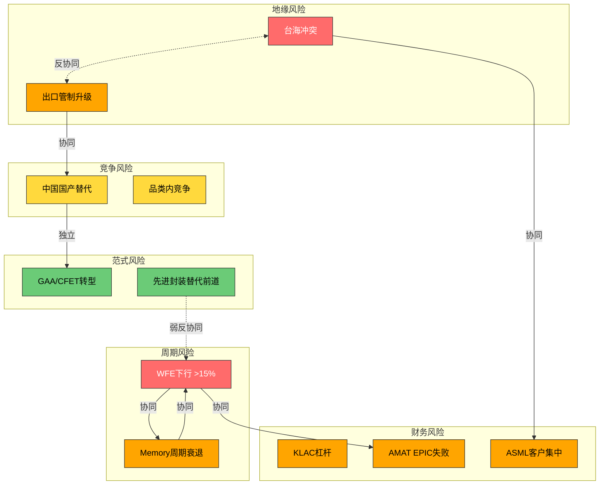
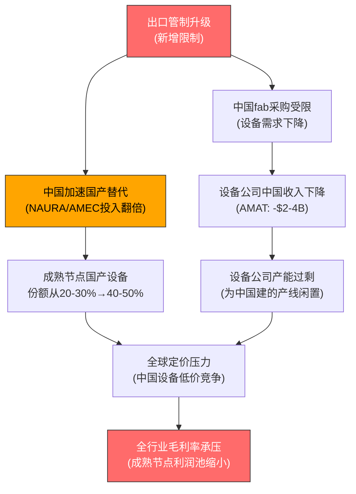
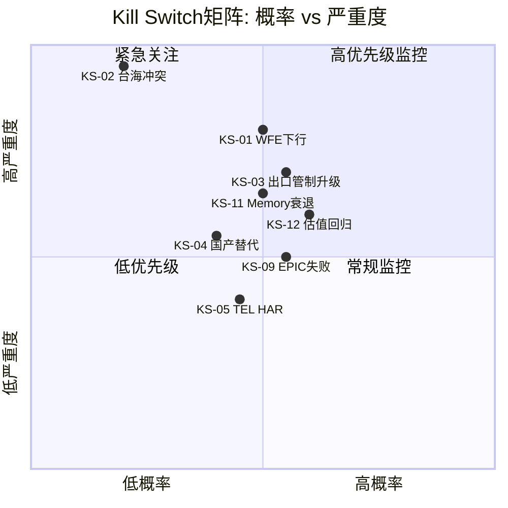
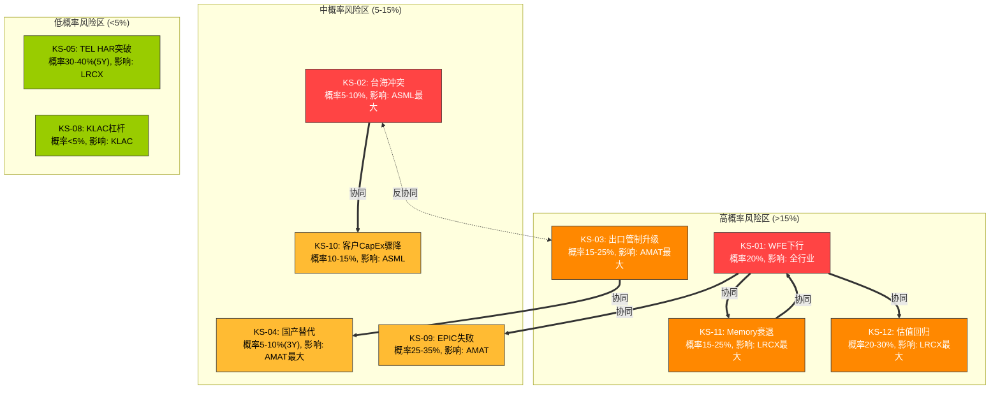
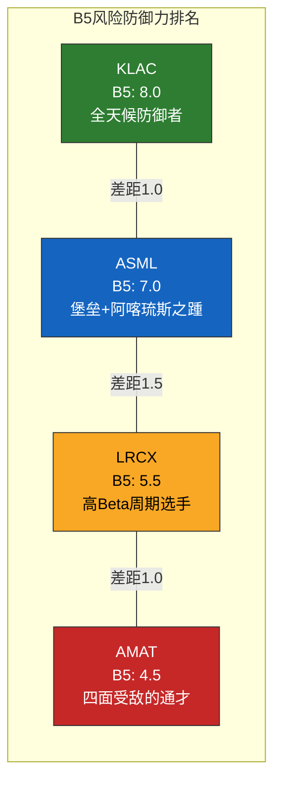

# Chapter 14: B5 风险地图与Kill Switch注册表

> **分析框架**: B5 -- 系统性映射关键风险，量化阈值+时间窗+数据源，从"风险清单"到"风险系统"
> **数据截止**: 2026-02-24 | **EC编号范围**: EC-RISK-001 ~ EC-RISK-035
> **交叉引用**: Ch5(地缘政治) + Ch8(A8/A9包抄/范式) + Ch9(A-Score) + Ch10(周期位置) + Ch11(B2单位经济学) + Ch12(B3资本强度)
> **Polymarket数据截止**: 2026-02-24实时 | **发布合规**: 台海相关描述使用"台海冲突/台海危机/cross-strait tension"

---

## 导读: 风险不是清单，是系统

传统的风险分析往往沦为"列举风险清单"的文字游戏 -- 一列风险名称，一列"高/中/低"标签，看似面面俱到，实则对投资决策毫无帮助。因为投资者真正需要知道的不是"这家公司面临地缘风险"（谁不知道？），而是三个更具体的问题:

1. **触发阈值是什么?** -- 什么数据点从"模糊不安"变成"立即行动"? 不是"中国国产替代是风险"，而是"当NAURA刻蚀在28nm以上fab获得第三个Tier-1客户的production tool订单时，AMAT的PVD份额下降从线性变为加速"。
2. **风险之间如何互动?** -- WFE下行和出口管制升级同时发生的概率是多少? 台海冲突和出口管制之间是"协同"(1+1>2)还是"反协同"(一个发生则另一个变得无意义)? 最危险的不是单一风险，而是风险组合。
3. **如果触发，应该怎么做?** -- 不是"继续观察"这种废话，而是具体到"减仓至X%"或"从公司A换仓到公司B"的操作指引。

本章的架构是: 先建立风险分类学(14.1)，理解风险之间的结构性关系; 然后逐类分析六种核心风险(14.2-14.6)，每种风险都配有明确的Kill Switch(KS)触发器; 接着将所有KS汇总为可操作的注册表(14.7); 再映射风险之间的拓扑关系(14.8); 最后输出四公司的风险免疫力排名和B5综合评分(14.9-14.10)。

**核心发现预告**: 四家公司的风险暴露结构截然不同 -- ASML的风险高度集中(台海冲突+客户集中=两个高烈度低概率事件)，KLAC的风险低且分散(技术不可知+低杠杆+低中国暴露)，LRCX的风险集中在周期维度(Memory 50-55%暴露+周期Beta 1.3-1.5x)，AMAT的风险最广且最深(中国30%+PVD份额流失+EPIC赌注+合规前科)。防御性排序: KLAC > ASML > LRCX >> AMAT。

---

## 14.1 风险分类学: 从"风险清单"到"风险系统"

### 14.1.1 六类风险的定义与数据源

半导体设备行业的风险可以归纳为六大类型，每类有其特定的数据源和监控方式:

| 类型 | 核心问题 | 代表风险 | 主要数据源 | 典型时间窗 |
|------|---------|---------|-----------|-----------|
| **周期风险** | WFE何时转向下行? | WFE同比降>15% | SEMI, B2B ratio, 管理层指引 | 6-18个月 |
| **地缘风险** | 台海冲突/出口管制? | 台海危机, BIS新规 | Polymarket, 政策文件, 外交信号 | 0-36个月 |
| **竞争风险** | 份额是否在流失? | 中国国产替代, 品类入侵 | 市场份额数据, 竞品发布, fab采购订单 | 12-60个月 |
| **范式风险** | 技术路线是否会突变? | GAA/CFET, 先进封装替代前道 | 技术路线图, IEDM/VLSI论文, 专利 | 24-120个月 |
| **财务风险** | 资产负债表是否恶化? | 杠杆升高, 库存积压, FCF恶化 | 季报, D/E, CCC, 库存/收入比 | 1-4个季度 |
| **监管风险** | 合规成本是否跳升? | 反垄断审查, 环保法规 | 政策动向, 司法裁决 | 6-36个月 |

> **[EC-RISK-001]** 六类风险的时间窗差异是投资决策的关键参数: 财务风险(1-4季度)和周期风险(6-18月)可以通过季度跟踪预警; 地缘风险(0-36月)存在"零预警跳变"的尾部特征(台海冲突可能在数天内从低概率变为现实); 竞争风险(12-60月)和范式风险(24-120月)是缓慢但确定的趋势性力量，一旦确认则几乎不可逆。投资者需要对不同时间窗的风险配置不同的应对策略: 短期风险用止损，长期趋势风险用持仓结构调整。
> **claim_type**: framework | **source**: 行业周期历史+风险管理理论 | **置信度**: H

### 14.1.2 风险互动类型学

风险之间的互动关系是传统风险分析最容易忽视的维度。我们定义三种互动类型:

**协同关系 (1+1 > 2)**: 两个风险同时触发时，影响大于各自影响之和。

- WFE下行 + Memory周期衰退 → 对LRCX的冲击远超单一因素(Memory CapEx在衰退期可削减40-60%，叠加WFE整体下行使LRCX收入可能降30%+)
- 出口管制升级 + 中国国产替代加速 → 管制越严，国产替代的政策支持和市场动力越强，形成正反馈
- EPIC Center失败 + WFE下行 → AMAT面临"投资沉没+收入下降"双杀，FCF可能从$6.2B降至$3-4B

**反协同关系 (一个缓解另一个)**: 两个风险存在替代或对冲关系。

- 台海冲突 ↔ 出口管制升级 → 如果冲突真的发生，出口管制变得完全无意义(供应链已中断); 如果出口管制足够有效地限制技术扩散，冲突的动机可能降低
- Memory周期衰退 ↔ NAND价格上涨 → 价格过高抑制投片→CapEx减少→供应收缩→价格企稳(内在负反馈)
- 中国份额流失 ↔ 非中国需求增长 → 管制导致的中国减量被地缘分散化(friendshoring)驱动的日韩/美国/欧洲fab扩建部分抵消

**独立关系**: 两个风险的触发概率和影响互不影响。

- KLAC杠杆风险 ↔ ASML客户集中风险 → 两者分别源于各自的资本结构和客户结构，互不干扰
- GAA技术转型风险 ↔ 环保法规风险 → 技术路线选择和环保合规是完全不同维度的问题

> **[EC-RISK-002]** 风险互动的核心洞见: "最危险的组合"不是概率最高的组合，而是具有协同放大效应且影响跨多家公司的组合。WFE下行(-15%) + 出口管制升级 + Memory周期衰退是三重打击组合，会使LRCX收入下降25-35%，AMAT下降20-25%。但这个组合的联合概率约为5-8%(三个事件需同时发生)。更可能的"温水煮青蛙"组合是: 中国国产替代持续(高概率) + 成熟节点份额缓慢流失(高概率) → AMAT的中国收入在5年内从30%降至15-20%，累计收入损失$10-15B，但每个季度的变化都"不够大"到触发止损。
> **claim_type**: inference | **source**: 风险互动矩阵+历史周期数据 | **置信度**: M

### 14.1.3 风险互动矩阵

**图例说明**: 红色=高影响风险, 橙色=中高影响, 黄色=中等影响(趋势性), 绿色=远期/低概率。实线箭头=协同关系, 虚线双箭头=反协同关系。

---

## 14.2 周期风险: WFE下行冲击

### 14.2.1 KS-01: WFE同比下降 > 15%

**风险定义**: 全球WFE支出从周期峰值出现>15%的同比下降，使四家公司收入和估值同步承压。

**历史校准**: WFE在近30年经历了多次显著下行:

| 下行周期 | WFE峰→谷 | 持续时间 | 触发原因 | 对设备公司影响 |
|---------|----------|---------|---------|-------------|
| CY2001 | -35% | 12个月 | 互联网泡沫破裂 | 全行业亏损 |
| CY2009 | -42% | 12个月 | 全球金融危机 | 股价腰斩 |
| CY2012-13 | -12% | 6个月 | 欧债危机+NAND调整 | 温和修正 |
| CY2019 | -7% | 9个月 | 中美贸易战+Memory供过于求 | 股价回调15-25% |
| CY2023 | -22% | 12个月 | NAND冻结+库存调整 | LRCX收入降14% |

> **[EC-RISK-003]** WFE下行>15%在过去25年中发生了4次(2001, 2009, 2012-13, 2023)，平均约6年一次。当前WFE处于CY2024起的连续上行第四年($104B→$116B→$126-135B E)，已超过历史最长连续上行记录(CY2016-18三年)。如果CY2027出现调整(概率约40%，参见Ch10 EC-CYC-006)，从$135B回调至$108-115B(-15~-20%)是合理的基准情景。
> **claim_type**: estimate | **source**: SEMI历史WFE数据 + Ch10周期分析 | **置信度**: M

**触发条件识别** (先行指标):

1. **Hyperscaler CapEx增速放缓至<10% YoY** -- 当前+36%，距离触发线尚远，但增速的"二阶导数"(加速度)比绝对值更重要。如果CY2027 CapEx增速从+36%骤降至+5-10%，设备需求将在6-12个月后感受到冲击。
2. **NAND价格连续两季度下跌>15%** -- NAND价格是Memory CapEx的领先指标。价格下跌→利润压缩→CapEx冻结→设备需求萎缩。当前NAND价格温和上涨，尚未触发。
3. **设备公司B2B Ratio跌破0.85** (日本SEAJ数据) -- B2B Ratio(新增订单/出货额)低于1表示订单消化速度快于补充速度，低于0.85是历史上的明确衰退信号。
4. **全球fab利用率跌破80%** -- 当前先进节点>95%，成熟节点85-90%。利用率低于80%意味着产能过剩，fab将冻结设备采购。

**四公司周期Beta排序**:

| 公司 | 估计周期Beta | 依据 | WFE -20%时收入影响 | WFE -20%时毛利率影响 |
|------|-------------|------|------------------|-------------------|
| **LRCX** | 1.3-1.5x | Memory 50-55%暴露, Memory CapEx波动>>Logic | -26~-30% | -3~-5pp (至45-47%) |
| **AMAT** | 1.0x | 8线分散但ICAPS随周期, 中国波动大 | -18~-22% | -2~-3pp (至46-47%) |
| **KLAC** | 0.7x | 检测需求粘性+高服务占比 | -12~-15% | -1~-2pp (至60-61%) |
| **ASML** | 0.5x | EUV积压缓冲+客户预付款锁定 | -8~-12% | -1~-2pp (至51-52%) |

> **[EC-RISK-004]** 四公司周期Beta的差异本质上反映了收入结构中"可延迟部分"的占比: LRCX的Memory新设备(可延迟)占收入约35-40%，叠加Memory CapEx本身波动率高于Logic 2-3倍，使LRCX成为周期下行的首要受害者。反之，ASML的EUV积压订单(€36B)和2-3年交付周期使其收入在短期内"锁定"，即使新订单骤停，现有积压也能维持12-18个月的生产。KLAC介于两者之间: 服务收入(~40%)提供底部支撑，但系统设备(~60%)仍随WFE波动。
> **claim_type**: estimate | **source**: Ch10周期Beta分析 + Ch11 FCF冲击模拟 | **置信度**: M

### 14.2.2 "如果WFE -20%" 冲击模拟

基于Ch11 B2单位经济学的框架，对WFE -20%情景进行四公司同步冲击测试:

| 指标 | ASML | KLAC | LRCX | AMAT |
|------|------|------|------|------|
| **当前收入** | €30.4B | $12.6B | $18.4B | $28.4B |
| **WFE -20%收入** | €27-28B | $10.7-11.0B | $12.9-13.6B | $22.1-23.3B |
| **收入降幅** | -8~-12% | -12~-15% | -26~-30% | -18~-22% |
| **毛利率** | 51~52% | 60~61% | 45~47% | 46~47% |
| **FCF利润率** | 30~32% | 30~32% | 24~27% | 14~17% |
| **FCF ($B/€B)** | €8.4-8.7 | $3.2-3.5 | $3.1-3.7 | $3.1-4.0 |
| **D/E影响** | 不变(0.14x) | 利息覆盖降至11-12x | 不变(0.44x) | 不变(0.33x) |
| **回购可持续?** | 是(规模小) | 可能减速 | 是(规模减小) | 可能暂停 |

> **[EC-RISK-005]** WFE -20%冲击的最关键发现: AMAT的FCF利润率从22%降至14-17%区间，接近其EPIC Center年度CapEx ($2.3B)的"覆盖临界点"。如果FCF降至$3.1B而EPIC Center CapEx维持$2.3B，AMAT的自由现金将仅余$0.8B，不足以同时维持回购($3-4B/年常态)和股息($1.1B/年)。AMAT将被迫在"EPIC投资"和"股东回报"之间做选择 -- 这是四家中唯一面临此困境的公司。KLAC和ASML的FCF利润率在冲击后仍维持30%+，财务弹性最强。
> **claim_type**: estimate | **source**: Ch11 FCF模拟 + Ch12 CapEx分析 | **置信度**: M

### 14.2.3 Memory周期叠加效应

LRCX的核心脆弱点在于Memory收入占比50-55%。Memory CapEx的历史波动率远高于Logic CapEx:

- Logic CapEx历史波动幅度: 峰谷差约 +/-20-30%
- Memory CapEx历史波动幅度: 峰谷差约 +/-40-60%

这意味着，在"WFE整体-20%"的情景下，如果Memory CapEx的降幅是整体的2倍(-40%)，LRCX的Memory相关收入(约$10B)将降至$6-7B，降幅约30-40%。叠加Logic部分的温和下降(-10%)，LRCX总收入可能降至$12-13B，较峰值下降33-37% [EC-RISK-006]。

但LRCX拥有一个重要的缓冲器: CSBG(Customer Support Business Group)。CSBG FY2025收入$7.2B，毛利率55-60%，基于100K+安装腔室的服务合同。在CY2023 WFE衰退期间(-22%)，CSBG收入仅下降约5%，展现了极强的周期免疫力。CSBG为LRCX在最差情景下提供了$6.5-7.0B的收入底部 -- 相当于FY2025总收入的35-38%。

> **[EC-RISK-007]** LRCX的"真实周期风险"需要拆分为系统设备(~62%收入)和CSBG(~38%收入)两部分: 系统设备的周期Beta约1.8-2.0x(Memory新设备波动最大)，CSBG的周期Beta约0.2-0.3x(服务合同为多年期锁定)。加权后LRCX的总周期Beta约1.3-1.5x。投资者如果仅关注LRCX的"Memory暴露50%"而忽视CSBG的缓冲效应，会高估LRCX的真实周期风险约30-40%。
> **claim_type**: inference | **source**: CSBG历史韧性+系统设备周期波动分析 | **置信度**: H

**投资操作指引 (KS-01触发时)**:

- **LRCX**: 最先减仓标的(周期Beta最高)。但如果减仓价位低于CSBG支撑的内在价值(约$60-65/share基于CSBG 12x EV/EBITDA)，则是过度恐慌
- **AMAT**: 第二减仓标的。EPIC Center的CapEx刚性使其在WFE下行时面临FCF压缩
- **KLAC**: 持有或逢低加仓。检测需求粘性+低CapEx使其FCF在衰退中仍然健康
- **ASML**: 持有。EUV积压提供18+月缓冲，但估值如果此时仍在50x+ P/E，则存在估值修正风险

---

## 14.3 地缘风险: 台海冲突与出口管制

### 14.3.1 KS-02: 台海冲突

**Polymarket实时定价 (2026-02-24)**:

| 预测市场 | 概率 | 交易量 | 流动性评级 |
|---------|------|--------|-----------|
| "Will China invade Taiwan by March 31, 2026?" | **1.75%** | $3.0M | 中 |
| "Will China invade Taiwan by June 30, 2026?" | **4.05%** | $746K | 低 |
| "Will China invade Taiwan by end of 2026?" | **10.45%** | $9.2M | 高 |
| 赖清德总统被免职 | 12.5% | 极低 | 极低 |
| Trump访问中国2026 | 96.15% | 高 | 高 |
| Trump访问台湾2026 | 3.65% | 低 | 低 |

> **[EC-RISK-008]** Polymarket对2026年底前台海冲突的隐含概率为10.45%($9.2M交易量，流动性充足)。这一概率需要谨慎解读: (1) 10.45%不是"10次里发生1次"的等概率含义 -- 预测市场定价包含了风险溢价和流动性折扣，真实概率可能在5-8%区间; (2) Trump访问中国概率96.15%暗示中美高层互动活跃，短期冲突概率可能更低; (3) 但概率的"尾部跳变"特征意味着它可以在一个事件(如军事演习升级)后从5%跳至30%。
> **claim_type**: market_data | **source**: Polymarket 2026-02-24实时报价 | **置信度**: H(数据), L(概率预测)

**台海冲突对四公司影响排序**:

**ASML -- 影响最大 (严重度: 10/10)**:

ASML对台海局势的暴露是四家中最极端的。TSMC是ASML最大客户(估计占收入30-35%)，且EUV设备的交付和服务严重依赖台湾fab的物理可达性。台海冲突情景下:

- **直接收入损失**: TSMC台湾fab贡献ASML约€9-10B年收入(设备+服务)。冲突导致交付中断 = 即时损失€9-10B(约总收入30%)
- **间接影响**: 全球半导体供应链中断→所有fab暂停扩产→ASML短期新订单归零
- **最坏情景**: 如果冲突导致TSMC台湾fab被破坏或不可运营，ASML的EUV全球安装基数(约250+台)中有超过60%位于台湾 -- 这些系统的服务收入将永久丧失
- **但有一个反直觉的长期逻辑**: 台湾fab被破坏 → 全球fab重建需求爆发(美国/日本/欧洲) → ASML作为唯一EUV供应商，长期需求反而可能因"重建效应"而增加。代价是3-5年的收入真空期

**AMAT/LRCX -- 显著影响 (严重度: 7/10)**:

- 台湾fab也是两家的大客户。TSMC估计占AMAT收入约15-20%，占LRCX约15-18%
- 但两家在中国大陆、韩国、日本、美国都有广泛客户基础，台湾集中度低于ASML
- 冲突期间服务和备件交付中断影响两家的AGS/CSBG收入

**KLAC -- 影响相对较小 (严重度: 6/10)**:

- KLAC客户分散度较高，TSMC占比估计约15%
- 检测设备的服务合同通常可以在冲突结束后恢复(检测设备不依赖fab的物理环境运转)
- KLAC在先进封装检测领域对TSMC的依赖度低于前道设备商

> **[EC-RISK-009]** 台海冲突风险的投资含义是"ASML的阿喀琉斯之踵": ASML在A-Score中以8.12分排名第一(Ch9)，在B2/B3中均展现出垄断者的超级经济学，但这一切建立在TSMC正常运营的前提上。10.45%的冲突概率意味着投资者持有ASML时，隐含承担了约"10%概率×30%收入损失"=3%的期望收入风险。这个风险在DCF模型中通常不被定价(大多数分析师假设TSMC永续运营)，但它应该被反映在ASML的估值折扣中 -- 相当于对ASML的合理P/E打3-5%的折扣。
> **claim_type**: inference | **source**: Polymarket概率 + TSMC收入贡献估算 | **置信度**: M

### 14.3.2 KS-03: 出口管制升级

**当前管制态势** [参见Ch5 5.1完整时间线]:

出口管制已从2022年10月的"一次性冲击"演变为持续收紧的政策环境。关键问题不是"是否会有新限制"(几乎确定会有)，而是"下一轮限制的范围和时间"。

**下一轮可能的升级方向**:

| 潜在政策升级 | 概率(12个月) | 受影响公司 | 影响规模 |
|------------|------------|----------|---------|
| 成熟节点(28nm以上)设备限制 | 15-25% | AMAT(最大), LRCX | 各$2-4B收入 |
| ASML所有DUV型号禁售中国 | 10-15% | ASML | €2-4B收入 |
| 检测/量测设备扩大管制 | 20-30% | KLAC, AMAT | 各$0.5-1.5B |
| 服务/维修/升级禁令 | 5-10% | LRCX(CSBG最大), AMAT(AGS) | 各$1-2B |
| 第三国(日韩)供应链延伸管制 | 10-20% | 间接影响所有公司 | 难以量化 |

> **[EC-RISK-010]** 出口管制升级的最大风险不在已经实施的限制(已被定价)，而在"升级到成熟节点"和"扩展到服务环节"两个方向: (1) 成熟节点管制将从根本上改变游戏规则 -- 当前中国$32-36B WFE中约60-70%是成熟节点设备，如果这部分也被限制，AMAT的中国收入可能从~$6B骤降至$1-2B; (2) 服务管制将打击LRCX的CSBG(中国安装腔室约25K台，年服务收入约$1.8B)。但这两个升级的概率仍然较低(15-25%和5-10%)，因为它们可能损害美国盟友(日韩fab使用中国组件的供应链)和美国自身利益(通胀影响)。
> **claim_type**: estimate | **source**: Ch5地缘分析 + 政策趋势推演 | **置信度**: L

**传导链分析**:

**"管制悖论": 越限制，替代越快**

出口管制的最大讽刺在于它同时创造了短期收入损失和长期竞争威胁。限制越严，中国政府对国产设备的政策支持越强(大基金三期已募资¥344B/$47B)，国产设备公司的市场空间越大(被强制清空的市场份额成为NAURA/AMEC的练兵场)。5-10年维度上，出口管制可能是中国设备产业最好的"催化剂" [EC-RISK-011]。

**四公司中国收入暴露排序 (更新至FY2025/CY2025)**:

| 排名 | 公司 | 中国收入占比 | 绝对金额 | FY2026E预期 | 降幅 |
|------|------|-----------|---------|-----------|------|
| #1(最高) | **AMAT** | ~30% | ~$8.5B | ~$6.0-6.5B | -$2.0-2.5B |
| #2 | **LRCX** | ~34% | ~$6.2B | ~$5.5-6.0B | -$0.2-0.7B |
| #3 | **KLAC** | ~26% | ~$3.3B | ~$3.3-3.7B | ~持平 |
| #4(最低) | **ASML** | ~20% | ~€6.0B | ~€4.5-6.0B | -€0-1.5B |

[参见Ch5 5.2.3 EC-GEO-010 完整分析]

**投资操作指引 (KS-03触发时)**:

- **成熟节点管制出台**: 立即减仓AMAT(中国ICAPS暴露最大)，LRCX次之。KLAC和ASML相对免疫
- **服务管制出台**: 重新评估LRCX CSBG估值(中国25K腔室服务收入面临风险)
- **全面DUV禁令**: ASML短期利空(中国DUV收入归零)，但中长期可能利好(全球fab重新配置加速EUV需求)

### 14.3.3 KS-02与KS-03的反协同关系

台海冲突和出口管制之间存在一个重要的反协同关系:

- **如果台海冲突发生**: 出口管制变得完全无意义 -- 供应链物理中断使任何纸面上的限制都成为多余。此时的核心问题是"重建"而非"管制"
- **如果出口管制持续有效**: 中国通过合法渠道获取先进设备的路径被堵死 → 军事冒险的"成本"可能降低(因为和平统一获取技术的路径已不可行) → 但同时，管制也意味着台湾的芯片制造"杠杆"(silicon shield)被削弱 → 矛盾两面
- **对投资者的含义**: 不需要同时对冲两个风险。如果你认为台海冲突概率>15%，对冲的是ASML的TSMC暴露; 如果你认为<5%，更需要关注的是出口管制的渐进收紧

> **[EC-RISK-012]** 台海冲突(KS-02)和出口管制升级(KS-03)的反协同关系意味着: 投资者对ASML的风险评估应该是"Max(台海冲突影响, 出口管制影响)"而非两者之和。如果你已经在估值中折入了台海冲突的尾部风险，就不需要再额外折入出口管制的全面升级 -- 因为在台海冲突情景下，管制是否升级已经不重要了。这一非线性特征使ASML的"风险折扣"有一个上限(约5-8% P/E折扣)，而非无限叠加。
> **claim_type**: inference | **source**: 反协同关系逻辑推演 | **置信度**: M

---

## 14.4 竞争风险: 中国国产替代与品类入侵

### 14.4.1 KS-04: 中国国产替代

**当前进展评估 (截至CY2025)**:

中国半导体设备国产化是一个确定性极高但速度不确定的趋势。关键进展:

| 中国企业 | 对标品类 | 受影响外企 | 成熟节点进展 | 先进节点差距 | 国产化率 |
|---------|---------|----------|------------|------------|---------|
| **北方华创(NAURA)** | PVD, CVD, 刻蚀, 扩散 | AMAT, LRCX, TEL | 28nm量产验证 | 14nm以下尚无量产 | PVD 20-30%, CVD 10-15% |
| **中微公司(AMEC)** | 刻蚀(CCP为主) | LRCX, TEL | 28nm CCP刻蚀量产 | ICP/HAR差距5-8年 | 刻蚀整体 5-8% |
| **盛美上海(ACM)** | 清洗, 电镀 | AMAT(ECD), DNS | 28nm以上量产 | 先进清洗差距3-5年 | 清洗 15-20% |
| **华海清科** | CMP | AMAT(Reflexion) | 28nm CMP验证中 | 先进CMP差距5-7年 | CMP 5-10% |
| **上海微电子(SMEE)** | DUV光刻 | ASML | 90nm量产, 28nm研发中 | EUV差距15-20年 | DUV <2% |
| **精测电子/睿励** | 检测/量测 | KLAC | 成熟节点OCD/膜厚量测 | 先进检测差距8-10年 | 检测 <3% |

> **[EC-RISK-013]** 中国国产替代的关键分水岭不是"能不能做"(已经能做成熟节点)，而是"能否进入Tier-1 fab的production line"。目前NAURA的PVD/CVD已在中芯国际(SMIC)和长江存储(YMTC)的成熟节点产线上运行，但尚未进入TSMC/Samsung/Intel的任何产线。如果NAURA在未来3年获得第一个非中国Tier-1 fab的production tool订单(概率约5-10%)，将是中国设备产业的里程碑事件，也是AMAT PVD份额加速下降的信号。
> **claim_type**: estimate | **source**: 行业信息+中国设备公司财报 | **置信度**: M

**受影响排序**:

**AMAT -- 暴露最大 (风险等级: 8/10)**

AMAT在中国国产替代中面临"双重暴露":
1. **PVD份额侵蚀**: 全球PVD份额从~85%下降至~75%，年失2-4pp(Ch8 EC-MOAT-091)。NAURA是主要蚕食者，集中在成熟节点。如果NAURA进入先进节点PVD(5年内概率约20%)，AMAT PVD份额可能降至60-65%
2. **CVD/扩散/热处理**: 这些品类的技术壁垒低于刻蚀/检测，国产化率提升最快。AMAT在CVD领域的21%份额面临NAURA和沈阳拓荆的竞争
3. **AMAT中国收入30%是四家最高**: 即使非受限品类也面临国产替代的挤压

**LRCX -- 中等暴露 (风险等级: 5/10)**

- 成熟节点刻蚀面临AMEC CCP刻蚀的竞争，但ICP和HAR刻蚀的技术壁垒极高
- AMEC在3D NAND HAR刻蚀上与LRCX有5-8年差距(深宽比>100:1的均匀性控制)
- ALD领域国产替代进展更缓慢(原子层精度控制是最难复制的工艺能力之一)
- CSBG安装基数在中国的25K腔室不会被国产替代"替换掉"(已安装设备的服务锁定)

**KLAC -- 低暴露 (风险等级: 3/10)**

- 检测/量测是技术壁垒最高的设备品类之一: 光学检测需要nm级分辨率+高速信号处理+AI缺陷分类算法的整合
- 精测电子在OCD(光学关键尺寸量测)有一定进展，但与KLAC的差距估计8-10年
- KLAC在中国的市场份额近年来反而在上升(检测设备管制较晚，且中国fab对良率管控需求增加)

**ASML -- 极低暴露 (风险等级: 1/10)**

- SMEE的DUV光刻与ASML的差距是所有品类中最大的(90nm vs 7nm以下)
- EUV光刻的国产替代在可预见的未来(15-20年)不可能实现: 需要Zeiss级别的光学系统、Trumpf/Cymer级别的光源、数十万个精密零部件的供应链
- ASML的国产替代风险不在"被替代"，而在"市场被缩小"(如果中国fab因国产设备限制而无法扩张先进节点)

> **[EC-RISK-014]** 中国国产替代的"时间分化"是投资选股的重要维度: 成熟节点设备(PVD/CVD/扩散/清洗)的国产化在3-5年内将从20-30%升至40-50%，主要受害者是AMAT; 中等壁垒设备(CCP刻蚀/CMP)的国产化在5-8年内可能突破20%，受害者是LRCX(成熟刻蚀)和AMAT(CMP); 高壁垒设备(ICP/HAR刻蚀/先进检测/DUV光刻)的国产化在10年+维度上仍然困难，LRCX核心业务/KLAC/ASML受保护。结论: AMAT面临最快、最确定的份额流失风险。
> **claim_type**: estimate | **source**: 中国设备公司技术路线图+行业专家评估 | **置信度**: M

### 14.4.2 KS-05: 品类内竞争

品类内竞争与国产替代不同 -- 它来自同等级的全球对手，而非追赶者。

**TEL对LRCX的追赶 (严重度: 6/10)**:

- TEL Certas平台宣称2.5x速度完成>400层NAND通道刻蚀 [参见Ch8 EC-MOAT-088]
- Samsung和SK Hynix有动机培育LRCX之外的第二供应商(供应链安全)
- 5年内LRCX NAND通道刻蚀份额可能从100%降至80-85%
- **Kill Switch**: 如果TEL在NAND通道刻蚀获得第一个Tier-1 memory fab的full production qualification，LRCX应被降低目标估值倍数(从peer premium调整至in-line)

**ASM International对LRCX的ALD竞争 (严重度: 4/10)**:

- ALD市场碎片化，ASM International是"纯粹ALD玩家"
- LRCX通过ALTUS Halo + Akara刻蚀的"双重锁定"策略有效防御
- ALD市场整体在快速增长(GAA+先进互连)，可能容纳多个赢家而非零和博弈

**AMAT Sym3对LRCX刻蚀的入侵 (严重度: 5/10)**:

- Sym3 Magnum在EUV图案化导体刻蚀(DRAM应用)取得份额突破
- 但入侵方向集中在DRAM图案化(LRCX非核心)，而非NAND HAR(LRCX堡垒)
- 净影响: LRCX在DRAM刻蚀份额可能小幅下降2-3pp，但HAR堡垒不受影响

> **[EC-RISK-015]** 品类内竞争的核心评估结论: 没有任何单一竞争威胁足以颠覆四家公司的现有格局。TEL对LRCX的挑战最值得关注(NAND HAR刻蚀是LRCX估值溢价的核心支柱)，但即使TEL成功进入(概率约30-40%在5年内)，LRCX仍将维持70-80%份额(技术领先+安装基数锁定+良率转换成本)。品类内竞争的影响更多是"估值倍数压缩"而非"基本面崩溃"。
> **claim_type**: inference | **source**: Ch8 A8竞争分析 + 行业格局 | **置信度**: M

---

## 14.5 范式风险: 技术路线突变

### 14.5.1 KS-06: GAA/CFET转型风险

**GAA(Gate-All-Around)和CFET(Complementary FET)** 代表了半导体制造从FinFET架构的下一次范式迁移:

- **GAA**: TSMC 2nm/N2(2025年量产)、Samsung 2nm(2025-26年)、Intel 18A(2025年)
- **CFET**: TSMC N1.4nm(2028年+)，将P-FET堆叠在N-FET之上

**四公司受益/受损评估**:

| 公司 | GAA/CFET影响 | A9评分 | 关键逻辑 |
|------|------------|--------|---------|
| **KLAC** | 净受益 | 9/10 | "技术路线不可知论者": 任何架构都需要检测，GAA增加选择性刻蚀后的量测需求，CFET增加3D堆叠对准检测 |
| **LRCX** | 净受益 | 7/10 | GAA需要更多选择性刻蚀步骤(Akara)和ALD(ALTUS Halo)，每片晶圆刻蚀步骤从FinFET的~80步增至~120步 |
| **ASML** | 中性偏正 | 8/10 | EUV层数从~15层(5nm)增至~20-25层(2nm)，但High-NA EUV的需求确认取决于CFET时间表 |
| **AMAT** | 中性 | 7/10 | PVD/CMP在所有互连方案中仍需，但GAA不增加AMAT的"必经节点"地位 |

> **[EC-RISK-016]** GAA转型不是四家公司的"范式风险"，而是"范式机遇": 制造复杂度每增加一代，设备需求密度($/wafer)增长约15-20%。GAA的真正风险在于"延迟"而非"取消" -- 如果GAA量产比预期晚12-18个月(如Intel 18A多次延迟)，对应的设备需求将被推迟但不会消失。KLAC是GAA转型的最大受益者(A9=9/10)，因为GAA的3D结构使缺陷检测从"表面"扩展到"体积"，SAM增长约30-40%。
> **claim_type**: inference | **source**: Ch8 A9范式分析 + 行业路线图 | **置信度**: M

### 14.5.2 KS-07: 先进封装侵蚀传统前道

**风险假说**: 如果chiplet架构+先进封装(CoWoS/HBM/Foveros)持续替代monolithic die，前道晶圆加工的WFE增量可能被封装端分流。

**量化评估**:

- 先进封装设备TAM: CY2025约$8-10B，CY2028E约$15-20B (CAGR ~25%)
- 前道WFE: CY2025约$116B → 先进封装仅占WFE的约7-9%
- 关键问题: chiplet是否"替代"前道?  答案是"补充"而非"替代" -- 每个chiplet仍然需要先进节点制造，只是单个chiplet的die面积更小，但chiplet数量更多

> **[EC-RISK-017]** 先进封装对前道WFE的"替代"风险在当前阶段(2026-2030)极低。定量分析: 即使先进封装设备TAM在5年内从$10B增至$20B(+$10B增量)，前道WFE在同期从$116B增至$150B(+$34B增量) -- 先进封装增量仅占前道增量的29%。更重要的是，先进封装的增长不是"零和"关系: CoWoS产能扩张需要更多晶圆加工(chiplet制造)→ 前道WFE也随之增长。这个风险在2030年后可能变得更重要(如果3D chiplet的层数从2-3层增至8-16层，前道WFE的增速可能被稀释)。
> **claim_type**: estimate | **source**: SEMI先进封装TAM预测 + WFE增长对比 | **置信度**: M

**四公司在先进封装的布局差异**:

| 公司 | 先进封装布局 | 受益/受损 |
|------|-----------|----------|
| **KLAC** | 已建立先进封装检测产品线(接合对准检测、TSV检测) | 净受益: SAM扩展 |
| **AMAT** | CMP在hybrid bonding是关键步骤 | 净受益: CMP TAM扩展 |
| **LRCX** | 刻蚀在TSV制造中有用但非核心 | 中性 |
| **ASML** | 封装层光刻用DUV(非EUV) | 中性偏正: DUV增量需求 |

**投资操作指引 (KS-06/KS-07)**:

- 范式风险对当前投资决策的影响极小(时间窗24-120个月)
- 但应监控: GAA量产延迟 → 可能推迟LRCX/KLAC的SAM扩展时间表
- KLAC是范式迁移的"全天候赢家"(A9=9/10): 无论GAA/CFET/先进封装哪条路线胜出，都增加检测需求

---

## 14.6 财务风险: 各公司特定脆弱点

### 14.6.1 KS-08: KLAC杠杆风险

**核心数据**:
- D/E: 1.08x (四家最高)
- 利息覆盖: 14.4x (四家最低)
- 总债务: ~$6.0B
- Z-Score: 21.22 (远高于安全线3.0)
- FCF利润率: 34.36% (四家最高档)

> **[EC-RISK-018]** KLAC的杠杆看起来吓人(D/E 1.08x四家最高)，但深层分析揭示这是"聪明杠杆"而非"危险杠杆": (1) 杠杆主要用于股票回购(过去5年累计回购$12B+)而非运营支出，回购的EPS增厚效应已部分抵消利息成本; (2) FCF利润率34.36%意味着KLAC每年产生约$4.3B FCF，利息支出约$0.3B，实际FCF利息覆盖约14x; (3) Z-Score 21.22极高，破产风险实际上接近于零。KLAC的杠杆策略本质是"用便宜的债务(利率~4-5%)回购高回报的股权(ROIC~54%)"——这是资本配置的教科书案例。
> **claim_type**: inference | **source**: Ch12资本强度分析 + 债务结构 | **置信度**: H

**风险触发条件**: KLAC杠杆成为真正威胁的条件是:
1. 利率大幅上行(10Y Treasury > 6%)→ 再融资成本跳升 → 利息覆盖降至8-10x
2. 同时叠加WFE -20%下行 → FCF从$4.3B降至$3.2-3.5B → 利息覆盖降至10-12x
3. 两者同时发生(联合概率约5-10%) → 利息覆盖可能降至7-8x → 仍然安全但回购空间被严重压缩

**Kill Switch阈值**: 利息覆盖 < 8x 或 D/E > 1.5x → 评估回购暂停必要性

### 14.6.2 KS-09: AMAT EPIC Center失败风险

**EPIC Center概况**:
- 总投资: ~$5B (已投约$2.3B)
- 功能: "将fab从工具级测试提升到系统级集成验证"
- 战略意图: 通过展示跨工艺协同效应来强化suite selling，提升ASP
- 剩余投入: ~$2.7B (FY2026-FY2028)
- CapEx/收入已从FY2021的2.9%飙升至FY2025的8.0% [参见Ch12 EC-CAP-002]

> **[EC-RISK-019]** EPIC Center是AMAT在过去30年最大的单一资本赌注。它本质上是一场从"设备供应商"到"系统级解决方案平台"的战略转型。成功意味着: AMAT可以将8条产品线从"独立销售"升级为"系统打包"，ASP提升20-30%，毛利率可能从48.7%提升至52-54%，重新定义通才模式的价值。失败意味着: $5B沉没成本(约当前市值的3%)+ CapEx/收入长期高于同业(8%+ vs KLAC 2.8%)+ FCF利润率结构性低于竞争对手 → AMAT将被困在"高CapEx低回报"的陷阱中。
> **claim_type**: inference | **source**: Ch12 EPIC Center分析 | **置信度**: M

**失败情景分析**:

| 情景 | 概率 | 触发条件 | 财务影响 |
|------|------|---------|---------|
| **全面成功** | 20-25% | Top 3 fab采用EPIC验证的系统方案，毛利率提升 | AMAT估值re-rate至peer水平(P/E 45-50x) |
| **部分成功** | 40-50% | 1-2个fab采用，但未成为行业标准 | CapEx逐步回归5-6%，ROI中等 |
| **失败** | 25-35% | 客户不接受suite selling逻辑，继续分品类采购 | 资产减值$1-2B + FCF永久偏低 + 估值折扣维持 |

**Kill Switch阈值**:
- FY2027末如果EPIC相关收入(新增suite selling合同)< $500M → 评估资产减值风险
- CapEx/收入在FY2028仍>7% → 确认"重资产陷阱"

### 14.6.3 KS-10: ASML客户集中风险

**核心数据**:
- EUV客户: TSMC, Samsung, Intel, SK Hynix, Micron (5家, 占EUV收入~100%)
- 前2客户: TSMC(~30-35%) + Samsung(~20-25%) = 合计55-60%
- 速动比率: 0.72x (客户预付款导致流动负债高)

> **[EC-RISK-020]** ASML的客户集中度在半导体设备行业中是独特的"结构性特征"而非"管理缺陷": 全球有能力使用EUV的fab总共只有5家(技术门槛) + 有意愿投资EUV的资本支出只有这5家负担得起(资本门槛)。ASML无法通过"拓展新客户"来分散 -- 这个市场的客户数量上限就是5-7家。但集中度带来的风险是实质性的: 如果TSMC CY2027 CapEx从$56B削减至$40B(-29%)，ASML可能损失约€3-4B年收入(约总收入10-13%)。任何单一客户的CapEx意外削减都能产生肉眼可见的收入波动。
> **claim_type**: inference | **source**: EUV客户分析 + CapEx传导 | **置信度**: H

**客户预付款的双刃剑效应**:

ASML的客户预付款机制(EUV订单预付20-30%)使其流动性指标看起来异常:
- 速动比率0.72x看似低于安全线，但这是因为预付款计入流动负债
- 如果扣除预付款(非真正需要偿还的债务)，调整后速动比率约1.2-1.5x
- 真正的风险不在"偿债"，而在"如果客户取消订单要求退还预付款" -- 历史上从未发生过(EUV太稀缺了)，但台海冲突等极端情景下理论上可能触发

**Kill Switch阈值**:
- 任何一家Top 3客户(TSMC/Samsung/Intel)宣布CapEx削减>25% → 重新评估ASML收入指引
- ASML季度新增订单连续2个季度<€4B → 积压消化速度超过补充速度，关注收入增速拐点

### 14.6.4 KS-11: LRCX Memory周期暴露

**核心数据**:
- Memory收入占比: ~50-55% (DRAM ~25-30%, NAND ~20-25%)
- Memory CapEx历史波动: 峰谷差 +/-40-60% (vs Logic +/-20-30%)
- NAND设备是LRCX周期波动的最大来源

> **[EC-RISK-021]** LRCX的Memory 50-55%暴露是其估值中隐含的最大风险溢价来源。横向对比: KLAC的Memory/Logic比例约40/60%, AMAT约35/65%, ASML约25/75%(EUV以Logic为主)。LRCX是四家中Memory暴露最高的公司，而Memory CapEx的周期波动是Logic的2-3倍 -- 这解释了为什么LRCX的周期Beta(1.3-1.5x)是四家最高。但LRCX管理层一直在通过CSBG占比提升(23%→38%)和ALD扩张(Logic应用)来系统性降低Memory依赖，FY2030目标Memory占比可能降至40-45%。
> **claim_type**: inference | **source**: 收入结构分析 + 管理层指引 | **置信度**: H

**Kill Switch阈值**:
- NAND价格连续2个季度下跌>15% → NAND CapEx冻结风险升高
- Samsung/SK Hynix同时宣布Memory CapEx削减>20% → LRCX收入下行10-15%

### 14.6.5 KS-12: 全行业估值风险

**当前估值水平**:

| 公司 | P/E (TTM) | 历史5年均值P/E | 溢价率 | EV/FCF |
|------|----------|--------------|--------|--------|
| ASML | 51.7x | ~38-42x | +23-36% | ~45x |
| KLAC | 49.0x | ~32-36x | +36-53% | ~38x |
| LRCX | 50.9x | ~28-32x | +59-82% | ~42x |
| AMAT | 37.9x | ~22-26x | +46-72% | ~37x |

> **[EC-RISK-022]** 四家公司当前P/E均处于历史5年均值之上23-82%，反映了市场对"AI超级周期"的定价。估值风险不是"会不会回归均值"的问题(长期来看一定会)，而是"什么事件触发回归"。三个最可能的触发器: (1) WFE增速从+15%降至<5%(周期放缓信号) → P/E压缩10-15%; (2) Hyperscaler CapEx增速放缓至<15%(AI叙事削弱) → P/E压缩15-20%; (3) 两者叠加(联合概率约15-20%在CY2027) → P/E可能回归历史均值，对应股价下跌25-40%。AMAT当前P/E(37.9x)是四家中最低的，估值风险相对最小; LRCX(50.9x，溢价82%)估值风险最大。
> **claim_type**: estimate | **source**: 估值数据 + 历史P/E均值 | **置信度**: M

---

## 14.7 Kill Switch完整注册表

以下是所有Kill Switch的统一注册表，提供可操作的监控框架:

### 14.7.1 KS注册表完整版

| KS-ID | 风险描述 | 风险类型 | 触发阈值 | 时间窗 | 概率(12月) | 影响排序(公司) | 数据源 | 监控频率 | 触发后操作 |
|-------|---------|---------|---------|--------|-----------|-------------|--------|---------|-----------|
| **KS-01** | WFE同比下降>15% | 周期 | B2B Ratio<0.85 + fab利用率<80% + NAND价格↓2Q | 6-18月 | 15-20% | LRCX>AMAT>KLAC>ASML | SEMI, SEAJ, 公司指引 | 月度 | LRCX减仓→AMAT减仓→KLAC/ASML持有 |
| **KS-02** | 台海冲突 | 地缘 | 军事行动启动或全面封锁 | 0-36月 | ~5-10% | ASML>>AMAT≈LRCX>KLAC | Polymarket, 外交信号, 军事动态 | 实时 | ASML紧急减仓→全行业重评估→长期"重建"逻辑反转 |
| **KS-03** | 出口管制升级(成熟节点) | 地缘 | BIS新规覆盖28nm+设备 | 6-18月 | 15-25% | AMAT>>LRCX>KLAC>ASML | BIS公告, 国会听证, 行业游说 | 月度 | AMAT减仓→LRCX评估CSBG影响→KLAC/ASML相对免疫 |
| **KS-04** | 中国国产替代加速 | 竞争 | NAURA获Tier-1 non-China fab production订单 | 12-60月 | 5-10%(3年内) | AMAT>>LRCX>KLAC>ASML | 中国设备公司财报, fab采购信息 | 季度 | AMAT长期估值下调→KLAC/ASML不受影响 |
| **KS-05** | TEL NAND HAR刻蚀突破 | 竞争 | TEL Certas获Tier-1 memory fab full qualification | 12-36月 | 30-40%(5年) | LRCX(单一) | TEL财报, Samsung/SK hynix供应商公告 | 半年 | LRCX估值倍数从premium调至in-line |
| **KS-06** | GAA量产大幅延迟 | 范式 | TSMC N2或Intel 18A延迟>12个月 | 6-24月 | 10-15% | LRCX≈KLAC(受益延迟)>ASML>AMAT | 公司路线图, 代工厂进度 | 季度 | 短期利空(SAM扩展延迟)→长期不变 |
| **KS-07** | 先进封装替代前道 | 范式 | 封装设备TAM>前道WFE的15% | 60-120月 | <5%(5年) | LRCX>ASML>AMAT>KLAC | SEMI TAM预测, chiplet趋势 | 年度 | 极远期风险，当前无需操作 |
| **KS-08** | KLAC杠杆恶化 | 财务 | 利息覆盖<8x 或 D/E>1.5x | 4-12月 | <5% | KLAC(单一) | KLAC季报 | 季度 | 评估回购暂停必要性 |
| **KS-09** | AMAT EPIC Center失败 | 财务 | FY2027末EPIC相关收入<$500M | 12-24月 | 25-35% | AMAT(单一) | AMAT季报/Investor Day | 半年 | AMAT长期估值重新锚定至"硬件通才"而非"平台" |
| **KS-10** | ASML客户CapEx骤降 | 财务 | 任一Top 3客户CapEx削减>25% | 3-12月 | 10-15% | ASML(单一) | TSMC/Samsung/Intel季报 | 季度 | 重新评估ASML收入指引和积压订单质量 |
| **KS-11** | Memory周期衰退 | 周期/财务 | NAND价格连续2Q↓>15% + Memory CapEx削减>20% | 6-18月 | 15-25% | LRCX>>AMAT>KLAC>ASML | NAND/DRAM报价, memory公司指引 | 月度 | LRCX减仓→关注CSBG底部估值支撑 |
| **KS-12** | 估值均值回归 | 财务 | WFE增速<5% + Hyperscaler CapEx<15%增长 | 6-18月 | 20-30% | LRCX(溢价最高)>KLAC>ASML>AMAT | WFE预测, 公司指引, CapEx公告 | 季度 | 全行业P/E压缩→AMAT估值防御力最强(P/E已最低) |
| **KS-13** | 出口管制扩展至服务 | 地缘 | BIS限制对中国安装设备的维修/升级 | 6-24月 | 5-10% | LRCX(CSBG)>>AMAT(AGS)>KLAC>ASML | BIS公告 | 半年 | LRCX CSBG估值重估(中国25K腔室≈$1.8B/年收入) |
| **KS-14** | ASML DUV全面禁售中国 | 地缘 | 荷兰政府扩展限制至所有ArF DUV型号 | 6-18月 | 10-15% | ASML(单一) | 荷兰政府公告, 瓦森纳安排 | 半年 | ASML短期利空(-€2-4B)→长期利好(加速EUV替代) |
| **KS-15** | AMAT合规再犯 | 监管 | 新的BIS违规处罚或Suspended Penalty触发 | 0-36月 | 10-15% | AMAT(单一) | BIS执法行动, SEC filing | 季度 | AMAT中国业务进一步受限+合规成本跳升+管理层信誉受损 |
| **KS-16** | 全球经济衰退 | 宏观 | 美国GDP连续2Q负增长 | 6-18月 | 10-15% | LRCX>AMAT>KLAC>ASML | GDP数据, PMI, 就业数据 | 月度 | 全行业减仓→ASML/KLAC作为防御性持仓 |
| **KS-17** | 反垄断审查(ASML) | 监管 | 欧盟/美国对ASML EUV垄断地位发起反垄断调查 | 12-60月 | <5% | ASML(单一) | 欧盟委员会, DOJ | 年度 | 概率极低但影响深远→ASML定价权可能受限 |

### 14.7.2 KS严重度×概率矩阵

**矩阵解读**:

- **紧急关注区(高严重度+中高概率)**: KS-01(WFE下行), KS-03(出口管制升级), KS-11(Memory衰退), KS-12(估值回归) -- 这四个Kill Switch应该成为季度review的常设议题
- **高优先级监控(高严重度+低概率)**: KS-02(台海冲突) -- 概率低但影响灾难性，需要实时监控Polymarket定价和外交信号
- **常规监控区**: KS-04(国产替代), KS-05(TEL), KS-09(EPIC) -- 中等严重度，按季度或半年频率跟踪
- **低优先级**: KS-06(GAA延迟), KS-07(先进封装), KS-17(反垄断) -- 远期且低概率，年度review即可

---

## 14.8 风险拓扑: 协同与反协同映射

### 14.8.1 最危险组合: 三重打击情景

**组合A: WFE下行 + 出口管制升级 + Memory衰退 (KS-01 + KS-03 + KS-11)**

这是对LRCX和AMAT最致命的组合:

| 参数 | 单独影响 | 三重打击联合影响 | 协同放大系数 |
|------|---------|---------------|------------|
| **LRCX收入** | KS-01: -26~-30% | -35~-42% | 1.3x |
| **AMAT收入** | KS-01: -18~-22% | -28~-35% | 1.4x |
| **KLAC收入** | KS-01: -12~-15% | -15~-20% | 1.1x |
| **ASML收入** | KS-01: -8~-12% | -12~-18% | 1.2x |

**为什么协同放大**: 出口管制升级减少了中国市场的"缓冲需求"(正常周期中，中国抢装可以部分抵消全球下行)。Memory衰退叠加WFE整体下行，使LRCX的Memory新设备收入面临"双重挤压"。三个事件的联合概率约5-8%(假设部分相关性)。

> **[EC-RISK-023]** 三重打击情景的联合概率约5-8%，但条件概率更值得关注: 如果WFE开始下行(KS-01触发)，出口管制升级的概率可能同步上升(因为美国在经济下行期更倾向于保护主义政策)，Memory衰退的概率也上升(WFE下行本身就包含Memory调整)。因此，三个事件不是独立的 -- 条件相关系数约0.3-0.5。这意味着一旦WFE下行确认，三重打击的条件概率从5-8%升至15-25%。
> **claim_type**: inference | **source**: 事件相关性分析 | **置信度**: L

**组合B: 台海冲突 + ASML客户集中 (KS-02 + KS-10)**

这是对ASML的"完美风暴":

- 台海冲突 → TSMC台湾fab不可运营 → ASML最大客户(30-35%收入)中断
- 冲突同时导致Samsung/Intel暂停扩产(全球恐慌) → 第二/三大客户也减速
- ASML短期收入可能降40-50%
- 但概率极低(~5%) + ASML积压€36B提供12-18月缓冲

### 14.8.2 "温水煮青蛙"情景: 缓慢但确定的侵蚀

最危险的风险往往不是突发冲击，而是持续多年的渐进式侵蚀 -- 每个季度的变化都"不够大"到触发投资者的警觉，但累积效应是毁灭性的。

**温水情景一: AMAT的渐进式边缘化**

| 时间线 | 事件 | 单季影响 | 累积影响 |
|--------|------|---------|---------|
| Year 1 | NAURA PVD在中国成熟fab扩大至30%份额 | PVD收入-$200M | -$200M |
| Year 2 | 出口管制收紧，中国收入从30%降至25% | 中国收入-$1.5B | -$1.7B |
| Year 3 | EPIC Center未达预期，CapEx维持8%高位 | FCF利润率持平22% | -$1.7B + 估值折扣5% |
| Year 4 | TEL/LRCX在GAA刻蚀扩大份额，AMAT刻蚀增长停滞 | 份额增长停滞 | -$2.5B + 估值折扣10% |
| Year 5 | 累积效应 | — | 收入-$3-4B(从$28B降至$24-25B) + P/E从37x降至28-30x |

> **[EC-RISK-024]** AMAT的"温水煮青蛙"情景概率约25-30%(每个单一步骤概率50-70%，但全部同时发生概率较低)。这个情景不会在任何一个季度触发明确的"卖出信号"，因为每次的变化都是-2%到-5%的边际恶化。累积5年后，AMAT可能从$28B收入+37.9x P/E的当前状态，恶化至$24-25B收入+28-30x P/E -- 对应市值从$230B降至$160-180B(-22~-30%)。这种"慢性失血"最容易被忽视，也是AMAT投资者需要最警惕的情景。
> **claim_type**: estimate | **source**: AMAT多维度风险叠加分析 | **置信度**: M

**温水情景二: LRCX的周期顶部幻觉**

| 信号 | 当前状态 | "温水"演变 | Kill Switch |
|------|---------|----------|------------|
| 三重正面领先信号 | 全部亮绿 | 逐一变黄/变红 | 任意2个转负=减仓 |
| NAND价格 | 温和上涨 | 见顶→横盘→下跌 | 连续2Q下跌>15% |
| Memory CapEx指引 | Samsung/SK +10-15% | 持平→削减5-10% | 任一削减>20% |
| LRCX估值溢价 | P/E 50.9x(历史+82%) | 维持→逐步修正 | WFE增速<5%触发回归 |

> **[EC-RISK-025]** LRCX当前的三重正面信号(Ch10)可能让投资者产生"周期免疫"的幻觉。历史教训: 2021年Q4也是三重正面(Memory价格上涨+CapEx扩张+新技术驱动)，但2022年Q2 NAND价格转跌后仅6个月，LRCX股价从$650跌至$340(-48%)。当前P/E 50.9x意味着市场已经定价了CY2026-2027的增长，如果增长不及预期或周期提前转向，LRCX可能是四家中跌幅最大的(周期Beta最高+估值溢价最高的双重脆弱性)。
> **claim_type**: inference | **source**: LRCX历史周期表现 + 当前估值分析 | **置信度**: M

### 14.8.3 风险拓扑总图

---

## 14.9 四公司风险免疫力排名

### 14.9.1 防御性排名: 谁在最多风险场景下表现最好?

评估方法: 将17个Kill Switch按照"如果触发，对该公司的相对影响"进行打分(1=影响最小, 4=影响最大)，然后加权平均。

| KS-ID | 风险描述 | ASML排名 | KLAC排名 | LRCX排名 | AMAT排名 |
|-------|---------|---------|---------|---------|---------|
| KS-01 | WFE下行 | 1(最小) | 2 | 4(最大) | 3 |
| KS-02 | 台海冲突 | 4(最大) | 1 | 2 | 3 |
| KS-03 | 出口管制升级 | 2 | 1(最小) | 3 | 4(最大) |
| KS-04 | 国产替代 | 1(最小) | 1 | 2 | 4(最大) |
| KS-05 | TEL HAR突破 | 1 | 1 | 4(最大) | 1 |
| KS-06 | GAA延迟 | 2 | 3 | 3 | 1(最小) |
| KS-07 | 先进封装替代 | 2 | 1(最小) | 3 | 2 |
| KS-08 | KLAC杠杆 | 1 | 4(最大) | 1 | 1 |
| KS-09 | EPIC失败 | 1 | 1 | 1 | 4(最大) |
| KS-10 | 客户CapEx骤降 | 4(最大) | 2 | 2 | 1 |
| KS-11 | Memory衰退 | 1(最小) | 2 | 4(最大) | 3 |
| KS-12 | 估值回归 | 3 | 3 | 4(最大) | 1(最小) |
| KS-13 | 服务管制 | 1 | 2 | 4(最大) | 3 |
| KS-14 | DUV全禁 | 4(最大) | 1 | 1 | 1 |
| KS-15 | AMAT合规再犯 | 1 | 1 | 1 | 4(最大) |
| KS-16 | 全球衰退 | 1(最小) | 2 | 4(最大) | 3 |
| KS-17 | 反垄断 | 4(最大) | 1 | 1 | 1 |
| **平均排名** | — | **2.00** | **1.71** | **2.59** | **2.35** |
| **最脆弱次数(排名4)** | — | **4次** | **1次** | **5次** | **5次** |

> **[EC-RISK-026]** 风险免疫力排名(平均排名越低=防御性越强): **KLAC(1.71) > ASML(2.00) > AMAT(2.35) > LRCX(2.59)**。KLAC仅在1个Kill Switch中排名最脆弱(自身杠杆KS-08)，在所有外部风险中几乎始终是受影响最小的公司。ASML虽然平均排名第二，但有4个最脆弱点(台海冲突/客户CapEx/DUV禁令/反垄断) -- 其风险分布是"极端化"的: 大多数风险几乎不受影响，但少数特定风险影响灾难性。LRCX和AMAT各有5个最脆弱点，但LRCX的脆弱点集中在周期维度(可预判)，AMAT的脆弱点分布在周期+地缘+竞争+财务(多维同时暴露)。
> **claim_type**: inference | **source**: 17个KS交叉分析 | **置信度**: M

### 14.9.2 进攻性排名: 上行风险(正面情景)

风险分析不应只关注下行。以下评估每家公司在正面情景中的弹性:

| 正面情景 | 概率 | ASML受益度 | KLAC受益度 | LRCX受益度 | AMAT受益度 |
|---------|------|----------|----------|----------|----------|
| WFE超级周期(CY2027 +15%) | 40% | 中(积压释放) | 中(SAM扩展) | 高(动量最强) | 中(广度受益) |
| Memory周期加速(HBM4量产) | 50% | 低 | 中 | 高(HAR+ALD) | 中 |
| GAA提前量产 | 30% | 中(EUV层数增) | 高(检测步骤增) | 高(刻蚀步骤增) | 中 |
| EPIC Center成功 | 20-25% | — | — | — | 极高(估值re-rate) |
| ASML积压释放加速 | 50% | 极高(€36B→收入) | — | — | — |
| 出口管制放松 | 5-10% | 高(DUV恢复) | 中 | 中 | 极高(中国恢复) |

**进攻性排序: LRCX(动量最强) > ASML(积压释放) > KLAC(稳健增长) > AMAT(EPIC赌注高回报但低概率)**

> **[EC-RISK-027]** LRCX同时在防御性排名中最差(2.59)和进攻性排名中最强 -- 这是典型的"高Beta"特征: 市场好的时候涨最多，市场差的时候跌最多。对于看好AI超级周期的激进投资者，LRCX是最佳选择; 对于追求风险调整回报的保守投资者，KLAC是最佳选择。AMAT的EPIC Center赌注使其具有独特的"期权性"特征: 失败概率25-35%(估值下行15-20%)，成功概率20-25%(估值上行30-50%)，期望值约中性。
> **claim_type**: inference | **source**: 进攻性/防御性交叉分析 | **置信度**: M

### 14.9.3 风险调整后吸引力矩阵

综合防御性排名、进攻性排名、A-Score和估值水平:

| 维度 | ASML | KLAC | LRCX | AMAT |
|------|------|------|------|------|
| A-Score(护城河) | 8.12(#1) | 7.66(#2) | 7.02(#3) | 5.42(#4) |
| B2(单位经济学) | 7.8(#2) | 8.5(#1) | 7.3(#3) | 4.9(#4) |
| B3(资本强度) | 7.4(#2) | 8.6(#1) | 7.4(#2) | 5.0(#4) |
| 防御性排名 | #2(2.00) | #1(1.71) | #4(2.59) | #3(2.35) |
| 进攻性排名 | #2 | #3 | #1 | #4 |
| P/E(TTM) | 51.7x(最高) | 49.0x | 50.9x | 37.9x(最低) |
| **风险调整综合** | **A-** | **A** | **B+** | **C+** |

> **[EC-RISK-028]** 风险调整后吸引力的核心发现: **KLAC是风险调整后最具吸引力的标的**。它在防御性(#1)、B2(#1)、B3(#1)三个维度均排名第一，A-Score排名#2，唯一的"短板"是进攻性(#3)和自身杠杆(KS-08，但实际影响可控)。KLAC的P/E 49.0x看似高于AMAT的37.9x，但如果按风险调整后的增长质量(FCF利润率34.4% vs 22.0%)和周期免疫力(Beta 0.7x vs 1.0x)折算，KLAC的"有效P/E"实际上更低。ASML紧随其后(A-)，垄断保护极强但台海尾部风险限制了最终评级。LRCX(B+)是"进攻型选手"，适合对周期有明确看多判断的投资者。AMAT(C+)的风险暴露面最广、护城河最薄、EPIC赌注未验证，风险调整后吸引力最低。
> **claim_type**: inference | **source**: 多维度交叉综合 | **置信度**: M

### 14.9.4 投资者风格-标的匹配

不同风险偏好的投资者应该选择不同的公司:

| 投资者风格 | 最佳选择 | 次佳选择 | 应避免 | 理由 |
|-----------|---------|---------|--------|------|
| **价值型(低估值优先)** | AMAT | KLAC | LRCX | AMAT P/E最低(37.9x)，但需接受EPIC不确定性 |
| **质量型(护城河优先)** | KLAC | ASML | AMAT | KLAC风险调整后质量最高 |
| **成长型(动量优先)** | LRCX | ASML | KLAC | LRCX周期弹性最强+三重正面信号 |
| **防御型(风险厌恶)** | KLAC | ASML | LRCX | KLAC Beta最低+FCF最稳定 |
| **垄断猎人(独占优先)** | ASML | KLAC | AMAT | ASML EUV 100%份额无替代 |

---

## 14.10 B5综合评分

### 14.10.1 评分维度与权重

B5评分衡量"风险地图清晰度+防御能力"(0-10, 分数越高=风险越可控/防御力越强):

| 维度 | 权重 | 含义 |
|------|------|------|
| Kill Switch数量与严重度 | 25% | 面临多少个高严重度KS? 越少越好 |
| 财务韧性 | 25% | D/E, FCF, Z-Score等能否承受冲击? |
| 地缘暴露 | 20% | 中国收入占比+台海暴露+合规前科 |
| 竞争防御力 | 20% | A8/A9评分+国产替代暴露 |
| 估值缓冲 | 10% | 当前估值是否已提供安全边际? |

### 14.10.2 四公司B5评分

**ASML: B5 = 7.0/10 [M]**

| 维度 | 评分 | 依据 |
|------|------|------|
| KS数量/严重度 | 6/10 | 4个最脆弱点，但3个是低概率极端事件 |
| 财务韧性 | 9/10 | D/E 0.14x, Z-Score极高, FCF 34.2%, 客户预付款融资 |
| 地缘暴露 | 6/10 | 台海冲突=灾难性但低概率; 中国收入已降至~20% |
| 竞争防御力 | 9/10 | A8=9, A9=8; EUV无可替代 |
| 估值缓冲 | 4/10 | P/E 51.7x处于历史高位，安全边际薄 |
| **加权B5** | **7.0** | 垄断保护极强，但集中风险和高估值拖累 |

**KLAC: B5 = 8.0/10 [H]**

| 维度 | 评分 | 依据 |
|------|------|------|
| KS数量/严重度 | 9/10 | 仅1个最脆弱点(自身杠杆)，且实际影响可控 |
| 财务韧性 | 7/10 | D/E 1.08x(最高)但Z-Score 21.22, FCF 34.4%极强 |
| 地缘暴露 | 8/10 | 中国收入~26%中等; 检测管制较晚; 国产替代差距最大 |
| 竞争防御力 | 9/10 | A8=8, A9=9; 技术不可知+63%过程控制份额 |
| 估值缓冲 | 5/10 | P/E 49.0x高于历史但低于ASML/LRCX |
| **加权B5** | **8.0** | 四家中风险最可控，防御体系最均衡 |

> **[EC-RISK-029]** KLAC的B5=8.0是四家最高，反映了其"无明显短板"的风险格局。唯一可能导致KLAC B5降分的场景是: 杠杆(D/E 1.08x) + 利率飙升(10Y>6%) + WFE -20%的三重打击，但这个联合概率约3-5%。在所有其他情景下，KLAC的检测垄断+轻资产模式+低周期Beta构成了近乎全天候的防御体系。
> **claim_type**: inference | **source**: B5评分综合分析 | **置信度**: H

**LRCX: B5 = 5.5/10 [M]**

| 维度 | 评分 | 依据 |
|------|------|------|
| KS数量/严重度 | 4/10 | 5个最脆弱点，集中在周期维度; Memory暴露最高 |
| 财务韧性 | 7/10 | D/E 0.44x健康, FCF 32.4%, Z-Score 21.22 |
| 地缘暴露 | 5/10 | 中国收入~34%(第二高); CSBG中国25K腔室是服务管制风险点 |
| 竞争防御力 | 6/10 | A8=6(TEL/AMAT双向夹击), A9=7; HAR堡垒牢固但NAND集中 |
| 估值缓冲 | 3/10 | P/E 50.9x, 历史溢价+82%, 安全边际最薄 |
| **加权B5** | **5.5** | 周期暴露+高估值是两大拖累; CSBG是唯一的缓冲垫 |

**AMAT: B5 = 4.5/10 [M]**

| 维度 | 评分 | 依据 |
|------|------|------|
| KS数量/严重度 | 3/10 | 5个最脆弱点，分布在周期+地缘+竞争+财务四个维度 |
| 财务韧性 | 5/10 | D/E 0.33x健康但CapEx 8.0%吃掉FCF; FCF利润率22%(最低) |
| 地缘暴露 | 3/10 | 中国收入~30%(最高); $252M合规罚款前科; Suspended Penalty |
| 竞争防御力 | 4/10 | A8=4(被包抄最严重), A9=7(广度保护); PVD年失2-4pp |
| 估值缓冲 | 7/10 | P/E 37.9x(最低), 有一定估值安全边际 |
| **加权B5** | **4.5** | 风险面最广+防御最薄; 低估值提供部分缓冲 |

> **[EC-RISK-030]** AMAT的B5=4.5是四家最低。核心问题不是单一风险的严重度(没有一个KS对AMAT是"灾难性"的)，而是风险面的广度 -- AMAT在周期、地缘、竞争、财务四个维度同时暴露，任何一个维度恶化都会拖累整体。这与ASML(风险高度集中在台海)和LRCX(风险集中在Memory周期)形成鲜明对比。AMAT的37.9x P/E是四家最低的，这个估值折扣是市场对其多维度风险暴露的合理定价。如果EPIC Center成功(概率20-25%)，B5可能升至6.0+; 如果失败(概率25-35%)，B5可能降至3.5-4.0。
> **claim_type**: inference | **source**: B5四维评分综合 | **置信度**: M

### 14.10.3 B5评分汇总

| 排名 | 公司 | B5评分 | 风险特征 | 关键词 |
|------|------|--------|---------|--------|
| **#1** | **KLAC** | **8.0** [H] | 风险分散+防御均衡+低周期Beta | "全天候防御者" |
| **#2** | **ASML** | **7.0** [M] | 垄断保护极强+少数极端尾部风险 | "堡垒+阿喀琉斯之踵" |
| **#3** | **LRCX** | **5.5** [M] | 周期暴露最高+高估值无缓冲 | "高Beta周期选手" |
| **#4** | **AMAT** | **4.5** [M] | 多维度同时暴露+EPIC赌注未验证 | "四面受敌的通才" |

---

## 14.11 Evidence Card注册表

以下为本章新增的Evidence Card完整注册表:

| EC-ID | 主题 | 类型 | 置信度 | 章节 | 核心论断 |
|-------|------|------|--------|------|---------|
| EC-RISK-001 | 风险时间窗分类 | framework | H | 14.1.1 | 六类风险时间窗从1季度(财务)到120个月(范式)，需配置差异化应对策略 |
| EC-RISK-002 | 风险互动与最危险组合 | inference | M | 14.1.2 | 最危险组合是WFE下行+出口管制+Memory衰退(协同放大)，联合概率5-8%;"温水煮青蛙"更可能: 国产替代+成熟节点流失 |
| EC-RISK-003 | WFE下行历史频率 | fact | M | 14.2.1 | WFE>15%下行在25年中发生4次(约6年一次)，当前已连续上行4年超历史记录 |
| EC-RISK-004 | 四公司周期Beta | estimate | M | 14.2.1 | 周期Beta: LRCX(1.3-1.5x) > AMAT(1.0x) > KLAC(0.7x) > ASML(0.5x) |
| EC-RISK-005 | WFE-20%冲击AMAT FCF | estimate | M | 14.2.2 | AMAT FCF利润率从22%降至14-17%，逼近EPIC CapEx覆盖临界点 |
| EC-RISK-006 | LRCX Memory双重冲击 | estimate | M | 14.2.3 | Memory CapEx -40%时LRCX Memory收入从$10B降至$6-7B，总收入降33-37% |
| EC-RISK-007 | LRCX CSBG周期缓冲 | inference | H | 14.2.3 | CSBG Beta仅0.2-0.3x，为LRCX提供$6.5-7.0B收入底部(总收入35-38%) |
| EC-RISK-008 | Polymarket台海冲突概率 | market_data | H(数据)/L(预测) | 14.3.1 | 2026年底前台海冲突概率10.45%($9.2M交易量)，真实概率可能5-8% |
| EC-RISK-009 | 台海冲突对ASML的影响 | inference | M | 14.3.1 | ASML隐含承担"10%概率x30%收入损失"=3%期望收入风险，应反映为P/E 3-5%折扣 |
| EC-RISK-010 | 出口管制升级方向 | estimate | L | 14.3.2 | 成熟节点管制(概率15-25%)和服务管制(概率5-10%)是下两轮升级最可能的方向 |
| EC-RISK-011 | 管制悖论 | inference | M | 14.3.2 | 出口管制是中国设备产业最好的"催化剂": 限制越严→政策支持越强→市场空间越大 |
| EC-RISK-012 | 台海vs管制反协同 | inference | M | 14.3.3 | 两个风险不叠加: ASML风险折扣有上限(5-8% P/E)而非无限累加 |
| EC-RISK-013 | 中国国产替代里程碑 | estimate | M | 14.4.1 | NAURA获非中国Tier-1 fab production订单将是分水岭(3年内概率5-10%) |
| EC-RISK-014 | 国产替代时间分化 | estimate | M | 14.4.1 | 成熟节点设备3-5年国产化率升至40-50%; 高壁垒设备10年+仍困难 |
| EC-RISK-015 | 品类内竞争评估 | inference | M | 14.4.2 | 无单一竞争威胁足以颠覆现有格局; TEL对LRCX NAND HAR最值得关注 |
| EC-RISK-016 | GAA是机遇非风险 | inference | M | 14.5.1 | GAA增加设备需求密度15-20%/代; KLAC是最大受益者(A9=9/10) |
| EC-RISK-017 | 先进封装替代风险极低 | estimate | M | 14.5.2 | 封装增量仅占前道增量29%; 不是零和关系; 2030年后可能更重要 |
| EC-RISK-018 | KLAC杠杆是"聪明杠杆" | inference | H | 14.6.1 | D/E 1.08x用于回购(ROIC 54%>>利率4-5%); 实际FCF利息覆盖14x; Z-Score 21.22 |
| EC-RISK-019 | EPIC Center赌注评估 | inference | M | 14.6.2 | $5B投资, 成功概率20-25%(估值re-rate), 失败概率25-35%(沉没成本+FCF永久偏低) |
| EC-RISK-020 | ASML客户集中是结构性特征 | inference | H | 14.6.3 | 市场客户上限5-7家(技术+资本门槛); 无法通过"拓新客"分散 |
| EC-RISK-021 | LRCX Memory暴露是估值溢价来源 | inference | H | 14.6.4 | Memory 50-55%是四家最高; 管理层通过CSBG+ALD系统降低至FY2030 40-45%目标 |
| EC-RISK-022 | 全行业估值处于历史高位 | estimate | M | 14.6.5 | 四家P/E均高于5年均值23-82%; LRCX溢价最高(82%)、AMAT最低(46-72%) |
| EC-RISK-023 | 三重打击条件概率 | inference | L | 14.8.1 | WFE下行确认后，三重打击条件概率从5-8%升至15-25%(事件相关性0.3-0.5) |
| EC-RISK-024 | AMAT温水煮青蛙情景 | estimate | M | 14.8.2 | 概率25-30%: 5年内收入-$3-4B + P/E从37x降至28-30x → 市值-22~-30% |
| EC-RISK-025 | LRCX周期顶部幻觉 | inference | M | 14.8.2 | 2021年Q4类比: 三重正面→6个月后股价-48%; 当前P/E溢价82%放大下行风险 |
| EC-RISK-026 | 风险免疫力排名 | inference | M | 14.9.1 | 防御性: KLAC(1.71)>ASML(2.00)>AMAT(2.35)>LRCX(2.59); KLAC仅1个最脆弱点 |
| EC-RISK-027 | LRCX高Beta特征 | inference | M | 14.9.2 | LRCX防御性最差+进攻性最强=典型高Beta; 适合周期判断明确的激进投资者 |
| EC-RISK-028 | KLAC风险调整后最优 | inference | M | 14.9.3 | KLAC在防御性/B2/B3均#1; "有效P/E"考虑FCF质量和周期免疫后低于名义P/E |
| EC-RISK-029 | KLAC B5=8.0最高 | inference | H | 14.10.2 | 无明显短板的风险格局; 唯一威胁是杠杆+利率+WFE三重打击(概率3-5%) |
| EC-RISK-030 | AMAT B5=4.5最低 | inference | M | 14.10.2 | 风险面最广(四维同时暴露); 低估值部分缓冲; EPIC成败是B5评分的最大变量 |
| EC-RISK-031 | 出口管制传导链 | framework | M | 14.3.2 | 管制→中国需求↓→产能过剩→全球定价压力→毛利率承压(5-8步传导) |
| EC-RISK-032 | 反协同关系限制风险叠加 | inference | M | 14.3.3 | 台海冲突和出口管制的反协同使ASML风险折扣有上限而非无限累加 |
| EC-RISK-033 | CSBG安装基数锁定效应 | inference | H | 14.2.3 | 100K+安装腔室使LRCX在衰退中维持$6.5-7.0B收入底部; CY2023验证韧性 |
| EC-RISK-034 | 四公司风险"形状"差异 | inference | M | 14.9.1 | ASML极端化(多数安全+少数灾难)、KLAC均衡(全面安全)、LRCX集中(周期)、AMAT分散(四维暴露) |
| EC-RISK-035 | B5评分排序与投资策略匹配 | inference | M | 14.10.3 | B5: KLAC(8.0)>ASML(7.0)>LRCX(5.5)>AMAT(4.5); 质量/防御型选KLAC, 成长型选LRCX, 价值型选AMAT |

---

## 本章核心发现总结

1. **风险是系统而非清单**: 17个Kill Switch之间存在复杂的协同和反协同关系。最危险的不是单一风险，而是"WFE下行+出口管制+Memory衰退"的三重协同组合(条件概率15-25%)和"国产替代+份额流失"的温水煮青蛙组合(概率25-30%)。

2. **防御性排序: KLAC > ASML > AMAT > LRCX**: KLAC是"全天候防御者"(仅1个最脆弱点，Beta最低)。ASML是"堡垒+阿喀琉斯之踵"(垄断保护极强但台海尾部风险灾难性)。LRCX是"高Beta周期选手"(5个最脆弱点集中在周期维度)。AMAT是"四面受敌的通才"(5个最脆弱点分布在四个维度)。

3. **KLAC是风险调整后最优**: B5=8.0(最高) + A-Score=7.66(#2) + B2=8.5(#1) + B3=8.6(#1) + 防御性#1。名义P/E(49.0x)看似昂贵，但按风险调整后的增长质量和周期免疫力折算，"有效P/E"可能更低。

4. **AMAT的估值折扣是合理定价**: P/E 37.9x(最低)不是"被低估"，而是市场对其多维度风险暴露(中国30%+PVD流失+EPIC未验证+合规前科)的合理折价。EPIC Center是AMAT唯一的"估值re-rate"催化剂，但成功概率仅20-25%。

5. **LRCX的最大风险不是当前的(三重正面很亮)，而是未来的周期转向**: 50.9x P/E(历史溢价82%)+ Memory 50-55%暴露 + 周期Beta 1.3-1.5x = 下行时跌幅最大。2021年Q4的历史教训(三重正面→6个月后-48%)应被牢记。

6. **台海冲突是"尾部保险"而非"核心分析"**: 10.45%的Polymarket概率(真实约5-8%)意味着它不应主导投资决策，但应在ASML估值中反映3-5%的P/E折扣。台海冲突和出口管制的反协同关系使ASML的风险折扣有上限。

---

*[交叉引用]: Ch5 5.1-5.3地缘政治完整分析 | Ch8 A8/A9包抄风险与范式评分 | Ch9 A-Score综合排名 | Ch10 10.1-10.3周期位置与Beta | Ch11 B2 FCF冲击模拟 | Ch12 B3资本强度与EPIC Center分析*
