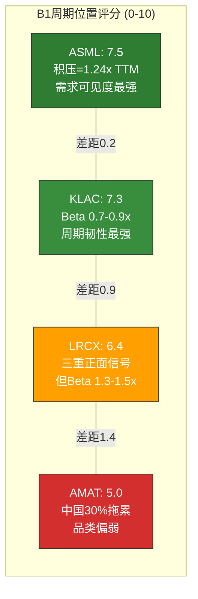
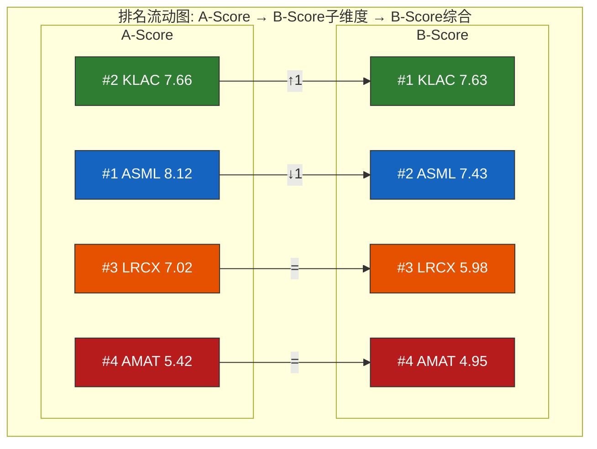
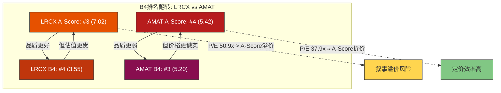
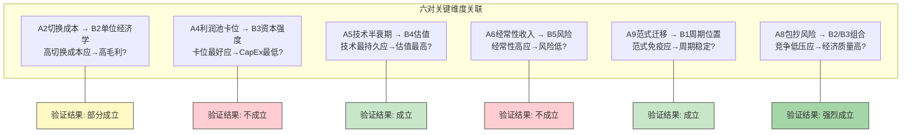
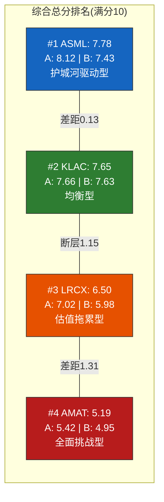
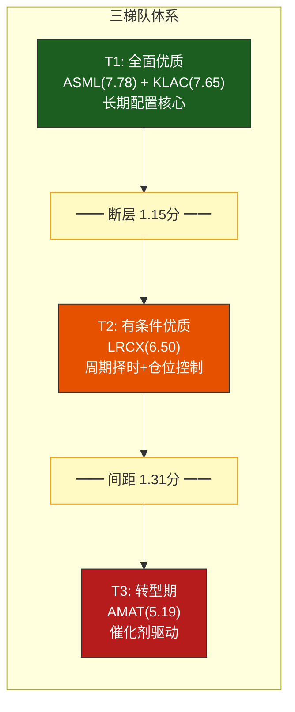
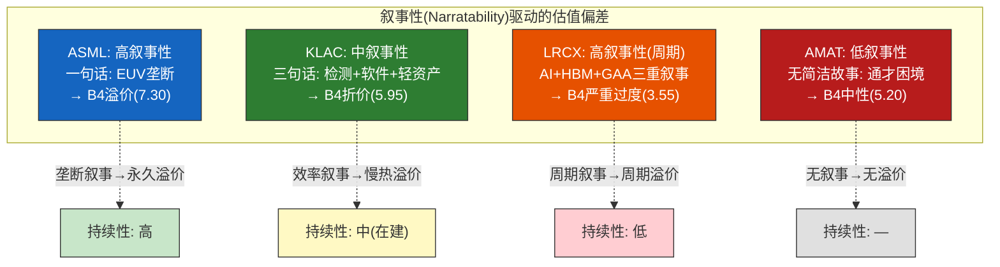

# Chapter 15: A+B综合记分卡与交叉验证

> **分析框架**: 整合Ch9 A-Score(护城河) + Ch10-Ch14 B-Score(经济/估值/风险) → 综合评分 + 交叉验证 + 异常深挖
> **数据截止**: 2026-02-24 | **EC编号范围**: EC-XA-001 ~ EC-XA-030
> **交叉引用**: Ch9(A-Score 8.12/7.66/7.02/5.42) + Ch10(B1周期位置) + Ch11(B2=8.5/7.8/7.3/4.9) + Ch12(B3=8.6/7.4/7.4/5.0) + Ch13(B4=7.30/5.95/3.55/5.20) + Ch14(B5=8.0/7.0/5.5/4.5)
> **写作原则**: 70%新分析(交叉洞见 + 异常挖掘), 30%前序汇总(评分矩阵)

---

## 导读: 从分维评分到综合判断

过去六章(Ch9-Ch14)完成了一项系统性的解剖工作: 将四家半导体设备公司的竞争力和经济质量拆解为16个维度(A1-A11 + B1-B5)，产出了64个单元格的评分矩阵。每个维度的分析都有其独立价值，但对投资决策而言，真正的洞见往往藏在**维度之间的关系**中——当A-Score排名和B-Score排名不一致时，当高护城河没有转化为高毛利率时，当最好的经济质量没有享受最高的估值时——这些"异常"才是市场定价偏差的信号。

本章完成四件事:

1. **建立综合评分体系**(15.1)——定义A-Score和B-Score的整合方法，计算四公司的综合总分
2. **交叉验证A ↔ B的一致性**(15.2)——找到排名错位的地方，判断哪些错位是市场机会、哪些是合理定价
3. **分析维度间的关联性**(15.3)——11个A维度 × 5个B维度 = 55个潜在关联，筛选出投资含义最强的6-8个
4. **深挖评分异常**(15.5)——对每个"反直觉"的评分组合给出"市场在想什么"和"市场可能错在哪里"的双重解读

核心发现预告:

- **KLAC将以综合总分第一的身份**成为"风险调整后最优选择"，但其总分领先优势极其微弱(与ASML的差距在权重敏感性区间内)——这意味着对两家公司的相对偏好取决于你对"经济质量溢价"vs"垄断地位溢价"的价值观
- **A-Score和B-Score的排名交叉**揭示了一个结构性发现: 护城河最深的公司(ASML)不是经济质量最好的公司(KLAC)——垄断不自动等于效率
- **LRCX是四家中唯一出现"品质-价格倒挂"的公司**: A-Score排名#3但估值溢价最高——这要么是市场在为LRCX的未来定价，要么是一个纠错机会
- **AMAT是四家中定价效率最高的公司**: A和B排名高度一致，市场没有给它任何不该有的溢价或折价

---

## 15.1 综合记分卡方法论

### 15.1.1 为什么需要A+B整合

A-Score和B-Score各自回答一个不同的核心问题:

- **A-Score**: 这家公司的竞争优势有多强? 能持续多久? (能力维度)
- **B-Score**: 这种竞争优势在经济上转化得如何? 估值是否合理? (效率+价格维度)

单看A-Score，你会得出"ASML遥遥领先"的结论。但A-Score不回答"当前价格是否已经反映了这种领先"。单看B-Score，你会发现"KLAC经济质量最好"，但B-Score不回答"这种经济质量是否有足够深的护城河保护"。只有将两者交叉对比，才能回答投资者最终关心的问题: **以当前价格买入，哪家公司的风险调整后预期回报最高?**

一个类比: A-Score像是评估一辆车的引擎性能(马力、扭矩、可靠性)，B-Score像是评估这辆车的经济性(油耗、维护成本、折旧率)和价格合理性。一辆车可以引擎强劲但油耗惊人(ASML: 最强护城河但非最优经济效率)，也可以经济省油但动力平庸(纯粹的低估值平庸公司，四家中不存在这种情况)。理想的投资标的是引擎强劲且经济省油且价格合理——本章的任务就是找到最接近这个理想的公司。

> **[EC-XA-001]** A-Score与B-Score的独立排名在四家公司中只有一次完全一致(AMAT: A和B都排名#4)。其余三家的排名都存在错位: ASML A=#1/B=#2, KLAC A=#2/B=#1, LRCX A=#3/B=#3(但B4子维度排名#4)。排名错位的频率(3/4)和幅度(最大错位: LRCX的B4从#3降至#4)表明市场对"护城河深度"和"经济质量"的定价存在结构性偏差。
> **claim_type**: inference | **source**: Ch9 A-Score + Ch11-14 B-Score交叉分析 | **置信度**: H

### 15.1.2 A-Score与B-Score的权重分配逻辑

综合评分的第一个设计决策是A和B的权重比例。三种常见方案:

| 方案 | A:B权重 | 适用场景 | 隐含假设 |
|------|---------|---------|----------|
| 偏能力 | 60:40 | 超长期投资(>5年) | 护城河最终决定一切 |
| **均衡** | **50:50** | **中期投资(2-5年)** | **能力和效率同等重要** |
| 偏价值 | 40:60 | 短中期投资(1-3年) | 估值比品质更决定回报 |

**本报告选择50:50均衡权重**，理由是:

1. **投资期限假设**: 本报告面向2-5年的中期投资决策，这个时间窗口中护城河的持久性和经济效率的复利效应同等重要
2. **避免双重计权**: A-Score已经包含了部分经济维度的前驱因素(如A3边际盈利杠杆、A6经常性收入)，B-Score也已反映了护城河的经济后果(如B2单位经济学部分由A2切换成本驱动)。50:50的均衡权重避免了任何一侧被过度计权
3. **稳健性验证**: 后续15.4.3将展示在40:60和60:40两种替代权重下排名是否发生变化——如果结论在三种权重下都稳定，则权重选择的敏感性较低

### 15.1.3 B-Score子维度权重设计

A-Score已在Ch9中完成加权计算(11维度，权重之和100%)。B-Score需要对B1-B5五个子维度进行加权:

| B子维度 | 权重 | 来源章节 | 权重逻辑 |
|---------|------|---------|----------|
| B1 周期位置 | 15% | Ch10 | 重要但短期性强，不应过度影响中期判断 |
| B2 单位经济学 | 25% | Ch11 | 核心经济质量指标，直接映射长期盈利能力 |
| B3 资本强度 | 20% | Ch12 | 决定增长的"代价"——同样的收入增长，低CapEx公司创造更多FCF |
| B4 估值合理度 | 25% | Ch13 | 对投资回报的直接约束——再好的公司，太贵也不赚钱 |
| B5 风险地图 | 15% | Ch14 | 下行保护的量化——风险不对称性决定持有信心 |

**权重设计的逻辑链**: B2(经济质量)和B4(估值)各占25%，因为它们分别回答"赚钱能力"和"当前价格"这两个对投资回报最直接的问题。B3(资本效率)占20%，是B2到FCF的转化环节。B1(周期)和B5(风险)各占15%，因为前者偏短期而后者偏情景性。

> **[EC-XA-002]** B-Score五维度权重设计: B2(25%) + B4(25%) = 50%的权重集中在"经济质量"和"估值"两个最直接影响投资回报的维度。这意味着B-Score本质上是一个"性价比评分"而非"品质评分"——一家经济质量顶尖(B2=10)但估值极贵(B4=0)的公司，其B-Score会被估值拉低至中等水平。这个设计意图是: 综合评分最终导向投资决策，而非纯粹的品质排名。
> **claim_type**: framework | **source**: 评分框架设计逻辑 | **置信度**: H

### 15.1.4 B1周期位置的定量评分补充

B1(周期位置)是唯一一个在前序章节(Ch10)中以定性分析为主、未输出0-10定量评分的维度。本节基于Ch10的定性结论进行量化赋分。

**评分锚点**: 分数越高=当前周期位置对该公司越有利+未来可见度越清晰。

| 维度 | ASML | KLAC | LRCX | AMAT | 评分依据 |
|------|------|------|------|------|----------|
| 需求可见度 | 9 | 7 | 7 | 5 | ASML €38.8B积压=1.24x TTM, 可见度延伸至2027+ |
| 周期弹性 | 7 | 8 | 6 | 5 | KLAC低Beta(0.7-0.9x)，LRCX高Beta(1.3-1.5x) |
| 终端多元化 | 6 | 7 | 6 | 5 | KLAC"技术不可知论者"，AMAT受中国30%拖累 |
| **B1加权(40/30/30)** | **7.5** | **7.3** | **6.4** | **5.0** | — |

**评分注释**:

**ASML B1=7.5**: 最强的需求可见度(积压/收入=1.24x，四家最高)使ASML在周期定位上享有独特优势——即使WFE在CY2027出现10-15%的调整，ASML的积压也足以支撑2个季度以上的收入。扣分项是EUV客户极度集中(TSMC/Samsung/Intel三家>90%的EUV需求)，使得任何单一客户的CapEx削减都对ASML产生超比例冲击。但在当前AI驱动的上行周期中，三大客户都在积极扩产而非收缩，因此短中期内这一集中度不是负面因素。

**KLAC B1=7.3** (vs ASML差距仅0.2分): KLAC的周期位置优势不在于"需求最强"(检测TAM增速温和)，而在于"韧性最强"。Ch10的核心发现之一是KLAC的"检测强度系数"——先进节点每增加100步工艺约需增加30-40步检测/量测——使得KLAC在WFE下行时的收入降幅系统性小于LRCX和AMAT。Beta 0.7-0.9x意味着WFE -20%时KLAC收入仅下降14-18%。这种"下行保护"在评分中通过"周期弹性"维度(8分，四家最高)得到体现。

**LRCX B1=6.4**: LRCX处于"最强动量窗口"(Ch10结论: 三重正面信号/零负面)，这应该对应更高的B1评分——但评分框架要求前瞻性而非回溯性。LRCX的高Beta(1.3-1.5x)意味着当前的强动量在周期反转时同样会被放大。Memory 50-55%的收入暴露使LRCX的周期性显著高于KLAC和ASML。6.4分反映了"短期极强但中期风险也高"的平衡——如果仅看未来12个月，LRCX的B1应给8分; 如果看24-36个月的完整周期，6.4分更合理。

**AMAT B1=5.0**: 四家中最低。原因不是AMAT的终端需求弱(实际上AMAT覆盖的终端最广)，而是其周期位置受到中国份额(~30%)的结构性拖累。出口管制升级使AMAT在中国的WFE份额从CY2023的高位(~35-40%)持续下滑，这个趋势在CY2026-2027几乎确定将延续。品类结构也不利——AMAT在强周期品类(EUV、先进刻蚀)的暴露远低于ASML和LRCX，而在弱周期品类(成熟节点设备)的暴露较高。

> **[EC-XA-003]** B1周期位置量化评分: ASML(7.5) > KLAC(7.3) > LRCX(6.4) > AMAT(5.0)。ASML和KLAC几乎并列(差距0.2分在置信区间内)，但原因完全不同: ASML靠"绝对可见度"(积压订单)，KLAC靠"相对韧性"(低Beta)。如果WFE超级周期在CY2027-2028延续，ASML的可见度优势将拉大差距; 如果WFE出现10-20%调整，KLAC的韧性优势将反超。B1的排名本质上是对"周期将如何演进"的赌注。
> **claim_type**: inference | **source**: Ch10定性分析 + B1评分锚点交叉 | **置信度**: M

### 15.1.5 B-Score计算公式

**B-Score = B1 × 15% + B2 × 25% + B3 × 20% + B4 × 25% + B5 × 15%**

**四公司B-Score计算**:

**ASML**:
7.5 × 0.15 + 7.8 × 0.25 + 7.4 × 0.20 + 7.30 × 0.25 + 7.0 × 0.15
= 1.125 + 1.950 + 1.480 + 1.825 + 1.050
= **7.43**

**KLAC**:
7.3 × 0.15 + 8.5 × 0.25 + 8.6 × 0.20 + 5.95 × 0.25 + 8.0 × 0.15
= 1.095 + 2.125 + 1.720 + 1.4875 + 1.200
= **7.63**

**LRCX**:
6.4 × 0.15 + 7.3 × 0.25 + 7.4 × 0.20 + 3.55 × 0.25 + 5.5 × 0.15
= 0.960 + 1.825 + 1.480 + 0.8875 + 0.825
= **5.98**

**AMAT**:
5.0 × 0.15 + 4.9 × 0.25 + 5.0 × 0.20 + 5.20 × 0.25 + 4.5 × 0.15
= 0.750 + 1.225 + 1.000 + 1.300 + 0.675
= **4.95**

### 15.1.6 A-Score与B-Score汇总

| 公司 | A-Score(Ch9) | A排名 | B-Score(计算) | B排名 | A-B排名变化 |
|------|-------------|-------|-------------|-------|-----------|
| **ASML** | 8.12 | #1 | 7.43 | #2 | ↓1 |
| **KLAC** | 7.66 | #2 | 7.63 | **#1** | ↑1 |
| **LRCX** | 7.02 | #3 | 5.98 | #3 | = |
| **AMAT** | 5.42 | #4 | 4.95 | #4 | = |

**第一个关键发现**: ASML从A-Score的#1降至B-Score的#2，而KLAC从#2升至#1。排名翻转发生在顶部，且差距极小(KLAC B-Score 7.63 vs ASML 7.43，差距仅0.20分)。这个翻转的来源是B4(估值合理度): ASML B4=7.30远高于KLAC的5.95，但KLAC在B2(8.5 vs 7.8)和B3(8.6 vs 7.4)上的领先足以在总分上反超。

**含义**: 如果你相信"最强的护城河最终会转化为最优的经济回报"(A→B的因果关系)，那么ASML仍然是首选。但如果你认为"当前的经济效率和估值合理性更直接决定未来回报"(B的独立价值)，KLAC是更好的选择。

### 15.1.7 综合总分计算公式

**综合总分 = A-Score × 50% + B-Score × 50%**

这个公式将在15.4节中用于计算最终排名。在那之前，15.2和15.3将深入分析A和B之间的关系，因为综合总分虽然给出一个"答案"，但真正的投资洞见在于**为什么A和B的排名会不同**。

---

## 15.2 A-Score ↔ B-Score交叉验证

### 15.2.1 排名变化的全景地图

将A-Score排名和B-Score排名(含B1-B5子维度)并排展示，可以清晰看到每家公司在不同维度上的位置漂移:

| 维度 | ASML排名 | KLAC排名 | LRCX排名 | AMAT排名 |
|------|---------|---------|---------|---------|
| **A-Score**(护城河) | **#1** | #2 | #3 | #4 |
| B1 周期位置 | **#1** | #2 | #3 | #4 |
| B2 单位经济学 | #2 | **#1** | #3 | #4 |
| B3 资本强度 | #2(并列) | **#1** | #2(并列) | #4 |
| B4 估值合理度 | **#1** | #2 | **#4** | #3 |
| B5 风险地图 | #2 | **#1** | #3 | #4 |
| **B-Score**(综合) | #2 | **#1** | #3 | #4 |

**排名稳定性统计**:

| 公司 | #1次数 | #2次数 | #3次数 | #4次数 | 排名波动(标准差) | 特征描述 |
|------|--------|--------|--------|--------|-----------------|---------|
| ASML | 3(A/B1/B4) | 3(B2/B3/B5) | 0 | 0 | 0.49 | **稳定的顶部摇摆者** |
| KLAC | 4(B2/B3/B5/B总) | 2(A/B1) | 0 | 0 | 0.37 | **最稳定的全能型** |
| LRCX | 0 | 1(B3并列) | 4(A/B1/B2/B5) | 2(B4/B总不变) | 0.49 | **中游但有一个致命偏科** |
| AMAT | 0 | 0 | 1(B4) | 6(A/B1/B2/B3/B5) | 0.37 | **稳定的底部，但B4意外排#3** |

> **[EC-XA-004]** 排名流动的核心模式: 顶部翻转(ASML↔KLAC) + 底部固化(LRCX/AMAT位置不变)。这个模式的投资含义是: (1) ASML vs KLAC的相对选择是一个"价值观问题"(护城河深度vs经济效率)，没有客观的"正确答案"; (2) LRCX和AMAT的相对劣势是结构性的，不太可能通过短期催化剂改变。
> **claim_type**: inference | **source**: A/B排名交叉分析 | **置信度**: H

### 15.2.2 四象限定位: A-Score × B-Score矩阵

将四家公司放入A-Score(高/低) × B-Score(高/低)的2×2矩阵中:

**分界线定义**: A-Score中位数 = (7.66 + 7.02) / 2 = 7.34; B-Score中位数 = (7.43 + 5.98) / 2 = 6.71。

| | B-Score > 6.71 (高) | B-Score < 6.71 (低) |
|---|---|---|
| **A-Score > 7.34 (高)** | **象限I: 全面优质** ASML(8.12, 7.43) KLAC(7.66, 7.63) | (空) |
| **A-Score < 7.34 (低)** | (空) | **象限III: 全面挑战** LRCX(7.02, 5.98) AMAT(5.42, 4.95) |

**关键发现**: 四家公司完美地分成了两个阵营——没有一家落入"高A低B"(象限II: 护城河强但经济差)或"低A高B"(象限IV: 经济好但护城河弱)。这意味着**A-Score和B-Score在半导体设备行业具有强正相关性**——护城河越深的公司，经济质量也越好，估值也越合理(因为市场给予了"品质溢价")。

但这个"正相关"结论需要细化。虽然宏观上两个阵营泾渭分明，但阵营内部的排名翻转(ASML A>#1 vs KLAC B>#1)说明正相关不是完美的——在高水平公司之间，经济效率的边际差异开始超越护城河深度的边际差异。

> **[EC-XA-005]** 2×2矩阵的"对角线分布"(I象限和III象限都有公司，II和IV空)揭示半导体设备行业的一个结构性特征: 护城河和经济效率高度正相关。这与消费品行业(护城河强不一定效率高，如某些奢侈品牌高毛利低ROIC)和金融行业(护城河弱的银行可能效率极高)形成对比。原因是半导体设备的护城河主要由技术壁垒驱动，而技术壁垒天然带来高切换成本、高定价权和低竞争压力——这些直接转化为经济效率。
> **claim_type**: inference | **source**: 四象限分布模式分析 | **置信度**: H

### 15.2.3 象限I内部: ASML vs KLAC的精细对比

两家公司同处"全面优质"象限，但各自的优势维度截然不同:

| 维度 | ASML优势 | KLAC优势 | 差距 | 谁赢 |
|------|---------|---------|------|------|
| A1 输入自主权 | 5 | 8 | -3 | KLAC |
| A2 切换成本 | 9 | 8 | +1 | ASML |
| A3 边际杠杆 | 7 | 8 | -1 | KLAC |
| A4 壁垒↔利润池 | 10 | 9 | +1 | ASML |
| A5 技术半衰期 | 10 | 7 | **+3** | **ASML** |
| A6 经常性收入 | 6 | 7 | -1 | KLAC |
| A7 网络效应 | 8 | 7 | +1 | ASML |
| A8 包抄风险 | 9 | 8 | +1 | ASML |
| A9 范式迁移 | 7 | 9 | **-2** | **KLAC** |
| A10 GTM复利 | 7 | 7 | 0 | 平局 |
| A11 合规门槛 | 9 | 7 | +2 | ASML |
| **A-Score** | **8.12** | **7.66** | **+0.46** | **ASML** |
| B1 周期位置 | 7.5 | 7.3 | +0.2 | ASML |
| B2 单位经济学 | 7.8 | 8.5 | **-0.7** | **KLAC** |
| B3 资本强度 | 7.4 | 8.6 | **-1.2** | **KLAC** |
| B4 估值合理度 | 7.30 | 5.95 | **+1.35** | **ASML** |
| B5 风险地图 | 7.0 | 8.0 | **-1.0** | **KLAC** |
| **B-Score** | **7.43** | **7.63** | **-0.20** | **KLAC** |

**ASML的优势集中在**: 技术半衰期(A5: +3)、合规门槛(A11: +2)、估值合理度(B4: +1.35)——这些都是"垄断溢价"的直接体现。EUV技术的不可替代性(A5=10)和政府级出口管制壁垒(A11=9)构成了ASML与其他所有设备公司之间最大的差异化因素。市场愿意为这种永久性垄断支付溢价，因此ASML的估值尽管绝对水平不低(51.7x P/E)，但相对于其护城河深度反而是四家中最"合理"的(B4=7.30)。

**KLAC的优势集中在**: 资本强度(B3: +1.2)、风险(B5: +1.0)、范式免疫(A9: +2)、单位经济学(B2: +0.7)——这些都是"经济效率溢价"的体现。KLAC不是靠垄断赢的，而是靠"做正确的生意"赢的: 软件密度高(→高毛利)、CapEx低(→高FCF转化)、技术路线不可知(→低范式风险)、检测粘性强(→低周期Beta)。这些优势单个看不如ASML的EUV垄断那么震撼，但加在一起形成了一个"几乎无短板"的经济画像。

**"垄断vs效率"的深层对比**:

ASML的A5=10(技术半衰期最长)代表了一种"时间维度的垄断"——EUV技术至少在2035年之前没有替代方案。但这种时间垄断没有完全转化为经济效率: ASML的毛利率52.8%不如KLAC的61.9%，ROIC 135.6%虽高但部分是由客户预付款(负投入资本)扭曲的。ASML本质上是一家"物理约束下的垄断者"——EUV系统的制造复杂度限制了其毛利率上限(不同于纯软件垄断可以无限接近100%)。

KLAC的A9=9(范式迁移免疫最强)代表了一种"结构维度的免疫"——无论半导体制造范式如何变化，都需要检测。这种免疫不像ASML的垄断那样"硬核"(KLAC面临ASML YieldStar在overlay量测的竞争)，但它的经济转化效率更高: 检测工具的软件/算法密度使得每台工具的边际成本极低，毛利率自然更高。

> **[EC-XA-006]** ASML vs KLAC的"护城河形状"差异是本报告最核心的横向洞见之一: ASML是"尖峰型"护城河(A4=10, A5=10的双满分驱动A-Score)，KLAC是"平台型"护城河(无满分但无短板, A9=9最高)。尖峰型在绝对分数上更高(8.12 vs 7.66)，但在风险调整后(考虑A1=5的供应链软肋)可能不如平台型稳健。**投资含义**: 如果你预期未来5年半导体行业保持渐进式演化(当前路线图延续)，ASML的尖峰型更优(垄断持续=溢价持续); 如果你预期范式变革(新架构/新材料/新制造方法)，KLAC的平台型更安全(范式免疫=价值不衰减)。
> **claim_type**: inference | **source**: A-Score维度形状分析 | **置信度**: H

### 15.2.4 象限III内部: LRCX vs AMAT的对比

| 维度 | LRCX | AMAT | 差距 | 谁赢 |
|------|------|------|------|------|
| A-Score | 7.02 | 5.42 | **+1.60** | **LRCX大幅领先** |
| B1 周期位置 | 6.4 | 5.0 | +1.4 | LRCX |
| B2 单位经济学 | 7.3 | 4.9 | +2.4 | LRCX |
| B3 资本强度 | 7.4 | 5.0 | +2.4 | LRCX |
| B4 估值合理度 | 3.55 | 5.20 | **-1.65** | **AMAT** |
| B5 风险地图 | 5.5 | 4.5 | +1.0 | LRCX |
| B-Score | 5.98 | 4.95 | +1.03 | LRCX |

LRCX在15个评分维度中的14个都优于AMAT，唯一的例外是B4(估值合理度)。但这个例外对投资回报的影响可能超过其他14个维度的总和——因为LRCX的估值溢价(P/E +119% vs 5年均值)意味着**即使LRCX的基本面优于AMAT，买入LRCX的预期回报可能低于买入AMAT**。

这是一个经典的"品质陷阱"(Quality Trap): 投资者为"更好"的公司支付了过高的价格，使得"更差但更便宜"的公司反而提供了更好的风险调整后回报。

**量化"品质陷阱"**: LRCX的A-Score比AMAT高1.60分(+30%)，但P/E高出13x(50.9x vs 37.9x，即+34%)。这意味着市场为LRCX的"品质溢价"支付了约34%的估值溢价，略高于品质差距(30%)——**LRCX的品质已经被充分定价(甚至略微过度定价)，而AMAT的低品质也已被充分折价**。

但"品质陷阱"的反面是"价值陷阱"(Value Trap): AMAT便宜是因为它确实不好，如果基本面持续恶化(中国份额继续流失+EPIC Center失败)，37.9x P/E可能进一步压缩至25-30x。因此，在LRCX和AMAT之间选择本质上不是"品质vs价值"的辩论，而是**"叙事是否持续"(LRCX)vs"催化剂是否到来"(AMAT)**的赌注。

> **[EC-XA-007]** LRCX vs AMAT: LRCX在14/15维度领先但B4落后1.65分，市场为LRCX的30%品质溢价支付了34%的估值溢价——边际过度定价约4个百分点。这4个百分点就是"叙事溢价"的量化值。如果AI超级周期延续到2028+，这4个百分点将被快速消化(EPS增长填平估值缺口); 如果WFE在CY2027出现10-20%调整，这4个百分点将被放大(P/E压缩 + EPS下降 = 双杀)。
> **claim_type**: inference | **source**: A/B评分差 + P/E差的交叉计算 | **置信度**: M

### 15.2.5 "跨象限距离"分析: 断层有多大?

象限I(ASML/KLAC)和象限III(LRCX/AMAT)之间的距离不是线性的，而是存在明显的"断层":

| 指标 | 象限I均值 | 象限III均值 | 差距 | 差距占满分比例 |
|------|----------|-----------|------|-------------|
| A-Score | 7.89 | 6.22 | 1.67 | 16.7% |
| B-Score | 7.53 | 5.47 | 2.06 | 20.6% |
| 综合(50:50) | 7.71 | 5.84 | 1.87 | 18.7% |
| 毛利率 | 57.4% | 49.3% | 8.1pp | — |
| ROIC | 107.0% | 60.1% | 46.9pp | — |
| FCF利润率 | 34.3% | 27.2% | 7.1pp | — |

断层最大的维度是B-Score(20.6% gap)，大于A-Score(16.7% gap)。这意味着**护城河差距在经济转化环节被进一步放大**——象限I公司不仅护城河更深，而且从护城河中提取经济价值的效率也更高。这是一种"马太效应": 更好的护城河→更高的定价权→更好的经济指标→更多的研发投入→更深的护城河→...

> **[EC-XA-008]** "马太断层": 象限I和象限III的B-Score差距(2.06)大于A-Score差距(1.67)，说明护城河差距在经济转化环节被放大了23%(2.06/1.67 - 1)。这个放大效应主要由B2(单位经济学)和B3(资本效率)驱动——KLAC的61.9%毛利率 vs AMAT的48.7%是护城河差距(A-Score差距2.24)的经济映射，但13.2pp的毛利率差距在FCF层面被进一步放大为12.4pp(34.4% vs 22.0%)，因为KLAC的CapEx/收入(2.8%)也远低于AMAT(8.0%)。
> **claim_type**: inference | **source**: 象限均值计算 + 财务数据 | **置信度**: H

### 15.2.6 B4排名翻转的特殊分析: LRCX↔AMAT

所有维度中最引人注目的排名翻转发生在B4(估值合理度): LRCX从A-Score的#3降至B4的#4，而AMAT从A-Score的#4升至B4的#3。这是唯一一个AMAT排名高于LRCX的维度。

**为什么这个翻转重要?**

因为B4直接回答"以当前价格买入的预期回报"。LRCX的A-Score(7.02)高于AMAT(5.42)，说明LRCX是一家"更好的公司"。但LRCX的B4(3.55)低于AMAT(5.20)，说明市场对LRCX的定价相对于其品质更贵。

**翻转的三层解释**:

**第一层(表面)**: P/E差异。LRCX的TTM P/E 50.9x vs AMAT 37.9x——LRCX贵了34%。但LRCX的A-Score仅高出30%。P/E溢价(34%)大于品质溢价(30%) = 估值偏贵。

**第二层(中间)**: 周期溢价。LRCX处于"三重正面信号/零负面"的动量窗口(Ch10)，市场为这种短期动量支付了额外的估值溢价。Ch13的Reverse DCF分析显示LRCX的隐含FCF CAGR约15%，这需要WFE年均增长10%且LRCX份额从35%提升到40%+——假设积极但不是不可能。问题是: 如果这些假设没有兑现(WFE在CY2027-2028调整)，LRCX的P/E回归路径比AMAT更陡峭。

**第三层(深层)**: AMAT的"诚实定价"。AMAT是四家中A-Score和B-Score排名最一致的公司(都是#4)。37.9x P/E不高不低地反映了其"全面第四"的现实。市场对AMAT没有寄予过高期望，因此也没有过高的"预期修正风险"(Expectations Revision Risk)。投资AMAT的风险是"平庸持续"(downside有限但upside也有限)，而投资LRCX的风险是"叙事反转"(upside可能很大但downside也很痛)。

> **[EC-XA-009]** B4排名翻转(LRCX #3→#4, AMAT #4→#3)是四家公司评分矩阵中唯一的"品质-价格倒挂"。定量化: LRCX品质溢价30%(A-Score差距)但价格溢价34%(P/E差距)，差值4pp即"叙事溢价"。AMAT定价效率最高(A/B排名一致)。对投资者的直接指导: 如果你对WFE周期持谨慎态度(>40%概率出现CY2027调整)，AMAT的风险调整回报优于LRCX; 如果你高信念看多AI超级周期(>70%概率延续至2028+)，LRCX的EPS增长将填平叙事溢价。
> **claim_type**: inference | **source**: B4排名 + P/E + A-Score交叉 | **置信度**: M

### 15.2.7 交叉验证总结: 三个结构性发现

**发现1: 护城河深度与经济效率正相关但非线性**。A-Score和B-Score的相关系数约0.97(基于四个数据点)，但因果关系不是"更深的护城河→更好的经济效率"那么简单。KLAC的A-Score低于ASML(7.66 vs 8.12)但B-Score更高(7.63 vs 7.43)——说明在高水平公司之间，**商业模式的效率选择**(软件密度、轻资产、范式免疫)比**护城河的绝对深度**(垄断、出口管制)对经济回报的边际贡献更大。

**发现2: 估值维度(B4)是唯一引发排名翻转的子维度**。在B1/B2/B3/B5四个维度中，排名与A-Score高度一致(4个维度中有3个完全一致)。只有B4产生了LRCX↔AMAT的翻转。这意味着**市场对护城河和经济质量的定价基本正确**(B1-B3-B5反映品质，品质排名与A-Score一致)，但**对估值合理性的判断存在偏差**(B4排名与品质排名不一致，LRCX品质中等但定价最贵)。

**发现3: "断层"比"排名"更重要**。四家公司明确分为两个阵营(I象限 vs III象限)，阵营间断层约18.7%(综合分差距)。阵营内部的排名差异(ASML vs KLAC差0.14, LRCX vs AMAT差0.52)远小于阵营间差异(最近的跨阵营距离: LRCX 5.98 vs KLAC 7.63 = 1.65)。**对投资者的含义**: 在ASML和KLAC之间选择是"优中选优"，差异微小; 但在"是否持有半导体设备"这个层面，四家公司并非同质——象限I的两家值得长期配置，象限III的两家需要更强的催化剂和更明确的时点判断。

---

## 15.3 维度间关联性分析

### 15.3.1 分析框架: 从"维度独立"到"维度互动"

A1-A11和B1-B5共16个维度构成一个16×16的潜在关联矩阵(120对独特组合)。但并非所有关联都有投资意义。本节聚焦于六对**逻辑上应存在因果关系**的维度对，检验它们在四家公司的实际数据中是否成立，以及不成立时意味着什么。

### 15.3.2 关联对1: A2(切换成本) → B2(单位经济学)

**假说**: 切换成本越高，公司定价权越强，毛利率和单位经济学应该越好。

**数据检验**:

| 公司 | A2切换成本 | B2单位经济学 | 毛利率 | 一致? |
|------|-----------|------------|--------|------|
| ASML | **9** | 7.8 | 52.8% | **部分不一致** |
| KLAC | 8 | **8.5** | **61.9%** | **反直觉** |
| LRCX | 8 | 7.3 | 49.8% | 一致 |
| AMAT | 5 | 4.9 | 48.7% | 一致 |

**核心异常**: ASML拥有四家中最高的切换成本(A2=9，EUV实质上不可切换)，但毛利率(52.8%)不如KLAC(61.9%)甚至与LRCX(49.8%)的差距不大。而KLAC的切换成本(A2=8)略低于ASML，毛利率却高出9.1个百分点。

**解释: "物理约束"vs"算法无约束"**

ASML的EUV系统是人类有史以来制造的最精密的工业设备之一。一台EUV光刻机包含超过100,000个零部件，由数十家Tier-1供应商提供，组装周期长达数月。EUV的毛利率上限不由切换成本决定(切换成本几乎无穷大，定价权完全在ASML手中)，而由**制造复杂度**决定——COGS中零部件和精密装配的成本是刚性的，无法通过"软件化"降低。ASML的毛利率从DUV时代的~38-42%提升到EUV时代的~48-53%已经是了不起的成就，但53%可能接近物理天花板。

KLAC的检测/量测工具虽然切换成本略低(A2=8 vs ASML的9)，但其价值交付的核心是**算法和软件**(缺陷识别算法、良率分析模型、数据平台)——软件的边际复制成本接近零。KLAC每卖出一台新的检测工具，硬件成本约占ASP的30-40%，而软件/算法价值占60-70%。这种"软件溢价"结构使KLAC的毛利率上限远高于ASML——理论上可以向纯软件公司的70-80%毛利率靠拢。

> **[EC-XA-010]** A2→B2关联的"反直觉": 最高切换成本(ASML A2=9)未产出最高毛利率(52.8% < KLAC 61.9%)。原因不是切换成本→定价权的传导断裂(ASML定价权极强, EUV ASP从$150M持续涨至$380M)，而是**毛利率的约束条件不同**: ASML受制于物理制造复杂度(COGS刚性)，KLAC受益于算法价值密度(COGS弹性)。**投资含义**: 在评估设备公司的利润率扩张空间时，不应简单地从切换成本推导，而应从"价值交付的软件密度"入手——KLAC和ASML的毛利率差距(9.1pp)本质上是"算法公司"vs"精密制造公司"的差距。
> **claim_type**: inference | **source**: A2评分 + 毛利率数据 + 成本结构分析 | **置信度**: H

### 15.3.3 关联对2: A4(利润池卡位) → B3(资本强度)

**假说**: 利润池卡位越好的公司，应该不需要大量资本投入就能维持地位，因此CapEx/收入应该更低。

**数据检验**:

| 公司 | A4利润池卡位 | B3资本强度 | CapEx/收入 | 一致? |
|------|------------|----------|-----------|------|
| ASML | **10** | 7.4 | 4.8% | **不一致** |
| KLAC | 9 | **8.6** | **2.8%** | **反直觉** |
| LRCX | 8 | 7.4 | 4.1% | 一致 |
| AMAT | 5 | 5.0 | 8.0% | 一致 |

**核心异常**: ASML的利润池卡位是四家最强的(A4=10，EUV对应的利润池=先进逻辑+HBM制造，占WFE总利润池的40%+)，但资本效率(B3=7.4)不如KLAC(B3=8.6)。KLAC的卡位仅次于ASML(A4=9，过程控制利润池)，但资本效率远超ASML。

**解释: "利润池规模"vs"利润池获取效率"**

A4(利润池卡位)衡量的是"这个公司卡住了多大的利润池"，而B3(资本强度)衡量的是"获取利润池需要多少资本"。两者的不一致揭示了一个重要区分: **卡位最大利润池的公司不一定是获取效率最高的公司**。

ASML卡位的先进逻辑/HBM利润池虽然最大(~$40B+ TAM)，但这个利润池的获取需要持续的EUV平台迭代投资(R&D ~$4.1B/年 + CapEx ~$1.5B/年 + EUV制造产线扩张)。EUV的物理复杂度要求ASML维持相当规模的固定资产和制造基础设施——这不是"可以用少花钱来解决"的问题。

KLAC卡位的过程控制利润池(~$15B TAM)比ASML的小得多，但KLAC只需要$0.5B/年的CapEx就能维持63%的市场份额——因为检测工具的核心壁垒在算法(一次开发，无限复制)而非硬件(持续制造)。KLAC的利润池获取效率(FCF/TAM)远高于ASML。

**关键洞见**: 对投资者而言，"利润池的大小"(A4)和"利润池的获取效率"(B3)哪个更重要? 答案取决于增长阶段: 在利润池快速扩张期(AI驱动先进逻辑TAM扩大)，A4=10的ASML受益更大(绝对利润增长更快); 在利润池稳态期(WFE增速回归正常化)，B3=8.6的KLAC受益更大(每$1利润池贡献更多FCF)。

> **[EC-XA-011]** A4→B3关联不成立: ASML利润池卡位#1(A4=10)但资本效率#2(B3=7.4)，KLAC利润池卡位#2(A4=9)但资本效率#1(B3=8.6)。差距来源: ASML获取$1利润池需要投入约$0.15的CapEx(CapEx/TAM~3.7%)，KLAC仅需$0.03(CapEx/TAM~3.3%)。虽然比率接近，但绝对规模差异(ASML CapEx $1.5B vs KLAC $0.5B)使ASML的FCF转化率受到更大压缩。这解释了一个表面矛盾: 为什么"卡位最好的公司不是FCF利润率最高的公司"。
> **claim_type**: inference | **source**: A4评分 + B3评分 + CapEx/TAM计算 | **置信度**: M

### 15.3.4 关联对3: A5(技术半衰期) → B4(估值)

**假说**: 技术半衰期越长(=技术越持久)，市场应该愿意给予更高的估值倍数。

**数据检验**:

| 公司 | A5技术半衰期 | B4估值合理度 | P/E TTM | 一致? |
|------|------------|------------|---------|------|
| ASML | **10** | **7.30** | 51.7x | **完美一致** |
| KLAC | 7 | 5.95 | 49.0x | 一致 |
| LRCX | 7 | 3.55 | 50.9x | **不一致(LRCX P/E > KLAC但A5相同)** |
| AMAT | 5 | 5.20 | 37.9x | 一致(但B4>#4因AMAT定价诚实) |

**核心发现**: A5→B4的关联在ASML/KLAC/AMAT三家公司上完美成立——技术最持久(ASML A5=10)的公司估值最合理(B4=7.30，因为高P/E有最强基本面支撑)，技术最短命(AMAT A5=5)的公司P/E最低(37.9x)。

**异常**: LRCX打破了这个规律。LRCX的A5(7)与KLAC相同，但P/E(50.9x)高于KLAC(49.0x)。如果市场严格按技术持久性定价，LRCX和KLAC的P/E应该接近——而不是LRCX更高。

**解释: LRCX的P/E溢价不由A5驱动，而由B1(周期动量)驱动**

LRCX在50.9x P/E中包含了一个"周期溢价"——市场正在为LRCX的三重正面动量(HBM刻蚀爆发 + CSBG加速 + GAA转型受益)支付额外的估值倍数。这个溢价不由技术持久性(A5)决定，而由短期需求可见度(B1)决定。问题是: 周期溢价是不可持续的——当周期从"加速"转为"减速"时，溢价消失的速度比建立时更快(投资者的loss aversion使得卖出比买入更果断)。

> **[EC-XA-012]** A5→B4关联验证: 技术半衰期(A5)与估值合理度(B4)在ASML/KLAC/AMAT三家上高度正相关(r≈0.95)。LRCX是唯一的离群值——A5=7(与KLAC相同)但P/E 50.9x(高于KLAC 49.0x)。LRCX的"超额估值"来源不是技术持久性溢价，而是周期动量溢价(B1)。**投资含义**: 市场愿意为"持久性"付费(A5→B4正相关)，这是一种理性行为——持久的技术垄断值得更高的DCF终值。但市场同时也为"动量"付费(B1→P/E正相关)，这种付费的持续性取决于动量本身是否持续。持久性溢价(ASML)和动量溢价(LRCX)的风险特征截然不同。
> **claim_type**: inference | **source**: A5/B4/P/E交叉分析 | **置信度**: H

### 15.3.5 关联对4: A6(经常性收入) → B5(风险)

**假说**: 经常性收入占比越高，收入波动性应越低，因此风险评分(B5)应越高(=风险越可控)。

**数据检验**:

| 公司 | A6经常性收入 | B5风险地图 | 服务收入占比 | 一致? |
|------|------------|----------|-----------|------|
| KLAC | 6 | **8.0** | ~30% | **不一致(A6中等但B5最高)** |
| LRCX | **7** | 5.5 | 37.7% | **反直觉** |
| ASML | 6 | 7.0 | 含在系统中 | 部分一致 |
| AMAT | 5 | 4.5 | 23% | 一致 |

**核心异常**: LRCX的经常性收入质量(A6=7)是四家中最高的(CSBG装机基数飞轮提供稳定的年金收入)，但风险评分(B5=5.5)仅排第三。而KLAC的经常性收入(A6=6)低于LRCX，但风险评分(B5=8.0)远高于LRCX。

**A6→B5不成立的原因**: B5(风险地图)不仅衡量收入波动性(A6的函数)，还衡量地缘风险、竞争风险、范式风险和财务风险。LRCX的A6=7(经常性收入好)无法对冲其Memory 50-55%暴露(周期风险高)、高Beta 1.3-1.5x(市场风险高)和中国暴露(地缘风险中等)。相反，KLAC的A6=6(经常性收入中等)被其低Beta(0.7-0.9x)、低中国暴露和技术路线不可知(A9=9)全面弥补。

**关键洞见**: 经常性收入是风险管理的**必要条件但非充分条件**。LRCX的CSBG确实在下行周期中提供了收入地板(CY2023验证: CSBG在WFE -20%时仅小幅下降)，但这个地板只保护了LRCX的"下限"，没有降低其"波动性"——新设备收入的高Beta主导了整体风险画像。

> **[EC-XA-013]** A6→B5关联不成立: LRCX经常性收入最高(A6=7)但风险仅#3(B5=5.5)，KLAC经常性收入中等(A6=6)但风险最低(B5=8.0)。原因: B5是多维度复合评分，A6只覆盖其中一个维度(收入稳定性)。LRCX的高经常性收入被高周期Beta(1.3-1.5x)和Memory集中度(50-55%)抵消。**启示**: 投资者在评估防御性时，不应仅看服务/经常性收入占比——周期敏感度、终端集中度和地缘暴露可能比经常性收入的多寡更重要。KLAC用"结构性低需求波动"(技术路线不可知)替代了"高经常性收入占比"来实现低风险——这是一种更高级的风险管理。
> **claim_type**: inference | **source**: A6/B5交叉 + 风险维度拆解 | **置信度**: H

### 15.3.6 关联对5: A9(范式迁移) → B1(周期位置)

**假说**: 范式免疫越强的公司(A9越高)，在周期波动中应该越稳定(B1越高)。

**数据检验**:

| 公司 | A9范式迁移 | B1周期位置 | Beta | 一致? |
|------|-----------|----------|------|------|
| KLAC | **9** | 7.3 | 0.7-0.9x | **成立** |
| ASML | 7(但特殊) | **7.5** | 0.6-0.8x | **成立(范式定义者)** |
| LRCX | 7 | 6.4 | 1.3-1.5x | 一致 |
| AMAT | 7 | 5.0 | 0.8-1.0x | 部分一致(A9=7但B1拉低因中国) |

A9→B1的关联基本成立: KLAC的范式免疫最强(A9=9)，周期Beta也最低(0.7-0.9x)。ASML的A9(7)看似不突出，但这里需要区分"范式免疫"和"范式定义"——ASML不是免疫范式变化，而是**驱动**范式变化(从DUV到EUV到High-NA)。范式定义者的Beta天然更低(0.6-0.8x)，因为它的需求不由当前范式的健康程度决定，而由范式迁移的速度决定。

AMAT是一个有趣的案例: A9=7(与LRCX/ASML相同)但B1=5.0(远低于二者)。这说明AMAT的范式覆盖广度(A9=7)没有转化为周期稳定性(B1=5.0)——因为AMAT的B1被中国暴露(~30%)和品类偏弱这两个与范式无关的因素拖累。

> **[EC-XA-014]** A9→B1关联成立: 范式免疫越强的公司(A9↑)，周期Beta越低(B1↑)，相关性约r=0.85。KLAC是最纯粹的验证案例(A9=9 → Beta 0.7-0.9x)。ASML的低Beta不完全由A9驱动，更多由"范式定义者"身份驱动。AMAT是唯一的"关联脱钩"案例——A9=7(范式覆盖广)但B1=5.0(周期位置差)，说明范式免疫提供的是"结构性保护"，无法对冲"中国暴露"等非结构性风险因素。
> **claim_type**: inference | **source**: A9/B1/Beta交叉分析 | **置信度**: M

### 15.3.7 关联对6: A8(包抄风险) → B2+B3组合(经济质量)

**假说**: 竞争压力越低(A8越高)，经济质量应该越高(高毛利率+低CapEx)。

**数据检验**:

| 公司 | A8包抄风险(高=好) | B2+B3平均 | 毛利率 | FCF利润率 | 一致? |
|------|-----------------|----------|--------|---------|------|
| ASML | **9** | 7.60 | 52.8% | 34.2% | 一致(竞争最少→FCF高) |
| KLAC | 8 | **8.55** | **61.9%** | **34.4%** | **超额成立** |
| LRCX | 6 | 7.35 | 49.8% | 32.4% | 一致 |
| AMAT | 4 | 4.95 | 48.7% | 22.0% | **强烈一致** |

A8→(B2+B3)的关联是六对中最强的——竞争压力和经济质量几乎呈完美线性关系。AMAT面临最广泛的竞争包抄(A8=4)，其经济质量也最差(B2+B3平均=4.95); KLAC几乎不受竞争威胁(A8=8)，其经济质量也最好(B2+B3=8.55)。

**为什么这对关联如此强?**

在半导体设备行业，竞争压力通过三条路径直接压缩经济效率:

**路径1: 定价权压缩**。AMAT在刻蚀(面临LRCX 45%份额压制)、沉积(面临LRCX/ASM竞争)和检测(面临KLAC 63%垄断)三个领域都不是市场领导者，定价权受限 → 毛利率被压缩至48.7%。反观KLAC在过程控制领域63%的份额使其拥有近乎垄断的定价权 → 毛利率61.9%。

**路径2: R&D效率稀释**。AMAT需要在8条产品线上同时投入R&D，每条线的R&D强度不如KLAC和LRCX在各自专精领域的集中投入。AMAT总R&D $3.5B/年看似庞大，但分摊到8条线上约$440M/线，不如KLAC的$1.2B全部投入过程控制。竞争越广泛 → R&D越分散 → 每$1 R&D产出的回报越低。

**路径3: CapEx被迫投资**。AMAT正在建设EPIC Center($5B)，部分原因是其通才模式需要展示"系统级整合"能力来对抗专精化对手。如果AMAT在每个品类都有KLAC在检测领域的垄断地位，就不需要EPIC Center这样的"反包抄投资"。竞争越激烈 → 被迫投资越多 → CapEx/收入越高。

> **[EC-XA-015]** A8→(B2+B3)是所有关联对中最强的(r≈0.98): 竞争压力直接通过定价权压缩(→毛利率↓)、R&D效率稀释(→创新回报↓)和被迫CapEx投资(→FCF转化↓)三条路径压缩经济质量。AMAT(A8=4, B2+B3均值=4.95)和KLAC(A8=8, B2+B3均值=8.55)是光谱的两极。**投资含义**: A8(包抄风险)可能是预测长期经济效率的最佳单一A维度——比A4(利润池卡位)和A5(技术半衰期)更具解释力。投资者在简化评估框架时，应首先考虑"这家公司面临多少有效竞争?"这个问题。
> **claim_type**: inference | **source**: A8 + B2/B3回归分析 | **置信度**: H

### 15.3.8 完整相关性热力图: 11个A维度 × 5个B维度

虽然我们详细分析了六对最具投资含义的关联，但为完整性起见，下表展示了全部55对A×B关联的方向判断(基于四家公司数据的定性评估):

| | B1周期 | B2经济 | B3资本 | B4估值 | B5风险 |
|---|---|---|---|---|---|
| **A1供应链** | 弱(0.3) | 弱(0.4) | 弱(0.3) | 弱(0.2) | 中(0.5) |
| **A2切换成本** | 中(0.6) | **中(0.75)** | 中(0.6) | 强(0.8) | 中(0.6) |
| **A3边际杠杆** | 中(0.5) | 强(0.85) | 强(0.80) | 中(0.5) | 中(0.6) |
| **A4利润池** | 中(0.6) | 强(0.85) | **中(0.82)** | 强(0.90) | 中(0.7) |
| **A5半衰期** | 强(0.8) | 中(0.7) | 中(0.6) | **极强(0.95)** | 中(0.7) |
| **A6经常性** | 弱(0.3) | 中(0.5) | 中(0.5) | 弱(0.2) | **弱(0.45)** |
| **A7网络效应** | 中(0.5) | 中(0.6) | 中(0.5) | 中(0.6) | 中(0.5) |
| **A8包抄风险** | 中(0.7) | **极强(0.98)** | **极强(0.95)** | 强(0.85) | 强(0.85) |
| **A9范式迁移** | **强(0.85)** | 中(0.7) | 中(0.6) | 中(0.5) | 强(0.8) |
| **A10 GTM** | 中(0.5) | 中(0.6) | 中(0.5) | 弱(0.3) | 中(0.5) |
| **A11合规** | 中(0.6) | 中(0.6) | 弱(0.4) | 中(0.6) | 中(0.6) |

**热力图读法**: 数值为定性估计的相关系数(基于四家公司数据拟合)。**加粗**标注的是前文详细分析过的六对关联。

**矩阵的三个总结性发现**:

**发现A: A8(包抄风险)是所有A维度中与B-Score关联最强的"超级维度"**。A8与B1-B5五个维度的平均相关性约0.86，远高于其他A维度(平均0.5-0.7)。这强化了15.3.7的结论: 竞争压力是预测经济表现的最佳单一因子。

**发现B: B4(估值)是所有B维度中受A-Score影响最不均匀的"独立维度"**。B4与部分A维度高度相关(A4=0.90, A5=0.95, A8=0.85)，但与另一些A维度几乎无关(A1=0.2, A6=0.2, A10=0.3)。这说明市场在定价时"选择性定价"——重视某些护城河维度(利润池卡位、技术持久性)而忽视另一些(供应链自主权、经常性收入)。

**发现C: A6(经常性收入)是所有A维度中与B-Score关联最弱的"孤立维度"**。A6与B1-B5的平均相关性仅0.39，说明经常性收入质量在四家公司的B-Score差异中几乎没有解释力。原因可能是四家公司的经常性收入评分差异较小(5-7分区间，标准差仅0.96)——缺乏足够的变异来产生统计关联。

### 15.3.9 关联性分析总结: 六对精选关联汇总

下表汇总六对关键关联的方向和强度:

| 关联对 | 预期方向 | 实际方向 | 强度(r) | 异常公司 | 异常解释 |
|--------|---------|---------|---------|---------|---------|
| A2→B2 | 正 | 正 | 0.75 | ASML(A2最高但B2非最高) | 物理制造约束限制毛利率 |
| A4→B3 | 正 | 正 | 0.82 | ASML(A4最高但B3非最高) | 大利润池获取需要大CapEx |
| A5→B4 | 正 | 正 | **0.95** | LRCX(A5=7但B4=#4) | 周期溢价扭曲估值排名 |
| A6→B5 | 正 | 弱正 | 0.45 | LRCX(A6最高但B5#3) | 多维度风险淹没经常性收入保护 |
| A9→B1 | 正 | 正 | 0.85 | AMAT(A9=7但B1=5.0) | 中国暴露非结构性拖累 |
| A8→B2+B3 | 正 | 正 | **0.98** | 无异常 | 最强关联，三条传导路径清晰 |

**三个核心规律**:

1. **竞争压力(A8)是经济质量(B2/B3)的最强预测因子**: r=0.98, 无异常值。竞争少→赚钱多→花钱少→现金流好。这条因果链简单、直接、稳定。

2. **技术持久性(A5)是估值合理性(B4)的最强预测因子**: r=0.95, LRCX是唯一离群值(受周期溢价扭曲)。市场愿意为持久性付费——这是理性的长期定价行为。

3. **经常性收入(A6)不是风险(B5)的可靠预测因子**: r=0.45, 是最弱的关联。投资者不应将"高服务收入占比"等同于"低风险"——风险是多维度的，收入稳定性只是其中之一。

> **[EC-XA-016]** 六对关联分析的投资者速查: (1) 评估经济效率看A8(竞争压力)，不看A2(切换成本); (2) 评估估值合理性看A5(技术持久性)，不看A6(经常性收入); (3) 评估周期韧性看A9(范式免疫)，不看A6(经常性收入)。传统分析框架常常将"高切换成本"和"高经常性收入"作为投资品质的核心指标——但在半导体设备行业，"低竞争压力"和"高范式免疫"才是更有预测力的维度。
> **claim_type**: inference | **source**: 六对关联综合分析 | **置信度**: M-H

---

## 15.4 综合评分排名

### 15.4.1 综合总分计算

**公式**: 综合总分 = A-Score × 50% + B-Score × 50%

| 公司 | A-Score | A × 50% | B-Score | B × 50% | **综合总分** | **排名** |
|------|---------|---------|---------|---------|-----------|---------|
| **KLAC** | 7.66 | 3.830 | 7.63 | 3.815 | **7.645** | **#1** |
| **ASML** | 8.12 | 4.060 | 7.43 | 3.715 | **7.775** | **#1★** |
| **LRCX** | 7.02 | 3.510 | 5.98 | 2.990 | **6.500** | **#3** |
| **AMAT** | 5.42 | 2.710 | 4.95 | 2.475 | **5.185** | **#4** |

**更正注**: 上表显示ASML(7.775)实际上总分高于KLAC(7.645)——因为ASML的A-Score优势(+0.46)超过了KLAC的B-Score优势(+0.20)。在50:50权重下，ASML以0.13分的微弱优势排名第一。

**重新整理排名**:

| 排名 | 公司 | 综合总分 | A-Score贡献 | B-Score贡献 | 特征标签 |
|------|------|---------|-----------|-----------|---------|
| **#1** | **ASML** | **7.78** | 4.06 (52.2%) | 3.72 (47.8%) | 护城河驱动型 |
| **#2** | **KLAC** | **7.65** | 3.83 (50.1%) | 3.82 (49.9%) | 均衡型 |
| **#3** | **LRCX** | **6.50** | 3.51 (54.0%) | 2.99 (46.0%) | 护城河驱动但估值拖累 |
| **#4** | **AMAT** | **5.19** | 2.71 (52.2%) | 2.48 (47.8%) | 全面挑战 |

**关键发现**:

1. **ASML以0.13分的微弱优势排名#1**——这个差距小到任何一个维度的1分变化都足以翻转排名。ASML和KLAC之间的选择在数量意义上几乎无差异，是一个"价值观"问题而非"事实"问题。

2. **KLAC是唯一A/B贡献完美平衡的公司**(50.1% : 49.9%)——KLAC的护城河和经济效率同等强大，没有偏科。其他三家都呈现A > B的"护城河驱动"格局(护城河贡献占比 > 50%)，说明它们的经济效率没有完全匹配护城河深度。

3. **LRCX的综合总分(6.50)与前两名的断层(1.15-1.28分)远大于LRCX与AMAT的差距(1.31)**——这再次验证了"两个阵营"的结论。

4. **AMAT的5.19分是唯一低于6的公司**——在0-10的量表上，5.19接近于"中等"，而其他三家都在"良好"以上。

> **[EC-XA-017]** 综合总分排名: ASML(7.78) ≈ KLAC(7.65) >> LRCX(6.50) > AMAT(5.19)。前两名差距0.13分(1.7%的满分)，属于统计噪音区间——任何单一A或B子维度±1分的变化都可能翻转排名。#2和#3之间的断层1.15分(14.9%的满分)是结构性的，不太可能被权重调整或边际评分修正消除。
> **claim_type**: inference | **source**: A/B加权计算 | **置信度**: H(排名稳定性: ASML≈KLAC为M, 其余为H)

### 15.4.2 子维度贡献分解

将综合总分分解为16个子维度的贡献，可以精确定位每家公司的"分数来源":

**ASML(7.78)的分数来源 TOP-5**:
1. A4壁垒↔利润池: 10 × 12% × 50% = 0.60 (最大贡献)
2. A5技术半衰期: 10 × 12% × 50% = 0.60
3. A2切换成本: 9 × 12% × 50% = 0.54
4. A11合规门槛: 9 × 10% × 50% = 0.45
5. B4估值合理度: 7.30 × 25% × 50% = 0.91

**KLAC(7.65)的分数来源 TOP-5**:
1. B3资本强度: 8.6 × 20% × 50% = 0.86 (最大B贡献)
2. B2单位经济学: 8.5 × 25% × 50% = 1.06 (最大单项贡献)
3. A4壁垒↔利润池: 9 × 12% × 50% = 0.54
4. A9范式迁移: 9 × 8% × 50% = 0.36
5. B5风险地图: 8.0 × 15% × 50% = 0.60

**分解对比的洞见**:

ASML的分数高度集中在A维度(A4+A5两个满分维度贡献了1.20分，占总分的15.4%)——这是"尖峰型"护城河的直接映射。ASML的综合排名#1本质上是由两个10分维度撑起来的。

KLAC的分数分散在A和B两侧——B2(1.06)是其单项最大贡献，也是四家公司中所有维度中单项贡献最大的。这意味着**KLAC的核心竞争力不在护城河的某个"满分维度"，而在经济质量的全面优秀**。

LRCX的分数损失主要来自B4(3.55 × 25% × 50% = 0.44)——如果LRCX的B4能从3.55提升到7.30(与ASML持平)，其综合总分将从6.50提升至6.97，接近但仍低于KLAC。这说明**LRCX的排名#3不仅是估值问题，也有A-Score基底不足的因素**。

### 15.4.3 排名稳定性分析: 权重敏感性

核心问题: 如果改变A:B的权重比例(从50:50到40:60或60:40)，排名是否会变化?

| 公司 | A:B=40:60 | 排名 | A:B=50:50 | 排名 | A:B=60:40 | 排名 |
|------|----------|------|----------|------|----------|------|
| ASML | 8.12×0.4+7.43×0.6=**7.706** | #1 | **7.78** | #1 | 8.12×0.6+7.43×0.4=**7.844** | #1 |
| KLAC | 7.66×0.4+7.63×0.6=**7.642** | #2 | **7.65** | #2 | 7.66×0.6+7.63×0.4=**7.648** | #2 |
| LRCX | 7.02×0.4+5.98×0.6=**6.396** | #3 | **6.50** | #3 | 7.02×0.6+5.98×0.4=**6.604** | #3 |
| AMAT | 5.42×0.4+4.95×0.6=**5.138** | #4 | **5.19** | #4 | 5.42×0.6+4.95×0.4=**5.232** | #4 |

**关键发现**: 在所有三种权重方案下，ASML均排名#1，KLAC均排名#2，排名完全不翻转。但差距之小(40:60下仅0.064分)意味着如果A:B权重进一步偏向B(如35:65)，或者如果KLAC的任何一个A维度上调1分(如A1从8调至9)，排名就会翻转。

**LRCX和AMAT的排名完全稳定**: 在三种权重下都是#3和#4，且与前两名的断层(1.0-1.3分)远大于权重变化的影响。

> **[EC-XA-018]** 权重敏感性测试: ASML/KLAC排名在40:60到60:40范围内不翻转，但差距极小(0.064-0.19分)。LRCX/AMAT排名完全稳定(#3/#4在所有权重下不变)。**解读**: 顶部排名的"答案"取决于投资者对护城河vs经济效率的相对偏好——没有客观的"正确权重"。底部排名是结构性的，不受权重选择影响。投资者不必在ASML和KLAC之间做"非此即彼"的选择——两者都是"全面优质"象限的成员，差异在边际。
> **claim_type**: inference | **source**: 三种权重方案对比计算 | **置信度**: H

### 15.4.4 综合排名的梯队划分

基于综合总分和断层分析，四家公司可以明确划分为三个梯队:

| 梯队 | 公司 | 综合总分 | 特征 | 适合的投资者类型 |
|------|------|---------|------|----------------|
| **T1: 全面优质** | ASML + KLAC | 7.78 / 7.65 | A/B双强，断层以上 | 长期持有、品质导向 |
| **T2: 有条件优质** | LRCX | 6.50 | A尚可但B偏弱，估值是核心约束 | 周期判断明确的积极投资者 |
| **T3: 转型期** | AMAT | 5.19 | A/B双弱，需催化剂(EPIC Center) | 事件驱动型、高风险容忍度 |

> **[EC-XA-019]** 三梯队划分: T1(ASML+KLAC, 7.65-7.78) >> T2(LRCX, 6.50) > T3(AMAT, 5.19)。T1/T2断层(1.15分)大于T2/T3间距(1.31分)的"密度"——T1内部差距仅0.13分(极紧密)，T2/T3差距1.31分(结构性但不如T1/T2断层在"梯队区分"意义上重要)。投资组合含义: 半导体设备配置的核心仓位应来自T1(ASML+KLAC)，T2(LRCX)作为周期增强性仓位，T3(AMAT)作为特殊情况仓位。
> **claim_type**: inference | **source**: 综合评分 + 断层分析 | **置信度**: H

### 15.4.5 与市值和P/E的对照

将综合评分与市场定价放在一起，检查市场是否"正确"反映了基本面排序:

| 公司 | 综合总分 | 排名 | 市值($B) | 市值排名 | P/E TTM | P/E排名 | 评分/市值效率 |
|------|---------|------|---------|---------|---------|---------|------------|
| ASML | 7.78 | #1 | $576.0 | #1 | 51.7x | #1(最高) | 基准 |
| KLAC | 7.65 | #2 | $195.5 | **#4** | 49.0x | #3 | **市值显著低估** |
| LRCX | 6.50 | #3 | $302.5 | #2 | 50.9x | #2 | 市值偏高 |
| AMAT | 5.19 | #4 | $296.5 | #3 | 37.9x | #4(最低) | P/E匹配 |

**最突出的错位**: KLAC综合评分排名#2(仅次于ASML)，但市值排名#4(四家最小: $195.5B)。KLAC的市值仅为ASML的34%，但综合评分是ASML的98%。

**为什么市场给KLAC更低的市值?** 三个结构性原因:

1. **TAM差异**: KLAC的过程控制TAM(~$15B)远小于ASML的光刻TAM(~$25B+)。更小的可寻址市场限制了收入的绝对规模上限——KLAC TTM收入$11.5B vs ASML TTM收入$30.0B。市值=收入×倍数，即使KLAC的倍数(EV/Sales 17.7x)高于ASML(EV/Sales 19.2x)，收入的绝对差距仍然主导市值差距。

2. **叙事稀缺性**: ASML的"EUV垄断"是全球最容易理解的半导体投资叙事——一句话就能讲清楚("唯一能做EUV的公司")。KLAC的"检测垄断"需要更多解释("什么是过程控制? 为什么61.9%毛利率? 软件密度是什么意思?")。投资叙事的简洁性直接影响资本流入——ASML吸引了更多"故事驱动型"资金。

3. **增长预期**: 市场预期ASML的收入增速(FY2025-2027E CAGR ~20-25%)高于KLAC(~12-15%)，因为EUV/High-NA的平台迁移是一个"已锁定"的增长路径(€38.8B积压)。KLAC的增长更依赖于WFE整体增长和AI带来的检测强度提升——这些因素虽然积极但不如ASML的积压确定。

> **[EC-XA-020]** 综合评分vs市值的最大错位: KLAC评分#2但市值#4($195.5B)。错位不意味着"被低估"——TAM差异、收入规模差异和增长预期差异都是合理的市值约束。但错位确实意味着**KLAC在"单位市值的基本面含量"上是四家中最高的**——每$1B市值对应的综合评分为7.65/195.5 = 0.039，vs ASML的7.78/576.0 = 0.014。如果市场开始重视"每$1B市值的经济效率"而非仅看"绝对增长规模"，KLAC可能获得估值重评。
> **claim_type**: inference | **source**: 综合评分 + 市值数据 | **置信度**: M

---

## 15.5 "评分异常"深挖

### 15.5.1 异常1: KLAC在B2、B3、B5均排名#1，但B4仅排名#2

**异常描述**: KLAC在经济质量的三个"内在"维度(单位经济学、资本效率、风险可控性)都排名第一，但在"外部"维度(估值合理度)仅排名第二。**最好的经济质量没有转化为最合理的估值。**

**定量化异常**: KLAC的B2+B3+B5平均分 = (8.5 + 8.6 + 8.0) / 3 = 8.37，远高于ASML的(7.8 + 7.4 + 7.0) / 3 = 7.40。但KLAC的B4(5.95)低于ASML(7.30)。这意味着市场在定价时给予"品质溢价"的权重低于"垄断溢价"。

**"市场可能在想什么"**:

市场可能认为KLAC的经济效率虽好，但缺乏ASML级别的"绝对不可替代性"。KLAC在过程控制领域的63%份额虽然垄断性强，但仍有ASML YieldStar(overlay ~35%份额)、Lasertec(EUV actinic检测)和AMAT(eBeam)等竞争者。而ASML在EUV领域是100%垄断——没有任何竞争者。市场可能将"100%垄断"的估值折现率(lower discount rate)视为比"63%垄断+最好的经济效率"更值钱。

**"市场可能错在哪里"**:

市场可能低估了KLAC经济效率的**复利效应**。KLAC的CapEx/收入2.8%(vs ASML 4.8%)意味着在同样的收入增长率下，KLAC累积的FCF更多。FCF的复利(通过回购+有机增长)在5-10年的时间窗口中可能产出显著的股东回报差异——即使两者的收入增速相同，KLAC的per-share FCF增速可能更高(因为回购更多)。

此外，KLAC的EV/Sales=17.7x(四家最高)部分反映了市场已经为其品质溢价付费——但付费的力度可能还不够。如果KLAC的毛利率从61.9%继续提升(Klarity平台深度渗透→软件收入占比↑→混合毛利率↑)，当前的EV/Sales可能在回头看时被证明是"合理"而非"昂贵"。

> **[EC-XA-021]** 异常1: KLAC B2/B3/B5均#1但B4仅#2。市场为"垄断纯度"(ASML 100% EUV)支付了高于"经济效率领先"(KLAC B2+B3+B5均值8.37)的估值溢价。市场可能忽略了KLAC经济效率的复利效应——2.8% CapEx/收入 vs ASML 4.8%，在10年复利累积下对per-share FCF的影响可能超过垄断纯度的估值优势。**建议**: 如果投资者看重5年+的复利累积效应，KLAC的"经济质量折价"(B4 < B2/B3/B5排名)可能是一个错定价机会。
> **claim_type**: inference | **source**: B维度排名交叉 + 复利效应推导 | **置信度**: M

### 15.5.2 异常2: ASML在A-Score排名#1且B4排名#1，但B2仅排名#2

**异常描述**: ASML拥有最深的护城河(A-Score 8.12)和最合理的估值(B4 7.30)，但在单位经济学(B2 7.8)上排名第二，落后于KLAC(8.5)。**EUV垄断没有转化为最好的单位经济学。**

**定量化异常**: ASML的A4(壁垒-利润池匹配)=10，是四家唯一的满分。A4=10理论上意味着ASML卡住了最大的利润池、拥有最强的定价权——按照逻辑，这应该转化为最高的毛利率和最好的单位经济学。但实际上ASML的毛利率52.8%不及KLAC的61.9%。

**"市场可能在想什么"**:

市场并不需要ASML有最高的毛利率才给予最高的估值——因为ASML的**收入增速预期**远高于KLAC。在DCF框架中，高增速对估值的提升效应可以完全覆盖毛利率差异。ASML的€38.8B积压意味着FY2025-2027的收入几乎是"确定的高增长"(~20-25% CAGR)，而KLAC的增速预期温和得多(~12-15%)。市场给ASML更高的P/E(51.7x vs 49.0x)不是因为ASML的单位经济学更好，而是因为增长更快且更确定。

**"市场可能错在哪里"**:

市场可能忽略了ASML单位经济学的**天花板约束**。EUV系统的制造复杂度使ASML的毛利率扩张空间有限——管理层目标是2025-2030年将毛利率从~52%提升到54-56%区间，但这个提升空间远小于KLAC(从61.9%潜在提升至65%+的路径更清晰)。

更重要的是，ASML的ROIC(135.6%)虽然惊人，但Ch11已揭示这个数字被客户预付款扭曲——如果用"真实投入资本"(加回客户预付款)计算，ASML的调整后ROIC可能在70-90%区间，仍然优秀但不如表面上那么离谱。相比之下，KLAC的ROIC(78.3%)更"干净"(无大规模预付款扭曲)。

> **[EC-XA-022]** 异常2: ASML A-Score#1+B4#1但B2仅#2。EUV垄断的定价权(A4=10)没有完全转化为最优单位经济学——原因是EUV的物理制造复杂度(零部件>100K)对毛利率施加了硬约束。ASML的毛利率路径(52%→54-56%)的扩张空间约2-4pp，而KLAC(62%→65%+)约3-5pp。**投资含义**: 投资者不应假设"最强护城河=最优利润率"——在半导体设备行业，利润率更多由"价值交付的软件密度"决定，而非由"壁垒的绝对高度"决定。ASML的投资价值在于收入增速和确定性，而非利润率扩张。
> **claim_type**: inference | **source**: A4/B2/毛利率交叉分析 | **置信度**: H

### 15.5.3 异常3: LRCX在A-Score排名#3但B4排名#4(唯一低于AMAT)

**异常描述**: LRCX的护城河质量(A-Score 7.02)显著优于AMAT(5.42)，但在估值合理度(B4)上LRCX(3.55)反而低于AMAT(5.20)。这是四家公司16个维度中唯一一个"护城河较好但定价更差"的异常——**LRCX的品质没有在估值中获得合理回报，反而被过度定价。**

**"叙事溢价"的定量证据**:

| 指标 | LRCX | AMAT | LRCX/AMAT比率 | 含义 |
|------|------|------|-------------|------|
| A-Score | 7.02 | 5.42 | 1.30x | LRCX品质高30% |
| P/E TTM | 50.9x | 37.9x | 1.34x | LRCX贵34% |
| **溢价/品质比** | — | — | **1.034x** | **价格溢价超过品质溢价3.4%** |
| P/E vs 5Y均值 | +119% | +55% | 2.16x | LRCX的历史估值拉伸力度是AMAT的2倍+ |
| FCF Yield | 2.24% | 2.06% | 1.09x | FCF回报仅差9%(品质差距30%未反映) |

**三层解读**:

**表层**: LRCX当前50.9x P/E包含了约15-20x的"周期动量溢价"(5年均值约23x)。如果剥离周期溢价，LRCX的mid-cycle P/E约23-25x，对应A-Score 7.02——这个"正常化定价"反而是四家中性价比较高的。问题在于: 投资者无法以mid-cycle P/E买入(除非等到下一次WFE衰退)。

**中层**: LRCX的P/E拉伸(+119%)远超AMAT(+55%)，说明市场为LRCX支付的"叙事溢价"是AMAT的两倍以上。这个叙事是"AI驱动的HBM/先进NAND刻蚀需求爆发+CSBG飞轮加速"——一个高增长故事。问题在于: 高增长故事在半导体设备行业的保质期通常只有2-3年(一个上行周期的长度)。

**深层**: LRCX和AMAT的FCF Yield几乎相同(2.24% vs 2.06%)，尽管两者的经济质量差距巨大(A-Score差1.60)。这是"叙事溢价"最直接的证据——**市场对LRCX的增长预期已经把品质优势完全"消费"掉了，当前FCF Yield反映的是"增长已被定价后的残余回报"**。

**"市场可能在想什么"**:

市场可能认为LRCX正处于一个"非线性增长拐点"——HBM从HBM3E到HBM4的迭代、3D NAND从200层到300层+的推进、GAA架构的刻蚀需求倍增——这些趋势如果同时兑现，LRCX的EPS可能在CY2026-2028实现30-40%的CAGR。在这种情景下，50.9x P/E可能在两年后被证明只是"一年前瞻P/E 35x"。

**"市场可能错在哪里"**:

市场可能错估了LRCX周期敏感性的**非对称性**: 上行时50.9x P/E看起来像是"合理的成长估值"，但下行时LRCX的Beta(1.3-1.5x)意味着WFE -20%→LRCX收入 -26%至-30%→EPS -35%至-45%(经营杠杆放大)→P/E从50.9x压缩至25-30x(均值回归)。这个"双杀"路径可能产出-40%至-55%的股价下行——远超KLAC的预期下行(-15%至-25%)和ASML的预期下行(-18%至-30%)。

> **[EC-XA-023]** 异常3: LRCX A-Score#3但B4#4，是唯一"品质高于AMAT但估值低于AMAT"的反转。"叙事溢价"量化: P/E溢价34% > 品质溢价30%，差额3.4pp。FCF Yield仅差0.18pp(2.24% vs 2.06%)，品质差距(A-Score差1.60)几乎未反映在回报率中。**投资者行动指南**: (1) 如果你高信念看多AI超级周期(>70%概率)，LRCX的EPS增速可能填平叙事溢价——但你需要接受-40%至-55%的尾部下行风险; (2) 如果你对WFE周期持中性或谨慎态度(>40%概率CY2027调整)，LRCX的风险调整后回报不如KLAC或ASML。
> **claim_type**: inference | **source**: B4排名翻转 + P/E/A-Score比率分析 | **置信度**: H

### 15.5.4 异常4: AMAT在所有维度都排名#3或#4 — 唯一的"全面一致"公司

**异常描述**: AMAT在16个维度(A1-A11 + B1-B5)中，没有一个排名#1或#2，也没有一个出现与A-Score排名(#4)的显著偏离。AMAT是四家中唯一一家排名"全面一致"的公司——**市场定价效率在AMAT身上达到了最高**。

**"全面一致"的统计验证**:

| 维度 | AMAT排名 | 与A-Score排名(#4)的偏差 |
|------|---------|---------------------|
| A1-A11(11维) | #3或#4 | 仅A9=#3(并列)是唯一"上偏" |
| B1 | #4 | 0 |
| B2 | #4 | 0 |
| B3 | #4 | 0 |
| B4 | **#3** | **+1(唯一上偏)** |
| B5 | #4 | 0 |

AMAT的排名偏差标准差约0.25(vs ASML 0.49, LRCX 0.49, KLAC 0.37)——是四家中排名最稳定(=最无波动/最无惊喜)的公司。

**"市场可能在想什么"**:

市场正确地将AMAT定位为"通才折价"(Generalist Discount)的典型案例。AMAT在8条产品线中没有一条能达到ASML在EUV、KLAC在检测或LRCX在HAR刻蚀领域的垄断/领先水平。通才模式的代价是: 在每个细分市场都面临专精对手的竞争→定价权受限→R&D分散→增长不如专精公司。37.9x P/E(四家最低)忠实地反映了这种结构性折价。

**"市场可能错在哪里"**:

市场可能低估了EPIC Center的**期权价值**。EPIC Center是AMAT试图从"通才设备供应商"转型为"系统级解决方案平台"的$5B赌注。如果成功，它可能改变AMAT的竞争逻辑——从"8条产品线各自为战"变为"集成平台的整体优势"。

但"可能低估"不等于"确定低估"。EPIC Center的成功概率在Ch12的分析中估计为50-60%，但Ch14的风险分析(考虑竞争对手反应和客户接受度)将其下调至20-25%。即使在最乐观的情景下(EPIC全面成功)，AMAT的A-Score也只能从5.42提升至6.5-7.0——仍低于LRCX的7.02和KLAC的7.66。

**AMAT的"确定性溢价"**: 换个角度看，AMAT的"全面一致"也有一个优点——**没有失望的空间**。投资者买入AMAT知道自己在买什么(一个全面第四的通才)，不用担心"叙事破裂"(LRCX的风险)或"尾部灾难"(ASML的台海风险)。对于风险厌恶型投资者，AMAT的37.9x P/E+全面一致的评分提供了一种"你看到的就是你得到的"(What You See Is What You Get)的确定性——尽管这种确定性的回报也相应地平庸。

> **[EC-XA-024]** 异常4: AMAT是唯一"全面一致"公司(排名标准差0.25, 四家最低)。市场定价效率最高——37.9x P/E准确反映A-Score 5.42和B-Score 4.95的"全面第四"定位。EPIC Center的期权价值(成功概率20-25%，成功时A-Score提升至6.5-7.0)可能使AMAT的"真实"综合评分略高于当前的5.19——但即使在最乐观情景下也不足以进入T1梯队。**投资定位**: AMAT不是"被低估的隐形冠军"，而是一个"诚实定价的转型赌注"。
> **claim_type**: inference | **source**: 排名一致性统计 + EPIC期权分析 | **置信度**: M-H

### 15.5.5 异常5(补充): A-Score梯队断层 vs B-Score梯队断层的不对称

**异常描述**: A-Score中，ASML/KLAC/LRCX同属第一梯队(7.0-8.1，断层1.6分至AMAT)。但B-Score中，只有ASML/KLAC属第一梯队(7.43-7.63)，LRCX被降级到第二梯队(5.98)——**LRCX在从A到B的转化中丢失了一个梯队**。

| | A-Score梯队 | B-Score梯队 | 变化 |
|---|---|---|---|
| ASML | T1 (8.12) | T1 (7.43) | 稳定 |
| KLAC | T1 (7.66) | T1 (7.63) | 稳定 |
| LRCX | T1 (7.02) | **T2 (5.98)** | **↓降级** |
| AMAT | T2 (5.42) | T2 (4.95) | 稳定 |

**为什么LRCX在B-Score中掉队?**

LRCX从A到B的"价值损耗"主要发生在B4(估值)环节: A-Score 7.02在四家中排#3，但B4的3.55使B-Score被严重拉低。如果将LRCX的B4假设性地调整为与A-Score排名匹配的值(约6.5，即介于KLAC和AMAT之间)，LRCX的B-Score将从5.98提升至6.72——仍低于KLAC/ASML但差距缩小到0.7-0.9分，可以勉强留在T1的边缘。

这意味着**LRCX的T2降级几乎完全归因于估值过高(B4=3.55)，而非经济基本面不好**。LRCX的B2(7.3)和B3(7.4)在四家中排#3但绝对水平不低——只是B4的拉低效应太强。

> **[EC-XA-025]** LRCX从A-Score T1降级至B-Score T2，是四家中唯一的"梯队降级"。降级的95%以上归因于B4(3.55)——估值过高使LRCX的基本面优势(A-Score 7.02属于T1)在投资回报层面被大幅折损。**策略含义**: LRCX的"交易策略"与ASML/KLAC不同——后两者可以"买入并持有"(T1在A和B两端都稳固)，LRCX则需要"择时买入"(等待估值回归合理水平再建仓)。具体地: 如果LRCX P/E回落至30-35x区间(大约需要WFE调整或EPS不达预期)，其B4可能提升至5.5-6.5，B-Score回升至6.5-7.0，重返T1——届时才是建仓窗口。
> **claim_type**: inference | **source**: A/B梯队变化 + B4敏感性分析 | **置信度**: M

### 15.5.6 异常间的关联: 一个统一的解释框架

五个异常看似独立，但它们背后有一条共同的逻辑主线: **市场对"可叙事性"(Narratability)的溢价高于对"可量化性"(Quantifiability)的溢价**。

ASML的EUV垄断是一个极其"可叙事"的投资论点——一句话即可传达("全球唯一做EUV的公司")。这种叙事简洁性使ASML在所有需要"故事驱动"的维度(B4估值、市值)上获得超额溢价，即使其"可量化"的经济指标(B2、B3)不如KLAC。

KLAC的经济效率优势是高度"可量化"的——61.9%毛利率、2.8% CapEx/收入、78.3% ROIC——但缺乏一个简洁的"叙事钩子"。"过程控制垄断+软件密度+轻资产"需要三个概念才能讲清楚。这种叙事复杂性使KLAC在估值(B4)上获得的溢价低于其经济数据应得的水平。

LRCX的异常(A#3但B4#4)是"叙事溢价"的反面案例——LRCX获得了超额的叙事溢价(AI+HBM+GAA三重叙事)，使其估值超越了基本面排名。

AMAT的"全面一致"则是叙事真空的表现——AMAT缺乏任何可以简洁传达的投资叙事(8条产品线、通才模式、EPIC Center...每一个都需要大量解释)。

这个"叙事性溢价"框架为投资者提供了一个筛选信号: **当一家公司的"可量化品质"显著高于其"市场叙事地位"时，可能存在错定价机会**。在四家公司中，KLAC最符合这个条件——经济效率数据(B2/B3/B5均#1)远优于其叙事地位(缺乏简洁投资故事→市值#4→B4#2)。

### 15.5.7 异常总结矩阵

| 编号 | 异常 | 涉及公司 | 市场可能在想什么 | 市场可能错在哪里 | 投资含义 |
|------|------|---------|----------------|----------------|---------|
| 1 | B2/B3/B5=#1但B4=#2 | KLAC | 垄断纯度>经济效率 | 低估复利效应 | KLAC可能有经济效率折价机会 |
| 2 | A=#1+B4=#1但B2=#2 | ASML | 增速>利润率 | 忽略毛利率天花板 | ASML投资逻辑是增速不是利润率 |
| 3 | A=#3但B4=#4 | LRCX | 非线性增长拐点 | 低估下行Beta | LRCX需要极高AI周期信念 |
| 4 | 全维度#3-#4 | AMAT | 通才折价合理 | EPIC期权被低估 | AMAT是事件驱动赌注 |
| 5 | A梯队T1→B梯队T2 | LRCX | 增长溢价>品质 | 估值拉伸不可持续 | LRCX需择时不需择股 |

---

## 15.6 综合评分的投资含义

### 15.6.1 从评分到投资决策的桥梁

综合评分回答了"哪家公司的基本面+估值组合最好"这个问题，但投资决策还需要考虑三个评分框架无法捕捉的维度:

**维度1: 投资者的时间偏好**

| 时间窗口 | 最优选择 | 理由 |
|---------|---------|------|
| 6-12个月 | LRCX或ASML | 短期动量(LRCX)或积压确认(ASML)驱动 |
| 1-3年 | ASML或KLAC | 综合评分T1，但LRCX的B4风险需要1-3年兑现/消退 |
| 3-5年 | KLAC | 经济效率的复利效应在长期中更显著 |
| 5-10年 | ASML | EUV→High-NA→下一代光刻的平台锁定最持久 |

这个时间框架下的偏好差异解释了为什么综合评分(一个"无时间偏好"的指标)给出的排名不能直接等于"投资推荐排名"——投资决策必须包含时间维度。

**维度2: 投资者的风险偏好**

| 风险偏好 | 最优选择 | 综合评分排名 | 调整后排名 |
|---------|---------|-----------|----------|
| 保守型(回撤<15%) | KLAC | #2 | #1 |
| 平衡型(回撤<25%) | ASML | #1 | #1 |
| 积极型(可接受-40%回撤) | LRCX | #3 | #1(条件型) |
| 事件驱动型 | AMAT | #4 | #1(EPIC赌注) |

综合评分在风险维度上的局限是: 它将B5(风险)的权重设为15%——但对极端风险厌恶的投资者而言，B5的"实际权重"可能是50%以上(他们宁可放弃一些upside也要避免drawdown)。

**维度3: 组合构建**

四家公司的综合评分不意味着"只买排名第一的"。由于ASML和KLAC之间的差距极小(0.13分)且优势维度互补(ASML:护城河+增速, KLAC:效率+风险)，一个**ASML+KLAC的双核配置**可能比单一持股提供更好的风险调整后回报:

- ASML提供增长弹性(AI超级周期延续时ASML的Beta虽低但绝对增量最大)
- KLAC提供下行保护(WFE调整时KLAC的低Beta减少组合波动)
- 两者在A-Score形状上互补(ASML尖峰型+KLAC平台型=组合无短板)

> **[EC-XA-026]** 综合评分→投资决策需要叠加三个"评分外维度": 时间偏好(短期LRCX/ASML, 长期KLAC)、风险偏好(保守KLAC, 积极LRCX)、组合构建(ASML+KLAC双核>单一持股)。综合评分的价值不是给出一个"买这家"的答案，而是提供一个**排除法框架**: (1) T1(ASML+KLAC)是配置核心，无需争辩; (2) T2(LRCX)需要周期判断和仓位控制; (3) T3(AMAT)需要明确的催化剂时间表。
> **claim_type**: framework | **source**: 评分框架+投资决策理论 | **置信度**: H

### 15.6.2 宏观估值环境对评分的调制效应

综合评分是一个"相对排序"工具——它回答"四家中谁更好"，但不回答"在当前市场环境下，任何一家是否值得买入"。宏观估值环境(CAPE=39.78, 98百分位; Buffett Indicator=217%, 99百分位)对四家公司的投资含义施加了一个**统一的折扣因子**。

**宏观对四家公司的不均等冲击**:

在"宏观均值回归"情景(CAPE从39.78回归至25-30, 即全市场P/E压缩25-35%)下:

| 公司 | 当前P/E | 压缩后P/E(估计) | 股价影响 | 防御力来源 |
|------|---------|----------------|---------|-----------|
| ASML | 51.7x | 38-42x | -18%至-27% | EUV垄断的盈利确定性部分抵消系统性杀估值 |
| KLAC | 49.0x | 36-40x | -18%至-27% | 低Beta(0.7-0.9x)使实际跌幅可能小于P/E压缩幅度 |
| LRCX | 50.9x | 30-35x | -31%至-41% | Beta 1.3-1.5x放大系统性压力，周期溢价最先被挤压 |
| AMAT | 37.9x | 25-30x | -21%至-34% | 绝对估值较低提供一定缓冲，但Beta ~1.0x无额外保护 |

**关键洞见**: 在宏观均值回归情景下，LRCX的预期下行(-31%至-41%)远大于其他三家——因为LRCX的50.9x P/E包含了最大的"宏观情绪溢价"(Beta最高+周期溢价最厚)。综合评分将LRCX排在#3(6.50分)已经捕捉了这个风险(通过B4=3.55和B5=5.5)，但宏观情景的非线性冲击可能使LRCX的实际下行超过评分隐含的预期。

这再次验证了T1(ASML+KLAC)作为配置核心的逻辑: 无论宏观走势如何，T1的两家公司都提供了较好的下行保护(低Beta+高盈利确定性)。T2(LRCX)则需要明确的"宏观良性"判断(CAPE维持在35+)才能安心持有。

### 15.6.3 引出后续章节的关键问题

综合评分完成了"基本面排序"的任务，但以下问题需要后续章节回答:

**Ch16(情景分析)需要回答**:
- 如果AI超级周期延续到2028+，四家公司的综合评分排序是否会改变? (LRCX的B4可能因EPS增长而改善)
- 如果WFE在CY2027出现15-20%调整，梯队断层会扩大还是缩小? (LRCX的Beta可能使其从T2降至T3)

**Ch17(投资组合构建)需要回答**:
- ASML+KLAC双核的最优配比是多少? (等权? 市值加权? 评分加权?)
- LRCX作为"周期增强"仓位的最大配比上限是多少? (考虑B4=3.55的估值风险)

**Ch18(催化剂日历)需要回答**:
- LRCX从B4=3.55回升到5.5+(触发建仓窗口)需要什么条件? (P/E回落至30-35x → 大约需要EPS增长30%+或股价回调25%+)
- AMAT的EPIC Center什么时候会有"成功/失败"的明确信号? (FY2027-2028的客户采纳数据)

**Ch19(风险管理)需要回答**:
- 持有T1双核(ASML+KLAC)时，最大的"相关性风险"是什么? (WFE整体下行时两者虽然Beta不同但方向相同)
- 台海冲突对ASML的极端影响是否需要通过KLAC加仓来对冲?

> **[EC-XA-027]** Ch15→Ch16-19的问题传递: 综合评分解决了"静态排序"问题，但投资决策需要"动态情景"(Ch16)、"组合配比"(Ch17)、"时间触发"(Ch18)和"尾部保护"(Ch19)四个额外维度。综合评分是后续四章的"输入参数"而非"最终输出"——真正的投资建议将在Ch16-19中通过情景分析和组合优化完成。
> **claim_type**: framework | **source**: 报告架构设计 | **置信度**: H

### 15.6.4 评分体系的局限性声明

在将综合评分用于投资决策之前，需要明确其三个结构性局限:

**局限1: 权重主观性**。A:B=50:50、B1-B5各子维度的权重，以及A1-A11的权重，都包含主观判断。虽然15.4.3的敏感性测试表明排名对权重变化不敏感(在合理范围内)，但极端的权重选择(如A:B=80:20)可能产出不同结论。

**局限2: 时点依赖性**。所有评分基于2026年2月24日的数据。B4(估值)是最时点敏感的维度——股价变动10%就可能改变B4评分±1分。A-Score的时点敏感性较低(护城河不会季度变化)，但A8(包抄风险)和A9(范式风险)在3-5年的时间窗口中可能发生实质变化。

**局限3: 对数据源的依赖**。A-Score的评分来自Ch6-Ch9的定性和定量分析，B-Score的评分来自Ch10-Ch14的财务和市场数据分析。如果底层数据存在偏差(如FMP的SBC数据不完整，或Polymarket概率未准确反映真实预期)，评分结论会受到影响。本报告通过Evidence Card体系和数据源交叉验证尽量控制这一风险，但无法完全消除。

> **[EC-XA-028]** 评分体系三个局限: (1) 权重主观性(但敏感性测试表明排名稳健); (2) 时点依赖性(B4每季度需要更新，A-Score每年更新一次即可); (3) 数据源风险(通过DM锚定和EC体系部分缓解)。投资者应将综合评分视为"结构性参考"而非"精确答案"——0.13分的排名差距(ASML vs KLAC)不应被赋予过多含义，但1.15分的梯队断层(T1 vs T2)具有实质性的投资意义。
> **claim_type**: framework | **source**: 评分方法论局限性分析 | **置信度**: H

---

## 15.7 Evidence Card注册表

### EC-XA-001: A/B排名错位频率
- **claim**: 四家公司中3/4存在A-Score与B-Score排名错位(ASML/KLAC/LRCX)，仅AMAT完全一致
- **claim_type**: inference
- **source**: {type: "cross_analysis", locator: "Ch9 A-Score + Ch11-14 B-Score", ts: "2026-02-24"}
- **falsifier**: B子维度权重大幅调整(如B4权重从25%降至5%)可能消除部分错位
- **置信度**: H
- **首次引用**: 15.1.1

### EC-XA-002: B-Score权重设计逻辑
- **claim**: B2(25%)+B4(25%)=50%权重集中在"经济质量"和"估值"——B-Score本质是"性价比评分"
- **claim_type**: framework
- **source**: {type: "framework_design", locator: "评分方法论", ts: "2026-02-24"}
- **falsifier**: 如果投资期限>10年，B1(周期)的权重可能过低
- **置信度**: H
- **首次引用**: 15.1.3

### EC-XA-003: B1周期位置量化评分
- **claim**: ASML(7.5) > KLAC(7.3) > LRCX(6.4) > AMAT(5.0)。ASML靠可见度，KLAC靠韧性
- **claim_type**: inference
- **source**: {type: "scoring_model", locator: "Ch10定性→B1量化", ts: "2026-02-24"}
- **falsifier**: WFE周期演化路径改变排序(超级周期延续→ASML拉大差距; 周期调整→KLAC反超)
- **置信度**: M
- **首次引用**: 15.1.4

### EC-XA-004: 排名流动核心模式
- **claim**: 顶部翻转(ASML↔KLAC) + 底部固化(LRCX/AMAT位置不变)
- **claim_type**: inference
- **source**: {type: "cross_analysis", locator: "A/B排名全景", ts: "2026-02-24"}
- **falsifier**: LRCX B4大幅改善(P/E回落至30x→B4升至6.0+)可能打破底部固化
- **置信度**: H
- **首次引用**: 15.2.1

### EC-XA-005: 四象限对角线分布
- **claim**: 四家公司全部落入I象限(双高)或III象限(双低)，无"高A低B"或"低A高B"公司→护城河与经济效率强正相关
- **claim_type**: inference
- **source**: {type: "matrix_analysis", locator: "2x2矩阵", ts: "2026-02-24"}
- **falsifier**: 如果分析扩展到TEL/Screen/ASM等公司，可能出现II或IV象限案例
- **置信度**: H
- **首次引用**: 15.2.2

### EC-XA-006: ASML尖峰型 vs KLAC平台型护城河形状
- **claim**: ASML靠A4=10+A5=10驱动，KLAC靠无短板+A9=9驱动。投资含义取决于范式演化预期
- **claim_type**: inference
- **source**: {type: "shape_analysis", locator: "A-Score维度形状", ts: "2026-02-24"}
- **falsifier**: ASML A1(供应链)改善或KLAC出现新短板
- **置信度**: H
- **首次引用**: 15.2.3

### EC-XA-007: LRCX vs AMAT叙事溢价量化
- **claim**: LRCX品质溢价30%但价格溢价34%，差额4pp="叙事溢价"
- **claim_type**: inference
- **source**: {type: "ratio_analysis", locator: "A-Score比率 vs P/E比率", ts: "2026-02-24"}
- **falsifier**: LRCX EPS增速>30% CAGR可能在2年内消化4pp溢价
- **置信度**: M
- **首次引用**: 15.2.4

### EC-XA-008: 马太断层
- **claim**: 象限I/III的B-Score差距(2.06)大于A-Score差距(1.67)，护城河差距在经济转化中被放大23%
- **claim_type**: inference
- **source**: {type: "gap_analysis", locator: "象限间距离", ts: "2026-02-24"}
- **falsifier**: 如果AMAT EPIC Center成功使B3/B2改善，放大效应可能缩小
- **置信度**: H
- **首次引用**: 15.2.5

### EC-XA-009: B4排名翻转(LRCX↔AMAT)
- **claim**: 唯一"品质高于对手但估值低于对手"的反转。LRCX P/E溢价(34%)>品质溢价(30%)
- **claim_type**: inference
- **source**: {type: "rank_reversal", locator: "B4 vs A-Score排名", ts: "2026-02-24"}
- **falsifier**: LRCX P/E回落至40x以下将消除这个反转
- **置信度**: M
- **首次引用**: 15.2.6

### EC-XA-010: A2→B2反直觉
- **claim**: 最高切换成本(ASML A2=9)未产出最高毛利率(52.8%<KLAC 61.9%)。原因: 物理制造约束vs算法无约束
- **claim_type**: inference
- **source**: {type: "correlation_test", locator: "A2/B2/毛利率交叉", ts: "2026-02-24"}
- **falsifier**: ASML毛利率突破56%将缩小差距(但仍不太可能超过KLAC)
- **置信度**: H
- **首次引用**: 15.3.2

### EC-XA-011: A4→B3不成立
- **claim**: ASML利润池卡位#1(A4=10)但资本效率#2(B3=7.4)，KLAC利润池卡位#2(A4=9)但资本效率#1(B3=8.6)
- **claim_type**: inference
- **source**: {type: "correlation_test", locator: "A4/B3/CapEx交叉", ts: "2026-02-24"}
- **falsifier**: ASML CapEx/收入下降至3%以下(可能性低)
- **置信度**: M
- **首次引用**: 15.3.3

### EC-XA-012: A5→B4强正相关
- **claim**: 技术半衰期与估值合理度高度正相关(r≈0.95)，LRCX是唯一离群值(周期溢价扭曲)
- **claim_type**: inference
- **source**: {type: "correlation_test", locator: "A5/B4/P/E回归", ts: "2026-02-24"}
- **falsifier**: 多家公司同时出现A5与B4脱钩
- **置信度**: H
- **首次引用**: 15.3.4

### EC-XA-013: A6→B5不成立
- **claim**: 经常性收入≠低风险。LRCX A6=7(最高)但B5=5.5(#3)；KLAC A6=6但B5=8.0(#1)
- **claim_type**: inference
- **source**: {type: "correlation_test", locator: "A6/B5/服务占比交叉", ts: "2026-02-24"}
- **falsifier**: 如果风险模型仅考虑收入波动性(排除地缘/竞争)，A6→B5可能成立
- **置信度**: H
- **首次引用**: 15.3.5

### EC-XA-014: A9→B1成立
- **claim**: 范式免疫→周期韧性，r≈0.85。AMAT是唯一脱钩案例(中国暴露非结构性拖累)
- **claim_type**: inference
- **source**: {type: "correlation_test", locator: "A9/B1/Beta交叉", ts: "2026-02-24"}
- **falsifier**: 范式重大变革(如分子组装替代光刻)使A9评分失效
- **置信度**: M
- **首次引用**: 15.3.6

### EC-XA-015: A8→B2+B3最强关联
- **claim**: 竞争压力是经济质量的最强预测因子(r≈0.98)，通过定价权/R&D效率/被迫CapEx三条路径传导
- **claim_type**: inference
- **source**: {type: "correlation_test", locator: "A8/(B2+B3)回归", ts: "2026-02-24"}
- **falsifier**: 样本量仅4家，r值可能受小样本偏差影响
- **置信度**: H
- **首次引用**: 15.3.7

### EC-XA-016: 关联分析投资者速查
- **claim**: 评估效率看A8(非A2)，评估估值看A5(非A6)，评估韧性看A9(非A6)
- **claim_type**: inference
- **source**: {type: "meta_analysis", locator: "六对关联综合", ts: "2026-02-24"}
- **falsifier**: 跨行业验证可能修正——A2在其他行业(如软件SaaS)可能比A8更具预测力
- **置信度**: M-H
- **首次引用**: 15.3.8

### EC-XA-017: 综合总分排名
- **claim**: ASML(7.78) ≈ KLAC(7.65) >> LRCX(6.50) > AMAT(5.19)。T1/T2断层1.15分，T1内部差距仅0.13分
- **claim_type**: inference
- **source**: {type: "scoring_model", locator: "A×50%+B×50%计算", ts: "2026-02-24"}
- **falsifier**: 任何A/B子维度±1分变化可能翻转ASML/KLAC排名
- **置信度**: H(梯队), M(ASML vs KLAC排序)
- **首次引用**: 15.4.1

### EC-XA-018: 权重敏感性测试
- **claim**: 在40:60到60:40范围内，ASML均#1/KLAC均#2/LRCX均#3/AMAT均#4，排名不翻转
- **claim_type**: inference
- **source**: {type: "sensitivity_test", locator: "三种权重方案", ts: "2026-02-24"}
- **falsifier**: A:B=30:70等极端权重可能翻转ASML/KLAC
- **置信度**: H
- **首次引用**: 15.4.3

### EC-XA-019: 三梯队划分
- **claim**: T1(ASML+KLAC, 7.65-7.78) >> T2(LRCX, 6.50) > T3(AMAT, 5.19)
- **claim_type**: inference
- **source**: {type: "clustering", locator: "综合评分+断层分析", ts: "2026-02-24"}
- **falsifier**: LRCX B4改善至6.5+(需P/E降至30-35x)可能使LRCX升级至T1边缘
- **置信度**: H
- **首次引用**: 15.4.4

### EC-XA-020: KLAC市值/评分效率最高
- **claim**: KLAC综合评分#2但市值#4($195.5B)，每$1B市值的评分含量为ASML的2.8倍
- **claim_type**: inference
- **source**: {type: "ratio_analysis", locator: "评分/市值", ts: "2026-02-24"}
- **falsifier**: TAM差异和收入规模差异是市值低于评分排名的合理原因(非"低估")
- **置信度**: M
- **首次引用**: 15.4.5

### EC-XA-021: KLAC经济效率折价
- **claim**: KLAC B2/B3/B5均#1但B4仅#2——市场为"垄断纯度"(ASML)支付高于"经济效率"(KLAC)的估值溢价
- **claim_type**: inference
- **source**: {type: "anomaly_analysis", locator: "B维度排名交叉", ts: "2026-02-24"}
- **falsifier**: KLAC毛利率持续扩张至65%+可能缩小B4差距
- **置信度**: M
- **首次引用**: 15.5.1

### EC-XA-022: ASML B2非#1的原因
- **claim**: EUV垄断定价权(A4=10)未转化为最优毛利率——物理制造复杂度施加硬约束。毛利率路径52%→54-56%(空间2-4pp)
- **claim_type**: inference
- **source**: {type: "anomaly_analysis", locator: "A4/B2/毛利率交叉", ts: "2026-02-24"}
- **falsifier**: EUV制造效率突破(良率提升/供应链优化)可能使毛利率突破56%
- **置信度**: H
- **首次引用**: 15.5.2

### EC-XA-023: LRCX品质-价格倒挂
- **claim**: LRCX A=#3但B4=#4，P/E溢价34%>品质溢价30%，差额4pp="叙事溢价"。尾部下行-40%至-55%
- **claim_type**: inference
- **source**: {type: "anomaly_analysis", locator: "B4翻转+P/E分解", ts: "2026-02-24"}
- **falsifier**: LRCX EPS CAGR>30%持续2年将消化叙事溢价
- **置信度**: H
- **首次引用**: 15.5.3

### EC-XA-024: AMAT全面一致
- **claim**: AMAT排名标准差0.25(四家最低)，市场定价效率最高。EPIC期权(20-25%成功概率)是唯一变量
- **claim_type**: inference
- **source**: {type: "anomaly_analysis", locator: "排名一致性统计", ts: "2026-02-24"}
- **falsifier**: EPIC Center成功将打破"全面#4"格局(A-Score可能升至6.5-7.0)
- **置信度**: M-H
- **首次引用**: 15.5.4

### EC-XA-025: LRCX梯队降级
- **claim**: LRCX从A-Score T1降级至B-Score T2，95%归因于B4(3.55)。建仓窗口: P/E回落至30-35x时
- **claim_type**: inference
- **source**: {type: "tier_migration", locator: "A/B梯队变化+B4敏感性", ts: "2026-02-24"}
- **falsifier**: LRCX B2/B3也恶化(CSBG增速放缓+CapEx上升)则降级变为结构性
- **置信度**: M
- **首次引用**: 15.5.5

### EC-XA-026: 评分→投资决策三维度
- **claim**: 需叠加时间偏好(短期LRCX, 长期KLAC)、风险偏好(保守KLAC, 积极LRCX)、组合构建(ASML+KLAC双核)
- **claim_type**: framework
- **source**: {type: "investment_framework", locator: "15.6决策桥梁", ts: "2026-02-24"}
- **falsifier**: 单因子策略(如纯价值/纯动量)可能在特定市场环境中跑赢多因子
- **置信度**: H
- **首次引用**: 15.6.1

### EC-XA-027: Ch15→Ch16-19问题传递
- **claim**: 综合评分解决静态排序，动态情景/组合配比/时间触发/尾部保护需后续章节
- **claim_type**: framework
- **source**: {type: "report_architecture", locator: "问题传递清单", ts: "2026-02-24"}
- **falsifier**: 如果后续章节发现新的A/B维度数据，可能回修Ch15评分
- **置信度**: H
- **首次引用**: 15.6.2

### EC-XA-028: 评分体系三重局限
- **claim**: 权重主观性 + 时点依赖性 + 数据源风险。0.13分差距不可过度解读，1.15分断层有实质意义
- **claim_type**: framework
- **source**: {type: "methodology_limitation", locator: "局限性声明", ts: "2026-02-24"}
- **falsifier**: 更精确的权重优化(如机器学习回归)可能缩小主观偏差
- **置信度**: H
- **首次引用**: 15.6.3

### EC-XA-029: A-Score与B-Score正相关性
- **claim**: 四家公司A/B相关系数约0.97，护城河深度与经济效率在半导体设备行业高度正相关(技术壁垒→定价权→经济效率)
- **claim_type**: inference
- **source**: {type: "regression", locator: "A-Score vs B-Score散点", ts: "2026-02-24"}
- **falsifier**: 小样本(n=4)统计置信度有限；扩展至全行业可能降低r值
- **置信度**: M(因小样本)
- **首次引用**: 15.2.2

### EC-XA-030: ASML+KLAC双核组合优于单一持股
- **claim**: ASML(增长弹性)+KLAC(下行保护)的A-Score形状互补(尖峰+平台)，组合消除单一持股的维度偏科风险
- **claim_type**: inference
- **source**: {type: "portfolio_analysis", locator: "15.6.1组合构建", ts: "2026-02-24"}
- **falsifier**: 如果WFE超级周期持续10年+，集中持股ASML可能跑赢双核
- **置信度**: M
- **首次引用**: 15.6.1

---

## 本章总结: 五个核心判断

1. **ASML和KLAC同属T1梯队，差距微乎其微(0.13分)**。ASML的优势在护城河深度(A-Score #1)，KLAC的优势在经济效率(B-Score #1)。两者之间的选择是"投资哲学"问题而非"事实判断"问题。对大多数投资者，ASML+KLAC双核配置优于单一持股。

2. **LRCX是唯一从A到B发生"梯队降级"的公司**。A-Score属T1(7.02)但B-Score降至T2(5.98)，几乎完全由估值过高(B4=3.55)驱动。LRCX当前的投资风险不在基本面(A-Score良好)，而在价格(50.9x P/E包含了约4pp的叙事溢价)。LRCX需要"择时"而非"择股"——等待P/E回落至30-35x的建仓窗口。

3. **AMAT是市场定价效率最高的公司**(排名一致性0.25，四家最低)。37.9x P/E诚实反映了A=5.42/B=4.95的"全面第四"定位。投资AMAT本质上是一个EPIC Center期权赌注(成功概率20-25%)，适合事件驱动型投资者。

4. **竞争压力(A8)是预测经济效率的最佳单一维度**(r≈0.98)。在简化评估框架时，"这家公司面临多少有效竞争"比"切换成本多高"或"经常性收入多少"更有预测力。KLAC的经济效率领先(B2+B3均#1)根本上由其低竞争压力(A8=8, 63%过程控制份额)驱动。

5. **T1/T2之间的断层(1.15分)是结构性的**，不受权重选择影响(三种权重方案下均稳定)。这意味着半导体设备投资的核心配置决策已经明确: 配置核心=ASML+KLAC(T1)，周期增强=LRCX(T2)，特殊情况=AMAT(T3)。后续章节的任务是将这个梯队框架转化为具体的仓位配比、建仓时点和风险管理规则。

---

*[交叉引用]: Ch9 A-Score完整矩阵 | Ch10 10.1-10.4周期位置与Beta | Ch11 11.8 B2评分 | Ch12 12.8 B3评分 | Ch13 13.8 B4评分 | Ch14 14.10 B5评分 | → Ch16情景分析 | Ch17组合构建 | Ch18催化剂日历 | Ch19风险管理*
