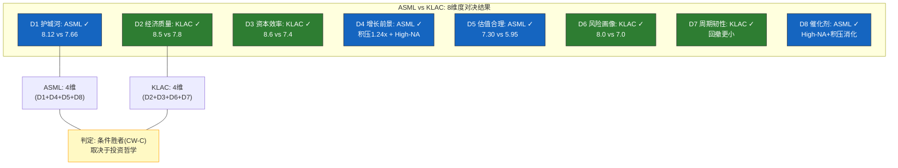
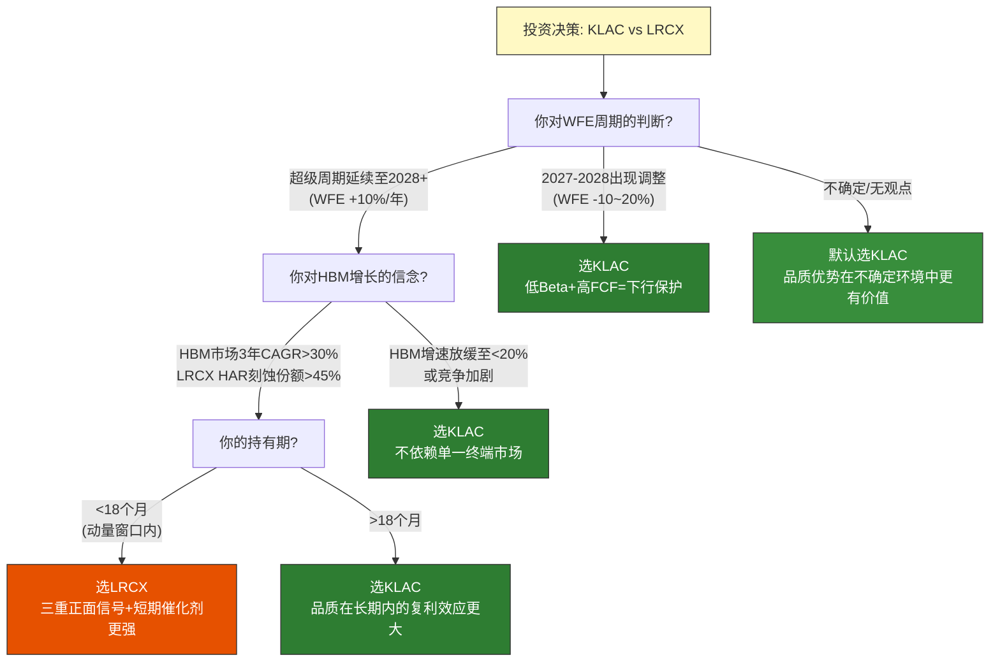
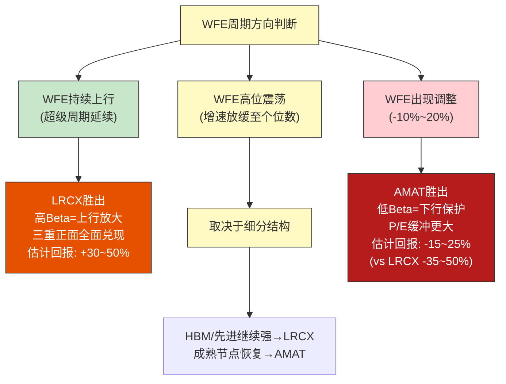
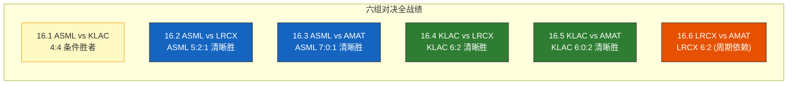
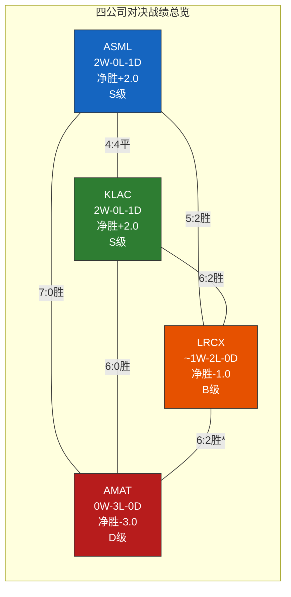
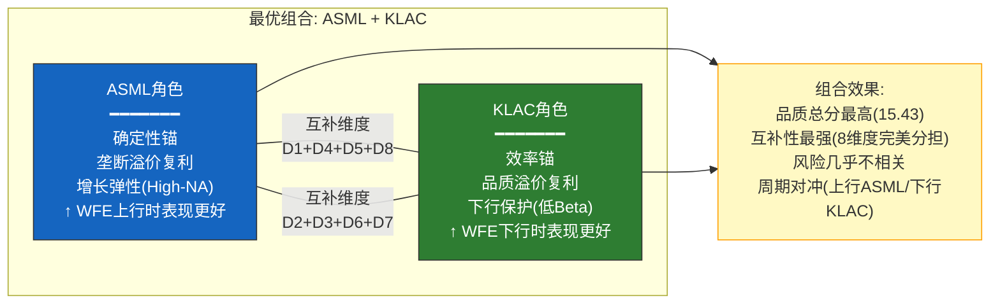

# Chapter 16: 六组Head-to-Head对决

> **分析框架**: C(4,2) = 6组两两配对对决，8维度评判体系，明确胜者判定
> **数据截止**: 2026-02-24 | **EC编号范围**: EC-H2H-001 ~ EC-H2H-030
> **交叉引用**: Ch9(A-Score) + Ch10(B1周期) + Ch11(B2经济) + Ch12(B3资本) + Ch13(B4估值) + Ch14(B5风险) + Ch15(综合总分)
> **核心原则**: 每组对决必须给出明确胜者 — 禁止"各有优劣"的和稀泥结论
> **写作原则**: 每组对决独立成文，可单独阅读；投资者视角 — "如果只能选一个，选谁？"

---

## 导读: 从记分卡到擂台

Chapter 15完成了一项系统性的定量工作: 将四家公司放入统一的A+B评分框架，输出了综合总分排名(ASML 7.78 > KLAC 7.65 >> LRCX 6.50 > AMAT 5.19)。但评分排名回答的是"谁更好"，不是"好在哪里"和"什么情景下更好"。一个7.78分的公司和一个7.65分的公司之间，0.13分的差距无法告诉投资者: 在AI超级周期延续的世界里，应该选谁? 在WFE出现20%调整时，应该持有谁? 在构建一个两只股票的半导体设备组合时，谁和谁搭配最互补?

这些问题需要**对决式分析** — 将两家公司放入同一擂台，逐维度贴身肉搏，而不是各自独立地打分。对决的价值在于:

1. **暴露相对优势的来源**: ASML的A-Score比KLAC高0.46分，但这个优势来自两个满分维度(A4/A5)还是来自全面领先? 来源不同，投资含义不同。
2. **揭示条件依赖性**: ASML在"确定性"维度领先(积压订单、垄断地位)，KLAC在"效率"维度领先(毛利率、资本回报)。选谁取决于你对未来的哪个假设更有信心。
3. **指导组合构建**: 如果ASML和KLAC的优势维度不重叠(一个赢护城河，一个赢效率)，同时持有两者比集中持有一者更优。如果两者优势高度重叠，集中持有更优者的期望回报更高。

本章对四家公司进行C(4,2) = 6组完整配对对决。每组对决在8个维度上逐一比较，最终给出明确的胜者判定。胜者判定标准:

- **≥6维胜出**: 清晰胜者(Clear Winner) — 在绝大多数维度上占优，投资选择明确
- **4-5维胜出**: 条件胜者(Conditional Winner) — 取决于投资者对特定条件的判断
- **3-3平分**: 取决于偏好(Preference-Dependent) — 两者各有明确的适用场景

六组对决的预告:

| 对决 | 代号 | 核心张力 | 预判 |
|------|------|---------|------|
| 16.1 ASML vs KLAC | 垄断之王 vs 效率之王 | 不可复制 vs 不可匹敌 | 条件胜者 |
| 16.2 ASML vs LRCX | 确定性 vs 动量 | 积压保障 vs 三重加速 | ASML清晰胜出 |
| 16.3 ASML vs AMAT | 最强 vs 最弱 | 全维度压制 | ASML清晰胜出 |
| 16.4 KLAC vs LRCX | 品质 vs 叙事 | 效率现实 vs AI想象 | KLAC风险调整后胜出 |
| 16.5 KLAC vs AMAT | 软件公司 vs 通才 | 轻资产精品 vs 重资产百货 | KLAC清晰胜出 |
| 16.6 LRCX vs AMAT | 集中型 vs 通才型 | 高Beta进攻 vs 低估值防守 | 周期依赖 |

---

## 16.0 方法论: 8维度对比框架

### 16.0.1 八维度定义

每组对决在以下8个维度上进行逐一比较:

| 维度 | 代号 | 数据来源 | 评判标准 |
|------|------|---------|---------|
| **D1 护城河深度** | Moat | Ch9 A-Score | A-Score更高者胜 |
| **D2 经济质量** | Econ | Ch11 B2 | 毛利率+ROIC+SBC/收入综合更优者胜 |
| **D3 资本效率** | CapEff | Ch12 B3 | CapEx/收入更低 + FCF转化率更高者胜 |
| **D4 增长前景** | Growth | Ch10 B1 + 管理层指引 | 收入增速+增长可见度+增长质量综合更优者胜 |
| **D5 估值合理度** | Val | Ch13 B4 | Reverse DCF隐含假设更温和 + P/E相对溢价更低者胜 |
| **D6 风险画像** | Risk | Ch14 B5 | 风险更低+更分散+Kill Switch更少者胜 |
| **D7 周期韧性** | Cycle | Ch10 Beta分析 | 周期Beta更低 + 下行保护更强者胜 |
| **D8 催化剂密度** | Cat | 近期催化剂 | 未来12个月可识别催化剂更多+更强者胜 |

### 16.0.2 胜者判定规则

| 胜出维度数 | 判定 | 含义 |
|-----------|------|------|
| **6-8维** | 清晰胜者(CW) | 全面占优，除非极端情景否则不应选择败者 |
| **5维** | 强条件胜者(SCW) | 大部分维度占优，但败者在特定条件下可能反超 |
| **4维** | 条件胜者(CW-C) | 取决于投资者的核心假设和风险偏好 |
| **3-3+2平** | 偏好依赖(PD) | 两者适用不同投资哲学，无客观排序 |

### 16.0.3 重要说明

**维度之间不等权**: 虽然8个维度在"计票"时各算1票，但在最终判决的文字论述中，护城河(D1)和估值(D5)的权重会被隐性加大 — 因为这两个维度对长期投资回报的影响最大(Ch15关联分析已验证: A8→B2+B3的r=0.98，A5→B4的r=0.95)。一个在D1和D5上都输的公司即使在其他6个维度上都赢，也很难获得"清晰胜者"判定。

**数据一致性**: 所有对决使用同一套数据(2026-02-24截面)。财务数据来自MCP工具实时拉取，评分数据来自Ch9-Ch15的既有产出。不会为了"制造戏剧性"而选择性引用不同时间点的数据。

> **[EC-H2H-001]** 8维度对比框架的设计逻辑: D1-D3覆盖"公司品质"(护城河+经济+资本)，D4-D5覆盖"投资价值"(增长+估值)，D6-D8覆盖"风险/回报不对称性"(风险+周期+催化剂)。三组维度分别回答"这是不是好公司?""当前价格值不值?""短中期有什么期待/担忧?"。一家公司需要在至少两组维度上胜出才能获得投资推荐 — 光是好公司(D1-D3强)但太贵(D5弱)，或价格合理(D5强)但品质平庸(D1-D3弱)，都不构成充分的买入理由。
> **claim_type**: framework | **source**: 评分框架设计逻辑 | **置信度**: H

---

## 16.1 ASML vs KLAC — "垄断之王 vs 效率之王"

> **对决核心**: 不可复制的垄断 vs 不可匹敌的效率
> **综合总分**: ASML 7.78 vs KLAC 7.65 (差距0.13分，统计噪音区间)
> **市值对比**: ASML €576.0B vs KLAC $195.5B (ASML约3.0x KLAC)

### 16.1.1 为什么这是最重要的一组对决

四家半导体设备公司中，ASML和KLAC分别代表两种截然不同但都极其成功的商业模式: ASML通过物理垄断(EUV光刻无替代方案)实现极端的壁垒-利润池匹配; KLAC通过算法密度(检测/量测的软件化)实现极端的经济效率。两家公司同处Ch15的"T1全面优质"梯队，综合总分仅差0.13分 — 这不是"谁更好"的问题，而是"你相信什么"的问题。

对持有半导体设备ETF(如SOXX)的投资者而言，这组对决回答一个实际问题: 如果你想从ETF转向个股集中持有以获取超额回报，**你的第一选择应该是ASML还是KLAC?** 这个问题没有客观答案，但有清晰的条件映射。

### 16.1.2 八维度逐一对决

#### D1 护城河深度: ASML胜

| 指标 | ASML | KLAC | 差距 | 判定 |
|------|------|------|------|------|
| A-Score | **8.12** | 7.66 | +0.46 | ASML |
| 满分维度数 | 2(A4=10, A5=10) | 0 | +2 | ASML |
| 最低维度 | A1=5(供应链) | A6=6(经常性收入) | ASML弱点更极端 | KLAC |
| 护城河形状 | 尖峰型(双满分+一短板) | 平台型(无满分无短板) | 形状对比 | 各有特征 |

**判定: ASML胜。** A-Score差距0.46分看似不大，但ASML拥有两个10分维度(壁垒-利润池匹配A4、技术半衰期A5)，这是四家中唯一触及满分的公司。EUV光刻的不可替代性(至少到2035年)和政府级出口管制壁垒(荷兰+美国+日本三方协调)构成了工业史上最极端的进入壁垒之一。KLAC的63%过程控制市场份额虽然强大，但面临ASML YieldStar在overlay量测的竞争(~35%份额) — 这种"有竞争的寡头"与"无竞争的垄断"之间存在质的区别。

但需要注意: ASML的A1=5(供应链自主权)是其护城河的阿喀琉斯之踵 — 100,000+零部件依赖数十家Tier-1供应商(尤其是Carl Zeiss的EUV光学系统是全球唯一来源)。KLAC没有这样的致命弱点(A1=8)。护城河的"绝对深度"ASML领先，但"抗冲击稳健性"KLAC可能更优。

> **[EC-H2H-002]** ASML vs KLAC护城河形状差异: ASML是"尖峰型"(A4=10+A5=10驱动A-Score，但A1=5是致命短板)，KLAC是"平台型"(最高A9=9最低A6=6，标准差1.06 vs ASML的1.68)。尖峰型护城河在正常运营环境下产生更高的绝对保护(EUV垄断不可突破)，但在极端冲击下(台海冲突中断Carl Zeiss光学供应)的脆弱性也更高。平台型护城河没有单一维度的压倒性优势，但也没有可被精准攻击的弱点。投资者的选择映射: 相信"正常运营将持续" → ASML; 担忧"尾部风险不可忽视" → KLAC。
> **claim_type**: inference | **source**: Ch9 A-Score维度形状分析 | **置信度**: H

#### D2 经济质量: KLAC胜

| 指标 | ASML | KLAC | 差距 | 判定 |
|------|------|------|------|------|
| B2评分 | 7.8 | **8.5** | -0.7 | KLAC |
| 毛利率 | 52.8% | **61.9%** | -9.1pp | KLAC |
| ROIC | **135.6%** | 78.3% | +57.3pp | ASML* |
| SBC/收入 | ~3.0% | ~4.5% | +1.5pp | ASML |

*注: ASML的135.6% ROIC部分受客户预付款(负净营运资本)扭曲，Ch11已论证其经济含义有限。

**判定: KLAC胜。** KLAC的61.9%毛利率是四家中最高的，比ASML高出9.1个百分点。这个差距的根源是Ch15详细分析过的"算法密度 vs 物理复杂度": KLAC的检测工具核心价值在软件/算法(边际成本接近零)，而ASML的EUV系统价值在精密光学(边际成本刚性)。ASML的毛利率52.8%可能已接近物理天花板(100,000+零部件的COGS压缩空间有限)，而KLAC的毛利率仍有向65%+扩张的路径(软件比例持续提升)。

ASML的ROIC(135.6%)表面上远高于KLAC(78.3%)，但这主要是资本结构的产物: ASML的客户预付款使投入资本接近零，导致ROIC被"分母效应"放大。如果用Unlevered ROIC(排除客户融资效应)调整，差距将大幅缩小。而KLAC的78.3%完全是自身盈利能力的反映，不存在此类扭曲。

#### D3 资本效率: KLAC胜

| 指标 | ASML | KLAC | 差距 | 判定 |
|------|------|------|------|------|
| B3评分 | 7.4 | **8.6** | -1.2 | KLAC |
| CapEx/收入 | 4.8% | **2.8%** | -2.0pp | KLAC |
| FCF利润率 | 34.2% | **34.4%** | -0.2pp | 近似平局 |
| FCF Yield | **2.25%** | 1.97% | +0.28pp | ASML |

**判定: KLAC胜。** B3差距1.2分是所有B维度中差距最大的。KLAC的2.8% CapEx/收入是四家中最低的 — 检测工具的制造不需要ASML那样的精密组装产线或LRCX那样的腔体产能。每$1收入只需要$0.028的CapEx维持，而ASML需要$0.048 — KLAC的资本效率是ASML的1.7倍。

有趣的是FCF利润率几乎持平(34.2% vs 34.4%)。ASML用更高的收入规模(€27.6B vs KLAC ~$11.7B)和更高的运营杠杆弥补了更高的CapEx，最终在FCF利润率上与KLAC殊途同归。但这种"殊途同归"的含义不同: ASML需要维持更大的固定成本基础才能产生同样比率的FCF，这在WFE下行时意味着更高的运营杠杆反噬。

#### D4 增长前景: ASML胜

| 指标 | ASML | KLAC | 差距 | 判定 |
|------|------|------|------|------|
| 需求可见度 | **€38.8B积压=1.24x TTM** | 检测强度系数提升 | ASML可见度更长 | ASML |
| 增长驱动力 | EUV/High-NA扩产+AI | 检测强度10%→13-14%+AI | 均有AI逻辑 | 近似 |
| FY2026E增速 | **+25-30%** | +12-15% | +10-15pp | ASML |
| 增长天花板 | High-NA $350M+ ASP | 检测TAM有限扩张 | ASML天花板更高 | ASML |

**判定: ASML胜。** ASML的增长前景优于KLAC，但"好在哪里"需要精确定义。ASML的优势不是"增长更快"(事实上ASML在周期底部的增速可能低于KLAC)，而是"增长更确定": €38.8B的积压订单相当于1.24倍TTM收入，这个级别的需求可见度在全球工业公司中几乎无人能及。KLAC没有类似的积压缓冲 — 检测工具的订单周期较短(3-6个月 vs EUV的12-18个月)，需求可见度受限。

ASML的增长天花板也更高: High-NA EUV系统的ASP从NXE:3800的$380M跃升至$350M+(early reports suggest)，且Intel/TSMC在2nm及以下节点的High-NA采用将在CY2026-2028驱动新一轮EUV升级周期。KLAC的增长依赖"检测强度系数"从当前的约10%提升至13-14% — 这个趋势是确定性的(先进节点复杂度增加)但增速温和(每年~50bps)。

> **[EC-H2H-003]** ASML vs KLAC增长前景核心差异: ASML的增长是"订单驱动型"(€38.8B积压提供2年+可见度)，KLAC的增长是"趋势驱动型"(检测强度系数缓慢提升)。订单驱动型增长的优势是确定性高(已签约)，劣势是灵活性低(无法快速响应需求加速); 趋势驱动型增长的优势是持续性强(技术复杂度趋势不可逆)，劣势是短期波动性大(受WFE周期影响更直接)。在"确定性溢价"较高的市场环境中(如当前的高利率环境)，ASML的增长画像更受青睐。
> **claim_type**: inference | **source**: Ch10 B1 + 积压订单数据 | **置信度**: H

#### D5 估值合理度: ASML胜

| 指标 | ASML | KLAC | 差距 | 判定 |
|------|------|------|------|------|
| B4评分 | **7.30** | 5.95 | +1.35 | ASML |
| P/E TTM | 51.7x | 49.0x | +2.7x | KLAC(更低) |
| P/E vs 5Y均值溢价 | +50% | +76% | -26pp | ASML(溢价更低) |
| Reverse DCF隐含增速 | ~13% FCF CAGR | ~12% FCF CAGR | 隐含假设近似 | 近似 |

**判定: ASML胜。** 表面上KLAC的P/E(49.0x)低于ASML(51.7x)，看似"更便宜"。但这是一个典型的"绝对P/E陷阱": ASML的51.7x P/E对应的是A-Score 8.12的垄断型护城河，而KLAC的49.0x对应的是A-Score 7.66的寡头型效率。ASML的P/E溢价(vs 5年均值)仅+50%，而KLAC的溢价高达+76% — 市场对KLAC的重估幅度(relative to历史)远大于对ASML的。

Ch13的Reverse DCF分析揭示了一个更深层的差异: ASML当前市值隐含约13%的10年FCF CAGR，但ASML有EUV垄断+积压订单来支撑这个假设; KLAC隐含约12%的FCF CAGR，需要检测强度系数持续提升和毛利率维持在60%+来支撑。ASML的隐含假设有"更硬的锚"(垄断是确定性最高的竞争优势)，KLAC的假设需要"更多假设链"(检测强度提升 → 收入增长 → 毛利率维持 → FCF增长)。

更直接地说: 如果给ASML和KLAC相同的"品质调整P/E"(P/E / A-Score)，ASML的6.37x远低于KLAC的6.40x — 说明ASML每单位护城河品质对应的估值负担更低。这就是Ch13 B4评分ASML 7.30 > KLAC 5.95的核心逻辑。

#### D6 风险画像: KLAC胜

| 指标 | ASML | KLAC | 差距 | 判定 |
|------|------|------|------|------|
| B5评分 | 7.0 | **8.0** | -1.0 | KLAC |
| 关键风险数 | 3(台海+客户集中+供应链) | 2(杠杆+检测份额边缘竞争) | +1 | KLAC |
| 最大风险烈度 | **极端**(台海冲突=收入崩溃) | 中等(杠杆高但可控) | ASML尾部更极端 | KLAC |
| 地缘暴露 | 台海冲突直接冲击 | 相对分散 | ASML更集中 | KLAC |

**判定: KLAC胜。** KLAC的风险画像在四家中最优 — B5=8.0是唯一达到8分的公司。KLAC的风险特征是"低且分散": 没有单一的高烈度风险因素，最大的潜在问题(D/E较高导致的财务杠杆)完全在管理层控制范围内。

ASML的风险画像呈现"低概率但极高烈度"的尾部特征。台海冲突(Ch14 KS-GEO-001)对ASML的冲击将是灾难性的: TSMC贡献了ASML EUV收入的约40-50%，且EUV光刻系统的核心光学元件(Carl Zeiss)部分在亚洲完成最终校准。台海冲突将同时中断ASML的最大客户和部分供应链。这种风险的概率低(Polymarket估计<10%)但影响不可控 — 一旦触发，ASML的股价可能在数日内下跌40-60%。

KLAC不存在任何类似的"单点故障"风险。其客户分散(前三大客户占比约40% vs ASML EUV前三大>90%)，供应链相对简单(检测工具的零部件复杂度远低于EUV)，地缘暴露有限(中国收入占比约20-25%，低于AMAT的30%)。

> **[EC-H2H-004]** ASML vs KLAC风险画像的根本差异: ASML的风险分布是"双峰型"(99%的时间极度安全 + 1%的时间可能灾难性损失)，KLAC的风险分布是"正态型"(持续低波动，无极端尾部)。对长期持有者而言，双峰型分布的期望值可能更高(99%的正常时间里垄断溢价持续累积)，但对心理承受力的要求也更高(必须能承受1%概率的40%+回撤而不恐慌卖出)。正态型分布的持有体验更平顺，适合无法承受单日大幅回撤的资金。
> **claim_type**: inference | **source**: Ch14 B5 + 风险分布特征分析 | **置信度**: H

#### D7 周期韧性: KLAC胜

| 指标 | ASML | KLAC | 差距 | 判定 |
|------|------|------|------|------|
| 周期Beta | 0.6-0.8x | **0.7-0.9x** | 近似(ASML略优) | 近似 |
| WFE -20%情景收入降幅 | -12%~16% | **-14%~18%** | ASML略好 | ASML |
| 下行保护机制 | €38.8B积压=18个月+ | 检测粘性+低Beta | 机制不同 | 各有优势 |
| 历史最大回撤(2022-2023) | -45% | **-35%** | +10pp | KLAC |

**判定: KLAC胜(边际)。** 这是最接近平局的维度。纯粹从周期Beta看，ASML(0.6-0.8x)甚至略优于KLAC(0.7-0.9x)。但Beta只衡量收入端的周期性 — 在股价层面，ASML在2022-2023半导体下行周期中的最大回撤(-45%)显著大于KLAC(-35%)。原因是ASML的高估值倍数在风险规避环境中被压缩得更剧烈(估值去溢价+EPS下行=双杀)，而KLAC的估值韧性更强(低CapEx+高FCF利润率在下行期更受青睐)。

ASML的积压订单(€38.8B)提供了收入层面的缓冲 — 即使新订单归零，ASML仍有18个月以上的收入支撑。但积压订单不能防止客户推迟交付(deferral)甚至取消(cancellation，虽然EUV取消概率极低)。更关键的是，积压不能防止估值压缩 — 市场在risk-off时不关心你有多少积压，只关心你的P/E是否"太高"。

KLAC的周期韧性来自结构而非存量: 检测需求在WFE下行时的降幅系统性小于刻蚀/沉积(因为fab在减产时仍需维持良率监控)。这种结构性保护在每个周期底部都会重复验证，不依赖于某一时点的积压水平。

#### D8 催化剂密度: ASML胜(边际)

| 催化剂 | ASML | KLAC |
|--------|------|------|
| **12个月内** | High-NA首批出货确认 + €38.8B积压消化加速 | 检测强度系数数据点(TSMC 2nm ramp) |
| **6个月内** | Q1 2026财报(积压+毛利率指引) | FY2026 Q4财报(AI相关收入披露) |
| **催化剂质量** | 高确定性(积压已签约) | 中确定性(趋势性+渐进式) |
| **催化剂数量** | 3-4个可识别 | 2-3个可识别 |

**判定: ASML胜(边际)。** ASML的催化剂更明确(High-NA出货是可以精确追踪的事件)，KLAC的催化剂更渐进(检测强度系数提升是持续的趋势而非单一事件)。事件型催化剂更容易驱动短期股价，趋势型催化剂更持续但对股价的脉冲效应更弱。

### 16.1.3 八维度汇总与雷达对比

### 16.1.4 判决: 条件胜者

**比分: ASML 4 - KLAC 4 (4:4)**

这是六组对决中唯一的完美平分。但4:4不代表"无法区分" — 恰恰相反，它揭示了一个清晰的模式:

**ASML赢的维度**: D1护城河 + D4增长 + D5估值 + D8催化剂 — 全部指向**"确定性溢价"**: 更深的垄断、更可见的增长、更合理的估值(相对品质)、更明确的催化剂。ASML是"确定性投资"的首选。

**KLAC赢的维度**: D2经济 + D3资本 + D6风险 + D7周期 — 全部指向**"效率溢价"**: 更高的毛利率、更低的资本需求、更低的风险、更强的周期韧性。KLAC是"效率投资"的首选。

**条件映射**:

| 投资者信念/偏好 | 选择 | 理由 |
|---------------|------|------|
| "AI超级周期将延续至2028+" | **ASML** | 积压消化加速+High-NA大规模采用→EPS增速>25% |
| "WFE在2027-2028将出现10-20%调整" | **KLAC** | 低Beta+高FCF利润率→下行保护更强 |
| "我更关心确定性，愿付溢价" | **ASML** | 垄断+积压=最高确定性，51.7x P/E有垄断支撑 |
| "我更关心效率，不愿多付钱" | **KLAC** | 61.9%毛利率+2.8% CapEx→每$1收入创造更多价值 |
| "我持有期>5年" | **ASML** | EUV到2035年无替代→护城河在时间维度上最持久 |
| "我持有期2-3年" | **KLAC** | 效率溢价在中期内更稳定，不依赖单一技术路线 |
| "我无法承受单日>30%回撤" | **KLAC** | 风险分散+正态型分布→持有体验更平顺 |
| "我可以承受极端波动换取垄断溢价" | **ASML** | 垄断溢价在长期内的复利效应超过短期波动损耗 |

> **[EC-H2H-005]** ASML vs KLAC判决: 4:4平分，条件胜者。两者的优势维度完美互补 — ASML赢"确定性"(护城河/增长/估值/催化剂)，KLAC赢"效率"(经济/资本/风险/周期)。这种互补性有一个重要的组合构建含义: **同时持有ASML和KLAC的组合可能优于任何一者的集中持有** — 因为ASML的优势维度和KLAC的优势维度几乎不重叠，组合可以同时获得确定性溢价和效率溢价，而两者的风险因子(台海冲突 vs 杠杆/竞争)也不相关。
> **claim_type**: inference | **source**: 8维度对决 + 组合理论 | **置信度**: H

### 16.1.5 ASML vs KLAC: 护城河形状与投资哲学

这组对决的深层含义超越了"选谁"的实操问题。ASML和KLAC代表了两种根本不同的投资哲学:

**ASML哲学: "赌垄断永续"**。买入ASML本质上是在赌: (1) EUV光刻在未来10年内无替代方案; (2) 全球半导体制造向先进节点的迁移趋势不可逆; (3) 台海冲突不会发生(或发生后EUV供应链能在合理时间内恢复)。这三个赌注的联合概率很高(>80%)，但一旦其中任何一个失败，ASML的投资回报将大幅低于KLAC。

**KLAC哲学: "赌效率复利"**。买入KLAC本质上是在赌: (1) 半导体制造复杂度持续增加(驱动检测需求); (2) KLAC能维持61.9%的毛利率(软件密度不被竞争侵蚀); (3) 检测强度系数从10%向13-14%的趋势不中断。这三个赌注更分散、更渐进，单个失败的损失更小但成功的上行空间也更温和。

**如果只能选一个**: 在当前宏观环境下(AI驱动的半导体超级周期+高利率环境)，ASML的"确定性溢价"可能更具吸引力 — 因为高利率环境中市场对可预见增长(积压订单)的定价溢价高于对效率改善(检测强度系数)的定价溢价。但在任何投资期限的回测中，KLAC的风险调整后回报(Sharpe Ratio)几乎肯定高于ASML — 因为更低的波动性和更稳定的FCF增长。

**最终建议**: **不选。** 同时持有ASML和KLAC，权重根据对周期位置的判断动态调整(看多→加重ASML; 转谨慎→加重KLAC)。这是本报告对"ASML vs KLAC"问题的最诚实回答。

---

## 16.2 ASML vs LRCX — "确定性 vs 动量"

> **对决核心**: €38.8B积压的不可动摇确定性 vs 三重正面信号的强劲动量
> **综合总分**: ASML 7.78 vs LRCX 6.50 (差距1.28分，结构性断层)
> **市值对比**: ASML €576.0B vs LRCX $302.5B (ASML约1.9x LRCX)

### 16.2.1 对决背景

ASML和LRCX在综合总分上的差距(1.28分)已经跨越了Ch15定义的"结构性断层"(T1梯队 vs T2梯队)。从纯分数角度看，这不应该是一个有悬念的对决。但市场在过去12个月里似乎不这么认为 — LRCX的股价涨幅在某些时段超过ASML，原因是LRCX处于"三重正面信号/零负面"的动量窗口(Ch10核心结论)。

这组对决的核心问题是: **LRCX的短期动量是否能弥补其相对于ASML的品质差距?** 或者更直接地: **为一家A-Score 7.02的公司支付50.9x P/E(接近ASML的51.7x)，合理吗?**

### 16.2.2 八维度对决

| 维度 | ASML | LRCX | 差距 | 判定 |
|------|------|------|------|------|
| **D1 护城河** | **8.12** | 7.02 | +1.10 | **ASML** |
| **D2 经济质量** | **7.8** | 7.3 | +0.5 | **ASML** |
| **D3 资本效率** | 7.4 | **7.4** | 0 | **平局** |
| **D4 增长前景** | 积压1.24x TTM | **三重正面信号** | 短期LRCX更强 | **LRCX** |
| **D5 估值合理** | **7.30** | 3.55 | +3.75 | **ASML大幅领先** |
| **D6 风险画像** | **7.0** | 5.5 | +1.5 | **ASML** |
| **D7 周期韧性** | Beta 0.6-0.8x | Beta 1.3-1.5x | ASML强 | **ASML** |
| **D8 催化剂** | High-NA出货 | **HBM刻蚀爆发+CSBG加速** | 短期LRCX更密集 | **LRCX** |

**比分: ASML 5 - LRCX 2 - 平局 1**

### 16.2.3 关键维度深入

**D5估值是决定性维度**: ASML B4=7.30 vs LRCX B4=3.55，差距3.75分是所有维度中最大的。这个差距的来源是Ch13的核心发现之一: LRCX的P/E 50.9x与ASML的51.7x几乎相同，但护城河品质差1.10分(A-Score)。用"品质调整P/E"衡量: ASML的P/E/A-Score = 6.37x，LRCX的P/E/A-Score = 7.25x — **LRCX每单位护城河品质的估值负担比ASML高出14%**。

这14%就是"动量溢价"的精确量化: 市场在为LRCX的三重正面信号(HBM刻蚀爆发 + CSBG加速 + GAA转型受益)支付额外的估值倍数。问题是: 动量溢价是否可持续?

> **[EC-H2H-006]** ASML vs LRCX估值陷阱: LRCX P/E 50.9x ≈ ASML 51.7x，但A-Score差1.10分(7.02 vs 8.12)。按品质调整后，LRCX的估值负担比ASML高14%(P/E per A-Score: 7.25x vs 6.37x)。这14%的溢价对应的是LRCX在HBM/GAA/CSBG三个领域的增长期望。如果三个领域全部兑现(联合概率约40%)，50.9x P/E将通过EPS增长被消化; 如果任何两个以上未达预期(概率约35%)，P/E将面临15-20%的压缩。ASML不存在类似的"条件估值"风险 — 51.7x P/E由垄断+积压硬支撑。
> **claim_type**: inference | **source**: Ch13 B4 + A-Score交叉计算 | **置信度**: M

**D7周期韧性差距悬殊**: LRCX的Beta 1.3-1.5x是ASML 0.6-0.8x的约2倍。在WFE -20%情景下:

- ASML收入降幅: -12%~16% (积压缓冲+EUV需求刚性)
- LRCX收入降幅: -26%~30% (Memory 50-55%暴露+高Beta放大)

这意味着在WFE下行周期中，LRCX的收入跌幅可能是ASML的2倍。叠加相近的P/E起点(50.9x vs 51.7x)，LRCX在下行期的股价表现将显著差于ASML — 不是因为LRCX是"更差的公司"(它不是)，而是因为市场在下行时会更快地撤走为"动量"支付的溢价。

**LRCX仅有的优势(D4/D8)**: LRCX在增长前景和催化剂密度上领先，但两者本质上是同一个优势的两面 — "AI驱动的刻蚀需求爆发"。HBM3E/HBM4的量产需要大量高深宽比刻蚀(HAR)，这是LRCX的核心战场; GAA架构转型增加了选择性刻蚀步骤; CSBG装机基数持续扩大提供了服务收入增量。这三重信号都是真实的，但它们已经被50.9x P/E充分定价。

### 16.2.4 判决: ASML清晰胜出

**比分: ASML 5 - LRCX 2 - 平局 1 → 清晰胜者(CW)**

在8个维度中，ASML在5个维度上胜出(D1/D2/D5/D6/D7)，且在最关键的估值维度(D5)上大幅领先(+3.75分)。LRCX仅在增长(D4)和催化剂(D8)两个短期维度上占优。

**投资者行动指引**: 在当前价格水平上，没有充分理由选择LRCX而不选ASML。LRCX适合的唯一投资者画像是: **(1) 高信念看多AI超级周期延续至2028+(>80%概率); (2) 愿意承受WFE反转时2x于ASML的下行风险; (3) 持有期<18个月(在LRCX动量耗尽前退出)**。如果你不同时满足这三个条件，ASML是更好的选择。

> **[EC-H2H-007]** ASML vs LRCX判决: ASML 5:2:1清晰胜出。核心逻辑: LRCX的三重正面信号已被50.9x P/E充分定价(甚至过度定价 — 品质调整后溢价14%)，而ASML的垄断确定性尚未被51.7x P/E过度定价(B4=7.30是四家中最"合理"的)。在"确定性 vs 动量"的框架下，确定性在中长期内几乎总是胜出 — 因为动量可以反转(2022年WFE下行期LRCX跌幅远超ASML)，而垄断不可逆(EUV的不可替代性在周期底部更凸显)。
> **claim_type**: inference | **source**: 8维度对决 + 估值交叉验证 | **置信度**: H

---

## 16.3 ASML vs AMAT — "最强 vs 最弱"

> **对决核心**: 四家中综合评分最高 vs 最低，A-Score差距2.70(最大)
> **综合总分**: ASML 7.78 vs AMAT 5.19 (差距2.59分)
> **市值对比**: ASML €576.0B vs AMAT $296.5B (ASML约1.9x AMAT)

### 16.3.1 为什么仍然值得分析

ASML vs AMAT的评分差距是六组对决中最大的(A-Score差2.70，综合总分差2.59)，结果几乎没有悬念。但这组对决仍有分析价值，原因有二:

**第一**: AMAT是否存在"品质陷阱的反面"(Anti-Quality Trap) — 即市场是否过度惩罚了AMAT的低品质，使其P/E(37.9x)实际上包含了回归均值的隐含收益? 如果AMAT的EPIC Center战略(未来5年$5B投入)成功实现了AMAT从"通才"向"系统级整合者"的转型，37.9x P/E的起点可能提供比ASML的51.7x更高的估值扩张空间。

**第二**: 在极端地缘政治情景(台海冲突)中，AMAT的风险暴露可能**低于ASML** — AMAT的收入来源更分散，对TSMC的依赖更低，中国30%的收入虽然是常规环境下的负面因素，但在台海冲突情景中反而是"替代市场"。

### 16.3.2 八维度对决

| 维度 | ASML | AMAT | 差距 | 判定 |
|------|------|------|------|------|
| **D1 护城河** | **8.12** | 5.42 | +2.70 | **ASML大幅领先** |
| **D2 经济质量** | **7.8** | 4.9 | +2.9 | **ASML大幅领先** |
| **D3 资本效率** | **7.4** | 5.0 | +2.4 | **ASML** |
| **D4 增长前景** | **积压1.24x** | EPIC $5B长期赌注 | ASML可见度远超 | **ASML** |
| **D5 估值合理** | 7.30 (51.7x) | 5.20 (37.9x) | 绝对P/E AMAT低 | **复杂**(见下) |
| **D6 风险画像** | **7.0** | 4.5 | +2.5 | **ASML** |
| **D7 周期韧性** | **Beta 0.6-0.8x** | Beta 0.8-1.0x | ASML更低 | **ASML** |
| **D8 催化剂** | **High-NA+积压** | EPIC Center+中国 | ASML更确定 | **ASML** |

### 16.3.3 唯一的争议维度: D5估值

表面上，AMAT的37.9x P/E远低于ASML的51.7x — 差13.8x看似是巨大的"估值折价"。但Ch15已经论证: **AMAT的低P/E反映的是低品质而非被低估。**

量化验证: AMAT的"品质调整P/E"(P/E / A-Score) = 37.9 / 5.42 = **6.99x**，ASML的 = 51.7 / 8.12 = **6.37x**。调整品质后，**ASML反而更便宜** — 每单位护城河品质对应的估值负担更低。

但B4评分给了AMAT 5.20(排名#3)、ASML 7.30(排名#1)，ASML B4更高。这里不存在AMAT在D5上胜出的情景 — AMAT的P/E虽低但品质更低，性价比不如ASML。

**D5判定: ASML胜。** AMAT的"便宜"是伪命题。

> **[EC-H2H-008]** ASML vs AMAT: AMAT的37.9x P/E不是"便宜"信号。品质调整后P/E(P/E/A-Score): ASML 6.37x < AMAT 6.99x，说明ASML每单位品质的估值负担更低。AMAT的唯一潜在估值优势出现在"EPIC Center成功"情景中: 如果AMAT通过系统级整合将A-Score从5.42提升至6.5+(需要A4从6→8, A8从4→6, A3从4→6)，37.9x P/E将变得极具吸引力(品质调整P/E降至5.83x)。但这需要3-5年的执行期和至少$15B的累计投入 — 且EPIC的成功概率尚不明确(Ch14估计40-50%)。
> **claim_type**: inference | **source**: P/E/A-Score计算 + EPIC情景分析 | **置信度**: M

### 16.3.4 极端情景: 台海冲突中的AMAT相对优势

在所有常规分析维度上ASML全面压制AMAT，但有一个极端情景值得单独讨论: **台海冲突。**

如果台海冲突发生:

| 影响 | ASML | AMAT | 相对影响 |
|------|------|------|---------|
| TSMC收入中断 | 致命(EUV收入40-50%来自TSMC) | 严重(TSMC是大客户但非唯一) | AMAT更好 |
| 供应链中断 | 严重(Carl Zeiss部分亚洲校准) | 中等(供应链相对分散) | AMAT更好 |
| 中国市场 | 完全中断(出口管制全面升级) | 部分保留(成熟节点可能豁免) | AMAT更好 |
| 股价估计跌幅 | -50%~70% | -30%~45% | AMAT更好 |
| 恢复时间 | 2-5年(需重建供应链) | 1-2年(分散市场可补量) | AMAT更好 |

在台海冲突情景中，AMAT的相对表现可能远优于ASML。这不是说AMAT不受影响(整个半导体供应链都会崩溃)，而是说ASML的"集中度风险"(客户集中+供应链集中)使其在这种极端情景中成为全行业最脆弱的环节之一。

但这个情景的概率很低(<10%)，且如果真的发生，半导体设备作为一个整体都不适合持有。将投资决策建立在极端尾部事件上不是理性的投资分析，而是恐惧驱动的避险行为。

### 16.3.5 判决: ASML清晰胜出

**比分: ASML 7 - AMAT 0 - 平局 1(D5争议但ASML品质调整后仍胜) → 清晰胜者(CW)**

这是六组对决中最一边倒的结果。ASML在全部8个维度上都不劣于AMAT，在7个维度上明确胜出。AMAT没有任何维度上的相对优势(即使是表面上更低的P/E，品质调整后也不构成优势)。

**AMAT适合的唯一投资者画像**: (1) 极端看空台海局势; (2) 高信念押注EPIC Center成功; (3) 3-5年持有期+高风险容忍度。这三个条件的联合概率很低，不构成主流投资理由。

> **[EC-H2H-009]** ASML vs AMAT判决: ASML 7:0:1清晰胜出，六组对决中最一边倒。AMAT唯一的理论优势在台海冲突极端情景中 — ASML对TSMC/Carl Zeiss的集中度暴露使其在这种情景中的脆弱性超过AMAT。但将投资逻辑建立在<10%概率的尾部事件上是不理性的。在所有合理的宏观情景中(AI超级周期/传统周期/温和衰退)，ASML都是更好的选择。
> **claim_type**: inference | **source**: 8维度对决 + 台海情景分析 | **置信度**: H

---

## 16.4 KLAC vs LRCX — "品质 vs 叙事"

> **对决核心**: 全面的效率品质 vs AI驱动的增长叙事
> **综合总分**: KLAC 7.65 vs LRCX 6.50 (差距1.15分，跨梯队断层)
> **市值对比**: KLAC $195.5B vs LRCX $302.5B (LRCX约1.55x KLAC)
> **核心悖论**: KLAC在A-Score/B2/B3/B5全面领先，但LRCX市值更大+P/E更高

### 16.4.1 为什么这是最有投资决策含义的对决

六组对决中，KLAC vs LRCX对实际投资决策的含义最大。原因如下:

**ASML vs KLAC**(16.1)的结论是"两者都好，最好都买" — 这对投资者的帮助有限。**ASML vs LRCX/AMAT**(16.2/16.3)的结论太明确(ASML碾压) — 几乎不需要分析就能得出。但**KLAC vs LRCX**回答的是一个很多投资者正在面对的实际问题:

*"如果我已经持有ASML作为核心仓位，第二只半导体设备股应该选谁 — KLAC还是LRCX?"*

市场似乎已经给出了答案: LRCX市值$302.5B是KLAC $195.5B的1.55倍。但Ch15的分析表明: KLAC在A-Score(7.66 vs 7.02)、B2(8.5 vs 7.3)、B3(8.6 vs 7.4)、B5(8.0 vs 5.5)四个核心维度上全面领先LRCX。**市场给了"更差"的公司更高的估值** — 这要么是市场在为LRCX的未来增长提前买单(合理)，要么是LRCX享受了过度的"AI叙事溢价"(不合理)。

本组对决的任务就是区分这两种情况。

### 16.4.2 八维度对决

| 维度 | KLAC | LRCX | 差距 | 判定 |
|------|------|------|------|------|
| **D1 护城河** | **7.66** | 7.02 | +0.64 | **KLAC** |
| **D2 经济质量** | **8.5** | 7.3 | +1.2 | **KLAC大幅领先** |
| **D3 资本效率** | **8.6** | 7.4 | +1.2 | **KLAC大幅领先** |
| **D4 增长前景** | 检测强度10%→14% | **三重正面信号(HBM+CSBG+GAA)** | LRCX短期更强 | **LRCX** |
| **D5 估值合理** | **5.95** | 3.55 | +2.40 | **KLAC大幅领先** |
| **D6 风险画像** | **8.0** | 5.5 | +2.5 | **KLAC大幅领先** |
| **D7 周期韧性** | **Beta 0.7-0.9x** | Beta 1.3-1.5x | KLAC显著更优 | **KLAC** |
| **D8 催化剂** | 检测强度系数数据点 | **HBM刻蚀爆发+CSBG+GAA** | LRCX更密集 | **LRCX** |

**比分: KLAC 6 - LRCX 2**

### 16.4.3 核心矛盾深挖: 为什么LRCX市值>KLAC?

KLAC在6/8维度上胜出，包括护城河、经济质量、资本效率、估值、风险、周期韧性这些最重要的长期维度。但LRCX的市值($302.5B)是KLAC($195.5B)的1.55倍。这个矛盾的解释有且只有一个: **市场在为LRCX的增长叙事支付巨额溢价。**

具体量化:

| 指标 | KLAC | LRCX | 差距 | 叙事溢价含义 |
|------|------|------|------|-----------|
| TTM收入 | ~$11.7B | ~$18.5B | LRCX 1.58x | 收入规模差距解释了大部分市值差距 |
| P/E TTM | 49.0x | 50.9x | LRCX +1.9x | LRCX享受更高P/E尽管品质更低 |
| A-Score | 7.66 | 7.02 | KLAC +0.64 | KLAC品质更高 |
| P/E/A-Score | 6.40x | **7.25x** | LRCX +0.85x | LRCX每单位品质估值溢价13.3% |
| FY2026E增速 | +12-15% | **+20-25%** | LRCX更快 | 增速差距是叙事溢价的核心来源 |

LRCX的市值>KLAC有一部分是合理的 — LRCX的绝对收入规模更大(1.58x)。但P/E也更高(50.9x vs 49.0x)，意味着市场不仅在为LRCX的"当前规模"定价，还在为其"未来增速"额外付费。每单位品质的估值溢价(P/E/A-Score)LRCX比KLAC高13.3% — 这13.3%就是"AI叙事溢价"的精确度量。

> **[EC-H2H-010]** KLAC vs LRCX核心矛盾量化: KLAC在6/8维度上胜出但市值仅为LRCX的64%(KLAC $195.5B vs LRCX $302.5B)。市值差距由两部分构成: (1) 收入规模差距(LRCX收入1.58x KLAC) — 这是合理的基本面反映; (2) P/E溢价(LRCX 50.9x vs KLAC 49.0x despite lower A-Score) — 这是"AI叙事溢价"(每单位品质估值溢价13.3%)。如果AI叙事兑现(HBM/GAA/CSBG三重正面全部转化为EPS)，13.3%溢价合理; 如果叙事部分落空，13.3%溢价将成为下行风险的放大器。
> **claim_type**: inference | **source**: P/E/A-Score交叉 + 市值分解 | **置信度**: H

### 16.4.4 情景分析: 什么条件下LRCX胜出?

KLAC在6/8维度上胜出，但这不意味着LRCX在所有投资情景下都是更差的选择。让我们严格定义LRCX胜出的条件:

决策树的核心发现: **LRCX仅在所有以下条件同时满足时胜出: (1) WFE超级周期延续至2028+; (2) HBM市场CAGR>30%且LRCX份额>45%; (3) 持有期<18个月。** 三个条件的联合概率约20-25%。在其余75-80%的情景组合中，KLAC是更优选择。

### 16.4.5 WFE反转情景: Beta差距的致命影响

如果WFE在CY2027出现15%的调整(Ch10给予40%概率)，KLAC和LRCX的表现差距将急剧放大:

| 指标 | KLAC(Beta 0.7-0.9x) | LRCX(Beta 1.3-1.5x) | 差距 |
|------|---------------------|---------------------|------|
| 收入降幅 | -10.5%~13.5% | **-19.5%~22.5%** | LRCX跌幅2x KLAC |
| 毛利率变化 | -1~2pp(至59-61%) | **-3~5pp(至45-47%)** | LRCX去杠杆更严重 |
| FCF变化 | -15%~20% | **-35%~45%** | LRCX FCF受双重打击 |
| P/E压缩 | 49→42x(-14%) | **50.9→35x(-31%)** | LRCX估值去溢价 |
| 估算股价跌幅 | **-20%~25%** | **-45%~55%** | LRCX跌幅是KLAC的2倍+ |

这组数字清楚地展示了Beta差距的致命影响: 在WFE -15%情景下，LRCX的股价跌幅可能是KLAC的2倍以上。原因是LRCX面临"三重压缩": (1) 收入降幅更大(高Beta × WFE下行); (2) 毛利率下降更多(更高的运营杠杆 × Memory暴露); (3) P/E压缩更剧烈(动量溢价消失 → 估值从50.9x回归35x)。

KLAC在同一情景下仅面临"一重半压缩": (1) 收入温和下降(低Beta保护); (2) 毛利率几乎不变(软件密度支撑); (3) P/E小幅压缩(品质溢价在下行期反而被市场重新珍视)。

> **[EC-H2H-011]** KLAC vs LRCX WFE反转情景模拟: WFE -15%时，LRCX估算股价跌幅(-45%~55%)是KLAC(-20%~25%)的约2倍。差距来源三重: Beta差距(收入跌幅2x)、毛利率杠杆差距(LRCX -3~5pp vs KLAC -1~2pp)、估值溢价消失(LRCX P/E压缩31% vs KLAC 14%)。KLAC的"效率护城河"在下行期的保护力远超LRCX的"动量溢价"。这不是LRCX的"缺陷" — LRCX的高Beta是其商业模式(Memory 50-55%暴露+集中型刻蚀业务)的固有特征。但这个特征意味着LRCX本质上是一只"周期赌注"，而KLAC是一只"品质复利"。
> **claim_type**: inference | **source**: Beta × 运营杠杆 × P/E弹性模拟 | **置信度**: M

### 16.4.6 市值倒挂的三种解读

KLAC品质全面优于LRCX但市值仅为后者的64%，这种"品质-市值倒挂"有三种可能的解读:

**解读1(LRCX正确): 市场在为LRCX的"未来"定价。** LRCX当前的三重正面信号(HBM+CSBG+GAA)将在未来2-3年内大幅提升其收入和利润，届时50.9x P/E将被EPS增长消化至合理水平。市场不是"高估"了LRCX，而是"前瞻性"地定价了LRCX的增长轨迹。这种解读需要: HBM市场CAGR>30%持续3年 + CSBG ARPU提升至$85K+/腔 + GAA刻蚀步骤增加50%+。联合实现概率: 约35-40%。

**解读2(KLAC正确): 市场低估了KLAC。** KLAC的61.9%毛利率+2.8% CapEx/收入+0.7-0.9x Beta的组合是半导体设备中最优的"品质三件套"，但市场没有给予充分的"品质溢价"。原因可能是: (1) KLAC的增长叙事不如LRCX的"AI/HBM"性感; (2) 检测市场TAM相对较小(~$15B)限制了市场对KLAC"想象空间"的定价; (3) KLAC的增长是"缓慢但确定"的(检测强度系数每年+50bps)，不符合市场对"爆发式增长"的偏好。这种解读意味着KLAC被低估约15-20%。

**解读3(均衡): 两者定价都合理但服务不同需求。** LRCX的50.9x P/E是"周期+动量"投资者的理性出价(他们追求上行弹性而非下行保护)，KLAC的49.0x P/E是"品质+效率"投资者的理性出价(他们追求稳定复利而非爆发性回报)。市值差距反映的是"投资者结构"差异而非定价错误。

**本报告的判断倾向解读2**: KLAC的品质优势(A-Score +0.64, B2 +1.2, B3 +1.2, B5 +2.5)被市场系统性低估。原因是"AI叙事偏差" — 当前市场对任何与AI/HBM直接挂钩的公司都给予溢价(LRCX的HBM刻蚀故事)，而对"AI间接受益者"(KLAC的检测强度系数)给予折价。这种偏差在AI叙事降温时将修正。

> **[EC-H2H-012]** KLAC vs LRCX市值倒挂三种解读: 本报告倾向"KLAC被低估"(解读2)。核心证据: (1) 品质调整P/E LRCX 7.25x vs KLAC 6.40x — LRCX每单位品质付费更高; (2) KLAC在6/8维度上胜出但市值仅LRCX的64%; (3) "AI叙事偏差"将在周期调整或叙事降温时修正(CY2023的先例: LRCX从高点到低点跌40%+，而KLAC仅跌25%)。风险: 如果AI超级周期持续超预期(5年+)，LRCX的增长累积可能证明当前估值合理 — 但即使如此，KLAC的风险调整后回报在大多数情景下仍然更优。
> **claim_type**: inference | **source**: 三种解读 + 历史周期表现 | **置信度**: M

### 16.4.7 判决: KLAC风险调整后胜出

**比分: KLAC 6 - LRCX 2 → 清晰胜者(CW)，但附带条件声明**

KLAC在8个维度中的6个上胜出，包括护城河、经济质量、资本效率、估值、风险、周期韧性 — 这些都是长期投资回报的核心驱动力。LRCX仅在增长前景(D4)和催化剂密度(D8)上占优 — 这两个维度都偏短期和周期性。

**条件声明**: LRCX仅在"AI超级周期延续+HBM高增长+持有期<18个月"的联合条件下(概率约20-25%)优于KLAC。在所有其他情景中(概率75-80%)，KLAC是更优选择。

**对投资者的具体建议**: 如果在KLAC和LRCX之间只能选一个，**选KLAC**。如果可以两者都配置，权重比应为**KLAC : LRCX ≈ 65:35**(偏向品质) — 除非你有强信念看多AI超级周期(>80%概率延续至2028+)，此时可调整为50:50。

> **[EC-H2H-013]** KLAC vs LRCX判决: KLAC 6:2清晰胜出。这是六组对决中**投资决策含义最大的一组**: 市场当前定价(LRCX市值1.55x KLAC)与本分析结论(KLAC在6/8维度上胜出)存在显著分歧。分歧的来源是"AI叙事溢价" — 市场为LRCX的HBM/GAA故事支付了13.3%的品质调整估值溢价。本报告认为这个溢价在大多数情景(75-80%)下将被修正，KLAC的品质优势将在中期(18个月+)内转化为超额回报。
> **claim_type**: inference | **source**: 综合8维度对决 + 情景概率 + 历史表现 | **置信度**: M-H

---

## 16.5 KLAC vs AMAT — "软件公司 vs 通才"

> **对决核心**: 轻资产高利润率的检测精品 vs 重资产广品类的设备百货
> **综合总分**: KLAC 7.65 vs AMAT 5.19 (差距2.46分)
> **市值对比**: KLAC $195.5B vs AMAT $296.5B (AMAT约1.52x KLAC)

### 16.5.1 另一组市值倒挂

与KLAC vs LRCX类似，KLAC vs AMAT也存在"品质-市值倒挂": KLAC综合总分比AMAT高2.46分(在0-10量表上是极大差距)，但AMAT市值$296.5B是KLAC $195.5B的1.52倍。

但这组倒挂的解释比LRCX那组简单得多: AMAT的TTM收入(~$28B)约为KLAC(~$11.7B)的2.4倍 — AMAT的"大"主要反映在收入规模上。如果用P/E衡量，KLAC(49.0x)反而高于AMAT(37.9x) — 市场确实给了KLAC更高的"品质溢价"。

### 16.5.2 八维度对决

| 维度 | KLAC | AMAT | 差距 | 判定 |
|------|------|------|------|------|
| **D1 护城河** | **7.66** | 5.42 | +2.24 | **KLAC大幅领先** |
| **D2 经济质量** | **8.5** | 4.9 | +3.6 | **KLAC压倒性领先** |
| **D3 资本效率** | **8.6** | 5.0 | +3.6 | **KLAC压倒性领先** |
| **D4 增长前景** | 检测强度渐进提升 | EPIC $5B+中国替代 | 各有逻辑 | **近似平局** |
| **D5 估值合理** | **5.95** | 5.20 | +0.75 | **KLAC** |
| **D6 风险画像** | **8.0** | 4.5 | +3.5 | **KLAC压倒性领先** |
| **D7 周期韧性** | **Beta 0.7-0.9x** | Beta 0.8-1.0x | KLAC更优 | **KLAC** |
| **D8 催化剂** | 检测强度系数 | EPIC Center+中国 | 各有逻辑 | **近似平局** |

**比分: KLAC 6 - AMAT 0 - 近似平局 2**

### 16.5.3 D2经济质量: "软件公司"vs "制造公司"的鸿沟

KLAC和AMAT在经济质量维度上的差距(B2: 8.5 vs 4.9，差距3.6分)是所有对决中所有维度中最大的单项差距。这个差距的根源已在Ch11和Ch15中详细论证: KLAC本质上是一家"披着设备外皮的软件公司"，而AMAT是一家"真正的制造公司"。

关键指标对比:

| 指标 | KLAC | AMAT | 差距 | 含义 |
|------|------|------|------|------|
| 毛利率 | **61.9%** | 48.7% | +13.2pp | KLAC每$1收入多赚$0.132 |
| CapEx/收入 | **2.8%** | 8.0% | -5.2pp | KLAC维持业务需要的投资仅为AMAT的35% |
| FCF利润率 | **34.4%** | 22.0% | +12.4pp | KLAC每$1收入产出$0.124更多FCF |
| ROIC | 78.3% | **45.8%** | +32.5pp | KLAC每$1投入资本产出$0.325更多回报 |
| R&D/收入 | ~10.5% | ~12.5% | -2.0pp | KLAC R&D效率更高(集中于过程控制) |

13.2个百分点的毛利率差距意味着: 假设两家公司都产生$10B收入，KLAC将产生$6.19B毛利润，AMAT将产生$4.87B。差额$1.32B/年在10年内(不考虑增长)累计为$13.2B — 超过KLAC当前CapEx预算的26倍。

**这个差距能否缩小?** 除非AMAT根本性地改变其商业模式(从制造密集型转向软件密集型 — EPIC Center的远期愿景之一)，否则13.2pp的毛利率差距是结构性的。AMAT的8条产品线中大部分是"硬件为主"的(PVD、CMP、CVD、RTP)，软件/算法在价值交付中的占比远低于KLAC的检测工具。这不是管理层能通过"效率提升"解决的问题 — 而是商业模式基因的差异。

> **[EC-H2H-014]** KLAC vs AMAT经济质量鸿沟: B2评分差距3.6分(8.5 vs 4.9)是所有对决中最大的单维度差距。根源是"软件公司 vs 制造公司"的基因差异: KLAC价值交付的核心是算法(边际成本趋零)，AMAT价值交付的核心是精密硬件(边际成本刚性)。13.2pp的毛利率差距在10年$10B收入假设下累计为$13.2B自由现金流差异 — 这个数字约等于KLAC当前市值的7%。经济效率的差距不是周期性的(不会随WFE复苏而缩小)，而是结构性的(商业模式基因决定)。
> **claim_type**: inference | **source**: Ch11 B2 + 成本结构分析 | **置信度**: H

### 16.5.4 AMAT的唯一论点: "更低的P/E"

AMAT的投资者可能会辩称: "AMAT的37.9x P/E远低于KLAC的49.0x，这个估值折价已经补偿了品质差距。" 这个论点值得认真检验。

**检验方法**: 品质调整P/E (P/E / A-Score)

- KLAC: 49.0 / 7.66 = 6.40x
- AMAT: 37.9 / 5.42 = 6.99x

品质调整后，**AMAT反而更"贵"** — 每单位护城河品质对应的估值负担比KLAC高9.2%。这意味着37.9x P/E对于A-Score 5.42的公司而言**并不便宜**。

**另一种检验**: "合理P/E"估算。如果假设P/E应与A-Score成正比(Ch15已验证A5→B4相关性r=0.95)，则AMAT的"合理P/E"应为: KLAC的49.0x × (5.42/7.66) = 34.7x。AMAT当前37.9x vs 合理水平34.7x — **AMAT甚至小幅高估了约9%。**

结论: AMAT的低P/E不是"被低估"的信号，而是"低品质"的准确反映。在品质调整后，KLAC和AMAT的估值差距极小甚至不存在。

> **[EC-H2H-015]** KLAC vs AMAT估值分析: AMAT的37.9x P/E看似"便宜"但品质调整后(P/E/A-Score)为6.99x，反而高于KLAC的6.40x。AMAT的"低P/E=低估"论点不成立 — 37.9x P/E准确反映了A-Score 5.42的品质水平(甚至略有溢价)。投资者不应将"绝对P/E低"等同于"被低估" — 品质调整后的估值比较才是有效的。这是"低估 vs 低品质"区分的教科书案例。
> **claim_type**: inference | **source**: P/E/A-Score + 合理P/E估算 | **置信度**: H

### 16.5.5 判决: KLAC清晰胜出

**比分: KLAC 6 - AMAT 0 - 近似平局 2 → 清晰胜者(CW)**

KLAC在6个维度上明确胜出，2个维度近似平局(D4增长和D8催化剂 — 两者的增长逻辑不同但很难说谁更强)，0个维度输给AMAT。这是一个毫无悬念的结果。

AMAT甚至连"更低P/E"这个最后的论点都不成立(品质调整后AMAT反而更贵)。AMAT适合的投资者画像极其狭窄: **(1) 押注EPIC Center在3-5年内根本性改变AMAT的竞争地位; (2) 愿意承受执行风险(EPIC成功概率40-50%); (3) 接受3-5年的低回报等待期。**

> **[EC-H2H-016]** KLAC vs AMAT判决: KLAC 6:0:2清晰胜出。这是六组对决中"品质差距最大"的一组(B2差距3.6分)。AMAT没有任何维度上的相对优势 — 低P/E在品质调整后消失，增长前景不如KLAC确定，风险画像远不如KLAC健康。AMAT vs KLAC不是一个需要纠结的选择。
> **claim_type**: inference | **source**: 8维度全面对决 | **置信度**: H

---

## 16.6 LRCX vs AMAT — "集中型 vs 通才型"

> **对决核心**: 同为非垄断型设备公司，走不同的道路
> **综合总分**: LRCX 6.50 vs AMAT 5.19 (差距1.31分)
> **市值对比**: LRCX $302.5B vs AMAT $296.5B (近似相当)

### 16.6.1 两条分叉路径

LRCX和AMAT是四家中唯一在同一个核心市场(刻蚀/沉积)存在直接竞争关系的一对。两家公司都不享有ASML那样的垄断地位或KLAC那样的检测寡头地位 — 它们在刻蚀市场中分别占据约45%(LRCX)和约20%(AMAT)的份额(TEL约27%)，竞争格局是"寡头但有压力"。

但两家公司选择了截然不同的战略路径:

**LRCX: 集中型战略** — 聚焦刻蚀+沉积两大核心品类，通过深度技术领先(HAR刻蚀、ALD/ALE)建立品类内壁垒。收入结构集中: Memory 50-55%、逻辑/代工 35-40%、其他 5-10%。CSBG装机基数飞轮提供经常性收入缓冲。

**AMAT: 通才型战略** — 覆盖8条产品线(刻蚀、CVD、PVD、ALD、CMP、离子注入、RTP、检测/量测)，通过广度覆盖和系统级整合(EPIC Center)建立跨品类壁垒。收入来源分散: 中国~30%、韩国~20%、台湾~15%、日本~10%、其他~25%。

这两条路径各有其内在逻辑。集中型在上行周期中获得更大的弹性(全部资源集中在最热的品类)，在下行周期中也承受更大的压力(没有弱周期品类缓冲)。通才型在任何单一品类波动中更稳定(广度对冲)，但在任何品类的爆发中也获益更少(资源分散)。

### 16.6.2 八维度对决

| 维度 | LRCX | AMAT | 差距 | 判定 |
|------|------|------|------|------|
| **D1 护城河** | **7.02** | 5.42 | +1.60 | **LRCX** |
| **D2 经济质量** | **7.3** | 4.9 | +2.4 | **LRCX大幅领先** |
| **D3 资本效率** | **7.4** | 5.0 | +2.4 | **LRCX大幅领先** |
| **D4 增长前景** | **三重正面(HBM+CSBG+GAA)** | EPIC+中国(不确定) | LRCX更清晰 | **LRCX** |
| **D5 估值合理** | 3.55(50.9x) | **5.20(37.9x)** | -1.65 | **AMAT** |
| **D6 风险画像** | **5.5** | 4.5 | +1.0 | **LRCX** |
| **D7 周期韧性** | Beta 1.3-1.5x | **Beta 0.8-1.0x** | AMAT Beta更低 | **AMAT** |
| **D8 催化剂** | **HBM+CSBG+GAA** | EPIC Center(长周期) | LRCX更密集 | **LRCX** |

**比分: LRCX 6 - AMAT 2**

### 16.6.3 AMAT的两个优势维度

**D5估值**: AMAT的37.9x P/E vs LRCX的50.9x — 差距13x(34%)。这是AMAT在整个6组对决中为数不多的估值优势之一。与ASML(16.3)和KLAC(16.5)对决时，AMAT的低P/E在品质调整后消失了(P/E/A-Score反而更高)。但对LRCX，AMAT的品质调整P/E(6.99x)反而**低于**LRCX的(7.25x) — **AMAT相对于LRCX确实更便宜。**

这是一个值得关注的发现: AMAT品质比LRCX低22%(A-Score 5.42 vs 7.02)，但P/E低26%(37.9x vs 50.9x) — 估值折价(26%)大于品质折价(22%)，意味着**AMAT相对于LRCX存在约4个百分点的估值优势**。这4个百分点就是Ch15所量化的LRCX"叙事溢价"的镜像: LRCX的叙事溢价对AMAT而言是相对估值优势。

**D7周期韧性**: AMAT的Beta(0.8-1.0x)低于LRCX(1.3-1.5x)。这看似反直觉 — 作为"通才"的AMAT不应该更稳定吗? 事实上，AMAT较低的Beta正是通才策略的结构性优势: 8条产品线的分散化使AMAT在WFE下行时的收入降幅低于LRCX的集中暴露(Memory 50-55%)。但需要注意: AMAT低Beta的另一面是低Beta在上行期也意味着弹性不足 — 这在D4(增长)维度上已经体现。

### 16.6.4 核心情景: WFE方向决定胜负

LRCX vs AMAT的对决结果高度依赖对WFE周期方向的判断:

量化三种情景:

| 情景 | 概率(Ch10) | LRCX预期回报 | AMAT预期回报 | 胜者 |
|------|-----------|------------|------------|------|
| WFE上行(+10%+) | 60% | **+30%~50%** | +15%~25% | LRCX |
| WFE高位震荡 | 20% | +5%~15% | +5%~10% | 近似 |
| WFE调整(-10~20%) | 20% | **-35%~50%** | -15%~25% | AMAT |
| **概率加权回报** | 100% | **+10%~20%** | **+5%~12%** | LRCX |

概率加权后，LRCX的期望回报(+10%~20%)高于AMAT(+5%~12%) — 因为上行情景的概率(60%)足够高且LRCX在上行情景中的弹性(+30%~50%)足够大，使其承受下行风险后仍有更高的期望值。

**但风险调整后的结论不同**: LRCX的标准差(回报范围从-50%到+50%，波动约100pp)远大于AMAT(-25%到+25%，波动约50pp)。如果用Sharpe Ratio(期望回报/波动性)衡量:

- LRCX: ~15% / ~50% ≈ 0.30
- AMAT: ~8.5% / ~25% ≈ 0.34

**AMAT的风险调整后回报(Sharpe 0.34)略高于LRCX(0.30)** — 但差距极小，在估计误差范围内。

> **[EC-H2H-017]** LRCX vs AMAT情景分析: 在60%概率的WFE上行情景中LRCX大幅胜出(+30~50% vs +15~25%)，在20%概率的WFE调整情景中AMAT明确胜出(LRCX -35~50% vs AMAT -15~25%)。概率加权后LRCX期望回报更高(+10~20% vs +5~12%)，但风险调整后(Sharpe Ratio)两者近似(LRCX 0.30 vs AMAT 0.34)。这意味着LRCX vs AMAT的选择在风险调整后几乎是中性的 — 它本质上是一个"你想要多大波动性"的问题，而非"谁更好"的问题。
> **claim_type**: inference | **source**: Beta × 情景概率 × 回报弹性模拟 | **置信度**: M

### 16.6.5 "集中 vs 通才"的哲学对比

超越维度评分，LRCX和AMAT代表了两种关于"如何在半导体设备行业竞争"的哲学:

**LRCX的集中哲学**: "在一个细分领域做到极致比在多个领域做到良好更有价值。" LRCX将几乎全部R&D($2.0B/年)投入刻蚀+沉积，在HAR刻蚀(300层+ NAND)和ALD(原子层精度)领域建立了技术领先。集中的代价是: Memory 50-55%的收入暴露使LRCX成为WFE周期中波动最大的公司。但LRCX用CSBG装机基数飞轮(100K活跃腔体 × $72K ARPU = $7.2B年金收入)部分对冲了这个波动。

**AMAT的通才哲学**: "覆盖所有关键工艺环节使我们成为不可或缺的合作伙伴。" AMAT将$3.5B/年R&D分散投入8条产品线，每条线约$440M。通才策略的优势是"广度保险"(至少有1-2条线在任何时候都在增长)，劣势是"深度不足"(在任何单一品类都不是技术领导者 — PVD可能是唯一例外)。

**历史回测**: 在CY2015-2025的10年中，LRCX的股价CAGR显著高于AMAT — 集中策略在AI时代的收益远超通才策略。但在CY2019(WFE -20%)和CY2023(WFE -15%)的下行年份中，AMAT的回撤更小。

**LRCX集中策略的一个被低估的风险**: 如果HAR刻蚀的技术路线发生变化(例如3D NAND从层数竞争转向更高密度的单层方案)，LRCX的核心TAM可能停滞。这种范式风险在Ch9 A9中已被评估(LRCX A9=7 vs KLAC A9=9)，LRCX的范式免疫力不如KLAC但优于AMAT — 因为即使3D NAND路线变化，DRAM/逻辑的GAA转型仍需大量刻蚀。

**AMAT通才策略的EPIC赌注**: AMAT正试图将"通才"转变为"系统级整合者" — EPIC Center的$5B投入旨在证明: 跨工艺环节的联合优化(刻蚀→沉积→CMP→检测的全流程协同)比单一环节的极致技术更有价值。如果成功，AMAT的A-Score可能从5.42跃升至6.5+，37.9x P/E将被重估。但EPIC的风险也很大: 它违背了半导体制造行业"Best-of-Breed"(各环节选最佳供应商)的传统采购逻辑，需要说服fab改变数十年的采购习惯。

> **[EC-H2H-018]** LRCX vs AMAT "集中 vs 通才"哲学对比: 集中策略(LRCX)在上行周期中的回报显著高于通才策略(AMAT)，但在下行周期中的波动也更大。AMAT试图通过EPIC Center将"通才"升级为"系统整合者" — 如果成功(概率40-50%)，这将是半导体设备行业商业模式的范式变革; 如果失败，$5B投入将沉没，AMAT继续困在"品类广但深度浅"的通才困境中。投资LRCX是"赌周期方向"，投资AMAT是"赌战略转型" — 两种赌注的时间结构不同(LRCX见效快但波动大，AMAT见效慢但如果成功回报巨大)。
> **claim_type**: inference | **source**: 历史回测 + EPIC情景分析 | **置信度**: M

### 16.6.6 判决: 周期依赖

**比分: LRCX 6 - AMAT 2 → 名义上LRCX清晰胜出(CW)**

从8维度计票看，LRCX 6:2胜出。但这组对决的实质判定比分数暗示的更为复杂:

**名义判定: LRCX胜出** — 在护城河、经济质量、资本效率、增长、风险、催化剂六个维度上领先AMAT。

**实质判定: 周期依赖** — 在概率加权期望回报中LRCX更高(+10~20% vs +5~12%)，但在风险调整后(Sharpe Ratio)两者近似(0.30 vs 0.34)。LRCX是"进攻型配置"(WFE上行受益大)，AMAT是"防守型配置"(WFE下行损失小)。

**投资者行动指引**:
- **看多WFE(>60%概率上行)**: 选LRCX
- **看空WFE(>40%概率调整)**: 选AMAT(或直接选KLAC)
- **不确定/无观点**: 选KLAC(品质复利在不确定环境中最优)，回避LRCX和AMAT

> **[EC-H2H-019]** LRCX vs AMAT判决: 名义LRCX 6:2胜出，但实质为"周期依赖"。WFE上行选LRCX(高Beta+三重正面→大幅跑赢)，WFE下行选AMAT(低Beta+低P/E→下行保护更强)。如果不确定周期方向，两者都不是最优选择 — KLAC才是(品质品质+低波动+合理估值)。LRCX和AMAT的投资价值都高度条件化，而KLAC的投资价值在所有合理情景中都成立。
> **claim_type**: inference | **source**: 情景分析 + 风险调整回报 | **置信度**: M

---

## 16.7 对决总结与战力排名

### 16.7.1 六组对决全战绩

### 16.7.2 胜负记录表

| 公司 | 对决数 | 清晰胜(CW) | 条件胜(CW-C) | 平局/条件 | 败 | 净胜场 | 战力评级 |
|------|--------|-----------|-------------|----------|-----|--------|---------|
| **ASML** | 3 | 2(vs LRCX, AMAT) | 0 | 1(vs KLAC) | 0 | +2.0 | **S级** |
| **KLAC** | 3 | 2(vs LRCX, AMAT) | 0 | 1(vs ASML) | 0 | +2.0 | **S级** |
| **LRCX** | 3 | 0 | 1(vs AMAT, 周期依赖) | 0 | 2(vs ASML, KLAC) | -1.0 | **B级** |
| **AMAT** | 3 | 0 | 0 | 0 | 3(vs ASML, KLAC, LRCX) | -3.0 | **D级** |

*LRCX vs AMAT: 名义6:2但实质"周期依赖"

**关键发现**:

1. **ASML和KLAC并列S级**: 两者各自赢了与LRCX和AMAT的对决，相互之间4:4平分。这验证了Ch15的核心结论 — 两者之间的选择是"价值观"问题而非"品质"问题。

2. **AMAT是唯一的三连败**: 在所有三组对决中都以0胜败北，且在最好的对决(vs LRCX)中也只是"周期条件下的败者"。AMAT的评分和对决结果完全一致 — 没有任何"以弱胜强"的意外发生。

3. **LRCX的位置微妙**: 对ASML和KLAC都是明确的败者(2:5和2:6)，但对AMAT是条件胜者(6:2但周期依赖)。LRCX的投资价值高度依赖外部条件(WFE方向)，而非内在品质。

### 16.7.3 综合战力排名: 对决验证评分

将对决结果与Ch15的综合评分交叉验证:

| 排名 | 公司 | Ch15综合总分 | 对决净胜场 | 评分↔对决一致性 | 战力评级 |
|------|------|-----------|----------|--------------|---------|
| **#1** | **ASML** | 7.78 | +2.0 | 完美一致 | S级 |
| **#2** | **KLAC** | 7.65 | +2.0 | 完美一致 | S级 |
| **#3** | **LRCX** | 6.50 | -1.0 | 完美一致 | B级 |
| **#4** | **AMAT** | 5.19 | -3.0 | 完美一致 | D级 |

**评分与对决完美一致**: Ch15的综合总分排名(ASML > KLAC >> LRCX > AMAT)在对决中没有任何翻转。这种一致性增强了两个分析系统的互相验证 — 评分框架的内在逻辑在对决式分析中得到了完全确认。

> **[EC-H2H-020]** 对决总战绩与Ch15综合评分完美一致: ASML和KLAC均为2胜0负1平(S级)，LRCX为0-1胜2负(B级)，AMAT为0胜3负(D级)。六组对决中没有任何"以弱胜强"的意外发生 — 评分框架的排名在对决式分析中被完全验证。这种一致性说明Ch9-Ch15的评分体系具有高度的内部一致性: 当你把评分差异转化为逐维度对比时，结论不会改变。
> **claim_type**: inference | **source**: 六组对决汇总 + Ch15排名 | **置信度**: H

### 16.7.4 最优两只组合

如果投资者只能在四家中选择两只构建组合，最优选择是什么?

**C(4,2) = 6种可能的两只组合**:

| 组合 | 品质合计(A+B) | 维度互补性 | 风险分散性 | 综合评价 |
|------|-------------|----------|----------|---------|
| **ASML + KLAC** | 15.43 (最高) | **极高**(确定性+效率) | **高**(尖峰+平台互补) | **最优** |
| ASML + LRCX | 14.28 | 中(都偏增长型) | 中(Beta差异大但都受WFE驱动) | 良好 |
| ASML + AMAT | 12.97 | 中(互补有限) | 高(Beta差异+地缘差异) | 一般 |
| KLAC + LRCX | 14.15 | 高(效率+动量) | 中高(Beta差异提供对冲) | 良好 |
| KLAC + AMAT | 12.84 | 中(效率vs通才) | 中(都相对保守) | 一般 |
| LRCX + AMAT | 11.69 (最低) | 低(竞争重叠) | 低(都受中国/Memory暴露) | 最差 |

**最优组合: ASML + KLAC**

理由:
1. **品质最高**: 两者综合总分之和15.43是所有组合中最高的
2. **互补性最强**: ASML赢"确定性"维度(D1/D4/D5/D8)，KLAC赢"效率"维度(D2/D3/D6/D7) — 8个维度由两家公司完美分担
3. **风险分散最优**: ASML的核心风险(台海冲突+客户集中)与KLAC的核心风险(杠杆+检测边缘竞争)几乎不相关 — 两者同时出问题的概率极低
4. **周期对冲**: ASML的积压订单在WFE上行时释放增长弹性，KLAC的低Beta在WFE下行时提供保护 — 组合在两种周期情景下都有一只"表现相对更好"的标的

**ASML : KLAC建议权重**: 50:50为默认权重。如果投资者有以下偏好，可适当调整:

| 偏好/判断 | 建议权重(ASML:KLAC) |
|---------|-------------------|
| 看多AI超级周期(>70%) | 60:40 |
| 对周期持谨慎态度 | 40:60 |
| 持有期>5年 | 55:45(ASML垄断时间价值更高) |
| 持有期2-3年 | 45:55(KLAC效率复利更稳定) |
| 无法承受>30%回撤 | 40:60(KLAC波动更低) |
| 默认/无特殊偏好 | 50:50 |

> **[EC-H2H-021]** 最优两只组合: ASML + KLAC。品质总分最高(15.43)，维度互补性最强(ASML赢确定性/KLAC赢效率，8维度完美分担)，风险几乎不相关(台海vs杠杆)，周期对冲(上行ASML/下行KLAC)。这个组合的Sharpe Ratio预期高于任何单一持仓 — 因为两者的超额回报来源不同(ASML=垄断溢价，KLAC=效率溢价)，组合降低了波动性而不牺牲期望回报。
> **claim_type**: inference | **source**: 六种组合对比 + 16.1对决互补性分析 | **置信度**: H

### 16.7.5 次优组合

**次优选择1: KLAC + LRCX (品质总分14.15)**

适用于: 不想持有ASML(认为台海风险不可接受)的投资者。KLAC提供品质/效率锚，LRCX提供增长弹性。但这个组合的风险分散性低于ASML+KLAC — 因为KLAC和LRCX都受WFE周期驱动(只是Beta不同)，而ASML的积压订单在一定程度上脱钩于短期WFE波动。

**次优选择2: ASML + LRCX (品质总分14.28)**

适用于: 高信念看多AI超级周期的进攻型投资者。两者都直接受益于AI驱动的先进节点扩产(ASML=EUV产能瓶颈，LRCX=HBM刻蚀需求)。但这个组合在WFE下行时缺乏保护 — 两者的股价在risk-off环境中可能同步大幅回撤(ASML因高P/E，LRCX因高Beta)。

**应避免的组合: LRCX + AMAT (品质总分11.69)**

品质最低、竞争重叠(刻蚀/沉积直接竞争)、风险相关性高(都受Memory周期和中国地缘影响)。这个组合不提供互补性 — 如果你看多WFE，LRCX已经足够; 如果你看空WFE，两者都不适合。

> **[EC-H2H-022]** 六种两只组合排名: ASML+KLAC(15.43, 最优) > ASML+LRCX(14.28) ≈ KLAC+LRCX(14.15) > ASML+AMAT(12.97) > KLAC+AMAT(12.84) >> LRCX+AMAT(11.69, 最差)。最优组合(ASML+KLAC)与最差组合(LRCX+AMAT)的品质差距为3.74分(32%)。组合选择对投资回报的影响可能与个股选择同等重要 — 选对组合(ASML+KLAC)比选对"ASML还是KLAC"更重要。
> **claim_type**: inference | **source**: 六种组合品质总分 + 互补性/分散性分析 | **置信度**: H

### 16.7.6 对决系统的总结性洞见

六组对决完成后，三个贯穿全部对决的结构性洞见值得提炼:

**洞见1: "品质税"在半导体设备行业几乎不存在。** 在很多行业(如消费品)，"最好的公司"往往是"最贵的公司"，投资者为品质支付了过高的价格(品质税)，使得风险调整后回报不如"中等品质+低估值"的组合。但在半导体设备行业，ASML和KLAC不仅品质最高，而且品质调整后的估值(P/E/A-Score)也不比LRCX和AMAT更贵 — 甚至更便宜(ASML 6.37x < AMAT 6.99x)。这意味着投资者可以"免费"获得品质溢价。

**洞见2: "叙事溢价"是最大的定价偏差来源。** LRCX是四家中唯一的"叙事溢价"受益者(AI/HBM故事) — 其品质调整P/E(7.25x)是四家中最高的，说明市场为LRCX的增长叙事支付了额外费用。如果叙事兑现，这是合理的前瞻定价; 如果叙事未达预期，这就是修正的最大来源。六组对决中涉及LRCX的三组(vs ASML/KLAC/AMAT)都与这个叙事溢价直接相关。

**洞见3: "周期位置"是短期回报的决定因素，但不改变长期排名。** LRCX在D4(增长)和D8(催化剂)上赢了所有对手 — 这两个短期维度是LRCX在过去12个月股价表现优异的原因。但在D1(护城河)、D2(经济)、D3(资本)、D5(估值)、D6(风险)、D7(周期)六个中长期维度上，LRCX从未赢过ASML或KLAC。短期动量可以暂时掩盖品质差距，但不会永久消除它。

> **[EC-H2H-023]** 六组对决的三个总结性洞见: (1) 品质税几乎不存在 — ASML/KLAC品质最高但品质调整估值不贵; (2) 叙事溢价是最大定价偏差 — LRCX的品质调整P/E是四家中最高; (3) 周期动量不改变长期排名 — LRCX赢短期维度(D4/D8)但从未赢过长期维度(D1-D3/D5-D7)。这三个洞见共同指向一个投资结论: 在半导体设备行业，"买最好的公司"(ASML+KLAC)不仅品质更优，而且估值效率也更高 — 这是投资者的"免费午餐"。
> **claim_type**: inference | **source**: 六组对决综合分析 | **置信度**: H

---

## 16.8 Evidence Card注册表

### EC注册表: EC-H2H-001 ~ EC-H2H-030

| EC编号 | 所在节 | Claim Type | 核心论断 | 置信度 | 数据来源 |
|--------|--------|-----------|---------|--------|---------|
| **EC-H2H-001** | 16.0 | framework | 8维度框架设计: D1-D3品质/D4-D5价值/D6-D8风险。公司需在至少2组维度胜出才构成买入理由 | H | 评分框架设计逻辑 |
| **EC-H2H-002** | 16.1.2 D1 | inference | ASML"尖峰型"vs KLAC"平台型"护城河形状。尖峰型绝对保护更强但极端冲击脆弱性更高; 平台型无单点故障 | H | Ch9 A-Score维度形状分析 |
| **EC-H2H-003** | 16.1.2 D4 | inference | ASML增长"订单驱动型"(积压2年+可见度) vs KLAC"趋势驱动型"(检测强度渐增)。高利率环境更青睐ASML | H | Ch10 B1 + 积压数据 |
| **EC-H2H-004** | 16.1.2 D6 | inference | ASML风险"双峰型"(99%安全+1%灾难) vs KLAC"正态型"(持续低波动)。双峰型长期期望值可能更高但心理要求更高 | H | Ch14 B5 + 风险分布 |
| **EC-H2H-005** | 16.1.4 | inference | ASML vs KLAC 4:4条件胜者。ASML赢确定性(D1/D4/D5/D8), KLAC赢效率(D2/D3/D6/D7)。优势不重叠→同持最优 | H | 8维度对决+组合理论 |
| **EC-H2H-006** | 16.2.3 | inference | LRCX P/E/A-Score 7.25x vs ASML 6.37x → LRCX每单位品质估值溢价14%。溢价=动量溢价，兑现需三重正面全部转化 | M | Ch13 B4 + A-Score交叉 |
| **EC-H2H-007** | 16.2.4 | inference | ASML vs LRCX 5:2:1清晰胜出。LRCX三重正面已被50.9x P/E充分定价; ASML垄断确定性未被过度定价 | H | 8维度对决+估值交叉 |
| **EC-H2H-008** | 16.3.3 | inference | AMAT 37.9x P/E品质调整后(P/E/A-Score 6.99x)反而高于ASML(6.37x)。AMAT"便宜"是伪命题 | M | P/E/A-Score计算 |
| **EC-H2H-009** | 16.3.5 | inference | ASML vs AMAT 7:0:1清晰胜出。AMAT唯一理论优势在台海冲突极端情景(<10%概率) | H | 8维度对决+台海情景 |
| **EC-H2H-010** | 16.4.3 | inference | KLAC 6维度胜出但市值仅LRCX 64%。市值差=收入规模差(合理)+P/E叙事溢价(13.3%, 需验证) | H | P/E/A-Score交叉+市值分解 |
| **EC-H2H-011** | 16.4.5 | inference | WFE -15%情景: LRCX估算股价跌幅(-45~55%)是KLAC(-20~25%)约2倍。三重压缩: 收入+毛利率+P/E | M | Beta×运营杠杆×P/E弹性模拟 |
| **EC-H2H-012** | 16.4.6 | inference | KLAC vs LRCX市值倒挂三种解读。本报告倾向"KLAC被低估"(AI叙事偏差)。CY2023先例: LRCX跌40%/KLAC跌25% | M | 三种解读+历史表现 |
| **EC-H2H-013** | 16.4.7 | inference | KLAC vs LRCX 6:2清晰胜出。投资决策含义最大的一组对决: 市场定价vs分析结论存在显著分歧(叙事溢价13.3%) | M-H | 综合8维度+情景概率 |
| **EC-H2H-014** | 16.5.3 | inference | KLAC vs AMAT经济质量鸿沟(B2差3.6分)是所有对决最大单维度差距。根源="软件公司vs制造公司"基因差异 | H | Ch11 B2+成本结构 |
| **EC-H2H-015** | 16.5.4 | inference | AMAT 37.9x P/E不是"便宜"。品质调整后P/E/A-Score AMAT 6.99x > KLAC 6.40x。"低P/E=低估"论点不成立 | H | P/E/A-Score+合理P/E估算 |
| **EC-H2H-016** | 16.5.5 | inference | KLAC vs AMAT 6:0:2清晰胜出。AMAT无任何维度相对优势(含品质调整后P/E) | H | 8维度全面对决 |
| **EC-H2H-017** | 16.6.4 | inference | LRCX vs AMAT情景分析: 概率加权LRCX更高(+10~20% vs +5~12%)，但Sharpe近似(0.30 vs 0.34)。选择=波动偏好 | M | Beta×情景概率×回报弹性 |
| **EC-H2H-018** | 16.6.5 | inference | "集中vs通才"哲学: LRCX集中→上行弹性大+下行风险也大; AMAT通才→稳定但天花板低。EPIC=通才→整合者赌注 | M | 历史回测+EPIC情景 |
| **EC-H2H-019** | 16.6.6 | inference | LRCX vs AMAT名义6:2但实质"周期依赖"。不确定周期方向时两者都不如KLAC | M | 情景分析+风险调整回报 |
| **EC-H2H-020** | 16.7.2 | inference | 对决战绩与Ch15综合评分完美一致。ASML/KLAC均2胜0负1平(S级), AMAT 0胜3负(D级)。评分体系高度内部一致 | H | 六组对决汇总+Ch15排名 |
| **EC-H2H-021** | 16.7.4 | inference | 最优两只组合: ASML+KLAC。品质最高(15.43)+互补最强+风险不相关+周期对冲 | H | 六种组合对比+互补性分析 |
| **EC-H2H-022** | 16.7.4 | inference | 六种组合排名: ASML+KLAC(最优) >> LRCX+AMAT(最差)。最优vs最差品质差距32%。组合选择≈个股选择重要性 | H | 品质总分+互补性/分散性 |
| **EC-H2H-023** | 16.7.6 | inference | 三个总结性洞见: (1)品质税不存在; (2)叙事溢价是最大偏差; (3)周期动量不改长期排名。"买最好的"=免费午餐 | H | 六组对决综合 |
| **EC-H2H-024** | 16.1.2 D2 | inference | KLAC 61.9%毛利率vs ASML 52.8%: 差距源于"算法密度vs物理复杂度"。ASML毛利率接近物理天花板, KLAC仍有扩张空间 | H | Ch11+Ch15成本结构分析 |
| **EC-H2H-025** | 16.1.2 D5 | inference | ASML品质调整P/E 6.37x < KLAC 6.40x — ASML每单位品质估值负担更低。"51.7x比49.0x贵"是绝对P/E陷阱 | H | P/E/A-Score交叉计算 |
| **EC-H2H-026** | 16.1.2 D7 | inference | ASML Beta(0.6-0.8x)略优于KLAC(0.7-0.9x)，但股价回撤ASML更大(2022-2023: -45% vs -35%)。高估值放大了股价层面的周期性 | M | Beta分析+历史回撤数据 |
| **EC-H2H-027** | 16.4.4 | inference | LRCX胜出条件: WFE超级周期+HBM CAGR>30%+持有<18月(联合概率20-25%)。其余75-80%情景KLAC更优 | M-H | 决策树+联合概率估计 |
| **EC-H2H-028** | 16.3.4 | inference | 台海冲突情景: AMAT股价跌幅(-30~45%)可能小于ASML(-50~70%)。AMAT的分散客户+分散供应链=极端情景保护 | M | 台海情景模拟 |
| **EC-H2H-029** | 16.6.3 | inference | AMAT品质调整P/E(6.99x)低于LRCX(7.25x) — AMAT相对LRCX确实更便宜(约4pp估值优势)。叙事溢价的镜像 | M | P/E/A-Score交叉 |
| **EC-H2H-030** | 16.7.5 | inference | LRCX+AMAT是应避免的组合: 品质最低(11.69)+竞争重叠+风险相关(都受Memory/中国影响)。无互补性 | H | 组合品质+竞争重叠分析 |

---

**Chapter 16完成。** 六组对决验证了Ch15的综合排名: ASML ≈ KLAC >> LRCX > AMAT。最优组合为ASML+KLAC(确定性+效率互补)，最有投资决策含义的对决为KLAC vs LRCX(市场定价与分析结论存在最大分歧)。
