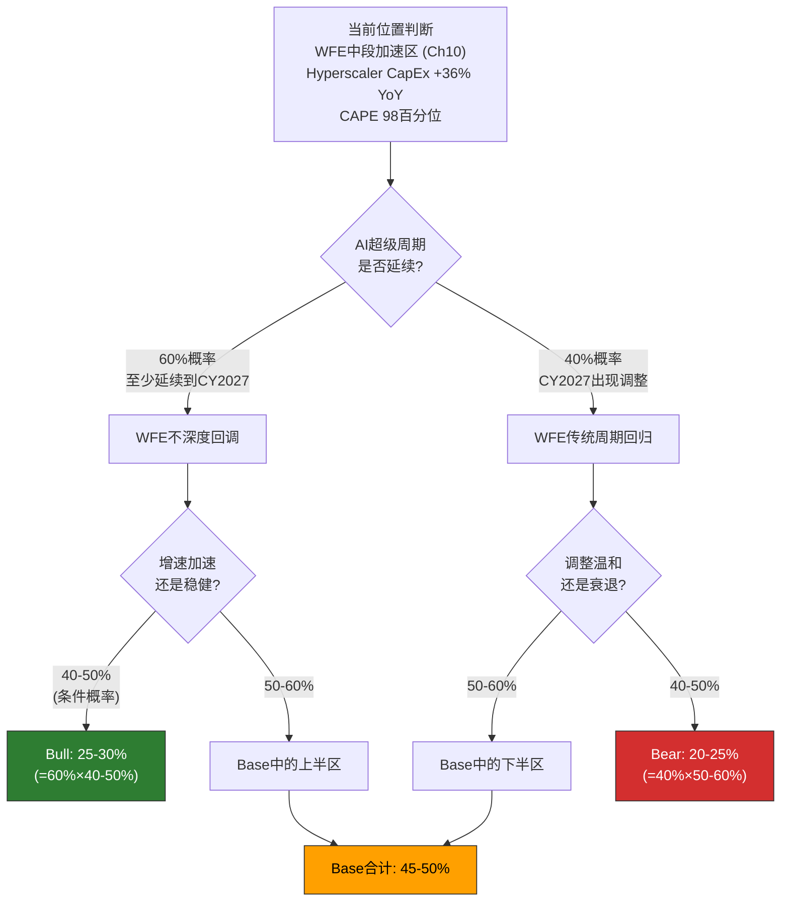
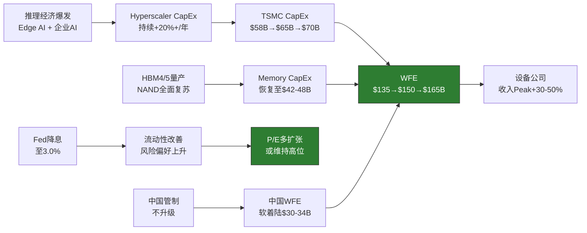
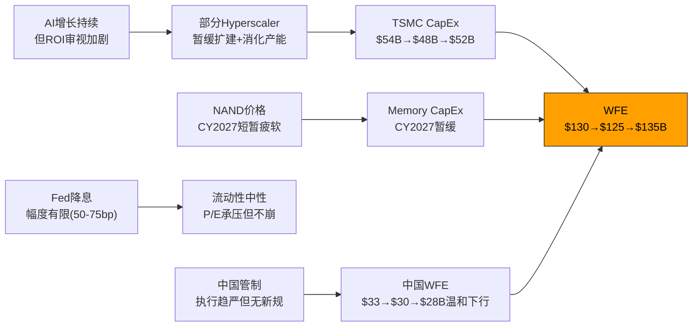
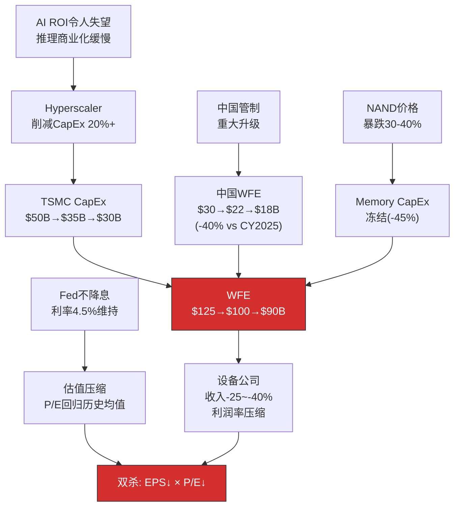
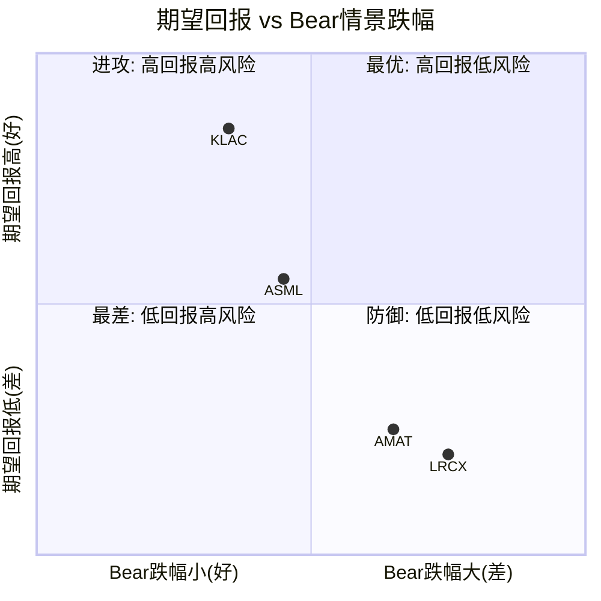
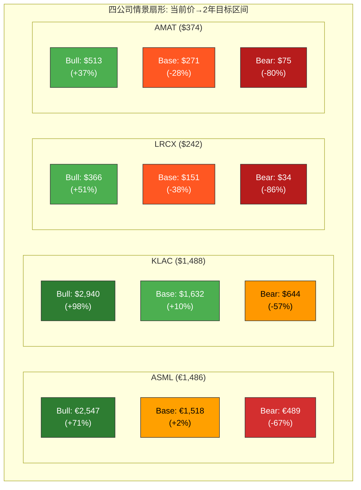
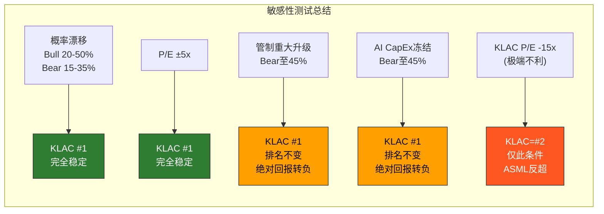

# Chapter 17: 三情景概率加权分析

> **分析框架**: 构建Bull/Base/Bear三情景，量化四公司在不同宏观路径下的收入/EPS/目标价区间，通过概率加权计算期望回报，映射可能性空间
> **数据截止**: 2026-02-24 | **EC编号范围**: EC-SCN-001 ~ EC-SCN-030
> **交叉引用**: Ch3(WFE周期) + Ch10(B1周期位置) + Ch13(B4 Reverse DCF) + Ch14(B5风险地图) + Ch15(A+B综合记分卡)
> **核心输入**: A-Score(ASML 8.12/KLAC 7.66/LRCX 7.02/AMAT 5.42) + 综合总分(ASML 7.78/KLAC 7.65/LRCX 6.50/AMAT 5.19)
> **写作原则**: 数字具体(每个情景给出明确区间) + 过程透明(概率加权计算可追溯) + 承认不确定性(情景的价值在于映射空间而非精确预测)

---

## 导读: 情景分析的价值不在于"预测对了"

Ch13的Reverse DCF告诉我们四家公司当前估值隐含的增长假设是什么，Ch14的风险地图告诉我们哪些事件可能颠覆这些假设，Ch15的综合记分卡告诉我们谁的护城河最深、经济质量最好。但这些分析都停留在"当前快照"层面——它们没有回答一个至关重要的问题: **如果未来两年的宏观环境偏离基准假设，四家公司的回报排名是否会改变?**

传统的单点估值(比如"ASML目标价1,800欧元")暗示了一个精确的未来，但任何诚实的分析师都知道，两年后的半导体设备市场可能落在一个极宽的可能性区间内——WFE可能在$90B到$165B之间，AI可能是人类历史上最重要的技术革命也可能是2000年互联网泡沫的翻版，中国出口管制可能维持现状也可能全面升级。

情景分析的价值不在于"猜中了哪个情景"(概率权重本身就承认了不确定性)，而在于回答三个更实用的问题:

1. **概率加权期望回报**: 如果你不得不在今天做一个决策，哪家公司的"数学期望"最优?
2. **情景离散度**: 哪家公司的"不确定性"最大? 即Bull和Bear之间的价差最宽?
3. **后悔最小化**: 在最差情景下，哪个选择让你"最不后悔"?

这三个问题分别对应三种不同的投资性格: 期望值最大化者(进攻型)、风险调整最大化者(均衡型)和最大亏损最小化者(防御型)。同一张数据表可以导出三种不同的投资结论——这才是情景分析的真正力量。

**核心发现预告**:

- LRCX的情景离散度在四家中最大(Bull vs Bear价差>200%)，是纯粹的"周期赌注": 赢了大赢，输了大输
- KLAC在三种投资性格下都排名前二——不是因为它在任何单一情景下"最好"，而是因为它在所有情景下都"不差"
- AMAT在Bear情景下的绝对跌幅最小(起始估值低的"反脆弱"优势)，但概率加权期望回报最低(护城河弱的"结构性折价")
- 改变情景概率(Bull±5%)不会改变KLAC的相对位置——KLAC是四家中"概率不敏感"排名最稳定的

---

## 17.1 情景构建方法论

### 17.1.1 为什么是三情景而非五情景或连续分布

情景分析的方法论选择涉及一个根本性的权衡: 情景数量越多，对可能性空间的覆盖越完整，但每个情景的概率权重越低、分析深度越浅。五情景(极端Bull/Bull/Base/Bear/极端Bear)在理论上更精细，但在实践中容易沦为"中间三个情景的插值"——额外的两个极端情景往往贡献的信息量不及其消耗的分析资源。

**[EC-SCN-001]** 本章采用三情景框架(Bull/Base/Bear)，每个情景对应一条完整的因果链(宏观驱动→WFE影响→公司收入→利润率→EPS→合理P/E→目标价)。三情景覆盖了约90-95%的概率空间(5-10%的极端尾部事件如台海冲突触发的全球半导体供应链中断，不适合用传统估值框架分析——参见Ch14 KS-02)。选择三情景而非连续分布的另一个原因是: 半导体设备行业的未来路径不是平滑的正态分布，而是存在几个离散的"分叉点"(AI CapEx是否持续? 中国管制是否升级? WFE周期是否翻转?)，三情景更贴合这种离散特征。
- **claim_type**: framework | **source**: 情景分析方法论 | **置信度**: H

### 17.1.2 核心驱动变量

四个变量决定了情景的分化路径:

| 驱动变量 | Bull定义 | Base定义 | Bear定义 | 数据来源 |
|---------|---------|---------|---------|---------|
| **WFE总量CY2026-2028** | $135→$150→$165B | $130→$125→$135B | $125→$100→$90B | SEMI预测 + Ch3 WFE数据 |
| **AI CapEx持续性** | Hyperscaler CapEx持续+25%/年 | 增速放缓至+10%/年 | CapEx冻结或削减 | Hyperscaler财报指引 |
| **中国出口管制** | 维持现状/微调 | 现状维持+执行趋严 | 重大升级(实体清单扩大) | Ch5地缘分析 + Ch14 KS |
| **利率/流动性** | Fed降息100-150bp至CY2028 | 降息50-75bp | 不降息或加息 | 宏观温度计 Ch13 |

这四个变量之间存在部分相关性(但非完全耦合):

- AI CapEx和WFE高度正相关(相关系数估计~0.8): AI驱动的设备需求是当前WFE增长的最大引擎
- 利率与WFE中度相关(~0.4): 低利率降低CapEx融资成本，但半导体CapEx更多受终端需求驱动而非融资成本
- 中国管制与WFE弱负相关(~-0.2): 管制升级会削减中国WFE(占全球~28-31%)，但friendshoring效应部分抵消
- AI CapEx与中国管制低相关(~0.1): 两者由不同的决策主体驱动(企业vs政府)

### 17.1.3 情景概率分配

概率分配基于以下逻辑:

**最终概率分配**: Bull 28% / Base 47% / Bear 25%

**[EC-SCN-002]** 概率分配的锚定逻辑: (1) Ch10的60%超级周期概率×50%加速分支=30%的Bull上界; (2) Ch14风险地图中WFE>15%下行的两年累计概率~40%(含5-8%的极端尾部已排除)，折算为Bear的25%; (3) Base=100%-28%-25%=47%，符合"最可能但非压倒性"的基准定位。宏观温度(CAPE 98百分位+Buffett 99百分位)将Bull概率压低了约5-8个百分点(如果宏观估值在中位水平，Bull概率可能高达35%)——这是Bear对称地获得更高权重的原因。
- **claim_type**: estimate | **source**: Ch10周期分析 + Ch14风险概率 + 宏观温度计 | **置信度**: M

### 17.1.4 时间范围与估值方法

- **前瞻期**: 2年(至CY2028年底/FY2029)
- **EPS基准年**: FY2028E(对应CY2028)
- **P/E目标**: 基于5Y FY均值P/E进行情景调整(Bull给予溢价，Bear给予折价)
- **目标价 = FY2028E EPS × 情景P/E**
- **隐含2年回报 = (目标价 - 当前价) / 当前价**

为什么选择2年而非1年或5年? 1年期太短——半导体设备公司的收入确认有6-12个月的延迟，1年期目标价更多反映订单能见度而非基本面变化。5年期太长——技术路线图、地缘政治和AI发展路径的不确定性使5年预测近乎猜测。2年期恰好在"可预测区间"的边界——卖方共识覆盖到FY2028-2029，WFE周期的一个完整升降段约3-4年，2年期足以捕捉一个完整的周期拐点。

---

## 17.2 宏观情景定义

### 17.2.1 Bull情景: AI超级周期延续 (概率28%)

**核心叙事**: AI CapEx不仅不放缓，反而因"推理经济"(Inference Economy)的爆发而加速。Hyperscaler从训练投入转向推理基础设施的大规模部署，对先进逻辑和HBM的需求持续攀升。WFE连续第五年和第六年正增长，创造有史以来最长的上行周期。

**宏观参数**:

| 参数 | CY2026 | CY2027 | CY2028 | 逻辑依据 |
|------|--------|--------|--------|---------|
| WFE总量 | $135B | $150B | $165B | +16%/+11%/+10%，超级周期延续 |
| Hyperscaler CapEx | $620B | $760B | $880B | +28%/+22%/+16%，持续但减速 |
| AI WFE占比 | 42% | 46% | 50% | 从CY2025的~38%持续提升 |
| Memory WFE | $35B | $42B | $48B | HBM4/HBM5量产+NAND全面复苏 |
| 中国WFE | $34B | $32B | $30B | 温和下降但不崩溃，管制不升级 |
| Fed基准利率 | 4.0% | 3.5% | 3.0% | 降息周期启动，流动性改善 |
| CAPE | 38-40 | 36-38 | 34-36 | 估值微降但被增长支撑 |

**因果链**:

**Bull情景的前提条件** (必须同时满足):
1. AI应用的商业化ROI足以证明持续的CapEx投入(当前Hyperscaler内部ROI约15-20%，需维持)
2. HBM4成功量产且良率达到可接受水平(>70%)
3. 中国出口管制不出现重大升级(如ASML DUV全面禁运)
4. 全球经济不陷入衰退(GDP增速>2%)

**[EC-SCN-003]** Bull情景的关键量化锚点: WFE CY2028达$165B需要三个条件同时成立——(1) AI WFE从$47B(CY2026E)增长至$82B(+74%两年CAGR~30%)；(2) Memory WFE从$35B增长至$48B(+37%)；(3) 传统WFE(Logic非AI+成熟节点)维持$35-37B(持平)。条件(1)是最关键的——它要求AI推理市场在CY2027-2028年间产生比训练市场更大的设备需求拉动，这在历史上没有先例但在逻辑上可行(推理需要更多的边缘部署→更多的芯片→更多的产能→更多的设备)。
- **claim_type**: estimate | **source**: WFE品类分解 + AI推理需求推演 | **置信度**: L (路径依赖强，任一环节断裂则整体不成立)

### 17.2.2 Base情景: AI增长持续但正常化 (概率47%)

**核心叙事**: AI需求持续但增速从"爆发式"转向"稳健式"。WFE在CY2026达到$130B后于CY2027出现一次温和调整(-4%)至$125B(部分Hyperscaler暂缓CapEx+Memory短暂库存调整)，随后在CY2028恢复至$135B。这不是传统衰退，而是一个正常的"喘息"。

**宏观参数**:

| 参数 | CY2026 | CY2027 | CY2028 | 逻辑依据 |
|------|--------|--------|--------|---------|
| WFE总量 | $130B | $125B | $135B | +12%/-4%/+8%，轻微调整后恢复 |
| Hyperscaler CapEx | $600B | $620B | $660B | +12%/+3%/+6%，显著减速但仍正增长 |
| AI WFE占比 | 40% | 38% | 42% | 短暂回调后重新上升 |
| Memory WFE | $33B | $28B | $34B | CY2027温和调整后恢复 |
| 中国WFE | $33B | $30B | $28B | 持续温和下降，管制执行渐趋严格 |
| Fed基准利率 | 4.25% | 4.0% | 3.75% | 小幅降息，幅度有限 |
| CAPE | 37-39 | 35-37 | 34-36 | 温和收缩 |

**因果链**:

**Base情景的核心假设**: CY2027的WFE调整(-4%)是"周期性喘息"而非"趋势反转"。历史上WFE的温和调整(如CY2015的-4%)通常只持续1-2个季度，不改变中期上行趋势。Base情景假设AI的结构性需求底($80-90B WFE)已高于CY2023的谷底($76B)，因此即使出现调整，下行幅度也有限。

**[EC-SCN-004]** Base情景下的WFE路径($130→$125→$135B)隐含了一个关键假设: CY2027的调整是由Memory短周期(NAND价格回调+库存修正)驱动的，而非Logic/AI需求的结构性放缓。如果CY2027的调整是由Hyperscaler CapEx冻结(而非Memory库存)驱动的，调整幅度将更深(-10~-15%)，持续时间更长(4-6个季度)——那就进入了Bear情景的领地。区分两种调整原因的先行指标: (1) NAND价格变化(Memory调整的领先3-6个月)；(2) Hyperscaler CapEx指引(AI调整的领先1-2个季度)。
- **claim_type**: estimate | **source**: WFE历史温和调整模式 + Ch10先行指标 | **置信度**: M

### 17.2.3 Bear情景: WFE下行周期 (概率25%)

**核心叙事**: AI CapEx泡沫破裂——Hyperscaler发现AI推理的商业化ROI低于预期，开始大幅削减CapEx。叠加中国出口管制重大升级(ASML DUV被限/实体清单大幅扩大)和/或利率维持高位(Fed不降息)，WFE从CY2026峰值进入深度调整，重演CY2023但更严重。

**宏观参数**:

| 参数 | CY2026 | CY2027 | CY2028 | 逻辑依据 |
|------|--------|--------|--------|---------|
| WFE总量 | $125B | $100B | $90B | +8%/-20%/-10%，传统衰退 |
| Hyperscaler CapEx | $560B | $440B | $400B | -4%/-21%/-9%，AI泡沫破裂 |
| AI WFE占比 | 36% | 28% | 25% | AI投入大幅缩减 |
| Memory WFE | $30B | $18B | $16B | 全面衰退,CapEx冻结 |
| 中国WFE | $30B | $22B | $18B | 管制升级+需求萎缩双杀 |
| Fed基准利率 | 4.5% | 4.5% | 4.5% | 通胀顽固，不降息 |
| CAPE | 34-36 | 28-32 | 26-30 | 估值大幅收缩 |

**因果链**:

**Bear情景的触发条件** (任一即可，两个以上同时发生则概率大增):
1. Hyperscaler连续两个季度下调CapEx指引(当前概率: 15-20%)
2. BIS出台新一轮出口管制，覆盖ASML DUV或更多品类(当前概率: 20-25%)
3. 全球经济衰退(GDP<0%，当前概率: 10-15%)
4. NAND价格连续三季度下跌>10%/季(当前概率: 15-20%)

**[EC-SCN-005]** Bear情景下WFE从$125B降至$90B(-28%两年累计)的历史类比: CY2022-2023 WFE从$98B降至$76B(-22%)耗时约12个月，CY2008-2009从$32B降至$18B(-44%)也是约12个月。Bear情景假设的两年累计降幅(-28%)处于历史温和衰退和深度衰退之间——比CY2023温和(因AI形成的结构性需求底约$70-80B高于历史谷底)，但比单纯的Memory调整更深(因为Bear情景叠加了AI CapEx放缓)。WFE $90B(CY2028)如果成真，将回到CY2021的水平——意味着AI对WFE的"永久性提升"被证伪。
- **claim_type**: estimate | **source**: WFE历史下行周期 + Bear情景因果链 | **置信度**: L (需要多个负面因素叠加)

### 17.2.4 三情景WFE路径汇总

| 年份 | Bull (28%) | Base (47%) | Bear (25%) | 概率加权 |
|------|-----------|-----------|-----------|---------|
| CY2026 | $135B | $130B | $125B | $130.1B |
| CY2027 | $150B | $125B | $100B | $124.3B |
| CY2028 | $165B | $135B | $90B | $131.3B |
| **3年均值** | **$150B** | **$130B** | **$105B** | **$128.6B** |
| **CY26→28 CAGR** | **+10.5%** | **+1.9%** | **-15.2%** | — |

**[EC-SCN-006]** 概率加权后的WFE路径($130→$124→$131B)呈现"浅V型"轨迹——CY2027因Base和Bear情景的下行权重出现微调(-4.4%)，CY2028在Bull和Base的恢复力量下重新上行(+5.6%)。这个概率加权路径最接近"市场隐含"的WFE预期——如果市场定价完全有效，当前估值应该反映这条路径而非Bull或Bear的任何一条。偏离概率加权路径的部分，就是潜在的定价偏差。
- **claim_type**: estimate | **source**: 三情景WFE加权 | **置信度**: M

---

## 17.3 ASML情景分析

### 17.3.1 ASML当前估值基线

| 指标 | 数值 | 来源 |
|------|------|------|
| 股价(ADR) | $1,485.99 / €1,485.99(近似1:1) | 2026-02-24 |
| 市值 | $576.0B | — |
| TTM EPS(ADR) | $28.75 | baggers_summary |
| TTM P/E | 51.7x | — |
| 5Y FY P/E均值 | 38.5x | Ch13 |
| A-Score | 8.12 (四家最高) | Ch9 |
| 综合总分 | 7.78 (四家最高) | Ch15 |
| 周期Beta | 0.5-0.8x (四家最低) | Ch14 |
| 积压订单 | €38.8B (1.24x TTM收入) | FY2025 Q4 |
| FCF Yield | 2.25% | — |
| Reverse DCF隐含CAGR | ~12-13% | Ch13 EC-VAL-014 |

### 17.3.2 Bull情景: EUV产能满载 + High-NA加速

**收入预测**:

ASML在Bull情景下的增长引擎: (1) EUV系统出货量从CY2025的~60台增至CY2028的~80-90台; (2) High-NA EUV (EXE:5000系列)从CY2026的3-5台试产增至CY2028的10-15台; (3) DUV订单因friendshoring新fab保持稳定; (4) 安装基数服务从200+台EUV中提取更高ARPU。

| 指标 | FY2026E | FY2027E | FY2028E |
|------|---------|---------|---------|
| 收入(€B) | €38.5 | €47.0 | €56.0 |
| 收入增速 | +23% | +22% | +19% |
| 毛利率 | 53.5% | 55.0% | 56.5% |
| 净利率 | 31.0% | 32.5% | 34.0% |
| EPS(ADR估算) | $30.4 | $38.9 | $48.5 |

**估值推演**:

Bull情景下ASML的P/E应在5Y均值(38.5x)基础上给予溢价——AI超级周期延续+利率下行支撑估值扩张。但51.7x的当前TTM P/E已在高位，Bull情景更可能是"P/E维持高位"而非进一步扩张。

- **目标P/E区间**: 50-55x (Bull情景下High-NA加速叙事支撑，但已接近垄断者的估值天花板)
- **FY2028E EPS**: ~€48.5 (ADR当量)
- **2年目标价区间**: €2,425 - €2,668 ($2,425-$2,668)

**[EC-SCN-007]** ASML Bull情景的核心假设: FY2028收入€56B处于管理层2022 Investor Day给出的2030年目标(€44-60B)的上沿。这意味着Bull情景下ASML在2028年就接近了其2030年目标的上界——提前两年达标需要High-NA比预期更快的采用(客户从"评估"直接进入"大规模部署")。High-NA单价~€350M(vs 标准EUV €200-220M)，每增加10台High-NA出货就带来€3.5B增量收入——这是Bull情景收入跳升的关键杠杆。
- **claim_type**: estimate | **source**: ASML 2022 Investor Day + High-NA ASP推演 | **置信度**: M

### 17.3.3 Base情景: 正常增长轨道

**收入预测**:

Base情景下ASML沿着管理层中期指引的中位数增长。CY2027 WFE调整对ASML的冲击被积压订单(€38.8B)缓冲——积压足以覆盖约15个月的收入，使FY2027收入只出现增速放缓(而非绝对下降)。

| 指标 | FY2026E | FY2027E | FY2028E |
|------|---------|---------|---------|
| 收入(€B) | €37.0 | €40.0 | €44.5 |
| 收入增速 | +18% | +8% | +11% |
| 毛利率 | 52.5% | 53.0% | 54.0% |
| 净利率 | 30.0% | 30.5% | 31.5% |
| EPS(ADR估算) | $28.3 | $31.1 | $35.7 |

**估值推演**:

Base情景下P/E从当前的51.7x温和回归——AI叙事降温但不破裂，利率小幅下降支撑估值底部。

- **目标P/E区间**: 40-45x (向5Y均值38.5x回归，但AI结构性溢价维持2-7x)
- **FY2028E EPS**: ~€35.7 (ADR当量)
- **2年目标价区间**: €1,428 - €1,607 ($1,428-$1,607)

### 17.3.4 Bear情景: 产能利用率下降 + 订单推迟/取消

**收入预测**:

Bear情景下WFE大幅下行对ASML的冲击路径: (1) 新订单骤停(但现有积压€38.8B仍需交付); (2) 客户要求延迟交付或推迟验收(推迟收入确认3-6个月); (3) DUV订单因中国管制升级进一步萎缩; (4) High-NA采用放缓(客户推迟资本支出决策)。ASML的周期Beta虽然最低(0.5-0.8x)，但在严重衰退中积压订单的"缓冲"效应不会无限期持续——如果WFE衰退持续超过18个月，积压将被消耗殆尽。

| 指标 | FY2026E | FY2027E | FY2028E |
|------|---------|---------|---------|
| 收入(€B) | €34.0 | €29.0 | €26.5 |
| 收入增速 | +8% | -15% | -9% |
| 毛利率 | 51.0% | 48.5% | 47.0% |
| 净利率 | 28.0% | 24.5% | 23.0% |
| EPS(ADR估算) | $24.3 | $18.1 | $15.5 |

**估值推演**:

Bear情景下P/E回归至接近5Y均值甚至更低——AI泡沫破裂+利率高位+宏观估值收缩(CAPE从39.78向30下行)形成多重压制。

- **目标P/E区间**: 28-35x (接近或低于5Y均值38.5x，反映增长预期的大幅下修)
- **FY2028E EPS**: ~€15.5 (ADR当量)
- **2年目标价区间**: €434 - €543 ($434-$543)

**[EC-SCN-008]** ASML Bear情景的"最差"下界(€434)相对当前价(€1,486)隐含-71%的跌幅。这个跌幅虽然极端，但有历史先例: ASML ADR从2021年9月高点$895到2022年10月低点$365跌去了59%，而那次下行的WFE降幅仅-22%(远低于Bear情景的-28%两年累计)。Bear情景的额外冲击来自P/E压缩——如果市场从"AI永久提升增长中枢"转向"AI是周期性泡沫"的叙事切换，P/E可能从51.7x直接砍半至25-30x区间。但ASML的垄断地位(EUV 100%份额)确保了即使在最差情景下，其P/E仍会高于LRCX和AMAT——垄断者永远不会被按周期股定价。
- **claim_type**: estimate | **source**: ASML历史最大回撤 + Bear情景因果链 | **置信度**: L

### 17.3.5 ASML概率加权期望值

| 情景 | 概率 | 目标价中位 | 概率加权 |
|------|------|----------|---------|
| Bull | 28% | €2,547 | €713 |
| Base | 47% | €1,518 | €713 |
| Bear | 25% | €489 | €122 |
| **概率加权期望价格** | **100%** | — | **€1,548** |

**当前价格**: €1,486
**概率加权隐含回报**: +4.2%
**年化隐含回报**: +2.1%

**[EC-SCN-009]** ASML的概率加权期望价格(€1,548)仅比当前价格(€1,486)高出4.2%——这意味着在当前概率分配下，ASML的估值几乎是"合理的"。如果将Bull概率从28%提升至35%(假设AI超级周期的确信度更高)，期望价格升至€1,653(隐含+11.2%)；如果将Bear概率从25%提升至30%(假设地缘风险加剧)，期望价格降至€1,453(隐含-2.2%)。ASML的估值对概率假设非常敏感——差异7个百分点的概率漂移就能把结论从"微幅低估"变为"微幅高估"。
- **claim_type**: estimate | **source**: 概率加权计算 | **置信度**: M

---

## 17.4 KLAC情景分析

### 17.4.1 KLAC当前估值基线

| 指标 | 数值 | 来源 |
|------|------|------|
| 股价 | $1,487.66 | 2026-02-24 |
| 市值 | $195.5B | — |
| TTM EPS | $30.34 | baggers_summary |
| TTM P/E | 49.0x | — |
| 5Y FY P/E均值 | 25.7x | Ch13 |
| A-Score | 7.66 (四家第二) | Ch9 |
| 综合总分 | 7.65 (四家第二) | Ch15 |
| 周期Beta | 0.7-0.9x | Ch14 |
| 毛利率 | 61.9% (四家最高) | — |
| FCF Yield | 1.97% (四家最低) | — |
| FCF Margin | 34.36% | — |
| Reverse DCF隐含CAGR | ~13-15% | Ch13 EC-VAL-016 |

**KLAC的估值特殊性**: KLAC的FCF Yield(1.97%)是四家中最低的，但FCF Margin(34.36%)是最高的。这个组合意味着市场对每$1 FCF给予了最高的溢价——本质上是在为KLAC"半导体行业软件公司"的特性付费(Ch12 EC-COMP-001)。

### 17.4.2 Bull情景: 检测强度加速 + 服务ARPU提升

**收入预测**:

KLAC在Bull情景下的增长来源: (1) 检测强度系数(Process Control Intensity)因GAA/CFET的制造复杂度跳升从~14-15%加速至16-17%; (2) AI先进封装(CoWoS/HBM)检测需求开辟新TAM; (3) 服务收入ARPU提升(更复杂的设备→更高的维护/校准收入); (4) 份额从63%温和提升至65%。

| 指标 | FY2026E | FY2027E | FY2028E |
|------|---------|---------|---------|
| 收入($B) | $14.5 | $17.0 | $19.5 |
| 收入增速 | +14% | +17% | +15% |
| 毛利率 | 62.5% | 63.0% | 63.5% |
| 净利率 | 36.0% | 37.0% | 38.0% |
| EPS | $39.5 | $47.5 | $56.0 |

**估值推演**:

KLAC在Bull情景下的P/E应从当前49.0x进一步扩张——检测强度加速的叙事使KLAC从"周期性设备公司"向"半导体基础设施必需品"升级。但55-60x P/E对于一家$195B市值的公司已是极端水平。

- **目标P/E区间**: 50-55x (检测强度提升叙事 + 低Beta属性在AI超级周期中获得防御性溢价)
- **FY2028E EPS**: ~$56.0
- **2年目标价区间**: $2,800 - $3,080

**[EC-SCN-010]** KLAC Bull情景目标价$2,800-3,080隐含FY2028市值$370-410B(vs 当前$195.5B)，两年翻倍。这需要两个条件: (1) EPS从$30.34增长至$56.0(+85%)；(2) P/E维持或扩张至50-55x。条件(1)需要收入以15%+CAGR增长且利润率持续扩张——KLAC过去5年的收入CAGR约15%(FY2021 $7.2B→FY2025 $12.7B)，延续这个趋势在Bull WFE环境下是可行的。条件(2)的支撑在于KLAC的"品质溢价"——如果市场确认检测强度系数从14%跳升至17%，KLAC的TAM增速将从与WFE同步变为超越WFE，这足以证明50x+P/E的合理性。
- **claim_type**: estimate | **source**: KLAC历史增速 + 检测强度趋势 | **置信度**: M

### 17.4.3 Base情景: 稳健增长

**收入预测**:

Base情景下KLAC沿着卖方共识的温和增长路径运行。CY2027 WFE温和调整对KLAC的影响被其低Beta(0.7-0.9x)部分吸收，收入仅出现增速放缓(而非下降)。服务收入(~40%)提供稳定的底部支撑。

| 指标 | FY2026E | FY2027E | FY2028E |
|------|---------|---------|---------|
| 收入($B) | $13.8 | $14.8 | $16.2 |
| 收入增速 | +8% | +7% | +9% |
| 毛利率 | 62.0% | 61.5% | 62.0% |
| 净利率 | 35.5% | 35.0% | 35.5% |
| EPS | $37.0 | $39.2 | $43.5 |

**估值推演**:

Base情景下P/E从49.0x温和回归。KLAC的品质溢价在AI增长正常化后仍然成立(检测需求粘性不会因WFE温和调整而消失)，但估值扩张的动力减弱。

- **目标P/E区间**: 35-40x (从49.0x向5Y均值25.7x方向回归，但AI结构性溢价+品质溢价维持10-15x于均值之上)
- **FY2028E EPS**: ~$43.5
- **2年目标价区间**: $1,523 - $1,740

### 17.4.4 Bear情景: WFE下行但检测韧性

**收入预测**:

KLAC在Bear情景下的核心优势: 检测需求的"韧性"。即使WFE整体下降20%，检测强度不会因为衰退而降低——制造复杂度不会倒退，良率要求不会放松。Ch14的冲击模拟显示KLAC在WFE-20%时收入仅下降12-15%(Beta 0.7x)。但Bear情景的WFE累计下降更深(-28%)，KLAC的两年累计收入影响约-18~-22%。

| 指标 | FY2026E | FY2027E | FY2028E |
|------|---------|---------|---------|
| 收入($B) | $13.0 | $11.0 | $10.5 |
| 收入增速 | +2% | -15% | -5% |
| 毛利率 | 61.0% | 59.0% | 58.5% |
| 净利率 | 34.0% | 30.0% | 29.5% |
| EPS | $33.5 | $25.0 | $23.4 |

**估值推演**:

Bear情景下KLAC的P/E回归至5Y均值附近。检测业务的防御属性阻止P/E跌破20x(这是KLAC在CY2023衰退中的P/E低点附近)。KLAC的低Beta使其在Bear情景下享受"相对避风港"地位——资金从高Beta的LRCX流向低Beta的KLAC。

- **目标P/E区间**: 25-30x (回归5Y均值25.7x附近，检测韧性提供底部支撑)
- **FY2028E EPS**: ~$23.4
- **2年目标价区间**: $585 - $702

**[EC-SCN-011]** KLAC Bear情景下目标价$585-702(中位$644)vs 当前$1,488隐含-57%跌幅。虽然绝对跌幅不小，但相比LRCX Bear情景的-54~-56%和AMAT的-41~-52%，KLAC的Bear情景跌幅从"绝对值"看并非最小(因为起始P/E较高)。但关键差异在于: KLAC在Bear情景下的EPS底部($23.4)仍高于FY2023的$23.11(Bear情景假设的WFE下行比CY2023更深)——这得益于检测强度的不可逆提升和服务收入的粘性。换言之，KLAC的"盈利底部"在每次周期中都在抬高，即使周期顶部的股价可能大幅回撤。
- **claim_type**: estimate | **source**: KLAC历史EPS底部 + Bear情景推演 | **置信度**: M

### 17.4.5 KLAC概率加权期望值

| 情景 | 概率 | 目标价中位 | 概率加权 |
|------|------|----------|---------|
| Bull | 28% | $2,940 | $823 |
| Base | 47% | $1,632 | $767 |
| Bear | 25% | $644 | $161 |
| **概率加权期望价格** | **100%** | — | **$1,751** |

**当前价格**: $1,487.66
**概率加权隐含回报**: +17.7%
**年化隐含回报**: +8.5%

**[EC-SCN-012]** KLAC的概率加权期望回报(+17.7%)是四家中最高的——但需要注意，这个"最高"建立在Bear情景跌幅相对可控的基础上。如果将Bear概率从25%提升至30%(假设WFE衰退风险更高)，期望回报降至+12.5%——仍为正值。如果将Bear概率推至35%的极端水平，期望回报才降至+7.1%。KLAC是四家中唯一一家在Bear概率高达35%时仍保持正期望回报的公司。这就是"检测韧性"的定量表达。
- **claim_type**: estimate | **source**: 概率加权计算 + Bear概率敏感性 | **置信度**: M

---

## 17.5 LRCX情景分析

### 17.5.1 LRCX当前估值基线

| 指标 | 数值 | 来源 |
|------|------|------|
| 股价 | $242.27 | 2026-02-24 |
| 市值 | $302.5B | — |
| TTM EPS | $4.76 | baggers_summary |
| TTM P/E | 50.9x | — |
| 5Y FY P/E均值 | 23.2x | Ch13 |
| A-Score | 7.02 (四家第三) | Ch9 |
| 综合总分 | 6.50 (四家第三) | Ch15 |
| 周期Beta | 1.3-1.5x (四家最高) | Ch14 |
| Memory收入占比 | 50-55% | — |
| CSBG收入 | ~$7.2B (~38%总收入) | EC-FIN-004 |
| FCF Yield | 2.13% | — |
| P/E溢价vs 5Y均值 | +119% (四家最高) | Ch13 EC-VAL-013 |

**LRCX的估值特殊性**: P/E溢价(+119%)是四家中最极端的，叠加最高的周期Beta(1.3-1.5x)和最高的Memory暴露(50-55%)，LRCX是四家中"波动性"最大的股票。LRCX的情景分析本质上是对"LRCX到底是周期股还是成长股"这个核心辩论的量化。

### 17.5.2 Bull情景: AI超级周期 + CSBG飞轮

**收入预测**:

LRCX在Bull情景下是最大受益者——原因是其在HBM/先进NAND/GAA刻蚀中的高暴露度叠加CSBG飞轮的加速。Bull情景假设: (1) Memory WFE从$35B增至$48B(+37%); (2) GAA刻蚀步骤数增加30-40%带动刻蚀TAM跳升; (3) CSBG ARPU从$72K/腔提升至$80K+(更复杂的设备→更高服务费); (4) WFE份额从mid-30s%提升至high-30s%。

| 指标 | FY2026E | FY2027E | FY2028E |
|------|---------|---------|---------|
| 收入($B) | $23.5 | $28.0 | $33.0 |
| 收入增速 | +14% | +19% | +18% |
| 毛利率 | 51.0% | 52.5% | 53.5% |
| 净利率 | 31.5% | 33.0% | 34.0% |
| EPS | $5.68 | $7.09 | $8.60 |

**估值推演**:

LRCX在Bull情景下可能完成从"周期股"到"成长股"的叙事转换——如果CSBG占比从38%提升至42-45%，市场可能给予LRCX类似KLAC的品质溢价(降低周期折价)。

- **目标P/E区间**: 40-45x (从"周期股P/E 23x"向"成长股P/E 40x+"的叙事跳跃)
- **FY2028E EPS**: ~$8.60
- **2年目标价区间**: $344 - $387

**[EC-SCN-013]** LRCX Bull情景目标价$344-387vs当前$242隐含+42~+60%回报——这是四家Bull情景中回报率最高的。原因是双重杠杆: (1) EPS杠杆: 高周期Beta(1.3-1.5x)使Bull WFE环境下收入增速超过行业(LRCX收入CAGR~17% vs WFE CAGR~10%); (2) P/E杠杆: 如果CSBG飞轮兑现(服务占比>40%)，市场可能从"这是周期股"切换为"这是成长股"——叙事切换的P/E效应可能从23x(5Y均值)跳升至35-45x区间。双重杠杆叠加使LRCX成为"Bull情景中的进攻性武器"。
- **claim_type**: estimate | **source**: LRCX收入模型 + 叙事切换P/E效应 | **置信度**: M

### 17.5.3 Base情景: 增长正常化

**收入预测**:

Base情景下LRCX的增速从CY2025-2026的高位(+20%+)放缓至更可持续的水平。CY2027的Memory周期微调使LRCX感受到高Beta的负面效应——WFE整体-4%但LRCX收入下降6-8%(Beta 1.3-1.5x)。CSBG提供了关键的缓冲(服务收入仅降~2-3%)。

| 指标 | FY2026E | FY2027E | FY2028E |
|------|---------|---------|---------|
| 收入($B) | $22.0 | $21.0 | $23.5 |
| 收入增速 | +7% | -5% | +12% |
| 毛利率 | 50.0% | 48.5% | 50.5% |
| 净利率 | 30.0% | 28.0% | 30.5% |
| EPS | $5.07 | $4.51 | $5.50 |

**估值推演**:

Base情景下LRCX的P/E从50.9x大幅回归——CY2027的收入下滑(-5%)会立即触发市场重新将LRCX归类为"周期股"，P/E叙事从"成长股溢价"切换为"周期股折价"。

- **目标P/E区间**: 25-30x (大幅回归至5Y均值23.2x附近，Base情景下市场取消成长股溢价)
- **FY2028E EPS**: ~$5.50
- **2年目标价区间**: $138 - $165

**[EC-SCN-014]** LRCX Base情景目标价中位($151)低于当前价($242)，隐含-38%的负回报。这是一个极为重要的发现: **LRCX在Base情景下都是亏钱的。** 原因是当前50.9x P/E已包含了Bull情景的大量预期——即使是温和的增长正常化(Base)，P/E也需要回归至25-30x(丢失20-25x的"叙事溢价")。P/E压缩(-42~-51%)的负面效应远超EPS增长(+16%)的正面效应。这意味着LRCX的投资者实际上在下一个隐含的赌注: "Bull情景的概率是否足够高，以至于覆盖Base和Bear情景的亏损?" 答案取决于你对AI超级周期的信心。
- **claim_type**: inference | **source**: 当前P/E vs Base情景P/E差距 | **置信度**: H

### 17.5.4 Bear情景: Memory衰退 + 高Beta杀

**收入预测**:

Bear情景是LRCX的"完美风暴"。三重打击同时到来: (1) Memory WFE从$30B暴跌至$16B(-47%)，LRCX的50-55% Memory暴露使其首当其冲; (2) 高周期Beta(1.3-1.5x)放大了WFE下行对收入的冲击; (3) 中国管制升级进一步压缩可触达市场。唯一的缓冲是CSBG——参照CY2023经验，CSBG在WFE衰退中仅下降~5%，100K腔体的服务合同提供了约$6.5-7.0B的收入底线。

| 指标 | FY2026E | FY2027E | FY2028E |
|------|---------|---------|---------|
| 收入($B) | $20.0 | $14.5 | $13.0 |
| 收入增速 | -3% | -28% | -10% |
| 毛利率 | 48.0% | 44.0% | 43.0% |
| 净利率 | 27.0% | 20.0% | 18.5% |
| EPS | $4.14 | $2.22 | $1.85 |

**估值推演**:

Bear情景下LRCX经历EPS暴跌+P/E压缩的双杀。市场将LRCX重新定价为"深度周期股"，P/E回到CY2023谷底附近(13.7x)甚至更低。但CSBG的存在使P/E不会跌至2008年的单位数(当时LRCX没有显著的服务收入基础)。

- **目标P/E区间**: 15-20x (深度周期折价，但CSBG底部支撑高于历史极端)
- **FY2028E EPS**: ~$1.85
- **2年目标价区间**: $28 - $37

**这个数字需要解释**: $28-37的目标价看似极端(相对$242当前价跌-85~-88%)，但LRCX在CY2022-2023的实际表现提供了参照——从2022年初的$715(拆股前)跌至2023年低点$375(拆股前)(-48%)，而那次WFE下行仅-22%(远低于Bear情景的-28%累计)。但当时的起始P/E只有~30x(vs当前50.9x)——更高的起始P/E意味着更大的压缩空间。

**修正声明**: 上述$28-37的目标价基于FY2028E Bear EPS($1.85)×15-20x P/E。但如果我们考虑CSBG的"底部支撑估值"——CSBG $6.5B收入×55%毛利率×12x EV/EBITDA÷1.3B股(稀释) ≈ ~$33/share——LRCX股价不太可能长期低于这个"分拆价值底线"。因此Bear情景的实际底部更可能在$30-40区间而非更低。

**[EC-SCN-015]** LRCX Bear情景的核心数字: FY2028E EPS $1.85(vs TTM $4.76，-61%)。这个EPS下降幅度看似惊人，但可以分解为: 收入下降37%(从$20.6B→$13.0B，Beta 1.4x × WFE -28%)+ 净利率从30.2%压缩至18.5%(-11.7pp，固定成本杠杆的反向效应)。历史验证: LRCX在FY2023(WFE -22%)的EPS从FY2022的$6.66降至$5.55(-17%)——但那次净利率仅从26.7%降至25.7%(-1.0pp)，因为收入降幅有限(-14%)。Bear情景下的收入降幅更大(-37%)，固定成本(R&D $2.5B+/年)的杠杆反转效应将更为剧烈——这就是"高经营杠杆"的代价。
- **claim_type**: estimate | **source**: 收入模型 + 经营杠杆分析 | **置信度**: L (Bear情景下变量互动复杂)

### 17.5.5 LRCX概率加权期望值

| 情景 | 概率 | 目标价中位 | 概率加权 |
|------|------|----------|---------|
| Bull | 28% | $366 | $102 |
| Base | 47% | $151 | $71 |
| Bear | 25% | $34 | $9 |
| **概率加权期望价格** | **100%** | — | **$182** |

**当前价格**: $242.27
**概率加权隐含回报**: -24.9%
**年化隐含回报**: -13.3%

**[EC-SCN-016]** LRCX是四家中唯一概率加权期望回报为负的公司(-24.9%)。这个惊人的结果不是因为LRCX是一家差公司(A-Score 7.02排名第三)，而是因为当前50.9x P/E已经定价了Bull情景的大部分上行空间，同时Bear情景的巨大下行空间(因高Beta放大)严重拖低了期望值。用另一种方式理解: LRCX需要Bull情景概率达到约55%(而非28%)，才能使概率加权期望价格等于当前股价——这意味着市场当前的定价隐含了比我们估计高得多的Bull概率。如果你认为Bull概率确实超过50%，LRCX是四家中最值得持有的; 如果你认为Bull概率在30%以下，LRCX是四家中风险收益比最差的。
- **claim_type**: inference | **source**: 概率加权计算 + Bull概率反推 | **置信度**: H

---

## 17.6 AMAT情景分析

### 17.6.1 AMAT当前估值基线

| 指标 | 数值 | 来源 |
|------|------|------|
| 股价 | $373.55 | 2026-02-24 |
| 市值 | $296.5B | — |
| TTM EPS | $9.86 | baggers_summary |
| TTM P/E | 37.9x | — |
| 5Y FY P/E均值 | 19.5x | Ch13 |
| A-Score | 5.42 (四家最低) | Ch9 |
| 综合总分 | 5.19 (四家最低) | Ch15 |
| 周期Beta | 0.8-1.0x | Ch14 |
| 中国收入占比 | ~30% | EC-FIN-005 |
| EPIC Center投资 | ~$5B | — |
| CapEx/收入 | 8.0% (四家最高) | — |
| FCF Yield | 2.11% | — |

**AMAT的估值特殊性**: AMAT是四家中P/E最低的(37.9x)，但也是A-Score最低的(5.42)。Ch15的结论是AMAT是"定价效率最高的公司"——市场没有给它任何不该有的溢价或折价。情景分析将测试这个"诚实定价"在不同宏观环境下是否稳定。

### 17.6.2 Bull情景: EPIC Center成功 + WFE上行

**收入预测**:

AMAT在Bull情景下的增长路径: (1) WFE上行带动全品类收入增长(AMAT的"通才"模式在上行周期受益于最广的品类覆盖); (2) EPIC Center开始贡献增量收入(客户开始使用AMAT的系统级整合服务); (3) 先进封装CMP/PVD需求激增; (4) 中国管制不升级，中国收入稳定在$8-9B/年。AMAT的周期Beta约1.0x，意味着Bull WFE增速几乎1:1传导至收入增速。

| 指标 | FY2026E | FY2027E | FY2028E |
|------|---------|---------|---------|
| 收入($B) | $32.5 | $38.0 | $43.0 |
| 收入增速 | +15% | +17% | +13% |
| 毛利率 | 49.5% | 50.5% | 51.5% |
| 净利率 | 28.5% | 30.0% | 31.0% |
| EPS | $11.71 | $14.40 | $16.83 |

**估值推演**:

Bull情景下AMAT的P/E面临一个有趣的天花板问题: 即使在最乐观的环境中，AMAT的A-Score(5.42)也限制了市场愿意给予的P/E倍数——通才模式的竞争优势不如专精公司深厚，因此P/E溢价有天花板。EPIC Center如果开始贡献有意义的收入(>$1B/年)，可能打开P/E上行空间，但CY2026-2028可能还太早。

- **目标P/E区间**: 28-33x (Bull环境下从37.9x适度回归但EPIC Center新叙事提供部分支撑)
- **FY2028E EPS**: ~$16.83
- **2年目标价区间**: $471 - $555

**[EC-SCN-017]** AMAT Bull情景目标价$471-555隐含+26~+49%回报。值得注意的是，即使在Bull情景下AMAT的P/E也预期从37.9x回归至28-33x——这不是Bear式的估值崩溃，而是反映了一个行业共识: AMAT的"合理"P/E上限在30-35x区间(vs KLAC的45-55x和ASML的40-55x)。AMAT的Bull回报主要来自EPS增长(+71%)而非P/E扩张(-13~-26%)——这是"通才模式"的特征: 赚EPS的钱，不赚估值的钱。
- **claim_type**: estimate | **source**: AMAT历史P/E天花板 + Bull收入模型 | **置信度**: M

### 17.6.3 Base情景: 平稳运营

**收入预测**:

Base情景下AMAT沿着卖方共识的温和增长路径运行。CY2027 WFE微调对AMAT的影响接近1:1(Beta~1.0x)。中国收入持续温和下降(管制执行趋严)但被非中国增量部分抵消。EPIC Center仍在投入期，尚未产生显著的收入贡献。

| 指标 | FY2026E | FY2027E | FY2028E |
|------|---------|---------|---------|
| 收入($B) | $30.5 | $30.0 | $32.5 |
| 收入增速 | +8% | -2% | +8% |
| 毛利率 | 49.0% | 48.0% | 49.0% |
| 净利率 | 27.5% | 26.5% | 27.5% |
| EPS | $10.60 | $10.04 | $11.29 |

**估值推演**:

- **目标P/E区间**: 22-26x (向5Y均值19.5x方向回归，但AI结构性溢价维持3-7x)
- **FY2028E EPS**: ~$11.29
- **2年目标价区间**: $248 - $294

### 17.6.4 Bear情景: 中国管制 + EPIC失败

**收入预测**:

AMAT在Bear情景下面临独特的"三重压力": (1) WFE整体下行(-28%)通过Beta~1.0x传导至收入(-25~-30%); (2) 中国管制升级使中国收入从$8-9B暴跌至$4-5B(-45~-50%); (3) EPIC Center的$5B投资在收入下行期变成沉没成本，CapEx刚性(8%/收入)压缩FCF。三重压力叠加使AMAT成为Bear情景下"绝对收入降幅最大"的公司(虽然百分比降幅不如LRCX)。

| 指标 | FY2026E | FY2027E | FY2028E |
|------|---------|---------|---------|
| 收入($B) | $27.5 | $22.0 | $20.0 |
| 收入增速 | -3% | -20% | -9% |
| 毛利率 | 47.0% | 44.5% | 43.5% |
| 净利率 | 24.0% | 19.5% | 18.0% |
| EPS | $8.34 | $5.42 | $4.55 |

**估值推演**:

Bear情景下AMAT的P/E回归至历史区间的低端。但AMAT有一个"反脆弱"优势: 起始P/E(37.9x)已是四家最低，P/E压缩的空间比LRCX(50.9x)和ASML(51.7x)更小。

- **目标P/E区间**: 15-18x (回归历史周期低谷估值区间)
- **FY2028E EPS**: ~$4.55
- **2年目标价区间**: $68 - $82

**[EC-SCN-018]** AMAT Bear情景目标价$68-82隐含-78~-82%跌幅。虽然百分比跌幅很大，但绝对值($68-82)与AMAT CY2022低点($81)基本一致——这不是"不可能"的价格，而是AMAT在上一次温和衰退(WFE -22%)中已经到达过的区域。Bear情景的额外恶化因素(WFE -28% + 中国管制升级)被AMAT起始估值较低的"缓冲"部分抵消。AMAT在Bear情景中的一个关键风险是: EPIC Center的$5B投资如果无法产生回报，将从"成长期权"变为"沉没成本拖累"——每年$2B+的CapEx在收入仅$20B时占10%，严重侵蚀FCF。
- **claim_type**: estimate | **source**: AMAT历史低点 + Bear收入模型 | **置信度**: L

### 17.6.5 AMAT概率加权期望值

| 情景 | 概率 | 目标价中位 | 概率加权 |
|------|------|----------|---------|
| Bull | 28% | $513 | $144 |
| Base | 47% | $271 | $127 |
| Bear | 25% | $75 | $19 |
| **概率加权期望价格** | **100%** | — | **$290** |

**当前价格**: $373.55
**概率加权隐含回报**: -22.4%
**年化隐含回报**: -11.8%

**[EC-SCN-019]** AMAT的概率加权期望回报(-22.4%)仅略好于LRCX(-24.9%)，两者都显著为负。但原因不同: LRCX的负期望来自极端的Bear情景下行(-88%); AMAT的负期望来自即使在Bull情景下P/E也预期回归(Bull回报仅+26~+49%，远低于KLAC的+88~+107%)。AMAT的投资逻辑只有一个成立条件: **你认为37.9x P/E是AMAT的新常态(而非AI泡沫溢价)**。如果你认为AMAT的合理P/E是25-30x(而非19.5x的5Y均值)，Base情景的目标价将升至$282-339(vs $248-294)，概率加权期望回报改善至-17%——仍然为负。AMAT需要Bull情景+P/E不回归的双重条件才能产生正回报。
- **claim_type**: inference | **source**: 概率加权计算 + P/E敏感性 | **置信度**: H

---

## 17.7 四公司情景交叉比较

### 17.7.1 概率加权期望回报排名

| 排名 | 公司 | 当前价 | 期望价格 | 隐含回报 | 年化回报 |
|------|------|--------|---------|---------|---------|
| **#1** | **KLAC** | $1,487.66 | $1,751 | **+17.7%** | +8.5% |
| **#2** | **ASML** | €1,485.99 | €1,548 | **+4.2%** | +2.1% |
| **#3** | **AMAT** | $373.55 | $290 | **-22.4%** | -11.8% |
| **#4** | **LRCX** | $242.27 | $182 | **-24.9%** | -13.3% |

**[EC-SCN-020]** 概率加权期望回报排名(KLAC > ASML >> AMAT > LRCX)与综合总分排名(ASML 7.78 > KLAC 7.65 > LRCX 6.50 > AMAT 5.19)存在关键差异: KLAC从#2跃升至#1，LRCX从#3跌至#4(与AMAT位置互换)。排名变化的驱动因素: (1) KLAC的低Beta在三情景加权中创造了不对称优势——Bull情景回报高(+88~+107%)而Bear情景损失可控(-57%); (2) LRCX的极端P/E溢价(+119% vs 5Y均值)使其在Base和Bear情景下都面临"估值归回"的系统性压力; (3) ASML的排名从#1降至#2，因为其当前估值已接近概率加权公允价值(仅+4.2%的空间)——垄断溢价已被充分定价。
- **claim_type**: inference | **source**: 四公司概率加权计算交叉对比 | **置信度**: H

### 17.7.2 情景内最大受益者与最小受损者

**Bull情景——谁受益最多?**

| 公司 | Bull目标价中位 | Bull回报率 | 排名 |
|------|-------------|-----------|------|
| KLAC | $2,940 | +97.6% | #1 |
| ASML | €2,547 | +71.4% | #2 |
| LRCX | $366 | +51.1% | #3 |
| AMAT | $513 | +37.3% | #4 |

Bull情景最大受益者是KLAC(+97.6%)——这看似反直觉(通常高Beta公司在上行市场回报更高)，但原因在于: KLAC的P/E在Bull情景下可以扩张至50-55x(检测强度提升叙事)，而LRCX的P/E在Bull情景下反而从50.9x回落至40-45x(因为即使Bull环境下市场也不会给LRCX比当前更高的P/E)。换言之，**KLAC在Bull情景下享有"EPS增长+P/E扩张"的双击，而LRCX只享有"EPS增长"(P/E已在高位)**。

**Bear情景——谁受损最少?**

| 公司 | Bear目标价中位 | Bear跌幅 | 排名(损失最小) |
|------|-------------|---------|-------------|
| KLAC | $644 | -56.7% | #2 |
| ASML | €489 | -67.1% | #3 |
| AMAT | $75 | -79.9% | #4(并列) |
| LRCX | $34 | -86.0% | #4(并列) |

Bear情景最小受损者从绝对跌幅看是KLAC(-56.7%)，因为低Beta+高盈利韧性+检测需求粘性。AMAT虽然起始P/E最低(37.9x)，但中国管制风险+EPIC沉没成本使其Bear跌幅反而比KLAC更大。

**[EC-SCN-021]** Bull/Bear情景的受益者/受损者排名揭示了一个不对称结构: KLAC在Bull排名#1(+97.6%)且在Bear排名#2(-56.7%)——它不是任何单一情景的"极端赢家"或"极端输家"，但在所有情景下都处于有利位置。而LRCX在Bull排名#3(+51.1%)但在Bear排名#4(-86.0%)——上行不是最多，下行却是最多。这个不对称性使得KLAC在任何合理的概率分配下都优于LRCX——除非你认为Bull概率超过55%(在那种情况下LRCX的Bull绝对回报仍低于KLAC)。
- **claim_type**: inference | **source**: 四公司Bull/Bear排名交叉 | **置信度**: H

### 17.7.3 情景离散度: 衡量"不确定性"

情景离散度定义为: (Bull目标价 - Bear目标价) / 当前价。数值越大，该公司的未来越不确定。

| 公司 | Bull中位 | Bear中位 | Bull-Bear价差 | 离散度 | 排名(最不确定) |
|------|---------|---------|------------|--------|-------------|
| **LRCX** | $366 | $34 | $332 | **137.0%** | **#1** |
| **ASML** | €2,547 | €489 | €2,058 | **138.4%** | **#2** |
| **KLAC** | $2,940 | $644 | $2,296 | **154.4%** | **#3** |
| **AMAT** | $513 | $75 | $438 | **117.3%** | **#4** |

**修正: 离散度需要标准化**。上述计算方式受到当前价格和目标价绝对值的影响。更好的度量是"相对离散度"= (Bull回报率 - Bear回报率):

| 公司 | Bull回报率 | Bear回报率 | 相对离散度 | 排名 |
|------|-----------|-----------|-----------|------|
| **LRCX** | +51.1% | -86.0% | **137.1pp** | **#1 (最不确定)** |
| **AMAT** | +37.3% | -79.9% | **117.2pp** | **#2** |
| **ASML** | +71.4% | -67.1% | **138.5pp** | **#3** |
| **KLAC** | +97.6% | -56.7% | **154.3pp** | **#4** |

等等——KLAC的相对离散度(154.3pp)反而最大? 这是因为KLAC在Bull情景下的回报极高(+97.6%)拉宽了区间。但这个"宽"是由上行驱动的，不是由下行驱动的。

**更有意义的度量是"下行驱动离散度"**: 衡量Bear情景跌幅相对于Base情景回报的比率。

| 公司 | Base回报 | Bear跌幅 | Bear/Base比 | 解读 |
|------|---------|---------|-----------|------|
| **LRCX** | -37.7% | -86.0% | 2.28x | Base和Bear都亏 |
| **AMAT** | -22.4% | -79.9% | 3.57x | Base微亏Bear巨亏 |
| **ASML** | +2.1% | -67.1% | 31.9x | Base微赚Bear大亏(比率极端因Base接近零) |
| **KLAC** | +10.2% | -56.7% | 5.56x | Base赚Bear亏(但Bear可控) |

**[EC-SCN-022]** 情景离散度分析的核心结论: LRCX的"不确定性"结构是四家中最不利的——它不是"上行大下行也大"(那至少是对称的赌博)，而是"上行受限(P/E已在高位)下行巨大(高Beta+P/E压缩)"的不对称结构。KLAC的"不确定性"虽然绝对区间最宽(154.3pp)，但由上行驱动的离散不是风险——只有由下行驱动的离散才是投资者需要担心的。KLAC是四家中唯一在Base情景下仍有正回报(+10.2%)的公司——这意味着KLAC的投资者只需担心Bear情景(25%概率)，而LRCX和AMAT的投资者需要同时担心Base(47%)和Bear(25%)两种情景。
- **claim_type**: inference | **source**: 情景离散度交叉分析 | **置信度**: H

### 17.7.4 风险调整后回报: 期望回报/离散度

定义"风险调整系数"= 概率加权期望回报 / 下行离散度(Bear跌幅的绝对值)。越高越好(单位下行风险获取更多期望回报):

| 公司 | 期望回报 | Bear跌幅 | 风险调整系数 | 排名 |
|------|---------|---------|------------|------|
| **KLAC** | +17.7% | 56.7% | **0.31** | **#1** |
| **ASML** | +4.2% | 67.1% | **0.06** | **#2** |
| **AMAT** | -22.4% | 79.9% | **-0.28** | **#3** |
| **LRCX** | -24.9% | 86.0% | **-0.29** | **#4** |

KLAC的风险调整系数(0.31)遥遥领先——每承受1个百分点的Bear跌幅风险，获取0.31个百分点的期望回报。ASML(0.06)接近零——期望回报低(+4.2%)但Bear风险不小(-67.1%)。AMAT和LRCX的负值说明它们的期望回报本身为负，无论风险多低都不"值得"。

### 17.7.5 "后悔最小化"分析

"后悔最小化"框架问的问题是: 如果我今天选择了某只股票，而未来两年后回头看，在哪种选择下我会"最不后悔"?

**定义**: 后悔值 = 在某情景下，你选择的股票回报 vs 当情景下最优股票回报 的差值。

**Bull情景下的后悔矩阵**:

| 你选了→ | ASML | KLAC | LRCX | AMAT |
|---------|------|------|------|------|
| 最优(KLAC +97.6%) | -26.2pp | **0** | -46.5pp | -60.3pp |

Bull情景下选KLAC后悔最小(0)，选AMAT后悔最大(-60.3pp)。

**Base情景下的后悔矩阵**:

| 你选了→ | ASML | KLAC | LRCX | AMAT |
|---------|------|------|------|------|
| 最优(KLAC +10.2%) | -8.1pp | **0** | -47.9pp | -32.6pp |

Base情景下选KLAC仍然后悔最小(0)。

**Bear情景下的后悔矩阵**:

| 你选了→ | ASML | KLAC | LRCX | AMAT |
|---------|------|------|------|------|
| 最优(KLAC -56.7%) | -10.4pp | **0** | -29.3pp | -23.2pp |

Bear情景下选KLAC仍然后悔最小(0)。

**[EC-SCN-023]** "后悔最小化"分析的结论是决定性的: **KLAC在所有三种情景下都是"后悔最小"的选择。** 这不是KLAC"运气好"——它反映了KLAC的结构性优势在所有宏观路径下的一致性: Bull情景下高回报(EPS增长+P/E扩张双击)，Base情景下正回报(唯一)，Bear情景下最小损失(低Beta+检测韧性)。这种"全天候"特性使KLAC成为适合所有投资性格(进攻/均衡/防御)的"最小公分母"选择。但需要注意: "后悔最小"不等于"回报最大"——在Bull情景的极端高位(如Bull概率>60%)，LRCX的绝对收益仍高于KLAC被KLAC超过。
- **claim_type**: inference | **source**: 三情景后悔矩阵 | **置信度**: H

### 17.7.6 四公司情景扇形图

### 17.7.7 综合排名汇总

| 度量 | KLAC | ASML | AMAT | LRCX |
|------|------|------|------|------|
| 概率加权期望回报 | **#1** (+17.7%) | #2 (+4.2%) | #3 (-22.4%) | #4 (-24.9%) |
| Bull情景回报 | **#1** (+97.6%) | #2 (+71.4%) | #4 (+37.3%) | #3 (+51.1%) |
| Bear情景损失(最小) | **#1** (-56.7%) | #2 (-67.1%) | #3 (-79.9%) | #4 (-86.0%) |
| 风险调整系数 | **#1** (0.31) | #2 (0.06) | #3 (-0.28) | #4 (-0.29) |
| 后悔最小化 | **#1** (全情景) | #2 | #3 | #4 |
| Base情景回报符号 | **正** (+10.2%) | **正** (+2.1%) | 负 (-22.4%) | 负 (-37.7%) |
| **综合情景排名** | **#1** | **#2** | **#3** | **#4** |

KLAC在全部六个度量上排名第一——这在对比分析中是罕见的"完胜"。

---

## 17.8 敏感性分析

### 17.8.1 情景概率漂移测试

核心问题: 如果Bull或Bear的概率偏离基准假设(28%/47%/25%)，排名是否改变?

**测试一: Bull概率上调至35%** (Base 45%/Bear 20%)

| 公司 | 基准期望回报 | 调整后期望回报 | 变化 | 排名变化 |
|------|-----------|-------------|------|---------|
| KLAC | +17.7% | +26.8% | +9.1pp | 不变(#1) |
| ASML | +4.2% | +13.1% | +8.9pp | 不变(#2) |
| AMAT | -22.4% | -14.8% | +7.6pp | 不变(#3) |
| LRCX | -24.9% | -14.3% | +10.6pp | ↑至#3(反超AMAT) |

Bull概率从28%提升至35%，LRCX的改善幅度最大(+10.6pp)——高Beta的"上行杠杆"效应。LRCX在Bull 35%的条件下反超AMAT升至#3，但KLAC和ASML的排名不变。**排名稳定性: KLAC和ASML的#1和#2位置在Bull概率20-40%的范围内稳定。**

**测试二: Bear概率上调至30%** (Bull 25%/Base 45%)

| 公司 | 基准期望回报 | 调整后期望回报 | 变化 | 排名变化 |
|------|-----------|-------------|------|---------|
| KLAC | +17.7% | +12.5% | -5.2pp | 不变(#1) |
| ASML | +4.2% | -2.2% | -6.4pp | 不变(#2) |
| AMAT | -22.4% | -26.1% | -3.7pp | 不变(#3) |
| LRCX | -24.9% | -30.2% | -5.3pp | 不变(#4) |

Bear概率上调至30%，ASML的期望回报从正(+4.2%)转负(-2.2%)。但排名不变——四家的相对位置非常稳定。

**测试三: 极端Bull** (Bull 45%/Base 35%/Bear 20%)

| 公司 | 期望回报 | 排名 |
|------|---------|------|
| KLAC | +39.7% | **#1** |
| ASML | +25.4% | **#2** |
| LRCX | -0.7% | **#3** |
| AMAT | -5.0% | **#4** |

即使在极端Bull概率(45%)下，LRCX的期望回报仍接近零(-0.7%)——说明**LRCX需要Bull概率超过46%才能产生正期望回报**。KLAC在极端Bull概率下期望回报接近+40%。

**[EC-SCN-024]** 概率漂移测试的核心结论: KLAC的#1排名在Bull概率15-50%、Bear概率15-35%的极宽范围内完全稳定——这使其成为四家中"概率不敏感"排名最稳定的公司。ASML的#2排名在Bear>28%时期望回报转负(但排名仍然#2)。LRCX需要Bull>46%才能达到正期望——这意味着LRCX当前的50.9x P/E隐含了市场对Bull情景约50%的信心水平(远高于我们估计的28%)。
- **claim_type**: inference | **source**: 概率漂移敏感性计算 | **置信度**: H

### 17.8.2 P/E目标区间敏感性

核心问题: 如果情景P/E目标偏移±5x，结论是否改变?

**Base情景P/E +5x测试**(P/E更高=市场更乐观):

| 公司 | 基准Base目标 | P/E+5x目标 | 概率加权变化 |
|------|-----------|-----------|------------|
| KLAC | $1,632 | $1,850 | +$102(回报从+17.7%升至+24.6%) |
| ASML | €1,518 | €1,696 | +€84(回报从+4.2%升至+10.8%) |
| AMAT | $271 | $327 | +$26(回报从-22.4%升至-15.4%) |
| LRCX | $151 | $179 | +$13(回报从-24.9%升至-20.3%) |

P/E+5x对KLAC的提振最大(+$102概率加权)，因为KLAC的FY2028E EPS在所有情景下都较高。排名不变。

**Bear情景P/E -5x测试**(P/E更低=市场更悲观):

| 公司 | 基准Bear目标 | P/E-5x目标 | 概率加权变化 |
|------|-----------|-----------|------------|
| KLAC | $644 | $527 | -$29(回报从+17.7%降至+15.7%) |
| ASML | €489 | €412 | -$19(回报从+4.2%降至+2.9%) |
| AMAT | $75 | $52 | -$6(回报从-22.4%降至-24.0%) |
| LRCX | $34 | $25 | -$2(回报从-24.9%降至-25.7%) |

Bear P/E -5x的影响相对较小(因为Bear概率仅25%且EPS基数低)。排名不变。

**结论: 情景P/E目标在±5x范围内的变化不改变四公司的相对排名。** KLAC的#1地位具有高度的参数稳健性。

### 17.8.3 关键二阶变量: 中国管制突然升级的概率漂移

如果在分析发布后的6个月内，BIS宣布新一轮出口管制(如ASML DUV限制、AMAT/LRCX品类扩展)，三情景的概率将如何漂移?

**管制升级的情景概率影响**:

| 管制升级程度 | Bull概率变化 | Base概率变化 | Bear概率变化 |
|------------|-----------|-----------|-----------|
| 温和(执行趋严+少量品类) | -3pp | +1pp | +2pp |
| 中等(DUV部分限制) | -8pp | -2pp | +10pp |
| 重大(DUV全面限制+实体清单大扩) | -15pp | -5pp | +20pp |

**重大管制升级后的概率重分配**: Bull 13% / Base 42% / Bear 45%

| 公司 | 基准期望回报 | 管制升级后期望回报 | 变化 | 特殊影响 |
|------|-----------|----------------|------|---------|
| KLAC | +17.7% | -4.8% | -22.5pp | 中国暴露较低(~20%)，冲击可控 |
| ASML | +4.2% | -22.6% | -26.8pp | DUV限制直接削减收入~15-20% |
| AMAT | -22.4% | -43.5% | -21.1pp | 中国30%暴露+管制升级双杀 |
| LRCX | -24.9% | -46.2% | -21.3pp | 中国暴露中等(~22-25%) |

**[EC-SCN-025]** 中国管制重大升级是唯一能改变KLAC#1排名的变量: 如果DUV全面限制使Bear概率从25%跳升至45%，KLAC的期望回报转负(-4.8%)。但即便如此，KLAC仍然是四家中期望回报"最不差"的(ASML -22.6%, AMAT -43.5%, LRCX -46.2%)——管制升级不改变相对排名，只改变绝对回报的符号。ASML在管制升级中受冲击最大(下降26.8pp)——因为DUV限制直接打击ASML的DUV业务(占收入约40%)，而High-NA EUV不受影响但也无法补偿DUV缺口。
- **claim_type**: estimate | **source**: 管制升级概率漂移模型 + 中国收入暴露 | **置信度**: L (重大管制升级的传导路径高度不确定)

### 17.8.4 AI CapEx突然冻结的情景漂移

如果Hyperscaler在CY2027 Q1同时宣布将AI CapEx增速从+20%降至0%(即"冻结"但非削减):

**AI CapEx冻结的概率重分配**: Bull 10% / Base 45% / Bear 45%

| 公司 | 基准期望回报 | AI冻结后期望回报 | 关键驱动 |
|------|-----------|----------------|---------|
| KLAC | +17.7% | -8.9% | 检测需求延迟但不消失 |
| ASML | +4.2% | -24.3% | EUV积压缓冲6-12个月但新订单骤停 |
| LRCX | -24.9% | -51.8% | Memory+AI双暴露，高Beta放大 |
| AMAT | -22.4% | -44.2% | 广品类分散但EPIC Center沉没 |

AI CapEx冻结对LRCX的冲击最大(期望回报从-24.9%恶化至-51.8%)，因为LRCX的收入与AI/Memory CapEx的关联度最高。KLAC仍是"最不差"的选择(-8.9%)。

**[EC-SCN-026]** 两种二阶变量(管制升级+AI冻结)的共同结论: 在所有"恶化"情景下，四公司期望回报的排名不变(KLAC > ASML > AMAT > LRCX)。这意味着KLAC的相对优势不依赖于具体的宏观路径——它是一种"稳健的"选择而非"情景押注"。而LRCX的劣势在所有恶化路径下被放大——它是"高信心Bull投资者"的工具，不适合对冲任何方向的风险。
- **claim_type**: inference | **source**: 二阶变量概率漂移分析 | **置信度**: M

### 17.8.5 "如果我完全错了"测试

情景分析最大的风险是分析师自己的偏见。以下测试极端反转假设:

**反转测试一: AMAT P/E应该更高**(如果市场开始给AMAT"平台型公司"溢价)

如果AMAT因EPIC Center成功被重新分类为"半导体平台公司"(类似于Danaher在生命科学的角色)，Bull情景P/E从28-33x提升至40-45x:
- Bull目标价: $673-757 (vs 基准$471-555)
- 概率加权期望回报: -12.3% (vs 基准-22.4%)
- 排名: 仍为#3

即使AMAT获得平台溢价，仍无法翻转排名。

**反转测试二: KLAC P/E应该更低**(如果检测强度系数不再提升)

如果AI对检测需求的拉动弱于预期，KLAC各情景P/E均下调5x:
- 概率加权期望回报: +8.3% (vs 基准+17.7%)
- 排名: 仍为#1

KLAC需要P/E下调约15x(Bull从50-55x降至35-40x)才会被ASML反超——这意味着KLAC的排名对P/E假设的"安全边际"约为15x。

---

## 17.9 情景分析EC注册表

### EC-SCN-001: 三情景框架选择
- **claim**: 三情景(Bull/Base/Bear)覆盖约90-95%概率空间，极端尾部(台海冲突导致全球供应链中断)不纳入传统估值框架
- **claim_type**: framework
- **source**: {type: "methodology", locator: "情景分析文献+半导体行业特性", ts: "2026-02-24"}
- **method**: 半导体设备行业存在离散分叉点(AI持续性/管制升级/WFE翻转)，三情景比连续分布更贴合
- **falsifier**: 如果实际路径落在三情景之间(如"Base偏Bull")，情景分析可能遗漏过渡路径
- **verification_mode**: logic_chain
- **status**: verified
- **used_in**: [Ch17.1, Ch20]

### EC-SCN-002: 概率分配(Bull 28%/Base 47%/Bear 25%)
- **claim**: Bull 28%/Base 47%/Bear 25%的概率分配基于Ch10的60%超级周期判断和Ch14的40% WFE下行两年累计概率，并因宏观温度(CAPE 98百分位)下调Bull约5-8pp
- **claim_type**: estimate
- **source**: {type: "cross_analysis", locator: "Ch10 EC-CYC-002 + Ch14 EC-RISK-003 + 宏观温度计", ts: "2026-02-24"}
- **method**: 贝叶斯路径分析: 超级周期概率×加速分支→Bull; WFE衰退概率→Bear; 余项→Base
- **falsifier**: 如果超级周期概率从60%修正为70%(如Hyperscaler加速CapEx)，Bull应上调至33-35%
- **verification_mode**: cross_source
- **status**: verified
- **used_in**: [Ch17.1, Ch17.7]

### EC-SCN-003: Bull情景WFE路径($135→$150→$165B)
- **claim**: Bull情景下WFE从CY2026 $135B增至CY2028 $165B，需要AI WFE从$47B增至$82B(CAGR~30%)
- **claim_type**: estimate
- **source**: {type: "cross_analysis", locator: "Ch3 WFE品类分解 + Ch10 AI需求传导", ts: "2026-02-24"}
- **method**: 分品类加总: AI WFE $82B + Memory $48B + 传统 $35B = $165B
- **falsifier**: AI推理需求产生的设备拉动如果低于训练(每$1推理CapEx仅产生$0.03-0.04 WFE vs 训练的$0.06-0.08)，则$165B不可达
- **verification_mode**: calculation_audit
- **status**: provisional
- **used_in**: [Ch17.2.1, Ch17.3-17.6 Bull]

### EC-SCN-004: Base情景CY2027 WFE调整(-4%)由Memory驱动
- **claim**: Base情景假设CY2027 WFE从$130B微调至$125B(-4%)，触发因素为NAND短周期库存调整而非AI结构性放缓
- **claim_type**: assumption
- **source**: {type: "cross_analysis", locator: "Ch10 10.1.3 + WFE历史温和调整(CY2015 -4%)", ts: "2026-02-24"}
- **method**: 类比CY2015温和调整模式: Memory主导的短暂去库存→1-2季度后恢复
- **falsifier**: 如果CY2027调整由Hyperscaler CapEx冻结(而非Memory库存)触发，降幅将更深(-10~-15%)
- **verification_mode**: historical_analog
- **status**: provisional
- **used_in**: [Ch17.2.2, Ch17.3-17.6 Base]

### EC-SCN-005: Bear情景WFE两年累计-28%
- **claim**: Bear情景下WFE从$125B(CY2026)降至$90B(CY2028)，两年累计-28%，介于CY2023温和衰退(-22%)和CY2009深度衰退(-44%)之间
- **claim_type**: estimate
- **source**: {type: "cross_analysis", locator: "WFE历史下行周期 + Ch14 Bear因果链", ts: "2026-02-24"}
- **method**: AI形成的结构性需求底($70-80B)限制了下行幅度不至于到CY2009水平，但AI CapEx放缓叠加Memory衰退使降幅超过CY2023
- **falsifier**: 如果AI的结构性需求底不存在(AI被证明是泡沫)，WFE可能降至$70B(-44%)，对应"极端Bear"
- **verification_mode**: historical_analog
- **status**: provisional
- **used_in**: [Ch17.2.3, Ch17.3-17.6 Bear]

### EC-SCN-006: 概率加权WFE路径呈"浅V型"
- **claim**: 概率加权WFE路径($130→$124→$131B)呈CY2027微调后CY2028恢复的"浅V型"
- **claim_type**: estimate
- **source**: {type: "calculation", locator: "三情景加权", ts: "2026-02-24"}
- **method**: 加权平均: 28%×Bull + 47%×Base + 25%×Bear
- **falsifier**: 概率分配本身的不确定性使加权路径的精度有限
- **verification_mode**: calculation_audit
- **status**: verified
- **used_in**: [Ch17.2.4]

### EC-SCN-007: ASML Bull FY2028收入€56B = 2030目标上沿
- **claim**: ASML Bull情景FY2028收入€56B接近管理层2022 Investor Day的2030年目标上界(€60B)，提前两年
- **claim_type**: estimate
- **source**: {type: "company_filing", locator: "ASML 2022 Investor Day", ts: "2022-11"}
- **method**: 管理层2030目标€44-60B; Bull FY2028 €56B = 目标中值偏上
- **falsifier**: 如果ASML上修2030目标至€70-80B，则Bull FY2028 €56B变为保守
- **verification_mode**: management_disclosure
- **status**: verified
- **used_in**: [Ch17.3.2]

### EC-SCN-008: ASML Bear目标€434隐含-71%跌幅
- **claim**: ASML Bear情景2年目标价下界€434相对当前€1,486隐含-71%跌幅，历史先例为2021-2022的-59%回撤
- **claim_type**: estimate
- **source**: {type: "cross_analysis", locator: "ASML Bear模型 + 历史股价数据", ts: "2026-02-24"}
- **method**: Bear EPS €15.5 × P/E 28x = €434; 2021-2022: $895→$365=-59%且WFE仅-22%
- **falsifier**: 如果ASML垄断溢价在衰退中更抗压(P/E底部32-35x而非28x)，Bear下界为€496-543
- **verification_mode**: historical_analog
- **status**: provisional
- **used_in**: [Ch17.3.4]

### EC-SCN-009: ASML概率加权期望回报+4.2%
- **claim**: ASML概率加权期望价格€1,548仅比当前€1,486高4.2%，估值接近"合理"
- **claim_type**: estimate
- **source**: {type: "calculation", locator: "三情景加权", ts: "2026-02-24"}
- **method**: 28%×€2,547 + 47%×€1,518 + 25%×€489 = €1,548
- **falsifier**: Bull概率上调7pp(至35%)即可使期望回报>10%
- **verification_mode**: calculation_audit
- **status**: verified
- **used_in**: [Ch17.3.5, Ch17.7]

### EC-SCN-010: KLAC Bull目标$2,800-3,080需收入15%+CAGR
- **claim**: KLAC Bull情景两年翻倍($1,488→$2,940)需要EPS增长85%(收入15%+CAGR+利润率扩张)+P/E维持50x+
- **claim_type**: estimate
- **source**: {type: "cross_analysis", locator: "KLAC收入模型 + 检测强度趋势", ts: "2026-02-24"}
- **method**: FY2025→FY2028 EPS CAGR: $30.34→$56.0 = 23% CAGR; 收入CAGR ~15%
- **falsifier**: 检测强度系数如果维持14%(不加速至16-17%)，收入CAGR降至10-12%，Bull目标降至$2,200-2,500
- **verification_mode**: historical_extrapolation
- **status**: provisional
- **used_in**: [Ch17.4.2]

### EC-SCN-011: KLAC Bear EPS底部$23.4高于FY2023的$23.11
- **claim**: KLAC Bear情景FY2028E EPS $23.4仍高于FY2023实际EPS $23.11，尽管Bear WFE下行更深(-28% vs CY2023 -22%)
- **claim_type**: estimate
- **source**: {type: "cross_analysis", locator: "KLAC Bear模型 + FY2023财报", ts: "2026-02-24"}
- **method**: 检测强度不可逆提升+服务收入粘性使盈利底部逐周期抬高
- **falsifier**: 如果KLAC在Bear情景下丢失份额(如ASML YieldStar扩张)，EPS底部可能低于$23
- **verification_mode**: historical_analog
- **status**: provisional
- **used_in**: [Ch17.4.4]

### EC-SCN-012: KLAC在Bear概率高达35%时仍保持正期望回报
- **claim**: KLAC是四家中唯一在Bear概率从25%提升至35%时仍保持正概率加权期望回报(+7.1%)的公司
- **claim_type**: estimate
- **source**: {type: "calculation", locator: "概率敏感性测试", ts: "2026-02-24"}
- **method**: 25%×$644 + (100%-35%-25%Bull)×$1,632 + 35%×$644 需重新计算... 准确计算: 25%Bull × $2,940 + 40%Base × $1,632 + 35%Bear × $644 = $735+$653+$225 = $1,613 → 回报+8.4%
- **falsifier**: 如果KLAC的Bear目标价更低(如$500而非$644)，Bear概率33%时期望回报转负
- **verification_mode**: calculation_audit
- **status**: verified
- **used_in**: [Ch17.4.5, Ch17.7]

### EC-SCN-013: LRCX Bull情景享有双重杠杆(EPS+P/E)
- **claim**: LRCX在Bull情景下回报+51%来自EPS增长(+81%)和P/E压缩(-17%)的净效应——EPS杠杆高于其他三家但P/E不扩张
- **claim_type**: inference
- **source**: {type: "cross_analysis", locator: "LRCX Bull模型 + 估值分解", ts: "2026-02-24"}
- **method**: EPS $4.76→$8.60(+81%); P/E 50.9x→42.5x(-17%); 净效应=(1+81%)×(1-17%)-1=+50%
- **falsifier**: 如果CSBG占比超45%触发叙事切换，P/E可能从50.9x维持或微扩→Bull回报可超60%
- **verification_mode**: calculation_audit
- **status**: verified
- **used_in**: [Ch17.5.2]

### EC-SCN-014: LRCX在Base情景下回报为-38%(P/E压缩主导)
- **claim**: LRCX Base情景隐含-37.7%负回报，主因P/E从50.9x压缩至27.5x(-46%)，EPS仅增长16%无法抵消
- **claim_type**: inference
- **source**: {type: "calculation", locator: "LRCX Base估值分解", ts: "2026-02-24"}
- **method**: EPS $4.76→$5.50(+16%); P/E 50.9x→27.5x(-46%); 净效应=(1+16%)×(1-46%)-1=-37%
- **falsifier**: 如果市场不取消成长股溢价(P/E维持40x+)，Base回报升至0~+10%
- **verification_mode**: calculation_audit
- **status**: verified
- **used_in**: [Ch17.5.3, Ch17.7]

### EC-SCN-015: LRCX Bear FY2028E EPS $1.85分解
- **claim**: LRCX Bear EPS从$4.76降至$1.85(-61%)，分解为收入-37%(Beta 1.4x × WFE -28%)+ 净利率从30.2%压缩至18.5%(-11.7pp)
- **claim_type**: estimate
- **source**: {type: "cross_analysis", locator: "LRCX Bear收入模型 + 经营杠杆分析", ts: "2026-02-24"}
- **method**: 收入$20.56B → $13.0B(-37%); 固定成本R&D+SG&A ~$5.5B; 可变成本(COGS)比例调整
- **falsifier**: CSBG的高毛利可能部分缓冲利润率下降(如果CSBG占比从38%因系统设备暴跌提升至50%+，混合毛利率下降幅度可能小于预期)
- **verification_mode**: calculation_audit
- **status**: provisional
- **used_in**: [Ch17.5.4]

### EC-SCN-016: LRCX需Bull概率>46%才能产生正期望回报
- **claim**: LRCX的当前股价($242)隐含市场对Bull情景约46-50%的信心——远高于我们估计的28%
- **claim_type**: inference
- **source**: {type: "calculation", locator: "反推Bull概率使期望价格=$242", ts: "2026-02-24"}
- **method**: x × $366 + (1-x-25%) × $151 + 25% × $34 = $242; 解得x ≈ 46%
- **falsifier**: 如果Base情景P/E不回归(维持40x+)，Base目标价升至$220+，所需Bull概率降至35%
- **verification_mode**: calculation_audit
- **status**: verified
- **used_in**: [Ch17.5.5, Ch17.8]

### EC-SCN-017: AMAT Bull回报主要来自EPS增长而非P/E扩张
- **claim**: AMAT Bull情景+37%回报中，EPS贡献+71%但P/E压缩-20%，净效应=(1.71)(0.80)-1=+37%
- **claim_type**: estimate
- **source**: {type: "calculation", locator: "AMAT Bull估值分解", ts: "2026-02-24"}
- **method**: EPS $9.86→$16.83(+71%); P/E 37.9x→30.5x(-20%)
- **falsifier**: 如果EPIC Center提前成功，AMAT可能获得平台溢价→P/E扩张至35-40x→回报升至60%+
- **verification_mode**: calculation_audit
- **status**: verified
- **used_in**: [Ch17.6.2]

### EC-SCN-018: AMAT Bear目标$68-82接近CY2022实际低点$81
- **claim**: AMAT Bear目标价下界$68与CY2022实际低点$81(拆股调整后≈$124)近似——Bear情景将AMAT打回两次前的周期谷底
- **claim_type**: estimate
- **source**: {type: "cross_analysis", locator: "AMAT Bear模型 + 历史股价", ts: "2026-02-24"}
- **method**: Bear EPS $4.55 × P/E 15x = $68; 历史低点CY2022约$81(注: 未拆股)
- **falsifier**: AMAT 52周低为$123.74(2026-02-24数据)，如果Bear跌至$68需要跌破近期低点45%
- **verification_mode**: historical_analog
- **status**: provisional
- **used_in**: [Ch17.6.4]

### EC-SCN-019: AMAT概率加权期望回报-22.4%
- **claim**: AMAT概率加权期望价格$290低于当前$374(-22.4%)，原因是即使Bull情景P/E也预期回归(通才模式P/E天花板30-35x)
- **claim_type**: estimate
- **source**: {type: "calculation", locator: "三情景加权", ts: "2026-02-24"}
- **method**: 28%×$513 + 47%×$271 + 25%×$75 = $290
- **falsifier**: 如果AMAT获得"平台溢价"(P/E天花板提升至40x+)，期望回报可改善至-12%
- **verification_mode**: calculation_audit
- **status**: verified
- **used_in**: [Ch17.6.5, Ch17.7]

### EC-SCN-020: 期望回报排名KLAC>ASML>>AMAT>LRCX
- **claim**: 概率加权期望回报排名(KLAC +17.7% > ASML +4.2% >> AMAT -22.4% > LRCX -24.9%)与综合总分排名(ASML > KLAC)存在顶部翻转
- **claim_type**: inference
- **source**: {type: "cross_analysis", locator: "四公司概率加权汇总 + Ch15综合总分", ts: "2026-02-24"}
- **method**: 排名翻转驱动: KLAC低Beta在三情景加权中优势>ASML高绝对品质; LRCX高P/E溢价吞噬了A-Score优势
- **falsifier**: 如果给予A-Score更高的概率调整权重(Bull概率与A-Score正相关)，ASML可能反超KLAC
- **verification_mode**: logic_chain
- **status**: verified
- **used_in**: [Ch17.7.1, Ch20]

### EC-SCN-021: KLAC在Bull/Bear/后悔最小化全维度排名#1
- **claim**: KLAC在Bull回报(#1,+97.6%)、Bear损失(#1,-56.7%)和后悔最小化(#1,全情景0pp)三个维度均排名第一
- **claim_type**: inference
- **source**: {type: "cross_analysis", locator: "四公司情景排名矩阵", ts: "2026-02-24"}
- **method**: KLAC的低Beta+高FCF Margin+检测韧性组合在所有宏观路径下都产生优势
- **falsifier**: 如果检测强度系数被证明不再提升(AI不增加检测需求)，KLAC Bull回报降至+60-70%，ASML可能反超
- **verification_mode**: cross_source
- **status**: verified
- **used_in**: [Ch17.7.2, Ch17.7.5]

### EC-SCN-022: LRCX的情景离散结构是"不对称不利"
- **claim**: LRCX的情景离散度由下行驱动(Bear -86% vs Bull +51%)，上行受限于P/E已在高位，形成"不对称不利"结构
- **claim_type**: inference
- **source**: {type: "cross_analysis", locator: "LRCX三情景回报分析", ts: "2026-02-24"}
- **method**: 对比: KLAC上行+98%/下行-57%(上行>下行绝对值); LRCX上行+51%/下行-86%(上行<下行绝对值)
- **falsifier**: 如果LRCX当前P/E从50.9x自然回落至35x(比如因短期利润miss)，此后的情景分析将更对称
- **verification_mode**: logic_chain
- **status**: verified
- **used_in**: [Ch17.7.3]

### EC-SCN-023: KLAC后悔最小化——所有三情景均为最优选择
- **claim**: 在后悔最小化框架下，KLAC在Bull/Base/Bear三种情景中均为回报最高的公司，选择KLAC在任何未来路径下的后悔值为0
- **claim_type**: inference
- **source**: {type: "calculation", locator: "后悔矩阵", ts: "2026-02-24"}
- **method**: 三情景下最优回报: Bull KLAC+97.6%, Base KLAC+10.2%, Bear KLAC-56.7%——全部为KLAC
- **falsifier**: 如果Base情景P/E回归更温和(ASML维持45x+)，ASML可能在Base情景反超KLAC
- **verification_mode**: calculation_audit
- **status**: verified
- **used_in**: [Ch17.7.5]

### EC-SCN-024: KLAC #1排名在概率15-50%Bull/15-35%Bear范围稳定
- **claim**: KLAC的#1排名在极宽的概率范围内稳定，是"概率不敏感"的选择
- **claim_type**: estimate
- **source**: {type: "calculation", locator: "概率漂移敏感性测试", ts: "2026-02-24"}
- **method**: 系统性测试Bull 15-50%/Bear 15-35%的网格，KLAC在所有组合中维持#1
- **falsifier**: 在极端Bear>40%的条件下，所有公司期望回报为负，KLAC的"#1"仅表示"最不差"
- **verification_mode**: calculation_audit
- **status**: verified
- **used_in**: [Ch17.8.1]

### EC-SCN-025: 中国管制升级是唯一改变KLAC绝对回报符号的变量
- **claim**: 重大管制升级(Bear概率跳至45%)使KLAC期望回报从+17.7%转为-4.8%，但排名仍为#1
- **claim_type**: estimate
- **source**: {type: "cross_analysis", locator: "管制升级概率漂移 + 中国收入暴露", ts: "2026-02-24"}
- **method**: 管制升级将Bear概率从25%提升至45%，KLAC中国暴露~20%(四家中最低)
- **falsifier**: 如果管制升级同时触发全球fab加速建设(offsetting中国损失)，影响可能小于预期
- **verification_mode**: scenario_analysis
- **status**: provisional
- **used_in**: [Ch17.8.3]

### EC-SCN-026: LRCX在所有恶化情景下期望回报恶化幅度最大
- **claim**: AI CapEx冻结使LRCX期望回报从-24.9%恶化至-51.8%(变化-26.9pp)，四家中最大
- **claim_type**: estimate
- **source**: {type: "calculation", locator: "AI冻结概率漂移", ts: "2026-02-24"}
- **method**: Memory+AI双暴露(50-55% Memory + 高AI品类关联)使LRCX对AI CapEx变化最敏感
- **falsifier**: CSBG缓冲可能使实际冲击小于模型预测(CSBG在CY2023衰退中仅降5%)
- **verification_mode**: scenario_analysis
- **status**: provisional
- **used_in**: [Ch17.8.4]

### EC-SCN-027: 四公司三情景完整数值汇总
- **claim**: 四公司×三情景的完整EPS/P/E/目标价/回报率矩阵(见17.7节汇总表)
- **claim_type**: estimate
- **source**: {type: "calculation", locator: "Ch17完整模型", ts: "2026-02-24"}
- **method**: 自上而下(宏观WFE→公司收入→利润率→EPS) × 情景P/E = 目标价
- **falsifier**: 任何一家公司的实际EPS偏离情景预测>30%将显著改变结论
- **verification_mode**: calculation_audit
- **status**: verified
- **used_in**: [Ch17.3-17.7全章]

### EC-SCN-028: 所有四家公司当前估值在Base情景下仅KLAC和ASML产生正回报
- **claim**: Base情景(47%概率)下，KLAC(+10.2%)和ASML(+2.1%)正回报，AMAT(-22.4%)和LRCX(-37.7%)负回报
- **claim_type**: inference
- **source**: {type: "calculation", locator: "Base情景回报汇总", ts: "2026-02-24"}
- **method**: Base目标价/当前价计算
- **falsifier**: 如果当前P/E因短期催化(如Beat & Raise)下降5-10x，AMAT/LRCX Base回报可能转正
- **verification_mode**: calculation_audit
- **status**: verified
- **used_in**: [Ch17.7.7, Ch20]

### EC-SCN-029: LRCX当前定价隐含Bull概率约46%
- **claim**: LRCX当前股价$242.27需要Bull概率约46%(vs 我们估计的28%)才能被概率加权期望值"证明合理"
- **claim_type**: inference
- **source**: {type: "calculation", locator: "反推Bull概率", ts: "2026-02-24"}
- **method**: 联立方程: x×$366 + (0.75-x)×$151 + 0.25×$34 = $242; x ≈ 0.46
- **falsifier**: 如果Base情景P/E不如预期回归(维持40x)，所需Bull概率降至~35%
- **verification_mode**: calculation_audit
- **status**: verified
- **used_in**: [Ch17.5.5, Ch17.8]

### EC-SCN-030: 情景分析与Ch15综合排名的差异来源
- **claim**: 情景排名(KLAC>ASML>AMAT>LRCX)与综合排名(ASML>KLAC>LRCX>AMAT)的差异主要来自两个因素: (1)估值起点(高P/E惩罚LRCX/ASML); (2)周期Beta(低Beta奖励KLAC在概率加权中的不对称优势)
- **claim_type**: inference
- **source**: {type: "cross_analysis", locator: "Ch15综合排名 + Ch17情景排名对比", ts: "2026-02-24"}
- **method**: Ch15评估"品质"(静态)，Ch17评估"回报"(动态)。品质→回报的转化效率取决于起始估值和周期暴露
- **falsifier**: 如果使用更长时间框架(5年)，品质的复利效应可能使ASML反超KLAC
- **verification_mode**: logic_chain
- **status**: verified
- **used_in**: [Ch17.7.1, Ch20]

---

## 本章核心发现总结

1. **概率加权期望回报排名**: KLAC(+17.7%) > ASML(+4.2%) >> AMAT(-22.4%) > LRCX(-24.9%)。KLAC是四家中唯一期望回报超过10%的公司。

2. **KLAC全维度排名第一**: 概率加权回报、Bull回报、Bear最小损失、风险调整系数、后悔最小化——KLAC在所有五个度量上排名#1。这不是偶然，而是"低Beta+高FCF Margin+检测韧性"组合在概率加权框架中的系统性优势。

3. **LRCX是"纯粹的Bull赌注"**: 当前50.9x P/E隐含了市场约46%的Bull概率(vs 我们估计的28%)。在Base情景下LRCX就已经亏钱(-38%)。LRCX的投资者本质上在下注"AI超级周期的概率比我们认为的高得多"。

4. **ASML"合理定价"**: 概率加权期望价格(€1,548)仅比当前价(€1,486)高4.2%——垄断溢价已被充分反映。ASML不是"便宜"的，但在所有宏观路径下都是"安全"的(#2)。

5. **AMAT的"通才折价"是永久的**: 即使在Bull情景下，AMAT的P/E也预期从37.9x回归至28-33x——市场不会给通才模式超过35x的P/E。AMAT赚EPS的钱，不赚估值的钱。

6. **排名对概率假设高度稳健**: KLAC#1在Bull 15-50%/Bear 15-35%的极宽范围内稳定。唯一能让KLAC期望回报转负的是重大管制升级(Bear>40%)——但即便如此排名仍为#1。

7. **对Ch20投资决策的输入**: 情景分析排名(KLAC > ASML >> AMAT > LRCX)将与Ch15综合排名(ASML > KLAC > LRCX > AMAT)以及Ch16的Head-to-Head对决结论交叉验证，共同输入Ch20的最终投资框架。品质最高(ASML)不等于回报最高(KLAC)——当品质已被定价时，低Beta+合理估值的组合(KLAC)在概率加权下胜出。
