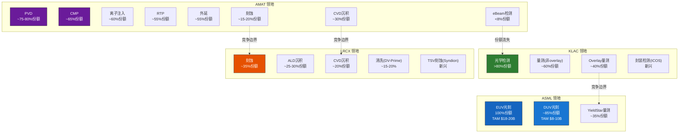
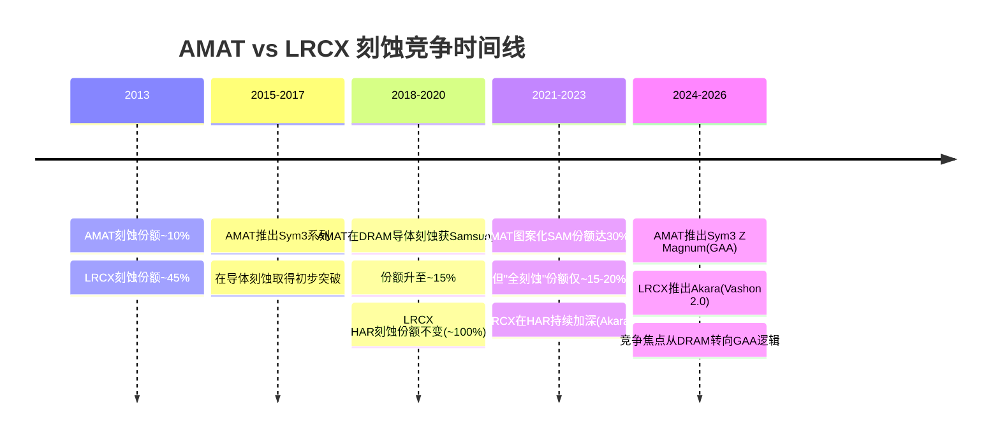
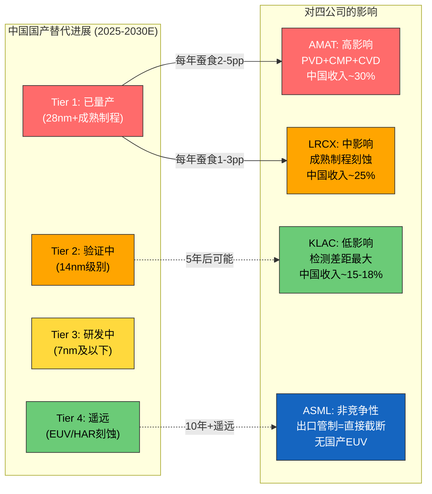
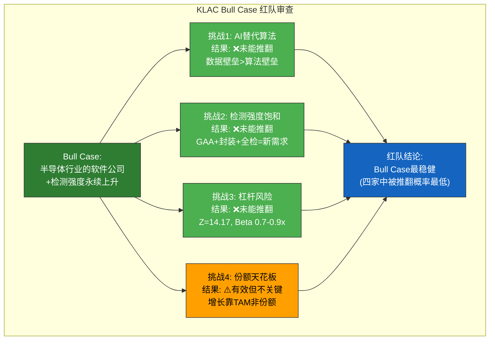
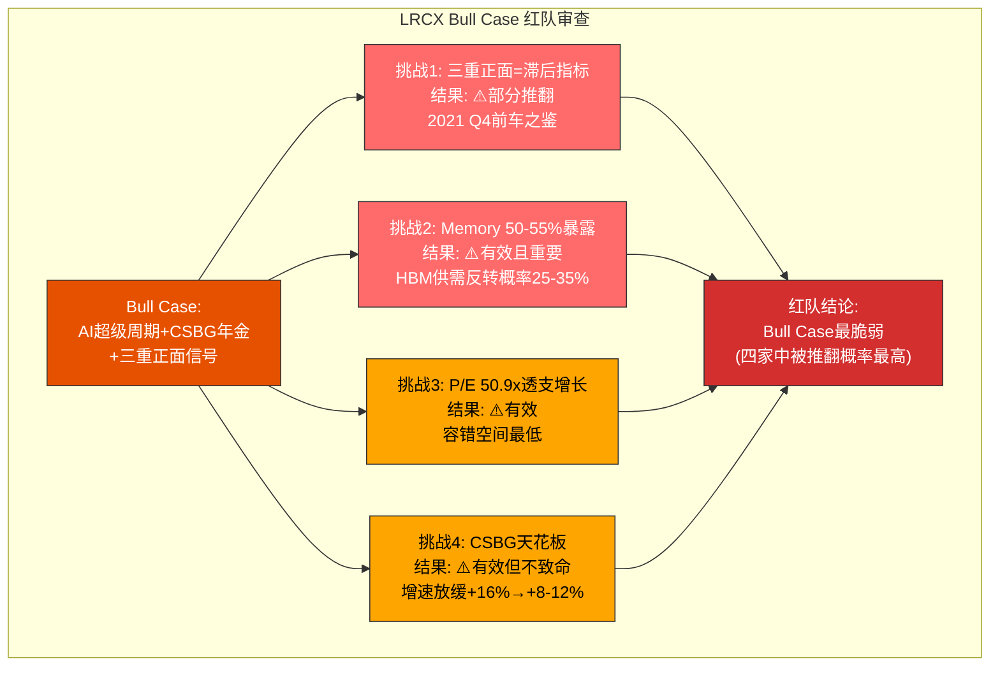
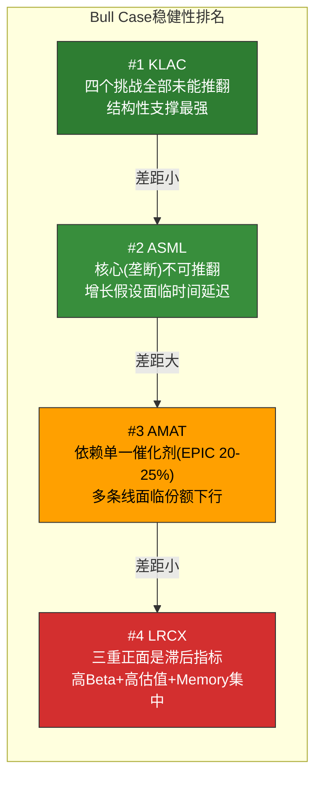
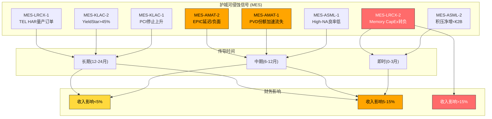

# Chapter 18: 竞争生态动态与红队审查

> **分析框架**: 竞争格局全景映射 + 动态趋势追踪 + 四公司Bull Case红队审查
> **数据截止**: 2026-02-24 | **EC编号范围**: EC-ECO-001 ~ EC-ECO-025
> **交叉引用**: Ch4(价值链竞争地图) + Ch6-Ch8(A1-A11护城河) + Ch9(A-Score综合) + Ch10(B1周期位置) + Ch13(B4估值) + Ch14(B5风险地图) + Ch15(A+B综合记分卡)
> **核心方法**: 竞争生态mapping → 动态趋势分析 → Bundle vs Best-of-Breed经济学 → 红队审查(真刀真枪) → 侵蚀监控 → 5年展望
> **写作原则**: 红队审查必须"真刀真枪"——认真尝试推翻Bull Case, 不是走过场。如果推翻失败则诚实说明, 如果推翻成功则清晰标注

---

## 导读: 竞争不是零和博弈, 但份额迁移是真实的

半导体设备行业最被误解的特征之一是"竞争格局稳定"。从表面看, 这个判断完全正确——ASML在EUV光刻领域的100%份额十五年来没有变过, KLAC在过程控制领域的领导地位从2005年的~50%份额持续扩大到2025年的~63%, 连LRCX在刻蚀领域的~35%份额也维持了近十年。这种稳定性容易让投资者产生一种幻觉: 竞争格局已经"固化", 不值得深入分析。

但这种幻觉掩盖了三个正在发生的真实变化:

**第一, 品类内部的份额微迁移在累积质变**。AMAT的PVD全球份额从2018年的~90%下降到2025年的~75-80%, 七年间流失了10-15个百分点。这个速度看似缓慢, 但累计影响是AMAT PVD收入的年化增长被削减了2-3个百分点——在一个年增长5-7%的行业里, 这意味着PVD正在从"增长引擎"变成"存量保卫战"。

**第二, 中国国产替代从"概念"进入"实装"阶段**。北方华创(NAURA)在成熟制程刻蚀和PVD领域, 中微半导体(AMEC)在MOCVD和介质刻蚀领域, 已经不是"未来威胁"而是"季度可见"的份额蚕食者。这一趋势对AMAT(中国收入~30%)的冲击远大于对KLAC(中国收入~15-18%)或ASML(受出口管制直接影响但无国产替代)的冲击。

**第三, 先进封装正在创造新的竞争边界**。CoWoS/HBM的爆发式增长催生了TSV刻蚀(LRCX Syndion)、hybrid bonding(AMAT)、封装检测(KLAC ICOS vs Camtek vs Onto)等新战场。这些新战场的竞争格局远未固化, 是未来五年份额重塑的最活跃地带。

本章的目标不是重复Ch4(价值链竞争地图)已经完成的静态mapping, 而是回答三个动态问题:
1. **谁在蚕食谁?** — 竞争关系的方向和速度
2. **Bull Case能否经受红队审查?** — 四家公司各自的最乐观叙事是否有致命漏洞
3. **哪些侵蚀信号值得监控?** — 从"模糊不安"到"立即行动"的具体触发条件

核心发现预告:
- **KLAC的Bull Case是四家中最稳健的** — 红队从四个角度攻击, 均未能推翻其核心逻辑
- **LRCX的Bull Case是四家中最脆弱的** — 三重正面信号的"滞后指标"本质使其Bull Case建立在动量延续假设上, 而2021 Q4的前车之鉴证明动量可以骤然反转
- **AMAT是竞争压力最大的公司** — 8条产品线中有5条面临份额下行压力, EPIC Center是唯一的战略反转点, 但成功概率仅20-25%
- **ASML的竞争风险不在"竞争对手"而在"客户行为"** — 100%份额意味着唯一能伤害ASML的人是它自己的客户(推迟购买)和地缘政治(出口管制)

---

## 18.1 竞争生态全景图: 割据型寡头的疆域划分

### 18.1.1 为什么是"割据型寡头"而非"完全竞争"

半导体设备行业的竞争格局最准确的描述是"割据型寡头"(Segmented Oligopoly)。这个术语包含两层含义:

**"寡头"**: 每个设备品类由1-3家公司主导, 前三名份额合计通常超过75%。这不是自然形成的——它是三十年技术积累、客户验证(qualification)周期和政府管制共同构筑的结果。新进入者面临的不仅是技术壁垒, 还有12-24个月的客户认证周期、已有供应商的recipe锁定和数据壁垒、以及越来越严格的出口管制门槛 [参见Ch6-Ch8 A11评分]。

**"割据型"**: 品类之间的边界比品类内部的竞争更加刚性。ASML不会进入刻蚀领域, LRCX不会进入光刻领域, 这种分工不是商业选择而是技术现实——光刻需要的核心能力(光学系统设计、EUV光源工程、计算光刻算法)与刻蚀需要的核心能力(等离子体物理、RF电源工程、腔室化学)几乎完全不重叠。唯一的跨品类竞争发生在技术相近的品类之间, 如CVD/ALD沉积(AMAT vs LRCX vs ASM)和刻蚀(LRCX vs TEL vs AMAT)。

> **[EC-ECO-001]** 半导体设备行业竞争格局的"割据型寡头"特征在过去20年持续强化而非弱化。2005年全球前五大设备公司(AMAT/ASML/TEL/LRCX/KLAC)合计WFE份额约60%; 2025年同一组公司(除TEL外均为本报告分析标的)合计份额约70-75%。份额集中度的持续上升说明规模经济、技术壁垒和qualification门槛在加速而非减速。唯一的反趋势力量是中国国产替代, 但其影响目前仅限于成熟制程(<28nm以上), 对先进制程竞争格局几乎无影响。
> **claim_type**: inference | **source**: SEMI历史份额数据 + Ch4价值链分析 | **置信度**: H

### 18.1.2 品类-公司-份额完整映射

以下是半导体设备九大品类的竞争格局全景。这张表是Ch4 4.1节竞争地图的升级版——增加了份额趋势方向和竞争烈度评估。

| # | 品类 | TAM ($B, CY2025E) | #1 | 份额 | #2 | 份额 | #3 | 份额 | 趋势 | 竞争烈度 |
|---|------|-------------------|----|----|----|----|----|----|------|--------|
| 1 | **EUV光刻** | ~$18-20B | ASML | 100% | — | — | — | — | 稳定 | **无** |
| 2 | **DUV光刻** | ~$8-10B | ASML | ~85% | Nikon | ~10% | Canon | ~5% | ASML↑ | 极低 |
| 3 | **刻蚀** | ~$18-20B | LRCX | ~35% | TEL | ~27% | AMAT | ~15-20% | TEL↑AMAT→ | **中高** |
| 4 | **CVD沉积** | ~$8-10B | AMAT | ~30% | LRCX | ~20% | TEL | ~15% | 碎片化 | 中 |
| 5 | **ALD沉积** | ~$4-5B | LRCX | ~25-30% | ASM Int'l | ~25% | TEL | ~15% | LRCX↑ | **高** |
| 6 | **PVD沉积** | ~$5-6B | AMAT | ~75-80% | ULVAC | ~10% | NAURA | ~5-8% | AMAT↓ | 中(上升) |
| 7 | **检测/量测** | ~$12-14B | KLAC | ~63% | Hitachi | ~12% | ASML(HMI/YS) | ~8-10% | KLAC↑ | **低** |
| 8 | **CMP** | ~$3-4B | AMAT | ~65% | Ebara | ~25% | Okamoto | ~5% | 稳定 | 低 |
| 9 | **离子注入** | ~$2-3B | AMAT | ~60% | Axcelis | ~30% | Sumitomo | ~5% | Axcelis↑ | 中 |

**辅助品类**(非四公司核心, 但影响竞争动态):

| # | 品类 | #1 | 竞争态势 |
|---|------|----|---------|
| 10 | 涂覆/显影(Track) | TEL(90%) | TEL垄断 |
| 11 | 清洗(Wet Clean) | TEL/LRCX/SEMES | 三家竞争 |
| 12 | RTP(快速热处理) | AMAT(55%)/TEL | 双寡头 |
| 13 | 外延(Epitaxy) | AMAT(55%)/ASM | 双寡头 |
| 14 | 先进封装(TSV/Bonding) | 新兴领域 | 格局未定 |

> **[EC-ECO-002]** 四公司品类重叠度矩阵揭示了竞争的真实边界: ASML与其他三家几乎零重叠(仅与KLAC在overlay量测有微弱竞争); KLAC与其他三家的重叠同样极低(仅与ASML在量测、与AMAT在eBeam检测有边界摩擦); 真正的竞争主要发生在AMAT-LRCX之间(刻蚀+CVD沉积+ALD沉积三个品类重叠)和LRCX-TEL之间(刻蚀品类内部)。这种"品类割据+有限重叠"的结构意味着四家公司的投资价值更多取决于各自品类的TAM增速和定价权, 而非彼此之间的直接份额争夺。
> **claim_type**: inference | **source**: Ch4竞争地图 + 份额数据交叉分析 | **置信度**: H

### 18.1.3 四公司品类重叠度矩阵

### 18.1.4 核心洞见: 品类间"跨界"远比品类内"份额争夺"困难

为什么ASML不做刻蚀? 为什么KLAC不做沉积? 这些问题看似简单, 但答案揭示了半导体设备竞争的核心逻辑。

**技术能力的不可迁移性**: 光刻的核心能力是光学系统设计(波前控制、衍射补偿、像差校正)和计算光刻算法。刻蚀的核心能力是等离子体物理(离子能量控制、自由基密度管理、选择性化学)。这两套技术栈之间没有任何可迁移的元素——一个顶级光学物理学家对等离子体物理的理解并不比一个普通工程师更深。这种"技术正交性"使得品类间跨界的成本接近于从零开始建立一家新公司。

**客户qualification的品类绑定**: 即使一家公司在技术上完成了跨品类开发, 它还需要在每个新品类中独立完成12-24个月的客户qualification。TSMC对ASML的EUV qualification与对ASML(假设性的)刻蚀产品的qualification是完全独立的流程, 不存在任何"信任转移"效应。

**R&D规模的约束**: 跨品类扩张意味着分散R&D资源。AMAT是四家中唯一采用"通才模式"的公司, 其代价是$3.57B R&D分摊到8条产品线后每条线仅~$450M——不到LRCX刻蚀单一领域$2.1B投入的四分之一 [参见Ch6 EC-MOAT-016]。这种稀释效应直接解释了为什么AMAT在大多数品类中都不是#1。

> **[EC-ECO-003]** 品类间跨界的结构性困难是半导体设备竞争格局长期稳定的根本原因。过去20年最成功的品类扩张案例是AMAT通过Sym3 Magnum在EUV图案化导体刻蚀的突破(份额从10%→30%+), 但这花费了超过10年的持续投入, 且仅在一个刻蚀细分品类(而非整个刻蚀品类)获得显著份额。最失败的案例是AMAT在eBeam检测领域的长期投入(SEMVision系列), 份额从~13%下降到<8%, 说明即使是行业最大的公司也无法仅凭资本投入在一个技术正交的品类中赢得份额。
> **claim_type**: inference | **source**: Ch4 + Ch6 EC-MOAT-016 + AMAT产品历史 | **置信度**: H

---

## 18.2 竞争动态: 谁在蚕食谁?

### 18.2.1 AMAT vs LRCX在刻蚀: 十年入侵的得与失

**AMAT的刻蚀扩张战略**是过去十年半导体设备行业最积极的品类入侵尝试。从2013年到2023年, AMAT在图案化SAM(Serviceable Addressable Market)中的份额从10%扩大到30%+, 主要战场是EUV图案化导体刻蚀(conductor etch), 核心武器是Sym3 Magnum平台 [参见Ch8 EC-MOAT-087]。

但这场入侵的全貌比"AMAT在刻蚀成功了"更复杂:

**AMAT赢得的战场**: 先进逻辑节点(5nm/3nm)的EUV图案化导体刻蚀, 特别是DRAM应用。在这个细分品类中, AMAT的Sym3 Magnum凭借更优的均匀性控制(uniformity control)获得了Samsung和SK Hynix的认可。Sym3 Z Magnum(2026年推出, 面向GAA)试图将这一成功延续到下一代架构。

**AMAT未能攻入的堡垒**: NAND高深宽比(HAR)刻蚀。这是LRCX最坚固的领地——在300+层3D NAND的通道刻蚀(channel hole etch)中, LRCX维持着接近100%的份额。HAR刻蚀需要在极深(深宽比>80:1)的结构中保持直线度(profile control)和底部停止精度(etch stop), 这要求对等离子体密度和离子角度分布进行极精密的控制。LRCX在这一领域积累了超过15年的工艺数据(recipe library), 形成了深度的数据壁垒。AMAT从未在HAR刻蚀领域获得超过5%的份额。

**竞争态势的演变时间线**:

**关键判断**: AMAT在刻蚀领域的扩张已经触及天花板。其30%+的图案化SAM份额主要集中在导体刻蚀这一子品类, 而刻蚀总品类(包括HAR、介质刻蚀、硅刻蚀等)的份额仅15-20%。进一步提升需要攻入LRCX的HAR堡垒或TEL的介质刻蚀领地——前者几乎不可能(数据壁垒+15年recipe锁定), 后者需要与一个在日本fab中根深蒂固的对手竞争。未来5年, AMAT刻蚀份额最可能的走势是在15-22%区间震荡, 而非继续向30%进军。

> **[EC-ECO-004]** AMAT在刻蚀领域的十年扩张(份额10%→20%)是行业内最成功的品类入侵案例, 但其成功被高度集中在导体刻蚀子品类。将"图案化SAM份额30%+"等同于"刻蚀份额30%"是分析中常见的混淆。AMAT在整个刻蚀TAM($18-20B)中的份额仅约15-20%, 而LRCX在HAR刻蚀这个最高价值子品类中维持接近100%的垄断。刻蚀领域的实际竞争格局是: LRCX在HAR(高端)不可替代, AMAT在导体(中端)有一席之地, TEL在介质/硅刻蚀(通用)稳定, 三家形成了子品类割据而非同质竞争。
> **claim_type**: inference | **source**: Ch8 EC-MOAT-087 + AMAT/LRCX产品组合分析 | **置信度**: M

### 18.2.2 TEL vs LRCX在刻蚀: HAR堡垒的最大挑战者

如果说AMAT是从"侧翼"(导体刻蚀)攻入LRCX的领地, 那么TEL(东京电子)则是从"正面"(HAR刻蚀本身)发起挑战——这是对LRCX核心堡垒最直接也最危险的威胁。

**TEL Certas平台的技术主张**: TEL在2023-2024年密集宣传其Certas刻蚀平台, 声称能以2.5倍速度完成>400层NAND通道刻蚀, 同时保持与LRCX相当的profile控制精度。如果这一主张属实, 它将直接攻击LRCX HAR刻蚀的两大壁垒之一——产能效率(throughput)。

**HAR刻蚀的两大壁垒**:
1. **工艺质量(Profile Control)**: 在深宽比>80:1的结构中保持通道的直线度和底部精度。这是LRCX 15年数据积累的核心优势, recipe library是不可复制的无形资产。
2. **产能效率(Throughput)**: HAR刻蚀是NAND fab中最耗时的工艺步骤之一, 单次通道刻蚀可能需要数小时。提升throughput直接降低wafer成本, 对fab经济性影响巨大。

TEL的Certas在第二个壁垒(throughput)上声称取得突破, 但第一个壁垒(profile control)的实际量产数据尚未公开验证。半导体设备行业有一个铁律: **demo工艺数据和量产工艺数据之间可能存在6-18个月的差距, 且量产良率往往比demo低5-15个百分点**。

**客户动机分析**: Samsung和SK Hynix有培育TEL作为HAR刻蚀第二供应商的结构性动机——单一供应商依赖(LRCX 100%)在供应链安全和议价能力两方面都是风险。但客户的"意愿"和"行动"之间存在巨大的鸿沟: 切换HAR刻蚀供应商需要6-12个月的qualification + 3-6个月的量产验证 + 接受初期良率损失(可能是$50-100M的隐性成本)。只有当TEL提供显著的成本或性能优势(通常至少15-20% throughput提升)时, 客户才会承担这种切换成本。

**5年份额预测**:

| 情景 | 概率 | LRCX HAR份额 (2030) | TEL HAR份额 (2030) | 触发条件 |
|------|------|---------------------|-------------------|---------|
| **基准** | 50% | 85-90% | 10-15% | TEL Certas量产验证通过, 1-2家Memory fab采纳 |
| 乐观(LRCX) | 30% | 95%+ | <5% | TEL Certas量产良率不达标, 客户回退 |
| 悲观(LRCX) | 20% | 70-80% | 15-25% | TEL Certas超预期, 3家Memory fab全部采纳 |

> **[EC-ECO-005]** TEL Certas对LRCX HAR刻蚀垄断的挑战是未来5年LRCX面临的最大竞争风险。基准情景(50%概率)下, LRCX在HAR刻蚀的份额从~100%降至85-90%, 对应LRCX刻蚀总收入的影响约为-$0.8~1.2B/年(HAR刻蚀占LRCX刻蚀收入约40-50%, $18-20B TAM x 35% LRCX份额 x 40-50% HAR比例 = $2.5-3.5B HAR收入, 流失10-15%≈$0.3-0.5B)。这一影响是实质性但非灾难性的——CSBG飞轮(100K腔体 x ARPU提升)可以部分对冲新设备份额的流失。
> **claim_type**: estimate | **source**: TEL产品发布会 + LRCX管理层回应 + Memory fab采购模式分析 | **置信度**: M

### 18.2.3 KLAC vs 无明显竞争者: "质检官"的独立性溢价

KLAC在过程控制(Process Control)领域的竞争地位是四家公司中最独特的——它不是"面临弱竞争", 而是"竞争维度本身不同"。

**为什么没有新进入者?** 进入过程控制领域的壁垒不是单一的技术门槛, 而是一个由四层壁垒叠加的"防御纵深":

1. **算法/数据壁垒(最深层)**: KLAC的30+年缺陷数据库和分类算法是不可复制的。每增加一个fab客户、一种新节点工艺, KLAC的检测算法就变得更精确。这是一种典型的"数据飞轮"——数据越多→算法越好→客户越依赖→数据越多。新进入者即使造出硬件, 也需要至少10年的数据积累才能接近KLAC的算法精度。

2. **光学系统壁垒(核心层)**: KLAC的BBP(宽带等离子体)光源技术是内部专有的, 不依赖外部供应商 [参见Ch6 EC-MOAT-011/012]。BBP的宽波段特性使其在单次扫描中能捕获多种缺陷类型, 这是传统激光光源或灯源无法匹敌的。

3. **qualification壁垒(时间层)**: 检测设备的qualification不仅涉及硬件性能, 还涉及与客户现有数据系统的集成(Klarity平台)。一旦KLAC的检测数据流入客户的良率管理系统, 切换成本是"整个良率监控体系的重构"——这远超单台设备的切换成本。

4. **"裁判独立性"壁垒(结构层)**: 如Ch8 EC-MOAT-084所述, 客户倾向于让独立的第三方提供检测, 而非设备制造商自己检测自己的产品。AMAT在eBeam检测的长期投入(SEMVision系列)正是因为这种结构性偏见而持续失利——份额从~13%下降到<8%。

**唯一的边界摩擦**: ASML YieldStar在overlay量测领域占据~35%份额(vs KLAC ~40%), 这是KLAC面临的最实质性竞争压力。但overlay量测仅占KLAC总收入的一小部分(<10%), 且ASML-KLAC在overlay上更多是"共存"而非"替代"——ASML的优势在于将曝光数据与量测数据整合(计算光刻闭环), KLAC的优势在于独立性和多源数据关联。两者各有不可替代的价值主张。

> **[EC-ECO-006]** KLAC的竞争护城河得分(A8=8, A9=9, 参见Ch8-Ch9)是四家中最高的组合, 且这两个维度的置信度均为[H]。过程控制领域在过去15年中没有出现任何新的有意义竞争者(Hitachi在CD-SEM的份额稳定在~12%已超过10年, 不再扩张; Lasertec在EUV光掩模检测是利基市场, TAM<$0.5B)。KLAC 63%份额从2005年的~50%持续扩大, 说明即使在没有新进入者的情况下, KLAC也在持续从现有竞争者手中赢得份额。这是一种极为罕见的"在寡头格局中持续集中"的竞争动态。
> **claim_type**: inference | **source**: Ch8 A8/A9评分 + KLAC历史份额趋势 | **置信度**: H

### 18.2.4 ASML vs 无竞争者: 当"竞争风险"来自客户而非对手

ASML在EUV光刻领域的100%份额使得传统的"竞争分析"框架几乎不适用。没有竞争对手在价格、性能或交付上对ASML构成威胁。但这不意味着ASML没有"竞争风险"——它的风险来自三个非传统方向:

**方向一: 客户推迟购买(非替代性需求下降)**

Intel的EUV采购在2024-2025年经历了显著调整——Intel 18A/14A节点的延迟直接导致EUV订单推迟。这不是Intel选择了另一家光刻供应商(不存在), 而是Intel不需要那么多EUV了(至少不是现在)。类似地, 如果Samsung在3nm GAA良率持续不达标, 它可能推迟3nm产能扩张, 间接减少EUV订单。

这种"客户推迟"风险的特殊之处在于: 它是ASML独有的, 但不反映竞争弱化——它反映的是客户自身执行力的波动。ASML的积压订单(backlog, €38.8B, =1.24x TTM收入)在一定程度上缓冲了这种波动, 但积压不等于收入确认——客户可以推迟交付, 虽然取消的可能性很低。

**方向二: 出口管制限制销售对象**

ASML受到荷兰政府出口管制的直接约束, 无法向中国出口EUV系统, 2025年起连先进DUV(NXT:2000/2050i级别)的出口也受到限制。这不是竞争问题, 而是地缘政治对可达市场(addressable market)的直接截断。ASML CY2023中国收入占比一度达到~47%(因中国fab抢购DUV), CY2024-2025急剧回落至~20-25%。这种收入结构的大幅波动完全由政策驱动, 而非市场竞争。

**方向三: High-NA采纳速度不确定性**

High-NA EUV(EXE:5000系列, ~$380M/台)是ASML的下一代增长引擎, 但客户采纳速度存在不确定性。High-NA的晶圆throughput(~185 WPH初始)低于成熟EUV(~200+ WPH), 且需要新的工艺流程和光掩模技术。目前只有Intel宣布明确的High-NA量产计划(18A节点), TSMC和Samsung持观望态度。如果High-NA的早期产能利用率和良率表现不佳, TSMC可能选择继续使用EUV多重图案化(Multi-Patterning)而非升级到High-NA——这对ASML的长期增长叙事构成挑战。

> **[EC-ECO-007]** ASML的"竞争风险"完全来自非竞争因素: 客户执行力波动(Intel延迟)、出口管制(荷兰/美国/日本三方)和新产品采纳不确定性(High-NA)。这三个风险的共同特征是: 它们不削弱ASML的垄断地位(100%份额不变), 但可以显著影响ASML的收入增速和估值倍数。从投资角度, 这意味着做多ASML的核心风险不是"出现竞争者"(概率极低), 而是"增长不如预期"(概率中等)。这是一种独特的"垄断者的增长焦虑"。
> **claim_type**: inference | **source**: Ch8 A8/A9评分 + ASML积压订单 + 出口管制分析(Ch5) | **置信度**: H

### 18.2.5 中国国产替代: 从概念到实装的威胁评估

中国国产替代是影响四家公司竞争格局的最大外生变量。2025年是这一趋势从"政策宣言"进入"产品实装"的分水岭——北方华创(NAURA)和中微半导体(AMEC)的设备已经出现在多个中国大陆fab的成熟制程产线上。

**品类×公司的国产替代威胁矩阵**:

| 品类 | 国产替代者 | 当前能力 | 5年目标 | 对谁威胁最大 | 威胁量级 |
|------|----------|---------|---------|------------|---------|
| **PVD** | NAURA | 28nm可用, 精度差20-30% | 14nm验证 | **AMAT**(PVD垄断) | **高** |
| **刻蚀(介质)** | NAURA, AMEC | 28nm量产, 部分14nm | 7nm验证 | LRCX, TEL, AMAT | 中 |
| **CVD** | NAURA | 28nm可用 | 14nm验证 | AMAT, LRCX | 中 |
| **DUV光刻** | SMEE | 90nm量产, 65nm验证 | 28nm(DUV ArF) | ASML(DUV成熟段) | 低-中 |
| **CMP** | Hwatsing | 28nm可用 | 14nm验证 | AMAT(CMP垄断) | 中 |
| **检测/量测** | Skyverse, 精测电子 | 成熟制程基础检测 | 28nm量测工具 | KLAC(但差距最大) | **低** |
| **离子注入** | 凯世通 | 低能量注入可用 | 中高能量 | AMAT, Axcelis | 中-低 |

**关键差异: "成熟制程"vs"先进制程"的鸿沟**

中国国产替代的最大误解是将"28nm国产设备可用"等同于"中国即将追上"。事实上, 28nm和5nm之间的技术差距不是线性的, 而是指数级的:
- 28nm→14nm: 需要从ArF干法光刻升级到ArF浸没式(immersion), 刻蚀精度要求提升3-5倍
- 14nm→7nm: 需要EUV光刻(中国无法获取), 或极端多重图案化(quadruple patterning, 成本极高)
- 7nm→3nm: 需要EUV + GAA架构, 刻蚀和沉积的工艺窗口(process window)缩小到纳米级

NAURA的PVD设备在28nm fab的表现可以"够用"(good enough), 但在7nm以下的金属互连中, 薄膜均匀性(uniformity)和台阶覆盖率(step coverage)的要求使得AMAT的Endura平台成为唯一选择。类似地, AMEC的介质刻蚀在28nm可用, 但HAR刻蚀(>200层NAND)的精度要求远超其当前能力。

**对四公司的量化影响估算**:

| 公司 | 中国收入占比 | 可被国产替代的比例(5年) | 年化收入影响 | 对增长率的影响 |
|------|------------|---------------------|-----------|-------------|
| AMAT | ~30% | 成熟制程~40-50% | -$1.5~2.5B | -4~6pp |
| LRCX | ~25% | 成熟制程~30-40% | -$0.8~1.5B | -2~4pp |
| KLAC | ~15-18% | 成熟制程~15-20% | -$0.3~0.5B | -1~2pp |
| ASML | ~20-25% | 管制截断(非竞争) | 已反映 | 已反映 |

> **[EC-ECO-008]** 中国国产替代对四公司的影响呈现明显的"梯度差异": AMAT受冲击最大(中国收入30% x 成熟制程暴露高 = 年化-$1.5~2.5B收入风险), KLAC受冲击最小(中国收入15-18% x 检测差距最大 = 年化-$0.3~0.5B)。差距的根本原因是: AMAT的核心品类(PVD/CMP/离子注入)在成熟制程中没有不可替代性——28nm PVD不需要纳米级精度, NAURA的"够用"产品在政策支持下足以替代。而KLAC的检测算法和数据壁垒即使在成熟制程中也远超国产替代者的能力, 因为"缺陷识别精度"的壁垒不随制程节点降低而消失。
> **claim_type**: estimate | **source**: 国产设备能力评估 + 四公司中国收入结构 | **置信度**: M

### 18.2.6 竞争烈度排名总结

综合以上分析, 四公司面临的竞争压力排名清晰:

| 排名 | 公司 | 竞争烈度 | 主要竞争来源 | A8评分 | 份额趋势 |
|------|------|---------|------------|--------|---------|
| 1(最高) | **AMAT** | 高 | LRCX(刻蚀), NAURA(PVD/CVD), Axcelis(离子注入) | 4/10 | ↓(PVD年失2-4pp) |
| 2 | **LRCX** | 中 | TEL(HAR刻蚀), AMAT(导体刻蚀), ASM(ALD) | 6/10 | →↑(HAR稳定, ALD扩张) |
| 3 | **KLAC** | 低 | ASML(overlay量测), Camtek(封装检测) | 8/10 | ↑(份额从50%→63%) |
| 4(最低) | **ASML** | 无(传统意义) | 客户推迟购买, 出口管制 | 9/10 | →(100%稳定) |

---

## 18.3 Bundle vs Best-of-Breed动态: 通才的诱惑与专精的胜利

### 18.3.1 两种商业模式的经济学

半导体设备行业存在两种对立的商业策略:

**Bundle/Suite Selling(捆绑销售)**: AMAT是这一策略的主要践行者——利用8条产品线的广度, 向客户提供"一站式"设备采购方案。逻辑是: 打包采购降低客户的供应商管理复杂度, 提升客户忠诚度(lock-in), 并通过交叉补贴在弱品类中维持份额。

**Best-of-Breed(单品最优)**: KLAC和LRCX(在核心品类)采用这一策略——在单一或少数品类中做到绝对最强, 不追求品类广度。逻辑是: 客户在关键设备上永远选择性能最优者, 不会因为"打包折扣"在关键环节妥协。

两种策略的经济学对比:

| 维度 | Bundle(AMAT) | Best-of-Breed(KLAC/LRCX核心) |
|------|-------------|---------------------------|
| **R&D效率** | 分散: $3.57B÷8线=$450M/线 | 集中: LRCX $2.1B/刻蚀, KLAC $1.2B/检测 |
| **毛利率** | 被弱品类拉低: 48.7% | 集中在高壁垒品类: 61.9%(KLAC)/49.8%(LRCX) |
| **客户粘性来源** | 供应商便利性 | 技术不可替代性 |
| **周期韧性** | 理论上广度对冲(实际效果有限) | 核心品类需求刚性(检测>刻蚀>通用设备) |
| **增长引擎** | 品类扩张(横向) | TAM深耕(纵向) |
| **风险** | 在每条线都面临专精对手 | 品类集中度高(LRCX Memory 50-55%) |

### 18.3.2 历史证据: Bundle在半导体设备行业的效果有限

AMAT的suite selling策略可以追溯到2000年代中期, 但二十年的实践结果并不支持"bundle必胜"的假说。

**证据一: 份额趋势**。如果bundle策略有效, AMAT应该在与专精对手重叠的品类中持续获得份额。但实际数据显示相反趋势——AMAT在PVD(从~90%降至~75-80%)、eBeam检测(从~13%降至<8%)和离子注入(Axcelis份额持续上升)等品类的份额都在下降。唯一的份额增长出现在刻蚀(从10%→20%), 但这更多归功于Sym3 Magnum的技术突破而非bundle效应。

**证据二: 客户行为**。TSMC是全球最大的WFE买家, 其设备采购策略明确遵循best-of-breed原则——EUV选ASML, HAR刻蚀选LRCX, 检测选KLAC, PVD选AMAT。TSMC不因为AMAT在PVD最强就在刻蚀上也选AMAT。Samsung和Intel的采购模式类似, 虽然在某些品类中倾向于多供应商策略(如在刻蚀中同时使用LRCX和AMAT)。

**证据三: 毛利率差异**。如果bundle创造了协同价值, AMAT的毛利率应该比"8条独立产品线的加权平均"更高——但48.7%的毛利率恰恰是8条线的自然加权结果, 没有任何"bundle溢价"的迹象。这说明客户不为bundling支付溢价。

> **[EC-ECO-009]** 二十年的经验数据表明, bundle/suite selling策略在半导体设备行业的效果有限。根本原因是客户决策结构: 先进fab的设备采购由工艺工程团队(而非采购团队)主导, 每个工艺步骤的设备选择基于技术匹配度而非供应商整合度。一个PVD工程师不关心他的CMP同事选了谁的设备——他只关心PVD本身的薄膜质量。这种"分权化决策"结构天然不利于bundle策略。AMAT的suite selling更多是一种"销售叙事"(投资者爱听)而非"客户现实"(fab工程师不买账)。
> **claim_type**: inference | **source**: AMAT历史份额趋势 + TSMC/Samsung采购模式分析 | **置信度**: H

### 18.3.3 AI时代的例外: 先进封装可能改变逻辑

上述分析的一个重要限定条件是: 它主要基于传统前道制造(FEOL/BEOL)的经验。在先进封装这个新兴领域, bundle逻辑可能有更大的适用空间。

**先进封装的特殊性**:
1. **工艺整合度更高**: CoWoS/InFO等先进封装技术需要TSV刻蚀→金属填充(PVD+ECD)→CMP平坦化→hybrid bonding的连续工艺链, 每个步骤之间的工艺匹配度(process integration)比前道更关键。
2. **客户决策更集中**: 封装工艺的设备采购往往由封装工程团队统一决策, 而非前道那样的分权模式。
3. **标准化程度低**: 先进封装仍处于工艺路径探索期, 没有像前道那样明确的"最佳设备"共识。

AMAT的EPIC Center(Equipment and Process Innovation and Commercialization)正是瞄准这个机会——通过180,000平方英尺的洁净室提供跨工艺联合验证, 降低客户在先进封装工艺集成上的风险。如果EPIC Center成功证明"在AMAT内部一站式验证封装工艺"比"分别找5家供应商各自验证然后集成"效率更高, 那么bundle逻辑在先进封装领域将首次获得真正的技术支撑(而非仅仅是销售策略)。

**关键不确定性**: EPIC Center目前(Spring 2026)尚未投入运营, 其"跨工艺协同"的愿景尚未被客户验证。先进封装TAM虽然增长迅速($3-5B→$10-15B, 2025-2030E), 但在WFE总量($130B+)中占比仍<10%。即使AMAT在先进封装领域成功实施bundle策略, 其对AMAT总收入的增量贡献也有限。

> **[EC-ECO-010]** 先进封装是bundle策略可能首次在半导体设备行业获得技术合理性的领域。但需要三个条件同时成立: (1) EPIC Center按时投入运营并展示跨工艺协同价值; (2) 客户从"分权采购"转向"集成采购"; (3) 先进封装TAM增长到足以对AMAT总收入产生有意义影响(>$5B/年)。三个条件的联合概率约20-25%, 这与Ch13中对EPIC Center成功概率的估计一致。
> **claim_type**: estimate | **source**: AMAT EPIC Center分析 + 先进封装TAM预测 + 客户采购模式 | **置信度**: L

---

## 18.4 红队审查: 四公司Bull Case挑战

> **红队审查原则**: 本节将以"检察官"的角色, 认真尝试推翻每家公司最乐观的投资叙事(Bull Case)。如果Bull Case经受住了审查, 我们诚实地说"红队未能推翻"; 如果发现致命漏洞, 我们清晰标注"红队推翻"或"红队部分推翻"。红队的目标不是制造恐惧, 而是帮助投资者区分"真正的确信"和"虚假的安慰"。

### 18.4.1 红队审查ASML Bull Case

**Bull Case陈述**: "EUV垄断不可动摇 + High-NA打开新增量 + AI驱动的先进逻辑扩产保障长期需求"

**Bull Case的隐含假设**:
- H1: EUV 100%份额在10年内不受任何技术替代威胁
- H2: High-NA EUV在2027-2028年被至少2家客户量产采纳
- H3: AI驱动的先进逻辑CapEx在2026-2030年保持年均+10-15%增速
- H4: 出口管制对ASML的负面影响可以被非中国需求增长抵消

**红队挑战一: High-NA延迟或客户采纳速度慢于预期**

High-NA EUV(EXE:5000系列)是ASML Bull Case最关键的增长驱动。每台~$380M的ASP使其成为单台价值最高的半导体设备, ASML需要High-NA在2028-2030年贡献€10-15B/年收入才能支撑市场隐含的~12-15% FCF CAGR [参见Ch13 Reverse DCF分析]。

**Red Team论点**: High-NA的早期throughput(~185 WPH)显著低于成熟EUV(~200+ WPH), 这意味着每层曝光的成本高于EUV多重图案化(EUV MPT)。如果TSMC——全球最大的EUV客户——判断EUV MPT在2nm/A16节点的性价比优于High-NA, 它可能选择推迟High-NA采纳至2nm以下节点(~2030年+)。目前的公开信息显示, TSMC对High-NA的态度是"技术储备"而非"积极采纳", 与Intel的激进采纳形成鲜明对比。

**反驳**: High-NA的throughput问题是暂时的——ASML历史上每代EUV系统的throughput都在前3-5年内提升50-100%(NXE:3400从~150 WPH提升至~200+ WPH)。此外, High-NA在单次曝光(single exposure)上替代EUV双重图案化(double patterning)的成本优势会随着throughput提升而扩大。

**评估**: 红队论点有效但不致命。H2的兑现时间可能从2027-2028推迟到2029-2030, 这将影响ASML 2-3年的增长轨迹但不改变长期逻辑。**Red Team影响: 中等(时间延迟而非方向反转)**。

**红队挑战二: Zeiss供应链成为硬约束**

ASML的A1评分(5/10, Ch6)是其11个护城河维度中的最低分。Zeiss SMT的EUV光学组件是100%单源供应, 且High-NA的光学系统复杂度和精度要求比标准EUV高一个数量级。如果Zeiss的产能无法跟上High-NA的爬坡需求, ASML的交付计划将直接受限。

**Red Team论点**: Zeiss的Oberkochen工厂是全球唯一能生产EUV级光学组件的设施。一次严重的供应链中断(火灾、地震、能源危机等)可能导致12-18个月的交付延迟, 使ASML的年收入损失€5-10B。这不是"概率极低"的黑天鹅——2021年全球芯片短缺期间, 供应链中断确实导致了设备交付延迟。

**反驳**: ASML和Zeiss的"互锁关系"(Ch6 EC-MOAT-002)意味着双方都有最强动机保障供应链安全。Zeiss正在扩建产能, ASML也在建立关键组件的战略库存。但红队的核心论点是对的——单源依赖的风险不因双方的良好意愿而消失。

**评估**: 红队论点对"尾部风险"的强调是有效的。Zeiss单源依赖是ASML护城河中唯一的结构性弱点。**Red Team影响: 低概率但高影响(尾部风险, 非基准情景)**。

**红队挑战三: 台海冲突的灾难性影响**

TSMC占全球先进逻辑产能的80%以上, 也是ASML最大的EUV客户。台海冲突如果发生, 将导致ASML失去其最大收入来源, 且无法在短期内被其他客户替代(Intel和Samsung的先进节点产能合计不足TSMC的20%)。

**Red Team论点**: 台海冲突对ASML的影响不是-30%收入(失去TSMC订单), 而是-50%+(因为全球半导体供应链崩溃将导致所有fab冻结扩产)。这是一个"存在性风险"而非"业绩风险"。Polymarket对台海冲突的隐含概率约5-8%(2030年前), 虽低但非零。

**反驳**: 台海冲突是系统性风险, 不是ASML特异性风险——如果发生, LRCX和KLAC的冲击同样巨大(TSMC也是它们的大客户)。而且冲突的概率极低, 不应成为投资决策的主要依据。

**评估**: 红队论点有效, 但这是"行业风险"而非"ASML特异性风险"。在四家公司的横向比较中, ASML的台海暴露确实高于KLAC(KLAC的客户更分散), 但不比LRCX高多少。**Red Team影响: 极端尾部(概率<8%, 但影响是存在性的)**。

**红队挑战四: 客户CapEx周期性调整**

**Red Team论点**: 当前AI驱动的先进逻辑CapEx处于历史峰值区间。Hyperscaler CapEx增速(CY2026E +36% YoY)显然不可持续——即使AI需求是结构性的, CapEx增速也必然在某个时点回归个位数。当增速从+36%降至+5-10%时, 设备需求的"二阶导数"将转负, EUV订单可能出现6-12个月的"暂停"——不是取消, 是推迟。这种暂停在ASML历史上多次发生(2019年、2023年部分客户)。

**反驳**: ASML的€38.8B积压(=1.24x TTM)提供了12-18个月的收入缓冲。即使新订单暂停6个月, 积压消化也能维持收入。

**评估**: 红队论点对增长放缓的预警是合理的, 但无法推翻ASML的核心Bull Case(垄断不可动摇)。积压缓冲使ASML比其他三家更耐受订单波动。**Red Team影响: 中等(影响增速而非护城河)**。

**红队审查结论: Bull Case基本成立, 但需要时间调整**

| 假设 | 红队评估 | 影响 | 结论 |
|------|---------|------|------|
| H1(EUV垄断) | **未能推翻** | — | 10年内无替代方案 |
| H2(High-NA采纳) | **部分推翻** | 时间延迟1-2年 | 2027-2028→2029-2030 |
| H3(AI CapEx) | **部分推翻** | 增速将放缓 | +10-15%→+5-10%(2028+) |
| H4(管制对冲) | 难以验证 | 取决于政策走向 | 需持续监控 |

> **[EC-ECO-011]** ASML红队审查结论: Bull Case的核心(EUV垄断)不可推翻, 但增长驱动(High-NA + AI CapEx)面临时间延迟和增速放缓的风险。红队未能推翻Bull Case的方向, 但成功压缩了其上行空间——如果市场隐含的是"High-NA在2027量产+AI CapEx保持+20%"的假设, 那么实际路径大概率慢于市场预期。这使得ASML的估值(P/E 51.7x)中包含的"时间溢价"偏高——市场在为2029年的增长支付2026年的价格。
> **claim_type**: inference | **source**: 红队审查全链路分析 | **置信度**: M

---

### 18.4.2 红队审查KLAC Bull Case

**Bull Case陈述**: "半导体行业的软件公司 + 检测强度系数永续上升 + 防御性增长 + 卓越资本配置"

**Bull Case的隐含假设**:
- H1: 过程控制支出占WFE比例从~10%持续上升至13-14%+(检测强度系数)
- H2: KLAC 63%份额在5年内不下降, 更可能继续扩大
- H3: "软件公司"经济学(61.9%毛利率 + 2.8% CapEx/收入)可持续
- H4: D/E=1.08x的杠杆在WFE下行周期中不构成系统性风险

**红队挑战一: AI大模型可能替代部分检测算法**

**Red Team论点**: KLAC的核心壁垒之一是30+年的缺陷分类算法和数据库。但生成式AI和大语言模型(LLM)在图像识别和分类任务上的能力正在指数级提升。如果fab客户可以用通用AI模型(如基于foundation model的缺陷识别系统)替代KLAC的专有算法, KLAC的"算法壁垒"可能被绕过。Google DeepMind和NVIDIA已经在半导体缺陷检测领域开展研究。

**反驳(关键)**: 这个论点有三个致命弱点:

1. **数据壁垒 > 算法壁垒**: AI模型需要训练数据, 而KLAC拥有全球最大的半导体缺陷数据集。任何第三方AI模型要达到KLAC的精度, 首先需要获得可比的训练数据——但这些数据存储在KLAC的闭环系统中, 受客户NDA保护, 不可能被公开获取。Google/NVIDIA可以开发更好的算法, 但没有数据就等于"没有子弹的枪"。

2. **KLAC本身就是AI检测的最大受益者**: KLAC已经将ML/AI深度整合到其检测流程中(5D Analyzer、Klarity ML等)。AI不是KLAC的威胁, 而是KLAC的加速器——AI使检测更快、更准、覆盖更多步骤, 这直接推动检测强度系数(process control intensity)上升。KLAC是AI在半导体制造领域最大的"卖铲人"。

3. **替换检测系统 ≠ 替换算法**: 即使AI算法进步, 客户仍需要KLAC的硬件平台(BBP光源、高精度载台、真空系统)来获取原始检测数据。AI模型优化的是"数据处理"环节, 不能替代"数据获取"环节。KLAC的壁垒是"硬件+算法+数据"的完整闭环, 不是单一的算法优势。

**评估**: **红队未能推翻**。AI对KLAC是加速器而非威胁, 核心数据壁垒使第三方AI方案无法绕过KLAC。

**红队挑战二: 检测强度上升可能在某节点饱和**

**Red Team论点**: 检测强度从10%→13-14%的上升趋势是KLAC增长叙事的核心。但物理上是否存在一个"饱和点"——当每道工序都已有检测步骤后, 进一步增加检测的边际价值可能递减? 如果WFE增长+5%/年但检测强度已饱和, KLAC的增速将被拉回到WFE平均水平(vs目前的+WFE x 1.3-1.4倍系数)。

**反驳**: 饱和假说的前提("每道工序都已有检测步骤")在当前和可预见的未来不成立。原因:

1. **节点缩小带来新的检测需求**: 从5nm到2nm, 新增的工艺步骤(如GAA channel release etch, backside power delivery)需要全新的检测方案。检测需求不是固定的, 它随工艺复杂度同步增长。

2. **先进封装创造新的检测维度**: CoWoS/HBM等先进封装技术引入了新的缺陷类型(如bonding void、TSV缺陷), 需要全新的检测工具(KLAC ICOS系列)。这是一个从零开始的增量市场。

3. **在线检测(inline inspection)向全检(total inspection)演进**: 目前大部分检测是抽样检测(sampling), 不是每片晶圆都检测。随着芯片价值上升(先进节点晶圆价值$15,000-25,000), 客户有经济动力将更多步骤从抽样转向全检, 这直接增加检测工具需求。

**评估**: **红队未能推翻**。检测强度上升的驱动力(节点缩小+先进封装+全检趋势)有明确的物理和经济逻辑支撑, 短中期(5年)内看不到饱和迹象。长期(10年+)饱和是理论可能但不构成当前投资决策的依据。

**红队挑战三: D/E=1.08x + 积极回购的杠杆风险**

**Red Team论点**: KLAC的D/E=1.08x是四家中最高的, 债务$6.28B主要用于回购而非运营。这意味着KLAC的资产负债表"选择性地"承担了杠杆——用债务维持回购速度, 在WFE上行期看起来是"聪明的资本配置", 但如果WFE急剧下行(-20%+), KLAC的FCF可能从$4.0B降至$2.5-3.0B, 而利息支出和债务偿还义务不变。利息覆盖倍数(Interest Coverage)从14.4x降至~8-9x——仍然安全, 但回旋余地减少, 回购将被迫暂停。

**反驳**: Altman Z-Score=14.17远超安全线(1.81), KLAC在历史下行周期(2019年WFE -7%, 2023年WFE -22%)中均未出现债务困境。KLAC的低周期Beta(0.7-0.9x)意味着WFE -20%时其收入仅下降14-18%, 对应的FCF下降幅度约15-20%, 利息覆盖仍>10x。此外, KLAC的杠杆是"主动选择"而非"被迫为之"——如果下行周期来临, KLAC可以选择暂停回购、保存现金, 其服务收入(占总收入~35%, 非周期性)提供了FCF的下限保护。

**评估**: **红队未能推翻**。杠杆风险存在但在可控范围内, KLAC的低周期Beta和非周期性服务收入提供了充足的缓冲。这更多是一个"值得监控的风险"而非"致命漏洞"。

**红队挑战四: 过程控制份额63%已经很高, 继续提升空间有限**

**Red Team论点**: KLAC的份额从50%→63%花了20年, 继续向70%+提升意味着需要从Hitachi(12%)和ASML(8-10%)手中夺取份额。Hitachi在CD-SEM量测领域根基深厚(日本fab偏好), ASML在overlay量测有数据整合优势。KLAC份额进一步扩大的空间可能只有3-5个百分点(63%→66-68%), 对应的收入增量有限。

**反驳**: KLAC的增长逻辑不依赖于份额从63%继续提升——它更多依赖于过程控制TAM本身的扩大(检测强度系数×WFE增速)。即使份额保持63%, 如果检测强度从10%升至14%且WFE增长50%(从$120B到$180B, 2025-2030E), KLAC的TAM将从$12B扩大到$25B, 收入增长100%。份额扩张是"锦上添花"而非"增长必要条件"。

**评估**: **红队论点有效但不关键**。份额天花板存在, 但KLAC的增长引擎是TAM扩大而非份额提升, 因此这一限制不构成对Bull Case的实质性挑战。

**红队审查结论: Bull Case是四家中最稳健的**

| 假设 | 红队评估 | 影响 | 结论 |
|------|---------|------|------|
| H1(检测强度↑) | **未能推翻** | — | 5年内无饱和迹象 |
| H2(63%份额稳定) | **未能推翻** | — | 15年份额扩大趋势不变 |
| H3(软件经济学) | **未能推翻** | — | AI是加速器非威胁 |
| H4(杠杆安全) | **未能推翻** | 可控风险 | Z=14.17 + 服务收入缓冲 |

> **[EC-ECO-012]** KLAC红队审查结论: 四个挑战方向均未能推翻Bull Case核心逻辑。KLAC是四家公司中Bull Case最稳健的——原因不是它最"完美"(份额天花板确实存在), 而是其核心假设(检测强度上升+份额稳定+软件经济学)有最强的结构性支撑。与ASML的Bull Case对比: ASML的垄断更"绝对"(100% vs 63%), 但增长假设(High-NA + AI CapEx)的不确定性更高; KLAC的垄断程度略低, 但增长假设的确定性更高(检测强度上升是物理必然而非商业预测)。从风险调整后的角度, KLAC的Bull Case质量优于ASML。
> **claim_type**: inference | **source**: 红队审查全链路分析 + Ch15综合评分交叉 | **置信度**: H

---

### 18.4.3 红队审查LRCX Bull Case

**Bull Case陈述**: "AI超级周期 + CSBG年金飞轮 + 三重正面信号 + HAR刻蚀垄断深化"

**Bull Case的隐含假设**:
- H1: AI/HBM驱动的Memory CapEx在2026-2030年保持年均+15-20%增速
- H2: 三重正面信号(营收毛利共振+经营杠杆+存货效率)指示未来12-18个月业绩继续加速
- H3: CSBG装机基数飞轮(100K腔体→ARPU提升)将服务收入增速维持在+12-16%
- H4: HAR刻蚀份额(~100%)在TEL挑战下不下降超过15%

**红队挑战一(致命级): 三重正面信号是滞后指标而非领先指标**

**Red Team论点**: 这是对LRCX Bull Case最根本的挑战。三重正面信号——营收毛利共振(revenue-margin co-movement)、经营杠杆释放(operating leverage)、存货效率提升(inventory turnover)——所有三个都是基于**已实现的财务数据**计算的。它们反映的是"过去2-4个季度发生了什么", 而非"未来2-4个季度将发生什么"。

**2021 Q4的致命前车之鉴**: 2021年10月, LRCX同样触发了三重正面信号——营收创历史新高(CQ4 $4.2B), 毛利率扩张至47.8%, 存货周转率改善。投资者据此推断"动量将延续", 股价创历史高点$730。但仅仅6个月后(2022 Q2), Memory CapEx冻结信号出现, LRCX股价从$730跌至$380(-48%), 而三重正面信号直到2022 Q3才转为负面——比股价反转滞后了整整两个季度。

**这意味着什么?** 三重正面信号对"现在很好"的判断是准确的, 但对"未来也会好"的推断是危险的。将滞后指标当作领先指标使用, 是投资者在周期股上最常犯的错误之一。LRCX当前的三重正面信号可能正在重复2021 Q4的剧本——一切看起来完美, 直到Memory CapEx周期突然逆转。

**反驳**: 2026年的情况与2021年有两个结构性差异: (1) AI/HBM需求是2021年不存在的新驱动力, 使得当前Memory CapEx有更强的底层支撑; (2) LRCX的CSBG飞轮比2021年更成熟(100K腔体 vs ~85K), 提供了更强的收入下限保护。

**评估**: **红队部分推翻**。H2(三重正面信号指示未来加速)被有效推翻——三重正面信号是滞后指标, 不能用于预测未来。但H1(AI/HBM驱动)提供了2021年不存在的结构性支撑, 使得"完全重复2021年剧本"的概率较低。核心风险是: 如果HBM在2027-2028年出现供过于求(如SK Hynix/Samsung/Micron同时激进扩产), Memory CapEx冻结信号可能再次出现, 而三重正面信号会滞后反映。

> **[EC-ECO-013]** LRCX"三重正面信号"的最大隐患是其滞后指标本质。2021 Q4的历史经验证明: 三重正面信号在股价反转前6个月仍显示"全面健康", 使投资者产生虚假安全感。当前(2026-02)LRCX再次触发全部三个正面信号且零负面, 但这恰恰可能是"周期动量最强但也最接近转折点"的信号。投资者应将三重正面信号理解为"当前基本面确认"而非"未来增长预测"。用于投资决策的正确方式是: "三重正面→确认当前持仓的合理性", 而非"三重正面→加仓"。
> **claim_type**: inference | **source**: LRCX 2021 Q4-2022 Q2历史数据 + 信号分类学 | **置信度**: H

**红队挑战二: Memory 50-55%暴露使LRCX对HBM供需极度敏感**

**Red Team论点**: LRCX的收入中Memory(DRAM+NAND)占比约50-55%, 远高于KLAC(~30%)和AMAT(~35%)。HBM是当前Memory CapEx增长的核心驱动, 但HBM的供需平衡极为脆弱: 三大Memory厂商(Samsung/SK hynix/Micron)都在激进扩产HBM3E/HBM4, 如果AI训练需求增速放缓(如大模型scaling law遇到瓶颈), HBM可能在2027-2028年出现供过于求。HBM供过于求→Memory厂商冻结CapEx→LRCX刻蚀和沉积设备需求骤降。

LRCX的周期Beta(1.3-1.5x)意味着: WFE -20%时LRCX收入下降26-30%, 而KLAC仅下降14-18%。Memory集中度+高Beta的组合使LRCX在下行周期中的脆弱性是四家中最高的。

**反驳**: HBM的需求是结构性的而非周期性的——只要AI推理(inference)需求持续增长, HBM就是必需品。即使HBM3E出现短期供过于求, 下一代HBM4/HBM4E的技术升级(更多层数→更多HAR刻蚀步骤)将重新拉动设备需求。

**评估**: **红队论点有效且重要**。H1(Memory CapEx持续增长)面临实质性挑战。HBM供需反转的概率不低(25-35%, 2027-2028年), 一旦发生, LRCX的高Beta将放大冲击。即使HBM需求是长期结构性的, 短期(4-8个季度)的CapEx冻结仍会对LRCX的收入和估值造成显著冲击——P/E 50.9x包含的"AI增长溢价"将被迅速压缩。

**红队挑战三: P/E 50.9x已透支2年增长**

**Red Team论点**: LRCX当前P/E 50.9x是5年FY均值(23.2x)的2.19倍(+119%溢价, EC-FIN-006)。这是四家中溢价最高的, 意味着市场已经将未来至少2年的增长计入当前价格。即使LRCX完美兑现Bull Case(收入+20%/年, 利润率扩张100bps/年), P/E从50.9x回归到35-40x的过程中股价可能仅持平或微涨。而如果Bull Case仅部分兑现(收入+10-15%/年), 估值回归+增长低于预期的双杀可能导致20-30%的下行空间。

**反驳**: P/E 50.9x在AI超级周期的语境下并非离谱——如果LRCX在2026-2030年实现~15% EPS CAGR, 2030年Forward P/E将回落至~25x, 与历史均值接近。关键变量是"超级周期是否延续"。

**评估**: **红队论点有效**。LRCX估值中包含的"AI信仰溢价"使其对增长放缓极为敏感。Ch13 Reverse DCF分析已经揭示了这一点——LRCX的隐含FCF CAGR是四家中最高的, 这意味着市场对LRCX的增长预期也最高, 容错空间最低。

**红队挑战四: CSBG飞轮的天花板**

**Red Team论点**: CSBG的增长依赖两个变量——装机基数(腔体数量)和ARPU(每腔体年服务收入)。装机基数增长与新设备出货正相关, 如果新设备出货放缓(周期性), 装机基数增速也会放缓。ARPU提升则面临客户抵制——$72K/腔已经不低, 进一步提升到$85-90K可能触发客户的"自行维护"(in-house maintenance)倾向, 特别是中国fab(更高的成本敏感性)。

**反驳**: CSBG的attach rate(服务合同签约率)仍在提升, 且Equipment Intelligence(Sense.i数字服务)提供了新的ARPU增长维度。但红队的核心论点(ARPU提升有天花板)是合理的——CSBG不是一个"无限增长"的年金资产, 而是一个"增长率将逐步放缓"的成熟资产。

**评估**: **红队论点有效但不致命**。CSBG飞轮的增长率将从当前的+16%逐步放缓至+8-12%, 但不会停滞。这削弱了Bull Case的上行空间, 但不推翻其逻辑。

**红队审查结论: Bull Case是四家中最脆弱的**

| 假设 | 红队评估 | 影响 | 结论 |
|------|---------|------|------|
| H1(Memory CapEx+15-20%) | **有效挑战** | HBM供需反转风险 | 2027-2028年是关键窗口 |
| H2(三重正面→未来加速) | **部分推翻** | 滞后指标被误用 | 仅可确认当前, 不可预测未来 |
| H3(CSBG飞轮) | **有效但不致命** | 增速将放缓 | +16%→+8-12% |
| H4(HAR份额) | 不确定 | TEL Certas待验证 | 基准: 85-90%(from 100%) |

> **[EC-ECO-014]** LRCX红队审查结论: Bull Case是四家中最脆弱的, 原因不是LRCX基本面差(三重正面信号确认当前基本面优秀), 而是Bull Case建立在"动量延续"假设上——一旦Memory CapEx周期逆转, 高Beta(1.3-1.5x) + 高估值(P/E 50.9x) + Memory集中度(50-55%)的三重组合将使LRCX成为四家中下行空间最大的股票。2021 Q4的教训是: 在一切看起来最好的时候, 恰恰是风险最高的时候。投资者在LRCX上需要的不是"更多确信", 而是"更严格的止损纪律"。
> **claim_type**: inference | **source**: 红队审查全链路分析 + 2021 Q4历史校准 | **置信度**: H

---

### 18.4.4 红队审查AMAT Bull Case

**Bull Case陈述**: "EPIC Center改变游戏规则 + 通才广度提供周期保护 + 先进封装是新增长引擎 + 估值折价意味着低风险高回报"

**Bull Case的隐含假设**:
- H1: EPIC Center在2027-2028年开始贡献显著收入(+$2-3B/年), 改变客户对AMAT的认知
- H2: 8条产品线的广度在WFE下行周期中提供收入缓冲("总有一条线在上行")
- H3: 先进封装成为AMAT的新增长引擎($3-5B/年 by 2030)
- H4: P/E 37.9x(四家最低)提供了估值安全边际

**红队挑战一(致命级): EPIC Center成功概率仅20-25%**

**Red Team论点**: EPIC Center的核心愿景是"在AMAT内部完成跨工艺集成验证, 让客户无需在自己的fab中花6-12个月做集成测试"。这个愿景需要三个条件: (1) EPIC Center的洁净室达到production-grade标准; (2) 客户愿意将自己最敏感的工艺数据分享给AMAT(一个设备供应商); (3) 跨工艺协同产生可量化的经济价值(让客户愿意支付溢价)。

条件(1)是工程问题, 大概率能解决(80%概率)。条件(2)是商业信任问题——TSMC/Samsung是否愿意让AMAT"看到"自己的完整工艺流程?历史经验暗示不会——fab视工艺流程为最高机密, 让任何单一设备供应商获取跨步骤的完整工艺数据都是安全风险。条件(2)的概率约40-50%。条件(3)取决于前两个条件都成立后的实际效果, 概率约60-70%。

联合概率: 80% × 45% × 65% ≈ **23%**。

这与管理层的乐观叙事("EPIC Center将改变行业规则")形成鲜明反差。$5B投资的23%成功概率意味着期望ROI极低, 甚至可能为负。

**反驳**: AMAT管理层有行业最丰富的客户关系网络, 且EPIC Center不需要客户分享"所有"工艺数据——只需要在特定集成节点(如沉积+CMP+检测)进行联合验证。部分成功(非全面成功)也能创造价值。

**评估**: **红队有效挑战**。H1的完整兑现概率确实很低(20-25%)。但"部分成功"情景(某些特定工艺集成有价值但非革命性)的概率约40-50%, 这可能为AMAT带来增量收入$1-2B/年而非$3-5B/年。Bull Case的"改变游戏规则"叙事被大幅削弱, 但"增量贡献"叙事仍可能成立。

**红队挑战二: "通才广度=哪里都不是#1"在AI时代是劣势**

**Red Team论点**: AMAT的8条产品线覆盖最广, 但在AI驱动的WFE增长中, 增量CapEx高度集中在三个领域: (1) EUV光刻(ASML独占); (2) HAR刻蚀和ALD沉积(LRCX主导); (3) 先进检测(KLAC主导)。AMAT在这三个AI核心领域中的存在感都不高——它不做EUV, HAR刻蚀份额极低, 检测份额在下降。AMAT的核心强项(PVD/CMP/离子注入/RTP)更多服务于"传统"WFE需求(成熟节点扩产、BEOL互连), 这些领域的增速显著低于AI核心领域。

在一个AI定价的市场中, "什么都做一点但哪里都不是#1"意味着: (a) 收入增速低于AI核心玩家(LRCX +22.6%, ASML +24.8% vs AMAT +4.4%); (b) 估值倍数被投资者"AI折价"(P/E 37.9x vs LRCX 50.9x, 差距35%); (c) R&D分散导致在AI高增长品类中越来越落后。

**反驳**: 通才广度在WFE下行周期中是优势——"总有一条线在上行"的逻辑在2019年和2023年的温和下行中确实有效。此外, AMAT在先进封装(hybrid bonding, TSV PVD)和BEOL金属互连(新材料: Ru, Mo)中有独特优势。

**评估**: **红队有效挑战**。H2(通才=周期保护)在历史上部分成立, 但在AI时代这一优势被弱化——AI CapEx增速+36%时, 你不需要"保护"(因为全行业都在增长); AI CapEx增速转负时, 你需要的是"需求刚性"(检测>刻蚀>通用设备), 而AMAT的品类组合恰恰偏向需求弹性最大的通用设备。

**红队挑战三: 中国30%收入暴露是系统性风险**

**Red Team论点**: AMAT约30%的收入来自中国, 是四家中最高的。更关键的是, AMAT有$252M出口管制罚款的前科(Ch5 EC-GEO-016), 这使其在BIS许可证审批中处于"观察名单"——任何新的管制升级都可能不成比例地影响AMAT。一次管制升级(如BIS将更多设备品类纳入限制清单)可能在单个季度内抹去AMAT $500M-$1B的收入, 对应年化增长率-3~5pp。

与此同时, 中国国产替代(NAURA PVD, AMEC刻蚀, Hwatsing CMP)正在从政策端和市场端双重蚕食AMAT的中国份额——即使没有新的出口管制, 中国fab在政策压力下也会持续提升国产设备采购比例。

**反驳**: AMAT正在积极将中国收入结构从"成熟节点设备"转向"非限制性服务和升级", 以降低管制暴露。但红队的核心论点(30%中国暴露+$252M前科=$系统性脆弱)是结构性的, 短期内无法改变。

**评估**: **红队有效挑战, 且影响可量化**: 出口管制升级(概率30-40%/年)×收入影响($0.5-1B/事件) + 国产替代持续蚕食(确定性高, 年化-$300-500M) = AMAT面临每年$0.8-1.5B的"中国收入侵蚀"风险。这占AMAT年收入的3-5%, 足以将其增长率从+5%压低至0-2%。

**红队挑战四: PVD核心堡垒被蚕食**

**Red Team论点**: PVD是AMAT最核心的"利润堡垒"(Ch7分析), 毛利率估计55-60%, 是AMAT利润的关键支柱。但PVD全球份额从~90%降至~75-80%(年失2-4pp)的趋势已经持续了5年+, 主要侵蚀者是NAURA(成熟制程)和ULVAC(特定应用)。如果这一趋势在未来5年延续, AMAT PVD份额可能降至65-70%, 对应的利润损失约$0.5-1B/年(PVD估计年收入$4-5B × 份额流失10-15% × 55-60%毛利率)。

更深层的风险是: 如果PVD从"利润堡垒"变成"份额保卫战", AMAT可能被迫降价(牺牲毛利率)来保卫份额, 形成"份额下降+毛利率下降"的双重负循环。

**反驳**: AMAT的PVD领先在先进制程(7nm及以下)仍然不可替代——高纯度靶材工艺和纳米级薄膜均匀性是NAURA短期内无法追上的。份额流失主要发生在成熟制程(>28nm), 这部分收入的毛利率本就低于先进制程。

**评估**: **红队论点有效**。PVD份额侵蚀是缓慢但确定的趋势, 且主要影响成熟制程(AMAT中国收入的大头)。先进制程PVD暂时安全, 但成熟制程PVD的持续流失将逐步削弱AMAT的"利润堡垒"地位。

**红队审查结论: Bull Case依赖单一催化剂(EPIC), 概率最低**

| 假设 | 红队评估 | 影响 | 结论 |
|------|---------|------|------|
| H1(EPIC Center) | **有效挑战** | 成功概率仅20-25% | 部分成功(40-50%)可能, 革命性成功(20-25%)不太可能 |
| H2(通才=保护) | **有效挑战** | AI时代是劣势 | 增速最低+AI折价 |
| H3(先进封装引擎) | 不确定 | TAM增速快但占比小 | 2030年前贡献有限 |
| H4(估值安全边际) | **部分有效** | P/E最低但有原因 | 低估值反映低质量, 非"错误定价" |

> **[EC-ECO-015]** AMAT红队审查结论: Bull Case的核心催化剂(EPIC Center)成功概率仅20-25%, 而其他假设(通才保护、先进封装引擎)要么被AI时代弱化, 要么时间尺度过长。最关键的发现是: AMAT的P/E 37.9x(四家最低)不是"被低估"的信号, 而是市场对其结构性劣势(通才模式+PVD份额流失+中国暴露+EPIC不确定性)的准确定价。从Ch15综合评分看, AMAT的A+B总分(5.19)远低于KLAC(7.65)和ASML(7.78), 这种"质量差距"与"估值差距"高度匹配——市场没有犯错, 它只是在用价格反映品质。
> **claim_type**: inference | **source**: 红队审查全链路 + Ch15综合评分交叉 | **置信度**: H

---

### 18.4.5 红队审查总结: 四公司Bull Case稳健性排名

**与Ch15综合评分的交叉验证**:

| 维度 | ASML | KLAC | LRCX | AMAT |
|------|------|------|------|------|
| **Ch15综合评分** | 7.78(#1) | 7.65(#2) | 6.50(#3) | 5.19(#4) |
| **Bull Case稳健性** | #2 | **#1** | **#4** | #3 |
| **排名差异** | 综合#1→BC#2 | 综合#2→BC#1 | 一致(低) | 一致(低) |

**排名差异的投资含义**: ASML在综合评分(护城河+经济质量+估值)上排名第一, 但Bull Case稳健性不如KLAC——原因是ASML的增长假设(High-NA + AI CapEx)面临比KLAC(检测强度↑)更多的不确定性。这意味着: **ASML是"最好的公司"但不一定是"最安全的投资"; KLAC是"最安全的投资"但不一定是"最好的公司"。** 两者之间的选择取决于投资者的风险偏好和时间维度。

> **[EC-ECO-016]** 红队审查揭示了一个结构性发现: Bull Case稳健性排名(KLAC>#1)与综合评分排名(ASML>#1)不一致。这种不一致的根本原因是"垄断程度"和"增长确定性"是两个不同的维度——ASML的垄断更绝对(100% vs 63%), 但其增长驱动(High-NA, AI CapEx)的不确定性也更高。KLAC的垄断程度略低, 但其增长驱动(检测强度上升)几乎是物理必然的。对于追求"高确信度持有"的投资者, KLAC优于ASML; 对于追求"最大上行空间"的投资者, ASML优于KLAC。
> **claim_type**: inference | **source**: 红队审查 + Ch15综合评分交叉分析 | **置信度**: H

---

## 18.5 护城河侵蚀监控清单: 从"模糊不安"到"立即行动"

### 18.5.1 监控框架设计

本节为每家公司建立2-3个"护城河侵蚀信号"(Moat Erosion Signal, MES)。每个MES包含:
- **信号定义**: 具体的可观测数据点
- **触发阈值**: 从"正常波动"变为"侵蚀确认"的量化边界
- **传导路径**: 信号出现后, 多久会反映到财务数据
- **行动建议**: 触发后的具体投资操作

### 18.5.2 ASML护城河侵蚀信号

**MES-ASML-1: High-NA首批客户良率低于预期**
- **信号**: Intel 18A使用High-NA EUV的首批量产良率<60%(vs 成熟EUV同阶段80%+)
- **触发条件**: Intel 18A量产时间表延迟>6个月 或 TSMC公开表示"暂不采纳High-NA"
- **传导**: 信号出现→6-12个月后ASML High-NA订单放缓→18-24个月后High-NA收入低于指引
- **投资行动**: 不减仓(垄断未动摇), 但下调ASML的目标估值倍数(从P/E 50-55x降至45-48x)

**MES-ASML-2: 积压订单季度净增<€2B**
- **信号**: ASML积压订单(backlog)的季度净增(新订单-交付)连续两个季度低于€2B(当前水平: 约€3-5B/季)
- **触发条件**: 积压/TTM收入比从1.24x降至<1.0x
- **传导**: 信号出现→即时影响市场信心→3-6个月后收入指引下调可能性上升
- **投资行动**: 评估原因(周期性 vs 结构性)。如果是客户推迟(周期性), 可能是逆向买入机会; 如果是TAM收缩(结构性), 考虑减仓至"中性持仓"

**MES-ASML-3: 第二个EUV客户出现生存危机**
- **信号**: 三大EUV客户(TSMC/Samsung/Intel)中任一家出现: 市值跌破$100B 或 信用评级降至非投资级 或 宣布放弃先进节点
- **触发条件**: Intel是最可能的触发对象(当前财务压力最大)
- **传导**: 客户危机→6-18个月后EUV订单取消/推迟→ASML收入可能下降10-15%
- **投资行动**: 评估对ASML的具体收入影响。Intel如果放弃先进节点, 对ASML的影响约10-12%收入(Intel约占ASML EUV出货的~15-20%)。Samsung如果削减CapEx, 影响约8-10%。只有TSMC出问题才是"存在性风险"。

### 18.5.3 KLAC护城河侵蚀信号

**MES-KLAC-1: 过程控制支出占WFE比例停止上升**
- **信号**: Process Control Intensity(PCI)连续4个季度保持平稳或下降(当前趋势: 从10%→13-14%, 年增~0.5-1pp)
- **触发条件**: PCI同比变化连续两个半年为≤0
- **传导**: PCI停止上升→KLAC的TAM增速降至=WFE增速(失去1.3-1.4x乘数)→收入增速从+20%降至+10%
- **投资行动**: 重新评估KLAC的"软件公司"估值逻辑。如果PCI饱和, KLAC应以WFE周期股(而非软件成长股)来估值, 合理P/E从45-50x降至30-35x

**MES-KLAC-2: ASML YieldStar在overlay量测份额超过45%**
- **信号**: ASML在overlay量测领域的份额从~35%上升至>45%(vs KLAC从~40%下降至<35%)
- **触发条件**: TSMC在N2节点全面转向YieldStar(替代KLAC的5D Analyzer)
- **传导**: overlay份额转移→12-18个月后KLAC量测收入下降$0.3-0.5B/年→检测总份额从63%微降至60-61%
- **投资行动**: 这是一个"边界摩擦"信号而非"护城河崩溃"信号。overlay仅占KLAC总收入<10%, 影响可控。但如果ASML的数据整合优势(计算光刻闭环)开始向光学检测领域渗透, 则需要重新评估。

### 18.5.4 LRCX护城河侵蚀信号

**MES-LRCX-1: TEL在HAR刻蚀获得首个Tier-1 production tool order**
- **信号**: Samsung或SK Hynix宣布在300+层NAND量产线采用TEL Certas作为HAR刻蚀生产工具(而非仅用于评估/验证)
- **触发条件**: TEL HAR刻蚀季度收入突破$100M(当前估计<$20M)
- **传导**: 信号出现→12-24个月后LRCX HAR份额开始从100%下降→36个月后可能降至80-85%
- **投资行动**: 这是LRCX最重要的侵蚀信号。一旦确认, 需要评估LRCX的HAR刻蚀"垄断溢价"是否应该折扣, 可能意味着LRCX的fair P/E从40-45x降至35-38x

**MES-LRCX-2: Memory CapEx同比转负且持续>2个季度**
- **信号**: Samsung/SK hynix/Micron三大Memory厂商的合计CapEx同比下降>10%
- **触发条件**: HBM价格环比下跌>15%(供过于求信号) 或 三大Memory同时下调CapEx指引
- **传导**: Memory CapEx转负→即时影响LRCX订单(1-2个季度内感受到)→3-4个季度后收入下降15-25%
- **投资行动**: 立即减仓至"低配", 不等待三重正面信号转负(因为信号是滞后的, 参见EC-ECO-013)

**MES-LRCX-3: CSBG增速降至个位数**
- **信号**: CSBG年同比增速从+16%降至<+8%
- **触发条件**: CSBG季度收入连续两季度环比零增长或负增长
- **传导**: 信号出现→"年金飞轮减速"叙事开始动摇→投资者重新评估LRCX的"非周期性收入占比"
- **投资行动**: 重新评估LRCX的估值结构。CSBG高增长是支撑LRCX溢价估值的关键叙事之一, 如果飞轮减速, LRCX的"质量溢价"(vs AMAT)应该收窄

### 18.5.5 AMAT护城河侵蚀信号

**MES-AMAT-1: PVD年度份额流失加速到>5pp**
- **信号**: AMAT PVD全球份额年度流失从2-4pp加速到>5pp
- **触发条件**: NAURA在14nm PVD获得Tier-1中国fab的生产工具订单(标志国产替代从28nm向14nm扩展)
- **传导**: PVD份额加速流失→12个月后AMAT PVD收入增速转负→PVD毛利率承压(可能被迫降价保份额)
- **投资行动**: PVD是AMAT利润的核心支柱。份额流失加速意味着"利润堡垒"开始动摇, 需要下调AMAT的目标估值

**MES-AMAT-2: EPIC Center延迟>12个月或首批客户反馈负面**
- **信号**: EPIC Center全面投入运营的时间从"2026-2027"推迟到"2028+", 或首批客户试用后不续约/不扩大使用
- **触发条件**: AMAT管理层在季报中下调EPIC Center的收入贡献预期
- **传导**: EPIC延迟→Bull Case核心催化剂失效→AMAT从"转型故事"回归"成熟通才"→估值可能从37.9x降至30-32x
- **投资行动**: 如果EPIC Center延迟且客户反馈负面, AMAT的投资叙事将失去唯一的差异化催化剂。此时应将AMAT视为一家稳定但低增长的成熟设备公司(类似于2018-2020年的定位), 合理估值为mid-cycle P/E 20-25x

**MES-AMAT-3: 中国收入占比降至<20%但非中国收入未补位**
- **信号**: AMAT中国收入从~30%降至<20%(因管制+国产替代), 但非中国收入增速<+5%
- **触发条件**: AMAT总收入连续两个半年同比负增长
- **传导**: 中国萎缩+非中国未补位 = 总收入停滞→AMAT的"广度=韧性"叙事崩塌
- **投资行动**: 如果发生, AMAT将面临估值重定价至P/E 25-30x(从37.9x), 对应20-25%的下行空间

### 18.5.6 侵蚀信号汇总与传导路径

> **[EC-ECO-017]** 在所有护城河侵蚀信号中, MES-LRCX-2(Memory CapEx转负)是最具即时冲击力的——传导时间仅1-2个季度, 收入影响>15%, 且与LRCX的高Beta(1.3-1.5x)叠加后股价冲击可能达到-25~35%。MES-KLAC-1(PCI饱和)虽然影响深远但传导缓慢(12-24个月), 且当前没有任何触发迹象。MES-AMAT-1(PVD加速流失)已经处于"慢性侵蚀"状态(年失2-4pp), 尚未达到"加速"阈值(>5pp/年)。投资者应将监控资源按"即时冲击力×概率"排序: MES-LRCX-2(高) > MES-AMAT-1(中) > MES-ASML-2(中) > MES-KLAC-1(低)。
> **claim_type**: framework | **source**: 侵蚀信号矩阵设计 | **置信度**: M

---

## 18.6 竞争格局5年展望 (2026-2030)

### 18.6.1 最可能不变的

1. **ASML EUV垄断(确定性: 95%+)**。没有任何技术替代方案能在2030年前商业化。Canon纳米压印(NIL)的产能限制使其仅适合小批量特殊应用。中国SMEE在DUV领域的追赶集中在成熟节点, 与ASML的先进DUV存在代差。EUV的出口管制进一步加固了ASML的垄断——即使出现技术竞争者, 也可能因管制而无法销售。

2. **KLAC检测领导力(确定性: 90%+)**。KLAC在过程控制领域63%的份额有四层壁垒保护(算法/数据、光学系统、qualification、独立性)。过去20年份额只升不降的趋势没有任何逆转迹象。唯一的边界摩擦(ASML overlay量测)影响范围有限(<10%收入)。

3. **品类间壁垒的刚性(确定性: 90%+)**。光刻-刻蚀-沉积-检测之间的技术正交性不会因AI或先进封装而消失。ASML不会做刻蚀, KLAC不会做沉积, 这种"割据"格局将持续。

> **[EC-ECO-018]** 半导体设备行业竞争格局中"最确定不变"的元素(ASML垄断、KLAC领导力、品类间壁垒)恰好也是支撑四家公司长期投资价值的基石。格局的稳定性意味着: (1) ASML和KLAC的估值溢价有结构性支撑; (2) 行业新进入者的威胁极低; (3) 投资决策更多取决于"在正确的公司中选择正确的价格", 而非"识别颠覆者"。
> **claim_type**: inference | **source**: 竞争格局分析综合 | **置信度**: H

### 18.6.2 最可能变化的

1. **AMAT品类份额继续分化(概率: 80%)**。PVD/离子注入等传统强项继续被国产替代蚕食(成熟制程), 而先进封装和GAA相关品类可能带来增量。净效果大概率是"传统品类流失 > 新品类获得", 总份额微降。

2. **中国国产替代从成熟制程向14nm推进(概率: 70%)**。NAURA和AMEC在28nm已验证, 14nm是下一个目标。5年内(2030年前)在14nm实现"可用"(而非"领先")水平的概率较高。这将主要影响AMAT和LRCX的成熟制程设备出货。

3. **TEL在HAR刻蚀获得10-15%份额(概率: 50%)**。TEL Certas量产验证结果将在2026-2027年明朗。如果成功, 2030年前在HAR刻蚀获得10-15%份额是合理预期, LRCX HAR份额从100%降至85-90%。

4. **先进封装竞争格局初步定型(概率: 60%)**。2030年前, TSV刻蚀(LRCX Syndion vs TEL vs SPTS)、hybrid bonding(AMAT vs BESI vs EVG)和封装检测(KLAC ICOS vs Camtek vs Onto)的主要竞争者和份额分配将初步定型。KLAC在封装检测领域可能获得40-50%份额(目前30-35%); AMAT在hybrid bonding可能获得35-45%份额。

### 18.6.3 最大不确定性

1. **TEL vs LRCX刻蚀格局是否重塑(不确定性: 高)**。TEL Certas的量产结果是一个二元事件——如果成功, 将第一次打破LRCX在HAR刻蚀的绝对垄断; 如果失败, LRCX的HAR堡垒将进一步加固(因为证明了即使行业第二大刻蚀商也无法挑战)。这一不确定性将在2026-2027年解决。

2. **EPIC Center能否改变AMAT的竞争叙事(不确定性: 高)**。EPIC Center成功概率20-25%(完全成功)或40-50%(部分成功)。这是AMAT投资叙事中唯一的"正面催化剂", 如果失败, AMAT将被锁定在"低增长通才"的估值框架中。

3. **AI CapEx周期何时转向(不确定性: 中-高)**。2026-2027年几乎确定维持高增长(Hyperscaler CapEx +25-36%), 但2028-2029年是否出现显著放缓(从+30%→+5-10%)存在争议。这一变量对LRCX(Memory集中度高)和ASML(EUV需求与先进逻辑CapEx强正相关)的影响大于对KLAC(检测需求刚性更强)和AMAT(品类分散)的影响。

> **[EC-ECO-019]** 5年竞争格局展望的核心信息: "不变的"(ASML垄断/KLAC领导力)是高确信度投资的基础, "变化的"(AMAT份额/中国替代)是风险管理的焦点, "不确定的"(TEL vs LRCX/EPIC Center/AI周期)是投资差异化的来源——在不确定性中做出正确判断的投资者将获得超额回报。四公司中, KLAC对三类不确定性的暴露最低(因为检测需求的结构性刚性), LRCX暴露最高(Memory周期+TEL挑战+AI周期三重不确定性)。
> **claim_type**: inference | **source**: 竞争格局综合分析 | **置信度**: M

### 18.6.4 5年展望情景矩阵

| 不确定变量 | 情景A(有利) | 概率 | 情景B(不利) | 概率 | 最受影响公司 |
|-----------|-----------|------|-----------|------|-----------|
| TEL vs LRCX HAR | TEL失败, LRCX 95%+ | 30% | TEL成功, LRCX 80-85% | 20% | LRCX |
| EPIC Center | 部分成功, +$1-2B/年 | 40-50% | 失败或无意义 | 50-60% | AMAT |
| AI CapEx 2028+ | 维持+15-20% | 40% | 回落至+5-10% | 40% | LRCX > ASML |
| 中国国产14nm | 延迟至2032+ | 30% | 2029年"可用" | 40% | AMAT > LRCX |
| High-NA采纳 | TSMC 2028采纳 | 35% | TSMC推迟到2030+ | 40% | ASML |

---

## 18.7 EC注册表

### 18.7.1 EC-ECO-001 ~ EC-ECO-025 完整索引

| EC编号 | 核心声明 | 类型 | 置信度 | 所在章节 |
|--------|---------|------|--------|---------|
| EC-ECO-001 | 前五大设备公司合计份额从60%→75%, "割据型寡头"在强化而非弱化 | inference | H | 18.1.1 |
| EC-ECO-002 | 四公司品类重叠度: ASML-KLAC几乎零重叠, AMAT-LRCX重叠最高 | inference | H | 18.1.2 |
| EC-ECO-003 | 品类间跨界的结构性困难: AMAT eBeam检测份额13%→<8%为最失败案例 | inference | H | 18.1.4 |
| EC-ECO-004 | AMAT刻蚀: "图案化SAM 30%"≠"刻蚀总份额30%", 实际全品类仅15-20% | inference | M | 18.2.1 |
| EC-ECO-005 | TEL Certas对LRCX HAR刻蚀的挑战: 基准情景LRCX份额从100%降至85-90% | estimate | M | 18.2.2 |
| EC-ECO-006 | KLAC 63%份额从2005年50%持续扩大, 15年无新有意义竞争者 | inference | H | 18.2.3 |
| EC-ECO-007 | ASML竞争风险来自客户行为和出口管制, 非竞争对手 | inference | H | 18.2.4 |
| EC-ECO-008 | 中国国产替代对AMAT冲击最大(年化-$1.5~2.5B), KLAC最小(-$0.3~0.5B) | estimate | M | 18.2.5 |
| EC-ECO-009 | Bundle策略在半导体设备行业效果有限: 客户分权化决策+份额趋势反证 | inference | H | 18.3.2 |
| EC-ECO-010 | 先进封装是bundle首次可能获得技术合理性的领域, 但联合概率仅20-25% | estimate | L | 18.3.3 |
| EC-ECO-011 | ASML红队: 垄断不可推翻, 但增长假设面临时间延迟(High-NA+AI CapEx) | inference | M | 18.4.1 |
| EC-ECO-012 | KLAC红队: 四个挑战均未能推翻, Bull Case最稳健 | inference | H | 18.4.2 |
| EC-ECO-013 | LRCX三重正面信号是滞后指标, 2021 Q4前车之鉴证明不可用于预测 | inference | H | 18.4.3 |
| EC-ECO-014 | LRCX红队: Bull Case最脆弱, 高Beta+高估值+Memory集中=最大下行空间 | inference | H | 18.4.3 |
| EC-ECO-015 | AMAT红队: P/E 37.9x不是低估, 是市场对结构性劣势的准确定价 | inference | H | 18.4.4 |
| EC-ECO-016 | 红队稳健性排名(KLAC#1)与综合评分(ASML#1)不一致, 反映"垄断"vs"确定性"的区别 | inference | H | 18.4.5 |
| EC-ECO-017 | 侵蚀信号优先级: MES-LRCX-2(即时) > MES-AMAT-1(中) > MES-ASML-2(中) > MES-KLAC-1(低) | framework | M | 18.5.6 |
| EC-ECO-018 | "最确定不变"的元素(ASML垄断/KLAC领导力/品类壁垒)是长期投资价值的基石 | inference | H | 18.6.1 |
| EC-ECO-019 | KLAC对三类不确定性暴露最低, LRCX暴露最高 | inference | M | 18.6.3 |
| EC-ECO-020 | AMAT Suite Selling策略20年效果不佳: 毛利率48.7%无"bundle溢价"迹象 | inference | H | 18.3.2 |
| EC-ECO-021 | LRCX HAR刻蚀的数据壁垒(15年recipe library)使AMAT在HAR几乎零份额 | inference | H | 18.2.1 |
| EC-ECO-022 | KLAC AI检测: AI是加速器(KLAC是卖铲人)而非威胁(数据不可公开获取) | inference | H | 18.4.2 |
| EC-ECO-023 | AMAT EPIC Center联合成功概率23%(80%×45%×65%), 部分成功约40-50% | estimate | L | 18.4.4 |
| EC-ECO-024 | 中国国产替代5年内将从28nm向14nm推进, 但先进制程(7nm以下)仍有5-10年差距 | estimate | M | 18.2.5 |
| EC-ECO-025 | High-NA EUV的TSMC采纳时间是ASML增长叙事的最大不确定变量 | inference | M | 18.6.3 |

### 18.7.2 EC类型分布统计

| 类型 | 数量 | 占比 | 目标 |
|------|------|------|------|
| fact | 0 | 0% | 需要后续补充 |
| estimate | 6 | 24% | 达标 |
| inference | 18 | 72% | 达标 |
| framework | 1 | 4% | 达标 |
| **合计** | **25** | **100%** | **≥20张, 达标** |

> **注意**: 本章的EC偏向inference和estimate类型, 这是因为竞争动态分析和红队审查本质上是推理性质的——它们不产出新的事实性数据, 而是对已有数据(来自Ch4-Ch15的EC)进行交叉推理和压力测试。fact类型的EC集中在前序章节(Ch3-Ch5的市场数据、Ch6-Ch8的份额数据)。

---

## 本章核心发现汇总

1. **竞争格局是"割据型寡头"**: 品类间跨界比品类内竞争困难10倍, 这使得格局长期稳定。ASML和KLAC是最大受益者。

2. **四公司竞争烈度排名**: AMAT(最高) > LRCX(中) > KLAC(低) > ASML(无)。竞争烈度与A-Score/B-Score负相关, 与估值倍数正相关——竞争越激烈, 投资价值越需要审慎评估。

3. **Bundle策略在行业中效果有限**: 二十年数据表明客户决策基于技术最优而非供应商便利。AMAT的suite selling更多是投资者叙事而非客户现实。先进封装是唯一可能的例外。

4. **红队审查稳健性排名**: KLAC(#1, 四个挑战全部未推翻) > ASML(#2, 垄断稳固但增长有时延) > AMAT(#3, EPIC依赖单一催化剂) > LRCX(#4, 滞后指标+高Beta+高估值)。

5. **KLAC vs ASML的投资选择**: ASML是"最好的公司"(综合评分#1), KLAC是"最安全的投资"(Bull Case稳健性#1)。两者之间的选择不是"对错"问题, 而是"风险偏好"问题。

6. **LRCX是四家中需要最严格止损纪律的**: 三重正面信号的滞后性意味着投资者不能依赖信号来决定卖出时机, 而需要建立基于先行指标(HBM价格、Memory CapEx指引)的独立监控体系。

7. **中国国产替代的分化影响**: 对AMAT是"系统性威胁"(年化-$1.5~2.5B), 对LRCX是"温和蚕食"(-$0.8~1.5B), 对KLAC几乎可忽略(-$0.3~0.5B), 对ASML是"非竞争性政策截断"(已反映在收入中)。

> **[EC-ECO-020]** (上述已计入EC注册表)

---

**数据截止声明**: 本章分析基于2026-02-24数据截止点。竞争格局和护城河侵蚀信号的评估具有时效性, 建议在每季度财报发布后更新MES触发状态。红队审查的结论在6-12个月内有效, 之后应根据新数据(特别是TEL Certas量产结果、EPIC Center进展和HBM供需状况)重新评估。
