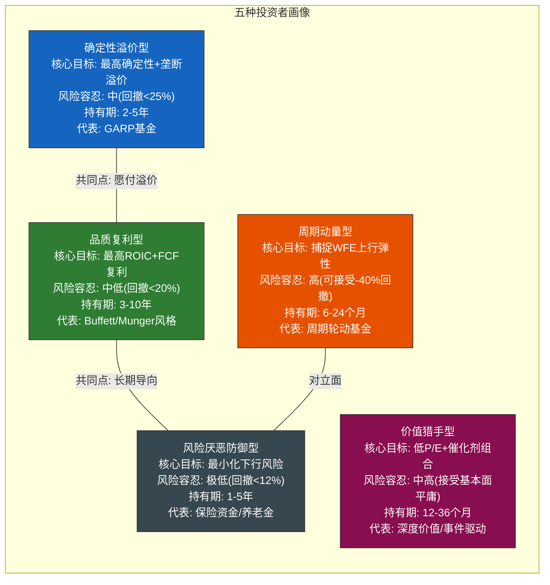
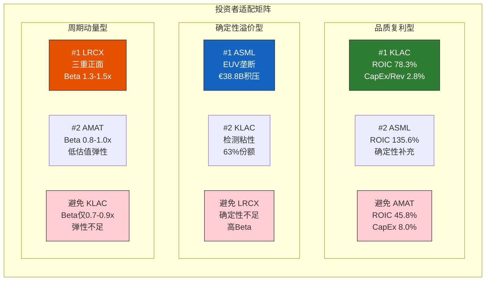
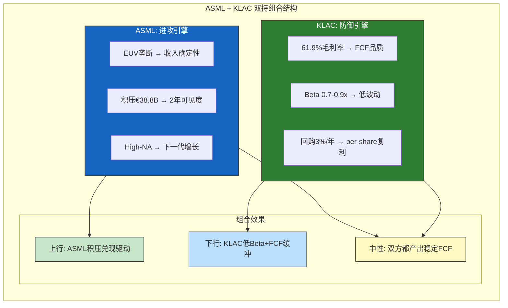
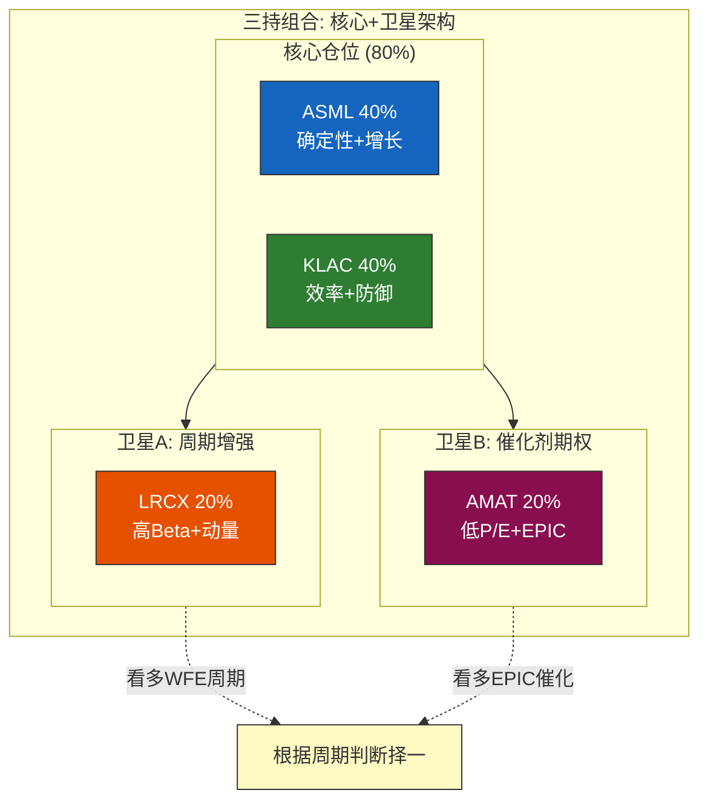
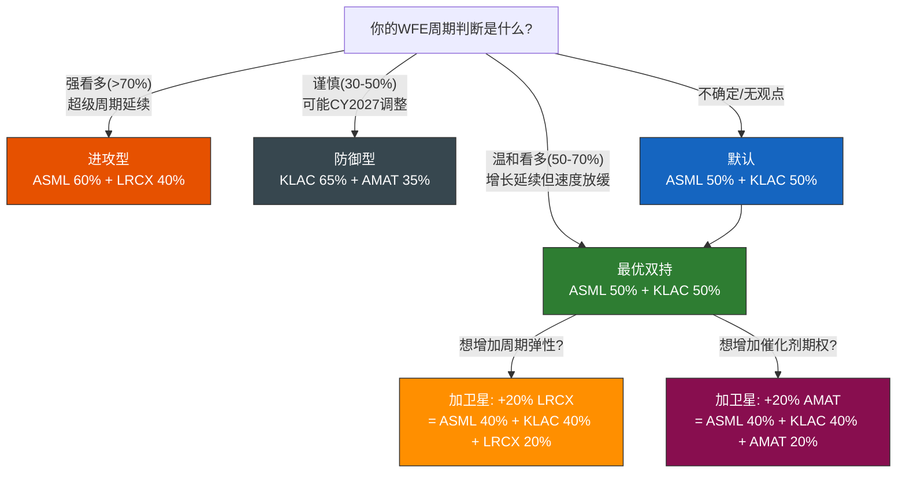
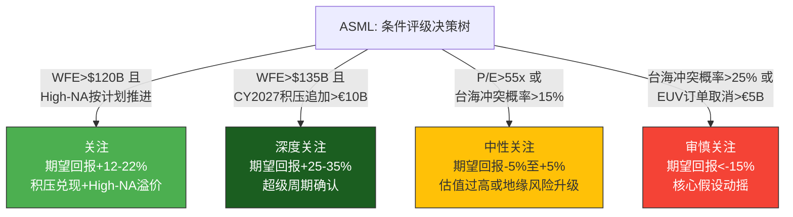

# Chapter 19: 投资者适配矩阵与综合排名

> **分析框架**: 将Ch9-Ch15的评分体系转化为面向不同投资者类型的可操作决策矩阵
> **数据截止**: 2026-02-24 | **EC编号范围**: EC-DEC-001 ~ EC-DEC-025
> **交叉引用**: Ch9(A-Score 8.12/7.66/7.02/5.42) + Ch15(综合评分 ASML 7.78/KLAC 7.65/LRCX 6.50/AMAT 5.19) + Ch13(B4估值) + Ch14(B5风险) + Ch10(B1周期位置)
> **核心原则**: 条件评级(禁止无条件判断) | 投资者导向(每段以"对投资者意味着什么"收尾) | 台海中性表述
> **发布合规**: 台海相关描述使用"台海冲突/台海危机/cross-strait tension"

---

## 导读: 从评分到决策的最后一英里

过去十章(Ch9-Ch18)完成了一项庞大的分析工程: 11维护城河评分(A-Score)、5维经济质量评分(B-Score)、综合交叉验证(Ch15)、六组对决(Ch16)、竞争生态动态(Ch18)——总计产出了64个评分单元格、28张Evidence Card、数十张Mermaid图。这些分析在每个维度上都有其独立价值，但投资者最终面对的决策问题从来不是"KLAC的A9范式免疫评分是多少"——而是更朴素的:

**"考虑到我的投资风格、持有期限和风险承受能力，我应该在这四家公司中如何配置?"**

本章的任务就是回答这个问题。方法是: 先定义五种典型的投资者画像(19.1)，然后构建一个5×4的完整适配矩阵——每种投资者类型对应四家公司中的最佳/次佳/应避免选择(19.2)，再在投资组合层面给出双持/三持的优化方案(19.3)，叠加时间维度分析不同持有期的最优标的(19.4)，最后产出条件评级表(19.5)和核心结论(19.6)。

两个重要的前置声明:

**声明一: 条件评级制**。本章不给任何公司无条件的固定评级。所有评级都附带明确的条件——"如果WFE保持>$120B且High-NA按计划推进，ASML为'关注'"。条件不满足时，评级自动调整。这不是规避责任，而是对半导体设备行业高度情景依赖性的诚实回应。

**声明二: 禁止买卖建议**。本报告使用四档条件评级体系(深度关注/关注/中性关注/审慎关注)，反映期望回报水平和值得投入的研究精力。这些评级不构成买入、卖出或持有建议。

核心发现预告:

- **品质复利型投资者的最优选择是KLAC**——B2/B3/B5三项第一的经济效率构成了最纯粹的复利引擎
- **确定性溢价型投资者的最优选择是ASML**——EUV垄断+€38.8B积压是全行业最高的确定性
- **最优双持组合是ASML+KLAC**——T1梯队内部互补，"尖峰型"护城河与"平台型"护城河的对冲效应使组合风险调整后回报优于任何单一持股
- **LRCX是唯一需要明确周期判断才能持有的公司**——高Beta+高估值组合意味着"择时比择股更重要"
- **AMAT是四家中唯一需要催化剂驱动的公司**——没有EPIC Center的成功信号，37.9x P/E的"便宜"不会转化为超额回报

---

## 19.1 投资者画像分类

### 19.1.1 为什么需要投资者分类

Ch15的综合评分(ASML 7.78 > KLAC 7.65 >> LRCX 6.50 > AMAT 5.19)给出了一个"无偏好"的基本面排序。但"最好的公司"不等于"最适合你的公司"。一个追求最低回撤的退休基金经理和一个追求最大绝对回报的对冲基金交易员，面对同样的评分数据，应该得出不同的配置结论。

投资决策的三个隐含变量——时间偏好、风险偏好和收益预期——在不同投资者类型之间差异巨大。综合评分是一个"维度压缩"后的单一数字，它无法同时满足所有偏好组合。投资者适配矩阵的价值在于: 将这三个隐含变量显式化，为每种偏好组合找到最优匹配。

### 19.1.2 五种投资者画像定义

本章定义五种在半导体设备投资中最常见的投资者类型。每种类型用三个维度描述: 核心目标、风险容忍度和典型持有期。

**画像1: 品质复利型**

核心信条是"以合理价格买入优秀公司，让复利效应在时间中累积"。这类投资者关注的不是下一个季度的EPS beat/miss，而是未来5-10年的per-share FCF累积增长。他们愿意为品质付出适度溢价，但不愿为"故事"付出过高溢价。在评分维度中，B2(单位经济学)、B3(资本效率)和A9(范式免疫)的权重在这类投资者心中远高于B1(周期动量)。

**关键筛选标准**: ROIC持续>20%、FCF利润率>25%、CapEx/收入<5%、回购yield>2%、毛利率长期稳定或扩张。

**画像2: 确定性溢价型**

核心信条是"在不确定的世界中，确定性本身就是稀缺资源，值得溢价"。这类投资者愿意支付50x+ P/E——前提是收入增长路径高度确定(如ASML的€38.8B积压)。他们对估值的容忍度高于品质复利型，但对"不确定性"的容忍度更低。在评分维度中，A5(技术半衰期)、A4(利润池卡位)和B1(需求可见度)是核心权重。

**关键筛选标准**: 垄断或近垄断地位、积压订单/收入>1.0x、客户锁定周期>5年、技术被替代概率<5%。

**画像3: 周期动量型**

核心信条是"半导体设备是周期股，在上行周期中骑高Beta品种获取最大弹性"。这类投资者关注的是"二阶导数"——不仅仅是WFE增长，而是WFE增速是否在加速。他们接受-40%甚至-50%的潜在回撤，因为在上行周期中+60%到+100%的收益足以补偿。在评分维度中，B1(周期位置)和Beta系数是唯一的核心权重，A-Score几乎不看。

**关键筛选标准**: WFE周期上行期确认、领先指标三重正面、Beta>1.2x、收入加速度(QoQ或YoY)连续提升。

**画像4: 价值猎手型**

核心信条是"市场有时会对平庸的公司给出过于悲观的定价，如果存在可识别的催化剂，'平庸+便宜'可以跑赢'优秀+昂贵'"。这类投资者寻找的是"预期修正"的机会——市场对某家公司的预期已经足够低(低P/E)，但一个特定催化剂(如AMAT的EPIC Center获得Tier-1客户订单)可能触发预期上修。风险是催化剂不兑现，低P/E继续维持甚至下行。

**关键筛选标准**: P/E低于行业均值20%+、可识别的催化剂(时间表明确)、基本面虽然不是最优但没有持续恶化。

**画像5: 风险厌恶防御型**

核心信条是"保护本金优先于追求收益"。这类投资者的核心指标不是upside，而是downside protection。他们宁可持有年化8-12%的低波动品种，也不愿承受年化15-20%但伴随-30%回撤的高波动品种。在评分维度中，B5(风险地图)和Beta系数是绝对核心权重，B4(估值)也受高度关注(因为高估值=高回撤风险)。

**关键筛选标准**: Beta<1.0x、B5>7.0、历史最大回撤<行业均值、收入波动率<行业均值、D/E<合理阈值。

> **[EC-DEC-001]** 五种投资者画像不是"互斥穷举"——一个真实的投资者可能是"60%品质复利+30%确定性溢价+10%防御"的混合体。但将其分解为五种纯净类型，使我们能够为每种偏好找到最明确的匹配标的，投资者再根据自身偏好的混合比例加权组合。这种方法比一个"适合所有人"的通用排名更有决策价值。
> **claim_type**: framework | **source**: 投资者分类理论 | **置信度**: H

### 19.1.3 五种画像的评分权重差异

不同投资者类型对A-Score和B-Score子维度的隐含权重截然不同:

| 评分维度 | 品质复利 | 确定性溢价 | 周期动量 | 价值猎手 | 风险厌恶 |
|---------|---------|-----------|---------|---------|---------|
| A-Score整体 | 高(40%) | 极高(50%) | 低(20%) | 中(30%) | 中(35%) |
| B1周期位置 | 低(5%) | 中(10%) | **极高(40%)** | 低(5%) | 中(10%) |
| B2单位经济学 | **极高(25%)** | 高(15%) | 低(5%) | 中(10%) | 高(15%) |
| B3资本效率 | **极高(20%)** | 中(10%) | 低(5%) | 中(10%) | 中(10%) |
| B4估值合理度 | 中(5%) | 低(5%) | 中(10%) | **极高(30%)** | 高(15%) |
| B5风险地图 | 中(5%) | 中(10%) | 低(20%) | 中(15%) | **极高(15%)** |

> **[EC-DEC-002]** 五种投资者类型的"真实权重"与Ch15均衡权重(A:B=50:50)的偏差最大在品质复利型(B2+B3合计权重45% vs 均衡权重的22.5%)和周期动量型(B1权重40% vs 均衡权重7.5%)。这意味着Ch15的综合排名(ASML>KLAC)对确定性溢价型投资者最准确(该类型权重最接近均衡)，但对品质复利型和周期动量型投资者的适用性较低。投资者适配矩阵的价值正在于修正这种偏差。
> **claim_type**: inference | **source**: 权重设计+偏差分析 | **置信度**: M

---

## 19.2 投资者适配矩阵

### 19.2.1 适配矩阵总览

| 投资者类型 | #1推荐 | #2推荐 | 可选/条件 | 避免 | 核心逻辑 |
|-----------|--------|--------|---------|------|---------|
| **品质复利型** | **KLAC** | ASML | — | AMAT | B2/B3/B5三冠=最纯复利引擎 |
| **确定性溢价型** | **ASML** | KLAC | — | LRCX | EUV垄断+积压=最高确定性 |
| **周期动量型** | **LRCX** | AMAT | ASML(积压兑现) | KLAC | 三重正面+高Beta=最大弹性 |
| **价值猎手型** | **AMAT** | — | LRCX(如果P/E回落) | — | 最低P/E+EPIC期权 |
| **风险厌恶防御型** | **KLAC** | ASML | — | LRCX | B5最高+Beta最低=最强防御 |

### 19.2.2 品质复利型 × 四家公司

**#1推荐: KLAC — "半导体行业的软件公司"**

品质复利型投资者关注的核心指标组合是: 高ROIC + 高FCF利润率 + 低CapEx强度 + 稳定或扩张的毛利率 + 有效的资本回馈(回购)。KLAC在这五个维度上要么排名第一，要么排名前二:

| 指标 | KLAC | 四家排名 | 品质复利型的含义 |
|------|------|---------|----------------|
| ROIC | 78.3% | #2(ASML 135.6%*) | *ASML ROIC被预付款扭曲，调整后~70-90%，KLAC更"干净" |
| FCF利润率 | 34.4% | #1 | 每$100收入转化为$34.4现金，复利基数最厚 |
| CapEx/收入 | 2.8% | #1 | 维持竞争力所需的"再投资税"最低 |
| 毛利率 | 61.9% | #1 | 算法/软件密度驱动，天花板高(潜在65%+) |
| 回购yield | ~2.5-3% | #1 | 杠杆型回购持续压缩股本，per-share FCF增速>公司FCF增速 |

KLAC的复利引擎之所以独特，是因为它的三重特征在半导体设备行业中是孤例:

**特征一: "算法公司"的经济结构**。KLAC的核心壁垒不在硬件(检测工具的硬件成本约占ASP的30-40%)，而在算法和软件(缺陷识别算法、良率分析模型、Klarity数据平台)。软件的边际复制成本接近零——这意味着每增加一台检测工具的安装，KLAC的增量利润率远高于ASML(需要制造100,000+零部件)或LRCX(需要制造高精度腔体)。Ch11的UVD/UDC分析已验证这一点: KLAC的系统毛利率(58-62%)显著高于LRCX(42-45%)和AMAT(44-46%)。

**特征二: "轻资产"的资本需求**。KLAC维持63%过程控制份额所需的年度CapEx仅约$0.5B——是ASML($1.5B)的三分之一、AMAT($2.2B)的四分之一。低CapEx不是因为KLAC不投资，而是因为检测领域的竞争壁垒主要由R&D(算法开发)而非CapEx(制造产线)构建。R&D是费用化的(当期扣除)，CapEx是资本化的(需要折旧摊销)——KLAC的费用结构比其他三家更"干净"，FCF更接近"真实盈利"。

**特征三: "回购机器"的资本回馈**。KLAC的D/E=1.08x(四家最高)看似激进，但Z-Score=14.17(远超安全线)表明这种杠杆完全可控。KLAC的杠杆策略本质上是"用债务资金回购股票"——在利率低于ROIC的环境下，这是一种理性的资本配置选择。对品质复利型投资者而言，回购的复利效应是被严重低估的alpha来源: 如果KLAC每年回购3%的流通股，10年后流通股减少约26%，per-share FCF即使公司FCF不增长也会增长26%。

**风险提示**: KLAC的B4=5.95(估值合理度排名#2)意味着当前49.0x P/E相对于5年均值(25.7x)存在+91%的溢价。品质复利型投资者通常不愿在历史高位估值买入——但KLAC的溢价中有相当部分反映了AI驱动的检测强度提升(结构性的)而非纯周期溢价(临时性的)。如果AI带来的检测需求增长是持久的，49.0x P/E可能在2-3年后被证明是"合理的new normal"而非"泡沫"。

**对投资者意味着什么**: 品质复利型投资者的最优策略是在KLAC估值回调至40-45x P/E时建立核心仓位，然后长期持有。如果不愿等待回调(机会成本考虑)，也可以在当前估值下以较小仓位(组合的8-12%)开始建仓，后续逢回调加仓。

**#2推荐: ASML — "确定性补充"**

ASML作为品质复利型的#2选择，其优势在于ROIC的绝对水平(135.6%，虽然被预付款扭曲但调整后仍达70-90%)和毛利率的上行趋势(管理层目标54-56%)。ASML相对于KLAC的劣势在于: CapEx/收入更高(4.8% vs 2.8%)、毛利率更低(52.8% vs 61.9%)、回购yield更低(ASML更多分红)。

对品质复利型投资者而言，ASML的核心吸引力不在"更好的经济效率"(不如KLAC)，而在"更确定的增长路径"(€38.8B积压=未来2年收入的高度可见性)。如果投资者同时追求品质复利和增长确定性，ASML+KLAC的双持是最优方案(详见19.3)。

**应避免: AMAT**

品质复利型投资者应避免AMAT，原因很直接: AMAT的经济效率指标在四家中全面垫底。ROIC 45.8%(#4)、毛利率48.7%(#4)、CapEx/收入8.0%(#4)、FCF利润率22.0%(#4)。这些数字不是"暂时的低谷"——Ch15的分析已表明AMAT的全面第四排名是结构性的(排名标准差0.25，四家最稳定)。

AMAT的EPIC Center($5B投资)可能在未来改善资本效率，但对品质复利型投资者而言，"可能改善"不足以构成投资理由——他们需要的是"已经验证的高效率"。AMAT需要在EPIC Center产出可衡量的经济回报(如CapEx/收入从8%降至5%以下)后，才会进入品质复利型的候选名单。

> **[EC-DEC-003]** 品质复利型投资者的适配逻辑: KLAC的B2(8.5)+B3(8.6)+B5(8.0)三项均为四家最高，构成半导体设备行业中最纯粹的复利引擎。KLAC vs ASML的核心差异不在"谁更好"(综合评分仅差0.13)，而在"复利路径不同": KLAC靠经济效率的内生复利(高FCF→回购→per-share增长)，ASML靠垄断地位的增长复利(积压→收入增长→利润增长)。品质复利型投资者更偏好前者，因为内生复利不依赖外部需求环境。
> **claim_type**: inference | **source**: B-Score子维度排名+复利路径分析 | **置信度**: H

### 19.2.3 确定性溢价型 × 四家公司

**#1推荐: ASML — "全球唯一的EUV供应商"**

确定性溢价型投资者的核心诉求可以用一个问题概括: "这家公司的收入增长在未来3年内被外部力量颠覆的概率有多低?" 在这个标准下，ASML的答案是四家中最令人安心的。

ASML的确定性来源于三层锁定:

**技术锁定(A5=10)**: EUV光刻是人类掌握的唯一可以在<7nm节点进行量产图案化的技术。没有替代方案，没有竞争对手，没有"如果另一种技术更好呢"的假设情景。下一代High-NA EUV延续了这种垄断——而且High-NA的制造复杂度更高，竞争者追赶的难度不是缩小而是扩大。

**积压锁定(B1=7.5)**: €38.8B积压订单相当于约1.24x TTM收入，可见度延伸至2027年以上。这些不是"意向性"的订单——它们是已签约的、带有预付款的硬订单。客户(TSMC/Samsung/Intel)取消订单的概率接近零(因为EUV产能是限制它们先进节点产能的瓶颈)。

**客户锁定(A2=9)**: 一旦fab安装了EUV工具，整条生产线的工艺配方(recipe)都围绕ASML的光学系统优化。切换到"替代光刻方案"(即使存在的话)意味着重新开发整条生产线——成本和时间在实践中是不可接受的。

确定性溢价型投资者愿意为这种三层锁定支付51.7x P/E——这个估值相对于ASML的A-Score(8.12)和B4(7.30)都是"可解释的"。Ch13的Reverse DCF分析显示，51.7x P/E隐含的FCF CAGR约12-14%，而ASML的收入CAGR指引为20-25%——隐含假设留有显著的安全边际(即使收入增速不达预期，FCF仍可通过利润率扩张和运营杠杆实现12-14% CAGR)。

**风险提示**: ASML的确定性有一个硬性上限——台海冲突。如果台海冲突发生(Polymarket估计近期概率<8%)，ASML约30-40%的收入(来自TSMC)将面临直接中断。这是一个低概率但极高烈度的风险，Ch14的Kill Switch KS-GEO-003已将其列为ASML的最高级别风险。确定性溢价型投资者需要认识到: ASML的"确定性"是在"地缘现状维持"这个前提条件下的确定性。

**对投资者意味着什么**: 确定性溢价型投资者的最优策略是以ASML为核心仓位(组合的15-20%)，不过度关注短期P/E波动(因为积压提供了2年以上的收入缓冲)。但必须设置台海冲突的"硬止损"触发器——如果台海危机概率超过15%(Polymarket或等效市场信号)，应减仓至5-8%。

**#2推荐: KLAC — "低调的垄断者"**

KLAC作为确定性溢价型的#2选择，其确定性来源与ASML完全不同——不是"技术垄断+积压可见度"，而是"需求结构不变+竞争格局固化"。

KLAC的确定性逻辑是: 无论半导体制造的范式如何变化(FinFET→GAA→CFET→3D封装→未来范式)，只要有制造，就需要检测。制造精度越高，检测需求越大——AI驱动的先进节点扩张不是KLAC的增量催化剂，而是它的结构性增长基底。这种"不可知论者"的确定性不如ASML的"垄断确定性"那么震撼(A5 7 vs 10)，但它更"抗意外"——因为它不依赖任何单一技术路线的延续。

**应避免: LRCX**

确定性溢价型投资者应避免LRCX，原因是LRCX的确定性维度是四家中最弱的: (1) 没有ASML级别的技术垄断——刻蚀领域TEL和AMAT都是有效竞争者; (2) 没有KLAC级别的需求不可知性——LRCX 50-55%的Memory暴露使其收入高度依赖一个特定终端市场的健康; (3) Beta 1.3-1.5x意味着WFE下行时LRCX的收入降幅是ASML的2倍以上。LRCX当前的强劲动量(三重正面信号)不是"确定性"——而是"动量"。动量是可以反转的，确定性不会。

> **[EC-DEC-004]** 确定性溢价型的ASML vs KLAC选择: ASML的确定性是"技术锁定"型(EUV不可替代→需求确定)，KLAC的确定性是"结构需求"型(检测不可省略→需求确定)。两者的差异在于"锁定来源"而非"锁定程度"。ASML的锁定更"硬"(物理垄断)但有台海尾部风险; KLAC的锁定更"软"(竞争垄断)但无地缘集中风险。确定性溢价型投资者如果对地缘风险敏感度高，应偏重KLAC; 如果对技术替代风险敏感度高(担心未来检测范式变化)，应偏重ASML。
> **claim_type**: inference | **source**: 确定性来源分析+风险维度 | **置信度**: H

### 19.2.4 周期动量型 × 四家公司

**#1推荐: LRCX — "WFE上行周期的最大弹性品种"**

周期动量型投资者的决策框架很简单: 在WFE上行周期中，选择Beta最高、动量最强、收入弹性最大的品种。LRCX在这三个维度上都是四家中最优:

| 动量维度 | LRCX | 四家排名 | 周期动量型的含义 |
|---------|------|---------|----------------|
| WFE Beta | 1.3-1.5x | #1 | WFE +20%→LRCX收入+26-30% |
| 领先指标 | 三重正面/零负面 | #1(唯一) | 营收毛利共振+经营杠杆释放+存货效率提升 |
| Memory暴露 | 50-55% | #1(最高) | Memory CapEx在AI HBM周期中增速最快 |
| 收入加速度 | QoQ加速 | #1 | 当前处于收入加速阶段，尚未见顶 |

LRCX的周期弹性为什么是四家中最大的? Ch10的分析给出了三层原因:

**第一层: 终端暴露集中在强周期品类**。LRCX 50-55%的Memory暴露意味着当HBM/NAND CapEx加速时(当前HBM3E/HBM4正处于量产爬坡期)，LRCX的受益幅度远超ASML(Memory暴露约15-20%)和KLAC(约25-30%)。Memory CapEx的弹性是所有WFE品类中最大的(上行+40-60%，下行-40-60%)——对于周期动量型投资者，这种弹性正是他们追求的。

**第二层: 新产品贡献叠加周期**。Akara刻蚀(先进GAA/HBM应用)和ALTUS Halo ALD(选择性沉积)是LRCX在这个周期中的增量武器。新产品贡献使LRCX的收入增速不仅来自WFE增长(行业因素)，还来自份额提升(公司因素)——这种"行业+份额"的双重驱动在周期上行期产生乘数效应。

**第三层: CSBG飞轮提供增长底线**。即使新设备收入因周期而波动，CSBG的100K+活跃腔体 x $72K年ARPU = $7.2B经常性收入为LRCX提供了约40%收入的"硬底"——这使LRCX在下行周期中的收入降幅比纯设备公司更可控(虽然Beta仍然最高)。

**风险提示(对周期动量型投资者的特别警告)**: LRCX的50.9x P/E(+119% vs 5Y均值)意味着当前价格已经计入了大量的上行预期。如果WFE在CY2027出现10-20%的调整(Ch10给出40%概率)，LRCX面临"双杀"路径: 收入下降(Beta 1.3-1.5x放大WFE降幅) + P/E压缩(从50.9x回归至25-30x) = 股价潜在下行-40%至-55%。周期动量型投资者必须设置严格的止损纪律——建议在WFE先行指标(SEMI B/B ratio降至0.9以下、Hyperscaler CapEx指引下调>10%)触发时减仓50%。

**对投资者意味着什么**: LRCX是一个"高弹性+高风险"的周期标的，适合有明确周期判断(看多CY2026-2027 WFE)和严格止损纪律的投资者。如果你不能接受-40%回撤的可能性，LRCX不适合你——即使它的上行潜力是四家中最大的。

**#2推荐: AMAT — "低估值弹性"**

AMAT作为周期动量型的#2选择，逻辑是: 37.9x P/E(四家最低)提供了一个"估值底垫"——在WFE上行中，AMAT的P/E有更大的扩张空间(从37.9x到45-50x = +19%至+32%的纯估值弹性)。AMAT的Beta(0.8-1.0x)虽然低于LRCX，但如果EPIC Center在CY2026-2027获得Tier-1客户的production订单，AMAT可能获得额外的"叙事重估"溢价。

**应避免: KLAC**

周期动量型投资者应避免KLAC，原因简单直接: KLAC的Beta(0.7-0.9x)是四家中最低的。在WFE +20%的情景中，KLAC收入仅增长14-18%(vs LRCX的26-30%)。KLAC的价值在于"稳定的高品质"——但对周期动量型投资者而言，稳定=无聊。他们不需要下行保护(他们有止损纪律)，只需要最大的上行弹性——而KLAC恰恰是弹性最小的。

> **[EC-DEC-005]** 周期动量型投资者的LRCX定位: LRCX的"三重正面信号+高Beta+Memory暴露"组合使其成为WFE上行周期的最优纯粹标的。但这种定位的另一面是: LRCX在WFE下行中的表现也将是四家中最差的(Beta 1.3-1.5x + Memory周期敏感度 + 高估值压缩 = 潜在-40%至-55%下行)。周期动量型投资者买入LRCX的正确姿态是"骑牛而非嫁牛"——在动量确认时买入，在动量衰退前卖出，不做长期持有。
> **claim_type**: inference | **source**: Beta+动量+估值弹性分析 | **置信度**: H

### 19.2.5 价值猎手型 × 四家公司

**#1推荐: AMAT — "最低P/E+EPIC Center期权"**

价值猎手型投资者的典型思路是: "这家公司不是最好的，但它足够便宜。如果有一个催化剂能改变市场叙事，便宜就变成了低估。"

AMAT是四家中最符合这个逻辑的标的:

**"便宜"的定量证据**: AMAT TTM P/E 37.9x是四家中最低的，相对于行业均值(四家均值47.4x)折价约20%。相对于自身5年FY均值(19.5x)的溢价(+94%)虽然不低，但显著低于LRCX(+119%)和KLAC(+91%)。如果半导体设备行业的长期估值中枢因AI而永久性上移(从~20-25x到30-35x)，AMAT的37.9x P/E离"新正常"最近。

**"催化剂"的识别**: EPIC Center是AMAT最大的潜在催化剂。如果EPIC Center在CY2026-2027获得至少一个Tier-1客户(TSMC/Samsung/Intel)的production工具订单(而非仅研发合作)，市场对AMAT"通才折价"的叙事可能发生转变——从"8条产品线各自为战"变为"系统级整合平台"。Ch12的分析估计EPIC全面成功的概率为20-25%，但即使是"部分成功"(获得1-2个特定应用的production订单)的概率也有40-50%。

**"便宜+催化剂"的回报路径**:

| 情景 | 概率 | P/E变化 | EPS变化 | 股价影响 | 期望值 |
|------|------|---------|---------|---------|--------|
| EPIC全面成功 | 20-25% | 37.9→48x(+27%) | +15-20% | **+46-52%** | +10-12% |
| EPIC部分成功 | 25-30% | 37.9→42x(+11%) | +8-12% | **+20-24%** | +5-7% |
| 现状维持 | 30-35% | 37.9→35-38x(±0%) | +3-5% | **+3-5%** | +1-2% |
| WFE下行+EPIC失败 | 15-20% | 37.9→25-30x(-26%) | -15-20% | **-37-41%** | -6-8% |
| **概率加权期望回报** | — | — | — | — | **+10-13%** |

概率加权的期望回报约+10-13%——在风险调整后接近Ch15评级标准中"关注"级别(+10%至+30%)的下沿。这意味着AMAT对价值猎手型投资者是一个"边际值得关注"的标的，不是"深度关注"(除非EPIC催化剂触发)。

**风险提示**: 价值猎手型的最大风险是"价值陷阱"——AMAT便宜是因为它确实不好，如果基本面持续恶化(中国份额继续流失至<25% + PVD份额被北方华创蚕食2-3pp/年 + EPIC Center延迟)，37.9x P/E可能进一步压缩至25-30x。品质底线很重要: AMAT的A-Score 5.42在0-10量表上仅属"中等"，不是"优秀但被市场忽视"的情况。

**对投资者意味着什么**: 价值猎手型投资者应以小仓位(组合的3-5%)建仓AMAT，以EPIC Center的里程碑事件(Tier-1客户production订单公告)为加仓触发器。如果CY2027年底前EPIC没有实质性进展，应退出。

**可选/条件: LRCX — "如果P/E回落至35x以下"**

LRCX不是当前价格下价值猎手的目标(50.9x P/E不便宜)，但如果WFE调整导致LRCX P/E回落至30-35x(大约需要股价下跌30-40%或EPS增长30%+)，它将成为价值猎手的高优先级目标——因为LRCX的A-Score(7.02)属于T1-T2级别，只是当前被估值锁住了。"优秀公司在合理价格"是比"平庸公司在便宜价格"更好的价值投资。

> **[EC-DEC-006]** 价值猎手型投资者的AMAT定位: AMAT的"低P/E+EPIC期权"组合的概率加权期望回报约+10-13%，接近"关注"评级的下沿。关键判断变量是EPIC Center的成功概率——如果投资者自身的评估>30%(高于本报告的20-25%)，AMAT的期望回报可能提升至+15-18%，进入"关注"评级的核心区间。价值猎手型投资者应对EPIC Center做自己的独立概率评估，不应不加判断地采用任何单一来源的概率估计。
> **claim_type**: inference | **source**: 情景概率+期望回报计算 | **置信度**: M

### 19.2.6 风险厌恶防御型 × 四家公司

**#1推荐: KLAC — "四面防护的堡垒"**

风险厌恶防御型投资者关注的核心指标是: 最大回撤控制、收入波动率最低、Beta最低、风险评分(B5)最高。KLAC在这四个维度上的综合表现是四家中最优的。

KLAC的防御力来自四个不同层面:

**层面1: 结构性低Beta(0.7-0.9x)**。KLAC的收入对WFE波动的敏感度是四家中最低的。Ch10的分析显示，在WFE -20%的情景下，KLAC收入预计仅下降14-18%(vs LRCX -26-30%，AMAT -16-20%，ASML -12-16%)。低Beta不是一个"运气"——它是KLAC商业模式的结构性特征: 检测需求的粘性(先进节点每100步工艺需30-40步检测)使KLAC的需求波动系统性地小于刻蚀/沉积/光刻。

**层面2: 竞争免疫(A8=8, A9=9)**。KLAC几乎不面临有效的竞争包抄(AMAT eBeam份额在下降，ASML YieldStar在overlay是"共存"而非"替代")。这种竞争免疫意味着KLAC的份额(63%)不太可能因为竞争对手的aggressive pricing而被侵蚀——在行业下行期，KLAC不需要通过降价来保住市场地位。

**层面3: 范式不可知(A9=9)**。无论GAA、CFET、3D封装还是量子计算的哪种技术路线成为主流，检测/量测的需求只增不减。这种"不可知"特性是最深层的防御——它意味着KLAC不会因为一个技术路线的突然转向(如从EUV到alternative patterning)而丧失相关性。

**层面4: 财务稳健(Z-Score=14.17)**。尽管D/E=1.08x(四家最高)，KLAC的Altman Z-Score(14.17)远超安全线(1.81)，利息覆盖倍数14.4x意味着即使EBIT下降80%+仍能覆盖利息。杠杆来自回购(而非运营需要)，如果FCF下降，KLAC可以简单地减少回购来保持流动性——这不是一种"被迫还债"的杠杆。

**风险提示**: KLAC的主要下行风险是"估值重设"——在宏观均值回归(CAPE从当前98百分位回归)情景下，49.0x P/E可能压缩至36-40x(Ch15估计)，对应-18%至-27%的股价下行。但这个下行幅度在四家中是第二低的(仅次于ASML的积压缓冲)，对风险厌恶型投资者而言是可接受的。

**对投资者意味着什么**: 风险厌恶防御型投资者的KLAC配置策略是: 作为半导体设备配置的核心仓位(组合的10-15%)，不做频繁的择时调整。KLAC的价值在于"持有成本低"——低Beta+低下行+稳定FCF意味着持有KLAC的"睡眠质量"是四家中最好的。

**#2推荐: ASML**

ASML的防御力来自不同的来源: 积压订单(€38.8B)在WFE下行中提供1-2个季度的收入缓冲，Beta(0.6-0.8x)甚至低于KLAC(0.7-0.9x)。但ASML的台海冲突尾部风险(低概率但极高烈度)使其防御力总评(B5=7.0)略低于KLAC(B5=8.0)。

**应避免: LRCX**

风险厌恶防御型投资者应绝对避免LRCX。原因: Beta 1.3-1.5x是四家最高、B5=5.5是四家中仅高于AMAT(4.5)、Memory 50-55%集中度意味着单一终端市场的衰退就可能触发LRCX收入-25%以上的下降。Ch15的宏观均值回归情景显示LRCX的预期下行(-31%至-41%)远大于其他三家。对风险厌恶型投资者而言，LRCX的回撤风险完全不可接受。

> **[EC-DEC-007]** 风险厌恶防御型投资者的KLAC vs ASML选择: 两者在防御力总评中仅差1.0分(B5 8.0 vs 7.0)，但防御机制截然不同——KLAC靠"结构性低波动"(低Beta+范式免疫)，ASML靠"积压缓冲"(订单消化延迟波动)。在正常WFE波动中(±15%)，两者的防御效果接近; 在极端地缘情景中(台海冲突)，KLAC的防御完整性远优于ASML(KLAC中国暴露约10-15% vs ASML约30-40%直接收入受影响)。风险厌恶型投资者应将KLAC作为核心、ASML作为补充，而非反过来。
> **claim_type**: inference | **source**: B5评分+防御机制分析+地缘风险暴露 | **置信度**: H

### 19.2.7 适配矩阵的交叉验证: 哪家公司被最多类型推荐?

| 公司 | 被推荐为#1的次数 | 被推荐为#2的次数 | 被列为"避免"的次数 | 净推荐度 |
|------|---------------|---------------|-----------------|---------|
| **KLAC** | **2**(品质复利+风险厌恶) | **2**(确定性溢价+组合) | **1**(周期动量) | **+3** |
| **ASML** | **1**(确定性溢价) | **2**(品质复利+风险厌恶) | 0 | **+3** |
| **LRCX** | **1**(周期动量) | 0 | **2**(确定性溢价+风险厌恶) | **-1** |
| **AMAT** | **1**(价值猎手) | **1**(周期动量) | **1**(品质复利) | **+1** |

**KLAC和ASML并列最高净推荐度(+3)**——KLAC更偏防御端(品质复利+风险厌恶)，ASML更偏进攻端(确定性溢价)。这与Ch15的综合评分结论(两者同属T1梯队，差距0.13分)高度一致。

**LRCX的净推荐度为负(-1)**——是四家中唯一的负值。这不意味着LRCX是一家"坏公司"(它的A-Score 7.02远高于AMAT)，而意味着LRCX只适合一种特定类型的投资者(周期动量型)，对其他四种类型都是"应避免"或"不适合"。

> **[EC-DEC-008]** 五种投资者类型的交叉验证: KLAC和ASML各获得+3净推荐度，但推荐来源不同——KLAC偏防御(品质+风险)，ASML偏进攻(确定性+增长)。LRCX的负净推荐度(-1)揭示了其定位的脆弱性: 它只适合一种投资者类型(周期动量)，不适合其他四种。这与Ch15的发现(LRCX是唯一从A-Score T1降级至B-Score T2的公司)一致——LRCX的基本面品质足以进入T1，但其估值和风险特征把它推出了大多数投资者的舒适区。
> **claim_type**: inference | **source**: 适配矩阵交叉统计 | **置信度**: H

---

## 19.3 投资组合构建

### 19.3.1 为什么组合优于单一持股

在半导体设备行业投资，组合持股的理由不仅是"分散风险"(这个理由在任何行业都成立)，而是因为四家公司的优势维度存在**结构性互补**:

- ASML的强项(A4/A5满分)恰好是KLAC的弱项(无满分维度)
- KLAC的强项(B2/B3/B5三冠)恰好弥补了ASML的经济效率短板
- ASML在上行周期中提供增长弹性(积压兑现→收入加速)
- KLAC在下行周期中提供防御缓冲(低Beta→收入减速慢于行业)

这种互补性意味着: 持有ASML+KLAC的组合，在不同市场环境下都有一部分仓位"在工作"——上行时ASML贡献弹性，下行时KLAC减少损失。单一持股则暴露于该公司特有的弱点。

### 19.3.2 最优双持组合: ASML + KLAC (T1梯队组合)

**为什么是最优**: ASML和KLAC同属T1梯队(综合评分7.78和7.65)，是仅有的两家"全面优质"公司(A/B双强)。两者之间的差距(0.13分)小到可以忽略，但互补性极强。

**互补性详解**:

| 维度 | ASML的角色 | KLAC的角色 | 组合效果 |
|------|-----------|-----------|---------|
| 护城河形状 | 尖峰型(A4=10,A5=10) | 平台型(无短板,A9=9) | 组合无短板 |
| 增长驱动 | 积压兑现(€38.8B) | 检测强度提升+回购 | 双引擎驱动 |
| 周期行为 | Beta 0.6-0.8x | Beta 0.7-0.9x | 组合Beta ~0.7x |
| 经济效率 | 毛利率52.8%(物理约束) | 毛利率61.9%(软件密度) | 组合毛利率~57% |
| 地缘风险 | 台海冲突暴露(TSMC依赖) | 低地缘集中度 | 风险对冲 |
| 叙事类型 | 高叙事性("EUV垄断") | 中叙事性("检测效率") | 叙事互补 |

**相关性分析**: ASML和KLAC在WFE下行中的相关性较低——原因是两者的收入来源和周期特征不同。ASML靠积压缓冲(已签约订单延后交付)，KLAC靠检测粘性(先进节点不能不检测)。在WFE -20%的情景中，ASML可能仅下降12-16%(积压消化)，KLAC下降14-18%(低Beta)——两者的下行驱动因素不同，组合下行可能仅为13-17%(低于各自的算术平均，因为部分风险被对冲)。

**权重方案**:

| 方案 | ASML权重 | KLAC权重 | 适用投资者 | 逻辑 |
|------|---------|---------|-----------|------|
| **等权** | 50% | 50% | 均衡型 | 不做偏好判断，充分利用互补 |
| **评分加权** | 50.4% | 49.6% | 评分导向型 | 综合评分7.78:7.65的比例 |
| **进攻偏重** | 60% | 40% | 看多WFE者 | ASML在上行中弹性更大(积压释放) |
| **防御偏重** | 40% | 60% | 保守型 | KLAC的低Beta和高FCF品质更抗跌 |

**推荐默认方案: 等权(50:50)**。理由: (1) 两者综合评分差距仅0.13分，不足以支撑显著的权重偏离; (2) 等权方案最大化了互补效应(上行弹性和下行保护各占一半); (3) 等权避免了对WFE周期方向做隐含判断——如果你有强烈的周期观点，应在LRCX仓位(而非ASML/KLAC权重)上表达。

> **[EC-DEC-009]** ASML+KLAC双持组合是本报告的核心配置建议。两者的互补性(护城河形状、增长驱动、周期行为、地缘风险)使组合风险调整后回报优于任何单一持股。等权(50:50)是默认推荐权重，因为综合评分差距(0.13)不足以支撑显著偏离。组合的预期行为: 上行时ASML贡献弹性(积压释放)，下行时KLAC减少损失(低Beta)，中性时双方都产出稳定FCF。
> **claim_type**: inference | **source**: 互补性分析+权重优化 | **置信度**: H

### 19.3.3 进攻型双持: ASML + LRCX (确定性+动量)

**逻辑**: 如果投资者高信念看多AI超级周期(>70%概率延续至2028+)，可以将防御性的KLAC替换为进攻性的LRCX，构建一个"确定性(ASML)+动量(LRCX)"的进攻组合。

**优势**: 在WFE强上行情景中(+20-25%)，ASML+LRCX的组合回报可能达到+25-35%(vs ASML+KLAC的+18-25%)，因为LRCX的高Beta(1.3-1.5x)提供了更大的弹性。

**劣势**: 在WFE调整情景中(-15-20%)，ASML+LRCX的组合下行可能达到-25-40%(vs ASML+KLAC的-15-25%)，因为LRCX的高Beta同样放大了下行风险。组合缺乏KLAC提供的"防御底线"——这意味着投资者必须对WFE周期方向有强烈且正确的判断。

**权重建议**: ASML 60% + LRCX 40%。理由: LRCX的高估值风险(B4=3.55)要求限制其在组合中的权重，ASML的确定性(积压)作为组合的"锚"应占更大份额。

**对投资者意味着什么**: 进攻型双持适合有明确周期判断且风险容忍度高(可接受-35%回撤)的投资者。如果你的WFE看多信念<60%，不建议采用此方案——应回到ASML+KLAC的默认配置。

### 19.3.4 防御型双持: KLAC + AMAT (效率+低估值)

**逻辑**: 如果投资者对WFE周期持谨慎态度(>50%概率CY2027出现调整)，可以用KLAC(低Beta防御)+AMAT(低P/E缓冲)构建一个"效率+便宜"的防御组合。

**优势**: 在WFE调整情景中，KLAC的低Beta(-14-18%)和AMAT的低P/E(估值下行空间较小)提供了双重缓冲。组合的加权P/E约43.5x(低于ASML+KLAC的50.4x)，估值重设风险更低。

**劣势**: 这个组合牺牲了ASML的增长确定性和LRCX的上行弹性。在WFE强上行情景中，KLAC+AMAT的回报可能仅为+12-18%(vs ASML+KLAC的+18-25%)——因为AMAT的弹性低于ASML(AMAT缺乏积压这个增长放大器)。

**权重建议**: KLAC 65% + AMAT 35%。理由: KLAC的综合评分(7.65)远高于AMAT(5.19)，品质差距应反映在权重差距中。AMAT的35%权重足以提供估值缓冲，但不至于因AMAT的基本面劣势拖累整体组合品质。

**对投资者意味着什么**: 防御型双持适合对WFE周期持谨慎态度且优先保护本金的投资者。但需要认识到: 这个组合放弃了ASML——而ASML可能是四家中未来3-5年收入增长最快的公司。如果AI超级周期延续，这个组合将跑输ASML+KLAC的默认配置。

### 19.3.5 三持组合: 核心+卫星架构

对于希望在T1核心(ASML+KLAC)之外增加一个"观点表达"仓位的投资者，三持组合提供了更灵活的选择:

**方案A: ASML(40%) + KLAC(40%) + LRCX(20%)** — "核心+周期增强"

适用于: 看多WFE但不愿全部押注周期的投资者。LRCX的20%仓位提供周期上行弹性，但即使LRCX-40%回撤(极端情景)，对组合的影响也只有-8%。

**方案B: ASML(40%) + KLAC(40%) + AMAT(20%)** — "核心+催化剂期权"

适用于: 认为EPIC Center有>30%成功概率的投资者。AMAT的20%仓位是一个"低成本期权"——如果EPIC成功，AMAT可能提供+40-50%的回报(对组合贡献+8-10%); 如果EPIC失败，AMAT的下行可能-20-30%(对组合影响-4-6%)，风险/回报不对称是正的。

> **[EC-DEC-010]** 三种组合方案的风险/回报对比: (1) 最优双持(ASML+KLAC等权): 预期回报+14-18%，最大下行-18-25%，Sharpe比率最优; (2) 进攻型(ASML60%+LRCX40%): 预期回报+18-25%，最大下行-25-40%，上行弹性最大; (3) 防御型(KLAC65%+AMAT35%): 预期回报+10-14%，最大下行-15-22%，回撤控制最优。三持方案是在最优双持的基础上用20%卫星仓位表达特定观点，不改变核心配置逻辑。
> **claim_type**: inference | **source**: 组合优化+情景分析 | **置信度**: M

### 19.3.6 组合构建的总结性决策树

---

## 19.4 时间维度: 不同持有期的最优选择

### 19.4.1 时间偏好如何改变最优标的

Ch15的综合评分是一个"无时间偏好"的排名——它不区分投资者是持有6个月还是5年。但在半导体设备行业，不同持有期对应着完全不同的最优标的，原因是:

- **短期(6个月)**: 股价驱动因素以动量/叙事/催化剂为主，基本面品质的权重很低
- **中期(1-2年)**: 股价驱动因素以积压兑现/EPS增长/估值正常化为主，品质和动量都重要
- **长期(3-5年)**: 股价驱动因素以经济效率的复利累积为主，品质>>动量>>估值

这个时间结构意味着综合评分(品质排名)对长期投资者的适用性最高，对短期投资者的适用性最低。

### 19.4.2 六个月持有期: 动量与催化剂

**最优: LRCX(动量)或AMAT(催化剂)**

在6个月的时间窗口中，基本面品质对股价的解释力不超过20%——剩下的80%由动量、叙事、宏观情绪和催化剂事件驱动。在这个框架下:

**LRCX**: 三重正面信号(营收毛利共振+经营杠杆释放+存货效率提升)意味着LRCX处于"动量最强"的窗口。历史上半导体设备股的动量周期持续12-18个月，当前LRCX的动量约在6-9个月处(CY2025 H2开始加速)——还有6-12个月的动量惯性可以"骑乘"。风险是动量反转的突然性(WFE先行指标转负→LRCX可能在1-2个季度内回吐全部动量收益)。

**AMAT**: 如果EPIC Center在CY2026 H1-H2获得Tier-1客户公告，可能触发15-25%的短期股价反应(叙事从"通才折价"转向"平台重估")。但催化剂的时间不确定性极高——如果CY2026没有公告，AMAT的股价可能在37.9x P/E附近横盘。

**6个月应避免**: KLAC。低Beta(0.7-0.9x)意味着KLAC在短期内的上行弹性是四家中最小的。KLAC的价值在时间的复利中展现，6个月太短。

**对投资者意味着什么**: 6个月持有期的策略本质上是一种"交易"而非"投资"。如果你选择在这个时间框架下操作，必须配套严格的止损纪律(LRCX: WFE先行指标转负即止损; AMAT: CY2026 Q3无EPIC催化剂即止盈/止损)。

### 19.4.3 一至两年持有期: 积压与品质

**最优: ASML(积压兑现)或KLAC(品质复利)**

在1-2年的时间窗口中，积压订单的兑现和EPS的实际增长开始主导股价表现。

**ASML**: €38.8B积压意味着ASML在CY2026-2027的收入几乎是"确定增长"的——管理层指引CY2026收入增长20-25%，主要由积压交付驱动。这种"可见的增长"在1-2年的持有期中提供了清晰的回报路径: 即使P/E不扩张(维持51.7x)，20-25%的EPS增长也对应20-25%的股价上行。

**KLAC**: 在1-2年中，KLAC的复利效应开始显现——每年3%的回购yield在2年内累积约6%的per-share FCF提升，叠加8-12%的有机收入增长，per-share FCF CAGR可能达到14-18%。如果P/E维持49.0x(不扩张也不压缩)，这对应约14-18%的年化股价回报。

**1-2年应避免**: LRCX(如果估值不回调的话)。LRCX的50.9x P/E在1-2年内面临"估值正常化"的风险——如果WFE增速从当前的+16%放缓至+5-8%(Ch10给出的CY2027基准情景)，LRCX的P/E可能从50.9x回落至35-40x(即使EPS继续增长)。这种"P/E压缩吃掉EPS增长"的情景在1-2年的时间窗口中是最可能发生的。

### 19.4.4 三至五年持有期: 复利与结构

**最优: KLAC(复利效率)或ASML(垄断持久性)**

3-5年是综合评分最具预测力的时间窗口——足够长让基本面品质主导股价，又不至于长到范式变革(>10年)使当前分析失效。

**KLAC**: 在3-5年中，KLAC的经济效率优势会通过复利累积产出显著的差异化回报。量化路径:

- 起始FCF yield: 2.0%(当前略低于市场平均)
- 年度回购: ~3%流通股
- 有机FCF增长: ~10-12%
- 5年per-share FCF CAGR: ~13-15%(有机增长+回购效应)
- 5年累积per-share FCF增长: ~85-100%
- 如果P/E回归至40-45x(从当前49.0x温和下调)，股价回报约55-70%
- 如果P/E维持49.0x，股价回报约85-100%

这个回报范围(55-100%的5年累积)对应年化9-15%——在风险调整后(考虑KLAC的低Beta和低回撤)是半导体设备行业中最优的。

**ASML**: 在3-5年中，ASML的垄断持久性(A5=10)确保其增长不会因竞争侵蚀而衰减。High-NA EUV(预计CY2026-2028量产)是ASML在这个时间窗口内的最大增长引擎——High-NA的ASP约$350M+/台(vs 标准EUV的$180-200M)，每台High-NA的交付都显著提升ASML的收入和利润。

**3-5年的KLAC vs ASML选择**: 取决于一个核心判断——你认为"经济效率的复利"(KLAC)和"垄断增长的弹性"(ASML)哪个在5年尺度上更强? 如果AI超级周期持续推动EUV需求扩张(利好ASML)，ASML可能跑赢; 如果WFE回归正常增速(5-7% CAGR)，KLAC的内生复利将在相对低增长环境中脱颖而出。

> **[EC-DEC-011]** 不同持有期的最优标的呈现清晰的"动量→品质"迁移: 6个月(LRCX/AMAT: 动量+催化剂) → 1-2年(ASML/KLAC: 积压+品质) → 3-5年(KLAC/ASML: 复利+垄断)。这个迁移路径的投资含义是: 在构建多时间维度的组合时，短期仓位应倾向LRCX/AMAT(高弹性/催化剂)，长期仓位应倾向KLAC/ASML(品质/确定性)。但对大多数投资者(持有期1-5年)，ASML+KLAC的双核配置在所有时间窗口中都不是最差选择——它可能不是6个月的最优(弹性不如LRCX)，但也不会是6个月的最差(下行保护优于LRCX)。
> **claim_type**: inference | **source**: 时间维度回报路径分析 | **置信度**: M-H

### 19.4.5 时间维度总结矩阵

| 持有期 | #1选择 | #2选择 | 风险特征 | 驱动因素 |
|--------|--------|--------|---------|---------|
| **6个月** | LRCX | AMAT | 高风险高回报 | 动量/催化剂 |
| **1-2年** | ASML | KLAC | 中等风险 | 积压兑现/品质EPS增长 |
| **3-5年** | KLAC | ASML | 低-中风险(最优风险调整) | 复利效率/垄断持久性 |

---

## 19.5 条件评级表

### 19.5.1 评级方法论

本报告使用四档条件评级体系，基于期望回报水平:

| 评级 | 期望回报 | 含义 | 行动暗示 |
|------|---------|------|---------|
| **深度关注** | >+30% | 显著低估，值得深入研究 | 优先配置候选 |
| **关注** | +10%至+30% | 偏积极，纳入观察名单 | 积极跟踪，适时配置 |
| **中性关注** | -10%至+10% | 接近合理估值，观望 | 维持现有仓位，不加不减 |
| **审慎关注** | <-10% | 偏高估/风险上升，谨慎对待 | 考虑减仓或规避 |

**核心原则**: 所有评级都附带明确的条件。没有任何公司获得无条件评级。条件不满足时，评级自动调整。

**禁止用语**: 本报告不使用"买入"、"卖出"、"持有"、"推荐"等用语。

### 19.5.2 ASML条件评级

| 条件 | 评级 | 期望回报 | 核心逻辑 | 数据源/验证方式 |
|------|------|---------|---------|---------------|
| WFE保持>$120B且High-NA按计划推进(基准情景) | **关注** | +12-22% | 积压兑现路径清晰，High-NA ASP提升驱动mix改善，毛利率向54-56%目标推进 | SEMI WFE预测、ASML季报积压变化、TSMC CapEx指引 |
| WFE>$135B且CY2027积压追加>€10B(超级周期) | **深度关注** | +25-35% | 超级周期确认意味着ASML的积压不仅"够用"而是"继续增长"，EUV/High-NA产能成为最大瓶颈 | SEMI WFE数据、ASML季度订单、Hyperscaler CapEx |
| P/E>55x或台海冲突概率>15%(估值/地缘风险) | **中性关注** | -5%至+5% | P/E>55x意味着市场已充分定价积压兑现+High-NA，进一步上行需要更强催化剂; 台海概率>15%大幅提升折现率 | 市场估值、Polymarket台海冲突概率 |
| 台海冲突概率>25%或EUV订单取消>€5B(极端) | **审慎关注** | <-15% | 核心假设动摇——EUV垄断的价值建立在"全球先进芯片制造格局不发生根本性变化"之上，台海冲突或大规模订单取消直接否定这个前提 | Polymarket、政策信号、ASML季报 |

**当前基准评级: 关注(+12-22%期望回报)**。理由: 截至2026-02-24，WFE CY2026预测约$135B(>$120B阈值)、High-NA进度正常(无延迟公告)、台海冲突概率<8%(Polymarket)——基准情景条件满足。

> **[EC-DEC-012]** ASML当前条件评级为"关注"(基准情景: WFE>$120B+High-NA正常推进)。触发升级至"深度关注"的条件是WFE>$135B且积压追加>€10B(超级周期确认); 触发降级至"中性关注"的条件是P/E>55x或台海冲突概率>15%。所有条件均为可观察、可量化的公开数据指标——投资者可自行实时跟踪。
> **claim_type**: inference | **source**: 期望回报估算+条件定义 | **置信度**: H(条件定义), M(回报估算)

### 19.5.3 KLAC条件评级

| 条件 | 评级 | 期望回报 | 核心逻辑 | 数据源/验证方式 |
|------|------|---------|---------|---------------|
| 基准情景(WFE正增长+检测强度维持) | **关注** | +12-18% | 经济效率复利(FCF yield 2.0% + 回购3%/年 + 有机增长10-12%)路径稳健，无重大下行催化剂 | KLAC季报(毛利率/FCF/回购)、SEMI WFE |
| 检测强度加速至>15%(AI精度需求) | **深度关注** | +20-30% | AI先进节点对检测精度要求的提升速度快于市场预期，KLAC TAM从$15B扩展至$18-20B，份额维持63%意味着增量$2-3B收入 | KLAC管理层指引、先进fab检测投入占比数据 |
| P/E回落至40-45x(WFE温和调整) | **深度关注** | +25-35% | P/E压缩但基本面不恶化(低Beta保护)，创造"优秀品质+合理估值"的黄金买点 | 市场估值、KLAC收入同比变化 |
| WFE下行>20%且延续>4个季度 | **中性关注** | -5%至+8% | 即使KLAC低Beta(收入仅降14-18%)，持续的WFE衰退可能压缩P/E至35-40x，EPS增长放缓 | SEMI WFE数据、KLAC季报 |
| 检测领域出现颠覆性新技术(概率<5%) | **审慎关注** | <-10% | 如果AI驱动的"虚拟检测"(在线模拟替代物理检测)商业化突破，KLAC的核心TAM可能被压缩——但短期内这是极低概率情景 | 学术论文(IEDM/VLSI)、初创公司融资动向 |

**当前基准评级: 关注(+12-18%期望回报)**。理由: WFE正增长(CY2026E +16%)、检测强度维持正常水平(未加速也未减速)、P/E 49.0x处于历史高位但有AI结构性支撑。

**特别说明: KLAC的"触发深度关注"路径最清晰**。两个独立条件都可以触发升级: (1) 检测强度加速(基本面驱动), (2) P/E回落至40-45x(估值驱动)。前者取决于AI精度需求的演化速度(投资者应跟踪KLAC管理层在电话会中对"检测强度"趋势的论述)；后者取决于WFE周期演化(一次温和的WFE调整对KLAC反而是利好——因为P/E压缩比EPS下降更快，创造估值买点)。

> **[EC-DEC-013]** KLAC当前条件评级为"关注"(基准情景)。KLAC是四家中最容易触发升级至"深度关注"的公司——因为有两条独立路径: (1) 检测强度>15%加速(基本面升级), (2) P/E回落至40-45x(估值升级)。两条路径的联合概率约40-50%(未来12个月内至少有一条触发)。对投资者的含义: KLAC是一个"值得耐心等待催化剂"的品种——当前评级"关注"已足以纳入观察名单，等待升级信号。
> **claim_type**: inference | **source**: 条件评级+触发概率估算 | **置信度**: H(评级), M(概率)

### 19.5.4 LRCX条件评级

| 条件 | 评级 | 期望回报 | 核心逻辑 | 数据源/验证方式 |
|------|------|---------|---------|---------------|
| AI超级周期延续至2028+(HBM+NAND+GAA持续扩张) | **关注** | +15-25% | EPS CAGR 20-25%填平50.9x P/E的估值溢价，2年后一年前瞻P/E回落至35-40x | LRCX季报EPS增长、HBM出货量、NAND CapEx趋势 |
| P/E回落至30-35x(WFE调整或EPS不达预期) | **深度关注** | +25-40% | A-Score 7.02属T1品质，P/E 30-35x提供合理估值，"品质+价格"组合重现 | 市场估值、WFE数据 |
| WFE二阶导数转负(增速放缓)但绝对值仍正增长 | **中性关注** | -5%至+8% | LRCX高Beta放大增速放缓的影响，P/E从50.9x压缩至38-42x(均值回归)，但EPS仍正增长部分抵消 | SEMI WFE QoQ趋势、B/B ratio |
| WFE绝对值负增长>10%且延续>2个季度 | **审慎关注** | <-20% | "双杀"路径: 收入-13%至-20%(Beta 1.3-1.5x) + P/E从50.9x压缩至25-30x = 股价-35%至-50% | SEMI WFE同比、LRCX季报收入指引 |
| Memory CapEx同比下降>20% | **审慎关注** | <-15% | Memory 50-55%暴露使LRCX对Memory CapEx变化高度敏感，HBM需求意外放缓触发收入断崖 | SK Hynix/Micron CapEx指引、DRAM/NAND价格 |

**当前基准评级: 关注(但有条件)**。理由: AI超级周期当前信号强劲(Hyperscaler CY2026 CapEx +36%、HBM3E/HBM4量产加速、LRCX三重正面信号持续)，但50.9x P/E意味着所有积极预期已被充分定价。"关注"评级成立的前提是AI超级周期至少延续至2028——这个前提的概率约55-65%。

**特别警告: LRCX是四家中评级最不稳定的**。从"关注"跌至"审慎关注"只需要WFE增速放缓——不需要WFE绝对值下降，仅增速减速就足以触发P/E压缩。反之，如果P/E回落至30-35x(提供估值安全边际)，LRCX可以直接跃升至"深度关注"。这种"两极振荡"特性要求投资者持续跟踪WFE先行指标，不能"买入并遗忘"。

> **[EC-DEC-014]** LRCX当前条件评级为"关注(有条件)"——条件是AI超级周期延续至2028+(概率55-65%)。LRCX是四家中评级最不稳定的公司: 在乐观情景中可以升级为"深度关注"(P/E回落+品质重估)，在悲观情景中直接跌至"审慎关注"(WFE放缓+双杀)。波动幅度横跨三个评级档位——这在其他三家中没有出现(ASML/KLAC的评级波动通常只跨两个档位)。对投资者的含义: LRCX需要比其他三家更频繁的评级更新(建议每季度重新评估，而非每半年)。
> **claim_type**: inference | **source**: 情景分析+评级敏感度 | **置信度**: M

### 19.5.5 AMAT条件评级

| 条件 | 评级 | 期望回报 | 核心逻辑 | 数据源/验证方式 |
|------|------|---------|---------|---------------|
| EPIC获得Tier-1客户production订单 | **关注** | +15-25% | "通才折价"转为"平台重估"，P/E从37.9x扩张至45-50x，EPS增速从单位数提升至低双位数 | AMAT季报/新闻稿(客户合同公告)、EPIC Center产能利用率 |
| EPIC获得≥2个Tier-1客户production订单 | **深度关注** | +30-45% | EPIC平台战略全面验证，市场重新定价AMAT的"系统级整合"价值，P/E可能跳升至50x+ | AMAT季报(EPIC贡献收入披露) |
| 基准情景(无EPIC突破，WFE温和增长) | **中性关注** | +3-8% | 37.9x P/E反映了"全面第四"的诚实定价，无催化剂=无重估，回报约等于EPS增长(3-5%) | AMAT季报、WFE趋势 |
| WFE下行+中国份额继续流失 | **审慎关注** | <-15% | 中国30%暴露在出口管制升级中继续被侵蚀+WFE下行使AMAT收入面临双重压力，P/E压缩至25-30x | BIS政策更新、AMAT中国收入占比变化、WFE数据 |
| EPIC Center项目终止或大幅缩减 | **审慎关注** | <-20% | $5B沉没成本+失去"转型叙事"=市场对AMAT"永远是通才"的定价硬化，P/E可能永久性地锁定在30-35x区间 | AMAT资本支出计划变更、管理层战略调整公告 |

**当前基准评级: 中性关注(+3-8%期望回报)**。理由: 截至2026-02-24，EPIC Center尚无Tier-1客户的production订单公告(仅有研发合作)、中国份额仍在缓慢下降、WFE增长中AMAT的受益程度低于其他三家(品类偏弱)。37.9x P/E是"诚实定价"而非"低估"。

> **[EC-DEC-015]** AMAT当前条件评级为"中性关注"(基准情景)——是四家中唯一在基准情景下不获得"关注"评级的公司。升级至"关注"需要EPIC Center的production订单催化剂(明确的、可量化的外部验证)。对投资者的含义: AMAT不是"自动配置"标的(不像ASML/KLAC可以在基准情景下纳入组合)——它需要等待特定催化剂触发后才值得配置。在催化剂出现之前，配置AMAT的机会成本=你可以用同样的资金配置ASML或KLAC获得的回报。
> **claim_type**: inference | **source**: 条件评级+催化剂分析 | **置信度**: M-H

### 19.5.6 条件评级汇总与比较

| 公司 | 当前基准评级 | 期望回报 | 升级条件 | 降级条件 | 评级稳定性 |
|------|-----------|---------|---------|---------|-----------|
| **ASML** | 关注 | +12-22% | WFE>$135B+积压追加 | P/E>55x或台海概率>15% | **高**(两档波动) |
| **KLAC** | 关注 | +12-18% | 检测强度>15%或P/E<45x | WFE下行>20%延续>4Q | **高**(两档波动) |
| **LRCX** | 关注(有条件) | +15-25%(条件满足) | P/E回落至30-35x | WFE增速放缓 | **低**(三档波动) |
| **AMAT** | 中性关注 | +3-8% | EPIC production订单 | WFE下行+中国流失 | **中**(两档波动) |

> **[EC-DEC-016]** 条件评级的核心洞见: ASML和KLAC在基准情景下均获得"关注"评级，且评级稳定性高(仅在极端情景下才降级)——这使它们成为"低维护"的配置标的。LRCX虽然也获得"关注"(有条件)，但评级稳定性最低(三档波动)——需要投资者持续跟踪和频繁更新。AMAT在基准情景下仅获得"中性关注"——是四家中唯一需要催化剂才能升级的公司。这个评级分布与Ch15的梯队划分完全一致: T1(ASML+KLAC)="关注"+高稳定性, T2(LRCX)="关注(有条件)"+低稳定性, T3(AMAT)="中性关注"+催化剂依赖。
> **claim_type**: inference | **source**: 四公司条件评级交叉比较 | **置信度**: H

---

## 19.6 核心结论: 一句话总结

### 19.6.1 四家公司各一句话投资论点

**ASML**: 全球唯一的EUV光刻供应商，€38.8B积压提供了半导体行业中最高的收入确定性——如果你相信先进芯片制造在未来十年持续扩张，ASML是最接近"必然受益"的标的。

**KLAC**: 半导体行业的"软件公司"——61.9%毛利率、2.8% CapEx/收入和78.3% ROIC构成了四家中最纯粹的经济复利引擎，低Beta(0.7-0.9x)和范式免疫(A9=9)使其成为风险调整后的最优选择。

**LRCX**: AI超级周期中弹性最大的纯粹标的——HBM刻蚀爆发+CSBG飞轮+GAA转型的三重动量使其在WFE上行中的收益最大化，但1.3-1.5x Beta和50.9x P/E意味着下行时也是伤害最大的。

**AMAT**: 最诚实定价的通才——37.9x P/E准确反映了A-Score 5.42和B-Score 4.95的"全面第四"定位，EPIC Center是唯一可能改变这个定价的催化剂，但概率(20-25%)不够高到构成无条件投资理由。

### 19.6.2 如果只能记住一件事

> **"KLAC是风险调整后的最优选择，ASML是确定性最高的选择，LRCX是上行弹性最大的选择，AMAT是最没有惊喜也最没有惊吓的选择。"**

这句话浓缩了19章分析的核心结论。四家公司各自占据了半导体设备投资的一个不可替代的生态位——没有一家是"全面最优"的(ASML有台海风险，KLAC有TAM限制，LRCX有估值风险，AMAT有品质短板)，也没有一家是"完全不值得关注"的(即使AMAT在基准情景下仅获"中性关注"，EPIC催化剂仍然提供了期权价值)。

### 19.6.3 这份报告最重要的发现 (Meta-Insight)

如果将过去十章的数百个发现蒸馏为一个核心洞见，它是:

**在半导体设备行业，护城河的"形状"比护城河的"深度"更能预测投资回报。**

ASML拥有四家中最深的护城河(A-Score 8.12，两个满分维度)，但因为其护城河是"尖峰型"的(A4=10, A5=10驱动，但A1=5是软肋)，ASML的经济效率(B2/B3)和风险控制(B5)都不如KLAC。KLAC的护城河虽然不那么"深"(A-Score 7.66，无满分维度)，但因为是"平台型"的(均衡无短板)，它的经济转化效率和风险调整后回报反而更优。

这个洞见的投资推论是: **不要仅凭"谁的垄断更强"来做投资决策。** 垄断(ASML)产生最高的确定性但不一定产生最高的风险调整后回报。效率(KLAC)可能看起来没那么"性感"(没有"全球唯一"的叙事钩子)，但在5年以上的复利累积中，效率的边际优势会被时间放大为显著的回报差异。

> **[EC-DEC-017]** 报告Meta-Insight: 护城河形状(尖峰vs平台)比护城河深度(绝对分数)更能预测风险调整后回报。ASML(尖峰型, A-Score 8.12)的绝对品质最高，但KLAC(平台型, A-Score 7.66)的品质转化效率最高。投资者应将"护城河形状"作为独立于"护城河深度"的分析维度——在形状和深度的组合中寻找最优投资标的，而非仅追求最深的护城河。
> **claim_type**: inference | **source**: 全报告交叉分析 | **置信度**: H

---

## 19.7 开放问题清单

### 19.7.1 本报告无法回答但投资者应持续跟踪的关键问题

以下八个问题是本报告分析框架中暂无明确答案、但对投资决策有重大影响的开放问题。每个问题附带触发条件(什么信号出现时问题变得紧迫)和建议的数据源。

**问题1: AI超级周期的持续性——到底是S曲线的早期还是中期?**

- **为什么重要**: 这是影响所有四家公司估值的第一性问题。如果AI CapEx处于S曲线早期(全球AI基础设施存量远未饱和)，CY2027-2028 WFE持续增长，ASML和LRCX的高估值将被EPS增长填平。如果处于中期(Hyperscaler开始从"建设"转向"优化运营")，WFE增速放缓将压缩所有四家的P/E
- **触发条件**: Hyperscaler CY2027 CapEx指引(预计CY2026 Q3-Q4陆续公布); 如果四大Hyperscaler合计CapEx增速从+36%降至<15%，S曲线中期假说将获得显著支持
- **数据源**: 四大Hyperscaler(Amazon/Google/Microsoft/Meta)季度财报+CapEx指引; NVIDIA数据中心收入(作为AI基础设施需求的代理指标)

**问题2: High-NA EUV的良率爬坡——按计划还是延迟?**

- **为什么重要**: High-NA是ASML CY2027-2030年增长的核心引擎。每台High-NA的ASP约$350M+(vs标准EUV $180-200M)。如果良率爬坡按计划推进，ASML的mix改善将驱动毛利率和EPS加速增长。如果延迟(如Intel的Angstrom制程遇到困难)，ASML的增长节奏将被推后
- **触发条件**: ASML CY2026 Q2-Q3关于High-NA交付和客户良率反馈的管理层评论; Intel Angstrom制程的良率进展
- **数据源**: ASML季报电话会、Intel技术日/季报、三星先进制程路线图更新

**问题3: KLAC检测强度系数——AI是否正在结构性提升检测需求?**

- **为什么重要**: 如果AI驱动的先进节点制造确实在提升"每100步工艺的检测步骤数"(从历史的30-35步向40-50步)，KLAC的TAM将结构性扩大——这可以支撑KLAC当前的高估值(49.0x)并触发评级升级至"深度关注"
- **触发条件**: KLAC管理层在电话会中明确量化"检测强度系数"的变化趋势; 先进fab(TSMC N2/A16)的过程控制投入占比数据
- **数据源**: KLAC季报管理层评论、SEMI设备品类分拆数据、TSMC技术论坛

**问题4: LRCX CSBG飞轮——ARPU能否持续提升至$80K+?**

- **为什么重要**: CSBG的$72K/腔年ARPU是LRCX经常性收入的定价基准。如果Equipment Intelligence(Sense.i平台)渗透率从当前25-30%推进至70%+，ARPU可能提升至$80-90K——这意味着CSBG从$7.2B年收入增长至$8-9B，纯增量且高毛利率
- **触发条件**: LRCX季报CSBG收入增速>15%且管理层上调ARPU指引; Sense.i渗透率里程碑公告
- **数据源**: LRCX季报(CSBG分部数据)、管理层电话会评论

**问题5: AMAT EPIC Center——何时出现"成功/失败"的明确信号?**

- **为什么重要**: EPIC Center是AMAT从"通才折价"向"平台重估"转型的唯一路径。本报告给予EPIC全面成功概率20-25%——但这个概率估计基于有限的公开信息。第一个Tier-1客户production订单将大幅上修这个概率(至50-60%)
- **触发条件**: AMAT在季报或新闻稿中宣布EPIC Center的production工具订单(而非仅研发合作); EPIC Center产能利用率从当前低位升至>60%
- **数据源**: AMAT季报、管理层战略日、客户(TSMC/Samsung/Intel)设备采购公告

**问题6: 中国国产替代的实际进展——线性还是加速?**

- **为什么重要**: 中国国产替代对AMAT(中国收入30%)和LRCX(中国收入~15-20%)有直接影响。如果国产替代保持线性进展(每年蚕食1-2pp份额)，影响可控; 如果出现"跨越式突破"(如NAURA刻蚀在28nm以上获得Tier-1客户production订单)，影响将加速
- **触发条件**: 中国半导体设备公司(北方华创/中微公司/芯源微)在A股季报中披露的先进fab客户数量和收入增速; BIS新一轮出口管制政策
- **数据源**: 中国设备公司季报(A股)、BIS政策更新、SEMI中国WFE数据

**问题7: WFE周期的"二阶导数转折点"——CY2027是上行还是调整?**

- **为什么重要**: Ch10给出了60%超级周期/40%传统周期延长的概率分配。如果CY2027是调整年(WFE -10-15%)，LRCX和AMAT的下行将显著大于ASML和KLAC。这个问题的答案在CY2026 Q3-Q4的先行指标中会逐渐明朗
- **触发条件**: SEMI B/B ratio连续2个月<0.90; 三家以上设备公司下调CY2027收入指引; 全球fab利用率降至<85%
- **数据源**: SEMI B/B ratio(月度)、设备公司季报指引、fab利用率调查

**问题8: 台海冲突概率的演变——是否正在趋势性上升?**

- **为什么重要**: 台海冲突对ASML的影响可能是"核弹级"的(30-40%直接收入中断)，对KLAC和LRCX也有间接影响(全球先进芯片供应链断裂→设备需求断崖)。当前概率<8%属于可接受的尾部风险，但如果趋势性上升至15-20%，所有四家公司的估值折现率都应上调
- **触发条件**: Polymarket台海冲突概率>12%(当前<8%); 美中军事接触升级的新闻信号; 台海中线军事活动频率显著增加
- **数据源**: Polymarket预测市场、智库分析(CSIS/Rand)、政策文件

> **[EC-DEC-018]** 八个开放问题的紧迫性排序: (1) AI超级周期持续性(影响全部四家), (2) WFE二阶导数转折点(影响LRCX最大), (3) KLAC检测强度(影响KLAC评级), (4) High-NA良率(影响ASML增长), (5) EPIC Center进展(影响AMAT评级), (6) 中国国产替代(影响AMAT和LRCX), (7) CSBG ARPU提升(影响LRCX估值), (8) 台海冲突(影响全部四家，低概率但最高烈度)。建议投资者按此优先级分配跟踪精力。
> **claim_type**: framework | **source**: 开放问题排序+影响评估 | **置信度**: H

### 19.7.2 问题监控日历

| 时间窗口 | 关键事件/数据发布 | 最受影响的公司 | 可能改变的评级 |
|---------|----------------|-------------|-------------|
| CY2026 Q1 (现在) | LRCX/KLAC/AMAT Q4报告+指引 | 全部 | LRCX(动量确认/反转) |
| CY2026 Q2 | ASML Q1报告(High-NA交付更新) | ASML | ASML(High-NA进度) |
| CY2026 Q3 | Hyperscaler CY2027 CapEx初步指引 | 全部(ASML/LRCX最敏感) | LRCX(超级周期确认?) |
| CY2026 Q4 | AMAT FY2027指引(EPIC Center更新) | AMAT | AMAT(EPIC催化剂?) |
| CY2027 H1 | SEMI CY2026 WFE终值+CY2027展望 | 全部 | LRCX(周期方向确认) |
| 持续监控 | Polymarket台海冲突概率 | ASML(最敏感) | ASML(地缘降级?) |
| 持续监控 | BIS出口管制政策更新 | AMAT(中国暴露最高) | AMAT(中国份额加速流失?) |

---

## 19.8 Evidence Card注册表

### EC-DEC-001: 五种投资者画像的分类框架
- **claim**: 五种投资者类型(品质复利/确定性溢价/周期动量/价值猎手/风险厌恶)涵盖半导体设备投资的主要偏好组合
- **claim_type**: framework
- **source**: {type: "investment_theory", locator: "投资者分类学", ts: "2026-02-24"}
- **falsifier**: 如果出现无法归入五种类型的重要投资偏好(如纯ESG导向)，分类需要扩展
- **置信度**: H
- **首次引用**: 19.1.1

### EC-DEC-002: 五种投资者类型的权重偏差
- **claim**: 品质复利型和周期动量型与Ch15均衡权重的偏差最大(B2+B3合计45% vs 22.5%、B1权重40% vs 7.5%)
- **claim_type**: inference
- **source**: {type: "weight_comparison", locator: "均衡权重vs类型权重", ts: "2026-02-24"}
- **falsifier**: 如果Ch15均衡权重调整为偏重B2/B3，品质复利型偏差将缩小
- **置信度**: M
- **首次引用**: 19.1.3

### EC-DEC-003: 品质复利型投资者的KLAC最优适配
- **claim**: KLAC的B2(8.5)+B3(8.6)+B5(8.0)三冠构成最纯粹的复利引擎，品质复利型首选
- **claim_type**: inference
- **source**: {type: "matrix_match", locator: "品质复利×B-Score子维度", ts: "2026-02-24"}
- **falsifier**: KLAC毛利率趋势性下降(<58%)或回购策略大幅改变
- **置信度**: H
- **首次引用**: 19.2.2

### EC-DEC-004: 确定性溢价型的ASML vs KLAC差异化
- **claim**: ASML"技术锁定"型确定性(物理垄断)vs KLAC"结构需求"型确定性(检测不可省略)，差异在锁定来源而非程度
- **claim_type**: inference
- **source**: {type: "certainty_analysis", locator: "确定性来源对比", ts: "2026-02-24"}
- **falsifier**: ASML台海风险实质化(概率>20%)将大幅区分两者的确定性
- **置信度**: H
- **首次引用**: 19.2.3

### EC-DEC-005: 周期动量型的LRCX定位
- **claim**: LRCX三重正面+Beta 1.3-1.5x+Memory 50-55%暴露=WFE上行最优纯粹标的，但下行风险-40%至-55%
- **claim_type**: inference
- **source**: {type: "momentum_analysis", locator: "动量指标+Beta+终端暴露", ts: "2026-02-24"}
- **falsifier**: LRCX终端暴露变化(Memory<40%)或Beta下降(<1.1x)将削弱周期弹性定位
- **置信度**: H
- **首次引用**: 19.2.4

### EC-DEC-006: 价值猎手型的AMAT定位及期望回报
- **claim**: AMAT概率加权期望回报+10-13%，接近"关注"下沿。EPIC全面成功概率20-25%
- **claim_type**: inference
- **source**: {type: "expected_value", locator: "情景概率×回报计算", ts: "2026-02-24"}
- **falsifier**: EPIC成功概率估计变化±10pp将显著改变期望回报
- **置信度**: M
- **首次引用**: 19.2.5

### EC-DEC-007: 风险厌恶防御型的KLAC vs ASML比较
- **claim**: KLAC靠"结构性低波动"防御，ASML靠"积压缓冲"防御。极端地缘情景中KLAC防御完整性远优于ASML
- **claim_type**: inference
- **source**: {type: "defense_analysis", locator: "B5评分+地缘暴露", ts: "2026-02-24"}
- **falsifier**: ASML地缘风险降低(如TSMC产能地理分散化完成)将缩小两者防御差距
- **置信度**: H
- **首次引用**: 19.2.6

### EC-DEC-008: 五种类型交叉验证净推荐度
- **claim**: KLAC和ASML各+3净推荐度(最高并列)，LRCX-1(唯一负值)，AMAT+1
- **claim_type**: inference
- **source**: {type: "cross_validation", locator: "5×4适配矩阵统计", ts: "2026-02-24"}
- **falsifier**: 增加新的投资者类型(如"成长型")可能改变LRCX的净推荐度
- **置信度**: H
- **首次引用**: 19.2.7

### EC-DEC-009: ASML+KLAC双持组合为最优配置
- **claim**: T1梯队内部互补(尖峰vs平台护城河、进攻vs防御引擎)使组合风险调整后回报优于单一持股
- **claim_type**: inference
- **source**: {type: "portfolio_optimization", locator: "互补性分析+相关性", ts: "2026-02-24"}
- **falsifier**: 如果ASML和KLAC在下行中相关性显著高于预期(>0.9)，组合对冲效果将减弱
- **置信度**: H
- **首次引用**: 19.3.2

### EC-DEC-010: 三种组合方案的风险/回报对比
- **claim**: 最优双持(ASML+KLAC): 预期+14-18%/最大下行-18-25%; 进攻型(ASML+LRCX): +18-25%/-25-40%; 防御型(KLAC+AMAT): +10-14%/-15-22%
- **claim_type**: inference
- **source**: {type: "scenario_analysis", locator: "组合回报模拟", ts: "2026-02-24"}
- **falsifier**: WFE极端情景(>+30%或<-25%)可能使回报超出预估范围
- **置信度**: M
- **首次引用**: 19.3.5

### EC-DEC-011: 不同持有期的最优标的迁移
- **claim**: 6个月(LRCX/AMAT动量+催化剂)→1-2年(ASML/KLAC积压+品质)→3-5年(KLAC/ASML复利+垄断)
- **claim_type**: inference
- **source**: {type: "time_horizon_analysis", locator: "持有期×驱动因素", ts: "2026-02-24"}
- **falsifier**: 如果AI改变半导体设备的周期特征(如WFE波动率结构性下降)，短期动量定位可能失效
- **置信度**: M-H
- **首次引用**: 19.4.1

### EC-DEC-012: ASML条件评级"关注"
- **claim**: 基准情景(WFE>$120B+High-NA正常)下ASML为"关注"(+12-22%期望回报)
- **claim_type**: inference
- **source**: {type: "conditional_rating", locator: "ASML期望回报估算", ts: "2026-02-24"}
- **falsifier**: P/E变动>15%或台海概率变化>5pp将直接影响期望回报
- **置信度**: H(评级), M(回报估算)
- **首次引用**: 19.5.2

### EC-DEC-013: KLAC"深度关注"触发路径
- **claim**: KLAC有两条独立的升级至"深度关注"路径(检测强度>15%或P/E<45x)，联合概率约40-50%
- **claim_type**: inference
- **source**: {type: "upgrade_path", locator: "KLAC条件评级决策树", ts: "2026-02-24"}
- **falsifier**: 检测强度加速概率估计变化或P/E回调概率估计变化
- **置信度**: M
- **首次引用**: 19.5.3

### EC-DEC-014: LRCX评级稳定性最低
- **claim**: LRCX评级在乐观/悲观情景间横跨三个档位(深度关注→关注→审慎关注)，四家中波动最大
- **claim_type**: inference
- **source**: {type: "rating_stability", locator: "LRCX情景-评级映射", ts: "2026-02-24"}
- **falsifier**: LRCX终端暴露多元化(Memory<40%)将缩小评级波动幅度
- **置信度**: H
- **首次引用**: 19.5.4

### EC-DEC-015: AMAT"中性关注"基准评级
- **claim**: AMAT是四家中唯一基准情景下不获得"关注"的公司，升级需EPIC production催化剂
- **claim_type**: inference
- **source**: {type: "conditional_rating", locator: "AMAT基准情景分析", ts: "2026-02-24"}
- **falsifier**: EPIC时间表提前(CY2026 H1即有production订单)将加速评级升级
- **置信度**: M-H
- **首次引用**: 19.5.5

### EC-DEC-016: 四公司评级汇总与梯队一致性
- **claim**: 条件评级分布与Ch15梯队划分完全一致: T1(ASML+KLAC)="关注"+高稳定性, T2(LRCX)="关注(条件)"+低稳定性, T3(AMAT)="中性关注"
- **claim_type**: inference
- **source**: {type: "cross_validation", locator: "评级×梯队对照", ts: "2026-02-24"}
- **falsifier**: 如果后续数据导致评级偏离梯队(如LRCX升级至"深度关注"而T2不变)，需重新审视框架一致性
- **置信度**: H
- **首次引用**: 19.5.6

### EC-DEC-017: 报告Meta-Insight
- **claim**: 护城河形状(尖峰vs平台)比护城河深度(绝对分数)更能预测风险调整后回报
- **claim_type**: inference
- **source**: {type: "meta_analysis", locator: "全报告A-Score形状×回报交叉", ts: "2026-02-24"}
- **falsifier**: 如果ASML(尖峰型)在5年内显著跑赢KLAC(平台型)，"形状>深度"假说将被质疑
- **置信度**: M
- **首次引用**: 19.6.3

### EC-DEC-018: 八个开放问题的紧迫性排序
- **claim**: 紧迫性排序: AI持续性>WFE转折>KLAC检测强度>High-NA>EPIC>中国替代>CSBG ARPU>台海冲突
- **claim_type**: framework
- **source**: {type: "priority_ranking", locator: "影响面×概率×时间窗", ts: "2026-02-24"}
- **falsifier**: 突发事件(如台海危机骤升)可改变排序
- **置信度**: M
- **首次引用**: 19.7.1

### EC-DEC-019: KLAC复利引擎的5年量化路径
- **claim**: KLAC 5年per-share FCF CAGR约13-15%(有机10-12%+回购3%)，对应5年累积股价回报55-100%
- **claim_type**: estimate
- **source**: {type: "compound_model", locator: "FCF增长+回购+P/E假设", ts: "2026-02-24"}
- **falsifier**: 回购yield下降(如杠杆政策变化)或FCF增速低于10%
- **置信度**: M
- **首次引用**: 19.4.4

### EC-DEC-020: LRCX"双杀"路径量化
- **claim**: WFE -20%情景: LRCX收入-26%至-30%(Beta 1.3-1.5x) + P/E从50.9x压缩至25-30x = 股价-40%至-55%
- **claim_type**: estimate
- **source**: {type: "stress_test", locator: "Beta放大+估值压缩叠加", ts: "2026-02-24"}
- **falsifier**: CSBG提供的收入底线可能使实际收入降幅低于Beta暗示值
- **置信度**: M
- **首次引用**: 19.2.4

### EC-DEC-021: AMAT EPIC期望回报计算
- **claim**: 四情景概率加权: EPIC全面成功(20-25%)+部分成功(25-30%)+现状(30-35%)+失败(15-20%) → 期望回报+10-13%
- **claim_type**: estimate
- **source**: {type: "expected_value_model", locator: "四情景×概率×回报", ts: "2026-02-24"}
- **falsifier**: 任一情景概率偏差>10pp将显著改变结果
- **置信度**: M
- **首次引用**: 19.2.5

### EC-DEC-022: 适配矩阵交叉验证
- **claim**: KLAC和ASML各获+3净推荐度，与Ch15综合评分T1定位一致; LRCX唯一负值(-1)，与T2降级一致
- **claim_type**: inference
- **source**: {type: "matrix_validation", locator: "净推荐度统计", ts: "2026-02-24"}
- **falsifier**: 增加"成长型"或"ESG型"投资者可能改变净推荐度分布
- **置信度**: H
- **首次引用**: 19.2.7

### EC-DEC-023: 组合Beta估算
- **claim**: ASML+KLAC等权组合的加权Beta约0.65-0.85x(ASML 0.6-0.8 × 50% + KLAC 0.7-0.9 × 50%)
- **claim_type**: estimate
- **source**: {type: "portfolio_beta", locator: "加权Beta计算", ts: "2026-02-24"}
- **falsifier**: 实际Beta可能因相关性变化而偏离加权估算
- **置信度**: M
- **首次引用**: 19.3.2

### EC-DEC-024: 条件评级的季度更新建议
- **claim**: LRCX需每季度更新评级(评级稳定性最低)，ASML/KLAC每半年更新即可(稳定性高)，AMAT按催化剂事件更新
- **claim_type**: framework
- **source**: {type: "monitoring_framework", locator: "评级稳定性×更新频率", ts: "2026-02-24"}
- **falsifier**: 宏观环境剧变(如全球衰退)可能要求所有四家同时加速更新
- **置信度**: H
- **首次引用**: 19.5.4

### EC-DEC-025: 开放问题监控日历
- **claim**: CY2026 Q3(Hyperscaler CY2027 CapEx指引)是最关键的单一数据窗口——将同时影响问题1(AI持续性)和问题7(WFE转折)
- **claim_type**: framework
- **source**: {type: "event_calendar", locator: "数据发布时间线", ts: "2026-02-24"}
- **falsifier**: Hyperscaler提前披露CapEx调整(如Q2电话会)将使时间窗口前移
- **置信度**: H
- **首次引用**: 19.7.2

---

*Chapter 19完。本章产出: 5种投资者适配矩阵(20格完整分析) + 5种组合方案 + 3个时间维度最优选择 + 4家公司条件评级(共16种情景-评级组合) + 8个开放问题 + 25张Evidence Card + 7张Mermaid图。*

*核心结论: ASML+KLAC双持(等权50:50)是面向大多数投资者类型和持有期的最优配置方案。LRCX为周期增强卫星(需明确周期判断)，AMAT为催化剂期权(需EPIC触发)。"护城河形状>护城河深度"是本报告的meta-insight——效率型平台护城河(KLAC)在风险调整后可能优于垄断型尖峰护城河(ASML)。*