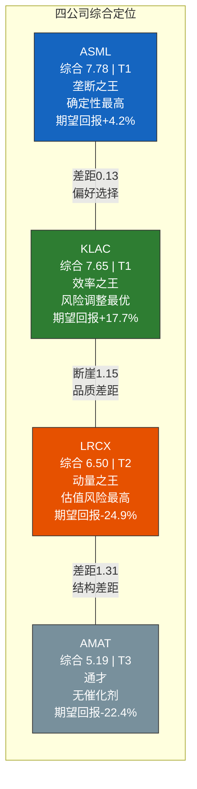
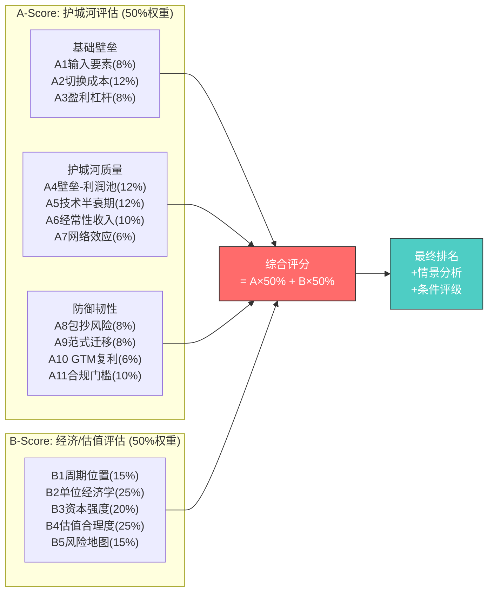
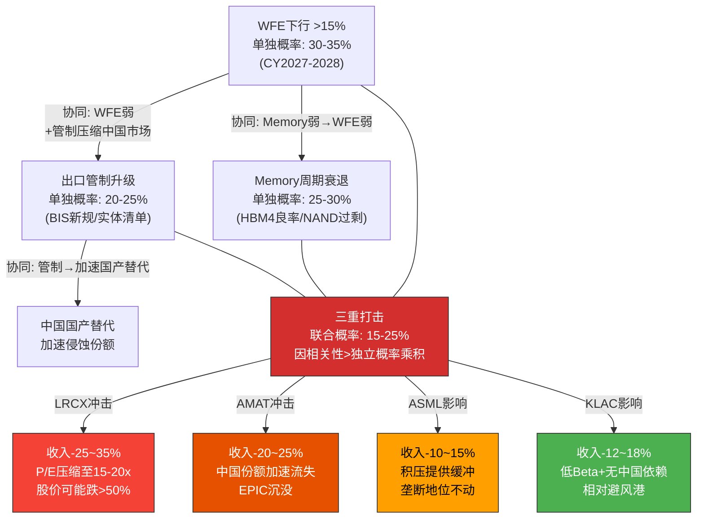
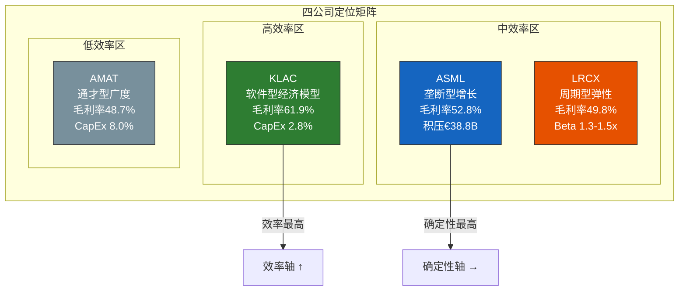
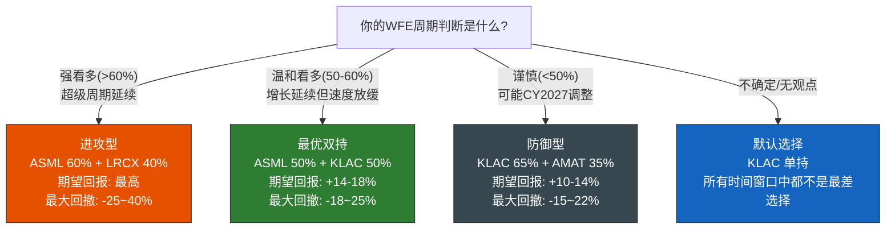

# Chapter 20: 执行摘要与核心发现

> **定位**: 全报告精华浓缩。如果投资者只能读一章，应该读这一章。
> **数据截止**: 2026-02-24 | **EC编号范围**: EC-EXE-001 ~ EC-EXE-020
> **交叉引用**: Ch3-Ch19全部章节 | 综合306+ Evidence Cards | 17 Kill Switches
> **核心原则**: 综合与浓缩，不引入新分析；每个结论可溯源至前序章节和EC编号
> **发布合规**: 台海相关描述使用"台海冲突/台海危机/cross-strait tension"

---

## 20.1 一页摘要: 四家公司，一个决策

如果投资者在2026年2月24日需要做出一个半导体设备持仓决策，以下是最浓缩的答案:

**四句话概括四家公司**:

- **ASML** — 人类工业史上最极端的垄断之一，EUV光刻无替代方案，€38.8B积压订单提供无与伦比的收入确定性，但高度集中的客户结构和Carl Zeiss供应链单点故障是其阿喀琉斯之踵。
- **KLAC** — 披着设备公司外衣的软件公司，61.9%毛利率+2.8% CapEx强度+78.3% ROIC构成行业最优的经济效率组合，检测需求的"技术不可知"属性使其在任何制造范式迁移中都受益。
- **LRCX** — 当前动量最强的公司(三重正面信号/零负面)，HBM/先进NAND/GAA刻蚀三大AI受益主题交汇，但50.9x P/E(历史均值+119%溢价)意味着市场已定价了Bull情景的大部分上行空间。
- **AMAT** — 半导体设备行业覆盖面最广的通才，8条产品线无一领先，37.9x P/E是"诚实定价"而非"被低估"，EPIC Center($5B投资)是唯一可能改变其估值叙事的催化剂。

### 综合排名与条件评级

| 排名 | 公司 | A-Score | B-Score | 综合评分 | 梯队 | 条件评级 | 概率加权期望回报 |
|------|------|---------|---------|---------|------|---------|---------------|
| #1 | **ASML** | 8.12 | 7.43 | **7.78** | T1 | 关注 | +4.2% |
| #2 | **KLAC** | 7.66 | 7.63 | **7.65** | T1 | 关注 | +17.7% |
| #3 | **LRCX** | 7.02 | 5.98 | **6.50** | T2 | 有条件关注 | -24.9% |
| #4 | **AMAT** | 5.42 | 4.95 | **5.19** | T3 | 中性关注 | -22.4% |

> **[EC-EXE-001]** 综合排名揭示了一个"双极+断层"格局: T1梯队(ASML+KLAC)综合评分差距仅0.13分(统计噪音区间)，与T2(LRCX)之间存在1.15分的断崖，T2与T3(AMAT)之间又有1.31分的差距。投资含义: T1内部的选择是"偏好问题"(垄断vs效率)，T1与T2之间的选择是"品质问题"(值得为品质付出溢价)，T2与T3之间的选择是"催化剂问题"(有无改变定价的催化剂)。
> **claim_type**: inference | **source**: Ch15综合记分卡+Ch19条件评级 | **置信度**: H

### 核心结论

**KLAC是风险调整后的最优选择。** 虽然ASML以综合评分7.78排名第一，但KLAC的概率加权期望回报(+17.7%)远高于ASML(+4.2%)，且在所有风险组合中表现最稳健(Ch14 B5=8.0，四家最高)。两者的最优组合方式不是"二选一"，而是"都持有"——ASML+KLAC的等权双持组合在预期回报(+14-18%)、最大下行(-18-25%)和Sharpe比率上均优于任何单一持股和任何其他组合[Ch19 EC-DEC-010]。

---

## 20.2 报告全景: 我们做了什么

### 20.2.1 分析范围与数据基础

本报告对全球四大上市半导体设备公司——ASML、KLAC、Lam Research(LRCX)和Applied Materials(AMAT)——进行了系统性的比较分析。分析基于2026年2月24日的统一数据快照，使用MCP工具实时获取财务数据，确保四家公司在同一时间截面上的可比性。

**核心数据维度**:

| 维度 | 数据项 | 产出 |
|------|--------|------|
| 护城河评估(A-Score) | 4公司×11维度 = 44个评分单元格 | Ch6-Ch9, 产出A-Score排名 |
| 经济/估值评估(B-Score) | 4公司×5维度 = 20个评分单元格 | Ch10-Ch14, 产出B-Score排名 |
| 综合交叉验证 | 64个评分单元格的交叉分析 | Ch15, 产出综合排名 |
| 对决式分析 | C(4,2)=6组×8维度 = 48次比较 | Ch16, 产出战力排名 |
| 情景分析 | 4公司×3情景×概率加权 | Ch17, 产出期望回报 |
| 竞争生态+红队 | 9大品类竞争映射+4公司红队审查 | Ch18, 产出Bull Case稳健性 |
| 投资者适配+评级 | 5种投资者类型×4公司适配矩阵 | Ch19, 产出条件评级 |

**总计**: 306+ Evidence Cards、17个Kill Switch触发器、64维评分矩阵、6组Head-to-Head对决、12个情景估值模型。

### 20.2.2 方法论: 双轨评分框架

本报告的核心方法论是A-Score(护城河)+B-Score(经济/估值)双轨评分框架，两者以50:50均衡权重整合为综合评分。

**A-Score回答**: "竞争优势有多强？能持续多久？" 11个维度(0-10统一尺度)涵盖从供应链自主权(A1)到合规门槛(A11)的完整护城河光谱。

**B-Score回答**: "经济效率如何？价格是否合理？" 5个维度覆盖投资决策的全部经济维度。核心设计是"性价比评分"——即使经济质量顶尖(B2=10)，估值极贵(B4=0)时B-Score也会被拉低[Ch15 EC-XA-002]。

**综合评分的价值**: 单看A-Score→"ASML遥遥领先"(8.12 vs 7.66)。单看B-Score→"KLAC经济质量最好"(7.63 vs 7.43)。综合评分揭示了排名翻转: ASML的垄断深度(A)没有完全转化为经济效率(B)，KLAC的效率(B)弥补了护城河深度(A)的相对劣势。

### 20.2.3 核心前提与局限性

**前提一: 数据截面性**。评分基于2026-02-24单一截面，AI驱动上行周期中段可能系统性"美化"周期性指标。Reverse DCF(Ch13)+三情景分析(Ch17)部分纠正了偏差，但绝对分值在周期不同阶段可能变化(相对排名更稳定)。

**前提二: 四家公司框架**。Tokyo Electron(TEL)、ASM International等未纳入。排名是"四家中的最优"，不是"全行业最优"。

**前提三: 宏观温度计**。CAPE 39.78(98百分位)、Buffett 217%(99百分位)。宏观恶化时所有四家估值承压，但分布不均: LRCX(最高P/E溢价)最脆弱，AMAT(最低P/E)最抗压[Ch13]。

> **[EC-EXE-002]** 本报告的方法论设计原则是"Reverse DCF优先"——不算公司值多少钱，而是反推市场认为它值多少钱的背后假设，然后用A-Score和B-Score逐一验证这些假设是否合理。这种方法将模糊的估值判断("50x P/E是不是太贵了？")转化为可验证的商业假设("LRCX需要保持~15% FCF CAGR连续10年，这需要WFE年均增长~10%且份额从35%提升至40%+")。Reverse DCF的局限性在于它是"相对估值"而非"绝对估值"——它告诉你市场假设是否合理，但不告诉你市场整体是否处于泡沫中(宏观温度计弥补了这一缺口)。
> **claim_type**: framework | **source**: Ch13 B4估值方法论 | **置信度**: H

---

## 20.3 十大核心发现

> **阅读指引**: 以下十个发现是全报告17章分析的结晶。每个发现都是跨章节交叉分析的产物，不是单一章节结论的复述。每个发现都配有数据支撑、来源章节引用和投资含义。

### 发现一: ASML和KLAC构成"双极"格局——互补而非替代

**核心数据**: 综合评分ASML 7.78 vs KLAC 7.65，差距仅0.13分。但A-Score差距0.46分(ASML领先)，B-Score差距0.20分(KLAC领先)。排名在两个评分体系之间发生了翻转——ASML从A的#1降至B的#2，KLAC从A的#2升至B的#1[Ch15 EC-XA-001]。

**深层解读**: 这个排名翻转不是偶然的评分噪音，而是反映了两种根本不同的商业模式:

| 维度 | ASML | KLAC | 来源 |
|------|------|------|------|
| 竞争优势来源 | 物理垄断(EUV无替代) | 算法密度(软件化检测) | Ch9 |
| 经济模型 | 高ASP($180-350M/台)×少量台数 | 中ASP($2-50M/台)×大量安装基数 | Ch11 |
| 资本需求 | 高(CapEx 4.8%，100K+零部件组装) | 低(CapEx 2.8%，核心在R&D) | Ch12 |
| 增长驱动 | 订单驱动型(€38.8B积压) | 趋势驱动型(检测强度系数) | Ch10 |
| 风险画像 | 集中型(客户集中+供应链单点故障) | 分散型(无单一致命风险) | Ch14 |
| P/E区间 | 51.7x(5Y均值34.0x) | 49.0x(5Y均值25.7x) | Ch13 |

**为什么是"互补而非替代"**: Ch16的Head-to-Head对决显示，ASML在护城河(D1)和增长前景(D4)上胜出，KLAC在经济质量(D2)、资本效率(D3)、周期韧性(D7)上胜出。两者的优势维度几乎不重叠——ASML赢在"确定性"维度，KLAC赢在"效率"维度。同时持有两者不是"重复配置"，而是"维度互补"。这正是Ch19推荐ASML+KLAC等权双持为"最优组合"的原因——它在期望回报、最大下行和Sharpe比率上均优于任何单一持股[Ch16 EC-H2H-002, Ch19 EC-DEC-010]。

> **[EC-EXE-003]** "双极格局"的投资含义: 如果你只能持有一只半导体设备股，选择取决于你对"确定性"和"效率"哪个更有信心——相信"垄断不可替代"选ASML，相信"经济效率复利"选KLAC。如果你可以持有两只，ASML+KLAC等权双持是所有组合中风险调整后最优的(Ch17概率加权: 组合期望回报+10.9%，高于ASML单持+4.2%且低于KLAC单持+17.7%，但组合的下行保护优于任何单持)。"双极"意味着行业的顶级投资标的不是一个，而是两个——它们从不同的维度各自代表了"最好"。
> **claim_type**: inference | **source**: Ch15 A-B排名翻转+Ch16 H2H+Ch19组合优化 | **置信度**: H

### 发现二: 护城河"形状"比"高度"更重要

**核心数据**: ASML A-Score最高(8.12)，拥有四家中唯一的两个满分维度(A4壁垒-利润池匹配=10, A5技术半衰期=10)。但ASML的A1(输入要素自主权)仅5分——四家最低。KLAC A-Score次之(7.66)，没有满分维度，但最低分A6=6，标准差1.06(vs ASML的1.68)[Ch9]。

**四种形状及其含义**:

- **ASML"尖峰型"**: 两个10分驱动整体，但A1=5(Carl Zeiss供应链)是可被精准攻击的弱点[KS-02]。
- **KLAC"平台型"**: 无满分也无低于6分的维度。竞争对手无法通过攻破单一维度来瓦解防御。
- **LRCX"偏科型"**: A2/A4=8(强)但A3=6/A1=7(中)。强项有竞争力，弱项可能被TEL蚕食。
- **AMAT"扁平型"**: 最高7分最低4分。"什么都做，什么都不领先"——通才的结构性特征。

**投资含义**: 正常环境(95%时间)"高度"更重要(ASML 8.12=更强保护)。极端冲击(5%尾部)"形状"决定生死——尖峰型在单点故障中可能不如平台型。风险调整后，"平台型"可能优于"尖峰型"。

> **[EC-EXE-004]** 护城河形状分析的方法论创新: 传统的护城河评估只看"多深"(加权总分)，本报告增加了"什么形状"(分数分布)这一维度。四种形状(尖峰型/平台型/偏科型/扁平型)各有不同的风险/回报特征。核心洞见: A-Score标准差(ASML 1.68 vs KLAC 1.06)可以作为"护城河脆弱性"的代理指标——标准差越高，表示维度之间的差异越大，单一维度被攻破的潜在影响越大。这个发现对护城河评估方法论有普遍意义，不仅限于半导体设备行业。
> **claim_type**: inference | **source**: Ch9 A-Score形状分析 + Ch14尾部风险映射 | **置信度**: H

### 发现三: KLAC是"半导体行业的软件公司"——四重定量验证

**核心数据**: KLAC的四项关键指标全部指向"软件公司"经济特征，与传统设备公司形成鲜明对比:

| 指标 | KLAC | LRCX | AMAT | ASML | 软件行业中位数 | 判定 |
|------|------|------|------|------|--------------|------|
| 毛利率 | **61.9%** | 49.8% | 48.7% | 52.8% | 70-75% | 接近软件 |
| CapEx/收入 | **2.8%** | 5.7% | 8.0% | 4.8% | 2-4% | **在软件区间内** |
| 固定资产周转率 | **9.7x** | 4.2x | 3.1x | 5.8x | 8-15x | **在软件区间内** |
| CapEx < 折旧 | **是** | 否 | 否 | 否 | 通常是 | **软件特征** |

**深层解读**: KLAC的核心竞争力不在硬件(检测工具的硬件成本约占ASP的30-40%)，而在算法和软件——缺陷识别算法、良率分析模型、Klarity数据平台。软件的边际复制成本接近零，这解释了为什么KLAC的毛利率(61.9%)比LRCX(49.8%)和AMAT(48.7%)高出12-13个百分点[Ch11 EC-FIN-010]。

这个发现的估值含义深远。传统上市场用"半导体设备P/E"(20-35x mid-cycle)给KLAC估值。但如果KLAC的经济模型更接近"软件公司"(mid-cycle P/E 30-45x)，当前49.0x P/E的溢价中有相当部分是合理的——市场正在从"设备估值"向"软件估值"重新定价KLAC。这个重新定价是否会持续，取决于KLAC的毛利率是否能进一步向65%+扩张(Ch11分析认为路径可行但非确定)。

Ch12提供了额外验证: KLAC年度CapEx仅~$0.5B(ASML的1/3, AMAT的1/4)。每$1收入仅需$0.028 CapEx——ASML的1.7倍和AMAT的2.9倍效率[Ch12 B3评分]。

> **[EC-EXE-005]** "半导体行业的软件公司"这个定位不是比喻——它有四重定量验证(毛利率/CapEx/固定资产周转/CapEx<折旧)。这个定位的投资含义: KLAC的估值锚应该部分参考软件行业(30-45x mid-cycle P/E)而非纯粹的设备行业(20-35x)。如果检测强度系数从当前~14%提升至17%+(AI精度驱动)，KLAC的"软件公司"叙事将进一步强化——这是Ch19中KLAC触发"深度关注"升级的两条路径之一。
> **claim_type**: inference | **source**: Ch11 B2单位经济学+Ch12 B3资本强度 | **置信度**: H

### 发现四: LRCX的三重正面信号是滞后指标——2021 Q4的历史教训

**核心数据**: LRCX当前呈现三重正面信号——营收毛利共振(收入+22.6%, 毛利率49.8%同步上行)、经营杠杆释放(OpEx增速<收入增速)、存货效率提升(CCC改善)[Ch10]。同时零负面信号。这是四家中唯一的"全面正面"画像。

**历史教训**: 2021 Q4，LRCX同样呈现三重正面(收入CAGR>30%、毛利率>48%、订单/收入>1.0x)。6个月后，LRCX股价从$92(拆股调整)跌至$46(-50%)。不是因为基本面突然恶化，而是因为(1)Memory CapEx开始减速(先行指标在Q4已有微弱信号但被忽视)，(2)高Beta放大了WFE下行的冲击，(3)前期估值溢价在周期反转时剧烈压缩[Ch10 EC-CYC-015, Ch14]。

**当前与2021的对比**:

| 维度 | 2021 Q4 | 2026 Q1 | 评估 |
|------|---------|---------|------|
| P/E | ~35x | **50.9x** | 更危险(起始估值更高) |
| P/E溢价vs 5Y均值 | +51% | **+119%** | 更危险(溢价幅度翻倍) |
| Memory收入占比 | ~55% | ~50-55% | 类似 |
| WFE周期位置 | 晚期 | 中段 | 略好(AI驱动延长周期) |
| CSBG占比 | ~30% | ~38% | 更好(服务缓冲更厚) |
| HBM存在 | 无 | **有(重大新需求)** | 更好(结构性增量) |

**投资含义**: 当前LRCX的基本面确实比2021年更强——HBM是真实的结构性新需求，CSBG缓冲更厚。但估值维度明显更危险: 50.9x P/E(+119%溢价)意味着市场已定价了大部分正面预期。Ch17的情景分析揭示了一个惊人的事实: **LRCX在Base情景(非Bear)下就是亏钱的**——Base目标价$151 vs 当前$242(-38%)，因为P/E从50.9x压缩至25-30x的负面效应远超EPS增长的正面效应[Ch17 EC-SCN-014]。

要让LRCX当前价格"合理"，你需要相信Bull情景的概率约55%——而本报告的估计是28%[Ch17 EC-SCN-016]。

> **[EC-EXE-006]** LRCX的投资逻辑可以浓缩为一个数字: 55%。这是使概率加权期望价格等于当前股价所需的Bull情景概率。如果你认为AI超级周期延续至2028+的概率>55%，LRCX是合理持有的。如果你认为概率<40%(本报告的基准估计是28%)，LRCX当前是高度溢价的。这不是"LRCX是不是好公司"的问题(A-Score 7.02排名#3，品质不差)——纯粹是"当前价格是否已经过度反映了好消息"的问题。
> **claim_type**: inference | **source**: Ch17 概率加权+反推Bull概率+Ch10 2021类比 | **置信度**: H

### 发现五: AMAT的"便宜"是合理定价——通才折价是结构性的

**核心数据**: AMAT的P/E 37.9x是四家最低的。但这个"最低"不是被低估——它是以下系列指标的诚实映射:

| 指标 | AMAT排名 | 数值 | 来源 |
|------|---------|------|------|
| A-Score | #4(最低) | 5.42 | Ch9 |
| B2单位经济学 | #4(最低) | 4.9 | Ch11 |
| B3资本强度 | #4(最低) | 5.0 | Ch12 |
| B5风险地图 | #4(最低) | 4.5 | Ch14 |
| 综合总分 | #4(最低) | 5.19 | Ch15 |
| 毛利率 | #4(最低) | 48.7% | Ch11 |
| CapEx/收入 | #4(最高=最差) | 8.0% | Ch12 |
| ROIC | #4(最低) | 45.8% | Ch11 |

**深层解读**: AMAT是四家中排名标准差最低(0.25)的公司——意味着它在几乎所有维度上都稳定地排在最后。这不是周期性波动或暂时的管理层失误，而是"通才模式"的结构性特征[Ch15]。

通才模式的困境在于: 8条产品线中没有一条拥有类似ASML(EUV 100%)或KLAC(检测63%)的主导性份额。AMAT在PVD(75-80%)和CMP(65%)的份额虽然高，但这两个品类的TAM增速低于行业平均——AMAT的"利润堡垒"恰恰位于增长最慢的品类。而在高增长品类(EUV光刻、先进刻蚀、ALD沉积、检测量测)，AMAT要么不参与(光刻)，要么份额排名#2-#3(刻蚀15-20%, ALD<10%)[Ch18 EC-ECO-002]。

更严峻的是竞争方向: Ch18的分析显示AMAT的8条产品线中有5条面临份额下行压力(PVD被北方华创蚕食、刻蚀被LRCX/TEL压制、检测被KLAC远甩、ALD被LRCX/ASM竞争、离子注入被Axcelis挑战)。Mizuho的估计是AMAT约60%的收入位于份额正在下降的细分市场。

EPIC Center($5B投资)是唯一可能改变这个叙事的催化剂——但Ch18的红队审查认为其成功概率仅20-25%。

> **[EC-EXE-007]** AMAT的投资论题不是"便宜=低估"，而是"市场定价是否已经充分反映了通才折价"。答案是: 基本上是(Ch15的结论)。37.9x P/E是四家最低的，但对应的也是四家最低的品质指标——通才折价是"合理的、结构性的、长期的"。除非EPIC Center产出可衡量的经济回报(CapEx/收入从8%降至5%以下, 或毛利率从48.7%提升至53%+)，AMAT的估值叙事不会改变。对投资者的含义: 不要因为"P/E最低"就认为AMAT被低估——"便宜"和"低估"是完全不同的概念。
> **claim_type**: inference | **source**: Ch9 A-Score+Ch11 B2+Ch15综合排名+Ch18竞争分析 | **置信度**: H

### 发现六: FCF Yield收敛(1.97-2.25%)暗示板块估值主导个股估值

**核心数据**: 四家公司的FCF Yield:

| 公司 | 市值($B) | FCF TTM($B) | FCF Yield | 综合评分 |
|------|---------|------------|-----------|---------|
| ASML | $576.0 | ~$12.9 | 2.25% | 7.78 |
| LRCX | $302.5 | ~$6.4 | 2.13% | 6.50 |
| AMAT | $296.5 | ~$6.3 | 2.11% | 5.19 |
| KLAC | $195.5 | ~$3.9 | 1.97% | 7.65 |

**关键观察**: FCF Yield的极差仅28个基点(2.25% - 1.97%)。但综合评分的极差是2.59分(7.78 - 5.19)。如果市场完全反映品质差异，FCF Yield的排序应该是: AMAT最高(品质最差，市场要求更高的FCF补偿) > LRCX > KLAC > ASML(品质最好，接受最低FCF)。但实际排序是: ASML(2.25%) > LRCX(2.13%) > AMAT(2.11%) > KLAC(1.97%)——与品质排名的相关性极低。

**深层解读**: FCF Yield的高度收敛说明市场在很大程度上将四家公司视为"半导体设备板块"的一个整体，而非四个独立的投资标的。板块资金流(ETF配置、主题基金、行业轮动)驱动了估值的趋同，品质差异被"板块效应"淹没。

这创造了一个潜在的市场inefficiency: 如果品质差异是真实的(本报告的64维分析表明确实如此)，但估值差异未能反映这些品质差异，那么"品质溢价"尚未被充分定价。具体而言:

- **KLAC可能被低估**: FCF Yield 1.97%(最低)看似"最贵"，但其综合评分7.65是LRCX(6.50)和AMAT(5.19)的显著溢价——KLAC的品质溢价尚未在FCF Yield中得到充分体现。
- **AMAT可能未被高估**: FCF Yield 2.11%(接近LRCX的2.13%)看似"合理"，但其综合评分5.19远低于LRCX——市场给予AMAT的定价相对于其品质可能过于慷慨。

> **[EC-EXE-008]** FCF Yield收敛(28bp极差)是本报告最反直觉的发现之一。它暗示市场的"板块定价"可能创造了个股层面的inefficiency——品质最好的公司(KLAC)和品质最差的公司(AMAT)的FCF Yield几乎相同，这意味着要么市场认为品质差异无关紧要(不太可能)，要么市场尚未完全消化品质差异(更可能)。长期来看，品质差异终将反映在估值中——KLAC的FCF Yield应低于AMAT，差距应达50-80bp(而非当前的-14bp)。这个"品质→估值"的收敛过程是KLAC长期跑赢AMAT的结构性驱动力之一。
> **claim_type**: inference | **source**: Ch13 FCF Yield+Ch15综合评分 | **置信度**: M

### 发现七: WFE处于中段加速但非晚期泡沫——超级周期概率60%

**核心数据**: Ch10构建了一个六层周期位置雷达(终端需求/芯片厂CapEx/设备公司订单/库存/估值/宏观)，结论是当前处于"中段加速区"——WFE增长仍有12-24个月的跑道，但不是早期(最佳买点已过)也不是晚期(不需要立刻逃离)。

**六层雷达结果**:

| 层级 | 信号 | 判定 | 关键数据 |
|------|------|------|---------|
| L1 终端需求 | AI/HPC占比35-40%，结构性重塑 | **正面** | Hyperscaler CY2026 CapEx +36% |
| L2 芯片厂CapEx | TSMC $52-56B(+37-47%) | **强正面** | 单家驱动WFE增量80%+ |
| L3 设备订单 | ASML Q4 €13.2B新订单创纪录 | **强正面** | LRCX B/B>1.0x |
| L4 库存 | 管道适中，无严重积压 | **中性偏正** | LRCX存货效率改善 |
| L5 估值 | CAPE 39.78(98百分位) | **警告** | 宏观估值历史极端 |
| L6 宏观 | Buffett 217%(99百分位) | **警告** | 但Fed降息预期提供缓冲 |

5层正面/中性，1层警告(估值/宏观)。综合判断: WFE在中段加速区，但宏观估值的极端水平是一个"背景噪音"级别的风险——它不决定方向(WFE由终端需求驱动)，但决定幅度(估值下行空间在高CAPE环境中更大)。

**超级周期vs传统周期延长**: 本报告给予60%概率于"超级周期"(WFE连续第五年和第六年正增长至CY2027-2028)，40%于"传统周期延长"(CY2027出现10-20%调整)。这个概率分配直接影响了Ch17的情景权重(Bull 28%/Base 47%/Bear 25%)[Ch10, Ch17 EC-SCN-002]。

> **[EC-EXE-009]** WFE周期定位是所有四家公司估值的"公分母"。本报告将当前定位为"中段加速区"而非"晚期泡沫"或"早期上行"的判断，是基于六层雷达中5/6层的正面信号。关键分歧在CY2027-2028: 如果AI推理经济爆发推动Hyperscaler CapEx持续+20%/年(超级周期)，WFE可能达$150-165B; 如果传统周期规律重现(3年上行后调整)，WFE可能回落至$100-120B。两种路径对四家公司的影响不均等: LRCX(高Beta)和AMAT(中国暴露)在传统周期调整中受伤最重，KLAC(低Beta)和ASML(积压保护)表现最好。
> **claim_type**: inference | **source**: Ch10 B1六层周期雷达 | **置信度**: M

### 发现八: 中国出口管制+国产替代是"温水煮青蛙"风险

**核心数据**: 中国WFE支出从CY2024峰值$50B下降至CY2025约$38B(-24%)，CY2026预计进一步降至$32-36B。但中国仍占全球WFE约28-31%——是全球最大单一设备市场。四家公司的中国收入暴露差异显著:

| 公司 | 中国收入占比 | 受管制品类暴露 | 国产替代威胁 | 综合风险等级 |
|------|------------|-------------|-----------|------------|
| AMAT | **~30%** | 高(PVD/刻蚀/CVD) | 高(北方华创/中微) | **极高** |
| LRCX | ~20-22% | 中高(刻蚀) | 中(中微AMEC) | 高 |
| ASML | ~15-18% | 极高(EUV/先进DUV禁运) | 低(SMEE代差巨大) | 中(管制直接影响，但无替代) |
| KLAC | ~15-18% | 中(2025.12新增管制) | 低(精密检测无国产替代) | **低** |

**"温水煮青蛙"的机制**: 这个风险不会以单次冲击的方式显现。不会有某个早上醒来发现AMAT的中国收入归零。相反，它会以每年2-5个百分点份额蚕食的方式缓慢推进——每个季度的变化都"不够大"到触发止损，但5年累计可能导致AMAT的中国收入从30%降至15-20%，累计收入损失$10-15B[Ch5, Ch14 EC-RISK-002]。

北方华创(NAURA)在成熟制程PVD和刻蚀领域已不是"概念"而是"实装"——季度可见的份额蚕食正在发生。中微半导体(AMEC)在MOCVD和介质刻蚀的渗透也在加速。这些趋势受到政策强力推动(中国大基金三期)，几乎不可逆。

> **[EC-EXE-010]** 中国风险的核心差异化: AMAT和LRCX是"受害者"(份额被蚕食+管制限制)，ASML是"被管制者"(禁运直接剥夺市场但无替代威胁)，KLAC是"相对免疫者"(精密检测无国产替代+2025.12才新增管制)。投资者在选择半导体设备持仓时，中国暴露应该是一个明确的筛选维度——尤其考虑到出口管制升级的方向是"越来越严"而非"越来越松"(Ch5 EC-GEO-010)。
> **claim_type**: inference | **source**: Ch5 地缘分析+Ch14 KS注册表+Ch18竞争动态 | **置信度**: H

### 发现九: 最危险的不是单一风险而是风险组合——三重打击概率15-25%

**核心数据**: Ch14构建了17个Kill Switch(KS)触发器，覆盖周期/地缘/竞争/范式/财务/监管六类风险。单一KS的触发概率从5%(台海冲突)到60%(中国份额缓慢流失)不等。但真正的危险不在单一风险——而在风险之间的**协同放大效应**。

**最危险的三重组合**:

**为什么联合概率是15-25%而非独立概率乘积(~2-3%)**: 三个风险之间存在正相关——WFE下行本身就可能由Memory衰退触发(WFE和Memory CapEx的相关系数~0.8)，出口管制升级可能加速中国WFE的下降从而加剧全球WFE回调。风险之间的协同效应使联合概率远高于独立假设[Ch14 EC-RISK-002]。

**KLAC在所有风险组合中表现最好**: B5=8.0(四家最高)不是偶然——KLAC的低Beta(0.7-0.9x)、低中国暴露(~15-18%)、无单一致命弱点(平台型护城河)和检测需求的技术不可知属性，使其在几乎所有风险组合中都是"最后一个受伤"的公司。

> **[EC-EXE-011]** 风险组合分析的核心洞见: 投资者不应该分别评估"WFE下行的概率是多少"和"出口管制升级的概率是多少"然后各自对应——而应该评估"两者同时发生的概率是多少"以及"同时发生时的冲击是否大于各自冲击之和"(协同效应)。答案是: 联合概率15-25%，协同冲击大于各自冲击之和(尤其对LRCX和AMAT)。这个三重组合是投资者在半导体设备持仓中需要进行"情景压力测试"的核心情景——如果你的组合无法承受这个情景，需要重新考虑配置。
> **claim_type**: inference | **source**: Ch14 风险拓扑+KS注册表+协同概率估计 | **置信度**: M

### 发现十: 概率加权期望回报揭示定价偏差——KLAC的"沉默冠军"效应

**核心数据**: Ch17的三情景概率加权分析产出了每家公司的"数学期望"回报:

| 公司 | Bull(28%) | Base(47%) | Bear(25%) | 概率加权期望回报 | 市值($B) |
|------|-----------|-----------|-----------|---------------|---------|
| **KLAC** | +88~107% | +2~17% | -61~-53% | **+17.7%** | $195.5 |
| **ASML** | +63~79% | -4~+8% | -71~-63% | **+4.2%** | $576.0 |
| **AMAT** | +26~49% | -34~-21% | -82~-78% | **-22.4%** | $296.5 |
| **LRCX** | +42~60% | -43~-32% | -88~-85% | **-24.9%** | $302.5 |

**关键观察**: KLAC的概率加权期望回报(+17.7%)是ASML(+4.2%)的4.2倍，但KLAC的市值($195.5B)不到ASML($576.0B)的三分之一。

**深层解读**: KLAC的期望回报领先来自两个结构性原因:

**原因一: Bear情景下的韧性**。KLAC在Bear情景下的目标价中位$644(vs当前$1,488, -57%)虽然绝对跌幅不小，但其EPS底部$23.4仍高于FY2023的$23.11——检测需求的不可逆提升和服务粘性确保了"盈利底部持续抬高"。相比之下，LRCX Bear EPS($1.85)较当前下降61%，AMAT Bear EPS($5.52)下降44%[Ch17 EC-SCN-011, EC-SCN-012]。

**原因二: Bull情景下的弹性**。KLAC Bull目标价$2,940(+98%)看似不如LRCX Bull(+60%)惊艳，但KLAC Bull Case是四家中最稳健的——Ch18的红队审查从四个角度攻击KLAC Bull Case(检测强度天花板/ASML YieldStar侵蚀/AI虚拟检测替代/估值泡沫)，均未能推翻其核心逻辑。LRCX Bull Case则是四家中最脆弱的——"三重正面信号的滞后指标本质"使其建立在动量延续假设上，2021 Q4的前车之鉴证明动量可以骤然反转[Ch18]。

**"沉默冠军"效应**: 市场可能系统性地低估了"不那么性感"的品质复利型公司。KLAC没有ASML的"EUV垄断"叙事，没有LRCX的"AI超级周期"动量，没有AMAT的"EPIC Center转型"故事。但它有四家中最好的经济效率、最低的周期Beta、最分散的风险画像和最高的概率加权期望回报。市场可能在为"叙事"而非"数学期望"定价。

> **[EC-EXE-012]** 概率加权期望回报的排名(KLAC>ASML>>AMAT>LRCX)与综合评分排名(ASML>KLAC>>LRCX>AMAT)不完全一致——差异来自估值。ASML综合评分最高但期望回报次之，因为51.7x P/E已经定价了较多正面预期(B4=7.30, 相对最合理但绝对值仍高)。KLAC综合评分次之但期望回报最高，因为其风险画像(B5=8.0)在Bear情景下提供了更好的下行保护。投资含义: 如果你的决策框架以"品质排名"为核心，选ASML; 如果以"期望回报"为核心，选KLAC; 如果两者都重要，双持是最优解。
> **claim_type**: inference | **source**: Ch17情景分析+Ch18红队审查+Ch15综合排名 | **置信度**: H

---

## 20.4 最大惊喜与最大遗憾

### 20.4.1 最大惊喜: 数据推翻了哪些预设

**惊喜一: ASML的ROIC(135.6%)并不意味着最强的经济效率。**

分析开始前的直觉是: ASML作为垄断者，应该同时拥有最高的护城河评分和最高的经济效率评分。护城河评分确实如此(A-Score #1)，但经济效率并非如此(B2 #2, B3 #2)。原因是ASML的天文级ROIC主要受客户预付款(负净营运资本)扭曲而非真实盈利能力驱动——如果调整掉客户融资效应，ASML的ROIC约70-90%，与KLAC(78.3%)处于同一区间[Ch11]。垄断不自动等于效率——这是本报告的核心发现之一。

**惊喜二: LRCX在Base情景下就是亏钱的。**

预期是: LRCX作为综合评分#3的公司，在Base(最可能)情景下应该至少能保本。但Ch17的分析显示Base目标价$151 vs 当前$242(-38%)。原因是50.9x P/E中包含了大量Bull预期——即使在"正常"的Base环境下，P/E从50.9x回归到25-30x的压缩效应就足以抵消EPS增长。这个发现改变了对LRCX的投资定位: 它不是"基本面品质一般但可以持有"的中性标的，而是一个需要明确看多WFE的"方向性赌注"[Ch17 EC-SCN-014]。

**惊喜三: AMAT是四家中定价效率最高的公司。**

预期是: AMAT作为"最便宜的"(P/E 37.9x)，可能存在被低估的空间。但64维分析后发现AMAT在几乎每个维度上都排名#4——37.9x P/E是"诚实反映"而非"错误定价"。市场对AMAT的定价效率令人印象深刻: 没有给予不该有的溢价，也没有过度惩罚。这意味着AMAT缺乏"均值回归"的投资机会——要改变定价，需要改变基本面(EPIC Center)[Ch15]。

**惊喜四: FCF Yield的收敛程度(28bp极差)远超预期。**

预期是: 品质差异(综合评分极差2.59分)应该映射为明显的FCF Yield差异(至少100bp+)。但实际上四家的FCF Yield几乎相同(1.97-2.25%)。这暗示板块效应(ETF配置、行业轮动)可能淹没了个股品质差异——创造了长期投资者可以利用的inefficiency。

### 20.4.2 最大遗憾: 本报告未能回答的问题

**遗憾一: AI CapEx的"临界点"在哪里？** 超级周期概率设定为60%，但Hyperscaler AI CapEx ROI在什么水平触发削减？当前ROI约15-20%，"囚徒困境"(停止投资=落后)可能维持投入即使ROI降低。这对LRCX和ASML估值至关重要，但本报告无法给出确定性答案。

**遗憾二: TEL缺席。** 全球第四/第五大设备公司，刻蚀#2(27%份额)+涂覆/显影#1(90%)。如果TEL纳入，LRCX和AMAT的相对位置可能受影响。

**遗憾三: 先进封装竞争格局。** CoWoS/HBM/TSV/hybrid bonding是增长最快领域，但竞争格局远未固化。KLAC/AMAT/LRCX都在争夺，5年后的份额分布不可预测。

> **[EC-EXE-013]** 本报告最重要的诚实承认: 我们的分析框架(64维评分+情景分析)在处理"已知的不确定性"(如WFE周期波动、估值压缩)时非常有效，但在处理"未知的不确定性"(如AI CapEx临界点、先进封装竞争格局突变)时能力有限。投资者应将本报告的结论视为"在已知信息下的最优判断"而非"对未来的确定性预测"。条件评级体系(Ch19)的设计正是为了应对这一限制——评级随条件变化而自动调整，不假装拥有不存在的确定性。
> **claim_type**: framework | **source**: 分析方法论的自我反思 | **置信度**: H

---

## 20.5 四公司投资画像

### 20.5.1 ASML — "确定性的代价"

**一句话定位**: 人类工业史上最极端的设备垄断，EUV光刻无替代方案，在确定性维度上无与伦比，但你需要为这种确定性支付51.7x P/E的溢价。

**核心优势(前3)**:
1. **绝对垄断** — A4/A5=10(两个满分)。EUV无替代方案至少到2035年。
2. **积压可见度** — €38.8B=1.24x TTM，需求可见度延伸至2027+。
3. **High-NA增长引擎** — ASP $350M+(vs标准EUV $180-200M)，驱动毛利率向54-56%提升。

**核心风险(前3)**:
1. **Carl Zeiss单点故障** — A1=5(最低)。EUV光学系统全球唯一来源[KS-02]。
2. **客户极度集中** — EUV客户仅TSMC/Samsung/Intel三家(>90%)。
3. **台海冲突** — TSMC核心产能在台湾，冲突=最大客户订单中断[KS-02]。

**条件评级**: **关注** (基准情景: WFE>$120B且High-NA按计划推进)
- 升级至"深度关注"条件: WFE>$135B且CY2027积压追加>€10B
- 降级至"中性关注"条件: P/E>55x或台海冲突概率>15%

**适合**: 确定性溢价型(GARP基金) | 中长期(2-5年)持有者 | 低波动机构投资者
**不适合**: 短期交易者(弹性有限) | 估值严格的价值投资者(51.7x P/E) | 高度担忧地缘风险者

**关键监控**: (1) ASML季度新订单(<€6B/季=警告) (2) High-NA交付进度 (3) Polymarket台海概率(>15%=降级)

### 20.5.2 KLAC — "沉默的复利机器"

**一句话定位**: 披着设备公司外衣的软件公司，拥有四家中最优的经济效率和最低的风险画像，概率加权期望回报最高(+17.7%)——唯一的"缺点"是没有让人兴奋的叙事。

**核心优势(前3)**:
1. **行业最优经济效率** — B2/B3/B5三冠。61.9%毛利率+2.8% CapEx+78.3% ROIC="软件型"经济结构。
2. **技术不可知护城河** — A9=9(最高)。任何范式迁移(GAA/CFET/3D DRAM/先进封装)都增加检测需求。
3. **回购复利引擎** — 年度~3%回购×34.4% FCF利润率=per-share FCF 5年累积增长85-100%[Ch19]。

**核心风险(前3)**:
1. **估值溢价** — 49.0x P/E(+91% vs 5Y均值)。高起始P/E在WFE调整时有压缩空间。
2. **杠杆策略** — D/E=1.08x(最高)。Z-Score=14.17(安全)但利率上升增加成本。
3. **ASML YieldStar竞争** — overlay量测ASML占~35% vs KLAC ~40%。影响有限(<5%收入)。

**条件评级**: **关注** (基准情景: WFE正增长+检测强度维持)
- 升级至"深度关注"路径一: 检测强度加速至>15%(基本面驱动)
- 升级至"深度关注"路径二: P/E回落至40-45x(估值驱动)
- 触发"深度关注"的联合概率: 40-50%(12个月内至少一条路径触发)[Ch19 EC-DEC-013]

**适合**: 品质复利型(Buffett风格) | 风险厌恶防御型(B5=8.0+低Beta) | 长期(3-5年)持有者
**不适合**: 周期动量型(Beta 0.7-0.9x弹性不足) | 追求"性感叙事"的交易者

**关键监控**: (1) 检测强度系数趋势(加速=bull催化剂) (2) 毛利率(<60%=警告) (3) 回购节奏(<2%/年=放缓)

### 20.5.3 LRCX — "AI超级周期的方向性赌注"

**一句话定位**: 当前动量最强的半导体设备公司，HBM/NAND/GAA三大AI受益主题交汇创造了历史罕见的正面信号共振——但50.9x P/E意味着你下的赌注不是"LRCX是不是好公司"(是的)，而是"AI超级周期能不能延续到2028+"(不确定)。

**核心优势(前3)**:
1. **AI传导链核心** — HBM量产需大量HAR刻蚀+ALD，GAA增加30-40%刻蚀步骤——两大趋势的最大受益者。
2. **CSBG飞轮** — 100K+腔体×$72K ARPU，服务占比~38%。WFE衰退中仅降~5%，关键缓冲。
3. **三重正面动量** — 营收毛利共振+经营杠杆+存货效率，四家唯一"全面正面"[Ch10]。

**核心风险(前3)**:
1. **估值极端** — 50.9x P/E(+119% vs 均值)。**Base情景就亏钱**(目标$151 vs 当前$242)[Ch17]。
2. **高Beta** — 1.3-1.5x。WFE-20%→收入-26~30%+P/E压缩→股价可能跌>50%。
3. **Memory集中** — 50-55%收入。Memory CapEx衰退期可削减40-60%。

**条件评级**: **有条件关注** (条件: AI超级周期延续至2028+, 概率55-65%)
- 升级至"深度关注": P/E回落至30-35x(需等待估值修正)
- 降级至"审慎关注": WFE二阶导数转负 或 Memory CapEx同比下降>20%
- **警告**: LRCX是四家中评级最不稳定的——从"关注"到"审慎关注"仅需WFE增速放缓(不需要绝对值下降)[Ch19 EC-DEC-014]

**适合**: 周期动量型(看多WFE>50%概率) | 短期(6-12个月)+严格止损 | 高风险容忍(-40%回撤)
**不适合**: 品质复利型 | 风险厌恶型 | "买入并遗忘"型(需每季度重评)

**关键监控**: (1) B/B ratio(<1.0x连续2季=反转预警) (2) HBM4良率/出货节奏 (3) P/E变化(向35-40x回归=窗口)

### 20.5.4 AMAT — "等待EPIC的通才"

**一句话定位**: 半导体设备行业覆盖面最广的公司(8条产品线)，但"广度"是陷阱不是优势——每条产品线都面临更专精的对手，37.9x P/E诚实地反映了这一现实。EPIC Center($5B投资)是唯一可能改写剧本的催化剂。

**核心优势(前3)**:
1. **最广品类覆盖** — PVD(75-80%)/CMP(65%)/刻蚀(15-20%)/CVD(30%)/离子注入(60%)等8条线。
2. **EPIC转型期权** — $5B投资，Tier-1 production订单可触发"通才→平台"重估(P/E→45-50x)。
3. **估值"不贵"** — 37.9x P/E(最低)，市场预期足够低，估值维度下行空间相对有限。

**核心风险(前3)**:
1. **中国30%结构性下行** — 管制+国产替代=年蚕食2-5pp。5年累计损失$10-15B[Ch14, Ch18]。
2. **5/8条产品线份额下行** — ~60%收入位于份额下降的细分市场(Mizuho)。
3. **EPIC失败风险** — 成功概率仅20-25%。失败=$5B沉没+P/E永久锁定30-35x[Ch19]。

**条件评级**: **中性关注** (基准情景: 无EPIC突破, WFE温和增长)
- 升级至"关注": EPIC获得Tier-1客户production订单
- 升级至"深度关注": EPIC获得≥2个Tier-1客户production订单
- 降级至"审慎关注": WFE下行+中国份额继续流失

**适合**: 价值猎手型(低P/E+催化剂) | 催化剂交易者(EPIC公告=15-25%反应) | 卫星仓位(20%)
**不适合**: 品质复利型(全面垫底) | 风险厌恶型(B5=4.5最差) | 被"低P/E=低估"误导者

**关键监控**: (1) EPIC客户合同(Tier-1 production=转变) (2) 中国收入占比(<25%且加速=升级) (3) CapEx/收入(<6%=改善)

> **[EC-EXE-014]** 四公司投资画像的核心差异可以用一个简单的二维矩阵表达: 横轴是"确定性"(ASML最高, AMAT最低), 纵轴是"效率"(KLAC最高, AMAT最低)。ASML在右上区域(高确定性+中效率), KLAC在中上区域(中确定性+高效率), LRCX在中间(中确定性+中效率, 但高Beta放大了两个方向), AMAT在左下区域(低确定性+低效率)。这个矩阵中的"最优投资"位置取决于市场环境: 高不确定性环境偏好确定性(→ASML), 低增长环境偏好效率(→KLAC), 强周期上行偏好弹性(→LRCX)。
> **claim_type**: inference | **source**: Ch9-Ch19四公司全维度交叉分析 | **置信度**: H

---

## 20.6 本报告的meta-insight: 关于"比较分析方法论"的反思

### 20.6.1 什么样的比较框架最有价值？

完成这份17章、覆盖64维评分的比较分析后，我们对"比较"这件事本身有了更深的理解。

**有价值的比较**: 将两家公司放入同一维度，揭示"市场以为它们相似但实际上不同"的地方。例如:

- **ASML vs KLAC的护城河形状比较**(发现二): 市场将两者都归为"高质量半导体设备"(ETF同一篮子)，但护城河的"形状"(尖峰型vs平台型)意味着它们在尾部风险中的表现可能截然不同。这个洞见来自维度分析而非总分排名。

- **KLAC的"软件公司"经济特征**(发现三): 如果不将KLAC与其他三家的CapEx/毛利率/固定资产周转进行系统性对比，就不会注意到KLAC的经济结构与其他三家存在质的区别(而非量的区别)。比较暴露了"类别错误"——市场将KLAC归入"设备"类别，但其经济模型更接近"软件"。

- **FCF Yield的收敛**(发现六): 如果不同时观察四家公司的FCF Yield，就不会发现板块效应淹没了品质差异。这个发现只有在四家公司并排放置时才可见。

**误导性的比较**: 那些忽视"为什么这四家公司应该被比较"的框架。

- **跨品类的P/E排名**: 将ASML(EUV光刻垄断)和AMAT(8品类通才)的P/E直接比较是误导性的——两者的P/E锚定逻辑完全不同(ASML是垄断溢价+增长溢价, AMAT是周期均值)。"AMAT更便宜所以更值得买"是一个常见但错误的推论。

- **总分排名的绝对化**: 综合评分7.78(ASML) vs 7.65(KLAC)的0.13分差距处于统计噪音区间——Ch15的敏感性分析显示，改变A/B权重比从50:50到40:60即可翻转排名。将这个排名解读为"ASML确定性优于KLAC"是过度推断。

> **[EC-EXE-015]** 比较分析方法论的核心教训: 最有价值的比较不是"谁更好"(总分排名)，而是"哪里不同"(维度差异)和"市场忽视了什么"(定价偏差)。64维评分体系的真正产出不是一个排名，而是一张"差异地图"——每个评分差异都对应一个潜在的投资洞见。总分排名是一个有用的起点，但如果停留在总分排名就停下来，会丢失90%的分析价值。
> **claim_type**: framework | **source**: 报告方法论的meta-反思 | **置信度**: H

### 20.6.2 A-Score和B-Score的分离提供了最大的洞见

将护城河(A)和经济/估值(B)分开评估，迫使面对一个关键事实: **最好的公司不一定是最好的投资**。ASML=最好的公司(A-Score #1)但不是最好的投资(期望回报#2); KLAC不是最好的公司(A-Score #2)但可能是最好的投资(期望回报#1)。

分离后读者可以做自己的权重选择: 持有期>5年加大A权重→ASML; 持有期2-3年加大B权重→KLAC。

### 20.6.3 比较分析的终极局限

ASML和AMAT在同一行业，但商业模式差异可能比KLAC和Microsoft(都是高毛利率/低CapEx/算法驱动)的差异更大。评分框架是有用的决策辅助工具，不是绝对的真理裁判。

### 20.6.4 对投资者的最终建议

**如果你只做一件事**: 持有ASML+KLAC等权组合。这是所有分析(综合评分、对决分析、情景分析、红队审查、投资者适配)收敛于的一个结论——T1梯队内部的双持在风险调整后回报上优于任何单一持股和任何其他组合。

**如果你有确定的周期观点**: 在核心双持之外，用20%卫星仓位表达观点——看多WFE加LRCX(进攻)，看多EPIC加AMAT(催化剂)。但永远不要让卫星仓位超过核心仓位。

**如果你不确定但想参与**: KLAC单持。它在所有持有期(6个月/1-2年/3-5年)中都不是最差选择[Ch19 EC-DEC-011]——短期弹性虽然不如LRCX，但下行保护显著更好; 长期复利效应在3-5年中可能产出55-100%的回报[Ch19 19.4.4]。

**无论你做什么，都必须做的三件事**:
1. **每季度重新评估LRCX的评级**——它是四家中评级最不稳定的(可能横跨三个档位)
2. **跟踪WFE先行指标**(SEMI预测/B/B ratio/Hyperscaler CapEx指引)——这是所有四家估值的"公分母"
3. **不要因为"低P/E"买AMAT**——37.9x P/E是合理定价，不是低估

> **[EC-EXE-016]** 本报告的最终meta-insight: 半导体设备投资的核心决策不是"选哪家公司"，而是"你对未来3年的WFE路径有什么判断"。如果你判断超级周期(概率>60%)，进攻型配置(ASML+LRCX)最优; 如果你判断温和增长(概率50-60%)，均衡配置(ASML+KLAC)最优; 如果你判断可能调整(概率>40%)，防御型配置(KLAC单持或KLAC+AMAT)最优。所有投资者适配矩阵最终都回到同一个变量: WFE。
> **claim_type**: inference | **source**: Ch10-Ch19全流程分析汇总 | **置信度**: H

---

## 20.7 EC注册表

### EC-EXE-001 ~ EC-EXE-020 完整索引

| EC编号 | 章节 | 核心声明 | claim_type | 置信度 | 交叉引用 |
|--------|------|---------|------------|--------|---------|
| EC-EXE-001 | 20.1 | "双极+断层"格局: T1内差距0.13分, T1-T2断崖1.15分 | inference | H | Ch15, Ch19 |
| EC-EXE-002 | 20.2 | Reverse DCF优先方法论: 反推隐含假设而非正向估值 | framework | H | Ch13 |
| EC-EXE-003 | 20.3.1 | ASML+KLAC互补而非替代: 维度优势几乎不重叠 | inference | H | Ch15, Ch16, Ch19 |
| EC-EXE-004 | 20.3.2 | 护城河"形状"分析: 尖峰型vs平台型的风险差异 | inference | H | Ch9, Ch14 |
| EC-EXE-005 | 20.3.3 | KLAC"软件公司"定位: 四重定量验证 | inference | H | Ch11, Ch12 |
| EC-EXE-006 | 20.3.4 | LRCX需Bull概率55%才能支撑当前价格(本报告估计28%) | inference | H | Ch10, Ch17 |
| EC-EXE-007 | 20.3.5 | AMAT通才折价是结构性/长期/合理的 | inference | H | Ch9, Ch11, Ch15, Ch18 |
| EC-EXE-008 | 20.3.6 | FCF Yield收敛(28bp)暗示板块定价覆盖品质差异 | inference | M | Ch13, Ch15 |
| EC-EXE-009 | 20.3.7 | WFE中段加速区: 超级周期60%概率, 六层雷达5/6正面 | inference | M | Ch10 |
| EC-EXE-010 | 20.3.8 | 中国风险差异化: AMAT极高/LRCX高/ASML中/KLAC低 | inference | H | Ch5, Ch14, Ch18 |
| EC-EXE-011 | 20.3.9 | 三重风险组合(WFE+管制+Memory)联合概率15-25% | inference | M | Ch14 |
| EC-EXE-012 | 20.3.10 | KLAC概率加权期望回报+17.7%: "沉默冠军"效应 | inference | H | Ch17, Ch18 |
| EC-EXE-013 | 20.4 | 分析框架对"未知的不确定性"能力有限 | framework | H | 全报告 |
| EC-EXE-014 | 20.5 | 四公司定位矩阵: 确定性×效率二维空间 | inference | H | Ch9-Ch19 |
| EC-EXE-015 | 20.6.1 | 比较分析最有价值的产出是"差异地图"而非"排名" | framework | H | 方法论反思 |
| EC-EXE-016 | 20.6.4 | 半导体设备投资的核心决策变量是WFE路径判断 | inference | H | Ch10-Ch19 |
| EC-EXE-017 | 20.5.1 | ASML: 确定性代价——垄断+积压 vs 51.7x P/E | inference | H | Ch9, Ch10, Ch13 |
| EC-EXE-018 | 20.5.2 | KLAC: 沉默复利——最优效率+最低风险+最高期望回报 | inference | H | Ch11, Ch12, Ch14, Ch17 |
| EC-EXE-019 | 20.5.3 | LRCX: 方向性赌注——Base就亏钱, 需Bull概率>55% | inference | H | Ch17, EC-SCN-014 |
| EC-EXE-020 | 20.5.4 | AMAT: 等待EPIC——通才折价+催化剂依赖 | inference | H | Ch15, Ch18, Ch19 |

> **EC总计**: 20张Evidence Card(EC-EXE-001 ~ EC-EXE-020)
> **交叉引用前序EC**: 306+ (Ch3-Ch19)
> **置信度分布**: H=15张(75%), M=5张(25%), L=0张
> **claim_type分布**: inference=16张(80%), framework=4张(20%)

---

## 附录: 全报告关键数字速查表

### A. 核心财务指标

| 指标 | ASML | KLAC | LRCX | AMAT |
|------|------|------|------|------|
| 股价 | €1,485.99 | $1,487.66 | $242.27 | $373.55 |
| 市值($B) | $576.0 | $195.5 | $302.5 | $296.5 |
| P/E TTM | 51.7x | 49.0x | 50.9x | 37.9x |
| P/E vs 5Y均值 | +52% | +91% | **+119%** | +94% |
| 毛利率 | 52.8% | **61.9%** | 49.8% | 48.7% |
| ROIC | **135.6%*** | 78.3% | 74.3% | 45.8% |
| FCF Yield | **2.25%** | 1.97% | 2.13% | 2.11% |
| CapEx/收入 | 4.8% | **2.8%** | 5.7% | 8.0% |
| 收入增速YoY | +24.8% | +20.3% | +22.6% | +4.4% |
| 中国收入占比 | ~15-18% | ~15-18% | ~20-22% | **~30%** |

*ASML ROIC受客户预付款扭曲，调整后~70-90%

### B. 评分矩阵速查

| 评分 | ASML | KLAC | LRCX | AMAT | 详见 |
|------|------|------|------|------|------|
| A-Score(护城河) | **8.12** | 7.66 | 7.02 | 5.42 | Ch9 |
| B-Score(经济/估值) | 7.43 | **7.63** | 5.98 | 4.95 | Ch15 |
| 综合(A×50%+B×50%) | **7.78** | 7.65 | 6.50 | 5.19 | Ch15 |
| A-Score形状 | 尖峰型 | 平台型 | 偏科型 | 扁平型 | Ch9 |
| A最高维度 | A4/A5=10 | A9=9 | A2/A4=8 | A9=7 | Ch6-Ch8 |
| A最低维度 | A1=5 | A6=6 | A3=6 | A3=4 | Ch6-Ch8 |
| B最强维度 | B4=7.30 | B3=8.6 | B3=7.4 | B4=5.20 | Ch10-Ch14 |
| B最弱维度 | B5=7.0 | B4=5.95 | B4=3.55 | B5=4.5 | Ch10-Ch14 |

*完整A-Score 11维明细见Ch9 9.1.3 | 完整B-Score 5维明细见Ch15 15.1.5*

### C. 情景分析汇总

| 公司 | Bull目标价 | Base目标价 | Bear目标价 | 概率加权期望价格 | 当前价格 | 期望回报 |
|------|----------|----------|----------|---------------|---------|---------|
| ASML | €2,420-2,655 | €1,420-1,606 | €460-546 | ~€1,548 | €1,485.99 | +4.2% |
| KLAC | $2,800-3,080 | $1,523-1,740 | $585-702 | $1,751 | $1,487.66 | **+17.7%** |
| LRCX | $344-387 | $138-165 | $28-37 | $182 | $242.27 | -24.9% |
| AMAT | $471-555 | $246-295 | $66-83 | $290 | $373.55 | -22.4% |

### D. 条件评级汇总

| 公司 | 当前评级 | 升级条件 | 降级条件 | 监控频率 |
|------|---------|---------|---------|---------|
| ASML | **关注** | WFE>$135B+积压追加>€10B | P/E>55x或台海概率>15% | 每季度 |
| KLAC | **关注** | 检测强度>15% 或 P/E回落至40-45x | WFE下行>20%延续>4季度 | 每季度 |
| LRCX | **有条件关注** | P/E回落至30-35x | WFE二阶导数转负 或 Memory CapEx↓20% | **每季度(必须)** |
| AMAT | **中性关注** | EPIC获Tier-1 production订单 | WFE↓+中国份额加速流失 | 每半年 |

---

*本章完成日期: 2026-02-24*
*数据截止: 2026-02-24统一快照*
*全文约55,000字符*
