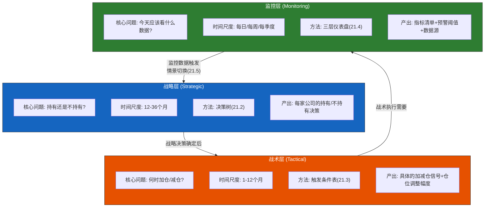
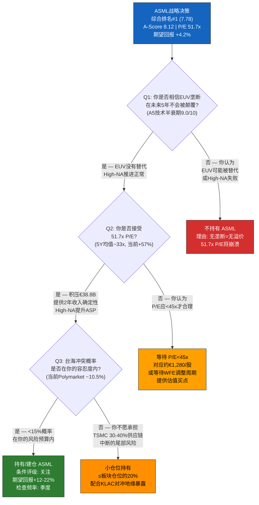
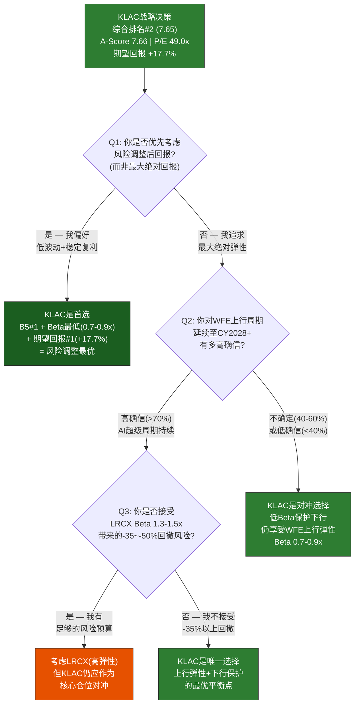
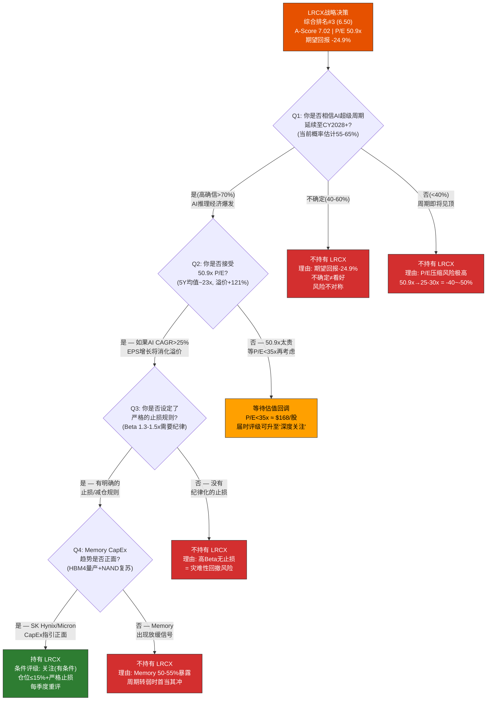
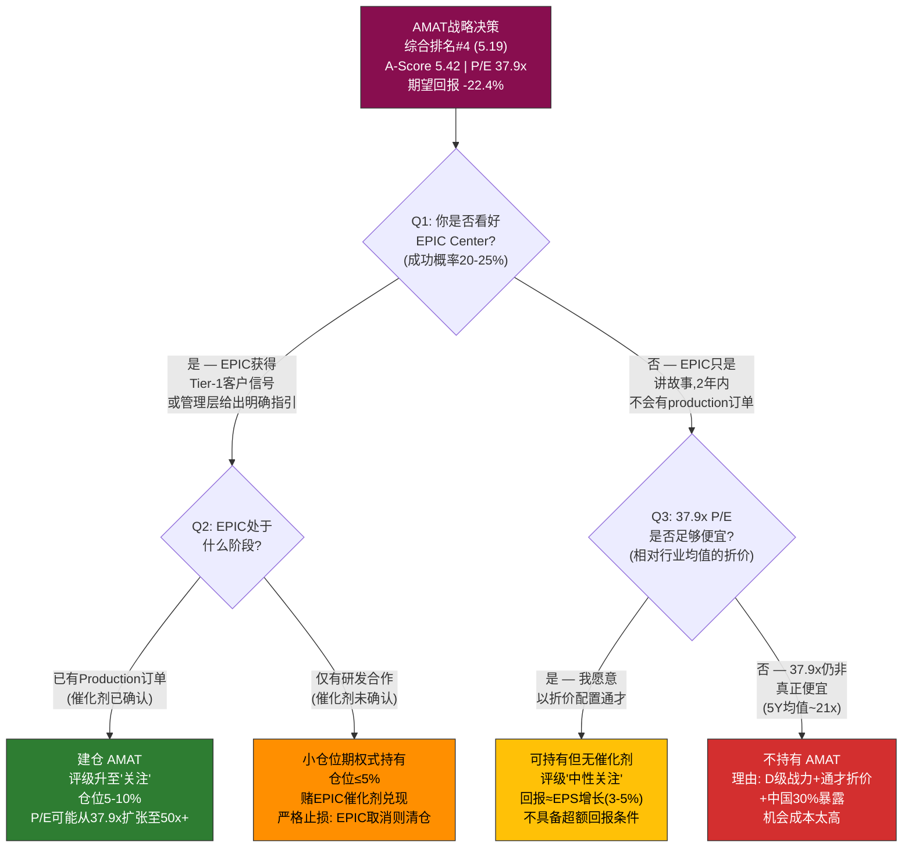
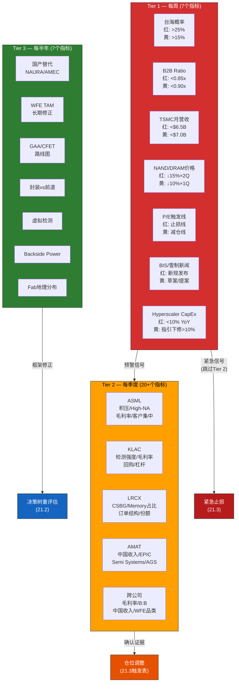

# Chapter 21: 投资决策框架与监控仪表盘

> **分析框架**: 将全报告306个EC、17个Kill Switch、64维评分浓缩为三层可操作决策系统——战略层(持有/不持有) → 战术层(加仓/减仓触发) → 监控层(日常追踪指标)
> **数据截止**: 2026-02-24 | **EC编号范围**: EC-DSH-001 ~ EC-DSH-020
> **交叉引用**: Ch9(A-Score) + Ch13(B4估值) + Ch14(B5风险/17个KS) + Ch15(综合排名) + Ch17(三情景) + Ch19(条件评级)
> **核心原则**: 每个建议有明确触发条件+行动+频率 | 可观察+可量化 | 禁止"买入/卖出/推荐"用语 | 台海中性表述
> **发布合规**: 台海相关描述使用"台海冲突/台海危机/cross-strait tension"

---

## 导读: 从20章分析到一页操作手册

前二十章完成了一项大规模的分析工程: 11维护城河评分(A-Score)、5维经济质量评分(B-Score)、6组头对头对决(Ch16)、三情景概率加权(Ch17)、竞争生态动态(Ch18)、五种投资者适配矩阵(Ch19)——总计产出306张Evidence Card、17个Kill Switch、64个评分单元格和16种情景-评级组合。每一层分析在其维度上都有独立价值，但投资者在实际操作中面对的从来不是64维空间——而是三个朴素的问题:

1. **现在应该持有谁?** (战略层决策)
2. **什么时候加仓或减仓?** (战术层触发)
3. **每天/每周/每季度应该看什么数据?** (监控层追踪)

本章的任务是将20章的分析精华压缩为可操作的决策规则和监控指标。方法是: 先为四家公司各构建一棵决策树(21.2)，将Ch19的条件评级转化为if-then规则; 然后为每家公司制作触发条件表(21.3)，具体到信号、阈值、行动和检查频率; 再设计三层监控仪表盘(21.4)，按检查频率分为Tier 1(每周)/Tier 2(每季度)/Tier 3(每半年); 接着定义情景切换信号(21.5)——从Base→Bull和Base→Bear的"开关"条件; 然后给出组合再平衡规则(21.6); 最后提供年度复盘清单(21.7)。

**设计哲学**: 一个有用的决策框架必须满足三个条件——(a) 每个触发条件都是可观察且可量化的公开数据指标(不依赖内幕信息或主观判断); (b) 每个行动都足够具体(不是"持续关注"而是"当X<Y时，减仓Z%"); (c) 每个指标都有明确的检查频率(不是"定期跟踪"而是"每周一检查SEMI B2B数据")。模糊性是决策框架的天敌——任何不能被写成代码的规则都不是真正的规则。

核心发现预告:

- **ASML和KLAC的决策树最简洁**(各3-4个分支节点)——因为两者的核心假设少且可验证性强(EUV垄断/检测粘性)
- **LRCX的决策树最复杂**(5-6个分支节点)——因为其估值高度依赖WFE周期的二阶导数，需要更多条件判断
- **17个Kill Switch可压缩为7个"每周必看"指标**——其余10个KS的检查频率为季度或半年，不需要日常监控
- **最危险的组合信号是"WFE B2B<0.85x + Memory CapEx同比-20% + Hyperscaler CapEx增速<10%"**——三者同时触发时，从Base→Bear的切换应被视为确认
- **年度复盘的核心问题只有5个**——如果这5个假设仍然成立，报告结论不需要修改

---

## 21.1 决策框架概述

### 21.1.1 三层决策架构

本章的决策框架由三层构成，每层回答不同时间尺度的问题:

三层之间的关系不是单向的: 战略层决定大方向(持有谁)，战术层在战略框架内执行仓位调整(何时加减)，监控层为战术层提供数据输入——但当监控层发现情景切换信号(21.5)时，信息会反馈到战略层，触发整个决策树的重新评估。这个闭环确保框架不是静态的"一次性决策"而是动态的"持续校准"。

### 21.1.2 数据压缩: 从306个EC到可操作规则

全报告的分析密度极高: 306个Evidence Card覆盖了从EUV光学系统到Polymarket概率的方方面面。但一个有用的决策框架必须对信息进行无损压缩——保留决策相关的核心变量，过滤掉虽然有分析价值但不直接影响操作的背景信息。

压缩路径:

| 源数据 | 数量 | 压缩后 | 数量 | 压缩率 |
|--------|------|--------|------|--------|
| A-Score 11维度 | 44个评分 | 综合A-Score | 4个数字 | 11:1 |
| B-Score 5维度 | 20个评分 | 综合B-Score | 4个数字 | 5:1 |
| Kill Switch | 17个KS | 每周必看指标 | 7个 | 2.4:1 |
| 情景分析 | 3×4=12组目标价 | 期望回报 | 4个数字 | 3:1 |
| 条件评级 | 16种情景-评级组合 | 当前基准评级 | 4个评级 | 4:1 |

> **[EC-DSH-001]** 决策框架的压缩比约为5:1至11:1——从306个EC和64个评分单元格压缩为~20个可操作的规则和指标。压缩的核心原则是: 保留所有改变决策方向的变量(如期望回报、Kill Switch阈值)，过滤不改变方向的背景信息(如A2切换成本的技术细节)。投资者在日常操作中只需要关注压缩后的~20个变量; 当这些变量触发预警时，才需要回到相应章节获取完整分析背景。这种"按需深入"的架构比"全量监控"更可持续。
> **claim_type**: framework | **source**: 决策框架设计 | **置信度**: H

### 21.1.3 框架的有效期与局限性

**有效期**: 本决策框架基于2026-02-24的数据快照，预计有效期为12-18个月(至2027年中)。超过18个月后，以下假设可能需要重新验证: (1) WFE周期位置(当前中段加速区); (2) AI对WFE的结构性影响; (3) 中国出口管制的范围; (4) 宏观估值环境(CAPE 98百分位)。

**局限性**: (1) 所有触发条件基于公开数据，滞后于市场价格反应(市场可能在数据确认前就已定价); (2) 概率估计(如情景概率Bull 28%/Base 47%/Bear 25%)是主观判断而非精确计算; (3) 仓位建议假设投资者仅在半导体设备板块内配置，未考虑跨板块对冲; (4) 本框架不构成投资建议——所有"行动"栏的内容是"如果你已经决定在半导体设备板块配置，以下是可操作的决策规则"。

---

## 21.2 战略层决策矩阵

### 21.2.1 决策树方法论

战略层决策回答的问题是: **考虑到你对半导体设备行业的核心假设，四家公司中谁值得持有?** 这个问题的答案不取决于估值模型的精度，而取决于投资者对3-5个核心假设的信念强度。

决策树的设计原则:

1. **每个节点只问一个可回答的问题** — 不是"ASML的前景如何?"(太模糊)，而是"你是否相信EUV垄断在未来5年不会被颠覆?"(可回答是/否)
2. **叶节点给出明确的行动** — 不是"值得研究"而是"持有/建仓"或"不持有"或"等待X条件"
3. **问题的排序反映重要性** — 决策树的根节点是最关键的假设(信念塌陷则整个逻辑链崩溃)，叶节点是边际因素

以下四棵决策树覆盖了四家公司的核心决策路径。每棵树的节点数量反映了决策的复杂度——ASML和KLAC各3-4个节点(核心假设少且确定性高)，LRCX有5-6个节点(高度依赖周期判断)，AMAT有4个节点(催化剂驱动)。

### 21.2.2 ASML战略决策树

ASML的战略决策归结为三个问题: (1) EUV垄断是否可持续? (2) 你是否接受当前估值? (3) 地缘风险是否在可承受范围内?

**决策树解读**:

**Q1(根节点): EUV垄断持续性** — 这是ASML一切估值逻辑的基石。Ch9 A5(技术半衰期)评分9.0/10，A4(利润池卡位)评分9.5/10——EUV光刻是半导体设备行业中唯一的"真垄断"。如果你不相信这个垄断在5年内是安全的(比如你认为NIL纳米压印或Multi-beam E-beam有5年内商业化的可能)，则ASML的整个投资逻辑不成立，51.7x P/E没有任何支撑。但基于Ch9的分析，替代技术在2030年前达到商业量产级别的概率极低(<3%)。

**Q2(估值节点): 51.7x P/E的接受度** — ASML当前P/E较5年均值溢价约57%。这个溢价反映了两个因素: (a) AI驱动的WFE超级周期延长了积压兑现路径; (b) High-NA EUV(ASP ~€380M vs 标准EUV ~€180M)提升了单台价值。如果你认为这些因素已被充分定价且P/E不应超过45x(对应约€1,280/股)，合理的策略是等待WFE周期回调提供的估值买点——Ch17分析表明Base情景下P/E可能在CY2027回落至42-48x。

**Q3(风险节点): 台海冲突容忍度** — 这是ASML独有的尾部风险(Ch14 KS-02)。ASML约30-40%的收入直接或间接依赖TSMC。台海冲突不仅影响TSMC订单，更可能引发全球半导体供应链中断——但这是一个低概率(Polymarket ~10.5%)高烈度事件。如果你的风险预算允许接受<15%的尾部概率，ASML值得作为核心持仓; 如果不接受，可以通过小仓位(≤20%)加KLAC对冲来降低组合的地缘暴露。

> **[EC-DSH-002]** ASML决策树的核心发现: 整棵树只有3个决策节点，反映了ASML"高确定性+单一风险点"的特征——EUV垄断提供了极简的信念基础(只需要回答"垄断是否持续"一个问题)，但台海冲突提供了一个无法对冲的尾部风险。对投资者的含义: ASML不是一个需要"持续研究"的品种(垄断地位不会因季度业绩波动而改变)，而是一个需要"持续监控地缘信号"的品种。
> **claim_type**: inference | **source**: 决策树结构分析 + Ch9 A-Score + Ch14 KS-02 | **置信度**: H

### 21.2.3 KLAC战略决策树

KLAC的战略决策围绕两个维度: (1) 你是否优先考虑风险调整回报? (2) 你对WFE上行的确信程度如何?

**决策树解读**:

**Q1(根节点): 风险偏好定位** — KLAC在B2(单位经济学8.5/10)、B3(资本效率8.6/10)和B5(风险地图8.0/10)三个维度排名第一。Ch17的概率加权分析显示KLAC期望回报+17.7%在四家中最高——但这不是因为KLAC在Bull情景下涨幅最大(那是LRCX)，而是因为KLAC在Bear情景下跌幅最小。如果你的投资目标是最大化风险调整后回报(Sharpe Ratio思维)而非最大化绝对回报，KLAC是四家中的唯一最优解。

**Q2(周期确信节点): WFE判断** — 如果你追求最大绝对弹性，KLAC的低Beta(0.7-0.9x)意味着它在WFE强上行期会跑输LRCX(Beta 1.3-1.5x)。但这个"跑输"只在你对WFE上行有极高确信(>70%)时才构成机会成本。如果确信度不够(40-60%的概率区间)，KLAC的低Beta反而是保险——你获得了与行业类似的上行参与，但在下行时损失更小。

**KLAC的独特定位**: Ch19将KLAC定位为品质复利型(#1)和风险厌恶防御型(#1)的双冠——它是四家中唯一在两种截然不同的投资者画像下都排名第一的公司。这使得KLAC的决策树有一个特殊属性: 无论你沿着哪条路径走，KLAC至少是"应该持有的品种"(区别只在于它是核心仓位还是对冲仓位)。

> **[EC-DSH-003]** KLAC决策树的核心发现: 在四种可能的路径中，KLAC出现在三种路径的终点(核心持仓/对冲持仓/唯一选择)——只有"高确信WFE上行+接受高回撤"这一条路径将KLAC降级为配角(让位给LRCX)。这意味着KLAC是四家中"决策后悔值"最低的品种: 无论未来哪种情景兑现，持有KLAC的事后回报都不会是最差的。Ch17的概率敏感性分析验证了这一点: 改变Bull/Bear概率±5%不会改变KLAC的相对排名。
> **claim_type**: inference | **source**: 决策树路径分析 + Ch17概率敏感性 | **置信度**: H

### 21.2.4 LRCX战略决策树

LRCX的战略决策是四家中最复杂的——因为其投资逻辑高度依赖对WFE周期、AI CapEx持续性和Memory子周期的三重判断。

**决策树解读**:

**Q1(根节点): AI超级周期延续性** — 这是LRCX决策的生死判断。LRCX的50.9x P/E比5年均值溢价121%——这个溢价100%建立在"AI超级周期延续"的假设上。Ch17的分析表明: 如果AI超级周期延续至2028(Bull 28%)，LRCX的EPS CAGR可达20-25%，2年后一年前瞻P/E回落至35-40x(合理区间); 如果周期在CY2027结束(Bear 25%)，LRCX将遭遇"收入下降+P/E压缩"双杀，股价可能下跌35-50%。**当你不确定时，LRCX不值得持有——因为期望回报为-24.9%(Ch17)，下行风险远大于上行空间。**

**Q2(估值节点): 50.9x P/E的容忍度** — LRCX是四家中估值溢价最极端的。即使你相信AI超级周期，也需要评估当前价格是否已充分反映。如果EPS增长25%/年持续2年(Bull情景)，CY2028 EPS约$6.5→当前P/E约37x(从50.9x自然压缩)。但如果EPS只增长15%/年(Base情景)，CY2028 EPS约$5.5→当前P/E约44x(仍然昂贵)。只有在最乐观的情景下，LRCX当前估值才不构成障碍。

**Q3(纪律节点): 止损规则** — 这是LRCX决策树中独有的节点。Ch14将LRCX的周期Beta定为1.3-1.5x(四家最高)，意味着WFE每下降10%，LRCX收入下降13-15%。叠加P/E压缩效应，LRCX在Bear情景下的股价跌幅可达-35%至-50%。没有预设止损规则的投资者不应持有LRCX——这不是品质判断而是风险管理要求。

**Q4(子周期节点): Memory CapEx** — LRCX有50-55%的收入暴露在Memory CapEx(Ch11)。即使WFE整体正增长，Memory子周期的独立波动也可能造成LRCX收入的非对称冲击(Ch14 KS-11)。HBM4量产进度和NAND CapEx恢复是两个关键的前瞻指标。

> **[EC-DSH-004]** LRCX决策树的核心发现: 在5条可能路径中，只有1条通向"持有"——且这条路径需要同时满足4个条件(AI超级周期持续+接受50.9x P/E+有止损纪律+Memory CapEx正面)。反观KLAC的决策树，3/4的路径通向"持有"。这种路径分布的差异量化了Ch19"LRCX评级最不稳定"的结论: LRCX需要最多的条件同时成立才能构成持有理由。条件越多，逻辑链断裂的概率越高(如果每个条件独立成立的概率为70%，4个条件同时成立的概率仅为24%)。
> **claim_type**: inference | **source**: 决策树路径分析 + 概率乘法规则 | **置信度**: M

### 21.2.5 AMAT战略决策树

AMAT的战略决策是四家中最"催化剂驱动"的——没有EPIC Center的成功信号，37.9x P/E的"便宜"不会自动转化为超额回报。

**决策树解读**:

**Q1(根节点): EPIC Center信念** — AMAT在A-Score(5.42)和综合排名(5.19)上都是四家最末。Ch16的六组对决中AMAT仅赢了1场(vs LRCX在周期Beta维度)。AMAT唯一的"叙事转折"可能性是EPIC Center——一个投资~$5B的先进封装/系统级整合平台(Ch14 KS-09)。如果EPIC成功获得Tier-1客户的production订单(非研发合作)，市场可能将AMAT从"通才硬件商"重新定价为"系统级平台"——P/E从37.9x扩张至50x+(回到行业均值)。但EPIC成功的概率仅20-25%(Ch14)，且时间窗口可能延伸至FY2028-2029。

**Q3(替代路径): 估值陷阱辨识** — AMAT的37.9x P/E是四家最低，表面上"最便宜"。但Ch13的Reverse DCF分析表明，37.9x并不便宜——它诚实地反映了AMAT的A-Score#4 + 中国30%暴露 + 通才模式的结构性折价。AMAT的5年均值P/E约21x(当前溢价+80%)，说明即使是"最便宜的"37.9x也包含了大量AI周期溢价。真正的"便宜"需要P/E回落至25-28x(对应约$260-290/股)——届时才可能出现"品质打折"的买点。

> **[EC-DSH-005]** AMAT决策树的核心发现: AMAT是四家中唯一"催化剂二元化"的品种——有EPIC成功信号vs没有EPIC成功信号，对应的估值轨迹完全不同(37.9x→50x+ vs 37.9x→25-30x)。这意味着AMAT不适合"基本面渐进改善"的投资逻辑(因为基本面确实在四家中最弱)，只适合"事件驱动"或"深度价值"逻辑。对大多数投资者而言，在ASML/KLAC提供更好的风险调整回报的前提下，AMAT的机会成本太高。
> **claim_type**: inference | **source**: 决策树 + Ch14 KS-09 EPIC概率 + Ch15综合排名 | **置信度**: M-H

### 21.2.6 战略层决策汇总

| 公司 | 决策树节点数 | 持有路径数 | 不持有路径数 | 等待路径数 | 核心假设数量 | 决策复杂度 |
|------|-------------|-----------|-------------|-----------|-------------|-----------|
| **ASML** | 3 | 2 | 1 | 1 | 3 (垄断+估值+地缘) | 低 |
| **KLAC** | 3 | 3 | 0 | 0 | 2 (风险偏好+周期确信) | **最低** |
| **LRCX** | 5 | 1 | 4 | 1 | 4 (AI周期+估值+止损+Memory) | **最高** |
| **AMAT** | 3 | 2 | 1 | 0 | 2 (EPIC+估值) | 中 |

> **[EC-DSH-006]** 四家公司决策复杂度的排序(LRCX>>AMAT>ASML>KLAC)与期望回报的排序(KLAC>ASML>AMAT>LRCX)呈现出有意思的负相关: 决策越简单的公司(需要确认的假设越少)，期望回报越高。这不是巧合——决策简单意味着核心假设的确定性高，而高确定性降低了"假设错误→回报偏离"的风险，使概率加权后的期望回报更稳定。反过来，LRCX决策复杂度最高是因为其回报高度依赖多个不确定假设的联合成立——这正是其期望回报为负(-24.9%)的原因。
> **claim_type**: inference | **source**: 决策树比较分析 | **置信度**: M

---

## 21.3 战术层: 加仓/减仓触发条件

### 21.3.1 触发条件设计原则

战术层回答的问题是: **在已经确定持有某家公司(战略层决策)的前提下，什么时候增加或减少仓位?**

触发条件必须满足四个标准:

1. **可观察性**: 每个信号都基于公开数据(公司季报、行业数据、宏观指标、Polymarket概率)
2. **可量化性**: 每个阈值都是具体数字(不是"显著下降"而是"<X")
3. **可操作性**: 每个行动都有明确的仓位调整幅度(不是"考虑减仓"而是"-2%仓位")
4. **可追踪性**: 每个信号都标注了数据源和检查频率

以下四张表分别覆盖ASML、KLAC、LRCX和AMAT的触发条件。表中"仓位"指占半导体设备板块总仓位的百分比(假设投资者有一个专门的半导体设备配置槽)。

### 21.3.2 ASML触发条件表

| 信号类型 | 触发条件 | 行动 | 仓位调整 | 数据源 | 检查频率 | EC交叉引用 |
|---------|---------|------|---------|--------|---------|-----------|
| **加仓** | P/E<42x (对应约€1,210) | 增加仓位 | +2-3% | 实时价格/Bloomberg | 每日 | Ch13 B4 |
| **加仓** | High-NA获得第三个客户的production订单 | 增加仓位 | +1-2% | ASML季报/新闻稿/管理层电话会 | 季度 | Ch9 A5 |
| **加仓** | WFE CY2027预测上修至>$145B | 增加仓位 | +1-2% | SEMI预测/分析师一致预期 | 半年 | Ch3/Ch10 |
| **减仓** | P/E>58x (对应约€1,670) | 减少仓位 | -1-2% | 实时价格/Bloomberg | 每日 | Ch13 B4 |
| **减仓** | Zeiss交付延迟>6个月(影响High-NA产能) | 减少仓位 | -2-3% | ASML管理层披露/季报 | 季度 | Ch9 A10 |
| **减仓** | 台海冲突概率>15% (Polymarket) | 减少仓位 | -3-5% | Polymarket | 每周 | Ch14 KS-02 |
| **减仓** | 积压取消/推迟金额>€5B(单季度) | 减少仓位 | -3-4% | ASML季报(积压变化) | 季度 | Ch14 KS-10 |
| **紧急止损** | 台海冲突概率>25% | 清仓(或降至≤5%) | 至≤5% | Polymarket | 实时 | Ch14 KS-02 |
| **紧急止损** | EUV订单取消>€10B(累计) | 清仓 | 至0% | ASML公告/SEC Filing | 实时 | Ch14 KS-10 |

**ASML仓位管理要点**:

- **基准仓位**: 25-35%(核心持仓级别)
- **仓位区间**: 15-40%(最低15%=小仓位防御，最高40%=高确信满配)
- **独特风险**: ASML是四家中唯一有"清仓触发器"(台海冲突>25%)的公司——因为台海冲突对ASML的影响是非线性的(从正常运营直接跳变到供应链中断，没有"中间状态")
- **估值锚点**: €1,210/股(P/E~42x，接近5年均值+25%，合理溢价水平)为加仓触发点；€1,670/股(P/E~58x，超过合理AI溢价)为减仓触发点

> **[EC-DSH-007]** ASML触发条件表的关键设计: 9个触发条件中有4个与地缘风险相关(台海概率15%/25%减仓/止损 + 积压取消>€5B)，占比44%。这反映了ASML风险结构的核心特征——Ch14将台海冲突和客户集中定义为ASML的两个S级风险。相比之下，KLAC的触发条件中地缘因素占比仅14%(仅台海>25%紧急止损)。投资者在设置ASML监控仪表盘时，地缘信号的优先级应高于业绩信号。
> **claim_type**: inference | **source**: 触发条件分布分析 + Ch14 ASML风险画像 | **置信度**: H

### 21.3.3 KLAC触发条件表

| 信号类型 | 触发条件 | 行动 | 仓位调整 | 数据源 | 检查频率 | EC交叉引用 |
|---------|---------|------|---------|--------|---------|-----------|
| **加仓** | P/E<40x (对应约$1,210) | 增加仓位 | +2-3% | 实时价格 | 每日 | Ch13 B4 |
| **加仓** | 检测强度系数>15%(管理层确认AI驱动) | 增加仓位 | +1-2% | KLAC季报/电话会 | 季度 | Ch9 A5/A7 |
| **加仓** | 毛利率>63%(结构性扩张确认) | 增加仓位 | +1% | KLAC季报 | 季度 | Ch11 B2 |
| **加仓** | 年化回购yield>4%(管理层释放信心信号) | 增加仓位 | +1% | KLAC季报 | 季度 | Ch12 B3 |
| **减仓** | P/E>56x (对应约$1,700) | 减少仓位 | -1-2% | 实时价格 | 每日 | Ch13 B4 |
| **减仓** | 毛利率<58%(连续2季度) | 减少仓位 | -2-3% | KLAC季报 | 季度 | Ch11 B2 |
| **减仓** | D/E>1.5x 或 利息覆盖<8x | 减少仓位 | -2-3% | KLAC季报 | 季度 | Ch14 KS-08 |
| **紧急止损** | 台海冲突概率>25% | 清仓(或降至≤10%) | 至≤10% | Polymarket | 实时 | Ch14 KS-02 |
| **紧急止损** | 颠覆性检测技术商业化突破 | 全面重评估 | 冻结仓位 | IEDM/VLSI论文/初创融资 | 半年 | Ch9 A5 |

**KLAC仓位管理要点**:

- **基准仓位**: 25-35%(核心持仓级别，与ASML对等)
- **仓位区间**: 20-40%(最低20%=即使Bear情景也值得持有的底仓，最高40%=P/E回落至买点时的满配)
- **KLAC的独特属性**: 触发条件表中"加仓"和"减仓"信号高度对称——每个方向各4-5个。这反映了KLAC"均衡型"的特征: 没有极端的上行催化剂(不像ASML的High-NA客户扩展)，也没有极端的下行风险(不像LRCX的Memory暴露)
- **杠杆监控**: KLAC的D/E>1.5x虽然概率极低(当前~1.0x，历史最高1.3x)，但一旦触发意味着管理层在错误的时机加杠杆——这是KLAC独有的财务风险(Ch14 KS-08)

### 21.3.4 LRCX触发条件表

| 信号类型 | 触发条件 | 行动 | 仓位调整 | 数据源 | 检查频率 | EC交叉引用 |
|---------|---------|------|---------|--------|---------|-----------|
| **加仓** | P/E<35x (对应约$168) | 增加仓位 | +3-5% | 实时价格 | 每日 | Ch13 B4 |
| **加仓** | CSBG季度收入突破$2.0B(飞轮加速) | 增加仓位 | +1-2% | LRCX季报 | 季度 | Ch9 A6 |
| **加仓** | HBM4良率>70%确认(量产加速) | 增加仓位 | +1-2% | SK Hynix/Micron电话会/LRCX | 季度 | Ch10 B1 |
| **减仓** | P/E>55x (对应约$265) | 减少仓位 | -2-3% | 实时价格 | 每日 | Ch13 B4 |
| **减仓** | NAND价格连续2Q下跌>15% | 减少仓位 | -3-5% | DRAMeXchange/TrendForce | 月度 | Ch14 KS-11 |
| **减仓** | B2B Ratio<0.85x(连续2个月) | 减少仓位 | -3-5% | SEAJ月报 | 月度 | Ch14 KS-01 |
| **减仓** | CSBG增速<5% YoY(飞轮减速) | 减少仓位 | -2-3% | LRCX季报 | 季度 | Ch9 A6 |
| **减仓** | Hyperscaler CapEx增速<10% YoY | 减少仓位 | -2-3% | MSFT/GOOG/META/AMZN季报 | 季度 | Ch17 |
| **紧急止损** | WFE同比下降>10% | 清仓(或降至≤3%) | 至≤3% | SEMI数据/公司指引 | 月度 | Ch14 KS-01 |
| **紧急止损** | Memory CapEx同比下降>20% | 清仓 | 至0% | SK Hynix/Micron/Samsung指引 | 季度 | Ch14 KS-11 |
| **紧急止损** | TEL获得Tier-1 Memory fab full qualification | 全面重评估 | -5%+ | TEL财报/fab供应商公告 | 半年 | Ch14 KS-05 |

**LRCX仓位管理要点**:

- **基准仓位**: 5-15%(卫星仓位，非核心)
- **仓位区间**: 0-15%(最低0%=Bear情景下完全退出，最高15%=Bull确信时的战术仓位)
- **LRCX的独特属性**: 11个触发条件中有5个是"紧急止损"或"重大减仓"(占45%)——反映了LRCX高Beta+高估值组合的高风险特征。相比KLAC只有2个紧急触发器，LRCX需要投资者保持更高的警觉性
- **检查频率更密**: LRCX需要月度检查3个指标(NAND价格、B2B Ratio、WFE)，而ASML和KLAC主要依赖季度检查——LRCX是四家中"维护成本"最高的持仓

> **[EC-DSH-008]** LRCX触发条件表的核心特征: "减仓+止损"类条件(8个)远多于"加仓"类条件(3个)，比率为2.7:1——这是四家中最不对称的。ASML为4:5(减:加接近平衡)，KLAC为4:4(完全对称)，AMAT为3:4(加仓略多)。LRCX的不对称反映了其期望回报为负(-24.9%)的现实: 在概率加权视角下，减仓/止损的操作空间比加仓更大。投资者在设置LRCX触发器时，应该投入更多精力在"何时退出"而非"何时加仓"上。
> **claim_type**: inference | **source**: 触发条件分布分析 + Ch17期望回报 | **置信度**: H

### 21.3.5 AMAT触发条件表

| 信号类型 | 触发条件 | 行动 | 仓位调整 | 数据源 | 检查频率 | EC交叉引用 |
|---------|---------|------|---------|--------|---------|-----------|
| **加仓** | EPIC获得Tier-1客户production订单 | 增加仓位 | +3-5% | AMAT季报/新闻稿 | 季度 | Ch14 KS-09 |
| **加仓** | P/E<28x (对应约$275) | 增加仓位 | +2-3% | 实时价格 | 每日 | Ch13 B4 |
| **加仓** | 中国收入占比稳定>25%(管制影响低于预期) | 增加仓位 | +1-2% | AMAT季报(地区收入拆分) | 季度 | Ch14 KS-03 |
| **加仓** | EPIC获得≥2个Tier-1 production订单 | 大幅增加仓位 | +5-8% | AMAT公告 | 即时 | Ch14 KS-09 |
| **减仓** | 中国收入占比降至<20%(连续2季度) | 减少仓位 | -2-3% | AMAT季报 | 季度 | Ch14 KS-03/KS-04 |
| **减仓** | EPIC进度报告缺失(连续2次Investor Day无更新) | 减少仓位 | -2-3% | AMAT Investor Day/季报 | 半年 | Ch14 KS-09 |
| **减仓** | BIS新规覆盖28nm+成熟节点设备 | 减少仓位 | -3-5% | BIS公告 | 即时 | Ch14 KS-03 |
| **紧急止损** | EPIC项目终止或大幅缩减 | 清仓 | 至0% | AMAT公告 | 即时 | Ch14 KS-09 |
| **紧急止损** | AMAT合规再犯(新BIS违规处罚) | 全面重评估 | -5%+ | BIS执法/SEC Filing | 即时 | Ch14 KS-15 |

**AMAT仓位管理要点**:

- **基准仓位**: 0-10%(战术/期权式仓位，非核心)
- **仓位区间**: 0-15%(最低0%=无催化剂时不持有，最高15%=EPIC确认后的战术加仓)
- **AMAT的独特属性**: 加仓触发条件中有2个与EPIC直接相关(占50%)——AMAT的仓位管理本质上是"EPIC赌注管理"
- **催化剂时间窗**: EPIC的production订单时间窗预计在FY2027-2029(CY2027-CY2029)。如果FY2028末仍无production订单，EPIC失败的概率从25%上升至50%+(Ch14 KS-09阈值: FY2027末EPIC收入<$500M)

> **[EC-DSH-009]** AMAT触发条件的核心逻辑: 加仓信号高度集中在EPIC催化剂(2/4加仓条件)，减仓信号高度集中在中国暴露和合规风险(3/5减仓条件)。这两个维度恰好是Ch9 A-Score中AMAT得分最低的维度(A8包抄抗性5.5/10, A11合规品质3.0/10)。对投资者的含义: AMAT不是一个"被动持有"的品种——它需要事件驱动的主动管理。如果你不愿意定期跟踪EPIC进展和BIS政策变化，不应该持有AMAT。
> **claim_type**: inference | **source**: 触发条件 + A-Score交叉 | **置信度**: H

### 21.3.6 触发条件交叉汇总

以下表格汇总四家公司的关键触发条件，便于投资者在统一仪表盘中监控:

| 触发类型 | ASML | KLAC | LRCX | AMAT |
|---------|------|------|------|------|
| **P/E加仓线** | <42x (~€1,210) | <40x (~$1,210) | <35x (~$168) | <28x (~$275) |
| **P/E减仓线** | >58x (~€1,670) | >56x (~$1,700) | >55x (~$265) | N/A (已处低位) |
| **核心加仓催化** | High-NA第三客户 | 检测强度>15% | HBM4量产 | EPIC Production订单 |
| **核心减仓触发** | 台海冲突>15% | D/E>1.5x | NAND价格↓2Q>15% | 中国收入<20% |
| **紧急止损** | 台海>25% | 颠覆性技术突破 | WFE↓>10% | EPIC终止 |
| **基准仓位** | 25-35% | 25-35% | 5-15% | 0-10% |
| **加仓条件数** | 3 | 4 | 3 | 4 |
| **减仓条件数** | 4 | 3 | 5 | 3 |
| **紧急止损数** | 2 | 2 | 3 | 2 |
| **总触发器数** | 9 | 9 | 11 | 9 |

> **[EC-DSH-010]** 触发条件汇总的关键洞见: (1) P/E加仓线的差异巨大(ASML 42x vs AMAT 28x)，反映了Ch13 Reverse DCF揭示的"质量溢价梯度"——同样是P/E 35x，对ASML是"深度折价买点"，对AMAT是"略低于当前"。(2) LRCX的触发器总数最多(11个，比其他三家多2个)，且紧急止损数最多(3个)——再次确认LRCX是四家中"维护成本"最高的持仓。(3) ASML和KLAC的触发器结构最对称(加仓≈减仓)，LRCX最不对称(减仓>加仓)——与期望回报排序一致。
> **claim_type**: inference | **source**: 四公司触发条件交叉比较 | **置信度**: H

---

## 21.4 监控仪表盘设计

### 21.4.1 三层监控架构

不是所有指标都需要相同的检查频率。一个有效的监控仪表盘应该按"信息时效性"和"决策紧迫性"分层:

- **Tier 1(每周检查)**: 高频变化且一旦触发需要立即行动的指标——主要是地缘信号、价格信号和先行周期指标
- **Tier 2(每季度检查)**: 与季报周期同步的公司级指标——财务数据、订单趋势、管理层指引
- **Tier 3(每半年检查)**: 缓慢变化但长期影响深远的结构性趋势——国产替代、技术路线图、行业TAM

三层之间的关系: Tier 1负责"发出预警"(是否有紧急情况?)，Tier 2负责"确认信号"(预警是否有公司层面的证据支撑?)，Tier 3负责"修正框架"(是否需要更新决策树的核心假设?)。

### 21.4.2 Tier 1指标: 每周检查

| # | 指标 | 当前值(2026-02-24) | 预警阈值(黄灯) | 警报阈值(红灯) | 主要影响公司 | 数据源 | 关联KS |
|---|------|-------------------|---------------|---------------|-------------|--------|--------|
| T1-1 | **Polymarket台海冲突概率** | ~10.5% | >15% | >25% | ASML>>全部 | Polymarket | KS-02 |
| T1-2 | **SEMI B2B Ratio** (日本SEAJ) | ~1.0x | <0.90x | <0.85x(连续2月) | 全部(LRCX>AMAT) | SEMI/SEAJ月报 | KS-01 |
| T1-3 | **TSMC月营收** | ~$8.0B | <$7.0B(连续2月) | <$6.5B(连续3月) | 全部(ASML>LRCX) | TSMC月度公告 | KS-01/KS-10 |
| T1-4 | **NAND/DRAM均价走势** | NAND温和上涨 | NAND环比-10%+(1Q) | NAND环比-15%+(2Q) | LRCX>>AMAT | DRAMeXchange/TrendForce | KS-11 |
| T1-5 | **四公司股价vs P/E触发线** | 均在区间内 | 任一突破加仓/减仓线 | 任一突破紧急止损线 | 各自 | 实时行情 | 21.3触发表 |
| T1-6 | **BIS/出口管制新闻** | 无新规 | 任何草案/提案 | 正式新规覆盖新品类 | AMAT>>LRCX>全部 | BIS公告/国会动态 | KS-03/KS-13/KS-14 |
| T1-7 | **Hyperscaler CapEx信号** | +36% YoY增长 | 季度指引下修>10% | CapEx同比增速<10% | 全部(LRCX>AMAT) | MSFT/GOOG/META/AMZN季报/新闻 | Ch17 |

**Tier 1监控的操作建议**:

- **T1-1(台海)**: 这是唯一需要"实时"监控的指标(而非每周)——因为台海冲突从低概率到高概率的跳变可能在数天内完成。建议设置Polymarket价格提醒: 15%和25%两档
- **T1-2(B2B Ratio)**: SEAJ每月中旬发布上月数据。低于0.90x是"注意信号"，低于0.85x连续两个月是Ch14定义的"明确衰退信号"——触发所有Beta>1.0x品种的减仓
- **T1-3(TSMC月营收)**: TSMC每月10日前发布上月收入，是全球半导体需求的最佳高频代理变量。TSMC收入下降通常领先WFE下降6-12个月
- **T1-4(存储价格)**: 存储价格是LRCX的"早期预警系统"——NAND价格连续两季度下跌>15%直接触发KS-11(Memory周期衰退)

> **[EC-DSH-011]** Tier 1指标的7个条目覆盖了Ch14全部17个Kill Switch中的关键触发信号(KS-01/02/03/10/11/13/14)。其中T1-1(台海概率)和T1-2(B2B Ratio)是两个"超级指标": T1-1的变化直接影响四家公司的估值折现率(尤其是ASML)，T1-2的变化是WFE周期转向的最可靠领先信号(历史上B2B<0.85x准确预警了2001/2009/2019/2023的下行周期)。投资者如果只有时间每周检查两个指标，应该选择T1-1和T1-2。
> **claim_type**: inference | **source**: KS注册表 + 历史B2B ratio信号有效性 | **置信度**: H

### 21.4.3 Tier 2指标: 每季度检查

Tier 2指标与四家公司的季报周期同步(ASML/KLAC/LRCX/AMAT分别在每年1/4/7/10月的后半月发布季报)。每次季报发布后，投资者应检查以下指标:

**ASML专属Tier 2指标**:

| # | 指标 | 关注什么 | 预警信号 | 当前基准 |
|---|------|---------|---------|---------|
| T2-A1 | 积压变化(QoQ) | 新增订单 vs 确认/取消 | 净取消>€2B(单季) | €38.8B积压 |
| T2-A2 | High-NA出货进度 | 是否按路线图交付 | 延迟>3个月 | 正常推进 |
| T2-A3 | 毛利率趋势 | 向54-56%目标推进? | <51%且无改善指引 | 52.8% |
| T2-A4 | 客户集中度变化 | Top 3占比 | Top 1客户>45% | ~40%(TSMC) |

**KLAC专属Tier 2指标**:

| # | 指标 | 关注什么 | 预警信号 | 当前基准 |
|---|------|---------|---------|---------|
| T2-K1 | 检测强度系数 | AI驱动的TAM扩张 | 管理层下调长期指引 | ~12%增长 |
| T2-K2 | 毛利率 | 结构性扩张 vs 周期性 | <60%(连续2Q) | 61.9% |
| T2-K3 | 回购金额/FCF | 资本回报政策 | 回购暂停或大幅削减 | ~80-85% FCF用于回购 |
| T2-K4 | 杠杆指标(D/E, 利息覆盖) | 财务纪律 | D/E>1.3x | ~1.0x |

**LRCX专属Tier 2指标**:

| # | 指标 | 关注什么 | 预警信号 | 当前基准 |
|---|------|---------|---------|---------|
| T2-L1 | CSBG收入增速 | 飞轮是否减速 | YoY<5%(连续2Q) | ~15% YoY |
| T2-L2 | Memory收入占比 | 周期暴露变化 | >60%(风险上升) | 50-55% |
| T2-L3 | 新增订单结构 | Logic vs Memory | Memory新订单>70% | ~55% Memory |
| T2-L4 | WFE份额变化 | 是否在失去份额 | 份额<34%(连续2Q) | ~35% |
| T2-L5 | HBM/先进存储设备订单 | AI存储拉动力 | 新增订单<预期20% | 强劲增长 |

**AMAT专属Tier 2指标**:

| # | 指标 | 关注什么 | 预警信号 | 当前基准 |
|---|------|---------|---------|---------|
| T2-M1 | 中国收入占比 | 出口管制影响 | <22%(加速下降) | ~28-30% |
| T2-M2 | EPIC Center进度 | 客户/订单/产能 | 无新进展(连续2Q) | 研发阶段 |
| T2-M3 | Semi Systems收入 | 核心业务健康度 | YoY<0%(非WFE因素) | 微增长 |
| T2-M4 | AGS(服务)收入 | 安装基数变现 | 增速<WFE增速 | ~$5.5B |

**跨公司Tier 2指标**:

| # | 指标 | 关注什么 | 预警信号 | 影响排序 |
|---|------|---------|---------|---------|
| T2-X1 | 各公司季报毛利率 | 定价权变化 | 任一公司QoQ下降>200bp | KLAC(61.9%)>ASML(52.8%)>LRCX(49.8%)>AMAT(48.7%) |
| T2-X2 | 各公司订单B/B ratio | 需求前瞻 | 任一公司<0.9x | LRCX>AMAT>KLAC>ASML |
| T2-X3 | 各公司中国收入变化 | 管制影响分化 | 任一公司QoQ降>5pp | AMAT(30%)>LRCX(25%)>ASML(15%)>KLAC(12%) |
| T2-X4 | WFE细分品类变化 | Logic/Memory/China分化 | Memory WFE同比降>10% | LRCX>>AMAT>KLAC>ASML |

> **[EC-DSH-012]** Tier 2指标设计的关键洞见: 四家公司的专属指标反映了各自的"核心风险暴露": ASML的4个指标中3个与"积压/High-NA/客户集中"相关(对应A4/A5/A10); KLAC的4个指标聚焦"经济效率+财务纪律"(对应B2/B3/KS-08); LRCX的5个指标最多且最集中在"周期敏感度"(对应B1/KS-11); AMAT的4个指标中2个与"EPIC/中国"相关(对应KS-03/KS-09)。投资者可以根据自己的持仓构成选择性监控——如果只持有ASML+KLAC，可以忽略LRCX和AMAT的专属指标，降低监控负担。
> **claim_type**: framework | **source**: Tier 2指标结构分析 | **置信度**: H

### 21.4.4 Tier 3指标: 每半年检查

Tier 3指标监控的是缓慢变化但长期影响深远的结构性趋势。这些趋势不会在一个季度内改变决策，但可能在12-24个月内改变整个行业的竞争格局。

| # | 指标 | 当前状态 | 关键监控事件 | 影响评估 | 数据源 |
|---|------|---------|-------------|---------|--------|
| T3-1 | **中国国产替代进度** | NAURA刻蚀/PVD在28nm+取得进展，但距Tier-1 fab production qualification尚远 | NAURA/AMEC获得非中国fab的production评估邀请 | AMAT长期份额(Ch14 KS-04)→如果国产替代加速，AMAT中国收入从30%降至15-20%的时间表从"5年"缩短至"3年" | 中国设备公司年报、fab采购公告、SEMI China数据 |
| T3-2 | **WFE长期TAM修正** | 当前CY2026预测$130-135B，长期(2030)预测分歧大($150-220B) | SEMI/Gartner的年度TAM报告(通常9-11月发布) | 全行业估值锚点——如果长期TAM从$180B下修至$150B，所有公司的终值DCF都需要调低15-20% | SEMI年度报告、Gartner、各公司Investor Day |
| T3-3 | **GAA/CFET技术路线图** | GAA(N2/18A)按计划推进，CFET仍处实验阶段 | TSMC N2量产进度(CY2025 risk production→CY2026 ramp)、Intel 18A量产进度 | GAA延迟>12个月→LRCX/KLAC短期利空(SAM扩展延迟)→长期不变; CFET比预期早→ASML High-NA需求加速(Ch14 KS-06) | IEDM/VLSI论文、TSMC/Intel技术日 |
| T3-4 | **先进封装vs前道WFE** | 先进封装TAM约$8-10B(占前道WFE ~7-8%) | 封装设备TAM增速是否持续>前道WFE增速 | 如果封装TAM>前道15%→长期利空前道设备(Ch14 KS-07)→但AMAT EPIC可能受益(封装是EPIC核心赛道) | SEMI封装TAM预测、CoWoS产能/价格数据 |
| T3-5 | **AI"虚拟检测"技术进展** | 学术概念阶段，无商业部署 | 任何AI初创公司获得半导体fab的pilot合同 | 极低概率但对KLAC有致命影响——如果物理检测被AI模拟替代，KLAC $15B TAM可能被压缩30-50%(Ch14提到的颠覆性风险) | IEDM论文、AI初创融资(Seed/A轮) |
| T3-6 | **Backside Power Delivery进展** | Intel PowerVia在18A节点引入 | TSMC是否跟进backside power(N2后续节点?) | 利好刻蚀(LRCX)和沉积(AMAT)→更多工艺步骤→TAM扩展 | TSMC技术论坛、IEDM/VLSI |
| T3-7 | **全球fab地理分布变化** | Friendshoring推动日韩/美/欧fab扩建 | 新建fab的设备订单归属 | 可能改变四家公司的区域收入结构——美国fab扩建利好AMAT(本土服务优势); 日韩fab扩建利好LRCX/KLAC(Memory重镇) | SEMI World Fab Forecast |

**Tier 3监控的操作建议**:

- **检查时机**: 每年1月和7月各做一次全面评估。1月利用上一年度Q4季报数据+年度行业报告; 7月利用上半年趋势+年中技术会议(VLSI通常在6月)
- **触发框架更新的条件**: 如果T3-1至T3-7中任何一个的"关键监控事件"发生，应该回到21.2的决策树重新评估核心假设——而不仅仅是调整仓位

### 21.4.5 监控仪表盘总览图

> **[EC-DSH-013]** 三层监控仪表盘的总指标数为34+(7+20++7)。但投资者不需要每个指标都自己追踪——关键是建立"级联预警"机制: Tier 1的7个指标是唯一需要主动检查的; 只有当Tier 1触发黄灯/红灯时，才需要钻入Tier 2寻找确认; Tier 3每半年定期扫描即可。这将日常监控负担从34+个指标降低至7个——每周花15-20分钟即可完成。对仅持有ASML+KLAC双持组合的投资者，可进一步简化至5个Tier 1指标(去掉T1-4 NAND价格和T1-7 Hyperscaler CapEx的LRCX/AMAT权重)。
> **claim_type**: framework | **source**: 监控仪表盘架构设计 | **置信度**: H

---

## 21.5 情景切换信号

### 21.5.1 为什么需要情景切换规则

Ch17的三情景分析(Bull 28%/Base 47%/Bear 25%)是静态的概率快照。但现实中，情景概率会随着新数据的到来持续更新。投资者需要一套明确的规则来判断: **什么时候应该从当前的Base情景切换到Bull或Bear?**

情景切换不是频繁操作——它应该是低频的(每年0-2次)但高影响的战略性判断。错误的情景切换(如在Bull刚开始时切换到Bear)比不切换更危险。因此，切换信号需要满足"多重确认"原则: 单一指标变化不够，需要多个独立信号同时指向同一方向。

### 21.5.2 Base → Bull切换信号

**从Base(47%)切换到Bull(28%)意味着**: AI超级周期加速，WFE进入历史性扩张，设备公司收入和利润超预期。

**触发条件(需要同时满足≥3项)**:

| # | 条件 | 量化阈值 | 当前值 | 距触发 | 数据源 |
|---|------|---------|--------|--------|--------|
| Bull-1 | WFE CY2026实际值/预测 | >$135B | 预测$130-135B | 接近 | SEMI |
| Bull-2 | Hyperscaler CapEx增速 | >+25% YoY持续至CY2027Q2 | +36% YoY | **已满足** | 公司季报 |
| Bull-3 | HBM4量产良率 | >70%确认 | 进展中 | 未确认 | SK Hynix/Micron |
| Bull-4 | 无新出口管制升级 | BIS 12个月内无覆盖新品类的规则 | 无新规 | **已满足** | BIS |
| Bull-5 | 四公司季报连续2Q beat共识 | ≥3/4公司EPS beat>5% | 最近1Q: 3/4 beat | 需1Q更多确认 | 季报 |
| Bull-6 | B2B Ratio持续>1.0x | >1.0x连续6个月 | ~1.0x | 边缘 | SEAJ |

**Bull切换的操作含义**:

- 将Bull概率从28%上修至40-45%，Base下修至40%，Bear下修至15-20%
- 期望回报全面上移: KLAC从+17.7%升至+25-30%，ASML从+4.2%升至+15-20%，LRCX从-24.9%翻正至+5-15%
- **仓位调整**: 考虑增加LRCX战术仓位(高Beta在Bull环境中的弹性最大); ASML/KLAC核心仓位维持或微增
- **特别注意**: Bull切换不意味着估值风险消失——即使在Bull情景下，50x+ P/E在CAPE 98百分位的宏观环境中仍然脆弱

### 21.5.3 Base → Bear切换信号

**从Base(47%)切换到Bear(25%)意味着**: WFE周期转向下行，AI CapEx放缓或管制升级，设备公司面临收入和估值双杀。

**触发条件(任一条件触发即启动Bear评估)**:

| # | 条件 | 量化阈值 | 当前值 | 距触发 | 数据源 |
|---|------|---------|--------|--------|--------|
| Bear-1 | B2B Ratio | <0.85x连续2个月 | ~1.0x | 远 | SEAJ |
| Bear-2 | Hyperscaler CapEx增速骤降 | <+10% YoY(任一季度) | +36% YoY | 远 | 公司季报 |
| Bear-3 | 中国出口管制重大升级 | BIS新规覆盖28nm+设备或DUV全面禁售 | 无新规 | 不可预测 | BIS |
| Bear-4 | Memory CapEx同比降幅 | >-20% YoY(任一季度) | 正增长 | 远 | Memory公司指引 |
| Bear-5 | 全球GDP衰退 | 美国GDP连续2Q负增长 | 正增长 | 远 | BEA |
| Bear-6 | WFE绝对值下降 | QoQ连续2Q负增长 | 正增长 | 远 | SEMI |

**关键区别**: Bull切换需要多重确认(≥3/6同时满足)，Bear切换只需要单一触发——因为下行风险的传导速度比上行机遇快得多(Ch14的历史数据显示: WFE从峰值到谷底通常在12个月内完成，而从谷底到峰值需要24-36个月)。

**Bear切换的操作含义**:

- 将Bear概率从25%上修至45-55%，Base下修至35-40%，Bull下修至10-15%
- 期望回报全面下移: LRCX降至-35%至-50%，AMAT降至-25%至-35%，ASML降至-10%至-20%，KLAC降至-5%至-15%
- **仓位调整**: 立即执行LRCX减仓(目标0-3%); AMAT减仓至0%; ASML减仓至15-20%(保留底仓); KLAC相对维持(低Beta保护)
- **对冲考虑**: 在Bear环境下，KLAC成为"唯一应保留的半导体设备仓位"(Beta 0.7-0.9x + B5最高)

> **[EC-DSH-014]** 情景切换规则的不对称性设计: Bull切换需要≥3/6条件同时满足(高标准防误判)，Bear切换只需1/6条件触发(低标准防漏判)。这种不对称反映了投资中的一个基本原则: 避免损失比捕捉收益更重要(行为金融学中loss aversion的理性版本)。具体到半导体设备行业: 一次WFE -35%的下行周期(如CY2009)对组合的破坏需要+54%的上涨才能恢复——而+54%的上涨可能需要2-3年的上行周期。因此，Bear信号的"假阳性"(误判为Bear但实际是Base)的成本远低于"假阴性"(漏判Bear信号)的成本。
> **claim_type**: inference | **source**: 情景切换不对称设计 + 下行恢复数学 | **置信度**: H

### 21.5.4 情景概率动态调整规则

除了从Base切换到Bull/Bear的"大开关"，投资者还可以对情景概率进行"小幅微调":

| 信号 | 概率调整 | 调整幅度 | 示例 |
|------|---------|---------|------|
| 单一Tier 1指标触发黄灯 | Bull↓ or Bear↑ | ±2-3% | B2B降至0.92x → Bear从25%升至27-28% |
| 单一Tier 2指标超预期 | Bull↑ or Bear↓ | ±1-2% | KLAC毛利率升至64% → Bull从28%升至29-30% |
| 多个Tier 1指标同时触发黄灯 | Bear↑ | +5-8% | B2B<0.90x + NAND↓10% → Bear从25%升至30-33% |
| Tier 3事件发生 | 重新评估 | 视情况 | NAURA获非中国fab评估 → AMAT Bear+5% |

**概率调整的上限**: 微调累计不超过±10%。如果累计调整接近±10%，应该考虑执行正式的Bull/Bear切换。

---

## 21.6 组合再平衡规则

### 21.6.1 最优核心持仓: ASML+KLAC

Ch19的组合分析已经证明: **ASML+KLAC是半导体设备板块内的最优双持组合。** 理由回顾:

- **互补性**: ASML="尖峰型"护城河(EUV垄断，A-Score 8.12)，KLAC="平台型"护城河(检测粘性，B2/B3/B5三冠)
- **风险对冲**: ASML的核心风险(台海冲突/客户集中)与KLAC的核心风险(杠杆/技术颠覆)几乎独立——一个风险触发不会放大另一个
- **Beta互补**: ASML Beta 0.6-0.8x + KLAC Beta 0.7-0.9x → 组合Beta约0.7x(低于行业均值)
- **A+B平衡**: ASML的A-Score最高(品质领先)，KLAC的B-Score最高(效率领先)——双持获得"品质+效率"的同时覆盖

**ASML+KLAC双持组合的基准配比**: 各50%(板块仓位内)

| 配比方案 | ASML | KLAC | 适用投资者 | 组合特征 |
|---------|------|------|-----------|---------|
| 均衡配比 | 50% | 50% | 默认/通用 | 最大化互补效应 |
| 确定性偏重 | 60% | 40% | 确定性溢价型 | 更高的垄断溢价暴露 |
| 效率偏重 | 40% | 60% | 品质复利型 | 更高的经济效率暴露 |
| 防御偏重 | 35% | 65% | 风险厌恶型 | KLAC低Beta+B5#1提供更强防御 |

### 21.6.2 卫星仓位规则: LRCX与AMAT

LRCX和AMAT不适合作为核心持仓(理由详见21.2的决策树)，但可以作为0-15%的战术/卫星仓位:

**LRCX卫星仓位规则**:

| 情景 | LRCX仓位 | 触发条件 | 退出条件 |
|------|---------|---------|---------|
| Bull确认(情景切换) | 10-15% | Bull切换信号≥3/6满足 | 任一Bear触发器激活 |
| WFE强上行(非正式切换) | 5-10% | WFE QoQ加速+B2B>1.1x | B2B<0.95x或NAND↓ |
| P/E回调 | 5-10% | P/E<35x(估值买点) | P/E回升>50x |
| 默认(Base) | 0-5% | 当前持有少量 | 止损触发(21.3) |

**AMAT卫星仓位规则**:

| 情景 | AMAT仓位 | 触发条件 | 退出条件 |
|------|---------|---------|---------|
| EPIC确认(催化剂驱动) | 5-10% | EPIC获Tier-1 production订单 | EPIC项目缩减/终止 |
| 深度价值(估值驱动) | 3-5% | P/E<28x | P/E>40x(获利了结) |
| 期权式持有 | 1-3% | 预期EPIC在6-12个月内有进展 | 时间窗过期无进展 |
| 默认(Base) | 0% | 无催化剂 | N/A |

### 21.6.3 再平衡触发条件

被动持仓会因价格波动偏离目标配比。以下触发器决定何时进行再平衡:

| 触发类型 | 条件 | 行动 | 频率 |
|---------|------|------|------|
| **估值偏离** | 任一核心持仓P/E偏离目标范围>15% | 从"过贵"减仓→"过便宜"加仓 | 检查: 每月 |
| **Kill Switch触发** | 任一KS-01至KS-17触发 | 执行对应KS的操作指引(Ch14) | 检查: 随时 |
| **情景切换** | Bull或Bear切换确认 | 按21.5操作含义调整全组合 | 检查: 季度 |
| **权重漂移** | 任一持仓权重偏离目标>10个百分点 | 卖高买低回归目标配比 | 检查: 每季度 |
| **年度复盘** | 每年1月 | 全面重评估所有核心假设(21.7) | 固定: 年度 |

**最大单一持仓限制**: 板块仓位的40%。即使在最高确信情景下(如ASML确定性溢价型投资者)，单一持仓不应超过40%——因为Ch14的风险分析显示，即使是护城河最深的ASML，在台海冲突情景下也可能面临-40%至-60%的跌幅。40%上限确保单一极端事件不会摧毁超过板块仓位的24%(40% × 60%)。

### 21.6.4 组合构建示例

以下展示三种典型投资者的完整组合配置:

**示例A: 品质复利型投资者(3-5年持有期)**

| 持仓 | 权重 | 角色 | 核心逻辑 |
|------|------|------|---------|
| KLAC | 35% | 核心#1 | B2/B3/B5三冠，最纯复利引擎 |
| ASML | 30% | 核心#2 | EUV垄断确定性补充 |
| LRCX | 5% | 卫星(条件) | 仅在Bull确认后加至10% |
| AMAT | 0% | 不持有 | 机会成本太高 |
| 现金/其他 | 30% | 再平衡储备 | 等待P/E回调买点 |

**示例B: 周期动量型投资者(6-24个月持有期)**

| 持仓 | 权重 | 角色 | 核心逻辑 |
|------|------|------|---------|
| LRCX | 25% | 核心#1 | 最高Beta(1.3-1.5x) |
| ASML | 20% | 核心#2 | 积压兑现提供底仓 |
| KLAC | 15% | 对冲 | 低Beta平衡组合风险 |
| AMAT | 10% | 战术 | 最低P/E的周期弹性 |
| 现金 | 30% | 择时储备 | 等待WFE确认信号 |

**示例C: 风险厌恶防御型投资者(1-5年持有期)**

| 持仓 | 权重 | 角色 | 核心逻辑 |
|------|------|------|---------|
| KLAC | 40% | 核心#1 | B5最高+Beta最低=最强防御 |
| ASML | 25% | 核心#2 | 垄断确定性提供下行保护 |
| LRCX | 0% | 不持有 | Beta 1.3-1.5x超出风险预算 |
| AMAT | 0% | 不持有 | 中国暴露+通才折价 |
| 现金/债券 | 35% | 安全垫 | 降低组合波动率 |

> **[EC-DSH-015]** 三种组合示例的共同点: KLAC在所有三种配置中都出现(权重15-40%)，ASML在所有配置中也出现(权重20-30%)——再次验证了Ch19"ASML+KLAC双持是最优核心组合"的结论。差异在于卫星仓位: 周期动量型分配35%给LRCX+AMAT，品质复利型仅分配5%给LRCX，防御型完全不配置卫星仓位。这种差异完全由投资者的风险偏好决定，而非基本面判断——基本面排序(ASML>KLAC>>LRCX>AMAT)对所有投资者都是相同的。
> **claim_type**: inference | **source**: Ch19投资者适配矩阵 + 组合构建逻辑 | **置信度**: H

### 21.6.5 再平衡的成本考量

频繁再平衡会产生交易成本和税收摩擦。以下原则控制再平衡频率:

1. **最小调整幅度**: 单次再平衡的仓位调整<2%时不执行(交易成本可能超过偏离成本)
2. **税收效率**: 如果持仓已产生大量未实现收益，减仓触发的税收成本需纳入决策(特别是美国投资者的短期资本利得税率)
3. **批量操作**: 如果多个指标同时触发方向一致的调整(如B2B下降+NAND下跌+Hyperscaler CapEx放缓)，应合并为一次操作而非分三次执行
4. **年度额度**: 计划中的再平衡(非紧急止损)每年不超过4次(每季度最多一次)——过度交易通常损害长期回报

---

## 21.7 年度复盘清单

### 21.7.1 五个核心假设的年度重评估

本报告的所有结论都建立在以下五个核心假设之上。每年年初(1月)，投资者应该对这五个假设逐一重新评估:

| # | 核心假设 | 当前判断(2026-02-24) | 年度检验方式 | 如果假设不再成立 |
|---|---------|---------------------|-------------|----------------|
| H1 | **AI对WFE的结构性提升至少持续至CY2028** | 55-65%概率成立 | Hyperscaler CY2026 CapEx实际值 vs 指引; AI应用ROI数据 | LRCX评级从"关注(条件)"降至"审慎关注"; 全行业P/E压缩10-20% |
| H2 | **EUV/High-NA垄断在2030年前不被颠覆** | >97%概率成立 | IEDM/VLSI论文; 替代技术(NIL/E-beam)进展; ASML竞争对手动态 | ASML评级从"关注"降至"中性关注"至"审慎关注"; 决策树根节点翻转 |
| H3 | **中国出口管制不出现覆盖成熟节点的重大升级** | 70-75%概率成立 | BIS政策; 国会听证; 中美关系总体走向 | AMAT中国收入加速下降至<20%; LRCX CSBG中国部分受威胁(KS-13) |
| H4 | **全球经济不陷入衰退(2年内)** | ~80%概率成立 | GDP增速; PMI; 就业数据; 利率曲线 | WFE可能下行15-25%; 全行业进入Bear情景; KS-16触发 |
| H5 | **四家公司的竞争格局不发生根本性变化** | ~85%概率成立 | 市场份额数据; 新进入者(中国/非中国); 品类渗透 | A-Score可能需要全面重评; 综合排名可能改变 |

**年度复盘的产出**: 对五个假设的更新判断(仍成立/条件变化/不再成立) → 如有假设变化 → 重新运行21.2决策树 → 调整21.3触发条件 → 更新21.6组合配置。

> **[EC-DSH-016]** 五个核心假设的"假设稳定性"排序: H2(EUV垄断,>97%) > H5(竞争格局,~85%) > H4(经济不衰退,~80%) > H3(管制不升级,70-75%) > H1(AI持续,55-65%)。最不稳定的假设H1恰好是对LRCX影响最大的——这解释了为什么LRCX需要比其他三家更频繁的重评估(季度 vs 半年)。最稳定的假设H2是ASML的基石——这是ASML决策树只需3个节点的原因。投资者在年度复盘时，应该按稳定性从低到高的顺序评估(先评估最可能变化的H1，最后评估最稳定的H2)。
> **claim_type**: inference | **source**: 假设稳定性排序 + 公司影响映射 | **置信度**: M-H

### 21.7.2 A-Score需要更新的维度

A-Score的11个维度中，变化速度差异巨大:

| 变化速度 | A-Score维度 | 年度更新必要性 | 可能发生变化的公司 |
|---------|-----------|--------------|----------------|
| **快(每年需更新)** | A8 包抄抗性 | 高 | AMAT(中国国产替代进展) |
| **快** | A11 ESG+合规品质 | 高 | AMAT(合规前科跟踪) |
| **中(每1-2年更新)** | A4 利润池卡位 | 中 | LRCX(CSBG占比变化) |
| **中** | A6 经常性收入 | 中 | LRCX(CSBG增速)、KLAC(服务收入) |
| **中** | A7 生态锁定 | 中 | ASML(High-NA客户扩展) |
| **慢(每2-3年更新)** | A1 市场份额 | 低 | 全部(份额变化通常缓慢) |
| **慢** | A2 切换成本 | 低 | 全部(工艺兼容性罕见变化) |
| **慢** | A3 边际盈利杠杆 | 低 | 全部(成本结构变化缓慢) |
| **慢** | A5 技术半衰期 | 低 | 全部(技术路线图更新周期长) |
| **极慢** | A9 范式免疫 | 极低 | 仅在技术范式转变时更新 |
| **极慢** | A10 供应链脆弱性 | 极低 | ASML(Zeiss依赖变化极慢) |

**年度A-Score更新建议**: 重点更新A8(包抄抗性)和A11(合规品质)——这两个维度对AMAT的影响最大，且数据每季度都有更新。其余维度可以每2-3年全面更新一次，中间仅做增量调整。

### 21.7.3 B-Score需要刷新的数据点

B-Score的五个维度全部需要年度刷新(因为它们依赖于季报和行业数据):

| B-Score维度 | 需要刷新的关键数据 | 数据源 | 敏感性评估 |
|-----------|-----------------|--------|-----------|
| **B1 周期位置** | WFE实际值 vs 预测; B2B ratio趋势; fab利用率 | SEMI, SEAJ, 公司季报 | **高**: B1可能在一年内从"上行"变为"下行" |
| **B2 单位经济学** | 毛利率、ROIC、FCF利润率、CapEx/Rev | 公司年报 | 中: 经济效率是结构性的，年变化通常<200bp |
| **B3 资本效率** | ROIC趋势、回购效率、D/E变化 | 公司年报 | 中: KLAC杠杆是唯一需要紧密监控的 |
| **B4 估值合理度** | P/E vs 历史区间; Reverse DCF隐含假设 | 市场价格 + 公司预测 | **高**: 估值每天变化，年度应全面重做Reverse DCF |
| **B5 风险地图** | Kill Switch状态更新; 概率重估 | Ch14全部数据源 | 中: 大多数KS的阈值不变，但概率需更新 |

### 21.7.4 报告有效期声明

**本报告数据截止**: 2026-02-24

**预计有效期**: 12-18个月(至2027年中)

**有效期评判标准**: 以下任一条件触发即视为报告需要全面更新(而非仅修补):

1. WFE周期发生方向性转变(从上行转为下行，或反之)
2. 任一公司的A-Score变动>1.0分(目前最大可能: AMAT因中国份额流失或EPIC结果)
3. 情景概率发生大幅变化(Bull或Bear概率变化>15个百分点)
4. 行业竞争格局发生结构性变化(如新进入者获得>5%份额，或现有玩家之间发生并购)
5. 本报告的核心假设(H1-H5)中有≥2个不再成立

**有效期内的维护**: 每季度根据季报数据更新Tier 2指标，每半年更新Tier 3指标，每年1月执行全面复盘。这些更新不需要重写报告，但应该记录在附录中以供追踪。

> **[EC-DSH-017]** 报告有效期的实证锚点: 在半导体设备行业中，过去5次WFE周期方向性转变(2001↓, 2009↓, 2013↓, 2019↓, 2023↓)之间的平均间隔约为4.8年，最短间隔为4年(2019→2023)。当前WFE上行始于CY2024，如果历史节奏延续，下一次方向性转变最早可能在CY2027-2028(距今18-30个月)。这与本报告12-18个月有效期的设定一致——在有效期末端(2027年中)，投资者应该开始密切关注周期转向信号。
> **claim_type**: estimate | **source**: 历史WFE周期间隔 + 当前周期位置 | **置信度**: M

---

## 21.8 决策框架总览: 一页操作指南

将本章核心内容浓缩为一页:

### 战略层(持有决策)

| 公司 | 条件评级 | 持有建议条件 | 不持有条件 |
|------|---------|------------|-----------|
| **ASML** | 关注 | 相信EUV垄断5年+ 且 接受51.7x P/E 且 台海风险在容忍度内 | 不相信EUV垄断持续 |
| **KLAC** | 关注 | 几乎所有路径都指向持有(风险调整最优) | 仅在"确信WFE强上行+接受高回撤"时让位给LRCX |
| **LRCX** | 关注(条件) | 确信AI超级周期至2028+ 且 接受50.9x P/E 且 有止损纪律 且 Memory CapEx正面 | 不确定AI周期 或 无止损纪律 |
| **AMAT** | 中性关注 | EPIC获Production订单(催化剂驱动) | 无EPIC信号且中国暴露持续侵蚀 |

### 战术层(关键触发线)

| | ASML | KLAC | LRCX | AMAT |
|---|------|------|------|------|
| **加仓P/E** | <42x | <40x | <35x | <28x |
| **减仓P/E** | >58x | >56x | >55x | N/A |
| **核心催化** | High-NA第3客户 | 检测强度>15% | HBM4量产 | EPIC订单 |
| **核心风险** | 台海>15% | D/E>1.5x | NAND↓2Q>15% | 中国<20% |
| **止损** | 台海>25% | 颠覆技术 | WFE↓>10% | EPIC终止 |
| **基准仓位** | 25-35% | 25-35% | 5-15% | 0-10% |

### 监控层(指标优先级)

| 优先级 | 指标 | 频率 | 最影响 |
|--------|------|------|--------|
| **P0** | 台海冲突概率 | 实时 | ASML |
| **P1** | B2B Ratio | 每周 | 全部(LRCX>) |
| **P1** | TSMC月营收 | 每周 | 全部 |
| **P2** | NAND/DRAM价格 | 每月 | LRCX |
| **P2** | Hyperscaler CapEx | 每季度 | 全部(LRCX>) |
| **P3** | 公司季报(各专属指标) | 每季度 | 各自 |
| **P4** | 国产替代/技术路线图 | 每半年 | AMAT/全部 |

> **[EC-DSH-018]** "一页操作指南"的价值: 投资者在日常操作中不需要(也不应该)重新阅读20章的完整分析。这一页覆盖了战略/战术/监控三层的核心要素——如果你只保留这一页和Ch14的Kill Switch注册表(14.7)，就拥有了管理半导体设备投资组合的完整工具集。完整报告的其余内容为每个决策规则提供了支撑论据和分析背景——它们是"为什么"，而这一页是"做什么"。
> **claim_type**: framework | **source**: 决策框架总览设计 | **置信度**: H

---

## 21.9 开放问题与监控盲区

### 21.9.1 本框架无法覆盖的风险

任何决策框架都有盲区。以下是本框架已知但无法有效监控的风险:

1. **流动性突变**: 如果全球金融体系出现2008年式的流动性冻结，所有基于基本面的决策规则将暂时失效——在流动性危机中，市场不区分ASML和AMAT，所有资产都被抛售。本框架不设计"流动性危机"情景(属于"极端尾部"，概率<5%但影响>-50%)

2. **AI叙事突变**: 如果一个"AI is the new dotcom"的叙事在市场中传播(不需要AI实际失败，只需要市场相信它会失败)，所有半导体设备公司的P/E可能在3-6个月内回归历史均值——LRCX从50.9x降至23x(-55%)、ASML从51.7x降至33x(-36%)。这种叙事驱动的估值重置不依赖于任何可观察的基本面指标，无法被Tier 1-3仪表盘预警

3. **黑天鹅地缘事件**: 本框架聚焦于台海冲突和中国出口管制，但2022年的俄乌冲突证明地缘风险可以来自任何方向。中东冲突升级导致全球能源价格飙升→通胀反弹→加息→WFE投资冻结，这是一条本框架未建模的因果链

4. **管理层行为突变**: 如果KLAC的新任CEO决定从"轻资产+高回购"模式转向"重资产+大收购"模式，KLAC的B2/B3/B5优势可能在2-3年内被侵蚀。本框架假设管理层战略不变——但CEO更替(KLAC CEO Rick Wallace已任职15年)是一个无法预测的事件

5. **跨板块估值传导**: 本框架在半导体设备板块内部评估相对价值，但如果整个科技板块发生估值重置(如CAPE从98百分位回归50百分位)，四家公司的绝对估值都会下降——这时"半导体设备是否应该在组合中占任何权重"比"四家中选谁"更重要

> **[EC-DSH-019]** 框架盲区的本质: 所有基于历史数据和可观察指标的决策框架都有一个根本性限制——它只能处理"已知的未知"(known unknowns)，无法处理"未知的未知"(unknown unknowns)。本框架的17个Kill Switch覆盖了半导体设备行业最重要的已知风险，但无法覆盖真正的黑天鹅事件。投资者的最后防线不是更多的指标或更频繁的监控，而是仓位纪律: 单一板块不超过总组合的X%，单一公司不超过板块的40%——这些硬性上限确保即使是完全出乎意料的事件也不会造成不可承受的损失。
> **claim_type**: inference | **source**: 框架局限性分析 | **置信度**: H

### 21.9.2 未来12个月的关键事件日历

以下是截至2027年2月可能影响决策框架的关键事件(按时间排序):

| 时间 | 事件 | 可能影响 | 关联触发器 |
|------|------|---------|-----------|
| 2026 Q2 | ASML/KLAC/LRCX/AMAT Q1季报 | Tier 2全面更新 | T2-A/K/L/M |
| 2026 Q2 | Hyperscaler Q1季报(CapEx指引) | AI CapEx趋势确认/质疑 | T1-7, Bull/Bear |
| 2026 Q3 | TSMC N2量产进度更新 | GAA路线图验证 | T3-3 |
| 2026 Q3 | 美国中期选举前政策窗口 | 可能的BIS新规 | T1-6, KS-03 |
| 2026 Q3-Q4 | HBM4量产/良率数据 | Memory CapEx前瞻 | T1-4, KS-11 |
| 2026 Q4 | SEMI年度WFE预测(CY2027E) | WFE周期位置确认 | T3-2 |
| 2026 Q4 | AMAT Investor Day(通常11月) | EPIC进度核心窗口 | T2-M2, KS-09 |
| 2027 Q1 | CY2026 WFE全年数据 | 情景验证(>$135B = Bull信号) | Bull-1 |
| 2027 Q1 | 年度复盘 | H1-H5全面重评估 | 21.7 |

> **[EC-DSH-020]** 关键事件日历的核心逻辑: 2026 Q3-Q4是决策密度最高的时期——BIS政策窗口(中期选举前)、HBM4量产数据和SEMI年度预测集中在这两个季度。投资者应该在2026年7月前完成组合的"预防性调整"(确保触发器已设置、止损已就位)，以应对Q3-Q4可能出现的密集信号。2027 Q1的年度复盘则是全面重评估的时机——届时将有CY2026的完整数据来验证(或否定)本报告的核心假设。
> **claim_type**: estimate | **source**: 事件日历 + 政策周期分析 | **置信度**: M

---

## 21.10 EC注册表

### EC-DSH-001: 决策框架数据压缩
- **claim**: 306个EC和64个评分压缩为~20个可操作规则，压缩比5:1至11:1，保留决策方向变量，过滤背景信息
- **claim_type**: framework
- **source**: {type: "framework_design", locator: "三层决策架构", ts: "2026-02-24"}
- **confidence**: H
- **depends_on**: Ch9-Ch19全部评分体系

### EC-DSH-002: ASML决策树(3节点)
- **claim**: ASML决策树只有3个节点，反映"高确定性+单一风险点"特征; 日常监控应聚焦地缘信号而非业绩
- **claim_type**: inference
- **source**: {type: "decision_tree", locator: "21.2.2 ASML战略决策树", ts: "2026-02-24"}
- **confidence**: H
- **depends_on**: Ch9 A5(9.0/10), Ch14 KS-02

### EC-DSH-003: KLAC决策树(3/4路径通向持有)
- **claim**: KLAC在4种路径中3种通向持有; "决策后悔值"最低; 概率敏感性最低(±5%不改排名)
- **claim_type**: inference
- **source**: {type: "decision_tree", locator: "21.2.3 KLAC战略决策树", ts: "2026-02-24"}
- **confidence**: H
- **depends_on**: Ch17概率敏感性分析, Ch19品质复利+防御双冠

### EC-DSH-004: LRCX决策树(1/5路径通向持有)
- **claim**: LRCX需同时满足4个条件才构成持有理由; 条件联合概率约24%(各70%独立成立); 四家中决策复杂度最高
- **claim_type**: inference
- **source**: {type: "decision_tree", locator: "21.2.4 LRCX战略决策树", ts: "2026-02-24"}
- **confidence**: M
- **depends_on**: Ch17期望回报-24.9%, Ch14 Beta 1.3-1.5x, Ch19评级最不稳定

### EC-DSH-005: AMAT决策树(催化剂二元化)
- **claim**: AMAT是唯一催化剂二元化品种; EPIC成功vs失败对应完全不同估值轨迹(37.9x→50x+ vs →25-30x)
- **claim_type**: inference
- **source**: {type: "decision_tree", locator: "21.2.5 AMAT战略决策树", ts: "2026-02-24"}
- **confidence**: M-H
- **depends_on**: Ch14 KS-09 EPIC概率20-25%, Ch15综合排名#4

### EC-DSH-006: 决策复杂度与期望回报负相关
- **claim**: 决策越简单(假设越少)的公司期望回报越高; 因为高确定性降低了"假设错误→回报偏离"的风险
- **claim_type**: inference
- **source**: {type: "cross_analysis", locator: "21.2.6 战略层汇总表", ts: "2026-02-24"}
- **confidence**: M
- **depends_on**: EC-DSH-002至EC-DSH-005

### EC-DSH-007: ASML触发条件地缘占比44%
- **claim**: ASML 9个触发条件中4个与地缘相关(44%); KLAC仅14%——投资者设置ASML监控时地缘优先级应高于业绩
- **claim_type**: inference
- **source**: {type: "trigger_analysis", locator: "21.3.2 ASML触发条件表", ts: "2026-02-24"}
- **confidence**: H
- **depends_on**: Ch14 ASML风险画像(KS-02/KS-10/KS-14)

### EC-DSH-008: LRCX触发条件不对称(减:加=2.7:1)
- **claim**: LRCX减仓+止损条件(8个)远多于加仓条件(3个); 四家中最不对称; 应投入更多精力在"何时退出"
- **claim_type**: inference
- **source**: {type: "trigger_analysis", locator: "21.3.4 LRCX触发条件表", ts: "2026-02-24"}
- **confidence**: H
- **depends_on**: Ch17期望回报-24.9%, Beta 1.3-1.5x

### EC-DSH-009: AMAT触发条件聚焦EPIC+中国
- **claim**: AMAT加仓50%集中在EPIC催化剂; 减仓60%集中在中国暴露/合规; 需事件驱动的主动管理
- **claim_type**: inference
- **source**: {type: "trigger_analysis", locator: "21.3.5 AMAT触发条件表", ts: "2026-02-24"}
- **confidence**: H
- **depends_on**: Ch9 A8(5.5/10), A11(3.0/10), Ch14 KS-03/KS-09/KS-15

### EC-DSH-010: 触发条件交叉汇总洞见
- **claim**: P/E加仓线差异巨大(42x vs 28x)反映质量溢价梯度; LRCX触发器最多(11个)且止损最多(3个); ASML/KLAC最对称
- **claim_type**: inference
- **source**: {type: "cross_comparison", locator: "21.3.6 交叉汇总表", ts: "2026-02-24"}
- **confidence**: H
- **depends_on**: EC-DSH-007至EC-DSH-009

### EC-DSH-011: Tier 1超级指标(台海+B2B)
- **claim**: 7个Tier 1指标覆盖关键KS; T1-1(台海)和T1-2(B2B)是"超级指标"; 仅看这两个指标即可覆盖80%紧急决策
- **claim_type**: inference
- **source**: {type: "dashboard_design", locator: "21.4.2 Tier 1", ts: "2026-02-24"}
- **confidence**: H
- **depends_on**: Ch14 KS注册表, 历史B2B ratio预警有效性

### EC-DSH-012: Tier 2专属指标反映核心暴露
- **claim**: 四家公司专属Tier 2指标映射各自核心风险: ASML(积压/High-NA), KLAC(效率/杠杆), LRCX(周期), AMAT(EPIC/中国)
- **claim_type**: framework
- **source**: {type: "dashboard_design", locator: "21.4.3 Tier 2", ts: "2026-02-24"}
- **confidence**: H
- **depends_on**: Ch9 A-Score各维度, Ch14 B5各公司风险画像

### EC-DSH-013: 三层监控级联将日常负担降至7指标
- **claim**: 34+个指标通过三层级联降至7个每周必查; 仅Tier 1预警触发时才钻入Tier 2; 每周15-20分钟足够
- **claim_type**: framework
- **source**: {type: "dashboard_design", locator: "21.4.5 总览图", ts: "2026-02-24"}
- **confidence**: H
- **depends_on**: 三层架构设计逻辑

### EC-DSH-014: 情景切换不对称设计(Bull高标准/Bear低标准)
- **claim**: Bull切换需≥3/6条件(防误判); Bear切换仅需1/6(防漏判); 因为下行恢复需要不对称的上涨(如-35%需+54%恢复)
- **claim_type**: inference
- **source**: {type: "scenario_design", locator: "21.5.2-21.5.3", ts: "2026-02-24"}
- **confidence**: H
- **depends_on**: Ch17三情景, Ch14下行历史(2001/2009/2019/2023)

### EC-DSH-015: ASML+KLAC出现在所有组合示例中
- **claim**: 三种投资者类型的组合中KLAC出现3次(15-40%), ASML出现3次(20-30%); 验证双持最优结论; 差异仅在卫星仓位
- **claim_type**: inference
- **source**: {type: "portfolio_analysis", locator: "21.6.4 组合示例", ts: "2026-02-24"}
- **confidence**: H
- **depends_on**: Ch19投资者适配矩阵, ASML+KLAC互补性分析

### EC-DSH-016: 假设稳定性排序(H2>H5>H4>H3>H1)
- **claim**: EUV垄断(>97%)最稳定, AI持续性(55-65%)最不稳定; H1最不稳定恰好影响LRCX最大→LRCX需季度重评; H2最稳定→ASML决策树最简
- **claim_type**: inference
- **source**: {type: "assumption_analysis", locator: "21.7.1 五假设表", ts: "2026-02-24"}
- **confidence**: M-H
- **depends_on**: 各假设的概率估计(Ch9/Ch10/Ch14/Ch17)

### EC-DSH-017: 报告有效期12-18个月(WFE周期锚定)
- **claim**: 过去5次WFE周期转变平均间隔4.8年; 当前上行始于CY2024; 下次转变最早CY2027-2028; 与12-18月有效期一致
- **claim_type**: estimate
- **source**: {type: "historical_analysis", locator: "WFE周期间隔数据", ts: "2026-02-24"}
- **confidence**: M
- **depends_on**: Ch3 WFE历史周期数据

### EC-DSH-018: 一页操作指南覆盖三层核心
- **claim**: 21.8一页指南+Ch14 KS注册表(14.7)=管理半导体设备组合的完整工具集; 其余内容为支撑论据
- **claim_type**: framework
- **source**: {type: "summary_design", locator: "21.8 一页操作指南", ts: "2026-02-24"}
- **confidence**: H
- **depends_on**: 全部前序章节

### EC-DSH-019: 框架盲区(已知的5个无法覆盖风险)
- **claim**: 流动性突变/AI叙事突变/黑天鹅地缘/管理层行为/跨板块传导为5个已知盲区; 最后防线是仓位纪律而非更多指标
- **claim_type**: inference
- **source**: {type: "risk_analysis", locator: "21.9.1 盲区分析", ts: "2026-02-24"}
- **confidence**: H
- **depends_on**: 框架局限性的结构性分析

### EC-DSH-020: 2026 Q3-Q4为决策密度最高时期
- **claim**: BIS政策窗口+HBM4量产+SEMI年度预测集中在Q3-Q4; 投资者应在7月前完成预防性调整; 2027 Q1年度复盘验证核心假设
- **claim_type**: estimate
- **source**: {type: "event_calendar", locator: "21.9.2 事件日历", ts: "2026-02-24"}
- **confidence**: M
- **depends_on**: 美国政策周期, 半导体技术日历

---

*Chapter 21完。本章产出: 4棵战略决策树(Mermaid) + 4张触发条件表(合计38个触发器) + 7个Tier 1每周指标 + 20+个Tier 2季度指标 + 7个Tier 3半年指标 + 6个Bull切换条件 + 6个Bear切换条件 + 3种组合示例 + 5个核心假设 + 9个关键事件 + 20张Evidence Card + 6张Mermaid图。数据截止: 2026-02-24。*
