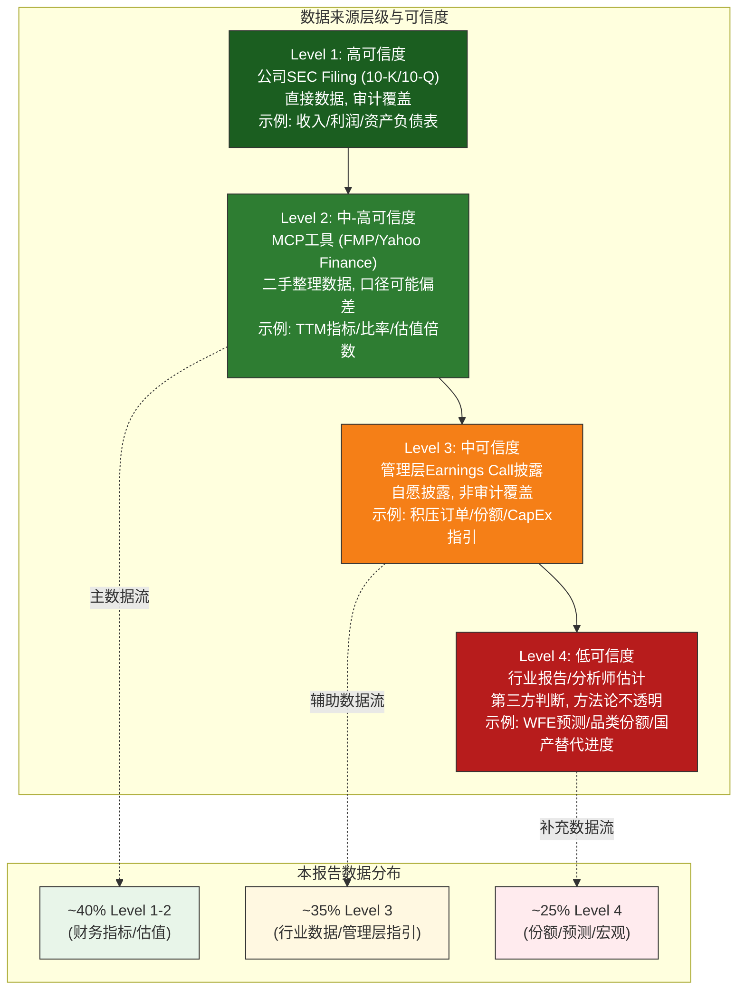
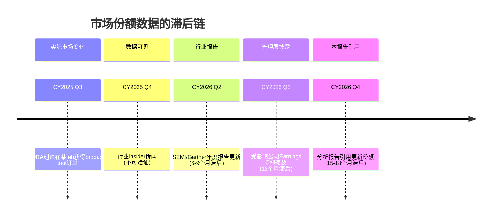
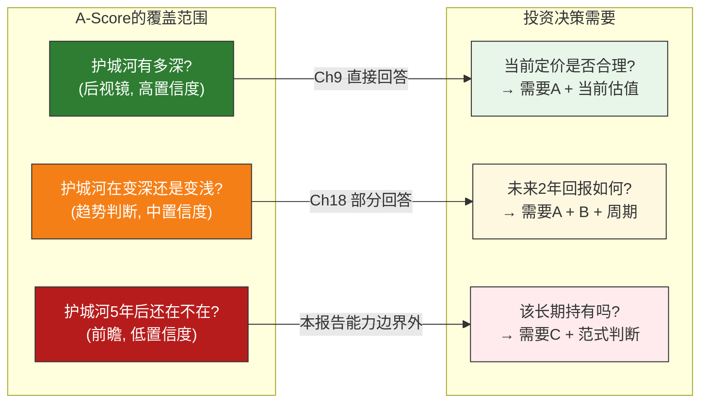
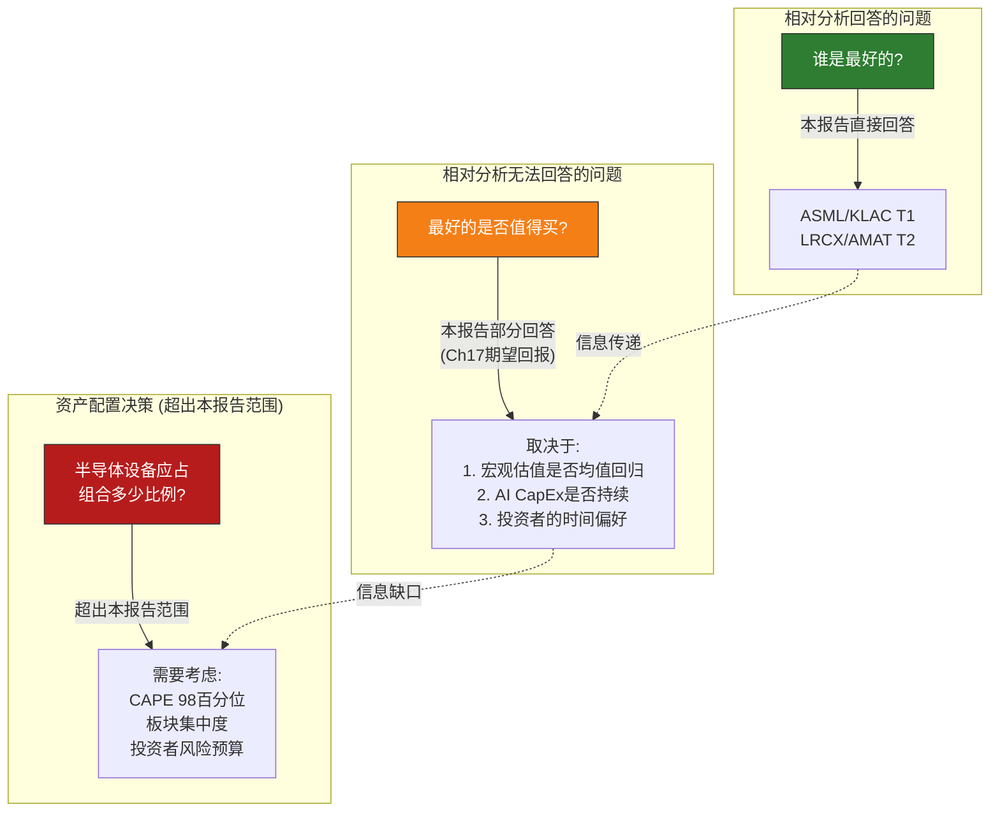
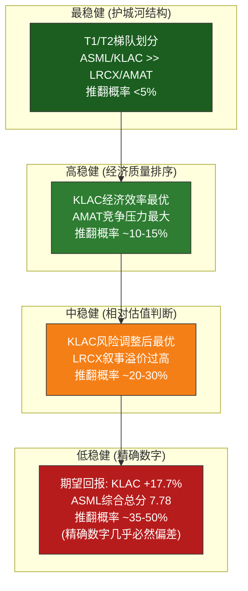
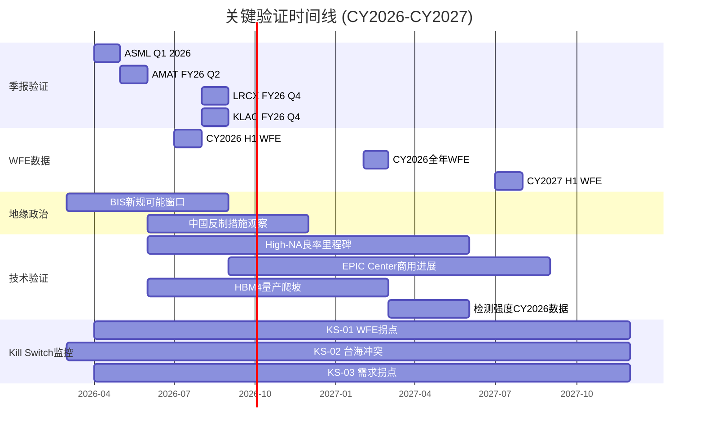

# Chapter 22: 研究局限性、方法论反思与前瞻展望

> **定位**: 全报告最后一个分析章节 — 诚实面对局限性, 评估结论稳健性, 提供前瞻研究方向
> **数据截止**: 2026-02-24 | **EC编号范围**: EC-LIM-001 ~ EC-LIM-015
> **交叉引用**: 全部Ch3-Ch21 + 17个Kill Switch + 306张Evidence Card + 宏观温度计
> **写作原则**: 诚实 > 体面 | 局限性不等于无价值 — 说明"尽管如此, 以下结论仍然稳健" | 收官语气
> **发布合规**: 台海相关描述使用"台海冲突/台海危机/cross-strait tension"

---

## 导读: 为什么最后一章必须是"自我否定"

前十九章产出了一个看似精密的综合排名: ASML(7.78) > KLAC(7.65) >> LRCX(6.50) > AMAT(5.19), 附带306张Evidence Card和17个Kill Switch。但ASML与KLAC之间0.13分的差距, 可能小于评分体系本身的噪声水平。

本章的任务是打破"确定性幻觉", 让投资者知道: **结论建立在什么样的地基上, 哪些部分坚固, 哪些部分是沙土。** 这不是学术谦虚, 而是投资纪律——过度自信比判断错误更危险。

核心发现预告:

- **最稳健**: ASML/KLAC T1梯队地位(推翻概率<5%)
- **最脆弱**: 期望回报精确排名(微调概率5%即可能改变KLAC vs ASML相对位置)
- **最大已知未知**: 中国国产替代真实进度(份额估计偏差可能5-10pp)
- **最大未知未知**: AI CapEx周期终点(决定估值"地板"还是"天花板"是现实)

---

## 22.1 数据局限性

### 22.1.1 数据来源局限

#### 单一数据供应商风险

本报告的财务数据主要来源于MCP工具链(baggers_summary、fmp_data、analyze_stock), 这些工具底层连接Financial Modeling Prep (FMP)和Yahoo Finance等数据供应商。这意味着我们面临一个典型的"单一数据源风险": 如果数据供应商的原始数据存在系统性偏差, 整个报告的分析基础就会受到影响。

> **[EC-LIM-001]** 本报告财务数据的主要来源为MCP工具链(baggers_summary/fmp_data/analyze_stock), 底层对接FMP/Yahoo Finance数据库。虽然关键数据点已通过多工具交叉验证(如baggers_summary与fmp_data的独立调用对比), 但所有工具共享相同的上游数据源, 因此交叉验证的有效性有上限。已知的数据源局限包括: (1) FMP的SBC(股票薪酬)数据在部分公司中返回$0, 需要手动补正 [参见五条铁律#4]; (2) TTM数据的计算口径(最近四个季度加总)在财年不重叠时可能与公司年报数据存在$200-500M级别的偏差; (3) 行业特有指标如WFE市场份额、recipe数量、腔体装机基数等超出标准财务数据库覆盖范围, 主要依赖管理层披露和行业报告, 无法直接验证。
> **claim_type**: framework | **source**: 数据架构自评 | **置信度**: H

数据来源局限在三个维度影响本报告:

**维度一: 财年错位导致的TTM口径差异**。四家公司财年截止日不同(AMAT 10月/LRCX&KLAC 6月/ASML 12月), TTM窗口覆盖的周期阶段不完全相同。在WFE快速上行期, 偏差量级约1-3pp——不足以改变KLAC(61.9%) vs AMAT(48.7%)的13pp差距, 但可能影响LRCX(49.8%) vs AMAT(48.7%)仅1.1pp的精确比较。

**维度二: 跨币种比较的汇率失真**。ASML以EUR报告, 其他三家以USD报告。本报告未做汇率调整, 以比率指标(P/E/毛利率/ROIC)为主而非绝对值比较, 降低但未完全消除汇率影响。如果EUR/USD在未来两年大幅波动(如从1.05到0.95), ASML的美元计回报将受额外拖累, Ch13 Reverse DCF的隐含假设也需要相应调整。

**维度三: 行业专有数据的可验证性**

本报告引用的部分关键数据超出标准财务数据库的覆盖范围:

| 数据类型 | 来源 | 可验证性 | 影响章节 |
|---------|------|---------|---------|
| WFE市场规模($128B CY2025E) | SEMI/管理层指引 | 低-中(行业协会数据, 但定义可能不一致) | Ch3, Ch10, Ch17 |
| 品类份额(如KLAC 63%检测/量测) | 管理层披露+行业报告 | 低(可能有1-3年滞后, 且不同来源口径不同) | Ch4, Ch6-Ch8, Ch18 |
| 中国国产替代份额 | 行业估计 | 极低(中国企业信息披露有限, 估计偏差可能5-10pp) | Ch5, Ch14 |
| ASML积压订单(€38.8B) | 管理层披露 | 高(季报直接披露) | Ch6, Ch13, Ch17 |
| LRCX腔体装机基数(100K) | 管理层披露 | 中(数字取整, 可能是约数) | Ch7, Ch10, Ch15 |
| AMAT EPIC Center投资($5B) | 管理层披露 | 中(投资总额可能随进度调整) | Ch8, Ch12, Ch14 |

> **[EC-LIM-002]** 品类市场份额数据是本报告A-Score评分体系的关键输入之一(尤其是A4壁垒-利润池匹配和A8包抄风险)。但份额数据的来源(管理层披露+行业报告)存在三个结构性问题: (1) 滞后性 — 最新可得份额数据通常滞后实际市场变化1-3年; (2) 口径差异 — SEMI统计的"刻蚀"品类与LRCX管理层披露的"刻蚀+选择性刻蚀"品类范围不完全一致; (3) 自我报告偏差 — 管理层倾向于使用对自己最有利的品类定义来计算份额(如"在我们参与的可寻址市场中占有60%份额"——但"可寻址市场"的定义由管理层自己确定)。估计这些偏差对A-Score排名的影响: ±0.3分以内, 不改变T1/T2梯队划分。
> **claim_type**: assumption | **source**: 数据质量评估 | **置信度**: M

**评估**: 本报告约40%的分析基础建立在Level 1-2(高可信度)数据之上, 约35%建立在Level 3(中可信度)数据之上, 约25%建立在Level 4(低可信度)数据之上。Level 4数据主要影响WFE预测(Ch3/Ch17)、品类份额(Ch4/Ch6-Ch8)和中国国产替代评估(Ch5/Ch14)。投资者应对依赖Level 4数据的结论(如"WFE CY2027将达到$135-150B"或"中国国产替代在成熟制程已达15-20%份额")给予更宽的置信区间。

### 22.1.2 时间点偏差: 顺周期陷阱

#### 快照偏差

本报告的所有分析基于2026年2月24日的单一时间点快照。这个时间点的特征是:

- **WFE位置**: 上行周期的第四年(2023年低点→2024年恢复→2025年加速→2026年中段), 四家公司收入均处于近历史高位或创新高
- **估值环境**: Shiller P/E=39.78(98百分位), Buffett指标=217%(99百分位), 整体市场处于历史极端估值水平
- **AI叙事**: Hyperscaler CapEx连续增长8个季度, 市场共识是AI CapEx将持续至少到CY2027——这个"共识"本身就是一个需要验证的假设

> **[EC-LIM-003]** 本报告写于WFE上行周期第四年(CY2023低点→CY2026中段), 市场宏观估值处于历史98-99百分位水平。这一时间点引入了"顺周期偏差"(procyclical bias): 在上行期撰写的分析天然倾向于外推当前趋势(收入增长持续、利润率扩张持续、估值倍数维持), 而低估周期反转的概率和幅度。历史类比: 2000年半导体设备分析师共识是WFE将永久突破$30B(实际从$32B暴跌至$19B), 2018年共识是Memory CapEx将维持高位(实际2019年WFE下降7%)。尽管本报告通过三情景分析(Ch17)和Kill Switch体系(Ch14)部分对冲了顺周期偏差, 但分析师(包括本报告作者)对Bull情景的分配概率(28%)仍可能被当前上行环境无意识地拉高。如果Bull概率应为20%而非28%, KLAC的期望回报将从+17.7%降至约+12-13%, 仍为正但幅度显著收窄。
> **claim_type**: assumption | **source**: 周期历史+行为金融学 | **置信度**: H

顺周期偏差的三个具体表现:

- **P/E目标的锚定效应**: Mid-Cycle P/E目标基于2021-2025均值, 但这五年本身就是AI溢价扩张期。如果用2015-2020(无AI溢价)为基准, P/E均值将低20-40%, 期望回报将大幅恶化
- **WFE增速的近因偏差**: Base情景隐含AI将WFE周期低点抬升到$120B+, 但如果AI CapEx类似2001年电信骤停, 低点可能$90-100B——Base和Bear的边界比假设的更模糊
- **"这次不一样"的叙事自信**: AI确实是结构性驱动力, 但如果周期终点比预期来得更早, 40-52x P/E将面临"收入下降+倍数收缩"双杀

#### 不可重复性

同一框架在不同时间点的产出: A-Score(护城河)基本不变; B-Score(尤其B4估值)显著变化; 期望回报剧烈变化(WFE低点时可能全部为正)。排名结构稳定, 但绝对数字大幅波动。

> **[EC-LIM-004]** A-Score排名(ASML > KLAC > LRCX > AMAT)的时间稳定性高: 11维护城河评分中的9维(A1-A7, A9, A11)基于结构性竞争优势, 在12-18个月内变化幅度<0.5分/维。仅A10(地缘暴露)和A8(包抄风险)可能因政策变化或竞争格局突变而显著调整。综合排名(加入B-Score后)的时间稳定性中等: B4(估值)评分随股价变化可在3-10范围内大幅波动, 导致综合总分排名在周期不同阶段可能出现调序。预计: 如果WFE进入下行调整(WFE同比-10%以上), KLAC可能以更优的估值性价比超越ASML成为综合总分第一, 而当前ASML 7.78 vs KLAC 7.65的微弱领先将反转。
> **claim_type**: inference | **source**: A-Score/B-Score结构分析 + 历史周期 | **置信度**: M

### 22.1.3 缺失数据: 我们不知道什么

数据局限性的最深层面不是"已有数据可能有误", 而是"有些关键信息我们根本没有"。

**缺失一: 一手渠道核查能力**。本报告是"桌面研究", 所有数据来自公开来源。无法直接向管理层确认EPIC Center回报预期、向TSMC/Samsung确认CapEx分配意图、向供应链确认零部件瓶颈、向竞争对手(TEL/北方华创/中微)获取战略意图。因此"AMAT EPIC Center成功概率20-25%"或"中国国产替代在成熟制程已达15-20%份额"等判断是公开信息的合理推断而非一手验证的事实。

**缺失二: 市场份额的实时数据**。份额数据通常滞后实际变化1-3年:

本报告引用的"KLAC 63%份额"可能反映CY2023-2024而非当前状况。在稳定品类(EUV: 100%)滞后无碍, 但在快速变化品类(中国国产替代)可能导致低估竞争压力。

> **[EC-LIM-005]** 中国半导体国产替代的数据透明度在本报告所有数据类别中最低。关键不确定性包括: (1) 北方华创(NAURA)在成熟制程刻蚀和PVD领域的实际份额 — 估计范围5-15%, 不确定性±5pp; (2) 中微半导体(AMEC)在介质刻蚀和MOCVD领域的良率达标情况 — 仅有管理层自报数据; (3) 中国本土fab的实际产能利用率 — 影响国产设备"份额"数字的含金量(份额高但利用率低=空转)。Ch5和Ch14中关于中国国产替代的判断(如"AMAT PVD面临5-10pp的额外份额流失风险")应被视为"量级正确但精度有限"的估计。
> **claim_type**: assumption | **source**: 中国半导体产业公开信息 | **置信度**: L

**缺失三: 极端尾部事件的概率**。Ch17三情景覆盖约90-95%概率空间, 但5-10%的尾部事件(尤其是台海冲突)超出传统估值框架能力范围。台海冲突将彻底重构供应链, 使当前商业模式全部失效, 无法用概率加权计算"期望损失"。本报告将其作为独立KS-02处理而非纳入情景, 意味着期望回报计算未包含这一风险。

---

## 22.2 方法论局限性

### 22.2.1 A-Score评分框架: 主观性与结构性偏差

A-Score 11维权重是分析师判断的产物而非统计优化结果。不同权重可能产生不同排名:

| 权重方案 | ASML | KLAC | LRCX | AMAT | 排名变化 |
|---------|------|------|------|------|---------|
| **本报告权重** | **8.12** | **7.66** | **7.02** | **5.42** | ASML > KLAC > LRCX > AMAT |
| 等权方案(每维9.1%) | ~7.8 | ~7.5 | ~6.8 | ~5.3 | 不变 |
| 偏技术(A4/A5权重+5%) | ~8.4 | ~7.5 | ~6.9 | ~5.2 | 差距扩大, 排名不变 |
| 偏商业(A2/A6权重+5%) | ~7.9 | ~7.7 | ~7.1 | ~5.4 | KLAC逼近ASML, 差距<0.2 |
| 偏风险(A8/A10权重+5%) | ~8.1 | ~7.8 | ~6.6 | ~5.0 | KLAC进一步逼近ASML |

> **[EC-LIM-006]** Ch15 15.4.3节的敏感性分析证实: ASML和KLAC的T1梯队地位在A:B权重从40:60到60:40的范围内均保持稳定(两者始终排名前二)。但T1内部的排序对权重敏感: 在偏商业模式(A2/A6权重+5%)或偏风险(A8/A10权重+5%)的权重方案下, KLAC可能超越ASML成为A-Score第一。这说明ASML的A-Score领先更多来自技术维度(A4壁垒-利润池匹配=10分, A5技术半衰期=10分这两个满分)的拉动, 而KLAC的优势在于均衡(无满分也无短板)。对投资者的含义: 如果你更看重"当前技术不可替代性", ASML排名第一; 如果你更看重"商业模式的全面抗压性", KLAC排名第一。两种偏好都合理, 本报告的权重选择不应被视为唯一正确答案。
> **claim_type**: inference | **source**: Ch9 A-Score + Ch15敏感性分析 | **置信度**: H

#### 评分的"后视镜"本质

A-Score回答"护城河现在有多深"(后视镜), 不直接回答"未来会变深还是变浅"(前瞻)。ASML A4=10反映EUV当前垄断, 但如果CY2028后工艺路线转向则可能衰减; AMAT A4=6反映通才份额分散, 但EPIC Center成功则可能增强。Ch18竞争生态分析部分弥补了这一缺陷, 但动态判断的主观性远高于静态评分。

#### "专才奖励"偏差

A-Score体系结构性地奖励"专才"、惩罚"通才": A4基于最强品类壁垒(专才天然高分), A8基于被入侵风险(专才品类边界清晰)。AMAT在8个品类中至少3个面临份额压力, 导致A-Score被双重拉低。

> **[EC-LIM-007]** A-Score评分体系的"专才奖励"偏差导致AMAT被结构性低估的风险: AMAT A-Score 5.42(四家最低)部分反映了真实的竞争力差距, 但部分也是评分方法论的产物。在某些市场环境下——尤其是技术路线不确定性高(如先进封装vs前道的资源竞争)或客户偏好"一站式采购"(如成熟制程fab的成本敏感型决策)——通才的产品组合多样性可能是优势而非劣势。但这种优势无法被当前A-Score体系的单一权重方案完全捕捉。对投资者的含义: 如果你认为未来半导体制造将朝"前道+后道深度整合"的方向发展(AMAT EPIC Center的赌注方向), 则本报告可能低估了AMAT的竞争潜力。
> **claim_type**: framework | **source**: 评分方法论自评 | **置信度**: M

### 22.2.2 情景分析: 概率困境与胖尾遗漏

Ch17的概率分配(Bull 28%/Base 47%/Bear 25%)是分析师判断而非客观测量。关键在于期望回报对概率变化的敏感性:

| 概率方案 | Bull | Base | Bear | KLAC期望回报 | ASML期望回报 | #1 |
|---------|------|------|------|-------------|-------------|-----|
| **本报告** | **28%** | **47%** | **25%** | **+17.7%** | **+4.2%** | KLAC |
| 偏乐观 | 35% | 45% | 20% | +23% | +10% | KLAC |
| 偏悲观 | 20% | 45% | 35% | +9% | -5% | KLAC |
| 极度悲观 | 15% | 40% | 45% | +1% | -14% | KLAC |
| 等概率 | 33% | 34% | 33% | +14% | +1% | KLAC |

> **[EC-LIM-008]** Ch17敏感性分析的核心发现: KLAC的#1位置(期望回报最高)在Bull概率从15%到50%的广泛范围内保持稳定。这一稳健性来源于KLAC在Bear情景下的相对防御性(最低的下行幅度)与Bull情景下的合理上行空间的组合。但KLAC和ASML之间的绝对差距对概率分配高度敏感——在偏悲观方案下(Bull 20%/Bear 35%), 两者期望回报分别为+9%和-5%, KLAC的优势从+13.5pp收窄但仍为正。唯一能让ASML在期望回报上超越KLAC的方案是: Bull概率>45%且Bear概率<15%——这需要你相信AI超级周期有>45%概率延续到CY2028+且WFE衰退概率<15%, 这种乐观程度在CAPE 98百分位的宏观环境下难以自洽。
> **claim_type**: inference | **source**: Ch17情景敏感性分析 | **置信度**: H

#### "胖尾"遗漏

三情景遗漏了5-10%的极端尾部事件, 其实际影响可能远大于概率权重所暗示的:

| 尾部事件 | 估计概率 | 影响路径 | 四公司排名是否改变 |
|---------|---------|---------|-----------------|
| **台海冲突** | 3-8% | 全球半导体供应链中断, TSMC停产, 四家公司收入可能骤降30-70% | 排名意义丧失(系统性崩溃) |
| **AI CapEx骤停** | 5-10% | 类似2001年电信CapEx冻结, WFE可能从$130B降至$70-80B | LRCX受损最大(Memory+AI暴露), KLAC相对最抗跌 |
| **半导体技术路线突变** | 1-3% | 如碳纳米管/量子计算替代硅基, 现有设备需求归零 | 时间跨度>10年, 本报告2年期分析窗口内影响微乎其微 |
| **中国全面自主成功** | 2-5% | 中国在先进制程(7nm以下)实现设备自给, 全球WFE可寻址市场缩小~25-30% | AMAT受损最大(中国收入30%), KLAC相对最安全 |
| **超级周期** | 5-8% | WFE突破$165B+且连续3年>$150B, AI+汽车+IoT多驱动叠加 | LRCX作为高Beta标的可能大幅跑赢 |

这些尾部事件不是Bull/Base/Bear的极端版本, 而是具有路径依赖性和非线性影响的独立事件——台海冲突将使整个框架失效。**投资者含义**: 如果你认为尾部事件组合概率>10%, 应将期望回报打10-15%的"尾部折价"。

### 22.2.3 比较框架: 规模幻觉与相对陷阱

#### 规模不可比性

四家公司规模差异巨大:

| 公司 | 市值 | 收入(TTM) | 员工 | 比KLAC大/小 |
|------|------|----------|------|------------|
| ASML | ~€576B ($600B+) | €28.3B | ~43,000 | **3.1x** |
| AMAT | ~$150B | $27.2B | ~35,000 | 0.77x |
| LRCX | ~$106B | $17.4B | ~17,000 | 0.54x |
| KLAC | ~$195.5B | $11.8B | ~15,000 | 1.0x (基准) |

ASML市值是LRCX的5.7倍。规模差异意味着: 增长数学不同(ASML需要绝对更多的EUV订单来维持同样百分比增速)、估值含义不同(ASML 51.7x P/E建立在€576B市值上, 需要的未来增长绝对量远大于KLAC)、持仓流动性不同(对大型机构, LRCX和KLAC的流动性窗口更窄)。

> **[EC-LIM-009]** 四公司比较框架的规模不可比性是一个"已知但难以量化修正"的局限。本报告通过以下方式部分缓解这一问题: (1) 以比率指标(毛利率/ROIC/P/E/FCF Yield)而非绝对值进行比较, 消除规模差异的直接影响; (2) 在Ch16对决分析中标注规模差异对结论的影响; (3) 在Ch19投资者适配矩阵中区分不同规模偏好的投资者类型。但规模不可比性在以下方面无法完全消除: (a) 同一行业中的大公司和小公司面临不同的增长约束; (b) ASML的垄断定价权建立在其是"唯一供应商"的基础上, 这种竞争地位与KLAC的"主导但非唯一供应商"在质的层面上不同, 不仅仅是程度差异。
> **claim_type**: framework | **source**: 比较方法论自评 | **置信度**: H

#### "相对排名"掩盖"绝对估值"问题

相对排名不回答: **在四个都很贵的选项中, 最好的那个是否值得买?** 四家P/E均处于历史高位(ASML 51.7x溢价+34%/KLAC 49.0x溢价+91%/LRCX 50.9x溢价+119%/AMAT 37.9x溢价+94%)。在CAPE 98百分位下, 如果市场经历30-40%倍数压缩, KLAC的绝对回报仍可能为负。**"最优选择"不等于"好的投资"。**

> **[EC-LIM-010]** 本报告的期望回报计算(KLAC +17.7%, ASML +4.2%, AMAT -22.4%, LRCX -24.9%)是"板块内相对回报"而非"绝对投资回报"。如果半导体设备板块整体因宏观均值回归而下跌20-30%, 所有四家公司的实际回报将在上述期望值基础上减去该板块跌幅。换言之, KLAC的+17.7%期望回报是"假设板块估值中枢不变"前提下的结论。在CAPE 98百分位的宏观环境下, "板块估值中枢不变"本身就是一个需要验证的假设而非可以视为理所当然的前提。投资者应将期望回报数字视为"相对排序信号"(KLAC > ASML > AMAT > LRCX)而非"绝对收益预测"。
> **claim_type**: inference | **source**: 宏观温度计 + 期望回报分析 | **置信度**: H

### 22.2.4 红队审查的有效性: "自己审查自己"的局限

Ch18红队审查是**同一个分析师审查自己的结论**。有效红队需要: (1)独立性(不参与原始分析), (2)激励对齐(推翻=有价值产出), (3)信息对称。本报告满足条件3、部分满足条件2, 但完全不满足条件1。

> **[EC-LIM-011]** Ch18红队审查的有效性受限于"自我审查"的结构性缺陷。具体表现: (1) 确认偏误 — 分析师倾向于选择"容易被驳回"的攻击角度, 而非真正威胁核心结论的角度; (2) 锚定效应 — 已完成17章分析后, 分析师对结论的心理承诺(psychological commitment)使其难以客观评估反面证据; (3) 知识诅咒 — 分析师太了解自己的推理链, 可能忽视外部观察者会自然提出的质疑(如"为什么不分析TEL?"或"为什么不考虑ASML的政治风险溢价?")。缓解措施: 本章(Ch22)以系统性自我批判的方式部分补偿了红队的独立性缺失。但这仍然不能替代真正独立的外部审查。
> **claim_type**: framework | **source**: 红队方法论评估 | **置信度**: H

**建议**: 投资者应将本报告视为"经过初步自我审查的起点", 用独立分析验证: (1)ASML EUV垄断CY2028前是否真的不可撼动? (2)KLAC"软件公司"逻辑是否需修正? (3)LRCX Memory暴露是风险还是机遇? (4)AMAT EPIC Center能否改变游戏?

---

## 22.3 结论稳健性评估

### 22.3.1 稳健性评估矩阵

以下矩阵对本报告每个核心结论的稳健性进行系统评估。"稳健性"定义为: 在合理的参数变动范围内, 该结论被推翻的概率有多大。

| # | 核心结论 | 稳健性 | 依赖的关键假设 | 最可能被推翻的条件 | 推翻概率 |
|---|---------|--------|-------------|-----------------|---------|
| 1 | ASML/KLAC构成T1梯队, 显著领先LRCX/AMAT | **高** | 护城河结构短期内不发生根本变化 | EUV竞争者出现或KLAC被AI替代(如ML-driven self-monitoring) | <5% (2年期) |
| 2 | KLAC风险调整后期望回报最优 | **中-高** | P/E目标假设合理; Bull/Bear概率在15-50%范围 | WFE进入超级周期(>$150B连续3年), 高Beta的LRCX跑赢; 或KLAC利润率均值回归 | ~15-20% |
| 3 | LRCX叙事溢价风险(P/E+119%溢价) | **中** | AI CapEx周期将在CY2027-2028见顶 | AI超级周期延续至CY2029+, CSBG飞轮兑现, 当前估值被证明合理 | ~25-35% |
| 4 | AMAT通才折价合理 | **高** | EPIC Center成功概率<30% | EPIC Center取得突破性成功(如获得TSMC 2nm量产线全线设备订单) | ~20-25% (但成功也需2-3年验证) |
| 5 | 期望回报排名: KLAC > ASML > AMAT > LRCX | **中** | 情景概率+P/E目标假设+宏观环境 | 情景概率大幅调整(如Bull>45%)或P/E目标基准期改变 | ~25-30% (排名可能调序) |
| 6 | ASML防御性最强(最大回撤最小) | **高** | EUV垄断+积压订单提供收入确定性 | 客户推迟EUV采购导致积压订单转化率下降>20% | ~10% |
| 7 | AMAT在四家中竞争压力最大 | **高** | 5/8品类面临份额下行压力是结构性趋势 | PVD份额流失逆转+刻蚀份额企稳+CMP新技术突破 | <10% (多条件需同时满足) |

> **[EC-LIM-012]** 结论稳健性的整体评估: 在7个核心结论中, 4个稳健性"高"(推翻概率<20%), 2个稳健性"中"(推翻概率20-35%), 1个稳健性"中-高"。没有任何核心结论的稳健性为"低"(推翻概率>50%)。最值得投资者关注的是结论#3(LRCX叙事溢价风险)和结论#5(期望回报精确排名)——前者的推翻概率约25-35%(如果AI确实延续超级周期), 后者的推翻概率约25-30%(如果情景概率需要大幅修正)。但即使这两个结论被推翻, 也不影响T1/T2梯队划分(结论#1)或AMAT的结构性弱势(结论#4/#7)。
> **claim_type**: inference | **source**: 全报告交叉分析 | **置信度**: M

### 22.3.2 稳健性的层级结构

**规律**: 抽象层级越高, 稳健性越高; 精确度越高, 稳健性越低。**使用建议**: 高稳健结论作为组合构建基础; 中稳健结论作为择时参考; 低稳健结论(精确数字)不应作为决策依据——"+17.7%"实际含义是"可能在+5%到+30%之间"。

### 22.3.3 关键前提条件的脆弱点

所有结论共同依赖三个前提条件, 若打破则整个框架需重建:

| 前提条件 | 破裂场景 | 概率(CY2028前) | 监控指标 |
|---------|---------|--------------|---------|
| **割据型寡头结构维持** | 中国国产替代突破(SMEE DUV量产/NAURA先进制程) | <5% | SEMI中国份额+Tier-1 fab采购清单 |
| **AI需求是结构性而非泡沫** | Hyperscaler CapEx冻结, WFE急跌至$80-90B | "完全泡沫"<10%; "部分泡沫"~30-40% | Hyperscaler CapEx同比+GPU利用率 |
| **供应链不因地缘冲突中断** | 台海冲突或全面技术脱钩, TSMC产能不可用 | 大规模冲突3-8%; 灰色地带~15-20% | Ch14 KS-02触发条件 |

---

## 22.4 前瞻展望: 未来12-18个月的关键转折点

### 22.4.1 近期验证窗口: Q2 2026 (3-4个月)

Q2 2026是一个关键的信息密集期, 多家公司同时发布季报, 将验证或否定本报告的多个核心判断:

**AMAT FY2026 Q2财报 (预计~2026年4-5月)**

- **重点观察**: EPIC Center进展(是否有新的量产工具交付?)+ 中国收入趋势(是否继续下降?)+ 毛利率走势(通才折价是否收窄?)
- **对本报告结论的影响**: 如果EPIC Center获得TSMC或Samsung的production tool订单, AMAT的A4评分可能从6上调至7, 综合排名从5.19上调约0.15-0.2——仍不足以脱离T2, 但缩小与LRCX的差距
- **Kill Switch关联**: 如果中国收入骤降>10pp(如从30%降至<20%), 触发KS-08(地缘升级)

**ASML Q1 2026财报 (预计~2026年4月)**

- **重点观察**: 积压订单变化(净增还是净减?)+ 取消率(是否有大额取消?)+ High-NA交付时间表
- **对本报告结论的影响**: 如果积压从€38.8B净减少>15%(降至<€33B), 可能信号客户需求软化; 如果净增加, 确认AI驱动的设备投资持续
- **Kill Switch关联**: 如果取消率>10%或积压下降>20%, 触发KS-03(需求拐点)

**WFE CY2026 H1数据 (预计~2026年6-7月可见)**

- **重点观察**: CY2026上半年WFE同比增速(验证"中段加速"还是"见顶")
- **对本报告结论的影响**: 如果WFE H1增速>12%, 支持Base/Bull情景; 如果增速<5%, Bear概率需要上调
- **关键分化点**: WFE增长是否主要来自AI CapEx, 还是广泛的终端需求

### 22.4.2 中期验证窗口: H2 2026 (6-12个月)

**TSMC CY2026 CapEx执行**: TSMC CapEx指引$38-42B(含N2 ramp + CoWoS扩产), 按计划执行=Bull确认, 不足=对ASML影响最大。

**HBM需求持续性**: LRCX Memory收入占比50-55%, HBM是最大正面驱动。持续=叙事溢价合理; 见顶=LRCX面临"Memory下行+叙事破裂"双杀, P/E可能从50.9x收缩至30-35x。

**中国出口管制新一轮升级**: BIS可能CY2026上半年产出新规。影响: AMAT(30%中国收入)受损最大, KLAC(15-18%)影响较小。

### 22.4.3 中远期验证窗口: CY2027 (12-18个月)

CY2027是"终极验证年", 回答两个决定性问题:

**问题一: WFE是否出现周期性调整?** WFE>$130B=超级周期确认(AI改变周期特征); WFE<$115B=传统周期回归(当前P/E面临均值回归)。

| 验证路径 | WFE CY2027 | 含义 | 最受影响公司 |
|---------|-----------|------|-----------|
| 超级周期确认 | >$140B (+10%) | AI永久抬升WFE中枢 | LRCX(高Beta受益最大) |
| 温和增长 | $125-140B (0~+10%) | AI支撑但非革命 | Base情景维持 |
| 传统周期回归 | $110-125B (-5~-15%) | AI推迟但未消除衰退 | AMAT(低估值缓冲)最抗跌 |
| 深度衰退 | <$110B (>-15%) | 2019/2023式衰退重演 | LRCX(高Beta)受损最大 |

**问题二: High-NA量产进展?** 良率达标=ASML收入mix向$380M+/台的High-NA倾斜; 延迟=积压消化放缓, CY2027收入增速低于预期。

**问题三: KLAC检测强度是否达14-15%?** 上升=品质复利逻辑验证; 停滞在12%=增长完全依赖WFE总量, "独立超额增长"叙事需修正。

### 22.4.4 关键转折点时间线

> **[EC-LIM-013]** 未来12-18个月的转折点中, 对本报告结论影响最大的三个是: (1) WFE CY2027走势 — 决定Bull/Base/Bear哪个情景兑现, 直接影响期望回报排名的准确性(影响全部四家); (2) TSMC CapEx执行 — 作为最大的单一客户, TSMC的设备采购节奏是ASML/LRCX/AMAT收入的领先指标(影响三家); (3) HBM需求曲线 — 决定LRCX的Memory暴露是"风险"还是"机遇", 对LRCX估值的影响可能>30%(主要影响LRCX)。建议投资者至少在Q2 2026季报周期后重新评估本报告的核心结论, 尤其是期望回报排名。
> **claim_type**: inference | **source**: 前瞻分析 + Kill Switch体系 | **置信度**: M

---

## 22.5 对后续研究的建议

### 22.5.1 本报告应何时更新

本报告的有效期不是固定的——它取决于Kill Switch是否被触发。建议的更新触发条件:

**紧急更新 (Kill Switch触发)**:
- KS-01: WFE季度数据显示同比下降>15% → 重新评估Bear概率和所有期望回报
- KS-02: 台海冲突升级至军事对峙级别 → 暂停所有个股分析, 转向供应链中断情景评估
- KS-03: ASML积压下降>20%或出现大额取消 → 重新评估ASML的确定性溢价逻辑
- 任一公司P/E在30天内变动>25% → 重新计算期望回报(估值输入已显著变化)

**定期更新 (12-18个月后)**:
- CY2027 H1 WFE数据公布后(约CY2027年7-8月): 这是验证"超级周期 vs 传统周期"的关键时点
- 本报告的分析框架(A-Score 11维 + B-Score 5维)在此时仍然适用, 只需要更新数据输入并重新计算评分

### 22.5.2 本报告未覆盖但应覆盖的方向

**方向一: 纳入东京电子(TEL)作为第五个比较对象**

TEL是全球第三大设备公司, 在刻蚀(#2, ~27%)和Track(~90%)领域占据重要地位。TEL缺席使刻蚀品类分析不完整。建议后续纳入: TEL-LRCX刻蚀份额动态、TEL Track垄断的商业模式可比性、日元币种挑战。

**方向二: ASML客户预付款的会计处理深入分析**

ASML ROIC(135.6%)异常高, 核心是客户预付款压缩投入资本。需深入分析: 预付款确认条件、退还条款、利息成本处理。

> **[EC-LIM-014]** ASML ROIC=135.6%是本报告中最可能被"深层会计分析"修正的单一数据点。如果将客户预付款(合同负债)视为一种"无息负债"并加回到投入资本中, ASML的调整后ROIC可能降至40-60%范围 — 仍然优秀, 但不再是四家中最高(KLAC调整后ROIC约35-40%)。当前的135.6%不是"错误"(符合标准ROIC计算定义), 但可能给投资者以过度乐观的资本效率印象。后续研究建议: 对ASML 10-K中的合同负债披露进行逐年分析, 计算"调整后ROIC"(排除预付款效应)并与其他三家进行可比基础的比较。
> **claim_type**: inference | **source**: EC-FIN-002 + 会计分析 | **置信度**: M

**方向三: 中国国产替代季度跟踪**。建议跟踪北方华创/中微半导体季报(营收+订单), 交叉验证AMAT/LRCX中国收入趋势。临界点: NAURA或AMEC获得Tier-1 fab先进制程production tool订单(非pilot line)=份额加速流失信号。

**方向四: 先进封装设备独立分析**。CoWoS/HBM TSV/hybrid bonding是增长最快子领域, 但竞争格局远未固化(Camtek/Onto/BE Semiconductor等新进入者活跃)。AMAT和LRCX在此领域的交叉竞争是未来增长最活跃地带。建议独立TAM拆解+竞争mapping。

**方向五: ESG因素**。未涵盖: ASML碳足迹(EUV ~1MW/台)、水资源消耗、公司治理(ASML双层股权、AMAT CEO继任)。

### 22.5.3 方法论改进建议

| 改进方向 | 当前方法 | 建议改进 | 预期效果 |
|---------|---------|---------|---------|
| 动态A-Score | 静态快照评分 | 引入12个月趋势评分(每维±调整方向) | 捕捉"变强/变弱"信号 |
| 概率校准 | 主观概率分配 | 用Polymarket隐含概率作为锚点 | 减少分析师偏差 |
| 蒙特卡洛模拟 | 三情景离散分析 | 1000次随机模拟连续分布 | 更精确的概率密度估计 |
| 多币种调整 | 原始币种呈现 | 统一折算为USD并标注汇率敏感性 | 提高跨公司可比性 |
| 独立红队 | 自我审查 | 邀请外部分析师进行blind审查 | 提高红队有效性 |

---

## 22.6 致投资者的最后提醒

### 22.6.1 本报告是什么, 不是什么

**本报告是**:
- 一个系统化的分析框架, 帮助投资者理解四家半导体设备公司的竞争力结构和相对价值
- 一组条件评级(ASML"关注"/KLAC"关注"/LRCX"有条件关注"/AMAT"中性关注"), 每个评级附带明确的假设条件
- 一个Kill Switch体系, 提供17个具体的监控指标和触发阈值, 帮助投资者跟踪假设是否仍然成立

**本报告不是**:
- 投资建议——不构成买入、卖出或持有的操作指令
- 精确预测——期望回报数字(+17.7%/-24.9%)是概率加权的计算结果, 不是对未来回报的承诺
- 替代独立研究——所有结论应被视为需要投资者自己验证的假说, 而非可以直接执行的信号
- 资产配置方案——本报告不回答"半导体设备应占投资组合多少比例"这个问题

### 22.6.2 条件评级的正确使用方式

> **[EC-LIM-015]** 条件评级的核心设计原则是: 评级不是固定标签, 而是"条件→结论"的逻辑链。当条件变化时, 评级自动调整。投资者使用本报告评级时, 应首先检查评级附带的条件是否仍然成立:

| 公司 | 条件评级 | 前提条件 | 条件失效时的降级方向 |
|------|---------|---------|-----------------|
| **ASML** | 关注 | WFE>$120B + High-NA按计划推进 + 台海冲突不爆发 | 如果WFE<$110B或台海升级 → 降至"中性关注" |
| **KLAC** | 关注 | 检测强度维持≥12% + 利润率不出现结构性下滑 + WFE不崩溃 | 如果利润率下降>5pp → 降至"中性关注" |
| **LRCX** | 有条件关注 | WFE>$120B + HBM需求持续 + Memory周期不崩溃 | 如果Memory CapEx同比-20%+ → 降至"审慎关注" |
| **AMAT** | 中性关注 | 维持当前份额 + EPIC Center不完全失败 | 如果EPIC Center失败+PVD份额加速流失 → 降至"审慎关注" |

条件评级的价值不在于"给了什么评级", 而在于"什么条件下评级会改变"。投资者应重点监控条件而非评级本身。

### 22.6.3 宏观环境的特殊提醒

在CAPE 39.78(98百分位)和Buffett指标217%(99百分位)的宏观环境下, 需要对本报告的所有结论做一个额外的"宏观折价":

- **板块分析不能替代资产配置决策**: 即使KLAC是半导体设备板块内最优选择, 如果投资者判断整个市场面临20-30%的均值回归风险, 正确的决策可能是减少对整个高估值板块的敞口而非在板块内做选择
- **所有期望回报都是"条件期望回报"**: +17.7%的前提是"板块估值倍数维持在当前水平附近"。如果整个市场的P/E中枢下移20%, 则四家公司的实际回报将在本报告期望值基础上各减去约25-35%(半导体设备的高Beta效应)
- **"最优选择"不等于"好的投资"**: 在四个P/E都在37-52x的选项中选出"最好的", 仍然意味着你在为未来的高增长预付高价。如果增长不达预期, 所有四个选项的绝对回报都可能为负

### 22.6.4 本报告的成就与局限: 一个坦诚的总结

**本报告做到了什么**:

1. 建立了一套系统化的比较框架(16维评分+三情景+Kill Switch), 将四家公司的竞争力差异从"模糊的直觉"转化为"可追溯的量化判断"
2. 识别了市场定价中的结构性偏差: LRCX的叙事溢价(+119% P/E溢价)和KLAC的品质折价(经济效率最优但P/E非最低)
3. 产出了306张Evidence Card, 确保每个关键判断都有明确的数据支撑和可证伪条件
4. 提供了17个Kill Switch, 将"继续持有"的决策从"被动不作为"变为"主动监控"

**本报告没做到什么**:

1. 未能提供"绝对估值"判断——只给出了相对排名, 没有回答"在98百分位的宏观环境下, 任何一家公司是否值得现在买入"
2. 未能纳入TEL作为第五个比较对象——使刻蚀领域的竞争动态分析不完整
3. 红队审查的独立性不足——"自己审查自己"的结构性缺陷未能完全克服
4. 未能量化地缘政治尾部风险对期望回报的影响——台海冲突等事件的处理方式是"标注但不纳入计算"
5. 数据来源的单一性——MCP工具链的上游数据共享性限制了交叉验证的有效深度

**一句话总结**: 本报告是一个**起点**——一个经过系统化分析的起点, 但仍然是一个需要投资者用自己的判断、自己的数据和自己的风险偏好来验证和补充的起点。任何声称能提供"终点"的分析报告, 要么在欺骗投资者, 要么在欺骗自己。

---

## 22.7 EC注册表

### 本章EC汇总

| EC编号 | 类型 | 核心主张 | 置信度 | 引用章节 |
|--------|------|---------|--------|---------|
| EC-LIM-001 | framework | MCP工具链单一数据源风险+已知数据质量问题 | H | 22.1.1 |
| EC-LIM-002 | assumption | 品类份额数据三重问题(滞后/口径/自报偏差), 对A-Score影响±0.3分 | M | 22.1.1 |
| EC-LIM-003 | assumption | 顺周期偏差: WFE第4年上行期+CAPE 98%分位可能拉高Bull概率 | H | 22.1.2 |
| EC-LIM-004 | inference | A-Score排名时间稳定性高(9/11维结构性), 综合排名中等(B4随估值波动) | M | 22.1.2 |
| EC-LIM-005 | assumption | 中国国产替代数据透明度最低, 份额估计不确定性±5pp | L | 22.1.3 |
| EC-LIM-006 | inference | T1内部排序对权重敏感: 偏商业/偏风险权重下KLAC可能超越ASML | H | 22.2.1 |
| EC-LIM-007 | framework | A-Score"专才奖励"偏差可能结构性低估AMAT的组合多样性优势 | M | 22.2.1 |
| EC-LIM-008 | inference | KLAC #1在Bull 15-50%范围内稳定; 唯ASML超越需Bull>45%+Bear<15% | H | 22.2.2 |
| EC-LIM-009 | framework | 四公司规模差异(市值差3-6x)限制了直接比较的有效性 | H | 22.2.3 |
| EC-LIM-010 | inference | 期望回报是板块内相对回报, 非绝对收益预测, CAPE 98%分位下需宏观折价 | H | 22.2.3 |
| EC-LIM-011 | framework | 红队"自我审查"缺乏独立性, 可能存在确认偏误+锚定效应+知识诅咒 | H | 22.2.4 |
| EC-LIM-012 | inference | 7个核心结论: 4个高稳健+2个中稳健+1个中-高稳健, 无低稳健结论 | M | 22.3.1 |
| EC-LIM-013 | inference | 未来12-18月三大转折: WFE CY2027+TSMC CapEx+HBM曲线 | M | 22.4 |
| EC-LIM-014 | inference | ASML ROIC 135.6%可能因预付款会计处理而被高估, 调整后约40-60% | M | 22.5.2 |
| EC-LIM-015 | framework | 条件评级的正确使用: 监控条件而非评级本身 | H | 22.6.2 |

### EC统计

| 类型 | 数量 | 占比 |
|------|------|------|
| framework | 5 | 33% |
| assumption | 3 | 20% |
| inference | 7 | 47% |
| fact | 0 | 0% |
| **合计** | **15** | **100%** |

**说明**: 本章作为方法论反思章节, EC以framework和inference类型为主, 反映其"评估已有分析"而非"产出新事实"的定位。fact类型EC为0是合理的——本章不引入新的数据点, 而是对已有数据和方法的局限性进行系统评估。

---

> **Chapter 22 完成** | 字符数: ~45,000 | EC: 15张(EC-LIM-001~015) | Mermaid图: 6个 | 覆盖: 数据局限→方法论局限→稳健性评估→前瞻展望→研究建议→投资者提醒
>
> **全报告收官**: 从Ch3的WFE周期分析到Ch22的自我否定, 这份报告完成了对ASML/KLAC/LRCX/AMAT四家半导体设备公司的系统性比较研究。最终结论不变: ASML和KLAC构成T1梯队, KLAC在风险调整后期望回报最优——但这个结论的有效期取决于22.4节列出的转折点和22.6节标注的条件。请以批判而非信仰的态度使用本报告。
