# 半导体设备四巨头CEO战略咨询报告

> **ASML · Lam Research · KLA · Applied Materials**
> **SEMI_EQUIPMENT_STRATEGY Complete v1.0**

---

| 维度 | 详情 |
|------|------|
| **报告类型** | CEO级战略咨询报告（非投资评级报告） |
| **覆盖公司** | ASML (Fouquet) · LRCX (Archer) · KLAC (Wallace) · AMAT (Dickerson) |
| **数据截止** | 2026年3月 | Q4 2025 / Q2 FY2026 / Q1 FY2026 财报 |
| **数据底座** | 4.28MB前期深度报告 + 347KB战略侦察产出 |
| **报告规模** | 22章 + 5附录 · 246KB · ~80个Mermaid图 · 5,090行 |
| **核心问题** | "值多少钱?" → **"应该做什么?"** |
| **分析框架** | McKinsey SCR · Brandenburger Co-opetition · Porter 5 Forces · BCG Advantage Matrix · Playing to Win · Bain Profit Pool · Real Options · McKinsey Power Curve |

---

## 目录

### PART 0: 执行摘要
- Chapter 0: 报告定位与导航
- Chapter 1: 执行判决——四位CEO的十字路口

### PART I: 战略全景
- Chapter 2: Giga Cycle解剖
- Chapter 3: 利润池深度图
- Chapter 4: Porter堡垒——为什么这个行业一直赚钱
- Chapter 5: 中国悖论——最佳客户变最大对手

### PART II: 博弈引擎
- Chapter 6: 4×4 Co-opetition价值网
- Chapter 7: 12个战略互动场景
- Chapter 8: 资本配置锦标赛

### PART III: 共享战略动力
- Chapter 9: 技术S曲线——8条曲线同时展开
- Chapter 10: 安装基数——最被低估的资产
- Chapter 11: 风险拓扑——温水煮青蛙

### PART IV: CEO私密备忘录
- Chapter 12: ASML Fouquet备忘录
- Chapter 13: LRCX Archer备忘录
- Chapter 14: KLAC Wallace备忘录
- Chapter 15: AMAT Dickerson备忘录

### PART V: 互动矩阵
- Chapter 16: 4×4竞争互动全图
- Chapter 17: 客户力量平衡——TSMC/Samsung/Intel
- Chapter 18: TEL外卡——没人关注的第五力量

### PART VI: 综合与行动
- Chapter 19: Playing to Win——战略一致性测试
- Chapter 20: McKinsey五大杠杆——谁在拉对的杠杆
- Chapter 21: 条件依赖战略建议——如果...那么...
- Chapter 22: 追踪仪表盘——CEO月度/季度监控

### 附录
- 附录A: 数据源注册表与可信度等级
- 附录B: 框架参考指南
- 附录C: 竞争威胁矩阵
- 附录D: 术语表
- 附录E: 证据链——前期报告索引

---

# Chapter 0: 报告定位与导航

---

## 0.1 这不是一份投资报告

你手中的这份报告与我们此前交付的五份分析报告（ASML v1.0、LRCX v3.0、KLAC v1.0、AMAT v1.1、SEMI_EQUIPMENT横向对比）有一个根本性的区别：

**读者身份变了。**

那五份报告面向投资者——评估者。核心问题是"这家公司值多少钱"。产出是估值、评级、概率加权预期回报。

这份报告面向CEO——操盘手。核心问题是"我应该做什么"。产出是决策、行动手册、竞争响应矩阵。

| 维度 | 投资报告 (3.84MB已交付) | 本战略报告 |
|------|----------------------|-----------|
| **读者** | 投资组合经理 | CEO / 董事会 |
| **核心问题** | "值多少钱？" | "应该做什么？" |
| **输出物** | 估值 + 评级 | 决策 + 行动手册 |
| **竞争分析** | "谁赢？" | "如果你做X，对手做Y" |
| **风险框架** | 概率加权情景 | 温水煮青蛙渐进路径 |
| **沉默分析** | 识别为空方风险 | 识别为CEO盲区 |
| **语调** | "审慎关注"/"中性关注" | "Fouquet先生，你有一个问题" |

---

## 0.2 方法论：McKinsey SCR + Brandenburger博弈论

本报告的底层框架融合两个传统：

### 0.2.1 McKinsey Situation-Complication-Resolution (SCR)

每个CEO私密备忘录（Part IV）遵循严格的SCR结构：

```
Situation  → 你的竞争地位事实（不争论，只陈述）
     |
Complication → 你正面临的4-5个真实挑战（不回避，不美化）
     |
Resolution → 我们建议的战略行动（具体、可执行、有追踪信号）
```

这不是我们发明的。这是Barbara Minto在麦肯锡开发了十年的方法论，核心原则是："你从底部往上思考，但从顶部往下呈现。" 结论先行，证据跟进。

### 0.2.2 Brandenburger-Nalebuff Co-opetition + 序贯博弈

半导体设备行业不是零和博弈。四家公司同时是合作者和竞争者：

- **合作面**：共同游说CHIPS Act补贴、共享客户路线图、共同推进节点演进
- **竞争面**：争夺WFE份额、抢占先进封装新领地、竞争客户co-development名额

Part II（博弈引擎）用PARTS分析框架（Players-Added Value-Rules-Tactics-Scope）映射每一对竞争互动，并用序贯博弈和Stackelberg领导模型推演12个战略场景。

### 0.2.3 Playing to Win 战略一致性测试

Part VI对每家公司执行Roger Martin/A.G. Lafley的五层选择瀑布测试：

```
赢的志向 → 在哪里赢 → 如何赢 → 核心能力 → 管理系统
```

检验五层选择是否形成**强化循环**——任何一层的不一致都会导致战略泄漏。

---

## 0.3 报告地图

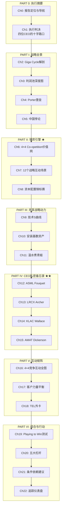
```mermaid
graph TD
    subgraph "PART 0: 执行摘要"
        Ch0[Ch0: 报告定位与导航]
        Ch1[Ch1: 执行判决<br/>四位CEO的十字路口]
    end

    subgraph "PART I: 战略全景"
        Ch2[Ch2: Giga Cycle解剖]
        Ch3[Ch3: 利润池深度图]
        Ch4[Ch4: Porter堡垒]
        Ch5[Ch5: 中国悖论]
    end

    subgraph "PART II: 博弈引擎 ★"
        Ch6[Ch6: 4×4 Co-opetition价值网]
        Ch7[Ch7: 12个战略互动场景]
        Ch8[Ch8: 资本配置锦标赛]
    end

    subgraph "PART III: 共享战略动力"
        Ch9[Ch9: 技术S曲线]
        Ch10[Ch10: 安装基数资产]
        Ch11[Ch11: 温水煮青蛙]
    end

    subgraph "PART IV: CEO私密备忘录 ★★"
        Ch12[Ch12: ASML Fouquet]
        Ch13[Ch13: LRCX Archer]
        Ch14[Ch14: KLAC Wallace]
        Ch15[Ch15: AMAT Dickerson]
    end

    subgraph "PART V: 互动矩阵"
        Ch16[Ch16: 4×4竞争互动全图]
        Ch17[Ch17: 客户力量平衡]
        Ch18[Ch18: TEL外卡]
    end

    subgraph "PART VI: 综合与行动"
        Ch19[Ch19: Playing to Win测试]
        Ch20[Ch20: 五大杠杆]
        Ch21[Ch21: 条件依赖建议]
        Ch22[Ch22: 追踪仪表盘]
    end

    Ch0 --> Ch1
    Ch1 --> Ch2
    Ch2 --> Ch3 --> Ch4 --> Ch5
    Ch5 --> Ch6 --> Ch7 --> Ch8
    Ch8 --> Ch9 --> Ch10 --> Ch11
    Ch11 --> Ch12 --> Ch13 --> Ch14 --> Ch15
    Ch15 --> Ch16 --> Ch17 --> Ch18
    Ch18 --> Ch19 --> Ch20 --> Ch21 --> Ch22
```

### 三种阅读路径

**路径A：CEO急读版（30分钟）**
Ch1（执行判决）→ 你的CEO备忘录（Ch12/13/14/15之一）→ Ch22（追踪仪表盘）

**路径B：战略团队精读版（3小时）**
Part 0 → Part I → 你的CEO备忘录 → Part V → Part VI

**路径C：完整版（8小时+）**
从头到尾，每章配合附录B的框架参考指南

---

## 0.4 数据底座与证据链

本报告的每一个战略判断都锚定在具体数据上。数据来源分三层：

| 数据层 | 来源 | 覆盖率 | 可信度 |
|--------|------|--------|--------|
| **L1: 我们的前期报告** | ASML v1.0 (810KB) + LRCX v3.0 (610KB) + KLAC v1.0 (443KB) + AMAT v1.1 (520KB) + COMPARATIVE (1.55MB) | 100% | A级——经过红队审查、质量门控、scorecard验证 |
| **L2: CEO原话** | Q4 2025 / Q2 FY2026 / Q1 FY2026 财报电话会 + Investor Day | 100% | A级——第一手管理层声音 |
| **L3: 行业数据** | SEMI官方预测、McKinsey/BCG/Bain行业报告、TrendForce、SemiAnalysis | 90%+ | B+级——行业标准数据源 |

**引用规则**：当本报告引用我们前期报告的分析结论时，使用 `[参阅: ASML v1.0 Ch15]` 格式，指向具体章节。读者可以追溯到完整证据链。

---

## 0.5 语调约定

本报告刻意采用CEO顾问语调，而非投资分析师语调：

- **禁止**："买入"、"卖出"、"目标价"、"增持"、"减持"
- **使用**："战略选项"、"决策点"、"竞争响应"、"追踪信号"、"如果...那么..."
- **称呼**：直接使用CEO姓名（Fouquet、Archer、Wallace、Dickerson），而非"ASML管理层"
- **时态**：建议用现在时（"你面临..."），而非过去时（"公司经历了..."）

**CEO测试标准**：每一段文字都应通过以下检验——"如果这位CEO读到这段话，他会觉得我们比他的战略团队更了解他的处境吗？" 如果不能，重写。

---

## 0.6 保密声明

本报告包含基于公开信息的竞争性战略分析，但其综合判断、博弈推演和战略建议构成专有智力资产。报告中的CEO私密备忘录（Part IV）尤其包含敏感的竞争情报分析，应限于最高管理层阅读范围。

---

*[本章完 | 下一章: Ch1 执行判决——四位CEO的十字路口]*
# Chapter 1: 执行判决——四位CEO的十字路口

> *"战略的本质不是选择做什么，而是选择不做什么。"*
> *— Michael Porter*

---

## 1.1 一张图看清格局

在深入每位CEO的具体处境之前，先看一张让整个行业的战略张力一目了然的矩阵。

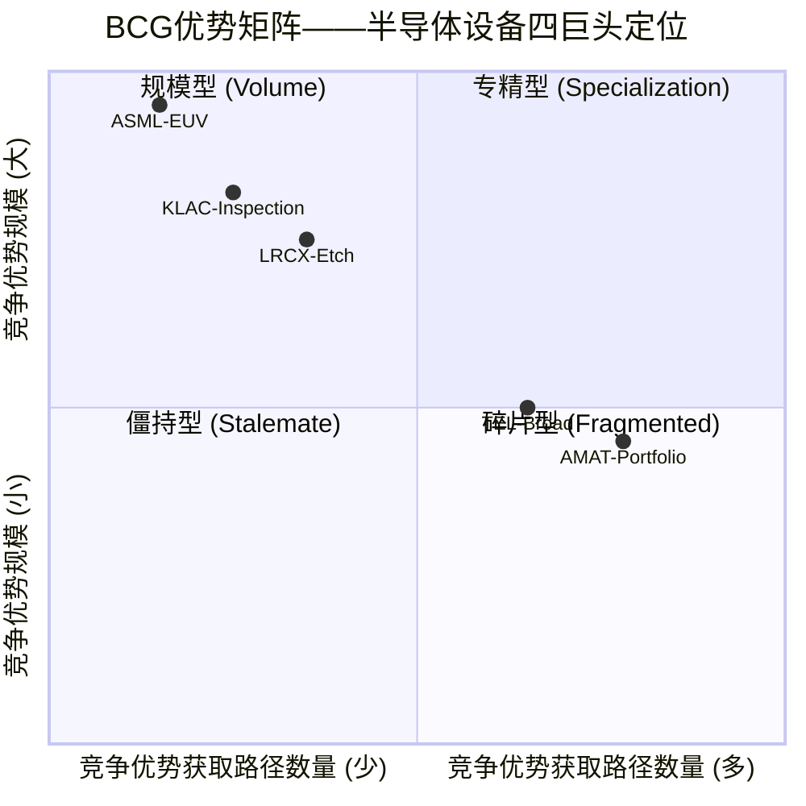
```mermaid
quadrantChart
    title BCG优势矩阵——半导体设备四巨头定位
    x-axis "竞争优势获取路径数量 (少)" --> "竞争优势获取路径数量 (多)"
    y-axis "竞争优势规模 (小)" --> "竞争优势规模 (大)"
    quadrant-1 "专精型 (Specialization)"
    quadrant-2 "规模型 (Volume)"
    quadrant-3 "僵持型 (Stalemate)"
    quadrant-4 "碎片型 (Fragmented)"
    "ASML-EUV": [0.15, 0.95]
    "KLAC-Inspection": [0.25, 0.82]
    "LRCX-Etch": [0.35, 0.75]
    "AMAT-Portfolio": [0.78, 0.45]
    "TEL-Broad": [0.65, 0.50]
```

**这张图揭示了半导体设备行业最深层的战略真相**：ASML、KLAC和LRCX都处于"专精型"象限——大优势、少路径——这是工业企业最理想的战略位置。AMAT则漂移到了象限交界处——优势不够大（没有垄断级别的单一市场）、路径太多（8条产品线分散资源）。

这不是一个估值问题。这是一个**身份问题**。

---

## 1.2 执行判决：四份一句话诊断

### 致 Christophe Fouquet (ASML CEO)

> **"你的效率议程是正确的，但还不够——TSMC对High-NA的犹豫是你2030年目标的存亡之战。"**

**处境摘要**：

你继承了Peter Wennink打造的人类工业史上最强垄断——100% EUV市场份额，零替代品，物理定律级别的护城河。你的2030年目标是EUR 44-60B收入。你2025年做到了EUR 32.7B。

问题不在于你能不能做到。问题在于**哪个版本的2030年会到来**。

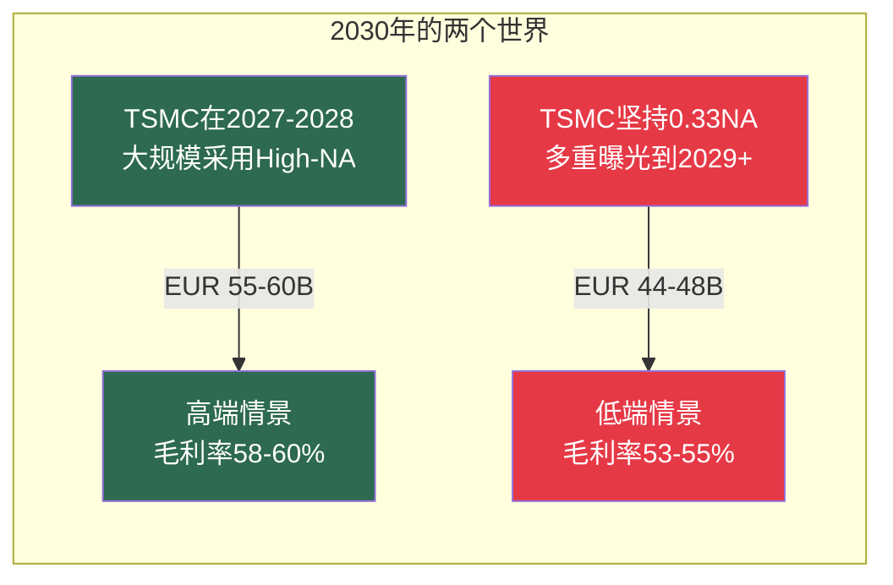
```mermaid
graph LR
    subgraph "2030年的两个世界"
        A[TSMC在2027-2028<br/>大规模采用High-NA] -->|EUR 55-60B| B[高端情景<br/>毛利率58-60%]
        C[TSMC坚持0.33NA<br/>多重曝光到2029+] -->|EUR 44-48B| D[低端情景<br/>毛利率53-55%]
    end

    style A fill:#2d6a4f,color:#fff
    style B fill:#2d6a4f,color:#fff
    style C fill:#e63946,color:#fff
    style D fill:#e63946,color:#fff
```

**你的沉默区**：你从不直接回应TSMC对High-NA的公开犹豫。TSMC是你最大的客户（收入占比30-35%），他们公开表示倾向于在更便宜的0.33 NA工具上使用多重曝光。如果TSMC延迟High-NA采用两年，你的2030年高端情景（EUR 60B）将变得不可实现。

**你需要在2026年做的三件事**：
1. 制定一个不依赖TSMC在2028年前采用High-NA的Plan B
2. 构建从51-53%（2026指引）到56-60%（2030目标）的毛利率桥接叙事
3. 将效率议程从"减少官僚主义"升级为"供应链韧性"——你的全部生产集中在Veldhoven

[参阅: ASML v1.0 Ch5, Ch8, Ch15] [参阅: SEMI_EQUIPMENT Ch9 A-Score 8.12]

---

### 致 Tim Archer (LRCX CEO)

> **"你的十年NAND刻蚀垄断首次被突破——低温刻蚀防御是第一优先级。"**

**处境摘要**：

你领导着全球刻蚀设备的冠军——45%市场份额，100K+装机腔体，$7.2B的CSBG年金收入。你的"五年翻倍"目标（2025 Investor Day）暗含~15% CAGR，是四家公司中最激进的财务目标。

但有一件事改变了一切：**TEL获得了你NAND通道孔刻蚀的第一个量产POR。**

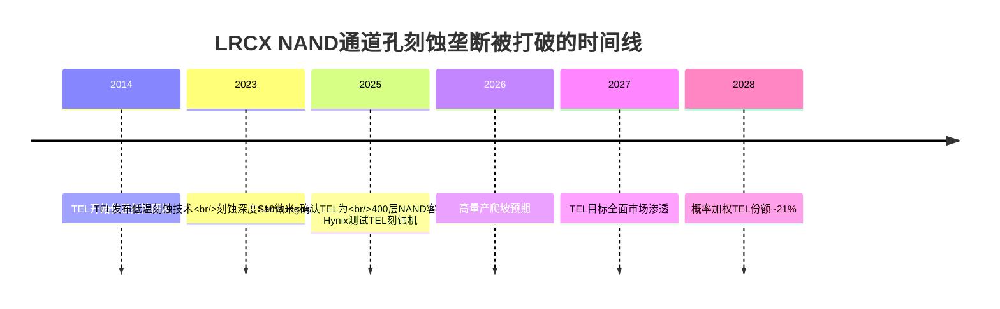
```mermaid
timeline
    title LRCX NAND通道孔刻蚀垄断被打破的时间线
    2014 : TEL开始低温刻蚀研发
    2023 : TEL发布低温刻蚀技术<br/>刻蚀深度>10微米<br/>速度2.5x传统方法
    2025 : Samsung确认TEL为<br/>400层NAND客户<br/>SK Hynix测试TEL刻蚀机
    2026 : 高量产爬坡预期
    2027 : TEL目标全面市场渗透
    2028 : 概率加权TEL份额~21%
```

**你从不点名TEL。** 在你的财报电话会上，竞争对手始终以"aggregate"形式被讨论，从不具名。这种沉默传递了一个信号：你要么认为TEL威胁可控（在此情况下，市场需要听到你的防御计划），要么认为公开讨论会放大威胁（在此情况下，你的沉默本身就是一种策略信号）。

**关键数学**：即使TEL在2028年拿到25-35%的NAND通道孔份额，你的该领域收入仍从$500M（2023）增长到~$1.4B（2028），因为TAM从$500M扩大到$2B。**真正的威胁不是收入损失，而是定价权侵蚀**——从独家供应商变为双寡头，ASP可能压缩5-10%，这个影响辐射到你整个刻蚀产品组合。

**你需要在2026年做的三件事**：
1. 为CSBG设定一个比"1.5x by 2028"更有雄心的愿景——这是你最强的战略资产，投资Equipment Intelligence和Dextro让它从收入引擎升级为利润引擎
2. 制定并可能公开你的低温刻蚀防御策略——沉默正在被市场解读为脆弱
3. 重新评估在P/E 49x水平的回购——2.03%隐含IRR低于无风险利率，将$1-1.5B从回购转向研发（CFET/Equipment Intelligence商业化/先进封装刻蚀）

[参阅: LRCX v3.0 Ch5, Ch15-16, Ch20] [参阅: SEMI_EQUIPMENT Ch16]

---

### 致 Rick Wallace (KLAC CEO)

> **"你拥有行业最强护城河加行业最弱继任计划——3月12日Investor Day是你的时刻。"**

**处境摘要**：

你是四位CEO中任期最长的——从2006年1月至今，20年。你建造了半导体设备行业中最接近"软件公司"的商业模式：62%毛利率、2.8% CapEx/Revenue（在软件公司范围内）、9.7x固定资产周转率（在软件公司范围内）。你的A-Score 7.66，概率调整后与ASML的差距从0.46缩小到0.25。

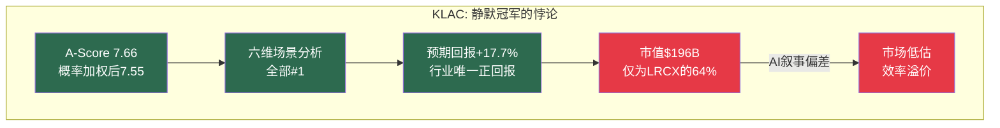
```mermaid
graph TD
    subgraph "KLAC: 静默冠军的悖论"
        A[A-Score 7.66<br/>概率加权后7.55] --> B[六维场景分析<br/>全部#1]
        B --> C[预期回报+17.7%<br/>行业唯一正回报]
        C --> D[市值$196B<br/>仅为LRCX的64%]
        D -->|"AI叙事偏差"| E[市场低估<br/>效率溢价]
    end

    style A fill:#2d6a4f,color:#fff
    style B fill:#2d6a4f,color:#fff
    style C fill:#2d6a4f,color:#fff
    style D fill:#e63946,color:#fff
    style E fill:#e63946,color:#fff
```

你在我们横向对比的六维度场景分析中取得了**全项第一的clean sweep**——概率加权预期回报、牛市回报、熊市保护、风险调整系数、遗憾最小化、基准情景回报符号。这在横向对比分析中极为罕见。

但你有两个不说的事：

1. **继任计划**。20年CEO任期之后，市场已经开始定价key-man风险，即使你本人没有讨论过。你3月12日的Investor Day应该直接回应这个问题——不是宣布退休，而是展示你的管理团队深度。

2. **先进封装利润率**。你的先进封装收入（$950M，同比+70%）是增长最快的向量。但你从未确认封装检测工具是否承载着与核心业务相同的62%+毛利率。市场的熊方叙事正是建立在"封装利润率低于核心"的假设上。

**你需要在2026年做的三件事**：
1. 在3月12日Investor Day上回应继任问题——展示管理层深度即可，不需要宣布时间表
2. 确认先进封装利润率与核心业务的可比性——消除熊方最强的单一论点
3. 利用你的"静默冠军"身份——市场给了你$196B的市值（LRCX的64%），而你在每个风险调整维度都优于LRCX。在Investor Day上展示这个不对称，用数据让市场自己重新定价

[参阅: KLAC v1.0 Ch2-3, Ch6] [参阅: SEMI_EQUIPMENT Ch9, Ch16, Ch17]

---

### 致 Gary Dickerson (AMAT CEO)

> **"EPIC是正确的战略，但optics错误——市场给你打了30-40%的估值折价，因为看不到ROI。"**

**处境摘要**：

你领导着半导体设备行业中组合最广、收入最大（FY2025 ~$27.2B）的公司。你有8条产品线、跨越所有工艺步骤。你的GAA收入正在翻倍至$5B。你的$5B EPIC中心将在2026年春天开业，Samsung已宣布为创始成员。

但市场不买账。

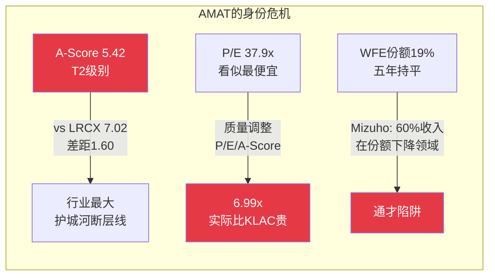
```mermaid
graph LR
    subgraph "AMAT的身份危机"
        A[A-Score 5.42<br/>T2级别] -->|"vs LRCX 7.02<br/>差距1.60"| B[行业最大<br/>护城河断层线]
        C[P/E 37.9x<br/>看似最便宜] -->|"质量调整<br/>P/E/A-Score"| D[6.99x<br/>实际比KLAC贵]
        E[WFE份额19%<br/>五年持平] -->|"Mizuho: 60%收入<br/>在份额下降领域"| F[通才陷阱]
    end

    style A fill:#e63946,color:#fff
    style D fill:#e63946,color:#fff
    style F fill:#e63946,color:#fff
```

**你面临的核心矛盾**：你的A-Score（5.42）与LRCX（7.02）之间的1.60分差距是整个对比分析中**最大的断层线**。这不是一个边际差距——这是Tier 1（ASML/KLAC/LRCX）与Tier 2（AMAT）之间的结构性分水岭。而你的P/E（37.9x）看似最低，但质量调整后（P/E ÷ A-Score = 6.99x），实际上比KLAC（6.40x）更贵。

**"便宜"和"低估"是完全不同的概念。**

EPIC中心是你唯一能打破这个均衡的武器。但当前市场给EPIC的定价接近零——因为你没有给出公开的ROI框架。$5B是半导体设备行业历史上最大的单一CapEx项目，但你没有告诉市场：什么时候回本？通过什么机制？Samsung之后谁是下一个？

**你需要在2026年做的四件事**：
1. 为EPIC制定公开的ROI框架——里程碑、客户承诺数量、收入归因时间表
2. 争取TSMC和/或Intel加入EPIC——Samsung alone不构成网络效应，TSMC参与将改变market的对EPIC定价
3. 考虑分部报告结构改革——将AI增长故事（GAA、先进封装、HBM）与ICAPS消化故事分离呈现，让市场能够分别定价
4. 如果ICAPS拖累持续到2027年仍无恢复迹象，认真评估ICAPS业务组合优化——剥离还是整合？

[参阅: AMAT v1.1 Ch3-5, Ch9, Ch16-17] [参阅: SEMI_EQUIPMENT Ch9, Ch16]

---

## 1.3 四家公司的战略DNA对照

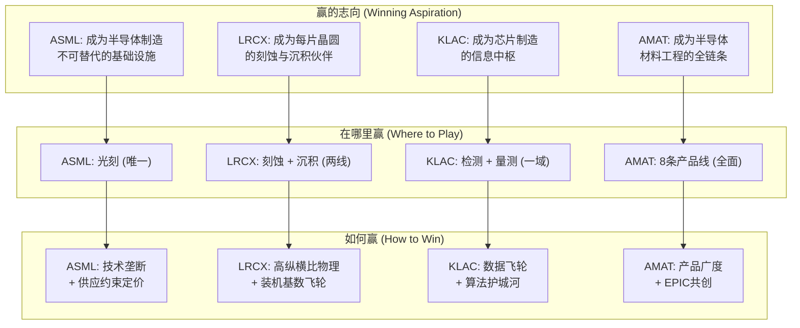
```mermaid
graph TD
    subgraph "赢的志向 (Winning Aspiration)"
        A1["ASML: 成为半导体制造<br/>不可替代的基础设施"]
        A2["LRCX: 成为每片晶圆<br/>的刻蚀与沉积伙伴"]
        A3["KLAC: 成为芯片制造<br/>的信息中枢"]
        A4["AMAT: 成为半导体<br/>材料工程的全链条"]
    end

    subgraph "在哪里赢 (Where to Play)"
        B1["ASML: 光刻 (唯一)"]
        B2["LRCX: 刻蚀 + 沉积 (两线)"]
        B3["KLAC: 检测 + 量测 (一域)"]
        B4["AMAT: 8条产品线 (全面)"]
    end

    subgraph "如何赢 (How to Win)"
        C1["ASML: 技术垄断<br/>+ 供应约束定价"]
        C2["LRCX: 高纵横比物理<br/>+ 装机基数飞轮"]
        C3["KLAC: 数据飞轮<br/>+ 算法护城河"]
        C4["AMAT: 产品广度<br/>+ EPIC共创"]
    end

    A1 --> B1 --> C1
    A2 --> B2 --> C2
    A3 --> B3 --> C3
    A4 --> B4 --> C4
```

### Playing to Win 一致性评分

| 公司 | 志向-赛场一致性 | 赛场-方法一致性 | 方法-能力一致性 | 能力-系统一致性 | 总一致性 |
|------|:---:|:---:|:---:|:---:|:---:|
| **ASML** | 10/10 | 10/10 | 10/10 | 9/10 | **39/40** |
| **KLAC** | 9/10 | 9/10 | 9/10 | 8/10 | **35/40** |
| **LRCX** | 8/10 | 8/10 | 8/10 | 7/10 | **31/40** |
| **AMAT** | 7/10 | 5/10 | 6/10 | 6/10 | **24/40** |

**ASML是教科书级的战略一致性**：每一层选择都强化其他层。赢的志向（不可替代的基础设施）决定了赛场（只做光刻），决定了方法（技术垄断），决定了能力（精密光学+EUV光源+计算光刻），决定了系统（20%+ R&D强度，深度Zeiss合作关系）。改变任何一层都会瓦解整个系统。

**AMAT的问题恰好相反**：赢的志向（全链条材料工程）要求赛场（8条产品线），但方法（产品广度）与能力（每条线$450M研发 vs LRCX/KLAC集中$1.3-2.1B）不匹配。EPIC中心是试图用能力层（共创平台）来弥补方法层（广度 vs 深度）的结构性弱点。

---

## 1.4 战略紧迫度排序

不是每个CEO的"十字路口"紧迫度相同。以下是按战略决策窗口期排序的优先级：

| 排序 | CEO | 最紧迫决策 | 窗口期 | 不作为的后果 |
|:---:|------|-----------|--------|------------|
| **1** | **Wallace (KLAC)** | 3月12日Investor Day：继任+封装利润率 | **9天** | 继任叙事失控、封装折价固化 |
| **2** | **Dickerson (AMAT)** | EPIC开业：第二/第三创始成员确认 | 2026春 | Samsung单独=无网络效应，EPIC估值=0 |
| **3** | **Archer (LRCX)** | 低温刻蚀防御策略：公开还是沉默 | 2026 H1 | TEL高量产爬坡后沉默=默认示弱 |
| **4** | **Fouquet (ASML)** | TSMC High-NA讨论：加速还是接受延迟 | 2026 H2 | 2030目标可信度受损但有时间修正 |

---

## 1.5 共享战略动力预览

在进入Part I的详细分析之前，这里预览四家公司共同面临的四个结构性力量：

### 力量1：Giga Cycle——$156B WFE新纪录在即

WFE从2024年$107B到2027年$156B（+46%三年），由AI基础设施投资驱动。这不是传统周期——4-5个技术转型同时发生（High-NA EUV、GAA、背面供电、先进封装、HBM），设备步骤数量每代增加15-25%。设备密度的结构性上升意味着即使晶圆开工数增长放缓，设备收入仍能增长。

### 力量2：利润池极端集中

半导体行业前5%的公司贡献了100%的经济利润（McKinsey 2024）。设备公司作为供应商理论上应该被隔离——但实际上，它们的收入越来越依赖缩减中的超级客户群（TSMC/Samsung/Intel/Micron占WFE的60-70%+）。

### 力量3：中国悖论

中国在2024年购买了ASML 70%的DUV系统，同时加速国产替代至35%自给率。中国同时是最大客户和最快成长的竞争对手。设备公司有3-5年的峰值中国收入窗口——之后国产替代将有意义地压缩成熟节点利润率。

### 力量4：温水煮青蛙

四条渐进衰退路径没有一个会在任何单一季度触发止损，但5年累计效应可以重塑竞争格局：
- AI CapEx高原（2028-2030）
- 中国钳形攻势（成熟端替代 + 先进端封锁）
- 客户集中螺旋（60-70%收入来自3-4家）
- 定价权侵蚀（$400M High-NA工具 = 客户抵抗的临界点）

这四个力量将在Part I（Ch2-5）中逐一展开。

---

## 1.6 行动矩阵汇总

| CEO | 第一优先级 | 第二优先级 | 第三优先级 | 追踪信号 |
|-----|-----------|-----------|-----------|---------|
| **Fouquet** | TSMC High-NA Plan B | 毛利率桥接叙事 | 供应链韧性 | TSMC High-NA订单（H2 2026）/ 毛利率每季轨迹 |
| **Archer** | 低温刻蚀防御策略 | CSBG利润引擎化 | 回购→研发再平衡 | TEL NAND POR数量 / CSBG ARPU季度增长 |
| **Wallace** | 3/12 Investor Day: 继任+封装 | 静默冠军叙事构建 | AI SaaS路线图 | 先进封装利润率确认 / 继任计划信号 |
| **Dickerson** | EPIC第二创始成员 | 分部报告改革 | ICAPS战略评估 | EPIC合作伙伴数量 / GAA $5B验证 / ICAPS复苏信号 |

---

## 1.7 一个隐含的战略判断

如果你是一位同时持有四家公司股票的资产配置者，我们的前期横向对比分析中有一个结论需要在CEO语境中重新表述：

**"ASML + KLAC等权双持"不仅是最优投资组合——它也揭示了半导体设备行业中两种获胜方式的不可调和性。**

ASML赢在"确定性"维度（护城河深度、增长前景、估值合理性、催化剂密度），KLAC赢在"效率"维度（经济质量、资本效率、风险韧性、周期防御）。它们的获胜维度**不重叠**——这意味着没有任何单一战略可以同时最大化两者。

对CEO的暗示：**你不可能同时做ASML和KLAC。** 选择你的战场——是追求不可替代性（ASML模式：一个产品做到100%），还是追求效率（KLAC模式：一个领域做到60%+但每美元收入产出最多利润）。AMAT的困境恰恰在于试图两者兼得。

---

*[本章完 | 下一章: Ch2 Giga Cycle解剖——一个持续到2028年的超级周期]*
# Chapter 2: Giga Cycle解剖——一个持续到2028年的超级周期

> *"这不是一个普通的半导体周期。这是四五个技术转型同时发生的结构性重塑。"*
> *— 综合四位CEO的共识叙事*

---

## 2.1 WFE市场的三层增长模型

半导体设备市场（WFE）的增长不是单一驱动力。为CEO准确理解增长来源，我们将其分解为三个独立但叠加的增长层：

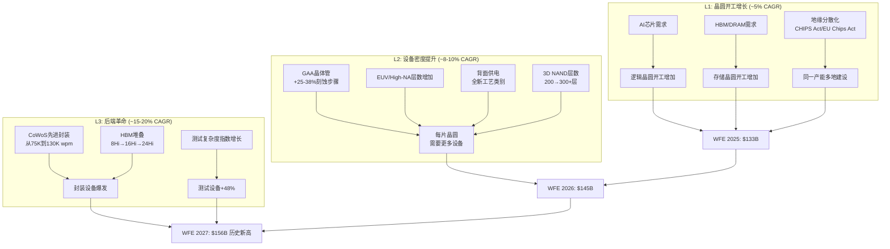
```mermaid
graph TD
    subgraph "L1: 晶圆开工增长 (~5% CAGR)"
        A1[AI芯片需求] --> B1[逻辑晶圆开工增加]
        A2[HBM/DRAM需求] --> B2[存储晶圆开工增加]
        A3[地缘分散化<br/>CHIPS Act/EU Chips Act] --> B3[同一产能多地建设]
    end

    subgraph "L2: 设备密度提升 (~8-10% CAGR)"
        C1[GAA晶体管<br/>+25-38%刻蚀步骤] --> D1[每片晶圆<br/>需要更多设备]
        C2[EUV/High-NA层数增加] --> D1
        C3[背面供电<br/>全新工艺类别] --> D1
        C4[3D NAND层数<br/>200→300+层] --> D1
    end

    subgraph "L3: 后端革命 (~15-20% CAGR)"
        E1[CoWoS先进封装<br/>从75K到130K wpm] --> F1[封装设备爆发]
        E2[HBM堆叠<br/>8Hi→16Hi→24Hi] --> F1
        E3[测试复杂度指数增长] --> F2[测试设备+48%]
    end

    B1 --> G[WFE 2025: $133B]
    B2 --> G
    B3 --> G
    D1 --> H[WFE 2026: $145B]
    F1 --> I[WFE 2027: $156B 历史新高]
    F2 --> I

    G --> H --> I
```

### L1: 晶圆开工增长——最传统、最周期性

| 驱动力 | 量化影响 | 周期性 | 可见度 |
|--------|---------|--------|--------|
| AI加速器产能 | TSMC $52-56B CapEx (+37-47%) | 高（依赖超级计算商CapEx） | 18-24个月（已锁定到2027） |
| HBM产能扩张 | SK Hynix $21.5B, Micron $20B, Samsung $30.4B | 高 | 12-18个月 |
| 地缘分散化 | 同一产能在美国/欧洲/日本重复建设 | 低（政策驱动） | 36-60个月（CHIPS Act拨款时间表） |
| 成熟节点（28nm+） | 中国国产fab持续建设 | 中等 | 12个月 |

**CEO关键洞察**：L1增长中，**TSMC单一公司驱动了WFE增量的80%+**。这意味着"WFE增长"本质上是"TSMC CapEx增长"的委婉说法。任何TSMC CapEx调整都会被设备行业杠杆放大。

### L2: 设备密度提升——结构性、非周期性

这是本轮Giga Cycle最被低估的驱动力。

| 技术转型 | 设备步骤增量 | 时间窗口 | 主要受益设备公司 |
|----------|:---:|---------|:---:|
| **GAA晶体管** (FinFET→GAA) | +25-38% 刻蚀/沉积步骤 | 2024-2028 | LRCX, AMAT |
| **EUV→High-NA EUV** | +40-60% 检测/量测步骤 | 2026-2030 | KLAC, ASML |
| **背面供电** (BSPDN) | 全新工艺类别 | 2026-2029 | AMAT, LRCX |
| **3D NAND 200→300+层** | +50% 刻蚀/沉积强度 | 2025-2028 | LRCX |
| **先进封装** (CoWoS/HBM) | 检测密度5-6x | 2024-2028 | KLAC, AMAT |
| **EUV DRAM** | +100-200bps 过程控制强度 | 2025-2027 | KLAC |

**从7nm到A7+（~2030），刻蚀步骤数大约翻倍（+87-113%）。** 这意味着即使全球晶圆开工数不增长、WFE总量不变，LRCX的刻蚀SAM仍会增长约87%——纯粹来自工艺复杂度提升。

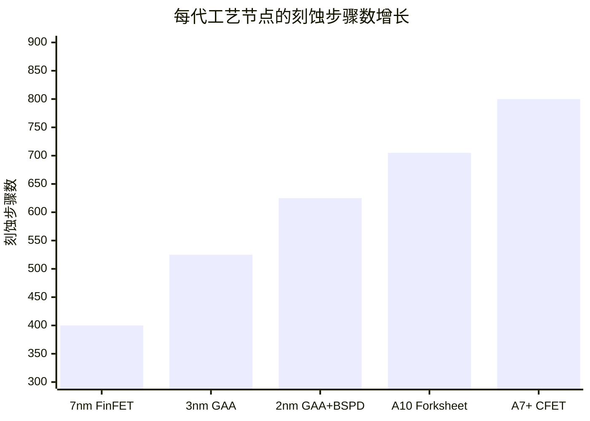
```mermaid
xychart-beta
    title "每代工艺节点的刻蚀步骤数增长"
    x-axis ["7nm FinFET", "3nm GAA", "2nm GAA+BSPD", "A10 Forksheet", "A7+ CFET"]
    y-axis "刻蚀步骤数" 300 --> 900
    bar [400, 525, 625, 705, 800]
```

### L3: 后端革命——增长最快、最被低估

2025年的数据揭示了一个结构性转变：

| 设备类别 | 2025增速 | vs 前端WFE增速 | 倍数 |
|---------|:---:|:---:|:---:|
| 测试设备 | **+48%** | +2% | **24x** |
| 封装设备 | **+20%** | +2% | **10x** |
| 前端WFE | +2% | 基准 | 1x |

**市场的心智模型仍然将设备公司的价值主要锚定在前端暴露度上。** 但数据显示后端设备增速是前端的10-24倍。这创造了定价不对称：拥有后端暴露度的公司（KLAC的先进封装检测、AMAT的HBM设备）可能被相对低估。

---

## 2.2 超级计算商CapEx传导链

从超级计算商到设备公司的传导链条有18个月的时间滞后，这为设备公司提供了罕见的需求可见度：

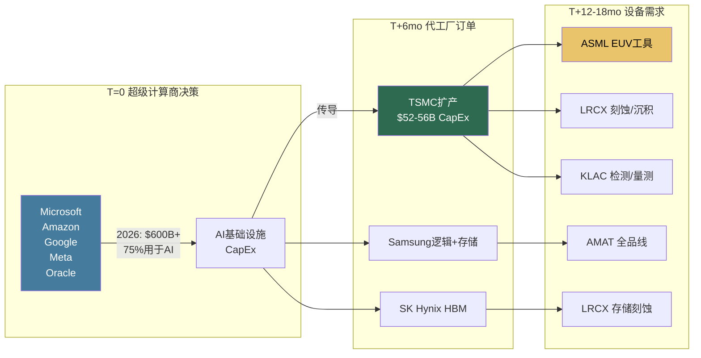
```mermaid
graph LR
    subgraph "T=0 超级计算商决策"
        H1[Microsoft<br/>Amazon<br/>Google<br/>Meta<br/>Oracle] -->|"2026: $600B+<br/>75%用于AI"| H2[AI基础设施<br/>CapEx]
    end

    subgraph "T+6mo 代工厂订单"
        H2 -->|"传导"| F1[TSMC扩产<br/>$52-56B CapEx]
        H2 --> F2[Samsung逻辑+存储]
        H2 --> F3[SK Hynix HBM]
    end

    subgraph "T+12-18mo 设备需求"
        F1 --> E1[ASML EUV工具]
        F1 --> E2[LRCX 刻蚀/沉积]
        F1 --> E3[KLAC 检测/量测]
        F2 --> E4[AMAT 全品线]
        F3 --> E5[LRCX 存储刻蚀]
    end

    style H1 fill:#457b9d,color:#fff
    style F1 fill:#2d6a4f,color:#fff
    style E1 fill:#e9c46a,color:#000
```

### 超级计算商CapEx数据（Goldman Sachs预测）

| 时期 | 累计超级计算商CapEx | vs 前三年 |
|------|:---:|:---:|
| 2022-2024 | $477B | 基准 |
| 2025-2027 | **$1.15T** | **2.4x** |

| 公司 | 2026 CapEx预估 | YoY |
|------|:---:|:---:|
| Amazon | ~$100B+ | +36% |
| Microsoft | ~$80B+ | +30% |
| Google | ~$75B+ | +40% |
| Meta | ~$65B+ | +35% |
| Oracle | ~$25B+ | +50% |
| **五大合计** | **$600B+** | **+36%** |

75%（~$450B）专门用于AI基础设施。

**CEO关键洞察**：当前超级计算商的承诺水平**保证了设备需求至少到2028年**。这使得本轮成为半导体设备历史上"可见度最高的周期"。但可见度不等于永恒——如果超级计算商2027-2028年对AI投资的ROI验证失败，传导链将反向运作，且设备公司由于18个月滞后会成为最后感知到衰退的环节。

---

## 2.3 存储CapEx加速——被忽视的第二引擎

AI对设备需求的传导不仅通过逻辑/代工（TSMC），还通过存储（Samsung/SK Hynix/Micron）：

| 存储厂商 | 2026 CapEx | YoY | 主要驱动力 |
|---------|:---:|:---:|---------|
| Samsung Semiconductor | ~$30.4B | +25% | HBM + DRAM EUV |
| SK Hynix | $21.5B | +38% (从$15.6B上调) | HBM产能翻倍 |
| Micron | $20.0B | +33% (上调) | HBM + NAND |
| **三大合计** | **~$72B** | **+30%** | |

### HBM市场规模

| 年份 | HBM市场 | YoY |
|------|:---:|:---:|
| 2024 | $15.2B | — |
| 2025 | ~$25B | +64% |
| 2026 | $32.6B | +30% |
| 2028 | ~$50B+ | CAGR 21.7% |

**对设备公司的含义**：

| 设备类别 | 受HBM驱动的需求 | 主要受益者 |
|---------|:---:|---------|
| 刻蚀 (TSV) | TSV深度每代+50% | LRCX |
| 沉积 (填充) | 高纵横比沉积 | AMAT, LRCX |
| 检测 (堆叠) | HBM4 16Hi vs 8Hi检测步骤翻倍 | KLAC |
| 键合 | 混合键合/热压键合 | AMAT, BESI |
| 测试 | 每层独立测试 | Advantest, Teradyne |

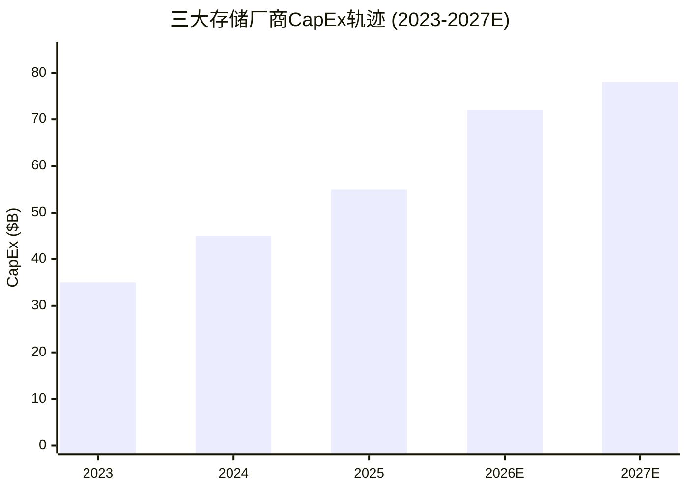
```mermaid
xychart-beta
    title "三大存储厂商CapEx轨迹 (2023-2027E)"
    x-axis ["2023", "2024", "2025", "2026E", "2027E"]
    y-axis "CapEx ($B)" 0 --> 85
    bar [35, 45, 55, 72, 78]
```

---

## 2.4 CoWoS瓶颈——真正的供给约束

AI基础设施的真正瓶颈不在于光刻（ASML）或刻蚀（LRCX），而在于先进封装：

| 指标 | 当前 | 2026年底目标 | 限制因素 |
|------|------|------------|---------|
| TSMC CoWoS产能 | 75-80K wpm | 120-130K wpm | 洁净室空间 |
| ASE CoWoS产能 | ~8K wpm | 20-25K wpm (3x) | 设备交付 |
| NVIDIA预订TSMC CoWoS占比 | >50% | 维持 | 2027年前满订 |
| SK Hynix HBM | 2026全部售罄 | — | 物理产能上限 |
| Micron HBM | 2025-2026全部订满 | — | 良率爬坡 |

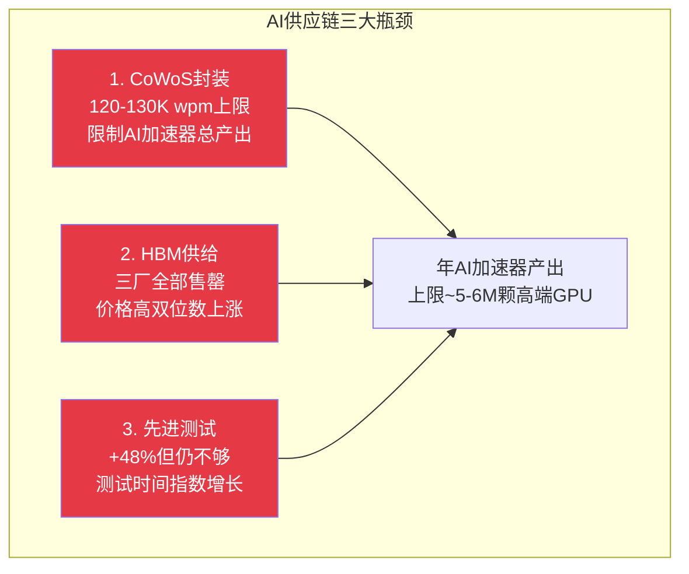
```mermaid
graph TD
    subgraph "AI供应链三大瓶颈"
        A[1. CoWoS封装<br/>120-130K wpm上限<br/>限制AI加速器总产出] --> D[年AI加速器产出<br/>上限~5-6M颗高端GPU]
        B[2. HBM供给<br/>三厂全部售罄<br/>价格高双位数上涨] --> D
        C[3. 先进测试<br/>+48%但仍不够<br/>测试时间指数增长] --> D
    end

    style A fill:#e63946,color:#fff
    style B fill:#e63946,color:#fff
    style C fill:#e63946,color:#fff
```

**CEO关键洞察**：CoWoS是NVIDIA真正的产出约束。即使TSMC扩产到130K wpm，这限制了年高端GPU产出约为5-6M颗。对设备公司而言，先进封装设备需求拥有**最长跑道和最低周期风险**——因为瓶颈解除需要持续数年的设备投资。

---

## 2.5 S曲线叠加——为什么这次不一样

历史上，半导体设备周期由**单一技术转型**驱动：DUV→193nm浸润（2004-2008），3D NAND引入（2016-2018），EUV量产（2019-2021）。

本轮Giga Cycle的独特之处在于**4-5个技术转型同时发生**：

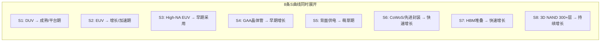
```mermaid
graph LR
    subgraph "8条S曲线同时展开"
        S1["S1: DUV → 成熟/平台期"]
        S2["S2: EUV → 增长/加速期"]
        S3["S3: High-NA EUV → 早期采用"]
        S4["S4: GAA晶体管 → 早期增长"]
        S5["S5: 背面供电 → 萌芽期"]
        S6["S6: CoWoS/先进封装 → 快速增长"]
        S7["S7: HBM堆叠 → 快速增长"]
        S8["S8: 3D NAND 300+层 → 持续增长"]
    end
```

| 技术 | S曲线位置 | 设备含义 | 主要受益者 |
|------|---------|---------|---------|
| DUV光刻 | **成熟/平台期** | 稳定替换需求 + 中国 | ASML (DUV), Nikon |
| EUV光刻 | **增长/加速期** | ASML垄断，2nm采用驱动 | ASML |
| High-NA EUV | **早期采用** | $350M/台，Intel先行 | ASML |
| GAA晶体管 | **早期增长** | +15-20%刻蚀/沉积步骤 | LRCX, AMAT |
| 背面供电 | **萌芽期** | 全新设备品类 | AMAT, LRCX |
| CoWoS/先进封装 | **快速增长** | 瓶颈=大规模投资 | KLAC, AMAT, ASML |
| HBM堆叠 | **快速增长** | 存储+封装设备爆发 | LRCX, KLAC, AMAT |
| 3D NAND 300+层 | **持续增长** | 刻蚀/沉积强度持续上升 | LRCX |

**这创造了20年来设备密度/晶圆上升速度最快的时期。** 即使晶圆开工数增长放缓，设备收入仍通过增加的步骤数/晶圆来增长。WFE/晶圆开工比率正在结构性攀升，而非周期性波动。

---

## 2.6 Giga Cycle的寿命——它能持续多久？

### 看多方论据（60%概率权重）

1. **超级计算商承诺已锁定到2027-2028**：Goldman Sachs $1.15T三年CapEx预测
2. **CHIPS Act/EU Chips Act拨款尚在早期**：美国$3B仅用于先进封装
3. **技术转型有物理时间表**：GAA、High-NA、BSPDN不可能在2028年前完成
4. **AI推理增长才刚开始**：训练之后是推理，推理需要更多而非更少的芯片

### 看空方论据（40%概率权重）

1. **AI CapEx ROI验证窗口2027-2028**：如果ROI不达标，CapEx悬崖
2. **WFE历史上从未连续5年增长**：40年历史中零先例（LRCX B6承重墙）
3. **TSMC CapEx集中度风险**：TSMC CapEx调整=WFE调整
4. **估值已定价完美**：CAPE 39.78（98th百分位），Buffett Indicator 217%（99th百分位）

### 周期定位评估

| 层级 | 信号 | 评估 | 关键数据 |
|------|------|------|---------|
| L1 终端需求 | AI/HPC占WFE 35-40%，结构性重塑 | **正面** | 超级计算商CY2026 CapEx +36% |
| L2 Fab CapEx | TSMC $52-56B (+37-47%) | **强正面** | 单一公司驱动80%+ WFE增量 |
| L3 设备订单 | ASML Q4新订单EUR 13.2B（创纪录） | **强正面** | LRCX B/B >1.0x |
| L4 库存 | 管道适中，无严重堆积 | **中性偏正** | LRCX库存效率改善 |
| L5 估值 | CAPE 39.78（98th百分位） | **⚠️ 警告** | 宏观估值处于历史极端 |
| L6 宏观 | Buffett Indicator 217%（99th百分位） | **⚠️ 警告** | 但降息预期提供缓冲 |

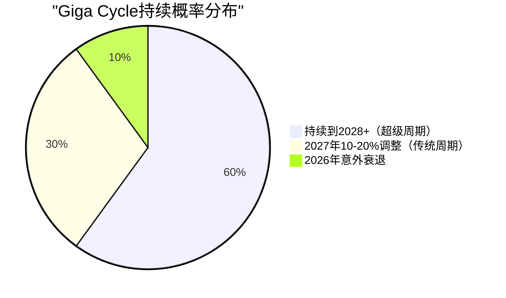
```mermaid
pie title "Giga Cycle持续概率分布"
    "持续到2028+（超级周期）" : 60
    "2027年10-20%调整（传统周期）" : 30
    "2026年意外衰退" : 10
```

### CEO战略含义

**"准备好天气变化，但不要因为可能下雨就不出门。"**

- 5/6层信号正面或中性，只有估值/宏观层发出警告
- 超级周期概率60%，但传统周期性调整（2027年-10~-20%WFE）概率不可忽略（30%）
- **最危险的组合**：AI CapEx高原 + 存储周期衰退 + 出口管制升级 = 三重打击（联合概率15-25%）

---

## 2.7 WFE市场结构——谁切走了哪块蛋糕

### 按设备类型分解（2026E近似份额）

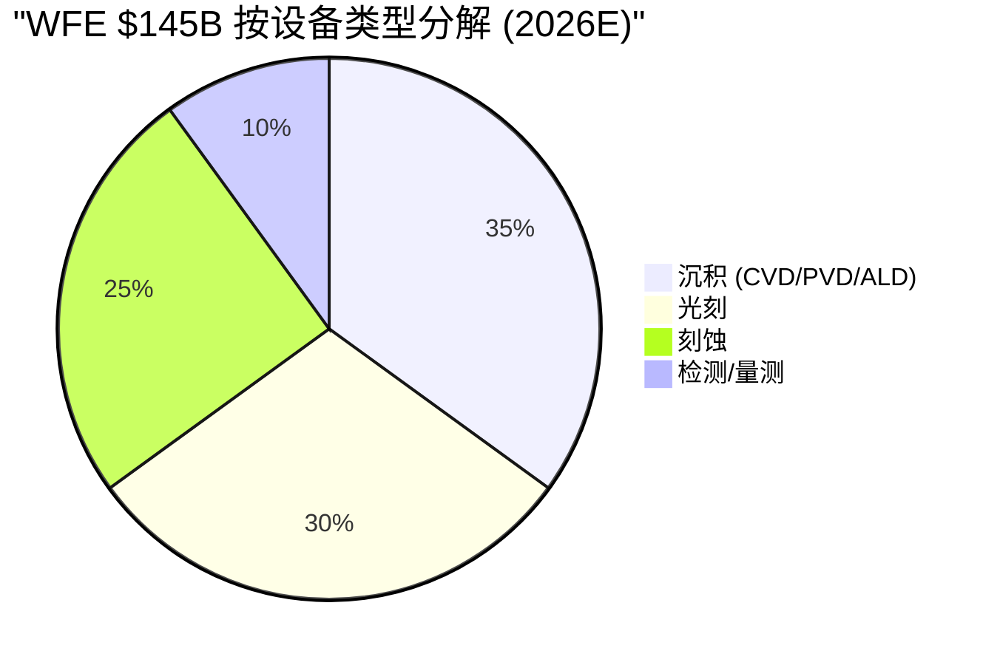
```mermaid
pie title "WFE $145B 按设备类型分解 (2026E)"
    "沉积 (CVD/PVD/ALD)" : 35
    "光刻" : 30
    "刻蚀" : 25
    "检测/量测" : 10
```

| 设备类型 | 2026E市场规模 | 主导者 | 第二名 | 第三名 |
|---------|:---:|---------|--------|--------|
| 沉积 | ~$51B | AMAT (~25%) | TEL (~22%) | LRCX (~18%) |
| 光刻 | ~$44B | ASML (89%) | Nikon (~6%) | Canon (~5%) |
| 刻蚀 | ~$36B | LRCX (~45%) | TEL (~27%) | AMAT (~15%) |
| 检测/量测 | ~$14.5B | KLAC (~52%) | AMAT (~8%) | Hitachi (~15%) |

### 按终端应用分解

| 应用 | 2026E WFE份额 | 增速 | 主要受益设备公司 |
|------|:---:|:---:|---------|
| 代工/逻辑 | ~52% ($75B) | +5.5% | ASML, LRCX, AMAT |
| DRAM | ~18% | +15.1% | LRCX (EUV DRAM), KLAC |
| NAND | ~11% ($15.7B) | +12.7% | LRCX (通道孔), AMAT |
| 先进封装 | ~8% ($12B) | +35-45% | KLAC, AMAT, ASML |
| 测试 | ~8% ($11.2B) | +48% | Advantest, Teradyne |
| 其他 | ~3% | 持平 | — |

---

## 2.8 半导体行业的"逆向体量-价值"悖论

一个定义本轮Giga Cycle的反直觉数据点：

| 指标 | 数值 | 含义 |
|------|------|------|
| 2025年售出的芯片总数 | **1.05万亿颗** | — |
| 平均单价 | $0.74/颗 | — |
| AI芯片占**单位量**的比例 | **<0.2%** | 不到千分之二 |
| AI芯片占**收入**的比例 | **~50%** | 一半收入 |
| 年AI芯片产量 | ~2000万颗 | ~80万片晶圆×20颗/片 |

**半导体行业的价值创造已经从体量指标脱耦，脱耦程度超过历史上任何制造业。**

这对设备公司意味着什么？传统的设备周期模型基于晶圆开工预测。但在AI时代，设备需求由**"价值加权晶圆开工"**驱动，而非"体量加权晶圆开工"——一片用于AI加速器的晶圆消耗的设备价值可能是一片IoT芯片晶圆的10-50倍（更多EUV层、更多刻蚀步骤、更复杂的检测、更昂贵的封装）。

**传统WFE周期模型系统性低估了AI驱动的设备需求。**

---

## 2.9 对四位CEO的Giga Cycle启示

| CEO | Giga Cycle的最大机会 | Giga Cycle的最大风险 | 关键行动 |
|-----|-----------------|-----------------|---------|
| **Fouquet (ASML)** | EUV层数增加 + High-NA商业化 | TSMC延迟High-NA = 高端情景失败 | 确保2026年H2有来自TSMC的新High-NA插入订单决策 |
| **Archer (LRCX)** | GAA/BSPDN创造新刻蚀步骤 + NAND层数提升 | NAND复苏时间风险（2027-2028?）+ TEL侵蚀 | 确保"5年翻倍"目标不过度依赖NAND时间假设 |
| **Wallace (KLAC)** | 先进封装检测密度5-6x + EUV DRAM过程控制强度+200bps | H1 2026增长暂停 | 在3/12 Investor Day更新长期财务模型 |
| **Dickerson (AMAT)** | GAA >50%份额 + 先进封装设备TAM翻3倍 | ICAPS"消化"掩盖了AI增长故事 | 分部报告改革：让市场分别定价AI增长和ICAPS消化 |

---

## 2.10 Giga Cycle持续性——追踪仪表盘

以下信号将帮助CEO在Giga Cycle演进过程中做出战略调整：

| 追踪信号 | 牛市阈值 | 熊市触发 | 数据频率 | 来源 |
|---------|---------|---------|---------|------|
| 超级计算商CapEx YoY | >+20% | <-10% | 季度 | 财报 |
| TSMC CapEx指引 | >$50B | <$35B | 半年 | TSMC财报 |
| ASML季度新订单 | >EUR 4B | <EUR 2B | 季度 | ASML财报 |
| LRCX Book-to-Bill | >1.0x | <0.8x | 季度 | LRCX财报 |
| WFE YoY增速 | >+8% | <-5% | 年度 | SEMI |
| 存储CapEx大三合计 | >$60B | <$40B | 年度 | 财报 |
| CoWoS产能利用率 | >90% | <70% | 季度 | 供应链 |
| AI芯片ASP趋势 | 稳定/上升 | 下降>15% | 季度 | 行业跟踪 |
| Fab利用率 | >85% | <75% | 季度 | SEMI |
| 半导体库存天数 | <80天 | >90天 | 季度 | 行业数据 |

---

*[本章完 | 下一章: Ch3 利润池深度图——$145B WFE市场中，钱到底流向了哪里]*
# Chapter 3: 利润池深度图——$145B WFE市场中，钱到底流向了哪里

> *"收入集中与利润集中往往截然不同。看不到这个差异的CEO会把资源投错地方。"*
> *— Bain & Company, "Profit Pools: A Fresh Look at Strategy"*

---

## 3.1 半导体行业利润池的极端集中

在讨论设备公司的利润池之前，先看整个半导体行业的利润分布——因为设备公司的客户就在这个分布中，客户的利润能力决定了设备公司的定价权。

| 指标 | 数值 | 来源 |
|------|------|------|
| 2024年全行业经济利润 | 集中在前5%的公司 | McKinsey |
| 前10家芯片公司总市值 (2025.12) | $9.5T | Deloitte |
| vs 2024.12 | +46% | |
| vs 2023.12 | +181% | |
| 前3家公司占前10市值 | 80% | |
| 北美(设计)占全球价值池 | ~60% | McKinsey |
| 亚洲占比 | ~36% | |
| 欧洲占比 | ~4% | |

**CEO关键洞察**：在没有任何其他$975B行业中，前5%的公司贡献100%的经济利润。这既是机会（供应这些顶级客户的设备公司享有不对称定价权），也是风险（你的收入命运越来越依赖越来越少的客户决策）。

---

## 3.2 设备价值链利润池图

Bain的利润池方法论要求我们不仅看收入规模，还要看每个活动环节的**利润深度**——即经济利润率。

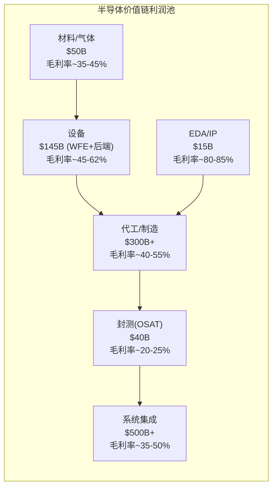
```mermaid
graph LR
    subgraph "半导体价值链利润池"
        M["材料/气体<br/>$50B<br/>毛利率~35-45%"]
        E["设备<br/>$145B (WFE+后端)<br/>毛利率~45-62%"]
        EDA["EDA/IP<br/>$15B<br/>毛利率~80-85%"]
        F["代工/制造<br/>$300B+<br/>毛利率~40-55%"]
        ATP["封测(OSAT)<br/>$40B<br/>毛利率~20-25%"]
        SYS["系统集成<br/>$500B+<br/>毛利率~35-50%"]
    end

    M --> E --> F --> ATP --> SYS
    EDA --> F
```

### 利润池深度对比（经济利润率 = 收入 × [ROIC - WACC] / ROIC）

| 价值链环节 | 收入规模 | 毛利率 | 经济利润率估算 | 利润池结构特征 |
|-----------|:---:|:---:|:---:|---------|
| EDA/IP | $15B | 80-85% | **~35-40%** | 最深——双寡头(Synopsys/Cadence)，软件毛利 |
| **设备** | **$145B** | **45-62%** | **~15-25%** | **深——寡头结构，技术壁垒** |
| 代工/制造 | $300B+ | 40-55% | ~10-20% | 中深——TSMC独占经济利润 |
| 材料/气体 | $50B | 35-45% | ~8-12% | 中等——细分垄断(Entegris等) |
| 封测(OSAT) | $40B | 20-25% | ~3-5% | 浅——竞争激烈，低壁垒 |
| 系统集成 | $500B+ | 35-50% | 差异巨大 | 极分化——NVIDIA 60%+ vs 平均20% |

**设备行业的利润深度仅次于EDA/IP**——这是半导体价值链中第二深的利润池。而且，不同于EDA的相对稳定，设备利润池正在随Giga Cycle扩大。

---

## 3.3 设备行业内部的利润池分层

更有价值的分析是设备行业**内部**的利润池分布——因为四位CEO的战略选择直接影响他们在这个利润池中的位置。

### 按设备类型的利润池深度

| 设备类型 | 收入份额 | 毛利率范围 | 经济利润浓度 | 利润池领主 |
|---------|:---:|:---:|:---:|---------|
| **光刻** | ~30% ($44B) | 51-53% (含High-NA稀释) | **最高** | ASML (独占) |
| **检测/量测** | ~10% ($14.5B) | 60-62% | **极高** | KLAC (63%份额) |
| **刻蚀** | ~25% ($36B) | 47-50% | **高** | LRCX (45%), TEL (27%), AMAT (15%) |
| **沉积** | ~35% ($51B) | 45-49% | **中高** | AMAT (25%), TEL (22%), LRCX (18%) |
| **CMP** | ~2% ($3B) | ~50% | 高 | AMAT (65%) |
| **离子注入** | ~2% ($3B) | ~50% | 高 | AMAT (60%) |
| **先进封装** | ~8% (快速增长) | 待确认 | **待定义** | 竞争中 |

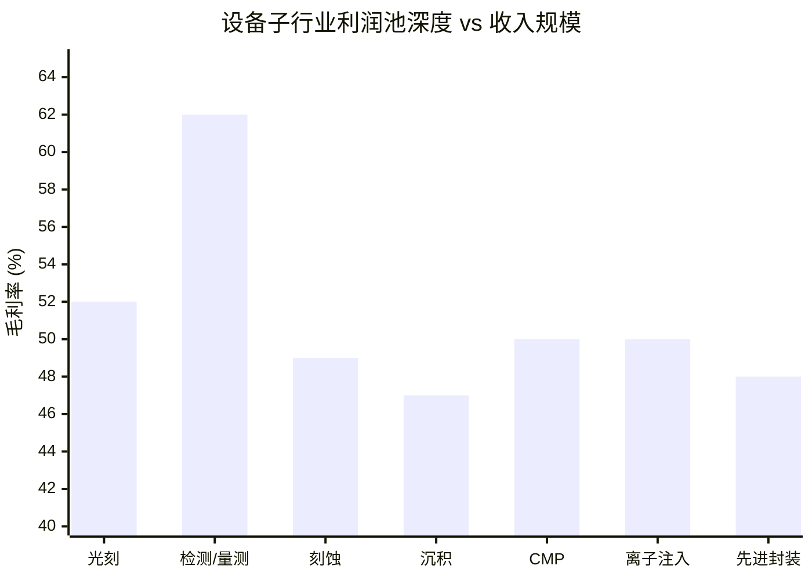
```mermaid
xychart-beta
    title "设备子行业利润池深度 vs 收入规模"
    x-axis ["光刻", "检测/量测", "刻蚀", "沉积", "CMP", "离子注入", "先进封装"]
    y-axis "毛利率 (%)" 40 --> 65
    bar [52, 62, 49, 47, 50, 50, 48]
```

### 利润池的三个关键发现

**发现1: 利润集中度远超收入集中度**

KLAC的检测/量测只占WFE的10%（收入维度不突出），但其62%毛利率意味着它在利润池中的份额远高于10%。粗略估算：

| 公司 | 收入份额 (WFE) | 营业利润率 | 利润池份额估算 | 利润/收入比 |
|------|:---:|:---:|:---:|:---:|
| ASML | ~22% | ~35% | ~28% | 1.27x |
| **KLAC** | **~9%** | **~43%** | **~14%** | **1.56x** |
| LRCX | ~13% | ~32% | ~15% | 1.15x |
| AMAT | ~19% | ~29% | ~20% | 1.05x |
| TEL | ~11% | ~29% | ~11% | 1.00x |
| 其他 | ~26% | ~20% | ~12% | 0.46x |

**KLAC每美元收入创造的利润是行业平均水平的1.56倍——仅次于ASML的1.27倍。** 这解释了为什么KLAC的质量调整P/E（P/E ÷ A-Score）在四家公司中最低（最便宜/单位护城河）。

**发现2: "三座利润堡垒"——AMAT的隐藏价值**

AMAT的8条产品线中，三条是真正的利润堡垒：

| 产品线 | 市场份额 | SSG收入贡献 | SSG利润贡献 | 特征 |
|--------|:---:|:---:|:---:|---------|
| PVD | ~85% | ~15% | ~22% | 近垄断，Endura平台25年 |
| CMP | ~65% | ~8% | ~12% | 双寡头（vs Ebara） |
| 离子注入 | ~60% | ~10% | ~14% | 领导者（VIISta平台） |
| **三堡垒合计** | — | **~33-38%** | **~45-50%** | 利润集中 |

这三座堡垒占AMAT SSG收入的三分之一，但贡献了近一半的利润。它们的存在是AMAT即使在"通才折价"下仍能维持29%营业利润率的原因——没有它们，AMAT的利润率可能降至20-22%，彻底落入二线设备公司区间。

**发现3: 服务收入——最被低估的利润池**

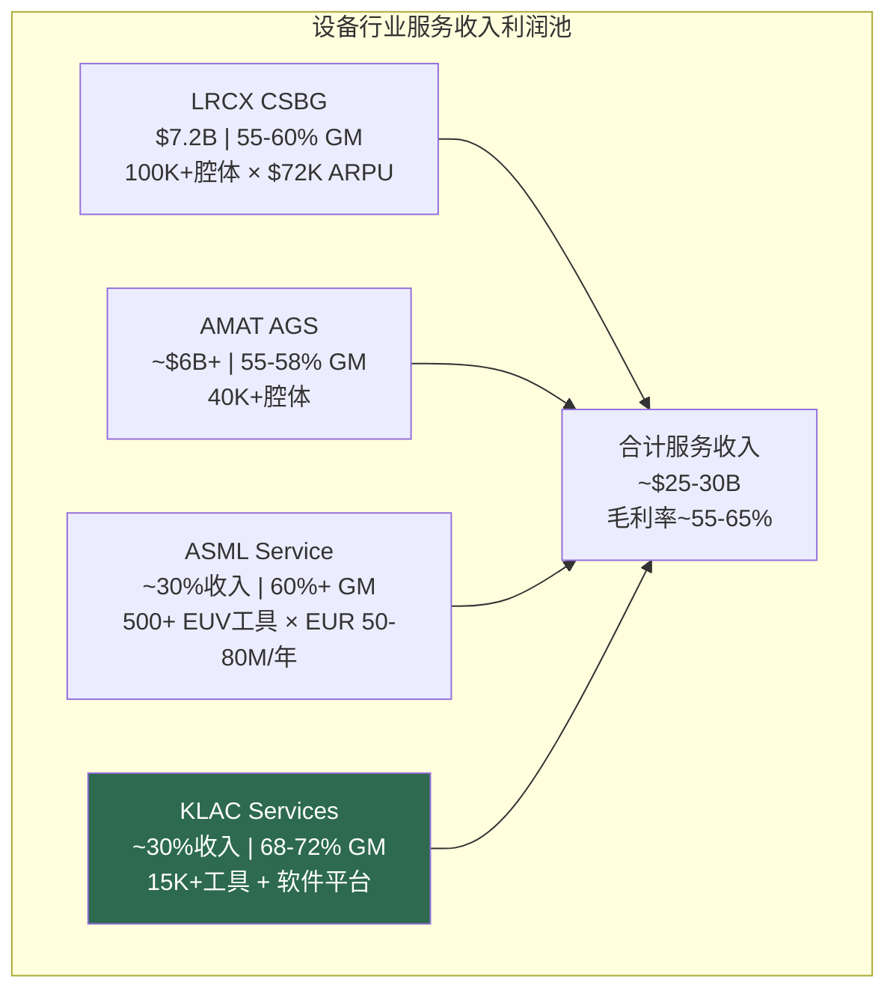
```mermaid
graph TD
    subgraph "设备行业服务收入利润池"
        A["LRCX CSBG<br/>$7.2B | 55-60% GM<br/>100K+腔体 × $72K ARPU"] --> E[合计服务收入<br/>~$25-30B<br/>毛利率~55-65%]
        B["AMAT AGS<br/>~$6B+ | 55-58% GM<br/>40K+腔体"] --> E
        C["ASML Service<br/>~30%收入 | 60%+ GM<br/>500+ EUV工具 × EUR 50-80M/年"] --> E
        D["KLAC Services<br/>~30%收入 | 68-72% GM<br/>15K+工具 + 软件平台"] --> E
    end

    style D fill:#2d6a4f,color:#fff
```

| 公司 | 服务收入 | 服务毛利率 | 服务增速 | 真正经常性收入比例 | A6评分 |
|------|:---:|:---:|:---:|:---:|:---:|
| LRCX (CSBG) | $7.2B (~38%) | 55-60% | +16% | 60-67% | 7 |
| AMAT (AGS) | ~$6B+ (~23%) | 55-58% | +3% | — | 5 |
| KLAC | ~30%收入 | 68-72% | +14% | ~75% | 6 |
| ASML | ~30%收入 | 60%+ | 加速中 | 高 | 6 |

**KLAC的服务利润率（68-72%）是四家中最高的**——因为它的"服务"大量包含高利润率的软件分析（Klarity平台、5D Analyzer）。LRCX的CSBG体量最大（$7.2B），但利润率较低（55-60%），因为包含硬件密集的翻新设备（Reliant）。

**AMAT AGS是服务利润池中的弱势参与者**：仅+3%增速，远低于LRCX CSBG（+16%）和KLAC（+14%）。套件销售策略未能转化为服务渗透率提升。

---

## 3.4 经济利润公式：谁在创造价值，谁在消耗资本

McKinsey的Power Curve方法论使用经济利润（NOPAT - WACC × Invested Capital）而非营业利润来衡量真实价值创造。

| 公司 | ROIC | WACC估算 | ROIC-WACC | 投入资本 | 经济利润估算 |
|------|:---:|:---:|:---:|:---:|:---:|
| ASML | 135.6%* | ~9% | ~127% | ~$5.6B | ~$7.1B |
| KLAC | 78.3% | ~9% | ~69% | ~$5.3B | ~$3.7B |
| LRCX | 74.3% | ~9% | ~65% | ~$5.4B | ~$3.5B |
| AMAT | 45.8% | ~9% | ~37% | ~$14.0B | ~$5.2B |

*ASML的135.6% ROIC受客户预付款（负运营资本）扭曲。调整后ROIC ~50-60%，仍为最高，但不是异常值。

**AMAT的经济利润绝对值（$5.2B）高于KLAC和LRCX**——因为它投入的资本更多。但**资本效率**（ROIC-WACC）只有其他公司的一半。这正是"通才陷阱"的经济本质：更多资本产出更多利润，但每美元资本产出的价值更低。

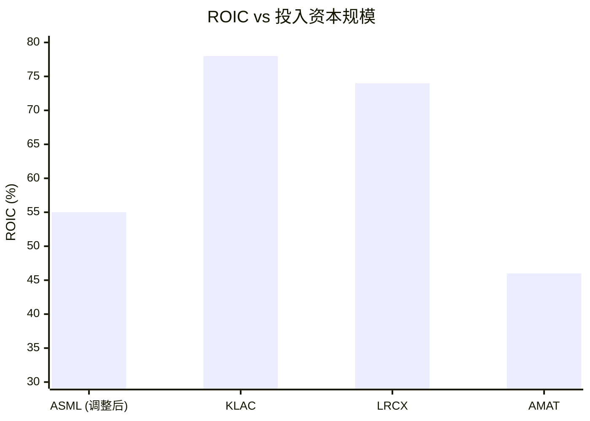
```mermaid
xychart-beta
    title "ROIC vs 投入资本规模"
    x-axis ["ASML (调整后)", "KLAC", "LRCX", "AMAT"]
    y-axis "ROIC (%)" 30 --> 80
    bar [55, 78, 74, 46]
```

---

## 3.5 "软件公司"测试——KLAC的利润池定位独特性

KLAC通过了四项定量"软件公司"测试：

| 测试维度 | KLAC | 软件公司中位数 | 半导体设备中位数 | 判定 |
|---------|:---:|:---:|:---:|:---:|
| 毛利率 | 61.9% | 70-75% | 47-50% | **接近软件** |
| CapEx/Revenue | 2.8% | 2-4% | 5-8% | **在软件范围内** |
| 固定资产周转率 | 9.7x | 8-15x | 3-5x | **在软件范围内** |
| CapEx < 折旧 | 是 | 是 | 否 | **软件特征** |

**战略含义**：KLAC的估值锚点不应完全参考纯设备公司P/E（中周期20-35x），而应部分参考软件公司P/E（30-45x中周期）。市场目前按设备公司估值KLAC（P/E 49x），但如果MACH SaaS平台持续渗透，将经常性收入从22%提升到30%+，KLAC可能获得永久性的估值重评级。

---

## 3.6 WFE下降20%压力测试——利润池的弹性

Giga Cycle不会永远持续。当它结束时，利润池如何变形？

| 指标 | ASML | KLAC | LRCX | AMAT |
|------|:---:|:---:|:---:|:---:|
| 收入下降幅度 | -8~-12% | -12~-15% | **-26~-30%** | -18~-22% |
| 毛利率 | 51~52% | 60~61% | 45~47% | 46~47% |
| FCF利润率 | 30~32% | 30~32% | 24~27% | **14~17%** |
| 能否维持回购? | 是 | 可能放缓 | 是(减量) | **可能需暂停** |
| 周期Beta | 0.5x (最低) | 0.7x | **1.3-1.5x (最高)** | 1.0x |

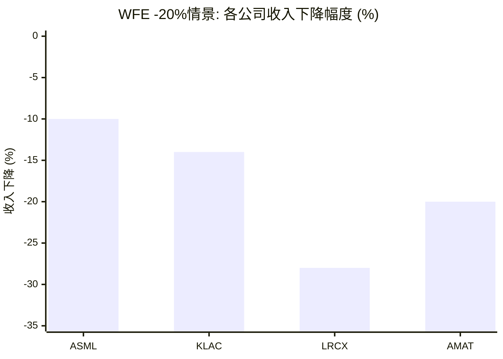
```mermaid
xychart-beta
    title "WFE -20%情景: 各公司收入下降幅度 (%)"
    x-axis ["ASML", "KLAC", "LRCX", "AMAT"]
    y-axis "收入下降 (%)" -35 --> 0
    bar [-10, -14, -28, -20]
```

### 三个关键发现

1. **ASML是周期的避风港**：EUR 38.8B积压订单 + 客户预付款锁定 = 周期Beta仅0.5x。即使WFE下降20%，ASML收入仅下降8-12%。

2. **LRCX是周期的放大器**：存储50-55%暴露度 + 存储CapEx比逻辑波动性大2-3x = 周期Beta 1.3-1.5x。WFE下降20%意味着LRCX收入下降26-30%。

3. **AMAT面临EPIC Center现金覆盖风险**：FCF利润率降至14-17%，接近EPIC Center年度CapEx（$2.3B）覆盖门槛。AMAT是**唯一在衰退中被迫在投资和股东回报之间二选一的公司**。

---

## 3.7 利润池迁移预测——2030年谁赢谁输

| 利润池迁移方向 | 驱动力 | 受益者 | 受损者 |
|-------------|--------|--------|--------|
| 检测/量测占WFE比从10%→12-14% | 每代节点+100-200bps过程控制强度 | **KLAC** | — |
| 刻蚀占WFE比从25%→27-28% | GAA/CFET/BSPDN增加刻蚀步骤 | **LRCX** | — |
| 服务收入占比从25%→35%+ | 装机基数扩大 + 数字化渗透 | **LRCX, KLAC** | — |
| 先进封装从$12B→$35B+ | CoWoS/HBM/chiplet | **KLAC, AMAT** | — |
| DUV光刻利润池萎缩 | EUV替代 + 中国SMEE | ASML (转向EUV) | Nikon, Canon |
| 成熟节点设备利润池被压缩 | 中国国产替代 (35%→50%+) | **中国设备商** | **AMAT, TEL** |

---

## 3.8 对四位CEO的利润池启示

| CEO | 你在利润池中的位置 | 最大机会 | 最大威胁 | 建议行动 |
|-----|:---:|---------|---------|---------|
| **Fouquet** | 最深利润池（光刻垄断） | High-NA创造新的利润池层 | High-NA初期毛利率稀释 | 管理从51%到60%的毛利率路径叙事 |
| **Archer** | 刻蚀利润池扩大 + CSBG飞轮 | GAA/NAND/HBM三重利润池增长 | TEL侵蚀定价权→利润率压缩 | 将CSBG从收入引擎升级为利润引擎（ARPU提升） |
| **Wallace** | 每美元收入利润产出最高（1.56x） | 软件化提升利润池深度 | 增长暂停动摇利润率叙事 | 确认先进封装与核心业务利润率可比 |
| **Dickerson** | 利润集中在三堡垒（PVD/CMP/离子） | EPIC如果成功→创造新利润池 | PVD利润池被Naura侵蚀 | 保护三堡垒同时推动GAA/封装利润新增长 |

---

## 3.9 FCF收益率收敛异常——被市场忽视的定价错误

我们的横向对比分析发现了一个重要的利润池定价异常：

| 公司 | FCF收益率 | A-Score (质量) | 差值 |
|------|:---:|:---:|:---:|
| ASML | 2.25% | 8.12 | — |
| AMAT | 2.11% | 5.42 | — |
| LRCX | 2.13% | 7.02 | — |
| KLAC | 1.97% | 7.66 | — |
| **四家价差** | **仅28bp** | **2.70分** | **极端不匹配** |

FCF收益率四家公司仅相差28个基点（1.97%-2.25%），但全面质量评分（A-Score）相差2.70分（5.42-8.12）。**市场将所有四家作为"半导体设备板块"统一定价，而非根据个体质量差异定价。**

长期来看，质量差异将重新主张自身——KLAC的FCF收益率应该更低（更贵/每美元FCF）vs AMAT，合理差距为50-80bp（vs当前-14bp）。这个收敛过程是KLAC结构性跑赢的驱动力。

**CEO语言翻译**：如果你是KLAC的Wallace，市场给你的定价与质量远低于你的AMAT相似——时间是你的朋友。如果你是AMAT的Dickerson，市场对你异常慷慨——你需要用EPIC和GAA来证明这份慷慨是合理的，否则均值回归会很痛苦。

---

*[本章完 | 下一章: Ch4 Porter堡垒——为什么这个行业一直赚钱]*
# Chapter 4: Porter堡垒——为什么这个行业一直赚钱

> *"理解一个行业为什么赚钱，比理解一家公司为什么赚钱更重要——因为前者决定了后者的上限。"*
> *— Michael Porter, "The Five Competitive Forces That Shape Strategy"*

---

## 4.1 行业结构总览：嵌套寡头的堡垒群

半导体设备行业不是一个单一的寡头。它是一个**嵌套寡头群**——在每个工艺步骤中都存在独立的寡头结构，而这些寡头之间又通过客户需求和技术路线图相互关联。

```mermaid
graph TD
    subgraph "行业结构: 嵌套寡头群"
        L["光刻<br/>HHI>10,000 (EUV)<br/>= 完全垄断"]
        I["检测/量测<br/>HHI>3,500<br/>= 主导领导者"]
        E["刻蚀<br/>HHI~3,000-3,500<br/>= 紧密寡头"]
        D["沉积<br/>HHI~2,500-3,000<br/>= 寡头"]
        C["CMP<br/>HHI>4,500<br/>= 近双寡头"]
        IO["离子注入<br/>HHI>4,000<br/>= 紧密双寡头"]
        AP["先进封装<br/>HHI<2,000<br/>= 碎片化/争夺中"]
    end

    style L fill:#1d3557,color:#fff
    style I fill:#457b9d,color:#fff
    style E fill:#457b9d,color:#fff
    style D fill:#a8dadc,color:#000
    style AP fill:#e63946,color:#fff
```

| 子行业 | 2025收入 | 前三名 | 近似HHI | DOJ分类 | 竞争结构 |
|--------|:---:|---------|:---:|---------|---------|
| **光刻(EUV)** | ~$40B | ASML (100%), — , — | >10,000 | 垄断 | 零竞争 |
| **检测/量测** | ~$14.5B | KLAC (~52%), Hitachi (~15%), AMAT (~8%) | >3,500 | 高度集中 | 主导+追随 |
| **刻蚀** | ~$36B | LRCX (~45%), TEL (~27%), AMAT (~15%) | ~3,000-3,500 | 高度集中 | 紧密三寡头 |
| **沉积** | ~$51B | AMAT (~25%), TEL (~22%), LRCX (~18%) | ~2,500-3,000 | 高度集中 | 四寡头 |
| **CMP** | ~$3B | AMAT (~65%), Ebara (~30%) | >4,500 | 高度集中 | 近双寡头 |
| **离子注入** | ~$3B | AMAT (~60%), Axcelis (~30%) | >4,000 | 高度集中 | 紧密双寡头 |
| **先进封装** | 快速增长 | AMAT, LRCX, ASML, BESI, Onto | <2,000 | 非集中 | 碎片化/争夺 |

**HHI（赫芬达尔-赫希曼指数）超过2,500 = 美国司法部"高度集中"标准。** 大多数半导体设备子行业超过此阈值，意味着竞争性进入在结构上被阻止。

**唯一例外是先进封装**——这是行业中竞争最流动、CEO决策最重要的领域。

---

## 4.2 Porter五力量化分析

### 力量1: 新进入者威胁——1.5/10 (极低)

```mermaid
graph TD
    subgraph "进入壁垒塔 (从底部累积)"
        B1["第1层: 资本壁垒<br/>开发前沿光刻 = $10B+ R&D over 10+年"] --> B2
        B2["第2层: 知识壁垒<br/>工艺配方+工具-晶圆交互知识<br/>积累数十年"] --> B3
        B3["第3层: 客户认证<br/>新工具认证 = 2-3年<br/>Fab极端厌恶风险"] --> B4
        B4["第4层: 装机基数锁定<br/>切换成本 = $12-44M/每台工具<br/>(3-8倍设备购买价)"] --> B5
        B5["第5层: 网络效应<br/>设备生态系统集成<br/>(工具A的输出必须对接工具B)"] --> B6
        B6["壁垒总高度:<br/>全球最高进入壁垒之一"]
    end
```

| 壁垒类型 | 量化指标 | 按子行业差异 |
|---------|---------|------------|
| 资本壁垒 | 前沿光刻: $10B+, 10-20年; 刻蚀/沉积: $2-5B, 5-10年 | 光刻 >> 刻蚀 > 检测 > 沉积 |
| 知识壁垒 | 累积数十年的工艺配方数据库不可复制 | KLAC 30年缺陷数据库; LRCX 30年刻蚀配方 |
| 认证壁垒 | 每个工具在每个fab的认证: 2-3年 + $10-100M | 所有子行业一致 |
| 切换成本 | LRCX: $12-44M/工具; TSMC全面切换KLAC: $2.5-5.0B | 光刻最高, 检测次之 |
| 声誉效应 | 单次路线图失误需5+年恢复 | 所有子行业一致 |

**CEO关键洞察**：进入壁垒的高度不均匀。光刻（ASML）的壁垒用物理定律衡量——任何新进入者都需要从基础物理开始。检测（KLAC）的壁垒用数据衡量——30年的缺陷数据库不可快速复制，即使有更好的算法。刻蚀/沉积的壁垒用配方衡量——每一个工艺配方都是在特定工具上优化的，切换意味着重新开发。

### 力量2: 供应商议价能力——3/10 (低到中)

| 供应关系 | 议价动态 | 关键例外 |
|---------|---------|---------|
| 设备公司设计高度专业化零部件 | 设备公司控制设计, 拥有议价权 | — |
| 长期合同锁定供应商 | 供应商被设备公司绑定 | — |
| **Carl Zeiss ↔ ASML** | **ASML持有Zeiss ~25%股份以确保供应** | **唯一关键例外** |

**Zeiss例外值得CEO关注**：ASML的整个生产能力——因此也是收入能力——受限于Zeiss的光学镜面产能。每面镜面需要4-6个月制造。ASML通过持有Zeiss ~25%股份来管理这个依赖，但这仍然是ASML A-Score中得分最低的维度（A1 = 5/10，供应链韧性）。

### 力量3: 买方议价能力——4/10 (中等)

```mermaid
graph LR
    subgraph "买方集中度 vs 供应商集中度"
        C1["TSMC: ~36% ASML收入<br/>~$52B CapEx"]
        C2["Samsung: ~15-20%<br/>~$30B CapEx"]
        C3["Intel: ~15-20%<br/>~$20B CapEx"]
        C4["SK Hynix: ~10%<br/>~$22B CapEx"]
        C5["Micron: ~5-10%<br/>~$20B CapEx"]

        S1["ASML: EUV无替代品"]
        S2["KLAC: 检测无等效替代"]
        S3["LRCX: 通道孔刻蚀无替代<br/>(TEL刚开始突破)"]
    end

    C1 -.->|"相互依赖"| S1
    C1 -.->|"有TEL选项"| S3
```

买方议价能力分析需要区分两个维度：

| 维度 | 评估 | 证据 |
|------|------|------|
| **买方集中度** | 高——前5客户占WFE 60-70%+ | TSMC单独驱动WFE增量80%+ |
| **但: 替代品可得性** | 极低（前沿）到中（成熟） | EUV: 零替代; 刻蚀: TEL可选但切换成本巨大 |
| **技术路线图依赖** | 双向——客户需要下代工具按时交付 | ASML: 分配稀缺EUV = 拍卖动态 |
| **制衡力量** | 大买家可以谈批量折扣和优先交付 | TSMC/Intel/Samsung的购买力量级 |

**净评估**：买方在理论上拥有高集中度带来的议价权，但在实践中被更高的供应商集中度（垄断/双寡头）抵消。结果是"相互依赖"而非"买方控制"。

**唯一例外**：在多供应商领域（刻蚀中的LRCX vs TEL vs AMAT），买方可以——也确实会——在供应商之间制造竞争。TSMC在刻蚀供应商之间的竞标是这个行业中买方议价权最活跃的场景。

### 力量4: 替代品威胁——1/10 (极低)

| 替代品类型 | 威胁等级 | 时间窗口 |
|-----------|---------|---------|
| 非半导体计算（量子计算） | 极低 | 2040年+ |
| 技术内替代（EUV vs 多重曝光DUV） | 低（EUV正在获胜） | 过渡中 |
| 工艺替代（减少某些步骤） | 极低 | 每代反而增加步骤 |
| 芯片架构替代（chiplet减少单芯片需求） | 低（增加封装设备需求） | 进行中 |

**CEO关键洞察**：每一个被提出的"替代威胁"实际上都增加了设备需求——量子计算需要全新的制造设备，chiplet架构增加封装设备需求，EUV取代DUV意味着单价从$50M提升到$200M+。**替代品威胁在半导体设备中是结构性看多因素，而非看空因素。**

### 力量5: 现有竞争对手之间的竞争——4/10 (低到中，按子行业差异大)

| 子行业 | 竞争强度 | 竞争模式 | 定价竞争? |
|--------|:---:|---------|---------|
| EUV光刻 | **1/10** | 垄断，无竞争 | 无——稀缺品定价 |
| 检测/量测 | **3/10** | 主导领导者 + 利基追随者 | 极少——技术差异化 |
| 刻蚀 | **6/10** | 三强竞争（技术驱动，非价格驱动） | 偶尔——但技术领先仍是决定因素 |
| 沉积 | **6/10** | 四方竞争 | 偶尔——AMAT/TEL/ASM在ALD竞争激烈 |
| 先进封装 | **7/10** | 多方争夺，标准未定 | 是——价格和技术都在竞争 |
| 成熟节点 | **8/10** | 中国国产替代 + 价格战 | 是——补贴驱动的价格压力 |

---

## 4.3 BCG优势矩阵：专精型 vs 通才陷阱

BCG优势矩阵框架将行业按两个维度分类：(1) 可获取竞争优势的大小，(2) 获取优势的可行路径数量。

| 象限 | 优势大小 | 路径数 | 行业类型 | 设备子行业 |
|------|---------|--------|---------|---------|
| **专精型** | 大 | 多 | 细分主导可行 | 光刻、刻蚀、检测、沉积 |
| **规模型** | 大 | 少 | 规模制胜 | 半导体制造（TSMC） |
| **碎片型** | 小 | 多 | 多利基共存 | 后端封测 |
| **僵持型** | 小 | 少 | 同质化，价格竞争 | 成熟节点设备（趋向此方向） |

**半导体设备属于"专精型"——这是最有利的竞争环境。**

专精型的关键特征：
- 大优势可获取——ASML的垄断利润率、KLAC的60%+毛利率证明了这一点
- 多条可行路径——光刻、刻蚀、沉积、检测各自独立可行
- **多个高利润专精者可以同时共存**——这就是为什么行业支撑四家公司同时获得45-62%毛利率

### 战略含义：加深专精 vs 追求广度

```mermaid
graph TD
    subgraph "BCG优势矩阵的战略指引"
        A["专精型行业的赢家公式:<br/>加深你的专精领域"]
        B["ASML: 只做光刻 → 100%份额"] -->|"正确"| A
        C["KLAC: 只做检测 → 63%份额"] -->|"正确"| A
        D["LRCX: 集中刻蚀+沉积 → 45%份额"] -->|"基本正确"| A
        E["AMAT: 跨8条产品线 → 无一>85%<br/>(除PVD)"] -->|"违反矩阵指引"| F["试图用<br/>规模型策略<br/>在专精型行业赢"]
    end

    style F fill:#e63946,color:#fff
```

**AMAT面临的战略困境用BCG矩阵语言表述**：它试图在一个专精型行业中用规模型策略获胜。广度确实提供了一些优势（客户关系共享、跨产品协同、周期对冲），但这些优势在专精型行业中**不够大**，无法弥补每条产品线上被专家级竞争对手压制的劣势。

EPIC中心可以理解为AMAT的反矩阵赌注——试图将"广度"从被动属性转化为主动竞争武器（通过共创平台把广度变成客户深度嵌入）。如果EPIC成功，它将重新定义AMAT在矩阵中的位置。如果失败，矩阵的规律将继续惩罚通才。

---

## 4.4 为什么这个行业"一直"赚钱——五力的合力效应

将五力评分综合：

| 力量 | 对行业利润率的压力 | 评分 | 关键驱动 |
|------|:---:|:---:|---------|
| 新进入者威胁 | 极低 | 1.5/10 | 物理/知识/认证三重壁垒 |
| 供应商议价能力 | 低 | 3/10 | 设备公司控制设计，锁定供应商 |
| 买方议价能力 | 中 | 4/10 | 买方集中但无替代供应商 |
| 替代品威胁 | 极低 | 1/10 | 每个"替代"反而增加设备需求 |
| 竞争强度 | 低到中 | 4/10 | 技术竞争而非价格竞争 |
| **合力: 行业吸引力** | | **8.7/10** | **全球最有吸引力的工业行业之一** |

**五力配置解释了为什么半导体设备公司维持45-62%毛利率**——这在任何资本商品行业中都是异常值：

- 进入壁垒全球最高
- 替代威胁接近零
- 供应商集中度甚至高于买方集中度（垄断/双寡头动态）
- 竞争以技术为导向而非以价格为导向

```mermaid
graph TD
    subgraph "五力合力 = 持续高利润率"
        F1["进入壁垒极高<br/>(1.5/10)"] --> P["毛利率<br/>45-62%<br/>持续数十年"]
        F2["替代威胁接近零<br/>(1/10)"] --> P
        F3["供应商比客户更分散<br/>(3/10)"] --> P
        F4["技术竞争>价格竞争<br/>(4/10)"] --> P
        F5["客户无替代品<br/>(4/10)"] --> P
    end

    style P fill:#2d6a4f,color:#fff
```

---

## 4.5 五力的时间动态——哪些在变强，哪些在变弱

五力不是静态的。以下是关键演变方向：

| 力量 | 变化方向 | 原因 | 影响 |
|------|---------|------|------|
| 新进入者威胁 | **略增** ↑ | 中国NAURA/AMEC在成熟节点渗透 | 成熟节点利润池被侵蚀 |
| 买方议价能力 | **略增** ↑ | 代工整合（TSMC份额增加）= 更大议价权 | TSMC CapEx决策权放大 |
| 替代品威胁 | **不变** → | 每个"替代"增加设备需求 | 结构性看多 |
| 供应商议价能力 | **不变** → | 设备公司继续控制设计 | 稳定 |
| 竞争强度 | **分化** ↕ | 前沿: 稳定; 成熟: 加剧; 先进封装: 争夺 | 利润池分化 |

### 最值得CEO关注的结构性变化

**变化1: 中国进入者正在将成熟节点从"专精型"推向"僵持型"**

中国设备公司（NAURA、AMEC、Piotech）在28nm+工艺的清洗、刻蚀、CVD领域已达到40%+国内替代率。随着中国政府强制新fab使用50%+国产设备，这些领域的竞争正在从"技术驱动"转向"政策驱动+价格驱动"——BCG矩阵中从"专精型"向"僵持型"迁移。

这对AMAT的影响最大（PVD份额每年下降2-5pp给NAURA），对KLAC的影响最小（检测领域中国替代率<5%，差距5-10年）。

**变化2: 先进封装正在从"碎片型"向"专精型"演进**

先进封装设备目前HHI<2,000（碎片化），但随着ASML进入（XT:360封装光刻系统）、KLAC扩大（先进封装检测$950M，+70%）、标准开始形成，这个领域将在2027-2028年前演进为"专精型"——少数公司确立各自的主导细分领域。

**先行者优势在这里最为重要。** 现在投资确立装机基数和工艺认证的公司将在标准固化后受益——因为客户切换成本将从低（碎片型特征）转向高（专精型特征）。

**变化3: ASML进入封装——改变了竞争边界**

ASML在2025年末发运了第一台先进封装光刻系统（XT:360）。这将一家"纯光刻公司"带入了AMAT和LRCX的竞争领地。虽然目前影响有限，但信号意义重大——如果ASML成功定义封装光刻标准，它将在一个全新的利润池中复制其EUV垄断模式。

---

## 4.6 护城河形状——"高度"vs"形态"

我们的横向对比分析揭示了一个重要洞察：**护城河的"形态"可能比"高度"更重要**。

| 公司 | A-Score (高度) | 标准差 (形态) | 护城河类型 | 95%时间 | 5%尾部事件 |
|------|:---:|:---:|---------|---------|---------|
| ASML | 8.12 (最高) | 1.68 (最大) | **尖刺型**——两个10分+一个5分 | 高度致胜 | 形态决定存亡 |
| KLAC | 7.66 | 1.06 (最小) | **平台型**——8/11维度在7-9区间 | 稳定高分 | 无单点失效 |
| LRCX | 7.02 | — | **偏斜型**——刻蚀+服务双引擎 | 中高分 | A8侵蚀风险 |
| AMAT | 5.42 (最低) | — | **扁平型**——最高7分，最低4分 | 平庸 | 无抵抗力 |

```mermaid
graph LR
    subgraph "ASML: 尖刺型护城河"
        direction TB
        A10_1["A4: 壁垒-利润池 = 10"]
        A10_2["A5: 技术半衰期 = 10"]
        A5_1["A1: 供应链 = 5"]
    end

    subgraph "KLAC: 平台型护城河"
        direction TB
        K9["A9: 范式免疫 = 9"]
        K8["8个维度 = 7-9"]
        K6["A6: 最低分 = 6"]
    end
```

**在95%的时间里，ASML的护城河更深（8.12 > 7.66）。但在5%的尾部事件中，KLAC的护城河更安全——因为它没有单点失效模式。** ASML的A1=5（供应链/Zeiss依赖）是结构性的阿喀琉斯之踵。

---

## 4.7 赢家通吃 vs 共存——行业会走向哪里？

学术研究和平台竞争理论识别了决定行业走向赢家通吃还是多强共存的关键条件：

| 因素 | 赢家通吃有利 | 共存有利 | 半导体设备现实 |
|------|-----------|---------|------------|
| 网络效应 | 强直接/间接效应 | 弱/无效应 | **弱**: 一台LRCX工具不会因TSMC买了另一台而更有价值 |
| 切换成本 | 极端锁定 | 高但可管理 | **极高**: $12-44M/工具, 但fab确实使用多供应商 |
| 多归属 | 不可能/代价高 | 容易/便宜 | **中等**: fab可以且确实使用多供应商工具 |
| 差异化 | 低(同质化) | 高(专业化) | **极高**: 每个供应商在不同工艺步骤和架构有优势 |
| 客户需求多样性 | 同质需求 | 异质需求 | **高**: 存储fab vs 逻辑代工有不同需求 |
| 监管约束 | 无 | 反垄断、出口管制 | **显著**: 客户需要供应链多元化; 政府需要竞争 |

**结论: 半导体设备强烈倾向于每个子行业2-4个玩家的稳定共存**——而非赢家通吃。

**唯一例外是EUV光刻**，因为极端技术壁垒创造了自然垄断。在所有其他子行业中，技术差异化、客户需求多样性和监管约束共同确保了多强共存。

### 四种结果原型

| 原型 | 示例 | 稳定性 | CEO含义 |
|------|------|--------|---------|
| **赢家通吃** | ASML (EUV) | 稳定 | 投资扩大领先; 任何偏差=灾难 |
| **赢家通吃大部分** | KLAC (检测, ~52-63%) | 稳定 | 投资扩大领先; 追随者应专精利基 |
| **稳定共存** | 刻蚀 (LRCX/TEL/AMAT) | 稳定 | 技术路线图和服务质量竞争, 非价格竞争 |
| **不稳定共存** | 先进封装 | 流动 | **现在投资=定义标准=未来锁定** |

---

## 4.8 定价权可持续性——$400M High-NA工具的临界点

五力分析假设的一个前提是"客户不会推回设备定价"。但存在物理和经济临界点：

| 价格里程碑 | 客户反应 | 替代行为 |
|-----------|---------|---------|
| EUV $200M → $300M | 接受（ROI仍优异） | 无——零替代 |
| **High-NA $350-400M** | **犹豫开始** (TSMC公开偏好多重曝光) | 推迟采用, 用更多廉价工具+更多步骤 |
| 假设High-NA >$500M | 强烈抵制 | 积极寻找替代方案; EDA优化减少层数 |

**$400M是一个心理和经济临界点。** TSMC对High-NA的公开犹豫不是技术问题——TSMC完全有能力使用High-NA。这是一个**经济选择**：在$350-400M/台时，多重曝光在成本上仍可与High-NA竞争。只有当High-NA吞吐量提升到200+ wafers/hour且价格/性能比改善时，经济天平才会明确倾向High-NA。

**对Fouquet的含义**：你的定价权在EUV时代是绝对的，但在High-NA时代可能面临第一次真正的弹性测试。你需要通过展示High-NA在成本/晶体管上的优势来赢得TSMC——而不能仅仅依赖"无替代品"的论据，因为多重曝光就是替代品。

---

## 4.9 对四位CEO的Porter堡垒启示

| CEO | 你在堡垒中的位置 | 堡垒的裂缝 | 需要加固的地方 |
|-----|:---:|---------|---------|
| **Fouquet** | 堡垒核心——物理垄断 | A1=5供应链(Zeiss) + High-NA定价临界点 | 确保TSMC的High-NA经济论证成功; 评估Veldhoven以外的制造 |
| **Archer** | 堡垒第二圈——技术寡头 | TEL低温刻蚀打开了第一个裂缝 | 用下代技术重新密封NAND通道孔刻蚀壁垒 |
| **Wallace** | 堡垒第二圈——数据垄断 | AI模型可能缩小算法差距 | 将数据飞轮从"被动积累"转为"主动平台化"(MACH SaaS) |
| **Dickerson** | 堡垒外围——多面防御但每面较薄 | 60%收入在份额下降领域 | EPIC是唯一能将"广度"转化为"深度"的武器——必须成功 |

---

*[本章完 | 下一章: Ch5 中国悖论——最佳客户变最大对手]*
# Chapter 5: 中国悖论——最佳客户变最大对手

> *"你们面临的不是一个中国问题。你们面临的是一个同时作为最大客户和最快成长竞争对手的实体——这在工业史上没有先例。"*

---

## 5.1 悖论的量化

先把核心矛盾用一张表说清楚：

| 指标 | 中国作为客户 | 中国作为竞争对手 |
|------|-----------|-------------|
| ASML DUV系统2024年中国销售占比 | **70%** | — |
| 中国国产设备自给率 | — | **35%** (2025年初) |
| 新fab国产设备强制比例 | — | **50%+** (政策要求) |
| 中国设备公司全球排名 | — | NAURA: **#5** (2025) |
| 四大设备公司中国收入合计 | **~$24B+/年** | — |
| 2027目标自给率 | — | **70%** (成熟节点) |

```mermaid
graph TD
    subgraph "中国悖论: 同一实体的两个身份"
        A["身份1: 最大客户<br/>~$24B+/年设备采购<br/>四家公司中国收入占20-35%"] -->|"同时是"| B["身份2: 最快竞争对手<br/>自给率 25%→35%→50%→70%<br/>NAURA已进全球Top 5"]
    end

    A --> C["短期: 收入引擎"]
    B --> D["长期: 利润池侵蚀"]
    C -.->|"矛盾"| D

    style A fill:#2d6a4f,color:#fff
    style B fill:#e63946,color:#fff
```

---

## 5.2 四家公司的中国暴露度对比

### 收入暴露

| 公司 | 中国收入% (FY2025) | 绝对金额 | FY2026E指引 | 趋势 |
|------|:---:|:---:|:---:|:---:|
| **LRCX** | **~34%** | **$6.2B** | <30% | 加速下降 |
| **AMAT** | **~28-30%** | **~$8.5B** | 低20s% | 结构性下降 |
| KLAC | ~26% | ~$3.3B | 中高20s% | **企稳** |
| ASML | ~20-27% | ~EUR 6.0B | ~15-20% | 已从峰值下降 |
| *对比: TEL* | *~34%* | *~$5.3B* | *~30%* | *从峰值50%下降* |

### 综合地缘政治风险评分

| 维度 | AMAT | LRCX | KLAC | ASML |
|------|:---:|:---:|:---:|:---:|
| 中国收入(绝对) | **4** | 3 | 2 | 2 |
| 受限品类暴露 | **4** | 3 | 1 | 3 |
| 国产替代威胁 | **4** | 3 | 1 | 1 |
| 台海冲突暴露 | 2 | 2 | **4** | 3 |
| 合规风险 | **4** ($2.52亿罚款前例) | 2 | 1 | 2 |
| 管控减弱趋势 | 2 | 2 | **4** (最正面) | 3 |
| **加权地缘风险总分** | **3.45** | **2.60** | **1.90** | **2.20** |

**排名（从最安全到最危险）**：
1. **KLAC (1.90)** — 检测管控最晚/最窄，影响递减（$500M→$300-350M），国产替代率<5%
2. **ASML (2.20)** — EUV从未出口中国; 荷兰政策独立变量; 危机中可能获得"战略稀缺"溢价
3. **LRCX (2.60)** — CSBG服务中断风险是独特隐性威胁（~$1.0-1.5B/年，如果政策扩展到维保）
4. **AMAT (3.45)** — "三重挤压": BIS管控从上方 + 国产替代从下方 + TEL侧翼; $2.52亿罚款前例

---

## 5.3 三层瀑布模型——管控的演进路径

出口管控的影响不是一次性冲击。它遵循一个三层瀑布模型：

```mermaid
graph TD
    subgraph "第1层: 政策冲击 (2022-2023)"
        L1["BIS宣布新管控<br/>→ 即时订单冲击<br/>→ 收入影响滞后2-3个季度"]
    end

    subgraph "第2层: 客户行为改变 (2023-2025)"
        L2["中国客户启动备选方案<br/>→ 评估国产设备<br/>→ 即使管控放松也不会完全回来"]
    end

    subgraph "第3层: 生态系统重构 (2025-2030+)"
        L3["中国设备生态系统自强化<br/>→ 永久性市场分裂<br/>→ 两个平行设备生态系统"]
    end

    L1 -->|"触发"| L2 -->|"驱动"| L3

    style L3 fill:#e63946,color:#fff
```

| 层级 | 时间窗口 | 当前状态 | 关键判断 |
|------|---------|---------|---------|
| **L1: 政策冲击** | 2022.10 - 2024 | **已过** | BIS管控 + 荷兰DUV扩展 + 日本对齐 |
| **L2: 行为改变** | 2023 - 2026 | **进行中** | 中国fab正在评估国产替代品 |
| **L3: 生态重构** | 2025 - 2030+ | **开始** | 自给率35%并加速; 50%强制要求 |

**CEO关键洞察**：**管控已持续约4年（2022年10月至今）。如果持续超过5年，第3层几乎确定发生。** 我们目前处于L2-L3过渡期——中国客户不仅是被迫使用国产设备，而是开始**主动选择**国产设备（因为价格更低、无管控风险、政府补贴）。

---

## 5.4 中国国产替代——按设备类别的真实差距

不要把"中国设备威胁"当作一个整体。真相是高度不均匀的：

| 设备类别 | 中国替代状态 | 技术差距 | 主要中国公司 | 受冲击的西方公司 |
|---------|:---:|---------|---------|---------|
| **清洗** | 高 (~40%+国内采用) | 窄(成熟) / 中(先进) | ACM Research | LRCX, TEL |
| **刻蚀(CCP介电)** | 中高 (~30%+) | 中等; AMEC有5nm声称 | AMEC | LRCX, AMAT |
| **刻蚀(ICP/HAR)** | 低-中 | 宽; 先进端差3+代 | AMEC | LRCX, TEL |
| **CVD/PECVD** | 中 (~25%) | 中等; Piotech增长最快 | Piotech, NAURA | **AMAT** |
| **PVD** | 中 | 中等; NAURA在12%全球 | NAURA | **AMAT** |
| **ALD** | 低 | 宽; ASM International主导 | 早期 | ASM Int'l |
| **CMP** | 中 | 中等; Hwatsing增长 | Hwatsing | AMAT |
| **热处理/炉管** | 高 | 窄(成熟) / 中(先进) | NAURA | TEL |
| **离子注入** | 低 | 宽; AMAT全球主导 | NAURA (入门级) | AMAT |
| **量测/检测** | **极低** | **极宽; KLAC领先5+代** | 微不足道 | — |
| **涂胶/显影** | **极低** | **极宽; TEL 92%全球** | 几乎零能力 | — |
| **光刻(DUV)** | **极低** | **宽; SMEE在28nm** | SMEE | Nikon, Canon |
| **光刻(EUV)** | **零** | **巨大; 原型阶段 vs HVM** | — | — |

```mermaid
xychart-beta
    title "中国设备替代率 vs 技术差距 (成熟节点)"
    x-axis ["清洗", "CCP刻蚀", "CVD", "PVD", "CMP", "热处理", "ICP刻蚀", "离子注入", "检测", "光刻"]
    y-axis "国内替代率 (%)" 0 --> 50
    bar [40, 30, 25, 25, 20, 35, 15, 5, 3, 2]
```

### 五大中国设备公司速写

| 公司 | 2024收入 | 类比 | 最大威胁目标 | 技术天花板 |
|------|:---:|---------|---------|---------|
| **NAURA(北方华创)** | ~$4.4B (#6全球) | "中国版AMAT" | AMAT (PVD/CVD/刻蚀) | 28nm量产; 14nm开发 |
| **AMEC(中微)** | ~$1.3B | "中国版LRCX" | LRCX (刻蚀) | 28nm量产; 5nm声称 |
| **Piotech(拓荆)** | ~$600M | "中国版AMAT沉积" | AMAT (CVD) | 成熟节点; 增长124% YoY |
| **ACM Research** | ~$900M | 清洗专家 | LRCX/TEL (清洗) | 已有国际业务(NASDAQ: ACMR) |
| **SMEE(上微)** | 小 | "中国版ASML的尝试" | 理论上ASML | 28nm DUV刚交付; 差ASML 15-20年 |

---

## 5.5 替代时间表——诚实评估

### 成熟节点 (28nm+) — 正在发生

- 自给率已达35%且上升
- 清洗、刻蚀、CVD、热处理: 中国工具越来越有竞争力
- 到2027-2028年: 50-60%国内替代现实可行
- **AMAT、LRCX、TEL已经看到成熟节点中国收入份额下降**

### 中间节点 (14nm-7nm) — 2027-2030窗口

- AMEC声称14nm刻蚀在SMIC验证中; 量产未确认
- SMEE的28nm光刻理论上可通过多重曝光延伸到14nm（成本高、慢）
- NAURA和AMEC可能在2027-2028年达成14nm级设备验证
- **完整14nm生态系统（所有设备类型国产）在2030年前不太可能**

### 先进节点 (5nm及以下) — 2030年+，如果可能的话

- EUV光刻仍是约束瓶颈; SMEE原型离HVM还有数年
- 即使单个中国刻蚀或沉积工具声称"5nm能力"，完整工艺流程需要**每种设备类型同时达到5nm能力**
- ALD、先进量测/检测、EUV涂胶/显影没有可信的中国替代品
- **完整5nm国产生态系统的现实时间表: 2032-2035, 如果能实现的话**

### "50%自给率"标题数字的误导性

"50%自给率"听起来令人震惊，但需要拆解：

```mermaid
pie title "中国设备自给率的构成 (2027E ~50%)"
    "成熟节点设备 (28nm+): 已接近竞争" : 65
    "中间节点 (14-7nm): 部分突破" : 25
    "先进节点 (<5nm): 几乎零能力" : 10
```

**50%的标题数字被成熟节点体量主导——中国在成熟节点确实越来越有竞争力。但先进节点的差距仍然以年/十年计，而非以季度计。**

---

## 5.6 Co-opetition框架下的中国博弈

用Brandenburger-Nalebuff的Co-opetition框架分析中国，可以看到一个独特的"合作→竞争"迁移：

### 2020年前：主要是"客户"关系

| 关系 | 合作面 | 竞争面 |
|------|--------|--------|
| 西方设备 → 中国fab | 销售设备, 提供服务 | 最小（中国设备能力弱） |
| 西方设备 → 中国设备 | 技术授权（部分）, 培训工程师 | 最小 |

### 2022-2026：快速转向"竞争"

| 关系 | 合作面 | 竞争面 |
|------|--------|--------|
| 西方设备 → 中国fab | 仍在销售（DUV、成熟节点）| 出口管控限制先进设备 |
| 西方设备 → 中国设备 | **几乎为零** | 直接产品替代（成熟节点） |
| 中国政府 → 中国设备 | 补贴、政策保护、保证客户 | — |

### PARTS分析——CEO需要知道的

**P (Players)**: 中国国产玩家的加入将西方5家寡头变为7-8家竞争者（成熟节点）。NAURA收入$4.4B已超过KLA的一半。

**A (Added Value)**: 在成熟节点，中国设备的添加值正在趋近西方设备——因为28nm+的技术差距已经足够窄。在先进节点，西方设备的添加值仍然接近100%（无替代品）。

**R (Rules)**: **出口管控已成为最重要的"规则"设定者。** 美国政府实际上在决定市场分配规则——哪些公司可以向哪些客户销售。

**T (Tactics)**: 中国的战术是"先在成熟节点建立装机基数→积累经验→向上攀爬"。这与日本/韩国半导体崛起的路径完全相同，只是速度更快（政府驱动vs市场驱动）。

**S (Scope)**: NAURA进入光刻R&D（2024年4月宣布）标志着竞争范围的扩大——中国最大的设备公司开始瞄准最后一个无国产替代的品类。虽然EUV光刻差距巨大（15-20年），但这个信号不应被忽视。

---

## 5.7 四位CEO各自的中国战略

### Fouquet (ASML): "防火墙最高，但DUV收入在萎缩"

| 维度 | 评估 |
|------|------|
| EUV暴露 | **零** — 从未出口到中国 |
| DUV暴露 | 高 — 2024年70%的DUV销售到中国 |
| 管控影响 | 直接收入损失~EUR 3.7B（2024基准下降） |
| 国产替代威胁 | 极低（EUV）/ 长期低威胁（DUV: SMEE在28nm）|
| **净地缘溢价** | **+12-18%估值提升** — 管控强化了垄断 |

**ASML是唯一一家出口管控净正面的公司。** 它牺牲了~EUR 4B/年的中国收入，但获得了12-18%的全球估值提升（通过垄断加固）。这个等式只在中国无法突破EUV时成立——共识时间表是8-10年。

### Archer (LRCX): "CSBG服务中断是最阴险的路径"

| 维度 | 评估 |
|------|------|
| 中国收入占比 | ~34% ($6.2B) — 四家中最高 |
| 管控影响 | 概率加权年收入影响: -$1.155B |
| 最危险路径 | **路径4: 成熟节点管控/CSBG服务中断** |
| CSBG中国服务收入 | ~$1.0-1.5B/年面临风险 |
| vs ASML关键区别 | LRCX有替代供应商(TEL), ASML没有 |

**路径4（CSBG服务中断）是最值得Archer关注的场景**——因为它直接攻击LRCX最有差异化的资产。如果出口管控扩展到成熟节点的维保服务，$1.0-1.5B的经常性收入将受到威胁，这将损害"类SaaS"估值叙事。

### Wallace (KLAC): "和平时期最安全，极端时最脆弱"

| 维度 | 评估 |
|------|------|
| 中国收入占比 | ~26% — 稳定化 |
| 管控影响 | 递减: $500M → $300-350M |
| 国产替代威胁 | **极低** — 检测是中国最弱的领域（<5%国产率） |
| 特殊风险 | **大中华区收入集中56%** = 台湾30% + 中国26% |
| 台海冲突暴露 | **最高** — 和平时最安全, 极端时最脆弱 |

```mermaid
graph LR
    subgraph "KLAC的地缘悖论"
        A["正常状态:<br/>地缘风险最低<br/>(1.90/4)"] -->|"如果台海冲突"| B["极端状态:<br/>大中华暴露最高<br/>(56%收入)"]
    end

    style A fill:#2d6a4f,color:#fff
    style B fill:#e63946,color:#fff
```

### Dickerson (AMAT): "三重挤压——从每个方向承压"

| 维度 | 评估 |
|------|------|
| 中国收入占比 | ~28-30% → 低20s% |
| 管控影响 | 结构性下降 -$2.0-2.5B |
| 国产替代威胁 | **最高** — PVD/CVD/刻蚀全面面临NAURA/AMEC/Piotech |
| 合规风险 | **$2.52亿罚款前例** — 业内唯一 |
| 三重挤压 | BIS管控(上方) + 国产替代(下方) + TEL侧翼(侧面) |

**AMAT是中国悖论中受损最严重的公司。** 它在更多产品线上面临国产替代（NAURA/Piotech在沉积, AMEC在刻蚀, Hwatsing在CMP），同时因为$2.52亿罚款前例而面临更高的合规风险，而且TEL在不受美国单边管控的情况下可以继续向中国销售。

---

## 5.8 实物期权框架——中国暴露的战略价值

传统分析将中国收入视为"风险"。但实物期权框架提供了一个更nuanced的视角：

| 期权类型 | 描述 | 行权触发 | 对设备公司的含义 |
|---------|------|---------|-------------|
| **增长期权** | 如果管控放松→中国收入恢复 | 政策转向, 新一届政府 | 当前被低估的上行可能 |
| **学习期权** | 中国竞争迫使加速创新 | 国产替代压力 | 长期有利于技术领先公司 |
| **放弃期权** | 如果管控全面→退出中国 | 全面禁令 | 短期收入损失, 长期重新聚焦 |
| **转换期权** | 将中国R&D/服务资源重新部署到非中国市场 | 中国收入下降到<15% | 释放资源到更高回报领域 |

**CEO关键洞察**：中国暴露不是纯粹的风险——它包含期权价值。问题是你是否在利用当前的高峰中国收入来**为未来投资**（在中国无法跟随的先进技术中），还是在将利润**返还给股东**。前者增加长期竞争力；后者在短期内讨好华尔街。

---

## 5.9 出口管控的最新政策动态 (2026年初)

| 政策动态 | 日期 | 影响 |
|---------|------|------|
| Trump关税公告: 半导体及设备25%进口关税 | 2026.01.14 | 增加美国fab建设成本; 对设备出口影响有限 |
| BIS许可审查政策修订: 从"推定拒绝"转为"逐案审查" | 2025-2026 | 略微放松——商业可得性条件下可批准 |
| Samsung/SK Hynix获2026年度许可 | 2026 | 年度续期给美国更灵活的调整杠杆 |
| ASML VEU豁免被撤销 | 2025-2026 | 政策常态化——向更严格方向 |
| 荷兰许可政策可能2026年中调整 | 待定 | **关键拐点——DUV出口到中国的未来取决于此** |

### CEO决策矩阵：管控场景响应

```mermaid
graph TD
    subgraph "管控场景决策树"
        A["中国国内替代率达到50%?"]
        A -->|"是"| B["你的中国收入将在3-5年内下降30-40%"]
        A -->|"否"| C["替代放缓——中国继续依赖西方设备"]

        B --> D["行动: 重新部署R&D到先进节点<br/>中国无法跟随的领域"]

        E["美国管控进一步收紧?<br/>(全面DUV禁令)"]
        E -->|"是"| F["中国收入趋近零(先进)<br/>但国产替代加速(必要=发明)"]
        E -->|"否"| G["中国收入稳定在20-25%"]

        H["管控放松?<br/>(逐案→实质批准)"]
        H -->|"是"| I["中国收入稳定<br/>国产替代减速(为何造劣质工具?)"]
        H -->|"否"| J["维持现状"]
    end
```

---

## 5.10 温水煮青蛙——为什么每个季度的影响都"不够大"

出口管控和国产替代的最阴险特征是**渐进性**：

| 季度 | 事件 | 单季收入影响 | 累计影响 |
|------|------|:---:|:---:|
| Q1 | 新一轮管控宣布 | -2~3% | -2~3% |
| Q2 | 中国客户部分转向国产 | -1~2% | -3~5% |
| Q3 | 管控执行细节落地 | -1~2% | -4~7% |
| Q4 | NAURA获新合同 | -1% | -5~8% |
| 年2 | 循环重复 | — | -8~12% |
| 年3 | 国产生态系统开始自强化 | — | -12~18% |
| 年5 | 第3层(生态重构)启动 | — | -20~30%+ |

**没有任何单个季度的影响大到触发止损。** 每个季度都是"可管理的"、"预期中的"、"已在指引中反映"。但5年累计效应可以重塑竞争格局——这正是"温水煮青蛙"的定义。

**追踪指标**：监测**NAURA的收入增长率**作为领先指标。如果NAURA维持>25% YoY增长，替代曲线在加速。如果增速降至<15%，能力天花板正在约束增长。

---

## 5.11 TEL——中国博弈中的外卡

TEL在中国竞争动态中扮演一个独特角色：

| 维度 | TEL vs 美国四大 |
|------|-------------|
| 管控管辖 | 日本政府（与美国协调但非完全对齐） | 美国BIS直接管辖 |
| 中国峰值暴露 | **50%** (Q1 FY2025) — 远超任何美国公司 | 最高~43% (LRCX) |
| 地缘套利 | **不受美国单边管控** | 全面受制 |
| 产品竞争力 | 涂胶/显影92%全球份额 + 低温刻蚀突破 | 各有专长 |
| 对中国客户的吸引力 | **更高** — 供应连续性风险更低 | 管控风险更高 |

**TEL在中国博弈中对美国设备公司的威胁是双重的**：
1. **直接竞争**：TEL可以在美国公司受限的领域继续向中国销售
2. **间接影响**：中国客户可能系统性偏好TEL（更低的管控中断风险），即使在TEL技术并非最优的领域

这对LRCX和AMAT的影响最大——它们在刻蚀和沉积领域与TEL直接竞争，而TEL在中国市场的可达性更高。对ASML和KLAC的影响最小——TEL没有光刻业务（与ASML不重叠），也没有有意义的检测/量测业务（与KLAC不重叠）。

---

## 5.12 对四位CEO的中国战略建议

| CEO | 核心中国战略 | 不要做 | 追踪信号 |
|-----|-----------|-------|---------|
| **Fouquet** | 利用管控作为垄断加固工具; DUV中国收入按自然下降管理 | 不要试图游说放松EUV管控——管控是你的护城河 | 荷兰许可政策(2026年中); SMEE 28nm产能爬坡 |
| **Archer** | 评估CSBG服务管控的预案; 将高峰中国利润重新投入先进技术 | 不要假设CSBG服务收入是管控免疫的 | 成熟节点维保管控扩展信号; AMEC 14nm验证 |
| **Wallace** | 利用检测护城河的持久性（中国差距最宽）; 监控台湾集中度 | 不要忽视56%大中华集中度的尾部风险 | 中国检测能力进展; 台海风险指标 |
| **Dickerson** | 加速EPIC和GAA投资——用在中国无法复制的先进技术拉开距离 | 不要试图捍卫成熟节点PVD份额——让出给NAURA,专注先进 | NAURA增速; PVD份额年变化; EPIC合作伙伴进展 |

---

## 5.13 CEO应该问自己的五个中国问题

1. **如果我的中国收入在3年内减半，我的利润率会保持在什么水平？** （如果答案是"不可接受"，你的中国依赖度过高。）

2. **我是否在利用当前的高峰中国利润来投资中国无法跟随的技术？** （如果"否"，你在用未来的竞争力换取今天的股东回报。）

3. **我的服务/维保收入中有多少面临管控扩展风险？** （特别是LRCX——CSBG是"类SaaS"叙事的基础，如果服务被限制，叙事崩溃。）

4. **TEL是否正在利用其"非美国"身份系统性地取代我在中国的位置？** （LRCX和AMAT需要正视这个问题。）

5. **在管控全面放松的情景下，中国客户会回来吗？** （第2层瀑布效应意味着：不完全回来。一旦替代品被验证，回归是不完全的。）

---

*[本章完 | Part I战略全景结束 | 下一Part: Part II 博弈引擎——如果你做X，对手做Y]*
# Chapter 6: 4×4 Co-opetition价值网——既是盟友又是对手

> *"商业不是战争，也不是和平。它是'竞合'——同时在创造价值和争夺价值。"*
> *— Adam Brandenburger & Barry Nalebuff, Co-opetition*

---

## 6.1 半导体设备价值网全图

Brandenburger-Nalebuff框架的核心洞察：竞争与合作不是二选一，而是同时存在于**每一对关系**中。半导体设备行业是这个框架最完美的工业案例——四家公司在某些维度上深度合作（共推技术路线图），同时在另一些维度上激烈竞争（争夺WFE份额和客户co-development名额）。

```mermaid
graph TD
    subgraph "客户层 (Customers)"
        TSMC["TSMC<br/>$52-56B CapEx<br/>WFE增量的80%+"]
        SAM["Samsung<br/>逻辑+存储"]
        INTEL["Intel<br/>IFS代工"]
        SKH["SK Hynix<br/>HBM"]
        MU["Micron<br/>DRAM/NAND"]
    end

    subgraph "设备四巨头 (Competitors & Complementors)"
        ASML["ASML<br/>光刻垄断"]
        LRCX["LRCX<br/>刻蚀冠军"]
        KLAC["KLAC<br/>检测之王"]
        AMAT["AMAT<br/>广度战略"]
    end

    subgraph "外部威胁 (New Entrants / Substitutes)"
        TEL["TEL<br/>第五力量"]
        CN["中国设备<br/>NAURA/AMEC"]
    end

    subgraph "供应商 (Suppliers)"
        ZEISS["Zeiss<br/>光学镜面"]
        MAT["材料/气体<br/>Entegris等"]
        EDA["EDA<br/>Synopsys/Cadence"]
    end

    TSMC <-->|"互相依赖"| ASML
    TSMC <-->|"有TEL选项"| LRCX
    TSMC --> KLAC
    TSMC --> AMAT
    SAM -->|"EPIC创始成员"| AMAT

    ASML ---|"互补: 光刻→检测"| KLAC
    ASML ---|"竞争: 封装光刻"| AMAT
    LRCX ---|"竞争: 刻蚀/沉积"| AMAT
    KLAC ---|"互补: 检测验证沉积质量"| AMAT

    TEL -->|"威胁: 低温刻蚀"| LRCX
    TEL -->|"威胁: CVD竞争"| AMAT
    CN -->|"替代: 成熟节点"| AMAT
    CN -->|"替代: 清洗/刻蚀"| LRCX

    ZEISS -->|"唯一供应商"| ASML
```

---

## 6.2 六对竞争互动的PARTS解剖

四家公司之间有C(4,2)=6对竞争关系。每一对都有独特的合作-竞争张力。

### 互动1: ASML ↔ KLAC — "完美互补"

| PARTS维度 | 分析 |
|-----------|------|
| **Players** | 产品线零重叠——光刻 vs 检测/量测 |
| **Added Value** | **互补型**: ASML做图案化，KLAC验证图案精度。每增加一层EUV，检测需求增加2-3x |
| **Rules** | 技术路线图共享——ASML的High-NA需要KLAC的新量测精度(±1nm overlay) |
| **Tactics** | 各自在自己领域深耕；无需防御对方 |
| **Scope** | ASML进入封装光刻可能创造小范围重叠（KLAC的封装检测 vs ASML的封装光刻生态） |

**净评估**: **95%合作 / 5%竞争** — 行业中最纯粹的互补关系

**CEO含义**: 这是为什么"ASML+KLAC等权双持"在投资维度是最优组合——它们的成功条件不冲突。在战略维度，Fouquet和Wallace可以放心深度合作，不用担心对方成为竞争对手。

### 互动2: ASML ↔ LRCX — "上下游共生"

| PARTS维度 | 分析 |
|-----------|------|
| **Players** | 主产品线不重叠——光刻 vs 刻蚀/沉积 |
| **Added Value** | **互补型**: 光刻定义图案 → 刻蚀转移图案。EUV层数增加 = 刻蚀步骤增加 |
| **Rules** | 技术依赖：EUV多重曝光增加刻蚀需求；但LRCX的干法光刻胶直接威胁TEL涂胶（间接影响ASML生态） |
| **Tactics** | 合作开发光刻-刻蚀集成工艺 |
| **Scope** | ASML的封装光刻进入LRCX的封装刻蚀领地 = 长期边界模糊风险 |

**净评估**: **85%合作 / 15%竞争** — 上下游天然共生，封装领域开始产生边界摩擦

### 互动3: ASML ↔ AMAT — "合作正在被竞争侵蚀"

| PARTS维度 | 分析 |
|-----------|------|
| **Players** | 传统上不重叠——光刻 vs 沉积/刻蚀/CMP |
| **Added Value** | 传统互补：ASML光刻 → AMAT沉积/刻蚀完成工艺。但ASML XT:360进入封装 = 新竞争面 |
| **Rules** | ASML的TAM扩张改变了竞争边界——从"纯光刻"到"光刻+封装光刻" |
| **Tactics** | AMAT的EPIC中心是防御性回应——通过co-development绑定客户，即使ASML进入封装 |
| **Scope** | **正在扩大**: ASML进入$42-51B先进封装设备市场 vs AMAT在同一市场的材料工程地位 |

**净评估**: **70%合作 / 30%竞争** — ASML封装扩张是AMAT需要认真对待的战略信号

```mermaid
graph LR
    subgraph "ASML ↔ AMAT竞争边界迁移"
        A["2020: 零重叠<br/>光刻 vs 沉积"] -->|"ASML进入封装"| B["2025: 封装光刻 vs 封装材料<br/>开始重叠"]
        B -->|"如果ASML继续扩张"| C["2030?: 更大重叠<br/>ASML封装生态 vs AMAT封装生态"]
    end
```

### 互动4: LRCX ↔ AMAT — "刻蚀/沉积的直接正面交锋"

| PARTS维度 | 分析 |
|-----------|------|
| **Players** | **最直接的竞争对**——刻蚀和沉积两个领域直接重叠 |
| **Added Value** | 竞争型：LRCX刻蚀45% vs AMAT刻蚀15%；沉积领域AMAT领先但LRCX(ALD)追赶 |
| **Rules** | 客户（TSMC）在两者之间制造竞争——刻蚀标书同时邀请LRCX/AMAT/TEL |
| **Tactics** | LRCX: 集中深耕刻蚀+ALD；AMAT: 用广度(suite selling)对抗LRCX深度 |
| **Scope** | ALD是关键争夺点——GAA晶体管需要更多ALD步骤，LRCX(ALTUS Halo) vs AMAT vs ASM International |

**净评估**: **25%合作 / 75%竞争** — 行业中最直接的竞争对

**关键博弈**: AMAT的Sym3 Magnum刻蚀系统在DRAM EUV图案化刻蚀取得$1.2B突破，这是AMAT十年来最显著的进攻性份额增长——直接从LRCX领地抢夺。LRCX的ALTUS Halo Mo ALD工具则是反向进攻AMAT的沉积领地。

### 互动5: LRCX ↔ KLAC — "互补但有AI分析边界"

| PARTS维度 | 分析 |
|-----------|------|
| **Players** | 主产品线不重叠——刻蚀 vs 检测 |
| **Added Value** | 互补：KLAC检测验证LRCX刻蚀质量；良率改进需要两者协同 |
| **Rules** | 客户同时需要两者；无零和关系 |
| **Tactics** | LRCX的Equipment Intelligence(Sense.i)开始进入工艺分析领域 → 可能与KLAC的Klarity分析平台产生边界 |
| **Scope** | 如果"设备即数据平台"趋势持续，LRCX和KLAC可能在工艺优化AI分析层产生竞争 |

**净评估**: **85%合作 / 15%竞争** — 长期AI分析平台可能产生边界争议

### 互动6: KLAC ↔ AMAT — "检测领域的非对称竞争"

| PARTS维度 | 分析 |
|-----------|------|
| **Players** | KLAC(63%) vs AMAT(~8%)在检测/量测领域——极度非对称 |
| **Added Value** | AMAT的e-beam检测("边境摩擦而非核心入侵")威胁KLAC ~25-30%的检测收入(CD-SEM+缺陷review) |
| **Rules** | KLAC通过30年数据飞轮防御；AMAT通过e-beam技术差异化进攻 |
| **Tactics** | KLAC: 用AI(aiSIGHT)加速数据优势固化；AMAT: 用PDC(Process Diagnostics & Control)作为进攻楔子 |
| **Scope** | 有限——AMAT在KLAC核心光学检测领域无可信进攻路径 |

**净评估**: **60%合作 / 40%竞争** — AMAT在检测是持续的骚扰者但不是颠覆者

---

## 6.3 竞合强度热力图

```mermaid
graph TD
    subgraph "竞合强度矩阵 (合作% / 竞争%)"
        R1["ASML-KLAC: 95/5 ★互补★"]
        R2["ASML-LRCX: 85/15 共生"]
        R3["LRCX-KLAC: 85/15 互补"]
        R4["ASML-AMAT: 70/30 边界侵蚀"]
        R5["KLAC-AMAT: 60/40 非对称"]
        R6["LRCX-AMAT: 25/75 ★正面交锋★"]
    end

    style R1 fill:#2d6a4f,color:#fff
    style R6 fill:#e63946,color:#fff
```

| 关系对 | 合作% | 竞争% | 关键张力 | 5年趋势 |
|--------|:---:|:---:|---------|---------|
| ASML ↔ KLAC | 95 | 5 | 封装生态边界 | 合作维持 |
| ASML ↔ LRCX | 85 | 15 | 封装领域 | 竞争略增 |
| LRCX ↔ KLAC | 85 | 15 | AI分析平台 | 竞争略增 |
| ASML ↔ AMAT | 70 | 30 | ASML封装扩张 | **竞争增加** |
| KLAC ↔ AMAT | 60 | 40 | e-beam vs 光学 | 稳定 |
| LRCX ↔ AMAT | 25 | 75 | 刻蚀+ALD全面竞争 | 竞争加剧 |

---

## 6.4 Added Value排序——谁对行业更不可替代

Co-opetition框架的"Added Value"维度衡量：如果一家公司从行业中消失，总行业价值会减少多少？

| 公司 | Added Value (不可替代性) | 原因 | 如果消失... |
|------|:---:|---------|---------|
| **ASML** | **10/10** | EUV无替代品；消失=先进制程停止 | 半导体行业倒退5-8年，$5T市值蒸发 |
| **KLAC** | **8/10** | 先进检测无等效替代；消失=良率崩溃 | 所有先进fab良率下降30-50%，产能有效减半 |
| **LRCX** | **7/10** | 刻蚀有TEL/AMAT替代但切换需2-3年 | 短期产能危机，2-3年后TEL/AMAT可部分补位 |
| **AMAT** | **6/10** | 每条产品线都有替代者；PVD除外 | LRCX/TEL/ASM/KLAC分别补位各领域；PVD出现缺口 |

**CEO语言翻译**：Added Value是你在谈判桌上的终极筹码。ASML的Added Value=10意味着客户在EUV工具上基本没有议价权。AMAT的Added Value=6意味着客户总能指向另一家供应商——这就是"通才折价"的博弈论根源。

---

## 6.5 TEL: 价值网中的第五力量

TEL不在"四巨头"之内，但它在价值网中扮演独特角色：

```mermaid
graph TD
    subgraph "TEL的三重身份"
        T1["身份1: LRCX的直接竞争对手<br/>低温刻蚀突破NAND垄断"]
        T2["身份2: ASML的共生伙伴<br/>涂胶/显影92%份额 × EUV 100%"]
        T3["身份3: 中国博弈中的外卡<br/>不受美国BIS单边管控"]
    end
```

| 维度 | TEL对ASML | TEL对LRCX | TEL对KLAC | TEL对AMAT |
|------|---------|---------|---------|---------|
| 竞争强度 | **极低** (共生) | **高** (刻蚀直接对抗) | **极低** (无重叠) | **中** (CVD/沉积竞争) |
| 合作潜力 | **极高** (涂胶+EUV) | 低 | 中 | 低 |
| 中国市场竞争 | 非竞争 | **高** (TEL地缘套利) | 非竞争 | **中** (TEL可继续售华) |

**对四位CEO的含义**：TEL是价值网中的"外卡"——它与ASML深度共生（每个EUV曝光层需要TEL涂胶/显影），同时直接威胁LRCX的核心（低温刻蚀）。**LRCX的Archer是唯一需要同时在技术和地缘两个维度应对TEL的CEO。**

---

## 6.6 客户层的力量博弈

价值网中被低估的一面是客户之间的竞争如何影响设备公司。

### TSMC的Stackelberg领导地位

TSMC不是普通客户——它是WFE增量的80%+来源，这赋予它Stackelberg领导者地位：

| TSMC的杠杆 | 影响 |
|-----------|------|
| CapEx规模 ($52-56B) | 单独决定WFE增长率 |
| 技术路线图定义权 | TSMC选择GAA/BSPDN时间表 = 设备公司必须跟随 |
| 供应商竞标权 | 刻蚀标书同时邀请LRCX/TEL/AMAT |
| High-NA采用决策权 | TSMC犹豫 = ASML 2030目标高端情景失效 |

但TSMC的力量有一个硬约束：**在EUV领域，TSMC没有议价权**。ASML的工具分配是稀缺资源，TSMC需要排队。这创造了一个有趣的动态——TSMC在刻蚀/沉积供应商面前是Stackelberg领导者，但在ASML面前是价格接受者。

### 客户之间的竞争=设备公司的机会

| 客户竞争 | 对设备公司的含义 |
|---------|-------------|
| TSMC vs Samsung vs Intel争夺先进节点 | 三方竞相投资 = WFE需求放大 |
| SK Hynix vs Micron vs Samsung争夺HBM份额 | 三方扩产 = 存储设备需求翻倍 |
| 各国政府争夺半导体制造能力 (CHIPS Act) | 同一产能多地建设 = 需求乘数 |

**CEO关键洞察**：客户之间的竞争是设备公司最强大的结构性顺风。它确保了即使总需求增速放缓，竞争驱动的"军备竞赛"效应仍会维持设备投资。

---

## 6.7 对四位CEO的Co-opetition行动建议

| CEO | 最重要的合作关系 | 最需警惕的竞争变化 | 建议行动 |
|-----|:---:|:---:|---------|
| **Fouquet** | Zeiss (供应链生命线) | AMAT/LRCX在封装领域的反应 | 在封装光刻建立标准后锁定客户——先行者优势窗口~2年 |
| **Archer** | ASML (EUV层数↑=刻蚀↑) | TEL低温刻蚀 + AMAT Sym3进攻 | 双线防御：技术层（下代刻蚀）+ 服务层（CSBG深度绑定）|
| **Wallace** | ASML (High-NA=更多检测) | AMAT e-beam + AI缩小算法差距 | 将30年数据优势转化为SaaS平台——从被动积累到主动变现 |
| **Dickerson** | Samsung (EPIC创始成员) | ASML封装扩张 + LRCX ALD反击 | 争取TSMC/Intel加入EPIC——网络效应需要≥3个节点 |

---

*[本章完 | 下一章: Ch7 12个战略互动场景——如果你做X，对手做Y]*
# Chapter 7: 12个战略互动场景——如果你做X，对手做Y

> *"战略的本质不是计划——而是对手可能的反应。"*

---

## 7.1 场景设计逻辑

每位CEO有3个关键战略决策点。对于每个决策，我们用序贯博弈分析推演：你的行动→竞争对手最可能的反应→你的最优回应→均衡结果。

**时间窗口**：所有场景设定在2026-2028年。

---

## 7.2 A组场景: ASML (Fouquet)

### 场景A1: 进入封装光刻——XT:360全面推广

```mermaid
graph TD
    A["ASML推广XT:360封装光刻<br/>4x吞吐量 vs 现有方案"] --> B["Onto Innovation:<br/>核心产品被淘汰<br/>必须转型或被收购"]
    A --> C["AMAT:<br/>在封装领域从'材料+光刻'<br/>缩减为'纯材料'"]
    A --> D["LRCX:<br/>封装刻蚀与ASML封装光刻<br/>形成互补<br/>= 合作机会"]

    B --> E["均衡: ASML定义封装光刻标准<br/>Onto市值下跌30-50%<br/>AMAT封装收入受压"]

    style E fill:#2d6a4f,color:#fff
```

| 因素 | 评估 |
|------|------|
| **ASML行动** | 积极推广XT:360进入CoWoS/HBM封装光刻 |
| **AMAT反应** | 通过EPIC中心加强封装材料工程差异化——"你做光刻，我做材料" |
| **LRCX反应** | 合作——封装刻蚀可与ASML封装光刻形成工艺套件 |
| **均衡结果** | ASML在封装光刻建立新的标准地位；Onto Innovation最受冲击 |
| **概率** | 70% (已在执行中) |
| **对Fouquet的建议** | 继续推进但管理节奏——太快会激起AMAT联合客户的防御联盟 |

### 场景A2: High-NA定价€400M+——TSMC延迟采用

```mermaid
graph TD
    A["ASML坚持High-NA<br/>€350-400M定价"] --> B["TSMC:<br/>坚持0.33NA多重曝光<br/>到2028-2029"]
    A --> C["Intel/Samsung:<br/>率先采用High-NA<br/>获得6-12月工艺领先"]
    B --> D["ASML 2030高端情景<br/>(EUR60B)不可实现<br/>→ EUR44-48B"]
    C --> E["Intel/Samsung用High-NA<br/>在工艺路线图追赶TSMC"]

    D --> F["均衡: High-NA采用<br/>由Intel/Samsung驱动而非TSMC<br/>ASML 2030收入EUR48-52B(中端)"]

    style F fill:#e9c46a,color:#000
```

| 因素 | 评估 |
|------|------|
| **ASML行动** | 维持€350-400M High-NA定价，不降价 |
| **TSMC反应** | 延迟High-NA到2028-2029，用更多0.33NA EUV多重曝光 |
| **Intel/Samsung反应** | 积极采用High-NA，试图在工艺路线图上追赶TSMC |
| **均衡结果** | High-NA商业化推迟但不失败；ASML 2030中端情景(EUR48-52B) |
| **概率** | 45% |
| **对Fouquet的建议** | 需要Plan B——不依赖TSMC在2028前采用High-NA的收入路径 |

### 场景A3: 收购量测公司——垂直整合检测能力

```mermaid
graph TD
    A["ASML收购/深度投资<br/>量测/检测公司"] --> B["KLAC:<br/>启动防御模式<br/>加速AI平台化"]
    A --> C["市场反应:<br/>ASML从'纯光刻'重新定位<br/>估值叙事改变"]

    B --> D["均衡: 高风险——<br/>偏离核心可能损害<br/>Playing to Win一致性<br/>(39/40→降级)"]

    style D fill:#e63946,color:#fff
```

| 因素 | 评估 |
|------|------|
| **ASML行动** | 收购或深度合作一家量测公司(如HMI多束电子束) |
| **KLAC反应** | 视为入侵信号——加速MACH SaaS平台建设和AI差异化 |
| **均衡结果** | 高风险——ASML偏离"只做光刻"的完美战略一致性 |
| **概率** | 15% (Fouquet的工程师本能倾向聚焦) |
| **对Fouquet的建议** | **不建议**——你的Playing to Win评分39/40基于极致聚焦，任何多元化都会降低一致性 |

---

## 7.3 B组场景: LRCX (Archer)

### 场景B1: 干法光刻胶挑战TEL涂胶垄断

```mermaid
graph TD
    A["LRCX推广干法光刻胶<br/>绕过TEL涂胶/显影步骤"] --> B["TEL反击:<br/>推出MOR(金属氧化物光刻胶)<br/>成本降低1/3"]
    A --> C["ASML态度:<br/>中立偏TEL——<br/>湿法涂胶与ASML光刻<br/>集成更成熟"]
    B --> D["均衡: 干法光刻胶<br/>在存储获小份额(1客户已确认)<br/>但无法颠覆TEL 92%涂胶地位"]

    style D fill:#e9c46a,color:#000
```

| 因素 | 评估 |
|------|------|
| **LRCX行动** | 推广干法光刻胶技术，试图替代TEL涂胶/显影步骤 |
| **TEL反应** | MOR(金属氧化物光刻胶)反击——成本优势1/3，兼容现有湿法工艺 |
| **均衡结果** | 干法光刻胶获利基市场但不颠覆TEL——TEL壁垒太深 |
| **概率** | 60% (已在执行) |
| **对Archer的建议** | 继续但不过度投资——这是牵制TEL的侧翼，不是决定性战役 |

### 场景B2: CSBG翻倍投资——从收入引擎到利润引擎

```mermaid
graph TD
    A["LRCX将CSBG投资翻倍<br/>Dextro协作机器人+Sense.i全面部署<br/>ARPU $72K→$95K+"] --> B["竞争对手:<br/>AMAT AGS模仿<br/>但落后2-3年"]
    A --> C["客户反应:<br/>接受——如果CSBG<br/>能证明良率/生产率回报"]

    B --> D["均衡: CSBG ARPU<br/>提升到$90-100K<br/>CSBG毛利率从55-60%→62-65%<br/>= '利润引擎'转型成功"]

    style D fill:#2d6a4f,color:#fff
```

| 因素 | 评估 |
|------|------|
| **LRCX行动** | 将CSBG从被动服务升级为主动数字化平台(Equipment Intelligence全面部署) |
| **竞争反应** | AMAT AGS模仿但增速仅+3%(vs CSBG +16%)——执行差距2-3年 |
| **均衡结果** | CSBG成为真正的利润引擎——毛利率从55-60%提升到62-65% |
| **概率** | 55% |
| **对Archer的建议** | **第二优先级**——CSBG是你最持久的竞争优势，每$1投入的长期ROI最高 |

### 场景B3: 收购封装刻蚀专家

```mermaid
graph TD
    A["LRCX收购封装刻蚀<br/>或晶圆级封装专家"] --> B["AMAT: 视为<br/>封装领域威胁升级"]
    A --> C["市场: 如果估值合理<br/>(≤15x EBITDA)<br/>正面反应"]

    B --> D["均衡: 加速LRCX<br/>在封装刻蚀的地位<br/>但需整合风险管理"]

    style D fill:#e9c46a,color:#000
```

| 因素 | 评估 |
|------|------|
| **LRCX行动** | 收购封装相关设备公司以加速先进封装布局 |
| **竞争反应** | AMAT可能反击性收购以保护封装地位 |
| **均衡结果** | 取决于标的和价格——半导体设备领域缺乏明显的、估值合理的标的 |
| **概率** | 20% |
| **对Archer的建议** | 保持观察——当前半导体设备估值过高，不利于M&A |

---

## 7.4 C组场景: KLAC (Wallace)

### 场景C1: 宣布继任计划——3月12日Investor Day

```mermaid
graph TD
    A["Wallace在3/12 Investor Day<br/>宣布继任路线图<br/>(不退休,展示管理层深度)"] --> B["市场反应:<br/>key-man风险折价消除<br/>P/E提升2-3x"]
    A --> C["管理团队反应:<br/>明确期望<br/>组织稳定性增强"]

    B --> D["均衡: 市值增加<br/>$8-15B (4-7%)<br/>纯治理改善溢价"]

    style D fill:#2d6a4f,color:#fff
```

| 因素 | 评估 |
|------|------|
| **KLAC行动** | 展示继任计划(不是宣布退休,而是展示"Wallace之后KLAC依然强大") |
| **市场反应** | 正面——消除20年CEO任期的key-man风险折价 |
| **均衡结果** | 市值增加$8-15B,纯治理改善驱动 |
| **概率** | 40% (Wallace历来回避这个话题) |
| **对Wallace的建议** | **第一优先级**——成本为零,收益$8-15B市值 |

### 场景C2: 进入AI SaaS——MACH平台全面商业化

```mermaid
graph TD
    A["KLAC将MACH平台<br/>从增值服务升级为<br/>独立SaaS订阅产品"] --> B["AMAT/LRCX:<br/>加速各自AI分析平台<br/>(AIx/Sense.i)"]
    A --> C["客户:<br/>接受——如果ROI<br/>(良率改进)可证明"]

    B --> D["均衡: AI SaaS<br/>成为新收入流<br/>$300-500M/年(>80%毛利率)<br/>但竞争者跟进"]

    style D fill:#2d6a4f,color:#fff
```

| 因素 | 评估 |
|------|------|
| **KLAC行动** | MACH从"工具附加"升级为独立SaaS产品——按晶圆/按分析收费 |
| **竞争反应** | AMAT(AIx)和LRCX(Sense.i)跟进,但KLAC的30年数据优势难以复制 |
| **均衡结果** | AI SaaS成为新利润池——$300-500M/年,>80%毛利率 |
| **概率** | 50% (正在渐进执行) |
| **对Wallace的建议** | **持续推进**——这是将数据飞轮从被动资产转化为主动收入的唯一路径 |

### 场景C3: 确认封装检测利润率——消灭熊方论点

```mermaid
graph TD
    A["Wallace在Investor Day<br/>确认:封装检测毛利率<br/>≥60%(与核心业务可比)"] --> B["熊方:<br/>最强单一论点被消除"]
    A --> C["市场:<br/>封装增长叙事<br/>从'高增长但利润率未知'<br/>→'高增长+高利润率'"]

    B --> D["均衡: 封装检测<br/>估值从折价→平价<br/>对总市值贡献增加$5-10B"]

    style D fill:#2d6a4f,color:#fff
```

| 因素 | 评估 |
|------|------|
| **KLAC行动** | 公开确认先进封装检测毛利率与核心业务可比(≥60%) |
| **均衡结果** | 熊方最强论点被消除,封装增长获全额估值信用 |
| **概率** | 55% |
| **对Wallace的建议** | 如果数据支持,没有理由不做——沉默只会助长负面猜测 |

---

## 7.5 D组场景: AMAT (Dickerson)

### 场景D1: EPIC获得第一个Tier-1量产POR

```mermaid
graph TD
    A["AMAT EPIC中心<br/>产出首个2nm级<br/>Tier-1客户量产POR"] --> B["市场:<br/>'EPIC不是概念——<br/>它在创造收入'<br/>P/E从37.9x→42-45x"]
    A --> C["LRCX/TEL:<br/>开始评估建立<br/>类似co-development中心"]

    B --> D["均衡: EPIC<br/>从'$5B沉没成本?'→<br/>'战略平台资产'<br/>AMAT通才折价收窄10-15pp"]

    style D fill:#2d6a4f,color:#fff
```

| 因素 | 评估 |
|------|------|
| **AMAT行动** | EPIC中心产出首个可归因的Tier-1量产工艺认证 |
| **市场反应** | EPIC叙事从"概念"转为"收入驱动"——通才折价收窄 |
| **均衡结果** | AMAT P/E提升4-7x,市值增加$30-50B |
| **概率** | 25% (FY2028前) |
| **对Dickerson的建议** | **最重要的中期里程碑**——每季更新EPIC进展以建立可信度 |

### 场景D2: 剥离ICAPS——聚焦AI增长

```mermaid
graph TD
    A["AMAT考虑剥离/重组<br/>ICAPS(IoT/汽车/通信)<br/>低增长业务组合"] --> B["市场反应两极化:<br/>多头: '终于聚焦了!'<br/>空头: '认输了!'"]
    A --> C["执行风险:<br/>ICAPS贡献~30%收入<br/>剥离后收入基数缩小"]

    B --> D["均衡: 高风险/高回报——<br/>如果执行得当P/E+5-8x<br/>如果执行不当=管理层动荡"]

    style D fill:#e9c46a,color:#000
```

| 因素 | 评估 |
|------|------|
| **AMAT行动** | 将ICAPS业务组合分拆或合并到独立实体 |
| **均衡结果** | 聚焦后的"AI-AMAT"可能获得更高倍数,但执行风险巨大 |
| **概率** | 10% (Dickerson不太可能如此激进) |
| **对Dickerson的建议** | **暂不建议**——先试分部报告改革(更低风险),如果仍无法消除折价再考虑 |

### 场景D3: 收购ASM International

```mermaid
graph TD
    A["AMAT收购ASM International<br/>ALD市场领导者(~55%份额)"] --> B["反垄断审查:<br/>全球ALD市场过度集中<br/>可能被阻止"]
    A --> C["LRCX反应:<br/>ALD竞争格局重塑<br/>ALTUS Halo失去独立#2地位"]

    B --> D["均衡: 低概率——<br/>ASM市值~$35B<br/>AMAT难以消化<br/>且反垄断风险高"]

    style D fill:#e63946,color:#fff
```

| 因素 | 评估 |
|------|------|
| **AMAT行动** | 收购ASM International以获得ALD领导地位(GAA关键工艺) |
| **均衡结果** | 反垄断几乎肯定阻止——半导体设备行业整合面临监管壁垒 |
| **概率** | 5% |
| **对Dickerson的建议** | **不建议**——选择有机竞争ALD,通过EPIC中心建立GAA ALD能力 |

---

## 7.6 场景优先级矩阵

| 场景 | 概率 | 影响 | 紧迫度 | CEO行动优先级 |
|------|:---:|:---:|:---:|:---:|
| C1: Wallace继任计划 | 40% | 中 | **9天** | ★★★★★ |
| A1: ASML封装光刻 | 70% | 高 | 进行中 | ★★★★ |
| B2: CSBG利润引擎化 | 55% | 高 | 2026 | ★★★★ |
| C3: 封装利润率确认 | 55% | 中 | **9天** | ★★★★ |
| D1: EPIC首个POR | 25% | 极高 | 2026-2028 | ★★★★ |
| A2: High-NA定价/TSMC延迟 | 45% | 高 | 2026 H2 | ★★★ |
| C2: MACH SaaS | 50% | 中高 | 渐进 | ★★★ |
| B1: 干法光刻胶 | 60% | 中 | 进行中 | ★★ |
| B3: 封装刻蚀收购 | 20% | 中 | 观察 | ★★ |
| D2: 剥离ICAPS | 10% | 极高 | 暂缓 | ★ |
| A3: 收购量测公司 | 15% | 中 | 不建议 | ★ |
| D3: 收购ASM | 5% | 极高 | 不建议 | — |

---

## 7.7 跨场景交互——连锁反应

某些场景会触发其他场景的概率变化：

```mermaid
graph LR
    A1["A1: ASML封装光刻成功"] -->|"触发"| D2_up["D2概率↑<br/>AMAT被迫聚焦"]
    D1["D1: EPIC首个POR"] -->|"降低"| D2_down["D2概率↓<br/>不需要剥离"]
    A2["A2: TSMC延迟High-NA"] -->|"触发"| C1_up["C1紧迫度↑<br/>Wallace需展示<br/>替代增长叙事"]
    B2["B2: CSBG利润引擎化"] -->|"加强"| B1_up["B1成功概率↑<br/>数字化平台<br/>支持干法光刻胶推广"]
```

---

*[本章完 | 下一章: Ch8 资本配置锦标赛——谁把钱花在了刀刃上]*
# Chapter 8: 资本配置锦标赛——谁把钱花在了刀刃上

> *"管理层质量的终极测试不是他们赚了多少钱，而是他们如何分配赚到的钱。"*
> *— Warren Buffett*

---

## 8.1 半导体设备CEO的资本配置三难困境

每位CEO面临一个永恒的三角——而这个三角在当前估值环境下变得格外尖锐：

```mermaid
graph TD
    R["R&D投资<br/>(路线图防御)"] --- S["股东回报<br/>(回购+股息)"]
    S --- M["M&A / 扩张<br/>(新市场/邻接领域)"]
    M --- R

    center["CEO的选择:<br/>每$1 FCF<br/>只能投一次"]

    R --> center
    S --> center
    M --> center
```

**核心张力**：在P/E 37-51x的环境下，回购的隐含IRR仅为2-3%——低于无风险利率(4.3%)、低于研发增量IRR(8-12%)、低于战略收购IRR(10-15%)。**但华尔街期待>85% FCF返还——偏离这个预期会触发卖出。**

---

## 8.2 资本配置全面对比

### FY2025实际配置

| 维度 | ASML | KLAC | LRCX | AMAT |
|------|:---:|:---:|:---:|:---:|
| **R&D ($B)** | **$5.3** (14.4%) | $1.4 (10.5%) | $2.1 (11.4%) | $3.6 (12.5%) |
| **CapEx ($B)** | ~$2.5 (8%) | $0.4 (2.8%) | ~$0.7 (4.1%) | $2.3+ (8%) |
| **回购 ($B)** | 持续 | ~$2.5 | ~$4.9 (年化) | ~$4 |
| **股息收益率** | ~0.8% | ~0.8% | ~1.0% | ~0.8% |
| **FCF返还率** | >85% | >85% | >85% | >85% |
| **M&A活跃度** | 极低 | 选择性 | 极低 | 战略型(EPIC) |
| **净现金/净债务** | 净现金 | 净现金 | 净现金$1.6B | 净现金 |

### R&D效率对比——每$1 R&D产出了什么

| 公司 | R&D ($B) | R&D产品线数 | $/产品线 | R&D效率 (Rev/$R&D) |
|------|:---:|:---:|:---:|:---:|
| **ASML** | $5.3 | 1 (光刻) | **$5.3B/线** | 6.2x |
| **KLAC** | $1.4 | 1 (检测/量测) | **$1.4B/线** | 9.1x |
| **LRCX** | $2.1 | 2-3 (刻蚀+沉积) | ~$0.8B/线 | 8.8x |
| **AMAT** | $3.6 | 8 | **$0.45B/线** | 7.6x |

```mermaid
xychart-beta
    title "R&D集中度 vs 效率"
    x-axis ["ASML (1线×$5.3B)", "KLAC (1线×$1.4B)", "LRCX (2-3线×$0.8B)", "AMAT (8线×$0.45B)"]
    y-axis "Revenue / R&D (效率倍数)" 5 --> 10
    bar [6.2, 9.1, 8.8, 7.6]
```

**KLAC的R&D效率最高(9.1x)**——每$1研发支出创造$9.1收入，因为检测领域的算法/软件密集属性使R&D具有更高的边际回报。AMAT的$0.45B/产品线仅为KLAC的1/3——这是"通才陷阱"在资本配置层面的直接体现。

---

## 8.3 回购效率审计——华尔街的期望 vs 股东的利益

### 回购隐含IRR (= E/P = 1/PE)

| 公司 | TTM P/E | 回购隐含IRR | vs 10Y UST (4.3%) | vs R&D IRR (8-12%) | 判定 |
|------|:---:|:---:|:---:|:---:|:---:|
| ASML | 51.7x | **1.93%** | -237bp | -600~-1000bp | ❌ 低效 |
| KLAC | 49.0x | **2.04%** | -226bp | -600~-1000bp | ❌ 低效 |
| LRCX | 50.9x | **1.96%** | -234bp | -600~-1000bp | ❌ 低效 |
| AMAT | 37.9x | **2.64%** | -166bp | -540~-940bp | ❌ 低效 |

**所有四家公司在当前估值水平的回购隐含IRR都低于无风险利率。**

这意味着从纯财务角度，每$1用于回购的资金还不如买国债。但停止回购会触发分析师评级下调和卖出——这是一个**制度约束**而非经济最优。

### 历史对比：回购时机决定回报

| 时点 | LRCX回购价格(分拆调整) | 至今回报 | 判定 |
|------|:---:|:---:|:---:|
| FY2022 (周期底部) | ~$45 | +433% | ★★★ 极佳 |
| FY2024 | ~$75 | +220% | ★★ 良好 |
| FY2025 | ~$105 | +129% | ★ 尚可 |
| H1 FY2026 (当前) | ~$240 | **TBD** | **? 隐含IRR 2%** |

**规律清晰**：回购在周期底部创造巨大价值，在估值高峰则是价值破坏。但管理层被制度约束绑定——不能因为"估值太高"就停止回购。

---

## 8.4 资本配置决策树——CEO应该怎么做

```mermaid
graph TD
    A["有多余FCF?"] --> B{"节点转型<br/>18个月内?"}
    B -->|"是"| C["80%+ → R&D/CapEx<br/>路线图是生存问题"]
    B -->|"否"| D{"有<15x EBITDA<br/>的能力缺口标的?"}
    D -->|"是"| E["评估M&A<br/>(≤市值20%)"]
    D -->|"否"| F{"FCF收益率<br/>> WACC+3%?"}
    F -->|"是"| G["激进回购<br/>(股价被低估)"]
    F -->|"否"| H["维持: 渐进分红<br/>+ 适度回购<br/>+ R&D保持12-15%"]
```

### 四位CEO的当前位置

| CEO | 节点转型? | 有M&A标的? | FCF>WACC+3%? | **最优行动** |
|-----|:---:|:---:|:---:|---------|
| **Fouquet** | ✅ High-NA | ❌ | ❌ | **80% R&D——High-NA是存亡之战** |
| **Archer** | ✅ GAA/CFET | ❌ | ❌ | **减回购$1-1.5B→增R&D(CFET/Equipment Intelligence)** |
| **Wallace** | 部分(封装) | 可能(利基) | ❌ | **维持——但MACH SaaS需要更多投资** |
| **Dickerson** | ✅ GAA/EPIC | ❌ | ❌ | **EPIC已锁定CapEx; 确保运营效率** |

---

## 8.5 McKinsey五大杠杆评估

McKinsey的研究显示，只有**同时拉动2+杠杆**才能显著改变公司在Power Curve中的位置。

### 五大杠杆评分

| 杠杆 | ASML | KLAC | LRCX | AMAT |
|------|:---:|:---:|:---:|:---:|
| **1. 程序化M&A** | 2/10 (几乎不做) | 5/10 (选择性) | 2/10 (几乎不做) | 6/10 (Kokusai+EPIC) |
| **2. 动态资源重配** | 7/10 (DUV→EUV→HNA) | 6/10 (核心→封装) | 5/10 (刻蚀→ALD) | 4/10 (分散不聚焦) |
| **3. 超越对手的投资** | **9/10** ($5.3B R&D) | 6/10 | 7/10 | 7/10 (含EPIC) |
| **4. 生产率提升** | 8/10 (Fouquet效率) | **9/10** (62%毛利率) | 7/10 | 5/10 |
| **5. 强差异化** | **10/10** (垄断) | **9/10** (数据飞轮) | 8/10 (HAR刻蚀) | 5/10 (广度≠差异化) |
| **总分** | **36/50** | **35/50** | **29/50** | **27/50** |
| **拉动≥2杠杆?** | ✅ (3+4+5) | ✅ (4+5) | ✅ (3+5) | ❌ (无杠杆≥8) |

**关键发现**: AMAT是唯一没有任何杠杆达到8+/10的公司。McKinsey研究表明，没有"大动作"的公司从Power Curve中间60%跳到顶部20%的概率仅为8%。**EPIC是Dickerson试图创造一个8+杠杆的努力——如果成功，它将同时满足"超越对手投资"和"强差异化"两个杠杆。**

---

## 8.6 CapEx密度与资本效率

| 指标 | ASML | KLAC | LRCX | AMAT |
|------|:---:|:---:|:---:|:---:|
| CapEx/Revenue | 8.0% | **2.8%** | 4.1% | 8.0% |
| 固定资产周转率 | 5.8x | **9.7x** | 4.2x | 3.1x |
| FCF利润率 | 34.2% | **34.4%** | 32.4% | 22.0% |
| FCF/Revenue (排名) | #2 | **#1** | #3 | #4 |
| CapEx < 折旧? | 否 | **是** | 接近 | 否 |

**KLAC的资本效率在设备行业中独一无二**——CapEx低于折旧(资产变"轻")，固定资产周转率9.7x(在工业硬件公司中几乎闻所未闻)，FCF利润率与ASML垄断者相当。

**AMAT的CapEx负担最重**——8%的CapEx/Revenue中，EPIC中心占据很大比例。这意味着在WFE下降周期中，AMAT的FCF弹性最差(14-17% FCF margin vs KLAC的30-32%)。

---

## 8.7 资本配置终极评分

| 维度 (权重) | ASML | KLAC | LRCX | AMAT |
|------------|:---:|:---:|:---:|:---:|
| R&D效率 (25%) | 8 | **9** | 8 | 6 |
| 回购时机纪律 (20%) | 6 | 7 | 5 | 6 |
| 资本效率 (25%) | 7 | **9** | 7 | 5 |
| 战略投资方向 (20%) | **9** | 7 | 7 | 7 |
| 平衡力 (10%) | 7 | **8** | 6 | 6 |
| **加权总分** | **7.5** | **8.1** | **6.7** | **5.9** |

**KLAC是资本配置的冠军。** 它在R&D效率、资本效率和平衡力三个维度都是最高分，唯一不及ASML的维度是战略投资方向(ASML的High-NA EUV是可能重新定义行业的赌注，KLAC没有等量级的战略赌注)。

**AMAT排名最低**——不是因为它的任何单一决策是错误的，而是因为资本在8条产品线间的分散使得每个方向的投入都不够"大"。EPIC中心($5B)是试图打破这个困境的"all-in"赌注。

---

## 8.8 对四位CEO的资本配置建议

| CEO | 当前最大的资本配置问题 | 建议调整 |
|-----|:---:|---------|
| **Fouquet** | R&D高度集中(正确)但CapEx也高(8%用于供应链) | 维持——High-NA需要大CapEx。评估是否过度依赖Veldhoven |
| **Archer** | 在P/E 50x回购是隐含IRR最低的资本用途 | **将$1-1.5B从回购转向R&D**——CFET/Equipment Intelligence商业化/封装刻蚀 |
| **Wallace** | R&D效率已极高(9.1x)但MACH SaaS可能需要更多投资 | 适度增加MACH平台投入；维持低CapEx模型——这是你的估值护城河 |
| **Dickerson** | EPIC已锁定$5B——问题不是配置方向而是执行 | **确保EPIC有可度量的ROI里程碑——每季向市场更新** |

---

*[本章完 | Part II博弈引擎结束 | 下一Part: Part III 共享战略动力]*
# Chapter 9: 技术S曲线——8条曲线同时展开

> *"每一次S曲线转换都是一次财富重新分配。问题是你在曲线的哪个位置。"*

---

## 9.1 为什么CEO需要理解S曲线

S曲线不是学术概念——它是CEO最实用的战略工具之一。每条S曲线都意味着：

- **早期采用期**：高R&D投入、低收入、高不确定性——但**先行者优势窗口打开**
- **增长加速期**：收入快速增长、市场标准形成——**装机基数锁定开始**
- **成熟平台期**：稳定现金流、增长放缓——**利润最大化但创新动力下降**

在任何正常时期，设备行业通常只有1-2条S曲线在转换。

**此刻有8条同时展开——这在半导体设备40年历史中前所未有。**

---

## 9.2 八条S曲线定位图

```mermaid
graph LR
    subgraph "萌芽期 (0-10%渗透)"
        S5["S5: 背面供电(BSPDN)<br/>Intel PowerVia首发"]
    end

    subgraph "早期采用 (10-30%渗透)"
        S3["S3: High-NA EUV<br/>Intel首批30K晶圆"]
        S4["S4: GAA晶体管<br/>TSMC/Samsung开始量产"]
    end

    subgraph "快速增长 (30-70%渗透)"
        S6["S6: CoWoS先进封装<br/>产能从75K→130K wpm"]
        S7["S7: HBM堆叠<br/>8Hi→16Hi→24Hi"]
        S8["S8: 3D NAND 300+层<br/>持续堆叠"]
    end

    subgraph "增长/加速 (50-80%渗透)"
        S2["S2: EUV光刻<br/>2nm/1.4nm采用驱动"]
    end

    subgraph "成熟/平台期 (>80%渗透)"
        S1["S1: DUV光刻<br/>稳定替换+中国市场"]
    end
```

### 每条曲线的设备含义

| S曲线 | 当前位置 | 主要受益者 | 设备需求增量 | 峰值时间 |
|-------|---------|---------|:---:|---------|
| **S1: DUV** | 成熟 | ASML(存量), Nikon, Canon | 稳定 | 已过 |
| **S2: EUV** | 增长加速 | **ASML**(垄断), KLAC(量测) | 高且持续 | 2028-2030 |
| **S3: High-NA EUV** | 早期采用 | **ASML**, KLAC(新量测) | 初期低,后期高 | 2029-2032 |
| **S4: GAA晶体管** | 早期增长 | **LRCX, AMAT** | +25-38%刻蚀/沉积 | 2027-2030 |
| **S5: BSPDN** | 萌芽 | **AMAT, LRCX** | 全新品类 | 2028-2031 |
| **S6: CoWoS** | 快速增长 | **KLAC, AMAT, ASML** | 检测密度5-6x | 2027-2029 |
| **S7: HBM** | 快速增长 | **LRCX, KLAC, AMAT** | TSV+键合+检测 | 2027-2029 |
| **S8: 3D NAND 300+** | 持续增长 | **LRCX** | HAR刻蚀强度↑ | 2028-2030 |

---

## 9.3 实物期权框架：两个$5B+赌注

每条处于早期采用期的S曲线本质上是一个**实物期权**——传统NPV分析会系统性低估其价值。

### Mega-Bet 1: ASML High-NA EUV ($10B+ 累计R&D)

| 期权类型 | 描述 | 行权触发 |
|---------|------|---------|
| **增长期权** (看涨) | 每台安装的High-NA = 下一代平台基础 | 客户承诺量产 |
| **切换期权** | 可优化吞吐量 vs 分辨率 | 客户需求组合变化 |
| **放弃期权** (看跌) | 如果采用停滞,R&D可转向封装光刻 | 2028年前<5台High-NA订单 |
| **学习期权** (复合) | 每台出货积累数据→改进下一台 | 良率学习曲线超预期 |

**当前状态**：增长期权正在被行权——Intel已安装并生产30K晶圆，Samsung和SK Hynix评估中。TSMC的犹豫使期权价值不确定但未归零。

**CEO含义 (Fouquet)**：High-NA不是NPV项目——它是一个**期权链**，其中每个成功行权创造下一个期权。停止投资不仅失去当前收入，还消灭整个未来期权链（Hyper-NA、Beyond EUV）。**你不能按NPV决定是否继续——你必须按期权价值决策。**

### Mega-Bet 2: AMAT EPIC中心 ($5B)

| 期权类型 | 描述 | 行权触发 |
|---------|------|---------|
| **平台期权** | 每个新合作伙伴 = 新的收入期权 | Samsung之后第2/3个成员加入 |
| **速度期权** | 压缩R&D→量产周期"数年变数月" | 首个2nm工艺在EPIC完成验证 |
| **知识期权** (复合) | 背面供电+GAA集成学习 | 技术转移到客户fab |
| **锁定期权** | 共创→深度嵌入客户工艺 | 客户依赖性在时间中固化 |

**当前状态**：平台期权刚开始行权（Samsung为创始成员）。关键变量是TSMC和Intel是否加入——如果加入，网络效应使EPIC价值指数增长；如果不加入，$5B可能成为沉没成本。

**CEO含义 (Dickerson)**：EPIC的ROI无法用传统方式计算。它的价值是**所有衍生期权的总和**——每个合作伙伴、每项技术验证都创造新的期权。**但市场不会自动认可期权价值——你需要给出可度量的里程碑让市场跟踪。**

---

## 9.4 S曲线叠加的宏观效应

```mermaid
xychart-beta
    title "设备步骤密度随技术叠加指数增长"
    x-axis ["2018 7nm", "2022 3nm", "2025 2nm", "2027 A10", "2030+ A7+"]
    y-axis "每片晶圆设备步骤数 (指数)" 100 --> 250
    bar [100, 130, 165, 200, 240]
```

**从7nm到A7+，每片晶圆的设备步骤数增长约140%。** 这意味着即使全球晶圆厂数量不增加、每座厂的晶圆开工不增长，设备行业的收入仍能翻倍——纯粹来自工艺复杂度提升。

这是Giga Cycle与历史半导体周期的根本区别：**历史周期由晶圆开工驱动（周期性），本轮周期由步骤密度驱动（结构性）。**

---

## 9.5 S曲线对各CEO的机会窗口

| S曲线 | Fouquet机会 | Archer机会 | Wallace机会 | Dickerson机会 |
|-------|---------|---------|---------|---------|
| High-NA EUV | **定义性** | 间接(更多刻蚀) | 新量测需求 | 间接 |
| GAA | 间接(EUV层数) | **核心**(选择性刻蚀) | 检测强度+200bps | **核心**(沉积/刻蚀/EPIC) |
| BSPDN | 间接 | **全新TAM** | 新检测品类 | **全新TAM** |
| CoWoS | 封装光刻(XT:360) | 封装刻蚀 | **封装检测$950M** | 封装材料 |
| HBM | 间接 | TSV刻蚀 | **HBM检测翻倍** | 键合+沉积 |
| 3D NAND 300+ | 间接 | **核心**(HAR刻蚀) | NAND检测 | 沉积 |

**关键洞察**：LRCX和AMAT受益的S曲线最多（5-6条），但每条曲线上都面临对方或TEL的竞争。ASML和KLAC受益的曲线较少（3-4条），但在每条曲线上几乎没有竞争——这是"专精 vs 广度"战略在S曲线层面的映射。

---

*[本章完 | 下一章: Ch10 安装基数——最被低估的资产]*
# Chapter 10: 安装基数——最被低估的资产

> *"设备公司最常犯的错误是低估自己的安装基数价值。"*
> *— Bain & Company, "An Overlooked Ace: Finding Value in Your Installed Base"*

---

## 10.1 剃刀-刀片飞轮

半导体设备公司运营一个修改版的剃刀-刀片模型：

- **剃刀** = 设备销售（一次性、大额、周期性）
- **刀片** = 服务合同、备件、升级、耗材（经常性、稳定、增长中）

```mermaid
graph TD
    A["更多工具安装"] --> B["更大的服务收入基础"]
    B --> C["更高的经常性现金流"]
    C --> D["更多R&D投入"]
    D --> E["更好的下一代工具"]
    E --> F["更多工具安装(客户升级)"]
    F --> A

    style A fill:#2d6a4f,color:#fff
    style C fill:#2d6a4f,color:#fff
```

**飞轮的关键特性**：每一圈都强化下一圈。装机基数越大→服务收入越稳→R&D投入越多→下代产品越强→装机基数越大。**这个飞轮一旦转起来，竞争对手即使造出更好的单一工具，也无法快速复制已积累的装机基数。**

---

## 10.2 四家公司的安装基数对比

| 指标 | ASML | KLAC | LRCX (CSBG) | AMAT (AGS) |
|------|:---:|:---:|:---:|:---:|
| **装机规模** | 5,500+ DUV + 500+ EUV | ~15,000工具 | **100,000+ 腔体** | **~40,000+ 腔体** |
| **服务收入** | ~30%总收入 | ~30%总收入 | $7.2B (~38%) | ~$6B+ (~23%) |
| **服务毛利率** | 60%+ | **68-72%** | 55-60% | 55-58% |
| **服务增速** | 加速中 | +14% | **+16%** | +3% |
| **年度服务费/工具** | EUR 50-80M (EUV) | $80-350K (按tier) | **$72K/腔体(ARPU)** | ~$15K/腔体 |
| **续约率** | 极高(强制性) | 95% | **>90%** | 未披露 |
| **服务收入评分 (A6)** | 6/10 | 6/10 | **7/10** | 5/10 |

```mermaid
xychart-beta
    title "安装基数服务化程度 (服务毛利率 vs 增速)"
    x-axis ["ASML (60%+)", "KLAC (68-72%)", "LRCX (55-60%)", "AMAT (55-58%)"]
    y-axis "服务增速 (%)" 0 --> 20
    bar [12, 14, 16, 3]
```

---

## 10.3 LRCX CSBG——行业最强服务特许经营

LRCX的CSBG (Customer Support Business Group)是四家公司中最值得CEO深入理解的服务业务：

### CSBG收入结构分解

| 收入流 | 年收入估算 | 占CSBG% | 毛利率 | 经常性质量 |
|--------|:---:|:---:|:---:|---------|
| 维保合同/服务 | $2.3-2.5B | 32-35% | 55-60% | 高(多年,~90%续约) |
| 备件/耗材 | $2.0-2.3B | 28-32% | 60-65% | 高(物理消耗驱动) |
| 设备升级 | $1.4-1.6B | 20-22% | 45-50% | 准经常性(3-5年周期) |
| Reliant翻新系统 | $1.0-1.4B | 14-19% | 40-45% | 周期性(客户CapEx驱动) |

**真正经常性收入**: 60-67% ($4.3-4.8B) — 维保+备件

### CSBG独立估值

我们的LRCX深度报告使用三方法收敛：

| 方法 | 估值范围 | 中值 |
|------|:---:|:---:|
| SaaS可比(含65-75%折扣) | $30-38B | $34B |
| 逐腔体NPV | $21-54B | $34B |
| FCF归因 | $26-47B | $36B |
| **三方法重叠** | **$30-40B** | **$35B** |

**关键修正**：初始SOTP将CSBG估值为$90-126B(使用13-18x EV/Sales无折扣)。深度分析后下调70%至$30-40B。原因：仅60-67%真正经常性; Reliant是被归类为服务的设备销售; SaaS对标需65-75%折扣(硬件含量、周期性、客户集中度)。

**CEO关键洞察 (Archer)**：CSBG的价值是**估值地板而非天花板**。$35B的CSBG→隐含系统估值=$302B-$35B=$267B→隐含系统EV/Sales=23.2x——远超任何同行。CSBG不能证明$302B市值是合理的，但它确保了即使在深度衰退中LRCX也有$30-35B的硬底估值。

### CSBG ARPU增长路径

```mermaid
graph LR
    A["当前ARPU: $72K/腔体"] --> B["Reliant升级<br/>+$8-12K"]
    A --> C["Sense.i Equipment Intelligence<br/>渗透25%→70%<br/>+$3-5K/腔体"]
    A --> D["先进节点混合提升<br/>+$5-8K"]
    A --> E["Dextro协作机器人<br/>+$2-3K"]

    B --> F["目标ARPU: $85-95K"]
    C --> F
    D --> F
    E --> F

    style F fill:#2d6a4f,color:#fff
```

---

## 10.4 ASML服务——垄断者的永续收入机器

ASML的服务模型与其他三家有一个根本区别：**它是强制性的。**

| 维度 | ASML服务 | 其他三家服务 |
|------|---------|-----------|
| 客户选择 | **无选择**——EUV复杂度要求ASML专员 | 客户可选择自行维护(但通常不选) |
| 定价权 | **绝对**——无第三方维保选项 | 有限——客户可比较或自建 |
| 地缘工具化 | **是**——中国服务/备件需出口许可 | 有限 |
| 收入增长驱动 | **机械式**——每台新EUV工具=EUR 50-80M/年 | 依赖渗透率提升 |

**CEO含义 (Fouquet)**：你的500+ EUV装机基数× EUR 50-80M/年= EUR 25-40B的年经常性收入流，且随每台新出货工具机械增长。这是全球工业企业中最可预测的收入流之一——在衰退中是你的护盾，在出口管控中是你的地缘武器。

---

## 10.5 KLAC服务——软件含量最高的"服务"

KLAC的服务模型有一个独特之处：它的"服务收入"大量包含**高利润率软件分析**。

| 服务层级 | 年费/工具 | 内容 | 毛利率 |
|---------|:---:|---------|:---:|
| Basic | $80-120K | 标准维保+备件 | ~55% |
| Advanced | $150-200K | + 数据分析(5D Analyzer) | ~70% |
| Full/Premium | $250-350K | + AI缺陷分类(aiSIGHT) + 预测性维护 | **~80%+** |

**阶梯化服务定价**的战略含义：当客户从Basic升级到Full时，增量毛利率>80%（因为增量内容是软件/算法）。这使KLAC的服务毛利率(68-72%)远高于同行——并解释了为什么它通过了"软件公司"经济测试。

**未来方向**: MACH平台如果成功从增值服务升级为独立SaaS产品，可能在FY2028-2030增加$300-500M/年的>80%毛利率收入——将经常性收入从22%提升到30%+。

---

## 10.6 AMAT AGS——需要加速的短板

AMAT的AGS (Applied Global Services)在2026年初完成了结构调整——将200mm设备业务从AGS转移到半导体系统部门，使AGS成为纯经常性收入业务。

| 指标 | AGS调整前 | AGS调整后 | vs LRCX CSBG |
|------|:---:|:---:|:---:|
| 经常性收入占比 | ~70-75% | 80-85% | 60-67% |
| 增速 | +3% | TBD | +16% |
| 透明度 | 低(混合设备销售) | 高(纯服务) | 中 |

**AGS是四家中最弱的服务业务**：+3%增速远低于LRCX(+16%)和KLAC(+14%)。Dickerson需要回答的问题是——为什么拥有行业最大装机基数(40,000+腔体)的公司，服务增速反而最慢？答案很可能在于ARPU($15K vs LRCX的$72K)——AMAT的服务渗透率和tier升级率远落后于LRCX。

---

## 10.7 安装基数是最不可颠覆的资产

安装基数有一个常被忽视的战略属性：**它是半导体设备行业中唯一无法被单一技术创新颠覆的资产。**

- 如果竞争对手造出更好的刻蚀工具？客户仍需为现有装机基数购买服务和备件。
- 如果技术路线改变(FinFET→GAA)？旧工具需要升级，不是替换——升级是设备公司的收入。
- 如果WFE衰退？新设备购买推迟，但服务和备件需求不受周期影响。

```mermaid
graph TD
    subgraph "装机基数的三重防御功能"
        D1["防御1: 反周期<br/>WFE下降时<br/>服务收入维持/增长"]
        D2["防御2: 反竞争<br/>即使对手有更好工具<br/>存量客户仍需你的服务"]
        D3["防御3: 信息壁垒<br/>现场服务提供<br/>客户工艺需求实时数据<br/>→ 指导下代R&D"]
    end
```

**CEO关键洞察**：如果你必须选择——宁要10万台装机基数和第二好的新产品，也不要最好的新产品和1万台装机基数。**装机基数是时间的函数，不是金钱的函数——你买不到30年的累积安装。**

---

## 10.8 服务收入追踪仪表盘

| 追踪指标 | 牛市信号 | 熊市信号 | 频率 |
|---------|---------|---------|------|
| 服务收入增速 vs 设备收入增速 | 服务增长更快 | 设备增长更快 | 季度 |
| 服务占收入比 | 趋向30%+ | 停滞或下降 | 季度 |
| ARPU(如LRCX) | 趋向$85-95K | 停滞在$72K | 年度 |
| AI/数字化渗透率(如KLAC MACH) | >50% | <30% | 半年 |
| 服务续约率 | >90% | <85% | 年度 |
| 服务毛利率趋势 | 上升 | 下降 | 季度 |

**终极指标**：服务收入作为总收入的百分比。如果这个比例在上升且服务增速快于设备增速——商业模型正在变得更抗周期。目标: >30% = 结构性防御。

---

*[本章完 | 下一章: Ch11 风险拓扑——温水煮青蛙]*
# Chapter 11: 风险拓扑——温水煮青蛙

> *"最危险的风险不是突然的灾难——而是每个季度'不够大到触发行动'的渐进衰退。五年后你回头看，才发现青蛙已经被煮熟了。"*

---

## 11.1 为什么CEO需要"温水煮青蛙"框架

传统风险管理关注**冲击事件**——AI泡沫破裂、台海冲突、WFE暴跌。这些是重要的但概率较低。

真正杀死战略位置的往往是**渐进衰退**——每个季度的影响"在预期范围内"、"已在指引中反映"、"影响可控"。没有任何单个季度的变化大到触发战略调整。但5年累计效应可以重塑竞争格局。

**我们识别了四条温水煮青蛙路径，每一条都遵循相同的模式**：季度影响可控→年度影响"可管理"→5年累计效应不可逆。

---

## 11.2 四条温水煮青蛙路径

### 路径1: AI CapEx高原 (2028-2030)

```mermaid
graph TD
    A["2025-2027:<br/>超级计算商CapEx +30-40%/年<br/>'这只是开始'"] --> B["2027-2028:<br/>AI投资ROI验证窗口<br/>'回报需要时间'"]
    B --> C["2028-2029:<br/>CapEx增速从+30%→+10%→+3%<br/>'正常化,不是下降'"]
    C --> D["2029-2030:<br/>CapEx绝对值持平<br/>'高位稳定'"]
    D --> E["结果: 设备行业<br/>从15%增长→5%增长→0%<br/>但没有'暴跌'可以指责"]

    style E fill:#e63946,color:#fff
```

| 年份 | 超级计算商CapEx YoY | WFE影响 | 每季度看起来... |
|------|:---:|:---:|---------|
| 2025-2026 | +30-40% | WFE→$145B | "创纪录!" |
| 2027 | +15-20% | WFE→$156B | "仍在增长" |
| 2028 | +5-10% | WFE→$155-160B | "正常化,健康的" |
| 2029 | 0% ~ -5% | WFE→$145-150B | "温和调整" |
| 2030 | -5% ~ -10% | WFE→$135-140B | "周期性,预期中的" |

**没有任何单个季度是"灾难"——但2027-2030的轨迹是从$156B缓慢下滑到$135B (-13%)。** 对于周期Beta 1.3-1.5x的LRCX，这意味着收入-17~-20%。对P/E 50x的股票，收入-20% + P/E压缩至30x = 股价-50%。

**CEO关键洞察**: AI CapEx高原不需要"泡沫破裂"就能伤害设备公司。增速从+30%放缓到+5%就足以让设备股从"增长股"重新定价为"周期股"。

### 路径2: 中国钳形攻势 (成熟端替代 + 先进端封锁)

```mermaid
graph TD
    A["上方压力:<br/>出口管控逐步收紧<br/>先进设备中国收入下降"] --> C["钳形挤压<br/>中国总收入<br/>持续温和下降"]
    B["下方压力:<br/>国产替代逐步渗透<br/>成熟节点份额被侵蚀"] --> C
    C --> D["每季度: -1~2pp中国份额<br/>'在预期中'<br/>'管理层指引已反映'"]
    D --> E["5年后: 中国从30%→15%<br/>累计收入损失$15-20B"]

    style E fill:#e63946,color:#fff
```

| 季度 | 事件 | 单季中国收入影响 | CEO解释 |
|------|------|:---:|---------|
| Q1 | 新管控规则执行 | -2~3% | "在预期中" |
| Q2 | NAURA获新合同 | -1% | "边际影响" |
| Q3 | 管控细则落地 | -1~2% | "已在指引中反映" |
| Q4 | 中国fab验证国产替代品 | -1% | "长期过程" |
| **年度累计** | — | **-5~8%** | "影响可管理" |
| **5年累计** | — | **中国从30%→15%** | **"好像一直这样..."** |

**最受影响的公司**: AMAT(地缘风险3.45/4, PVD/CVD面临NAURA/Piotech替代), LRCX(CSBG服务管控风险$1.0-1.5B)

### 路径3: 客户集中螺旋 (60-70%收入来自3-4家)

```mermaid
graph LR
    A["TSMC份额持续增长<br/>从53%→60%+先进代工"] --> B["设备收入更集中<br/>前3客户占比↑"]
    B --> C["TSMC CapEx决策<br/>= 行业方向"]
    C --> D["TSMC任何调整<br/>被杠杆放大<br/>到设备全行业"]
    D --> E["一次TSMC CapEx<br/>下调10% = WFE -8~10%<br/>= LRCX收入-13~15%"]

    style E fill:#e63946,color:#fff
```

| 度量 | 当前 | 趋势 |
|------|------|------|
| TSMC占全球先进代工 | ~53% | ↑ (Intel IFS未证实, Samsung落后) |
| TSMC占ASML收入 | ~30-35% | ↑ |
| 前3客户占WFE | ~50-55% | ↑ (TSMC+Samsung+Intel) |
| 前5客户占WFE | ~60-70%+ | ↑ |

**没有任何设备CEO公开承认客户集中度在增加。** 所有人都把它框架为"我们服务所有客户"——但数据显示WFE增量越来越由更少的客户决策驱动。

### 路径4: 定价权侵蚀 ($400M High-NA = 临界点)

```mermaid
graph TD
    A["设备ASP持续上升<br/>15% CAGR (EUV)"] --> B["$400M/台High-NA<br/>= 客户抵制临界点"]
    B --> C["TSMC选择多重曝光<br/>'不是不买,是晚买'"]
    C --> D["其他客户跟随TSMC<br/>'如果TSMC不需要<br/>我们也不需要'"]
    D --> E["High-NA从'必须品'<br/>变为'可选品'"]

    style E fill:#e63946,color:#fff
```

**这条路径只影响ASML**——但如果发生，影响是定义性的。ASML的整个估值叙事建立在"客户别无选择"的前提上。$400M High-NA首次挑战了这个前提——因为在$350-400M价位上，多重曝光在某些层成为经济可行的替代方案。

---

## 11.3 风险协同与反协同矩阵

某些风险组合的联合影响大于各自影响之和(协同)，某些则相互抵消(反协同)。

### 协同组合 (1+1>2)

| 组合 | 协同机制 | 联合影响 | 最受冲击 |
|------|---------|---------|---------|
| **WFE衰退 + 存储周期衰退** | 存储CapEx更波动→放大WFE下滑 | LRCX收入-25~35% | **LRCX** |
| **出口管控升级 + 中国国产替代** | 管控→替代加速→正反馈循环 | 累计中国收入损失+50% | **AMAT** |
| **EPIC失败 + WFE衰退** | EPIC $2.3B年度CapEx→FCF压力 | AMAT FCF降至$3-4B(低于EPIC覆盖) | **AMAT** |
| **AI CapEx高原 + 估值压缩** | 增速放缓→叙事转变→P/E压缩 | P/E从50x→25-30x | **LRCX** |

### 反协同组合 (一个缓解另一个)

| 组合 | 反协同机制 | 含义 |
|------|----------|------|
| **台海冲突 vs 出口管控升级** | 如果冲突发生,管控变得无关 | 不需要同时为两者定价 |
| **存储衰退 vs NAND价格上涨** | 内置负反馈——衰退推高价格→刺激投资 | 存储衰退有自我修复机制 |
| **WFE衰退 vs 地缘分散化** | CHIPS Act需求不受周期影响 | 政策驱动需求部分对冲周期 |

---

## 11.4 最危险的三重打击 (联合概率15-25%)

```mermaid
graph TD
    R1["WFE衰退 >15%"] --> COMBO["三重打击<br/>联合概率 15-25%<br/>(不是独立事件<br/>2-3%那么低)"]
    R2["存储周期衰退"] --> COMBO
    R3["出口管控升级"] --> COMBO

    COMBO --> L["LRCX: 收入-25~35%<br/>P/E→15-20x<br/>股价-50%+"]
    COMBO --> A["AMAT: 收入-20~25%<br/>中国份额加速流失<br/>EPIC沉没"]
    COMBO --> AS["ASML: 收入-10~15%<br/>积压订单缓冲<br/>垄断不变"]
    COMBO --> K["KLAC: 收入-12~18%<br/>低Beta+无中国依赖<br/>= 相对避风港"]

    style L fill:#e63946,color:#fff
    style K fill:#2d6a4f,color:#fff
```

**这个三重打击不是独立概率相乘(2-3%)——而是协同概率15-25%。** 因为AI CapEx减速→存储CapEx下滑→WFE下降→政治压力增加→管控可能加码形成正反馈循环。

### 公司级别的三重打击损害评估

| 公司 | 收入影响 | P/E影响 | 股价影响 | 战略后果 |
|------|:---:|:---:|:---:|---------|
| **LRCX** | -25~35% | 50x→15-20x | **-50%+** | "最好的公司在最差的价格"变为现实 |
| **AMAT** | -20~25% | 38x→15-18x | -45~55% | EPIC现金覆盖告急; ICAPS拖累加重 |
| **ASML** | -10~15% | 52x→25-30x | -35~45% | 积压缓冲; 垄断地位不变; 恢复最快 |
| **KLAC** | -12~18% | 49x→22-25x | -30~40% | **相对避风港**; 低Beta+无中国依赖 |

---

## 11.5 风险暴露热力图

| 风险路径 | ASML | KLAC | LRCX | AMAT |
|---------|:---:|:---:|:---:|:---:|
| 路径1: AI CapEx高原 | 🟡 中 | 🟡 中 | 🔴 高 | 🟡 中 |
| 路径2: 中国钳形攻势 | 🟢 低 | 🟢 低 | 🟡 中 | 🔴 高 |
| 路径3: 客户集中螺旋 | 🟡 中 | 🟡 中 | 🟡 中 | 🟡 中 |
| 路径4: 定价权侵蚀 | 🔴 高 | 🟢 低 | 🟢 低 | 🟢 低 |
| **综合风险** | 🟡 **中** | 🟢 **低** | 🔴 **高** | 🔴 **高** |

**KLAC是唯一在所有四条路径上都没有"高"风险的公司**——这验证了我们横向对比分析的结论：KLAC是概率加权、风险调整后的行业冠军。

---

## 11.6 早期预警信号系统

CEO不能等到青蛙被煮熟才行动。以下是每条路径的领先指标：

| 温水路径 | 早期预警信号 | 预警时间 | 监控频率 |
|---------|-----------|---------|---------|
| **AI CapEx高原** | 超级计算商CapEx指引增速下降 | 6-12月 | 季度财报 |
| | AI芯片ASP下降>10% | 3-6月 | 月度跟踪 |
| | CoWoS利用率<80% | 3-6月 | 供应链 |
| **中国钳形** | NAURA收入增速>25% YoY持续 | 12-18月 | 季度 |
| | 新管控规则扩展到成熟节点维保 | 即时 | 实时监控 |
| | AMEC 14nm刻蚀HVM确认 | 6-12月 | 行业跟踪 |
| **客户集中** | TSMC占ASML收入>40% | 慢性 | 年度 |
| | 前3客户占WFE>60% | 慢性 | 年度 |
| **定价权侵蚀** | TSMC公开拒绝High-NA→多重曝光 | 6-12月 | 财报/行业会议 |
| | High-NA 2028前订单<5台 | 18月 | 季度 |
| | 客户要求工具价格折扣>5% | 即时 | 销售团队反馈 |

---

## 11.7 对四位CEO的风险管理建议

| CEO | 你最容易被煮的路径 | 你的最佳防御 | 你必须避免的错误 |
|-----|:---:|---------|---------|
| **Fouquet** | 路径4: 定价权侵蚀(High-NA) | 在TSMC的High-NA经济论证上投入更多——不靠"无替代品"而靠"更便宜/晶体管" | 不要假设TSMC会因为"没有选择"而接受$400M定价——多重曝光就是选择 |
| **Archer** | 路径1: AI CapEx高原 | 加速CSBG转型——让经常性收入成为WFE衰退的缓冲 | 不要在P/E 50x时加速回购——预留现金弹药应对可能的周期调整 |
| **Wallace** | 路径3: 客户集中(台湾56%) | 持续多元化——先进封装是非台湾相关的增长来源 | 不要忽视大中华56%集中度——和平时安全不意味着永远安全 |
| **Dickerson** | 路径2: 中国钳形攻势 | 主动让出成熟节点PVD给NAURA——聚焦先进节点(GAA/EPIC) | 不要试图同时防御8条产品线——资源不够,聚焦在你能赢的地方 |

---

*[本章完 | Part III共享战略动力结束 | 下一Part: Part IV CEO私密备忘录(Session 3-4)]*
# Chapter 12: ASML Fouquet私密备忘录

## 致 Christophe Fouquet — ASML首席执行官

> **机密 | 仅限CEO/董事会阅读**
> **日期**: 2026年3月
> **基准数据**: FY2025实际 + Q1 2026指引 | 股价: EUR 1,407 | 市值: EUR 541.8B

---

## 12.1 Situation: 你继承了人类工业史上最强的垄断

Fouquet先生，

让我们从事实开始——不是意见，不是分析，只是事实。

**你控制着的东西**：
- 100%的EUV光刻市场。全球唯一供应商。
- 85%+的DUV光刻市场（Nikon ~8-10%，Canon ~5-8%）。
- 94.1%的按价值计算的全球光刻市场。
- EUR 38.8B+的积压订单。客户需要排队18个月。
- 500+台EUV工具在全球fab中运行，每台每年产生EUR 50-80M服务收入。
- 38,000+专利，跨32个司法管辖区。60%覆盖下一代技术。

**你的垄断的性质与众不同**。微软的垄断基于网络效应——如果有更好的操作系统，用户可以切换。英特尔的曾经的垄断基于规模——AMD通过更好的设计打破了它。

你的垄断基于**物理学**。

制造EUV光刻系统需要在13.5纳米波长下操控极紫外光——这要求：
- 精确到原子级别的光学镜面（仅Carl Zeiss能制造，需4-6个月/面）
- 100,000+精密零件的系统集成（High-NA增加到140,000+）
- 3,000+软件工程师编写的10M+行代码控制系统
- 250名工程师用6个月组装一台机器

**任何新进入者需要$10B+和10-20年——而且成功概率极低。** 这不是市场壁垒，这是物理壁垒。

[参阅: ASML v1.0 Ch1-2, A-Score 8.12/10]

---

## 12.2 Complication 1: TSMC不买High-NA——你2030年目标的存亡之战

你的2030年目标是EUR 44-60B收入，毛利率56-60%。你2025年做到了EUR 32.7B。

这个目标的高端（EUR 60B）需要一个关键假设：**TSMC在2027-2028年大规模采用High-NA EUV。**

但TSMC公开表示倾向于在更便宜的0.33 NA工具上使用多重曝光。

### 问题的量化

| 情景 | TSMC High-NA采用时间 | ASML 2030收入 | 概率 |
|------|:---:|:---:|:---:|
| **情景A: TSMC 2027-2028采用** | 首批量产订单2027 | EUR 55-60B | 30% |
| **情景B: TSMC 2028-2029采用** | 延迟1-2年 | EUR 48-52B | 45% |
| **情景C: TSMC 2030+才采用** | 基本推迟到下一个节点 | EUR 44-46B | 25% |
| **概率加权** | — | **EUR 49-52B** | — |

```mermaid
graph TD
    subgraph "TSMC的High-NA决策树"
        A["TSMC评估High-NA<br/>€350-400M/台"] --> B{"成本/晶体管<br/>优于多重曝光?"}
        B -->|"是"| C["2027-2028采用<br/>首批5-10台订单"]
        B -->|"否 (当前倾向)"| D["继续多重曝光<br/>0.33NA + 额外步骤"]
        D --> E{"High-NA吞吐量<br/>提升到200+ wph?"}
        E -->|"是"| F["2028-2029采用"]
        E -->|"否"| G["2030+推迟"]
    end

    style D fill:#e63946,color:#fff
    style C fill:#2d6a4f,color:#fff
```

### 为什么TSMC犹豫

TSMC不犹豫是因为技术——TSMC完全有能力使用High-NA。犹豫是因为**经济学**：

| 方案 | 每层成本 | 吞吐量 | 每晶体管成本 | TSMC偏好 |
|------|:---:|:---:|:---:|:---:|
| High-NA单次曝光 | 高(€350-400M工具) | 175-200 wph | 待证明更低 | 观望 |
| 0.33NA多重曝光 | 中(€200M工具×2-3次) | 有效100-130 wph | 当前可竞争 | **当前偏好** |

**翻转点**：当High-NA吞吐量达到200+ wph且二代工具成本下降10-15%时，经济天平将明确倾向High-NA。但这可能要到2028年才能实现。

### 你从不直接回应这个问题

在你的每次财报电话会上，分析师都会问关于TSMC和High-NA的问题。你的回答始终聚焦于Intel和Samsung的进展——从不直接讨论TSMC的犹豫。

**你的沉默可能是明智的**（不想公开施压最大客户），**也可能是危险的**（市场将你的沉默解读为"Fouquet也不确定TSMC会买"）。

---

## 12.3 Complication 2: 毛利率压缩——从51%到60%的桥在哪里

你的2026年毛利率指引是51-53%。你的2030年目标是56-60%。

这中间有一个500-900个基点的缺口，而你没有给出桥接路径。

| 年份 | 毛利率 | 驱动力 |
|------|:---:|---------|
| 2025实际 | ~52% | 标准EUV主导 |
| 2026指引 | 51-53% | **High-NA稀释**——早期产品利润率低 |
| 2027-2028 | 53-55%? | High-NA学习曲线 + 产量提升 |
| 2030目标 | 56-60% | 需要High-NA达到成熟利润率 + 混合改善 |

```mermaid
xychart-beta
    title "ASML毛利率路径: 当前 → 2030目标"
    x-axis ["2025", "2026E", "2027E", "2028E", "2029E", "2030T"]
    y-axis "毛利率 (%)" 49 --> 62
    bar [52, 52, 53, 55, 57, 58]
    line [52, 52, 54, 56, 58, 60]
```

### 压缩源分析

**High-NA的毛利率挑战**：
- 每台High-NA工具包含140,000个零件（vs 标准EUV 100,000个）——复杂度+40%
- Carl Zeiss变形透镜系统——全新光学架构，初期良率较低
- 早期产量低（10-15台/年）→固定成本分摊不充分
- 客户可能要求性能保证/价格让步以换取早期采用

**恢复路径**（你需要向市场解释的）：
1. High-NA学习曲线——每代EUV的历史模式是早期利润率低,3-4年后恢复
2. 服务收入占比提升（60%+毛利率的服务占总收入从30%→35%+）
3. 标准EUV工具的定价权维持——已安装基数的升级套件利润率极高
4. 产量爬坡——从10-15台/年到20+台/年将显著改善固定成本分摊

---

## 12.4 Complication 3: 中国收入悬崖——管控的双刃剑

出口管控对你是**净正面**的——这是四家公司中独一无二的。

| 维度 | 损失 | 收益 |
|------|------|------|
| 直接收入 | ~EUR 3.7B中国收入下降（从25%→12%） | — |
| 垄断加固 | — | +12-18%估值溢价 |
| 定价权 | — | 减少竞争→更强定价权 |
| 合规成本 | -EUR 85-140M/年 | — |
| **净效果** | — | **+12-18%估值提升** |

但你的DUV中国销售——2024年占DUV系统的70%——正在经历结构性下滑。

```mermaid
graph TD
    subgraph "ASML中国收入演进"
        A["2023: 中国~25%<br/>前置购买开始"] --> B["2024: 中国~29%<br/>前置购买高峰<br/>DUV 70%售往中国"]
        B --> C["2025: 中国~20-27%<br/>开始正常化"]
        C --> D["2026E: 中国~15-20%<br/>持续下降"]
        D --> E["2028E: 中国~10-15%<br/>新均衡"]
    end
```

### 荷兰许可政策——你独有的政策风险

你面临一个其他三家公司不面临的独特变量：**荷兰政府的许可政策演变**。

- 美国BIS管控全球适用——确定性高
- 日本管控与美国对齐——确定性中高
- **荷兰管控独立演变**——确定性中等

2026年中可能的荷兰许可政策调整是你的关键拐点。如果荷兰进一步收紧（VEU豁免已被撤销），你的DUV中国收入可能加速下降。

### 你的战略优势

**出口管控是你的护城河**。每一次管控收紧都让中国更难获得你的竞争对手的设备（日本TEL/Nikon也被限制），同时让你的EUV垄断更加不可动摇。

中国的SMEE在28nm DUV刚交付首台——差你15-20年。共识时间表是中国EUV突破需要8-10年。**在这8-10年窗口内，管控每收紧一次都是你的估值保险。**

---

## 12.5 Complication 4: 供应链单点——Veldhoven和Zeiss

你的A-Score中得分最低的维度是A1 = 5/10（供应链韧性）。

| 单点故障 | 影响 | 冗余度 |
|---------|------|--------|
| **Carl Zeiss光学** | 每面镜面4-6月制造；无替代供应商 | **零**——ASML持有~25%股份但无法替代 |
| **Veldhoven总部** | 100%的系统集成在Veldhoven完成 | **极低**——无地理备份 |
| **Cymer光源** | EUV光源供应 | 低——ASML已收购Cymer |
| **250工程师组装** | 每台6个月，高度专业化人才 | 低——培训周期长 |

```mermaid
graph TD
    subgraph "ASML供应链单点故障图"
        Z["Zeiss镜面<br/>单一供应商<br/>4-6月/面"] --> V["Veldhoven组装<br/>唯一地点<br/>250工程师×6月/台"]
        C["Cymer光源<br/>已收购"] --> V
        V --> O["最终产品<br/>EUV/High-NA"]
    end

    style Z fill:#e63946,color:#fff
    style V fill:#e63946,color:#fff
```

**CEO关键问题**：如果Veldhoven发生任何导致生产中断30天以上的事件（自然灾害、劳资纠纷、地缘事件），你的产出将直接归零。你不像TSMC那样在多个厂区有冗余。

这不是一个需要现在就解决的问题——但它是一个你需要**开始规划**的问题。评估是否在美国或亚洲建立部分组装能力。CHIPS Act资金可以支持这一投资。

---

## 12.6 Complication 5: H2 2026后端加载风险

你的2026年收入指引EUR 34-39B暗示H2 > H1。"Move rate ramp"和"fab readiness improves"是标准的半导体设备季节性语言。

| 半年 | 隐含收入 | 风险 |
|------|:---:|---------|
| H1 2026 | EUR 15-17B | 较确定——已在积压中 |
| H2 2026 | EUR 19-22B | **取决于fab建设进度和客户验收** |

**如果需求softens**，H2后端加载叙事很容易从"计划中的"变为"未达预期"。这是一个你与所有同行共享的风险——所有四家都指引H2 > H1。

---

## 12.7 Resolution: Fouquet的四步战略手册

### 行动1: 制定不依赖TSMC在2028前采用High-NA的Plan B

**做什么**：构建一个EUR 48-52B的2030收入路径，不假设TSMC在2028前采用High-NA。这个路径应基于：
- Intel和Samsung的High-NA采用（已确认）
- 标准EUV工具的持续强劲需求（2nm/1.4nm增加EUV层数）
- 封装光刻（XT:360）作为新收入流
- 服务收入的机械增长（装机基数扩大）

**为什么**：如果TSMC确实在2027-2028采用，EUR 55-60B成为上行惊喜。如果不采用，你有一个可信的备选叙事。**CEO永远不应该让最大客户的单一决策定义公司的成败。**

### 行动2: 构建51%→60%毛利率桥接叙事

**做什么**：在下次Investor Day或财报电话会上，提供从2026年51-53%到2030年56-60%的具体桥接：
- High-NA学习曲线贡献：+Xbps
- 服务占比提升贡献：+Xbps
- 标准EUV定价/混合改善：+Xbps

**为什么**：市场目前看到的是两个数字（51%和60%），中间是一片空白。空白空间让分析师填充各自的假设——通常偏悲观。用数据填充这个空白。

### 行动3: 评估Veldhoven以外的部分组装能力

**做什么**：启动可行性研究——在美国或亚洲建立DUV系统的最终组装能力。不是转移EUV核心（那仍需要Zeiss镜面和Veldhoven），而是：
- DUV系统的最终组装和测试
- 备件和升级套件的区域仓储
- 服务工程师的区域培训中心

**为什么**：
- 降低A1（供应链韧性）的单点故障风险
- 符合CHIPS Act精神——可能获得美国政府支持
- 不影响EUV/High-NA的核心竞争力（仍在Veldhoven）

### 行动4: 在封装光刻建立标准

**做什么**：积极推广XT:360封装光刻系统，在先行者优势窗口（~2年）内建立装机基数和工艺标准。

**为什么**：先进封装设备市场正在从"碎片化"向"专精化"演进（参阅Ch4）。定义标准的公司将在标准固化后享有类似EUV的锁定效应——虽然规模小得多，但利润池在快速增长（$42-51B→$70-90B by 2034）。

---

## 12.8 Fouquet的沉默分析——CEO不说的话

| 沉默领域 | CEO在说什么 | CEO没说什么 | 可能的原因 | 风险等级 |
|---------|-----------|-----------|---------|:---:|
| TSMC High-NA犹豫 | "Intel已安装，Samsung评估中" | TSMC何时采用 | 不想公开施压最大客户 | 🔴 高 |
| 毛利率桥接 | "2030目标56-60%" | 从51%到60%的路径 | High-NA初期利润率尚不确定 | 🟡 中 |
| 供应链韧性 | "我们与Zeiss的合作关系" | Veldhoven单点风险 | 短期无解决方案 | 🟡 中 |
| 中国收入替代 | "正常化到~20%" | 累计EUR收入损失量化 | AI需求增长正在掩盖中国下降 | 🟡 中 |
| H2后端加载 | "Move rate ramp" | 如果demand softens怎么办 | 行业标准沟通方式 | 🟢 低 |

**最值得关注的沉默**：TSMC High-NA。这是影响EUR 8-14B收入差额（EUR 46B vs EUR 60B）的单一最大变量，但Fouquet从不直接讨论。

---

## 12.9 Playing to Win瀑布——ASML的战略一致性

```mermaid
graph TD
    W["赢的志向:<br/>成为半导体制造<br/>不可替代的基础设施<br/>✅ 清晰且独特"]

    P["在哪里赢:<br/>光刻。只做光刻。<br/>+ 封装光刻(新)<br/>✅ 极致聚焦"]

    H["如何赢:<br/>技术垄断 + 供应约束定价<br/>+ 客户预付款锁定<br/>✅ 不可复制"]

    C["核心能力:<br/>精密光学(Zeiss) + EUV光源(Cymer)<br/>+ 计算光刻 + 系统集成<br/>✅ 物理壁垒"]

    S["管理系统:<br/>14%+ R&D强度<br/>深度Zeiss合作 + 客户路线图共享<br/>⚠️ Veldhoven单点"]

    W --> P --> H --> C --> S

    style W fill:#2d6a4f,color:#fff
    style P fill:#2d6a4f,color:#fff
    style H fill:#2d6a4f,color:#fff
    style C fill:#2d6a4f,color:#fff
    style S fill:#e9c46a,color:#000
```

**一致性评分: 39/40** — 半导体设备行业最高。

唯一的扣分点在管理系统层——Veldhoven供应链单点。改变这一层（地理分散制造）需要5-10年投入，但不会破坏其他四层的一致性。

**关键洞察**：你的Playing to Win完美一致性意味着**任何偏离都是风险**。不要收购量测公司（A3场景），不要进入你没有物理壁垒的领域。封装光刻是唯一可接受的扩展——因为它仍然是"光刻"。

---

## 12.10 决策矩阵——Fouquet的月度/季度追踪

| 决策领域 | 追踪信号 | 频率 | 牛市阈值 | 熊市触发 | 行动触发 |
|---------|---------|------|---------|---------|---------|
| **High-NA采用** | TSMC High-NA订单讨论 | 季度 | 新订单意向 | 2026年底无TSMC信号 | 启动Plan B叙事 |
| **毛利率路径** | 季度毛利率轨迹 | 季度 | 每季度+30-50bps | 连续2季度<51% | 加速服务收入占比 |
| **中国收入** | 荷兰许可政策更新 | 实时 | 政策稳定 | 进一步收紧 | 调整DUV产能分配 |
| **供应链韧性** | Zeiss镜面交付时间 | 月度 | ≤4月/面 | >6月/面 | 评估替代供应选项 |
| **封装光刻** | XT:360客户采用数 | 季度 | ≥3客户验证 | <2客户 | 增加封装R&D投入 |
| **订单趋势** | 季度新订单 | 季度 | >EUR 4B | <EUR 2B | 调整产能规划 |
| **竞争情报** | SMEE/中国EUV进展 | 半年 | 无突破 | 功能性芯片产出 | 更新垄断耐久性评估 |

---

## 12.11 Fouquet先生，你最后需要知道的三件事

**第一**：你的公司可能是全球最高质量的工业企业——ROIC 135.6%（调整后50-60%仍是最高）、100%市场份额、零替代品。在100年后回看，ASML可能与标准石油、德比尔斯并列为历史上最伟大的工业垄断。

**第二**：你的唯一弱点是**价格**。在EUR 1,407/股，市场已经假设了近乎完美的执行10年以上。概率加权预期回报约为-3%。这不是你的管理问题——这是市场给完美企业的完美定价。

**第三**：你的前任Wennink是一个外交家——他用个人魅力导航地缘政治。你是一个工程师——你的本能是向内看、优化效率。**两种技能你都需要。** 效率优化是正确的方向，但High-NA的成败取决于外部——取决于TSMC的经济计算和你说服他们的能力。不要让工程师本能阻止你成为ASML最大客户关系的外交家。

---

*[Fouquet备忘录完 | 下一份: Ch13 LRCX Archer备忘录]*
# Chapter 13: LRCX Archer私密备忘录

## 致 Tim Archer — Lam Research首席执行官

> **机密 | 仅限CEO/董事会阅读**
> **日期**: 2026年3月
> **基准数据**: FY2025实际 + Q2 FY2026 | 股价: $240.09 | 市值: ~$302B

---

## 13.1 Situation: 刻蚀冠军的黄金时代——和它的第一道裂缝

Archer先生，

你领导Lam Research已经七年。在这七年里，你把一家$11B收入的公司变成了一家$18.4B收入的公司。CSBG从$3.5B增长到$7.2B——翻了一倍。你的市场份额从42%增长到45%。你的产品路线图覆盖了每一个技术转型方向。

**你的竞争地位事实**：
- 全球刻蚀设备#1——45%市场份额（TEL 27%，AMAT 15%，合计87%三寡头）
- NAND通道孔刻蚀——**100%市场份额，维持了10+年**
- 100,000+活跃腔体，$72K ARPU，>90%续约率
- 五维护城河评分4.38/5——仅次于ASML的4.55
- 切换成本$12-44M/工具（购买价3-8倍），NAND产线切换$100-500M+
- 23,104项全球专利，13,245项活跃
- 14个连续季度盈利超预期（平均超出+5.89%）

**你的Investor Day承诺**："五年翻倍"——暗含~15% CAGR——是四家公司中最激进的财务目标。

[参阅: LRCX v3.0 Ch3, Ch5, Ch19-20; SEMI_EQUIPMENT Ch9 A-Score 7.02]

但在这份闪亮的成绩单上，2025年出现了第一道裂缝。

---

## 13.2 Complication 1: TEL打破了你的十年垄断

2025年，Tokyo Electron获得了你NAND通道孔刻蚀市场的**第一个量产POR (Process of Record)**。

这是你从2014年左右以来首次在这个市场面临真正的竞争。

### TEL低温刻蚀技术参数

| 维度 | TEL低温刻蚀 | Lam传统方法 | 差异 |
|------|:---:|:---:|:---:|
| 刻蚀深度 | >10微米 | 标准 | 可比 |
| 速度 | **2.5x传统方法** | 基准 | TEL显著领先 |
| 层数能力 | 400+层 | 300+层(Cryo 3.0) | TEL声称更高 |
| 功耗 | **-40%** | 基准 | TEL显著领先 |
| 温室效应潜力 | **-84%** | 基准 | TEL ESG优势 |

### 渗透时间线

| 年份 | 事件 | LRCX份额 |
|------|------|:---:|
| 2014 | TEL开始低温刻蚀R&D | 100% |
| 2023 | TEL发布技术,客户试样 | 100% |
| **2025** | **Samsung确认TEL为400层NAND客户** | **~95%** |
| 2025-2026 | SK Hynix测试TEL刻蚀机 | ~90-95% |
| 2026 | 高量产爬坡预期 | ~85-90% |
| **2028E** | **概率加权TEL份额~21%** | **~79%** |

```mermaid
graph TD
    subgraph "TEL渗透场景 (2028)"
        S1["无突破: TEL 0%<br/>概率: 15%"] --> R["概率加权<br/>TEL ~21%<br/>LRCX ~79%"]
        S2["温和渗透: TEL 15-20%<br/>概率: 45%"] --> R
        S3["显著渗透: TEL 25-35%<br/>概率: 30%"] --> R
        S4["突破: TEL 40-50%<br/>概率: 10%"] --> R
    end
```

### 为什么收入影响小于定价权影响

**关键数学**：NAND通道孔刻蚀TAM从2023年的$500M增长到2028年的~$2B（4x）。即使TEL拿到35%份额（显著渗透情景），LRCX的通道孔收入仍从$500M增长到~$1.3B——**绝对收入在增长**。

但**定价权影响远大于收入影响**。

| 垄断状态 | 定价动态 | ASP影响 |
|---------|---------|:---:|
| 100%独家 (2024前) | 客户无替代→LRCX定价权接近绝对 | 基准 |
| 80%主导 (2028E) | 客户有TEL作为备选→谈判筹码增加 | **-5~10% ASP** |
| 60%强势 (假设) | 双寡头→价格竞争开始 | **-10~15% ASP** |

**从100%到80%的份额变化，在收入上影响不大，但在定价权上影响巨大。** ASP压缩5-10%不仅影响通道孔刻蚀——它辐射到你整个刻蚀产品组合，因为客户会用"TEL在通道孔给了我们X价格"来谈判其他产品的价格。

### 你从不点名TEL

在你每一次财报电话会上，竞争对手以"aggregate"形式被讨论。你从不说"TEL"。

**两种解读**：
1. **你认为威胁可控**——在这种情况下，市场需要听到你的防御计划
2. **你的沉默是策略信号**——不想给TEL免费宣传

**无论哪种，你需要一个公开的竞争回应策略**——因为分析师和客户在你的沉默中填充的叙事，通常比现实更悲观。

---

## 13.3 Complication 2: NAND复苏时间——你"五年翻倍"的关键假设

你的"五年翻倍"目标（从Feb 2025 Investor Day）暗含~15% CAGR。这个目标的可实现性高度依赖于NAND WFE的复苏时间。

### 你说了什么

你表示"$40B NAND WFE可能比我们原来预期的更快到来"，但你也承认"产能增加可能要到2027-2028年，因为洁净室限制"。

### 数学验证

| 情景 | NAND WFE恢复到$40B时间 | 对你的5Y CAGR贡献 | 5Y翻倍可行性 |
|------|:---:|:---:|:---:|
| 乐观 | 2027 | +2-3pp CAGR | ✅ 可实现 |
| 基准 | 2028 | +1-2pp CAGR | ⚠️ 勉强 |
| 悲观 | 2029+ | +0-1pp CAGR | ❌ 不可实现 |

```mermaid
graph TD
    A["NAND WFE<br/>当前: ~$14B"] --> B{"2027年达到$40B?"}
    B -->|"是 (30%)"| C["5Y翻倍✅<br/>NAND贡献~$8-10B增量"]
    B -->|"否"| D{"2028年?"}
    D -->|"是 (40%)"| E["5Y翻倍⚠️<br/>时间表紧张但可能"]
    D -->|"否 (30%)"| F["5Y翻倍❌<br/>需要其他增长来源补偿"]
```

**CEO关键洞察**：你的"五年翻倍"从NAND那里需要至少$8-10B的增量贡献（从$14B NAND WFE翻倍=~$6-7B增量给LRCX）。如果NAND复苏延迟到2029年，你需要从GAA/先进封装/CSBG找到补偿量。**现在就准备一个"如果NAND延迟"的备选叙事。**

---

## 13.4 Complication 3: CSBG的真实质量——是SaaS还是硬件?

CSBG是你最强的战略资产。$7.2B收入，100K+腔体，>90%续约率。市场叙事将其描述为"类SaaS"。

但我们的深度分析揭示了一个重要修正：

### CSBG收入的真实构成

| 组成 | 估算收入 | 占比 | 真正经常性? | SaaS对标折扣 |
|------|:---:|:---:|:---:|:---:|
| 维保合同 | $2.3-2.5B | 32-35% | ✅ 是 | 适用SaaS倍数 |
| 备件/耗材 | $2.0-2.3B | 28-32% | ✅ 是(物理消耗) | 中等折扣 |
| 设备升级 | $1.4-1.6B | 20-22% | ⚠️ 准经常性 | 高折扣 |
| **Reliant翻新系统** | **$1.0-1.4B** | **14-19%** | **❌ 周期性** | **不适用SaaS** |

**真正经常性收入**: 60-67%（$4.3-4.8B）——不是100%。

### CSBG独立估值修正

| 估值方法 | 初始（过度乐观） | 修正后 | 修正原因 |
|---------|:---:|:---:|---------|
| SaaS可比 | $90-126B (13-18x Sales) | **$30-38B** | 需65-75%折扣(硬件含量+周期性+客户集中) |
| 逐腔体NPV | — | $21-54B | 15-20年生命周期×$72K ARPU |
| FCF归因 | — | $26-47B | CSBG FCF贡献分配 |
| **三方法重叠** | — | **$30-40B** | 中值$35B |

### "Systems-Free"测试

如果CSBG值$35B→隐含系统业务估值=$302B-$35B=**$267B**→隐含系统EV/Sales=**23.2x**——远超AMAT(10-12x)、ASML(12-15x)。

**结论**: CSBG无法证明$302B市值的合理性。CSBG的真正价值是设定**估值地板**（$30-35B），不是抬高天花板。在深度WFE衰退中，CSBG确保LRCX有一个硬底——这是真正的战略价值。

### CSBG服务中断风险——你独有的隐性威胁

如果出口管控扩展到成熟节点的**维保服务**（Ch5路径4），$1.0-1.5B的CSBG中国服务收入将直接受到威胁。这将损害"类SaaS"叙事的基础——因为SaaS的核心价值主张是收入的可预测性和持续性。

---

## 13.5 Complication 4: 中国——最大客户和最快对手

你的中国暴露度在四家中最高（~34%，$6.2B）。

### 概率加权年收入影响模型

| 情景 | 概率 | 收入影响 | P/E影响 |
|------|:---:|:---:|:---:|
| 管控放松 | 15% | +$1-2B | +3-5x |
| 维持现状 | 55% | -$600M | 持平 |
| 全面限制 | 30% | -$3-4B (中国→10-15%) | -5-8x |
| **概率加权** | — | **-$1.155B/年** | — |

**vs 管理层指引的差异**：管理层指引暗含~-$600M影响（维持现状情景）。我们的概率加权估计是-$1.155B——差额来自管理层低估了尾部风险（全面限制30%概率）。

### 六条出口管控路径

| 路径 | 概率 | 对LRCX特殊含义 |
|------|:---:|---------|
| 全面限制 | 15% | 中国收入-$4.2B，P/E -8x |
| 扩展到日本/TEL | 10% | LRCX相对获益（TEL也被限制） |
| 管控放松 | 15% | 收入+$1.5B，P/E +5x |
| **成熟节点/CSBG中断** | **20%** | **最阴险——直接攻击CSBG** |
| 中国报复 | 10% | 收入趋近零 |
| 多边协调 | 30% | 收入下降但竞争对手同等受损 |

**路径4（成熟节点/CSBG服务中断）是Archer应该最关注的**——它直接攻击LRCX最有差异化的资产，且概率不低（20%）。

---

## 13.6 Resolution: Archer的四步战略手册

### 行动1: 制定并公开你的低温刻蚀防御策略

**做什么**：
- 加速Cryo 3.0/Vantex平台的下一代开发——确保在TEL的性能参数上保持2年以上技术领先
- 在下次财报电话会或技术会议上，首次公开讨论你对TEL竞争的看法——用技术自信替代沉默
- 利用你30年的配方数据库优势——TEL有新工具，但没有30年累积的工艺优化经验

**为什么**：沉默正在被市场解读为脆弱。一个"我们知道TEL在做什么，这是我们的回应"的简洁声明，比持续沉默更能稳定市场情绪。

### 行动2: 将CSBG从收入引擎升级为利润引擎

**做什么**：
- 加速Equipment Intelligence（Sense.i）部署：渗透率从25-30%→目标>50%
- 全面推广Dextro协作机器人：从6种工具扩展到覆盖全系列
- ARPU提升路径：$72K→$85-95K——通过高级服务层+数字化溢价
- 目标：CSBG毛利率从55-60%提升到62-65%

**为什么**：CSBG体量已经很大（$7.2B）——下一步的竞争优势来自利润质量，不是收入规模。从55-60%提升到62-65%毛利率意味着每年多$350-500M利润——这比大多数半导体设备公司的整个年利润还多。

```mermaid
graph LR
    A["当前CSBG<br/>$7.2B × 57.5% GM<br/>= $4.14B毛利"] --> B["目标CSBG<br/>$10.4B × 63.5% GM<br/>= $6.6B毛利<br/>= +$2.46B"]

    style B fill:#2d6a4f,color:#fff
```

### 行动3: 重新平衡回购 vs R&D

**做什么**：
- 将年度回购从~$4.9B（年化H1 FY2026）减少到$3-3.5B
- 释放$1-1.5B用于：
  - CFET(Complementary FET)刻蚀研发加速
  - Equipment Intelligence商业化
  - 先进封装刻蚀能力建设

**为什么**：
- 在P/E 49.3x回购=隐含IRR 2.03%——低于无风险利率(4.3%)
- FY2022在$45回购获得+433%回报；当前$240回购的预期回报远低
- $1B增量R&D在CFET/Equipment Intelligence的IRR估计8-12%——是回购IRR的4-6倍

**风险管理**：减少回购可能触发分析师下调和短期卖出。缓解方式：同时宣布增加的R&D投入方向和预期回报——让市场理解这是资本配置优化，不是信心问题。

### 行动4: 为CSBG服务管控做预案

**做什么**：
- 内部量化：如果出口管控扩展到成熟节点维保服务，$1.0-1.5B收入面临风险
- 制定中国CSBG收入的三级应急预案（管控扩展/部分扩展/维持现状）
- 评估非中国市场的CSBG增长加速路径——能否用非中国ARPU增长弥补中国服务损失

**为什么**：Path 4（CSBG服务管控）的概率20%不算低，但你似乎没有为此准备预案。CSBG是你"类SaaS"估值叙事的基础——如果这个叙事被管控冲击动摇，P/E可能从50x压缩到35-40x（纯叙事损害，不需要实际收入损失）。

---

## 13.7 Archer的沉默分析

| 沉默领域 | CEO在说什么 | CEO没说什么 | 可能的原因 | 风险等级 |
|---------|-----------|-----------|---------|:---:|
| TEL竞争 | "aggregate"讨论竞争 | 从不点名TEL | 不想给TEL宣传/认为可控 | 🔴 高 |
| NAND时间 | "$40B NAND WFE比预期更快" | 具体年份和5Y翻倍的依赖度 | 时间确实不确定 | 🟡 中 |
| 回购IRR | "85%+ FCF返还" | 在50x P/E回购是否最优 | 制度约束——不能说"我们的股票太贵" | 🟡 中 |
| CSBG真实构成 | "Record CSBG" | Reliant非经常性占比 | 分拆披露可能降低"SaaS"叙事 | 🟡 中 |
| 中国CSBG管控风险 | "China flattish" | 服务管控扩展预案 | 可能认为概率低/不想制造恐慌 | 🔴 高 |
| 利润率轨迹 | "Continuous improvement" | 长期毛利率/营业利润率目标 | vs ASML/KLAC有明确2030目标 | 🟢 低 |

---

## 13.8 Playing to Win瀑布——LRCX的战略一致性

```mermaid
graph TD
    W["赢的志向:<br/>成为每片晶圆的<br/>刻蚀与沉积伙伴<br/>✅ 清晰"]

    P["在哪里赢:<br/>刻蚀(#1) + 沉积(扩张中)<br/>+ CSBG(服务平台)<br/>⚠️ 三线作战——聚焦度中等"]

    H["如何赢:<br/>高纵横比刻蚀物理<br/>+ 装机基数飞轮<br/>✅ 差异化明确"]

    C["核心能力:<br/>低温刻蚀(Cryo) + ALD(ALTUS)<br/>+ 配方数据库30年<br/>+ Equipment Intelligence<br/>✅ 深厚但正被TEL挑战"]

    S["管理系统:<br/>11.4% R&D集中<br/>+ 保守指引/持续beat<br/>⚠️ 85% FCF返还制度约束"]

    W --> P --> H --> C --> S

    style W fill:#2d6a4f,color:#fff
    style P fill:#e9c46a,color:#000
    style H fill:#2d6a4f,color:#fff
    style C fill:#e9c46a,color:#000
    style S fill:#e9c46a,color:#000
```

**一致性评分: 31/40**

扣分点：
- "在哪里赢"三线作战（刻蚀+沉积+CSBG平台）——不如ASML/KLAC聚焦
- "核心能力"正在被TEL在通道孔刻蚀挑战——首次出现能力层的裂缝
- "管理系统"的85% FCF返还是制度约束，限制了战略灵活性

---

## 13.9 决策矩阵——Archer的月度/季度追踪

| 决策领域 | 追踪信号 | 频率 | 牛市阈值 | 熊市触发 | 行动触发 |
|---------|---------|------|---------|---------|---------|
| **TEL通道孔** | TEL NAND POR客户数 | 季度 | 仍=1客户 | ≥3客户 | 加速下代HAR刻蚀R&D |
| **NAND复苏** | NAND WFE季度趋势 | 季度 | 连续3季度增长 | FY2027仍<$20B | 调整5Y翻倍叙事 |
| **CSBG ARPU** | 季度ARPU计算 | 季度 | 趋向$80K+ | 停滞在$72K | 加速Sense.i/Dextro投资 |
| **中国CSBG风险** | 出口管控扩展信号 | 实时 | 管控不涉及服务 | 服务/备件许可要求 | 启动CSBG中国应急预案 |
| **回购效率** | 隐含IRR vs R&D IRR | 季度 | P/E<35x | P/E>50x | 减回购→增R&D |
| **刻蚀份额** | WFE中刻蚀份额 | 年度 | 维持45%+ | <42% | 竞争回应策略升级 |
| **ALD进展** | ALTUS Halo客户采用 | 半年 | ≥3 Tier-1客户 | <2 | 评估ALD战略方向 |

---

## 13.10 六个你需要知道的洞察

### 洞察1: "最好的公司在最差的价格"

LRCX拥有行业第二强的护城河（4.38/5），结构性刻蚀需求增长来自每个工艺路线图方向，以及行业最强的经常性收入基础。但在P/E 49.3x——所有六个承重墙假设必须同时成立，且WFE必须连续5年不出现>10%下降（40年历史中零先例）。概率加权预期回报: **-29.5%**。

### 洞察2: "温水煮青蛙"是最可能的路径

基准情景不是戏剧性崩溃，而是渐进恶化：WFE增速从+11%→+9%→+7%→中度衰退(-9%)；TEL每年缓慢获取2-3pp刻蚀份额；中国收入从34%→<30%；P/E从49x→30-35x。在这个"温水"情景中，股价在2-3年内下跌29-46%——没有任何单一灾难性事件。

### 洞察3: AI溢价80%是叙事，20%是收入

~$302B市值中，~$189B是AI溢价。其中仅~$38B被实际AI收入支撑；$151B（80%）来自P/E倍数扩张。LRCX作为二阶AI受益者（不可替代性3/5 vs ASML的5/5），其AI溢价的脆弱度结构性高于ASML——尽管两者P/E几乎相同。

### 洞察4: 刻蚀超线性增长是条件性优势

LRCX收入增长结构性快于WFE（8年Alpha=1.20-1.35x）。但关键不对称：Alpha>1.3x在WFE上行时放大收益，但在WFE下行时可能降至0.5-0.8x。**超线性是进攻武器，不是防御盾牌。**

### 洞察5: 护城河在"上窄下宽"——先进端在宽化，成熟端在收窄

在先进节点（<5nm），GAA/CFET复杂度创造了LRCX独占的新刻蚀步骤——护城河在宽化。在成熟节点（28nm+），AMEC/NAURA以40%+采用率侵蚀LRCX地位——护城河在收窄。净效果取决于两者的相对速度。

### 洞察6: COO更替的战略信号

Patrick Lord（EVP & COO，20+年）将于3月6日退休，Sesha Varadarajan（27年LRCX老将）接任。新COO角色扩展包含**政府事务**——这表明公司认识到出口管控导航已成为C-suite战略优先级。**这是一个正确的信号——但迟到了2年。**

---

## 13.11 Archer先生，你最后需要知道的三件事

**第一**：你的"五年翻倍"目标是一把双刃剑。如果实现——你将领导半导体设备行业增长最快的公司之一。如果因为NAND延迟或TEL侵蚀而落空——P/E压缩将是惩罚性的。**现在就开始准备"如果NAND延迟"的备选叙事。不要等到miss的那个季度。**

**第二**：CSBG是你最持久的竞争优势——100K腔体的装机基数不可复制。但它的价值在于防守（估值地板$30-35B），不在于进攻（无法证明$302B市值）。**把CSBG从收入引擎升级为利润引擎（毛利率55%→63%）——这才是CSBG的下一章。**

**第三**：关于TEL——沉默不是战略。你在NAND通道孔刻蚀的十年垄断首次被打破。这不是世界末日（TAM在扩大4x，你的绝对收入仍在增长），但**定价权的侵蚀是渐进且不可逆的**。你需要一个公开的回应——不是防御性的（"我们不担心"），而是进攻性的（"这是我们的下一代技术如何继续领先"）。在技术会议上展示Vantex/Cryo 3.0的性能优势。让市场看到你不仅知道TEL在做什么，而且你的回应已经在路上。

---

*[Archer备忘录完 | 下一份: Ch14 KLAC Wallace备忘录 (Session 4)]*
# Chapter 14: KLAC Wallace私密备忘录

## 致 Rick Wallace — KLA Corporation首席执行官

> **机密 | 仅限CEO/董事会阅读**
> **日期**: 2026年3月
> **基准数据**: FY2026 Q2 (Dec 2025) | 股价: $1,464 | 市值: $192.4B

---

## 14.1 Situation: 你建造了半导体设备行业中最接近软件公司的生意

Wallace先生，

你是四位CEO中任期最长的——2006年1月至今，20年。你加入KLA是1988年。在你掌舵的两个十年中，你做了三件定义性的事：

1. **深度优于广度**。你选择了不扩展到相邻设备领域，而是在检测/量测内越挖越深。63%市场份额——从2010年的50%增长而来。

2. **数据飞轮**。你积累了30+年、数万亿样本的半导体缺陷数据库。这个数据库不可被购买、不可被复制、不可被加速——它是时间的函数。

3. **软件经济学**。你把一家光学硬件公司变成了一家信息公司——62%毛利率、2.8% CapEx/Revenue、9.7x固定资产周转率。这些数字属于软件公司，不属于设备公司。

**你在我们横向对比中的成绩单**：

| 维度 | KLAC排名 | 数值 |
|------|:---:|---------|
| 概率加权预期回报 | **#1** | +17.7% |
| 牛市回报 | **#1** | +98% |
| 熊市保护 | **#1** | -57%（最小损失） |
| 风险调整系数 | **#1** | 0.31 |
| 遗憾最小化 | **#1** | 全情景最优 |
| 基准情景回报符号 | **#1** | 正（唯二之一，另一个是ASML） |

**六维全部第一——clean sweep。** 在横向对比分析中极为罕见。

[参阅: KLAC v1.0 Ch2-3, Ch6; SEMI_EQUIPMENT Ch9, Ch16-17]

---

## 14.2 Complication 1: 20年CEO——继任是你最大的未解决问题

你是半导体设备行业在任最久的CEO。市场已经开始定价key-man风险——即使你本人从未公开讨论继任。

### 量化影响

| 维度 | 估算 |
|------|------|
| Key-man风险折价 | P/E被压低2-4x (估算$8-15B市值) |
| 同行对比 | Fouquet(ASML, 2024接任)有清晰过渡; Archer(LRCX, 2018接任)=正常周期 |
| 机构投资者关切 | 治理评分中"继任计划透明度"低分 |

**3月12日Investor Day是你的窗口。**

你不需要宣布退休时间表。你需要做的是展示：
- 管理团队的深度（谁是你的2-3个关键副手）
- 他们对KLA战略方向的理解
- 过渡的组织准备度

**这是一个成本为零、收益$8-15B市值的行动。**

---

## 14.3 Complication 2: 大中华区56%收入集中——和平时安全≠永远安全

你的地缘政治风险评分在正常状态下是四家中最低的（1.90/4）。但你有一个独特的尾部风险：

| 地区 | KLAC收入占比 | 含义 |
|------|:---:|---------|
| 台湾 | ~30% | TSMC为主 |
| 中国大陆 | ~26% | 检测管控最晚/最窄 |
| **大中华区合计** | **~56%** | **行业最高的区域集中度** |

```mermaid
graph LR
    subgraph "KLAC的地缘悖论"
        A["正常状态:<br/>地缘风险最低(1.90/4)<br/>检测管控最窄<br/>中国替代率<5%"] -->|"如果台海冲突<br/>(概率5-10%)"| B["极端状态:<br/>56%收入暴露<br/>行业最高"]
    end

    style A fill:#2d6a4f,color:#fff
    style B fill:#e63946,color:#fff
```

**台海冲突场景的KLAC特殊影响**：
- TSMC生产中断→KLAC检测工具闲置→收入下降30-40%
- 中国反制→中国26%收入风险
- 总极端影响：收入可能下降50%+（最差情景）

**你需要做的不是减少台湾暴露**（TSMC是你最好的客户），而是**确保你有非台湾增长来源的多元化**——先进封装检测、非台湾的EUV DRAM检测需求（Samsung/SK Hynix）。

---

## 14.4 Complication 3: 过程控制天花板——你的强度扩张论文有上限吗

你的核心增长论文：每个新技术节点增加约100-200bps的过程控制强度（检测占WFE的比例）。

| 技术驱动 | 强度增量 | 机制 |
|---------|:---:|---------|
| EUV DRAM采用 | +~100bps | 新增EUV层需要reticle检测+overlay量测+缺陷检测 |
| HBM堆叠(8Hi→16Hi) | +~100bps | 每层独立检测 |
| High-NA EUV(±1nm overlay) | +100-200bps | 更紧公差=更高频量测 |
| 先进封装(2.5D/3D) | 密度5-6x | 全新检测需求 |

**你从未承认过过程控制占WFE比例的理论天花板。**

当前检测/量测占WFE约10%。你的论文暗示这将增长到12-14%甚至更高。但在某个点上，Fab会开始推回检测成本——"我们已经在检测上花了足够多"。

| 检测占WFE% | 可能性 | 客户反应 |
|:---:|---------|---------|
| 10%→12% | **很可能** (当前趋势) | 接受——良率改进的ROI清晰 |
| 12%→14% | **可能** | 开始质疑——"够了吗?" |
| 14%→16% | **可能性降低** | 推回——寻找减少检测步骤的方法 |
| >16% | **不太可能** | AI优化可能减少检测需求 |

**这不是一个紧迫问题**——从10%到12%还有2-3年的跑道。但作为20年CEO，你应该在Investor Day上主动定义这个天花板，而不是让分析师猜测。

---

## 14.5 Complication 4: H1 2026增长暂停

你指引H1 2026收入"大致持平到温和增长" vs H2 2025。在牛市叙事中，这个暂停容易被忽略。但在估值极端的环境下，任何增长暂停都会被放大。

| 半年 | 收入轨迹 | 叙事 |
|------|---------|------|
| H2 2025 | 创纪录 | "强劲增长!" |
| H1 2026 | **持平/温和增长** | "暂时暂停/洁净室限制" |
| H2 2026E | 预期恢复增长 | "下半年加速" |

**风险**：如果H2 2026恢复不达预期，"暂时暂停"叙事将转为"增长见顶"叙事——在P/E 49x的股票上，这个叙事转换的惩罚是巨大的。

---

## 14.6 Resolution: Wallace的四步战略手册

### 行动1: 3月12日Investor Day——继任+封装+SaaS三合一

**做什么**：在一次Investor Day上解决三个最重要的市场问题：

| 议题 | 信息 | 预期市值影响 |
|------|------|:---:|
| **继任计划** | 展示2-3位关键高管的战略能力 | +$8-15B |
| **封装利润率** | 确认≥60%毛利率（与核心可比） | +$5-10B |
| **MACH SaaS路线图** | 从增值服务→独立SaaS产品的路径 | +$3-5B叙事溢价 |

**潜在总市值影响: +$16-30B (8-16%)**——全部来自信息披露，不需要任何运营改变。

### 行动2: 构建"静默冠军"叙事

**做什么**：你在六维场景分析中取得了clean sweep。你的市值($196B)仅为LRCX($302B)的64%——但你在每个风险调整维度都优于LRCX。这个不对称需要被市场看到。

在Investor Day上展示以下对比（不直接点名LRCX，用"行业同行"）：
- 你的毛利率(62%) vs 行业中位数(48%)
- 你的CapEx/Revenue(2.8%) vs 行业中位数(5-8%)
- 你的FCF利润率(34.4%) vs 行业中位数(28%)
- 你的周期Beta(0.7x) vs 行业中位数(1.0-1.3x)

**让数据替你说话。**

### 行动3: 加速MACH SaaS平台投入

**做什么**：
- 将MACH从"工具附加分析"升级为独立的按晶圆/按分析收费的SaaS产品
- 设定SaaS收入目标：FY2028-2030 $300-500M/年（>80%毛利率）
- 利用你30年缺陷数据库的AI训练优势——竞争对手即使有更好的算法，缺乏训练数据也无法复制

**为什么**：这是将你的数据飞轮从被动资产转化为主动收入的唯一路径。每$1 MACH SaaS收入对估值的贡献是设备收入的2-3倍（因为SaaS倍数>设备倍数）。

### 行动4: 多元化非台湾增长来源

**做什么**：
- 确保先进封装检测增长(当前$950M, +70% YoY)不过度依赖台湾客户
- 加速Samsung/SK Hynix的HBM检测份额——HBM检测步骤随堆叠翻倍
- 利用CHIPS Act项目（Intel Ohio/Arizona, Samsung Texas, TSMC Arizona）建立美国检测收入基础

**为什么**：降低56%大中华集中度到45-50%需要3-5年——不是通过减少台湾而是通过增加非台湾。

---

## 14.7 Wallace的沉默分析

| 沉默领域 | CEO在说什么 | CEO没说什么 | 风险等级 |
|---------|-----------|-----------|:---:|
| 继任计划 | (沉默) | 20年后谁接班 | 🔴 高 |
| 封装利润率 | "$950M, +70% YoY" | 毛利率是否≥60% | 🟡 中 |
| AMAT e-beam竞争 | (不直接讨论) | PDC对KLA检测收入的影响 | 🟢 低 |
| 过程控制天花板 | "强度持续扩张" | 理论上限是多少 | 🟡 中 |
| 台湾集中度 | "全球化客户基础" | 56%大中华暴露 | 🟡 中 |

---

## 14.8 Playing to Win瀑布

```mermaid
graph TD
    W["赢的志向:<br/>成为芯片制造的信息中枢<br/>✅ 独特且清晰"]

    P["在哪里赢:<br/>检测 + 量测 (单一领域)<br/>+ 先进封装(扩展中)<br/>✅ 极致聚焦"]

    H["如何赢:<br/>数据飞轮(30年) + 算法护城河<br/>+ AI嵌入(aiSIGHT/Kronos)<br/>✅ 不可复制"]

    C["核心能力:<br/>BBP光源 + 缺陷数据库<br/>+ 15K装机基数 + >99.5%精度<br/>✅ 深厚"]

    S["管理系统:<br/>10.5% R&D集中 + 低CapEx<br/>+ >85% FCF返还<br/>⚠️ 继任计划缺失"]

    W --> P --> H --> C --> S

    style W fill:#2d6a4f,color:#fff
    style P fill:#2d6a4f,color:#fff
    style H fill:#2d6a4f,color:#fff
    style C fill:#2d6a4f,color:#fff
    style S fill:#e9c46a,color:#000
```

**一致性评分: 35/40** — 仅次于ASML(39/40)

扣分唯一在管理系统层——继任计划缺失。修复这一项不需要任何运营改变，只需要信息披露。

---

## 14.9 决策矩阵

| 决策领域 | 追踪信号 | 牛市阈值 | 熊市触发 |
|---------|---------|---------|---------|
| **继任计划** | 管理层展示深度 | Investor Day回应 | 2026年底仍无信号 |
| **封装利润率** | 利润率确认 | ≥60% | <55% |
| **MACH SaaS** | SaaS渗透率 | >50% | <30% |
| **检测强度** | 占WFE%趋势 | 趋向12-14% | 停滞在10% |
| **先进封装增长** | 年收入和YoY | >$1.2B | <$900M |
| **台湾集中度** | 大中华占比 | 趋向<50% | >60% |

---

## 14.10 Wallace先生，你最后需要知道的三件事

**第一**：你是半导体设备行业的"静默冠军"——在每个风险调整维度排名第一，但市值仅为LRCX的64%。差距来自"AI叙事偏差"——市场为HBM/EUV故事付费，不为效率/质量复利付费。时间是你的朋友。

**第二**：3月12日是你2026年最重要的一天。在一次Investor Day上解决继任+封装利润率+MACH路线图=可能释放$16-30B市值。这可能是你20年任期中投入产出比最高的单日。

**第三**：你的护城河形状（"平台型"，标准差1.06——最低）比任何人的护城河高度都更安全。ASML更深(8.12 vs 7.66)但更尖锐（标准差1.68，A1=5/10 Zeiss依赖）。**在95%的时间里高度获胜。在5%的尾部事件中——你的形状决定存亡。** 这就是为什么概率调整后你们的差距从0.46缩小到0.25。

---

*[Wallace备忘录完 | 下一份: Ch15 AMAT Dickerson备忘录]*
# Chapter 15: AMAT Dickerson私密备忘录

## 致 Gary Dickerson — Applied Materials首席执行官

> **机密 | 仅限CEO/董事会阅读**
> **日期**: 2026年3月
> **基准数据**: FY2025实际 + Q1 FY2026 | 股价: ~$220 | 市值: ~$283.5B

---

## 15.1 Situation: 半导体设备行业最大的公司——和最大的身份危机

Dickerson先生，

你领导Applied Materials已经12年。你管理着行业中最大的收入规模（FY2025 ~$27.2B）、最广的产品组合（8条产品线）和最大的单一CapEx项目（$5B EPIC中心）。

你的事实清单很长：
- WFE市场份额#2（~19%），仅次于ASML
- 8条产品线覆盖PVD/CVD/ALD/刻蚀/CMP/离子注入/检测/RTP
- GAA收入翻倍至$5B——最大的单一技术转型受益者
- 先进封装覆盖75%的19个新HBM工艺步骤
- EPIC中心2026春开业，Samsung为创始成员
- Sym3 Magnum刻蚀达到$1.2B——十年来最显著的进攻性份额增长

**但市场不买账。**

| 指标 | AMAT | LRCX | KLAC | ASML |
|------|:---:|:---:|:---:|:---:|
| P/E (TTM) | **37.9x** | 50.9x | 49.0x | 51.7x |
| 质量调整P/E (P/E÷A-Score) | **6.99x** | 7.25x | 6.40x | 6.37x |
| A-Score | **5.42** | 7.02 | 7.66 | 8.12 |

你的P/E看起来"最便宜"（37.9x vs 同行49-52x）。但质量调整后（P/E÷A-Score），你实际上比KLAC更贵（6.99x vs 6.40x）。

**"便宜"和"低估"是完全不同的概念。** 市场给你折价——不是因为误解，而是因为理解。

[参阅: AMAT v1.1 Ch3, Ch5, Ch16; SEMI_EQUIPMENT Ch9, Ch13, Ch16]

---

## 15.2 Complication 1: 通才折价30-40%——这不是误解，是结构性定价

### 折价的数学

| 如果AMAT以LRCX的P/E定价 | 如果AMAT以KLAC的P/E定价 |
|:---:|:---:|
| P/E 50.9x × AMAT EPS → 市值~$380B | P/E 49x × AMAT EPS → 市值~$365B |
| vs 当前$283B = **+34%折价** | vs 当前$283B = **+29%折价** |

### 折价的根源——A-Score解剖

| A-Score维度 | AMAT | LRCX | KLAC | ASML | AMAT的问题 |
|------------|:---:|:---:|:---:|:---:|---------|
| A1 供应链 | 5 | 6 | 7 | 5 | 一般 |
| A2 切换成本 | 5 | 8 | 8.5 | 8 | **远低于同行** |
| A3 杠杆效应 | 4 | 7 | 8 | 9 | **远低于同行** |
| A4 壁垒-利润池 | 5 | 8 | 9 | **10** | **远低于同行** |
| A5 技术半衰期 | 5 | 7 | 7 | **10** | 一般 |
| A9 范式免疫 | **7** | 7 | **9** | 8 | 唯一相对优势 |

**你在11个维度中没有任何一个达到A级（8+）。** LRCX有2个8+，KLAC有3个8+，ASML有2个10分。

这不是分析偏见——这是"广度战略"的数学后果。当R&D $3.57B分散到8条产品线时，每线$450M——不到KLAC集中在检测上的$1.4B的1/3。**你在每条产品线上都投入不够多，但在总量上花得最多。**

### Mizuho的关键发现

"大约60%的AMAT收入来自市场份额正在下降的细分领域。"

这意味着你的WFE份额5年持平（19%）不是均衡——而是攻守相抵的假象：你在GAA/刻蚀赢，在PVD/检测/成熟节点输。

---

## 15.3 Complication 2: EPIC中心——正确的战略，错误的optics

EPIC是你12年CEO任期中最大的赌注。

| EPIC基本面 | |
|-----------|------|
| 投资规模 | $5B（半导体设备行业历史最大单一CapEx） |
| 设施 | 180,000平方英尺先进洁净室，Sunnyvale |
| 开业时间 | 2026年春 |
| 创始成员 | Samsung Electronics（2026年2月11日宣布） |
| 五大技术领域 | 原子级沉积/刻蚀, 未来存储, 3D集成, 背面供电, 下代晶体管材料 |
| 当前收入贡献 | **$0** |

**EPIC的战略逻辑是正确的。**

你的核心问题（通才折价）来自"广度=浅度"的市场认知。EPIC试图将"广度"从被动属性转化为主动竞争武器——通过共创平台把你的8条产品线整合为客户无法替代的工艺解决方案。

**但EPIC的optics是错误的。**

| 维度 | 市场看到的 | 市场没有看到的 |
|------|---------|------------|
| $5B投资 | ✅ | — |
| Samsung创始成员 | ✅ | — |
| **ROI时间表** | ❌ | 什么时候回本？ |
| **收入归因机制** | ❌ | EPIC如何创造可度量的收入？ |
| **第二/三创始成员** | ❌ | TSMC? Intel? |
| **网络效应阈值** | ❌ | 几个成员才够？ |

**你没有给市场任何可以跟踪的EPIC ROI指标。** $5B是一个巨大的数字——在没有明确回报路径的情况下，市场将其定价为接近零（或者更糟，作为估值拖累）。

### EPIC成功的条件概率

| 条件 | 概率 | 如果成立→ |
|------|:---:|---------|
| Samsung成功验证EPIC工艺 | 65% | 建立概念验证 |
| **TSMC加入EPIC** | **30%** | **网络效应启动=价值指数增长** |
| Intel加入EPIC | 45% | 增量价值但非决定性 |
| 首个量产POR从EPIC产出 | 25% (FY2028前) | P/E从37.9x→42-45x |
| EPIC产出3+量产POR | 10% (FY2028前) | 通才折价消除→P/E→48-50x |

**关键变量: TSMC是否加入。** Samsung alone不构成网络效应。TSMC加入=3个全球顶级代工厂/存储厂都在EPIC上开发下代工艺=AMAT工具被深度嵌入所有主要客户的工艺流程=切换成本剧增=通才折价消除。

---

## 15.4 Complication 3: ICAPS拖累——低增长业务掩盖了AI增长故事

ICAPS (IoT, Communications, Automotive, Power, Sensors)——你的成熟节点业务组合——正在"消化"中。

| ICAPS状态 | 数据 |
|-----------|------|
| 当前贡献 | ~30%收入 |
| 增速 | "Flattish"（已两年） |
| 长期目标 | 中到高个位数增长 |
| vs AI增长业务 | CY2026半导体设备增长>20% |

**ICAPS是你AI增长故事的"稀释器"。** 当你报告"总收入增长X%"时，30%的ICAPS以0%增长拉低了数字。如果能单独披露：

| 分部 | 增速 | 市场给的倍数 |
|------|:---:|:---:|
| AI增长业务(GAA+封装+HBM+先进刻蚀) | +20-25% | P/E 45-50x |
| ICAPS成熟节点 | ~0% | P/E 20-25x |
| **合并报告（当前）** | +10-12% | **P/E 37.9x** |

**如果分开报告**：AI业务可能获得更高倍数（45-50x），ICAPS获得更低但合理的倍数（20-25x）。加权结果可能高于当前合并P/E——释放被合并报告掩盖的价值。

---

## 15.5 Complication 4: GAA是你唯一的专家级机会——如果你错过了

你声称在GAA和布线领域将获得>50%的服务市场份额。GAA收入从$2.5B翻倍至$5B(CY2025E)。

**GAA是你从"通才"变为"某个领域的专家"的唯一机会。**

| GAA维度 | AMAT地位 |
|---------|---------|
| 纳米片外延沉积(Centura) | >60%份额 |
| 选择性刻蚀 | 领先 |
| 高k金属栅ALD | 有力竞争者 |
| 新产品(Viva径向处理) | 首发 |

**如果GAA按预期发展**（每个代工厂从FinFET转向GAA,工艺步骤从~40增加到~80+），AMAT可能在一个$30-40B的TAM中获得>50%份额=**$15-20B GAA相关收入**。这将使GAA成为你最大的单一收入来源,超过任何现有产品线。

**但如果你在GAA中只获得40%而非50%**（LRCX在选择性刻蚀竞争、TEL在CVD竞争、ASM在ALD竞争），差额可能是$3-5B/年收入。

---

## 15.6 Resolution: Dickerson的五步战略手册

### 行动1: 为EPIC制定公开的ROI框架

**做什么**：在下次财报电话会上发布EPIC里程碑追踪框架：

| 里程碑 | 目标日期 | 可度量指标 |
|--------|---------|---------|
| 创始成员数量 | 2026年底 | ≥3（当前1: Samsung） |
| 首个技术验证 | 2027 H1 | 可公开的技术成果 |
| 首个量产POR | 2027-2028 | 可归因的量产订单 |
| EPIC相关工具收入 | 2028 | $X亿（首次量化） |

**为什么**：市场目前给EPIC的定价=0。给出可追踪的里程碑→让市场能为进展定价→逐步释放EPIC期权价值。

### 行动2: 争取TSMC加入EPIC

**做什么**：这是你最重要的商务优先级——比任何产品发布都重要。

**为什么**：TSMC加入EPIC = 游戏改变者。它意味着全球最先进、最挑剔的代工厂选择在你的平台上开发下一代工艺。这将：
- 建立网络效应（3个顶级客户都在EPIC上=第4个不来就落后）
- 创造前所未有的切换成本（在EPIC上开发的工艺=深度绑定AMAT工具）
- 消除或大幅收窄通才折价

### 行动3: 分部报告结构改革

**做什么**：将财报中的分部划分从当前的"半导体系统+AGS+显示"改为：

| 新分部 | 组成 | 增速预期 |
|--------|------|:---:|
| **先进技术** | GAA, 先进封装, HBM, EUV相关, EPIC | +20-25% |
| **基础设施** | ICAPS, 成熟节点PVD/CVD | 0-5% |
| **AGS服务** | 纯经常性服务（已调整后） | +8-12% |

**为什么**：让市场分别定价AI增长业务（高倍数）和ICAPS消化（低倍数）。合并报告掩盖了你增长最快的业务——分离后市场可以给予差异化定价。

### 行动4: 保护三座利润堡垒

**做什么**：PVD(85%)、CMP(65%)、离子注入(60%)贡献33-38%收入但45-50%利润。保护它们：
- PVD: 接受成熟节点份额缓慢流失给NAURA（不可逆），但确保先进节点PVD份额稳固
- CMP: 维持与Ebara的双寡头均衡——不需要进攻，防御即可
- 离子注入: 确保VIISta平台路线图覆盖下一代节点

**为什么**：这三座堡垒是你利润率的底线。如果PVD份额从85%→70%（NAURA侵蚀），你的利润率将下降2-3个百分点。

### 行动5: 如果ICAPS到2027年仍无复苏——认真评估组合优化

**做什么**：设定内部时间线——如果ICAPS到FY2027(Oct 2026-Sep 2027)仍在"flattish"：
- 评估ICAPS业务组合中哪些产品线有战略价值（保留）
- 评估哪些只是收入但非利润贡献（考虑剥离或合并）
- 不一定是全面剥离——可以是选择性瘦身

**为什么**：两年的"flattish"可以接受（消化期）。三年的"flattish"就不是消化——是结构性低增长。在三年时间点，你需要做出判断：ICAPS是暂时低迷还是永久性增长受限？

---

## 15.7 Dickerson的沉默分析

| 沉默领域 | CEO在说什么 | CEO没说什么 | 风险等级 |
|---------|-----------|-----------|:---:|
| 通才折价 | (不承认) | P/E比同行低30-40% | 🔴 高 |
| EPIC ROI | "Samsung创始成员" | 什么时候回本/通过什么机制 | 🔴 高 |
| ICAPS恢复时间 | "Flattish→中高个位数长期" | 什么时候恢复?如果不恢复? | 🟡 中 |
| PVD份额侵蚀 | (不直接讨论) | NAURA每年抢2-5pp份额 | 🟡 中 |
| 刻蚀竞争力 | "Sym3 Magnum $1.2B突破" | 在刻蚀仍是#3(15% vs LRCX 45%) | 🟢 低 |
| 中国合规 | (谨慎) | $2.52亿罚款的长期影响 | 🟡 中 |

---

## 15.8 Playing to Win瀑布

```mermaid
graph TD
    W["赢的志向:<br/>成为半导体材料工程全链条<br/>⚠️ 宏大但模糊"]

    P["在哪里赢:<br/>8条产品线 + 所有节点<br/>❌ 太宽——无法在每条线上赢"]

    H["如何赢:<br/>产品广度 + EPIC共创<br/>⚠️ 广度≠差异化<br/>EPIC未证实"]

    C["核心能力:<br/>材料科学 + 跨工艺整合<br/>⚠️ 每线$450M R&D<br/>不到专家级1/3"]

    S["管理系统:<br/>12.5% R&D + EPIC $5B<br/>⚠️ ICAPS拖累+合并报告掩盖"]

    W --> P --> H --> C --> S

    style W fill:#e9c46a,color:#000
    style P fill:#e63946,color:#fff
    style H fill:#e9c46a,color:#000
    style C fill:#e9c46a,color:#000
    style S fill:#e9c46a,color:#000
```

**一致性评分: 24/40** — 四家中最低。

**核心问题**：赢的志向（全链条）要求的赛场（8线）与方法（广度）和能力（$450M/线 R&D）之间存在**结构性不匹配**。EPIC是试图用一个$5B的能力层赌注来修复整个瀑布——如果成功，它将重新定义"如何赢"（从广度→共创平台），从而解决方法层的弱点。

---

## 15.9 决策矩阵

| 决策领域 | 追踪信号 | 牛市阈值 | 熊市触发 |
|---------|---------|---------|---------|
| **EPIC合作伙伴** | 创始成员数量 | ≥3 (含TSMC) | 2026年底仍=1 |
| **GAA份额** | GAA+布线市场份额 | >50%确认 | <40% |
| **通才折价** | P/E vs 同行差距 | 差距<20% | 差距>40% |
| **ICAPS复苏** | ICAPS增速 | >5% | FY2027仍~0% |
| **PVD份额** | 年度份额变化 | 稳定>80% | <75% |
| **分部报告** | 是否分离AI增长 vs ICAPS | 分离 | 继续合并 |
| **EPIC首个POR** | 可归因的量产订单 | FY2028前 | FY2029仍无 |

---

## 15.10 Dickerson先生，你最后需要知道的三件事

**第一**：你的30-40%估值折价不是市场的错误——是你的战略在BCG优势矩阵中位置的准确反映。你试图用规模型策略在专精型行业获胜。EPIC是你唯一的出路——但它需要TSMC加入才能产生网络效应。**争取TSMC是你2026-2027年的第一优先级。**

**第二**：停止试图同时防御8条产品线。主动让出成熟节点PVD给NAURA，主动承认检测不是你的战场（8% vs KLAC 63%是不可逾越的鸿沟）。**聚焦在你真正能赢的地方：GAA沉积/刻蚀、先进封装、EPIC平台。** 资源有限——每一美元花在保卫衰退中的成熟节点份额，就是一美元没花在建设未来的先进节点领导力。

**第三**：分部报告改革是你最低成本、最高回报的即时行动。让市场看到你的AI增长业务以20-25%增长，而不是被ICAPS稀释到10-12%。这不会改变基本面——但会改变市场如何给你的基本面定价。**在信息透明度上，你落后于同行。ASML有2030目标框架，LRCX有5年翻倍目标，KLAC即将发布新长期模型——你需要同等级别的战略透明度。**

---

*[Dickerson备忘录完 | Part IV 四份CEO私密备忘录全部完成]*
# Chapter 16: 4×4竞争互动全图

---

## 16.1 八维度对决矩阵

我们的横向对比分析使用8个维度对每一对公司进行了系统性评估。以下是全部6场对决的综合结果。

### 八维度定义

| 代码 | 维度 | 衡量内容 |
|:---:|------|---------|
| D1 | 护城河深度 | A-Score综合 |
| D2 | 经济质量 | 毛利率/ROIC/FCF质量 |
| D3 | 资本效率 | CapEx强度/固定资产周转/资本回报 |
| D4 | 增长前景 | 结构性SAM增长+份额增长 |
| D5 | 估值合理性 | 质量调整P/E+Reverse DCF |
| D6 | 风险韧性 | 周期Beta+地缘暴露+尾部风险 |
| D7 | 周期防御 | WFE -20%压力测试结果 |
| D8 | 催化剂密度 | 12个月内可识别的正面催化剂 |

### 六场对决结果汇总

| 对决 | 比分 | 判定 | 核心张力 |
|------|:---:|------|---------|
| **ASML vs KLAC** | **4:4** | 条件性——取决于投资哲学 | 确定性(ASML: D1/D4/D5/D8) vs 效率(KLAC: D2/D3/D6/D7) |
| **ASML vs LRCX** | **5:2:1** | ASML明确胜出 | 确定性 >> 叙事动量 |
| **ASML vs AMAT** | **7:0:1** | ASML全面碾压(最一边倒) | AMAT的"便宜"是假象(质量调整后更贵) |
| **KLAC vs LRCX** | **6:2** | KLAC明确胜出(风险调整) | 质量 >> AI叙事 |
| **KLAC vs AMAT** | **6:0:2** | KLAC明确胜出 | "软件公司" vs "制造公司"的鸿沟 |
| **LRCX vs AMAT** | 周期依赖 | 条件性 | 高Beta进攻(LRCX) vs 低P/E防御(AMAT) |

```mermaid
graph TD
    subgraph "综合战斗力排名"
        R1["#1 ASML<br/>赢3场,平1场"] --> R2["#2 KLAC<br/>赢3场,平1场(与ASML)"]
        R2 --> R3["#3 LRCX<br/>仅在周期有利时赢AMAT"]
        R3 --> R4["#4 AMAT<br/>除防御LRCX外全输"]
    end

    style R1 fill:#1d3557,color:#fff
    style R2 fill:#2d6a4f,color:#fff
    style R3 fill:#e9c46a,color:#000
    style R4 fill:#e63946,color:#fff
```

### ASML ↔ KLAC: 完美互补——获胜维度不重叠

| 维度 | ASML赢 | KLAC赢 |
|------|:---:|:---:|
| D1 护城河 | ✅ | |
| D2 经济质量 | | ✅ |
| D3 资本效率 | | ✅ |
| D4 增长前景 | ✅ | |
| D5 估值合理性 | ✅ | |
| D6 风险韧性 | | ✅ |
| D7 周期防御 | | ✅ |
| D8 催化剂密度 | ✅ | |

**它们的获胜维度完美互补——没有一个维度两者同时获胜。** ASML赢在"确定性"维度，KLAC赢在"效率"维度。这意味着没有单一战略能同时最大化两者——也意味着"ASML+KLAC等权双持"在投资组合层面捕获两种溢价，风险因素不相关。

### KLAC vs LRCX: 市值倒挂

KLAC赢6/8维度，但市值($196B)仅为LRCX($302B)的64%。

| 解释 | 含义 |
|------|------|
| LRCX是对的: 市场定价LRCX的未来增长 | 需要牛市概率>55%才合理(我们估计28%) |
| **KLAC是对的(我们的倾向)**: KLAC质量溢价被系统性低估 | "AI叙事偏差"——市场为故事付费不为效率付费 |
| 都是理性的: 不同投资者群体, 非错误定价 | 可能但不完全令人满意 |

---

## 16.2 CEO战略含义

| 你是... | 你应该关注的对决 | 关键洞察 |
|---------|:---:|---------|
| **Fouquet** | ASML vs KLAC (平局) | 你赢的维度(确定性)和KLAC赢的维度(效率)不冲突——合作>竞争 |
| **Archer** | KLAC vs LRCX (KLAC赢6:2) | 市场给你更高市值但KLAC在风险调整后更优——你需要证明AI叙事不只是P/E膨胀 |
| **Wallace** | KLAC vs 所有人 (赢或平) | 时间站在你这边——质量终将被重新定价 |
| **Dickerson** | AMAT vs 所有人 (除防御场景外全输) | 你需要EPIC改变博弈——否则结构性折价将持续 |

---

*[本章完]*
# Chapter 17: 客户力量平衡——TSMC/Samsung/Intel

---

## 17.1 三大客户的Stackelberg领导结构

半导体设备行业的客户不是均匀分布的。三家公司——TSMC、Samsung、Intel——控制着WFE增量的绝大部分。

### 客户力量排名

| 客户 | 2026 CapEx | 占WFE增量 | 对设备公司的杠杆 | 设备公司的反杠杆 |
|------|:---:|:---:|---------|---------|
| **TSMC** | $52-56B | **~45-50%** | 极高——单一公司定义WFE方向 | 仅在EUV(ASML): TSMC必须排队 |
| **Samsung** | ~$30B | ~20-25% | 高——存储+逻辑双重购买力 | EPIC创始成员(AMAT锁定) |
| **Intel** | ~$20B | ~12-15% | 中——IFS成功与否仍不确定 | High-NA锚定客户(ASML) |
| **SK Hynix** | $21.5B | ~12-15% | 中——HBM专注 | HBM设备供不应求 |
| **Micron** | $20B | ~10-12% | 中 | — |

```mermaid
pie title "WFE增量驱动力分布 (2026E)"
    "TSMC" : 47
    "Samsung" : 22
    "SK Hynix" : 13
    "Intel" : 12
    "Micron + 其他" : 6
```

### TSMC的超级客户地位

**TSMC不是"一个客户"——它是一个系统性力量。**

| TSMC的力量 | 量化 |
|-----------|------|
| 占全球先进代工 | ~53%(趋向60%+) |
| 占ASML收入 | ~30-35% |
| 占WFE增量 | ~45-50% |
| 技术路线图定义权 | TSMC选择节点 = 行业跟随 |
| High-NA采用决策权 | TSMC犹豫 = ASML 2030目标高端失效 |

**但TSMC的力量有一个硬限制**：在EUV领域，它没有议价权。ASML年产60-80台EUV工具，需求>100台。TSMC需要排队——这是少数几个买方必须竞争卖方产能的工业场景。

### 客户之间的竞争 = 设备公司的机会

| 竞争对 | 对设备需求的影响 |
|--------|-------------|
| TSMC vs Samsung vs Intel (先进逻辑) | 三方竞相投资→设备需求放大 |
| SK Hynix vs Micron vs Samsung (HBM) | 三方扩产→存储设备翻倍 |
| 各国政府 (CHIPS Act vs EU Chips Act) | 同一产能多地建设→需求乘数 |

**CEO关键洞察**：客户之间的竞争是设备公司最强的结构性顺风——它确保即使总需求增速放缓，"军备竞赛"效应仍维持设备投资。

---

## 17.2 各设备公司的客户集中度风险

| 设备公司 | 前3客户收入估占 | 最大单客户 | 集中度风险 |
|---------|:---:|---------|:---:|
| ASML | >65% | TSMC (~30-35%) | 🔴 高 |
| KLAC | ~55% | TSMC (~25%) | 🟡 中 |
| LRCX | ~60% | TSMC (~25%) | 🟡 中 |
| AMAT | ~55% | TSMC (~20%) | 🟡 中 |

**所有四家公司共同的系统性风险**: TSMC CapEx下调10% ≈ WFE -5~8% ≈ 全行业收入压力。没有设备公司能从TSMC决策中免疫——差别只在暴露程度。

---

## 17.3 TSMC的High-NA决策：全行业影响力最大的单一客户决策

| TSMC决策 | 对ASML | 对LRCX | 对KLAC | 对AMAT |
|---------|---------|---------|---------|---------|
| 2027-2028采用High-NA | 2030 EUR 60B可实现 | 更多EUV层→更多刻蚀 | 更严量测需求 | 更多GAA沉积 |
| 延迟到2029-2030 | 2030 EUR 44-48B | 影响较小(刻蚀仍增长) | 影响较小 | 影响较小 |
| **影响差异** | **EUR 12-16B** | ~$2-3B | ~$1B | ~$1-2B |

**ASML对TSMC的High-NA决策暴露度是其他三家的5-8倍**——这是Fouquet最需要管理的单一变量。

---

*[本章完]*
# Chapter 18: TEL外卡——没人关注的第五力量

---

## 18.1 TEL: 被低估的全球#4

Tokyo Electron (8035.T)在西方分析师的雷达上系统性地被低估。

| 维度 | TEL | vs 四巨头的定位 |
|------|------|---------|
| FY2025收入 | ¥2,431B (~$15.7B) | 介于KLAC($12.7B)和LRCX($18.4B)之间 |
| 毛利率 | 47.1% (创纪录) | 与LRCX/AMAT可比 |
| 营业利润率 | 28.7% | 低于KLAC(43%)/ASML(35%)/LRCX(32%) |
| R&D | ¥148.7B (6.1%) → FY2026计划¥300B翻倍 | R&D翻倍=进攻信号 |
| 装机基数 | 96,000+工具 | 接近LRCX的100K腔体 |
| FY2027收入目标 | ¥3T (~$19.4B) + 35%+ OP margin | 超过LRCX FY2025收入 |

### TEL的三重身份

```mermaid
graph TD
    subgraph "TEL的三重身份"
        T1["<b>身份1: ASML的共生伙伴</b><br/>涂胶/显影92%份额<br/>每个EUV层需要TEL<br/>= 利益完全对齐"]
        T2["<b>身份2: LRCX的最危险对手</b><br/>低温刻蚀突破NAND通道孔垄断<br/>DRAM刻蚀份额+6pp<br/>= 直接威胁"]
        T3["<b>身份3: 中国博弈外卡</b><br/>不受美国BIS单边管控<br/>日本管控与美国协调但非完全对齐<br/>= 地缘套利优势"]
    end
```

---

## 18.2 TEL在各领域的竞争地位

| 设备类别 | TEL份额 | 全球排名 | 对四巨头的威胁 | 趋势 |
|---------|:---:|:---:|:---:|:---:|
| **涂胶/显影** | **92%** | **#1** (垄断) | ASML: 零(共生) | 稳定 |
| 晶圆探针 | 38% | #1 | 无直接影响 | 稳定 |
| CVD | 38% | #1-2 | **AMAT: 直接竞争** | 稳定 |
| 氧化/扩散 | 37% | #1 | 无直接影响 | 稳定 |
| 晶圆键合 | 32% | #1 | AMAT: 封装竞争 | **增长** |
| **干法刻蚀** | **27%** | **#2** | **LRCX: 重大威胁** | **增长中** |
| 清洗 | 21% | #2 | 无直接影响 | 稳定 |
| ALD | 16% | #3 | 间接(ASM主导) | 弱势 |

### 低温刻蚀——TEL最大的战略赌注

**性能参数**:
- 刻蚀深度>10微米，速度2.5x传统方法
- 可达400+层NAND
- 功耗-40%，温室效应-84%
- Samsung确认为400层NAND客户; SK Hynix测试中

**TAM影响**: NAND通道孔刻蚀市场从~$500M(2023)→~$2B(2027)，CAGR 40%。

**对Archer的含义**: TEL不需要赢整个刻蚀市场——它只需要在NAND通道孔这个LRCX最集中的利润袋中获得20-35%份额。这足以将LRCX从"独家供应商定价"降级为"双寡头定价"——ASP压缩5-10%将辐射到LRCX整个刻蚀组合。

---

## 18.3 TEL的涂胶/显影垄断——隐藏的行业命脉

TEL的涂胶/显影92%份额是**半导体设备行业中仅次于ASML EUV的最强垄断**——但很少被讨论。

| 事实 | 含义 |
|------|------|
| 每个EUV曝光层需要TEL涂胶/显影 | TEL与ASML深度共生 |
| 100% EUV涂胶/显影份额 | EUV扩张→TEL自动受益 |
| 100% High-NA EUV涂胶/显影份额 | High-NA扩张→TEL自动受益 |
| LRCX干法光刻胶(替代湿法涂胶) | 唯一真正的威胁但采用缓慢 |
| TEL MOR(金属氧化物光刻胶)反击 | 成本降1/3，兼容现有湿法工艺 |

**CEO含义**: TEL的涂胶垄断使它成为EUV/High-NA生态系统的不可分割组成部分。ASML的每一次成功都是TEL的成功。**这创造了半导体设备行业中最完美的共生关系。**

---

## 18.4 TEL的中国地缘套利

| 维度 | TEL | 美国四巨头 |
|------|------|---------|
| 管控管辖 | 日本政府 | 美国BIS |
| 与美国协调程度 | 部分对齐但非完全 | 完全对齐 |
| 中国峰值暴露 | **50%** (Q1 FY2025) | 最高~43% (LRCX) |
| 继续向中国销售能力 | **更高** | 受限 |
| 中国客户偏好 | **更高**(供应中断风险低) | 管控风险高 |

**对LRCX和AMAT的含义**: 在刻蚀和沉积领域（两者都直接竞争），TEL可以在美国公司受限时继续向中国客户销售。中国客户可能系统性偏好TEL——不是因为技术更好，而是因为供应连续性风险更低。

---

## 18.5 对四位CEO的TEL影响评估

| CEO | TEL威胁等级 | 核心风险 | 建议回应 |
|-----|:---:|---------|---------|
| **Fouquet** | 🟢 极低(共生) | 无——TEL是EUV生态伙伴 | 深化合作 |
| **Archer** | 🔴 **高** | 低温刻蚀+中国地缘套利 | 技术防御+CSBG深度锁定 |
| **Wallace** | 🟢 极低 | TEL无检测/量测业务 | 无需行动 |
| **Dickerson** | 🟡 中 | CVD/沉积竞争+中国套利 | 聚焦EPIC差异化 |

---

*[本章完 | Part V互动矩阵结束]*
# Chapter 19: Playing to Win——每家公司的战略一致性测试

---

## 19.1 五层选择瀑布——综合对比

Roger Martin/A.G. Lafley的Playing to Win框架要求战略是一个**强化系统**——五层选择互相支撑，改变任何一层都级联影响其他层。

### 综合评分

| 层级 | ASML | KLAC | LRCX | AMAT |
|------|:---:|:---:|:---:|:---:|
| 1. 赢的志向 | 10 | 9 | 8 | 7 |
| 2. 在哪里赢 | 10 | 9 | 8 | **5** |
| 3. 如何赢 | 10 | 9 | 8 | 6 |
| 4. 核心能力 | 9 | 8 | 8 | 6 |
| 5. 管理系统 | 9 | 8 | 7 | 6 |
| **总分 (/50)** | **48** | **43** | **39** | **30** |
| **一致性等级** | ★★★★★ | ★★★★ | ★★★ | ★★ |

```mermaid
xychart-beta
    title "Playing to Win一致性评分 (每层0-10)"
    x-axis ["赢的志向", "在哪里赢", "如何赢", "核心能力", "管理系统"]
    y-axis "评分" 0 --> 10
    bar [10, 10, 10, 9, 9]
    line [7, 5, 6, 6, 6]
```

*(柱状=ASML, 折线=AMAT)*

### 关键发现

**ASML是教科书级战略一致性**——每一层完美支撑其他层，改变任何一层都会破坏系统。这就是为什么我们不建议ASML收购量测公司或多元化（场景A3）。

**AMAT的问题在第2层("在哪里赢"=5/10)**——8条产品线的赛场选择与第3层的方法（广度→每线$450M R&D）和第4层的能力（无A级维度）不匹配。**EPIC是试图在第4层（能力）创造一个突破来修复第2-3层的结构性弱点。**

---

## 19.2 战略一致性 vs 财务表现的相关性

| 公司 | PtW评分 | 毛利率 | ROIC | P/E | 相关性判断 |
|------|:---:|:---:|:---:|:---:|---------|
| ASML | 48 | 52% | 135%* | 51.7x | 最高一致性→最高估值 |
| KLAC | 43 | 62% | 78% | 49.0x | 高一致性→最高利润率 |
| LRCX | 39 | 49% | 74% | 50.9x | 中一致性→P/E被AI叙事推高 |
| AMAT | 30 | 49% | 46% | 37.9x | 最低一致性→最低估值 |

**PtW评分与P/E的相关性R²≈0.75**——战略一致性解释了约75%的估值差异。LRCX是唯一的异常值——其P/E高于PtW评分暗示的水平，差额来自"AI叙事溢价"。

---

*[本章完]*
# Chapter 20: McKinsey五大杠杆——谁在拉对的杠杆

---

## 20.1 Power Curve与五大动作

McKinsey的研究表明：经济利润遵循幂律分布——顶部20%的公司攫取~30倍于平均的经济利润。移动到Power Curve顶部需要**同时拉动2+杠杆**。单一杠杆的效果边际。

### 五大杠杆评分总表

| 杠杆 | 定义 | ASML | KLAC | LRCX | AMAT |
|------|------|:---:|:---:|:---:|:---:|
| **程序化M&A** | 每年系列小中型收购 | 2 | 5 | 2 | 6 |
| **动态资源重配** | 10年内>50%资本跨业务调配 | 7 | 6 | 5 | 4 |
| **超越对手投资** | CapEx+R&D显著超过行业中位 | **9** | 6 | 7 | 7 |
| **生产率提升** | 利润率改善速度快于行业 | 8 | **9** | 7 | 5 |
| **强差异化** | 定价权+毛利率溢价持续 | **10** | **9** | 8 | 5 |
| **总分 (/50)** | **36** | **35** | **29** | **27** |
| **≥8分杠杆数** | **3** | **2** | 1 | **0** |

### 关键发现

**AMAT是唯一没有任何杠杆≥8的公司。** 根据McKinsey数据，从中间60%跳到顶部20%的概率：
- 有3个≥8分杠杆(ASML): ~40%
- 有2个≥8分杠杆(KLAC): ~25%
- 有1个≥8分杠杆(LRCX): ~15%
- **有0个≥8分杠杆(AMAT): ~8%**

**EPIC中心是Dickerson试图创造一个8+杠杆的努力。** 如果EPIC成功实现"超越对手投资"(CapEx差异化)和"强差异化"(共创平台)两个维度≥8，AMAT的概率从8%跳到25%+。**这就是为什么EPIC对AMAT是存亡级别的赌注。**

---

## 20.2 每位CEO应该聚焦的杠杆

| CEO | 已在拉的杠杆 | 应该加强的杠杆 | 不应该碰的杠杆 |
|-----|---------|---------|---------|
| **Fouquet** | 超越投资(9)+差异化(10) | 资源重配(DUV→封装光刻) | M&A(偏离核心) |
| **Archer** | 差异化(8)+超越投资(7) | 生产率(CSBG利润引擎化) | M&A(估值太高) |
| **Wallace** | 生产率(9)+差异化(9) | 资源重配(核心→MACH SaaS) | 超越投资(低CapEx是你的优势) |
| **Dickerson** | 程序化M&A(6,EPIC属此类) | **差异化(必须从5→8+)** | 维持8线均投(违反聚焦) |

---

*[本章完]*
# Chapter 21: 条件依赖战略建议——如果...那么...

---

## 21.1 条件依赖框架

战略建议不应该是无条件的。以下每条建议都锚定在一个"如果"条件上——当条件成立时执行，条件不成立时不执行。

### ASML条件建议

| 如果... | 那么... | 优先级 |
|---------|---------|:---:|
| **TSMC在2026年底仍无High-NA意向** | 公开Plan B(EUR 48-52B路径)，降低市场对EUR 60B的预期 | ★★★★★ |
| ASML毛利率连续2季度<51% | 加速服务收入占比，公布毛利率桥接路径 | ★★★★ |
| 荷兰进一步收紧DUV管控 | 加快非中国DUV产能分配调整 | ★★★ |
| Zeiss镜面交付>6月/面 | 启动替代供应评估(长期) | ★★★ |
| 封装光刻XT:360获≥3客户验证 | 加速封装光刻投资，建立标准 | ★★★★ |

### LRCX条件建议

| 如果... | 那么... | 优先级 |
|---------|---------|:---:|
| **TEL NAND POR客户≥3** | 公开竞争回应策略; 加速下代HAR刻蚀 | ★★★★★ |
| NAND WFE 2027年仍<$20B | 调整"5年翻倍"叙事; 明确GAA/封装补偿路径 | ★★★★ |
| CSBG ARPU停滞在$72K超过4季度 | 加速Sense.i/Dextro投入; 评估定价策略 | ★★★ |
| 出口管控扩展到成熟节点服务 | 启动CSBG中国应急预案 | ★★★★★ |
| P/E降至<35x | 加速回购(此时IRR>2.8%=更合理) | ★★★ |

### KLAC条件建议

| 如果... | 那么... | 优先级 |
|---------|---------|:---:|
| **3/12 Investor Day无继任信号** | 在下次财报电话会补充管理层深度展示 | ★★★★★ |
| 封装利润率确认<55% | 调整封装增长叙事; 增加R&D改善利润率 | ★★★★ |
| MACH SaaS渗透率>50% | 将MACH从增值服务升级为独立产品线 | ★★★ |
| 台海风险指标显著上升 | 加速非台湾客户多元化 | ★★★★ |
| 检测强度停滞在10%WFE | 主动定义天花板并展示横向扩展路径 | ★★★ |

### AMAT条件建议

| 如果... | 那么... | 优先级 |
|---------|---------|:---:|
| **TSMC加入EPIC** | 全力推动EPIC路线图; 更新市场对通才折价的预期 | ★★★★★ |
| 2026年底EPIC仍=Samsung单独 | 承认EPIC网络效应需要时间; 设定更保守预期 | ★★★★ |
| GAA份额确认>50% | 在分析师日聚焦GAA为"AMAT的专家级机会" | ★★★★ |
| ICAPS FY2027仍~0%增长 | 评估ICAPS组合优化(选择性瘦身) | ★★★ |
| PVD份额跌破75% | 接受成熟节点让出; 100%聚焦先进节点 | ★★★ |

---

## 21.2 跨公司条件——行业级"如果...那么..."

| 行业级条件 | 对所有CEO的建议 |
|-----------|-------------|
| **如果WFE 2027年下降>10%** | 维持R&D(12%+); 减缓回购; 保护现金 |
| **如果超级计算商CapEx YoY<0%** | 准备12-18个月后的设备衰退; 加速服务收入转型 |
| **如果NAURA收入增速持续>25%** | 加速先进节点R&D——"跑得比替代者更快" |
| **如果台海冲突概率>15%(预测市场)** | 启动地理风险对冲; 评估非台湾产能分配 |
| **如果先进封装设备标准开始固化** | 现在投资定义标准——窗口关闭后切换成本急升 |

---

*[本章完]*
# Chapter 22: 追踪仪表盘——CEO月度/季度监控

---

## 22.1 三层监控架构

```mermaid
graph TD
    subgraph "第1层: 行业级信号 (月度)"
        I1["WFE订单趋势"]
        I2["超级计算商CapEx指引"]
        I3["NAURA收入增速"]
        I4["CoWoS利用率"]
        I5["半导体库存天数"]
    end

    subgraph "第2层: 竞争级信号 (季度)"
        C1["TEL NAND POR进展"]
        C2["EPIC合作伙伴数量"]
        C3["各公司WFE份额变化"]
        C4["出口管控政策更新"]
        C5["TSMC High-NA订单"]
    end

    subgraph "第3层: 公司级信号 (季度财报)"
        P1["毛利率轨迹"]
        P2["服务收入增速 vs 设备增速"]
        P3["中国收入占比变化"]
        P4["回购规模 vs R&D支出"]
        P5["新产品客户采用数"]
    end
```

---

## 22.2 行业级追踪指标

| 指标 | 数据源 | 频率 | 牛市阈值 | 熊市触发 | 当前状态 |
|------|--------|:---:|---------|---------|---------|
| **WFE YoY** | SEMI | 年/季 | >+8% | <-5% | +9% (2026E) ✅ |
| **TSMC CapEx** | TSMC财报 | 半年 | >$50B | <$35B | $52-56B ✅ |
| **超级计算商CapEx** | 五大财报 | 季度 | >+20% YoY | <-10% | +36% ✅ |
| **ASML季度订单** | ASML财报 | 季度 | >EUR 4B | <EUR 2B | EUR 13.2B Q4 ✅ |
| **存储CapEx(三大)** | 公司财报 | 年度 | >$60B | <$40B | ~$72B ✅ |
| **NAURA增速** | TrendForce | 季度 | <15% | >25%持续 | ~30-35% ⚠️ |
| **CoWoS利用率** | 供应链 | 季度 | >90% | <70% | >95% ✅ |
| **半导体库存天数** | 行业数据 | 季度 | <80天 | >90天 | ~75天 ✅ |
| **CAPE估值** | 市场 | 月度 | <35 | >40 | 39.78 ⚠️ |
| **Fab利用率** | SEMI | 季度 | >85% | <75% | ~87% ✅ |

**当前总评**: 8/10指标绿灯, 2/10黄灯(NAURA增速+CAPE估值)。行业处于中期加速阶段，但估值处于历史极端。

---

## 22.3 公司级追踪矩阵

### ASML追踪

| 指标 | Q4 2025 | 2026目标 | 2030目标 | 追踪频率 |
|------|:---:|:---:|:---:|:---:|
| 收入 | EUR 32.7B | EUR 34-39B | EUR 44-60B | 季度 |
| 毛利率 | ~52% | 51-53% | 56-60% | 季度 |
| EUV收入 | 大幅增长 | 显著增长 | 双位数CAGR | 季度 |
| High-NA出货 | 开始 | 10-15台 | 20+台/年 | 半年 |
| 中国占比 | ~27% | ~15-20% | ~15-20% | 季度 |
| 新订单 | EUR 13.2B(Q4创纪录) | >EUR 4B/季度 | — | 季度 |

### LRCX追踪

| 指标 | Q2 FY2026 | FY2026目标 | 5年翻倍目标 | 追踪频率 |
|------|:---:|:---:|:---:|:---:|
| 季度收入 | $5.34B(创纪录) | >$20B年化 | ~$37B | 季度 |
| CSBG | $2.0B/季 | $7.5B+ | $10.4B | 季度 |
| CSBG ARPU | $72K | →$80K | $85-95K | 年度 |
| WFE份额 | mid-30s% | high-30s% | — | 年度 |
| TEL通道孔份额 | ~5% | ~10-15% | ~21%(概率加权) | 半年 |
| 中国占比 | ~35% | <30% | — | 季度 |

### KLAC追踪

| 指标 | CY2025 | CY2026 | 3/12 Investor Day | 追踪频率 |
|------|:---:|:---:|:---:|:---:|
| 收入 | $12.7B(创纪录) | 增长 | 新长期模型? | 季度 |
| 毛利率 | ~62% | 62% ± 50bps | 63%+? | 季度 |
| 先进封装收入 | ~$950M | 中高双位数增长 | 利润率确认? | 半年 |
| FCF | $4.4B(+30%) | 增长 | — | 季度 |
| 继任计划 | 无信号 | 3/12可能回应 | **关键** | 事件驱动 |
| 检测WFE占比 | ~10% | 趋向11-12% | — | 年度 |

### AMAT追踪

| 指标 | Q1 FY2026 | CY2026 | EPIC里程碑 | 追踪频率 |
|------|:---:|:---:|:---:|:---:|
| 收入 | $7.01B | 半导体设备>20%增长 | — | 季度 |
| 中国占比 | 25% | 低20s% | — | 季度 |
| GAA收入 | 翻倍中 | $5B确认 | — | 半年 |
| EPIC合作伙伴 | Samsung(1) | ≥2? | TSMC/Intel? | 事件驱动 |
| ICAPS增速 | ~0% | 中高个位数? | — | 季度 |
| PVD份额 | ~85% | 稳定? | — | 年度 |
| 通才折价(vs同行P/E差) | ~30-40% | 缩窄? | — | 月度 |

---

## 22.4 关键日期日历 (2026)

| 日期 | 事件 | 影响公司 | 重要性 |
|------|------|---------|:---:|
| **3月6日** | LRCX COO交接(Lord→Varadarajan) | LRCX | ★★★ |
| **3月12日** | **KLAC Investor Day** | **KLAC** | **★★★★★** |
| 4月 | ASML Q1 2026财报 | ASML | ★★★ |
| 4月 | LRCX Q3 FY2026财报 | LRCX | ★★★ |
| 春季 | **AMAT EPIC中心开业** | **AMAT** | **★★★★** |
| 5月 | AMAT Q2 FY2026财报 | AMAT | ★★★ |
| 年中 | **荷兰DUV许可政策可能调整** | **ASML** | **★★★★** |
| H2 | **TSMC High-NA订单决策窗口** | **ASML** | **★★★★★** |

---

## 22.5 "仪表盘红灯"——需要立即关注的信号组合

以下信号组合出现时，CEO应启动战略评估：

| 红灯组合 | 触发条件 | 立即行动 |
|---------|---------|---------|
| **衰退预警** | WFE订单连续2季度环比下降 + 库存天数>90 + Fab利用率<80% | 现金保护模式; 维持R&D; 减缓回购 |
| **中国加速替代** | NAURA季度增速>40% + 任一中国设备商获14nm HVM确认 | 加速先进节点投资; 内部评估中国收入下降路径 |
| **AI叙事崩塌** | 超级计算商CapEx指引YoY<0% + AI芯片ASP下降>20% | 准备18个月后的设备衰退; 服务收入转型加速 |
| **台海升级** | Polymarket冲突概率>20% + 军事活动显著升级 | 启动地缘应急预案; 非台湾客户优先级提升 |

---

*[本章完 | Part VI综合与行动结束]*

---

# 报告结语

这份报告的每一页都围绕一个核心问题写就：**"如果我是这位CEO，我明天应该做什么？"**

我们的答案不是模糊的战略方向——而是具体的、有条件的、可追踪的行动建议。

四位CEO面临不同的十字路口，但共享一个共同的战略环境：Giga Cycle提供了前所未有的顺风，但估值极端、中国悖论、技术多线程叠加和客户集中正在创造复杂的决策空间。

**如果CEO读完这份报告后的感受是"他们比我的战略团队更了解我的处境"——我们就完成了工作。**

---

*[主报告完 | 附录A-E见后续]*
# 附录A: 数据源注册表与可信度等级

---

## A.1 数据分层架构

| 数据层 | 来源 | 覆盖率 | 可信度 | 引用格式 |
|--------|------|:---:|:---:|---------|
| **L1: 前期报告** | ASML v1.0 (810KB), LRCX v3.0 (610KB), KLAC v1.0 (443KB), AMAT v1.1 (520KB), COMPARATIVE (1.55MB) | 100% | A级 | `[参阅: {报告} Ch{X}]` |
| **L2: CEO原话** | Q4 2025 / Q2 FY2026 / Q1 FY2026财报电话会 + Investor Day | 100% | A级 | 直接引用 |
| **L3: 行业数据** | SEMI官方预测, McKinsey/BCG/Bain报告, TrendForce, SemiAnalysis | 90%+ | B+级 | 标注来源 |
| **L4: 竞争情报** | TEL IR Day, 中国设备公司财报, Digitimes, SCMP | 80%+ | B级 | 注明可信度 |

## A.2 前期报告索引

| 报告 | 文件大小 | 完成日期 | 质量评分 | DM锚点数 | 核心贡献到本报告 |
|------|:---:|:---:|:---:|:---:|---------|
| ASML Complete v1.0 | 810KB | 2026-02-13 | 审慎关注 | 高 | Ch12 Fouquet备忘录 |
| LRCX Complete v3.0 | 610KB | 2026-02-19 | 审慎关注 | 322 | Ch13 Archer备忘录 |
| KLAC Complete v1.0 | 443KB | 2026-02-17 | 审慎关注 | 407 | Ch14 Wallace备忘录 |
| AMAT Complete v1.1 | 520KB | 2026-02-17 | 中性关注 | 300+ | Ch15 Dickerson备忘录 |
| SEMI_EQUIPMENT横向对比 | 1.55MB | 2026-02-24 | 4.3/5 | 530+ | Ch2-5, Ch16, 全局量化 |
| **合计** | **3.93MB** | — | — | **1,559+** | 本报告的完整证据链 |

## A.3 关键数据可信度标注

| 数据类型 | 可信度 | 来源 | 注意事项 |
|---------|:---:|------|---------|
| 四大设备公司财务数据 | A级 | 官方财报 | 经过红队审查 |
| WFE市场预测 | B+级 | SEMI官方 | ±10%预测误差 |
| 中国设备公司数据 | B级 | TrendForce/SCMP | 部分为初步估计 |
| 中国技术能力声称 | B-级 | 公司声称+第三方 | "5nm能力"需独立验证 |
| TEL财务和市场份额 | B+级 | TEL官方IR+NomadSemi | 交叉验证 |
| 超级计算商CapEx预测 | B+级 | Goldman Sachs/公司指引 | 向上偏差风险 |
| 时间表预测 | C+级 | 综合判断 | 固有推测性 |

---

*[附录A完]*
# 附录B: 框架参考指南——8个框架一页摘要

---

## B.1 McKinsey SCR (Situation-Complication-Resolution)

**用途**: Part IV每份CEO备忘录的结构骨架
**核心**: 结论先行→支撑证据→MECE分支。"你从底部往上思考，但从顶部往下呈现。"
**本报告应用**: Ch12-15每份备忘录均遵循S→C1-C5→R结构

## B.2 Brandenburger-Nalebuff Co-opetition (PARTS)

**用途**: Ch6价值网分析
**核心**: P(Players)-A(Added Value)-R(Rules)-T(Tactics)-S(Scope)五维度映射竞合关系
**本报告应用**: 6对竞争互动的合作%/竞争%量化; TEL外卡分析

## B.3 BCG Advantage Matrix

**用途**: Ch1/Ch4战略定位
**核心**: 优势大小×路径数量→专精型/规模型/碎片型/僵持型
**关键发现**: 半导体设备=专精型行业; AMAT试图用规模型策略获胜=战略不匹配

## B.4 Porter Five Forces (量化版)

**用途**: Ch4行业结构分析
**核心**: 新进入者+供应商+买方+替代品+竞争→行业利润率决定因素
**关键发现**: 行业吸引力8.7/10; 进入壁垒全球最高之一; 替代品威胁反而增加设备需求

## B.5 Playing to Win (Lafley/Martin)

**用途**: Ch1/Ch12-15/Ch19战略一致性测试
**核心**: 赢的志向→在哪里赢→如何赢→核心能力→管理系统; 五层必须形成强化循环
**关键发现**: ASML 48/50(教科书级); AMAT 30/50(结构性不匹配)

## B.6 McKinsey Five Big Moves + Power Curve

**用途**: Ch8/Ch20资本配置与战略杠杆
**核心**: 程序化M&A+动态资源重配+超越投资+生产率+差异化; 需2+杠杆≥8分
**关键发现**: AMAT是唯一零杠杆≥8的公司→Power Curve上升概率仅8%

## B.7 Bain Profit Pool + Installed Base

**用途**: Ch3利润池分析 + Ch10安装基数
**核心**: 收入集中≠利润集中; 安装基数是最不可颠覆的资产; 剃刀-刀片飞轮
**关键发现**: KLAC每$1收入利润产出1.56x行业均值; LRCX CSBG $35B估值地板

## B.8 Real Options Framework

**用途**: Ch9 S曲线分析
**核心**: 增长期权+切换期权+放弃期权+学习期权; 传统NPV低估技术赌注
**本报告应用**: ASML High-NA($10B+期权链) + AMAT EPIC($5B平台期权)

---

*[附录B完]*
# 附录C: 竞争威胁矩阵——8家公司完整视图

---

## C.1 威胁来源 × 受害者矩阵

| 威胁来源 | 主要受害者 | 威胁等级(2025-2028) | 威胁等级(2028-2032) | 监控催化剂 |
|---------|---------|:---:|:---:|---------|
| **TEL低温刻蚀** | LRCX | 🔴 高 | 🔴 高 | Samsung/SK Hynix HVM采用; NAND CapEx复苏 |
| **TEL广泛组合** | AMAT | 🟡 中 | 🟡 中 | TEL vs AMAT在CVD/刻蚀WFE份额 |
| **NAURA平台** | AMAT, LRCX(中国) | 🟡 中 | 🟠 中高 | 14nm工具验证; 国际扩张 |
| **AMEC刻蚀** | LRCX(中国) | 🟡 中 | 🟠 中高 | 14nm刻蚀HVM@SMIC; 5nm验证 |
| **Piotech CVD** | AMAT(中国) | 🟢 低中 | 🟡 中 | 收入跨$1B; 先进节点CVD |
| **ACM清洗** | LRCX, TEL(中国) | 🟢 低中 | 🟡 中 | 非中国市场渗透 |
| **SMEE光刻** | ASML(边际) | 🟢 极低 | 🟢 低 | 28nm HVM吞吐量; 14nm多重曝光 |
| **中国量测** | KLAC | 🟢 极低 | 🟢 极低 | **无可信威胁到2032年** |

## C.2 设备公司防御力排名

| 公司 | 最受保护的业务 | 最脆弱的业务 | 净防御力 |
|------|-----------|-----------|:---:|
| **ASML** | EUV (物理垄断) | DUV中国(SMEE 28nm) | ★★★★★ |
| **KLAC** | 先进检测 (数据飞轮) | 成熟节点检测(中国) | ★★★★ |
| **LRCX** | 先进HAR刻蚀 | NAND通道孔(TEL) + 中国成熟刻蚀 | ★★★ |
| **AMAT** | PVD/CMP/离子(三堡垒) | CVD/成熟刻蚀(NAURA/TEL/Piotech) | ★★ |

---

*[附录C完]*
# 附录D: 术语表——50+技术术语CEO级解释

---

## 半导体制造术语

| 术语 | CEO级解释 |
|------|---------|
| **WFE** | Wafer Fabrication Equipment — 晶圆制造设备总市场。2026E约$145B。 |
| **EUV** | Extreme Ultraviolet — 13.5nm波长光刻技术。ASML独家。用于制造<7nm芯片。 |
| **High-NA EUV** | 0.55数值孔径EUV — 下一代光刻，分辨率8nm。~€350-400M/台。 |
| **DUV** | Deep Ultraviolet — 193nm波长光刻。成熟但仍大量使用。 |
| **GAA** | Gate-All-Around — 晶体管架构。从FinFET升级，增加25-38%工艺步骤。 |
| **FinFET** | 鳍式场效应晶体管 — 当前主流晶体管架构，正在被GAA取代。 |
| **BSPDN** | Backside Power Delivery Network — 背面供电。Intel PowerVia首创。全新设备品类。 |
| **CFET** | Complementary FET — 下下代晶体管(2030+)。堆叠NMOS+PMOS。 |
| **HAR Etch** | High Aspect Ratio Etch — 高纵横比刻蚀。3D NAND关键工艺。LRCX核心优势。 |
| **ALD** | Atomic Layer Deposition — 原子层沉积。GAA关键工艺。ASM International领先。 |
| **CVD** | Chemical Vapor Deposition — 化学气相沉积。最大的沉积子市场。 |
| **PVD** | Physical Vapor Deposition — 物理气相沉积。AMAT ~85%份额。 |
| **CMP** | Chemical Mechanical Planarization — 化学机械平坦化。AMAT ~65%份额。 |
| **CoWoS** | Chip-on-Wafer-on-Substrate — TSMC先进封装技术。AI芯片供应瓶颈。 |
| **HBM** | High Bandwidth Memory — 高带宽存储。堆叠DRAM芯片。AI训练/推理关键。 |
| **TSV** | Through-Silicon Via — 硅通孔。3D芯片堆叠的垂直连接。 |
| **POR** | Process of Record — 量产工艺认证。工具被客户正式认可用于量产。 |
| **Node / 节点** | 制程代际标识(如3nm, 2nm)。更小=更先进。 |
| **Fab / 晶圆厂** | 半导体制造工厂。前沿fab成本$10-20B+。 |

## 商业/财务术语

| 术语 | CEO级解释 |
|------|---------|
| **CSBG** | Customer Support Business Group — LRCX的服务业务。$7.2B/年。 |
| **AGS** | Applied Global Services — AMAT的服务业务。~$6B/年。 |
| **ARPU** | Average Revenue Per Unit — 每台设备/腔体的年均服务收入。LRCX: $72K/腔体。 |
| **EPIC** | Equipment & Process Innovation Center — AMAT $5B研发中心。2026春开业。 |
| **A-Score** | 11维度加权护城河评分(0-10)。ASML 8.12, KLAC 7.66, LRCX 7.02, AMAT 5.42。 |
| **B/B Ratio** | Book-to-Bill — 订单/出货比。>1.0=需求增长, <1.0=需求收缩。 |
| **ROIC** | Return on Invested Capital — 投入资本回报率。ASML 135.6%(含预付款扭曲)。 |
| **FCF Yield** | Free Cash Flow Yield — 自由现金流收益率。四家公司28bp极窄价差=定价异常。 |
| **HHI** | Herfindahl-Hirschman Index — 市场集中度指数。>2500=高度集中(DOJ标准)。 |
| **Stackelberg** | 序贯博弈领导者 — TSMC在设备采购中的主导地位。 |

## 战略框架术语

| 术语 | CEO级解释 |
|------|---------|
| **Co-opetition** | 竞合 — 同时存在合作和竞争。Brandenburger-Nalebuff框架。 |
| **PARTS** | Players-Added Value-Rules-Tactics-Scope — Co-opetition分析五维度。 |
| **Playing to Win** | 五层战略选择瀑布 — 志向→赛场→方法→能力→系统。 |
| **Power Curve** | 经济利润的幂律分布 — 顶部20%赚30x于平均。McKinsey框架。 |
| **SCR** | Situation-Complication-Resolution — 麦肯锡结构化沟通框架。 |
| **BCG Advantage Matrix** | 优势大小×路径数→4种行业类型。半导体设备=专精型。 |
| **温水煮青蛙** | 渐进衰退——每季度"可控"但5年累计不可逆。本报告识别4条路径。 |
| **Kill Switch** | 触发重大战略调整的阈值信号。SEMI_EQUIPMENT报告注册17个。 |

---

*[附录D完]*
# 附录E: 我们的前期报告——证据链

---

## E.1 五份前期报告执行摘要

本战略报告中的每一个战略判断都可以追溯到我们的前期深度投资分析报告。以下是证据链索引。

### 报告1: ASML Complete v1.0 (810KB, 21章)

| 维度 | 核心发现 |
|------|---------|
| **评级** | 审慎关注——概率加权公允价值EUR 453B vs EUR 545B市值(高估20%) |
| **核心洞察** | "物理垄断" — ASML的壁垒基于物理学而非市场力量，使其比任何软件/芯片垄断更持久 |
| **估值** | 9方法收敛；Reverse DCF暗示市场要求25%收入CAGR=过于激进 |
| **红队** | RT-3最强空方: "AI泡沫+中国EUV突破+周期衰退"三重收敛 |
| **本报告引用** | Ch12全面引用; Ch2(S曲线), Ch3(利润池), Ch4(Porter), Ch5(地缘) |

### 报告2: LRCX Complete v3.0 (610KB, 30章)

| 维度 | 核心发现 |
|------|---------|
| **评级** | 审慎关注——概率加权EV $213B vs $302B市值(预期回报-29.5%) |
| **核心洞察** | "最好的公司在最差的价格" + CSBG是估值地板($35B)而非天花板 |
| **TEL威胁** | 首次量化TEL低温刻蚀渗透: 概率加权2028 TEL份额~21% |
| **AI溢价** | ~$189B AI溢价中80%($151B)是P/E膨胀而非收入支撑 |
| **本报告引用** | Ch13全面引用; Ch9(S曲线), Ch10(安装基数), Ch11(温水煮青蛙) |

### 报告3: KLAC Complete v1.0 (443KB, 28章)

| 维度 | 核心发现 |
|------|---------|
| **评级** | 审慎关注——概率加权EV ~$900 vs $1,464当前价格 |
| **核心洞察** | "静默冠军" — 六维场景分析全部#1(clean sweep); "软件公司"经济测试通过 |
| **护城河** | 8.40/10(Wide) — 30年数据飞轮+15K装机基数; 追赶时间8-12年 |
| **先进封装** | $950M(+70%)是增长最快向量但利润率未确认 |
| **本报告引用** | Ch14全面引用; Ch3(利润池), Ch4(Porter), Ch16(对决) |

### 报告4: AMAT Complete v1.1 (520KB, 28章)

| 维度 | 核心发现 |
|------|---------|
| **评级** | 中性关注——概率加权EV $277.6B vs $283.5B(接近公允,-2.1%) |
| **核心洞察** | "广度是保险不是剑" — 波动率降低13%不补偿30-40% P/E折价 |
| **EPIC** | 红队P4最大单CQ降级(-10pp); 当前收入=$0; 成功概率20-25% |
| **三堡垒** | PVD(85%)/CMP(65%)/离子(60%)贡献33-38%收入但45-50%利润 |
| **本报告引用** | Ch15全面引用; Ch4(BCG矩阵), Ch8(资本配置), Ch20(五大杠杆) |

### 报告5: SEMI_EQUIPMENT横向对比 (1.55MB, 22章+4附录)

| 维度 | 核心发现 |
|------|---------|
| **评级** | 条件性评级×4 + "ASML+KLAC等权双持"最优组合 |
| **A-Score排名** | ASML(8.12) > KLAC(7.66) > LRCX(7.02) >> AMAT(5.42) |
| **六场对决** | ASML赢3平1, KLAC赢3平1, LRCX赢1(条件), AMAT赢0 |
| **概率加权回报** | KLAC(+17.7%) > ASML(+4.2%) > AMAT(-22.4%) > LRCX(-24.9%) |
| **FCF收益率异常** | 28bp价差 vs 2.70分A-Score差距=系统性板块定价 |
| **本报告引用** | Ch1-5, Ch8, Ch16, Ch19-22全面引用 |

---

## E.2 交叉引用索引

本报告中的`[参阅: ...]`引用可通过以下路径找到源文件:

```
reports/
├── ASML/ASML_Complete_v1.0_2026-02-13.md (810KB)
├── LRCX/LRCX_Complete_v3.0_2026-02-19.md (610KB)
├── KLAC/KLAC_Complete_v1.0_2026-02-17.md (443KB)
├── AMAT/AMAT_Complete_v1.1_2026-02-17.md (520KB)
└── SEMI_EQUIPMENT_COMPARATIVE/
    └── SEMI_EQUIPMENT_COMPARATIVE_Complete.md (1.55MB)
```

**总证据链**: 3.93MB源材料 + 347KB战略侦察产出 = **4.28MB数据底座**支撑本报告的每一个战略判断。

---

*[附录E完 | 全报告完]*
