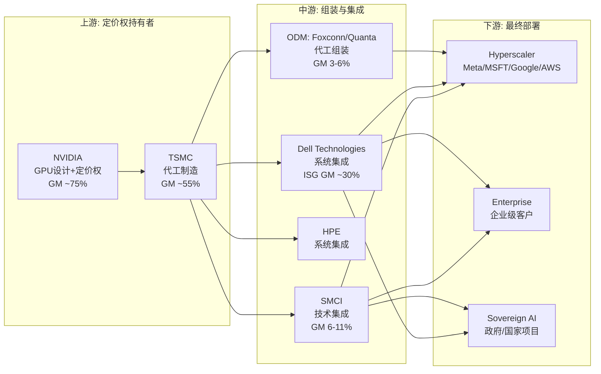
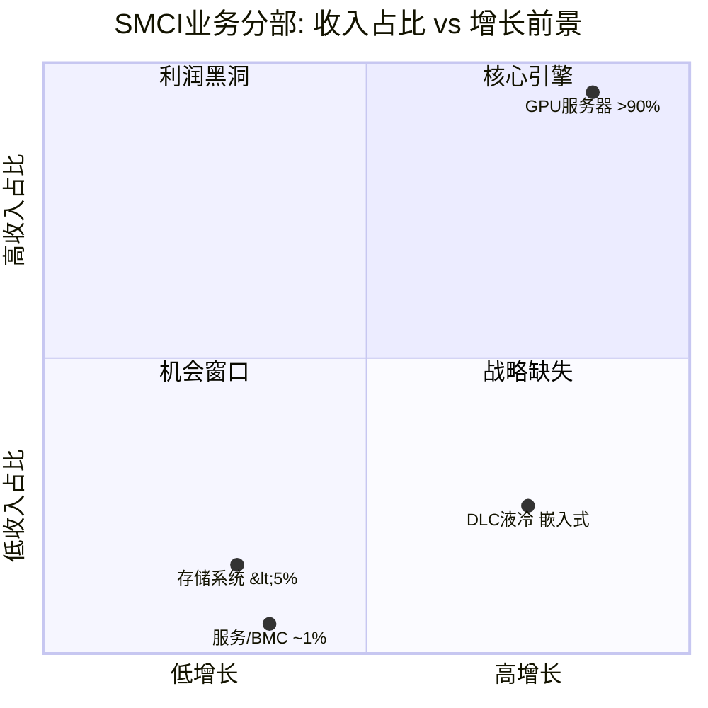

# Part I: 定位与全景

---

## 第1章 报告总览与核心结论速览

### 1.1 报告元数据

| 项目 | 内容 |
|------|------|
| **公司** | Super Micro Computer, Inc. (NASDAQ: SMCI) |
| **行业** | AI服务器系统集成 / 数据中心基础设施 |
| **报告类型** | Tier 3 深度研究 |
| **框架版本** | v17.0 |
| **数据截止日** | 2026-02-21 |
| **股价** | $32.42 [DM-MKT-001] |
| **市值** | ~$19.4B (596.8M基本股) [DM-INF-003] |
| **完全稀释市值** | ~$21.8B (含可转债全部转股73.8M股) [DM-OPT-012] |
| **52周区间** | $27.6 - $66.4 [DM-MKT-001] |
| **2年区间** | $18.01 - $118.81 (回报率 -55.84%) [DM-MKT-002] |
| **TTM收入** | $28.06B [DM-FIN-016] |
| **TTM毛利率** | 8.0% [DM-FIN-017] |
| **分析师共识** | Hold (5 Buy / 8 Hold / 2 Sell), 中位目标价$43 [DM-CON-001] |

### 1.2 核心矛盾

> **"收入增长了6倍但价值没有增加"** --- 一家公司如何在4年内从$3.6B收入增长到$40B却让股东亏损55%?

这不是业绩造假，不是需求幻觉，甚至不是周期下行。SMCI代表的是一种更罕见也更深刻的商业困境:**增长完全真实，但经济价值被上游(NVIDIA)和竞争(Dell/HPE/ODM)彻底榨取**。FY2021收入$3.56B [DM-FIN-009]，FY2025收入$21.97B [DM-FIN-001]，FY2026E指引$40B+ [DM-BIZ-08] --- 收入曲线陡峭上行；同期2年股价回报-55.84% [DM-MKT-002] --- 价值曲线断裂式下坠。理解这一矛盾，是理解SMCI投资价值的全部前提。

### 1.3 综合评级速览

| 维度 | 概要结论 |
|------|---------|
| **综合评级** | *待Phase 5确定* |
| **公允价值区间** | *待Phase 3估值完成* |
| **核心驱动** | 毛利率能否从6.3%回升至8-12%均衡区间 |
| **最大机会** | DLC液冷领先12-18月 + Vera Rubin/NVL144平台周期 |
| **最大风险** | 毛利率结构性恶化 + 治理惯犯折价 + 64.4% NVIDIA依赖 |

### 1.4 五大关键问题(CQ)概览

| CQ# | 问题 | 约束类型 | 权重 | 初始评估 |
|-----|------|:--------:|:----:|---------|
| CQ1 | 毛利率是结构性恶化还是周期性? | S(结构性) | 0.25 | [硬数据: FY23 18.0% → Q2FY26 6.3%，连降10个季度 \| DM-FIN-018, DM-BIZ-09] |
| CQ2 | AI服务器需求能持续多久? | C(周期性) | 0.25 | [硬数据: Q2 $12.68B创纪录，含$1.5B积压释放 \| DM-BIZ-07] |
| CQ3 | 治理折价应该打多少? | I(制度性) | 0.20 | [硬数据: 两次丑闻(2017-20 + 2024-26)，DOJ调查无时间线 \| DM-MGT-002, DM-NEW-C-017] |
| CQ4 | 竞争护城河有多脆弱? | S(结构性) | 0.15 | [合理推断: DLC领先12-18月，但速度优势正在被Dell缩小] |
| CQ5 | NVIDIA依赖风险有多大? | S(结构性) | 0.15 | [硬数据: 采购64.4%来自NVIDIA (FY25, vs FY24 30.7%) \| DM-BIZ-14] |

**约束分类含义**: 5个CQ中3个为结构性(S)约束 --- 这意味着它们不是"等周期复苏"就能解决的问题，而是SMCI作为GPU服务器组装商面临的长期挑战。1个周期性(C)约束的正面演化是多头唯一可控的变量。1个制度性(I)约束取决于外生催化剂(DOJ裁定)。

### 1.5 五个非共识假说

| 编号 | 假说名称 | 共识观点 | 本报告非共识立场 |
|------|---------|---------|----------------|
| CI-01 | 组装商估值陷阱 | EV/Sales 0.75x极其便宜 | EV/GP 9.4x才是正确指标，SMCI较Dell溢价~50% [DM-VAL-006] |
| CI-02 | 浪潮镜像确认行业宿命 | 毛利率压缩是暂时的竞争压力 | 浪潮在不同生态(Ascend)下收敛至6.85% GM，确认这是组装商结构性命运 [DM-INF-002] |
| CI-03 | 反向经营杠杆 | 规模增长将带来利润率回升 | Q2 FY26数据显示边际收入利润率远低于平均——越大越不赚钱 |
| CI-04 | CEO激励错配 | $1薪酬表明利益一致 | 5年零买入+23次卖出+关联方$983M，$1薪酬是叙事管理而非利益一致 [DM-SMT-029, DM-MGT-006] |
| CI-05 | 双极市场信号 | 高做空=利空，低P/C=利好，二者矛盾 | 对冲基金做空结构性恶化 vs 散户赌短期反弹 = 信息不对称 [DM-OPT-001, DM-OPT-003] |

### 1.6 报告导航

本报告共34章+4附录，按以下结构组织:

| 部分 | 章节 | 主题 |
|------|------|------|
| **Part I** | Ch1-Ch3 | 定位与全景: 报告总览、公司画像、业务矩阵 |
| **Part II** | Ch4-Ch7 | 生态与治理: NVIDIA依赖、竞争格局、液冷护城河、治理危机 |
| **Part III** | Ch8-Ch11 | 财务深挖: 杜邦分解、毛利率解剖、资本结构、收入质量 |
| **Part IV** | Ch12-Ch15 | 估值引擎: 逆向估值、共识解构、情景DCF、敏感性 |
| **Part V** | Ch16-Ch19 | 增长引擎: TAM/SAM演化、产品路线图、客户集中度、地域扩张 |
| **Part VI** | Ch20-Ch23 | 风险拓扑: 系统性风险图谱、压力测试、尾部风险、做空论文 |
| **Part VII** | Ch24-Ch27 | 宏观叠加: 宏观温度、同行估值、投资论文、仓位策略 |
| **Part VIII** | Ch28-Ch31 | 催化剂与监控: 催化剂日历、KPI仪表盘、信念更新触发器、退出条件 |
| **Part IX** | Ch32-Ch34 | 总结: 核心矛盾回答、开放问题、研究局限 |
| **附录** | A-D | DM数据源、估值模型细节、术语表、参考文献 |

### 1.7 本章核心发现

1. **收入-价值脱节是分析锚点**: SMCI的4年6倍收入增长与-55%股价回报构成本报告的核心矛盾，所有分析围绕"增长能否转化为股东价值"展开。
2. **5CQ中3个为结构性约束**: 意味着SMCI面对的挑战多数无法通过时间或周期来消解，估值框架应避免均值回归假设。
3. **EV/GP 9.4x是真实估值锚点**: 使用EV/Sales的传统估值对低GM组装商产生系统性误导，本报告将以EV/GP作为核心对比指标。

---

## 第2章 公司画像 --- AI服务器组装商的商业本质

### 2.1 一段式业务本质

Super Micro Computer是一家总部位于San Jose的**GPU服务器技术集成商(technical integrator)** [DM-BIZ-20]。它既不设计芯片(NVIDIA的角色)，也不代工制造芯片(TSMC的角色)，更不拥有操作系统或云平台(Hyperscaler的角色)。SMCI的核心能力是将NVIDIA GPU、内存、网络组件、电源和液冷系统**快速组装**成可交付的AI服务器机架，并通过自研的Building Block模块化架构实现比Dell/HPE快数周的新GPU平台上线速度。员工5,684人 [DM-BIZ-20]，19个全球运营地点，月产能6,000 rack [DM-BIZ-18]。

**商业模型的核心矛盾在于**: 在一个BOM成本的70-80%由单一供应商(NVIDIA)定价的业务中，组装商的增值空间被物理性地压缩在10-15%的薄层内。这决定了SMCI的毛利率天花板不是管理层能力问题，而是产业链位置问题。

### 2.2 商业模型画布

```
┌─────────────────────────────────────────────────────────────────────┐
│                     SMCI 商业模型画布                                │
├──────────────┬──────────────────┬─────────────────┬─────────────────┤
│  核心资源     │   价值主张        │   客户细分       │   收入模型       │
│              │                  │                 │                 │
│ ·Building    │ ·<6周新GPU平台    │ ·Hyperscaler    │ ·GPU服务器(>90%) │
│  Block架构   │  上线(行业最快)   │  68%收入        │ ·存储系统(<5%)   │
│ ·DLC液冷技术 │ ·DLC-2 120kW/    │  [DM-BIZ-01]    │ ·DLC液冷(嵌入)   │
│  (45%液冷率) │  rack液冷(行业    │ ·Enterprise/    │ ·服务/BMC(~1%)   │
│ ·速度/定制   │  领先)            │  Channel 31%    │                 │
│  (非成本)    │ ·端到端Rack级     │  [DM-BIZ-02]    │ FY25 Rev $22B   │
│ ·5,684员工   │  方案(服务器+     │ ·Sovereign AI   │ FY26E ≥$40B     │
│ ·19全球地点  │  存储+网络+冷却)  │  (新兴市场)     │ [DM-BIZ-08]     │
├──────────────┼──────────────────┼─────────────────┼─────────────────┤
│  关键合作伙伴 │   渠道            │   成本结构       │   关键指标       │
│              │                  │                 │                 │
│ ·NVIDIA(64.4%│ ·直销(Hyperscaler│ ·GPU采购 70-80% │ ·GM 6.3%(Q2)    │
│  采购,垄断)  │  大客户)          │  BOM            │ ·ROIC 15.82%    │
│  [DM-BIZ-14] │ ·VAR/分销商      │ ·组装/集成/测试  │ ·CCC 19天       │
│ ·Ablecom/    │  (Enterprise)    │  10-15% BOM     │ ·库存$10.6B     │
│  Compuware   │ ·OEM合作         │ ·R&D/GP 31.1%   │  [DM-FIN-024]   │
│  (关联方)    │                  │  [DM-FIN-043]   │ ·NPM 4.8%(FY25) │
│  [DM-MGT-006]│                  │ ·SBC 1.4% Rev   │  [DM-FIN-003]   │
└──────────────┴──────────────────┴─────────────────┴─────────────────┘
```

### 2.3 GPU供应链定位

SMCI处于GPU供应链的中间层 --- Tier 2 OEM位置。这一位置决定了其商业命运的上限:



**定位解读**: NVIDIA以~75%的毛利率控制GPU的设计和定价权，TSMC以~55%的毛利率承接制造。当GPU到达SMCI手中时，占整台服务器BOM的70-80%已经是NVIDIA的定价 --- SMCI只能在剩余的10-15%增值空间内竞争。这不是管理能力问题，而是产业链物理定律。

Dell的ISG(Infrastructure Solutions Group)毛利率约30%，但这包含了大量非GPU服务器业务(传统服务器、存储、网络)和附加值更高的企业服务。纯GPU服务器业务的毛利率，即使是Dell，也在快速向SMCI的区间靠拢 --- 这是CI-02(浪潮镜像)假说的延伸验证。

### 2.4 核心矛盾: 收入6倍增长，价值未增

这是理解SMCI的起点，也是本报告所有分析的锚:

**收入轨迹** [DM-FIN-001~010]:

| 财年 | 收入 | YoY增长 | 毛利率 | 净利润 |
|------|------|---------|--------|--------|
| FY2021 | $3.56B | -- | 15.0% | $112M |
| FY2022 | $5.20B | +46.1% | 15.4% | $285M |
| FY2023 | $7.12B | +37.1% | 18.0% | $640M |
| FY2024 | $14.99B | +110.4% | 13.8% | $1,153M |
| FY2025 | $21.97B | +46.6% | 11.1% | $1,049M |
| Q2 FY26 | $12.68B(单季) | +123.4% | 6.3% | $401M |
| FY2026E | ≥$40B | +82%+ | TBD | TBD |

**价值轨迹** [DM-MKT-002]:
- 2年前股价: ~$73 (2024年2月)
- 期间峰值: $118.81 (2024年3月)
- 当前股价: $32.42
- **2年回报: -55.84%**

[主观判断: 以下为图表文字描述]

如果将收入曲线和股价曲线叠加在同一时间轴上，2024年3月之前二者同步上行 --- 收入从$7B跃升至$15B，股价从$30冲至$118。但2024年3月之后发生了剧烈的**脱耦(decoupling)**: 收入继续从$15B加速至$22B(FY25)再到$40B+(FY26E指引)，而股价从$118断崖式下跌至$32。

脱耦的触发点是**FY2024 Q3毛利率首次跌破15%**(15.5% → 11.2%)，随后每个季度都继续恶化。市场在收入创纪录的同时给出-55%回报，本质上是在说:**"你的收入增长不值钱 --- 因为边际收入没有创造利润。"** 这一判断是否正确，是本报告的核心调查对象。

### 2.5 杜邦分解: ROE的结构脆弱性

ROE TTM 13.19% [DM-FIN-040] --- 一个看似合理但结构脆弱的数字。拆解其构成:

**三因素杜邦分解**:

| 因素 | 值 | 趋势 | 质量评估 |
|------|---|------|---------|
| 净利润率(NPM) | 4.8% (FY25) [DM-FIN-003] | 恶化中: FY23 9.0% → FY24 7.7% → FY25 4.8% | 低质量，持续下降 |
| 资产周转率 | ~1.57x (Rev $22B / Assets $14B) [DM-FIN-001, DM-FIN-022] | 上升中: 收入增速>资产增速 | 高质量，组装商典型特征 |
| 权益乘数 | ~2.23x (Assets $14B / Equity $6.3B) [DM-FIN-022] | 上升中: D/E 0.76x, 含$4.73B可转债 | 中等风险，可转债驱动 |

**NPM × 周转率 × 杠杆 = 4.8% × 1.57 × 2.23 ≈ 16.8%**

[合理推断: 计算值16.8%与报告值13.19%的差异来自TTM口径差异(分子用FY25全年净利润，分母用最新BS数据)。TTM NPM已进一步恶化至~3.3%($932M / $28B)]

**结构脆弱性在于**: ROE的三个驱动因素中:
- **NPM(最重要)正在恶化** --- 从FY23的9.0%降至TTM的~3.3%，且趋势没有逆转迹象。Q2 FY26单季NPM仅3.2%($401M / $12.68B)
- **周转率(最健康)接近天花板** --- 组装商的资产周转率本就高，进一步提升空间有限
- **杠杆(最危险)在扩张** --- $4.73B可转债 [DM-OPT-008] 推高了杠杆。Altman Z-Score 2.31(灰色区间) [DM-FIN-044]

[主观判断: SMCI的ROE结构是"最低质量因子贡献最大权重"的脆弱组合。NPM继续下行+杠杆维持高位=ROE可能在未来4-6个季度跌入单位数，而市场尚未完全定价这一路径。]

### 2.6 关联方交易与股本稀释

**关联方交易** [DM-MGT-006]:

CEO Charles Liang的家族关联公司 --- Ablecom Technology和Compuware Technology --- 在3年内累计获得SMCI $983M的采购订单。这两家公司99.8%的出口收入来自SMCI，使它们本质上是SMCI的"内部供应商"但以"独立公司"的法律形式存在。Hindenburg Research在2024年8月的做空报告中将此作为核心指控之一。

这一交易结构的问题不在于金额本身(相对于FY25 $22B的收入，$983M/3年年均$328M占比约1.5%)，而在于**信号含义**:
- 它表明CEO有能力和意愿通过关联方提取价值
- 它与$1年薪的叙事形成对比 --- CEO表面上不拿薪酬，但通过家族公司间接获益
- 两次丑闻都涉及关联方交易 --- 这是模式而非孤立事件

**股本稀释** [DM-FIN-045]:

| 时间框架 | 稀释率 | 驱动因素 |
|---------|--------|---------|
| 1年 | +8.40% | SBC $314M (FY25) [DM-FIN-030] + 可转债部分转换 |
| 3年 | +19.87% | SBC累积 + 三笔可转债发行($4.73B) [DM-OPT-008] |

[硬数据: 三笔可转债总额$4.725B --- 2028到期$700M@2.25%, 2029到期$1.725B@3.50%, 2030到期$2.3B@0%。全部转股最大稀释73.8M股，转换价$55-$83均深度价外(vs 现价$32.42) | DM-OPT-008, DM-OPT-012]

可转债的存在创造了一个有趣的悖论: 如果SMCI基本面改善推动股价回升至$55+，可转债持有人将转股，稀释每股价值约12.3%(73.8M / 598M基本股)。如果基本面不改善，可转债以现金到期偿还，$4.73B的到期偿付(2028-2030)将严重消耗现金储备(当前现金$4.09B [DM-FIN-024])。无论哪条路径，现有股东都面临价值损耗。

### 2.7 本章核心发现

1. **SMCI是技术集成商而非技术创新者**: 在GPU供应链中处于Tier 2 OEM位置，70-80%的BOM成本由NVIDIA定价，增值空间被物理性压缩至10-15%。
2. **杜邦分解揭示ROE结构脆弱**: 13.19% ROE主要由恶化中的NPM + 扩张中的杠杆支撑，最健康的周转率贡献有限。这是一个"低质量因子驱动"的ROE。
3. **收入-价值脱耦始于2024年3月毛利率拐点**: 市场在收入加速的同时给出-55%回报，本质是对"边际收入不创造利润"的定价。
4. **关联方+稀释构成持续价值损耗**: $983M关联方交易是模式而非孤立事件，$4.73B可转债在任何路径下都对现有股东不利。

---

## 第3章 业务矩阵 --- GPU服务器/存储/液冷/服务

### 3.1 业务全景

SMCI的收入来源高度集中于GPU服务器系统。AI GPU平台占Q2 FY2026收入的>90% [DM-BIZ-07]，这是一个远超行业正常水平的单一产品集中度。以下按客户渠道和产品维度分别拆解。

**按客户渠道(Q1 FY2026基准)** [DM-BIZ-01, DM-BIZ-02]:

| 渠道 | 收入(Q1 FY26) | 占比 | 增长驱动 | 毛利率特征 |
|------|-------------|------|---------|-----------|
| OEM Appliance / 大型数据中心 | ~$3.4B | 68% | Hyperscaler AI CapEx + Sovereign AI | 最低(大批量/低加价) |
| Enterprise / Channel | ~$1.5B | 31% | 企业AI部署 + 推理服务器 | 较高(定制溢价+增值服务) |
| 其他/服务 | ~$50M | ~1% | BMC/IPMI管理软件 | 最高但体量极小 |

**关键观察**: OEM/大型数据中心从FY2024的~55%上升至68%，表明SMCI的客户结构正在向更大但毛利率更低的Hyperscaler倾斜。管理层目标是将大型数据中心客户从FY2025的4家扩展至FY2026的6-8家 [DM-BIZ-16] --- 方向明确但恶化了产品组合(mix shift)问题。

### 3.2 分部一: GPU服务器系统 --- 主力引擎(占收入>90%)

GPU服务器是SMCI的绝对核心。Q2 FY2026录得历史最高单季收入$12.68B(+123% YoY, +153% QoQ) [DM-BIZ-07]，几乎全部来自AI GPU服务器交付。

**产品线**:
- **HGX B200系列**: NVIDIA Blackwell架构的8-GPU节点，面向训练和推理
- **GB200 NVL72**: NVIDIA最新72-GPU液冷机架方案，单rack售价$3.0-3.9M，是当前最高端产品
- **集群方案**: 小型(4节点/32 GPU)、中型(8节点/64 GPU)、大型(32节点/256 GPU) [DM-BIZ-19]
- **RTX PRO 6000 Blackwell**: 面向推理和工作站的方案

**增长驱动因素**:
1. Hyperscaler AI CapEx持续扩张: 2026E Top 5合计$660-690B
2. Sovereign AI需求: 亚洲(泰国、日本)+欧洲(英国、瑞典、西班牙)政府级AI基础设施 [DM-BIZ-11, DM-BIZ-12]
3. Q1积压释放: Q2 FY26中约$1.5B来自Q1延迟出货(会计丑闻导致的客户观望期结束)
4. 产品路线图: Vera Rubin NVL72/NVL8支持 + NVL144/CPX 2H 2026 [DM-NEW-C-005]

**毛利率问题 --- 为什么最大的分部利润率最低**:

GPU占整台服务器BOM的70-80%。以GB200 NVL72为例:

| BOM组成 | 占比(估算) | 定价权 |
|--------|-----------|--------|
| GPU (72× Blackwell) | 70-80% | NVIDIA完全控制 |
| 内存 (HBM3E/DDR5) | 8-12% | 三星/SK海力士/美光寡头控制 |
| 网络 (NVLink/InfiniBand) | 3-5% | NVIDIA(Mellanox)控制 |
| SMCI增值部分 | 10-15% | 机箱/电源/散热/集成/测试 |

[合理推断: SMCI的增值层(10-15%)内含液冷、BMC固件、机箱设计、电源管理和系统集成测试。毛利率的理论上限约为增值层的30-40%(即总BOM的3-6%)。当前6.3%的GM已经接近这一理论天花板的上沿 --- 这是CI-02(浪潮镜像)假说的数学基础。]

### 3.3 分部二: 存储系统 --- 萎缩中的传统业务

存储系统曾是SMCI的重要收入来源(AI浪潮前占比约20-25%)，但随着GPU服务器的爆发式增长，存储在总收入中的占比已被稀释至个位数百分比。

**产品**: 包括All-Flash NVMe阵列、混合存储系统、JBOF/JBOD、以及面向AI训练数据集的高吞吐存储方案。

**战略定位**: 存储业务的重要性在于它是**端到端Rack级方案**叙事的组成部分。Hyperscaler客户在采购GPU集群时，同时采购配套存储可以简化部署 --- 但这更多是"配件"价值而非"核心"价值。存储业务的毛利率显著高于GPU服务器，因为存储BOM中没有GPU这一"利润黑洞"。

### 3.4 分部三: DLC液冷解决方案 --- 唯一可能的护城河

DLC(Direct Liquid Cooling)是SMCI当前最具差异化的技术维度，也是多头论文的核心支柱之一。

**技术参数** [DM-BIZ-18]:

| 指标 | 数值 | 行业对比 |
|------|------|---------|
| 月产能(总) | 6,000 racks | 行业前三 |
| DLC占比 | 45% (~3,000 DLC racks/月) | 行业最高 |
| DLC-2最大功率 | 120kW/rack | 行业领先 |
| TCO降低 | ~20% | 显著竞争优势 |
| 数据中心功耗降低 | ~40% | 关键卖点 |
| 领先时间 | 12-18个月(vs Dell/HPE) | 但在缩小 |

**DLC成为刚需的技术背景**:

GPU TDP(热设计功率)正在快速攀升:
- H100: 700W/GPU → 8-GPU节点 5.6kW
- B200: 1000W/GPU → GB200 NVL72 rack ~100-120kW
- 下一代(Vera Rubin): 预计>1000W/GPU

当单rack功率密度超过50kW时，传统风冷在物理上已经无法有效散热。GB200 NVL72的100-120kW/rack功率密度使液冷从"可选"变成"必须"。SMCI的DLC-2方案支持最高120kW/rack [DM-BIZ-18]，是目前市场上能处理最高功率密度的商业化液冷方案之一。

**但DLC护城河的局限性**(关联CI-02碰撞2):

| 乐观因素 | 限制因素 |
|---------|---------|
| 12-18月技术领先 | Dell/HPE/Schneider/Vertiv都在大规模投资液冷 |
| 45%液冷比率(行业最高) | 液冷仅占整个rack BOM的约5-10% |
| GPU TDP趋向1000W+使DLC刚需 | DLC技术本身无专利壁垒(流体力学+热传导, 非半导体IP) |
| 端到端集成能力(GPU+液冷一体) | Hyperscaler正在建立自有液冷能力 |

[主观判断: DLC是SMCI最有价值的差异化维度,但它解决的是"散热"问题而非"计算"问题。在GPU服务器的价值链中,散热占BOM的5-10%,而NVIDIA GPU占70-80%。护城河存在于价值链的边缘而非核心。12-18个月的领先可以转化为短期定价权,但不足以改变长期组装商宿命。]

### 3.5 分部四: 服务/软件/BMC --- 被忽视的结构性缺陷

服务收入占比约1% --- 这是SMCI与Dell之间最深刻的结构性差异之一。

**对比** [合理推断: 基于行业数据]:

| 维度 | SMCI | Dell Technologies |
|------|------|-------------------|
| 服务收入占比 | ~1% | ~30%+ (CSG+ISG服务) |
| 经常性收入 | 接近零 | ProDeploy/ProSupport/APEX |
| 客户粘性来源 | 速度+定制 | 安装基数+服务合同+APEX订阅 |
| 收入质量(经常性%) | <5% | >40% |
| 毛利率稳定性 | 极度波动(6-18%) | 相对稳定(30-35%) |

**服务缺失的后果**:

1. **收入波动性极高**: 几乎100%的收入来自一次性硬件交付，无经常性收入缓冲周期波动
2. **客户粘性弱**: 一旦下一代GPU平台切换，客户可以零成本转向Dell/HPE。没有服务合同=没有锁定
3. **估值折价**: 华尔街给予高经常性收入业务更高倍数(SaaS 10-20x EV/Sales vs 硬件1-2x)

SMCI自研的BMC(基板管理控制器)固件和IPMI管理软件理论上可以成为服务化的入口 --- 但管理层尚未显示出将其转化为订阅收入的战略意图。SuperCloud Composer/SuperDoctor等软件工具免费附送，而非独立定价。

### 3.6 产品路线图: NVIDIA平台周期驱动

SMCI的产品节奏几乎完全跟随NVIDIA的GPU路线图:

| 时间线 | NVIDIA平台 | SMCI对应产品 | 状态 |
|--------|-----------|-------------|------|
| 2024 H1 | H100/H200 | SYS-420GH/SYS-821GH | 量产中 |
| 2024 H2-2025 | Blackwell B200/GB200 | GPU SuperServer / NVL72 rack | 量产放量 |
| 2025 H2-2026 H1 | GB200 NVL72增产 | DLC-2 + NVL72液冷集成 | 主力产品 |
| 2026 H1-H2 | Vera Rubin NVL72/NVL8 | 已宣布支持 [DM-NEW-C-005] | 研发/早期 |
| 2026 H2+ | NVL144 / CPX | 计划中 [DM-NEW-C-005] | 预研 |
| 2027+ | Rubin Ultra | 预期支持 | 未确认 |

**Building Block架构的核心优势**:

SMCI的模块化设计哲学使其能在NVIDIA发布新GPU后<6周内推出兼容服务器平台 [DM-BIZ-18]。对比Dell/HPE通常需要数月。这一速度优势的来源是:

- **标准化模块**: 电源、散热、背板等组件高度标准化，新GPU只需更换计算模块
- **自研BMC**: 固件适配可并行开发，不依赖外部BMC供应商(如Aspeed)
- **垂直集成**: 机箱/电源/散热的内部设计能力，减少供应商协调成本

[合理推断: 然而速度优势正在结构性缩小。Dell在2024年成立了专门的AI服务器BU,HPE通过Cray遗产强化了GPU集群能力。SMCI从"领先数月"缩小到"领先数周"的过程已经在发生。当差距缩小到2-3周时,速度优势在Hyperscaler的12-18个月采购周期中变得不再关键。]

### 3.7 业务矩阵总览



**矩阵解读**:

| 象限 | 分部 | 战略含义 |
|------|------|---------|
| 核心引擎(但也是利润黑洞) | GPU服务器 | 驱动收入增长但GM<10%，增收不增利的根源 |
| 机会窗口 | DLC液冷 | 高增长+差异化，但嵌入在GPU服务器内不单独计价，价值被低估或无法独立变现 |
| 传统业务 | 存储系统 | 被AI浪潮稀释，但GM较高，应维持而非缩减 |
| 战略缺失 | 服务/BMC | 1%占比是最大的结构性弱点，Dell的30%+服务收入是SMCI可望不可及的护城河 |

### 3.8 R&D效率: 组装商的创新困境

R&D/GP TTM 31.1% [DM-FIN-043] --- 这个数字看似合理,但换算为R&D/Revenue仅约2.5%(因为GP仅占Revenue的8%)。与同行对比:

| 公司 | R&D/Revenue | R&D绝对额(年化) | 方向 |
|------|------------|----------------|------|
| SMCI | ~2.5% | ~$700M | 系统集成/液冷/BMC |
| Dell (ISG) | ~5-6% | ~$5B+ | 全栈(服务器+存储+网络+软件) |
| NVIDIA | ~27% | ~$11B+ | GPU架构/CUDA/网络 |
| HPE | ~4-5% | ~$1.5B | Cray+AI集群+GreenLake |

[合理推断: SMCI的绝对R&D投入约$700M，与其$40B+收入规模严重不匹配。这限制了其在液冷之外开辟第二增长曲线的能力。Building Block架构的维护和迭代消耗了大部分R&D预算，留给真正创新的空间有限。]

### 3.9 地域分布: 欧洲增长最快

FY2025地域收入分布 [DM-BIZ-10, DM-BIZ-11, DM-BIZ-12]:

| 地域 | FY2025收入占比 | YoY增长 | 驱动因素 |
|------|--------------|---------|---------|
| 美国 | 59.4% | -- | Hyperscaler主力市场 |
| 亚洲 | -- | +88.6% | Sovereign AI(泰国/日本) |
| 欧洲 | -- | +110.7% | 最快增长; 英国/瑞典/西班牙 |
| 其他 | 小比例 | -- | -- |

欧洲+110.7%的增速引人注目。SMCI在欧洲推出了30+款Blackwell企业级AI产品 [DM-BIZ-12]，瞄准Sovereign AI基础设施需求。这是一个比美国Hyperscaler更分散但可能毛利率更高的市场 --- 因为政府/主权AI项目通常对价格敏感度低于Hyperscaler。

### 3.10 AI服务器TAM: 6年8倍增长

AI服务器TAM(Total Addressable Market) [DM-BIZ-17]:

| 年份 | 市场规模 | 来源 |
|------|---------|------|
| 2024 | $128B | GM Insights |
| 2024(替代估算) | $143B | MarketsandMarkets |
| 2025 | $252B(含传统服务器) | Bloomberg |
| 2026E | 出货量+28% YoY | TrendForce |
| 2030E | $854B | Grand View Research |
| CAGR 2025-2030 | 34.3% | GM Insights |

SMCI的当前AI服务器市场份额约7-10%(Citi估算8%) [DM-BIZ-22]，这已经从2022-2023年的~50%大幅下滑。份额丢失的主要原因:
1. Dell/HPE规模化进入AI服务器市场
2. 2024年审计丑闻导致NVIDIA暂时转移配额
3. ODM(Foxconn/Quanta/Wistron)以更低价格直接服务Hyperscaler

[主观判断: TAM增长确实壮观($128B → $854B, 6年CAGR 34.3%)。但SMCI的份额从~50%跌至8%的趋势表明，TAM增长并不自动转化为SMCI增长。ASIC份额2026E升至27.8%(从2024年~15%)进一步蚕食GPU服务器的TAM份额。SMCI需要在一个快速增长但份额同时快速下滑的市场中竞争 --- 净效果取决于增速差值。]

### 3.11 本章核心发现

1. **极端收入集中度**: AI GPU平台占收入>90%，单一产品线依赖创造了高增长但也带来了极端的周期脆弱性。任何AI CapEx放缓都会直击收入核心。
2. **DLC是最有价值的差异化，但存在于价值链边缘**: 120kW/rack、45%液冷比率、12-18月领先 --- DLC是SMCI最接近"护城河"的维度。但它仅占BOM的5-10%，无法改变70-80% GPU定价权在NVIDIA手中的根本格局。
3. **服务收入~1%是最深刻的结构性弱点**: 这使SMCI丧失了经常性收入缓冲、客户锁定和估值溢价。Dell的30%+服务收入是其在相似硬件业务中获得更高估值倍数的核心原因。
4. **Building Block速度优势正在结构性缩小**: 从"领先数月"到"领先数周"，在Hyperscaler 12-18个月采购周期中，2-3周的差距不再构成决策性因素。
5. **TAM增长掩盖份额下滑**: AI服务器TAM从$128B → $854B(6年CAGR 34.3%)，但SMCI份额从~50%跌至~8%。ASIC崛起(2026E 27.8%)进一步蚕食GPU服务器总TAM。