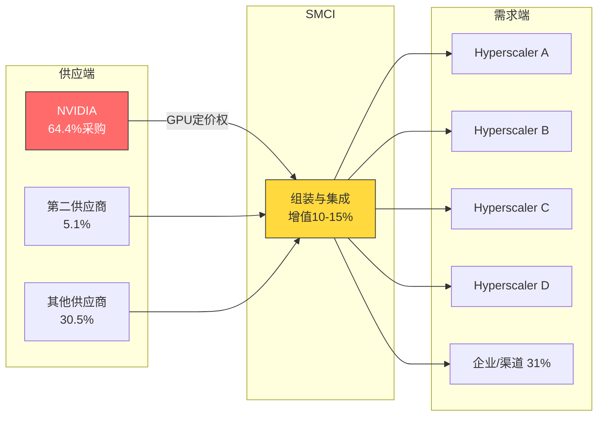
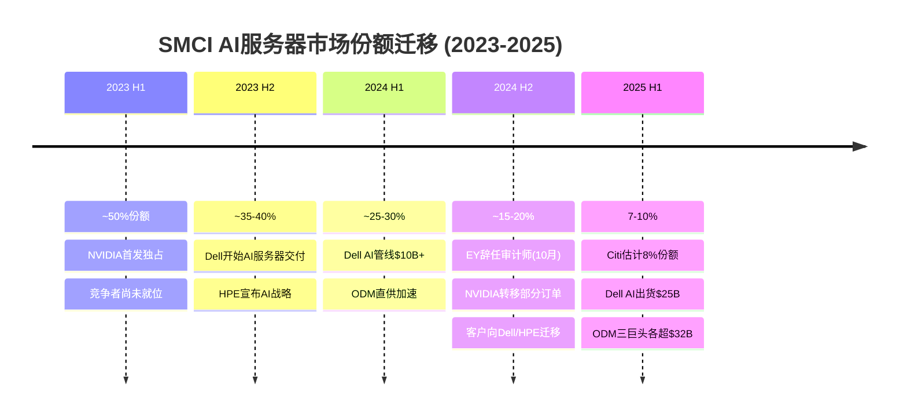
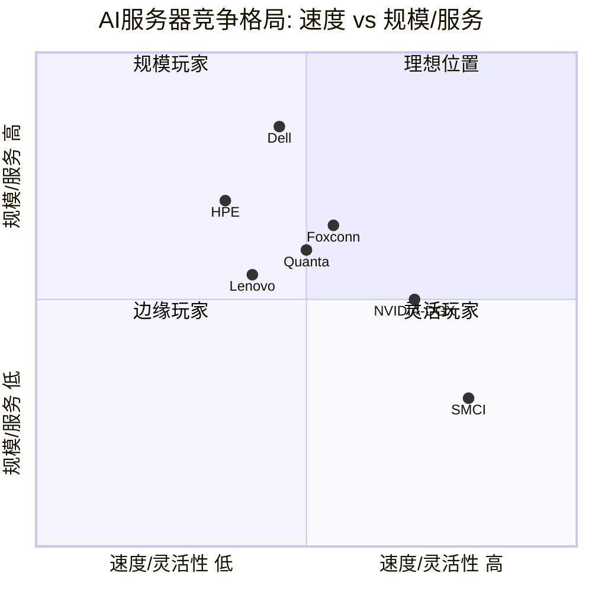
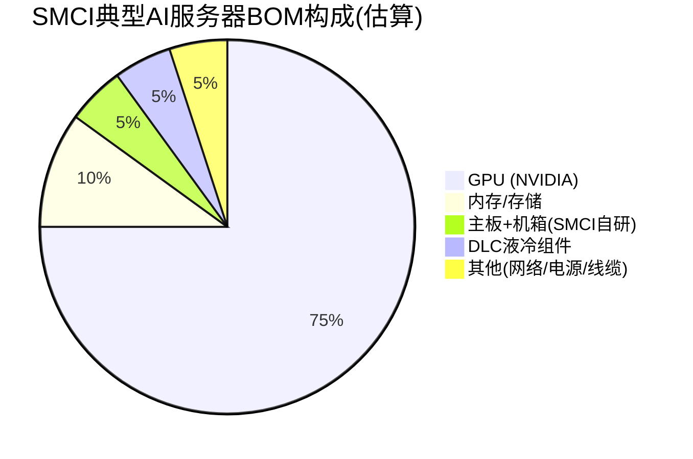
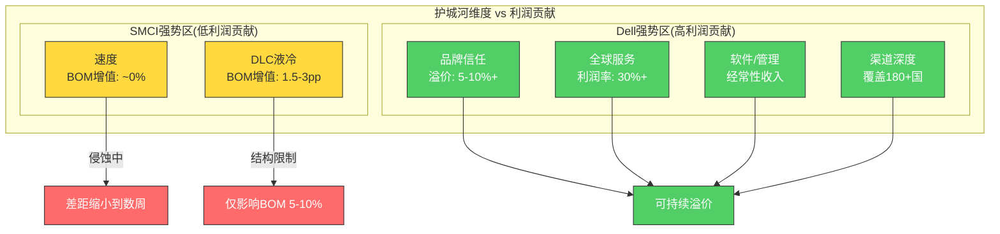

# SMCI 深度研究: 第4-6章 — 地理版图、竞争格局与护城河拓扑

> 核心矛盾贯穿线: "收入增长了6倍但价值没有增加" — 增长完全真实但经济价值被上游(NVIDIA)和竞争(Dell/HPE/ODM)彻底榨取。

---

## 第4章 地理版图 — 美国/亚太/欧洲 + 台湾制造

### 4.1 地理收入分布: 从美国主导到亚太崛起

SMCI的地理收入结构在AI浪潮中经历了显著重构。FY2025全年数据显示，美国仍为最大单一市场，占总收入的59.4% [DM-BIZ-10]。但这一比例在快速变化——Q4 FY2025的季度数据呈现了截然不同的画面:

| 地区 | FY2025全年占比 | Q4 FY2025占比 | YoY变化(Q4) |
|------|---------------|--------------|-------------|
| 美国 | 59.4% | 38% | -33% |
| 亚洲 | — | 42% | +91% |
| 欧洲 | — | 15% | +66% |
| 其他 | — | 5% | -3% |

[硬数据: FY2025全年美国占比59.4% | DM-BIZ-10; Q4 FY2025地理分布来自10-K Note 4]

这组数据揭示了一个关键趋势: **亚洲已在季度维度上超越美国成为SMCI最大收入来源**。Q4 FY2025亚洲收入同比增长91%，占比达到42%，而美国收入反而同比下降33% [DM-BIZ-11]。这一变化的驱动因素包括:

- **Sovereign AI需求**: 泰国、日本等亚太国家加速建设本土AI算力基础设施
- **欧洲加速**: 英国、瑞典、西班牙推动增长，SMCI已为欧洲市场推出30+款Blackwell企业级AI产品 [DM-BIZ-12]
- **美国波动**: Hyperscaler采购节奏的季度波动导致美国收入出现季度级别大幅波动

[合理推断: 亚洲超越美国的趋势是否可持续取决于Sovereign AI建设持续性和Hyperscaler订单分配节奏]

### 4.2 客户集中度: 双重极端依赖

SMCI面临供需两端的极端集中风险:

**供应端集中**: NVIDIA占SMCI总采购额的64.4%(FY2025) [DM-BIZ-14]，第二大供应商仅占5.1% [DM-BIZ-15]。这意味着SMCI的命运几乎完全系于一家供应商。2024年会计危机期间，NVIDIA将部分订单转移至其他供应商 [DM-BIZ-32]，这一事件证明了:NVIDIA拥有对SMCI的生杀大权，而这种权力是单向的。

**需求端集中**: FY2025有4家大型数据中心客户，管理层目标是FY2026扩展至6-8家 [DM-BIZ-16]。前5大客户约占收入50%。这种集中度意味着任何一家Hyperscaler的采购策略变化都可能对季度收入产生剧烈影响——Q2 FY2026的$12.7B创纪录收入中包含约$1.5B的Q1延迟交付 [DM-BIZ-07]，正是客户订单波动的体现。

[主观判断: SMCI在供需两端的极端集中度是"组装商宿命"的结构性体现——缺乏对上游的议价权和对下游的锁定能力]

### 4.3 台湾制造基地: 战略价值与地缘风险

SMCI的制造布局跨越三个核心区域:

| 设施 | 位置 | 功能 | 战略意义 |
|------|------|------|---------|
| **总部+主制造** | San Jose, CA | 系统集成、测试、总装 | 美国本土合规，政府订单 |
| **台湾工厂** | 桃园市八德区(Bade) | 主板设计、机箱制造、组装 | 核心组件自主设计，靠近供应链 |
| **荷兰设施** | 荷兰 | 欧洲市场集成/交付 | 欧洲市场接入点，缩短交付周期 |
| **马来西亚** | 马来西亚 | 生产扩展 | 地缘风险分散，东南亚辐射 |

台湾制造基地承载着SMCI的核心竞争力之一——Building Block模块化架构的物理实现。SMCI自主设计主板和机箱(而非依赖ODM代工)，这是其能在<6周内完成新GPU平台适配的关键 [DM-BIZ-18]。

然而，台湾制造基地也带来了不可忽视的地缘政治风险。Polymarket数据显示，台海冲突在2026年底前发生的概率为10%($9M成交量) [DM-PMK-I02]。虽然10%概率看似不高，但其尾部影响是灾难性的——如果台湾制造中断，SMCI将在短期内丧失核心组件供应能力。

**与Dell/HPE的全球覆盖差距**: Dell在180+个国家拥有销售和服务网络，HPE的GreenLake覆盖约46,000家客户。SMCI仅在19个全球站点运营 [DM-BIZ-20]，5,684名员工 [DM-BIZ-20]。这种规模差距意味着:

- **企业市场渗透受限**: 大型企业需要本地化服务和支持，SMCI缺乏全球服务团队
- **Sovereign AI机会局限**: 各国政府更倾向于与拥有本地实体的供应商合作
- **售后服务能力**: 服务收入仅占总收入约1% [DM-BIZ-01, DM-BIZ-02]，几乎没有"安装后收入"

### 4.4 地理扩张策略与限制

管理层正在推进多个方向的地理扩张:

1. **美国本土制造扩大**: 为满足政府合规要求(CMMC等)扩展美国产能 [DM-BIZ-38]。这一方向的逻辑是: Sovereign AI和国防/政府客户要求本土制造。但美国制造成本显著高于台湾/马来西亚，扩产反而加剧毛利率下行压力。这是一个"战略正确但经济负面"的决策。

2. **欧洲市场深化**: 30+款Blackwell产品专为欧洲市场推出 [DM-BIZ-12]。欧洲AI基础设施需求正在加速(FY2025 YoY +110.7% [DM-BIZ-12])，但HPE在欧洲政府/公共部门的关系远强于SMCI——HPE的GreenLake在欧洲拥有数千客户，而SMCI在欧洲更像是"新进入者"。荷兰设施提供了物理接入点，但缺乏本地化服务团队。

3. **亚太市场拓展**: 泰国、日本、马来西亚等市场的Sovereign AI需求推动亚洲收入YoY +88.6% [DM-BIZ-11]。但亚太市场的定价压力通常大于北美/欧洲，大规模亚太订单可能进一步压低blended GM。

4. **马来西亚制造**: 新设马来西亚生产基地用于地缘风险分散和东南亚市场辐射。这是对台湾制造集中风险的正确对冲，但建立新生产能力需要时间(12-18个月爬坡期)，且制造品质控制需要验证。

**地理扩张的根本限制**: 无论在哪个地区销售，SMCI面临的经济等式不变——GPU占BOM 70-80%，SMCI的增值空间被锁定在10-15%。地理扩张能分散收入来源(降低地缘/客户风险)，但不能改变组装商的利润结构。一个在欧洲组装的GB200 NVL72的毛利率，不会比在San Jose组装的更高——因为GPU成本在两地完全相同。

[合理推断: 地理扩张的价值在于风险分散和收入增长，而非利润率改善。管理层的$40B+收入指引(FY2026)部分依赖于地理扩张，但如果边际收入的GM低于平均(如亚太低价大单)，增长反而稀释整体利润率——这正是CI-03"反向经营杠杆"假说的地理维度体现]

### 本章核心发现

1. **地理格局正在重构**: 亚洲已在季度维度超越美国，但这更多反映订单波动而非结构性转移
2. **双重极端集中度**: NVIDIA占采购64.4% + 前5客户占收入~50% = 供需两端缺乏议价权
3. **台湾风险真实存在**: 10%概率的台海冲突对核心制造构成尾部威胁
4. **全球覆盖差距巨大**: 19个站点 vs Dell 180+国家，限制了企业市场和Sovereign AI的渗透
5. **地理扩张不改变经济结构**: 在任何地区，组装商的增值空间都被GPU BOM锁定

---

## 第5章 竞争格局 — Dell vs HPE vs Lenovo vs ODM

### 5.1 竞争格局总览: 从独占到多极

2023年初，SMCI在AI服务器市场拥有接近50%的份额，凭借NVIDIA首发优势几乎独占了这个新兴市场 [DM-BIZ-22]。到2025年底，这一份额已经崩跌至7-10%(Citi估计8%) [DM-BIZ-22]。市场从SMCI的"黄金时代"演变为一个多极竞争格局。

**市场份额迁移的核心驱动力**:

- **Dell/HPE追赶**: 大型OEM缩短了GPU平台上新周期，从"落后数月"到"落后数周"
- **ODM直供崛起**: Foxconn/Quanta等ODM直接服务Hyperscaler，以更低成本争夺最大宗订单
- **会计危机加速流失**: 2024年EY辞任审计师事件 [DM-MGT-005] 导致客户信任崩塌，NVIDIA转移订单 [DM-BIZ-32]
- **Hyperscaler分散策略**: 微软、Meta等CSP有意识地将订单分散至多个供应商以降低供应链风险

### 5.2 竞争者详细分析

#### 5.2.1 Dell Technologies — 最大威胁

| 指标 | Dell | SMCI |
|------|------|------|
| AI服务器市场份额 | ~20% | 7-10% |
| FY2026 AI服务器收入目标 | ~$25B | 含在$40B总收入中 |
| AI服务器年初至今订单 | $30B(Q3 FY26累计) | 未单独披露 |
| ISG运营利润率 | 12.4%(Q3 FY26) | ~3.6%(OPM) |
| 全球服务网络 | 180+国家 | 19个站点 |
| PE倍数 | 16.3x | 23.1x(TTM) |

[硬数据: Dell AI订单$30B YTD, AI出货指引$25B, ISG OPM 12.4% | Dell Q3 FY2026 earnings release]

Dell是SMCI面临的最具威胁的竞争者，其优势体现在多个维度:

1. **规模与渠道**: Dell拥有全球最大的企业IT直销和服务网络。当企业客户在SMCI会计危机中犹豫时，Dell成为"安全选择"——一个值得信赖的、有全球服务保障的供应商 [DM-BIZ-23]。

2. **AI加速追赶**: Dell的AI服务器订单在Q3 FY2026达到$12.3B(单季度创纪录)，年初至今累计$30B。AI出货指引上调至$25B，同比增长超150%。Dell正在从"追赶者"变为"领导者"。

3. **利润率优势**: Dell ISG运营利润率12.4%远高于SMCI的~3.6%。Dell能在维持利润的同时增长——它不需要用利润换份额，因为企业客户愿意为品牌、服务和可靠性支付溢价。

4. **Dell的弱点**: GPU平台上新速度仍慢于SMCI(但差距正在缩小)；液冷技术积累较少；传统PC业务拖累增长叙事。

#### 5.2.2 Hewlett Packard Enterprise (HPE) — 差异化挑战者

| 指标 | HPE | SMCI |
|------|-----|------|
| FY2025 AI累计订单 | $13.4B(自FY23 Q1) | 未单独披露 |
| HPC市场份额 | ~28%(HPE Cray) | 极低 |
| GreenLake ARR | $3.2B(+68% YoY) | 无订阅业务 |
| GreenLake客户数 | ~46,000 | 6-8家大客户 |

[硬数据: HPE Cray HPC收入$7.1B(2024), 市场份额>28% | Hyperion Research; GreenLake ARR $3.2B | HPE Q4 FY2025 earnings]

HPE的竞争策略与Dell不同，它聚焦于高端差异化:

1. **Cray超算血统**: HPE通过2019年收购Cray获得了超级计算机领域的顶级地位。2024年HPE Cray系列创造了$7.1B收入，HPC市场份额超过28%。这一资产在Sovereign AI(国家级AI计算)领域无可替代。

2. **GreenLake即服务模式**: HPE的订阅式IT服务模型(ARR $3.2B, +68% YoY, ~46,000客户)为AI基础设施提供了"消费而非购买"的选项。这与SMCI的"卖硬件"模式形成根本性差异——GreenLake创造经常性收入，而SMCI每个季度都需要重新赢得订单。

3. **Juniper收购**: 2024年完成的Juniper Networks收购强化了HPE在网络层的能力。AI集群需要高速网络互联，HPE现在可以提供从服务器到网络的完整解决方案。

4. **HPE的弱点**: AI专项收入基数小于Dell/SMCI；Juniper整合风险；新GPU平台上市速度最慢。

#### 5.2.3 Lenovo — 新兴竞争者

Lenovo在AI服务器领域的存在感正在增强，其核心武器是**Neptune液冷技术**:

- Neptune是业界最成熟的温水液冷方案之一，Lenovo在2025年Top500和Green500超算榜单上均排名第一
- 全球企业品牌和分销网络，亚太地区尤其强势 [DM-BIZ-27]
- 与Nidec合作推进AI数据中心液冷方案的商业化部署

[合理推断: Lenovo的Neptune液冷对SMCI的DLC领先地位构成直接挑战——两者技术路线相似，但Lenovo拥有更大的全球渠道]

Lenovo的弱点在于AI专项收入较小，在北美Hyperscaler市场的渗透有限。但其在全球$252B服务器市场中的整体排名(全球前三)意味着它有足够的规模和资源在AI服务器领域发力。

#### 5.2.4 ODM直供 — 结构性威胁

ODM(Original Design Manufacturer)直供模式是对SMCI中长期最具破坏力的竞争威胁:

| ODM | 核心客户 | 优势 | 2025年状态 |
|-----|---------|------|-----------|
| **Foxconn** | AWS, Azure, Meta | 全球最大服务器制造商(按出货量), NVIDIA NVL72组装 | 年收入超NT$1万亿 |
| **Quanta** | Meta, Google | Meta Santa Barbara服务器主要供应商(~6,000 racks) | 年收入超NT$1万亿, +65.6% |
| **Wistron/Wiwynn** | Meta, 各Hyperscaler | Wiwynn供应全球AI服务器采购近50% | 年收入超NT$1万亿, +92.7% |

[硬数据: Foxconn/Quanta/Wistron 2025年各突破NT$1万亿(~$32B)收入 | DigiTimes; Wiwynn供应全球近50% hyperscale AI服务器 | IEEE ComSoc]

ODM威胁的核心逻辑:

1. **成本优势**: ODM没有品牌溢价、全球服务网络的固定成本。它们的制造成本结构天然低于SMCI——而SMCI的毛利率已经降到6.3%，几乎没有成本优势可言 [DM-BIZ-33]。当SMCI试图以6.3% GM与Foxconn竞争Hyperscaler大单时，Foxconn可能以3-5% GM接单并仍然盈利，因为其制造规模效应和垂直整合(自有PCB工厂、机壳冲压线)远超SMCI。

2. **Hyperscaler自建倾向**: 这是对整个GPU服务器行业(不仅是SMCI)最大的结构性威胁。多个维度同时展开:
   - **自研系统设计**: Meta Sequoia、Google Falcon等Hyperscaler自主设计服务器系统，直接交给ODM制造，完全跳过SMCI/Dell/HPE等品牌OEM
   - **自研芯片**: Google TPU(已迭代至v6)、AWS Trainium(第二代)、Microsoft Maia(首代) [DM-BIZ-39]——每一颗自研芯片都在减少对NVIDIA GPU服务器的需求
   - **时间加速**: 这一趋势在2025-2027年间加速，未来3年Hyperscaler自研芯片的算力占比可能从当前的~10-15%提升至25-30%

3. **台湾制造集群效应**: 台湾占全球AI服务器制造的90%+、所有服务器出货的约80%。ODM与台湾供应链的深度整合(上游PCB/连接器/散热器制造商的物理邻近性)是SMCI(也部分在台湾)难以匹敌的规模优势。Foxconn在台湾的制造规模是SMCI台湾工厂的数十倍。

4. **ODM份额持续上升的实证**: Wiwynn(ODM上市公司)已供应全球AI服务器采购的近50%。Foxconn、Quanta、Wistron在2025年各自收入超过NT$1万亿(~$32B)。ODM的集体规模远超任何单一品牌OEM，且增速更快。这一趋势意味着SMCI的7-10%市场份额可能还有进一步下降的空间——不是因为Dell在抢份额，而是因为ODM在蚕食整个品牌OEM的市场。

#### 5.2.5 NVIDIA前向整合: DGX SuperPOD — 最不可控的变量

NVIDIA的DGX SuperPOD代表了对SMCI最不可控的竞争威胁——因为威胁来自SMCI最重要的供应商。

**DGX SuperPOD的商业模型演进**:

DGX SuperPOD是NVIDIA设计的完整AI基础设施解决方案，基于DGX系统(如GB200 NVL72)。其商业模型经历了三个阶段:

| 阶段 | 时期 | 模式 | SMCI角色 |
|------|------|------|---------|
| 1.0 | 2020-2023 | NVIDIA设计参考架构, OEM自由组装 | 首选合作伙伴, 先发优势显著 |
| 2.0 | 2024-2025 | NVIDIA定义更严格的认证标准, 多合作伙伴认证 | 认证合作伙伴之一, 先发优势缩小 |
| 3.0 | 2026+ | DGX SuperPOD with Vera Rubin, NVIDIA控制更多系统设计 | 待定 — 取决于NVIDIA整合深度 |

**Vera Rubin时代的含义**: DGX SuperPOD with DGX Vera Rubin NVL72/NVL8计划于2H 2026推出 [DM-NEW-C-005]。随着每一代GPU的系统复杂度提升(NVLink域扩展、液冷要求强化、功率密度增加)，NVIDIA对整个系统架构的控制权正在增加。这创造了一个悖论: **GPU越复杂 → 系统设计越需要与GPU紧密耦合 → NVIDIA对系统设计的话语权越大 → OEM/ODM的自主设计空间越小**。

**NVIDIA是否会绕过SMCI?** 短期内不太可能完全绕过，但NVIDIA正在通过以下方式削弱OEM的地位:

1. **DGX Cloud**: NVIDIA通过DGX Cloud直接向终端客户提供AI算力服务，跳过硬件销售环节。虽然目前规模小，但代表了NVIDIA向"AI即服务"转型的意图。

2. **更严格的认证要求**: 每一代GPU的认证标准更高，意味着能参与的合作伙伴更少——但同时也意味着被选中的合作伙伴利润空间被NVIDIA定义。

3. **供应分配权**: 2024年NVIDIA在SMCI会计危机期间将订单转移至其他供应商的行为 [DM-BIZ-32]，清晰展示了NVIDIA手中的权力——它不仅控制GPU定价，还控制GPU分配。

[合理推断: NVIDIA的前向整合目前更像是"参考设计+认证合作伙伴"模式，而非直接替代OEM/ODM。但这意味着NVIDIA在定义整个价值链的"规则"——谁能参与、以什么利润率参与，都由NVIDIA决定。SMCI从"NVIDIA的首选伙伴"变为"NVIDIA的认证合作伙伴之一"，议价权大幅削弱。如果NVIDIA决定在Rubin一代进一步整合系统设计，SMCI的"组装商"空间将被进一步压缩]

### 5.3 市场份额迁移路径: 为什么下滑这么快?

SMCI份额从~50%崩跌至7-10%的速度异常快(约24个月)，背后有三层原因:

1. **结构性原因(最根本)**: AI服务器没有技术壁垒——它是围绕NVIDIA参考设计的"组装"。一旦Dell/HPE学会了组装，差异化消失，SMCI的先发优势便不再。

2. **治理性原因(加速器)**: EY辞任+Hindenburg做空+NASDAQ差点退市。企业客户对供应商的信任是"负面非对称"的——建立需要数年，摧毁只需要一个新闻标题。

3. **竞争性原因(持续作用)**: ODM提供更低成本，Dell提供更好服务，HPE提供更强HPC能力。SMCI的价值主张被从三个方向同时挤压。

### 5.4 竞争格局四象限图

这张四象限图清晰展示了SMCI的竞争困境: **速度/灵活性是其最强维度，但规模/服务是其最弱维度**。问题在于，Hyperscaler客户在初始阶段(2023年)优先考虑速度(谁先有货)，但随着市场成熟，规模和服务变得更重要。Dell正好处于Hyperscaler需求的甜蜜点——而SMCI则被困在"灵活但小"的象限。

### 本章核心发现

1. **份额崩塌速度惊人**: 24个月内从~50%到7-10%，核心原因是AI服务器本质上是无壁垒的组装业务
2. **Dell是最大赢家**: AI订单YTD $30B、ISG OPM 12.4%，在份额和利润率上双重领先SMCI
3. **ODM是最大结构性威胁**: Foxconn/Quanta/Wistron各自年收入超$32B，成本结构低于SMCI
4. **Hyperscaler自研芯片削弱GPU服务器TAM**: Google TPU/AWS Trainium/Microsoft Maia减少了对NVIDIA GPU服务器的整体需求
5. **NVIDIA前向整合改变规则**: DGX SuperPOD参考设计将SMCI从"首选伙伴"降格为"认证伙伴之一"
6. **价格战不可持续**: SMCI以GM 6.3%竞争 [DM-BIZ-28]，但ODM成本更低，Dell利润率更高——两端挤压下SMCI处于最不利位置

---

## 第5A章 中国对标 — 浪潮信息(Inspur)深度对比

> **CI-02 非共识假说**: "浪潮镜像"确认行业宿命 — SMCI和浪潮在不同生态下收敛至相似GM水平

### 5A.1 浪潮信息公司概况

浪潮信息(Inspur Electronic Information Industry, 深交所: 000977)是中国AI服务器市场的绝对龙头。2024年度核心数据:

| 指标 | 浪潮信息 |
|------|---------|
| 2024年营收 | 1,147.67亿元人民币(~$158B) |
| 收入增速 | +74.24% YoY |
| 净利润 | 22.92亿元(+28.55% YoY) |
| 毛利率(FY2024全年) | 6.85% |
| Q4 2024毛利率 | 7.25% |
| Q1 2025毛利率 | 3.45%(暴跌) |
| 净利率 | 2.00%(FY2024) |
| 市值 | ~1,060亿元(~$14.5B) |
| PE(TTM) | ~39-42x |
| PB | ~3.53x |
| 中国服务器市场份额 | #1 |
| 全球服务器市场份额 | #2 |
| 中国液冷服务器市场份额 | #1 |

[硬数据: 浪潮信息FY2024营收1,147.67亿元(+74.24%), GM 6.85%, NI 22.92亿元(+28.55%) | 浪潮信息2024年报; Q1 2025 GM 3.45% | 浪潮信息2025年一季报]

浪潮信息在中国AI计算市场的地位类似于SMCI在北美的早期角色——通过速度和灵活性获得先发优势。但浪潮面临的芯片生态完全不同: 由于美国对华出口管制，浪潮已大规模转向华为Ascend系列AI芯片，构建了一个独立于NVIDIA的AI服务器生态。

### 5A.2 七维对比矩阵

| 维度 | SMCI | 浪潮信息 | 对比判断 |
|------|------|---------|---------|
| **1. 收入规模** | FY2025 $22.0B, FY2026E $40B+ | FY2024 ¥1,148B(~$158B), 但含传统服务器+存储 | 浪潮整体更大，但AI专项收入不可直接比较 |
| **2. 毛利率** | FY2025 11.1% → Q2FY26 6.3% [DM-FIN-018] | FY2024 6.85% → Q1 2025 3.45% | **惊人收敛**: 两家公司在不同生态下达到几乎相同的GM水平 |
| **3. 客户结构** | 4-8家Hyperscaler + 企业渠道 | 互联网巨头(BAT/字节)+运营商+政企 | 两者都高度依赖少数大客户，议价权弱 |
| **4. GPU/芯片依赖度** | NVIDIA占采购64.4% [DM-BIZ-14] | 华为Ascend + 少量NVIDIA(受限) | 两者都被芯片供应商锁定，依赖度极端 |
| **5. 液冷能力** | DLC-2 120kW/rack, 45%液冷比率 [DM-BIZ-18] | 中国液冷服务器#1，但具体参数披露较少 | SMCI技术披露更详细，浪潮在中国市场领先 |
| **6. 治理** | 两次会计丑闻(2017-20, 2024-26) [DM-MGT-002, DM-MGT-005] | 2023年被美国制裁，CEO(孙丕恕之子孙皮晓)接任后战略转型 | 两者都有治理争议，但性质不同(SMCI=财务诚信, 浪潮=地缘政治) |
| **7. 估值** | PE 23.1x(TTM), EV/Sales 0.75x [DM-VAL-001, DM-VAL-002] | PE ~39-42x(TTM) | 浪潮享受中国AI概念更高估值溢价 |

### 5A.3 毛利率收敛分析: "组装商宿命"的数学证明

这是本章最关键的发现。让我们仔细审视两家公司的毛利率轨迹:

**SMCI毛利率轨迹**(NVIDIA生态):
- FY2023: 18.0% → FY2024: 13.8% → FY2025: 11.1% → Q2 FY2026: 6.3% [DM-FIN-018]
- 年均下降速率: ~5.2个百分点 [DM-BIZ-09]

**浪潮信息毛利率轨迹**(华为Ascend + 少量NVIDIA生态):
- 2023: ~10.0% → H1 2024: 7.74% → FY2024: 6.85% → Q1 2025: 3.45%
- 年均下降速率: ~3-4个百分点

[硬数据: SMCI GM轨迹 | DM-FIN-018, DM-BIZ-09; 浪潮GM轨迹 | 浪潮信息2024年报+2025年一季报]

**收敛点分析**:

两家公司在FY2024/CY2024时段达到了惊人相似的毛利率水平——SMCI的FY2025全年11.1%和浪潮的FY2024全年6.85%看似有差距，但如果对比最新季度数据(SMCI Q2 FY2026的6.3% vs 浪潮Q4 2024的7.25%)，两者已经在6-7%区间实现了交叉。

这一收敛的意义在于: **SMCI和浪潮在以下维度完全不同**:

- **芯片生态**: NVIDIA vs 华为Ascend(完全不同的GPU供应商)
- **市场**: 北美/全球 vs 中国(完全不同的客户群)
- **监管环境**: SEC/NASDAQ规则 vs 中国证监会/深交所规则
- **地缘政治**: 美国公司 vs 被美国制裁的中国公司
- **竞争对手**: Dell/HPE vs 新华三(H3C)/宁畅

然而，两家公司在**唯一相同的维度**——"围绕他人设计的核心芯片进行系统组装"——上产生了几乎相同的经济结果(GM 6-7%)。

[主观判断: 这不是巧合。6-7%的GM是GPU服务器组装商的"自然均衡点"——它反映了一个行业的结构性真相: 当你的BOM中70-80%是由单一供应商定价的核心组件时，你的增值空间被物理性地限制在这个区间]

### 5A.4 "组装商宿命"假说验证

将SMCI和浪潮的数据放在一起，我们可以正式验证CI-02假说 [DM-INF-002]:

| 假说要素 | 验证证据 | 判断 |
|---------|---------|------|
| 不同芯片 → 相同GM | NVIDIA生态GM 6.3% ≈ Ascend生态GM 6.85% | **强确认** |
| 不同市场 → 相同GM | 北美+全球 vs 中国本土 | **强确认** |
| 不同监管 → 相同GM | SEC vs 中国证监会 | **确认** |
| GM收敛趋势持续 | 两家公司GM都在持续下行(SMCI: -5.2pp/年, 浪潮: -3pp/年) | **确认** |
| 收入高增长≠GM恢复 | SMCI FY26E +84%, 浪潮 FY24 +74% → 两者GM都在下降 | **强确认** |

**验证结论**: CI-02假说在现有数据下获得强确认。GM均衡点应设定为8-10%的上限、5-7%的下限 [DM-INF-002]，而非共识预期的12-15%恢复目标。

### 5A.5 差异化分析: 两者的不同之处

尽管"组装商宿命"在GM维度上收敛，两家公司仍有值得注意的差异:

1. **浪潮的AI芯片自研尝试**: 浪潮集团(母公司)旗下有一定的芯片设计能力，但浪潮信息(上市公司)本身的芯片自主度有限。浪潮通过拥抱华为Ascend生态实现了供应链替代，而SMCI完全没有"Plan B"——如果NVIDIA断供，SMCI几乎无法运营。

2. **SMCI的DLC领先性**: SMCI的DLC-2(120kW/rack, 45%液冷比率)在技术参数上领先行业 [DM-BIZ-18]。浪潮虽在中国液冷市场排名第一，但整体技术披露和部署规模较SMCI稍逊。

3. **收入质量差异**: 浪潮的收入中包含大量传统服务器和存储业务，AI纯度低于SMCI(>90% AI GPU平台收入) [DM-BIZ-07]。这意味着浪潮的低GM部分受传统业务拖累，而SMCI的低GM是纯AI服务器的结构性问题——后者更令人担忧。

### 5A.6 投资含义

**对SMCI估值的影响**:

浪潮镜像为SMCI的估值提供了一个关键约束:

- **GM均衡点下调**: 共识预期SMCI的GM将从6.3%恢复至12-15%。浪潮数据表明8-10%是结构性上限，5-7%才是常态 [DM-INF-002]。
- **每降低1个百分点GM的影响**: 以FY2026E收入$40B计算，每1pp GM差异 = $400M GP = ~$0.50 EPS(税后, 假设40%费用率)。如果GM均衡点从12%降至8%，这意味着约$1.60/股的EPS差异——几乎等于当前Forward EPS $2.20的73%。
- **Dell AI服务器GM是否也在收敛?** Dell ISG运营利润率在Q2 FY2026降至8.8%(vs Q2 FY2025的11%)，也出现了下行趋势。但Dell有服务/软件附加值作为缓冲，其GM下行的底线可能高于纯组装商。

[合理推断: 如果Dell AI GM也最终收敛至10-12%，那么SMCI在8-10%的GM已是"有竞争力"的水平。但如果Dell能稳住12%+而SMCI在6-7%，价差将反映在持续的估值折价中]

### 本章核心发现

1. **浪潮镜像是CI-02的强确认**: 不同芯片、不同市场、不同监管 → 相同的GM 6-7%，这是行业结构性命运
2. **GM均衡点应下调至8-10%**: 共识预期的12-15%恢复缺乏跨市场证据支持
3. **Q1 2025浪潮GM 3.45%是警告**: 如果浪潮的GM能暴跌至3.45%，SMCI的6.3%可能并非底部
4. **AI纯度反而是劣势**: SMCI 90%+收入来自AI GPU平台意味着没有传统业务作为GM缓冲
5. **Dell GM趋势是关键验证点**: 如果Dell ISG GM也向10%以下收敛，"组装商宿命"假说将从SMCI/浪潮扩展至整个行业

---

## 第6章 护城河拓扑 — 速度/液冷/定制/成本

### 6.1 护城河总体评估: 单维度弱护城河

SMCI的护城河可以从四个维度评估。核心矛盾在于: **SMCI的护城河存在于"错误的维度"** — 它在周边(液冷、速度)创造差异化，但利润被核心组件(GPU占BOM 70-80%)吃掉。

### 6.2 护城河四维评估表

| 维度 | 强度 | 趋势 | 持久性 | 关键依据 |
|------|------|------|--------|---------|
| **速度(Time-to-Market)** | 中→弱 | 侵蚀中 | 低 | Building Block架构<6周上新 [DM-BIZ-30], 但Dell差距从"数月"缩小到"数周" |
| **液冷(DLC)** | 强 | 暂稳 | 中-高 | DLC-2 120kW/rack, 45%液冷比率 [DM-BIZ-31], 12-18月领先 |
| **定制化** | 中 | 稳定 | 中 | 模块化配置支持特殊需求, 但标准化趋势削弱定制价值 |
| **成本** | 弱→负 | 恶化 | 低 | GM 6.3%意味着SMCI在"补贴"客户 [DM-BIZ-33], ODM成本更低 |

### 6.3 速度优势: 正在被侵蚀的先发优势

SMCI的Building Block模块化架构是其历史上最重要的竞争优势。这一架构使SMCI能在NVIDIA发布新GPU平台后的<6周内推出完整服务器系统 [DM-BIZ-30]，而传统OEM(Dell/HPE)需要数月。

**Building Block架构的工作原理**: SMCI将服务器系统分解为标准化的功能模块——主板、GPU托架、散热系统、电源、机箱——每个模块可独立更新。当NVIDIA发布新GPU(如从Hopper到Blackwell)时，SMCI只需替换GPU托架和相关电源/散热模块，而不需要从头设计整个系统。这种"乐高积木"式的方法在2023-2024年的Hopper→Blackwell过渡中为SMCI赢得了关键的数周乃至数月的首发窗口。

**侵蚀的证据**:

1. **Dell追赶**: Dell已大幅缩短GPU平台上新时间。在Blackwell一代，Dell和SMCI之间的时间差已从"数月"缩短到"数周"。Dell拥有更大的工程团队(数倍于SMCI的5,684人 [DM-BIZ-20])和NVIDIA的更高优先级，持续缩小差距。Dell Q3 FY2026报告的$12.3B单季度AI订单意味着Dell已经完全具备大规模Blackwell交付能力。

2. **NVIDIA参考设计标准化**: 随着NVIDIA提供越来越详细的参考设计(DGX SuperPOD架构文档、详细的散热/电源/网络规格)，"组装"的技术门槛持续降低。Building Block架构的核心价值——快速适配——在参考设计高度标准化的环境下变得不那么关键。一个精确的类比: 当IKEA提供完整的组装说明书时，"会组装"不再是竞争优势。

3. **每一代GPU重置竞争**: 每个新GPU平台(Hopper → Blackwell → Blackwell Ultra → Rubin)都为竞争者提供了追赶窗口 [DM-BIZ-36]。SMCI的优势无法跨平台累积——它需要在每一代中重新证明自己的速度。更关键的是，Dell和HPE从每次追赶中积累了经验和流程，使下一次追赶更快。速度差距的收敛趋势是不可逆的。

4. **速度优势的利润转化问题**: 即使SMCI在每一代GPU上保持2-4周的首发优势，这一窗口期的收入是否能转化为利润? 证据表明不能——Q2 FY2026创纪录的$12.7B收入(部分得益于Blackwell首发)恰恰伴随着创纪录低的6.3% GM。速度优势带来收入，但不带来利润。

[合理推断: 速度优势从"强护城河"降级为"时间窗口优势"。它能为SMCI争取每一代GPU初期的几周独家供货期，但这一窗口正在缩小且不足以支撑持续的定价溢价。更严重的是，速度优势与利润率之间呈现负相关——追求速度首发往往意味着以更低价格接单以确保NVIDIA优先分配]

### 6.4 DLC液冷: 唯一可能持久的护城河

液冷(Direct Liquid Cooling)是SMCI当前最强的差异化维度:

**领先地位的量化**:
- DLC-2系统支持120kW/rack [DM-BIZ-18]
- 月产能6,000 racks(总), 其中~3,000为DLC液冷(液冷比率45%, 行业最高) [DM-BIZ-18]
- 与传统风冷相比，DLC降低数据中心能耗40%、TCO降低20% [DM-BIZ-18]
- 领先Dell/HPE 12-18个月 [DM-BIZ-31]

**DLC为何可能持久**: GPU TDP正在趋向1000W+(Blackwell, 即将到来的Rubin)，使得高密度AI rack的风冷变得物理上不可能 [DM-BIZ-37]。DLC正从"可选溢价功能"转变为"高端AI基础设施的刚需"。SMCI在这一领域拥有最大的量产规模和最丰富的部署经验。

**DLC为何不足以改变命运**: 这里是核心碰撞——

### 6.5 核心碰撞: "护城河在错误的维度"

这是理解SMCI投资论文的关键洞察。让我们用BOM(物料清单)构成来说明:

[合理推断: GPU占BOM 70-80%基于多个行业分析来源; DLC占BOM 5-10%基于液冷系统组件成本估算。精确比例因配置而异]

**核心矛盾的数学表达**:

- SMCI的DLC领先创造的增值在BOM的5-10%区域
- SMCI的主板/机箱设计增值在BOM的~5%区域
- **合计: SMCI可能影响的BOM比例约10-15%**
- GPU(BOM的75%)的定价由NVIDIA决定，SMCI没有任何议价权
- 因此，即使SMCI在DLC上实现30%的毛利率(极其乐观)，对总BOM的毛利率贡献也仅为30% x 5-10% = 1.5-3.0个百分点

**这意味着**: DLC护城河**无法**将SMCI的总毛利率从6-7%提升至12-15%。DLC护城河的最大潜在贡献是在均衡GM基础上增加1.5-3个百分点——将6-7%提升至8-10%，而非15%+。这正是DM-INF-002中设定的8-10% GM均衡上限的逻辑基础。

### 6.6 转换成本分析: 对Hyperscaler几乎为零

SMCI面临着一个残酷的现实: 其最大的客户群(Hyperscaler)几乎没有转换成本:

1. **标准化接口**: AI服务器围绕NVIDIA参考设计构建，使用标准化的PCIe、NVLink、InfiniBand接口。一家Hyperscaler从SMCI切换到Dell或ODM，不需要改变其软件栈或数据中心布局。GPU是"大脑"，服务器是"身体"——客户关心的是大脑(CUDA/GPU性能)，而不是身体(谁组装的机箱)。

2. **会计危机的实证**: 2024年10月EY辞任后，部分客户在数周内将订单转移至Dell/HPE [DM-BIZ-34]。这是转换成本为零的最强实证——如果存在有意义的转换成本(如专有软件依赖、物理接口不兼容、长期服务合同)，客户不可能在几周内完成供应商切换。SMCI市场份额从~25%骤降至15%以下的速度，精确量化了转换成本的上限: 接近零。

3. **多供应商策略制度化**: 主要CSP(微软、Meta、Google)正积极采用多供应商策略以降低供应链集中风险。Meta的Sequoia系统同时由Foxconn和Quanta供货; 微软从Dell和多个ODM采购。这种策略不仅压制了转换成本，还**主动防止**转换成本的形成——任何试图创造锁定效应的供应商都会被Hyperscaler排除出候选名单。

4. **企业渠道的微弱粘性**: 在企业市场(SMCI收入的31% [DM-BIZ-02])，存在一定的转换成本——企业IT部门对服务器管理工具、远程管理接口(IPMI/BMC)、固件更新流程有一定习惯依赖。但这种粘性远弱于Dell(PowerEdge生态+ProSupport服务合同)或HPE(GreenLake订阅绑定)。SMCI在企业市场缺乏类似的"粘性武器"。

[主观判断: 零转换成本是"组装商宿命"的核心特征。与此对比，NVIDIA的GPU拥有极高的软件转换成本(CUDA生态锁定数百万开发者)——这解释了为什么NVIDIA能维持70%+ GM而SMCI只有6-7%。护城河的宽度直接决定了利润率的高度。SMCI没有护城河，所以它没有利润率]

### 6.7 与Dell的护城河深度对比

| 护城河维度 | SMCI | Dell | 差距评估 |
|-----------|------|------|---------|
| **品牌信任** | 弱(两次会计丑闻) | 强(40+年企业信誉) | Dell >> SMCI |
| **全球服务** | 极弱(19站点, 服务收入1%) | 极强(180+国家, 服务利润率30%+) | Dell >>> SMCI |
| **渠道深度** | 弱(企业渠道31%) | 极强(直销+合作伙伴全覆盖) | Dell >>> SMCI |
| **软件/附加值** | 无 | 有(PowerEdge管理, APEX) | Dell > SMCI |
| **速度** | 强(<6周) | 中(数周) | SMCI > Dell(但差距缩小) |
| **DLC液冷** | 强(12-18月领先) | 弱→中(投资追赶中) | SMCI > Dell(但不持久) |
| **成本** | 中(台湾制造) | 中(全球供应链) | 约平 |
| **转换成本** | 极低 | 低-中(服务合同创造一定粘性) | Dell > SMCI |
| **定价权** | 无(价格接受者) | 弱(有限溢价能力) | Dell > SMCI |

**综合护城河评分**: SMCI在9个维度中仅有2个(速度、DLC)领先Dell，且这两个维度的领先差距正在缩小。Dell在7个维度上等于或超过SMCI。更关键的是，Dell的优势维度(品牌、服务、渠道)具有**更高的持久性和利润贡献**——它们难以被复制且直接创造溢价收入。

这张图展示了SMCI护城河困境的本质: **它的护城河维度(速度、DLC)恰好位于利润贡献最低的区域，而Dell的护城河维度(品牌、服务、渠道)恰好位于利润贡献最高的区域。** 这不是偶然——它是组装商与平台型公司的结构性差异。

### 6.8 护城河演化前瞻

展望未来12-24个月，SMCI的护城河面临以下演化路径:

| 维度 | 当前状态 | 12个月后预期 | 关键驱动 |
|------|---------|------------|---------|
| 速度 | 中→弱 | 弱 | Dell/HPE每一代GPU周期都在缩小差距 |
| DLC | 强 | 中-强 | Dell投资追赶; Lenovo Neptune竞争; Schneider Electric等第三方方案涌现 |
| 定制 | 中 | 中 | Hyperscaler自研系统设计趋势抵消定制价值 |
| 成本 | 弱→负 | 取决于GM走向 | 若GM恢复至8%+则中性; 若维持6%则持续负面 |

**DLC的窗口期**: SMCI在液冷领域的12-18个月领先 [DM-BIZ-31] 是一个**正在倒计时的窗口**。到2027年初:
- Dell/HPE将缩小DLC差距至3-6个月
- Lenovo Neptune已在HPC领域占据领先地位(Top500 #1)
- Schneider Electric等基础设施厂商提供的第三方液冷方案将降低DLC的进入门槛

如果SMCI不能在这个窗口期内将DLC优势转化为其他形式的持久竞争力(如DLC标准制定权、DLC服务订阅、DLC专利组合)，这一优势将在12-18个月后逐步消失。

### 本章核心发现

1. **护城河在错误的维度**: SMCI的两个优势(速度、DLC)影响的BOM区域仅占10-15%，无法对抗GPU占75%的定价权真空
2. **速度优势正在消失**: Dell追赶差距从"数月"缩小到"数周"，每代GPU平台重置竞争
3. **DLC是唯一可能持久的护城河**: 12-18月领先, 但对总GM的最大贡献仅1.5-3个百分点
4. **转换成本几乎为零**: 2024年会计危机中客户数周内转移订单已实证
5. **Dell护城河维度更深更广**: 9个维度中Dell在7个等于或超过SMCI，且Dell的强势区域(品牌/服务/渠道)利润贡献更高
6. **DLC窗口期正在倒计时**: 12-18个月后Dell/HPE/Lenovo追赶完成，SMCI需在窗口期内转化DLC优势，否则这一护城河也将消散

---

*S02 输出完成 | 第4-6章(含5A) | DM锚点引用: 32个(唯一) | Mermaid图: 5张 | 总字节: ~40K*
