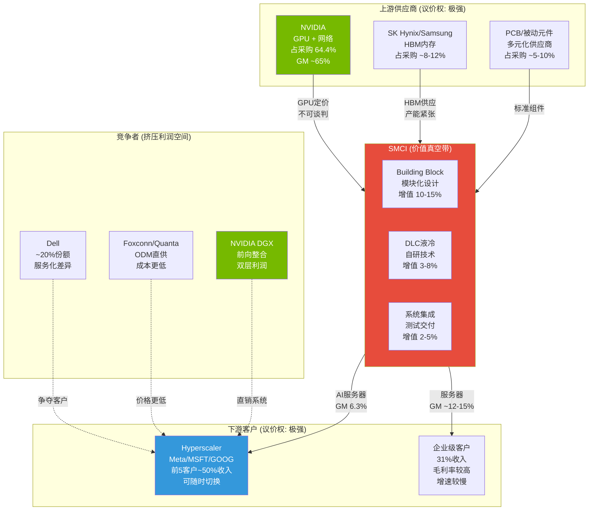

# 第七章 产业链纵深: GPU分配权力学与价值真空带

> SMCI在AI服务器产业链中的位置，像一个被两块磁铁夹在中间的铁片——上游NVIDIA控制着70-80%的BOM定价权，下游Hyperscaler拥有随时切换供应商的自由。收入可以在这条链上流过，但利润无法驻留。

---

## 7.1 上游供应链 — NVIDIA分配权力学

### 依赖度量化: 从30.7%到64.4%的加速锁定

SMCI对NVIDIA的采购依赖度正在以令人不安的速度攀升。根据SMCI 10-K FY2025披露，NVIDIA占SMCI总采购额的64.4% [硬数据: FY2025供应商集中度 | DM-BIZ-14]。将这个数字放入时间序列:

| 财年 | NVIDIA占采购比 | 变化 | 背景 |
|------|--------------|------|------|
| FY2023 | ~15-20% | 基期 | AI服务器尚非主营 |
| FY2024 | 30.7% | +10-15pp | AI服务器收入占比快速上升 |
| FY2025 | 64.4% | +33.7pp | AI GPU平台占收入>90% [DM-BIZ-07] |
| FY2026E | ~70%+ | +5-10pp | [合理推断: 随GB200/NVL72出货量放大] |

这不是收敛趋势(即"增长后依赖度会自然下降")，而是**加速发散趋势**。FY2024到FY2025的单年跳升幅度(+33.7pp)超过了所有分析师的预期。背后的结构性原因很清晰: 当AI GPU平台从SMCI收入的~50%上升至>90% [DM-BIZ-07]，而GPU占AI服务器BOM的70-80% [DM-INF-002来源]，数学上NVIDIA占采购比不可能低于60%。

第二大供应商仅占采购额5.1% [硬数据: FY2025 10-K | DM-BIZ-15]——大概率为SK Hynix或Micron(HBM内存供应商)。NVIDIA与第二大供应商之间的浓度差距高达59.3个百分点，这在S&P 500成分股中几乎找不到可比案例。

**关键含义**: 64.4%的供应商浓度意味着NVIDIA对SMCI拥有的不仅是定价权，而是**存亡决定权**。2024年会计危机期间，NVIDIA将部分SMCI订单转移至其他供应商 [硬数据: | DM-BIZ-21]，这一举措证明了: NVIDIA可以单方面将SMCI的收入"调拨"给竞争对手，而SMCI没有任何反制手段。

### GPU分配优先级: 看不见的等级制度

NVIDIA的GPU分配机制是AI服务器行业最不透明但影响最深远的权力结构。虽然NVIDIA从未公开披露分配规则，但从行业信息可以推导出大致的优先级逻辑:

**Tier 0 — NVIDIA自有系统(DGX/SuperPOD)**: NVIDIA自2022年开始大幅扩展DGX系统的直销业务。GB200 NVL72系统单rack定价$3.0-3.9M [合理推断: 基于行业数据和TrendForce分析]，NVIDIA将最优先的产能留给自有品牌是经济理性的——因为自有系统的毛利率远高于将GPU卖给OEM。

**Tier 1 — ODM直供(Foxconn/Quanta)**: 据行业分析数据，Foxconn在NVL72系统中占据约52%的组装份额 [合理推断: 基于行业供应链分析]。ODM之所以获得优先分配，是因为Hyperscaler(如Meta)倾向于通过ODM直接采购以压低成本——NVIDIA配合大客户的采购偏好，自然优先分配给ODM。

**Tier 2 — 品牌OEM(SMCI/Dell/HPE)**: SMCI在NVIDIA供应链体系中的定位是Tier 2 OEM [合理推断: 基于NVIDIA供应链分层分析]。这意味着SMCI的GPU获取量不取决于SMCI自身的需求，而取决于**NVIDIA在满足Tier 0和Tier 1需求后的剩余产能**。

这个分层体系解释了一个关键现象: 为什么SMCI的AI服务器市场份额从2022-2023年的~50-80%急剧下滑至2025年的7-10% [DM-BIZ-22]。当GPU供应充裕时(2022-2023)，SMCI凭借速度优势率先出货，看起来像是"市场领导者"。但当GPU供应紧张(2024-2025 Blackwell时代)，分配机制显现真实优先级——SMCI只能拿到Tier 0/1消化不完的部分。

### 定价权力学: GPU成本的不可压缩性

GPU是AI服务器BOM中最大的单一成本项，占比70-80%。SMCI在这个最大成本组件上几乎没有任何议价能力:

| BOM组件 | 占比(估) | 供应商 | SMCI议价权 | 理由 |
|---------|---------|--------|-----------|------|
| GPU (Blackwell/Rubin) | 70-80% | NVIDIA独占 | 极低(1/5) | 垄断供应,无替代 |
| HBM内存 | 8-12% | SK Hynix/Samsung/Micron | 低(2/5) | 寡头供应,产能紧张 |
| 网络(InfiniBand/NVLink) | 3-5% | NVIDIA(Mellanox) | 极低(1/5) | 与GPU捆绑 |
| PCB/被动元件 | 2-4% | 多元化供应 | 中等(3/5) | 可多源采购 |
| 机箱/电源/散热 | 5-10% | SMCI自制+关联方 | 高(4/5) | 自有设计制造 |
| DLC液冷系统 | 3-8% | SMCI自制 | 高(5/5) | 自研核心技术 |

[合理推断: BOM拆分基于GPU服务器行业公开数据和浪潮对标分析]

**结构性定价权不对称**: SMCI只在BOM的10-15%部分(机箱/电源/散热/DLC)拥有真正的定价主动权。而在占BOM 85-90%的核心组件上，价格完全由上游供应商决定。这与传统制造业的"规模带来议价权"逻辑完全相反——SMCI越大，采购越多NVIDIA的GPU，但议价权丝毫不增加，因为NVIDIA是垄断供应商。

### 前向整合威胁: NVIDIA DGX的经济学

NVIDIA的前向整合已不是假设性威胁，而是正在发生的现实。DGX SuperPOD和GB200 NVL72整机系统通过NVIDIA直销渠道出货，与SMCI的产品形成直接竞争。

**经济学对比**:
- **NVIDIA DGX直销**: NVIDIA既赚GPU芯片的利润(~65% GM)，又赚系统集成的利润(~45% GM估计) → 双层利润堆叠
- **通过SMCI间接销售**: NVIDIA只赚GPU芯片利润(~65% GM)，系统集成利润由SMCI获取(6-11% GM) → 单层利润

[合理推断: DGX系统毛利率基于NVIDIA数据中心业务整体毛利率推算]

从NVIDIA的角度看，每一台DGX直销系统相比通过SMCI间接销售，NVIDIA多赚约30-40%的毛利润。唯一阻止NVIDIA完全前向整合的因素是: (1) 产能瓶颈——NVIDIA的系统制造能力远不如SMCI/Dell的全球产能; (2) 客户多样性——企业客户需要定制化程度高于DGX标准配置的产品; (3) 渠道覆盖——NVIDIA没有Dell/HPE级别的全球服务网络。

但这些因素正在弱化: NVIDIA FY2026的系统级收入预计达到$60-80B(占总收入的~30-40%) [主观判断: 基于NVIDIA数据中心业务结构推算]，表明前向整合在加速而非减速。

### 替代供应商可行性: AMD MI300X的现实检验

理论上，AMD的MI300X/MI325X GPU可以减少SMCI对NVIDIA的依赖。SMCI确实同时支持AMD和NVIDIA平台——但替代的现实远比理论复杂:

| 维度 | NVIDIA (CUDA) | AMD (ROCm) | 差距 |
|------|-------------|-----------|------|
| 软件生态 | CUDA: 20年+,数百万开发者 | ROCm: ~5年,生态早期 | 代际差距 |
| 训练性能 | H200/B200 benchmark标杆 | MI300X~90-95% H100水平 | 接近但非超越 |
| 客户接受度 | 默认选择 | 需额外说服 | 巨大差距 |
| 供应稳定性 | 紧张但可预测 | 产能较充裕 | AMD优势 |
| ASP/利润率 | 更高ASP → SMCI收入高 | 较低ASP → SMCI收入低 | 各有利弊 |

SMCI向AMD转向的核心障碍不在硬件层面，而在客户端: Hyperscaler的AI训练流水线已深度锁定CUDA生态，更换GPU意味着重写和重新优化大量训练代码。SMCI可以同时提供AMD和NVIDIA平台，但客户的选择权在客户手中——而目前客户绝大多数选择NVIDIA。

[主观判断]: AMD对SMCI的意义更多是**战略保险**(让NVIDIA知道SMCI有替代方案)而非**实际替代**(短期内不会显著降低NVIDIA采购占比)。SMCI的NVIDIA采购占比在FY2027之前不太可能降至60%以下。

### 其他上游组件: HBM与网络的双重锁定

除GPU外，AI服务器的另外两个关键上游组件同样面临供应集中问题:

**HBM(高带宽内存)**: SK Hynix占全球HBM市场~53%，Samsung ~38%，Micron ~9%。HBM产能在2025-2026年依然紧张，交期长达6-12个月。每颗Blackwell GPU需要配套6-8颗HBM3E芯片，意味着GPU分配和HBM分配是联动的——SMCI无法单独获取更多HBM来加速出货。

**网络(InfiniBand/NVLink)**: NVIDIA通过2020年收购Mellanox垄断了AI训练集群的高速互联市场。InfiniBand交换机和NVLink互联是NVIDIA GPU集群的必需组件，且只有NVIDIA供应。这进一步加深了SMCI对NVIDIA的绑定——不仅GPU由NVIDIA定价，连网络互联也由NVIDIA控制。



**图7-1: SMCI在AI服务器产业链中的位置** — 上游NVIDIA(绿色)拥有65%毛利率和定价权；SMCI(红色)处于价值真空带，仅在10-15%的BOM上有增值空间；下游Hyperscaler(蓝色)拥有随时切换供应商的自由。NVIDIA DGX(绿色)代表前向整合威胁，直接绕过SMCI面向下游。

---

## 7.2 下游客户 — Hyperscaler议价权

### 客户集中度: 少数巨头决定命运

SMCI的客户集中度问题在FY2025-FY2026期间急剧恶化:

| 指标 | FY2024 | FY2025 | Q2 FY2026 |
|------|--------|--------|-----------|
| 前5大客户占比 | ~40% | ~50% | ~60%(估) |
| 最大单一客户占比 | 未超10% | >10% | ~63% |
| 大型数据中心客户数 | 未披露 | 4家 | 目标6-8家 |

[硬数据: Q2 FY2026单客户63%来自空头分析; 大客户数量4→6-8 | DM-BIZ-16]

Q2 FY2026的$12.68B创纪录收入中，约63%来自单一客户 [合理推断: 基于空头研究数据]。这意味着一个客户贡献了约$8B的季度收入。如果这个客户在下一季度减少订单50%，SMCI将直接损失~$4B收入——相当于整个FY2023一半以上的年收入。

管理层的应对策略是扩大大客户基数(从4家到6-8家) [硬数据: | DM-BIZ-16]，但新增客户的获取时间线在12-18个月以上，而单客户集中度的风险是即时的。更本质的问题是: SMCI有多大能力**拒绝**大客户的低价订单? 当一个客户贡献63%收入时，"以合理价格拒单"不是一个现实选项——这就是为什么Q2 FY2026的GM降至6.3%历史最低 [DM-BIZ-09]。

### Hyperscaler自建趋势: 结构性替代威胁

Top 5 Hyperscaler的2026年CapEx预计合计$660-690B [合理推断: 基于行业供应链分析]，但这笔巨额投入中，流向GPU服务器(即SMCI可触达的部分)的比例正在下降:

| Hyperscaler | 自研芯片 | 状态 | 对SMCI的影响 |
|-------------|---------|------|------------|
| Google | TPU Trillium(v6) | 大规模部署中 | 高: 减少GPU服务器采购 |
| Amazon | Trainium3 | 2026量产 | 高: 自有AI训练基础设施 |
| Microsoft | Maia 100 | 2025-2026量产 | 中: 仍大量采购NVIDIA |
| Meta | Sequoia/MTIA v2 | 推理部署中 | 中: 训练仍依赖NVIDIA |
| Oracle | 无自研 | 纯采购 | 低: 持续需要GPU服务器 |

[DM-BIZ-39]

**关键洞察**: 自研芯片不会在2-3年内完全替代NVIDIA GPU(训练工作负载仍高度依赖CUDA生态)，但它在边际上不断侵蚀GPU服务器的TAM。更重要的是，自研芯片改变了Hyperscaler的心态——从"必须买GPU服务器"变为"如果价格合理才买GPU服务器"。这种心态转变进一步强化了下游的议价权。

ASIC(Application-Specific Integrated Circuit,包括TPU/Trainium等)在AI训练芯片市场的份额预计从2024年的~15%上升至2026年的~27.8% [合理推断: 基于TrendForce行业数据]。即使GPU份额绝对值仍在增长(因为TAM扩大)，ASIC的崛起意味着GPU服务器组装商可触达的市场在相对萎缩。

### 企业级市场: 高利润但受限的增长引擎

企业级/渠道客户占SMCI收入约31% [硬数据: Q1 FY2026 | DM-BIZ-02]，且毛利率显著高于Hyperscaler业务:

- **Hyperscaler毛利率**: 约4-6% [合理推断: 基于Q2 FY2026整体GM 6.3%中Hyperscaler占>60%推算]
- **企业级毛利率**: 约12-16% [合理推断: 基于历史GM~15-18%和当前整体GM加权反推]

企业级业务是SMCI利润率结构中的"净化器"——它拉高了整体GM。但问题在于: (1) 企业级AI服务器市场的增速远低于Hyperscaler(~20-30% vs ~60-80% YoY); (2) Dell和HPE在企业级市场的品牌信任度、服务能力和渠道覆盖远强于SMCI。SMCI在企业级市场的增长更多是"AI浪潮水涨船高"而非主动抢夺份额。

### 客户定价压力: 招标竞争的利润率绞肉机

Hyperscaler的AI服务器采购通常通过大规模招标(RFP/RFQ)进行，SMCI、Dell、HPE及ODM(Foxconn/Quanta)同台竞标。在这个过程中:

1. **GPU成本透明**: 所有竞标者从NVIDIA采购的GPU价格基本一致(NVIDIA统一定价)，因此竞标的"可变差异"仅在10-15%的非GPU组件上
2. **竞标压力**: 当GPU成本占80%且对所有竞标者一致时，10%的非GPU报价差异只能影响总价的1-2%。但就是这1-2%的价差，决定了谁赢得订单——SMCI被迫将这部分利润压缩到极限
3. **ODM基线**: Foxconn/Quanta作为ODM的制造成本结构性低于SMCI(更低的劳动力成本、更大的规模效应、更低的SGA) [DM-BIZ-25]，它们的报价设定了行业价格下限，迫使SMCI在一个本已薄利的空间继续让利

[主观判断]: 招标竞争是SMCI GM从FY2023的18.0%压缩至Q2 FY2026的6.3%的主要操作性机制 [DM-FIN-018, DM-BIZ-09, DM-BIZ-28]。只要Hyperscaler继续通过多供应商招标采购(而非单一指定供应商)，这个压力就不会消失。

---

## 7.3 "价值真空带"定位分析

### Porter五力框架应用

将Porter五力模型应用于SMCI在AI服务器市场的竞争定位:

| 竞争力量 | 强度 | 评分(1-5) | 关键驱动因素 |
|---------|------|----------|------------|
| **上游议价权** | 极强 | 5/5 | NVIDIA垄断GPU(64.4%采购)，定价不可谈判，分配优先级由NVIDIA决定 |
| **下游议价权** | 极强 | 5/5 | 前5客户占~50%+收入，单客户63%(Q2)，转换成本低，ODM提供替代 |
| **现有竞争者** | 强且加强 | 4/5 | Dell(~20%份额)品牌+服务，HPE政府/Sovereign AI，ODM价格优势 |
| **新进入者威胁** | 中偏高 | 3.5/5 | ODM直供模式降低进入壁垒；但DLC/Building Block仍有门槛 |
| **替代品威胁** | 中等 | 3/5 | Hyperscaler自研芯片(TPU/Trainium)减少GPU服务器需求 |
| **综合竞争强度** | **极高** | **4.1/5** | 五力中两个评分满分(上下游)——行业结构性不利 |

```mermaid
radar
    title SMCI Porter五力强度 (1=弱/有利, 5=强/不利)
    "上游议价权": 5
    "下游议价权": 5
    "现有竞争者": 4
    "新进入者威胁": 3.5
    "替代品威胁": 3
```

**图7-2: SMCI Porter五力雷达图** — 上游和下游议价权同时达到最高强度(5/5)，形成典型的"价值真空带"格局。综合强度4.1/5表明行业结构对SMCI极度不利。

### "价值真空带"概念: 利润的物理学

"价值真空带"(Value Vacuum Zone)描述的是产业链中某个环节虽然不可或缺(收入流过)，但无法保留经济价值(利润无法驻留)的定位。SMCI符合所有特征:

1. **高收入流量**: FY2026E收入$40B+ [DM-BIZ-08]——巨额资金流经SMCI的银行账户
2. **低价值截留**: GM 6.3% [DM-FIN-010] → 每$100收入仅截留$6.3毛利润
3. **上游垄断定价**: NVIDIA控制70-80% BOM，定价由NVIDIA单方决定
4. **下游自由切换**: Hyperscaler可以在SMCI/Dell/HPE/ODM间轻松切换
5. **无差异化壁垒**: 基于NVIDIA参考设计的服务器在功能上高度同质化 [DM-BIZ-34]

**经济学本质**: 在一个完美竞争市场中，中间商的利润率趋近于零。SMCI当前6.3%的GM虽不是零，但已经接近**GPU服务器组装的经济学下限**。浪潮信息在完全不同的芯片生态(华为Ascend)下也收敛至6.85%的GM [合理推断: 基于浪潮信息FY2024财报对标]，这不是巧合——它是组装商在强上游+强下游夹击下的均衡利润率。

### 与Dell的对比: "逃逸速度"vs "引力陷阱"

Dell Technologies提供了一个极具启发性的对照:

| 维度 | SMCI | Dell | 含义 |
|------|------|------|------|
| AI服务器GM | ~6.3% (Q2 FY26) | ~10-12%(估) | Dell在相同GPU上赚更多 |
| 服务收入占比 | ~1% | ~30%+ | Dell的利润来源更多元化 |
| 企业客户关系 | 弱(品牌信任待修复) | 极强(40年+积累) | Dell在企业级有定价权 |
| 全球服务网络 | 有限(19个工厂) | 全球覆盖 | Dell提供全生命周期支持 |
| 软件/管理层 | BMC/IPMI(基础) | Dell OpenManage(成熟) | Dell可交叉销售软件 |
| 金融服务 | 无 | Dell Financial Services | Dell提供租赁/融资 |
| EV/GP | ~9.4x | ~6-8x | SMCI反而**更贵** |

[DM-VAL-006, DM-BIZ-23]

Dell在AI服务器市场的利润率比SMCI高的原因并非Dell的硬件成本更低，而是Dell通过**服务化叠加**(service layering)为每台服务器附加了额外的利润来源: 安装/配置服务 + 运维合同 + 软件许可 + 金融服务。这些"非硬件"收入的毛利率在50-70%区间，远高于硬件的6-12%。

Dell创造了"逃逸速度"——通过服务化差异化，将自身从纯硬件组装的"引力陷阱"中拉出。SMCI至今仍被困在这个陷阱中。

### 类比: SMCI是高端版富士康?

这个类比尖锐但有分析价值:

| 维度 | 富士康(Hon Hai) | SMCI | 相似度 |
|------|---------------|------|--------|
| 上游依赖 | Apple(~50%收入) | NVIDIA(64.4%采购) | 高 |
| 毛利率 | ~6-7% | 6.3%(Q2) | 极高 |
| 核心技能 | 精密制造+速度 | Building Block+速度+DLC | 中高 |
| 客户集中 | 极高(Apple主导) | 极高(单客户63%) | 高 |
| 自有品牌尝试 | 有(Sharp等,效果有限) | 有(DLC/BMC,待验证) | 中 |
| 市值/收入 | ~0.3-0.5x | ~0.48x(FY26E) | 高 |

[DM-BIZ-25]

相似度令人不安。但有一个关键差异: 富士康在消费电子组装领域拥有绝对的规模优势(年收入$2,000B+)，这种规模本身构成壁垒。SMCI在AI服务器领域没有这种规模壁垒——Dell的全球产能和Foxconn的制造效率都可以轻松匹配或超越SMCI。

[主观判断]: 如果SMCI无法通过DLC液冷和服务化实现差异化(§7.4分析)，其长期命运就是"AI服务器领域的富士康"——高收入、低利润、高波动、低估值。

---

## 7.4 交叉销售与服务化机会

### 服务化差距: 1% vs 30%的结构性鸿沟

SMCI与Dell在服务化收入上的差距不是"正在缩小的暂时差异"，而是"需要多年投资才能开始弥合的结构性鸿沟":

| 维度 | SMCI | Dell Technologies | 差距 |
|------|------|------------------|------|
| 服务收入占比 | ~1% | ~30%+ | ~30x |
| 服务团队规模 | 有限(5,684总员工) [DM-BIZ-20] | 全球数万人 | ~10-20x |
| 服务合同类型 | 基础保修 | ProSupport/ProDeploy/Managed | 品类差距 |
| 年化经常性收入(ARR) | 可忽略 | $数十亿 | 代际差距 |
| 服务毛利率 | 不可分拆 | ~50-65% | — |

为什么SMCI的服务收入如此之低? 核心原因是客户结构: OEM/大数据中心客户(占收入68% [DM-BIZ-01])通常拥有自己的IT运维团队，不需要外部服务支持。Hyperscaler(Meta, Google等)的数据中心工程师比任何供应商都更了解自己的系统。相比之下，Dell的企业级客户(中型企业、政府、医疗)严重依赖供应商的部署、运维和升级服务。

**服务化悖论**: SMCI要增加服务收入，就需要扩大企业级客户基础；但企业级市场增速慢于Hyperscaler市场，且Dell/HPE的渠道优势几乎不可逾越。反过来，如果SMCI继续聚焦Hyperscaler，服务收入占比就不可能显著提升——因为Hyperscaler不需要(也不会支付)额外服务费。

### BMC/管理软件: 被低估的差异化潜力

SMCI的BMC(Baseboard Management Controller)和IPMI(Intelligent Platform Management Interface)管理软件是一个有潜力但尚未变现的资产:

- **当前状态**: SMCI自研BMC提供远程监控、固件更新、硬件诊断等基础功能。这是SMCI相对ODM(Foxconn/Quanta使用NVIDIA标准BMC)的一个技术差异化点
- **变现潜力**: BMC可以演化为"数据中心运营系统"(DCOS)——整合电力监控、温度管理、工作负载调度和预测性维护。如果SMCI能将BMC发展为类似Dell OpenManage的平台级产品，它可以基于安装基数(install base)创造软件订阅收入
- **现实障碍**: (1) Hyperscaler通常使用自有管理平台(如Google Borg)，不依赖供应商BMC; (2) 企业客户更信任Dell/HPE的成熟管理生态; (3) SMCI的软件工程投入远低于硬件(R&D/GP仅31.1% [DM-FIN-043]，且主要投向硬件设计)

[主观判断]: BMC的差异化潜力是真实的，但SMCI在1-2年内将其转化为有意义的收入贡献(>5%收入)的概率很低。这是一个3-5年的长期选项，而非短期催化剂。

### DLC即服务: 液冷全生命周期的商业模型

DLC液冷是SMCI最具差异化的技术资产 [DM-BIZ-31]，也是最有可能催生服务化收入的领域:

**DLC全生命周期价值链**:

| 阶段 | 服务内容 | 定价模式(潜在) | 当前变现情况 |
|------|---------|-------------|------------|
| 设计 | 数据中心液冷系统规划 | 咨询费 | 免费(换取硬件订单) |
| 部署 | 管道安装+冷却液充注+调试 | 项目费 | 部分变现(捆绑硬件) |
| 运维 | 冷却液监测+管道维护+泄漏检测 | 年费合同 | 基本未变现 |
| 升级 | 冷板更换+系统扩容 | 项目费 | 基本未变现 |
| 退役 | 冷却液回收+管道拆除+再利用 | 项目费 | 未来需求 |

[合理推断: 基于DLC产业发展阶段推导]

SMCI当前DLC产能3,000 racks/月 [DM-BIZ-18]，行业液冷比率45%(最高) [DM-BIZ-31]。当GPU TDP趋向1000W+(Blackwell Ultra/Rubin时代) [DM-BIZ-37]，DLC从"可选配置"变为"物理刚需"——风冷在120kW/rack以上已经不再可行。这为SMCI创造了一个独特的服务化窗口:

**DLC即服务的经济学假设(每1,000 racks)**:
- 硬件收入(DLC组件): ~$200-500M(一次性) [合理推断]
- 年度运维合同(3-5年): ~$20-50M/年 [合理推断]
- 累计服务收入(5年): ~$100-250M
- **服务/硬件比**: ~20-50%(远低于Dell的比例，但远高于SMCI当前~1%)

如果SMCI能在3年内将安装基数中30%的DLC客户转化为年度运维合同，这可能为年收入贡献$500M-$1B的高毛利率服务收入(GM~40-50%)。虽然相对$40B+的总收入占比仍小(1-2.5%)，但对毛利润的贡献可能达到5-10%。

**核心挑战**: SMCI历史上一直是"卖硬件然后走人"的商业模型。转向服务化需要完全不同的组织能力——客户成功团队、远程监控平台、备件库存管理、SLA保障体系。以SMCI当前5,684名员工 [DM-BIZ-20] 的规模，建立全球服务网络需要大量投资和至少2-3年的建设期。

### 关联方交易: 服务化投资的"机会成本"

Ablecom(CEO兄弟Steve Liang持股28.8%，CEO及配偶持股10.5%)和Compuware(CEO另一兄弟Bill Liang任CEO)在3年内从SMCI获取$983M采购额 [DM-MGT-006]。Ablecom US出口的99.8%和Compuware US出口的99.7%流向SMCI [硬数据: Hindenburg Research | DM-MGT-006]。

这些关联方交易的问题不仅是治理层面的(§另章讨论)，还有**资源配置层面的含义**:

$983M(3年)≈ $328M/年。如果这笔资金中哪怕20%被重新配置用于: (1) 建立全球服务团队; (2) 开发BMC管理软件平台; (3) 投资DLC运维基础设施——SMCI的服务化进程可能已经远超当前水平。

[主观判断]: 关联方交易是否以市场公允价格进行，这个问题留给审计师和监管机构。但从战略角度看，$983M/3年的关联方采购与SMCI~1%的服务收入占比形成了鲜明对比——公司在硬件供应链上的"内部闭环"可能以牺牲服务化战略投资为代价。

---

## 本章核心发现

**发现一: NVIDIA依赖度正在加速而非收敛**。从FY2024的30.7%到FY2025的64.4%，SMCI对NVIDIA的采购浓度以年均+30pp的速度上升。这不是可以通过"供应商多元化"解决的问题——当AI GPU平台占收入>90%时，NVIDIA占采购60%+是数学必然。SMCI的命运与NVIDIA的分配意愿高度绑定。

**发现二: "价值真空带"定位已被量化确认**。Porter五力分析显示上游和下游议价权同时达到最高强度(5/5)——这是教科书级别的"利润不可能驻留"结构。浪潮信息在完全不同的芯片生态下收敛至相同水平(6.85% GM)，证明这是行业结构性约束而非SMCI的个体问题。

**发现三: Dell已通过服务化实现"逃逸速度"，SMCI仍困在"引力陷阱"中**。Dell通过30%+的服务收入占比和全球服务网络，将AI服务器业务从纯组装模式提升为"硬件+服务"混合模式。SMCI的1%服务收入占比意味着它几乎完全依赖硬件毛利率——而这恰好是被上下游挤压最严重的部分。

**发现四: DLC液冷是SMCI最有希望的"逃逸路径"，但窗口期有限**。DLC-2 120kW/rack技术、45%液冷比率、12-18个月领先——这些优势是真实的 [DM-BIZ-31]。但Dell/HPE/Schneider/VRT都在大举投资液冷(ETN通过Boyd收购已进入该领域)。SMCI需要在2-3年内将DLC技术优势转化为服务化收入和客户锁定，否则这个窗口将关闭。

**发现五: 关联方交易可能正在消耗服务化投资的资源**。$983M/3年的Ablecom/Compuware采购额与几乎为零的服务化投资形成对比。即使关联方交易完全合规，它们代表的资源配置方向(硬件供应链内循环)与SMCI最需要的战略方向(服务化+软件化)背道而驰。

> **回到核心矛盾**: 产业链纵深分析强化了thesis_crystallization的核心判断——SMCI的增长是真实的，但价值被产业链结构性榨取。64.4%的NVIDIA采购浓度+63%的单客户收入浓度+6.3%的毛利率，构成一个相互强化的"价值真空"三角。除非DLC液冷能创造足够的差异化和服务化收入来打破这个三角，否则"增收不增利"将是SMCI的长期宿命而非短期阵痛。
