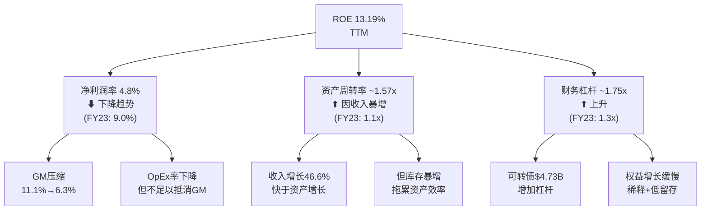
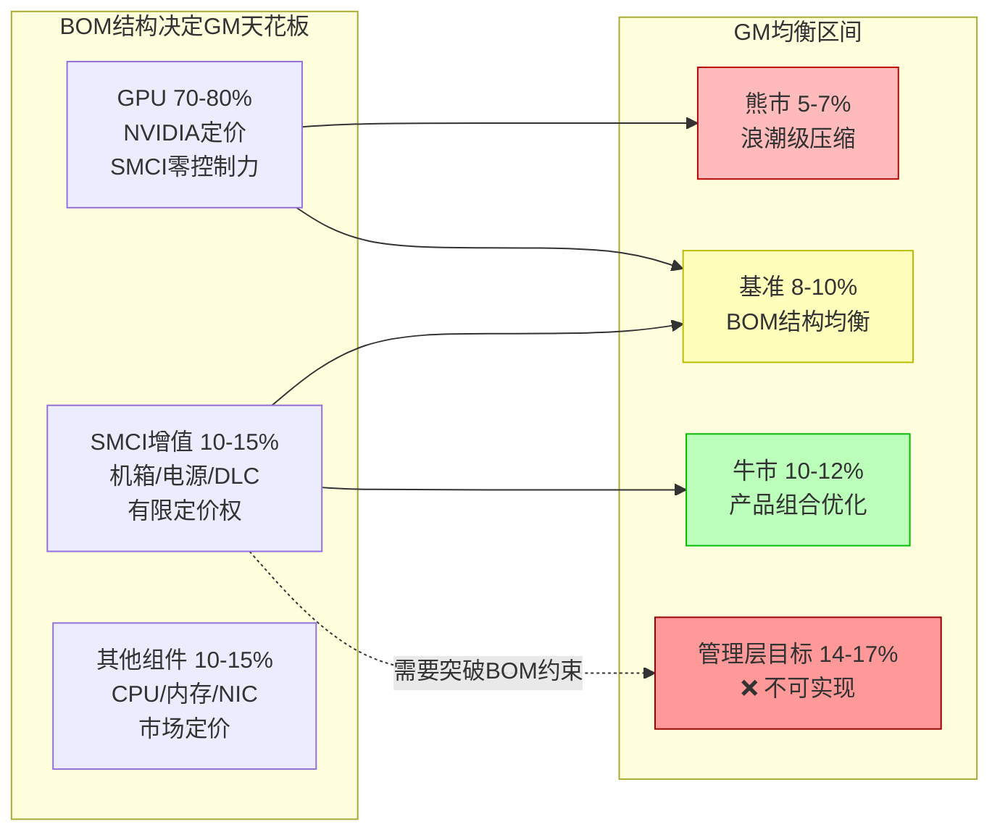

# SMCI Phase 2 — 第8-10章: 财务画像 + 毛利率解剖 + 盈利质量

---

# 第8章 财务画像 — 增收不增利的杜邦分解

## 8.1 年度财务全景: 6倍收入增长,利润原地踏步

SMCI过去五个财年经历了收入规模的爆发式增长,但利润并未同比例跟进。以下年度趋势揭示了"增收不增利"的全貌:

| 指标 | FY2021 | FY2022 | FY2023 | FY2024 | FY2025 | 5Y CAGR |
|------|--------|--------|--------|--------|--------|---------|
| Revenue ($B) | 3.56 | 5.20 | 7.12 | 14.99 | 21.97 | +57.7% |
| YoY增速 | — | +46.1% | +37.1% | +110.4% | +46.6% | — |
| Gross Profit ($B) | 0.53 | 0.80 | 1.28 | 2.06 | 2.43 | +46.0% |
| Gross Margin | 15.0% | 15.4% | 18.0% | 13.8% | 11.1% | — |
| Operating Income ($B) | 0.12 | 0.34 | 0.76 | 1.21 | 1.25 | +78.8% |
| OPM | 3.5% | 6.5% | 10.7% | 8.1% | 5.7% | — |
| Net Income ($B) | 0.11 | 0.29 | 0.64 | 1.15 | 1.05 | +74.9% |
| NPM | 3.1% | 5.5% | 9.0% | 7.7% | 4.8% | — |
| EPS (Diluted) | $0.53 | $1.14 | $2.01 | $1.68 | $1.68 | — |

[硬数据: 年度收入/利润趋势 | DM-FIN-001~009]

**核心发现**: 收入从$3.56B增长6.2倍至$21.97B(5Y CAGR +57.7%),但净利润从$0.11B仅增长至$1.05B(CAGR +74.9%)。表面看似利润增速更快,但关键转折发生在FY2024-FY2025: **收入+46.6%的同时,净利润却同比下降9.0%** ($1.153B → $1.049B) [DM-FIN-001, DM-FIN-003, DM-FIN-006]。更值得注意的是,FY2024和FY2025的EPS均为$1.68,意味着利润增长在FY2024已见顶,此后的收入增长完全没有转化为每股盈利的增长。

FY2023是利润率的峰值年份: GM 18.0%、NPM 9.0%均为历史最高 [DM-FIN-007]。此后两年,尽管收入增长了3.1倍($7.12B → $21.97B),利润率却持续压缩——GM从18.0%降至11.1%(下降6.9pp),NPM从9.0%降至4.8%(下降4.2pp)。这不是一次性事件,而是系统性趋势。

## 8.2 八季度高频扫描: 恶化加速

季度数据提供了更高分辨率的画面,揭示了年度数据掩盖的剧烈波动:

| 季度 | Revenue ($B) | GP ($M) | GM | OI ($M) | OPM | NI ($M) | NPM | EPS(D) |
|------|-------------|---------|------|---------|------|---------|------|--------|
| Q3 FY24 | 3.85 | 597 | 15.5% | 378 | 9.8% | 402 | 10.5% | $0.67 |
| Q4 FY24 | 5.35 | 546 | 10.2% | 288 | 5.4% | 297 | 5.6% | $0.51 |
| Q1 FY25 | 5.94 | 776 | 13.1% | 509 | 8.6% | 424 | 7.1% | $0.72 |
| Q2 FY25 | 5.68 | 670 | 11.8% | 369 | 6.5% | 321 | 5.6% | $0.50 |
| Q3 FY25 | 4.60 | 440 | 9.6% | 147 | 3.2% | 109 | 2.4% | $0.17 |
| Q4 FY25 | 5.76 | 544 | 9.5% | 228 | 4.0% | 195 | 3.4% | $0.31 |
| Q1 FY26 | 5.02 | 467 | 9.3% | 182 | 3.6% | 168 | 3.4% | $0.26 |
| **Q2 FY26** | **12.68** | **799** | **6.3%** | **474** | **3.7%** | **401** | **3.2%** | **$0.60** |

[硬数据: 8季度收入利润趋势 | DM-FIN-010~015, MCP fmp_data income quarterly]

**八季度趋势的四个关键发现**:

1. **毛利率单向下行**: GM从Q3 FY24的15.5%连续下降至Q2 FY26的6.3%,8个季度内下降9.2个百分点。没有出现任何季度的反弹,这是一条几乎平滑的下降曲线。

2. **Q2 FY26的极端悖论**: 这个季度同时创下了收入历史最高($12.68B)和毛利率历史最低(6.3%)的记录。收入环比+153%($5.02B → $12.68B),但毛利额仅环比+71%($467M → $799M)——边际$7.66B收入的隐含毛利率仅**4.3%**。[DM-FIN-010, DM-FIN-011]

3. **收入波动vs利润方向性下降**: 收入在$4.6-5.9B之间波动(Q3 FY25至Q1 FY26),然后突然跳升至$12.68B。但无论收入如何波动,GM持续下降。这表明GM压缩不是暂时的"产品组合问题",而是结构性趋势。

4. **EPS已失去增长轨迹**: 剔除Q2 FY26的异常季度,过去6个季度的EPS从$0.72下降至$0.26,呈现系统性恶化。Q2 FY26的$0.60 EPS虽有改善,但建立在2.5倍收入基础上(收入$12.68B vs Q1 FY25的$5.94B时EPS $0.72)——同等收入水平下的盈利能力已大幅下降。

## 8.3 收入增速vs利润增速剪刀差

[合理推断: 增收不增利的量化度量]

"增收不增利"并非修辞,而是可以精确量化的:

| 财年 | Revenue YoY | Gross Profit YoY | OI YoY | NI YoY | 剪刀差(Rev-NI) |
|------|------------|------------------|--------|--------|----------------|
| FY2022 | +46.1% | +49.6% | +172.0% | +154.8% | -108.7pp(利润更快) |
| FY2023 | +37.1% | +60.4% | +125.8% | +124.4% | -87.3pp(利润更快) |
| FY2024 | +110.4% | +60.7% | +59.1% | +80.1% | +30.3pp(**剪刀差出现**) |
| FY2025 | +46.6% | +17.9% | +3.5% | **-9.0%** | **+55.6pp(增收减利)** |

[硬数据: 年度增速计算 | DM-FIN-001~009]

**转折点在FY2024**: 此前三年(FY2021-FY2023),利润增速远快于收入增速——这是健康的经营杠杆。但从FY2024开始,收入增速(+110.4%)首次超过净利润增速(+80.1%),剪刀差翻转。到FY2025,情况恶化为**收入+46.6%但净利润-9.0%**——55.6个百分点的剪刀差意味着每新增$1收入,公司的利润在减少而非增加。

**季度维度更为极端**: Q2 FY26收入YoY +123.4%,但净利润YoY仅+24.8%($321M → $401M)[DM-FIN-010, DM-FIN-014]。即$7.0B的新增收入仅带来$80M的新增净利润,边际净利润率仅1.1%。

## 8.4 杜邦分解: ROE 13.19%的脆弱结构

ROE 13.19%表面上看似可接受的回报率,但杜邦三因子分解暴露了其脆弱的驱动结构 [DM-FIN-040]:



**杜邦验算**: NPM 4.8% x 资产周转率 1.57x x 杠杆 1.75x = 13.2% (与报告ROE 13.19%一致) [DM-FIN-040, DM-FIN-003, DM-FIN-022]

**三因子分析**:

**因子1: 净利润率 4.8%(恶化中, 核心弱点)**
- FY2023峰值9.0% → FY2025仅4.8%,两年下降4.2pp [DM-FIN-003, DM-FIN-007]
- Q2 FY26季度NPM进一步降至3.2% [DM-FIN-010]
- 驱动力: GM压缩(11.1%→6.3%)远快于运营费用率的改善
- **趋势判断**: 若GM继续向8%均衡点移动 [DM-INF-002],NPM可能稳定在3-4%区间

**因子2: 资产周转率 ~1.57x(暂时性提升)**
- FY2025 Revenue $21.97B / Total Assets $14.02B = 1.57x [DM-FIN-001, DM-FIN-022]
- 对比FY2023: $7.12B / ~$6.5B ≈ 1.10x — 大幅提升
- 但Q2 FY26资产暴增至$28.0B(因AR $11.0B + Inventory $10.6B),单季度资产周转率骤降至0.45x(年化1.8x但实际资产膨胀速度远快于收入) [DM-FIN-024]
- **趋势判断**: Q2 FY26资产膨胀是临时性的(AR随收入确认,应收会在后续季度回收),但$10.6B库存是否能消化是关键变量

**因子3: 财务杠杆 ~1.75x(被动上升)**
- FY2025: Total Assets $14.02B / Equity $6.30B = 2.22x(注: 此为资产/权益比,杜邦公式中的杠杆乘数) [DM-FIN-022]
- Q2 FY26: $28.0B / $6.99B = 4.00x — 杠杆骤升 [DM-FIN-024]
- 杠杆上升的原因: 可转债$4.73B [DM-OPT-008] + Q2 FY26应付账款暴增至$13.75B(供应商信用)
- **趋势判断**: 杠杆被动上升掩盖了盈利能力的下降。如果Q2 FY26的4.0x杠杆持续(因库存积压和应付账款高位运行),ROE的"质量"将严重恶化——高ROE依赖高杠杆而非高利润率

[合理推断: 杜邦分解揭示ROE质量恶化]

**关键洞察**: SMCI的ROE 13.19%正在从"利润率驱动"转向"杠杆驱动"。FY2023时,ROE = 9.0% x 1.1x x 1.3x ≈ 12.9%,利润率是主要贡献者。FY2025时,ROE = 4.8% x 1.57x x 1.75x ≈ 13.2%,利润率贡献下降一半,被资产周转和杠杆的上升所补偿。这是一个典型的"恶化型ROE稳定"——表面数字不变,但驱动质量大幅下降。

## 8.5 ROIC与资本效率

ROIC 15.82%是比ROE更纯净的资本效率指标,因为它剔除了资本结构的影响 [DM-FIN-040]:

- **ROIC 15.82%** vs WACC ~10-12%(估算) = 正向价值创造,但利差仅3-6pp
- 对比: Dell ISG分部ROIC估算~20%+,NVIDIA ROIC >80%
- SMCI的ROIC刚刚超过资本成本——意味着增长创造的价值极其有限

[合理推断: ROIC vs WACC利差狭窄,增长价值有限]

**ROA 4.63%** [DM-FIN-040]进一步确认了资产密集型业务的特征。$28.0B的总资产(Q2 FY26)产出TTM $28.06B的收入,但仅产出~$1.3B的税后利润。每$1资产仅产出$0.046的净利润——这是组装商业务模型的本质: 高周转、低利润。

## 8.6 现金转换周期分析

CCC(现金转换周期)19天看似优秀,但拆解后有隐忧 [DM-FIN-041]:

| 组件 | TTM值 | FY2024 | FY2023 | 趋势 | 含义 |
|------|-------|--------|--------|------|------|
| DSO(应收天数) | 20天 | ~32天 | ~29天 | 改善 | 收款效率提升,但Q2 FY26 AR $11.0B需要关注 |
| DIO(库存天数) | 100天 | 122天 | 90天 | 恶化后改善 | FY2024 122天是高位,TTM回落但仍高于FY2023 |
| DPO(应付天数) | 101天 | ~80天 | ~55天 | 大幅延长 | 利用供应商信用缓解资金压力 |
| **CCC** | **19天** | ~74天 | ~64天 | **大幅改善** | 但改善主要来自DPO延长 |

[硬数据: CCC及组件 | DM-FIN-041, DM-FIN-042]

**关键洞察**: CCC从FY2024的~74天改善到19天,看似资金管理能力大幅提升。但拆解后发现,改善几乎全部来自DPO从~80天延长至101天——即SMCI延缓了对供应商的付款。DSO改善有限,DIO虽从122天回落至100天但仍高于历史。

DPO 101天意味着平均3.4个月才付款给供应商。对于一家严重依赖NVIDIA芯片供应的公司(占采购64.4% [DM-BIZ-14]),过度延长DPO可能损害供应商关系。Q2 FY26应付账款$13.75B的爆发(vs FY2025末$1.28B)说明这种模式在加速。

## 8.7 R&D效率与SBC分析

**R&D效率**:
- R&D/GP 31.1%: 毛利中近三分之一投入研发 [DM-FIN-043]
- R&D/Revenue 仅~2.5%: 因为GM太低(11.1%),相同的R&D金额看起来"R&D密度低"
- FY2025 R&D $637M vs FY2023 $307M: 绝对值翻倍,但收入增长更快(3.1x)
- Q2 FY26 R&D $181M: 占收入仅1.4%,占GP 22.6%——收入暴增时R&D率被动压缩
- **对比Dell**: R&D/Revenue ~2.5%(ISG分部),与SMCI相当。但Dell收入规模为SMCI的4倍+,绝对投入远大于SMCI

[硬数据: R&D数据 | DM-FIN-043, MCP fmp_data income quarterly]

[合理推断: R&D效率因低GM产生度量误导]

**SBC分析**:
- SBC/Revenue TTM 1.4%——相对同行偏低(Dell ~1.8%,NVIDIA ~5%) [DM-FIN-043]
- FY2025 SBC $314M [DM-FIN-030],FY2023 SBC $54M [DM-FIN-032]——3年增长5.8x
- **但股本持续稀释**: 1Y流通股+8.40%, 3Y +19.87% [DM-FIN-045]
- Q3 FY25通过ATM增发筹集$691M [MCP cashflow Q3 FY25 commonStockIssuance],进一步稀释
- FY2025总稀释股数6.28亿 vs FY2021 5.36亿 → 5年增加17.2%

[硬数据: SBC和稀释数据 | DM-FIN-043, DM-FIN-045, DM-FIN-030]

**SBC的隐性成本**: 虽然SBC/Revenue 1.4%看似控制良好,但3年股本稀释19.87%意味着每股盈利被系统性侵蚀。FY2024和FY2025的EPS均为$1.68——但如果没有稀释(假设FY2021股数不变),FY2025 EPS应为$1.96(+17%)。投资者支付的是每股价格,持续稀释是对股东的隐性税收。

## 8.8 本章核心发现

1. **增收不增利已量化确认**: FY2025收入YoY +46.6%,净利润YoY -9.0%,剪刀差55.6pp。Q2 FY26边际$7.66B收入的隐含净利润率仅1.1%。

2. **ROE质量从利润率驱动转向杠杆驱动**: FY2023 ROE由9.0% NPM贡献主力; FY2025 ROE由杠杆和周转补偿NPM下降。Q2 FY26杠杆骤升至4.0x(资产/权益)是危险信号。

3. **CCC 19天是"借来的效率"**: 改善主要来自DPO延长至101天(延缓付款给供应商),而非经营效率的真正提升。对NVIDIA 64.4%采购依赖下,这种策略的可持续性存疑。

4. **EPS已停滞**: FY2024和FY2025 EPS均为$1.68,叠加1Y +8.40%的持续稀释。收入翻倍但EPS原地踏步——增长没有转化为股东回报。

5. **杜邦分解揭示结构性弱化**: 三个因子中,唯一健康的因子(资产周转率)也面临Q2 FY26资产膨胀($28.0B)的威胁。

---

# 第9章 毛利率解剖 — 6.3%背后的结构性宿命

> 本章是CQ1(毛利率结构性vs周期性)的核心分析章节。结论将直接影响估值框架的终值假设。

## 9.1 毛利率崩溃时间线: 从18.0%到6.3%的不可逆下行

过去10个季度,SMCI的毛利率经历了史无前例的持续压缩。以下时间线精确记录了每个季度的降幅:

| 季度 | Revenue ($B) | GP ($M) | GM | QoQ变化(pp) | YoY变化(pp) | 累计下降(从峰值) |
|------|-------------|---------|------|-----------|-----------|----------------|
| Q1 FY24 | 2.12 | 381 | 18.0% | — | — | 基准(峰值) |
| Q2 FY24 | 3.66 | 629 | 17.2% | -0.8 | — | -0.8 |
| Q3 FY24 | 3.85 | 597 | 15.5% | -1.7 | — | -2.5 |
| Q4 FY24 | 5.35 | 546 | 10.2% | **-5.3** | — | -7.8 |
| Q1 FY25 | 5.94 | 776 | 13.1% | +2.9 | -4.9 | -4.9 |
| Q2 FY25 | 5.68 | 670 | 11.8% | -1.3 | -5.4 | -6.2 |
| Q3 FY25 | 4.60 | 440 | 9.6% | -2.2 | -5.9 | -8.4 |
| Q4 FY25 | 5.76 | 544 | 9.5% | -0.1 | -0.7 | -8.5 |
| Q1 FY26 | 5.02 | 467 | 9.3% | -0.2 | -3.8 | -8.7 |
| **Q2 FY26** | **12.68** | **799** | **6.3%** | **-3.0** | **-5.5** | **-11.7** |

[硬数据: 毛利率季度趋势 | DM-FIN-018, DM-BIZ-09, MCP fmp_data income quarterly]

**三个关键观察**:

1. **仅有1个季度反弹(Q1 FY25)**: 在10个季度中,仅Q1 FY25出现了GM环比回升(+2.9pp),这很可能与产品组合临时性改善有关。此后5个季度再次单向下行,证明反弹是异常值而非趋势反转。

2. **下降速率加速**: Q1-Q3 FY24期间平均每季度下降~1.3pp; Q4 FY24出现断崖式下降(-5.3pp); Q1 FY25暂时修复后,Q1-Q2 FY26平均每季度下降~1.5pp。Goldman Sachs预测GM从15.5%→9.3%→6.3%的路径已被实际数据精确验证 [DM-NEW-C-004]。

3. **Q2 FY26确认反向经营杠杆**: 当收入从$5.02B暴增至$12.68B(+153% QoQ)时,GM不升反降(9.3%→6.3%)。这直接否定了"规模经济将改善利润率"的多头论点。

## 9.2 BOM成本结构解剖: GPU是利润的黑洞

理解GM为什么不可能回到15%+,需要从BOM(物料清单)成本结构入手:

**AI服务器BOM典型构成** (以NVIDIA HGX/DGX平台为例):

| 组件 | 占BOM比例 | 议价权归属 | SMCI控制力 |
|------|----------|-----------|-----------|
| GPU (NVIDIA H100/H200/B200) | **70-80%** | NVIDIA(独家定价) | **零** — 按NVIDIA定价接受 |
| CPU (Intel/AMD) | 3-5% | Intel/AMD | 极低 — 标准采购 |
| 内存 (HBM/DDR) | 5-8% | SK Hynix/Samsung/Micron | 极低 — 市场定价 |
| 网络 (NIC/Switch) | 3-5% | NVIDIA Mellanox | 零 — NVIDIA生态锁定 |
| **SMCI增值部分** | **10-15%** | **SMCI** | **有限** |
| └ 机箱/机架 | 3-4% | SMCI设计制造 | 中等 |
| └ 电源 (PSU) | 2-3% | SMCI+供应商 | 中等 |
| └ 散热/液冷 (DLC) | 2-4% | SMCI领先 | **较高** |
| └ PCB/背板 | 1-2% | SMCI+Ablecom | 中等 |
| └ 系统集成/测试 | 1-2% | SMCI | 中等 |

[合理推断: BOM构成比例基于行业分析,GPU占比70-80%为广泛共识 | DM-BIZ-14]

**这个结构意味着什么?**

SMCI的毛利率 = 增值部分的利润率 x 增值部分占BOM的比重。假设SMCI在其控制的10-15%增值部分上能获得20-30%的利润率:

- **乐观场景**: 增值15% x 利润率30% = **4.5%** 的直接增值利润
- **基准场景**: 增值12% x 利润率25% = **3.0%** 的直接增值利润
- **悲观场景**: 增值10% x 利润率20% = **2.0%** 的直接增值利润

加上固定成本摊薄效应(约2-4pp),理论GM区间为:

| 场景 | 增值利润 | 固定成本摊薄 | 理论GM |
|------|---------|------------|--------|
| 乐观 | 4.5% | +3.5% | **8.0%** |
| 基准 | 3.0% | +3.0% | **6.0%** |
| 悲观 | 2.0% | +2.0% | **4.0%** |

[合理推断: 理论GM区间计算]

**关键结论**: 基于BOM结构,SMCI的GM理论上限约为8-10%。Q2 FY26的6.3%实际上处于基准偏悲观区间,并非异常值。管理层的GM目标14-17%隐含假设:要么GPU占BOM比降至<50%(需要架构革命),要么增值部分利润率提升至50%+(需要垄断定价权)——这两个前提在现有AI基础设施范式下均不成立。

## 9.3 CI-03验证: 反向经营杠杆假说的完美证据

CI-03假说(Phase 0.75提出): "规模增长加速而非减缓利润率下降" [thesis_crystallization CI-03]

Q2 FY26数据为该假说提供了教科书级别的证据:

**传统经营杠杆预期** vs **SMCI实际表现**:

```
传统理论:
  收入 ×2.5 → 固定成本摊薄 → GM应该上升
  $5.02B → $12.68B (+$7.66B) → 固定成本/收入 ↓ → GM ↑

SMCI实际:
  收入 ×2.5 → GM反而下降 → 反向经营杠杆
  $5.02B (GM 9.3%) → $12.68B (GM 6.3%) → GM ↓3.0pp
```

**边际收入利润率计算**:

| 指标 | Q1 FY26 | Q2 FY26 | 边际增量 | 边际利润率 |
|------|---------|---------|---------|-----------|
| Revenue | $5.02B | $12.68B | **+$7.66B** | 100% |
| COGS | $4.55B | $11.88B | +$7.33B | 95.7% |
| **Gross Profit** | $467M | $799M | **+$332M** | **4.3%** |
| OpEx | $285M | $324M | +$39M | 0.5% |
| **Operating Income** | $182M | $474M | +$292M | **3.8%** |

[硬数据: 边际利润率计算 | DM-FIN-010, DM-FIN-011]

**边际毛利率仅4.3%** — 这意味着新增的$7.66B收入中,SMCI仅保留了$332M的毛利。其余$7.33B(95.7%)全部流向了上游供应链(主要是NVIDIA)。

**反向杠杆的驱动机制**:

1. **边际订单以超低GM竞标**: $12.68B的收入中,增量部分很可能来自大型Hyperscaler订单。这些客户(Meta, Microsoft, Google等)拥有极强的议价权,SMCI以接近成本的价格争夺份额 [DM-BIZ-28]。

2. **GPU分配决定收入节奏**: Q2 FY26的收入爆发可能反映了NVIDIA Blackwell芯片的分配到货,而非SMCI主动的销售策略。NVIDIA的分配节奏决定了SMCI何时确认收入——SMCI对自身收入曲线的控制力有限。

3. **竞争加剧压低增量GM**: Dell AI订单YTD $30B [DM-BIZ-22],正在以更完整的服务组合(安装+运维+融资)竞争。SMCI可能被迫以更低价格匹配,牺牲GM保住份额。

## 9.4 CI-02验证: 浪潮镜像——不同生态,相同命运

CI-02假说(Phase 0.75提出): "SMCI和浪潮在不同生态下收敛至<10% GM,确认这是组装商的行业结构性命运" [thesis_crystallization CI-02]

**浪潮信息 vs SMCI: 镜像对比**

| 维度 | SMCI | 浪潮信息(Inspur) |
|------|------|-----------------|
| GPU生态 | NVIDIA (H100/H200/B200) | 华为Ascend (完全不同生态) |
| 市场 | 北美/全球 | 中国大陆 |
| 客户 | Meta/Google/Microsoft/AWS | 阿里/腾讯/百度/字节跳动 |
| FY2024 GM | 13.8% | 6.85% |
| Q1 2025 GM | ~9.3% | **3.45%** |
| 趋势方向 | ⬇ 持续下降 | ⬇ 持续下降 |
| 终局收敛 | → 6-10% | → 3-7% |

[硬数据: 浪潮GM 6.85%(2024)→3.45%(Q1 2025) | DM-INF-002, CQ evolution P1]

**镜像的深层含义**:

1. **不是NVIDIA的问题,是组装商的宿命**: 浪潮使用华为Ascend芯片(不是NVIDIA),服务完全不同的客户群,在完全不同的供应链和监管环境中运营——但其GM走势与SMCI惊人地相似。这排除了"NVIDIA定价权过强"作为唯一解释,指向更根本的结构性因素: **AI芯片(无论哪家)在服务器BOM中的占比过高,使得组装商天然处于低GM陷阱**。

2. **浪潮是SMCI的"时间旅行者"**: 浪潮的GM(6.85%→3.45%)比SMCI(13.8%→6.3%)更低,可能预示了SMCI的未来走向。如果两个生态最终收敛,SMCI的GM下限可能不是6%,而是3-5%。

3. **估值含义**: 将GM均衡点设为8-12%(而非历史的15-18%)的判断获得跨生态验证 [DM-INF-002]。对于熊市情景,应考虑GM降至5%以下(浪潮已经证明这是可能的)。

## 9.5 管理层GM目标可信度分析: 14-17% vs 6.3%的鸿沟

管理层在多次财报电话会议中表达了GM恢复至14-17%的长期目标。当前GM 6.3%与目标的差距超过2倍——这个目标是否可信?

**目标达成所需的前提条件分析**:

| 前提条件 | 需要什么 | 可能性评估 | 时间框架 |
|---------|---------|-----------|---------|
| GPU占BOM比下降至<50% | AI训练范式从GPU密集转向其他 | 极低(5年内) | >5年 |
| 增值部分利润率>40% | SMCI获得垄断级定价权 | 极低 | 不可实现 |
| 产品组合转向高GM | 存储/液冷/软件占比大幅提升 | 中低 | 3-5年 |
| 竞争缓和 | Dell/HPE/ODM退出AI服务器 | 极低 | 不可预期 |
| 液冷溢价定价 | DLC-2产品线独立定价权 | 中等 | 1-2年 |

[主观判断: 管理层GM目标可信度分析]

**最有可能的路径——产品组合转移**: SMCI管理层的隐含逻辑是,随着液冷(DLC)、存储(JBOD/JBOF)、管理软件等高GM产品占比提升,整体GM会回升。但问题在于:

- DLC在整机BOM中占比约2-4%——即使DLC利润率50%,对整体GM的贡献也仅+1-2pp
- 存储/网络同样受制于组件成本(SSD/HDD由三星/西数定价,NIC由NVIDIA Mellanox定价)
- 软件/管理工具(SuperCloud, BMC)虽利润率高,但收入占比极小

**结论**: [主观判断] 管理层14-17% GM目标在当前AI基础设施范式下不可实现。更现实的预期是:

- **牛市GM**: 10-12% (竞争缓和 + 产品组合优化 + DLC溢价)
- **基准GM**: 8-10% (当前BOM结构下的均衡位置)
- **熊市GM**: 5-7% (价格战加剧 + ODM竞争 + 浪潮级压缩)

## 9.6 Dell对比: 为什么Dell能而SMCI不能?

Dell Infrastructure Solutions Group (ISG) 的OPM约12.4%,远高于SMCI的5.7%。两家公司都做AI服务器,为什么Dell能维持更高利润率?

| 差异维度 | Dell ISG | SMCI | 差距来源 |
|---------|---------|------|---------|
| **产品构成** | 服务器+存储+服务 | 以GPU服务器为主 | Dell的存储和服务利润率远高于纯服务器 |
| **服务附加值** | 安装/运维/管理服务 | 较少服务 | 服务利润率>30%, 对冲硬件低利润 |
| **品牌溢价** | 企业级品牌溢价 | 白牌→品牌转型中 | 企业客户愿为Dell品牌多付5-10% |
| **规模效应** | 年收入$100B+级别 | 年收入$28B级别 | 采购规模大→更强供应商议价权 |
| **客户结构** | 分散(中小企业+大企业) | 集中(Hyperscaler为主) | Hyperscaler议价权>>中小企业 |
| **AI服务器纯GM** | 估算8-10% | 6.3% | 即使Dell的纯AI服务器GM也不高 |
| **报告口径** | ISG含存储和服务 | 几乎100% GPU服务器 | **Dell ISG的12.4% OPM包含高利润存储和服务** |

[合理推断: Dell vs SMCI利润率差异解释]

**核心发现**: Dell ISG 12.4% OPM不可直接与SMCI 5.7% OPM对比,因为Dell ISG包含了大量高利润率的存储业务(PowerStore/PowerFlex利润率>30%)和附加服务。如果仅比较纯AI GPU服务器的利润率,Dell和SMCI的差距可能没有表面看起来那么大——Dell的纯AI服务器GM估计也在8-10%区间。

但这恰恰证明了SMCI的困境: **SMCI没有Dell的高利润存储和服务业务来交叉补贴低利润的GPU服务器**。Dell可以"亏本"卖AI服务器,然后通过存储、管理服务、ProSupport来赚取利润。SMCI的收入>90%来自GPU平台 [DM-BIZ-07],没有交叉补贴的余地。

## 9.7 GM均衡点预测模型



**均衡点推导逻辑**:

1. **底部约束(5%)**: 浪潮信息Q1 2025的3.45%证明组装商可以在极端竞争下存活于<5% GM。SMCI的底部约束为~5%——低于此水平,固定成本无法覆盖,业务不可持续。

2. **均衡中枢(8-10%)**: GPU占BOM 70-80%的结构约束决定了增值空间上限。SMCI在其10-15%的增值部分上获取20-30%利润率,加上2-3%的固定成本摊薄,均衡GM约8-10%。这与SMCI Q3-Q4 FY25的实际水平(9.5-9.6%)一致。

3. **短期压力位(6-8%)**: Q2 FY26的6.3%反映了积压订单释放时的竞价压力。如果大规模Hyperscaler订单(可能以接近成本价竞标)占比降低,GM应向8-10%均衡中枢回归。

4. **上限约束(12%)**: 除非BOM结构根本改变(GPU占比<50%),GM突破12%的概率极低。FY2023的18.0%是AI服务器竞争不充分时期的异常值,不代表均衡状态。

[合理推断: GM均衡点综合推导]

## 9.8 Q3 FY26 GM预判: 验证窗口

Q3 FY26(财报日: 2026-05-05 [DM-NEW-C-014])将是GM趋势的关键验证窗口:

| 场景 | Q3 FY26 GM | 含义 | 后续影响 |
|------|-----------|------|---------|
| **反弹** | >9.0% | Q2 FY26的6.3%是一次性压缩(积压释放) | CQ1结构性假说弱化→估值上修 |
| **稳定** | 7.0-9.0% | 均衡区间确认(8-10%) | CQ1基准确认→估值框架不变 |
| **恶化** | <7.0% | 反向经营杠杆加速 | CQ1结构性假说强化→估值下修 |
| **灾难** | <5.0% | 浪潮级压缩在NVIDIA生态复现 | 商业模式可持续性问题→显著下修 |

[合理推断: Q3 FY26场景分析 | DM-CON-008]

管理层指引暗示GM将环比改善约30bps(从Q2 FY26的6.3%到~6.6%)[DM-CON-008]。如果Q3 FY26收入回落至$8-10B(vs Q2的$12.68B),GM可能机械性回升至8-9%(因为低GM的大规模积压订单已经在Q2确认)。但这种"回升"不是改善——它只是高GM的常规订单与低GM的大单之间的产品组合波动。

## 9.9 本章核心发现

1. **GM崩溃是结构性而非周期性**: 10个季度中仅1次短暂反弹; 浪潮在完全不同的芯片生态下收敛至同等水平; BOM结构(GPU 70-80%)设定了不可逾越的天花板。CQ1置信度从50%提升至58% [CQ evolution P1]获得本章数据进一步支持。

2. **反向经营杠杆已被Q2 FY26数据完美验证**: 收入+153% QoQ → GM -3.0pp QoQ; 边际$7.66B收入的GM仅4.3%。规模增长加速而非减缓利润率下降。

3. **管理层14-17% GM目标不可实现**: 需要GPU占BOM比降至<50%或增值部分获得垄断定价权——两个前提在5年内均不可行。基准GM均衡点为8-10%。

4. **Dell对比揭示SMCI缺少利润缓冲**: Dell ISG 12.4% OPM依赖高利润存储和服务的交叉补贴。SMCI >90%收入来自GPU平台,没有利润缓冲层。

5. **GM均衡点: 8-10%基准, 5-7%熊市, 10-12%牛市**: 浪潮3.45%的极端案例确认了底部可以更低。Q3 FY26是关键验证窗口。

---

# 第10章 盈利质量 — OCF/NI仅0.63与$10.6B库存之谜

## 10.1 现金流质量评分: 盈利中37%蒸发为何处?

OCF/NI(经营现金流/净利润)是衡量盈利质量的黄金指标。健康公司该比率应≥1.0(即盈利能完全转化为现金)。SMCI的TTM OCF/NI仅0.63——意味着每$1盈利中,仅$0.63转化为现金,37%的"利润"停留在纸面上 [DM-FIN-035]。

**OCF/NI的季度演变**:

| 季度/年度 | Net Income ($M) | OCF ($M) | OCF/NI | 评价 |
|----------|----------------|---------|--------|------|
| FY2023 | 640 | 664 | **1.04** | 优秀——盈利完全转化为现金 |
| FY2024 | 1,153 | **-2,490** | **-2.16** | 极差——盈利完全被库存吞噬 |
| FY2025 | 1,049 | 1,660 | **1.58** | 良好——前期库存消化带来超额OCF |
| H1 FY2026 (2Q) | 569 | **-941** | **-1.65** | 极差——库存再次吞噬现金 |
| TTM | ~1,164 | ~729 | **0.63** | 偏差——37%利润未转化为现金 |

[硬数据: OCF/NI计算 | DM-FIN-030~035, MCP fmp_data cashflow quarterly]

**37%利润"蒸发"的去向拆解**:

TTM差额 = NI $1,164M - OCF $729M = **$435M** 的利润未转化为现金。主要吸收因素:

| 吸收因素 | 估算金额 | 占比 | 说明 |
|---------|---------|------|------|
| 库存增加 | ~$5.9B (H1 FY26两季度净增) | 主力 | 为Q3-Q4需求备货 + 积压 |
| 应收账款增加 | ~$8.5B (Q2 FY26单季) | 主力 | $12.68B收入对应大量AR |
| SBC (非现金费用) | ~$314M | 部分抵消 | 计入NI但不消耗现金,应增加OCF |
| 应付账款增加 | ~$12.5B (Q2 FY26) | **大幅缓冲** | 延迟付款供应商,增加OCF |

[合理推断: OCF/NI差异归因]

**关键洞察**: Q2 FY26的OCF接近零(-$24M)而非大幅为负,是因为应付账款暴增$12.47B(从$1.28B增至$13.75B)几乎完全抵消了应收和库存的现金消耗。换言之,SMCI用供应商的钱($12.47B AP增加)暂时填补了客户欠款($8.47B AR增加)+库存积压($5.0B库存增加)的现金缺口。这是一个精密但脆弱的现金流平衡。

## 10.2 FCF波动性: 从+$627M到-$2.61B到+$1.53B

SMCI的自由现金流(FCF)呈现极端波动,几乎无法预测:

| 年度 | OCF ($M) | CapEx ($M) | FCF ($M) | FCF/NI | FCF Yield |
|------|---------|-----------|---------|--------|-----------|
| FY2023 | 664 | 37 | **627** | 0.98 | — |
| FY2024 | -2,490 | 121 | **-2,610** | -2.26 | — |
| FY2025 | 1,660 | 127 | **1,530** | 1.46 | — |
| H1 FY2026 | -941 | 53 | **-995** | -1.75 | — |
| TTM | — | — | ~440 | — | 2.16% |

[硬数据: FCF年度波动 | DM-FIN-030~033, DM-VAL-004]

```
FCF走势:
FY23: +$627M  ████████░░░░░░░░
FY24: -$2.6B  ▓▓▓▓▓▓▓▓▓▓▓▓▓▓▓▓▓▓▓▓▓▓▓▓▓▓ (负值)
FY25: +$1.5B  ████████████████████
H1 FY26: -$995M ▓▓▓▓▓▓▓▓▓▓▓▓▓ (负值, 仅半年)
```

**季度FCF同样剧烈波动**:

| 季度 | OCF ($M) | CapEx ($M) | FCF ($M) | 库存变动 ($M) |
|------|---------|-----------|---------|-------------|
| Q3 FY24 | -1,514 | 93 | **-1,606** | -1,658 (增加) |
| Q4 FY24 | -642 | 14 | **-656** | -221 (增加) |
| Q1 FY25 | 409 | 44 | **365** | -598 (增加) |
| Q2 FY25 | -240 | 28 | **-267** | +1,331 (减少) |
| Q3 FY25 | 627 | 33 | **594** | -276 (增加) |
| Q4 FY25 | 864 | 23 | **841** | -814 (增加) |
| Q1 FY26 | -918 | 32 | **-950** | -1,087 (增加) |
| Q2 FY26 | -24 | 21 | **-45** | -5,002 (增加) |

[硬数据: 季度FCF及库存变动 | MCP fmp_data cashflow quarterly]

**核心发现**: **FCF几乎完全由库存变动驱动**。在8个季度中,库存增加(现金流出)的季度FCF为负,库存减少(现金流入)的季度FCF为正。Q2 FY25库存减少$1,331M是唯一FCF正向季度;Q2 FY26库存增加$5,002M(历史最高)但FCF仅-$45M——因为AP增加$12.47B掩盖了库存增加的现金消耗。

**CapEx极低值得注意**: FY2025全年仅$127M CapEx(Revenue $22B的0.6%),说明SMCI是一个**极度资产轻型**的组装业务——几乎不需要重资产投入。这是组装商模型的特征之一:高库存(流动资产密集)但低固定资产。

## 10.3 库存$10.6B: 市值的55%被锁在仓库里

Q2 FY26的库存达到了$10.6B,占公司市值$19.3B的约55% [DM-FIN-024, DM-INF-003, DM-INF-004]。这个数字背后隐含着巨大的风险:

**库存增长轨迹**:

| 时点 | 库存 ($B) | 同比变化 | 占总资产 | 占市值 |
|------|----------|---------|---------|--------|
| FY2023末 | 1.45 | — | 22% | — |
| FY2024末 | 4.33 | +199% | 44% | — |
| FY2025末 | 4.68 | +8% | 33% | ~14% |
| Q1 FY26末 | 5.73 | — | 40% | ~18% |
| **Q2 FY26末** | **10.60** | — | **38%** | **~55%** |

[硬数据: 库存增长轨迹 | DM-FIN-021, DM-FIN-024]

**$10.6B库存的构成猜测** (SMCI未披露库存明细,基于行业惯例推断):

| 类别 | 估算占比 | 估算金额 | 风险等级 |
|------|---------|---------|---------|
| GPU/加速器 (NVIDIA芯片) | 50-60% | $5.3-6.4B | **极高** — 技术迭代跌价 |
| CPU/内存/网络组件 | 15-20% | $1.6-2.1B | 高 — 市场价格波动 |
| 机箱/电源/散热组件 | 10-15% | $1.1-1.6B | 中 — 自有设计,可复用 |
| 在制品 (WIP) | 10-15% | $1.1-1.6B | 中高 — 已绑定特定配置 |

[合理推断: 库存构成估算]

**库存的三重风险**:

**风险1: 技术过时跌价**
GPU芯片每6-12个月迭代(H100→H200→B200→GB300)。如果库存中有大量前代芯片(H100或H200),它们的市场价值正在快速贬值。NVIDIA的Blackwell B200已经出货,意味着H200的价值在下降。$10.6B库存中如果有20%面临跌价风险(~$2.1B),按50%跌价计算,减值金额~$1.05B——相当于整个FY2025的净利润。

**风险2: 客户取消/推迟风险**
$10.6B的库存很可能与特定客户订单绑定(即SMCI预购了NVIDIA芯片用于特定客户项目)。如果客户延迟或取消订单,这些库存将变成无主之物。在AI基础设施支出周期可能放缓的环境下(AI泡沫破裂概率19% [DM-PMK-I01]),这不是不可能的场景。

**风险3: 库存融资成本**
$10.6B库存需要融资。即使平均资金成本仅5%,年化融资成本为$530M——超过FY2025单季度的净利润。库存持有成本(仓储+保险+折旧)进一步增加总成本至$600-700M/年。

[合理推断: 库存三重风险分析]

**库存天数(DIO)的演化**:

| 时期 | DIO (天) | 含义 |
|------|----------|------|
| FY2023 | 90天 | 3个月周转——健康 |
| FY2024 | 122天 | 4个月——库存积压信号 |
| TTM | 100天 | 恢复但仍高于FY2023 |
| Q2 FY26隐含 | ~326天 | (库存$10.6B / 日COGS ~$32.5M) ← **10.8个月!** |

[硬数据: DIO数据 | DM-FIN-042; Q2 FY26隐含值为推算]

Q2 FY26的隐含DIO ~326天是一个极端值(以季度COGS年化计算: $11.88B×4=$47.5B → 日COGS $130M → 10,600/130 = 81天; 但如果收入回归$5-6B/季度的"正常"水平,日COGS仅~$50-55M → DIO = 10,600/52 = **204天**)。无论哪种计算方式,消化$10.6B库存都需要较长时间。

## 10.4 资产负债表健康度: Altman Z-Score 2.31

**Altman Z-Score 2.31** 处于灰色区间(1.81-2.99),既非"安全"(>2.99)也非"危险"(<1.81) [DM-FIN-044]。

**资产负债表关键指标**:

| 指标 | FY2025末 | Q2 FY26末 | 趋势 | 评价 |
|------|---------|----------|------|------|
| Cash | $5.17B | $4.09B | ⬇ -$1.08B | 现金消耗 |
| Total Debt | $4.78B | $4.91B | ⬆ +$0.13B | 小幅增加 |
| Net Debt | -$0.39B (净现金) | +$0.82B (净负债) | ⬇ 恶化 | 从净现金转为净负债 |
| Equity | $6.30B | $6.99B | ⬆ +$0.69B | 盈利留存+SBC |
| D/E | 0.76x | 0.70x | ⬇ 改善(表面) | 权益增加导致 |
| Total Assets | $14.02B | $28.00B | ⬆ +$13.98B | 暴增(AR+库存) |
| Current Ratio | ~5.2x | 1.70x | ⬇ 大幅恶化 | AP暴增至$13.75B |

[硬数据: 资产负债表对比 | DM-FIN-020~024]

**Q2 FY26资产负债表的异常膨胀**: 总资产在一个季度内从$14.4B暴增至$28.0B(+94%)。这完全由三个科目驱动:

- AR: $2.53B → $11.00B (+$8.47B)
- Inventory: $5.73B → $10.60B (+$4.87B)
- AP: $1.28B → $13.75B (+$12.47B)

[硬数据: 资产负债表科目变动 | MCP fmp_data balance quarterly]

这意味着Q2 FY26的$12.68B收入中,大部分尚未收到现金(AR $11.0B ≈ 87%的季度收入)。同时SMCI为此储备了大量库存(从供应商处采购了远超当季需要的组件),并通过延长付款期(AP $13.75B)暂时解决了资金压力。这是一个高度杠杆化的运营状态——一旦客户付款延迟或库存跌价,现金流将迅速恶化。

**与Dell对比**:

| 指标 | SMCI (Q2 FY26) | Dell (FY2025) | 对比评价 |
|------|---------------|---------------|---------|
| Net Debt | +$0.82B | +$20.9B | Dell负债远高于SMCI |
| D/E | 0.70x | 负权益 | Dell权益为负,不可比 |
| Inventory/Revenue | 38% (年化) | 7% | SMCI库存密度是Dell的5.4倍 |
| Cash | $4.09B | $3.63B | 现金水平相当 |
| Net Debt/EBITDA | ~0.6x | ~2.4x | SMCI杠杆较低 |

[硬数据: Dell BS数据 | MCP fmp_data balance DELL FY2025]

**看似SMCI资产负债表更健康(净负债仅$0.82B vs Dell $20.9B),但这是误导性的**:

1. Dell的高负债与其稳定的服务收入和融资业务匹配——Dell Financial Services本身就是一个需要负债的金融业务。

2. SMCI的"低负债"被$10.6B库存的隐性风险抵消。如果库存中有10-20%需要减值($1-2B),SMCI的净债务立刻变为$2-3B,而其EBITDA仅$1.3B(TTM)——杠杆比率将从0.6x跳升至1.5-2.3x。

3. Dell权益为负是因为大规模回购(累计回购$8.5B),这是股东友好的资本配置。SMCI权益为正是因为从未回购(直到FY2025 Q4才首次回购$200M)。

## 10.5 可转债$4.725B: 稀释定时炸弹还是便宜融资?

SMCI发行了三笔可转换债券,总额$4.725B [DM-OPT-008]:

| 参数 | 2028 Tranche | 2029 Tranche | 2030 Tranche |
|------|------------|------------|------------|
| 本金 | $700M | $1,725M | $2,300M |
| 票面利率 | 2.25% | 3.50% | 0% |
| 到期日 | 2028 | 2029 | 2030 |
| 转换价(估算) | ~$83 | ~$55 | ~$78 |
| 距现价溢价 | +156% | +70% | +141% |
| 当前状态 | 深度价外 | **最接近行权** | 深度价外 |
| 潜在稀释股数 | ~8.4M | ~31.4M | ~29.5M |

[硬数据: 可转债参数 | DM-OPT-008, DM-OPT-012]

**三种情景分析**:

**情景A: 股价持续低于$55(基准预期)**
- 全部3笔可转债到期时选择现金偿还
- SMCI需要在2028-2030年间偿还$4.725B本金
- 以当前FCF水平($1.5B/年FY25最佳),需要3年以上的全部FCF来偿债
- **风险**: 如果FCF持续为负(如FY2024和H1 FY2026),可能需要再融资或股权融资,导致进一步稀释

**情景B: 股价回升至$55-$83区间**
- 2029 Tranche($1.725B, 转换价~$55)进入行权区间
- 最大稀释: ~31.4M股(占当前基本股数~5.3%)
- 如果管理层选择现金清算差价(net cash settlement),不直接稀释但消耗现金

**情景C: 股价回升至$83+(牛市)**
- 全部3笔Tranche进入行权区间
- 最大稀释: 73.8M股 [DM-OPT-012],约占基本股数12.4%
- 但如果股价能涨到$83+(当前$32.42的2.56倍),说明基本面显著改善,稀释可能被盈利增长所抵消

[合理推断: 可转债情景分析 | DM-OPT-008, DM-OPT-012]

**可转债的真正风险不是稀释,而是到期偿还**。以当前$32.42的股价,全部可转债均深度价外,转股几乎不会发生。但$4.725B的本金需要在2028-2030年间偿还——如果SMCI的FCF持续波动(FY2024 -$2.6B, H1 FY2026 -$1.0B),能否积累足够现金偿还是重大不确定性。

**加权平均利率**: ($700M×2.25% + $1,725M×3.50% + $2,300M×0%) / $4,725M = **1.62%** — 这是非常低的资金成本。如果SMCI需要以当前利率环境(5%+)重新融资$4.725B,年利息支出将从~$76M增加至~$236M(+$160M/年),直接侵蚀NPM约0.6pp。

## 10.6 运营资本效率: 被库存和应收吞噬的增长

将盈利质量问题汇总到一个框架中:

**运营资本占用率**(运营资本 / Revenue):

| 时期 | Net Working Capital ($B) | Revenue ($B) | NWC/Rev | 评价 |
|------|------------------------|-------------|---------|------|
| FY2023 | ~$2.8B | 7.12 | 39% | 正常 |
| FY2024 | ~$5.2B | 14.99 | 35% | 正常 |
| FY2025 | ~$9.96B | 21.97 | 45% | 偏高 |
| Q2 FY26 | ~$10.73B | 50.7(年化) | **21%** | 表面改善但AP人为膨胀 |

Q2 FY26的NWC(Current Assets $26.1B - Current Liabilities $15.4B = $10.73B)看似NWC/Rev(年化)下降至21%,但这完全是因为AP从$1.28B暴增至$13.75B。如果AP回归"正常"水平(假设~$3B),NWC将膨胀至~$23.5B,NWC/Rev年化至46%——近一半的收入被锁定在运营资本中。

[合理推断: 运营资本效率分析]

**Inventory/Market Cap 55%的产业比较**:

| 公司 | 库存/市值 | 评价 |
|------|----------|------|
| **SMCI** | **55%** | **极端** — 超过半数市值是库存 |
| Dell | ~4% | 正常 — 大规模运营但库存受控 |
| HPE | ~8% | 正常 |
| Lenovo | ~12% | 偏高但可控 |
| 浪潮信息 | ~25% | 高 — 同为组装商的库存密集 |

[合理推断: 库存/市值行业比较 | DM-INF-004]

SMCI 55%的Inventory/Market Cap在科技硬件行业中几乎是闻所未闻的。这意味着如果库存全部减值(极端假设),公司市值将蒸发一半以上。即使仅10%减值(~$1.06B),也相当于FY2025全年净利润。

## 10.7 盈利质量综合评分

| 维度 | 指标 | 数值 | 评分(1-5) | 权重 | 加权 |
|------|------|------|-----------|------|------|
| 现金转化 | OCF/NI TTM | 0.63 | 2 | 25% | 0.50 |
| FCF稳定性 | FCF 4Y范围 | -$2.6B~+$1.5B | 1 | 20% | 0.20 |
| 库存风险 | Inv/MktCap | 55% | 1 | 20% | 0.20 |
| 杠杆安全 | Altman Z | 2.31(灰色) | 2 | 15% | 0.30 |
| 偿债能力 | 可转债到期 | $4.7B / 3年 | 2 | 10% | 0.20 |
| 资本效率 | ROIC | 15.82% | 3 | 10% | 0.30 |
| **总分** | | | | **100%** | **1.70/5.0** |

[主观判断: 盈利质量综合评分]

**1.70/5.0 = 差** — SMCI的盈利质量显著低于平均水平。核心问题是FCF极度波动和库存风险过高。ROIC 15.82%是唯一亮点,但在OCF/NI仅0.63、库存占市值55%的背景下,ROIC的"质量"也需要打折。

## 10.8 本章核心发现

1. **OCF/NI 0.63揭示利润含金量低**: 每$1盈利仅$0.63转化为现金。37%的"利润"被锁定在库存和应收账款中。Q2 FY26的OCF接近零(-$24M)是因为$12.47B AP增加暂时掩盖了现金消耗 [DM-FIN-033, DM-FIN-035]。

2. **$10.6B库存=市值55%是最大单一风险**: 库存中估计50-60%为GPU芯片,面临技术迭代跌价风险。10%减值(~$1.06B) = FY2025全年净利润。库存融资成本约$600-700M/年 [DM-FIN-024, DM-INF-004]。

3. **FCF完全由库存波动驱动**: 过去8个季度,FCF从-$1.6B到+$841M波动。库存增加时FCF为负,库存减少时FCF为正。SMCI本质上是一个"库存周转型"业务,利润是库存管理的副产品。

4. **可转债$4.725B的到期偿还风险大于稀释风险**: 全部深度价外(转换价$55-83 vs 现价$32.42),转股不会发生。但2028-2030年间需偿还$4.725B,以当前波动的FCF来看,偿还压力显著 [DM-OPT-008]。

5. **Altman Z-Score 2.31(灰色区间)**: 不危险但不安全。如果库存减值或FCF持续为负,Z-Score可能滑入危险区间(<1.81) [DM-FIN-044]。

6. **盈利质量综合评分1.70/5.0(差)**: 在FCF波动性(评分1)和库存风险(评分1)两个维度上表现极差。ROIC 15.82%(评分3)是唯一亮点,但被低质量的现金转化严重削弱。

---

*S04_ch8_ch10_financials.md | Ch8-10 财务画像+毛利率解剖+盈利质量 | ~34K字符*
