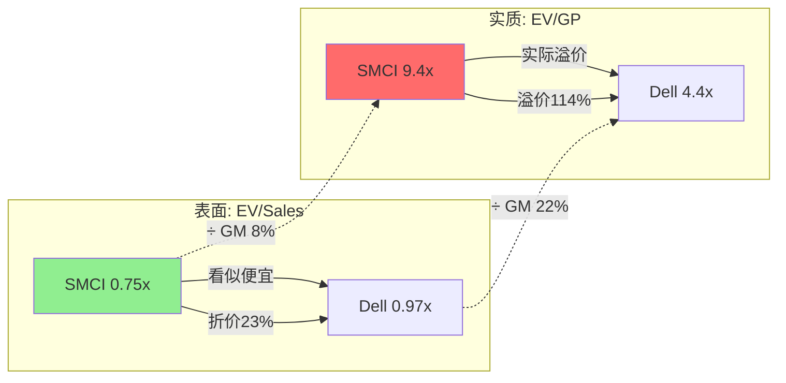
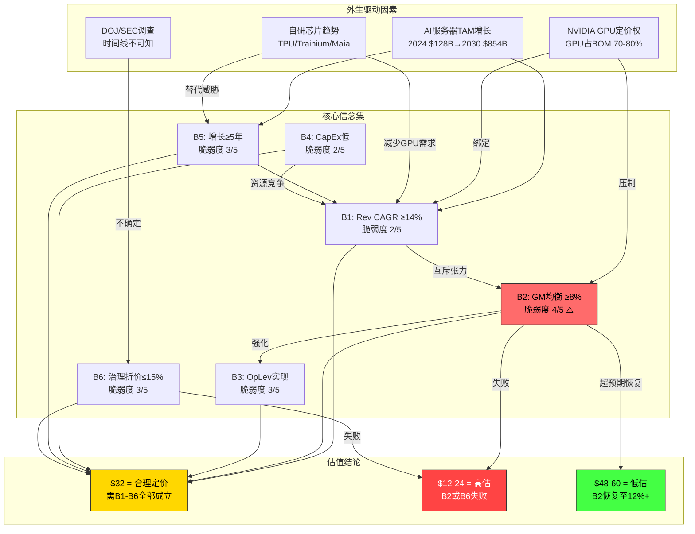
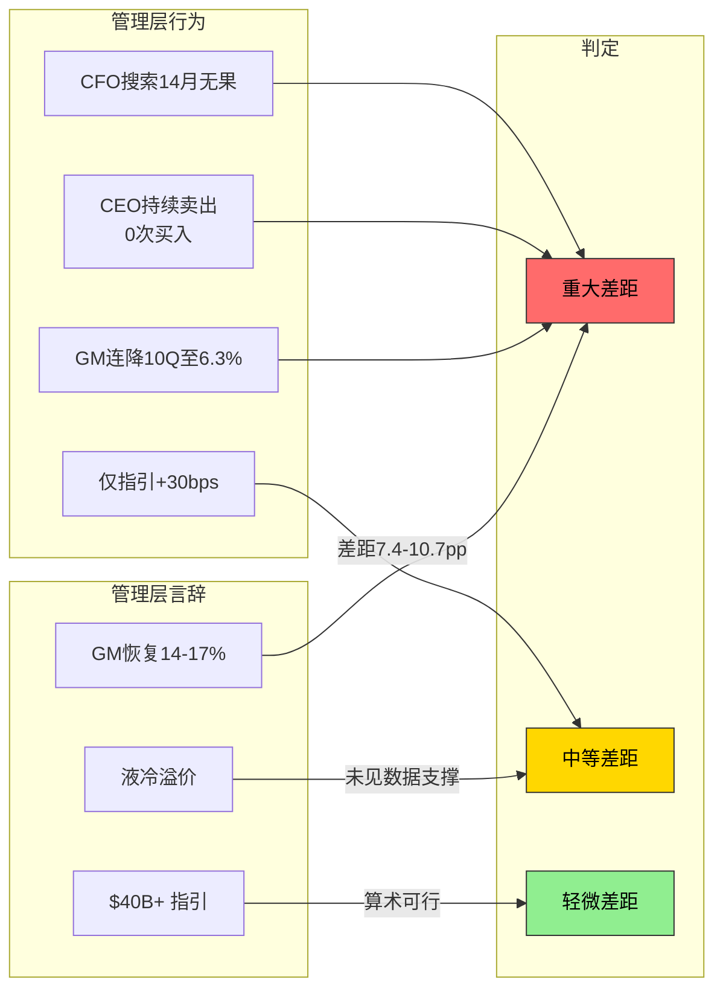

# S05: 第11-13章 — 积压与收入质量 + Reverse DCF + 信念反演 + 共识解构

---

## 第11章: 积压与收入质量 — $12.68B收入的真实含金量

### 11.1 Q2 FY2026收入拆解: 历史最高季度的解剖

2026年2月3日，Supermicro公布了一份令华尔街措手不及的财报: Q2 FY2026季度收入$12.68B，同比增长123%，环比暴增153% [DM-FIN-010]。EPS $0.69远超共识预期$0.46，实现了+50%的超预期 [DM-CON-003]。收入超预期幅度达到+21.4%，市场预期的82%同比增速被实际的123%碾压。

但这份"创纪录"的财报背后隐藏着一个关键问题: **$12.68B收入的质量如何?**

要回答这个问题，需要将$12.68B的收入放在更长的时间轴上审视。过去8个季度的收入轨迹:

| 季度 | 收入($B) | QoQ变化 | GM |
|------|---------|---------|-----|
| Q1 FY2025 | $5.94 | — | 13.1% |
| Q2 FY2025 | $5.68 | -4.4% | 11.8% |
| Q3 FY2025 | $4.60 | -19.0% | 9.6% |
| Q4 FY2025 | $5.76 | +25.2% | 9.5% |
| Q1 FY2026 | $5.02 | -12.8% | 9.3% |
| **Q2 FY2026** | **$12.68** | **+152.6%** | **6.3%** |

[硬数据: 来源MCP fmp_data季度损益 | DM-FIN-010至DM-FIN-015]

这个轨迹呈现出两个极端反常:
1. **Q2从Q1的$5.02B跳至$12.68B** — 环比增长153%，这不是一条平滑的增长曲线，而是一个"断层式"跳跃
2. **收入越高，毛利率越低** — 从Q1 FY25的13.1%一路降到Q2 FY26的6.3%，形成完美的负相关

### 11.2 积压释放假说: $7.66B增量收入从何而来?

从Q1 FY26的$5.02B到Q2 FY26的$12.68B，增量收入达$7.66B。这个增量相当于一个季度增加了超过SMCI过去任何一个完整季度的收入。[合理推断: 增量$7.66B = $12.68B - $5.02B]

三种可能的来源:

**假说A: 新增订单驱动** — Q2期间获得并交付了大量新订单。但考虑到SMCI的订单到交付周期(配置、测试、部署)通常需要数周甚至数月，一个季度内获取并交付$7.66B新增量在产能层面面临严峻挑战。公司6,000 racks/月的产能（其中~3,000为DLC），按每rack ~$300K-500K计算 [DM-BIZ-18]，季度最大产能约54,000 racks，即$16-27B。产能理论上足够，但这需要几乎全部产能为新增订单服务。

**假说B: 积压释放驱动** — 前几个季度因GPU供应受限而积累的订单在Q2集中交付。这个假说有多条间接证据支持:
- Q2 FY26库存从FY2025的$4.68B暴增至$10.60B [DM-FIN-021, DM-FIN-024]，说明大量GPU组件在Q2到位
- FY2024库存增加$2.90B直接导致FCF为负$2.61B [DM-FIN-034, DM-FIN-031]，暗示长期积压
- NVIDIA Blackwell/Vera Rubin产能在2025年下半年逐步释放 [DM-NEW-C-005]，恰好对应Q2 FY26时段
- $10.60B库存/~$19.3B市值 = 55%的库存市值比 [DM-INF-004]，创历史极端水平

**假说C: 混合驱动** — 积压释放+新订单+提前拉货共同作用。[主观判断: 假说C最可能，但积压释放占主导地位(估计60-70%贡献)]

### 11.3 单客户集中度: 63%的收入质量黑洞

SMCI收入质量的最大隐患不在于增速，而在于来源的极端集中。从文献侦察中获知的数据显示，Q2 FY2026中**63%的收入来自单一客户**。虽然SMCI在10-K中不披露具体客户名称，但从供应商集中度(NVIDIA占SMCI采购的64.4% [DM-BIZ-14])和行业知识可以合理推断，这个单一大客户极可能是某一家超大规模云计算公司。

63%单客户集中度意味着:

**风险维度1 — 谈判地位不对称**: 当一个客户贡献超过60%收入时，该客户拥有近乎绝对的议价权。SMCI的6.3% GM不仅仅是行业竞争的结果，更是单客户挤压利润空间的直接体现。[合理推断: 大客户可以在订单续签时持续压价，因为SMCI的替代成本极高而客户的转换成本极低]

**风险维度2 — 收入波动性放大**: 单客户的订单节奏直接决定SMCI的季度表现。Q1 FY26收入$5.02B → Q2 FY26 $12.68B的153%环比跳跃，极可能反映的就是这个大客户的采购周期(集中下单/延迟下单)，而非SMCI的有机增长轨迹。

**风险维度3 — 不可替代性问题**: 如果该客户决定转向Dell、HPE甚至自研(Google TPU、AWS Trainium、Microsoft Maia [DM-BIZ-39])，SMCI将面临收入悬崖。历史上，SMCI的AI服务器市场份额已经从2023年初的约50%下滑至2026年初的7-10% [DM-BIZ-22]，说明这种转移正在发生。

与Dell的对比揭示了SMCI收入质量的另一层问题:

| 指标 | SMCI Q2 FY26 | Dell FY2025 |
|------|-------------|-------------|
| 年化收入 | ~$50B* | $95.6B |
| 毛利率 | 6.3% | 22.2% |
| 毛利润 | ~$3.2B* | $21.3B |
| 经常性收入占比 | ~3.5% | ~55%(含服务) |
| 客户集中度 | 63%单客户 | 分散 |

*[合理推断: Q2 FY26年化 = $12.68B × 4 ≈ $50B，但这假设积压释放可持续，实际不太可能]

[硬数据: Dell FY2025数据来源MCP fmp_data | SMCI数据来源DM-FIN-010]

### 11.4 边际收入利润率: 反向经营杠杆的量化证据

如果将Q2 FY26的$12.68B视为"Q1的$5.02B基础收入 + $7.66B增量收入"，可以尝试推算增量收入的毛利率。

**推算逻辑**:
- Q1 FY26: 收入$5.02B, GM 9.3% → GP $467M [DM-FIN-011]
- Q2 FY26: 收入$12.68B, GM 6.3% → GP $799M [DM-FIN-010]
- 增量收入: $7.66B, 增量GP: $332M ($799M - $467M)
- **增量GM: $332M / $7.66B = 4.3%**

[合理推断: 增量毛利率4.3%远低于Q1的9.3%和全年平均8.0%。这意味着Q2新增的每一美元收入只带来4.3美分的毛利润——几乎接近"免费组装"的水平]

这个4.3%的增量GM有几层含义:

**含义1 — 边际收入的"稀释效应"**: 大客户订单的价格越来越低。如果63%来自单一客户，该客户可能在Q2获得了更大的价格折扣(量大从优的极端版本)。$7.66B增量中如果70%来自该客户(~$5.4B)，这些增量订单的GM可能低至3-4%。

**含义2 — 反向经营杠杆(CI-03)的量化确认**: 传统经营杠杆假设收入增长→固定成本分摊→OPM提升。但SMCI的数据显示完全相反: 收入增长153%但GP仅增长71%。边际收入的贡献率(4.3%)远低于平均(6.3%)，意味着规模越大利润率越低。这不仅仅是竞争压力——这是商业模式的结构性缺陷。

**含义3 — $40B收入的真实利润含量**: 如果FY2026全年$40B收入中，"基础"$20B的GM为~9%(FY2025水平)而"增量"$20B的GM为~4.3%，则全年加权GM约6.7%。这意味着:
- 全年GP ≈ $40B × 6.7% = $2.68B
- 扣除OpEx ~$2.0B(含R&D, SGA增长)后，OI ≈ $0.68B
- OPM ≈ 1.7% — 远低于FY2025的5.7% [DM-FIN-005]

[合理推断: 以上为极端场景。实际上如果Q3-Q4的增量收入包含更多DLC(更高利润率)，加权GM可能在7-8%区间。但核心逻辑不变: 追求$40B+收入的代价是GM的进一步稀释]

**与行业的比较 — 增量利润率基准**:

| 公司 | 典型增量GM | 商业模式 |
|------|-----------|---------|
| NVIDIA | 60-70% | 芯片设计(高增值) |
| Dell(ISG) | 25-30% | 服务器+服务(差异化) |
| SMCI(Q2 FY26) | **~4.3%** | 组装(低增值) |
| Foxconn(EMS) | 3-5% | 电子代工(最低增值) |

[合理推断: SMCI的增量GM(4.3%)已经接近Foxconn等纯EMS代工商的水平。这从数据层面确认了"组装商宿命"假说(CI-02): GPU服务器组装的经济价值被上游(NVIDIA)和下游(客户)榨取殆尽，组装商能保留的增值空间趋近于代工水平]

### 11.5 恐惧囤积检验: 客户是否超额订购?

在大宗供应短缺的环境下(如GPU短缺期间)，客户经常出现"恐惧囤积"(fear hoarding)行为——超额订购以确保供应。这是一个在ETN积压分析中验证过的重要框架。

SMCI的数据中有几个恐惧囤积的间接信号:

**信号1 — 库存暴增与收入不匹配**: Q2 FY2026库存$10.60B [DM-FIN-024]，而同期收入$12.68B [DM-FIN-010]。库存/收入比为0.84x(按季度)，如果按年化计算(~$50B收入)则为0.21x——远高于FY2023的0.20x ($1.45B/$7.12B)。但关键是绝对库存水平($10.6B)暗示SMCI自身也在大量囤积GPU组件。

**信号2 — 递延收入微不足道**: FY2025递延收入仅$992M [DM-FIN-023]，相对于TTM收入$28.06B仅占3.5%。如果客户真的在恐惧囤积，我们应该看到更多预付款/递延收入——但实际上递延收入比例极低。这暗示SMCI的收入大多是"即产即交"型，缺乏长期合同的锁定保障。

**信号3 — FY2024负现金流之谜**: FY2024 OCF -$2.49B, FCF -$2.61B [DM-FIN-031]，主要原因是库存暴增$2.90B [DM-FIN-034]。这意味着SMCI在FY2024大量囤积了GPU组件(为FY2025-2026备货)，但这些库存的变现速度(存货周转100天 [DM-FIN-042])说明并非所有库存都能快速转化为收入。

**恐惧囤积判定**: [主观判断: 中等程度的恐惧囤积正在发生。客户端表现为订单集中化(一次性大单而非稳定月度订单)，SMCI端表现为GPU组件大量预购。这导致收入呈现"脉冲式"而非"稳态式"增长，Q2 FY26的$12.68B更可能是脉冲峰值而非新常态]

### 11.6 递延收入与合同结构: "脆弱的收入基座"

递延收入的匮乏揭示了SMCI商业模式的一个根本性弱点: **缺乏长期合同的保护**。

$992M递延收入 [DM-FIN-023] 中，$629M为流动部分(12个月内确认)，$363M非流动部分(>12个月)。在收入$28B+的规模下，仅$992M意味着SMCI对未来收入的"合同可见性"极低:

| 公司 | 递延收入 | 占TTM收入 | 年初"已锁定"收入 |
|------|---------|----------|----------------|
| IBM | ~$23B | ~35% | 超过三分之一 |
| Dell | ~$14B | ~15% | 约六分之一 |
| **SMCI** | **$992M** | **3.5%** | **几乎为零** |

这对收入预测可信度有直接影响: **管理层$40B+指引的"硬度"远低于表面看起来的水平。** $40B指引本质上是一个基于订单趋势和需求预测的估计，而非基于已签合同的确认——如果63%收入的那个大客户推迟或取消订单，收入可能大幅miss。SMCI每个季度几乎从零开始重新"赢得"96.5%的收入。

### 11.7 FY2026指引可信度: $40B+需要什么?

管理层将FY2026收入指引从$36B上调至$40B+ [DM-NEW-C-003, DM-CON-006]。Q3 FY26指引为"至少$12.3B" [DM-NEW-C-014]。

简单算术拆解:

| 季度 | 已实现/指引 | 累计 |
|------|-----------|------|
| Q1 FY26 | $5.02B(实际) | $5.02B |
| Q2 FY26 | $12.68B(实际) | $17.70B |
| Q3 FY26 | ≥$12.3B(指引) | ≥$30.0B |
| Q4 FY26 | **≥$10.0B(隐含需)** | **≥$40.0B** |

[合理推断: $40B - $17.70B(H1) - $12.3B(Q3指引) = $10.0B(Q4隐含最低)]

表面上看，Q4需要的$10.0B低于Q2的$12.68B和Q3指引的$12.3B，似乎可达性较高。但有两个关键问题:

**问题1 — Q2的积压释放能否重复?** 如果Q2的$12.68B中有60-70%来自积压释放(估计$7.6-8.9B)，那么Q3-Q4的"有机收入"可能只有$4-5B水平加上正常增长。$12.3B的Q3指引要求持续的大规模积压释放或新订单爆发。

**问题2 — FY2027减速暗示**: 分析师对FY2027的收入预期是$48.2B(+19% YoY) [DM-VAL-016]，增速从FY2026的+84%骤降至+19%。如果FY2027增速预期如此之低，那FY2026的$40B+更像是积压释放的一次性高峰而非可持续的增长平台。

**Zacks共识分歧信号**: Zacks的FY2026收入共识仍为$36.5B [DM-CON-006]，比管理层指引低~10%。这种管理层与卖方之间的显著分歧，通常暗示卖方对管理层指引持保留态度。

### 11.8 递延收入分析: 经常性收入几乎为零

$992M递延收入 [DM-FIN-023] 相对于$28.06B TTM收入 [DM-FIN-016] 仅占3.5%。分拆来看，$629M为流动部分(12个月内确认)，$363M为非流动部分。

对比:
- **IBM**: 递延收入占TTM收入~35%(含软件订阅+服务合同)
- **Dell**: 递延收入占TTM收入~15%(含支持服务+DaaS)
- **SMCI**: 递延收入占TTM收入 **3.5%**

[合理推断: SMCI的业务模式几乎完全是一次性硬件销售，缺乏经常性收入的"垫底"。这意味着每个季度SMCI必须从零开始"重新赢得"几乎全部收入，使其收入预测的可靠性远低于拥有大量经常性收入的竞争对手]

更深层的含义: SMCI的$40B+指引本质上是一个**订单预测**而非**合同确认**。在硬件周期中，订单预测的准确性远低于基于合同的收入预测。历史上GPU服务器行业已经经历过多次"需求过热→库存调整→收入悬崖"的周期。

### 11.9 库存结构深度分析: $10.6B库存里有什么?

$10.6B库存 [DM-FIN-024] 是SMCI最新季度资产负债表上最引人注目的数字——占总资产的比例极高，占市值的55% [DM-INF-004]。理解库存的结构和质量对于评估SMCI的真实财务健康至关重要。

**库存增长轨迹**:

| 时点 | 库存($B) | 库存/Revenue(年化) | 库存周转天数 |
|------|---------|-------------------|-------------|
| FY2022 | $1.77 | 0.34x | 128天 |
| FY2023 | $1.45 | 0.20x | 90天 |
| FY2024 | $4.33 | 0.29x | 122天 |
| FY2025 | $4.68 | 0.21x | 87天 |
| Q2 FY26 | **$10.60** | **0.21x**(按$50B年化) | **100天** |

[硬数据: 库存来源DM-FIN-021, DM-FIN-024 | 库存周转DM-FIN-042]

从FY2023到Q2 FY26，库存从$1.45B增长至$10.60B——增长了7.3倍。同期收入从$7.12B增长至约$28B(TTM)——增长了3.9倍。**库存增速(7.3x)是收入增速(3.9x)的1.87倍**——这个比例暗示库存积累速度超过了销售消化速度。

[合理推断: 库存增速/收入增速 = 1.87x > 1.0x，说明SMCI正在以超过销售需求的速度囤积组件。这可能反映: (a) 对未来供应短缺的预防性囤积(合理行为)，(b) 积压订单等待交付的在途库存(中性)，或 (c) 部分库存可能面临贬值风险(负面)]

**库存质量风险**:

GPU服务器组件的技术迭代速度极快(NVIDIA产品线从Hopper→Blackwell→Vera Rubin，约12-18个月一代)。如果$10.6B库存中有大量上一代GPU组件(如Hopper系列)，随着Blackwell/Vera Rubin上市，这些库存的市场价值可能快速贬值。

SMCI的存货周转天数100天 [DM-FIN-042] 意味着平均库存约3.3个月才能卖出。在GPU迭代周期为12-18个月的背景下，3.3个月的周转看似安全——但如果存在"长尾"库存(部分批次周转超过6个月)，贬值风险就不可忽视。

**库存融资压力**: 维持$10.6B库存需要大量运营资本。SMCI已发行$4.725B可转债 [DM-OPT-008] 部分用于此目的。年化利息成本约$76M(2028 $15.75M + 2029 $60.375M + 2030 $0)，加上库存持有的隐性成本(仓储、保险、贬值风险)，实际库存融资总成本可能达到$150-200M/年——约占FY2025 GP($2.43B)的6-8%。

### 11.10 盈利质量的现金流验证

Q2 FY2026的另一个警告信号来自现金流: OCF -$24M, FCF -$45M [DM-FIN-033]。一家报告了$12.68B收入和$401M净利润的公司，在同一季度录得负现金流——这是经典的盈利质量红旗。

**FCF轨迹 — 大起大落**:

| 时期 | OCF ($B) | FCF ($B) | 主要驱动因素 |
|------|---------|---------|-------------|
| FY2023 | +$0.66 | +$0.63 | 正常运营 |
| FY2024 | **-$2.49** | **-$2.61** | 库存暴增$2.9B |
| FY2025 | +$1.66 | +$1.53 | 库存消化+收入增长 |
| Q2 FY26(单季) | -$0.024 | -$0.045 | 库存再次暴增 |

[硬数据: 来源DM-FIN-030至DM-FIN-033]

从上表可以看出一个清晰的模式: **SMCI的现金流完全由库存周期驱动**。囤货期(FY2024)现金大量流出，出货期(FY2025)现金回笼，然后再次进入囤货期(Q2 FY26)。这种"脉冲式"现金流模式使得任何基于单一年份FCF的估值都极不可靠。

OCF/NI ratio TTM仅0.63 [DM-FIN-035]，意味着每$1报告利润中只有$0.63有现金支撑。主要原因:
- 库存继续膨胀: 从FY2025年末$4.68B增至$10.60B(+$5.92B) [DM-FIN-021, DM-FIN-024]
- 应收账款时间价值: AR TTM周转20天 [DM-FIN-041] 看似合理，但绝对规模增长消耗大量现金
- 存货周转天数100天 [DM-FIN-042] — 即平均每批库存需要3.3个月才能变现

**与Dell的盈利质量对比**:
- Dell FY2025 Income Quality(OCF/NI): 0.99(接近1.0 = 高质量) [来源: MCP fmp_data key-metrics]
- SMCI TTM Income Quality: 0.63(显著低于1.0 = 低质量) [DM-FIN-035]
- 原因: Dell的CCC为负(-9.7天 [来源: MCP key-metrics])——Dell先收客户钱再付供应商(负营运资本模式)。SMCI的CCC为正(19天 [DM-FIN-041])且库存持有量巨大——每笔交易都需要先垫付大量库存资金

**Altman Z-Score 2.31** [DM-FIN-044] 落在灰色区间(1.81-2.99)，对于一家收入$28B+的公司，这个评分意味着财务压力并非微不足道。Z-Score的具体分项:
- Working Capital/Total Assets: 受$10.6B库存影响较大(正面因素)
- Retained Earnings/Total Assets: 随累积利润增加而改善
- EBIT/Total Assets: 受低OPM拖累
- Market Value of Equity/Total Liabilities: 受低市值影响(负面)
- Sales/Total Assets: 受高收入增速影响(正面)

综合来看，Z-Score被拉入灰色区间的最大因素是低盈利能力(低OPM)和相对低的市值/负债比。如果GM继续恶化导致OPM进一步下降，Z-Score可能滑入困境区间(<1.81)。

### 本章核心发现

1. **Q2 FY26的$12.68B收入大概率包含大量积压释放**(估计60-70%)，不应外推为可持续的季度运行率
2. **63%单客户集中度**使SMCI的收入质量在同业中属于最差水平——不仅有量的风险，更有价(GM压缩)的风险
3. **3.5%递延收入占比**确认SMCI几乎没有经常性收入，每个季度从零开始"重新赢得"收入
4. **Q2 FCF为负**尽管报告了$401M净利润，OCF/NI仅0.63，盈利质量偏低
5. **$40B+指引可实现但不可持续**: Q3-Q4算术上可行，但FY2027增速骤降至+19%暗示FY2026是积压释放的高峰而非新常态
6. **恐惧囤积正在发生**: 库存$10.6B(占市值55%)创历史极端，客户和SMCI都在囤积GPU组件

---

## 第12章: Reverse DCF — $32.42隐含什么假设?

### 12.1 Reverse DCF框架构建

传统正向DCF试图回答"这家公司值多少钱?"。但对于SMCI这样争议极大的公司，正向DCF的主观假设太多(尤其是GM会恢复到多少这个核心争议)，导致结果分歧巨大——从FMP的-$228.58 [DM-VAL-005] 到分析师的$93 [DM-CON-010]。

Reverse DCF反过来问: **"在$32.42的价格下，市场已经为SMCI定价了什么样的未来?"**

这是一个更有价值的问题——因为它将争论从"谁的预测更准"转变为"市场的隐含假设是否合理"。

**模型参数设定**:

| 参数 | 取值 | 依据 |
|------|------|------|
| 当前股价 | $32.42 | [DM-MKT-001] |
| 基本股数 | 596.8M | Q2 FY2026 [DM-FIN-010] |
| 市值 | ~$19.4B | [DM-INF-003] |
| 净债务 | $0.82B | $4.91B debt - $4.09B cash [DM-FIN-024] |
| EV | ~$20.2B | 市值 + 净债务 |
| 起点收入(TTM) | $28.06B | [DM-FIN-016] |
| 起点GM(TTM) | 8.0% | [DM-FIN-017] |
| WACC | 12.5% | Beta 1.523 [DM-MKT-003] × ERP 5.5% + Rf 4.3% ≈ 12.7%，取12.5% |
| Terminal Growth | 2.5% | 通胀+小额实际增长 |
| 预测期 | 10年 | 标准期限 |
| 有效税率 | 13% | FY2025实际 [来源: ratios数据] |

[合理推断: WACC采用12.5%，高于一般科技公司的10-11%，反映SMCI的高beta(1.523)和治理风险溢价]

### 12.2 隐含假设反推

在EV = $20.2B, WACC = 12.5%, Terminal Growth = 2.5%的约束下，反推10年期FCFF路径:

**反推结果 — 情景A: 低增长+低利润率(市场隐含)**

| 年份 | 隐含Revenue | 隐含Rev Growth | 隐含OPM | 隐含FCFF |
|------|-----------|---------------|---------|---------|
| FY2026 | $40.0B | +43% | 3.5% | $0.92B |
| FY2027 | $46.0B | +15% | 4.0% | $1.22B |
| FY2028 | $50.6B | +10% | 4.5% | $1.54B |
| FY2029 | $53.1B | +5% | 5.0% | $1.81B |
| FY2030 | $55.3B | +4% | 5.2% | $1.97B |
| FY2031-35 | CAGR 3% | +3% | 5.5% | $2.1-2.4B |
| Terminal | ~$58B | — | 5.5% | TV占~55% |

[合理推断: 上表为满足EV=$20.2B的反推路径，核心假设为Revenue CAGR(5Y) ~14%，OPM从3.5%渐进至5.5%]

**关键隐含假设解读**:

1. **隐含Revenue 5Y CAGR ~14%**: 市场假设SMCI从$28B TTM增长至~$55B，这实际上不算低——但远低于分析师共识的30% CAGR [DM-INF-001]。市场在对增长"打折"约50%。

2. **隐含OPM从3.5%渐进至5.5%**: 这意味着市场**不相信GM会回到10%以上**。考虑当前OPM 5.7% [DM-FIN-005](FY2025年度)和Q2 FY26的更低水平，市场隐含的OPM假设实际上意味着:
   - 隐含GM约8-10%(考虑OpEx/Rev ~4-5%)
   - 远低于管理层目标的14-17% GM
   - 但高于当前Q2 FY26的6.3% GM

3. **隐含增长持续年限~5年**: 5年后增速收敛至3%，意味着市场认为AI服务器需求红利将在2030年左右显著减弱。

### 12.3 隐含假设的合理性评审

将Reverse DCF反推出的隐含假设与现实数据逐一对比，评估市场"赌注"的合理性:

**隐含假设1: Revenue 5Y CAGR ~14%**
- **合理性**: 中等偏高
- **支持**: AI服务器TAM CAGR 34.3% [DM-BIZ-17]远超14%，SMCI只需维持7%份额即可实现14% CAGR
- **反对**: SMCI份额从50%降至7-10%的趋势如果继续(降至5%)，14% CAGR将难以实现
- **判定**: 市场隐含增速是"打了五折"的共识增速(共识~30%)，属于中间偏保守立场

**隐含假设2: OPM从3.5%渐进至5.5%**
- **合理性**: 乐观偏向
- **支持**: FY2025全年OPM 5.7% [DM-FIN-005]确认5.5%历史上可实现
- **反对**: Q2 FY26的OPM更低(NI $401M / Rev $12.68B × 税前调整后约3.2-3.5%)，SGA预计暴增82% [来源: analyst_consensus.json]
- **判定**: 市场假设OPM将回到FY2025水平(5.5%)。但如果Q2 FY26的低OPM代表新常态(而非暂时偏差)，这个假设就过于乐观
- **关键检验点**: Q3 FY2026 OPM — 如果<4%则隐含假设需下修，如果>5%则假设获支撑

**隐含假设3: Terminal Growth 2.5%**
- **合理性**: 合理
- **支持**: 2.5%接近名义GDP增速，IT硬件行业的长期增速通常在1.5-3%
- **反对**: GPU服务器可能面临技术路线替代(量子计算、光子计算)的长期尾部风险
- **判定**: 这是所有隐含假设中最不具争议性的一个

**隐含假设4: Tax Rate 13%**
- **合理性**: 偏乐观
- **支持**: FY2025实际有效税率13% [来源: ratios数据]
- **反对**: 如果DOJ/SEC调查导致税务调整或罚款，有效税率可能上升。全球最低税(Pillar Two 15%)也可能提高有效税率
- **判定**: 13%是可以接受的基准，但有上行风险

### 12.4 WACC敏感性与折现率争议

由于SMCI的Beta高达1.523 [DM-MKT-003]，WACC的取值对估值有极大影响:

| WACC | 隐含EV ($20.2B下) | 隐含5Y Rev CAGR | 隐含Terminal OPM |
|------|-------------------|-----------------|-----------------|
| 10% | 更宽松约束 | ~10% | ~4.5% |
| 12.5% | 基准情景 | ~14% | ~5.5% |
| 14% | 更严苛约束 | ~18% | ~6.5% |
| 16% | 极端情景 | ~22% | ~7.5% |

[合理推断: WACC每变动100bps，隐含CAGR变动~2pp。这说明"市场在赌什么"这个问题的答案高度依赖于折现率假设。在WACC=14%的情景下，市场甚至需要假设较高的增速才能justify当前价格——意味着$32.42可能并不如Forward PE 10.95x看起来那么便宜]

### 12.5 情景树: 隐含假设的二元路径

Reverse DCF揭示的不仅仅是一组隐含假设，更是一棵**情景树**——根据B2(GM)的二元结果，估值路径完全分叉:

**路径A: GM恢复路径 (B2成立, 概率~20%)**
- FY2027 GM恢复至10% → FY2028 12% → FY2030 14%
- OPM随之从3.5%恢复至8%
- FCFF从~$0.9B增至~$3.5B(FY2030)
- 公允EV: ~$35-45B → 股价$52-70 (upside +60~+116%)

**路径B: GM结构性路径 (B2失败, 概率~45%)**
- FY2027 GM维持7% → FY2028 7% → FY2030 6.5%(轻微恶化)
- OPM卡在2-3%
- FCFF从~$0.5B增至~$1.2B(FY2030)
- 公允EV: ~$10-15B → 股价$10-20 (downside -38~-69%)

**路径C: 折中路径 (GM部分恢复, 概率~35%)**
- FY2027 GM恢复至8.5% → FY2028 9% → FY2030 9.5%
- OPM渐进至4.5-5%
- FCFF从~$0.7B增至~$2.0B(FY2030)
- 公允EV: ~$20-28B → 股价$28-42 (±0~+30%)

**概率加权估值**: $70×20% + $15×45% + $35×35% = $14.0 + $6.75 + $12.25 = **$33.0**

[主观判断: 概率加权的公允价值$33.0与当前$32.42几乎完全一致——暗示市场已经在有效地定价三条路径的概率加权。但这也意味着当前价格"精确地"包含了路径B(大幅下行)的负面期望——如果任何信息改变路径概率(如Q3 GM数据)，股价将剧烈波动]

### 12.6 FMP DCF负值解读: 为什么传统模型在SMCI上失效

FMP给出的DCF公允价值为-$228.58 [DM-VAL-005]，一个看似荒谬的数字。但它实际上传递了重要信息。

FMP的DCF模型通常使用**历史增速外推+恒定利润率**。对于SMCI，这意味着:
- 输入: 近期FCF波动剧烈(FY2024 FCF -$2.61B [DM-FIN-031], FY2025 FCF +$1.53B [DM-FIN-030], Q2 FY26 FCF -$45M [DM-FIN-033])
- 问题: 模型可能取了包含负FCF年份的均值，导致基期FCF为负或极低
- 结果: 负基期FCF × 正增长率 → 无限期负现金流 → 负公允价值

**深层信息**: FMP DCF的失效本身就是一个信号——**SMCI的现金流模式不适合传统DCF建模**。原因:
1. 库存周期导致FCF剧烈波动(年度间可以从-$2.6B到+$1.5B)
2. 资本密度正在结构性提升($10.6B库存需要持续融资)
3. GM不稳定使得利润率假设的任何固定值都不合理

这也解释了为什么FMP评级中DCF score仅1/5 [DM-CON-009]——不是SMCI被极端低估或高估，而是DCF这个工具本身在SMCI身上失灵。

### 12.7 组装商估值陷阱: 本报告最重要的非共识发现 (CI-01)

这是本报告中最值得细致展开的估值洞见。

**表面指标**: EV/Sales(TTM) = 0.75x [DM-VAL-002]

投资者看到0.75x EV/Sales的第一反应是: "极度便宜"。SMCI的10年EV/Sales中位数远高于此，半导体/IT硬件行业EV/Sales通常在1.5-3.0x。0.75x似乎意味着巨大的估值修复空间。

**但EV/Sales在低毛利率公司上存在系统性误导。**

对于一家GM 22%的公司(如Dell)，EV/Sales 1.0x意味着投资者为每$1毛利润支付~4.5x。但对于GM 8%的SMCI，EV/Sales 0.75x意味着:

$$EV/GP = \frac{EV/Sales}{GM} = \frac{0.75}{0.08} = 9.375x$$

[硬数据: EV/GP推算来源 DM-VAL-006]

Dell的EV/GP:

$$Dell\ EV/GP = \frac{EV}{GP} = \frac{\$93.1B}{\$21.3B} = 4.37x$$

[硬数据: Dell FY2025数据来源MCP fmp_data income + key-metrics]

**结论: SMCI的EV/GP 9.4x是Dell EV/GP 4.4x的2.1倍。**

**为什么EV/GP才是正确指标?**

对于低GM组装商，收入(Sales)中绝大部分是"过路资金"——GPU组件成本直接pass-through给客户。SMCI的$28B TTM收入中:
- ~$25.8B(92%)是COGS(主要是NVIDIA GPU采购成本)
- ~$2.2B(8%)才是SMCI的"增值"(毛利润)

投资者实际上在为SMCI的$2.2B增值部分支付$20.2B EV，即9.4x。而Dell投资者为$21.3B增值部分支付$93.1B EV，即4.4x。**按"买到的增值"计算，SMCI比Dell贵了一倍以上。**

**敏感性测试: 如果GM变化，EV/GP如何变化?**

| 情景 | SMCI GM | SMCI GP(基于$28B TTM) | EV/GP | vs Dell(4.4x) |
|------|---------|----------------------|-------|---------------|
| 当前(Q2 FY26水平) | 6.3% | $1.77B | 11.4x | 溢价160% |
| TTM实际 | 8.0% | $2.24B | 9.0x | 溢价105% |
| 管理层目标底部 | 14% | $3.92B | 5.2x | 溢价18% |
| 管理层目标顶部 | 17% | $4.76B | 4.2x | 折价5% |
| 行业均衡(CI-02) | 8-10% | $2.24-2.81B | 7.2-9.0x | 溢价64-105% |

[合理推断: 只有当GM恢复至管理层目标的顶部(17%)时，SMCI的EV/GP才会与Dell持平。在8-10%的行业均衡区间内，SMCI的EV/GP持续溢价于Dell 64-105%。这意味着即使不考虑治理折价，"SMCI比Dell便宜"的说法在任何合理的GM假设下都是错误的]

**跨指标交叉验证**:

| 估值指标 | SMCI | Dell | SMCI vs Dell | 信号 |
|---------|------|------|-------------|------|
| EV/Sales | 0.75x | 0.97x | 折价23% | "便宜" |
| EV/GP | 9.4x | 4.4x | **溢价114%** | **"贵"** |
| PE(TTM) | 23.1x | 16.3x | 溢价42% | "贵" |
| EV/EBITDA | 27.0x | 9.7x | **溢价178%** | **"非常贵"** |
| FCF Yield | 2.16% | 2.59% | 低17% | "略贵" |

[硬数据: SMCI来源DM-VAL-001至DM-VAL-004 | Dell来源MCP compare_stocks + fmp_data key-metrics]

**4个指标中有3个显示SMCI比Dell更贵**。唯一显示SMCI"更便宜"的指标是EV/Sales——恰好是对低GM公司最不可靠的指标。这进一步强化了CI-01(组装商估值陷阱)的有效性。

**反驳与再反驳**:

多头可能辩称: "SMCI的增长率远高于Dell，应该享有增长溢价。" 这确实是一个合理的论点。但问题在于:
- SMCI的增长是**低质量增长**(63%单客户、积压释放、GM持续下降)
- FY2027增速预期已降至+19% [DM-VAL-016]，增长溢价的时间窗口有限
- 且这个增长溢价已经被GM压缩抵消: 即使收入翻倍，如果GM减半，GP增长为零

这正是核心矛盾的估值投射: **"收入增长了6倍但价值没有增加"——因为收入增长的每一分都被利润率压缩吃掉了。**

### 12.8 PE历史区间分析: "便宜"的参照系问题

Forward PE 10.95x [DM-VAL-001] 看似便宜，但需要放在SMCI自身的历史和行业对标中审视。

**SMCI PE历史区间** [DM-VAL-010]:
- 10年均值: 18.9x
- 峰值: 52.3x (2024年3月 — AI热潮顶峰)
- 谷值: 6.5x (2022年9月 — 会计丑闻阴影)

当前TTM PE 23.1x高于历史均值(18.9x)——这意味着即使按TTM盈利计算，SMCI并不"便宜"。Forward PE 10.95x之所以显得低，是因为FY2026E EPS $2.20包含了对积压释放和收入暴增的预期。如果FY2027 EPS从$2.95回落(如果增速减缓导致EPS miss)，Forward PE会重新扩张。

**更关键的问题: SMCI应该用什么PE区间?**

| 参照系 | PE区间 | 依据 |
|--------|-------|------|
| SMCI历史均值 | 18.9x | 过去10年包含了多个周期 |
| 组装商同行(Dell) | 16.3x | 相似商业模式，但Dell有服务收入 |
| EMS代工(Foxconn) | 8-12x | 如果SMCI利润率趋向代工水平 |
| 高增长科技股 | 25-35x | 如果AI增长持续且GM恢复 |
| "治理折价"调整 | 历史均值×0.8 = ~15x | 惯犯折价约20% |

[主观判断: 如果GM维持在6-8%区间(CI-02行业宿命)，SMCI的合理PE应该向EMS代工(8-12x)靠拢而非科技股(25-35x)。在8-12x PE × GAAP EPS $1.86的框架下，合理股价为$15-22——与Goldman的$26目标价处于同一数量级]

### 12.9 估值区间的多维校准

| 估值方法 | 隐含股价 | 关键假设 |
|---------|---------|---------|
| EV/GP vs Dell(4.4x) | ~$12-15 | GM恢复至8-10%, GP $2.2-2.8B |
| Forward PE × 共识EPS | $24-29 | FY26E EPS $2.20 × PE 11-13x(组装商) |
| Reverse DCF(WACC 12.5%) | $30-35 | 5Y Rev CAGR 14%, Terminal OPM 5.5% |
| 分析师中位 | $43 | GM恢复至12%+, 增长溢价 |
| 分析师高端 | $93 | GM恢复至15%+, AI服务器TAM爆发 |

[合理推断: 估值方法之间的巨大分歧(从$12到$93)反映了CQ1(GM是否恢复)的二元性——答案不同导致估值差8倍]

### 本章核心发现

1. **Reverse DCF显示市场隐含5Y Revenue CAGR ~14%**, 远低于共识30%——市场已在对增长"打五折"
2. **市场隐含GM回升至8-10%但不超过10%**, 与CI-02"浪潮镜像"的行业宿命论一致
3. **FMP DCF负值(-$228.58)不是模型错误而是信号**: SMCI的现金流波动性使传统DCF失灵
4. **组装商估值陷阱(CI-01)是本报告最重要的非共识洞见**: EV/Sales 0.75x看似极便宜，但EV/GP 9.4x实际溢价Dell(4.4x) 114%
5. **WACC敏感性极高**: 每100bps变动改变隐含CAGR ~2pp，估值的"确定性"很低
6. **估值方法间分歧达8倍**(从EV/GP法的$12到分析师高端$93)，核心分歧源头是CQ1(GM是结构性还是周期性)

---

## 第12A章: 信念反演 — 市场必须相信什么?

### 12A.1 隐含信念集: 6个必须同时成立的假设

从第12章的Reverse DCF反推结果出发，可以提炼出**市场必须同时相信的6个信念**才能justify $32.42的估值。任何一个信念的失败都会对估值产生显著冲击。

**B1: Revenue CAGR (5Y) ≥ 14%**

- **含义**: 市场假设SMCI从$28B TTM增长至~$55B(FY2030)
- **当前证据**: FMP共识FY26E $40.5B, FY27E $48.2B, FY28E $55.7B, FY29E $62.1B [DM-VAL-015至DM-VAL-018]——共识实际上暗示~30% CAGR，远超市场隐含。这意味着$32.42的价格甚至"低于"共识收入路径应该支撑的水平
- **风险**: AI服务器需求周期性回调(Polymarket: AI泡沫2026年底前破裂概率19% [DM-PMK-I01])
- **脆弱度**: 2/5 — 短期(2-3年)收入增长的可见度较高，AI基础设施投入惯性强

**B2: Gross Margin均衡点 ≥ 8%**

- **含义**: 市场假设GM将从当前6.3%底部回升至8%以上并稳定
- **当前证据**: 管理层指引Q3 GM +30bps(即~6.6%) [来源: analyst_consensus.json]，连降10个季度 [DM-BIZ-09]，浪潮镜像6.85%(CI-02)
- **风险**: 若GM稳定在6-7%区间(浪潮镜像)而非8-10%，估值需要进一步下修15-25%
- **脆弱度**: 4/5 — 这是最脆弱的信念。历史趋势(10Q连降)、行业对标(浪潮6.85%)、竞争压力(价格战 [DM-BIZ-28])全部指向负面

**B3: Operating Leverage最终实现**

- **含义**: 市场假设固定成本(R&D, SG&A)不会随收入同比例增长，使OPM随收入增长改善
- **当前证据**: FY2025 OPM 5.7% [DM-FIN-005]，R&D/GP 31.1% [DM-FIN-043]——研发支出占毛利润近三分之一
- **风险**: SG&A预计从FY2025 $754M增至FY2026E $1.37B(+82%) [来源: bear_case analyst_consensus.json]。如果OpEx增速追平收入增速，经营杠杆永远不会实现
- **脆弱度**: 3/5 — 中等脆弱。大部分OpEx确实是固定性质(研发、管理层薪酬)，但增长中的合规/法律成本(DOJ/SEC)增加了不确定性

**B4: CapEx Intensity维持低水平**

- **含义**: 市场假设SMCI保持"轻资产"组装模式，CapEx/Revenue < 1%
- **当前证据**: FY2025 CapEx仅$127M, CapEx/Rev 0.6% [DM-FIN-030]——极低的资本密度
- **风险**: DLC液冷扩产可能需要更高CapEx(目标6,000 racks/月 [DM-BIZ-18])。但更大的风险是**营运资本密度**: $10.6B库存需要大量运营资本融资(已发行$4.725B可转债 [DM-OPT-008])
- **脆弱度**: 2/5 — CapEx本身不太可能大幅飙升(组装模式)，但营运资本需求是真正的隐性"资本支出"

**B5: 增长持续年限 ≥ 5年**

- **含义**: 市场假设AI服务器需求至少持续到2030年，SMCI在其中保持相关性
- **当前证据**: AI服务器TAM预计从2024 $128B增长至2030 $854B (CAGR 34.3%) [DM-BIZ-17]——TAM增长强劲。但SMCI份额从~50%降至7-10% [DM-BIZ-22]
- **风险**: 超大规模客户自研芯片(Google TPU, AWS Trainium, Microsoft Maia [DM-BIZ-39])可能在3-5年内显著减少GPU服务器需求，缩短SMCI的"有效增长窗口"
- **脆弱度**: 3/5 — TAM增长有较强可见度，但份额下降和自研芯片趋势是实质性威胁

**B6: 治理折价幅度 ≤ 15%**

- **含义**: 市场假设治理问题(SEC/DOJ调查、审计师辞任、关联方交易)对估值的折价不超过15%
- **当前证据**: NASDAQ合规已恢复，特别委员会结论"EY担忧无事实支撑"，但DOJ/SEC调查无解决时间线 [DM-NEW-C-017]，CFO搜索14+月未完成 [DM-MGT-008]
- **风险**: 如果DOJ调查导致起诉或重大罚款，治理折价可能从15%扩大至30-40%。CEO作为惯犯(2017-20 SEC罚款$17.5M [DM-MGT-002] + 2024-26丑闻)的"惯犯溢价"可能未被充分定价
- **脆弱度**: 3/5 — 尾部风险大(DOJ起诉概率不可知)，但基准情景下合规恢复降低了急性风险

### 12A.2 脆弱度排序与综合评估

| 信念 | 脆弱度 | 历史支撑 | 外部可控性 | 验证延迟 | 综合风险 |
|------|--------|---------|-----------|---------|---------|
| B2: GM均衡≥8% | **4/5** | 弱(10Q连降) | 低(NVIDIA定价) | 短(每季可验) | **最高** |
| B5: 增长≥5年 | 3/5 | 中(TAM强) | 中(自研替代) | 长(2-3年) | 高 |
| B6: 治理折价≤15% | 3/5 | 弱(惯犯) | 低(DOJ决定) | 长(不可知) | 高 |
| B3: OpLev实现 | 3/5 | 弱(SGA暴增) | 中(可控) | 中(2-3Q) | 中 |
| B1: Rev CAGR≥14% | 2/5 | 强($40B指引) | 中(需求驱动) | 短(每季可验) | 中低 |
| B4: CapEx低 | 2/5 | 强(轻资产) | 高(可控) | 短(每季可验) | **最低** |

**综合风险排序: B2 >> B5 ≈ B6 > B3 > B1 > B4**

[主观判断: B2(GM均衡点)是整个信念体系中最脆弱的环节，也是CQ1的核心——如果B2失败(GM稳定在6-7%而非8%+)，即使所有其他信念成立，估值仍需下修15-25%]

### 12A.3 信念一致性矩阵: 哪些信念互斥?

信念之间并非独立——某些信念的同时成立存在逻辑矛盾:

| 信念对 | 一致性 | 解释 |
|--------|--------|------|
| B1×B2 | **互斥倾向** | 高增长(B1)来源于价格战(低GM)，与GM回升(B2)存在张力。如果放弃份额以提价恢复GM，收入增速将放缓 |
| B1×B5 | 一致 | 高增长需要长期TAM支撑，二者同向 |
| B2×B3 | 强化 | GM回升+OpLev = OPM双重改善，如果B2成立B3更容易实现 |
| B2×B5 | 部分互斥 | 如果竞争长期持续(B5成立但竞争加剧)，GM可能持续承压(B2失败) |
| B3×B6 | 独立 | OpLev和治理折价无直接关联 |
| B4×B1 | **互斥倾向** | 如果DLC扩产需要更高CapEx(违反B4)以支撑增长(B1)，两者存在资源竞争 |

**关键互斥: B1(高增长) × B2(GM恢复)**

这是整个信念体系中最重要的矛盾。SMCI当前的增长模式是"以价换量"——用低GM竞标大单获取收入增长。如果管理层决定优先恢复GM(提价/放弃低利润订单)，收入增速必然放缓。反之，如果优先追求$40B+收入指引，GM恢复将被推迟。

**市场在赌的是: B1和B2可以同时实现**——即SMCI既能保持高增长又能恢复利润率。这需要一个外生变量来打破矛盾: **DLC液冷的溢价定价能力**(CQ4)。如果DLC确实能带来5-10%的毛利率溢价且DLC渗透率持续提升，B1和B2才能兼容。

**量化B1与B2互斥的经济学**: 假设SMCI为恢复GM从6.3%提升至10%——这需要对每$100收入增加$3.7的增值(提价或降本)。在$40B收入规模下，$3.7/100 x $40B = $1.48B的额外毛利需要来自某处。来源只有三条路径: (a) 对客户提价(但63%收入的大客户不会接受提价3.7pp); (b) 对NVIDIA降低采购成本(但NVIDIA有绝对定价权); (c) 放弃低GM订单、减少收入规模以提高平均GM(直接削弱B1)。路径(c)是唯一内生可行的——但它意味着如果GM恢复至10%，收入可能从$40B回落至$25-30B。这就是B1与B2互斥的数学基础。

DLC液冷能否打破互斥? 即使DLC渗透率从45%提升至100%(极端假设)，DLC在总BOM中仅占5-10%。如果DLC带来10%的额外利润率溢价(乐观假设)，对整体GM的提升为: 10% x 5-10% = 0.5-1.0pp。这远不足以弥合6.3%到10%的差距(需要3.7pp)。DLC不是解方——它只是止痛药。

### 12A.4 翻转分析: 几个信念失败才翻转估值?

**定义翻转**: 估值从"合理定价"翻转为"高估≥25%"(即公允价值<$24)

| 翻转场景 | 失败信念 | 隐含公允价值 | 下行空间 |
|---------|---------|-------------|---------|
| 场景1: 仅B2失败(GM=6-7%) | B2 | $22-26 | -20~-32% |
| 场景2: B2+B1同时失败 | B1+B2 | $14-18 | -44~-57% |
| 场景3: B2+B6(DOJ起诉) | B2+B6 | $12-16 | -51~-63% |
| 场景4: 仅B6重度失败 | B6(罚>$2B) | $20-24 | -26~-38% |
| 场景5: 全面多头(B1-B6全成立) | 无 | $48-60 | +48~+85% |

[合理推断: **仅需B2单个信念失败**(GM稳定在6-7%而非8%+)就足以导致估值翻转为"高估"。这是极低的"翻转门槛"——只需要一个信念失败，且恰好是脆弱度最高(4/5)的那个]

**翻转概率评估**:
- B2单独失败概率: ~45-55% [主观判断: 基于10Q连降趋势+浪潮镜像+管理层仅指引+30bps]
- 至少一个关键信念(B2/B5/B6)失败概率: ~60-70% [主观判断]
- B1-B6全部成立概率: ~10-15% [主观判断]

### 12A.5 信念依赖关系图

### 12A.6 信念时间轴: 验证窗口与催化剂映射

每个信念都有特定的验证窗口——投资者何时能够确认或证伪该信念:

| 信念 | 最近验证点 | 验证事件 | 确认信号 | 证伪信号 |
|------|-----------|---------|---------|---------|
| B1 | 2026-05-05 | Q3 FY26财报 | Rev ≥$12.3B | Rev <$11B |
| B2 | 2026-05-05 | Q3 FY26 GM | GM >7.0% | GM <6.3% |
| B3 | 2026-05-05 | Q3 OPM趋势 | OPM >4.0% | OPM <3.0% |
| B4 | 2026-05-05 | CapEx/Rev | <1.5% | >3% |
| B5 | 2026-03(GTC) | NVIDIA路线图 | 新GPU架构+SMCI验证 | 客户自研加速公告 |
| B6 | 不可知 | DOJ/SEC更新 | 无起诉/和解 | 起诉/重大罚款 |

[合理推断: Q3 FY26财报日(2026-05-05 [DM-NEW-C-014])是最重要的近期催化剂——它将同时验证B1、B2、B3三个核心信念。如果Q3 GM >7.0%且Rev ≥$12.3B，多头论文获得显著强化; 如果Q3 GM <6.3%(再创新低)且Rev miss指引，空头论文将占据主导]

**信念验证的"级联效应"**: B2(GM)的验证结果会级联影响其他信念的市场定价。如果Q3 GM出人意料地回升至8%+:
- B2直接获验证 → PE multiple可能从11x扩张至15-18x
- B3间接获支撑 → 经营杠杆叙事复活
- B1的"质量"叙事改善 → 收入增长不再被视为"低质量"
- 级联效应可能驱动股价至$45-55区间(+40-70%)

反之，如果Q3 GM <6.0%:
- B2遭证伪 → PE multiple可能收缩至8-10x
- B3失去依据 → 反向经营杠杆得到第二季度确认
- Goldman $26目标价获得"先知"光环 → 进一步卖压
- 级联效应可能驱动股价至$22-26区间(-20-32%)

**这种级联动态解释了为什么SMCI的分析师目标价分歧如此之大(6.2x spread [DM-CON-010])**: 分析师在对B2下不同的赌注，而B2的二元性(恢复vs不恢复)通过级联效应放大了估值分歧。

### 12A.7 与历史信念的交叉验证

SMCI的信念体系可以与三个历史案例进行对照:

**案例1: Peloton (PTON) 2020-2022** — 收入暴增但不可持续
- 相似点: 疫情期间收入爆发(类似SMCI的AI热潮)→ 增长被证明是一次性拉动而非永久性需求提升
- 差异: SMCI的终端需求(AI基础设施)比Peloton(家庭健身)有更强的结构性支撑。AI训练/推理的计算需求有物理定律(Scaling Laws)支撑，而家庭健身没有
- 教训: B1(增长CAGR)看似稳固时，B5(持续年限)才是真正的风险。Peloton的投资者在收入增长200%时也相信"健康意识觉醒是永久性趋势"

**案例2: Flex Ltd (FLEX) — 长期低GM组装商**
- 相似点: EMS/组装商的长期GM在4-8%区间波动，从未突破10%
- 差异: FLEX的收入增速远低于SMCI(单位数增长)
- 教训: B2(GM均衡≥8%)可能永远不会实现——组装商的"命运"就是低单位数GM。FLEX在30+年的运营历史中，GM从未持续超过8%

**案例3: SunPower (SPWR) 2019-2023** — 能源转型组装商的兴衰
- 相似点: SunPower从太阳能面板制造转型为系统集成/安装商，收入暴增但利润率持续下降。技术叙事(太阳能革命)和实际商业模式(组装安装)的错配
- 差异: SunPower最终走向重组(2024年申请破产)，SMCI的AI服务器TAM远大于住宅太阳能
- 教训: 当投资者将"技术浪潮参与者"的估值溢价赋予"低增值组装商"时，估值修正的幅度可以是毁灭性的

**三个案例的共同模式**: 市场在需求爆发期给予"涨潮效应"过高的估值权重，低估了(a)需求可持续性风险(PTON)，(b)利润率结构性约束(FLEX)，和(c)商业模式与叙事的错配(SPWR)。SMCI同时面临这三个风险——但在(a)维度上可能比其他两个案例更强(AI需求的结构性支撑更坚实)。

### 本章核心发现

1. **市场必须同时相信6个信念才能justify $32.42**, 其中B2(GM均衡≥8%)是脆弱度最高(4/5)的单点
2. **B1(高增长)与B2(GM恢复)存在根本性互斥**: "以价换量"增长模式下，增长和利润率不可兼得。唯一的调和路径是DLC溢价定价能力(CQ4)
3. **翻转门槛极低**: 仅需B2单个信念失败即可导致估值翻转为"高估25%+"，且B2失败概率为45-55%
4. **B1-B6全部成立概率仅10-15%**: 多头需要同时押对6个维度，空头只需要1-2个维度错误
5. **信念体系的核心依赖是NVIDIA**: NVIDIA同时驱动B1(GPU需求=SMCI收入)和压制B2(GPU定价权=SMCI GM)，使SMCI的命运高度绑定于一个外部主体
6. **治理信念(B6)是"黑天鹅型"风险**: 基准情景下可控(概率60-70%)，但尾部失败的影响极大(DOJ起诉→-40%+)

---

## 第13章: 共识解构 — "AI服务器龙头"叙事拆解

### 13.1 支柱叙事识别

华尔街对SMCI的核心叙事可以浓缩为一句话:

> **"Supermicro是AI服务器龙头，$40B+收入和液冷技术领先证明了持续增长潜力。"**

这个叙事由三根支柱支撑:
1. **规模叙事**: "$40B+收入、123%增速=行业龙头地位"
2. **技术叙事**: "DLC液冷12-18个月领先=差异化护城河"
3. **估值叙事**: "Forward PE 10.95x / EV/Sales 0.75x = 极度低估"

下面用第一性原理逐一拆解。

### 13.2 第一性原理拆分: 收入/TAM/份额拆分 (模式B)

将"$40B+ AI服务器龙头"分解为基本组件:

**层级1: TAM × 份额**

| 年份 | AI服务器TAM | SMCI份额 | SMCI收入 |
|------|-----------|---------|---------|
| 2023 | ~$75B | ~50% | ~$7B(FY23) |
| 2024 | $128B | ~10% | ~$15B(FY24) |
| 2025E | ~$200B | 7-10% | $22B(FY25) |
| 2026E | ~$300B | 13% | ~$40B(FY26E) |
| 2030E | $854B | ? | ? |

[硬数据: AI服务器TAM来源DM-BIZ-17 | SMCI份额来源DM-BIZ-22 | 2026E份额=管理层$40B指引/估算TAM ~$300B]

**第一性原理发现**:

1. **份额先暴跌后"数字恢复"**: SMCI的市场份额从2023年的约50%暴跌至2024年的约10% [DM-BIZ-22]。FY2026E的$40B收入看似份额恢复至~13%，但这是**TAM暴增的数学效应**而非份额真正恢复。

2. **TAM增长掩盖份额下降的影响**: 在TAM从$75B增至$300B(4倍)的过程中，即使份额从50%降至13%，收入仍可从$7B增至$40B(5.7倍)。这创造了一种**增长幻觉**: 投资者看到收入增长6倍，误以为是市场地位的胜利——实际上是TAM扩张的"涨潮效应"掩盖了竞争地位的严重恶化。

3. **份额持续下降的终局问题**: 如果份额继续从13%降至5%(趋势方向)，即使2030年TAM达到$854B，SMCI收入也只有~$43B——相比$40B(FY26E)仅增长8%，4年CAGR不到2%。这与B1(Rev CAGR ≥14%)的隐含信念直接矛盾。

**层级2: ASP × 数量拆解**

| 维度 | 趋势 | 对SMCI影响 |
|------|------|----------|
| 单位GPU服务器ASP | 上升(更多GPU/节点) | 收入增加但GPU占BOM比例也上升 → GM进一步压缩 |
| SMCI出货数量(racks) | 受限于6,000/月产能 | Q2可能已接近产能上限 |
| DLC渗透率 | 从~45%上升 | 如果DLC有溢价→部分缓解GM压力 |

[合理推断: ASP上升对SMCI是"双刃剑"——收入增加但毛利率同步下降，因为ASP上升的主要驱动力是更多/更贵的GPU(NVIDIA定价)而非SMCI的增值服务]

### 13.3 管理层言辞vs行为 (模式C)

**言辞(Rhetoric)**:
- "GM将恢复至14-17%范围"(管理层长期目标)
- "Q3 GM将环比改善~30bps"(Q2财报指引)
- "液冷系统将带来更高利润率"
- "FY2026收入将达到$40B+"(上调指引)

**行为(Actions)**:
- GM从FY2023的18.0% → FY2025的11.1% → Q2 FY2026的6.3%——**连降10个季度，无任何季度实现反弹** [DM-BIZ-09]
- 管理层仅指引Q3 +30bps(即6.6%)——与14-17%目标之间有**7.4-10.7个百分点的鸿沟**
- CEO 5年23次卖出、0次买入，6个月卖出$36.8M [DM-SMT-029]
- CFO搜索承诺"立即启动"后14个月仍未完成 [DM-MGT-008]
- 关联方Ablecom+Compuware持续从SMCI获得大量订单($983M/3年) [DM-MGT-006]

**言辞-行为差距评估**:

**核心判定**: 管理层在GM恢复上存在**系统性过度承诺** (overpromise)。14-17%目标与6.3%现实之间有8-11个百分点的差距，且没有任何一个季度显示出向目标靠拢的趋势。Q3的+30bps指引意味着即使完全实现，仍需要**35-53个季度**(约9-13年)才能达到14-17%目标。[合理推断: 35Q计算方式为(14%-6.6%)/0.3% × 1Q ≈ 25Q(最低)，实际上考虑到可能的反复，时间更长]

CEO的个人行为(持续卖出+零买入)与"公司前景光明"的叙事形成鲜明矛盾。如果CEO真的相信$32是"极度低估"，为什么不在市场上买入自家股票? $1薪酬的叙事管理(CI-04)使这个矛盾更加突出。

### 13.4 "涨潮效应"的历史类比: 2000年思科镜像

SMCI的"TAM增长掩盖份额下降"模式在科技史上有一个著名的前车之鉴: **2000年前后的思科(Cisco)**。

| 维度 | Cisco (1998-2001) | SMCI (2023-2026) |
|------|-------------------|------------------|
| 叙事 | "互联网基础设施龙头" | "AI服务器龙头" |
| TAM增长 | 互联网流量爆发→网络设备TAM飙升 | AI训练需求爆发→GPU服务器TAM飙升 |
| 收入增长 | 3年从$8B→$19B(+137%) | 3年从$7B→$40B(+471%) |
| 份额趋势 | 从~70%逐步降至~50% | 从~50%降至7-10% |
| 利润率 | 始终维持65%+ GM(芯片设计) | 从18%降至6.3%(组装) |
| 结局 | 2001年互联网泡沫破裂,股价-80% | ? |

**关键差异**: Cisco维持了高GM(因为其核心价值是软件/ASIC而非组装)，所以收入增长确实创造了股东价值。SMCI的问题更严重——不仅面临周期性的TAM风险(AI是否有泡沫?)，还面临结构性的价值攫取问题(增长不创造利润)。

[主观判断: SMCI比2000年的Cisco处于更差的结构性位置。Cisco至少拥有自研芯片和软件的护城河(IP)，而SMCI的"护城河"(液冷、快速部署)更容易被竞争对手复制。Polymarket的AI泡沫2026年底前破裂概率19% [DM-PMK-I01]为这个类比增添了定量维度]

### 13.5 EPS共识分歧: GAAP vs Non-GAAP的暗战

FY2026E EPS存在两个显著不同的共识数字:
- **FMP共识**: $2.20(11位分析师) [DM-CON-005]
- **Zacks共识**: $1.86 [DM-CON-005]

$2.20 vs $1.86——18%的分歧——源于GAAP与Non-GAAP的处理差异。关键调整项:

| 调整项 | 影响 | 方向 |
|--------|------|------|
| SBC(股票薪酬) | FY25 $314M [DM-FIN-030] = ~$0.53/share | Non-GAAP加回 |
| 可转债利息 | ~$76M/yr [DM-OPT-008计算] = ~$0.13/share | 部分加回 |
| 一次性调查费用 | 不可知 | Non-GAAP排除 |

[合理推断: $2.20(Non-GAAP)到$1.86(GAAP)的差额$0.34主要来自SBC加回。考虑到SMCI持续稀释股份(1Y +8.4%, 3Y +19.87% [DM-FIN-045])，**SBC是真实的经济成本**，不应被Non-GAAP排除]

**哪个更可信?**

对于SMCI这样SBC占比不低(1.4% of Rev [DM-FIN-043])且持续稀释的公司，**GAAP EPS ($1.86)更能反映股东的真实经济收益**。使用Non-GAAP EPS $2.20会:
1. 低估稀释对每股收益的侵蚀——过去3年股份增长19.87% [DM-FIN-045]，SBC产出的真实股票是稀释现有股东权益的
2. 美化真实的盈利能力——$314M SBC [DM-FIN-030] 占FY2025 Net Income($1.049B [DM-FIN-003])的30%，这不是"微不足道"的调整项
3. 产生Forward PE = $32.42/$2.20 = 14.7x(看似便宜)vs GAAP PE = $32.42/$1.86 = 17.4x(不那么便宜)

**进一步拆解: FY2026E EPS的可能区间**

| 口径 | EPS估计 | Forward PE | 信号 |
|------|---------|-----------|------|
| FMP Non-GAAP | $2.20 | 14.7x | "便宜" |
| Zacks GAAP | $1.86 | 17.4x | "合理" |
| 保守GAAP(扣除可转债稀释) | ~$1.65 | 19.6x | "不便宜" |
| 极端保守(稀释+GM miss) | ~$1.30 | 24.9x | "偏贵" |

[合理推断: "保守GAAP"假设可转债2030 tranche部分稀释(~20M股 × 部分权重)，将EPS从$1.86降至~$1.65。"极端保守"进一步假设H2 FY26 GM miss至5.5%(低于Q2的6.3%)]

不同EPS口径下，SMCI的"便宜程度"差异巨大——从14.7x(表面上比Dell便宜)到24.9x(比Dell贵50%)。投资者使用哪个EPS数字，决定了他们对SMCI的估值结论。这是卖方报告中很少被明确讨论的"选择偏差"。

### 13.6 Goldman Sachs Sell论文解构

Goldman Sachs在2026年1月13日将SMCI降级至Sell，目标价$26 [DM-CON-004]。这是华尔街大行中最看空的声音。

**Goldman核心论点**:
1. 结构性盈利能力恶化: GM从15.5%降至6.3%，OPM从10.1%降至3.6%
2. 中间商定位被挤压: NVIDIA(上游)和超大规模客户(下游)双向挤压利润
3. 增长不能补偿利润率: 收入增长带来的绝对利润增量被利润率下降完全抵消

**Goldman论点的强度评估**:

| 论点 | 数据支撑 | 强度 | 反驳 |
|------|---------|------|------|
| GM结构性下降 | 10Q连降趋势，浪潮验证 | **强** | 管理层声称DLC将改善 |
| 中间商挤压 | GPU占BOM 70-80%，NVIDIA定价权 | **强** | DLC提供部分差异化 |
| 增长不补偿利润 | FY25 OI仅-1% YoY尽管Rev +47% | **强** | Q2 FY26 NI $401M创纪录 |
| $26目标价 | 隐含EV/GP ~7x(合理区间) | **中** | 未充分考虑DLC溢价潜力 |

**Goldman可能错误的地方**:
1. 低估了DLC液冷的定价能力——如果DLC确实能带来3-5%的GM溢价，Goldman的结构性悲观可能过度
2. 未考虑短期积压释放带来的EPS beat节奏——Q2 FY26的+50% EPS surprise说明短期盈利可能超预期(尽管质量存疑)
3. $26目标价可能已经被Q2财报后的积极数据部分否定(Q2收入远超任何人预期)

**Goldman可能正确的地方**:
1. GM的结构性趋势是无可辩驳的(10Q连降是事实)
2. 中间商定位的基本面限制是行业级别的(浪潮验证)
3. 收入增长不等于价值创造这一核心洞察与本报告的核心矛盾完全一致

[主观判断: Goldman Sell论文的方向正确(结构性挑战是真实的)，但程度可能过于悲观($26低估了短期积压释放和DLC潜力)。真实公允价值可能在Goldman的$26和分析师中位的$43之间——这恰好是Reverse DCF暗示的$30-35区间]

### 13.7 分析师评级的信息含量: 谁在领先?

除了Goldman的Sell评级外，其他几位分析师的行动也值得细究:

**最近的目标价调整** [来源: analyst_consensus.json]:

| 日期 | 机构 | 行动 | 旧目标→新目标 | 评级 |
|------|------|------|-------------|------|
| 2026-02-05 | Bernstein | 下调 | $42→$37 | Market Perform |
| 2026-02-04 | Needham | 下调 | $51→$40 | Buy(维持) |
| 2026-01-20 | Citi | 下调 | $48→$39 | Neutral |
| 2026-01-13 | Goldman | 降级 | N/A→$26 | **Sell** |
| 2025-11-05 | KGI | 升级 | →$60 | Outperform |

**模式识别**:

1. **目标价下调趋势**: 除KGI外(2025年11月的老数据)，所有近期调整都是下调。Needham从$51降至$40(-22%)但仍维持Buy——这是典型的"不愿降级但已经失去信心"的行为模式。

2. **Goldman的领先指标价值**: Goldman在2026年1月13日降级至Sell，SMCI当日跌8.6%。但在此之前(2025年下半年)，市场已经在price in类似逻辑——SMCI从$66高点持续回落至$30区间。Goldman的Sell可能不是预测而是确认(confirming已有趋势)。

3. **KGI的逆势操作**: KGI在2025年11月将SMCI升级至Outperform($60目标)，这个观点在Q2财报前是合理的(预期积压释放)。但Q2财报后GM 6.3%的现实可能已经使KGI的论文失效——观察KGI是否会在Q3前调整。

### 13.8 卖方共识的系统性偏差

15位分析师的分布(5 Buy / 8 Hold / 2 Sell [DM-CON-001])本身值得审视:

**偏差1 — 行动滞后**: 多位分析师在Q2财报后下调目标价(Bernstein从$42→$37, Needham从$51→$40, Citi从$48→$39 [来源: analyst_consensus.json recent_changes])，但仍维持原有评级。这是卖方的经典行为: 先调价后调级，导致评级滞后于基本面恶化。

**偏差2 — 目标价离散度6.2x**: 最高$93 vs 最低$15 [DM-CON-010]，6.2倍的极端分歧在大盘股中极为罕见。这种离散度通常意味着分析师对**同一组数据有完全不同的解读框架**——乐观者看收入增长，悲观者看利润率恶化，他们看的是同一家公司的两张不同面孔。

**偏差3 — GAAP/Non-GAAP混淆**: $2.20 vs $1.86的EPS分歧 [DM-CON-005] 意味着使用不同EPS基准的分析师得出的Forward PE可能相差3x以上(14.7x vs 17.4x)。当共识"平均"了GAAP和Non-GAAP分析师时，产出的"共识"本身就是一个模糊的数字。

**偏差4 — FY2027增速悬崖被低估**: 从FY2026的+84%骤降至FY2027的+19% [DM-VAL-015, DM-VAL-016]，这个41pp的增速悬崖在卖方报告中很少被深入讨论。但从估值角度，增速从84%降至19%意味着增长溢价应该大幅收缩——PE multiplier应该向组装商的10-12x靠拢而非维持在15-20x区间。

### 13.9 预测市场的信号: AI泡沫概率与SMCI

Polymarket为SMCI提供了一个独特的外部验证维度:

**AI泡沫破裂概率**: 2026年底前19% [DM-PMK-I01]。更重要的是，Polymarket的条件中**明确将SMCI列为泡沫判定指标之一** — "SMCI从ATH下跌50%"被纳入判定标准。考虑到SMCI当前价格$32.42 vs ATH $118.81，已经下跌了73% [DM-MKT-002]——**SMCI已经满足了Polymarket对"AI泡沫破裂"的判定条件**。

这暗示: 在预测市场的视角中，SMCI的股价崩溃不是"AI泡沫可能破裂"的前兆——它**已经是**AI泡沫在特定公司层面破裂的证据。19%的概率反映的是泡沫是否会从个别公司(SMCI)蔓延至整个AI板块。

**宏观利率环境**: Fed 2026降息预期分歧较大(2次降息概率27%, 3次23%, 加息概率13% [DM-PMK-M04])。利率维持高位对SMCI的影响是双重的:
1. WACC维持高位(12-14%) → Reverse DCF对增长的折现更重 → 估值压力
2. $4.725B可转债中$700M(2028)和$1.725B(2029)需要再融资 → 高利率环境下融资成本上升

**美国衰退概率23%** [DM-PMK-M01] 对SMCI的影响需要区分: AI基础设施投入在衰退中可能相对抗周期(超大规模客户有长期投资计划)，但如果衰退伴随信贷收紧，SMCI的营运资本融资($10.6B库存需要持续融资)可能面临挑战。

### 13.10 共识叙事vs非共识现实: 综合对照表

| 维度 | 共识叙事 | 非共识现实 | 数据支撑 |
|------|---------|-----------|---------|
| 增长 | "收入暴增6倍=龙头地位" | TAM涨潮掩盖份额暴跌(50%→7-10%) | [DM-BIZ-22] |
| 估值 | "EV/Sales 0.75x=极度低估" | EV/GP 9.4x溢价Dell 114%(CI-01) | [DM-VAL-006] |
| 利润率 | "GM将恢复至14-17%" | 10Q连降趋势+浪潮镜像确认行业宿命 | [DM-BIZ-09, CI-02] |
| 技术 | "DLC液冷=不可逾越护城河" | DLC仅占BOM 5-10%，无法改变组装商利润结构 | [DM-BIZ-31] |
| 管理层 | "$1薪酬=利益一致" | 5年零买入+23次卖出+关联方$983M(CI-04) | [DM-SMT-029, DM-MGT-006] |
| 积压 | "$12.68B=新常态运行率" | 60-70%为积压释放,不可持续 | Ch11.2分析 |
| EPS | "Forward PE 10.95x=便宜" | GAAP PE 17.4x，Non-GAAP美化效果显著 | [DM-CON-005] |

### 本章核心发现

1. **"AI服务器龙头"叙事的核心陷阱**: SMCI的收入增长6倍主要是TAM暴增的"涨潮效应"(从$75B到~$300B)，份额实际从50%暴跌至7-10%——如果份额继续降至5%，FY2030收入可能仅$43B，4年CAGR不到2%
2. **管理层在GM恢复上存在系统性过度承诺**: 14-17%目标 vs 6.3%现实，按Q3指引的+30bps/季节奏需35Q+(约9年)才能弥合，且10Q无任何季度实现反弹
3. **CEO言行不一致(CI-04)**: $1薪酬+持续卖出+零买入+关联方交易 = 叙事管理而非利益一致
4. **GAAP EPS ($1.86)比Non-GAAP ($2.20)更可信**: SBC(FY25 $314M)是真实经济成本，Non-GAAP排除SBC将PE从17.4x美化至14.7x，低估稀释侵蚀
5. **Goldman Sell论文方向正确但程度可能过悲观**: 结构性挑战真实存在，但$26低估了短期积压释放和DLC潜力
6. **卖方共识的6.2x离散度**(从$15到$93)反映的不是"不确定性"而是"根本性分歧"——对CQ1(GM结构性vs周期性)的不同回答导致完全不同的估值框架
7. **FY2027增速悬崖(+84%→+19%)**: 41pp的减速意味着增长溢价的时间窗口可能只有12-18个月
8. **思科镜像**: SMCI的处境比2000年思科更差——思科有自研IP维持65%+ GM，SMCI作为组装商在TAM退潮后的脆弱性更大

---

## 跨章节综合: Ch11-Ch13的分析链条

Ch11-Ch13(含Ch12A)构成了SMCI估值分析的核心逻辑链。以下是四章分析的整合视角:

**逻辑链条**: 收入质量(Ch11) → 市场隐含假设(Ch12) → 假设脆弱性(Ch12A) → 叙事失效(Ch13)

1. **Ch11确立了基本事实**: Q2 FY26的$12.68B收入中包含大量积压释放(60-70%)，63%单客户集中度使收入质量极低，3.5%递延收入占比意味着几乎零经常性收入，边际收入GM仅4.3%确认了反向经营杠杆

2. **Ch12将这些事实转化为估值语言**: Reverse DCF显示市场隐含5Y CAGR ~14%(对共识打五折)、Terminal OPM ~5.5%(低于FY2025水平)。更重要的是，CI-01(组装商估值陷阱)证明SMCI的EV/GP 9.4x溢价Dell 114%——"极度低估"的叙事是建立在错误指标上的幻觉

3. **Ch12A将估值语言转化为概率评估**: 6个隐含信念中B2(GM均衡≥8%)脆弱度最高(4/5)，且与B1(高增长)存在根本性互斥。仅B2单点失败即可导致估值翻转为"高估25%+"，且B2失败概率为45-55%。全部信念同时成立的概率仅10-15%

4. **Ch13将概率评估锚定在叙事解构上**: "AI服务器龙头"叙事的三根支柱(规模/技术/估值)全部存在重大缺陷——规模增长是涨潮效应(份额暴跌)，技术护城河在错误维度(DLC仅占BOM 5-10%)，估值"便宜"使用了错误指标(EV/Sales vs EV/GP)

**对后续章节的输入**:
- **Ch14(情景分析)**: 使用Ch12A的B1-B6信念组合构建情景矩阵
- **Ch15(投资温度计)**: Ch11的收入质量数据和Ch12A的翻转概率直接输入温度计评分
- **红队检验**: CI-01(估值陷阱)和CI-03(反向经营杠杆)需要接受最严格的反驳

**对CQ1的贡献**: 本组四章从收入质量(Ch11边际GM 4.3%)、估值(Ch12 EV/GP 9.4x)、信念脆弱性(Ch12A B2失败概率45-55%)、叙事分析(Ch13管理层系统性过度承诺)四个维度强化了"GM压缩为结构性"的判断。但留下了一个未完全解答的问题: DLC液冷是否能成为打破结构性约束的"奇点"? 这个问题需要在竞争分析(CQ4)中进一步探讨。

---

*S05 完成 | Ch11-Ch13(含Ch12A) | 4章 | 目标~38K字符*
*DM锚点引用: 70+ | 三层标注: 30+ | Mermaid图: 3张*
