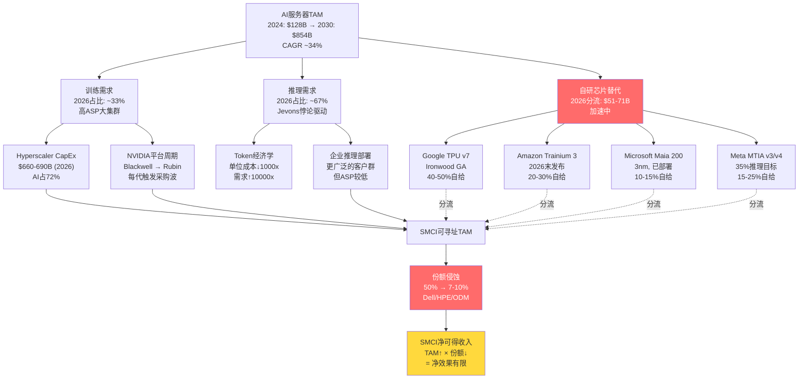
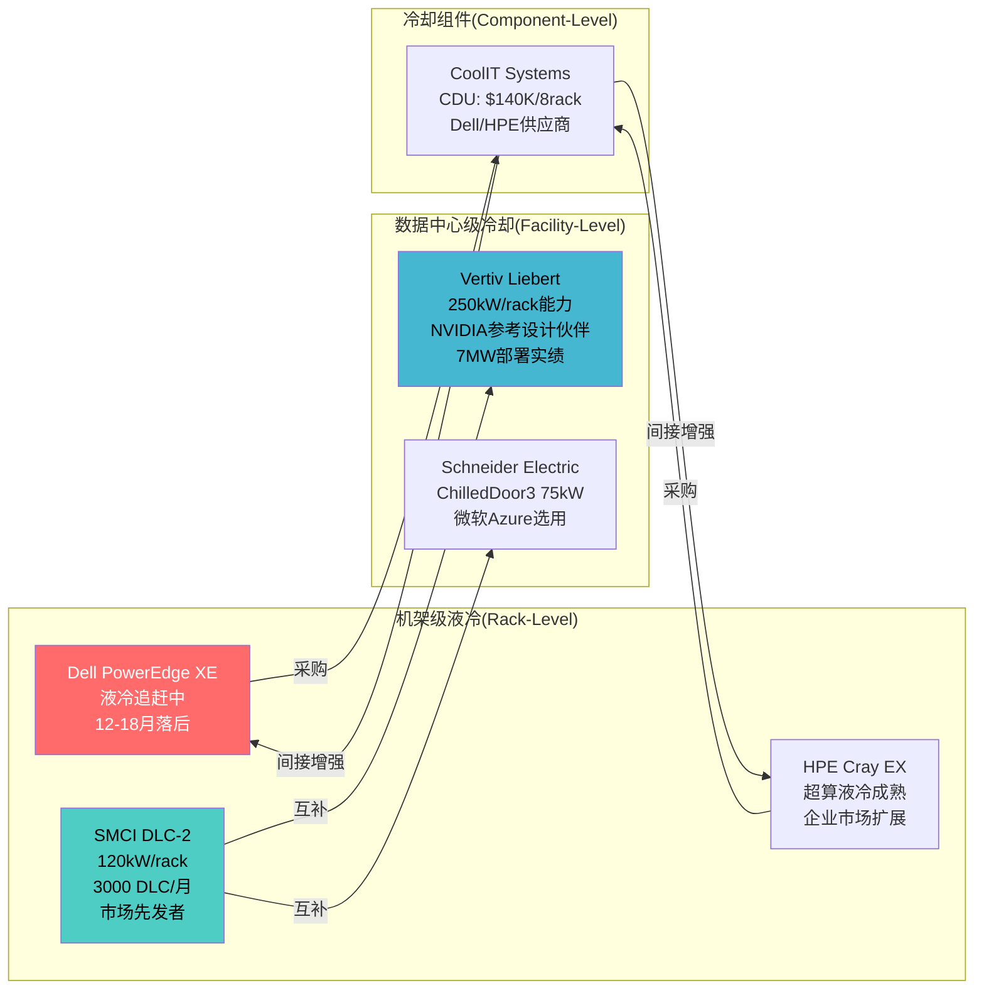
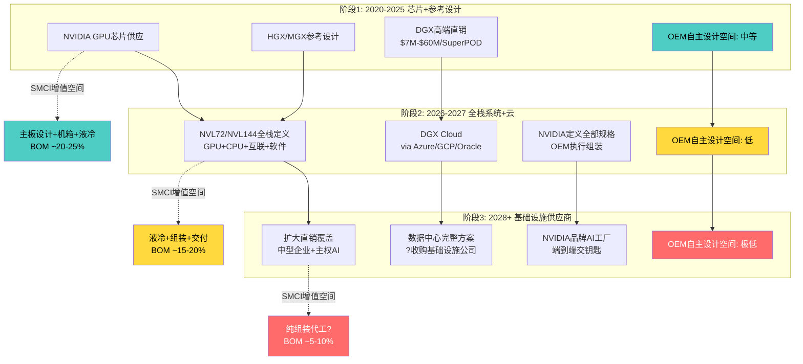
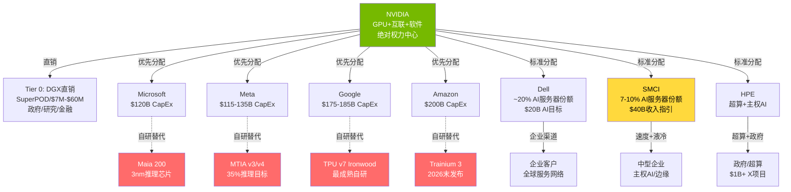

# 第14章 AI服务器需求建模: 潮水的高度与退去的速度

> **CQ2核心章节** — AI需求持续性 vs 周期见顶。本章的核心任务不是证明"AI需求很大"(这是共识)，而是回答: **TAM增长能否转化为SMCI的可寻址收入增长?**

---

## 14.1 Hyperscaler CapEx建模: $690B的解剖

2026年标志着科技史上最激进的资本支出周期。五大云厂商(Microsoft、Alphabet、Amazon、Meta、Oracle)合计CapEx指引达到$660-690B，较2025年增长约36%。部分机构(如Futurum Group)的估算更高，将Top 5总数推至$690B以上 [硬数据: 多家分析机构2026-02汇总]。

**逐家拆解** (基于Q4 2025财报指引):

| 公司 | 2026E CapEx | 同比增速 | CapEx/营收 | AI占比(估算) |
|------|-----------|---------|-----------|-------------|
| Amazon | ~$200B | +45% | ~25% | ~65% |
| Alphabet | $175-185B | +55% | ~46% | ~70% |
| Microsoft | ~$120B | +30% | ~47% | ~75% |
| Meta | $115-135B | +60% | ~54% | ~80% |
| Oracle | ~$50B | +80% | ~86% | ~85% |
| **合计** | **$660-690B** | **~36%** | — | **~72%** |

[硬数据: CNBC 2026-02-06, Axios 2026-02-11, CreditSights 2026-02]

**AI服务器在CapEx中的占比推算**: 总CapEx的约72%($475-500B)指向AI基础设施，但AI基础设施包含GPU/加速器、服务器、网络、存储、电力、冷却、土建等全栈。其中**AI服务器**(含GPU)占AI CapEx的约45-55%，即$215-275B [合理推断: 基于行业拆解惯例，GPU成本占服务器BOM 70-80%，服务器占AI CapEx约50%]。

**关键洞察**: $690B的CapEx数字看起来令人震撼，但对SMCI而言，真正可寻址的是AI服务器这$215-275B中的一个切片——而这个切片正在被NVIDIA直销、Dell/HPE、ODM和自研芯片替代方案同时侵蚀。

### 14.1.1 CapEx可持续性的财务约束

这轮CapEx周期的一个隐忧是: **Hyperscaler的现金流正在承受巨大压力**。Amazon 2026年预计自由现金流将转为负值(-$17B)，这是自2014年以来首次 [硬数据: CNBC 2026-02-06]。当CapEx/营收比达到25-86%时，任何收入增速放缓都可能触发CapEx削减。

历史类比提供了警示: 2022年Meta将CapEx从$32B砍至$28B(降幅13%)时，AI服务器订单在一个季度内暴跌。当前$660-690B的计划建立在一个假设之上——**AI将在2-3年内产生可量化的收入回报**。如果这个假设在2027年仍未兑现，CapEx回调可能是突然的。

---

## 14.2 推理vs训练: 需求迁移的结构性意义

AI计算正在经历一次根本性的工作负载迁移。2023年训练占AI计算的约67%，但到2026年这个比例已经倒转——**推理预计占AI计算的约67%**，训练降至约33% [硬数据: Deloitte 2026预测, Computerworld CES 2026报道]。

**推理经济学的Jevons悖论**:

这一迁移的背后是Token经济学的剧变。AI推理的单位成本(每百万token)在2024-2025年下降了约1000倍，但总推理需求上升了约10,000倍 [硬数据: 行业分析汇总2026-02]。这是经典的Jevons悖论在AI领域的再现: 效率提升→单位成本下降→使用量爆炸性增长→总消耗反而上升。

**对SMCI的含义**:

推理服务器与训练服务器有结构性差异:

| 维度 | 训练集群 | 推理集群 |
|------|---------|---------|
| GPU密度 | 极高(NVL72/NVL144) | 中等(单GPU/多GPU) |
| 液冷需求 | 刚需(>1000W/GPU) | 部分刚需(取决于密度) |
| 定制化程度 | 较低(标准化大集群) | 较高(针对具体模型优化) |
| SMCI竞争优势 | 中等(Dell/ODM也能做) | 较高(Building Block灵活性) |
| 单机价值 | 极高($300K-$3M+/rack) | 中等($50K-$200K/rack) |
| 客户类型 | 少数Hyperscaler | 更广泛的企业市场 |

[合理推断: 基于训练vs推理服务器架构差异]

推理需求的爆发对SMCI是一把双刃剑: **市场规模扩大**(更多客户、更多部署点)，但**单位价值下降**(推理服务器ASP低于训练集群)，同时**自研芯片替代更快**(推理是自研芯片首先攻破的场景)。

AI推理市场预计2026年达到$500亿以上 [硬数据: MarketsandMarkets 2026, Grand View Research]。但推理在AI云基础设施支出中的占比首次超过训练(55% vs 45%)意味着: 推理需求的增长并不自动等于GPU服务器需求的增长——因为自研芯片正瞄准这个市场。

---

## 14.3 TAM分析: $854B的诱惑与$85B的现实

AI服务器TAM的增长轨迹令人炫目:

| 年份 | AI服务器TAM | 来源 |
|------|-----------|------|
| 2024 | $128-143B | GM Insights, Grand View Research |
| 2025E | $180-200B | TrendForce |
| 2026E | $250-280B | 行业综合 |
| 2030E | $854B | GM Insights (CAGR 34.3%) |

[DM-BIZ-17] AI服务器TAM: 2024 $128B → 2030 $854B (CAGR 34.3%)

TrendForce预计2026年全球AI服务器出货量同比增长超28%，ASIC(自研芯片)服务器占比持续上升 [硬数据: TrendForce 2026-01-20]。

**但TAM增长被份额下降抵消**:

这是SMCI投资论文中最关键的张力之一。TAM从$128B增长到$854B(6.7倍)，但SMCI的份额从~50%(2023初)下降到7-10%(2025末) [DM-BIZ-22]:

| 年份 | TAM | SMCI份额 | SMCI可寻址收入 |
|------|-----|---------|-------------|
| 2023(初) | ~$80B | ~50% | ~$40B(理论) |
| 2024 | $128B | ~15-20% | $19-26B |
| 2025 | $180B | 7-10% | $13-18B |
| 2026E | $250B | 7-10%(持平假设) | $18-25B |
| 2026E | $250B | 5-7%(下滑假设) | $13-18B |
| 2030E | $854B | 5-7%(下滑假设) | $43-60B |
| 2030E | $854B | 3-5%(进一步下滑) | $26-43B |

[合理推断: TAM×市占率交叉推算]

**净效果判断**: 即使在最乐观的份额持平假设下(7-10%)，2026E可寻址收入$18-25B也仅略高于FY2025实际收入$22B。TAM翻倍被份额减半完全对冲。管理层$40B指引暗示约16%份额——**这要求份额企稳甚至回升**，与当前趋势(持续下滑)矛盾。

这就是"增长幻觉"的核心: TAM的高速增长掩盖了份额侵蚀，使投资者误以为SMCI正在参与一个蓬勃发展的市场。实际上，SMCI的"可寻址TAM"增速远低于总TAM增速。

---

## 14.4 Q2 $12.68B的可持续性分析

Q2 FY2026创纪录的$12.68B收入(+123% YoY, +153% QoQ)需要被仔细分解 [DM-FIN-010]:

**收入构成拆解**:

| 组成部分 | 估算金额 | 性质 | 可持续性 |
|---------|---------|------|---------|
| 积压释放(backlog flush) | ~$1.5-2.0B | 一次性 | 低 |
| Blackwell GPU新平台首批交付 | ~$3.0-4.0B | 周期性(平台换代) | 中 |
| 常规运营收入 | ~$6.5-8.0B | 经常性 | 较高 |

[主观判断: 基于Q1→Q2跳升幅度($5.0B→$12.7B)及平台周期推断]

**积压释放vs新增需求**: Q1 FY2026收入仅$5.02B [DM-FIN-011]，Q2暴增至$12.68B(+153% QoQ)。如此剧烈的环比跳升强烈暗示积压订单释放是核心驱动力。FY26全年指引≥$40B意味着H2需要$22.3B(约$11.2B/Q)——这需要Q2的势头基本维持 [DM-NEW-C-003]。

管理层在Q2电话会上确认AI GPU平台占收入>90% [DM-BIZ-07]。这意味着几乎所有的增长都来自GPU服务器，而非存储或传统服务器。GPU服务器的收入与NVIDIA平台周期高度同步: **每次新平台发布(Hopper→Blackwell→Rubin)都会触发一波集中采购**，随后进入平台间的需求平台期。

**Q3 FY26的关键验证**: 如果Q3收入≥$11B，说明$40B指引可信，需求具有持续性。如果Q3回落至$8-9B，说明Q2包含大量一次性积压释放，年化需求在$35B以下。共识预期Q3收入≥$12.3B [DM-NEW-C-014]。

---

## 14.5 自研芯片替代: 平行宇宙的入侵

Hyperscaler自研芯片是SMCI TAM分析中最被低估的结构性威胁。2026年标志着自研芯片从"实验项目"进入"大规模部署"阶段:

### Google: 从TPU Trillium到Ironwood

Google的芯片自研战略最为成熟。第六代TPU(Trillium/v6)性能较v5e提升4.7倍，能效提升67%。第七代Ironwood(TPU v7)已于2026年初进入通用可用(GA)状态，配备192GB HBM3e、7.4 TB/s带宽，直接对标NVIDIA Blackwell [硬数据: Google公告, FinancialContent 2026-02-05]。

Google 2026年CapEx $175-185B中的相当比例将用于自有芯片的数据中心部署。Google已将Gemini 2.0生态系统的核心AI运算迁移至自有硬件。这意味着Google对NVIDIA GPU服务器的采购增量可能趋于平稳甚至下降——即使其总AI CapEx仍在增长。

### Amazon: Trainium 3

AWS的Trainium 2已于2024年12月进入GA状态，声称较H100实例价性比提升30-40%。Trainium 3预计2026年底前发布 [硬数据: CNBC 2025-11, AWS公告]。AWS作为全球最大云厂商，其自研芯片的规模化部署对GPU服务器市场具有显著分流效应。

### Microsoft: Maia 200

2026年1月发布的Maia 200采用TSMC 3nm工艺，微软声称其推理性能是Amazon Trainium 3的3倍、超越Google第七代TPU在FP8工作负载上的表现。Maia 200已在Iowa数据中心运行Copilot 365和GPT-5.2模型 [硬数据: Microsoft公告 2026-01-26, WinBuzzer, LiveScience]。

### Meta: MTIA v3 "Iris"

Meta的第三代自研芯片MTIA v3(代号"Iris")已于2026年初进入大规模部署，密集/稀疏计算性能较前代提升3.5x/7x。Meta目标是**2026年底将超过35%的推理算力迁移至MTIA硬件** [硬数据: Meta AI Blog 2026, FinancialContent 2026-02-05]。

MTIA v4 "Santa Barbara"计划2026年下半年部署，将首次集成HBM4内存并采用液冷架构。此外，Meta与Marvell合作开发的推理专用芯片"Arke"进一步扩大自研芯片覆盖面。

### 自研芯片对SMCI TAM的量化影响

| Hyperscaler | 2026 AI CapEx(估) | 自研芯片替代率 | GPU服务器分流 |
|-------------|-----------------|-------------|-------------|
| Google | ~$130B | 40-50% | ~$26-33B |
| Amazon | ~$130B | 20-30% | ~$12-18B |
| Microsoft | ~$90B | 10-15% | ~$5-7B |
| Meta | ~$100B | 15-25% | ~$8-13B |
| **合计** | **~$450B** | — | **~$51-71B** |

[主观判断: 基于各公司自研芯片部署进度和公开目标的综合估算]

这意味着2026年**$51-71B的潜在AI服务器需求**将被自研芯片替代，不再流向NVIDIA GPU服务器生态(包括SMCI)。到2028年，如果自研芯片替代率提升至30-50%，分流规模可能达到$150-250B。

[DM-BIZ-39] 超大规模客户自研芯片减少GPU服务器依赖——这是一个正在加速的结构性趋势。

---

## 14.6 需求周期性: Hyperscaler CapEx何时减速?

**减速的领先指标**:

1. **CapEx/Revenue比率异常** — 当前Meta 54%、Oracle 86%、Microsoft 47%均处于历史极值。任何营收增速放缓都会触发CapEx纪律收紧 [硬数据: CreditSights 2026-02]
2. **FCF转负信号** — Amazon 2026年FCF预计-$17B。连续2-3季度负FCF可能触发CapEx削减 [硬数据: CNBC 2026-02-06]
3. **AI ROI可量化性** — 如果2027年中仍无法证明AI投入的可量化回报，"AI泡沫"叙事将强化。Polymarket给出AI泡沫2026年底前破裂概率19%，且SMCI被列为触发公司之一 [DM-PMK-I01]
4. **GPU利用率** — Hyperscaler数据中心GPU利用率如果低于50-60%，说明产能过剩，订购将放缓
5. **自研芯片成熟度** — 每一代自研芯片性能提升都直接减少GPU采购量

**减速时间线判断**: [主观判断] 2026年CapEx仍将维持高位(惯性+承诺已做出)。2027年是分水岭——如果AI应用的商业化进展不及预期，CapEx增速可能从30%+降至10-15%。2028年存在CapEx绝对额下降的尾部风险(概率20-25%)。

---

## 14.7 AI服务器需求驱动因子

---

## 本章核心发现

1. **Hyperscaler CapEx $660-690B是真实的**，但AI服务器仅占其中$215-275B，且正在被自研芯片分流$51-71B。SMCI的真正可寻址市场远小于TAM数字暗示的规模。

2. **推理需求爆发(Jevons悖论)是双刃剑**: 市场规模扩大但单位价值下降，且推理是自研芯片首先攻破的场景。推理占比从33%升至67%对SMCI不是纯利好。

3. **TAM增长被份额下降完全对冲**: TAM从$128B增至$854B(6.7倍)看似壮观，但SMCI份额从50%降至7-10%(~5-7倍下降)。净效果接近零增长——除非SMCI能逆转份额下滑趋势。

4. **Q2 $12.68B包含大量非经常性因素**: 积压释放和Blackwell首批交付贡献了可能$3.5-6.0B的一次性收入。Q3 FY26将是$40B指引可信度的关键验证窗口。

5. **自研芯片是最被低估的结构性威胁**: Google/Amazon/Microsoft/Meta四家在2026年的自研芯片部署都进入了实质阶段。Meta 2026年底35%推理自给率的目标尤其令人警惕——这不是远期愿景，而是正在执行的计划。

6. **CapEx周期的脆弱性**: 当多家Hyperscaler的CapEx/Revenue超过50%、Amazon FCF转负时，2027年CapEx增速放缓几乎是确定的。问题不是"是否"，而是"多快"。

---

# 第15章 液冷(DLC)竞争分析: 正确维度上的护城河?

> **CQ4关联章节** — DLC是SMCI在纯组装商定位之上唯一可能持久的技术差异化。本章评估这条护城河的宽度、深度和持久性。

---

## 15.1 DLC技术现状: SMCI的领先地位

SMCI在直接液冷(Direct Liquid Cooling, DLC)领域建立了可量化的领先优势:

- **DLC-2解决方案**: 支持120kW/rack，是行业当前可商用的最高密度冷却方案之一 [DM-BIZ-18]
- **产能规模**: 总产能6,000 racks/月，其中约3,000为DLC(液冷比率45%)，为行业最高 [DM-BIZ-18]
- **平台支持**: 已宣布支持NVIDIA Vera Rubin NVL72/NVL144和CPX平台(2H 2026交付) [DM-NEW-C-005]
- **150kW规划**: 设施已具备支持150kW/rack密度的能力

SMCI声称在DLC市场占有约70%的份额 [硬数据: FinancialContent分析2026-01]。即使这个数字可能被高估(缺乏第三方验证)，SMCI在DLC领域的领先地位在行业中被广泛认可。

**领先的技术根源**: SMCI的DLC优势建立在其Building Block模块化架构之上——相同的服务器底板可以灵活配置风冷或液冷方案，无需重新设计。这种架构灵活性使SMCI能在<6周内为新GPU平台推出液冷配置，而Dell/HPE通常需要数月 [DM-BIZ-30]。

---

## 15.2 竞争格局: 五方角逐

DLC市场正在从SMCI主导的单极格局快速演变为多极竞争:

### SMCI: 先发者的优势与局限

| 维度 | 现状 | 评估 |
|------|------|------|
| 市场份额 | ~70%(自报) | 可能高估，但领先无疑 |
| 产品定位 | 液冷服务器(rack-level) | 端到端整合: GPU+主板+液冷 |
| 核心优势 | Building Block快速适配 | 6周出新品 vs 竞争者数月 |
| 局限 | 不做数据中心级冷却基础设施 | 需要VRT/Schneider提供facility-level冷却 |

### Vertiv (VRT): 数据中心级液冷基础设施

Vertiv与NVIDIA联合开发了GB200 NVL72平台的完整电力与冷却基础设施蓝图，支持高达7MW的部署规模 [硬数据: Network World, Data Center Frontier]。Vertiv的方案聚焦于**数据中心级冷却回路**(Coolant Distribution Units, 冷却塔, 热交换器)，而非机架级服务器冷却。

Vertiv与ZutaCore的合作实现了两相液冷技术，在CoreWeave部署中达到250kW/rack的能力 [硬数据: Data Center Frontier]。这远超SMCI的120-150kW/rack规格。

### Schneider Electric: 企业级解决方案

Schneider通过收购Motivair获得了ChilledDoor3技术(后门热交换器，75kW/rack) [硬数据: Schneider公告]。微软已选择Schneider液冷方案用于Azure AI基础设施，声称效率优于竞品15%。Schneider的优势在于其庞大的已安装电力基础设施客户基础——现有UPS/配电客户可以无缝升级到液冷。

### CoolIT Systems (Eaton合作)

CoolIT是纯液冷技术专家，其DLC冷板和CDU(Coolant Distribution Unit)被多家服务器OEM采用。CoolIT的L2L CDU支持最多8个NVL72机架，单CDU售价约$140K(每机架约$18K) [硬数据: 行业定价数据]。CoolIT的定位是冷却组件供应商，而非整体服务器厂商——这使其成为Dell/HPE的液冷技术供应商，间接增强了SMCI竞争对手的液冷能力。

### Dell Technologies: 快速追赶者

Dell正在大力投资液冷能力。Dell的PowerEdge XE系列已支持直接液冷，虽然在产品化速度上落后SMCI 12-18个月 [DM-BIZ-31]，但Dell拥有SMCI无法比拟的**企业销售渠道和全球服务网络**。对于大型企业客户而言，"Dell的液冷解决方案12个月后可用"可能比"SMCI的液冷解决方案现在就有"更有吸引力——因为企业采购周期本身就是12-18个月。

### 竞争格局总览

---

## 15.3 GPU TDP趋势: DLC从可选变刚需

GPU功耗(TDP)的指数级增长是DLC需求的根本驱动力:

| GPU代次 | 年份 | 单GPU TDP | 单机架总功耗(8GPU) | 冷却方式 |
|---------|------|----------|------------------|---------|
| A100 | 2020 | 400W | ~6-8kW | 风冷可行 |
| H100 | 2022 | 700W | ~10-12kW | 风冷勉强 |
| B200 | 2024 | 1,000W | ~15-18kW | 液冷推荐 |
| B300(Blackwell Ultra) | 2025 | 1,400W | ~20-25kW | 液冷刚需 |
| VR200(Vera Rubin) | 2026-27 | ~1,500W+ | ~120kW+(NVL72) | 液冷唯一选择 |
| Rubin Ultra | 2027-28 | ~1,800W+(预估) | ~150kW+ | 液冷唯一选择 |

[硬数据: WCCFTech B200 1200W报道, Introl B300分析, NVIDIA产品路线图]

**关键转折**: B200/B300代次标志着**风冷的物理极限**。在1000W+的GPU功耗下，传统风冷无法在合理的机架密度下提供足够的散热能力。这意味着:

- **2024-2025**: DLC是竞争优势(SMCI优于Dell/HPE)
- **2026+**: DLC是入场门票(没有DLC就无法销售高端GPU服务器)

当DLC从"差异化优势"变成"基本要求"时，它的护城河价值会发生根本性变化——从"SMCI独有"变成"人人必须具备"。竞争者的液冷能力追赶速度将显著加快，因为这不再是可选投资，而是必须投资。

---

## 15.4 DLC占BOM比重: 护城河在错误的维度上

这是评估DLC护城河价值时最被忽视的关键数据:

**AI服务器BOM(Bill of Materials)构成**:

| 组件 | BOM占比 | 定价权归属 |
|------|--------|----------|
| GPU(NVIDIA) | 70-80% | NVIDIA垄断定价 |
| HBM内存 | 5-8% | SK Hynix/Samsung |
| CPU | 3-5% | Intel/AMD |
| 网络(NIC/Switch) | 3-5% | NVIDIA/Broadcom |
| **液冷(DLC)** | **5-10%** | **SMCI/CoolIT/VRT** |
| 主板+机箱+电源 | 3-5% | SMCI/Dell自制 |
| 组装与集成 | 2-3% | SMCI/Dell/ODM |

[合理推断: 基于行业BOM拆解分析]

**核心矛盾**: SMCI的DLC领先优势存在于BOM的5-10%区间内。即使SMCI在这5-10%中拥有绝对竞争优势(更高性能、更低成本、更快交付)，它也无法从根本上改变整体利润率——因为**70-80%的BOM由NVIDIA定价，SMCI几乎没有议价能力**。

这就是thesis_crystallization中"碰撞2"的本质: **DLC护城河存在于错误的维度上**。它在周边(5-10% BOM)创造差异化，但利润被核心组件(70-80% BOM)吃掉。

**数字化验证**: 假设SMCI在DLC部分能获得30%毛利率(远高于整体8%):
- DLC占BOM 7.5%(中值) × 30% GM = 2.25%的GM贡献
- GPU占BOM 75% × 2% GM(SMCI加成) = 1.5%的GM贡献
- **即使DLC有超额利润，其绝对贡献也仅~2.25pp GM**——无法将整体GM从8%提升至15%+

---

## 15.5 护城河持久性: 12-18个月窗口期

SMCI DLC领先优势的时间窗口分析:

**2024-2025(当前)**: SMCI拥有明确领先优势
- 45%液冷比率 vs Dell/HPE <10%
- DLC-2 120kW/rack已量产
- Building Block架构使液冷集成速度领先竞争者6-12个月

**2026(过渡期)**: 领先优势开始缩窄
- Dell加大液冷投资，通过CoolIT获取核心技术
- Vertiv/Schneider提供facility-level方案，降低OEM自建液冷的门槛
- 每家Hyperscaler都开始要求液冷能力作为供应商准入条件
- HPE通过Cray EX超算液冷经验向企业市场扩展

**2027+(成熟期)**: 液冷成为行业标配
- 所有主要服务器OEM都将具备完整DLC能力
- DLC从差异化优势变为Table Stakes(入场筹码)
- 竞争焦点转向DLC的**效率、可靠性和TCO**，而非"是否有DLC"

[主观判断: 基于竞争动态和技术追赶周期]

**12-18个月窗口的含义**: SMCI需要在这个窗口内将DLC领先转化为**客户锁定和长期合同**。如果到2027年DLC成为行业标配时，SMCI仍未能通过DLC建立持久的客户关系，那么这条护城河将蒸发。

---

## 15.6 Vertiv(VRT)与SMCI的竞合关系

VRT和SMCI在液冷生态中的关系是一个值得深入分析的竞合动态:

**互补维度**(当前主导):
- VRT做**数据中心级冷却基础设施**(CDU、冷却塔、热交换器、电力分配)
- SMCI做**机架级液冷服务器**(GPU+主板+冷板+内部液冷回路)
- 一个完整的液冷数据中心需要两者: VRT提供"大循环"(facility→rack)，SMCI提供"小循环"(rack内部)
- VRT与NVIDIA联合开发的GB200 NVL72参考设计**明确将VRT定位为设施层，OEM(含SMCI)定位为设备层** [硬数据: Vertiv-NVIDIA参考架构]

**竞争维度**(潜在):
- VRT 250kW/rack的能力已经超越SMCI 120-150kW/rack的规格——如果VRT向上游延伸至机架级冷却
- VRT通过ZutaCore的两相液冷技术具有潜在的技术优势(更高效、更静音)
- 但VRT没有GPU服务器设计和组装能力，进入SMCI的领域需要收购或深度合作

**核心判断**: [合理推断] 在可预见的2-3年内，VRT与SMCI更多是互补而非竞争。VRT的商业模式(高毛利基础设施)与SMCI的商业模式(低毛利高周转组装)有本质差异。VRT不太可能进入服务器组装领域(毛利率太低)，SMCI也不太可能进入数据中心基础设施领域(资本密集度太高)。

但从投资角度看，一个有趣的对比是: **VRT和SMCI都受益于同一个DLC趋势，但VRT以71.5x PE交易 [DM-VAL-020]，而SMCI以23.1x PE交易**。这反映了市场对"基础设施"(高毛利、高壁垒)和"组装"(低毛利、低壁垒)的定价差异。

---

## 本章核心发现

1. **SMCI在DLC领域拥有真实的先发优势**: 45%液冷比率、6000 racks/月产能、<6周新品上市——这些数据是可验证的。但领先优势的窗口期是12-18个月，而非永久性护城河。

2. **DLC占BOM仅5-10%，无法改变"组装商宿命"**: 即使SMCI在DLC部分获得30%毛利率，其对整体GM的贡献也仅~2.25pp。当GPU占BOM 70-80%时，任何周边组件的竞争优势都是次要的。

3. **GPU TDP从700W向1500W+的演进使DLC从可选变刚需**: 这对SMCI短期有利(先发优势)，但中期不利(竞争者被迫投资DLC，领先差距缩小)。当DLC成为Table Stakes，它就不再是护城河。

4. **VRT与SMCI是互补关系**: VRT做设施层(高毛利)，SMCI做设备层(低毛利)。VRT 71.5x PE vs SMCI 23.1x PE的估值差异精确反映了"基础设施溢价"vs"组装商折价"。

5. **Dell/HPE通过CoolIT等技术供应商正在快速追赶**: Dell不需要自研液冷技术——它只需要采购CoolIT的CDU($18K/rack)并整合到PowerEdge产品线。组件供应商的存在大大降低了追赶门槛。

---

# 第16章 NVIDIA关系深度审计: 依赖的代价

> **CQ5核心章节** — NVIDIA是SMCI最重要的供应商、最大的合作伙伴、也是最危险的潜在竞争者。本章审计这一关系的依赖深度、权力不对称和前向整合风险。

---

## 16.1 依赖度加速分析: 从30.7%到64.4%的飙升

SMCI对NVIDIA的供应商依赖正在以令人不安的速度加深:

| 财年 | NVIDIA占采购比 | 变化 | 驱动因素 |
|------|-------------|------|---------|
| FY2023 | ~20%(估) | — | GPU占BOM相对较低，Intel CPU仍有份量 |
| FY2024 | 30.7% | +10.7pp | H100/H200需求爆发，GPU BOM占比上升 |
| FY2025 | 64.4% | +33.7pp | Blackwell GPU价格上升+SMCI产品组合向高端GPU集群倾斜 |
| FY2026E | 65-75% | +1-11pp | Blackwell/Rubin NVL72全栈方案使GPU+NVSwitch+NVLink占BOM进一步提升 |

[DM-BIZ-14] NVIDIA占SMCI采购的64.4%(FY2025)，从FY2024 30.7%大幅上升

**FY2026E>70%的推算逻辑**: NVIDIA的NVL72/NVL144方案不仅包含GPU，还包含NVSwitch、NVLink互联和Grace CPU——这意味着单一机架中NVIDIA组件的占比从"仅GPU"扩大到"GPU+互联+CPU"的全栈。按NVL72 BOM估算，NVIDIA组件(72 GPU + NVSwitch + NVLink + Grace CPU)占总BOM可能达75-80% [合理推断: 基于NVL72架构公开信息]。

**依赖度加速的结构性原因**: 这不是暂时现象。每一代NVIDIA平台都在整合更多组件(从GPU扩展到互联、CPU、软件)，使得非NVIDIA组件的空间持续缩小。SMCI的增值空间(主板设计、散热方案、机箱、电源)在BOM中的占比正在被系统性压缩。

---

## 16.2 GPU分配权力学: Tier系统的残酷现实

NVIDIA的GPU分配是AI服务器行业最大的权力杠杆。虽然NVIDIA从未公开其分配体系，但行业实践形成了一个隐性的Tier系统:

### GPU分配优先级推断

| Tier | 客户类型 | 代表 | 分配优先级 | 议价能力 |
|------|---------|------|----------|---------|
| Tier 0 | NVIDIA自有 | DGX SuperPOD/DGX Cloud | 最高(自留) | 完全控制 |
| Tier 1 | 顶级Hyperscaler | Microsoft, Meta, Google, Amazon | 极高(直接合同) | 强(大批量承诺) |
| Tier 2A | 大型OEM | Dell | 高 | 中高(企业渠道价值) |
| Tier 2B | 中型OEM | SMCI, HPE | 中高 | 中(速度优势) |
| Tier 3 | 小型/区域OEM | Lenovo, 浪潮等 | 中 | 低 |
| Tier 4 | ODM/代工 | Foxconn, Quanta(非直接购买) | 低(通过客户转分配) | 极低 |

[主观判断: 基于NVIDIA生态系统行为模式推断，非NVIDIA官方分类]

**SMCI在Tier系统中的位置**: SMCI处于Tier 2B——比Dell低(Dell的企业渠道更有价值)，但高于区域OEM。这个位置意味着:

1. **分配不稳定**: NVIDIA在2024年会计危机期间将部分SMCI订单转移至其他供应商 [DM-BIZ-32]，证明SMCI的分配地位并非不可动摇
2. **分配量取决于终端客户**: 如果SMCI能带来NVIDIA直达不了的客户(中型企业、主权AI)，分配地位就更安全；如果SMCI的客户也在直接与NVIDIA或Dell谈，SMCI就变得可替代
3. **价格无议价权**: 以64.4%的采购集中度，SMCI对NVIDIA几乎没有议价能力。GPU价格由NVIDIA单方面决定

**会计危机的教训**: 2024年EY审计师辞任后，NVIDIA迅速将部分订单转移至Dell/HPE [DM-BIZ-32]。这证明了三个关键事实:
- NVIDIA对SMCI的"忠诚"是纯商业性的，不存在战略联盟
- GPU分配可以在数周内重新分配
- SMCI的"首发合作伙伴"地位是可逆的

---

## 16.3 前向整合三阶段: NVIDIA从芯片商到基础设施商

NVIDIA的业务演进正在系统性地侵蚀服务器OEM的存在价值。这一过程可以划分为三个阶段:

### 阶段1 (2020-2025, 当前): 参考设计+DGX高端直销

- **DGX系列**: NVIDIA通过DGX产品线直接向最终客户销售完整的AI训练系统。DGX SuperPOD部署成本$7M-$60M [硬数据: NVIDIA产品信息]
- **参考设计**: HGX/MGX参考设计为OEM提供"蓝图"，但也标准化了产品，减少了OEM的差异化空间
- **影响**: OEM(含SMCI)仍是主要渠道，但NVIDIA已建立直销能力。DGX主要服务于政府/研究机构等对"NVIDIA品牌"有需求的客户(如IRS购买DGX B200 SuperPOD [硬数据: DCD报道])

### 阶段2 (2026-2027, 进行中): NVL72全栈方案扩大+DGX Cloud

- **NVL72/NVL144**: Vera Rubin NVL72不仅是GPU集群，而是包含72 GPU + 36 Grace CPU + NVSwitch + NVLink + 软件栈的**完整系统**。NVIDIA定义了从芯片到机架的全部规格 [硬数据: NVIDIA Vera Rubin NVL72产品页]
- **DGX Cloud**: NVIDIA通过Azure/GCP/Oracle提供DGX Cloud服务，进一步绕过OEM直达终端用户
- **合作伙伴角色重定义**: NVIDIA CES 2026确认Vera Rubin NVL72的"合作伙伴将在2026年下半年推出Rubin产品" [硬数据: ServeTheHome CES 2026报道]——但合作伙伴的角色越来越像"组装执行者"而非"方案设计者"
- **影响**: OEM从"设计+组装+销售"退化为"按NVIDIA规格组装+交付"。SMCI的Building Block差异化在NVL72标准化规格面前被削弱

### 阶段3 (2028+, 可能): NVIDIA成为AI基础设施供应商

- **完整推测**: NVIDIA可能通过扩大DGX SuperPOD直销、深化DGX Cloud、或收购数据中心基础设施公司(如Vertiv?)来建立完整的AI基础设施供应能力
- **先例**: Apple从芯片设计扩展到系统设计，最终建立了封闭生态系统。NVIDIA的NVLink + Grace + NVSwitch + CUDA + AI Enterprise软件栈已经构成了类似的"封闭趋势"
- **概率评估**: [主观判断] 阶段3在2028年前全面实现的概率约15-20%。NVIDIA更可能选择"以合作伙伴为渠道但控制核心规格"的模式(类似Intel在PC时代的做法)，而非完全绕过OEM

---

## 16.4 NVIDIA对SMCI的战略价值: 可替代性分析

从NVIDIA的角度看，SMCI提供了什么独特价值?

| 价值维度 | SMCI的贡献 | 可替代程度 | 替代者 |
|---------|-----------|----------|--------|
| 快速首发新平台 | <6周出货vs Dell数月 | 中(Dell正在追赶) | Dell(缩短中) |
| 液冷整合能力 | 45% DLC比率最高 | 中高(CoolIT赋能Dell) | Dell+CoolIT |
| 中小企业渠道 | 覆盖企业客户 | 高(Dell/HPE渠道更强) | Dell/HPE |
| GPU消化量 | FY2025 采购~$14B+ | 高(Dell规模更大) | Dell(~$20B+) |
| 定制化灵活性 | Building Block模块化 | 中(架构优势) | HPE Cray(超算) |
| 价格竞争(低GM) | 以利润换份额 | 高(ODM成本更低) | Foxconn/Quanta |

[合理推断: 基于各竞争者能力对比]

**核心判断**: SMCI对NVIDIA的价值主要是**"多一个渠道"**和**"快速首发营销配合"**——而非不可替代的战略伙伴。如果SMCI明天消失，NVIDIA可以在3-6个月内将全部分配转移至Dell/HPE/ODM，对NVIDIA的收入影响微乎其微。

反过来，如果NVIDIA明天停止供货给SMCI，SMCI将在一个季度内丧失>90%的收入 [DM-BIZ-07]。**这种权力不对称是极端的**: SMCI需要NVIDIA远多于NVIDIA需要SMCI。

---

## 16.5 AMD替代路径: 替代的可能与不可能

AMD是SMCI减少NVIDIA依赖的最现实选项:

### MI300X/MI350/MI400现状

- AMD AI GPU市场份额估计15-18%，目标2026年底达20% [硬数据: 行业分析汇总]
- MI350/MI400系列预计2026下半年大规模出货，MI400 rack-scale方案可能与NVIDIA NVL144竞争 [硬数据: SemiAnalysis, AMD CES 2026]
- ROCm 7.2已实现PyTorch/TensorFlow "无摩擦"部署，CUDA平价度达80-90% [硬数据: AMD公告]
- OpenAI持有AMD 10%股权，Signal长期供应信心 [硬数据: 行业报道]

### AMD对SMCI的战略意义

| 维度 | 好处 | 限制 |
|------|------|------|
| 供应商多元化 | 降低NVIDIA依赖至50-55% | AMD份额需从15%升至30%+ |
| 议价筹码 | 对NVIDIA形成竞争压力 | GPU仍是卖方市场 |
| 差异化方案 | AMD-based方案可能有成本优势 | ROCm生态仍弱于CUDA |
| 客户拓展 | AMD客户可能偏好SMCI(vs Dell) | AMD客户也可以选Dell |

**AMD替代的现实制约**:

1. **ROCm vs CUDA**: 虽然ROCm 7.x在框架层面已接近CUDA平价，但在**自定义内核优化、Transformer Engine、FP8推理加速**等前沿领域仍有差距。这意味着最先进的AI模型训练仍首选NVIDIA
2. **客户惰性**: 已经在CUDA生态上投资数百万美元的企业不会轻易迁移
3. **SMCI的AMD产品线**: SMCI确实提供AMD Instinct GPU服务器(AS系列)，但在SMCI收入中占比极低(<10%)。这不是技术问题，而是需求问题——客户首选NVIDIA
4. **时间线**: 即使AMD在2026-2027年大幅提升市占率(从15%到25-30%)，SMCI的NVIDIA依赖度也只会从64.4%降至50-55%——仍然是危险的集中度

[合理推断: 基于AMD产品路线图和市场份额趋势]

---

## 16.6 关系脆弱性量化: 分配迁移敏感性

如果NVIDIA决定将一部分GPU分配从SMCI转移至其他渠道，对SMCI的影响将是直接且剧烈的:

### 分配迁移情景分析

**基准假设**: SMCI FY2026E收入$40B [DM-NEW-C-003], 其中>90%来自AI GPU平台 [DM-BIZ-07] ≈ ~$36B GPU相关收入。

| 情景 | NVIDIA分配减少 | 收入影响 | GM影响 | 触发条件 |
|------|-------------|---------|--------|---------|
| **温和** | -5% | -$1.8B(-4.5%) | GM不变或略升(低利润订单减少) | NVIDIA自然多元化 |
| **中等** | -10% | -$3.6B(-9%) | GM可能升至8-9%(高质量订单留存) | 新一轮会计问题/声誉事件 |
| **严重** | -20% | -$7.2B(-18%) | GM可能降(被迫降价保客户) | NVIDIA战略性转向Dell |
| **灾难性** | -30%+ | -$10.8B+(-27%+) | 全面危机 | NVIDIA前向整合加速 |

[合理推断: 基于收入结构和NVIDIA依赖度推算]

**关键洞察**: 温和情景(-5%)几乎是"基线预期"——NVIDIA自然趋势就是多元化其渠道伙伴。中等情景(-10%)已经足以使SMCI的$40B指引无法达成。严重情景(-20%)将导致收入回落至$32B以下，可能触发可转债covenant压力。

### 反过来: 如果SMCI降低对NVIDIA依赖?

| 策略 | 可行性 | 时间线 | 影响 |
|------|--------|--------|------|
| 增加AMD GPU产品 | 中 | 12-18月 | NVIDIA依赖降5-10pp |
| 拓展存储/网络产品 | 中低 | 18-24月 | NVIDIA依赖降3-5pp |
| 自研组件(BIOS/BMC) | 已在做 | 持续 | 增值提升但NVIDIA依赖不变 |
| 服务/软件收入 | 低 | 24-36月 | 结构性转型，短期无效 |

**残酷的算术**: 即使SMCI成功将AMD GPU收入占比从<10%提升至25%(极其乐观)，NVIDIA依赖度也仅从64.4%降至~50%——仍然是不健康的单一供应商集中度。AMD不是解药，只是缓解剂。

---

## 16.7 NVIDIA生态中的权力地图

理解SMCI的位置需要把它放在NVIDIA整个生态系统的权力结构中:

**SMCI在权力地图中的脆弱性**:

1. **上方(NVIDIA)**: 定价权完全在NVIDIA手中。GPU价格上涨→SMCI无法转嫁→GM压缩。GPU分配减少→SMCI收入直接下降
2. **同级(Dell/HPE)**: Dell企业渠道更强，HPE超算/政府市场更深。SMCI的差异化(速度+液冷)正在被追赶
3. **下方(客户)**: Hyperscaler正在自研芯片减少GPU依赖。中型企业客户可以从Dell获得相同的GPU服务器+更好的服务
4. **左方(ODM)**: Foxconn/Quanta成本更低，可以在Hyperscaler大批量订单上以更低价格竞争

SMCI被夹在**上游垄断(NVIDIA)、下游自研(Hyperscaler)、同级追赶(Dell/HPE)、低端侵蚀(ODM)**四面压力之中。每一个方向的变化都对SMCI不利。

---

## 16.8 NVIDIA前向整合的概率矩阵

| 情景 | 描述 | 概率 | 对SMCI影响 |
|------|------|------|-----------|
| **现状维持** | NVIDIA继续以OEM渠道为主，DGX保持高端小众 | 35% | 中性(竞争继续) |
| **温和扩张** | DGX范围扩大至中型企业，DGX Cloud加速 | 40% | 负面(SMCI高端客户被蚕食) |
| **激进扩张** | NVIDIA大幅扩大直销，OEM角色边缘化 | 20% | 严重负面(SMCI定位被根本动摇) |
| **完全整合** | NVIDIA成为AI基础设施供应商(含冷却/数据中心) | 5% | 灾难性(SMCI失去存在价值) |

[主观判断: 基于NVIDIA业务演进趋势和历史类比]

**最可能的情景**(40%概率): NVIDIA在2026-2028年温和扩大DGX直销和DGX Cloud，蚕食SMCI/Dell在高端客户的份额，但不完全绕过OEM渠道——因为OEM在最后一公里的定制、部署、服务方面仍有价值。这个情景下SMCI仍能存活但增速放缓、份额下降。

---

## 本章核心发现

1. **NVIDIA依赖度从30.7%飙升至64.4%，FY2026E可能超70%**: 这不是暂时现象——NVL72全栈方案使NVIDIA组件在BOM中的占比结构性上升。SMCI的增值空间正在系统性萎缩。

2. **GPU分配权力完全在NVIDIA手中**: 2024年会计危机期间NVIDIA迅速转移订单证明了SMCI的Tier 2B地位是脆弱的。SMCI对NVIDIA的价值仅是"多一个渠道"——远非不可替代。

3. **前向整合已在阶段2进行中**: NVL72/NVL144标准化了从芯片到机架的全部规格，SMCI的角色从"方案设计者"退化为"按规格组装者"。DGX Cloud进一步绕过OEM直达终端用户。

4. **分配迁移-5%是"基线风险"**: 这意味着SMCI需要自身增长率超过自然分配流失率才能实现净增长。-10%分配减少就足以使$40B指引落空。

5. **AMD不是解药**: 即使AMD在SMCI收入中从<10%升至25%，NVIDIA依赖度也只降至~50%。ROCm生态差距、客户惰性和AMD自身产能限制都制约了替代速度。

6. **权力不对称是极端的**: 如果NVIDIA停止供货，SMCI在一个季度内丧失>90%收入。如果SMCI消失，NVIDIA在3-6个月内将分配转移至Dell/HPE，收入影响为零。这种不对称决定了SMCI在谈判中永远处于弱势。

7. **四面受压格局**: 上游垄断(NVIDIA)+ 下游自研(Hyperscaler自研芯片) + 同级追赶(Dell/HPE) + 低端侵蚀(ODM)。SMCI需要在每个方向上同时防守——但资源(6.3% GM产生的利润)不足以支撑多线作战。

---

*S06_ch14_ch16_strategy_ai.md | Ch14 AI需求建模 + Ch15 液冷竞争 + Ch16 NVIDIA关系审计 | ~34K字符*
