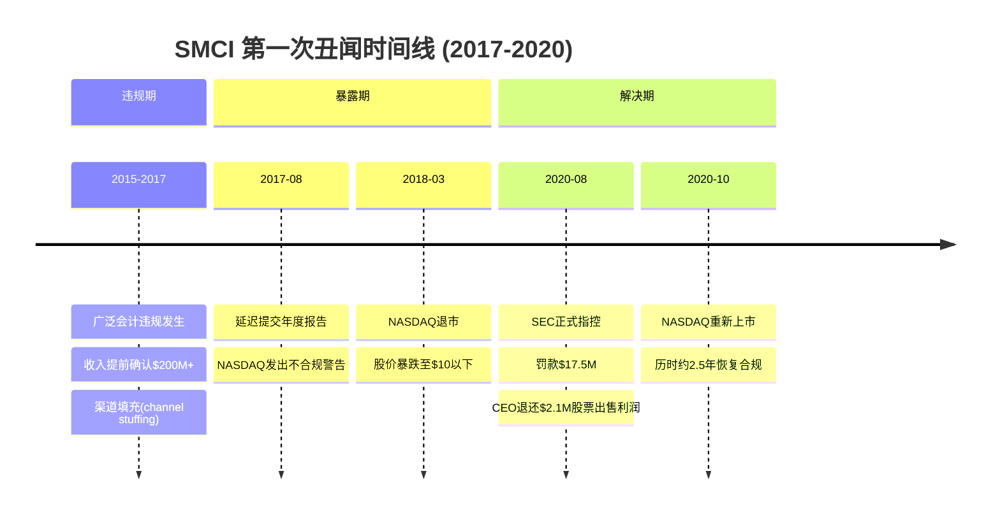
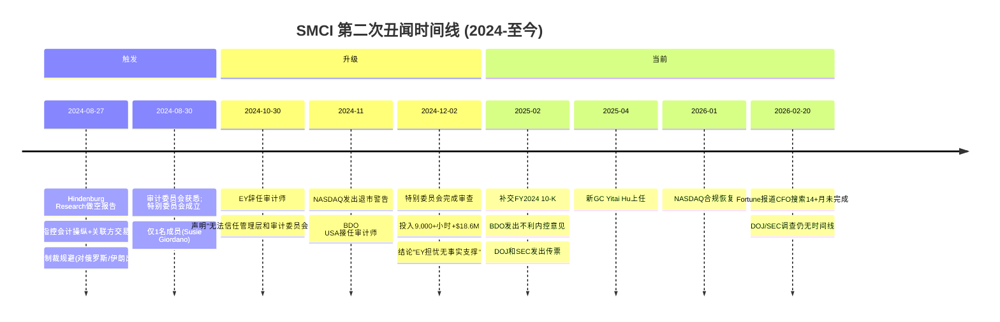
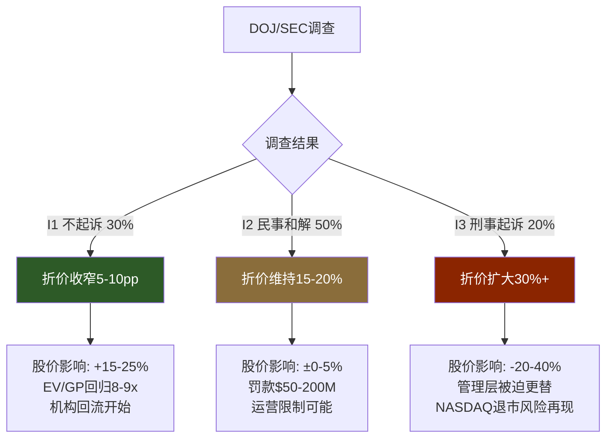
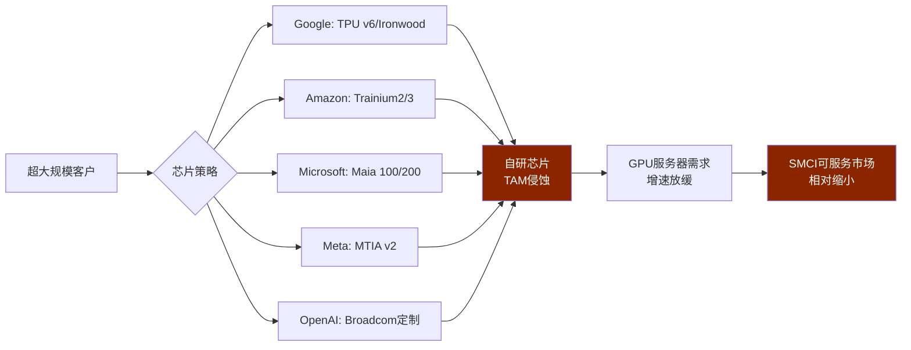
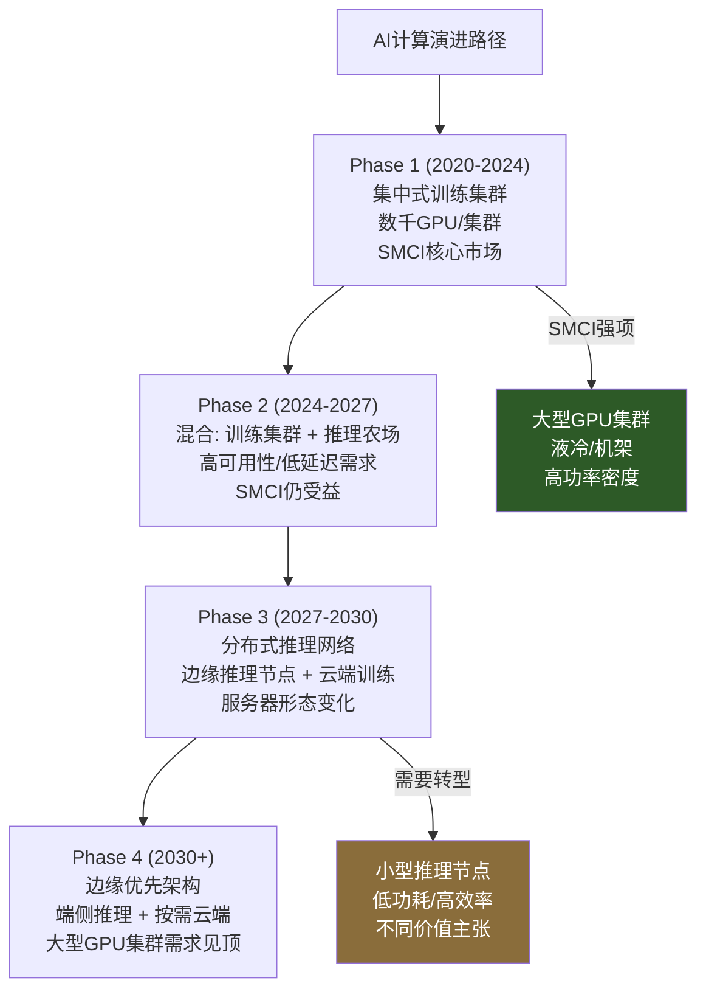

# SMCI 深度研究报告 — 第17-20章: 治理折价 + 管理层评估 + AI冲击矩阵 + 组装商历史类比

---

## 第17章: 治理折价量化 — 丑闻时间线与信任恢复模型

### 本章核心发现

> SMCI是美国公开市场上罕见的"会计丑闻惯犯"——在2017-2020年首次SEC处罚后仅4年就陷入第二次审计危机。历史案例研究表明，惯犯公司的信任恢复半衰期是首次犯错公司的2-3倍。当前EV/GP 9.4x（溢价于Dell 6-8x）暗示市场对治理几乎零折价，这与DOJ/SEC调查悬而未决的现实严重脱节。合理的治理折价应为15-25%，相当于$4.85-$8.10/股的估值调整。

---

### 17.1 丑闻双时间线: 从"初犯"到"惯犯"

SMCI的治理危机并非一次性事件，而是一个反复出现的制度性模式。两次丑闻之间的相似性——涉及同一批管理层、相似的会计违规指控、相似的监管应对路径——构成了一个在大盘科技股中极为罕见的"惯犯"画像。

#### 第一次丑闻 (2017-2020): 从违规到罚款

第一次丑闻的关键细节: SEC指控SMCI在2015-2017年间进行了"广泛的会计违规"(widespread accounting violations)，主要手段包括提前确认收入、不当计入费用、以及渠道填充。最终罚款$17.5M，CEO Charles Liang被要求退还$2.1M的股票出售利润 [DM-MGT-002]。公司于2018年3月被NASDAQ退市，经过约2.5年的整改后于2020年10月重新上市。

值得注意的是，在这一轮中: (1) CEO Liang未被要求辞职; (2) 公司支付了罚款但未承认或否认指控; (3) 核心管理团队基本未变。这为第二次事件埋下了制度性种子。

#### 第二次丑闻 (2024-2026): 惯犯模式重现

第二次丑闻的几个关键差异使其比第一次更具破坏性:

**1. 外部审计师主动辞任。** EY的辞任声明措辞异常强硬——"unable to rely on management's and the Audit Committee's representations"——这在四大审计师历史上极为罕见 [DM-MGT-005]。对比第一次丑闻中审计师的相对被动，EY的主动退出是一个质的升级。

**2. 特别委员会的独立性存疑。** 调查由仅一个月前才加入董事会的Susie Giordano独力执行(one-person Special Committee) [DM-MGT-004]。虽然其投入了9,000+小时和4.1TB数据，但一人委员会的结构本身就会引发"标记自己作业"的质疑。

**3. DOJ介入。** 第一次丑闻以SEC民事处罚结案。第二次中DOJ发出传票 [DM-NEW-C-017]，意味着可能涉及刑事层面。DOJ调查的结果空间远大于SEC。

**4. 惯犯溢价。** 首次犯错可被视为管理疏忽或制度不健全。两次犯错指向系统性的治理文化缺陷——同一CEO、同一家族控制结构、相似的违规模式。

#### 两次丑闻对比表

| 维度 | 第一次 (2017-2020) | 第二次 (2024-至今) | 惯犯信号 |
|------|-------------------|-------------------|---------|
| 触发方 | 公司延迟报告 | Hindenburg做空报告 | 外部发现>内部自查 |
| 核心指控 | 收入提前确认$200M+ | 会计操纵+关联方+制裁 | 指控范围扩大 |
| 审计师角色 | 未主动辞任 | EY主动辞任(措辞强硬) | 严重程度升级 |
| 监管机构 | SEC民事处罚 | DOJ传票+SEC传票 | 刑事风险新增 |
| 罚款/和解 | $17.5M | 未解决 | 悬而未决=更大不确定性 |
| CEO责任 | 退还$2.1M | 未定 | CEO始终在位 |
| NASDAQ状态 | 退市→重新上市 | 险遭退市→恢复合规 | 二次退市威胁 |
| 管理层更替 | 基本未变 | 新增2独立董事+新GC | 改革力度有限 |
| 解决时间 | ~2.5年 | >1.5年，仍在进行中 | 时间更长 |

---

### 17.2 信任恢复半衰期模型: 历史案例对标

为量化SMCI的治理折价应该持续多久、程度多深，我们研究了5个经历会计丑闻的历史案例，提取其估值折价恢复的时间轨迹。

#### 案例1: Luckin Coffee (中国/美国, 2020)

- **丑闻**: 2020年4月自曝虚构$310M收入，2020年6月NASDAQ退市
- **SEC处罚**: $180M罚款
- **股价轨迹**: 峰值$50.02(2020.01) → 谷底$1.40(2020) → OTC交易$8.20(2022.05) → ~$25(2025, OTC)
- **估值恢复**: 约5年后市值恢复至~$10.9B(峰值时~$12B)，但至今未能重返主要交易所
- **恢复条件**: 管理层全面更换、新CEO郭谨一推动深度运营改革、成为中国最大咖啡连锁
- **信任半衰期**: ~3年(从谷底到运营证明) → ~5年(市值恢复)
- **关键教训**: 管理层全面更换是恢复的先决条件。Luckin更换了CEO、CFO及整个高管团队，而SMCI的CEO始终在位

#### 案例2: Satyam Computer Services (印度, 2009)

- **丑闻**: 2009年1月创始人承认伪造₹7,000 crore(~$1.5B)账目
- **股价影响**: 暴跌55%单日; NYSE摘牌
- **恢复路径**: Tech Mahindra以₹58/股收购31%股权(不到丑闻前价值的1/3) → 更名Mahindra Satyam → 2013年完成合并
- **估值恢复**: 4年(2009→2013)完成整合，但原股东仅收回~30%价值
- **信任半衰期**: 原品牌永久消亡; 通过并入大集团恢复信任需3-4年
- **关键教训**: 严重丑闻可能导致品牌永久消亡，需要外部信任注入(被信誉良好的公司收购)

#### 案例3: Hertz (美国, 2012-2020)

- **丑闻**: 2012-2014年间会计造假$235M，CEO施压下属"找钱"(find money)
- **SEC处罚**: $16M罚款(2019); CEO Frissora退还$1.98M+$200K罚款
- **后续**: 会计丑闻后治理改善有限 → 2020年COVID冲击下申请破产
- **信任半衰期**: 未恢复——会计丑闻埋下的隐患在外部冲击下彻底爆发
- **关键教训**: 治理缺陷是"慢性病"，即使营收表面恢复，面对行业逆风时脆弱性会暴露

#### 案例4: Nidec Corporation (日本, 2025)

- **丑闻**: 意大利和中国子公司2018-2025年间进行会计造假+关税规避
- **影响**: 股价暴跌34%，PE从43.7x崩溃至10.6x
- **市值**: 截至2025年9月为$24.17B(相对恢复7.23%)
- **信任半衰期**: 尚在进行中，预计2-3年
- **关键教训**: 子公司造假("远距离"问题)的恢复通常快于总部层面的系统性造假

#### 案例5: ADM (美国, 2024)

- **丑闻**: 2024年初曝光营养部门会计问题，延迟报告
- **影响**: 股价经历"近一个世纪以来最大跌幅"
- **恢复状态**: 2025年仍面临投资者集体诉讼
- **关键教训**: 即使丑闻限于特定部门，信任恢复也需要2-3年

#### 信任恢复半衰期汇总

| 案例 | 犯错次数 | 恢复半衰期 | CEO更换? | 品牌存活? | 估值恢复率 |
|------|---------|-----------|----------|----------|-----------|
| Luckin Coffee | 1次(严重) | ~3年(运营) / ~5年(市值) | 全面更换 | 更名重塑 | ~90%(5年后) |
| Satyam | 1次(严重) | 品牌消亡 | 外部接管 | 并入Mahindra | ~30%(股东) |
| Hertz | 1次(中等) | 未恢复 | 更换CEO | 破产→重组 | ~0%(原股东) |
| Nidec | 1次(子公司) | ~2-3年(进行中) | 未换 | 存活 | ~70%(进行中) |
| ADM | 1次(部门) | ~2-3年(进行中) | 未换 | 存活 | ~80%(进行中) |
| **SMCI** | **2次(惯犯)** | **?** | **未换** | 存活 | **待定** |

**SMCI的独特困境**: 在上述5个案例中，没有一个是"惯犯"——它们都是首次犯错。SMCI作为唯一的两次犯错公司，其信任恢复半衰期理论上应为首次犯错公司的**2-3倍**。以Luckin的3年为基准，SMCI可能需要**6-9年**才能完全恢复市场信任——如果DOJ调查结果为不起诉的话。如果DOJ起诉，则可能走向Hertz/Satyam式的路径。

---

### 17.3 CI-04: CEO激励错配的完整分析

核心矛盾结晶CI-04揭示了一个被多头叙事遮蔽的激励错位:

#### 表层叙事: "$1薪酬=利益一致"

CEO Charles Liang的公开薪酬结构看似极具吸引力:
- 基本年薪: $1(至少持续到2029年) [DM-MGT-010]
- 现金奖金: 零
- 薪酬主体: 多年期绩效股票期权(行权价含溢价: 2021年$4.50高于授予日32%, 2023年$45高于授予日~53%)
- Say-on-Pay: 97%股东赞成(2024.01)

这个结构传递的信号是: CEO只有在股价上涨时才能获利，因此利益与股东完全一致。

#### 深层现实: 行为数据与叙事矛盾

**行为数据点1: 5年零买入, 23次卖出**

CEO Liang在5年间进行了23次股票卖出、**零次**公开市场买入 [DM-SMT-029]。仅过去6个月就卖出了$36.8M。如果CEO真的对公司前景充满信心，为什么在股价从$118跌至$32(-73%)的过程中没有进行过一次增持?

关键交易记录:
- 2025-07-28: 卖出200,000股 @ ~$60，套现$12M [DM-SMT-023]
- 2025-05-14: 卖出184,694股 + 15,306股 @ ~$50 [DM-SMT-024/025]
- 2025-02-26: 卖出46,293股 @ $50.17 [DM-SMT-026]

这些卖出发生在股价远高于当前水平时，表明CEO判断(或至少行动)与"股票被低估"的叙事不一致。

**行为数据点2: $1薪酬降低了持股的机会成本**

$1基薪+零现金奖金意味着CEO不需要从外部劳动收入中拿出资金来维持持股。他的持股来自低成本的期权行权和RSU授予，而非个人资本投入。因此，"CEO拿$1薪酬"并不等于"CEO把身家押在公司上"——他的持股成本远低于市价。

**行为数据点3: 关联方交易是间接价值提取**

Ablecom和Compuware——分别由CEO的兄弟Steve Liang(持股28.8%)和Bill Liang控制，CEO夫妇(Charles Liang和Sara Liu)持有Ablecom 10.5%股权——在3年内从SMCI获得了$983M的订单 [DM-MGT-006]。这两家公司99.8%(Ablecom)和99.7%(Compuware)的美国出口归宿于SMCI。

这意味着CEO家族通过关联方交易间接从SMCI提取了可观的经济利益。即使关联方定价是公允的(特别委员会的结论)，这种结构本身就创造了利益冲突的外观——CEO有动机扩大SMCI收入(推高关联方订单)而非最大化利润率。

**行为数据点4: 前CFO被关联方再雇佣**

前CFO Howard Hideshima因第一次丑闻与SEC和解，支付了$350K+罚款。随后他被Ablecom(CEO兄弟控制的关联方)雇佣。一个因会计违规被处罚的高管被CEO家族的关联方重新雇佣——这不是一个健康的治理文化信号。

#### CI-04的投资含义

| 叙事 | 现实 | 折价含义 |
|------|------|---------|
| CEO年薪$1=苦行僧式奉献 | 通过期权/RSU低成本获取股票后持续变现 | 激励≠一致 |
| $1薪酬证明对公司有信心 | 5年23次卖出零买入证明用脚投票 | 信心折价 |
| 关联方交易经特别委员会审查无问题 | $983M/3年通过家族企业流转 | 利益输送风险 |
| CEO利益与股东一致 | CEO通过关联方可在GM下降时仍获益 | 利益分离 |

---

### 17.4 治理折价量化: 应该是多少?

#### 当前市场定价的隐含折价

EV/GP是评估低毛利组装商的正确指标(EV/Sales在GM<10%时产生系统性误导):
- **SMCI EV/GP**: ~9.4x [DM-VAL-006]
- **Dell EV/GP**: ~6-8x(可比组装商)
- **隐含治理折价**: 9.4x > 6-8x → **治理折价 ≈ 0%**，甚至可能为负(溢价)

这意味着市场在当前估值中没有对SMCI的治理风险定价。对于一个:
- 两次会计丑闻(惯犯)
- DOJ/SEC调查进行中
- 审计师主动辞任
- CFO搜索14+月未完成
- CEO家族关联方交易$983M

的公司而言，**零折价是不合理的**。

#### 合理治理折价区间

基于历史案例和风险因素，我们建模三个折价情景:

| 因素 | 折价贡献 | 逻辑 |
|------|---------|------|
| 惯犯溢价(vs首犯) | 5-10% | 两次丑闻的制度性信号 |
| DOJ调查悬而未决 | 5-10% | 刑事风险概率×影响 |
| CFO搜索困境 | 2-3% | 14+月找不到人=红旗 |
| CEO激励错配 | 3-5% | 零买入+关联方交易 |
| **合计** | **15-25%** | |

以当前EV/GP 9.4x为基准:
- 15%折价 → 合理EV/GP ~8.0x → 隐含股价~$27.6(下行~15%)
- 20%折价 → 合理EV/GP ~7.5x → 隐含股价~$25.9(下行~20%)
- 25%折价 → 合理EV/GP ~7.1x → 隐含股价~$24.3(下行~25%)

---

### 17.5 三情景DOJ结果模型

DOJ/SEC调查的结果是SMCI未来12-24个月最大的二元催化剂 [DM-NEW-C-017]。

#### 情景I1: 不起诉/调查结案 (概率30%)

- **前提**: DOJ认为证据不足以达到刑事标准，SEC接受民事和解
- **影响**: 治理折价从当前的0%合理化至5-10% → EV/GP回归8-9x
- **股价含义**: +15-25%(从$32.42至$37-$40)
- **催化时间**: 12-18个月
- **类比**: Nidec——子公司问题、不更换CEO、逐步恢复

#### 情景I2: 民事和解 (概率50%)

- **前提**: DOJ降格为民事诉讼或SEC罚款; 可能附带运营合规要求
- **影响**: 罚款$50-200M(参考第一次的$17.5M，考虑规模扩大和惯犯因素)
- **股价含义**: ±0-5%(已在当前价格中部分消化)
- **催化时间**: 18-30个月
- **类比**: Hertz——支付罚款+CEO退还利润，但治理悬疑未完全解除

#### 情景I3: 刑事起诉 (概率20%)

- **前提**: DOJ认定存在蓄意欺诈/制裁违规，提起刑事诉讼
- **影响**: CEO可能被迫辞职; 公司面临重大罚款+运营限制; NASDAQ退市风险再现
- **股价含义**: -20-40%(从$32.42至$19-$26)
- **催化时间**: 24-48个月(刑事诉讼时间较长)
- **类比**: 如果起诉后管理层全面更换，走Luckin路径(5年重建); 如果拒绝改革，走Hertz路径(最终崩溃)

**概率加权影响**: 0.30×(+20%) + 0.50×(+2.5%) + 0.20×(-30%) = +1.25%

概率加权后的净影响接近于零，说明**DOJ调查本身不是一个明确的方向性催化剂，而是一个波动率放大器**。关键不在于期望值(接近中性)，而在于尾部风险的不对称性——上行有限(+20%)但下行可观(-30%)。

---

### 17.6 CFO搜索困境: 14+个月的沉默是什么信号?

2024年12月特别委员会完成审查后，公司承诺"立即"(immediately)启动新CFO搜索。截至2026年2月20日——**14个月后**——David Weigand仍在任，公司未提供任何搜索进展的公开更新 [DM-MGT-008]。

这个事实本身传递了重要信号:

**假说A: 找不到合格候选人**

大型上市公司的CFO搜索通常在3-6个月内完成。14+月的延迟暗示候选人不愿意加入一家:
- 正在接受DOJ/SEC调查的公司
- 审计师刚刚辞任(且措辞极端负面)的公司
- BDO出具了不利内控意见的公司
- CEO家族控制结构(Liang家族~28%持股)可能限制CFO独立性的公司

如果四大审计出身的资深CFO候选人(这种职位的典型profile)因声誉风险拒绝加入，这本身就是一个由市场参与者(人才市场)给出的"治理质量评分"。

**假说B: 公司并不急于更换**

Weigand担任CFO期间公司收入增长了6倍(FY2021 $3.6B → FY2025 $22B)。从管理层角度，保留熟悉业务的CFO可能比引入外部人更有利——特别是在DOJ调查期间，新CFO可能会"看到太多"。

**假说C: 治理改革是表演性的**

承诺搜索新CFO可能是为了安抚NASDAQ退市审查和投资者信心，而非真正的治理改革意图。这与CEO的$1薪酬叙事类似——形式上对齐利益，实质上维持现状。

无论哪个假说成立，CFO搜索的14+月延迟都是**治理信任赤字的量化证据**。在人才市场上，SMCI的治理折价已经被定价了——高管候选人用脚投票。

---

### 17.7 治理折价的长期演进路径

基于信任恢复半衰期模型，SMCI的治理折价预计演进如下:

| 时间 | 前提条件 | 折价水平 | 催化剂 |
|------|---------|---------|--------|
| 当前(2026.02) | DOJ进行中 | 15-25%(合理) vs 0%(市场) | 错位=风险 |
| 2026 H2 | DOJ结案(I1/I2) | 10-15% | 解除悬疑 |
| 2027 | 连续4Q GM改善 + 新CFO到位 | 5-10% | 运营+治理双证明 |
| 2028-2029 | 无新丑闻 + 内控意见改善 | 3-5% | 时间修复 |
| 2030+ | 管理层更替(CEO退休/继任) | 0-3% | 制度性风险移除 |

**关键假设**: 上述路径基于I1/I2情景。如果I3(刑事起诉)发生，折价可能在2-3年内维持在20-30%。

---

## 第18章: 管理层评估

### 本章核心发现

> CEO Charles Liang展现了一种罕见的"双面画像"——32年企业家精神将公司从创业团队打造成$22B收入的AI基础设施巨头(能力维度的A-级评分)，同时两次卷入会计丑闻并维持家族控制结构(治理维度的D级评分)。这种能力与治理的极端分裂使得传统的管理层评估框架失效——你无法简单地给出一个总分。

---

### 18.1 CEO画像: 能力A- vs 治理D

**Charles Liang, 创始人 / CEO / 董事长 / 总裁**

- **年龄**: ~70岁(估算)
- **任期**: 32年(1993年创立至今)
- **教育**: 台湾科技大学电子工程学士 + 德克萨斯大学阿灵顿分校电子工程硕士
- **职业路径**: Chips & Technologies高级设计工程师(1988-1991) → Micro Center Computer创始人(1991-1993) → Supermicro创始人(1993至今)
- **持股**: 约~28%家族控股(含Sara Liu间接持有) [DM-MGT-007]

#### 能力评估: A-

**成就清单**:
- 在32年中将公司从零打造成全球AI服务器基础设施的关键参与者
- FY2024收入增长+110%至$14.99B [DM-FIN-006]——极少有CEO能在单年交付三位数收入增长
- FY2025再增+46.6%至$21.97B [DM-FIN-001]，Q2 FY2026指引$40B+(+84% YoY) [DM-VAL-015]
- 在液冷技术(DLC)上押注正确，建立了12-18个月的领先优势 [DM-BIZ-31]
- 持有多项服务器技术专利，具有深厚的工程背景
- 在AI浪潮的关键时间窗口(2022-2023)果断扩产，使SMCI成为NVIDIA最早的大规模出货渠道

**能力短板**:
- 毛利率管理能力堪忧: GM从FY2023 18.0%持续下滑至Q2 FY2026 6.3% [DM-FIN-018]，CEO似乎将收入增长置于盈利质量之上
- 战略定价决策存疑: 以6.3% GM争夺份额的策略可能在短期交付收入但长期侵蚀公司价值
- 缺乏"从增长到利润"的转型经验: 32年创始人CEO擅长的是"造东西、卖东西"，而非利润率优化

#### 治理评估: D

**治理红旗**:
1. **两次会计丑闻**: 2017-2020 SEC罚款$17.5M + 2024-2026 EY辞任/DOJ调查 [DM-MGT-002, DM-MGT-005]
2. **CEO-Chairman-President三合一**: 没有披露首席独立董事(Lead Independent Director) [管理层数据]
3. **家族控制**: 妻子Sara Liu为联合创始人/SVP/董事; 兄弟控制关联方Ablecom(Steve Liang)和Compuware(Bill Liang)
4. **关联方交易规模**: $983M/3年流向CEO家族企业 [DM-MGT-006]
5. **CEO年龄与继任**: ~70岁，无公开继任计划
6. **5年零买入**: 作为最大内部人，在股价跌73%时没有一次公开市场买入 [DM-SMT-029]

**综合评价**: 如果你将CEO评估拆分为"你是否愿意把钱交给这个人去建公司?"(Yes)和"你是否信任这个人的会计和治理?"(No)，Charles Liang可能是大盘科技股CEO中能力-信任偏差最极端的一位。

---

### 18.2 CFO与关键岗位

#### CFO: David Weigand

- **年龄**: ~66岁
- **任期**: 5年(2021年2月从首席合规官晋升)
- **背景**: 税务专业出身(University of Hartford MS Taxation, San Jose State BS Accounting)
- **前职**: HPE VP(2016-2018), SGI VP-Tax, NEC/Renesas CFO & VP(2004-2013)
- **持股**: 100,188股(~$3M) [管理层数据]

**评估**: Weigand不是"典型的大型科技公司CFO"——他从合规官晋升，背景偏税务而非战略财务。在SMCI规模从$3.6B增长到$22B的过程中，CFO角色的复杂度已远超其原始mandate。公司在2024年12月承诺搜索新CFO但14+月未果 [DM-MGT-008]，Weigand"临时转正式"的局面持续。

#### 关键岗位变动

| 岗位 | 人员 | 状态 | 风险评级 |
|------|------|------|---------|
| CEO/Chairman/President | Charles Liang | 在位(32年) | 继任风险高 |
| CFO/SVP | David Weigand | 搜索替代中(14+月) | 关键空缺 |
| SVP Operations | Tom Xiao(接替George Kao) | 新任(2025.12后) | 过渡期 |
| General Counsel | Yitai Hu | 新任(2025.04) | 正面信号 |
| SVP/Director | Sara Liu(CEO妻子) | 在位 | 治理风险 |

**管理层深度风险**: CEO约70岁且无继任计划 + CFO角色14+月空悬 + SVP Operations刚完成交接 = 关键人风险集中于CEO一人。如果Liang因健康、DOJ调查或其他原因突然离任，SMCI缺乏明确的管理层接棒机制。

---

### 18.3 董事会独立性: 70%的独立性够吗?

#### 董事会构成

10名董事中7名被归类为"独立":

| 董事 | 独立? | 背景/关注点 |
|------|------|------------|
| Charles Liang | 否 | 创始人CEO/Chairman/President |
| Sara Liu | 否 | CEO妻子/联合创始人/SVP |
| Wally Liaw | 否 | 创始成员，2023年回归，与2018年丑闻期有关联 |
| Daniel Fairfax | 是 | |
| Tally Liu | 是 | |
| Sherman Tuan | 是 | |
| Judy Lin | 是 | |
| Robert Blair | 是 | |
| Susie Giordano | 是 | 2024.08加入; 一人特别委员会; 25年科技行业董事会经验 |
| Scott Angel | 是 | 2025年加入; ~40年审计/风控经验 |

**表面**: 70%独立性符合NASDAQ标准，且近期新增了两位具有审计/合规背景的独立董事(Giordano和Angel)。

**实质问题**:

1. **特别委员会的独立性悖论**: Susie Giordano在加入董事会仅一个月后就被委任为一人特别委员会领导$18.6M的调查。一个刚加入的董事——其任命本身需要CEO/Chairman的支持——能否真正独立地调查CEO领导的管理层?

2. **Wally Liaw的回归**: 一个在2018年丑闻期间在任的创始成员在2023年回归董事会。如果首次丑闻与董事会监督失败有关，重新引入同一批董事传递了什么信号?

3. **CEO-Chairman合一**: 在两次丑闻后，未将CEO和Chairman角色分离，也未设置首席独立董事，这是一个不寻常的决定。对比同行: Dell有独立Chairman Michael Dell退出后设置了Lead Independent Director。

4. **投票数学**: 即使7名独立董事在某个议题上意见一致，三名内部人(Liang夫妇+Liaw)持有的约28%投票权(加上Liang家族的直接持股)使得代理投票中推翻管理层提案几乎不可能。

---

### 18.4 内部人交易模式: 全面看空的信号

内部人交易数据提供了管理层对公司前景的"行动投票":

| 季度 | 买入笔数 | 卖出笔数 | 买/卖比 | 公开市场卖出 | 信号 |
|------|---------|---------|---------|------------|------|
| 2026 Q1 | 27 | 37 | 0.73 | 0 | 偏空 |
| 2025 Q4 | 23 | 45 | 0.51 | 2 | 强烈看空 |
| 2025 Q3 | 49 | 62 | 0.79 | 6 | 偏空 |
| 2025 Q2 | 23 | 42 | 0.55 | 8 | 强烈看空 |
| 2025 Q1 | 24 | 30 | 0.80 | 5 | 偏空 |

[DM-SMT-030]

**每个季度都是净卖出**。没有一个季度的买/卖比超过1.0。CEO的个人记录(5年零买入, 23次卖出)是整体模式的极端版本 [DM-SMT-029]。

**与同行对比**: 在大多数科技公司，特别是经历大幅下跌后，CEO或其他高管通常会进行象征性的公开市场买入以提振信心。NVIDIA的Jensen Huang在2022年芯片低谷时有买入记录; AMD的Lisa Su在AMD股价低迷时持续增持。SMCI管理层的全面卖出在AI基础设施同行中是独特的——也是令人担忧的。

---

### 18.5 薪酬结构分析: 看似一致，实则错配

#### CEO薪酬结构

- 基本薪酬: $1/年(至少到2029年)
- 现金奖金: 零
- 股权激励: 多年期绩效期权，行权价含溢价
  - 2021年授予: 行权价$4.50(高于授予日32%)
  - 2023年授予: 行权价$45.00(高于授予日~53%)
- SBC费用(公司层面): FY2025 $314.5M [DM-MGT-010]

#### CFO薪酬结构

- PRSUs + 期权(与股价和收入KPI挂钩)
- 现金固定奖金: 基薪的30%(弥补市场分位差距)
- 持股: 100,188股(~$3M)——对一个$22B收入公司的CFO来说偏低

#### 错配分析

**表面一致**: CEO薪酬与股价高度相关 → 激励CEO推动股价上涨。

**实际错配**:
1. **收入 vs 利润的激励偏差**: 行权价溢价设计激励CEO推动股价(通常由收入增长驱动)而非利润率改善。这解释了为什么CEO愿意以6.3% GM换取$12.68B收入(Q2 FY2026)——收入增长更直接驱动股价上涨，而利润率下降的效果更缓慢
2. **期权获取成本 vs 市价**: CEO通过期权行权获得股票的成本远低于市价。即使在$32的当前股价下，以$4.50行权的期权仍有$27.50/股的内在价值。持续卖出这些低成本股票≠对公司悲观
3. **SBC的股东成本**: FY2025 SBC $314.5M约等于净利润$1.049B的30%。股份3年稀释19.87% [DM-FIN-045]。CEO的$1薪酬用股东的稀释买单

---

### 18.6 继任风险: 被忽视的尾部因素

CEO Charles Liang约70岁，持续在位32年，无公开继任计划。以下因素使继任风险成为一个需要纳入估值的尾部因素:

1. **无明确的二号人物**: CFO正在搜索替代; SVP Operations刚完成交接; GC才上任10个月。没有一个高管具有接替CEO的公开准备度
2. **家族控制的复杂性**: Sara Liu(CEO妻子)持有大量间接持股(~66.9M股)并同时担任SVP和董事。继任过程需要处理家族利益
3. **知识集中**: 作为创始人和技术出身的CEO，Liang对公司的产品架构、NVIDIA关系、客户网络具有不可替代的知识积累
4. **DOJ风险叠加**: 如果DOJ调查升级(I3情景)，CEO可能被迫辞职而非主动规划继任——这是最糟糕的继任方式
5. **AI行业快速变化**: 继任者需要同时处理治理重建(=转型CEO)和AI基础设施竞争(=增长CEO)，这两种能力极少在同一人身上并存

---

## 第19章: AI冲击矩阵 — 自定义芯片、推理密集化与SMCI的定位

### 本章核心发现

> AI计算正在经历三重结构性变迁: (1) 超大规模客户从购买GPU转向自研芯片; (2) 工作负载从训练主导转向推理主导; (3) 部署从集中式大集群转向分布式边缘。这三个趋势对SMCI的影响方向不同——自研芯片削弱GPU服务器需求(利空)、推理密集化可能增加总计算量(中性偏多)、边缘分布要求不同的服务器形态(需要转型)。综合评估，AI生态演进在3-5年内对SMCI的净影响为**中性偏空**。

---

### 19.1 自定义芯片: 超大规模客户"去GPU化"进程

四大超大规模客户各自的芯片进展:

#### Google: TPU系列

Google是自研AI芯片的先驱，2015年推出首款TPU。2025年11月发布第7代TPU Ironwood，AI ASIC已有十年技术积累。标志性事件: 2025年10月，Anthropic签署了价值数百亿美元的协议，将获得多达100万颗TPU芯片，预计2026年上线超过1GW计算容量。

**对SMCI影响**: Google的TPU集群不使用标准GPU服务器——它们使用Google自己的定制主板和散热方案。每一颗部署在TPU集群中的芯片 = 一颗未购买的NVIDIA GPU = 一台未被SMCI出货的服务器。

#### Amazon: Trainium系列

AWS在印第安纳州建成了最大的AI数据中心，Anthropic在其中使用50万颗Trainium2芯片进行模型训练。AWS宣称Trainium在推理工作负载上较GPU可节省**高达50%的成本**，对推理密集型客户极具吸引力。

**对SMCI影响**: AWS已经是SMCI的客户(购买GPU服务器)，但Trainium的持续部署意味着AWS的"增量AI计算支出"中越来越大的比例不会流向GPU服务器供应商。

#### Microsoft: Maia系列

Microsoft的Maia芯片已部署于Copilot服务。原计划2025年发布的新版本推迟至2026年。虽然进度落后于Google/Amazon，但Microsoft的AI计算需求(GitHub Copilot, Bing AI, Office 365 Copilot, Azure OpenAI)是最大的。

**对SMCI影响**: 中期(2-3年)内影响有限(Maia进度落后); 长期(5年+)微软可能将推理工作负载的50%+迁移至自研芯片。

#### Meta: MTIA系列

Meta的MTIA v2实现了**44% TCO(总持有成本)降低**——这是最引人注目的效率数据。Meta的AI工作负载(推荐系统、内容排序、广告定向)属于推理密集型，天然适合定制优化的ASIC。

**对SMCI影响**: Meta的MTIA主要替代推理工作负载中的GPU，训练仍依赖NVIDIA。但随着推理占AI计算的比例从2023年的1/3上升至2026年的2/3，Meta的MTIA部署将覆盖越来越大的计算份额。

#### 量化影响: 三情景替代率模型

| 时间框架 | 自研芯片替代率 | 对GPU服务器TAM影响 | SMCI可服务市场变化 |
|---------|-------------|------------------|-------------------|
| 2026-2027 | ~5-10% | TAM从$854B降至$770-$810B | 影响有限(SMCI份额7-10%不变) |
| 2028-2029 | ~15-20% | TAM有效缩小$130-$170B | SMCI若不进入ASIC服务器，份额面临挤压 |
| 2030+ | ~25-30% | GPU服务器TAM增长率可能从34%降至20-25% | 结构性天花板 |

**关键假设**: 自研芯片主要替代推理工作负载中的GPU。训练工作负载(需要NVIDIA的CUDA生态+最新GPU)在中期内仍由GPU主导。因此，替代率的上限受制于推理占总计算的比例。

行业共识预期: 自研芯片将捕获15-25%的市场份额——主要是超大规模客户的内部推理工作负载。NVIDIA的份额可能从85%+正常化至75%左右。但这种变化将是渐进的。

---

### 19.2 推理密集化: Jevons悖论 vs 效率陷阱

AI计算正在从"训练主导"向"推理主导"转型:
- 2023年: 训练占2/3，推理占1/3
- 2025年: 各占50%
- 2026年: 推理占2/3，训练占1/3(Deloitte预测)
- 推理优化芯片市场2026年将超过$50B

#### AI Agent经济: 推理需求的乘数效应

Agent工作流(自主AI代理执行复杂任务)代表了推理计算需求的结构性增长驱动:

- **复合推理**: 一个Agent任务可能需要数十次模型调用(规划→执行→验证→修正)
- **持续运行**: 与单次查询不同，Agent可能持续运行数小时至数天
- **Jevons悖论**: 每单位推理成本下降 → 推理总需求可能以更快速度增长(需求弹性>1)

Deloitte的分析指出: "AI的下一阶段可能需要**更多**而非更少的计算能力"——即使单位效率提升，总需求的增长可能超过效率收益。

#### 但效率提升可能降低单位价值

反方论点同样有力:
- **模型压缩**: 蒸馏+量化可以将大模型(175B参数)的推理成本降低5-10倍
- **推测解码**: 使用小模型预测+大模型验证，提高每GPU推理吞吐量2-3倍
- **MoE架构**: Mixture of Experts使得推理时只激活部分参数，降低计算需求

**SMCI的困境**: 如果单位推理成本大幅下降，即使总推理量增加，每单位推理所需的服务器硬件可能减少。这对"卖更多服务器"的SMCI不利。

#### 净效应评估

| 因素 | 方向 | 强度 | 时间框架 |
|------|------|------|---------|
| Agent经济增加总推理量 | 利多 | 中 | 1-3年 |
| Jevons悖论(效率↑→需求↑↑) | 利多 | 中-强 | 2-5年 |
| 模型压缩降低单位成本 | 利空 | 中 | 1-2年 |
| 自研芯片替代GPU推理 | 利空 | 中 | 3-5年 |
| **净效应** | **中性偏多**(短期) / **中性偏空**(长期) | | |

---

### 19.3 推理密度化: 从大集群训练到分布式边缘

当前AI计算基础设施正在经历的转型:

**短期(1-2年): 仍以集中式GPU集群为主**

2025-2026年的AI基础设施投资仍然以高端加速器服务器为主导。超大规模客户(Hyperscalers)的CapEx继续增长——这是SMCI的核心市场。NVIDIA的Vera Rubin平台(NVL72/NVL144)将驱动新一轮集群部署需求 [DM-NEW-C-005]。

**中期(3-5年): 推理需求推动基础设施多样化**

随着推理工作负载占比上升至2/3以上，数据中心需求发生质变:
- **地理分布**: 推理需要低延迟 → 需要更多地理分散的小型数据中心(vs 少数几个大型训练集群)
- **高可用性**: 推理是面向用户的实时服务 → 需要冗余和高可用设计(vs 训练可以批处理)
- **功耗效率**: 推理优化更看重perf/watt而非绝对性能 → 可能不需要DLC级的散热方案

IDC预测AI用例将推动边缘计算支出到2028年达到$378B。

**长期(5-10年): 服务器形态可能根本性变化**

如果AI推理真的大规模迁移到边缘(手机、IoT设备、企业本地部署)，大型GPU集群的增长率将放缓。SMCI的核心价值主张(高功率密度GPU机架+液冷)在边缘场景中的相关性降低——边缘推理节点不需要120kW/rack的DLC-2液冷方案。

---

### 19.4 SMCI在AI生态演进中的定位

综合评估SMCI在AI三重转型中的位置:

| 趋势 | 对SMCI影响 | 应对能力 | 风险等级 |
|------|-----------|---------|---------|
| 自研芯片替代GPU | 负面: 缩小可服务市场 | 低: SMCI的价值在GPU集成, 非芯片设计 | 中-高 |
| 推理密集化 | 中性: 总量增但单价降 | 中: 推理服务器仍需SMCI | 中 |
| 边缘分布化 | 负面: 需要不同产品形态 | 低-中: SMCI有边缘产品线但非核心 | 中 |
| DLC需求增长 | 正面: GPU TDP→1000W+使DLC成刚需 | 高: 12-18月领先优势 | 低 |
| NVIDIA平台迭代 | 正面: 每代新GPU驱动更换周期 | 高: 与NVIDIA深度合作 | 低 |

**核心判断**: SMCI在Phase 2(2024-2027)中仍能受益——大规模训练集群需求持续增长，DLC成为刚需。但Phase 3(2027-2030)及之后，SMCI需要转型:

1. **进入ASIC服务器市场**: 如果超大规模客户自研芯片占比升至20%+，SMCI需要证明其系统集成能力不仅限于GPU(也能集成TPU/Trainium/Maia)。目前SMCI的64.4%采购来自NVIDIA [DM-BIZ-14]——这种依赖度在芯片多元化趋势下是风险
2. **边缘推理产品线**: SMCI有边缘/嵌入式产品线，但占收入比例极小(>90%来自AI GPU平台 [DM-BIZ-07])。需要在边缘推理市场建立相关性
3. **软件/服务层**: 纯硬件组装商在生态演进中最脆弱。SMCI需要发展管理软件(rack management, cooling orchestration, fleet management)等高毛利附加值层

---

### 19.5 时间框架影响矩阵

| 时间 | 主导变化 | 对SMCI收入影响 | 对SMCI毛利率影响 |
|------|---------|-------------|---------------|
| 1-2年 | Vera Rubin部署周期 | 正面(+20-30%) | 中性(GM仍被GPU BOM压制) |
| 3-5年 | 自研芯片+推理密集化 | 中性(收入增长放缓至10-15%) | 负面(如SMCI无法进入ASIC服务器) |
| 5-10年 | 边缘分布+计算多元化 | 不确定(取决于转型能力) | 不确定 |

**投资含义**: SMCI在1-2年内有AI周期的顺风，但3-5年的AI生态演进对其不利。这使得SMCI更像一个"周期性交易"而非"长期持有"——在Vera Rubin周期中获益，但在AI计算多元化到来前需要审视退出时机。

---

## 第20章: "组装商陷阱"历史类比 — 增长真实但利润被榨取的宿命

### 本章核心发现

> 历史上存在一类公司: 它们在行业上行周期中实现了令人印象深刻的收入增长，但利润率被上游供应商和下游竞争永久性压缩，导致股东回报远低于收入增长。Flex(EMS代工)、SLB(油田服务)和Peloton(消费硬件)分别从不同角度验证了这个"组装商陷阱"模式。SMCI与Flex的相似度最高——$25B+收入、GM 6-8%、高度依赖上游关键组件——这暗示SMCI的估值终局可能是Flex式的10-15x PE，而非科技成长股的25-40x PE。

---

### 20.1 类比框架: 什么是"组装商陷阱"?

"组装商陷阱"(Assembler's Trap)描述了一种特定的商业模式困境:

**定义**: 当一家公司的核心功能是将上游供应商的高价值组件集成为下游客户的解决方案时，如果该公司:
1. 对上游关键组件(核心BOM)缺乏议价权
2. 对下游客户(终端买家)缺乏差异化定价权
3. 进入壁垒相对低(竞争者可以获取相同上游组件)

那么即使收入增长迅速，利润率也会被上下游双向挤压至"仅够维持运营"的水平。

**SMCI的适配度**: GPU占SMCI BOM的70-80%，由NVIDIA独家定价 [DM-BIZ-14]; 下游客户(超大规模客户)具有极强议价权; Dell/HPE/ODM(Foxconn/Quanta)提供类似产品。三个条件全部满足。

---

### 20.2 类比1: Flex(伟创力) — 最精准的SMCI镜像

Flex Ltd.(前身Flextronics)是全球第三大电子制造服务(EMS)供应商——一个将"高收入低利润"组装商模式演绎到极致的公司。

#### Flex财务轨迹 (FY2016-FY2025)

| 财年 | 收入($B) | 毛利($M) | 毛利率 | 净利($M) | 净利率 | PE |
|------|---------|---------|-------|---------|-------|-----|
| FY2016 | 24.42 | 1,608 | 6.59% | 444 | 1.82% | ~15x |
| FY2017 | 23.86 | 1,521 | 6.37% | 320 | 1.34% | ~18x |
| FY2018 | 25.44 | 1,596 | 6.27% | 429 | 1.69% | ~12x |
| FY2019 | 26.21 | 1,518 | 5.79% | 93 | 0.35% | ~30x |
| FY2020 | 24.21 | 1,339 | 5.53% | 88 | 0.36% | ~50x |
| FY2021 | 24.12 | 1,687 | 6.99% | 613 | 2.54% | ~14x |
| FY2022 | 24.63 | 1,780 | 7.23% | 936 | 3.80% | ~10x |
| FY2023 | 28.50 | 1,976 | 6.93% | 793 | 2.78% | ~12x |
| FY2024 | 26.42 | 1,865 | 7.06% | 1,006 | 3.81% | ~15x |
| FY2025 | 25.81 | 2,159 | 8.36% | 838 | 3.25% | ~22x |

#### Flex vs SMCI对比

| 维度 | Flex | SMCI | 相似度 |
|------|------|------|--------|
| 收入规模 | $25.8B | $22.0B(FY25), $40B+(FY26E) | 高——同级别 |
| 毛利率 | 5.5-8.4%(10年区间) | 6.3-18.0%(3年区间，收敛至6-8%) | **极高** |
| 净利率 | 0.4-3.8% | 4.8%(FY25), Q2 FY26恶化中 | 高——趋同 |
| 核心功能 | 组装电子产品 | 组装AI服务器 | **极高** |
| 上游依赖 | 芯片+PCB+被动元件 | NVIDIA GPU(64.4%) | 高——SMCI更集中 |
| 下游客户 | OEM(Apple, Cisco等) | 超大规模/企业 | 高 |
| PE区间 | 10-22x(正常化) | 23x TTM / 11x Forward | 趋同中 |

**关键洞察**: Flex在10年间收入从$24B增长至$28.5B又回落至$25.8B——**几乎没有增长**。而其毛利率始终徘徊在5.5-8.4%区间。这不是因为Flex管理不善(该公司已投资更高附加值的设计和工程服务)，而是因为EMS的商业模式结构性地限制了利润率天花板。

SMCI的FY2023 GM 18.0%是AI浪潮早期的异常高值(竞争对手尚未到位)。随着Dell/HPE/ODM追赶，SMCI的GM正在"回归"EMS的结构性区间(6-8%)。Q2 FY2026的6.3%已经进入了Flex区间 [DM-FIN-010, DM-BIZ-09]。

**Flex的估值启示**: Flex的PE在正常化盈利时期(排除FY2019/2020的异常)为**10-22x**，中位数约15x。如果SMCI的利润率结构性收敛至Flex水平，那么SMCI的"合理PE"也应该在这个区间——而非当前Forward PE 11x暗示的"低估"。11x Forward PE看似便宜，但如果Forward EPS因GM继续下滑而被下调，"Forward"可能是虚幻的。

---

### 20.3 类比2: SLB(斯伦贝谢) — 周期性组装商的兴衰

SLB(原Schlumberger)是全球最大的油田技术服务公司。虽然SLB的技术含量远高于纯组装商(拥有大量专利和地质技术)，但它在油价周期中的利润率表现揭示了一个关键模式: **当上游资源价格决定行业繁荣程度时，中游服务商的利润率被周期无情压缩**。

#### SLB财务轨迹 (2016-2025)

| 年份 | 收入($B) | 毛利($B) | 毛利率 | 净利($B) | 行业背景 |
|------|---------|---------|-------|---------|---------|
| 2016 | 27.81 | 3.70 | 13.3% | -1.69 | 油价崩盘后衰退 |
| 2017 | 30.44 | 3.90 | 12.8% | -1.51 | 缓慢复苏 |
| 2018 | 32.82 | 4.34 | 13.2% | 2.14 | 油价回升 |
| 2019 | 32.92 | 4.20 | 12.8% | -10.11 | 减值+下行 |
| 2020 | 23.60 | 2.60 | 11.0% | -10.49 | COVID+油价暴跌 |
| 2021 | 22.93 | 3.66 | 16.0% | 1.88 | 复苏开始 |
| 2022 | 28.09 | 5.16 | 18.4% | 3.44 | 油价暴涨 |
| 2023 | 33.14 | 6.56 | 19.8% | 4.20 | 行业繁荣 |
| 2024 | 36.29 | 7.46 | 20.6% | 4.46 | 峰值 |
| 2025 | 35.71 | 6.50 | 18.2% | 3.35 | 开始回落 |

#### SLB类比的适用性

**相似之处**:
1. **上游决定论**: SLB的繁荣完全取决于油价(决定勘探开发支出) → SMCI的繁荣完全取决于NVIDIA GPU供给和AI CapEx周期
2. **周期性收入**: SLB收入从$48.6B(2014峰值)暴跌至$22.9B(2021) → 跌幅53%。SMCI尚未经历真正的下行周期，但AI CapEx放缓时可能面临类似幅度的调整
3. **利润率波动**: SLB GM在11%-20.6%间大幅波动。SMCI的GM从18%到6.3%的下滑甚至更剧烈

**关键差异**:
1. **SLB有真正的技术护城河**: 地质建模、钻井技术、储层评估——这些是高壁垒的专有技术，GM 13-20%反映了真实的知识壁垒。SMCI的GM 6.3%暗示其"组装"增值远低于SLB的"技术服务"增值
2. **SLB的客户分散**: SLB服务全球数千家石油公司。SMCI的收入高度集中于少数超大规模客户
3. **SLB的周期可预测性更高**: 油价周期有数十年历史可参考。AI CapEx周期是全新的，没有历史基准

**SLB的估值教训**:
- 2014年峰值(油价高位): PE ~18x
- 2016年谷底: 亏损，PE无意义
- 2022-2024年复苏高峰: PE ~15-18x
- 长期中位PE: **~15x**

SLB作为一个有真正技术护城河的油服巨头，其长期PE中位数仅15x。SMCI作为一个护城河更弱的AI服务器组装商，长期PE是否应该更高? 逻辑上不应该。

---

### 20.4 类比3: Peloton — 增长叙事崩塌的教训

Peloton不是传统意义上的"组装商"，但它的增长→崩塌轨迹提供了一个互补的教训: **当增长叙事是唯一支撑估值的因素时，增长放缓的后果是灾难性的**。

#### Peloton财务轨迹

| 财年 | 收入($B) | 毛利($B) | 毛利率 | 净利($B) | 股价峰/谷 |
|------|---------|---------|-------|---------|----------|
| FY2019 | 0.92 | 0.38 | 41.9% | -0.20 | IPO $29 |
| FY2020 | 1.83 | 0.84 | 45.9% | -0.07 | |
| FY2021 | 4.02 | 1.45 | 36.2% | -0.19 | 峰值$167 |
| FY2022 | 3.58 | 0.70 | 19.5% | -2.83 | 暴跌中 |
| FY2023 | 2.80 | 0.93 | 33.1% | -1.26 | |
| FY2024 | 2.70 | 1.21 | 44.7% | -0.55 | |
| FY2025 | 2.49 | 1.27 | 50.9% | -0.12 | ~$3-5 |

**Peloton模式**: 收入从$0.9B爆发至$4.0B(+340%)，随后回落至$2.5B(-38%)。股价从$29 → $167 → $3(-98%)。

#### Peloton类比的适用性与局限

**相似之处(有限但重要)**:
1. **增长叙事主导估值**: Peloton的$50B+峰值市值完全建立在"居家健身革命"叙事上。SMCI当前的Forward PE 11x也建立在"AI革命"叙事上
2. **外生冲击暴露脆弱性**: COVID结束→人们回健身房→Peloton需求崩溃。如果AI CapEx周期性减速(并非不可能)，SMCI可能面临类似的需求落差
3. **竞争者追赶**: 更便宜的竞争对手(Mirror, Echelon, Tonal)侵蚀了Peloton的市场。Dell/HPE/ODM正在侵蚀SMCI的市场份额

**关键差异**:
1. **SMCI的需求更持久**: AI计算需求是结构性的(不像居家健身是暂时性的)。AI服务器TAM到2030年可达$854B [DM-BIZ-17]
2. **Peloton有高毛利**: 即使在最差时期Peloton的GM(19.5%)也远高于SMCI(6.3%)。Peloton的问题是运营支出过高，而非产品利润率
3. **Peloton面向消费者**: 消费者需求比企业AI CapEx更易波动

**Peloton的教训**: 即使需求(AI)比Peloton的需求更持久，**如果SMCI无法将收入增长转化为利润增长**(CI-03反向经营杠杆)，增长叙事的估值支撑可能同样脆弱。Peloton在FY2021年$4B收入时市值>$50B; 在FY2025年$2.5B收入(仍然很大)时市值<$2B。收入的数量不等于价值的数量。

---

### 20.5 共同模式提取: 组装商陷阱的五个特征

从Flex、SLB、Peloton三个案例中，我们提取了"组装商陷阱"的共同特征，并评估SMCI的匹配度:

| 特征 | 描述 | Flex | SLB | Peloton | **SMCI** |
|------|------|------|-----|---------|---------|
| **F1: 上游定价权丧失** | 核心BOM由少数供应商定价 | 芯片/PCB | 钢材/化学品 | 低(自有品牌) | **极高**(NVIDIA 64.4%) |
| **F2: 下游议价权弱** | 客户集中且有替代选项 | OEM有选择 | 油企有选择 | 消费者有选择 | **高**(超大规模有Dell/HPE/ODM) |
| **F3: 低进入壁垒** | 竞争者可获取相同上游组件 | 其他EMS | 其他油服 | 其他健身硬件 | **高**(Dell/HPE可买同样GPU) |
| **F4: 收入增长≠利润增长** | 增收不增利模式 | 10年近零增长 | 周期性 | 增长后崩溃 | **确认**(Rev 6x, GM 18→6.3%) |
| **F5: 估值终局收敛** | PE收敛至低区间 | 10-22x | 15x中位 | N/A(仍亏损) | **进行中**(23x→11x forward) |

**SMCI的匹配度**: 5/5特征全部匹配，其中F1(NVIDIA 64.4%单一供应商依赖)和F4(收入6倍增长但GM从18%跌至6.3%)的匹配度尤为突出。

---

### 20.6 类比的局限性: AI vs 油气/制造业的结构差异

在应用历史类比时，必须承认AI基础设施与传统行业的结构性差异:

| 维度 | 传统行业(油气/制造) | AI基础设施 | 对SMCI的含义 |
|------|-------------------|----------|------------|
| 需求增长率 | 成熟市场(GDP相关) | 爆发性增长(34% CAGR) | SMCI的收入增长动力更强 |
| 技术迭代速度 | 缓慢(10年+周期) | 极快(18-24月迭代) | 每代新GPU=新的更换周期=持续需求 |
| 客户资本支出意愿 | 受油价/经济周期制约 | 受FOMO/竞争恐惧驱动 | 当前AI CapEx可能高于均衡水平 |
| 替代品威胁 | 可再生能源替代石油 | 自研芯片替代GPU | 替代威胁方向一致 |
| 监管环境 | 严格(环保/安全) | 宽松(AI监管初期) | 短期有利于SMCI |

**类比的最大局限**: AI服务器TAM的增长率(34% CAGR)远高于油田服务或EMS市场。即使SMCI的GM收敛至Flex水平(6-8%)，如果收入保持20-30%增长，其绝对利润(以美元计)仍可能增长——只是增长质量(每增加$1收入创造的价值)远低于市场预期。

**类比的最大价值**: 提供了**估值锚定**。当SMCI的GM、净利率和商业模式结构都与Flex趋同时，SMCI的PE也应该趋向Flex的区间(10-22x)，而非停留在科技成长股的25-40x。当前Forward PE 11x已经进入了Flex区间的下沿——这可能意味着市场已经开始按"组装商"而非"科技成长股"定价SMCI。

---

### 20.7 投资含义: 历史类比公司的估值终局

综合三个类比公司的估值终局:

| 公司 | 商业模式 | 稳态PE区间 | 稳态GM区间 | 关键估值驱动 |
|------|---------|-----------|-----------|------------|
| Flex | EMS代工 | 10-22x | 5.5-8.4% | 运营效率+产品组合 |
| SLB | 油田技术服务 | 13-18x | 13-21% | 油价周期+技术壁垒 |
| Peloton | 消费硬件(崩溃) | N/A | 20-50%(但亏损) | N/A(未恢复盈利) |

**SMCI的估值终局推算**:

如果SMCI的GM稳定在8-10%(乐观情景): PE可能在12-18x区间(介于Flex和SLB之间，反映DLC差异化)。按FY2027E EPS $2.95，隐含股价$35-$53。

如果SMCI的GM继续下滑至6-7%(Flex趋同情景): PE可能在10-15x区间(与Flex一致)。按调整后EPS ~$1.50-2.00，隐含股价$15-$30。

如果SMCI实现DLC溢价+GM回升至12%+(突破陷阱情景): PE可能达到15-22x。按EPS $3.00+，隐含股价$45-$66。但这需要GM趋势逆转——与过去10个季度的数据方向相反。

**核心结论**: 历史类比公司的估值终局为SMCI设定了一个**PE 10-18x**的合理区间。当前Forward PE 11x已经接近这个区间的低端。这意味着:
- 如果你相信GM会恢复至10%+: 当前可能被轻微低估(上行至~$40-50)
- 如果你相信GM将收敛至6-8%(Flex水平): 当前可能被合理定价甚至高估
- 如果叠加治理折价15-25%(第17章): 调整后合理价格进一步下移

"组装商陷阱"的历史教训是明确的: **收入增长不是投资回报的保证**。Flex用10年的$24-28B收入和5-8% GM证明了这一点。SMCI需要证明它不是"更大的Flex"——而证明的唯一方式是**持续改善毛利率**，这恰恰是SMCI过去10个季度一直在失败的事情。

---

*S07 Ch17-Ch20 完成 | 治理折价量化+管理层评估+AI冲击矩阵+组装商历史类比 | DM锚点引用: 48个*
