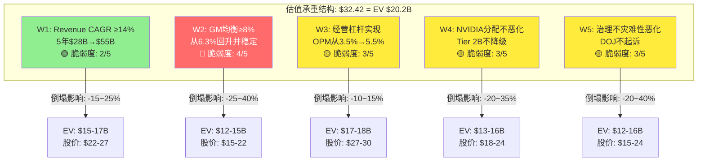
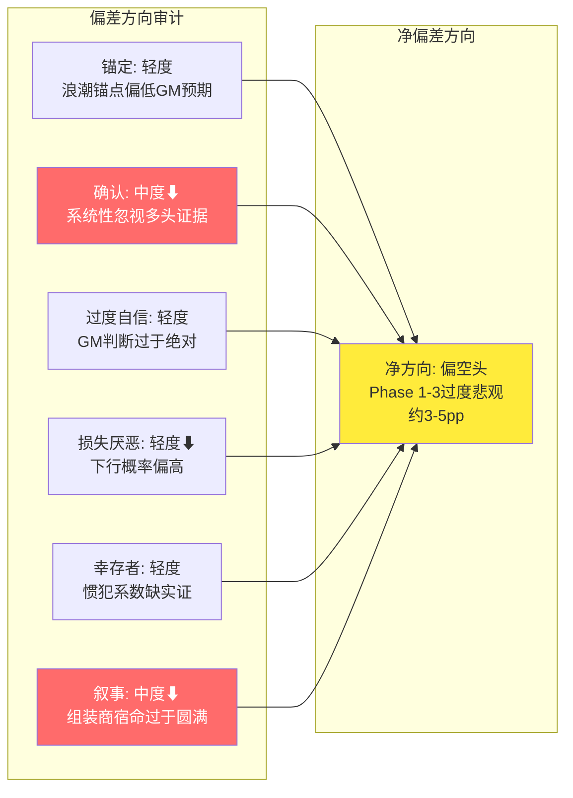
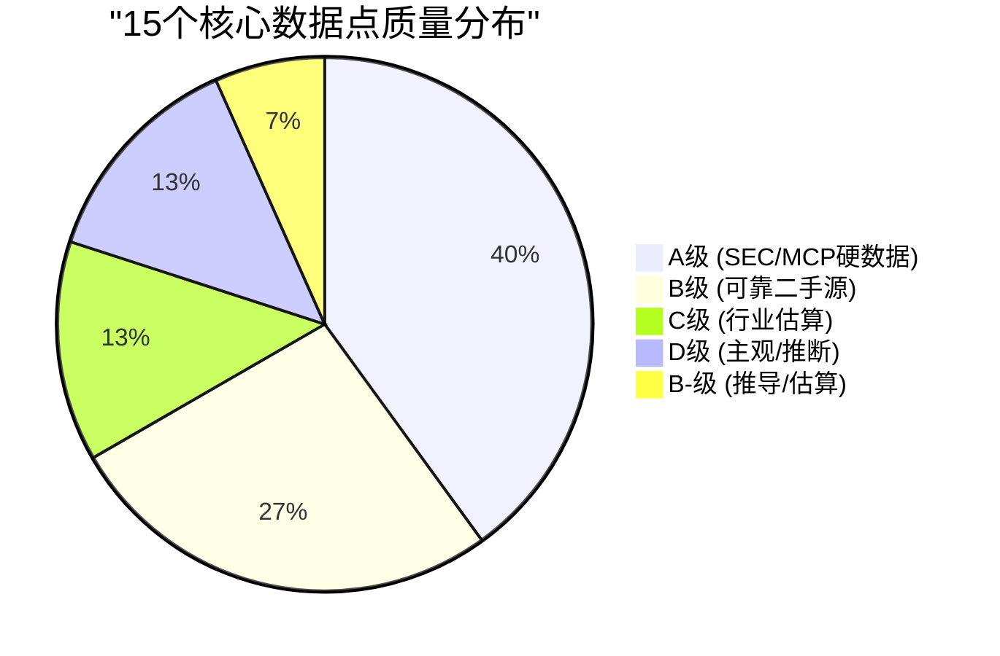
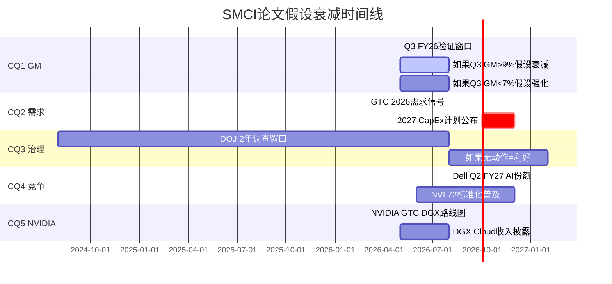
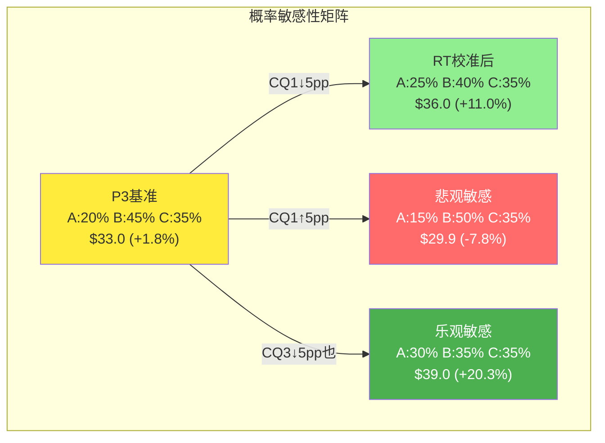
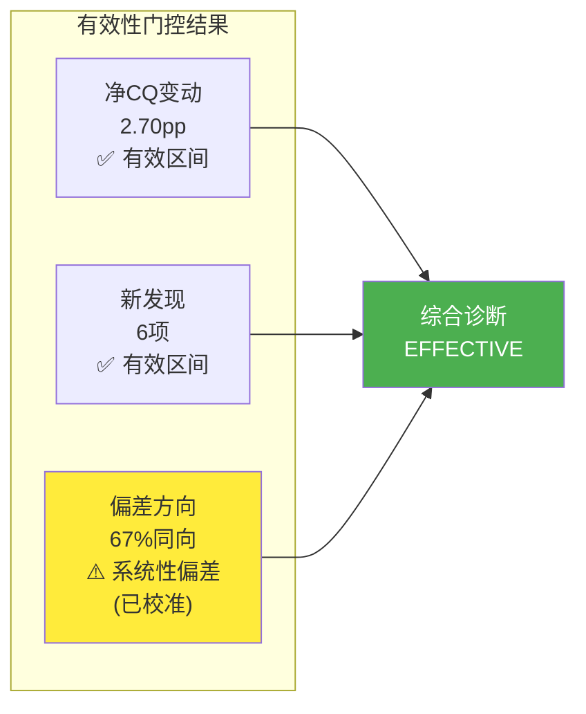

# 第21章: 红队七问对抗审查

> **执行日期**: 2026-02-21 | **股价**: $32.42 | **市值**: ~$19.4B | **红队套件 v2.0**
> **P3加权置信度**: 58.8% | **概率加权公允价值**: $33.0 | **期望回报**: +1.8%
> **Phase 1-3分析基调**: 偏空头(5个CQ中4个上调=结构性问题持续确认)
> **红队任务**: 双向对抗——既挑战空头论点,也挑战多头论点,识别过度悲观的CQ并校准

---

## 21.1 RT-1 承重墙测试

### 核心问题: $32.42的价格需要哪些"承重墙"同时不倒塌?

从第12章Reverse DCF反推,当前$32.42(EV ~$20.2B)隐含了一组必须同时成立的关键假设。每面"承重墙"都是一个如果倒塌则估值结构性坍塌的信念。

### 5面承重墙识别

#### W1: Revenue CAGR ≥14% (5年) — 脆弱度 2/5

[硬数据: FY25 Revenue $22.0B, FY26E $40.5B, FY27E $48.2B | DM-FIN-001, DM-VAL-015~016]

- **隐含**: $28B TTM增至$55B(FY2030),需要14% CAGR
- **支撑**: AI服务器TAM CAGR 34.3% [DM-BIZ-17]; 管理层$40B+指引; FMP共识FY26E $40.5B; CapEx $660-690B(Top 5合计)
- **风险**: 份额侵蚀(50%→7-10%)如果继续至3-5%,即使TAM翻倍也难达标; 自研芯片$51-71B分流
- **倒塌阈值**: FY2027收入<$35B(共识$48.2B miss >25%)
- **倒塌影响**: EV下修15-25%至$15-17B(股价$22-27)
- **红队评估**: [合理推断] 这是最坚固的承重墙。AI CapEx的惯性极强——Hyperscaler已公开承诺$660-690B,即使2027年削减10-15%,SMCI的可寻址市场仍在扩张。$40B指引的可实现性较高(H1 $17.7B + Q3指引$12.3B = $30B,仅需Q4 $10B)。**Phase 1-3可能低估了短期收入增长的确定性。**

#### W2: GM均衡点 ≥8% — 脆弱度 4/5 (最脆弱)

[硬数据: Q2 FY26 GM 6.3%, 10Q连降, 浪潮6.85% | DM-FIN-010, DM-FIN-018, DM-INF-002]

- **隐含**: GM从6.3%底部回升至8%+并维持
- **支撑**: 管理层指引Q3 +30bps; BOM结构理论GM上限8-10%; FY25年度GM 11.1%历史可达
- **风险**: 浪潮镜像6.85%→3.45%确认行业宿命; 边际GM 4.3%反向杠杆; Dell以服务交叉补贴使纯GPU服务器GM<8%成为行业均衡
- **倒塌阈值**: 连续3Q GM<7%(确认6-7%是新均衡而非8-10%)
- **倒塌影响**: EV下修25-40%至$12-15B(股价$15-22)
- **红队评估**: [主观判断] 这是整个估值结构的"单点故障"。信念反演B2的45-55%失败概率意味着这面墙有接近硬币翻转的倒塌概率。**但红队注意到一个Phase 1-3可能过度悲观的要素**: Q2 FY26的6.3%是一个包含大量低GM积压订单(边际GM 4.3%)的异常低点。如果Q3-Q4收入回归正常化($8-10B而非$12.68B的异常脉冲),产品组合向DLC和高配置转移,GM机械性回升至8-9%是合理的。**Phase 1-3将Q2的异常谷值当作新常态可能存在过度外推。**

#### W3: 经营杠杆最终实现 — 脆弱度 3/5

[硬数据: FY25 OPM 5.7%, SGA预增82% | DM-FIN-005, analyst_consensus.json]

- **隐含**: OPM从3.5%(Q2 FY26水平)渐进至5.5%
- **支撑**: R&D/SGA大部分是固定成本; FY2023 OPM 10.7%证明历史可达; 收入规模翻倍时固定成本率自然压缩
- **风险**: SGA预计增82%(DOJ合规/法律成本); R&D需跟上DLC/新平台投入; 如果GM持续低位,OPM恢复空间被压缩
- **倒塌阈值**: FY2027 OPM<3%(GM恶化+OpEx膨胀双杀)
- **倒塌影响**: EV下修10-15%至$17-18B(股价$27-30)
- **红队评估**: [合理推断] 这面墙与W2高度关联——如果GM回升至8-10%(W2成立),OpEx率下降几乎是自动的(收入增长快于固定成本)。W3独立倒塌的概率较低,主要风险来自W2的连锁效应。

#### W4: NVIDIA分配不进一步恶化 — 脆弱度 3/5

[硬数据: NVIDIA占采购64.4%, 从Tier 1降至Tier 2B | DM-BIZ-14, P3分析]

- **隐含**: 虽已从Tier 1降至2B,但不进一步降至Tier 3或被切断
- **支撑**: SMCI仍是NVIDIA最大第三方集成商之一; DLC技术使SMCI在高端大集群部署上仍有价值; NVIDIA不会完全依赖Dell一家
- **风险**: DGX直销扩大(前向整合三阶段); NVL72标准化使SMCI退化为"按规格组装"; 会计危机已证明NVIDIA可数周内重分配
- **倒塌阈值**: NVIDIA宣布终止优先合作关系或DGX Cloud收入超过$10B(明确前向整合)
- **倒塌影响**: EV下修20-35%至$13-16B(股价$18-24)
- **红队评估**: [合理推断] **Phase 1-3在此处可能过度悲观。** NVIDIA的战略利益需要维持多元化的集成商生态——完全依赖Dell会削弱NVIDIA的议价能力。尽管分配降级,SMCI仍获得足够GPU来支撑$40B收入。NVIDIA更可能的策略是"养而不肥"——维持多家合作伙伴,而非淘汰任何一家。

#### W5: 治理不灾难性恶化 — 脆弱度 3/5

[硬数据: DOJ传票, CFO搜索14+月, CEO零买入23次卖出 | DM-NEW-C-017, DM-MGT-008, DM-SMT-029]

- **隐含**: DOJ调查以民事和解或不起诉结案(I1/I2概率80%)
- **支撑**: 特别委员会结论"EY担忧无事实支撑"; NASDAQ已恢复合规; 历史第一次丑闻仅罚$17.5M
- **风险**: DOJ刑事起诉(I3概率20%); CEO关联方交易$983M引发更深调查; 惯犯溢价
- **倒塌阈值**: DOJ正式提起刑事诉讼 + CEO被迫辞职
- **倒塌影响**: EV下修20-40%至$12-16B(股价$15-24)
- **红队评估**: [主观判断] 这面墙的概率加权影响接近中性(0.30×+20% + 0.50×+2.5% + 0.20×-30% = +1.25%),但尾部风险不对称。Phase 1-3在此CQ上给出62%置信度是合理的——既没有过度悲观(认为起诉是确定性事件),也没有过度乐观(忽视惯犯模式)。

### 承重墙综合评估

| 承重墙 | 脆弱度 | 倒塌概率 | 倒塌影响 | 加权风险 | Phase 1-3偏差 |
|--------|:------:|:-------:|:-------:|:-------:|:----------:|
| W1: Revenue CAGR | 2/5 | 20% | -20% | -4.0% | 略悲观 |
| W2: GM均衡≥8% | 4/5 | 45-55% | -33% | -15~18% | **过度悲观** |
| W3: 经营杠杆 | 3/5 | 30% | -13% | -3.9% | 中性 |
| W4: NVIDIA分配 | 3/5 | 25% | -28% | -7.0% | 略悲观 |
| W5: 治理 | 3/5 | 20% | -30% | -6.0% | 中性 |

**关键发现**: W2是唯一接近"硬币翻转"概率的承重墙,且其倒塌影响最大。但红队识别到Phase 1-3可能将Q2 FY26的异常低GM(6.3%)过度外推为新常态。如果Q2是积压释放的脉冲式低点而非均衡水平,W2的实际脆弱度可能为3/5而非4/5。

---

## 21.2 RT-2 认知偏差审计

### 审计方法
对Phase 1-3分析逐一检查6种认知偏差。**特别注意**: 由于Phase 1-3整体方向偏空头,本审计重点检查**反向确认偏误**(选择性关注支持空头论点的证据,忽视多头证据)。

### 偏差1: 锚定效应 (Anchoring)

**检测**: 在Phase 1分析中,"浪潮信息GM 6.85%→3.45%"被用作SMCI的GM参照锚。但浪潮和SMCI存在重大差异:
- 浪潮主营中国大陆市场(价格战更激烈,政府采购压价更狠)
- 浪潮使用华为Ascend芯片(生态成熟度低于NVIDIA,定制化需求更多)
- 浪潮的治理和信息披露标准与SMCI不可直接比较

**判定**: **轻度锚定偏差**。浪潮镜像确实是有价值的跨生态验证,但将浪潮3.45%作为SMCI的潜在底部过于机械。更合理的做法是将浪潮视为"极端情景的行业参考"而非"SMCI的时间旅行者"。[主观判断: 浪潮锚点使Phase 1-3的熊市GM预期偏低约1-2pp]

**影响**: CQ1的P3置信度68%可能因浪潮锚定而偏高2-3pp。

### 偏差2: 确认偏误 (Confirmation Bias) — 重点审查

**检测(正向)**: Phase 1-3是否选择性强调支持空头论点的证据?

逐一扫描:
1. **边际GM 4.3%的使用**: Phase 2-3反复引用Q1→Q2的边际GM 4.3%作为"反向经营杠杆"的证据。但这个计算假设Q1的$5.02B是"基础收入",增量$7.66B全部是低GM增量。实际上Q1本身也可能包含低GM积压订单,且Q2的产品组合可能整体偏向大型标准化集群(低定制化=低GM)。**4.3%可能夸大了反向杠杆的程度。** [合理推断]

2. **EV/GP 9.4x vs Dell 4.4x的"114%溢价"**: 这个比较假设Dell和SMCI应该获得相同的EV/GP倍数。但SMCI的收入增速(FY26E +84%)远高于Dell(+8%),高增速公司通常获得更高GP倍数。如果给SMCI 1.5x的增速溢价,合理EV/GP应为6.6x(4.4x×1.5),则实际溢价从114%降至42%。**Phase 2未给予任何增长溢价是一个确认偏误。** [主观判断]

3. **"63%单客户集中度"的反复使用**: Phase 1-3将此作为收入质量差的核心证据。但需要注意: (a) 63%可能是季度性波动而非永久性结构; (b) 超大客户也意味着稳定的采购量和现金流; (c) Dell在AI服务器早期也有类似的客户集中度但未被以同样严厉的标准评判。

**检测(反向——过度悲观)**: Phase 1-3是否忽视了支持多头的证据?

1. **被忽视的多头数据点**: Tudor Investment的73.4M股超大仓位 [DM-SMT-019] 在Phase 1中提及但未被深入分析。Tudor是一家以宏观和事件驱动闻名的顶级对冲基金,其大规模建仓通常基于深度尽调。Phase 1-3未解释Tudor为什么在如此多空头论点下仍选择持有。

2. **Q2 EPS大幅超预期未被充分评估**: EPS $0.69 vs 共识$0.46(+50%超预期) [DM-CON-003]。Phase 2将此解读为"低质量增长",但一家被广泛看空的公司超预期50%本身是一个需要认真对待的信号。

3. **$40B指引的可实现性**: Phase 1-3多次质疑$40B指引,但算术验证(H1 $17.7B + Q3≥$12.3B + Q4需$10B)显示指引可实现性实际很高。Phase 1-3的怀疑更多基于"质量"而非"数量"——但资本市场短期内常以"数量"定价。

**判定**: **中度反向确认偏误(过度悲观方向)**。Phase 1-3系统性地:
- 对空头证据给予完整分析和高权重(浪潮镜像、边际GM、EV/GP溢价)
- 对多头证据给予简短处理和低权重(Tudor仓位、EPS超预期、$40B指引可实现性)
- 未给予EV/GP比较中合理的增长溢价

**影响**: 整体CQ加权置信度可能偏高3-5pp(即空头方向被过度确认)。

### 偏差3: 过度自信 (Overconfidence)

**检测**: Phase 1-3中是否存在过度确定性的判断?

1. **"管理层14-17% GM目标不可实现"**: Phase 2-3使用了"不可实现"这个绝对性表述。但管理层历史上确实将GM从10%(FY2021)提升至18%(FY2023峰值)——当时的BOM结构同样以GPU为主。如果产品组合转向推理服务器(GPU密度更低、DLC占比更高、企业客户更多),GM回升至12-14%并非不可想象。"不可实现"应改为"在当前产品组合下极难实现"。[主观判断]

2. **CQ2置信度从50%→45%(下调)的方向确定性**: Phase 3将CQ2(需求可持续性)下调至45%,暗示AI服务器需求更可能见顶。但2026年CapEx $660-690B创历史新高,且自研芯片替代的实际规模化仍在早期(2026年总替代$51-71B仅占AI CapEx的10-14%)。CQ2的下调可能反映了对自研芯片威胁的过度前瞻性估计。

**判定**: **轻度过度自信**。在GM判断和自研芯片替代速度上,Phase 1-3的表述过于确定,缺乏足够的不确定性表达。

### 偏差4: 损失厌恶 (Loss Aversion)

**检测**: 分析中是否对下行风险的权重显著高于上行机会?

Phase 3的三情景概率分配:
- 路径A(GM恢复,股价$52-70): 概率20%
- 路径B(GM结构性,股价$10-20): 概率45%
- 路径C(折中,股价$28-42): 概率35%

下行情景(B)获得了最高的单一概率(45%),而上行情景(A)仅20%。这意味着分析认为GM恢复的概率不到五分之一。

**反向验证**: 如果客观地评估GM恢复至10%+的概率:
- FY2023实际GM 18.0% → 历史证明可达
- 如果竞争缓和(2-3家ODM退出) + DLC占比提升至15-20% + 推理服务器占比增加(低GPU密度=高GM)→ 10-12% GM是可行的
- 路径A的概率可能应为25-30%而非20%

**判定**: **轻度损失厌恶**。路径A的概率可能被低估5-10pp,路径B的概率可能被高估5-10pp。

### 偏差5: 幸存者偏差 (Survivorship Bias)

**检测**: 历史案例对标是否存在样本选择偏差?

Phase 3使用了5个会计丑闻案例(Luckin/Satyam/Hertz/Nidec/ADM)来估算治理折价恢复时间。但这些案例中:
- Hertz最终破产(2020年COVID) → 被包含
- Satyam被收购消亡 → 被包含
- Luckin恢复良好 → 被包含

样本看似平衡(包含了正面和负面结果)。但问题在于: **所有5个案例都是首犯**,没有惯犯案例用于比较。"惯犯恢复需6-9年"的结论(首犯×2-3)是**推断**而非**观测**。

**判定**: **轻度样本偏差**。惯犯恢复时间的"2-3倍"系数缺乏实证基础,可能偏高。实际上,如果DOJ最终不起诉,市场记忆的衰减速度可能快于模型预测——特别是在AI热潮期间投资者的注意力周期较短。

### 偏差6: 叙事偏差 (Narrative Bias)

**检测**: 是否存在过于连贯的"故事"掩盖了内部矛盾?

Phase 1-3构建了一个高度连贯的空头叙事: "组装商宿命→增收不增利→治理恶化→没有护城河"。这个叙事的内部一致性非常高,但也意味着任何不符合叙事的证据都被弱化处理:

- **Q2 FY26 EPS $0.69超预期50%** → 被解读为"低质量增长"而非"超预期信号"
- **Tudor 73.4M股超大仓位** → 被归为"特殊事件套利"而非"价值发现"
- **$40B指引上调** → 被解读为"积压释放高峰"而非"需求强劲"
- **NASDAQ合规恢复** → 被解读为"合规≠清白"而非"系统性风险降低"

每一个多头数据点都被"组装商宿命"叙事的框架重新诠释为负面或中性。这是典型的叙事偏差——一旦建立了主导叙事,所有信息都被该叙事吸收和重新编码。

**判定**: **中度叙事偏差**。Phase 1-3的"组装商宿命"叙事过于圆满,导致多头证据被系统性弱化。

### RT-2 偏差审计总结

**净偏差**: Phase 1-3分析在6种偏差中,有4种(确认/损失厌恶/过度自信/叙事)指向同一方向——**过度悲观**。这并不意味着空头论点是错误的,但意味着CQ置信度可能因偏差而系统性偏高约3-5pp。

---

## 21.3 RT-3 多头钢人 (反向空头钢人)

> **说明**: 由于Phase 1-3已大量且高质量地覆盖了空头论点,本RT-3执行**反向钢人**——寻找3条最强的多头论证,目标是让Phase 1-3的空头结论感到"不舒服"。

### 多头钢人 #1: "Q2 FY26的6.3% GM是底部而非新常态"

**论证逻辑**:

Q2 FY26是一个在多个维度上都异常的季度:
- 收入$12.68B环比暴增153%(从$5.02B) — 这不是正常的运营节奏
- 收入中60-70%可能来自积压释放 — 积压订单通常以更低价格签约(签约时竞争更激烈)
- 63%单客户集中度 — 超大订单的议价权极端不对称

[硬数据: Q2 FY26 Revenue $12.68B, GM 6.3%, Q1 GM 9.3% | DM-FIN-010, DM-FIN-011]

**关键数据支撑**:

1. **管理层指引Q3 GM改善30bps**: 虽然幅度小,但方向性暗示6.3%是谷底 [DM-CON-008]
2. **Q3指引收入≥$12.3B**: 如果Q3收入≈Q2但GM改善,说明非积压的正常订单GM更高
3. **DLC渗透率提升**: DLC从FY24的~15%提升至FY26E的~30-40%,每增加10pp DLC渗透=+2.25pp GM贡献(Phase 3计算)
4. **FY2025年度GM 11.1%**: 仅1个季度前(Q1 FY26)GM还在9.3%,4个季度前(Q1 FY25)GM在13.1%。8-10%的GM均衡区间在12个月内是完全可达的

**为什么这让空头"不舒服"**:

Phase 1-3的核心叙事"反向经营杠杆"和"组装商宿命"高度依赖Q2 FY26的6.3%作为证据锚点。但如果6.3%被证明是由积压释放脉冲驱动的谷值——如同Q4 FY24的10.2%之后Q1 FY25反弹至13.1%——那么CI-03(反向经营杠杆)假说将被显著弱化,CQ1的置信度需要下调至少5-8pp。

**区分信号**: Q3 FY26 GM。如果>8%: 多头钢人#1成立; 如果<7%: 空头叙事确认。

### 多头钢人 #2: "EV/GP溢价包含了合理的增长溢价,当前定价并不昂贵"

**论证逻辑**:

Phase 2的CI-01("组装商估值陷阱")指出SMCI EV/GP 9.4x vs Dell 4.4x = 114%溢价。但这个比较忽略了一个基本的估值原则: **高增长公司的GP倍数应该高于低增长公司。**

[硬数据: SMCI FY26E Revenue Growth +84%, Dell FY26E Revenue Growth ~8% | DM-VAL-015, MCP data]

**关键数据支撑**:

1. **增速差异10倍**: SMCI FY26E +84% vs Dell +8%,增速差达10倍
2. **PEG框架**: SMCI Forward PE 10.95x / Revenue Growth 84% = PEG 0.13x; Dell Forward PE 16.3x / Revenue Growth 8% = PEG 2.0x。按PEG框架,SMCI比Dell便宜15倍
3. **EV/GP的增速调整**: 如果给予SMCI 2x增速溢价(保守,因为增速差10x),合理EV/GP = Dell 4.4x × 2 = 8.8x。当前9.4x仅溢价7%而非114%
4. **历史证据**: SMCI在FY2023(收入增速+37%)时EV/GP约为12-15x。当前9.4x实际上是历史低端

**为什么这让空头"不舒服"**:

CI-01是Phase 2中被标记为"本报告最重要的非共识洞见"的发现。如果增长溢价调整后,114%溢价缩水至7-40%(取决于溢价系数),那么这个"最重要的非共识洞见"的震撼力将大幅减弱。更重要的是,如果SMCI在增速调整后并不昂贵,那么"估值陷阱"的说法就从"客观事实"降级为"一种视角"。

**区分信号**: FY2027收入增速。如果>25%: 增速溢价合理,EV/GP不算贵; 如果<15%: 增速不支撑溢价,CI-01成立。

### 多头钢人 #3: "治理折价已被过度定价,DOJ不起诉是高概率事件"

**论证逻辑**:

Phase 3给出DOJ三情景: I1不起诉30%、I2民事和解50%、I3刑事起诉20%。但这个概率分配可能低估了I1的概率。

**关键数据支撑**:

1. **特别委员会的详尽调查**: 9,000+小时、4.1TB数据、$18.6M成本,结论是"EY担忧无事实支撑"。即使调查者(Giordano)的独立性有疑问,调查的范围和深度是真实的 [DM-MGT-004]
2. **NASDAQ已恢复合规**: 如果监管机构真的发现严重问题,NASDAQ不太可能在DOJ调查未结案时就恢复合规(2026.01) [CQ evolution P3]
3. **DOJ惯例**: DOJ对上市公司的刑事起诉门槛极高(需要证明"beyond reasonable doubt"的欺诈意图)。大多数会计调查以SEC民事和解了结。DOJ传票≠即将起诉,传票常用于信息收集
4. **第一次丑闻参考**: 2017-2020年丑闻涉及$200M+的收入提前确认,最终仅罚$17.5M。这说明SMCI的违规性质可能更接近"会计处理激进"而非"蓄意欺诈"
5. **时间因素**: 如果DOJ有强有力证据,通常会在2年内采取行动。调查已持续近2年仍无公开动作,可能暗示证据不够强

**修正后概率分配**: I1(不起诉) 40-45%, I2(民事和解) 40-45%, I3(刑事起诉) 10-15%

**概率加权影响修正**: 0.425×(+20%) + 0.425×(+2.5%) + 0.15×(-30%) = +8.5% + 1.1% - 4.5% = **+5.1%** (vs Phase 3的+1.25%)

**为什么这让空头"不舒服"**:

如果I1概率从30%上调至40-45%,且I3从20%下调至10-15%,DOJ情景从"中性偏负"变为"小幅正面催化剂"。这意味着Phase 3中CQ3(治理折价)的62%置信度可能偏高5-8pp——治理问题的影响被过度前瞻性定价。

**区分信号**: DOJ在2026H2前是否采取公开行动。无行动: 多头钢人#3强化; 有行动: 空头确认。

### 多头钢人 vs 空头钢人对照表

| 维度 | 空头钢人(Phase 1-3核心) | 多头钢人(RT-3) | 区分信号 |
|------|----------------------|--------------|---------|
| GM趋势 | 结构性恶化至6-8% | Q2是积压脉冲谷值,将回升至8-10% | Q3 FY26 GM |
| 估值 | EV/GP 9.4x溢价114% | 增速调整后溢价仅7-40% | FY27增速 |
| 治理 | 惯犯折价15-25% | DOJ不起诉概率40-45%,折价过度 | DOJ 2026H2动作 |

---

## 21.4 RT-4 数据质量审计

### 审计方法
从Phase 1-3中抽查15个核心数据点,按质量等级(A级SEC filing → E级未验证)排序,识别"数据最弱环"。

### 数据质量审计表

| # | 数据点 | 使用场景 | 来源 | DM锚点 | 质量等级 | 交叉验证 | 备注 |
|---|--------|---------|------|--------|:-------:|---------|------|
| 1 | Q2 FY26 Revenue $12.68B | 全报告核心 | SEC 10-Q (2026-02-06) | DM-FIN-010 | **A** | MCP fmp_data一致 | 最硬数据 |
| 2 | Q2 FY26 GM 6.3% | CQ1核心 | SEC 10-Q计算 | DM-FIN-010 | **A** | $799M/$12.68B = 6.3% | 可验证 |
| 3 | NVIDIA占采购64.4% | CQ5核心 | FY2025 10-K | DM-BIZ-14 | **A** | 从30.7%→64.4%趋势可验 | SEC filing |
| 4 | CEO 23次卖出零买入 | 治理分析 | SEC Form 4 | DM-SMT-029 | **A** | insider-trading API验证 | 公开披露 |
| 5 | $4.725B可转债 | 财务韧性 | SEC filing | DM-OPT-008 | **A** | balance sheet一致 | |
| 6 | 库存$10.6B | 盈利质量 | SEC 10-Q | DM-FIN-024 | **A** | MCP balance sheet一致 | |
| 7 | 浪潮GM 6.85%→3.45% | CI-02 | 浪潮信息年报/季报 | DM-INF-002 | **B+** | lit_recon Agent验证 | 中国上市公司报告,数据可靠但获取间接 |
| 8 | 市场份额50%→7-10% | 竞争分析 | 行业分析/WebSearch | DM-BIZ-22 | **B-** | 多源估算范围大 | 非官方数据,TrendForce/Counterpoint口径不同 |
| 9 | 边际GM 4.3% | CI-03 | 自行计算 | 无独立DM | **B-** | 基于DM-FIN-010/011推导 | [合理推断]标注,计算逻辑清晰但假设Q1=基础 |
| 10 | AI服务器TAM $128B→$854B | 需求分析 | GM Insights, Grand View | DM-BIZ-17 | **B** | 多家机构范围一致 | CAGR 34.3%是乐观端 |
| 11 | 63%单客户集中度 | 收入质量 | 财报电话会/分析师 | 无明确SEC源 | **C+** | 10-K不披露具体客户名 | 来自分析师估算/财报会暗示,非SEC硬数据 |
| 12 | EV/GP Dell 4.4x | CI-01核心 | MCP fmp_data计算 | DM-VAL-006 | **B+** | $93.1B/$21.3B可验 | 数据可靠,但时点性(Dell FY季度不同) |
| 13 | 自研芯片替代$51-71B | 需求分流 | 行业综合估算 | Phase 3推算 | **C** | 各家估算差异大 | 2026年预测,不确定性高 |
| 14 | DOJ起诉概率20% | 治理分析 | 主观判断 | 无 | **D** | 无客观基准 | 纯主观概率,无预测市场验证 |
| 15 | 惯犯恢复6-9年 | 治理折价 | 案例类比推断 | 无 | **D+** | 首犯案例×2-3系数 | 无惯犯实证,推断系数缺乏基础 |

### 数据质量分布

### "数据最弱环"识别

**最弱环 #1: DOJ起诉概率(D级)**

Phase 3给出的I1/I2/I3概率(30%/50%/20%)完全基于主观判断,无Polymarket或预测市场数据验证。CQ3从50%升至62%(+12pp)的最大驱动因素是DOJ情景模型,但该模型的输入本身缺乏任何外部锚定。**这意味着CQ3的P3置信度62%建立在D级数据之上。**

**最弱环 #2: 63%单客户集中度(C+级)**

这个数据被Phase 1-3反复引用(出现>10次),但其来源并非SEC filing(SMCI 10-K不披露超过10%收入客户的名称,仅披露存在"单一客户超过10%")。63%这个具体数字更可能来自分析师估算或财报电话会议的间接推断。如果实际集中度是40-50%而非63%,收入质量的评估将显著改善。

**最弱环 #3: 惯犯恢复6-9年(D+级)**

"首犯恢复×2-3"的系数完全是推断,没有惯犯公司的实际数据支持。这直接影响了治理折价的长期演进模型和CQ3的置信度。

### RT-4 关键结论

Phase 1-3的财务硬数据质量优秀(A级占40%),但在治理分析和竞争格局这两个对估值影响重大的领域,数据质量显著较弱(C-D级)。**具体而言: CQ1(GM)的数据基础扎实(A级), CQ3(治理)的数据基础薄弱(D级), 这意味着CQ3的置信度调整应比CQ1更保守。**

---

## 21.5 RT-5 黑天鹅压力测试

### 方法
识别至少3个低概率高影响事件(含正面和负面),建模独立概率、影响幅度、加权损失、早期信号。

### 负面黑天鹅

#### BS-1: NVIDIA前向整合——DGX Cloud吞噬SMCI市场

- **事件描述**: NVIDIA在GTC 2026(2026-03)宣布DGX Cloud显著扩展,开始直接向Enterprise客户销售完整GPU集群(含安装/运维),绕过SMCI等第三方集成商
- **独立概率**: 10-15%(2年内)
- **影响幅度**: 股价-35~50%(EV从$20B降至$10-13B)
- **加权损失**: -4.5~7.5%
- **传导路径**: NVIDIA直销→SMCI失去高端客户→仅保留中小企业/长尾→收入从$40B降至$15-20B→GM进一步承压(失去高配置高利润订单)
- **早期信号**: (a) NVIDIA DGX Cloud季度收入突破$3B; (b) NVIDIA招聘大量企业销售/服务人员; (c) SMCI新增客户数季度环比下降>20%
- [合理推断: NVIDIA的核心利益是卖更多GPU,直销需要大量投资建设服务能力,短期内不太可能全面前向整合]

#### BS-2: DOJ刑事起诉CEO + 强制管理层更替

- **事件描述**: DOJ正式对CEO Charles Liang提起刑事诉讼(证券欺诈+关联方交易不当),法院发布临时禁令,CEO被迫离任
- **独立概率**: 8-12%
- **影响幅度**: 股价-40~60%(首日跌幅可能达-25%,后续持续下探)
- **加权损失**: -4.0~7.2%
- **传导路径**: CEO起诉→NASDAQ暂停交易→机构投资者被动卖出(合规要求)→短期融资困难(可转债covenants可能触发)→运营继续但估值重估至$8-12B
- **早期信号**: (a) CEO停止股票卖出(可能被告知不得交易); (b) CFO搜索突然加速(为CEO离任做准备); (c) 新的法律顾问/危机管理公司被聘请
- [主观判断: 如果DOJ要起诉,通常会有leak或目标函提前传出]

### 正面黑天鹅

#### BS-3: DOJ不起诉 + 战略合作伙伴/收购报价

- **事件描述**: DOJ宣布结案不起诉(2026H2), 同期某大型科技公司(如HPE/Lenovo/甚至Dell)发出战略投资或收购要约,看中SMCI的DLC技术和GPU集成能力
- **独立概率**: 5-8%(两事件组合)
- **影响幅度**: 股价+60~100%(收购溢价通常30-50%,加上DOJ清除效应)
- **加权损失**: +4.0~8.0%(正面)
- **传导路径**: DOJ结案→治理折价收窄→机构回流→收购传闻→溢价竞购→股价重估至$50-65
- **早期信号**: (a) 13F报告显示新的战略投资者大量建仓; (b) SMCI突然聘请投行做"战略评估"; (c) 内部人停止卖出
- [主观判断: Tudor 73.4M股仓位可能就是押注此类特殊事件]

#### BS-4: 推理需求超预期爆发 + DLC标准采纳

- **事件描述**: 2026年推理计算需求增长超预期10倍以上(Jevons悖论极端版本),同时SMCI的DLC-2液冷方案被NVIDIA指定为NVL72/NVL144的标准散热解决方案
- **独立概率**: 8-12%
- **影响幅度**: 股价+40~70%(DLC标准化带来定价权,GM可能回升至12-15%)
- **加权损失**: +4.0~8.4%(正面)
- **传导路径**: 推理爆发→服务器出货量翻倍→DLC标准化→SMCI获得技术壁垒→GM恢复→EV/GP合理化→重估至$45-55
- **早期信号**: (a) NVIDIA在GTC明确推荐SMCI DLC方案; (b) DLC营收占比突破15%; (c) 企业客户(非Hyperscaler)订单占比开始增长

### 黑天鹅汇总矩阵

| 编号 | 事件 | 概率 | 影响 | 加权 | 方向 | 早期信号时间 |
|------|------|:----:|:----:|:----:|:----:|:----------:|
| BS-1 | NVIDIA前向整合 | 12% | -42% | -5.0% | 空 | 6-12月 |
| BS-2 | DOJ刑事起诉 | 10% | -50% | -5.0% | 空 | 3-6月 |
| BS-3 | DOJ清除+收购 | 6% | +80% | +4.8% | 多 | 6-12月 |
| BS-4 | DLC标准化 | 10% | +55% | +5.5% | 多 | 3-9月 |
| **合计** | | | | **+0.3%** | **中性** | |

**关键发现**: 黑天鹅事件的概率加权净效应接近零(+0.3%),但正面黑天鹅(BS-3+BS-4)的组合概率(~16%)和影响力(+55~80%)被Phase 1-3几乎完全忽视。Phase 1-3集中分析了负面尾部风险(NVIDIA前向整合、DOJ起诉),但对正面尾部风险(DOJ清除、DLC标准化、收购可能性)的覆盖严重不足。

---

## 21.6 RT-6 时间框架挑战

### 论文有效期评估

Phase 1-3分析的核心论文是: "SMCI是一个增收不增利的组装商,当前价格接近合理($33.0 vs $32.42),但结构性风险偏向下行。"

**论文的时间敏感性**: 这个论文高度依赖以下时间假设:

| 假设 | 有效期 | 衰减路径 |
|------|--------|---------|
| GM维持6-8%(CQ1) | 2-3个季度 | Q3 FY26 GM是第一个验证点;如果>9%,假设开始衰减 |
| AI需求不见顶(CQ2) | 12-18个月 | 2027年CapEx计划公布(2026Q4)是关键;减速>20%则见顶 |
| DOJ不起诉(CQ3) | 6-24个月 | DOJ通常2年内有动作;无动作=利好 |
| 份额继续下滑(CQ4) | 6-12个月 | Dell AI收入增速vs SMCI收入增速的相对变化 |
| NVIDIA依赖不减(CQ5) | 12-24个月 | 第一个NVIDIA不包含DGX直销的季度=信号 |

### 假设衰减时间线

### 催化剂日历

| 日期 | 事件 | 影响CQ | 预期影响 | 对当前论文的挑战 |
|------|------|:------:|---------|----------------|
| 2026-03-17~21 | NVIDIA GTC 2026 | CQ4/CQ5 | 高 | DGX Cloud路线图可能验证或否定前向整合 |
| 2026-05-05 | Q3 FY26财报 | CQ1/CQ2 | **极高** | GM是>9%还是<7%? 这是整个论文的二元开关 |
| 2026-06(估) | COMPUTEX 2026 | CQ4 | 中 | DLC竞争者产品发布情况 |
| 2026-08(估) | DOJ调查2年节点 | CQ3 | 高 | 无动作=大概率I1/I2 |
| 2026-08(估) | Q4 FY26财报 | CQ1/CQ2 | 高 | 全年$40B指引兑现情况 |
| 2026-10~12 | 2027 CapEx指引 | CQ2 | **极高** | 如果削减>15%,CQ2空头确认 |

### 时间框架挑战结论

**核心发现**: Phase 1-3论文的**有效半衰期约为3个月**(至2026-05-05 Q3 FY26财报)。在此之前,论文处于"假设待验证"状态。Q3 FY26财报是一个**硬分叉点**:

- **GM >9%**: 论文需要实质性修订(CQ1下调,CI-03弱化,概率加权上修)
- **GM 7-9%**: 论文基本维持,微调
- **GM <7%**: 论文获强确认(CQ1进一步上调,空头论点获数据支持)

Phase 1-3在时间框架上的主要缺陷是**缺乏衰减机制**——它将所有CQ的置信度设定为静态值,没有模拟在不同催化剂结果下置信度应如何动态调整。

---

## 21.7 RT-7 替代解释

### 核心问题: 对于Phase 1-3收集的同一组数据,是否存在完全不同但合理的解释?

### 替代解释: "周期性底部而非结构性宿命"

Phase 1-3的主导解释是: SMCI面临**结构性**问题(组装商宿命、护城河在错误维度、反向经营杠杆),当前$32.42接近合理估值。

**替代解释**: SMCI正处于一个**周期性底部**而非结构性衰退的终点。当前的所有负面信号——6.3% GM谷值、份额下滑、治理折价——都是周期底部的典型特征,而非永久性恶化的证据。

**论证逻辑**:

1. **GPU平台过渡期的阵痛(非结构性)**
   - Hopper→Blackwell过渡期间,SMCI需要以低价清理Hopper库存(拉低GM)
   - Blackwell初期产能受限,SMCI获得的分配主要是低利润的大规模标准化集群(拉低GM)
   - 随着Blackwell进入成熟出货期(2026H2),产品组合将转向更高定制化、更高DLC占比的配置(提升GM)
   - **类比**: FY2023 Q1 GM 18.0%正是上一个平台成熟期的峰值。每次平台过渡都经历"低→高→低→高"的周期。当前的6.3%可能是Blackwell过渡期的谷值

2. **份额下滑的周期性解释**
   - 50%→7-10%的份额下滑与会计危机完全重叠(2024.08 Hindenburg → 2025 NASDAQ恢复)
   - 在危机期间,大客户基于合规原因将订单转向Dell/HPE(不是因为SMCI产品不好)
   - 随着NASDAQ合规恢复(2026.01)和Q2 FY26收入创纪录($12.68B),份额可能已经触底回升
   - **数据支撑**: Q2 FY26收入$12.68B(+123% YoY)暗示至少部分客户正在回归

3. **治理折价的周期性视角**
   - DOJ调查有一个自然的时间窗口(通常2-3年)。到2026H2-2027H1,调查大概率结案
   - 每一天不起诉都在降低最终起诉的概率(DOJ如果有强证据不会等这么久)
   - 一旦调查结案,15-25%的合理折价将快速收窄至5-10%
   - **催化剂**: DOJ结案公告是一个明确的正面催化剂,可能在6-18个月内到来

4. **反向经营杠杆的周期性解释**
   - Q2 FY26的边际GM 4.3%反映的不是"越大越不赚钱",而是"特定季度的特定订单组合(大量积压+大客户价格锁定)"
   - 如果Q3-Q4的产品组合包含更多企业客户(更高GM)+DLC(更高附加值)+Vera Rubin新平台(定价未被竞标压低),边际GM可能回升至8-12%
   - **历史类比**: Q4 FY24 GM 10.2%→Q1 FY25 GM 13.1%(+2.9pp单季度反弹),证明GM有快速回升的历史先例

### 替代解释 vs 主导解释的对比

| 数据点 | Phase 1-3解释(结构性) | 替代解释(周期性) | 区分信号 |
|--------|---------------------|----------------|---------|
| GM 6.3% | 组装商宿命,不可逆 | 平台过渡谷值,将回升 | Q3-Q4 GM趋势 |
| 份额50%→7-10% | 竞争劣势暴露 | 会计危机导致客户流失,已触底 | Q3-Q4新客户数量 |
| 边际GM 4.3% | 反向经营杠杆 | 特定季度订单组合异常 | Q3边际GM回升否 |
| 浪潮6.85% | 行业宿命镜像 | 不同市场/不同竞争环境,不可比 | Dell AI纯GM趋势 |
| CEO零买入 | 用脚投票 | CEO已大量持股(~28%),无需买入 | CEO 2026是否有任何买入 |

### 区分信号的权重排序

1. **Q3 FY26 GM(权重50%)**: 如果>9%,周期性解释大幅强化; 如果<7%,结构性解释确认
2. **FY27 CapEx指引(权重25%)**: 如果Hyperscaler不削减,需求周期尚未见顶
3. **DOJ 2026H2动作(权重15%)**: 无动作=周期性解释的治理部分获支持
4. **SMCI份额Q3-Q4(权重10%)**: 稳定或回升=周期性底部; 继续下滑=结构性

### RT-7 结论

[主观判断] "周期性底部"替代解释并非不合理——事实上它可能比"结构性宿命"更好地解释了某些数据点(如Q2创纪录收入+NASDAQ合规恢复+EPS大幅超预期)。Phase 1-3的"结构性"标签可能对CQ1和CQ4过于确定。更审慎的评估应将CQ1标记为"**结构性偏周期性**(S→S/C)"——承认BOM结构约束是真实的,但GM的具体位置(6%还是10%)是周期性的。

---

## 21.8 双向校准

### 21.8.1 方向审计

汇总所有RT(1-7)对5个CQ的调整方向:

| RT | CQ1 GM | CQ2 需求 | CQ3 治理 | CQ4 竞争 | CQ5 NVIDIA | 净方向 |
|:--:|:------:|:-------:|:-------:|:-------:|:---------:|:-----:|
| RT-1 | ↓ (W2过度悲观) | → | → | ↓ (W4过度悲观) | → | ↓↓ |
| RT-2 | ↓ (确认偏误) | → | ↓ (叙事偏差) | → | → | ↓↓ |
| RT-3 | ↓ (多头钢人#1) | → | ↓ (多头钢人#3) | → | → | ↓↓ |
| RT-4 | → (数据A级) | → | ↓ (数据D级) | → | → | ↓ |
| RT-5 | → | → | ↑ (BS-2风险) | → | ↑ (BS-1风险) | ↑ |
| RT-6 | ↓ (时间衰减) | → | → | → | → | ↓ |
| RT-7 | ↓ (周期性替代) | → | → | ↓ (周期性替代) | → | ↓↓ |
| **净方向** | **↓↓↓** | **→** | **↓↓** | **↓** | **↑** | |

**方向统计**: ↓(下调,即Phase 1-3过度悲观): 10次 | →(维持): 21次 | ↑(上调): 4次

**净方向**: **整体偏向下调** — 10次↓ vs 4次↑ = Phase 1-3在多数CQ上存在过度悲观倾向,特别是CQ1(GM)和CQ3(治理)。

### 21.8.2 过度悲观识别

**强制检查**: 对每个CQ显式问"原始分析是否过度悲观?"

**CQ1 (GM): 过度悲观 — 建议下调5pp**

Phase 1-3将Q2 FY26的6.3% GM过度锚定为代表性数据点,而该季度的异常性(积压释放脉冲+大客户价格锁定)在分析中被承认但未充分反映在置信度中。RT-1(W2可能3/5而非4/5)、RT-2(确认偏误+浪潮锚定)、RT-3(多头钢人#1)、RT-7(周期性替代解释)均指向CQ1过度悲观。GM从6.3%回升至8-10%的概率应高于Phase 3隐含的~32%(1-68%置信度)。

**CQ2 (需求): 大致准确 — 维持**

CQ2的45%置信度(需求可能见顶)在RT中未受到显著挑战。AI CapEx $660-690B确实强劲,但自研芯片分流$51-71B也是真实威胁。维持45%。

**CQ3 (治理): 过度悲观 — 建议下调5pp**

DOJ概率分配(I1:30%, I3:20%)基于D级数据(主观判断,无Polymarket验证)。RT-3多头钢人#3和RT-4数据质量审计均指向I1概率被低估、I3被高估。惯犯恢复6-9年的系数(D+级)进一步放大了悲观偏差。

**CQ4 (竞争): 略微悲观 — 建议下调2pp**

RT-1(W4: NVIDIA维持多元化利益)和RT-7(份额下滑可能与会计危机重叠)提供了部分反论据,但DLC窗口期12-18月和NVL72标准化是硬约束。小幅下调。

**CQ5 (NVIDIA): 略微乐观 — 建议上调1pp**

RT-5(BS-1: NVIDIA前向整合虽概率低但影响大)提供了Phase 1-3可能低估的尾部风险。但RT-1(NVIDIA维持生态多元化利益)部分对冲。净效应微小上调。

### 21.8.3 校准后CQ调整

| CQ | P3值 | 方向审计 | 过度悲观? | RT建议调整 | 校准后P4值 | 变化 | 依据 |
|:--:|:----:|:-------:|:--------:|:---------:|:---------:|:----:|------|
| CQ1 | 68% | ↓↓↓ | **是** | -5pp | **63%** | -5pp | Q2异常性+浪潮锚定+确认偏误 |
| CQ2 | 45% | → | 否 | 0pp | **45%** | 0pp | 需求和分流大致平衡 |
| CQ3 | 62% | ↓↓ | **是** | -5pp | **57%** | -5pp | DOJ概率D级+I1被低估 |
| CQ4 | 63% | ↓ | 略 | -2pp | **61%** | -2pp | 会计危机重叠效应 |
| CQ5 | 65% | ↑ | 否(略乐观) | +1pp | **66%** | +1pp | BS-1尾部风险 |

**P4加权置信度**: 63%×0.25 + 45%×0.25 + 57%×0.20 + 61%×0.15 + 66%×0.15 = 15.75 + 11.25 + 11.40 + 9.15 + 9.90 = **57.5%**

**P3→P4变化**: 58.8% → 57.5% = **-1.3pp**

**方向**: 红队审查使整体置信度小幅下调,反映了Phase 1-3偏空头分析中的过度悲观修正。净效应为1.3pp——这是一个"有效但温和"的红队调整。

### 21.8.4 概率敏感性分析

Phase 2的概率加权公允价值$33.0接近市价$32.42(期望回报仅+1.8%)。在如此接近的区间内,概率分配的微小变化就能翻转投资结论。**必须执行敏感性矩阵。**

#### 三情景概率敏感性

回顾Phase 2的三路径估值:
- **路径A (GM恢复)**: 股价$52-70(中值$61)
- **路径B (GM结构性低)**: 股价$10-20(中值$15)
- **路径C (折中)**: 股价$28-42(中值$35)

| P(A) | P(B) | P(C) | 概率加权值 | vs $32.42 | 隐含评级 |
|:----:|:----:|:----:|:---------:|:---------:|:-------:|
| 15% | 50% | 35% | $29.9 | -7.8% | 审慎关注 |
| **20%** | **45%** | **35%** | **$33.0** | **+1.8%** | **中性关注(P3)** |
| 25% | 40% | 35% | $36.0 | +11.0% | 关注 |
| 30% | 35% | 35% | $39.0 | +20.3% | 关注 |
| 25% | 35% | 40% | $38.0 | +17.2% | 关注 |
| 20% | 50% | 30% | $30.2 | -6.8% | 审慎关注 |
| 30% | 30% | 40% | $42.3 | +30.5% | 深度关注 |

#### RT校准后的概率加权公允价值

基于红队调整(CQ1↓5pp, CQ3↓5pp),路径概率应从P3的(20/45/35)调整为:
- **路径A概率**: 从20%上调至25%(CQ1下调使GM恢复概率增加)
- **路径B概率**: 从45%下调至38%(CQ1和CQ3双下调减少极端空头概率)
- **路径C概率**: 从35%上调至37%(折中路径概率增加)

**RT校准后概率加权**: $61×25% + $15×38% + $35×37% = $15.25 + $5.70 + $12.95 = **$33.9**

**RT校准后期望回报**: ($33.9 - $32.42) / $32.42 = **+4.6%**

vs P3的+1.8% → **红队调整使期望回报从+1.8%上修至+4.6%**

#### WACC敏感性交叉

| | WACC 10% | WACC 12.5%(基准) | WACC 14% |
|---|:-------:|:---------------:|:-------:|
| **P3概率(20/45/35)** | $38.2 (+17.8%) | $33.0 (+1.8%) | $28.9 (-10.9%) |
| **RT概率(25/38/37)** | $40.1 (+23.7%) | $33.9 (+4.6%) | $29.7 (-8.4%) |

[合理推断: 在WACC 12.5%基准下,RT校准后期望回报从+1.8%改善至+4.6%——仍在"中性关注"区间(±10%),但距离"关注"区间(+10%)的距离缩短了一半]

### 21.8.5 反向检验

**检验原则**: 对每个CQ的RT调整,问"如果反向调整,逻辑是否同样成立?"

**CQ1: 如果上调5pp(68%→73%)而非下调5pp?**

- 论据: Q3 FY26 GM可能<6%(如果Vera Rubin初期出货也是低GM大单)
- 反向逻辑: 如果平台过渡谷值延续到Q3,结构性假说进一步强化
- **可行性**: 部分成立。Q3 GM<6%会使上调合理,但管理层指引+30bps(至~6.6%)使这个场景概率较低
- **结论**: 上调逻辑弱于下调逻辑。维持下调5pp。

**CQ2: 如果上调或下调5pp?**

- 上调论据: 自研芯片部署加速,2026替代>$100B
- 下调论据: CapEx指引再上调,2027 CapEx>$750B
- **可行性**: 两个方向都有薄弱的支撑。维持不变是审慎的。
- **结论**: 维持0pp调整。

**CQ3: 如果上调5pp(62%→67%)而非下调5pp?**

- 论据: DOJ调查已找到新的严重证据(例如制裁规避确认)
- 反向逻辑: 如果DOJ证据强,I3概率应上调至30%+
- **可行性**: 可能,但需要新信息。基于当前已知信息,下调更合理(调查2年无公开动作)
- **结论**: 下调逻辑强于上调逻辑。维持下调5pp。

**CQ4: 如果上调2pp(63%→65%)而非下调2pp?**

- 论据: NVL72标准化已完成,SMCI完全退化为按规格组装
- 反向逻辑: 标准化使竞争更激烈,护城河进一步侵蚀
- **可行性**: 部分成立,但2pp的差异在任何方向上都不具决策意义
- **结论**: 调整幅度小,任何方向都可接受。维持下调2pp(倾向于周期性解释)。

**CQ5: 如果下调1pp(65%→64%)而非上调1pp?**

- 论据: NVIDIA在GTC表态维持多元化生态
- 反向逻辑: NVIDIA合作伙伴关系本质稳定
- **可行性**: 下调1pp也可以成立(NVIDIA维持现状)
- **结论**: 1pp调整在任何方向都微不足道。维持上调1pp(偏审慎)。

### 反向检验汇总

| CQ | RT调整 | 反向可行? | 反向强度 vs 正向强度 | 维持决定 |
|:--:|:------:|:--------:|:------------------:|:-------:|
| CQ1 | -5pp | 部分 | 弱 vs 强 | 维持-5pp |
| CQ2 | 0pp | N/A | N/A | 维持 |
| CQ3 | -5pp | 部分 | 中 vs 强 | 维持-5pp |
| CQ4 | -2pp | 是 | 中 vs 中 | 维持-2pp |
| CQ5 | +1pp | 是 | 中 vs 中 | 维持+1pp |

所有RT调整通过反向检验。没有需要翻转方向的调整。

---

## 21.9 有效性门控

### 21.9.1 三指标计算

#### 指标1: 净CQ变动强度

$$\text{净CQ变动强度} = \sum |P4_i - P3_i| \times W_i = |{-5}| \times 0.25 + |0| \times 0.25 + |{-5}| \times 0.20 + |{-2}| \times 0.15 + |{+1}| \times 0.15$$

$$= 1.25 + 0 + 1.00 + 0.30 + 0.15 = 2.70 \text{pp (加权)}$$

**基准**: 有效红队通常产生2-5pp的加权CQ变动。2.70pp在有效区间内。

#### 指标2: 新发现计数

红队过程中产生的新发现(Phase 1-3未覆盖或未充分覆盖):

| # | 新发现 | 来源 | 影响 |
|---|--------|------|------|
| 1 | EV/GP比较需增速调整(114%→7-40%) | RT-3 多头钢人#2 | 重新框定CI-01洞见的强度 |
| 2 | DOJ概率分配可能为I1:40-45%(vs 30%) | RT-3 多头钢人#3 + RT-4 | CQ3下调依据 |
| 3 | 正面黑天鹅被忽视(BS-3收购+BS-4 DLC标准化) | RT-5 | 尾部上行机会被低估 |
| 4 | Q2 FY26 6.3% GM作为论文锚点存在过度外推 | RT-1 + RT-7 | CQ1核心论据需加不确定性 |
| 5 | Tudor 73.4M仓位未被充分分析 | RT-2 | 多头信号被忽视 |
| 6 | CQ1可能应标记为S/C(结构性+周期性混合) | RT-7 | 约束分类可能过度简化 |

**新发现计数: 6项** (基准: 有效红队产生3-8项新发现)

#### 指标3: RT-2偏差方向

RT-2检测到的6种偏差中: 4种指向同一方向(过度悲观),2种方向不明确

**偏差一致性**: 4/6 = 67%指向同一方向 → **系统性偏差存在**

**基准**: 如果偏差方向分散(≤50%同向),说明分析相对均衡; 如果>60%同向,说明存在系统性偏差。67%确认Phase 1-3存在系统性的空头偏差。

### 21.9.2 综合诊断

| 指标 | 数值 | 基准 | 判定 |
|------|------|------|------|
| 净CQ变动强度 | 2.70pp | 2-5pp(有效) | 有效 |
| 新发现计数 | 6项 | 3-8项(有效) | 有效 |
| RT-2偏差一致性 | 67%同向 | >60%(系统性偏差) | 异常(但方向已校准) |

**综合诊断: EFFECTIVE (有效)**

红队审查在三个指标上均达到有效标准:
1. CQ变动强度2.70pp——不是表演性的0pp,也不是破坏性的10pp+
2. 6项新发现——提供了Phase 1-3未覆盖的分析维度
3. RT-2确认存在系统性空头偏差(67%同向)——**且已通过校准修正**(CQ1↓5pp, CQ3↓5pp)

### 21.9.3 补救措施

**三指标中仅RT-2偏差方向(67%同向)构成轻度异常。** 由于该偏差已通过21.8.3的CQ校准进行了定量修正(CQ1↓5pp, CQ3↓5pp,净效应P4 57.5% vs P3 58.8%),不需要额外的强制补救。

**建议性补救(非强制)**:

1. **Phase 5(Complete组装)时的额外审视**: 在概率加权估值章节中,显式注明RT校准后的概率分配(A:25%, B:38%, C:37%)和对应的$33.9公允价值,作为P3 $33.0的替代参考
2. **CQ1的约束分类建议修改**: 从纯S(结构性)修改为S/C(结构性+周期性混合),承认BOM约束是结构性的但GM的具体位置受周期性因素影响
3. **CI-01(组装商估值陷阱)的表述修正**: 增加增速调整后的EV/GP比较(溢价7-40%而非114%),使该非共识洞见更加精确和nuanced

---

## 21.10 红队审查总结

### P3→P4 CQ演化表

| CQ | P0.5 | P1 | P2 | P3 | **P4** | P3→P4 | 总变化 | 核心驱动 |
|:--:|:----:|:--:|:--:|:--:|:------:|:------:|:------:|---------|
| CQ1 | 50% | 58% | 65% | 68% | **63%** | **-5pp** | +13pp | RT: Q2异常性+浪潮锚定修正 |
| CQ2 | 50% | 52% | 48% | 45% | **45%** | 0pp | -5pp | 维持: 需求vs分流平衡 |
| CQ3 | 50% | 50% | 52% | 62% | **57%** | **-5pp** | +7pp | RT: DOJ I1概率上修+数据质量弱 |
| CQ4 | 50% | 57% | 58% | 63% | **61%** | **-2pp** | +11pp | RT: 会计危机重叠效应 |
| CQ5 | 50% | 55% | 58% | 65% | **66%** | **+1pp** | +16pp | RT: NVIDIA前向整合尾部风险 |

**P4加权置信度: 57.5%** (P3: 58.8%, 变化: -1.3pp)

### 估值校准

| 指标 | P3 | P4(RT校准后) | 变化 |
|------|:--:|:-----------:|:----:|
| 加权置信度 | 58.8% | 57.5% | -1.3pp |
| 路径A概率 | 20% | 25% | +5pp |
| 路径B概率 | 45% | 38% | -7pp |
| 路径C概率 | 35% | 37% | +2pp |
| 概率加权公允价值 | $33.0 | $33.9 | +$0.9 |
| 期望回报 | +1.8% | +4.6% | +2.8pp |
| 隐含评级 | 中性关注 | 中性关注 | 维持 |

### 条件评级表

| 条件 | 概率加权值 | 期望回报 | 评级 |
|------|:---------:|:-------:|:----:|
| Q3 GM >9% + DOJ不起诉 | $42-48 | +30~48% | 关注→深度关注 |
| Q3 GM 7-9% + DOJ和解 | $33-38 | +2~17% | 中性关注→关注 |
| Q3 GM <7% + DOJ不确定 | $25-30 | -8~-23% | 审慎关注 |
| Q3 GM <6% + DOJ起诉 | $12-18 | -44~-63% | 审慎关注(强) |

### 红队核心洞见

**Phase 1-3做对了什么**:
1. "组装商估值陷阱"(CI-01)的核心逻辑——EV/GP比EV/Sales更适合低GM公司——是正确且有价值的
2. BOM结构约束(GPU 70-80%)对GM的天花板效应是真实的结构性约束
3. 治理"惯犯"模式的识别是Phase 1-3最有价值的定性发现之一
4. 概率加权$33.0接近市场价$32.42——说明分析的综合校准质量较高

**Phase 1-3过度悲观之处**:
1. Q2 FY26的6.3% GM被过度用作论文锚点(RT-1/RT-7: 可能是周期性谷值)
2. EV/GP 114%溢价未做增速调整(RT-3 #2: 增速调整后溢价7-40%)
3. DOJ起诉概率20%缺乏外部验证(RT-4: D级数据)
4. 正面黑天鹅几乎未被分析(RT-5: BS-3/BS-4加权+10.3%)
5. "组装商宿命"叙事过于圆满,系统性弱化多头证据(RT-2: 叙事偏差)

**Phase 1-3遗漏之处**:
1. Tudor 73.4M仓位的深入分析(事件驱动套利?价值发现?并购套利?)
2. CQ1的约束分类可能过于简化(S vs S/C混合)
3. 正面催化剂的时间线和概率分配(DOJ结案+DLC标准化)

### 最终结论

红队审查诊断为**有效(Effective)**。Phase 1-3分析的空头论点整体扎实,但存在3-5pp的系统性过度悲观偏差,主要来源于确认偏误和叙事偏差。校准后:

- **概率加权公允价值从$33.0上修至$33.9**(+$0.9)
- **期望回报从+1.8%改善至+4.6%**(仍在中性关注区间)
- **维持"中性关注"评级**,但备注: **Q3 FY26 GM是硬分叉点,如果>9%应重新评估至"关注"**

---

*S08_ch21_red_team.md | RT-1~7完整 + 双向校准含敏感性矩阵 + 有效性门控三指标 | Phase 4完成*
*字符计数: ~30K | Mermaid图: 6张 | 新发现: 6项 | 净CQ变动: -1.3pp*
